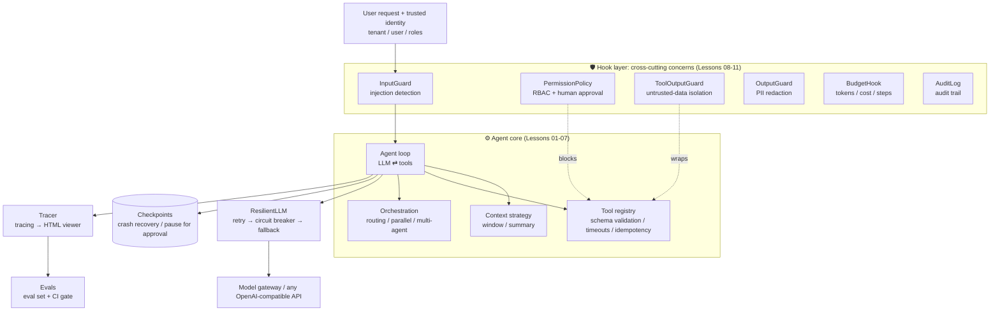

<div align="center">

# 👋 Hello Agent System

### Design production-grade AI agent systems, from first principles

**From "I can call an LLM API" to "I can design production-grade agent systems": 32 lessons · bilingual (English / 中文) · every lesson has a tested exercise.**
No agent framework. You build every layer of an enterprise agent yourself: tools, context, architectures, orchestration, reliability, security, observability, evals, concurrency, cost, and release engineering — then retrieval, memory, MCP, data, eval methodology, optimization, coding agents, and proactive agents — and finally an async runtime plus mature components (Postgres, Redis, Temporal, OpenTelemetry, LiteLLM, Cedar) to take it to production for real.

[](https://github.com/heaven999b/hello-agent-system/actions/workflows/ci.yml)


[](CONTRIBUTING.en.md)


This project's architecture was co-designed with **Claude Opus 5.5**

[中文](README.md) · **English**

[Quick start](#-quick-start) · [Curriculum](#-curriculum) · [Capstone](capstone/README.en.md) · [Failure-mode catalog](docs/failure-modes.en.md) · [Interview questions](docs/interview-questions.en.md)

</div>

---

## 🤔 Why this project?

A working agent loop is 20 lines of code. Put it in front of thousands of employees and the real questions show up:

> The model API returns 429, or goes down entirely. An agent loops all night and burns $2,000. Someone hides "ignore previous instructions" in a document and the agent resets an admin password. Company A's data shows up in Company B's answer. You change one line of the prompt and can't tell what else you broke. The process restarts halfway through a run and the agent files the same ticket twice.

**Those questions decide whether an agent can ship. Most tutorials stop at the 20 lines. This one starts there.**

| | Typical agent tutorial | This project |
|---|---|---|
| Goal | Get an agent running | Keep an agent running **reliably, safely, and under control in production** |
| Approach | Call a framework API (black box) | **Build every layer from scratch** (~2,500 lines of core code you can read in one sitting) |
| Coverage | Loop + tools | LLM essentials, the loop, tools, context, agent architectures, orchestration, an **engineering-perspectives map**; retries / circuit breakers / fallbacks, checkpoints, prompt-injection defense, RBAC, human approval, audit, tracing, evals; high concurrency and distributed execution, cost optimization, permission-aware RAG, progressive rollout and incident response; retrieval quality, memory systems, MCP and sandboxes, mainstream frameworks, agent data, eval methodology, prompt optimization and test-time compute, coding agents, proactive agents; **an async high-concurrency runtime, production adapters for Postgres/Redis/Temporal/OpenTelemetry/LiteLLM/Cedar, and a multi-worker reference service with load and failure-injection tests** |
| Teaching style | One way to do it | Enterprise problem cards: **every problem compares 2–5 solutions** and explains how to choose |
| Verification | "Looks like it works" | Every lesson has an **exercise with automated tests**: offline, deterministic, free |
| Models | Locked to one vendor | Any OpenAI-compatible endpoint (OpenAI, DeepSeek, Qwen, vLLM, any model gateway) |
| Language | Single language | **Bilingual**: every lecture and reference doc has an equivalent English version (`*.en.md`) |

## ⚖️ Teaching framework vs. production path

The project has four layers of code with different purposes. **Do not deploy the teaching layer to production as-is**:

| Layer | What it is | Good for | Limits (honestly) |
|---|---|---|---|
| `agentkit/` core | Synchronous, single-process, zero-dependency teaching framework (~2,500 lines) | Understanding every mechanism; exercises and tests | One session per process at a time; thread timeouts can't kill the thread; checkpoints, idempotency, and rate limits live in memory or local files; injection detection and PII redaction are regex-based |
| [`agentkit/aio/`](agentkit/aio/) | Production async runtime `AsyncAgent` | Hundreds to thousands of concurrent sessions per process | Verified by measurement in Lesson 30; in-process bulkheads and rate limits must move to Redis or a gateway once you run multiple instances |
| [`agentkit/contrib/`](agentkit/contrib/) | Adapters for mature components: Postgres, Redis, Temporal, OpenTelemetry, LiteLLM, Cedar, guardrail classifiers | Multi-instance, multi-worker deployments | Tested for real against embedded Postgres, fakeredis, and the Temporal dev server; failover, cluster sharding, and multi-region were not tested |
| [`production/`](production/) | A reference service tying it all together: API, workers, load test, failure injection, docker-compose, Kubernetes | A blueprint for your own service | A reference implementation, not a hosted product; deployment configs were not started with Docker on the author's machine |

For each module — limits → production replacement → migration steps → pitfalls — see the [📋 production readiness guide](docs/production-readiness.en.md).

## 🗺 What you will build



Assembling an enterprise agent with `agentkit` looks like this. Every argument is a lesson:

```python
from agentkit import *

agent = Agent(
    llm=ResilientLLM(default_llm(), fallbacks=[default_llm("backup-model")]),  # Lesson 08: retry / breaker / fallback
    tools=[search_kb, create_ticket, reset_password],                           # Lesson 03: tool design
    system_prompt="You are the IT help desk assistant. " + UNTRUSTED_DATA_RULE, # Lesson 09: untrusted-data rule
    hooks=[
        InputGuard(),                                                           # Lesson 09: input screening
        PermissionPolicy(role_tools={"employee": {"search_kb", "create_ticket"},
                                     "it_admin": {"*"}}),                       # Lesson 09: RBAC + approval for dangerous tools
        ToolOutputGuard(), OutputGuard(),                                       # Lesson 09: isolation + redaction
        BudgetHook(max_cost_usd=0.10, max_tool_calls=20),                       # Lesson 08: budgets
        AuditLog("runs/audit.jsonl"),                                           # Lesson 09: audit log
    ],
    context_strategy=SlidingWindow(max_tokens=8000),                            # Lesson 04: context engineering
    checkpointer=FileCheckpointer("runs/"),                                     # Lesson 08: checkpoints
    idempotency_store=IdempotencyStore(),                                       # Lesson 08: idempotency
    tracer=Tracer(jsonl_exporter("runs/traces.jsonl")),                         # Lesson 10: tracing
)

result = agent.run("reset my password", metadata={"tenant_id": "acme", "user_id": "alice", "roles": ["employee"]})
if result.status == "paused":          # dangerous tool → pause for human approval (hours later, another process)
    result = agent.approve(result.run_id, approved=True, by="it_oncall")
print(render_tree(result.trace))       # see every step the agent took
```

A real run (`python -m agentkit.chat`, where the model calls two tools in parallel in one turn):

```text
agent.run  6231ms  tokens=973→106  status=completed steps=2 cost=$0.00228
├─ llm.chat  2681ms  tokens=440→52  → tool_calls: current_time, calculator
├─ tool.current_time  3ms  ok
├─ tool.calculator  1ms  ok
└─ llm.chat  3534ms  tokens=533→54  → final_answer
```

To go to production, swap in the async runtime and mature components — **same interfaces** (this code was run end to end against embedded Postgres, fakeredis, and a real model):

```python
from agentkit.aio import AsyncAgent, AsyncResilientLLM, KeyedLimiter
from agentkit.contrib.gateway import AsyncLiteLLMRouterLLM
from agentkit.contrib.postgres import AsyncPostgresCheckpointer
from agentkit.contrib.redis_store import AsyncRedisIdempotencyStore, AsyncRedisTokenBucket, AsyncRateLimitHook
from agentkit.contrib.otel import OTelTracer, PrometheusHook, setup_tracing
from agentkit.contrib.policy import CedarPolicy

checkpointer = AsyncPostgresCheckpointer(dsn)
await checkpointer.setup()
agent = AsyncAgent(
    AsyncResilientLLM(AsyncLiteLLMRouterLLM.from_env(), max_concurrency=20),  # gateway routing + fallback; in-process concurrency cap
    tools,
    hooks=[
        CedarPolicy("policies.cedar", tools=tools),                                   # policy as code (Lesson 29)
        AsyncRateLimitHook(AsyncRedisTokenBucket(redis, rate_per_sec=5, capacity=10)),  # cross-instance per-tenant rate limit (Lesson 26)
        PrometheusHook(),                                                             # metrics (Lesson 28)
    ],
    checkpointer=checkpointer,                             # shared, CAS-protected checkpoints (Lesson 26)
    idempotency_store=AsyncRedisIdempotencyStore(redis),   # cross-process idempotency (Lesson 26)
    tracer=OTelTracer(setup_tracing("itbuddy")),           # OpenTelemetry with GenAI semantic conventions (Lesson 28)
    limiter=KeyedLimiter(per_key=5, global_limit=200),     # at most 5 concurrent runs per tenant (Lesson 30)
    run_timeout=120,
)
result = await agent.run("How do I connect to the VPN?", metadata={"tenant_id": "acme", "user_id": "alice", "roles": ["employee"]})
```

## 🚀 Quick start

```bash
git clone https://github.com/heaven999b/hello-agent-system.git
cd hello-agent-system
make setup          # creates .venv; the only dependencies are openai and pydantic
```

Edit `.env` and point it at any OpenAI-compatible endpoint:

```bash
LLM_BASE_URL=https://api.openai.com/v1     # or DeepSeek / Qwen / local vLLM / a model gateway
LLM_API_KEY=sk-xxx
LLM_MODEL=gpt-4o-mini                       # must support function calling
```

```bash
make check-env                                  # checks connectivity and tool-calling support
.venv/bin/python lessons/00_overview/demo.py    # a preview of what you are about to build
```

> 💡 **No API key?** Every demo accepts `--offline` (it runs on the scripted model `ScriptedLLM`), and every exercise and test runs offline. You can finish the whole course for free.

## 📚 Curriculum

The course has four parts. **Part 1 teaches you how to build an agent. Part 2 teaches you which solution to pick when an enterprise problem shows up. Part 3 teaches you how to make an agent keep getting better. Part 4 teaches you how to run it in production on mature components.** Parts 1–2 plus the capstone take about 5.5 hours (the main track); Part 3 (~3.5 hours) and Part 4 (~3 hours) are the advanced tracks. If you are short on time, take the [4-hour fast track](lessons/00_overview/README.en.md) (read only the "core path" at the top of each lesson).

- **Part 1**: concept → build it from scratch → exercise. It ends with Lesson 07, the **engineering-perspectives map**: 20 engineering dimensions, each split into **universal checks** (every project needs them) and **situational triggers** ("when X, consider Y"). It is your map for Part 2.
- **Part 2**: every lesson is a set of **enterprise problem cards**. Each card gives a concrete scenario with real numbers, explains why the obvious fix breaks, compares 2–5 solutions (pros, cons, and the scale where each fits), says how to choose, and then shows code.
- **Part 3**: deeper building blocks (retrieval, memory, MCP, frameworks), the ML loop that keeps an agent improving (data → evaluation → optimization), and the application frontier: coding agents and proactive agents.
- **Part 4**: replace the teaching implementations with mature components, **keeping the same interfaces**. Every lesson covers why the teaching version falls short → component options compared → how the adapter plugs in → operations and pitfalls, and proves it with real processes, real concurrency, and failure injection.

Every lesson follows the same loop: **read the notes → run the demo → write the exercise → `make lesson N=xx` until the tests pass → go through the self-check list**. Each lesson opens with one 📖 primary reading.

### Part 1 — Building blocks (~140 min)

| # | Lesson | Time | What you learn / build | Core source |
|---|---|---|---|---|
| 00 | [The big picture](lessons/00_overview/README.en.md) | 10m | When to use an agent and when not to; what enterprise-grade adds on top of a demo | — |
| 01 | [**LLM essentials for agent developers**](lessons/01_llm_essentials/README.en.md) | 20m | Tokens and pricing, non-determinism, how function calling really works, structured output, **reassembling streamed tool-call arguments**, reasoning models, prompt engineering | [llm.py](agentkit/llm.py) |
| 02 | [The agent loop](lessons/02_agent_loop/README.en.md) | 20m | Write the agent loop by hand; message protocol, stop conditions, hook middleware | [agent.py](agentkit/agent.py) |
| 03 | [Tool design](lessons/03_tools/README.en.md) | 20m | Production-grade tools: schemas, validation, identity injection, business errors | [tools.py](agentkit/tools.py) |
| 04 | [Context engineering & memory](lessons/04_context_memory/README.en.md) | 15m | Safe truncation, summarization, clearing tool results, isolated long-term memory | [context.py](agentkit/context.py) · [memory.py](agentkit/memory.py) |
| 05 | [**Common agent architectures**](lessons/05_agent_architectures/README.en.md) | 20m | ReAct / Plan-and-Execute / ReWOO / Reflection / CodeAct, 5 multi-agent topologies, teardown of deep-research and coding agents | [workflows.py](agentkit/workflows.py) |
| 06 | [Orchestration: workflows & multi-agent](lessons/06_orchestration/README.en.md) | 15m | Routing, parallelization, orchestrator-workers, evaluator-optimizer, agents as tools | [workflows.py](agentkit/workflows.py) |
| 07 | [**Engineering perspectives**](lessons/07_engineering_perspectives/README.en.md) | 20m | 20 dimensions × universal checks / situational triggers (301 items), a 9-scenario priority matrix, how to run a design review | [perspectives.py](lessons/07_engineering_perspectives/perspectives.py) |

### Part 2 — Enterprise problems & solutions (~160 min)

| # | Lesson | Time | Typical problems (each with several solutions compared) | You build |
|---|---|---|---|---|
| 08 | [Reliability engineering](lessons/08_reliability/README.en.md) | 20m | Model 429s and outages, runaway loops, crashes mid-run, approvals that take hours | Loop detection, retry budgets |
| 09 | [Security & governance](lessons/09_security/README.en.md) | 20m | Indirect prompt injection, over-privileged access, approval fatigue, PII leaks, code execution | Policy engine, redaction, lethal-trifecta detection |
| 10 | [Observability](lessons/10_observability/README.en.md) | 15m | Trace volume, PII in traces, alert noise | SLO metrics computed from traces |
| 11 | [Eval-driven development](lessons/11_evals/README.en.md) | 20m | No labeled data, unreliable LLM judges, expensive evals | pass^k, trajectory grading, release gates |
| 12 | [Production architecture](lessons/12_production_architecture/README.en.md) | 15m | Sync vs streaming vs async, tenant isolation levels, build vs buy | Multi-tenant rate limiting, model routing |
| 13 | [**High concurrency & distributed execution**](lessons/13_distributed_concurrency/README.en.md) | 25m | Horizontal scaling, delivery semantics, concurrent session writes (distributed lock vs CAS vs partitioning), global rate limits and backpressure, sagas, retry storms | A SQLite lease queue + fencing tokens + CAS, with real multi-process concurrency |
| 14 | [Cost & latency](lessons/14_cost_latency/README.en.md) | 15m | Runaway bills, duplicate requests, tail latency, cost attribution | Caching, model cascades, hedged requests |
| 15 | [Permission-aware enterprise RAG](lessons/15_enterprise_rag/README.en.md) | 15m | ACL leaks, multi-tenant index isolation, stale knowledge, fabricated citations | ACL pre-filtered search, chunking, citation checks |
| 16 | [Release & operations](lessons/16_release_ops/README.en.md) | 15m | A prompt change causes an incident, silent model drift, how to stop the bleeding and roll back | Canary bucketing, automated rollback decisions, kill switch |

### Part 3 — Advanced: deeper building blocks, the ML loop, and the frontier (~210 min)

| # | Lesson | Time | What you learn / build |
|---|---|---|---|
| 17 | [Retrieval quality: vectors, hybrid search, reranking](lessons/17_retrieval_quality/README.en.md) | 20m | A teaching embedding, BM25, RRF fusion, LLM reranking, Recall@k / MRR / nDCG, compared step by step on a labeled eval set |
| 18 | [Advanced memory systems: from notebooks to MemGPT / Mem0](lessons/18_memory_systems/README.en.md) | 20m | ADD / UPDATE / DELETE memory writes, three-factor retrieval scoring, MemGPT-style tiered memory, consolidation |
| 19 | [MCP and code-execution sandboxes](lessons/19_mcp_and_sandbox/README.en.md) | 25m | **A hand-written MCP server and client** (both spec generations, interoperable with the official SDK), a process-level sandbox |
| 20 | [From agentkit to frameworks](lessons/20_frameworks_bridge/README.en.md) | 25m | One task implemented in DSPy / LangGraph / the OpenAI Agents SDK side by side; a mini StateGraph |
| 21 | [Agent data](lessons/21_agent_data/README.en.md) | 25m | Trace mining, dedup and clustering, stratified sampling, synthetic data and filtering, Cohen's kappa, leak-free splits |
| 22 | [Advanced eval methodology](lessons/22_eval_methodology/README.en.md) | 25m | Benchmark design checklists, position-debiased pairwise judging, confidence intervals and paired tests |
| 23 | [Optimization: prompts, test-time compute, and when to fine-tune](lessons/23_optimization/README.en.md) | 25m | OPRO-style instruction search, BootstrapFewShot, GEPA-style reflective mutation, best-of-N, Pareto fronts |
| 24 | [Coding agents and long-running harnesses](lessons/24_coding_agents/README.en.md) | 25m | **Build a coding agent that fixes bugs**: ACI tools, test protection, diff review, cross-session handoff |
| 25 | [Proactive agents and the frontier](lessons/25_proactive_and_frontier/README.en.md) | 20m | User models, a when-to-interrupt decider, frontier directions and open problems, a course recap |

### Part 4 — Production on mature components (~175 min)

| # | Lesson | Time | What you learn / verify yourself | Core source |
|---|---|---|---|---|
| 26 | [State, queues, and distributed coordination: Postgres and Redis](lessons/26_state_and_queues/README.en.md) | 30m | CAS checkpoints with fence takeover, a `SKIP LOCKED` job queue, async workers with backpressure, Redis idempotency / Lua token bucket / fenced locks; zero duplicate side effects under multi-process kill -9 | [postgres.py](agentkit/contrib/postgres.py) · [redis_store.py](agentkit/contrib/redis_store.py) |
| 27 | [Durable workflows: running agents on Temporal](lessons/27_durable_workflows/README.en.md) | 30m | Activity retries, Signal/Update approvals, continue-as-new, determinism and versioning; a new worker takes over after kill -9 | [temporal.py](agentkit/contrib/temporal.py) |
| 28 | [Production observability: OpenTelemetry, Prometheus, and LLM observability platforms](lessons/28_production_observability/README.en.md) | 25m | GenAI semantic conventions, trace propagation across queues, tail sampling and redaction, burn-rate alerts, a Grafana dashboard; no cross-talk across 50 concurrent runs | [otel.py](agentkit/contrib/otel.py) |
| 29 | [Model gateways, policy as code, and guardrail services](lessons/29_gateway_and_guardrails/README.en.md) | 30m | LiteLLM routing and fallback, Cedar policies (fail closed), cascaded guardrail classifiers (precision 0.42 → 0.92) | [gateway.py](agentkit/contrib/gateway.py) · [policy.py](agentkit/contrib/policy.py) · [guards.py](agentkit/contrib/guards.py) |
| 30 | [**Async runtime and high-concurrency serving**](lessons/30_async_runtime/README.en.md) | 30m | 200 sessions: sync serial 83 s → AsyncAgent 0.45 s; real cancellation, hard timeouts, bulkheads, streaming; concurrency bugs found by measurement and fixed | [agentkit/aio/](agentkit/aio/) |
| 31 | [Deployment and scaling: from one machine to a cluster](lessons/31_deployment_and_scaling/README.en.md) | 30m | API/worker split, queue-depth autoscaling, graceful-shutdown timelines, load tests and failure injection | [production/](production/) |

### 🎓 Capstone (30 min)

[**ITBuddy, an enterprise IT help-desk agent**](capstone/README.en.md) puts everything together into one working system: a CLI, an HTTP API with asynchronous approvals, a realistic design doc with a threat model and ADRs, 24 eval cases (10 of them security cases), a component ablation study, and a [report template](capstone/REPORT_TEMPLATE.en.md) for your own project (baselines, ablations, and error analysis required).

Check your progress:

```bash
.venv/bin/python scripts/progress.py
```

## 🎓 Studying alongside Stanford CS329Z

Stanford's Fall 2026 course [CS 329Z: Engineering AI Agents](https://cs329z.stanford.edu/) is about engineering agentic systems. The table maps each weekly topic on its public schedule to the matching lessons here, so you can study the two side by side:

| CS329Z week & topic | Matching lessons here |
|---|---|
| W1 Foundations & Landscape · Agentic Systems Spectrum | [00 The big picture](lessons/00_overview/README.en.md) |
| W2 LLMs for Builders | [01 LLM essentials](lessons/01_llm_essentials/README.en.md) (incl. constrained generation and decoding) |
| W2 Building Blocks: Retrieval-Augmented Generation | [04](lessons/04_context_memory/README.en.md) · [15 Permission-aware RAG](lessons/15_enterprise_rag/README.en.md) · [17 Retrieval quality](lessons/17_retrieval_quality/README.en.md) |
| W3 Tool Use & Function Calling | [03 Tool design](lessons/03_tools/README.en.md) · [19 MCP and sandboxes](lessons/19_mcp_and_sandbox/README.en.md) |
| W3 Frameworks & Agent Design | [02 The agent loop](lessons/02_agent_loop/README.en.md) · [20 From agentkit to frameworks](lessons/20_frameworks_bridge/README.en.md) |
| W4 Agent Design Patterns & Scaffolds | [05 Agent architectures](lessons/05_agent_architectures/README.en.md) · [06 Orchestration](lessons/06_orchestration/README.en.md) |
| W4–W5 Memory & Multi-Agent Systems | [18 Advanced memory](lessons/18_memory_systems/README.en.md) · [06 Orchestration](lessons/06_orchestration/README.en.md) (incl. why multi-agent systems fail) |
| W5 Optimization | [23 Optimization](lessons/23_optimization/README.en.md) |
| W6–W7 Data for Agentic Systems · Data Selection & Quality | [21 Agent data](lessons/21_agent_data/README.en.md) |
| W7 Evaluation Fundamentals & Benchmark Design | [11 Eval-driven development](lessons/11_evals/README.en.md) · [22 Advanced eval methodology](lessons/22_eval_methodology/README.en.md) |
| W8 LLM-as-Judge & Evaluation Infrastructure | [11](lessons/11_evals/README.en.md) · [21](lessons/21_agent_data/README.en.md) · [22](lessons/22_eval_methodology/README.en.md) |
| W8 Agent Safety & Guardrails | [09 Security & governance](lessons/09_security/README.en.md) (incl. privacy and red teaming) |
| W9 Coding Agents & Software Agents | [24 Coding agents](lessons/24_coding_agents/README.en.md) |
| W11 Proactive Agents · Open Problems | [25 Proactive agents and the frontier](lessons/25_proactive_and_frontier/README.en.md) |
| Project: baselines, ablations, error analysis, reproducibility | [Capstone](capstone/README.en.md) · [report template](capstone/REPORT_TEMPLATE.en.md) |

In the other direction, this project **leans harder into running agents in enterprise production**, so it complements CS329Z: [08 Reliability](lessons/08_reliability/README.en.md), [10 Observability](lessons/10_observability/README.en.md), [12 Production architecture](lessons/12_production_architecture/README.en.md), [13 Distributed execution](lessons/13_distributed_concurrency/README.en.md), [14 Cost](lessons/14_cost_latency/README.en.md), [16 Release ops](lessons/16_release_ops/README.en.md), all of Part 4 ([26](lessons/26_state_and_queues/README.en.md)–[31](lessons/31_deployment_and_scaling/README.en.md): Postgres/Redis, Temporal, OpenTelemetry, gateways and policy, async runtime, deployment and scaling), plus multi-tenancy, permissions, and auditing throughout.

Other Stanford agent courses: [CS 329A: Self-Improving AI Agents](https://cs329a.stanford.edu/) (research-oriented) and CS 222: AI Agents and Simulations.

> Note: this project is **not affiliated** with Stanford University or the teams behind these courses. The mapping is based on the public CS329Z course page (Fall 2026); check the official site for changes.

## 🧰 Reference docs (your handbook after the course)

| Doc | What's inside |
|---|---|
| [🩺 Failure-mode catalog](docs/failure-modes.en.md) | 79 failure modes seen in production: symptom → root cause → detection → fix |
| [✅ Design review checklist](docs/design-review-checklist.en.md) | 199 pre-launch checks, graded P0 / P1 / P2 |
| [🎤 System-design interview questions](docs/interview-questions.en.md) | 76 questions + 3 fully worked system-design answers |
| [🔁 Framework comparison](docs/framework-comparison.en.md) | agentkit concepts ↔ LangGraph / OpenAI Agents SDK / Claude Agent SDK / ADK … |
| [📄 Cheatsheet](docs/cheatsheet.en.md) | Principles, default parameters, decision trees; printable |
| [📖 Glossary](docs/glossary.en.md) | 246 terms, English ↔ Chinese, explained in plain words |
| [📋 Production readiness guide](docs/production-readiness.en.md) | What each teaching module lacks for production, what to replace it with, how to migrate, plus a P0 pre-launch list |
| [📚 Reading list](docs/reading-list.en.md) | 135 curated and verified papers, posts, and specs, with reading paths by role |

## 🧱 Repository layout

```text
hello-agent-system/
├── agentkit/            # the teaching framework: ~2,500 lines of core code; one module per lesson; comments explain every "why"
│   ├── agent.py         #   the loop + hooks + checkpoints + tracing
│   ├── tools.py         #   tools: schema generation, validation, timeouts, idempotency, identity injection
│   ├── context.py       #   context-window strategies
│   ├── memory.py        #   long-term memory (tenant-isolated)
│   ├── workflows.py     #   5 orchestration patterns + multi-agent
│   ├── reliability.py   #   retry / circuit breaker / fallback
│   ├── guardrails.py    #   injection detection / data isolation / redaction
│   ├── permissions.py   #   RBAC + human approval
│   ├── tracing.py       #   tracing (OpenTelemetry GenAI style)
│   ├── viewer.py        #   self-contained HTML trace viewer
│   ├── evals.py         #   eval framework
│   ├── aio/             #   production async runtime: AsyncAgent, streaming, cancellation, bulkheads, async retry/breaker (Lesson 30)
│   └── contrib/         #   mature-component adapters: postgres / redis_store / temporal / otel / gateway / policy / guards (Lessons 26–29)
├── lessons/NN_topic/    # 32 lessons: README.md + README.en.md / demo.py / exercise.py / solution.py / test_exercise.py
├── capstone/            # ITBuddy (CLI + HTTP API + design doc + eval set)
├── production/          # production reference service: API + multiple workers + load test + failure injection + docker-compose / Kubernetes (Lesson 31)
├── docs/                # reference docs (bilingual)
├── scripts/             # progress board, link checker
└── tests/               # framework tests (all offline)
```

## 💡 Design principles

1. **No magic**: no agent framework. Messages are plain OpenAI-format dicts, so you can see every byte sent to the model.
2. **Production patterns, teaching-sized code**: checkpoints, idempotency keys, circuit breakers, RBAC, audit logs — the patterns are the ones real enterprise systems use, but each implementation is short enough to read in one go.
3. **Testability first**: `ScriptedLLM` makes agent tests as deterministic, offline, and free as ordinary unit tests.
4. **Vendor-neutral**: application code depends only on a single `LLM.chat()` interface, so you can swap models at any time.
5. **Transferable**: the [framework comparison](docs/framework-comparison.en.md) maps every concept to its name in LangGraph, the OpenAI Agents SDK, and others.

## ❓ FAQ

<details>
<summary><b>Why not just learn LangChain / LangGraph?</b></summary>

Frameworks change; the principles don't. Once you have built checkpoints, approval interrupts, and tool validation yourself, every framework becomes "oh, that's what they call it here." The reverse doesn't hold: people who only know a framework get stuck the moment production hits something the framework doesn't cover. After this course, the [framework comparison](docs/framework-comparison.en.md) will get you productive in any mainstream framework within an hour.
</details>

<details>
<summary><b>What background do I need?</b></summary>

You should be able to read Python functions and classes, and you should have called an LLM API at least once. The code deliberately avoids advanced tricks (no async, no metaprogramming). Lectures and docs are bilingual; code comments and demo output are currently in Chinese (contributions to internationalize them are welcome).
</details>

<details>
<summary><b>Which models are supported?</b></summary>

Any OpenAI-compatible endpoint that supports function calling. The author developed and validated the course against gpt-5.5 through a local cliproxyapi gateway.
</details>

<details>
<summary><b>Can I use agentkit in production?</b></summary>

Not the `agentkit` core: it is a synchronous, single-process, in-memory teaching implementation meant to make every mechanism readable. The production path is `agentkit.aio` (async runtime) + `agentkit.contrib` (Postgres, Redis, Temporal, OpenTelemetry, LiteLLM, Cedar adapters) + `production/` (reference service), with the same interfaces as the teaching version. They are tested with real concurrency, real processes, and failure injection, but they are still reference implementations, not a hosted product. What is done and what you still need to add is listed item by item in the [production readiness guide](docs/production-readiness.en.md).
</details>

## 🤝 Contributing

Found a mistake? Want to add a lesson or improve a translation? Please do! See [CONTRIBUTING.en.md](CONTRIBUTING.en.md), the [lesson template](docs/lesson-template.en.md), and the [translation guide](docs/translation-guide.md).

If this project helps you, a ⭐ helps others find it.

## 📜 License

[MIT](LICENSE)

[](https://star-history.com/#heaven999b/hello-agent-system&Date)
