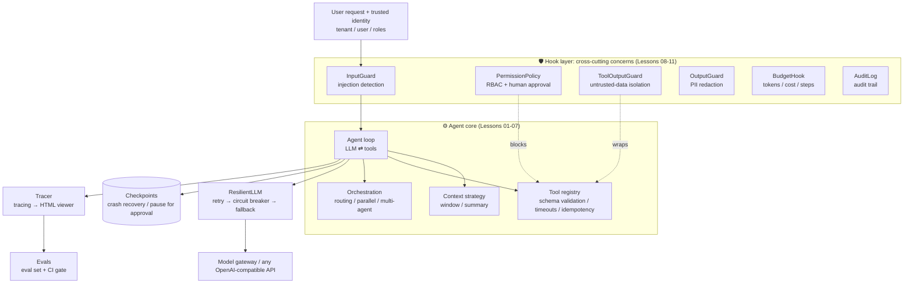

<div align="center">

# 👋 Hello Agent System

### Design production-grade AI agent systems, from first principles

**From "I can call an LLM API" to "I can design production-grade agent systems": 17 lessons · bilingual (English / 中文) · every lesson has a tested exercise.**
No agent framework. You build every layer of an enterprise agent yourself: tools, context, architectures, orchestration, reliability, security, observability, evals, concurrency, cost, and release engineering.

[](https://github.com/heaven999b/hello-agent-system/actions/workflows/ci.yml)


[](CONTRIBUTING.en.md)

[中文](README.md) · **English**

[Quick start](#-quick-start) · [Curriculum](#-curriculum) · [Capstone](capstone/README.en.md) · [Failure-mode catalog](docs/failure-modes.en.md) · [Interview questions](docs/interview-questions.en.md)

</div>

---

## 🤔 Why this project?

A working agent loop is 20 lines of code. Put it in front of thousands of employees and the real questions show up:

> The model API returns 429, or goes down entirely. An agent loops all night and burns $2,000. Someone hides "ignore previous instructions" in a document and the agent resets an admin password. Company A's data shows up in Company B's answer. You change one line of the prompt and can't tell what else you broke. The process restarts halfway through a run and the agent files the same ticket twice.

**Those questions decide whether an agent can ship. Most tutorials stop at the 20 lines. This one starts there.**

| | Typical agent tutorial | This project |
|---|---|---|
| Goal | Get an agent running | Keep an agent running **reliably, safely, and under control in production** |
| Approach | Call a framework API (black box) | **Build every layer from scratch** (~2,500 lines of core code you can read in one sitting) |
| Coverage | Loop + tools | LLM essentials, the loop, tools, context, agent architectures, orchestration, an **engineering-perspectives map**; retries / circuit breakers / fallbacks, checkpoints, prompt-injection defense, RBAC, human approval, audit, tracing, evals; high concurrency and distributed execution, cost optimization, permission-aware RAG, progressive rollout and incident response |
| Teaching style | One way to do it | Enterprise problem cards: **every problem compares 2–5 solutions** and explains how to choose |
| Verification | "Looks like it works" | Every lesson has an **exercise with automated tests**: offline, deterministic, free |
| Models | Locked to one vendor | Any OpenAI-compatible endpoint (OpenAI, DeepSeek, Qwen, vLLM, any model gateway) |
| Language | Single language | **Bilingual**: every lecture and reference doc has an equivalent English version (`*.en.md`) |

## 🗺 What you will build



Assembling an enterprise agent with `agentkit` looks like this. Every argument is a lesson:

```python
from agentkit import *

agent = Agent(
    llm=ResilientLLM(default_llm(), fallbacks=[default_llm("backup-model")]),  # Lesson 08: retry / breaker / fallback
    tools=[search_kb, create_ticket, reset_password],                           # Lesson 03: tool design
    system_prompt="You are the IT help desk assistant. " + UNTRUSTED_DATA_RULE, # Lesson 09: untrusted-data rule
    hooks=[
        InputGuard(),                                                           # Lesson 09: input screening
        PermissionPolicy(role_tools={"employee": {"search_kb", "create_ticket"},
                                     "it_admin": {"*"}}),                       # Lesson 09: RBAC + approval for dangerous tools
        ToolOutputGuard(), OutputGuard(),                                       # Lesson 09: isolation + redaction
        BudgetHook(max_cost_usd=0.10, max_tool_calls=20),                       # Lesson 08: budgets
        AuditLog("runs/audit.jsonl"),                                           # Lesson 09: audit log
    ],
    context_strategy=SlidingWindow(max_tokens=8000),                            # Lesson 04: context engineering
    checkpointer=FileCheckpointer("runs/"),                                     # Lesson 08: checkpoints
    idempotency_store=IdempotencyStore(),                                       # Lesson 08: idempotency
    tracer=Tracer(jsonl_exporter("runs/traces.jsonl")),                         # Lesson 10: tracing
)

result = agent.run("reset my password", metadata={"tenant_id": "acme", "user_id": "alice", "roles": ["employee"]})
if result.status == "paused":          # dangerous tool → pause for human approval (hours later, another process)
    result = agent.approve(result.run_id, approved=True, by="it_oncall")
print(render_tree(result.trace))       # see every step the agent took
```

A real run (`python -m agentkit.chat`, where the model calls two tools in parallel in one turn):

```text
agent.run  6231ms  tokens=973→106  status=completed steps=2 cost=$0.00228
├─ llm.chat  2681ms  tokens=440→52  → tool_calls: current_time, calculator
├─ tool.current_time  3ms  ok
├─ tool.calculator  1ms  ok
└─ llm.chat  3534ms  tokens=533→54  → final_answer
```

## 🚀 Quick start

```bash
git clone https://github.com/heaven999b/hello-agent-system.git
cd hello-agent-system
make setup          # creates .venv; the only dependencies are openai and pydantic
```

Edit `.env` and point it at any OpenAI-compatible endpoint:

```bash
LLM_BASE_URL=https://api.openai.com/v1     # or DeepSeek / Qwen / local vLLM / a model gateway
LLM_API_KEY=sk-xxx
LLM_MODEL=gpt-4o-mini                       # must support function calling
```

```bash
make check-env                                  # checks connectivity and tool-calling support
.venv/bin/python lessons/00_overview/demo.py    # a preview of what you are about to build
```

> 💡 **No API key?** Every demo accepts `--offline` (it runs on the scripted model `ScriptedLLM`), and every exercise and test runs offline. You can finish the whole course for free.

## 📚 Curriculum

The course has two parts. **Part 1 teaches you how to build an agent. Part 2 teaches you which solution to pick when an enterprise problem shows up.** The full course takes about 5.5 hours; if you are short on time, take the [4-hour fast track](lessons/00_overview/README.en.md) (read only the "core path" at the top of each lesson).

- **Part 1**: concept → build it from scratch → exercise. It ends with Lesson 07, the **engineering-perspectives map**: 20 engineering dimensions, each split into **universal checks** (every project needs them) and **situational triggers** ("when X, consider Y"). It is your map for Part 2.
- **Part 2**: every lesson is a set of **enterprise problem cards**. Each card gives a concrete scenario with real numbers, explains why the obvious fix breaks, compares 2–5 solutions (pros, cons, and the scale where each fits), says how to choose, and then shows code.

Every lesson follows the same loop: **read the notes → run the demo → write the exercise → `make lesson N=xx` until the tests pass → go through the self-check list**.

### Part 1 — Building blocks (~140 min)

| # | Lesson | Time | What you learn / build | Core source |
|---|---|---|---|---|
| 00 | [The big picture](lessons/00_overview/README.en.md) | 10m | When to use an agent and when not to; what enterprise-grade adds on top of a demo | — |
| 01 | [**LLM essentials for agent developers**](lessons/01_llm_essentials/README.en.md) | 20m | Tokens and pricing, non-determinism, how function calling really works, structured output, **reassembling streamed tool-call arguments**, reasoning models, prompt engineering | [llm.py](agentkit/llm.py) |
| 02 | [The agent loop](lessons/02_agent_loop/README.en.md) | 20m | Write the agent loop by hand; message protocol, stop conditions, hook middleware | [agent.py](agentkit/agent.py) |
| 03 | [Tool design](lessons/03_tools/README.en.md) | 20m | Production-grade tools: schemas, validation, identity injection, business errors | [tools.py](agentkit/tools.py) |
| 04 | [Context engineering & memory](lessons/04_context_memory/README.en.md) | 15m | Safe truncation, summarization, clearing tool results, isolated long-term memory | [context.py](agentkit/context.py) · [memory.py](agentkit/memory.py) |
| 05 | [**Common agent architectures**](lessons/05_agent_architectures/README.en.md) | 20m | ReAct / Plan-and-Execute / ReWOO / Reflection / CodeAct, 5 multi-agent topologies, teardown of deep-research and coding agents | [workflows.py](agentkit/workflows.py) |
| 06 | [Orchestration: workflows & multi-agent](lessons/06_orchestration/README.en.md) | 15m | Routing, parallelization, orchestrator-workers, evaluator-optimizer, agents as tools | [workflows.py](agentkit/workflows.py) |
| 07 | [**Engineering perspectives**](lessons/07_engineering_perspectives/README.en.md) | 20m | 20 dimensions × universal checks / situational triggers (301 items), a 9-scenario priority matrix, how to run a design review | [perspectives.py](lessons/07_engineering_perspectives/perspectives.py) |

### Part 2 — Enterprise problems & solutions (~160 min)

| # | Lesson | Time | Typical problems (each with several solutions compared) | You build |
|---|---|---|---|---|
| 08 | [Reliability engineering](lessons/08_reliability/README.en.md) | 20m | Model 429s and outages, runaway loops, crashes mid-run, approvals that take hours | Loop detection, retry budgets |
| 09 | [Security & governance](lessons/09_security/README.en.md) | 20m | Indirect prompt injection, over-privileged access, approval fatigue, PII leaks, code execution | Policy engine, redaction, lethal-trifecta detection |
| 10 | [Observability](lessons/10_observability/README.en.md) | 15m | Trace volume, PII in traces, alert noise | SLO metrics computed from traces |
| 11 | [Eval-driven development](lessons/11_evals/README.en.md) | 20m | No labeled data, unreliable LLM judges, expensive evals | pass^k, trajectory grading, release gates |
| 12 | [Production architecture](lessons/12_production_architecture/README.en.md) | 15m | Sync vs streaming vs async, tenant isolation levels, build vs buy | Multi-tenant rate limiting, model routing |
| 13 | [**High concurrency & distributed execution**](lessons/13_distributed_concurrency/README.en.md) | 25m | Horizontal scaling, delivery semantics, concurrent session writes (distributed lock vs CAS vs partitioning), global rate limits and backpressure, sagas, retry storms | A SQLite lease queue + fencing tokens + CAS, with real multi-process concurrency |
| 14 | [Cost & latency](lessons/14_cost_latency/README.en.md) | 15m | Runaway bills, duplicate requests, tail latency, cost attribution | Caching, model cascades, hedged requests |
| 15 | [Permission-aware enterprise RAG](lessons/15_enterprise_rag/README.en.md) | 15m | ACL leaks, multi-tenant index isolation, stale knowledge, fabricated citations | ACL pre-filtered search, chunking, citation checks |
| 16 | [Release & operations](lessons/16_release_ops/README.en.md) | 15m | A prompt change causes an incident, silent model drift, how to stop the bleeding and roll back | Canary bucketing, automated rollback decisions, kill switch |

### 🎓 Capstone (30 min)

[**ITBuddy, an enterprise IT help-desk agent**](capstone/README.en.md) puts everything together into one working system: a CLI, an HTTP API with asynchronous approvals, a realistic design doc with a threat model and ADRs, and 24 eval cases (10 of them security cases).

Check your progress:

```bash
.venv/bin/python scripts/progress.py
```

## 🧰 Reference docs (your handbook after the course)

| Doc | What's inside |
|---|---|
| [🩺 Failure-mode catalog](docs/failure-modes.en.md) | 67 failure modes seen in production: symptom → root cause → detection → fix |
| [✅ Design review checklist](docs/design-review-checklist.en.md) | 163 pre-launch checks, graded P0 / P1 / P2 |
| [🎤 System-design interview questions](docs/interview-questions.en.md) | 61 questions + 3 fully worked system-design answers |
| [🔁 Framework comparison](docs/framework-comparison.en.md) | agentkit concepts ↔ LangGraph / OpenAI Agents SDK / Claude Agent SDK / ADK … |
| [📄 Cheatsheet](docs/cheatsheet.en.md) | Principles, default parameters, decision trees; printable |
| [📖 Glossary](docs/glossary.en.md) | 192 terms, English ↔ Chinese, explained in plain words |
| [📚 Reading list](docs/reading-list.en.md) | 71 curated and verified papers, posts, and specs, with reading paths by role |

## 🧱 Repository layout

```text
hello-agent-system/
├── agentkit/            # the teaching framework: ~2,500 lines of core code; one module per lesson; comments explain every "why"
│   ├── agent.py         #   the loop + hooks + checkpoints + tracing
│   ├── tools.py         #   tools: schema generation, validation, timeouts, idempotency, identity injection
│   ├── context.py       #   context-window strategies
│   ├── memory.py        #   long-term memory (tenant-isolated)
│   ├── workflows.py     #   5 orchestration patterns + multi-agent
│   ├── reliability.py   #   retry / circuit breaker / fallback
│   ├── guardrails.py    #   injection detection / data isolation / redaction
│   ├── permissions.py   #   RBAC + human approval
│   ├── tracing.py       #   tracing (OpenTelemetry GenAI style)
│   ├── viewer.py        #   self-contained HTML trace viewer
│   └── evals.py         #   eval framework
├── lessons/NN_topic/    # 17 lessons: README.md + README.en.md / demo.py / exercise.py / solution.py / test_exercise.py
├── capstone/            # ITBuddy (CLI + HTTP API + design doc + eval set)
├── docs/                # reference docs (bilingual)
├── scripts/             # progress board, link checker
└── tests/               # framework tests (all offline)
```

## 💡 Design principles

1. **No magic**: no agent framework. Messages are plain OpenAI-format dicts, so you can see every byte sent to the model.
2. **Production patterns, teaching-sized code**: checkpoints, idempotency keys, circuit breakers, RBAC, audit logs — the patterns are the ones real enterprise systems use, but each implementation is short enough to read in one go.
3. **Testability first**: `ScriptedLLM` makes agent tests as deterministic, offline, and free as ordinary unit tests.
4. **Vendor-neutral**: application code depends only on a single `LLM.chat()` interface, so you can swap models at any time.
5. **Transferable**: the [framework comparison](docs/framework-comparison.en.md) maps every concept to its name in LangGraph, the OpenAI Agents SDK, and others.

## ❓ FAQ

<details>
<summary><b>Why not just learn LangChain / LangGraph?</b></summary>

Frameworks change; the principles don't. Once you have built checkpoints, approval interrupts, and tool validation yourself, every framework becomes "oh, that's what they call it here." The reverse doesn't hold: people who only know a framework get stuck the moment production hits something the framework doesn't cover. After this course, the [framework comparison](docs/framework-comparison.en.md) will get you productive in any mainstream framework within an hour.
</details>

<details>
<summary><b>What background do I need?</b></summary>

You should be able to read Python functions and classes, and you should have called an LLM API at least once. The code deliberately avoids advanced tricks (no async, no metaprogramming). Lectures and docs are bilingual; code comments and demo output are currently in Chinese (contributions to internationalize them are welcome).
</details>

<details>
<summary><b>Which models are supported?</b></summary>

Any OpenAI-compatible endpoint that supports function calling. The author developed and validated the course against gpt-5.5 through a local cliproxyapi gateway.
</details>

<details>
<summary><b>Can I use agentkit in production?</b></summary>

Its **design patterns** are production-grade, but the implementation is for teaching: synchronous, single-process, in-memory storage. In production, move checkpoints to a database, tracing to OpenTelemetry, and tool execution into a sandbox — Lesson 12 and Lesson 13 cover how.
</details>

## 🤝 Contributing

Found a mistake? Want to add a lesson or improve a translation? Please do! See [CONTRIBUTING.en.md](CONTRIBUTING.en.md), the [lesson template](docs/lesson-template.en.md), and the [translation guide](docs/translation-guide.md).

If this project helps you, a ⭐ helps others find it.

## 🙏 Acknowledgements

This project was initiated and is led by [heaven999b](https://github.com/heaven999b). **Claude Opus 5.5** (Anthropic) took part in designing the course architecture and writing the materials.

## 📜 License

[MIT](LICENSE)

[](https://star-history.com/#heaven999b/hello-agent-system&Date)
