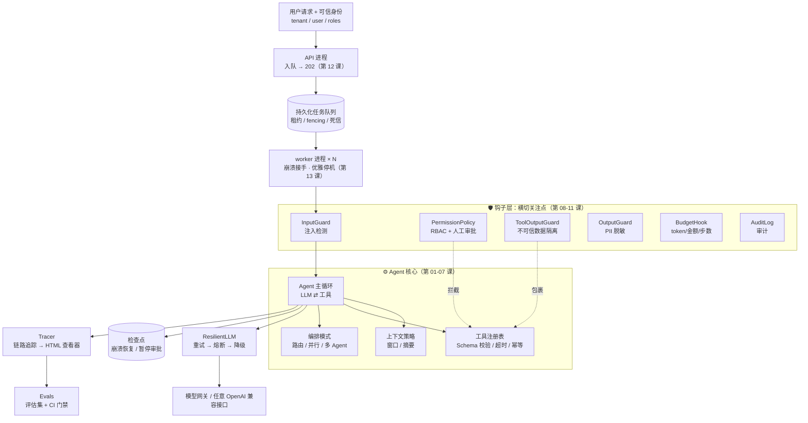

<div align="center">

# 👋 Hello Agent System

### 企业级 Agent 系统设计训练营

**从"会调 LLM API"到"能设计生产级 Agent 系统"：32 节课 · 中英双语 · 每课都有带测试的练习。**
不依赖任何 Agent 框架，从零手写企业级 Agent 的每一层：工具、上下文、架构、编排、可靠性、安全、可观测、评估、并发、成本、发布；再到检索、记忆、MCP、数据、评估方法论、优化、编码 Agent 与主动式 Agent。**从第 02 课起就是 async**（一个进程同时服务成百上千个会话），**从第 12 课起就是真实的多进程**（崩溃接手、僵尸 worker、优雅停机，全部用真进程和真信号验证）；最后把同一套接口换成成熟组件（Postgres、Redis、Temporal、OpenTelemetry、LiteLLM、Cedar），落到生产。

[](https://github.com/heaven999b/hello-agent-system/actions/workflows/ci.yml)


[](CONTRIBUTING.md)


本项目由 **Claude Opus 5.5** 协助架构设计

**中文** · [English](README.en.md)

[快速开始](#-快速开始) · [学习路线](#-学习路线) · [综合实战](capstone/README.md) · [失败模式图鉴](docs/failure-modes.md) · [面试题](docs/interview-questions.md)

</div>

---

## 🤔 为什么要做这个项目？

写一个"能跑"的 Agent 只要 20 行代码。但把它放进公司、让成千上万人用，你马上会遇到这些问题：

> 模型 429 了怎么办？Agent 陷入死循环一晚上烧了 2000 美元怎么办？用户在文档里藏一句"忽略之前的指令"就能让 Agent 重置管理员密码怎么办？A 公司的数据出现在 B 公司的回答里怎么办？改了一行 prompt，怎么知道有没有把别的场景改坏？进程在 Agent 执行到一半时重启了怎么办？

**这些问题决定了一个 Agent 能不能上线，而绝大多数教程只教那 20 行。**

| | 常见 Agent 教程 | 本项目 |
|---|---|---|
| 目标 | 让 Agent 跑起来 | 让 Agent **在生产中可靠、安全、可控地**跑起来 |
| 方式 | 调用框架 API（黑盒） | **从零手写每一层**（核心约 3800 行 + 多进程模块约 2000 行，每行都能看懂） |
| 覆盖 | 循环 + 工具 | LLM 必备知识、循环、工具、上下文、常见架构、编排、**工程考量全景**；重试熔断降级、检查点恢复、提示词注入防御、RBAC、人工审批、审计、追踪、评估；高并发与分布式执行、成本优化、权限感知 RAG、灰度发布与事故响应；检索质量、记忆系统、MCP 与沙箱、主流框架对照、Agent 数据、评估方法论、提示词优化与测试时计算、编码 Agent、主动式 Agent；**asyncio 并发、真实多进程执行（租约、fencing、kill -9 接手、网络分区）、Postgres/Redis/Temporal/OpenTelemetry/LiteLLM/Cedar 生产落地、多 worker 参考服务与压测** |
| 讲法 | 一种做法 | 企业问题卡片：**每个问题 2–4 种方案对比**，讲清怎么选 |
| 验证 | 看起来能用 | 每课都有**带自动化测试的练习**，离线、确定性、零成本；说"并发"就用在途峰值证明，说"多进程 / 崩溃接手"就起真实进程、发真实信号 |
| 模型 | 绑定某家厂商 | 任何 OpenAI 兼容接口（OpenAI / DeepSeek / Qwen / vLLM / 各类模型网关） |
| 语言 | 单语 | **中英双语**：每份讲义和文档都有等价的英文版（`*.en.md`） |

## ⚖️ 先说清楚：每一层做到了什么

整个项目只有**一套** async 实现，从第 02 课用到第 31 课；往上每一层只是把"状态存在哪里"换成更强的组件，接口不变：

| 层 | 是什么 | 做到了什么（都有测试证明） | 局限（实话） |
|---|---|---|---|
| `agentkit/` 核心 | async Agent 运行时：主循环、工具、上下文、编排、可靠性、安全、追踪、评估 | 一个进程里同时推进成百上千个会话；只读工具并行；真取消（断开即停）、超时、舱壁、流式；子进程硬超时 | 状态默认在内存或本地文件；注入检测和 PII 脱敏是正则 |
| [`agentkit/distributed/`](agentkit/distributed/) | 多进程执行：租约队列、fence 检查点、跨进程幂等 / 限流 / 并发槽位 / 熔断器、worker 进程、`WorkerPool` | 真实进程上的 kill -9 接手（副作用不重复）、SIGSTOP 僵尸醒来后写不进去、SIGTERM 优雅停机、多进程抢任务不重复（第 12–13 课） | 基于 SQLite，只能在一台机器上；同一时刻一个写者 |
| [`agentkit/contrib/`](agentkit/contrib/) | 成熟组件适配器：Postgres、Redis、Temporal、OpenTelemetry、LiteLLM、Cedar、护栏分类器 | 同一套队列 / 检查点接口换成 Postgres 就能多机共享；真实 TCP 网络分区下旧 worker 被 fence 拒绝（第 26–29 课） | 用嵌入式 Postgres、fakeredis、Temporal 开发服务器测试；Redis 主从切换、集群分片、多区域没有实测 |
| [`production/`](production/) | 把上面串起来的参考服务：API、worker、压测、故障注入、docker-compose、Kubernetes | 压测与故障注入数字见第 31 课 | 参考实现，不是托管产品；本机没有 Docker，部署配置没有实际启动过 |

逐模块"做到了什么 → 还差什么 → 换成什么 → 怎么迁移"，见 [📋 生产就绪指南](docs/production-readiness.md)。

## 🗺 你将亲手造出的系统



用 `agentkit` 组装一个企业级 Agent 只需要这样（每一个参数背后都是一节课）：

```python
import asyncio
from agentkit import *

agent = Agent(
    llm=ResilientLLM(default_llm(), fallbacks=[default_llm("gpt-5.6-luna")]),   # 第 08 课：重试/熔断/降级
    tools=[search_kb, create_ticket, reset_password],                            # 第 03 课：工具设计
    system_prompt="你是 IT 服务台助手。" + UNTRUSTED_DATA_RULE,                    # 第 09 课：不可信数据规则
    hooks=[
        InputGuard(),                                                            # 第 09 课：输入检测
        PermissionPolicy(role_tools={"employee": {"search_kb", "create_ticket"},
                                     "it_admin": {"*"}}),                        # 第 09 课：RBAC + 高危审批
        ToolOutputGuard(), OutputGuard(),                                        # 第 09 课：隔离 + 脱敏
        BudgetHook(max_cost_usd=0.10, max_tool_calls=20),                        # 第 08 课：预算
        AuditLog("runs/audit.jsonl"),                                            # 第 09 课：审计
    ],
    context_strategy=SlidingWindow(max_tokens=8000),                             # 第 04 课：上下文工程
    checkpointer=FileCheckpointer("runs/"),                                      # 第 08 课：检查点
    idempotency_store=IdempotencyStore(),                                        # 第 08 课：幂等
    tracer=Tracer(jsonl_exporter("runs/traces.jsonl")),                          # 第 10 课：追踪
)

async def main():
    me = {"tenant_id": "acme", "user_id": "alice", "roles": ["employee"]}
    result = await agent.run("帮我重置密码", metadata=me)
    if result.status == "paused":                    # 高危操作 → 暂停等人工审批（可以是几小时后、另一个进程）
        result = await agent.approve(result.run_id, approved=True, by="it_manager")
    print(render_tree(result.trace))                 # 看见 Agent 的每一步
    # 同一个 Agent 实例，一个进程，同时服务 50 个会话（第 02 课）
    results = await asyncio.gather(*(agent.run("VPN 怎么连？", metadata=me) for _ in range(50)))

asyncio.run(main())
```

真实运行输出示例（`python -m agentkit.chat`，一轮里模型并行调用了两个工具）：

```text
agent.run  6231ms  tokens=973→106  status=completed steps=2 cost=$0.00228
├─ llm.chat  2681ms  tokens=440→52  → tool_calls: current_time, calculator
├─ tool.current_time  3ms  ok
├─ tool.calculator  1ms  ok
└─ llm.chat  3534ms  tokens=533→54  → final_answer
```

一个进程扛不住、或者进程会崩溃时，让多个 worker 进程从同一个持久化队列里领任务（第 12–13 课）：

```python
# app.py —— 每个 worker 进程启动时加载一次
from agentkit.distributed import AgentJobHandler, SQLiteCheckpointer, SQLiteIdempotencyStore

async def make_handler(ctx):                         # ctx.db：这个 worker 进程自己的数据库连接
    ckpt, idem = SQLiteCheckpointer(ctx.db), SQLiteIdempotencyStore(ctx.db)
    await ckpt.setup(); await idem.setup()
    agent = Agent(default_llm(), tools, checkpointer=ckpt, idempotency_store=idem)
    return AgentJobHandler(agent, ckpt)               # 领任务 → run / 审批后 resume；fence 保护检查点
```

```bash
# 起几条就是几个 worker 进程；kill -9 其中一个，它手上的任务在租约过期后由别的进程从检查点接手
python -m agentkit.distributed.worker --queue sqlite:///runs/jobs.db --app app.py:make_handler --concurrency 16
```

```python
queue = SQLiteJobQueue("runs/jobs.db"); await queue.setup()
await queue.enqueue("run", {"op": "run", "input": "打印机坏了"}, tenant_id="acme", idempotency_key="req-42")
```

多台机器时只换 `--queue postgresql://...`，其余不变（第 26 课）。再往上换成成熟组件，**接口不变**（这段代码在嵌入式 Postgres、fakeredis 和真实模型上跑通过）：

```python
from agentkit import Agent, KeyedLimiter, ResilientLLM
from agentkit.contrib.gateway import LiteLLMRouterLLM
from agentkit.contrib.postgres import PostgresCheckpointer
from agentkit.contrib.redis_store import RedisIdempotencyStore, RedisTokenBucket, RateLimitHook
from agentkit.contrib.otel import OTelTracer, PrometheusHook, setup_tracing
from agentkit.contrib.policy import CedarPolicy

checkpointer = PostgresCheckpointer(dsn)
await checkpointer.setup()
agent = Agent(
    ResilientLLM(LiteLLMRouterLLM.from_env(), max_concurrency=20),   # 网关：路由、降级；进程内并发上限
    tools,
    hooks=[
        CedarPolicy("policies.cedar", tools=tools),                          # 策略即代码（第 29 课）
        RateLimitHook(RedisTokenBucket(redis, rate_per_sec=5, capacity=10)),   # 跨实例的租户限流（第 26 课）
        PrometheusHook(),                                                    # 指标（第 28 课）
    ],
    checkpointer=checkpointer,                        # 多实例共享、带 CAS 与 fence 的检查点（第 26 课）
    idempotency_store=RedisIdempotencyStore(redis),   # 跨进程幂等（第 26 课）
    tracer=OTelTracer(setup_tracing("itbuddy")),      # OpenTelemetry，GenAI 语义约定（第 28 课）
    limiter=KeyedLimiter(per_key=5, global_limit=200),  # 每个租户最多 5 个同时在跑的运行（第 30 课）
    run_timeout=120,
)
result = await agent.run("VPN 怎么连？", metadata={"tenant_id": "acme", "user_id": "alice", "roles": ["employee"]})
```

## 🚀 快速开始

```bash
git clone https://github.com/heaven999b/hello-agent-system.git
cd hello-agent-system
make setup          # 创建 .venv 并安装（核心依赖只有 openai + pydantic）
```

编辑 `.env`，填入任意 OpenAI 兼容接口：

```bash
LLM_BASE_URL=https://api.openai.com/v1     # 或 DeepSeek / 通义 / 本地 vLLM / 模型网关
LLM_API_KEY=sk-xxx
LLM_MODEL=gpt-4o-mini                       # 需要支持 function calling
```

```bash
make check-env                                  # 检查模型连通性与工具调用能力
.venv/bin/python lessons/00_overview/demo.py    # 看一眼你将要造出的东西
```

> 💡 **没有 API key？** 所有 demo 都支持 `--offline`（用剧本模型 `ScriptedLLM` 运行），所有练习和测试都是离线的。你可以零成本学完整个课程。

## 📚 学习路线

课程分四部分：**第一部分学会"怎么造"，第二部分学会"企业里出了问题怎么选方案"，第三部分学会"怎么让 Agent 持续变好"，第四部分学会"怎么用成熟组件真正上生产"**。前两部分加综合实战约 6 小时（主线）；第三部分约 3.5 小时、第四部分约 3 小时，是进阶路线。赶时间可以走 [4 小时速通路线](lessons/00_overview/README.md)（每课只读开头的"核心路径"）。

- **第一部分**：概念 → 从零实现 → 练习。以第 07 课"工程考量全景"收尾：20 个工程维度，每个维度都分成**通用必查点**（任何项目都要做）和**情境触发点**（"当……时，要考虑……"），作为进入第二部分的地图。
- **第二部分**：每节课由若干张**企业问题卡片**组成：真实场景（带具体数字）→ 为什么直觉方案会翻车 → 2–5 种方案对比（优点 / 缺点 / 适用规模）→ 怎么选 → 代码实现。
- **第三部分**：进阶的构建块（检索、记忆、MCP、框架），以及让 Agent 持续变好的 ML 闭环（数据 → 评估 → 优化），最后是编码 Agent 与主动式 Agent 等应用前沿。
- **第四部分**：把 SQLite 和进程内的状态换成成熟组件，**接口不变**。每课都讲"单机版为什么不够 → 组件选型对比 → 适配器怎么接 → 运维要点与坑"，并用真实进程、真实并发、故障注入证明它扛得住。

每节课的流程都一样：**读讲义 → 跑 demo → 写练习 → `make lesson N=xx` 让测试变绿 → 过自测清单**。每课开头都标注了一篇 📖 必读论文或文章。

### 第一部分：基础构建（约 150 分钟）

| # | 课程 | 时长 | 你会学到 / 亲手实现 | 核心源码 |
|---|---|---|---|---|
| 00 | [企业级 Agent 全景图](lessons/00_overview/README.md) | 10m | 什么时候该用、不该用 Agent；企业级比 Demo 多了哪些层 | — |
| 01 | [**LLM 与 Agent 开发必备知识**](lessons/01_llm_essentials/README.md) | 20m | token 与计费、非确定性、function calling 的真实机制、结构化输出、**流式工具调用参数的拼接**、推理模型、提示词工程 | [llm.py](agentkit/llm.py) |
| 02 | [Agent 循环的本质](lessons/02_agent_loop/README.md) | 30m | **asyncio 从零讲起**（事件循环、await、gather、取消、阻塞陷阱）；手写 async Agent 主循环、消息协议、停止条件、Hook 中间件 | [agent.py](agentkit/agent.py) |
| 03 | [工具设计：Agent 与世界的接口](lessons/03_tools/README.md) | 20m | 生产级工具：Schema、校验、身份注入、业务错误；三种超时语义（async 真取消 / 线程杀不掉 / 子进程硬超时） | [tools.py](agentkit/tools.py) |
| 04 | [上下文工程与记忆](lessons/04_context_memory/README.md) | 15m | 安全截断、摘要压缩、工具结果清理、长期记忆隔离 | [context.py](agentkit/context.py) · [memory.py](agentkit/memory.py) |
| 05 | [**常见 Agent 架构**](lessons/05_agent_architectures/README.md) | 20m | ReAct / Plan-and-Execute / ReWOO / Reflection / CodeAct、5 种多 Agent 拓扑、Deep Research / 编码 Agent 等产品架构拆解 | [workflows.py](agentkit/workflows.py) |
| 06 | [编排模式：Workflow 与多 Agent](lessons/06_orchestration/README.md) | 15m | 路由、并行、编排者-执行者、评估-优化、Agent 即工具 | [workflows.py](agentkit/workflows.py) |
| 07 | [**工程考量全景**](lessons/07_engineering_perspectives/README.md) | 20m | 20 个维度 × 通用必查点 / 情境触发点（共 301 条）、9 种场景画像矩阵、设计评审方法 | [perspectives.py](lessons/07_engineering_perspectives/perspectives.py) |

### 第二部分：企业问题与解决方案（约 170 分钟）

| # | 课程 | 时长 | 典型问题（每个都有多种方案对比） | 你会亲手实现 |
|---|---|---|---|---|
| 08 | [可靠性工程](lessons/08_reliability/README.md) | 30m | 模型 429 / 宕机、Agent 死循环、进程崩溃、审批要等几小时 | 死循环检测、重试预算、单试探熔断器；对独立网关进程的真实惊群压测、跨进程共享熔断器 |
| 09 | [安全与治理](lessons/09_security/README.md) | 20m | 间接注入、越权、审批疲劳、PII 泄露、代码执行 | 策略引擎、脱敏、"致命三要素"检测 |
| 10 | [可观测性](lessons/10_observability/README.md) | 15m | 追踪数据爆炸、trace 里的 PII、告警噪声 | 从 trace 计算 SLO 指标 |
| 11 | [评估驱动开发](lessons/11_evals/README.md) | 20m | 没有标注数据、LLM 评委不可靠、评估太贵 | pass^k、轨迹评分、发布门禁 |
| 12 | [生产架构总览](lessons/12_production_architecture/README.md) | 15m | 同步 / 流式 / 异步接口、多租户隔离级别、自建 vs 框架 | 多租户限流、模型路由；本机迷你部署（多个 API 进程 + worker 进程，kill -9 接手、跨进程限流） |
| 13 | [**高并发与分布式执行**](lessons/13_distributed_concurrency/README.md) | 25m | 横向扩展、投递语义、会话并发写（分布式锁 vs 乐观锁 vs 分区串行）、全局限流与背压、Saga 补偿、重试风暴 | SQLite 租约队列 + fencing token + CAS；真实进程上的 kill -9 / SIGSTOP 故障注入；`agentkit.distributed` |
| 14 | [成本与延迟优化](lessons/14_cost_latency/README.md) | 15m | 账单失控、重复请求、长尾延迟、成本归因 | 跨进程共享缓存、模型级联、会取消输家的对冲请求 |
| 15 | [企业知识与权限感知 RAG](lessons/15_enterprise_rag/README.md) | 15m | ACL 泄露、多租户索引隔离、知识过期、幻觉引用 | ACL 前过滤检索、切块、引用校验 |
| 16 | [发布、变更与运维](lessons/16_release_ops/README.md) | 15m | prompt 改出事故、模型静默升级、如何止血与回滚 | 金丝雀分桶、自动回滚决策、多个 worker 进程共同遵守的 kill switch |

### 第三部分：进阶——构建块深入、ML 闭环与应用前沿（约 210 分钟）

| # | 课程 | 时长 | 你会学到 / 亲手实现 |
|---|---|---|---|
| 17 | [检索质量：向量、混合检索与重排](lessons/17_retrieval_quality/README.md) | 20m | 教学版 embedding、BM25、RRF 融合、LLM 重排、Recall@k / MRR / nDCG，在带标注的评估集上逐项对比 |
| 18 | [记忆系统进阶：从笔记本到 MemGPT / Mem0](lessons/18_memory_systems/README.md) | 20m | ADD / UPDATE / DELETE 记忆写入、三因子检索打分、MemGPT 式分层记忆、记忆巩固 |
| 19 | [MCP 协议与代码执行沙箱](lessons/19_mcp_and_sandbox/README.md) | 25m | **手写 MCP 服务器与客户端**（兼容新旧两代规范，与官方 SDK 互通）、进程级沙箱 |
| 20 | [从 agentkit 到框架](lessons/20_frameworks_bridge/README.md) | 25m | 同一任务的 DSPy / LangGraph / OpenAI Agents SDK 实现对照、迷你 StateGraph |
| 21 | [Agent 的数据](lessons/21_agent_data/README.md) | 25m | trace 挖掘、去重聚类、分层抽样、合成数据与过滤、Cohen's kappa、防泄漏划分 |
| 22 | [评估方法论进阶](lessons/22_eval_methodology/README.md) | 25m | Benchmark 设计规范、成对评委去位置偏差、置信区间与配对检验 |
| 23 | [优化：提示词优化、测试时计算与微调选型](lessons/23_optimization/README.md) | 25m | OPRO 式指令优化、BootstrapFewShot、GEPA 式反思变异、best-of-N、帕累托前沿 |
| 24 | [编码 Agent 与长时运行 harness](lessons/24_coding_agents/README.md) | 25m | **亲手造一个能修 bug 的编码 Agent**：ACI 工具、测试保护、diff 审查、跨会话接力 |
| 25 | [主动式 Agent 与前沿方向](lessons/25_proactive_and_frontier/README.md) | 20m | 用户模型、何时打扰的决策器、前沿方向与开放问题、全课回顾 |

### 第四部分：生产落地——结合成熟组件（约 185 分钟）

| # | 课程 | 时长 | 你会学到 / 亲手验证 | 核心源码 |
|---|---|---|---|---|
| 26 | [状态、队列与分布式协调：Postgres 与 Redis](lessons/26_state_and_queues/README.md) | 30m | 同一套队列 / 检查点接口从 SQLite 换成 Postgres（`SKIP LOCKED`、CAS 与 fence 接管）、Redis 幂等 / Lua 令牌桶 / 带 fencing 的锁；真实 worker 进程上的 kill -9 与真实 TCP 网络分区 | [postgres.py](agentkit/contrib/postgres.py) · [redis_store.py](agentkit/contrib/redis_store.py) |
| 27 | [持久化工作流：用 Temporal 运行 Agent](lessons/27_durable_workflows/README.md) | 30m | Activity 重试、Signal/Update 审批、continue-as-new、确定性与版本化；kill -9 worker 后由新 worker 接手 | [temporal.py](agentkit/contrib/temporal.py) |
| 28 | [生产可观测性：OpenTelemetry、Prometheus 与 LLM 观测平台](lessons/28_production_observability/README.md) | 25m | GenAI 语义约定、跨真实 worker 进程的 trace 传播、尾部采样与脱敏、燃烧率告警、Grafana 看板；并发运行下 trace 不串线 | [otel.py](agentkit/contrib/otel.py) |
| 29 | [模型网关、策略即代码与护栏服务](lessons/29_gateway_and_guardrails/README.md) | 30m | LiteLLM 路由与降级、Cedar 策略（失败即拒绝）、级联护栏分类器（精确率 0.42→0.92） | [gateway.py](agentkit/contrib/gateway.py) · [policy.py](agentkit/contrib/policy.py) · [guards.py](agentkit/contrib/guards.py) |
| 30 | [**生产环境的高并发异步运行时**](lessons/30_async_runtime/README.md) | 40m | 200 个会话：一个接一个 80.7s → gather 0.43s；进程 1→4 个 348→846 任务/秒，再往上是数据库写锁和模型配额；真实 uvicorn 子进程上断开即取消；运行时并发 bug 的复现与修复 | [agent.py](agentkit/agent.py) · [limits.py](agentkit/limits.py) · [timeouts.py](agentkit/timeouts.py) |
| 31 | [部署与扩缩容：从单机到集群](lessons/31_deployment_and_scaling/README.md) | 30m | API 与 worker 分离、按队列深度扩缩、优雅停机时间线、压测与故障注入 | [production/](production/) |

### 🎓 综合实战（30 分钟）

[**ITBuddy：企业 IT 服务台 Agent**](capstone/README.md)：把所有能力组装成一个完整系统，并真正跑成服务：API 进程 + 多个 worker 进程共用一个持久化队列（`deploy.py` 一键拉起），审批可以在一个进程里暂停、在另一个进程里恢复，kill -9 之后工单也只建一张。另有命令行应用、一份真实风格的设计文档（含威胁模型和 ADR）、24 条评估用例（其中 10 条安全用例）、组件消融实验，以及做你自己项目时可以直接套用的[报告模板](capstone/REPORT_TEMPLATE.md)（要求基线对比、消融与错误分析）。

查看学习进度：

```bash
.venv/bin/python scripts/progress.py
```

## 🎓 与斯坦福 CS329Z 对照学习

斯坦福大学 2026 年秋季开设的 [CS 329Z: Engineering AI Agents](https://cs329z.stanford.edu/) 讲的是"如何工程化构建 Agent 系统"。下表把它公开课表中的每周主题对应到本项目的课程，方便两边对照着学：

| CS329Z 周次与主题 | 本项目对应 |
|---|---|
| W1 Foundations & Landscape · Agentic Systems Spectrum | [00 全景图](lessons/00_overview/README.md) |
| W2 LLMs for Builders | [01 LLM 与 Agent 开发必备知识](lessons/01_llm_essentials/README.md)（含约束生成与解码策略） |
| W2 Building Blocks: Retrieval-Augmented Generation | [04](lessons/04_context_memory/README.md) · [15 权限感知 RAG](lessons/15_enterprise_rag/README.md) · [17 检索质量](lessons/17_retrieval_quality/README.md) |
| W3 Tool Use & Function Calling | [03 工具设计](lessons/03_tools/README.md) · [19 MCP 与沙箱](lessons/19_mcp_and_sandbox/README.md) |
| W3 Frameworks & Agent Design | [02 Agent 循环](lessons/02_agent_loop/README.md) · [20 从 agentkit 到框架](lessons/20_frameworks_bridge/README.md) |
| W4 Agent Design Patterns & Scaffolds | [05 常见 Agent 架构](lessons/05_agent_architectures/README.md) · [06 编排模式](lessons/06_orchestration/README.md) |
| W4–W5 Memory & Multi-Agent Systems | [18 记忆系统进阶](lessons/18_memory_systems/README.md) · [06 编排模式](lessons/06_orchestration/README.md)（含多 Agent 失败分类） |
| W5 Optimization | [23 优化](lessons/23_optimization/README.md) |
| W6–W7 Data for Agentic Systems · Data Selection & Quality | [21 Agent 的数据](lessons/21_agent_data/README.md) |
| W7 Evaluation Fundamentals & Benchmark Design | [11 评估驱动开发](lessons/11_evals/README.md) · [22 评估方法论进阶](lessons/22_eval_methodology/README.md) |
| W8 LLM-as-Judge & Evaluation Infrastructure | [11](lessons/11_evals/README.md) · [21](lessons/21_agent_data/README.md) · [22](lessons/22_eval_methodology/README.md) |
| W8 Agent Safety & Guardrails | [09 安全与治理](lessons/09_security/README.md)（含隐私与红队） |
| W9 Coding Agents & Software Agents | [24 编码 Agent](lessons/24_coding_agents/README.md) |
| W11 Proactive Agents · Open Problems | [25 主动式 Agent 与前沿方向](lessons/25_proactive_and_frontier/README.md) |
| 项目：基线、消融、错误分析、可复现 | [综合实战](capstone/README.md) · [报告模板](capstone/REPORT_TEMPLATE.md) |

反过来，本项目**更侧重把 Agent 放进企业生产环境**的工程问题，这部分可以看作对 CS329Z 的补充：[08 可靠性](lessons/08_reliability/README.md)、[10 可观测性](lessons/10_observability/README.md)、[12 生产架构](lessons/12_production_architecture/README.md)、[13 高并发与分布式](lessons/13_distributed_concurrency/README.md)、[14 成本](lessons/14_cost_latency/README.md)、[16 发布运维](lessons/16_release_ops/README.md)，整个第四部分（[26](lessons/26_state_and_queues/README.md)–[31](lessons/31_deployment_and_scaling/README.md)：Postgres/Redis、Temporal、OpenTelemetry、网关与策略、异步运行时、部署扩缩容），以及贯穿全课的多租户、权限与审计。

斯坦福其他 Agent 相关课程：[CS 329A: Self-Improving AI Agents](https://cs329a.stanford.edu/)（自我改进的 Agent，偏研究）、CS 222: AI Agents and Simulations。

> 说明：本项目与斯坦福大学及上述课程团队**没有任何关联**。对照表依据 CS329Z 公开课程主页的课表（2026 年秋季）整理，如有调整以官网为准。

## 🧰 深度资料（学完之后的"工具书"）

| 文档 | 内容 |
|---|---|
| [🩺 Agent 失败模式图鉴](docs/failure-modes.md) | 79 种生产中真实会遇到的失败模式：症状 → 根因 → 检测 → 修复 |
| [✅ 设计评审清单](docs/design-review-checklist.md) | 199 条上线前检查项，按 P0/P1/P2 分级 |
| [🎤 系统设计面试题](docs/interview-questions.md) | 76 道题 + 3 道完整系统设计作答示范 |
| [🔁 框架对照表](docs/framework-comparison.md) | agentkit 概念 ↔ LangGraph / OpenAI Agents SDK / Claude Agent SDK / ADK … |
| [📄 一页纸速查](docs/cheatsheet.md) | 原则、默认参数、决策树，适合打印 |
| [📖 术语表](docs/glossary.md) | 246 条术语，中英对照 + 大白话解释 |
| [📋 生产就绪指南](docs/production-readiness.md) | 每个教学模块离生产还差什么、换成什么、怎么迁移，以及上线前的 P0 清单 |
| [📚 延伸阅读](docs/reading-list.md) | 135 条精选并核实过的论文、博客、规范，按角色给出阅读路线 |

## 🧱 项目结构

```text
hello-agent-system/
├── agentkit/            # 框架：核心约 3800 行（一套 async 实现），每个模块对应一节课，注释解释每个"为什么"
│   ├── agent.py         #   主循环 + 钩子 + 检查点 + 追踪
│   ├── tools.py         #   工具：Schema 生成、校验、超时、幂等、身份注入
│   ├── context.py       #   上下文窗口策略
│   ├── memory.py        #   长期记忆（租户隔离）
│   ├── workflows.py     #   5 种编排模式 + 多 Agent
│   ├── reliability.py   #   重试 / 熔断 / 降级
│   ├── guardrails.py    #   注入检测 / 数据隔离 / 脱敏
│   ├── permissions.py   #   RBAC + 人工审批
│   ├── tracing.py       #   链路追踪（OpenTelemetry GenAI 风格）
│   ├── viewer.py        #   追踪 HTML 查看器
│   ├── evals.py         #   评估框架
│   ├── limits.py        #   舱壁、令牌桶；timeouts.py：取消安全的超时（第 30 课）
│   ├── distributed/     #   多进程：租约队列、fence 检查点、跨进程限流 / 熔断、worker 进程、WorkerPool 故障注入（第 12–13 课）
│   └── contrib/         #   成熟组件适配器：postgres / redis_store / temporal / otel / gateway / policy / guards（第 26–29 课）
├── lessons/NN_topic/    # 32 节课：README.md + README.en.md 讲义 / demo.py / exercise.py / solution.py / test_exercise.py
├── capstone/            # 综合实战：ITBuddy（API 进程 + worker 进程 + CLI + 设计文档 + 评估集）
├── production/          # 生产参考服务：API + 多 worker + 压测 + 故障注入 + docker-compose / Kubernetes（第 31 课）
├── docs/                # 深度资料（中英双语）
├── scripts/             # 学习进度看板、链接检查
└── tests/               # 框架测试（全部离线）
```

## 💡 设计原则

1. **零魔法**：不用任何 Agent 框架。消息就是 OpenAI 格式的 dict，你能看到发给模型的每一个字节。
2. **生产级模式，教学级代码**：检查点、幂等键、熔断器、RBAC、审计……都是真实企业系统里的模式，但每个实现都短到能一口气读完。
3. **可测试是第一公民**：`ScriptedLLM` 让 Agent 测试像普通单元测试一样确定、离线、免费。
4. **厂商无关**：业务代码只依赖一个 `await llm.chat()` 接口，模型可随时替换。
5. **学完能迁移**：[框架对照表](docs/framework-comparison.md)告诉你每个概念在 LangGraph、OpenAI Agents SDK 等框架里叫什么。
6. **真实而不是模拟**：只有一套实现，从第 02 课起就是 async；讲并发就用在途峰值证明，讲多进程就起真进程、发真信号（kill -9、SIGSTOP、SIGTERM、真实 TCP 断网）。做不到的（多主机、真 Redis 故障切换）写成局限。

## ❓ FAQ

<details>
<summary><b>为什么不直接学 LangChain / LangGraph？</b></summary>

框架会变，原理不会。先亲手实现一遍"检查点""人工审批中断""工具校验"，你再看任何框架都只是"哦，这个东西在这里叫 xxx"。反过来，只会调框架的人遇到框架没覆盖的生产问题时会束手无策。学完本课程后，[框架对照表](docs/framework-comparison.md)能帮你一小时内上手任一主流框架。
</details>

<details>
<summary><b>需要什么基础？</b></summary>

能读懂 Python 函数和类、调过一次 LLM API 即可。代码用到 async/await —— 这是服务端 Agent 的基本功，第 02 课从零讲起；除此之外刻意避免了高级技巧（没有元编程）。讲义与文档中英双语；代码注释与 demo 输出目前是中文（欢迎贡献英文化）。
</details>

<details>
<summary><b>支持哪些模型？</b></summary>

任何支持 function calling 的 OpenAI 兼容接口。作者本地使用 cliproxyapi 网关 + gpt-5.5 开发和验证。
</details>

<details>
<summary><b>agentkit 能直接用于生产吗？</b></summary>

要看是哪一层。`agentkit` 核心是真正的 async 运行时（真并发、真取消、舱壁、流式），但状态默认在内存或本地文件；`agentkit.distributed` 让它在一台机器上以多个 worker 进程运行、崩溃可接手；多台机器要换成 `agentkit.contrib`（Postgres、Redis、Temporal、OpenTelemetry、LiteLLM、Cedar 适配器），`production/` 是把它们串起来的参考服务。每一层都有真实并发、真实进程和故障注入测试，但仍是参考实现，不是托管产品：比如 Docker / Kubernetes 配置在本机没有实际启动过、Redis 故障切换没有实测。哪些已经做到、哪些还要你自己补，逐项写在 [生产就绪指南](docs/production-readiness.md) 里。
</details>

## 🤝 参与贡献

发现错误、想补充一节课、想改进翻译？非常欢迎！请看 [CONTRIBUTING.md](CONTRIBUTING.md)、[课程编写规范](docs/lesson-template.md) 与 [翻译规范](docs/translation-guide.md)。

如果这个项目帮到了你，请给一个 ⭐ —— 这会让更多人看到它。

## 📜 License

[MIT](LICENSE)

[](https://star-history.com/#heaven999b/hello-agent-system&Date)
