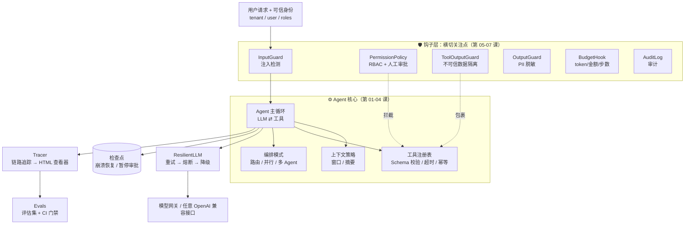

<div align="center">

# 🏭 Enterprise Agent Bootcamp

### 企业级 Agent 系统设计训练营

**4 小时，从"会调 LLM API"到"能设计生产级 Agent 系统"。**
不依赖任何 Agent 框架，从零手写企业级 Agent 的每一层：工具、上下文、编排、可靠性、安全、可观测、评估、部署。

[](https://github.com/heaven999b/enterprise-agent-bootcamp/actions/workflows/ci.yml)


[](CONTRIBUTING.md)

[快速开始](#-快速开始) · [学习路线](#-学习路线4-小时) · [综合实战](capstone/README.md) · [失败模式图鉴](docs/failure-modes.md) · [面试题](docs/interview-questions.md) · [English](README_EN.md)

</div>

---

## 🤔 为什么要做这个项目？

写一个"能跑"的 Agent 只要 20 行代码。但把它放进公司、让成千上万人用，你马上会遇到这些问题：

> 模型 429 了怎么办？Agent 陷入死循环一晚上烧了 2000 美元怎么办？用户在文档里藏一句"忽略之前的指令"就能让 Agent 重置管理员密码怎么办？A 公司的数据出现在 B 公司的回答里怎么办？改了一行 prompt，怎么知道有没有把别的场景改坏？进程在 Agent 执行到一半时重启了怎么办？

**这些问题决定了一个 Agent 能不能上线，而绝大多数教程只教那 20 行。**

| | 常见 Agent 教程 | 本项目 |
|---|---|---|
| 目标 | 让 Agent 跑起来 | 让 Agent **在生产中可靠、安全、可控地**跑起来 |
| 方式 | 调用框架 API（黑盒） | **从零手写每一层**（~2000 行，每行都能看懂） |
| 覆盖 | 循环 + 工具 | 循环、工具、上下文、编排；重试熔断降级、检查点恢复、提示词注入防御、RBAC、人工审批、审计、追踪、评估；高并发与分布式执行、成本优化、权限感知 RAG、灰度发布与事故响应 |
| 讲法 | 一种做法 | 企业问题卡片：**每个问题 2–4 种方案对比**，讲清怎么选 |
| 验证 | 看起来能用 | 每课都有**带自动化测试的练习**，离线、确定性、零成本 |
| 模型 | 绑定某家厂商 | 任何 OpenAI 兼容接口（OpenAI / DeepSeek / Qwen / vLLM / 各类模型网关） |

## 🗺 你将亲手造出的系统



用 `agentkit` 组装一个企业级 Agent 只需要这样（每一个参数背后都是一节课）：

```python
from agentkit import *

agent = Agent(
    llm=ResilientLLM(default_llm(), fallbacks=[default_llm("gpt-5.6-luna")]),   # 第 05 课：重试/熔断/降级
    tools=[search_kb, create_ticket, reset_password],                            # 第 02 课：工具设计
    system_prompt="你是 IT 服务台助手。" + UNTRUSTED_DATA_RULE,                    # 第 06 课：不可信数据规则
    hooks=[
        InputGuard(),                                                            # 第 06 课：输入检测
        PermissionPolicy(role_tools={"employee": {"search_kb", "create_ticket"},
                                     "it_admin": {"*"}}),                        # 第 06 课：RBAC + 高危审批
        ToolOutputGuard(), OutputGuard(),                                        # 第 06 课：隔离 + 脱敏
        BudgetHook(max_cost_usd=0.10, max_tool_calls=20),                        # 第 05 课：预算
        AuditLog("runs/audit.jsonl"),                                            # 第 06 课：审计
    ],
    context_strategy=SlidingWindow(max_tokens=8000),                             # 第 03 课：上下文工程
    checkpointer=FileCheckpointer("runs/"),                                      # 第 05 课：检查点
    idempotency_store=IdempotencyStore(),                                        # 第 05 课：幂等
    tracer=Tracer(jsonl_exporter("runs/traces.jsonl")),                          # 第 07 课：追踪
)

result = agent.run("帮我重置密码", metadata={"tenant_id": "acme", "user_id": "alice", "roles": ["employee"]})
if result.status == "paused":                        # 高危操作 → 暂停等人工审批（可以是几小时后、另一个进程）
    result = agent.approve(result.run_id, approved=True)
print(render_tree(result.trace))                     # 看见 Agent 的每一步
```

真实运行输出示例（`python -m agentkit.chat`，一轮里模型并行调用了两个工具）：

```text
agent.run  6231ms  tokens=973→106  status=completed steps=2 cost=$0.00228
├─ llm.chat  2681ms  tokens=440→52  → tool_calls: current_time, calculator
├─ tool.current_time  3ms  ok
├─ tool.calculator  1ms  ok
└─ llm.chat  3534ms  tokens=533→54  → final_answer
```

## 🚀 快速开始

```bash
git clone https://github.com/heaven999b/enterprise-agent-bootcamp.git
cd enterprise-agent-bootcamp
make setup          # 创建 .venv 并安装（依赖只有 openai + pydantic）
```

编辑 `.env`，填入任意 OpenAI 兼容接口：

```bash
LLM_BASE_URL=https://api.openai.com/v1     # 或 DeepSeek / 通义 / 本地 vLLM / 模型网关
LLM_API_KEY=sk-xxx
LLM_MODEL=gpt-4o-mini                       # 需要支持 function calling
```

```bash
make check-env                                  # 检查模型连通性与工具调用能力
.venv/bin/python lessons/00_overview/demo.py    # 看一眼你将要造出的东西
```

> 💡 **没有 API key？** 所有 demo 都支持 `--offline`（用剧本模型 `ScriptedLLM` 运行），所有练习和测试都是离线的。你可以零成本学完整个课程。

## 📚 学习路线（约 4 小时）

课程分两部分：**第一部分学会"怎么造"，第二部分学会"企业里出了问题怎么选方案"**。

第二部分的每节课都由若干张**企业问题卡片**组成：真实场景（带具体数字）→ 为什么直觉方案会翻车 → 2–4 种方案对比（优点 / 缺点 / 适用规模）→ 怎么选 → 代码实现。

每节课的流程都一样：**读讲义 → 跑 demo → 写练习 → `make lesson N=xx` 让测试变绿 → 过自测清单**。

### 第一部分：基础构建（约 80 分钟）

| # | 课程 | 时长 | 你会亲手实现 | 核心源码 |
|---|---|---|---|---|
| 00 | [企业级 Agent 全景图](lessons/00_overview/README.md) | 10m | 建立完整的心智地图 | — |
| 01 | [Agent 循环的本质](lessons/01_agent_loop/README.md) | 20m | 手写 Agent 主循环 | [agent.py](agentkit/agent.py) |
| 02 | [工具设计：Agent 与世界的接口](lessons/02_tools/README.md) | 20m | 生产级工具：Schema、校验、身份注入、业务错误 | [tools.py](agentkit/tools.py) |
| 03 | [上下文工程与记忆](lessons/03_context_memory/README.md) | 15m | 安全截断、工具结果清理 | [context.py](agentkit/context.py) · [memory.py](agentkit/memory.py) |
| 04 | [编排模式：Workflow、Agent 与多 Agent](lessons/04_orchestration/README.md) | 15m | 混合路由、法定多数投票、门禁流水线 | [workflows.py](agentkit/workflows.py) |

### 第二部分：企业问题与解决方案（约 160 分钟）

| # | 课程 | 时长 | 典型问题（每个都有多种方案对比） | 你会亲手实现 |
|---|---|---|---|---|
| 05 | [可靠性工程](lessons/05_reliability/README.md) | 20m | 模型 429 / 宕机、Agent 死循环、进程崩溃、审批要等几小时 | 死循环检测、重试预算 |
| 06 | [安全与治理](lessons/06_security/README.md) | 20m | 间接注入、越权、审批疲劳、PII 泄露、代码执行 | 策略引擎、脱敏、"致命三要素"检测 |
| 07 | [可观测性](lessons/07_observability/README.md) | 15m | 追踪数据爆炸、trace 里的 PII、告警噪声 | 从 trace 计算 SLO 指标 |
| 08 | [评估驱动开发](lessons/08_evals/README.md) | 20m | 没有标注数据、LLM 评委不可靠、评估太贵 | pass^k、轨迹评分、发布门禁 |
| 09 | [生产架构总览](lessons/09_production_architecture/README.md) | 15m | 同步 / 流式 / 异步、多租户隔离级别、自建 vs 框架 | 多租户限流、模型路由 |
| 10 | [**高并发与分布式执行**](lessons/10_distributed_concurrency/README.md) | 25m | 横向扩展、投递语义、会话并发写（分布式锁 vs 乐观锁 vs 分区串行）、全局限流与背压、Saga 补偿、重试风暴 | SQLite 租约队列 + fencing token + CAS（多进程真实并发） |
| 11 | [成本与延迟优化](lessons/11_cost_latency/README.md) | 15m | 账单失控、重复请求、长尾延迟、成本归因 | 缓存、模型级联、对冲请求 |
| 12 | [企业知识与权限感知 RAG](lessons/12_enterprise_rag/README.md) | 15m | ACL 泄露、多租户索引隔离、知识过期、幻觉引用 | ACL 前过滤检索、切块、引用校验 |
| 13 | [发布、变更与运维](lessons/13_release_ops/README.md) | 15m | prompt 改出事故、模型静默升级、如何止血与回滚 | 金丝雀分桶、自动回滚决策、kill switch |

### 🎓 综合实战（30 分钟）

[**ITBuddy：企业 IT 服务台 Agent**](capstone/README.md)：把所有能力组装成一个完整系统，包含命令行应用、支持异步审批的 HTTP API、一份真实风格的设计文档（含威胁模型和 ADR），以及 24 条评估用例（其中 10 条安全用例）。

查看学习进度：

```bash
.venv/bin/python scripts/progress.py
```

## 🧰 深度资料（学完之后的"工具书"）

| 文档 | 内容 |
|---|---|
| [🩺 Agent 失败模式图鉴](docs/failure-modes.md) | 生产中真实会遇到的失败模式：症状 → 根因 → 检测 → 修复 |
| [✅ 设计评审清单](docs/design-review-checklist.md) | 100+ 条上线前检查项，按 P0/P1/P2 分级 |
| [🎤 系统设计面试题](docs/interview-questions.md) | 40+ 道题 + 3 道完整系统设计作答示范 |
| [🔁 框架对照表](docs/framework-comparison.md) | agentkit 概念 ↔ LangGraph / OpenAI Agents SDK / Claude Agent SDK / ADK … |
| [📄 一页纸速查](docs/cheatsheet.md) | 原则、默认参数、决策树，适合打印 |
| [📖 术语表](docs/glossary.md) | 中英对照 + 大白话解释 |
| [📚 延伸阅读](docs/reading-list.md) | 精选并核实过的论文、博客、规范 |

## 🧱 项目结构

```text
enterprise-agent-bootcamp/
├── agentkit/            # 教学框架：~2000 行，每个模块对应一节课，注释解释每个"为什么"
│   ├── agent.py         #   主循环 + 钩子 + 检查点 + 追踪
│   ├── tools.py         #   工具：Schema 生成、校验、超时、幂等、身份注入
│   ├── context.py       #   上下文窗口策略
│   ├── memory.py        #   长期记忆（租户隔离）
│   ├── workflows.py     #   5 种编排模式 + 多 Agent
│   ├── reliability.py   #   重试 / 熔断 / 降级
│   ├── guardrails.py    #   注入检测 / 数据隔离 / 脱敏
│   ├── permissions.py   #   RBAC + 人工审批
│   ├── tracing.py       #   链路追踪（OpenTelemetry GenAI 风格）
│   ├── viewer.py        #   追踪 HTML 查看器
│   └── evals.py         #   评估框架
├── lessons/NN_topic/    # 每课：README 讲义 / demo.py / exercise.py / solution.py / test_exercise.py
├── capstone/            # 综合实战：ITBuddy（CLI + HTTP API + 设计文档 + 评估集）
├── docs/                # 深度资料
└── tests/               # 框架测试（全部离线）
```

## 💡 设计原则

1. **零魔法**：不用任何 Agent 框架。消息就是 OpenAI 格式的 dict，你能看到发给模型的每一个字节。
2. **生产级模式，教学级代码**：检查点、幂等键、熔断器、RBAC、审计……都是真实企业系统里的模式，但每个实现都短到能一口气读完。
3. **可测试是第一公民**：`ScriptedLLM` 让 Agent 测试像普通单元测试一样确定、离线、免费。
4. **厂商无关**：业务代码只依赖一个 `LLM.chat()` 接口，模型可随时替换。
5. **学完能迁移**：[框架对照表](docs/framework-comparison.md)告诉你每个概念在 LangGraph、OpenAI Agents SDK 等框架里叫什么。

## ❓ FAQ

<details>
<summary><b>为什么不直接学 LangChain / LangGraph？</b></summary>

框架会变，原理不会。先亲手实现一遍"检查点""人工审批中断""工具校验"，你再看任何框架都只是"哦，这个东西在这里叫 xxx"。反过来，只会调框架的人遇到框架没覆盖的生产问题时会束手无策。学完本课程后，[框架对照表](docs/framework-comparison.md)能帮你一小时内上手任一主流框架。
</details>

<details>
<summary><b>需要什么基础？</b></summary>

能读懂 Python 函数和类、调过一次 LLM API 即可。代码刻意避免了高级技巧（没有 async、没有元编程），注释全中文。
</details>

<details>
<summary><b>支持哪些模型？</b></summary>

任何支持 function calling 的 OpenAI 兼容接口。作者本地使用 cliproxyapi 网关 + gpt-5.5 开发和验证。
</details>

<details>
<summary><b>agentkit 能直接用于生产吗？</b></summary>

它的**设计模式**是生产级的，但它是教学实现：同步、单进程、内存存储。生产中请把检查点换成数据库、追踪换成 OpenTelemetry、工具执行放进沙箱——第 09 课详细讲了怎么做。
</details>

## 🤝 参与贡献

发现错误、想补充一节课、想翻译？非常欢迎！请看 [CONTRIBUTING.md](CONTRIBUTING.md) 与 [课程编写规范](docs/lesson-template.md)。

如果这个项目帮到了你，请给一个 ⭐ —— 这会让更多人看到它。

## 📜 License

[MIT](LICENSE)

[](https://star-history.com/#heaven999b/enterprise-agent-bootcamp&Date)
