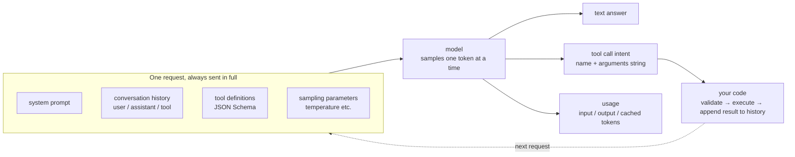
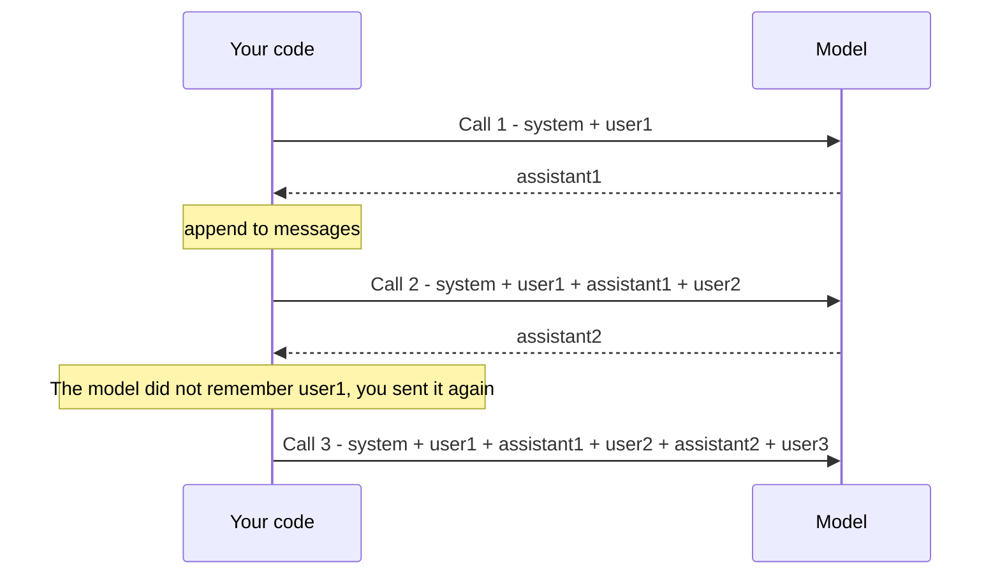
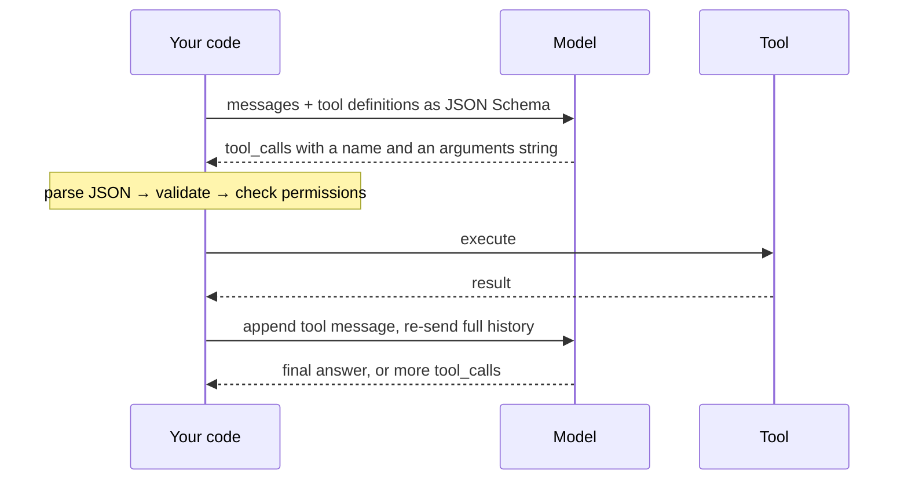

[中文](README.md) | [English](README.en.md)

# Lesson 01: LLM Essentials for Agent Developers

> 🕐 Suggested time: 20 minutes ｜ 🎯 After this lesson you can: explain what tokens, messages, sampling, tool calling, structured output, streaming, vector search and reasoning models **mean for an agent**, and avoid the dozen or so traps that catch most newcomers ｜ 📦 Source: [`agentkit/llm.py`](../../agentkit/llm.py), [`agentkit/types.py`](../../agentkit/types.py), [`agentkit/context.py`](../../agentkit/context.py) (`estimate_tokens`), [`agentkit/pricing.py`](../../agentkit/pricing.py), [`agentkit/workflows.py`](../../agentkit/workflows.py) (`complete_json`)

> Code comments and demo output are in Chinese. Demo excerpts below are translated; the numbers, identifiers and JSON are exactly as printed.

## 0. The one-sentence version

**From an agent developer's point of view, an LLM is a stateless, pay-per-token, non-deterministic function: you give it a list of messages plus a manual for your tools, and it gives you back some text, or a note that says "please call this tool for me".**

Each of those three adjectives explains a whole family of "why is it doing that?" questions:

- "I didn't change anything, so why did the bill triple?" — **pay-per-token**: the longer the conversation, the more history every request re-sends, and tool definitions are billed as input too.
- "This test passed yesterday. Why does it fail today?" — **non-deterministic**: the model samples each token from a probability distribution, and even `temperature=0` doesn't promise the same output twice.
- "It knew my name yesterday. Why has it forgotten?" — **stateless**: the model remembers nothing. Its "memory" is the history your code sends it again on every call.

Two more are specific to agents:

- "Why do tool calls blow up with `JSONDecodeError` as soon as I turn on streaming?" — tool arguments arrive **in fragments**; you have to assemble them before parsing.
- "It said it had sent the email. Nothing was sent." — the model **only produces text**. Your code runs the tools, and what the model says about its own actions can't be trusted.



The next lesson ([Lesson 02: The Agent Loop](../02_agent_loop/README.md)) turns this diagram into a `while` loop. This lesson makes sure you know how each part of that loop behaves.

**The 12 topics at a glance** (short on time? Read this table, then jump to whatever you need):

| # | Topic | In one sentence | The most common trap |
|---|---|---|---|
| 1.1 | Tokens | Billing, rate limits and context windows all count tokens, not characters | Forgetting tool definitions; reconciling bills with estimates |
| 1.2 | Messages & statelessness | The model remembers nothing; you send the whole history every time | Assuming it "remembers"; keeping history only in memory |
| 1.3 | Sampling | Tokens are drawn from a distribution, so the same input can give different outputs | Asserting exact output because `temperature=0` |
| 1.4 | Function calling | The model only outputs a JSON "I'd like to call X"; you do the calling | Not validating arguments; handling only the first call |
| 1.5 | Structured output | JSON mode guarantees JSON; only schema-constrained output guarantees fields | Treating JSON mode as a schema guarantee |
| 1.6 | Streaming | Cuts time to first token; tool arguments arrive in fragments | Calling `json.loads` on the first fragment |
| 1.7 | Embeddings | Turn text into vectors so you can search by meaning | Assuming similar = relevant = correct |
| 1.8 | Reasoning models | Think first, then answer; thinking is billed as output | `max_tokens` so small that thinking eats all of it |
| 1.9 | Hallucination & cutoff | Models invent things confidently and don't know today's date | Believing what the model says about itself |
| 1.10 | Prompt engineering | The system prompt is the agent's job description; manage it like code | Treating the prompt as a security boundary |
| 1.11 | Choosing a model | Weigh capability, tool calling, latency, price, compliance and availability together | Picking from a leaderboard |
| 1.12 | API errors | Don't retry 400/401; retry 429, 5xx and timeouts | Retrying everything |

## 1. Core concepts

> The measurements in this lesson come from the OpenAI-compatible gateway this course uses (model `gpt-5.5`, September 2026). Another model or provider will give different numbers, but the **behavior and the conclusions** carry over. For anything that changes over time (vendor parameters, prices, context lengths), the official documentation is the source of truth.

### 1.1 Tokens and tokenizers: everything is counted in tokens

**What it is.** Models don't see characters; they see tokens. A tokenizer splits text into tokens and maps each one to a numeric ID. A common English word is usually one token; rare words, long numbers, code and emoji get split into several. How many tokens a Chinese character takes **depends entirely on the model's tokenizer**.

Here is what Section 1 of the demo measured, using the same request written once in Chinese and once in English:

| Request | Characters | agentkit estimate | Actual `prompt_tokens` | Minus baseline |
|---|---|---|---|---|
| Baseline: one system line + a `.` | 1 | 26 | 321 | — |
| Chinese request | 45 | 71 | 355 | +34 |
| Same request in English | 183 | 71 | 357 | +36 |
| Chinese request + 2 tool definitions | 45 | 71 (tools not counted) | 473 | +152 |

Four things jump out of this table:

1. **Chinese and English come out about even.** On this model, 45 Chinese characters are about 34 tokens and 183 English characters about 36. Rules of thumb like "Chinese costs twice as much as English" come from older tokenizers. Don't rely on folklore; measure on your own model.
2. **There's input you can't see.** The baseline request carried about 26 tokens of our content, yet the server billed 321. The difference is chat-template formatting plus instructions the server or gateway adds on its own. You never see them, but you pay for them and they take up context.
3. **Tool definitions are expensive.** Adding just two short tool definitions cost another 118 input tokens. OpenAI's docs say it plainly: function definitions are injected into the system message, [count against the context limit and are billed as input tokens](https://developers.openai.com/api/docs/guides/function-calling). An agent with 20 tools pays for 20 manuals on every single step.
4. **Estimates are estimates.** agentkit's [`estimate_tokens`](../../agentkit/context.py) uses "1 Chinese character ≈ 1 token, 4 other characters ≈ 1 token". On this model it **overestimates** both texts by 25–30% (Chinese: 45 estimated vs. 34 actual; English: 45 vs. 36). Erring high is fine for budgeting, but never use it to reconcile a bill.

**Why agents care.** Tokens drive three different things at once:

| Dimension | What's counted in tokens | What it means for an agent |
|---|---|---|
| Cost | input price × input tokens + output price × output tokens | Every step re-sends the full history, so cost grows roughly **quadratically** with steps ([Lesson 02, §1.4](../02_agent_loop/README.md)) |
| Rate limits | Providers usually cap both requests per minute (RPM) and tokens per minute (TPM) | Long-context agents tend to hit TPM long before RPM |
| Context | There's a hard cap on input + output per request | History keeps growing until one day the request fails with a 400 ([Lesson 04](../04_context_memory/README.md)) |

**Context window ≠ maximum output length.** These are two different limits:

- **Context window**: everything the model can "see" in one request: system prompt, history, tool definitions, tool results, *and* the output it's about to generate.
- **Maximum output tokens**: the most the model can generate in one response. It is usually much smaller than the context window, and a reasoning model's thinking counts toward it (§1.8). The `max_tokens` / `max_completion_tokens` you set is a ceiling on output; hit it and the response is cut off with `finish_reason == "length"`.

So a "128K window" doesn't mean you can generate 128K tokens, and it doesn't mean you can fill 128K with input either: if the input takes up the whole window, there's no room left for the answer. Every model has its own numbers; check the official model documentation.

**Three prices: input, output, cached input.**

$$\text{request cost} = (\text{input} - \text{cached}) \times P_{\text{input}} + \text{cached} \times P_{\text{cached}} + \text{output} \times P_{\text{output}}$$

- **Output usually costs several times more than input**: output tokens are generated one at a time, while input can be processed in parallel.
- **Cached input is discounted**: when the beginning of a request (its prefix) exactly matches a recent request, the provider can reuse work it already did, bill those tokens at a lower rate, and respond sooner. OpenAI's docs cite discounts [of up to 90%](https://developers.openai.com/api/docs/guides/prompt-caching). Caching usually has a minimum prefix length, changing a single character in the prefix breaks it, and some providers charge extra to *write* the cache. How to design for cache hits is covered in [Lesson 04](../04_context_memory/README.md) and [Lesson 14](../14_cost_latency/README.md).
- The `usage` object in the API response reports input, output and cached tokens separately. agentkit's [`Usage`](../../agentkit/types.py) has matching `input_tokens` / `output_tokens` / `cached_input_tokens` fields, and [`estimate_cost`](../../agentkit/pricing.py) applies exactly this formula.

**How to estimate.** Three levels of precision, each with its own job:

| Method | Precision | Use it for |
|---|---|---|
| Rule of thumb (`estimate_tokens`) | Rough; can be off by 30% or more | Budget checks; "how much window is left?" |
| The model's own tokenizer (e.g. OpenAI's [tiktoken](https://github.com/openai/tiktoken)) or the provider's token-counting endpoint | Close, but blind to hidden instructions and template overhead | Checking whether a request will fit before sending it |
| `usage` in the API response | This *is* the bill | Billing, cost attribution, reporting |

**Common traps:**

- Estimating the cost of Chinese text by character count, or reusing stale rules like "one Chinese character is two tokens";
- Leaving out the system prompt, tool definitions or full history when estimating cost (that's exactly what exercise (b) is about);
- Reconciling a bill against estimates. Money is always counted from `usage`;
- Assuming `max_tokens` is always honored. In our tests this course's gateway **silently ignored** it: with `max_tokens=8` the model still produced 188 tokens. Compatibility layers don't necessarily implement every parameter, so enforce the limits that matter in your own code too (for example the `BudgetHook` in [Lesson 08](../08_reliability/README.md)).

### 1.2 Messages and roles: the model is stateless

**What it is.** The input to a request is a list of messages, each with a role. The protocol details (how `tool_calls` pair up with `tool_call_id`) are covered in [Lesson 02](../02_agent_loop/README.md). Here we focus on an angle newcomers often miss: **each role deserves a different level of trust.**

| role | Written by | Trust | How to treat it |
|---|---|---|---|
| `system` | You, the developer | Highest | Rules, identity, boundaries. Naming varies: newer OpenAI APIs also have a `developer` role that plays a similar part, and Anthropic takes the system prompt as a separate top-level parameter |
| `user` | The end user | Untrusted | Users may try to rewrite your rules (direct prompt injection, [Lesson 09](../09_security/README.md)) |
| `assistant` | The model | Untrusted until validated | Model output can be wrong, invented, or steered by injected content |
| `tool` | Your code, with content from outside systems | Untrusted | Web pages, emails and documents can carry hidden instructions (indirect injection, Lesson 09) |

**Stateless.** Between requests the model remembers **nothing at all**. What looks like memory is a message list that your code maintains and sends back **in full** on every call:



What this means for an agent:

1. **Cost**: every call pays for the entire history. Some providers offer server-side conversation state, such as `previous_response_id` in OpenAI's Responses API, so you don't have to re-send the history yourself. But the official docs state that all previous input tokens in the chain [are still billed as input tokens](https://developers.openai.com/api/docs/guides/conversation-state). It saves bandwidth and code, not money.
2. **Control**: the history is yours to trim, summarize and rewrite. That's a power (context engineering, [Lesson 04](../04_context_memory/README.md)) and a responsibility: split a `tool_calls` message from its tool results while trimming and the API rejects the request with a 400.
3. **State must be persisted**: history that lives only in process memory disappears on restart, and in a multi-instance deployment the next request may land on a different machine ([Lesson 13](../13_distributed_concurrency/README.md)).
4. **Rules must be sent every time**: the system prompt has to be at the front of **every** request. "I told it in the first turn" doesn't count.

The `build_messages` function in exercise (c) is what every agent does before each call: system prompt first, history trimmed by *turns*, the new user input last.

**Common traps:** assuming the model remembers the last turn; letting several system messages creep into the history; trimming by message count and separating a `tool_calls` message from its results; putting tool output into a `user` message (the model then treats outside data as the user's instructions).

### 1.3 Sampling and non-determinism: same input, different output

**What it is.** For every token it generates, the model first scores every candidate in its vocabulary (the logits), turns the scores into probabilities, and then **draws one at random according to those probabilities**. Three parameters control the draw:

| Parameter | What it does | Intuition |
|---|---|---|
| `temperature` | Sharpens or flattens the distribution | Lower is more conservative (close to "always pick the top candidate"); higher is more varied |
| `top_p` | Samples only from the smallest set of candidates whose probabilities add up to p (nucleus sampling, [Holtzman et al., ICLR 2020](https://arxiv.org/abs/1904.09751)) | Cuts off the long tail of unlikely candidates |
| `seed` | Fixes the random seed | OpenAI describes this as a "best effort" at reproducibility, [not a guarantee](https://cookbook.openai.com/examples/reproducible_outputs_with_the_seed_parameter) |

Section 2 of the demo first shows the mechanism locally with five made-up candidates for the first word of a café name:

```text
     candidate   T=0.2    T=0.7    T=1.0    T=1.5
     拾光        86.5%    46.5%    38.4%    32.0%
     云朵        11.7%    26.2%    25.7%    24.5%
     ...
     慢慢         0.0%     4.1%     7.0%    10.3%
```

Then it asks the real model to name a café three times at each temperature. One run produced:

```text
temperature=0 × 3: ['一楼咖啡', '楼下咖啡', '一楼咖啡馆']  → 3 distinct results
temperature=1 × 3: ['楼下咖啡', '楼下有啡', '楼下咖啡']    → 2 distinct results
```

(Roughly: "Ground Floor Coffee", "Downstairs Coffee", "Ground Floor Café".) **At `temperature=0` the model gave three different answers.** Run it again and you may get three identical ones. Why isn't zero deterministic?

- **Server-side batching.** Thinking Machines' [Defeating Nondeterminism in LLM Inference](https://thinkingmachines.ai/blog/defeating-nondeterminism-in-llm-inference/) (Horace He, September 2025) traces the main cause to inference kernels that lack *batch invariance*: your request is computed alongside a varying number of other requests, which shifts the numbers slightly, and batch size depends on how busy the server is. Sampling Qwen3-235B 1,000 times at temperature 0 on the same prompt produced 80 distinct completions.
- **Silent model updates.** The version or deployment behind a model name can change.
- **Parameters that don't take effect.** Some reasoning models don't support `temperature`, and some gateways quietly drop it.

**What it means for an agent.** Agents *amplify* non-determinism: pick a different tool at step one and the whole trajectory diverges. So:

- **Unit tests** shouldn't call a real model. Use a scripted one (agentkit's `ScriptedLLM`), which is 100% reproducible;
- **Evaluations** should run each case several times and look at pass rates, not a single pass/fail ([Lesson 11](../11_evals/README.md) covers pass@k and pass^k);
- **In production**, use a low temperature for tool calling and extraction and a higher one for creative work. OpenAI's API reference recommends adjusting temperature **or** top_p, not both;
- **Observability**: production issues often can't be reproduced, so log the full input and output of every call ([Lesson 10](../10_observability/README.md)).

**Common traps:** asserting the exact string a model returns; treating `seed` as a reproducibility guarantee; calling a feature "done" because it worked once.

### 1.4 How function calling really works: the model only *proposes*

**What it is.** You attach tool definitions to the request (name, description, and a JSON Schema for the parameters). If the model decides a tool is needed, its reply contains a structured "call intent":

```json
{
  "role": "assistant",
  "tool_calls": [{
    "id": "call_2efeb4E1RHQs6iyhIPvpWu8i",
    "type": "function",
    "function": {"name": "get_weather", "arguments": "{\"city\":\"北京\"}"}
  }]
}
```

That is the raw JSON the model returned in Section 3 of the demo (`北京` is Beijing). At that exact moment the demo prints "`get_weather` has been executed **0** times": the model ran nothing; it wrote a note. **Your code** then decides whether and how to run the tool, and sends the result back as a `tool` message so the model can continue.



**Why this matters so much.** All of the control is yours, and so is all of the responsibility: argument validation ([Lesson 03](../03_tools/README.md)), permissions and approvals ([Lesson 09](../09_security/README.md)), timeouts and retries ([Lesson 08](../08_reliability/README.md)) all live between "the model proposed it" and "it actually ran".

**`tool_choice`: whether the model must call a tool, and which one.**

| OpenAI | Anthropic | Meaning | Typical use in an agent |
|---|---|---|---|
| `"auto"` (default) | `{"type": "auto"}` | The model decides whether and how many | The main agent loop |
| `"none"` | `{"type": "none"}` | No tools; answer directly | Budget nearly spent: make the model wrap up |
| `"required"` | `{"type": "any"}` | Must call at least one tool | Flows where every step must be an action |
| `{"type": "function", ...}` with a name | `{"type": "tool", "name": ...}` | Must call this specific tool | Using a tool as structured output; a fixed step in a workflow |

Note that **not every model supports forcing a call**. Anthropic's docs, for example, list models that [return a 400](https://platform.claude.com/docs/en/agents-and-tools/tool-use/define-tools) for `any` or `tool`. Check the official docs and test against your own gateway.

**Parallel tool calls.** One reply can contain several `tool_calls` (in the demo, "create a ticket and check the weather" comes back as two). OpenAI offers `parallel_tool_calls=false` to turn this off. But in our tests the course gateway **ignored that parameter** and returned two calls anyway. Whatever your settings, your code has to handle multiple calls ([Lesson 02, §1.6](../02_agent_loop/README.md)).

**Why the arguments JSON can be invalid.** `arguments` is **text the model generated token by token**, not an object that was serialized. Typical failures:

| Problem | Cause |
|---|---|
| Half a JSON object | Output hit `max_tokens` (`finish_reason == "length"`), or a stream wasn't fully assembled |
| Missing required fields, wrong types, extra fields | In normal mode the schema is a hint to the model, not a constraint |
| Invented enum values | You defined `"high"`; the model wrote `"urgent"` |
| A tool that doesn't exist | The model "imagines" a plausible tool name |
| Invented values | Perfectly formatted, but the order number is a guess (no schema can catch this) |

**Strict mode** (OpenAI's `strict: true`, Anthropic's strict tool use) constrains generation so the output must match the schema. That eliminates the first three rows, with conditions: OpenAI requires `"additionalProperties": false` on every object and every field listed as required. It does nothing about the last row. **So always validate.** Tool names have rules too: when we sent a name containing a space and an exclamation mark, the gateway replied `400 Invalid 'tools[0].name': string does not match pattern ... '^[a-zA-Z0-9_-]+$'`.

**Common traps:** calling `eval()` on `arguments`; executing without validation; handling only `tool_calls[0]`; letting the model pass `user_id` as an argument (identity must be injected by the system, Lesson 03); believing the model when it says "I already called that".

### 1.5 Structured output: reliable data for downstream code

**What it is.** In an agent, many steps produce output for code rather than for people: a classification, extracted fields, a plan. There are three levels of getting a model to emit valid data reliably:

| Level | How | Guarantees | Doesn't guarantee |
|---|---|---|---|
| ① Prompt only | "Output only JSON" | Nothing | Models often wrap it in ` ```json ` or add "Sure, here you go:" |
| ② JSON mode | `response_format={"type": "json_object"}` | The output is **valid JSON** | Field names, types, enum values |
| ③ Structured Outputs | `response_format={"type": "json_schema", "json_schema": {..., "strict": true}}` | The output **matches your schema** | Business rules the schema can't express; refusals; truncation |

OpenAI's docs put it this way: both produce valid JSON, but [only Structured Outputs guarantee schema adherence](https://developers.openai.com/api/docs/guides/structured-outputs). Even at level ③ you still need to handle three cases: the model **refuses** for safety reasons (OpenAI reports this in a `refusal` field), the output is **truncated** by `max_tokens`, and constraints the schema can't express, such as "summary under 30 characters" or "end date after start date".

**So validate-and-repair is always needed.** agentkit's [`complete_json`](../../agentkit/workflows.py) is a fallback that works with any model: put the schema in the prompt → extract the JSON from the output → validate with Pydantic → on failure, send the error message back and ask the model to fix it, up to `max_repairs` times, then raise. The offline mode of Section 5 shows the full repair cycle:

```text
Attempt 1: Sure, here's the classification: ```json {"category": "账号", "priority": "紧急", ...} ```
           ❌ validation failed; the error is sent back to the model
Attempt 2: {"category": "account", "priority": "P1", "summary": "OA 登录提示密码错误，急需报销", ...}
           ✅ passed validation
```

(Attempt 1 used Chinese words for "account" and "urgent" instead of the allowed enum values.) The design of this repair loop is covered in [Lesson 06, §1.3](../06_orchestration/README.md). A practical trick: define the structure you want as a tool's parameters and force that tool with `tool_choice`. On models without `response_format`, this is the standard way to get structured output.

**Common traps:** assuming JSON mode guarantees fields; regex-scraping fields out of free text; a repair loop without a retry limit; asking for JSON *and* "explain your reasoning" (put the reasoning in a schema field).

### 1.6 Streaming: time to first token, and tool arguments in fragments

**Why stream.** Models generate one token at a time. Without streaming you wait until everything is generated; with streaming you receive output as it's produced (usually over SSE, server-sent events). Section 4 of the demo measured:

```text
TTFT (time to first token) = 1.74s, complete = 2.84s, 34 chunks
```

**TTFT** is the time from sending the request to receiving the first token. Streaming **doesn't make the total faster**, but the user sees text in under two seconds instead of staring at a blank screen for almost three. The longer the answer, the bigger the difference. Agents get two more benefits: you can push progress updates such as "Checking the ticketing system…" in real time, and users can interrupt (though tokens already generated are usually still billed).

**The classic trap: streamed tool-call arguments arrive in fragments.** Everyone knows streamed text must be concatenated. Tool calls work the same way, but it's easier to miss. Real output from demo 4b:

```text
+1.95s index=0 id=call_PhR4DZOrO… name=create_ticket  arguments fragment=''
+1.95s index=0 (no id, no name)                        arguments fragment='{"'
+1.97s index=0 (no id, no name)                        arguments fragment='title'
+1.97s index=0 (no id, no name)                        arguments fragment='":"'
……
the arguments for index=0 arrived in 59 fragments
❌ Classic bug: json.loads('{"') on the first fragment → JSONDecodeError: Unterminated string starting at
```

Three rules:

1. **`id` and `name` appear only in the first fragment**; in later fragments they're `None`. Don't let those `None`s overwrite them.
2. **`arguments` arrives as string pieces**: concatenate them in order and parse the JSON **only after the stream ends**.
3. **Parallel calls are told apart by `index`**, and fragments for different indexes can interleave.

One more observation worth remembering: on the same gateway, a **single** tool call had its arguments split into 59 fragments, while in demo 4c the arguments of each of two **parallel** calls arrived in one piece. How many fragments, and where the cuts fall, is up to the server. Your code can't assume anything about it.

Other APIs use different names for the same idea: OpenAI's Responses API sends `response.function_call_arguments.delta` events keyed by `output_index`; Anthropic sends `input_json_delta` events carrying `partial_json`, and its docs likewise say to [accumulate first and parse afterwards](https://platform.claude.com/docs/en/build-with-claude/streaming). Exercise (a) is to write this accumulator.

**Other streaming traps:**

- **Usage comes last.** With OpenAI-compatible APIs you set `stream_options={"include_usage": true}` to get usage in the final chunk. Some gateways don't support it, and then you need another way to account for streamed requests;
- **Streams can break halfway.** A dropped connection leaves you with half an answer or half an argument. Decide what a retry means first: regenerate, or give up ([Lesson 08](../08_reliability/README.md));
- **Output guardrails need rework.** Once text is on the user's screen you can't redact it. Check while generating, or buffer a little before releasing ([Lesson 09](../09_security/README.md));
- **Don't execute tools before the stream ends.** Arguments are only complete once `finish_reason` arrives.

### 1.7 Embeddings and vector search basics (📖 optional)

**What it is.** An embedding model turns a piece of text into a fixed-length list of numbers (a vector). It's trained so that **texts with similar meanings get nearby vectors**. "Nearby" is usually measured by **cosine similarity**: the smaller the angle between two vectors, the closer the value is to 1.

A three-dimensional illustration (real embeddings have hundreds to thousands of dimensions, and these numbers are made up for the example):

| Text | Cosine similarity to "how do I reset my password" |
|---|---|
| "forgot my password, can't log in" | 0.993 |
| "how do I turn off the VPN" | 0.505 |
| "what's the expense process" | 0.227 |

Look at the first row: the two sentences share almost no words, yet they're judged nearly identical. Keyword search can't do that; this is *semantic* search.

**Why RAG and memory depend on it.** Context windows are limited and an enterprise knowledge base has hundreds of thousands of documents, so you can't paste them all in. Instead you split documents into chunks, embed them and store them in a vector database ahead of time; at question time you embed the question, retrieve the most similar chunks, put them in context and let the model answer. That's RAG (retrieval-augmented generation). An agent's long-term memory is essentially the same thing ([Lesson 04](../04_context_memory/README.md)).

**Limitations (each of these has caused real incidents):**

- **Similar ≠ relevant ≠ correct.** In the illustration above, "how do I turn off the VPN" and "how do I turn on the VPN" have a similarity of 0.999 despite meaning the opposite. Retrieved content only *looks* related; whether it actually answers the question, or is out of date, needs a separate check;
- **Weak at exact matches**: error code `809`, ticket numbers, product model numbers are better served by keyword search (e.g. BM25). In practice people combine the two (**hybrid search**);
- **No notion of permissions**: a vector database only knows "how similar", not "may you see this". Permission filtering must be enforced in the retrieval layer ([Lesson 15](../15_enterprise_rag/README.md));
- **Changing the model means re-indexing**: vectors from different embedding models can't be mixed;
- **Not every gateway offers embeddings**: calling `/embeddings` on this course's gateway returns 404. Check before you commit.

### 1.8 Reasoning models: think first, and pay for the thinking (📖 optional)

**What it is.** Reasoning (or "thinking") models produce an internal chain of thought before answering. OpenAI's reasoning models and Claude's extended / adaptive thinking are in this family.

**Cost and latency.** OpenAI's docs state that reasoning tokens are [billed as output tokens, take up context window space, and aren't visible through the API](https://developers.openai.com/api/docs/guides/reasoning). On Anthropic's side, thinking tokens likewise count toward `max_tokens`. Here's what we measured on this course's model:

| Request | Output tokens (`completion_tokens`) | Of which reasoning | What the user sees |
|---|---|---|---|
| Write a four-line classical Chinese poem | 188 | 143 (76%) | 4 lines |
| Chickens-and-rabbits puzzle, `reasoning_effort="high"` | 96 | 87 | "23, 12" |
| Same puzzle, `reasoning_effort="low"` | 64 | 55 | "23 12" |

The user sees four lines of poetry; you pay for 188 output tokens. More thinking also means a longer TTFT.

**When it's worth it:**

| Worth it | Not worth it |
|---|---|
| Multi-step planning, breaking down complex tasks | Simple classification, routing, field extraction |
| Math, code, logic | Chit-chat, rewriting, translation |
| Many tools with real trade-offs between them | Latency-sensitive interactive steps |
| Reviewing and grading (LLM as judge) | Checks that run on every single request |

A common agent setup: a reasoning model plans and handles the hard parts, a fast model executes the simple steps ([Lesson 05](../05_agent_architectures/README.md), [Lesson 14](../14_cost_latency/README.md)).

**Common traps:**

- Setting `max_tokens` too low, so thinking uses up the budget and the visible answer is empty with `finish_reason == "length"`. OpenAI suggests [reserving at least 25,000 tokens](https://developers.openai.com/api/docs/guides/reasoning) for reasoning and output when you start experimenting;
- Reasoning models often reject `temperature` and other sampling parameters;
- With tool use, some providers require the previous turn's thinking to be passed back **unchanged** (e.g. Anthropic's thinking blocks); editing it in the history triggers a 400;
- The parameter names and values for reasoning depth (effort, budget) differ by provider and change between model versions. Check the official docs.

### 1.9 Hallucination and knowledge cutoff: don't trust what the model says about itself

**What it is.** A hallucination is a fluent, confident, wrong statement. [Why Language Models Hallucinate](https://arxiv.org/abs/2509.04664) (Kalai et al., OpenAI and Georgia Tech, September 2025) explains it this way: training and evaluation both reward guessing over admitting uncertainty, just as guessing on an exam scores better than leaving the answer blank. The **knowledge cutoff** is the date after which the model's training data stops; it knows nothing that happened later.

We asked this course's model three questions directly:

| Question | Model's answer | What's really going on |
|---|---|---|
| What's today's date? | September 27, 2026 (correct) | The model has no clock. It can only know the date because something in the request contained it. §1.1 showed that the gateway adds about 300 tokens we can't see to every request |
| When does your training data end? | June 2024 | Unverifiable. A model's description of itself comes from text in its training data, not from self-inspection. Get the cutoff from the vendor's official model documentation |
| Can you access the internet or query databases? | No | Give it a search tool in an agent and it can. The model's view of its own abilities depends on what the current request gives it |

**What it means for an agent.**

- **Get facts from tools and retrieval, not from the model's memory**: prices, policies, inventory and people should come from your systems (tools in Lesson 03, RAG in Lesson 15);
- **Tell it what "now" is**: the current date, time zone, user identity and department should be written into the context by your code;
- **The most dangerous hallucination is "I did it"**: the model says "Your password has been reset", but `reset_password` was never called this turn. Decide what happened from the tool execution log (agentkit's `RunResult.tools_called()`), not from the model's words;
- **Let it say "I don't know"**: state in the prompt that it should say so when information is missing, and require sources;
- **Measure hallucination rates with evals** ([Lesson 11](../11_evals/README.md)).

### 1.10 Prompt engineering for agents: manage the system prompt like code

**What it is.** An agent's system prompt is its job description. Unlike a chat assistant, it has to say more than "who you are": which tool to use when, what to do when a tool fails, and when to stop and hand over to a human.

A good agent prompt usually has six parts:

| Part | Question it answers | Example |
|---|---|---|
| Role | Who are you, and whom do you serve? | You are the internal IT help desk assistant for ACME employees |
| Goal | What counts as done? | Solve the problem, or file a ticket and give the user the ticket number |
| Constraints | What must you never do? | Don't promise fix times; don't reveal other employees' information |
| Tool guidance | Which tool when, and what to do on errors | Search the knowledge base first; check for an existing ticket before creating one |
| Output format | What should replies look like? | At most 5 sentences; numbered steps |
| Examples | How to handle edge cases | One or two complete "input → expected behavior" examples |

**Bad vs. good:**

```text
❌ You are a super-intelligent IT expert who knows everything. Do your very best to solve any problem the user has!
```

Problems: no goal (what counts as done?), no boundaries (anything goes?), no tool guidance (when should it search the knowledge base?), and "knows everything" actively encourages it to make things up.

```text
✅
<role>You are the internal IT help desk assistant at ACME. You serve ACME employees.</role>

<goal>Help employees solve IT problems. If they can fix it themselves, give them the steps; if not, create a ticket and tell them the ticket number.</goal>

<tools>
- Search the knowledge base with search_kb first. Cite article IDs in your answer; never invent steps.
- Before creating a ticket, use list_my_tickets to check for an open ticket about the same problem.
- If a tool returns an error, fix the arguments based on the error and retry once. If it still fails, tell the user the system is temporarily unavailable and give them the error ID.
</tools>

<constraints>
- If you don't know, say so. Don't guess.
- Never say you've taken an action unless you actually called the tool.
- Password resets and permission changes require approval: tell the user to wait for approval and don't promise when it will be done.
</constraints>

<format>At most 5 sentences; use a numbered list for steps.</format>
```

Anthropic's [Effective context engineering for AI agents](https://www.anthropic.com/engineering/effective-context-engineering-for-ai-agents) (September 2025) calls this finding the "right altitude": don't hard-code brittle if-else logic into the prompt, and don't be so vague that the model gets no concrete signal. Separate sections with XML tags or Markdown headings, start from a minimal prompt, and add instructions and examples **based on the failures you actually observe**.

**Manage the system prompt like code:**

- **Version control and code review**: keep prompts in the repository, review every change, and ideally be able to say which failure each rule was added to fix;
- **Run evals before changing it**: one edited sentence can fix one case and break three others ([Lesson 11](../11_evals/README.md));
- **Templates**: variables such as the date or the user's role are filled in by code, and **placed at the end**. Keeping the start of the system prompt stable is what lets prefix caching work;
- **Staged rollout and rollback**: prompt changes need canaries and rollback just like code ([Lesson 16](../16_release_ops/README.md));
- **No secrets in prompts**, and assume users can extract the prompt;
- **A prompt is not a security boundary**: writing "you may not delete data" in the prompt is not access control. Permissions have to be enforced in code ([Lesson 09](../09_security/README.md)).

Instructions specific to one tool belong in that tool's description, not in the system prompt ([Lesson 03](../03_tools/README.md)): when the permission system hides the tool, its instructions disappear with it and can't mislead the model.

### 1.11 Choosing a model (📖 optional)

| Dimension | Questions to ask | How to check |
|---|---|---|
| Capability | How well does it do on **my** tasks? | Run your own eval set; don't rely on public leaderboards |
| Tool-calling reliability | How often does it pick the right tool? Produce valid arguments? Does it support parallel calls, strict mode, forced calls? | Track these as separate metrics in your evals |
| Context length | How big is the advertised window? How big is the **effective** one? | Quality drops with long contexts ([Lesson 04](../04_context_memory/README.md)); test at your real data sizes |
| Latency | TTFT, output tokens per second, p99 | Load-test with real requests and look at the distribution, not the mean |
| Price | Input, output, cached and batch prices? | Compute the total cost of **finishing a task**, not the unit price. A cheaper model that takes extra steps can cost more |
| Data compliance | Where is data stored? Is it used for training? How long is it kept? | Read the contract and data policy. OpenAI, for example, documents that API data is [not used for training by default](https://developers.openai.com/api/docs/guides/your-data), that abuse-monitoring logs are kept for up to 30 days by default, and that zero data retention and data residency are available (with conditions). Terms differ between providers, and between consumer products and APIs |
| Availability | What's the SLA? Are the limits (RPM / TPM) enough? Is there a fallback? | Check the status history; prepare a fallback for your primary model ([Lesson 08](../08_reliability/README.md)) |

**How to decide:** first eliminate models on **hard constraints** (compliance, region, self-hosting requirements), then compare capability and tool-calling reliability on your **eval set**, and finally compare **cost and latency per task** among the models that pass. Keep business code dependent on a tiny model interface (agentkit's [`LLM` protocol](../../agentkit/llm.py)) so switching models doesn't mean rewriting it. Using different models for different steps (model routing) is covered in [Lesson 14](../14_cost_latency/README.md).

### 1.12 Common API errors: first ask "is it worth retrying?"

| Status | Meaning | Real error from this course's gateway | Retry helps? | Next step |
|---|---|---|---|---|
| 400 | Something is wrong with the request: bad parameters, context too long, invalid tool definition, unknown model | `Invalid 'tools[0].name': string does not match pattern`; `unknown provider for model no-such-model-xyz` | ❌ Same request, same error | Fix the request. Context-too-long is the exception: trim or summarize, then send again |
| 401 | Authentication failed: wrong, expired or revoked key | `{'error': 'Invalid API key'}` | ❌ | Alert; check key configuration and rotation |
| 403 | Not allowed: unsupported region, model not enabled for the account | — | ❌ | Check account, project and region settings |
| 404 | Not found: model or endpoint | Calling `/embeddings` returned 404 | ❌ | Check the model name and whether the endpoint is supported |
| 429 | **Two very different situations**: ① you're sending too fast and hit a rate limit; ② you've run out of quota or budget | — | ① ✅ ② ❌ | ① exponential backoff with jitter, honoring `Retry-After` when present; ② alert and top up or raise the budget, since retrying forever won't help |
| 500 / 502 / 503 / 504 | Server error, overload, gateway timeout (Anthropic uses 529 for overload) | — | ✅ | Back off and retry; if it keeps failing, open the circuit breaker and switch to a fallback model |
| Timeout / dropped connection | No response within the time limit | `APITimeoutError: Request timed out.` | ✅ Usually | Back off and retry; set sensible timeouts; handle streams that break halfway separately |

The two kinds of 429 are distinguished in the official docs: OpenAI's error-code guide lists "rate limit reached" and "quota / credits exhausted" as separate [429 errors](https://developers.openai.com/api/docs/guides/error-codes), and Anthropic notes that a 429 from hitting the monthly spend cap [has no `retry-after` header and keeps failing](https://platform.claude.com/docs/en/api/errors) until access resumes.

There's also a class of **"successful failures"**: HTTP 200, but `finish_reason` is `length` (truncated) or `content_filter` (blocked), or the output is empty, the arguments aren't valid JSON, or the model refused. None of these raise an exception, which is exactly why they're easy to miss.

agentkit's [`OpenAICompatLLM`](../../agentkit/llm.py) wraps every failure in an `LLMError` whose `retryable` flag says whether a retry could succeed; retries, circuit breakers and fallbacks are the subject of [Lesson 08](../08_reliability/README.md). Note that, for simplicity, agentkit treats every 429 as retryable and doesn't distinguish "out of quota".

## 2. From toy to production: where agentkit encodes all this

Every point above maps to a concrete design decision in agentkit:

| Topic | What agentkit does | Why |
|---|---|---|
| Providers differ (1.11) | Business code depends only on `LLM.chat(messages, tools) -> LLMResponse` | Switch models, providers or gateways without touching business code; swap in `ScriptedLLM` for tests |
| Arguments may be invalid JSON (1.4) | `ToolCall.arguments` is deliberately a `str`, not a `dict` | Forces parsing and validation in the tool layer instead of assuming it's valid |
| Three prices (1.1) | `Usage` has `cached_input_tokens`; `PRICES` accepts an optional third "cached" price | Cache hit rate is a key driver of agent cost, so it has to be visible |
| Estimates vs. reality (1.1) | `estimate_tokens` is only for context budgeting; cost comes from `usage` | Zero dependencies and errs high; exact counts need the model's own tokenizer |
| Non-determinism (1.3) | `ScriptedLLM` replays a script and records every call | Unit tests cost nothing and are 100% reproducible |
| Structured output (1.5) | `complete_json`: schema in prompt → extract JSON → Pydantic validation → repair | A fallback that doesn't depend on native support |
| Error classes (1.12) | `LLMError(retryable=...)`; the SDK's own retries are disabled with `max_retries=0` | Retries live in a `ResilientLLM` you can see and control (Lesson 08) |

Here is the error classification, verbatim from [`agentkit/llm.py`](../../agentkit/llm.py):

```python
try:
    resp = self._client.chat.completions.create(**params)
except self._openai.APIStatusError as e:
    code = e.status_code
    # 429 限流、408 超时、5xx 服务端错误：重试可能成功；400/401/403/404：重试没用
    raise LLMError(str(e), status_code=code, retryable=code in (408, 409, 429) or code >= 500) from e
except self._openai.APIConnectionError as e:  # 包含超时
    raise LLMError(f"连接模型失败：{e}", retryable=True) from e
```

(The comments say: 429 rate limit, 408 timeout and 5xx may succeed on retry, while 400/401/403/404 won't; `APIConnectionError` includes timeouts.)

And here's how the cached-token count is pulled out of `usage`. The field is nested inside `prompt_tokens_details`, and some gateways don't return it at all, so every level guards against `None`:

```python
if resp.usage:
    details = getattr(resp.usage, "prompt_tokens_details", None)
    cached = (getattr(details, "cached_tokens", 0) or 0) if details else 0
    usage = Usage(resp.usage.prompt_tokens or 0, resp.usage.completion_tokens or 0, cached)
```

**Simplifications agentkit makes for teaching that a production system should fill in:**

- **No streaming**: `LLM.chat` returns the complete result at once. User-facing products need a streaming interface, with fragment assembly like exercise (a);
- **Reasoning tokens aren't recorded**: `usage.completion_tokens_details.reasoning_tokens` doesn't make it into `Usage`, so with a reasoning model you can't tell whether you paid for thinking or for talking;
- **429s aren't split into rate limit vs. out of quota**, and `Retry-After` isn't read (Lesson 08 mentions this);
- **No exact token counting**: the "will this fit in the window?" check before sending relies on estimates.

## 3. Hands-on: run the demo

```bash
.venv/bin/python lessons/01_llm_essentials/demo.py            # real model (about 18 calls, roughly a minute)
.venv/bin/python lessons/01_llm_essentials/demo.py --offline  # offline: scripts + simulated data, no API key needed
```

The demo has five sections, each checking one idea from this lesson against reality. Both modes run **the same code**: offline mode just swaps the OpenAI client for a fake one that replays a script (`FakeOpenAIClient`), which is itself a small demonstration of why business code should depend only on an interface.

Excerpts from a real-model run (translated):

```text
Section 1  Tokens and cost: estimates vs. real usage, and the input you can't see
  request                                    chars  estimate  actual prompt_tokens  minus baseline
  baseline: system line + "."                    1        26                   321               —
  Chinese request                               45        71                   355             +34
  same request in English                      183        71                   357             +36
  Chinese request + 2 tool definitions          45        71                   473            +152  (estimate ignores tools)
  💡 Two tool definitions alone added 118 input tokens. They're sent, and billed, on every request.

Section 2  Sampling and non-determinism: what temperature actually changes
     temperature=0 × 3: ['一楼咖啡', '楼下咖啡', '一楼咖啡馆']  → 3 distinct results
     temperature=1 × 3: ['楼下咖啡', '楼下有啡', '楼下咖啡']  → 2 distinct results
  💡 temperature=0 gave different results too. That's the point of this section: zero doesn't mean deterministic.

Section 3  How function calling really works: the model proposes, your code executes
  ③ get_weather has been executed 0 times so far. The model only wrote a JSON "I'd like to call get_weather".
     Note that arguments is a str: JSON text that you must parse and validate yourself.
  ④ 🔧 Our code runs get_weather({'city': '北京'}) → {"city": "北京", "temp_c": 22, "condition": "晴"}
  ⑤ Send the result back (second request, 4 messages, full history re-sent); the model answers:
     It's 22°C and sunny in Beijing right now. No umbrella needed, but consider sun protection.

Section 4  Streaming: TTFT, and tool-call arguments arriving in fragments
     TTFT = 1.74s, complete = 2.84s, 34 chunks
  4b. the arguments for index=0 arrived in 59 fragments
     ❌ Classic bug: json.loads('{"') on the first fragment → JSONDecodeError: Unterminated string starting at
  4c. index=0 arrived in 2 fragments, index=1 arrived in 2 fragments
        create_ticket({"title": "VPN报错809无法连接", ...})  ← id=call_1sOaGEzBiJZfPALN4eYe0R8n
        get_weather({"city": "杭州"})  ← id=call_RGt2eERE7JoJlumFCquV7jtz

Section 5  Structured output: reliable data structures for downstream code, not prose
  5a. raw output: {"category":"account","priority":"P2","summary":"OA登录提示密码错误","needs_human":true}
  5b. attempt 1: {"category":"account","priority":"P1",...}  ✅ passed validation
```

What to look for:

1. **The "minus baseline" column in Section 1**: two short tool definitions cost more than the request itself. And the baseline: you sent 26 tokens and paid for 321.
2. **Run Section 2 a few times**: `temperature=0` results are sometimes identical and sometimes not. That's why tests can't assert exact output.
3. **"Executed 0 times" in Section 3**: what the model returns is just a JSON proposal, typed as `str`.
4. **Fragment counts in 4b vs. 4c**: on the same gateway, a single call was cut into 59 fragments while each parallel call came in 2. Your accumulator has to be correct for both.
5. **5a and 5b disagree** (`P2` vs. `P1`): the same email, classified twice, got two priorities. Structured output guarantees the **format**, not **consistent judgment**. Which brings us back to Section 2.

## 4. Exercises

Open [`exercise.py`](exercise.py) and implement three functions (all pure functions; none of them call a model):

1. **`accumulate_tool_call_deltas(chunks) -> list[ToolCall]`**: assemble the `tool_calls` that an OpenAI stream delivers in fragments keyed by `index`. Handle: `id`/`name` only in the first fragment and `None` afterwards; `arguments` split across fragments; parallel calls with interleaved fragments; chunks that have nothing to do with tools (plain text, the final usage-only chunk); tools with no arguments; and raising an error when an `id` never arrives. Do **not** parse the JSON here.
2. **`estimate_request_cost(messages, tools, expected_output_tokens, price, *, cached_input_tokens=0) -> CostEstimate`**: estimate what a request will cost. **Tool definitions count as input tokens too**, which is the item newcomers most often forget. Prices can include input, output and cached-input rates.
3. **`build_messages(system, history, user_input, max_history_turns) -> list[dict]`**: assemble the messages for one request. Exactly one system message, always first; history trimmed by *turns* (from one user message up to the next) so a `tool_calls` message is never separated from its tool results; orphaned leading messages dropped; the caller's history left untouched.

Hints:

- Each docstring spells out the rules in full, and the tests follow them exactly;
- Run `demo.py` first: Section 4 prints real streaming fragments one by one, and `chunk.model_dump()` produces exactly the input format exercise (a) expects;
- The key insight for (c): once you split by turns, `assistant(tool_calls)` and its tool results always land in the same turn, so trimming can never separate them.

Check your work:

```bash
.venv/bin/python -m pytest lessons/01_llm_essentials
# once the lesson directories have been renumbered you can also use: make lesson N=01
```

You're done when all 22 tests pass. Then compare with [`solution.py`](solution.py) and think about one more case: if the **last** turn of the history is an assistant message with `tool_calls` but no tool results (the process crashed), what should `build_messages` do? (Hint: agentkit's `_close_dangling_calls`, discussed in [Lesson 02](../02_agent_loop/README.md).)

## 5. Going deeper

**Why tokenizers differ.** Most mainstream tokenizers use a subword algorithm from the BPE (Byte Pair Encoding) family ([Sennrich et al., 2016](https://arxiv.org/abs/1508.07909)): start from single bytes or characters and repeatedly merge the pieces that most often appear together in the training corpus into new tokens. So how efficiently a tokenizer handles a language depends on how much of that language was in its training data, and a new generation of tokenizer from the same vendor can change Chinese token counts noticeably. That's why token counts can only be measured on a specific model.

**How constrained decoding guarantees a schema.** Strict mode works by setting the probability of any candidate token that would make the output invalid under the schema to zero at every step, so the model only samples from valid continuations. What it guarantees is the **format**: the model can still put wrong values into a perfectly valid structure. It also explains why strict mode restricts which schemas you can use: complex schemas are hard to turn into efficient per-step constraints.

**One concept, three API shapes.** Learn one and the others are mostly renaming:

| Concept | OpenAI Chat Completions | OpenAI Responses API | Anthropic Messages API |
|---|---|---|---|
| System prompt | `system` / `developer` message | `instructions` or a `developer` message | top-level `system` parameter |
| Tool parameter schema | `parameters` | `parameters` | `input_schema` |
| Model requests a call | `message.tool_calls[]` | `function_call` item | `tool_use` content block |
| Returning the result | `role: "tool"` + `tool_call_id` | `function_call_output` item + `call_id` | `tool_result` block in a user message + `tool_use_id` |
| Forcing a tool | `tool_choice: "required"` or a named function | same | `tool_choice: {"type": "any"}` / `{"type": "tool"}` |
| Streaming tool arguments | `delta.tool_calls[].function.arguments` | `response.function_call_arguments.delta` | `partial_json` in `input_json_delta` |

**Compatibility layers quietly differ from the official API.** This course uses an OpenAI-compatible gateway, and in testing we found at least three differences from the official API: it silently ignores `max_tokens`; it silently ignores `parallel_tool_calls=false`; and it accepted an orphaned `tool` message with no preceding `assistant(tool_calls)`, which the official API rejects with a 400. It also doesn't offer `/embeddings`. None of these raise errors; they just make your assumptions quietly false. The remedy is a small test against the real endpoint for **every** parameter you depend on (a contract test), run whenever you change gateways or upgrade.

**logprobs: letting the model tell you how sure it is.** Some models and APIs can return the log probability of each output token. For steps whose answer is only a few tokens long, such as classification or routing, this is a useful confidence signal: route low-confidence cases to a human or to a stronger model. Reasoning models generally don't support it.

## 6. Common pitfalls and anti-patterns

1. **Estimating cost by character count**, or leaving out tool definitions, the system prompt or the full history.
2. **Reconciling bills against estimates** like `estimate_tokens`. Money is counted from `usage` only.
3. **Assuming the model remembers the previous turn.** It's stateless; its "memory" is the history you re-send.
4. **Asserting the exact string a model returns**, and believing `temperature=0` makes that safe.
5. **Calling `eval()` on `arguments`**, or executing without validation.
6. **Handling only `tool_calls[0]`.** With parallel calls, the next request fails with a 400.
7. **Parsing the first streamed fragment with `json.loads`**, or letting later `None`s overwrite `id` and `name`.
8. **Treating JSON mode as a schema guarantee**; repair loops without a retry limit.
9. **Giving a reasoning model the same small `max_tokens` as a regular model**, so thinking eats the budget and the answer is empty.
10. **Believing what the model says about itself**: "I can't browse the web" and "I've sent it for you" both need checking against the tool execution log.
11. **Treating the prompt as a security boundary** and putting access control in the system prompt.
12. **Retrying every error**: 400s and 401s return the same result no matter how often you retry; so does an out-of-quota 429.
13. **Choosing models from leaderboards** without evaluating on your own tasks or computing the total cost per task.
14. **Assuming a compatible gateway behaves exactly like the official API.** Test every parameter you rely on.

## 7. Interview & design review questions

<details>
<summary>Q1: An agent averages 8 steps per task, and after launch it costs 5× the estimate. Where do you look?</summary>

- Did the estimate only count the user's input and the final answer? Every step re-sends the full history, so input grows roughly quadratically with steps;
- Tool definitions, the system prompt and hidden server-side instructions are all billed as input. With many tools, that adds up;
- Are tool results too large (thousands of characters of raw data per call)?
- Is it using a reasoning model? Reasoning tokens are billed as output, and output typically costs several times more than input;
- What's the cache hit rate? Does the system prompt start with something that changes every time, like a timestamp?
- Look at the real `usage` distribution and the traces (Lesson 10), not at estimates.
</details>

<details>
<summary>Q2: Why doesn't temperature=0 guarantee identical output? What does that mean for testing and evaluation?</summary>

- Server-side batching computes your request together with varying other requests, and inference kernels that aren't batch-invariant produce slightly different numbers; model versions and deployments change silently; some models or gateways ignore the parameter;
- Testing: unit tests use a scripted model (`ScriptedLLM`) instead of a real one;
- Evaluation: run each case several times and look at pass rates and consistency (pass@k measures "can it ever do this", pass^k measures "does it do this every time"), Lesson 11;
- Production: log the full input and output of every call, because issues often can't be reproduced.
</details>

<details>
<summary>Q3: A tool call comes back with arguments that aren't valid JSON. What could cause it, and how should your system respond?</summary>

- Causes: output truncated by `max_tokens`; streamed fragments not fully assembled; in normal mode the schema is only a hint, so the generated text can have syntax errors;
- Response: don't crash. Feed "the arguments aren't valid JSON; the error was …" back to the model as the tool result so it can try again (errors as observations, Lesson 03);
- Alert on `finish_reason == "length"` and consider raising the output limit;
- Where supported, enable strict mode for important tools, and still run schema and business validation.
</details>

<details>
<summary>Q4: What's the difference between JSON mode and Structured Outputs? Do you still need validation with Structured Outputs?</summary>

- JSON mode only guarantees valid JSON; Structured Outputs use constrained decoding to guarantee the output matches the given JSON Schema;
- You still need validation: the model can refuse (`refusal`), the output can be truncated, and the schema can't express business rules (lengths, cross-field constraints, whether a value actually exists);
- Fallback: when validation fails, send the error back for the model to fix, cap the number of repairs, and raise to the caller if it still fails.
</details>

<details>
<summary>Q5: You're adding streaming to a customer-service agent. Besides showing text as it arrives, what else has to change?</summary>

- Tool-call arguments must be assembled by `index` from fragments, and only parsed and executed after the stream ends;
- Usage has to be read from the final chunk (requires `include_usage`; have a plan for gateways that don't support it);
- Output guardrails: once text is shown it can't be taken back, so redaction and policy checks must run during generation or on a short buffer;
- Mid-stream failures: what happens to partial text already on screen, whether to retry, and whether a retry could execute a tool twice;
- Metrics: start tracking TTFT, not just total latency.
</details>

<details>
<summary>Q6: The business wants the agent to answer questions about "the company's latest travel policy", as accurately as possible. How would you design it?</summary>

- Don't rely on the model's memory: policies change, the model has a knowledge cutoff, and it will make things up;
- Use retrieval (RAG) or a "look up policy" tool that pulls the current version from the authoritative source;
- Require citations (document, version, effective date), and have it say so when nothing is found;
- Filter retrieval by the user's permissions (Lesson 15) and make sure outdated versions can be retired;
- Measure answer accuracy and citation correctness with an eval set (Lesson 11).
</details>

<details>
<summary>Q7: When would you choose a reasoning model, and when wouldn't you?</summary>

- Yes: multi-step planning, complex reasoning, code and math, many tools with real trade-offs, LLM-as-judge;
- No: simple classification, routing, extraction, rewriting, and latency-sensitive steps that every request passes through;
- A common combination: a reasoning model plans, a fast model executes;
- Watch out for: reasoning tokens billed as output and occupying context; leaving enough room in `max_tokens`; many sampling parameters being unsupported; some providers requiring thinking to be passed back unchanged during tool use.
</details>

## 8. Essentials self-check

Answer each one yourself first, then expand it.

<details>
<summary>1. The same meaning in Chinese and in English: which takes more tokens, and how do you find out?</summary>

There's no universal answer; it depends on the model's tokenizer. On this course's model, 45 Chinese characters were about 34 tokens and 183 English characters about 36, roughly even. The way to find out is to measure on your model: count with its tokenizer, or read the `usage` in the API response.
</details>

<details>
<summary>2. A model has a 128K context window. Does that mean it can output 128K tokens in one go?</summary>

No. The context window caps input plus output together; the maximum output length is a separate, usually much smaller limit, and a reasoning model's thinking counts as output. If the input fills the window, there's no room left for the answer.
</details>

<details>
<summary>3. Your request contains 30 tokens, but the API reports prompt_tokens=321. What could explain it?</summary>

Chat-template formatting tokens, plus instructions the server or gateway adds outside your messages. If you attached tools, their definitions are injected into the prompt as well. You pay for all of it, and it all takes up context.
</details>

<details>
<summary>4. In a multi-turn conversation, the model "remembers" turn 1 when you're on turn 10. How?</summary>

It doesn't remember anything. The model is stateless: your code re-sent turns 1 through 9 in full as part of the tenth request. That's also why each request gets more expensive as the conversation grows.
</details>

<details>
<summary>5. Why can't a unit test assert the exact string a model returns, even with temperature=0?</summary>

temperature=0 doesn't guarantee determinism: numerical differences from server-side batching, model version changes and ignored parameters can all change the output. Unit tests should use a scripted model; evaluations should sample several times and look at pass rates.
</details>

<details>
<summary>6. The model returned a tool_call. Has the tool run? Who runs it?</summary>

No. The model only produced a JSON description of what it wants to call and with which arguments. Your code parses it, validates it, checks permissions, runs the tool, and sends the result back to the model as a tool message.
</details>

<details>
<summary>7. When would you use tool_choice auto, none, required, or a specific tool?</summary>

auto: the main agent loop, where the model decides. none: force a direct answer, for example to make the model wrap up when the budget is almost spent. required: flows where every step must call a tool. A specific tool: using a tool as structured output, or a fixed step in a workflow. Note that some models don't support forcing a call.
</details>

<details>
<summary>8. In a streamed response, where do a tool call's id and name appear? When should the arguments be parsed?</summary>

id and name appear only in each call's first fragment; later fragments carry None, which must not overwrite them. Arguments are grouped by index, concatenated in arrival order, and parsed only after the stream ends. Parallel calls are distinguished by index, and their fragments may interleave.
</details>

<details>
<summary>9. A user asks "how do I turn on the VPN" and vector search returns an article on "how to turn off the VPN" with a very high similarity score. Why, and how do you mitigate it?</summary>

Vector similarity measures whether two texts are about the same kind of thing, not whether they mean the same thing, so sentences with opposite meanings can be extremely similar. Mitigations: hybrid search (keywords plus vectors), reranking, instructing the model to check whether the retrieved content actually answers the question, and requiring citations.
</details>

<details>
<summary>10. A model call returns 429. What should you do?</summary>

First work out which 429 it is. If you're sending too fast and hit a rate limit, retry with exponential backoff and jitter, honoring `Retry-After` when present. If you've run out of quota or budget, retrying is pointless: alert and sort out the quota. Either way, keep a global retry budget to avoid retry storms (Lesson 08).
</details>

**Checklist:**

- [ ] I can explain why tool definitions and hidden instructions cost money, and estimate what a request will cost
- [ ] I can explain the difference between the context window, the maximum output length and `max_tokens`
- [ ] I can name the three prices (input, output, cached input) and explain why output costs more
- [ ] I can explain how statelessness affects cost, state persistence and the system prompt
- [ ] I can explain what temperature and top_p do, and why temperature=0 still isn't deterministic
- [ ] I can draw the full function-calling round trip and give at least 3 reasons arguments JSON can be invalid
- [ ] I can explain the difference between JSON mode and Structured Outputs, and why validation is still needed
- [ ] I can state the three rules for assembling streamed tool calls
- [ ] I can name at least 3 limitations of vector search
- [ ] I can judge when a reasoning model is worth it
- [ ] I can write a well-structured agent system prompt and explain how to manage it like code
- [ ] I can say how to handle 400 / 401 / 429 / 5xx / timeouts, including the two kinds of 429
- [ ] My three exercise functions pass all 22 tests

## Further reading

- [Function calling](https://developers.openai.com/api/docs/guides/function-calling) — OpenAI docs. tool_choice, parallel calls, strict mode, streaming arguments, and the note that function definitions are billed as input tokens.
- [Structured Outputs](https://developers.openai.com/api/docs/guides/structured-outputs) — OpenAI docs. JSON mode vs. Structured Outputs, and handling refusals and truncation.
- [Reasoning models](https://developers.openai.com/api/docs/guides/reasoning) — OpenAI docs. How reasoning tokens are billed and how much context they take.
- [Error codes](https://developers.openai.com/api/docs/guides/error-codes) — OpenAI docs. What each 401, 429 and 5xx error means and what to do about it.
- [Define tools](https://platform.claude.com/docs/en/agents-and-tools/tool-use/define-tools) and [Streaming messages](https://platform.claude.com/docs/en/build-with-claude/streaming) — Anthropic docs. Tool definitions, tool_choice, and streamed tool arguments (`input_json_delta`).
- [Defeating Nondeterminism in LLM Inference](https://thinkingmachines.ai/blog/defeating-nondeterminism-in-llm-inference/) — Horace He, Thinking Machines Lab, September 2025. Why temperature 0 still isn't deterministic.
- [Why Language Models Hallucinate](https://arxiv.org/abs/2509.04664) — Kalai, Nachum, Vempala, Zhang, September 2025. The statistical roots of hallucination, and why evaluations reward guessing.
- [The Curious Case of Neural Text Degeneration](https://arxiv.org/abs/1904.09751) — Holtzman et al., ICLR 2020. Introduces nucleus sampling (top_p).
- [Neural Machine Translation of Rare Words with Subword Units](https://arxiv.org/abs/1508.07909) — Sennrich et al., ACL 2016. Brought BPE subword segmentation to NLP; one of the roots of modern tokenizers.
- [Effective context engineering for AI agents](https://www.anthropic.com/engineering/effective-context-engineering-for-ai-agents) — Anthropic, September 2025. The "right altitude" for system prompts, organizing them into sections, and iterating from failures.
- [tiktoken](https://github.com/openai/tiktoken) — OpenAI's open-source tokenizer library for counting OpenAI-model tokens locally.
- This repository's [glossary](../../docs/glossary.md) — Chinese–English definitions of tokens, temperature, structured output, streaming and the other terms used here.
