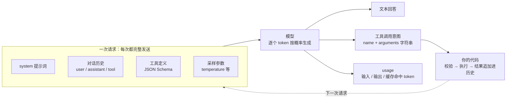
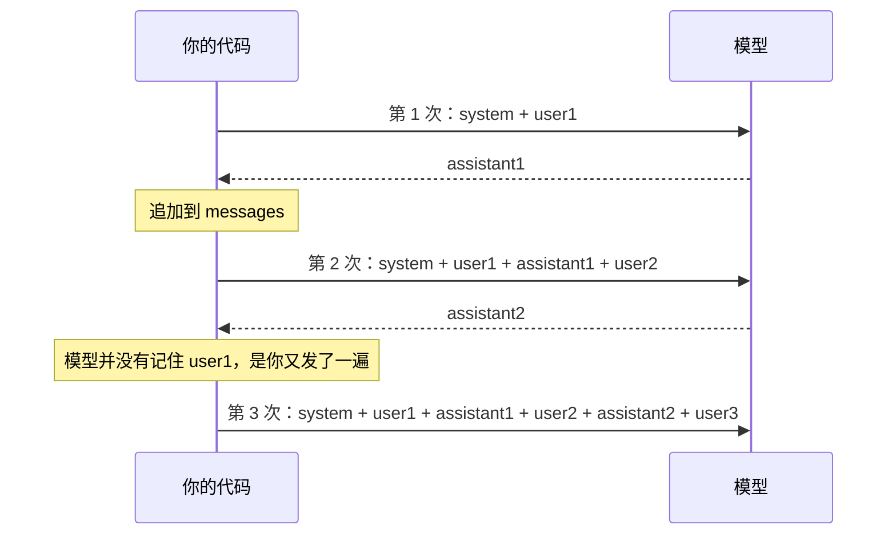
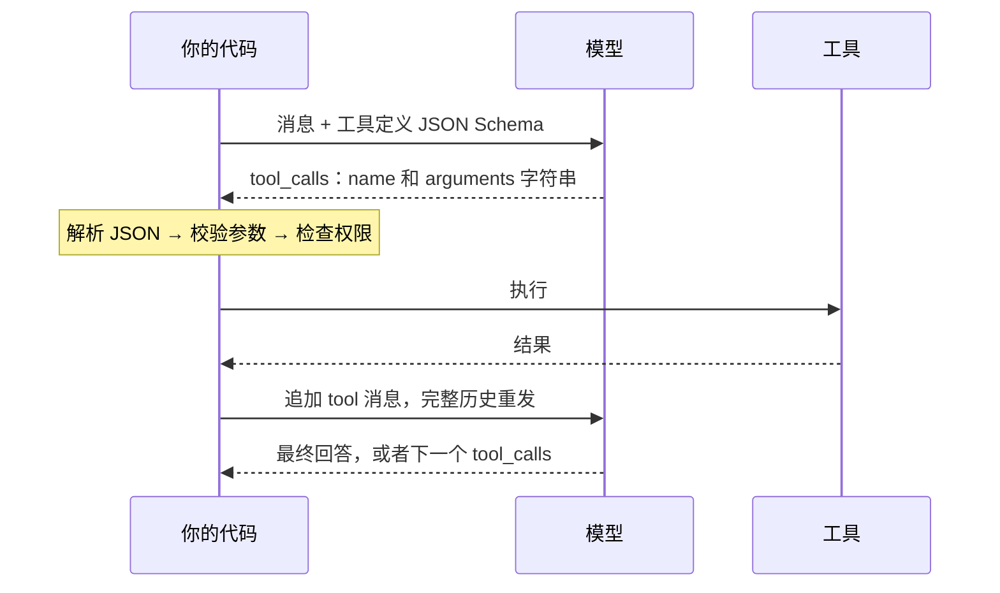
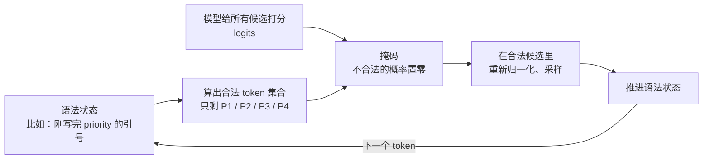

[中文](README.md) | [English](README.en.md)

# 第 01 课：LLM 与 Agent 开发必备知识

> 🕐 建议用时：20 分钟 ｜ 🎯 学完你能：说清 token、消息、采样、工具调用、结构化输出、流式、向量检索、推理模型这些概念**在 Agent 里意味着什么**，并避开新手最常踩的十几个坑 ｜ 📦 对应源码：[`agentkit/llm.py`](../../agentkit/llm.py)、[`agentkit/types.py`](../../agentkit/types.py)、[`agentkit/context.py`](../../agentkit/context.py)（`estimate_tokens`）、[`agentkit/pricing.py`](../../agentkit/pricing.py)、[`agentkit/workflows.py`](../../agentkit/workflows.py)（`complete_json`）
>
> 📖 必读：[Effective context engineering for AI agents](https://www.anthropic.com/engineering/effective-context-engineering-for-ai-agents)

## 0. 一句话讲清楚

**站在 Agent 开发者的角度，LLM 就是一个"无状态、按 token 计费、带随机性"的函数：输入一串消息和一份工具说明书，输出一段文字，或者一张"请帮我调用某个工具"的纸条。**

这三个形容词，每一个都对应着新手的一类"玄学问题"：

- "我什么都没改，账单怎么涨了三倍？" —— **按 token 计费**：对话越长，每次请求重发的历史越多；工具定义也按输入计费。
- "同一个测试，昨天过了今天挂了？" —— **带随机性**：模型按概率抽词，`temperature=0` 也不保证每次一样。
- "它昨天还记得我叫什么，今天怎么忘了？" —— **无状态**：模型什么都不记得，"记忆"是你的代码每次重新发给它的历史。

还有两个是 Agent 特有的：

- "一开流式输出，工具调用就报 `JSONDecodeError`？" —— 工具参数是**一片一片**到达的，要拼完整再解析。
- "它说'已经帮你发了邮件'，其实什么都没发？" —— 模型**只会输出文字**。工具是你的代码执行的，模型对自己做了什么的描述不可信。



下一课（[第 02 课：Agent 循环](../02_agent_loop/README.md)）会把这张图变成一个 `while` 循环。本课先把循环里每个零件的"脾气"摸清楚。

**12 个知识点速览**（赶时间可以只看这张表，再跳到感兴趣的小节）：

| # | 知识点 | 一句话 | 最常见的坑 |
|---|---|---|---|
| 1.1 | Token | 计费、限流、窗口都按 token 算，不按字数 | 漏算工具定义；用估算值对账 |
| 1.2 | 消息与无状态 | 模型不记得任何东西，每次都要发完整历史 | 以为模型"记得"；历史只存在内存里 |
| 1.3 | 采样 | 按概率抽词，同一输入可能不同输出 | 以为 `temperature=0` 就能断言精确输出 |
| 1.4 | Function calling | 模型只输出"想调用什么"的 JSON，执行的是你 | 不校验参数；只处理第一个调用 |
| 1.5 | 结构化输出 | JSON mode 只保证是 JSON，Schema 约束才保证字段 | 把 JSON mode 当成 Schema 保证 |
| 1.6 | 流式 | 降低首 token 延迟；工具参数分片到达 | 拿到第一片就 `json.loads` |
| 1.7 | Embedding | 把文本变成向量，按"意思相近"检索 | 以为相似 = 相关 = 正确 |
| 1.8 | 推理模型 | 先"想"再答，思考 token 按输出计费 | `max_tokens` 太小，全被思考吃光 |
| 1.9 | 幻觉与知识截止 | 模型会自信地编造，也不知道今天几号 | 相信模型对自己能力、行为的描述 |
| 1.10 | 提示词工程 | system prompt 是 Agent 的"岗位说明书"，要当代码管理 | 把提示词当安全边界 |
| 1.11 | 模型选型 | 能力、工具调用、延迟、价格、合规、可用性一起看 | 只看排行榜 |
| 1.12 | API 错误 | 400/401 别重试，429/5xx/超时才重试 | 什么错误都重试 |

有余力的话，深入篇的 [5.1 节](#51-约束生成与解码策略)把 1.3 和 1.5 背后的原理讲透：解码策略（greedy、top-k、beam search）、logprobs 置信度，以及约束解码为什么只保证格式、不保证内容。

## 1. 核心概念

> 本课的实测数据来自本课程使用的 OpenAI 兼容网关（模型 `gpt-5.5`，2026 年 9 月）。换一个模型或服务商，数字会不同，但**现象和结论**是通用的。所有会变的厂商参数、价格、上下文长度，一律以官方文档为准。

### 1.1 Token 与 tokenizer：一切都按 token 算

**是什么。** 模型不认识"字"，只认识 token（词元）。tokenizer（分词器）把文本切成 token，再映射成数字 ID。常见的英文单词通常是 1 个 token，生僻词、数字串、代码、emoji 会被切成好几个；中文一个字对应多少 token，**完全取决于具体模型的 tokenizer**。

本课 Demo 第 1 节的实测（同一个意思，中英文各一版）：

| 请求 | 字符数 | agentkit 估算 | 真实 `prompt_tokens` | 减去基线 |
|---|---|---|---|---|
| 基线：只有一句 system + 一个 `.` | 1 | 26 | 321 | — |
| 中文需求 | 45 | 71 | 355 | +34 |
| 同一需求的英文版 | 183 | 71 | 357 | +36 |
| 中文需求 + 2 个工具定义 | 45 | 71（没算工具） | 473 | +152 |

从这张表能读出四件事：

1. **中英文差不多。** 在这个模型上，45 个汉字约 34 token，183 个英文字符约 36 token。"中文比英文贵一倍"这类说法来自更早的 tokenizer，不要凭印象，拿你自己的模型测一次。
2. **有看不见的输入。** 基线请求我们只发了约 26 token 的内容，服务端却计了 321 个。多出来的是聊天模板的格式 token，以及服务端或网关加入的隐藏指令。你看不到它们，但要为它们付钱，它们也占上下文窗口。
3. **工具定义很贵。** 只是多带了 2 个很短的工具定义，输入就多了 118 token。OpenAI 的文档写得很明确：函数定义会被注入到系统消息里，[占上下文窗口，并按输入 token 计费](https://developers.openai.com/api/docs/guides/function-calling)。一个带 20 个工具的 Agent，每一步都要为这些说明书付钱。
4. **估算只是估算。** agentkit 的 [`estimate_tokens`](../../agentkit/context.py) 按"1 个汉字 ≈ 1 token、4 个其他字符 ≈ 1 token"粗算，在这个模型上对这两段文本都**高估**了 25%～30%（中文估 45、实际 34；英文估 45、实际 36）。偏高对做预算是安全的，但它不能拿来对账。

**为什么对 Agent 重要。** Token 同时决定了三件事：

| 维度 | 按 token 算的是什么 | 在 Agent 里的后果 |
|---|---|---|
| 钱 | 输入单价 × 输入 token + 输出单价 × 输出 token | 每一步都重发完整历史，成本随步数近似**平方**增长（[第 02 课 1.4 节](../02_agent_loop/README.md)） |
| 限流 | 服务商通常同时限制每分钟请求数（RPM）和每分钟 token 数（TPM） | 长上下文的 Agent 往往先撞上 TPM，而不是 RPM |
| 窗口 | 一次请求里输入 + 输出的总量有上限 | 历史越积越长，终有一天超限报 400（[第 04 课](../04_context_memory/README.md)） |

**上下文窗口 ≠ 最大输出长度。** 这是两个不同的上限：

- **上下文窗口**（context window）：一次请求里模型能"看到"的全部 token，包括 system、历史、工具定义、工具结果，以及它这次要生成的输出。
- **最大输出长度**（max output tokens）：一次最多能生成多少 token。它通常远小于上下文窗口，推理模型的"思考"也算在里面（1.8 节）。你在请求里设的 `max_tokens` / `max_completion_tokens` 是给输出设的天花板，碰到了就会被截断，`finish_reason` 变成 `length`。

所以"窗口 128K"不代表能输出 128K，也不代表输入能塞满 128K：输入把窗口占满了，就没有位置留给输出。具体数字每个模型都不一样，以官方模型文档为准。

**三种计价：输入、输出、缓存命中。**

$$\text{一次请求的成本} = (\text{输入} - \text{缓存命中}) \times P_{\text{输入}} + \text{缓存命中} \times P_{\text{缓存}} + \text{输出} \times P_{\text{输出}}$$

- **输出通常比输入贵好几倍**：生成 token 要一个一个算，读输入可以并行。
- **缓存命中的输入有折扣**：请求的开头部分（前缀）和最近某次请求完全一样时，服务商可以复用已经算好的结果，这部分按更低的价格计费，延迟也更低。OpenAI 的文档说折扣[最高可达 90%](https://developers.openai.com/api/docs/guides/prompt-caching)；缓存一般有最短长度门槛，前缀改一个字就会失效，有的厂商还对"写入缓存"额外收费。怎么设计才能命中缓存，见[第 04 课](../04_context_memory/README.md)和[第 14 课](../14_cost_latency/README.md)。
- API 返回的 `usage` 里会分别给出输入、输出、缓存命中的 token 数。agentkit 的 [`Usage`](../../agentkit/types.py) 有 `input_tokens` / `output_tokens` / `cached_input_tokens` 三个字段，[`estimate_cost`](../../agentkit/pricing.py) 就按上面这个公式计算。

**怎么估算。** 按精度从低到高有三档，各有用途：

| 方法 | 精度 | 用途 |
|---|---|---|
| 经验规则（`estimate_tokens`） | 粗略，误差可能 30% 以上 | 预算控制、"还剩多少窗口"的判断 |
| 模型自己的 tokenizer（如 OpenAI 的 [tiktoken](https://github.com/openai/tiktoken)），或厂商提供的 token 计数接口 | 接近真实，但数不到隐藏指令和模板开销 | 发请求前检查是否会超窗口 |
| API 返回的 `usage` | 就是账单 | 计费、成本归因、报表 |

**常见坑：**

- 用字数估算中文成本，或者照搬"一个汉字两个 token"之类的旧经验；
- 算成本时漏掉 system prompt、工具定义、完整历史（练习 (b) 就是这件事）；
- 拿估算值对账。算钱一律以 `usage` 为准；
- 以为 `max_tokens` 一定生效。我们实测发现，本课程使用的网关会**静默忽略** `max_tokens`：设成 8，模型照样输出了 188 个 token。兼容层不一定实现了全部参数，关键的上限要在你自己的代码里再兜一层（例如[第 08 课](../08_reliability/README.md)的预算钩子 `BudgetHook`）。

### 1.2 消息与角色：模型是无状态的

**是什么。** 一次请求的输入是一个消息列表，每条消息有一个角色。消息协议的细节（`tool_calls` 与 `tool_call_id` 怎么配对）在[第 02 课](../02_agent_loop/README.md)详讲，这里只强调一个新手容易忽略的角度：**每种角色的可信程度不同。**

| role | 谁写的 | 可信程度 | 该怎么对待 |
|---|---|---|---|
| `system` | 开发者 | 最高 | 放规则、身份、边界。有的接口叫法不同：OpenAI 较新的接口里还有作用类似的 `developer` 角色，Anthropic 的 system 是请求里单独的一个参数 |
| `user` | 最终用户 | 不可信 | 用户可能试图改写规则（直接注入，[第 09 课](../09_security/README.md)） |
| `assistant` | 模型 | 不可信，直到被校验 | 模型的输出可能是错的、编的，也可能被注入内容带偏 |
| `tool` | 你的代码，内容来自外部系统 | 不可信 | 网页、邮件、文档里可能藏着指令（间接注入，第 09 课） |

**无状态（stateless）。** 模型在两次请求之间**什么都不记得**。所谓的"记忆"，是你的代码维护一个消息列表，每次调用时把它**整个**重新发过去：



这对 Agent 意味着：

1. **钱**：每一次调用都为完整历史付费。有的厂商提供服务端会话状态，比如 OpenAI Responses API 的 `previous_response_id`，你不用自己重发历史了，但官方文档写明：链条中之前的所有输入 token [仍然按输入计费](https://developers.openai.com/api/docs/guides/conversation-state)。省的是带宽和代码，不是钱。
2. **控制权**：历史在你手里，你可以截断、摘要、改写。这既是能力（[第 04 课](../04_context_memory/README.md)的上下文工程），也是责任：截断时拆开了 `tool_calls` 和它的 tool 结果，API 直接报 400。
3. **状态要持久化**：历史只放在进程内存里，进程一重启对话就没了；多实例部署时，下一个请求可能落到另一台机器（[第 13 课](../13_distributed_concurrency/README.md)）。
4. **规则要每次都发**：system prompt 必须在**每一次**请求里都放在最前面，"第一轮告诉过它了"是不成立的。

练习 (c) 的 `build_messages` 就是每个 Agent 每次调用前都要做的事：system 放最前，历史按"轮"截断，最后放上本次的用户输入。

**常见坑：** 以为模型"记得"上一轮；历史里混进多条 system 消息；按"消息条数"截断，把 `tool_calls` 和它的结果拆散；把 `tool` 结果放进 `user` 消息里（模型会把外部数据当成用户的指令）。

### 1.3 采样与非确定性：同一个输入，不同的输出

**是什么。** 模型每生成一个 token，都先给词表里所有候选打一个分（logits），再换算成概率，**按概率抽一个**。控制这个"抽"的参数主要有三个：

| 参数 | 作用 | 直觉 |
|---|---|---|
| `temperature` | 把概率分布变尖或变平 | 越低越保守（接近"每次选最高分"），越高越发散 |
| `top_p` | 只在累计概率达到 p 的候选里抽（nucleus sampling，[Holtzman 等，ICLR 2020](https://arxiv.org/abs/1904.09751)） | 砍掉长尾里那些离谱的候选 |
| `seed` | 固定随机种子 | OpenAI 的说法是"尽力而为"（best effort）地保证可复现，[并不保证](https://cookbook.openai.com/examples/reproducible_outputs_with_the_seed_parameter) |

Demo 第 2 节先用 5 个候选词在本地演示原理：

```text
     候选        T=0.2    T=0.7    T=1.0    T=1.5
     拾光        86.5%    46.5%    38.4%    32.0%
     云朵        11.7%    26.2%    25.7%    24.5%
     ...
     慢慢         0.0%     4.1%     7.0%    10.3%
```

然后用真实模型对同一个问题各跑 3 次。某一次运行的结果：

```text
temperature=0 × 3：['一楼咖啡', '楼下咖啡', '一楼咖啡馆']  → 3 种不同结果
temperature=1 × 3：['楼下咖啡', '楼下有啡', '楼下咖啡']    → 2 种不同结果
```

**`temperature=0` 给出了 3 种不同的答案。** 换一次运行，它又可能三次都一样。为什么 0 也不确定？

- **服务端批处理**：Thinking Machines 的 [Defeating Nondeterminism in LLM Inference](https://thinkingmachines.ai/blog/defeating-nondeterminism-in-llm-inference/)（Horace He，2025-09）指出，主要原因是推理内核不具备"批次不变性"（batch invariance）：同一个请求和不同数量的其他请求拼在一批里算，数值结果会有细微差异，而批次大小取决于服务器当时的负载。他们让 Qwen3-235B 在 temperature 0 下对同一个提示生成 1000 次，得到了 80 种不同的结果。
- **模型悄悄更新**：同一个模型名背后的版本、部署配置可能变。
- **参数没生效**：有的推理模型不支持 `temperature`，有的网关会静默丢掉它。

**对 Agent 意味着什么。** 非确定性在 Agent 里会被**放大**：第一步选了不同的工具，后面整条轨迹都不一样。所以：

- **单元测试**别调用真实模型，用剧本（agentkit 的 `ScriptedLLM`），结果 100% 可复现；
- **评估**要对同一个用例跑多次，看通过率，而不是跑一次看对错（[第 11 课](../11_evals/README.md)的 pass@k 与 pass^k）；
- **生产环境**：工具调用、信息抽取这类任务用低 temperature，创作类任务可以高一些。OpenAI 的 API 文档建议 temperature 和 top_p **只调其中一个**；
- **可观测**：线上问题往往无法复现，所以要把每一次调用的输入、输出都记下来（[第 10 课](../10_observability/README.md)）。

**常见坑：** 断言模型输出的精确字符串；把 `seed` 当作可复现的保证；跑通一次就当作"功能完成"。

greedy、top-k、beam search 这几种解码策略各自适合什么，以及怎么用 logprobs 看出模型"有多确定"，见 [5.1 节](#51-约束生成与解码策略)。

### 1.4 Function calling 的真实机制：模型只会"提议"

**是什么。** 你在请求里附上工具定义（名称、描述、参数的 JSON Schema），模型如果认为需要，就在回复里输出一段结构化的"调用意图"：

```json
{
  "role": "assistant",
  "tool_calls": [{
    "id": "call_2efeb4E1RHQs6iyhIPvpWu8i",
    "type": "function",
    "function": {"name": "get_weather", "arguments": "{\"city\":\"北京\"}"}
  }]
}
```

这是 Demo 第 3 节里模型返回的原始 JSON。Demo 在这一刻打印了"`get_weather` 被执行了 **0** 次"：模型什么都没执行，它只是写了一张纸条。接下来是**你的代码**决定执不执行、怎么执行，再把结果作为 `tool` 消息发回去，模型才能继续。



**为什么这件事这么重要。** 所有的控制权都在你手里，所有的责任也在你手里：参数校验（[第 03 课](../03_tools/README.md)）、权限和审批（[第 09 课](../09_security/README.md)）、超时和重试（[第 08 课](../08_reliability/README.md)），都发生在"模型提议"和"真正执行"之间。

**tool_choice：控制模型"要不要调、调哪个"。**

| OpenAI | Anthropic | 含义 | 在 Agent 里的典型用法 |
|---|---|---|---|
| `"auto"`（默认） | `{"type": "auto"}` | 模型自己决定调不调、调几个 | Agent 主循环 |
| `"none"` | `{"type": "none"}` | 不许调工具，必须直接回答 | 预算快用完了，强制模型收尾 |
| `"required"` | `{"type": "any"}` | 必须调用至少一个工具 | 每一步都必须有动作的流程 |
| `{"type": "function", ...}` 指定名称 | `{"type": "tool", "name": ...}` | 必须调用这个工具 | 把工具当作"结构化输出"用；Workflow 里固定的一步 |

注意：**不是所有模型都支持强制调用**。例如 Anthropic 的文档写明，部分模型收到 `any` 或 `tool` 会[直接返回 400](https://platform.claude.com/docs/en/agents-and-tools/tool-use/define-tools)。用之前查官方文档，并在你的网关上实测。

**并行工具调用。** 一条回复里可以有多个 `tool_calls`（Demo 里"建工单 + 查天气"就是一次发出两个）。OpenAI 提供 `parallel_tool_calls=false` 来关闭。但我们实测发现，本课程的网关**忽略了这个参数**，照样返回了两个调用。所以无论配置如何，你的代码都必须能处理多个调用（[第 02 课 1.6 节](../02_agent_loop/README.md)）。

**为什么参数 JSON 可能不合法。** `arguments` 是模型**一个 token 一个 token 生成的文本**，不是从某个对象序列化出来的。常见的问题：

| 问题 | 原因 |
|---|---|
| 半截 JSON | 输出撞上 `max_tokens` 被截断（`finish_reason == "length"`），或者流式没有拼完整 |
| 缺必填字段、类型不对、多出字段 | 普通模式下，Schema 对模型只是"提示"，不是强制约束 |
| 枚举值是编的 | 你定义的是 `"high"`，模型写了 `"紧急"` |
| 调用了不存在的工具 | 模型"想象"出一个看起来合理的工具名 |
| 参数值是编的 | 格式完全正确，但订单号是模型猜的（这个 Schema 校验不出来） |

**严格模式**（OpenAI 的 `strict: true`、Anthropic 的 strict tool use）在生成时就约束模型只能输出符合 Schema 的内容，能消灭前三类问题，但有前提：OpenAI 要求每个对象都设 `"additionalProperties": false`，而且所有字段都列为必填。它消灭不了最后一类。**所以永远要校验。** 顺便一提，工具名本身也有格式要求：我们给了一个带空格和感叹号的名字，网关返回 `400 Invalid 'tools[0].name': string does not match pattern ... '^[a-zA-Z0-9_-]+$'`。

**常见坑：** 对 `arguments` 用 `eval()`；不校验就执行；只处理 `tool_calls[0]`；让模型通过参数传 `user_id`（身份必须由系统注入，第 03 课）；相信模型说的"我已经调用过了"。

### 1.5 结构化输出：让下游代码拿到可靠的数据

**是什么。** Agent 里很多步骤的输出不是给人看的，而是给代码用的：分类结果、抽取的字段、计划列表。要让模型稳定地输出合法的数据结构，有三个层次：

| 层次 | 做法 | 保证什么 | 不保证什么 |
|---|---|---|---|
| ① 只靠提示词 | "请只输出 JSON" | 什么都不保证 | 模型经常包一层 ` ```json `，或者加一句"好的，结果如下" |
| ② JSON mode | `response_format={"type": "json_object"}` | 输出是**合法 JSON** | 字段名、类型、枚举值都可能不对 |
| ③ Structured Outputs | `response_format={"type": "json_schema", "json_schema": {..., "strict": true}}` | 输出**符合你给的 Schema** | Schema 表达不了的业务规则；拒答；截断 |

OpenAI 的文档原话是：两者都保证输出合法 JSON，[只有 Structured Outputs 保证符合 Schema](https://developers.openai.com/api/docs/guides/structured-outputs)。即使用了 ③，也还有三种情况要处理：模型出于安全原因**拒答**（OpenAI 会在 `refusal` 字段里说明）；输出被 `max_tokens` **截断**；以及"摘要不超过 30 字""结束日期晚于开始日期"这类 Schema 表达不了的约束。

**所以"校验 + 修复"永远需要。** agentkit 的 [`complete_json`](../../agentkit/workflows.py) 是一个不依赖原生能力的通用兜底：在提示词里附上 Schema → 从输出里抠出 JSON → 用 Pydantic 校验 → 失败就把错误信息原样发回给模型让它改，最多改 `max_repairs` 次，还不行就抛异常。Demo 第 5 节的离线模式演示了完整的修复过程：

```text
第 1 次输出：好的，分类结果如下： ```json {"category": "账号", "priority": "紧急", ...} ```
           ❌ 校验失败，错误信息被发回给模型
第 2 次输出：{"category": "account", "priority": "P1", "summary": "OA 登录提示密码错误，急需报销", ...}
           ✅ 通过校验
```

这个修复循环的设计细节在[第 06 课 1.3 节](../06_orchestration/README.md)展开。一个实用技巧：把"想要的结构"定义成一个工具的参数，再用 `tool_choice` 强制调用它，也能得到结构化输出。在不支持 `response_format` 的模型上，这很常用。

原生约束（③）和修复循环不是二选一：前者在生成**过程中**屏蔽不合法的 token，后者在生成**之后**校验业务规则。约束解码的原理、局限和两者的对比表见 [5.1 节](#51-约束生成与解码策略)。

**常见坑：** 以为 JSON mode 保证了字段；用正则从自由文本里"抠"字段；修复循环没有次数上限；要求"输出 JSON"的同时又要求"解释你的理由"（理由请放进 Schema 里的一个字段）。

### 1.6 流式输出：首 token 延迟与分片到达的工具参数

**为什么要用流式。** 模型是一个 token 一个 token 生成的。不开流式，要等全部生成完才返回；开了流式，生成一点就推一点（通常用 SSE，server-sent events）。Demo 第 4 节实测：

```text
TTFT（首 token 时间）= 1.58s，全部完成 = 2.31s，共 31 个 chunk
```

**TTFT**（Time To First Token）是从发出请求到收到第一个 token 的时间。流式**不会让总耗时变短**，但能让用户在 1.6 秒时就看到内容，而不是盯着空白屏幕等 2.3 秒。回答越长，差别越大。对 Agent 来说还有两个好处：可以把"正在查询工单系统…"这样的中间状态实时推给用户；用户可以中途打断（不过已经生成的 token 通常照样计费）。

**经典坑：流式工具调用的参数是分片到达的。** 文本分片到达，大家都知道要拼起来。但工具调用也一样，而且更隐蔽。Demo 4b 的真实输出：

```text
+2.35s index=0 id=call_kJksQxgDU… name=create_ticket  arguments 片段=''
+2.35s index=0 （无 id、无 name）                     arguments 片段='{"'
+2.35s index=0 （无 id、无 name）                     arguments 片段='title'
+2.37s index=0 （无 id、无 name）                     arguments 片段='":"'
……
index=0 的参数分了 59 片到达
❌ 经典错误：拿到第一片就 json.loads('{"') → JSONDecodeError: Unterminated string starting at
```

三条规则：

1. **`id` 和 `name` 只在第一片出现**，后面的分片里它们是 `None`。拼接时不能被 `None` 覆盖。
2. **`arguments` 是一段段字符串**，要按顺序拼接，**等流结束后**再解析 JSON。
3. **并行调用靠 `index` 区分**。不同 `index` 的分片可能交错到达。

还有一个值得记住的实测现象：同一个网关，**单个**工具调用时参数被切成 59 片；Demo 4c **并行**两个调用时，每个调用的参数却是一次性给出的。分几片、怎么切，由服务端决定，你的代码不能做任何假设。

不同接口的名字不一样，原理完全相同：OpenAI Responses API 用 `response.function_call_arguments.delta` 事件和 `output_index`；Anthropic 用 `input_json_delta` 事件里的 `partial_json`，官方文档同样要求[攒齐再解析](https://platform.claude.com/docs/en/build-with-claude/streaming)。练习 (a) 就是实现这个拼接函数；agentkit 里的生产版是 [`agentkit.llm.ToolCallAccumulator`](../../agentkit/llm.py)，`OpenAICompatLLM.stream()` 用它拼出完整的工具调用。

**流式的其他坑：**

- **usage 在最后**：OpenAI 兼容接口要设 `stream_options={"include_usage": true}`，usage 才会出现在最后一个 chunk 里。有的网关不支持，这时流式请求的成本统计要另想办法；
- **流可能中途断掉**：连接断了，你手里是半截回答或半截参数。先想清楚重试的语义：重新生成一次，还是放弃（[第 08 课](../08_reliability/README.md)）；
- **输出护栏要改造**：内容已经显示给用户了，就没法再"脱敏"。需要边生成边检查，或者先缓冲一小段再放出（[第 09 课](../09_security/README.md)）；
- **流结束之前不要执行工具**：要等 `finish_reason` 到达，参数才可能完整。

### 1.7 Embedding 与向量检索基础（📖 选读）

**是什么。** Embedding（嵌入）模型把一段文本变成一串固定长度的数字（向量）。训练的目标是让**意思相近的文本，向量也相近**。"相近"通常用**余弦相似度**衡量：两个向量夹角越小，值越接近 1。

一个 3 维的示意（真实的 embedding 有几百到几千维，下面的数字是为了演示编的）：

| 文本 | 与"怎么重置密码"的余弦相似度 |
|---|---|
| 忘记密码了登不上 | 0.993 |
| 怎么关闭 VPN | 0.505 |
| 报销流程是什么 | 0.227 |

注意第一行：两句话**没有一个词重合**（除了"密码"），却被判定为几乎一样。这是关键词搜索做不到的，这就是"语义检索"。

**为什么 RAG 和记忆离不开它。** 上下文窗口有限，企业知识库有几十万篇文档，不可能全塞进去。做法是：事先把文档切块、向量化、存进向量库；提问时把问题也向量化，找出最相似的几块，放进上下文，再让模型回答。这就是 RAG（检索增强生成）。Agent 的长期记忆本质上也是同一件事（[第 04 课](../04_context_memory/README.md)）。

**局限（每一条都在企业里真实出过问题）：**

- **相似 ≠ 相关 ≠ 正确**。在上面那个示意里，"怎么关闭 VPN"和"怎么开通 VPN"的相似度是 0.999，意思却正好相反。检索回来的内容只是"像"，是否真能回答问题、是否过时，都需要另外判断；
- **不擅长精确匹配**：错误码 `809`、工单号、产品型号，这类字符串用关键词检索（如 BM25）更准。实践中常用**混合检索**；
- **没有权限概念**：向量库只管"像不像"，不管"你能不能看"。权限过滤必须在检索层强制执行（[第 15 课](../15_enterprise_rag/README.md)）；
- **换模型要重建索引**：不同 embedding 模型的向量不能混用；
- **不是所有网关都提供 embedding 接口**：本课程的网关调用 `/embeddings` 返回 404。选型时要确认。

### 1.8 推理模型：先想后答，想也要花钱（📖 选读）

**是什么。** 推理模型（reasoning / thinking model）在给出答案前，先生成一段内部的"思考"。OpenAI 的推理模型、Claude 的 extended / adaptive thinking 都属于这一类。

**成本与延迟。** OpenAI 的文档写明：思考 token（reasoning tokens）[按输出 token 计费，占上下文窗口，而且通过 API 看不到](https://developers.openai.com/api/docs/guides/reasoning)。Anthropic 这边，思考 token 同样计入 `max_tokens`。我们用本课程的模型实测：

| 请求 | 输出 token（`completion_tokens`） | 其中思考 token | 用户看到的 |
|---|---|---|---|
| 写一首七言绝句 | 188 | 143（76%） | 4 行诗 |
| 鸡兔同笼，`reasoning_effort="high"` | 96 | 87 | "23，12" |
| 同一题，`reasoning_effort="low"` | 64 | 55 | "23 12" |

用户只看到 4 行诗，你却要为 188 个输出 token 付钱。思考越多，TTFT 越长。

**什么时候值得用：**

| 值得 | 不值得 |
|---|---|
| 多步规划、拆解复杂任务 | 简单的分类、路由、字段抽取 |
| 数学、代码、逻辑推理 | 闲聊、改写、翻译 |
| 工具很多、需要权衡选哪个 | 对延迟敏感的交互步骤 |
| 评审、打分（LLM 当评委） | 每个请求都要经过的前置检查 |

Agent 里常见的组合是：推理模型负责规划和难点，快模型负责执行和简单步骤（[第 05 课](../05_agent_architectures/README.md)、[第 14 课](../14_cost_latency/README.md)）。

**常见坑：**

- `max_tokens` 设得太小，额度全被思考吃光，可见的回答是空的，`finish_reason` 是 `length`。OpenAI 建议刚开始试验时[至少预留 25,000 token](https://developers.openai.com/api/docs/guides/reasoning) 给思考和输出；
- 推理模型常常不支持 `temperature` 等采样参数；
- 和工具调用一起用时，有的厂商要求把上一轮的思考内容**原样**传回去（例如 Anthropic 的 thinking block），在历史里删改它会导致 400；
- 思考强度的参数名和可选值（effort、budget）各家不同，而且随模型版本变化，以官方文档为准。

### 1.9 幻觉与知识截止：别信模型对自己的描述

**是什么。** 幻觉（hallucination）是模型流畅、自信地说出错误内容。[Why Language Models Hallucinate](https://arxiv.org/abs/2509.04664)（Kalai 等，OpenAI 与佐治亚理工，2025-09）给出的解释是：训练和评测的方式都在奖励"猜"，而不是奖励"承认不知道"，就像考试时蒙一个答案比空着得分更高。**知识截止**（knowledge cutoff）是指模型只知道训练数据截止日期之前的事。

我们直接问了本课程的模型三个问题：

| 问题 | 模型的回答 | 真相 |
|---|---|---|
| 今天是几年几月几号？ | 2026年9月27日（正确） | 模型没有时钟。它能答对，只能是请求里某处带了日期。1.1 节测出，本课程的网关每次都会额外加入约 300 token 我们看不到的内容 |
| 你的训练数据截止到什么时候？ | 2024 年 6 月 | 无法核实。模型对自己的描述来自训练数据里的文字，不是"自我检查"。知识截止日期要看厂商的官方模型文档 |
| 你能访问互联网或查数据库吗？ | 不能 | 在一个配了搜索工具的 Agent 里，它就能。模型对自身能力的判断取决于这次请求里给了它什么 |

**对 Agent 意味着什么。**

- **事实靠工具和检索，不靠模型记忆**：价格、政策、库存、人员信息，都应该从系统里查（第 03 课的工具、第 15 课的 RAG）；
- **把"现在"告诉它**：当前日期、时区、用户身份、所在部门，由你的代码写进上下文；
- **最危险的幻觉是"声称做了某事"**：模型说"已为你重置密码"，但这一轮根本没有调用 `reset_password`。判断做了什么，要看工具执行记录（agentkit 的 `RunResult.tools_called()`），不看模型的文字；
- **允许它说不知道**：提示词里明确"信息不足时直接说明，不要编造"，并要求给出引用来源；
- **用评估度量幻觉率**（[第 11 课](../11_evals/README.md)）。

### 1.10 面向 Agent 的提示词工程：把 system prompt 当代码管

**是什么。** Agent 的 system prompt 是它的"岗位说明书"。和聊天场景不同，它要告诉模型的不只是"你是谁"，还有：什么时候用哪个工具、工具出错怎么办、什么时候该停下来交给人。

一份好的 Agent 提示词通常包含六块：

| 部分 | 回答的问题 | 例子 |
|---|---|---|
| 角色 | 你是谁、服务谁 | 你是某公司内部 IT 服务台助手，服务对象是公司员工 |
| 目标 | 什么算完成 | 解决问题，或者建好工单并告诉用户工单号 |
| 约束 | 不能做什么 | 不承诺具体的修复时间；不透露其他员工的信息 |
| 工具使用指南 | 什么情况用哪个工具、出错怎么办 | 先查知识库；建工单前先查有没有重复的工单 |
| 输出格式 | 回复长什么样 | 中文，不超过 5 句话，步骤用编号列表 |
| 示例 | 边界情况怎么处理 | 1~2 个完整的"输入 → 期望行为"示例 |

**反例 vs 正例：**

```text
❌ 你是一个超级智能的 IT 专家，你什么都懂，请尽全力帮助用户解决一切问题！
```

问题：没有目标（什么算完成？），没有边界（什么都能做？），没有工具指南（什么时候查知识库？），"什么都懂"还在鼓励它编造。

```text
✅
<role>你是 ACME 公司内部的 IT 服务台助手，服务对象是公司员工。</role>

<goal>帮助员工解决 IT 问题。能自助解决的，给出步骤；不能的，创建工单并告诉用户工单号。</goal>

<tools>
- 先用 search_kb 查知识库。回答中引用文章编号，不要编造步骤。
- 创建工单前，先用 list_my_tickets 检查是否已有相同问题的未关闭工单。
- 工具返回错误时，根据错误信息修正参数重试一次；仍然失败，就告诉用户"系统暂时不可用"并给出错误编号。
</tools>

<constraints>
- 不知道的就说不知道，不要猜。
- 没有实际调用工具，就不要说"已经帮你处理了"。
- 涉及密码重置、权限变更的操作需要审批，告知用户等待审批，不要承诺完成时间。
</constraints>

<format>中文，不超过 5 句话；操作步骤用编号列表。</format>
```

Anthropic 的 [Effective context engineering for AI agents](https://www.anthropic.com/engineering/effective-context-engineering-for-ai-agents)（2025-09）把这件事总结为找到"合适的高度"（right altitude）：既不要在提示词里硬编码一大堆脆弱的 if-else，也不要写得空泛到模型得不到具体信号；用 XML 标签或 Markdown 标题把不同部分分开；从最小可用的提示词开始，**根据实际的失败案例**逐步补充说明和示例。

**把 system prompt 当代码来管理：**

- **版本控制 + 代码评审**：提示词放在仓库里，改动要评审，每条规则最好能说出"是为了修哪个问题加的"；
- **改动前先跑评估**：改一句话可能修好一个用例、弄坏三个（[第 11 课](../11_evals/README.md)）；
- **模板化**：日期、用户角色等变量由代码填入，而且**放在后面**。system prompt 的开头保持稳定，才能命中前缀缓存；
- **灰度与回滚**：提示词的变更和代码一样需要灰度发布（[第 16 课](../16_release_ops/README.md)）；
- **不放密钥**，并假设提示词会被用户套出来；
- **提示词不是安全边界**："你不能删除数据"写在提示词里不是权限控制，权限必须在代码里实施（[第 09 课](../09_security/README.md)）。

各个工具**自己**的用法说明，写在工具描述里而不是 system prompt 里（[第 03 课](../03_tools/README.md)）：工具被权限系统隐藏时，它的说明也跟着消失，不会误导模型。

### 1.11 模型选型的维度（📖 选读）

| 维度 | 要问的问题 | 怎么验证 |
|---|---|---|
| 能力 | 在**我的任务**上效果如何？ | 用你自己的评估集跑，不要只看公开排行榜 |
| 工具调用可靠性 | 选对工具的比例？参数合法的比例？支持并行、严格模式、强制调用吗？ | 评估里单独统计这几个指标 |
| 上下文长度 | 标称的窗口有多大？**有效**的窗口有多大？ | 长上下文下效果会下降（[第 04 课](../04_context_memory/README.md)），在你的真实数据长度上测 |
| 延迟 | TTFT、每秒输出 token 数、p99 | 用真实请求压测，看分布而不是平均值 |
| 价格 | 输入、输出、缓存、批处理各多少钱？ | 算**完成一个任务**的总成本，而不是单价。便宜的模型如果多走了几步，可能反而更贵 |
| 数据合规 | 数据存在哪个地区？会不会被用来训练？保留多久？ | 读合同和数据政策。以 OpenAI 为例，其文档说明 API 数据默认[不用于训练](https://developers.openai.com/api/docs/guides/your-data)，滥用监控日志默认最多保留 30 天，并提供零数据保留和数据驻留选项（有条件）。各家条款不同，消费级产品和 API 的条款也可能不同 |
| 可用性 | SLA 是多少？限额（RPM / TPM）够不够？有没有备用模型？ | 查看服务状态历史；给主模型准备降级方案（[第 08 课](../08_reliability/README.md)） |

**怎么选：** 先用**硬约束**淘汰（合规、地区、私有化部署要求），再用**评估集**比较能力和工具调用可靠性，最后在达标的模型里比**单任务成本和延迟**。业务代码只依赖一个很小的模型接口（agentkit 的 [`LLM` 协议](../../agentkit/llm.py)），换模型才不用改业务代码。不同的步骤用不同的模型（模型路由）见[第 14 课](../14_cost_latency/README.md)。

### 1.12 常见 API 错误：先分清"能不能重试"

| 状态码 | 含义 | 本课程网关的真实报错 | 重试有用吗 | 下一步 |
|---|---|---|---|---|
| 400 | 请求本身有问题：参数错、上下文超长、工具定义不合法、模型名不存在 | `Invalid 'tools[0].name': string does not match pattern`；`unknown provider for model no-such-model-xyz` | ❌ 原样重试还是错 | 修请求。上下文超长是特例：截断或摘要后可以再发 |
| 401 | 身份认证失败：key 错了、过期了、被吊销了 | `{'error': 'Invalid API key'}` | ❌ | 告警；检查密钥配置和轮换 |
| 403 | 没有权限：地区不支持、账号没开通这个模型 | — | ❌ | 检查账号、项目和地区设置 |
| 404 | 资源不存在：模型、接口路径 | 调用 `/embeddings` 返回 404 | ❌ | 检查模型名和接口是否被支持 |
| 429 | **两种完全不同的情况**：① 请求太快，触发限流；② 额度或预算用完了 | — | ① ✅ ② ❌ | ① 指数退避 + 抖动，优先遵守 `Retry-After` 头；② 告警、充值、调整预算，重试一万次也没用 |
| 500 / 502 / 503 / 504 | 服务端出错、过载、网关超时（Anthropic 用 529 表示过载） | — | ✅ | 退避重试；持续失败就熔断、切换备用模型 |
| 超时 / 断连 | 在规定时间内没有收到响应 | `APITimeoutError: Request timed out.` | ✅ 通常可以 | 退避重试；设置合理的超时时间；流式请求中途断开要单独处理 |

429 的两种情况是官方文档里明确区分的：OpenAI 的错误码文档把"请求太快"（rate limit reached）和"额度用完"（quota / credit exhausted）列为不同的 [429 错误](https://developers.openai.com/api/docs/guides/error-codes)；Anthropic 也说明，达到月度消费上限时返回的 429 [没有 `retry-after` 头，会一直失败](https://platform.claude.com/docs/en/api/errors)，直到额度恢复。

还有一类"**成功的失败**"：HTTP 200，但 `finish_reason` 是 `length`（被截断）或 `content_filter`（被拦截），或者输出为空、参数 JSON 不合法、模型拒答。它们不会触发任何异常，最容易被漏掉。

agentkit 的 [`OpenAICompatLLM`](../../agentkit/llm.py) 把错误统一包装成 `LLMError`，并用 `retryable` 标记"重试是否可能成功"；重试、熔断、降级在[第 08 课](../08_reliability/README.md)展开。注意 agentkit 为了简洁，把所有 429 都当作可重试，没有区分"额度用完"。

## 2. 从玩具到生产：agentkit 把这些知识写进了哪里

上面的每一条知识，在 agentkit 里都对应着一个具体的设计决策：

| 知识点 | agentkit 的做法 | 为什么这么写 |
|---|---|---|
| 厂商各不相同（1.11） | 业务代码只依赖 `await llm.chat(messages, tools) -> LLMResponse` 这一个接口 | 换模型、换厂商、接网关，业务代码不用改；测试时换成 `ScriptedLLM` |
| 一次调用要等好几秒（1.6） | `chat` 是 `async def`：`OpenAICompatLLM` 基于 `openai.AsyncOpenAI`，带连接池上限 `max_connections` | 等模型时让出事件循环，一个进程同时服务很多会话（[第 02 课](../02_agent_loop/README.md) 1.7 节）；连接池上限就是本进程对网关的最大并发 |
| 流式 + 分片的工具参数（1.6） | `OpenAICompatLLM.stream()` 逐段产出 `TextDelta`，最后产出带完整 `LLMResponse` 的 `StreamDone`；工具参数用 `ToolCallAccumulator` 按 `index` 拼接 | 练习 (a) 的生产版；默认带 `include_usage`，流式时也能算钱 |
| 参数 JSON 可能不合法（1.4） | `ToolCall.arguments` 刻意定义成 `str`，而不是 `dict` | 强迫你在工具层解析和校验，而不是假设它一定合法 |
| 三种计价（1.1） | `Usage` 有 `cached_input_tokens`；`PRICES` 可以填第三个"缓存价" | 缓存命中率是 Agent 成本的关键变量，必须能看到 |
| 估算 vs 真实（1.1） | `estimate_tokens` 只用于上下文预算，成本以 `usage` 为准 | 零依赖、偏保守；精确计数需要模型对应的 tokenizer |
| 非确定性（1.3） | `ScriptedLLM` 按剧本返回，记录每一次调用 | 单元测试零成本、100% 可复现 |
| 结构化输出（1.5） | `complete_json`：Schema 进提示词 → 抠 JSON → Pydantic 校验 → 修复 | 不依赖原生能力的通用兜底 |
| 错误分类（1.12） | `LLMError(retryable=..., retry_after=...)`，SDK 自带重试设为 `max_retries=0` | 重试放到自己看得见、管得住的 `ResilientLLM` 里（第 08 课） |

以错误分类为例，这是 [`agentkit/llm.py`](../../agentkit/llm.py) 里的真实代码（`OpenAICompatLLM.chat` 和它调用的 `map_openai_error`）：

```python
async def chat(self, messages, tools=None, **kwargs) -> LLMResponse:
    try:
        resp = await self._client.chat.completions.create(**self._params(messages, tools, kwargs))
    except (self._openai.APIStatusError, self._openai.APIConnectionError) as e:
        raise map_openai_error(e, self._openai) from e
    return response_from_openai(resp, self.model)


def map_openai_error(e, openai_module) -> LLMError:
    if isinstance(e, openai_module.APIStatusError):
        code = e.status_code
        # 429 限流、408 超时、5xx 服务端错误：重试可能成功；400/401/403/404：重试没用。
        # 但 429 有两种：限流（等一等就好）和额度用完（insufficient_quota，重试一万次也没用）。
        retryable = code in (408, 409, 429) or code >= 500
        if code == 429 and "insufficient_quota" in str(e):
            retryable = False
        retry_after = None
        try:
            retry_after = float(e.response.headers.get("retry-after"))
        except (TypeError, ValueError, AttributeError):
            pass
        return LLMError(str(e), status_code=code, retryable=retryable, retry_after=retry_after)
    return LLMError(f"连接模型失败：{e}", retryable=True)  # APIConnectionError，包含超时
```

再看 usage 是怎么取出缓存命中数和思考 token 的。字段藏在 `prompt_tokens_details` / `completion_tokens_details` 里，而且有的网关根本不返回，所以每一层都要防 `None`：

```python
def usage_from_openai(raw_usage) -> Usage:
    if not raw_usage:
        return Usage()
    details = getattr(raw_usage, "prompt_tokens_details", None)
    cached = (getattr(details, "cached_tokens", 0) or 0) if details else 0
    out_details = getattr(raw_usage, "completion_tokens_details", None)
    reasoning = (getattr(out_details, "reasoning_tokens", 0) or 0) if out_details else 0
    return Usage(raw_usage.prompt_tokens or 0, raw_usage.completion_tokens or 0, cached, reasoning)
```

**agentkit 为了教学做了简化、生产系统值得补上的：**

- **没有精确 token 计数**：发送前的"会不会超窗口"检查只能靠估算。

（这里以前还列着"不支持流式""没有记录思考 token""429 不区分限流和额度用完、不读 `Retry-After`"三条，现在都已经在核心里实现了，见上面的表和代码。）

## 3. 动手：运行 Demo

```bash
.venv/bin/python lessons/01_llm_essentials/demo.py            # 真实模型（约 19 次调用；互不依赖的请求同时发出，实测约 30 秒）
.venv/bin/python lessons/01_llm_essentials/demo.py --offline  # 离线：剧本 + 模拟数据，无需 API key
```

Demo 分 6 节，每节验证本课的一个知识点。两种模式走的是**同一套代码**：离线模式只是把 OpenAI 客户端换成了一个按剧本返回的假客户端（`FakeOpenAIClient`），这本身也说明了"业务代码只依赖接口"的好处。

Demo 的代码是 async 的（`openai.AsyncOpenAI`，`await` 每一次请求）：第 1、2 节里互不依赖的请求用 `asyncio.gather` 同时发出，`asyncio.Semaphore` 限制同时在途的数量。现在只要知道 `await` 是"等这个请求回来"、`gather` 是"这几个一起等"就够了，原理在[第 02 课](../02_agent_loop/README.md) 1.7 节从零讲。

真实模型的输出节选（2026-09-28 用 async 版 demo 重跑，模型 gpt-5.5，经本课程的 OpenAI 兼容网关；token 数和之前同步版的运行完全一致，耗时、采样结果每次都会不同）：

```text
第 1 节  Token 与成本：估算值 vs 真实 usage，以及"看不见的"输入
  请求                          字符数  估算 token  真实 prompt_tokens  减去基线
  基线：只有 system + "."            1          26                 321         —
  中文需求                          45          71                 355       +34
  同一需求的英文版                 183          71                 357       +36
  中文需求 + 2 个工具定义           45          71                 473      +152  （估算没算工具定义）
  💡 只是多带了 2 个工具定义，输入就多了 118 token —— 工具定义每次请求都要发、都要付钱。

第 2 节  采样与非确定性：temperature 到底改变了什么
     temperature=0 × 3：['一楼咖啡', '楼下咖啡', '楼下有咖啡']  → 3 种不同结果
     temperature=1 × 3：['楼下咖啡', '楼下咖啡', '楼下咖啡']  → 1 种不同结果
  💡 temperature=0 也给出了不同结果 —— 这正是本节的重点：0 不等于确定。

第 3 节  Function calling 的真实机制：模型只会"提议"，执行的是你的代码
  ③ 此刻 get_weather 被执行了 0 次。模型只是写了一段"我想调用 get_weather"的 JSON。
     注意 arguments 的类型是 str：一段 JSON 文本，要你自己解析和校验。
  ④ 🔧 我们的代码执行 get_weather({'city': '北京'}) → {"city": "北京", "temp_c": 22, "condition": "晴"}
  ⑤ 把结果发回去（第二次请求，4 条消息，完整历史重发），模型据此回答：
     北京现在22℃，天气晴。出门一般不需要带伞，注意防晒即可。

第 4 节  流式输出：TTFT，以及"工具调用参数是一片一片到达的"
     TTFT（首 token 时间）= 1.58s，全部完成 = 2.31s，共 31 个 chunk
  4b. index=0 的参数分了 59 片到达
     ❌ 经典错误：拿到第一片就 json.loads('{"') → JSONDecodeError: Unterminated string starting at
  4c. index=0 的参数分了 2 片到达，index=1 的参数分了 2 片到达
        create_ticket({"title": "VPN报错809无法连接", ...})  ← id=call_4XIEunlxSGmYBLhiO7Mlsk2X
        get_weather({"city": "杭州"})  ← id=call_TTHtLSlo3Wmh9vYjFbmHs0YW

第 5 节  结构化输出：让下游代码拿到"可靠的数据结构"，而不是一段话
  5a. 原始输出：{"category":"account","priority":"P2","summary":"OA登录密码错误需处理","needs_human":true}
  5b. 第 1 次输出：{"category":"account","priority":"P2",...}  ✅ 通过校验

第 6 节  约束解码与 logprobs："只许说合法的话"，以及"它有多确定"
  6a. 不加约束，贪心选最高分：'紧急' → 不在枚举里，校验失败
      约束解码：把不合法的候选概率置零、剩下的重新归一化 → 选出 'P2'，格式一定合法
  6b. 模型输出：'account'
     ⚠️  请求成功（HTTP 200），但返回里没有 logprobs：这个网关 / 模型静默忽略了它，不报错，只是不生效。
```

该观察什么：

1. **第 1 节的"减去基线"一列**：两个很短的工具定义比中文需求本身还贵。再看基线：你只发了 26 token，却付了 321 token 的钱。
2. **第 2 节多跑几次**：`temperature=0` 的结果时而一致、时而不一致。这就是为什么测试不能断言精确输出。
3. **第 3 节的"执行了 0 次"**：模型返回的只是一个 `str` 类型的 JSON 提议。
4. **第 4 节 4b 和 4c 的分片数对比**：同一个网关，单个调用切成 59 片，并行调用每个只有 2 片。拼接代码必须对这两种情况都成立。
5. **第 5 节 5a 和 5b 是两次独立的分类**：这次运行两次都给了 `P2`；之前的一次运行里，5a 给了 `P2`、5b 给了 `P1` —— 同一封邮件，优先级不同。结构化输出保证的是**格式**，不是**判断的一致性**。这又回到了第 2 节。
6. **第 6 节**：6a 用 5 个编造的候选演示约束解码怎样把"想说的"挤成"合法的"；6b 在真实网关上拿不到 logprobs，Demo 打印了降级方案。离线模式模拟了一个支持 logprobs 的接口：`account` 的概率是 88.7%，低于 90% 的阈值，于是转人工复核（离线数值是示意用的）。

## 4. 练习

打开 [`exercise.py`](exercise.py)，实现三个函数（都是纯函数，不调用模型）：

1. **`accumulate_tool_call_deltas(chunks) -> list[ToolCall]`**：把 OpenAI 流式返回中按 `index` 分片到达的 `tool_calls` 拼成完整调用。要处理：`id`/`name` 只在第一片出现、后续分片里是 `None`；`arguments` 分多片；多个并行调用交错到达；与工具无关的 chunk（纯文本、只带 usage 的最后一个 chunk）；没有参数的工具；缺 `id` 时报错。**不要**在这里解析 JSON。
2. **`estimate_request_cost(messages, tools, expected_output_tokens, price, *, cached_input_tokens=0) -> CostEstimate`**：估算一次请求的成本。**工具定义也要算进输入 token**，这是新手最常漏掉的一项。价格支持"输入 / 输出 / 缓存命中"三种单价。
3. **`build_messages(system, history, user_input, max_history_turns) -> list[dict]`**：拼装一次请求的消息。system 永远在最前且只有一条；历史按"轮"（从一条 user 消息到下一条 user 消息之前）截断，保证不拆开 `tool_calls` 与它的 tool 结果；丢掉开头的孤立消息；不修改调用方传入的 history。

提示：

- 每个函数的 docstring 里都写了完整的规则，测试就是按这些规则写的；
- 先跑一遍 `demo.py`，第 4 节会把真实的流式分片一片一片打印出来，`chunk.model_dump()` 的结果就是练习 (a) 的输入格式；
- (c) 的关键洞察：**按轮切分**以后，`assistant(tool_calls)` 和它的 tool 结果天然落在同一轮里，截断永远不会拆开它们；
- 写完 (a) 之后，对照一下生产版 [`agentkit.llm.ToolCallAccumulator`](../../agentkit/llm.py)：它直接吃 SDK 的分片对象（不是 dict），而且缺 `id` 时会补一个本地生成的 id、而不是报错。报错还是兜底，是一个取舍：练习选了"大声失败"，生产版选了"能继续就继续"（补出来的 id 只在本地配对用）。

验证：

```bash
.venv/bin/python -m pytest lessons/01_llm_essentials
# 也可以用：make lesson N=01
```

22 个测试全部通过即完成。写完后对照 [`solution.py`](solution.py)，再想一想：如果历史的**最后一轮**是一条带 `tool_calls` 的 assistant 消息，但因为进程崩溃没有 tool 结果，`build_messages` 应该怎么处理？（提示：[第 02 课](../02_agent_loop/README.md)里 agentkit 的 `_close_dangling_calls`。）

## 5. 深入（给有余力的你）

**tokenizer 为什么各不相同。** 主流 tokenizer 大多基于 BPE（Byte Pair Encoding）一类的子词算法（[Sennrich 等，2016](https://arxiv.org/abs/1508.07909)）：从单个字节或字符出发，反复把训练语料里最常一起出现的片段合并成新的 token。所以一个 tokenizer 对哪种语言"省"，取决于它的训练语料里这种语言有多少。同一家厂商换一代 tokenizer，中文的 token 数就可能明显变化。这也是为什么 token 数只能在具体的模型上测。

**同一个概念，三种接口形状。** 学会一种，另外两种只是换了名字：

| 概念 | OpenAI Chat Completions | OpenAI Responses API | Anthropic Messages API |
|---|---|---|---|
| 系统提示 | `system` / `developer` 消息 | `instructions` 或 `developer` 消息 | 顶层 `system` 参数 |
| 工具参数的 Schema | `parameters` | `parameters` | `input_schema` |
| 模型发起调用 | `message.tool_calls[]` | `function_call` item | `tool_use` 内容块 |
| 回传工具结果 | `role: "tool"` + `tool_call_id` | `function_call_output` item + `call_id` | user 消息里的 `tool_result` 块 + `tool_use_id` |
| 强制调用工具 | `tool_choice: "required"` 或指定函数 | 同左 | `tool_choice: {"type": "any"}` / `{"type": "tool"}` |
| 流式工具参数 | `delta.tool_calls[].function.arguments` | `response.function_call_arguments.delta` | `input_json_delta` 的 `partial_json` |

**兼容层会"悄悄"和官方不一样。** 本课程用的是一个 OpenAI 兼容网关。实测中，我们发现了它和官方接口的至少四处差异：静默忽略 `max_tokens`；静默忽略 `parallel_tool_calls=false`；静默忽略 `logprobs`（5.1 节）；一条前面没有 `assistant(tool_calls)` 的孤立 `tool` 消息没有报错（官方接口会返回 400）。另外它不提供 `/embeddings`。这类差异不会报错，只会让你的假设悄悄失效。对策是给你依赖的**每一个**参数写一个针对真实接口的小测试（契约测试），换网关或升级版本时跑一遍。

### 5.1 约束生成与解码策略

一句话：**解码策略决定"从概率里怎么挑"，logprobs 让你看见"挑的时候有多犹豫"，约束解码决定"哪些候选有资格被挑"。** 这三件事都发生在 1.3 节那张"每一步给所有候选打分"的图里。

**解码策略：同一份概率分布，几种挑法。** 解码（decoding）就是"每一步从概率分布里选出下一个 token"的规则：

| 策略 | 怎么挑 | 直觉 | 在哪里能用 | 对 Agent 意味着什么 |
|---|---|---|---|---|
| 贪心（greedy） | 每一步都选概率最高的 token | 只看眼前一步，不回头 | 本地推理库的默认策略（如 Hugging Face transformers，在生成配置没有另行指定时）；API 上 temperature 接近 0 时近似它 | 适合分类、抽取、填工具参数；transformers 文档指出它生成长序列时会开始重复自己 |
| 温度采样（temperature） | 先用温度把分布变尖或变平，再按概率抽 | 温度越低越接近贪心 | 几乎所有 API | 工具调用、抽取用低温，创作类任务可以高一些（1.3 节） |
| top-k | 只在概率最高的 k 个候选里抽 | 固定砍掉长尾 | 开源推理框架常见；OpenAI 接口不提供；Anthropic 的 API 文档已把 `top_k` 标为弃用，Claude Opus 4.6 之后发布的模型不再接受 | 很少需要手调 |
| top-p（nucleus） | 只在累计概率刚好达到 p 的最小候选集合里抽 | 按分布的形状自适应地砍长尾 | 大多数 API | 和 temperature 只调一个（1.3 节） |
| beam search（束搜索） | 同时保留 k 条候选序列，最后选**整条序列**概率最高的那条 | 多看几步再决定 | 本地推理框架（transformers 的 `num_beams`）；主流聊天 API 一般不提供 | transformers 文档说它最适合"以输入为依据"的任务（看图说话、语音识别）；Holtzman 等（ICLR 2020）发现，以概率最大化为目标的解码在开放式生成里容易写出乏味、重复的文本 |

对 Agent 来说，两个结论最有用：

- **大多数步骤要的是"最可能的那一个"**：选工具、填参数、分类，都用低温。但"最可能"不等于"对"，第一步贪心选错了，后面没有回头路（1.3 节说的轨迹放大）。
- **"多看几条路再选"通常在应用层做，而不是在 token 层做**：采样几条完整答案再投票（self-consistency），或者生成几个候选再让评估器挑（best-of-N），这就是[第 06 课](../06_orchestration/README.md)的并行投票和评估-优化模式。它们用的是托管 API 也支持的普通采样，比较的是整条答案，而 beam search 比较的是 token 序列的概率。

**logprobs：把"有多确定"变成一个数字。** logprob 是概率的自然对数：0 表示 100%，越负越不可能，`exp(logprob)` 就是概率。OpenAI 的 Chat Completions 接口设 `logprobs=true` 会返回每个输出 token 的 logprob，再设 `top_logprobs`（0～20）还会给出每个位置概率最高的几个候选。在 Agent 里它有三个用处：

1. **分类和路由的置信度**：答案只有一个 token 时，P(标签) 就是置信度。低于阈值就转人工，或者升级到更强的模型（[第 06 课](../06_orchestration/README.md)的级联路由）。技巧：让各个标签**第一个 token 就不同**（比如用 A / B / C 做选项），否则你看到的只是第一个片段的概率。
2. **看犹豫程度**：第一名和第二名的概率差（margin）很小，说明模型在两个答案之间摇摆，这比只看第一名更有信息量。
3. **挑出最值得人工看的样本**：按置信度从低到高抽样复核、补进评估集。OpenAI 的 [Using logprobs](https://developers.openai.com/cookbook/examples/using_logprobs) 还演示了用它判断检索到的内容够不够回答问题、决定什么时候触发自动补全。

两个前提要记住：

- **logprob 不等于"答对的概率"**。"说有 90% 把握时，真的有 90% 答对"叫作**校准**（calibration）。[GPT-4 技术报告](https://arxiv.org/abs/2303.08774)显示：预训练模型校准得很好，经过后训练（RLHF）之后校准明显变差。所以 logprobs 可以用来排序，阈值却必须用你自己的标注数据来定：把样本按置信度分桶，看每一桶的真实准确率（可靠性图）；需要时再做后处理校准，比如温度缩放（temperature scaling，Guo 等，ICML 2017）。
- **不一定拿得到**。不是所有厂商和模型都提供它；推理模型常常不支持 logprobs 或 temperature 这类参数，或者只在关闭推理时才支持（例如 [Azure OpenAI 的推理模型文档](https://learn.microsoft.com/en-us/azure/foundry/openai/how-to/reasoning)），以官方文档为准。我们在本课程的网关上用 `gpt-5.5` 和 `gpt-5.6-luna` 各试了一次：请求返回 HTTP 200，`logprobs` 字段却是 `None`。这两个都是推理模型，上面那份 Azure 文档正好把 logprobs 列为推理模型不支持的参数；可网关没有报错，而是把参数**静默丢掉**了。Demo 第 6 节遇到这种情况会打印降级方案，而不是崩掉。

**约束生成：只许模型说"合法的话"。** 约束生成（constrained / structured generation，也叫约束解码）把"什么算合法输出"写成一个形式语言（JSON Schema、正则表达式、上下文无关文法 CFG），然后在生成的**每一步**把"会让输出不再合法"的 token 的概率置零，只在剩下的候选里挑：



难点在"每一步都要快"：词表通常有几万到二十万个 token，不能每一步都逐个检查。几种代表性的实现：

| 实现 | 思路 | 在哪里用 |
|---|---|---|
| [Outlines](https://github.com/dottxt-ai/outlines)（Willard & Louf，2023） | 把正则和 JSON Schema 编译成有限状态机，事先建好"状态 → 合法 token"的索引，生成时查表，开销很小 | 开源 Python 库，接本地或自托管模型 |
| [XGrammar](https://github.com/mlc-ai/xgrammar)（Dong 等，MLSys 2025） | 面向上下文无关文法（能表达任意嵌套的 JSON）；把词表分成可以预先检查的"上下文无关 token"和只能在运行时判断的"上下文相关 token"，并和推理引擎协同设计。论文报告相对已有方案最高约 100 倍加速，端到端几乎零开销 | 据其 README，是 vLLM、SGLang、TensorRT-LLM、MLC-LLM 等推理引擎的默认结构化生成后端 |
| 托管 API | OpenAI 的 Structured Outputs 和严格模式属于这一类。它的文档写明：第一次使用某个 Schema 的请求会有额外延迟，因为要先处理这个 Schema，之后同一个 Schema 就没有了。GPT-5 的自定义工具还能用 Lark 文法或正则约束输出，OpenAI 的 [cookbook](https://developers.openai.com/cookbook/examples/gpt-5/gpt-5_new_params_and_tools) 写明底层用的是 [LLGuidance](https://github.com/guidance-ai/llguidance) | 你控制不了解码过程，只能用厂商开放的那几种约束 |

**局限：约束了格式，不等于内容正确。**

1. **只管语法，不管语义**。订单号是不是真的、金额对不对、结束日期是不是晚于开始日期，约束一概不管。OpenAI 在上面那篇 cookbook 里也提醒：模型偏离分布时，输出可能"语法正确但语义错误"。
2. **会扭曲模型的分布**。Park 等（[Grammar-Aligned Decoding](https://arxiv.org/abs/2405.21047)，NeurIPS 2024）指出，约束解码得到的输出合乎语法，但出现的概率和模型本身给出的概率不成比例。直观的例子是 Demo 第 6a 节：模型最想说的是"紧急"（不在枚举里），被屏蔽之后，剩下的概率重新归一化，选中的是 `P2` 而不是意思更接近的 `P1`。格式合法，判断却错了。
3. **可能拖累推理**。Tam 等（[Let Me Speak Freely?](https://arxiv.org/abs/2408.02442)，2024）发现，在格式限制下模型的推理能力明显下降，而且限制越严格，下降越多。常见的缓解办法：在 Schema 里放一个靠前的"推理"字段让模型先写理由，或者先自由作答，再用第二次调用转成结构化格式。
4. **Schema 能力有限**。托管服务只支持 JSON Schema 的一个子集（OpenAI 文档说有些特性出于性能或技术原因不可用），"摘要不超过 30 字"这类规则可能写不进去。
5. **拒答和截断照样会发生**（1.5 节）：约束管不了模型拒答，输出撞上 `max_tokens` 时 JSON 仍然是半截的。
6. **要在你控制解码的地方才能用**。任意文法约束需要自己部署推理引擎（vLLM、SGLang 等）；用托管 API，就只有厂商开放的那几种。

**和 `complete_json` 修复循环比一比：**

| 维度 | 约束解码（原生 Structured Outputs、严格模式、Outlines、XGrammar） | `complete_json`：提示词 + 校验 + 修复 |
|---|---|---|
| 在哪一步起作用 | 生成**过程中**：每一步屏蔽不合法的 token | 生成**之后**：校验整段输出，不合格就把错误发回去重来 |
| 格式保证 | 语法层面有保证（限于支持的 Schema 子集） | 没有保证：修了 `max_repairs` 次还不行就抛异常 |
| 能检查什么 | 只有写得进 Schema 或文法的约束 | Pydantic 能写的都行：长度、跨字段规则、自定义校验函数，甚至去查数据库 |
| 额外调用 | 0（新 Schema 首次请求有处理延迟） | 每修复一次多 1 次调用 |
| 模型能不能"改主意" | 不能：不合法的候选直接被删掉，可能被挤到次优的合法值上 | 能：看到错误信息后重新生成（Demo 第 5 节离线模式） |
| 依赖什么 | 模型、网关或推理引擎支持 | 任何能输出文本的模型 |
| 失败时长什么样 | 合法但可能错误的值；拒答；截断 | 超过修复次数后抛异常（大声失败） |
| 适合 | 下游代码要解析的每一步、工具参数、高吞吐场景 | 不支持原生能力的模型；Schema 表达不了的业务规则 |

**怎么搭配：两道关，而不是二选一。** 能用原生约束就用，它消灭了绝大多数格式错误和修复调用；约束之后照样用 Pydantic 校验业务规则，校验失败再走修复循环，修不好就大声失败。agentkit 选择只实现后一道关，是因为它不依赖任何厂商能力（第 2 节表格）。

## 6. 常见坑与反模式

1. **用字数估算成本**，或者算成本时漏掉工具定义、system prompt、完整历史。
2. **拿 `estimate_tokens` 之类的估算值对账**。算钱只认 `usage`。
3. **以为模型记得上一轮**。它是无状态的，"记忆"是你每次重发的历史。
4. **断言模型输出的精确字符串**，并且以为 `temperature=0` 能保证它成立。
5. **对 `arguments` 用 `eval()`**，或者不校验就执行。
6. **只处理 `tool_calls[0]`**。并行调用时，下一次请求直接 400。
7. **流式时拿到第一片就 `json.loads`**，或者用后面分片里的 `None` 覆盖了 `id` 和 `name`。
8. **把 JSON mode 当成 Schema 保证**；修复循环没有次数上限。
9. **推理模型的 `max_tokens` 设得和普通模型一样小**，思考把额度吃光，回答是空的。
10. **相信模型对自己的描述**："我不能上网""我已经帮你发送了"，都要以工具执行记录为准。
11. **把提示词当安全边界**，把权限控制写在 system prompt 里。
12. **什么错误都重试**：400 和 401 重试一万次也是同样的结果；额度用完的 429 也一样。
13. **只看排行榜选模型**，不在自己的任务上评估，也不算完成一个任务的总成本。
14. **假设兼容网关和官方接口行为一致**。你依赖的每个参数都要实测。
15. **以为约束解码或严格模式保证了内容正确**。它只保证格式，业务规则照样要校验（5.1 节）。
16. **把 logprobs 当成校准过的"答对概率"**，或者默认网关一定会返回它。阈值要用标注数据定，拿不到时要有降级方案。

## 7. 面试 & 设计评审问题

<details>
<summary>Q1：一个 Agent 平均每个任务跑 8 步，上线后成本是预估的 5 倍。你会从哪些方向排查？</summary>

- 预估是不是只算了用户输入和最终回答？每一步都要重发完整历史，输入随步数近似平方增长；
- 工具定义、system prompt、服务端隐藏指令都按输入计费。工具多的时候，这一项很可观；
- 工具结果是不是太大（一次返回几千字的原始数据）？
- 是否用了推理模型？思考 token 按输出计费，而输出单价通常是输入的几倍；
- 缓存命中率是多少？system prompt 开头是不是放了时间戳这类每次都变的内容？
- 看 `usage` 的真实分布和追踪数据（第 10 课），而不是看估算值。
</details>

<details>
<summary>Q2：为什么 temperature=0 仍然不能保证输出一致？这对测试和评估意味着什么？</summary>

- 服务端的批处理使同一个请求和不同的请求拼批计算，推理内核不具备批次不变性，数值有细微差异；模型版本和部署会悄悄变；有的模型或网关会忽略这个参数；
- 测试：单元测试用剧本模型（`ScriptedLLM`），不调用真实模型；
- 评估：每个用例跑多次，看通过率和稳定性（pass@k 衡量"能不能做到"，pass^k 衡量"是不是每次都能做到"），第 11 课；
- 线上：记录每次调用的完整输入输出，因为问题往往无法复现。
</details>

<details>
<summary>Q3：模型返回的工具调用参数不是合法 JSON，可能有哪些原因？你的系统应该怎么处理？</summary>

- 原因：输出被 `max_tokens` 截断；流式分片没有拼完整；普通模式下 Schema 只是提示，模型生成的文本可能有语法错误；
- 处理：不崩溃，把"参数不是合法 JSON，错误是 …"作为工具结果反馈给模型，让它重新生成（错误即观察，第 03 课）；
- `finish_reason == "length"` 时要告警，并考虑提高输出上限；
- 如果模型支持，对关键工具开启严格模式；同时仍然做 Schema 校验和业务校验。
</details>

<details>
<summary>Q4：JSON mode 和 Structured Outputs 有什么区别？用了 Structured Outputs 还需要校验吗？</summary>

- JSON mode 只保证输出是合法 JSON；Structured Outputs 通过约束解码保证输出符合给定的 JSON Schema；
- 仍然需要校验：模型可能拒答（`refusal`）、输出可能被截断、Schema 表达不了业务规则（长度、跨字段约束、取值是否真实存在）；
- 兜底：校验失败时把错误信息发回去让模型修正，设置修复次数上限，修不好就抛异常交给上层。
</details>

<details>
<summary>Q5：你要给一个客服 Agent 加上流式输出。除了"把文字逐字显示"，还有哪些地方要改？</summary>

- 工具调用的参数改成按 `index` 分片拼接，流结束之后再解析、再执行；
- usage 改成从最后一个 chunk 读取（需要 `include_usage`；网关不支持时要有替代方案）；
- 输出护栏：内容一旦显示就撤不回，脱敏和违规检测要改成边生成边检查，或者先缓冲一小段；
- 中途断流的处理：已显示的半截内容怎么办，要不要重试，重试会不会重复执行工具；
- 指标：开始关注 TTFT，而不只是总延迟。
</details>

<details>
<summary>Q6：业务方想让 Agent 回答"公司最新的差旅政策"，并且"越准确越好"。你会怎么设计？</summary>

- 不依赖模型的记忆：政策会更新，模型有知识截止日期，还会编造；
- 用检索（RAG）或者一个"查询政策"的工具，从权威的数据源取出最新的版本；
- 要求回答附上引用（文档名、版本、生效日期），找不到就说找不到；
- 检索要按用户的权限过滤（第 15 课），过期版本要能下线；
- 用评估集度量回答的准确率和引用的正确率（第 11 课）。
</details>

<details>
<summary>Q7：什么情况下你会选推理模型？什么情况下不会？</summary>

- 会：多步规划、复杂推理、代码与数学、工具很多需要权衡、LLM 当评委；
- 不会：简单分类、路由、抽取、改写，以及对延迟敏感、每个请求都要经过的步骤；
- 常见组合：推理模型做规划，快模型做执行；
- 注意事项：思考 token 按输出计费、占上下文；`max_tokens` 要预留足够空间；很多采样参数不支持；和工具一起用时，有的厂商要求原样回传思考内容。
</details>

<details>
<summary>Q8：同事说"我们开了严格模式，JSON 百分之百合法，校验和修复循环可以删了"。你怎么回应？</summary>

- 约束解码保证的是**语法**：输出能被解析、字段齐全、枚举值合法；它不保证值是对的（订单号是否存在、日期先后、金额是否匹配）；
- 它还会扭曲模型的分布：模型最想说的候选不合法时，会被挤到次优的合法值上，结果"合法但错误"；格式限制也可能拖累推理质量；
- 拒答和截断照样会发生；托管服务只支持 JSON Schema 的一个子集，有些业务规则写不进去；
- 结论：原生约束和校验是两道关。保留 Pydantic 业务校验，失败时走修复循环（有次数上限），修不好就大声失败；
- 需要置信度时可以看 logprobs，但先确认接口真的返回它，并用标注数据校准阈值。
</details>

## 8. 必备知识自测

先自己回答，再展开看答案。

<details>
<summary>1. 同一个意思，中文和英文哪个 token 更多？怎么确定？</summary>

没有通用答案，取决于具体模型的 tokenizer。在本课程的模型上，45 个汉字约 34 token，183 个英文字符约 36 token，基本持平。确定的方法是在你的模型上实测：用模型的 tokenizer 数，或者看 API 返回的 `usage`。
</details>

<details>
<summary>2. 一个模型的上下文窗口是 128K，是不是意味着它能一次输出 128K token？</summary>

不是。上下文窗口是输入加输出的总量上限；最大输出长度是另一个通常小得多的上限，推理模型的思考也算在输出里。输入占满了窗口，就没有位置留给输出。
</details>

<details>
<summary>3. 你的请求只有 30 个 token，API 却返回 prompt_tokens=321。可能是什么原因？</summary>

聊天模板的格式 token，以及服务端或网关在你的消息之外加入的隐藏指令。如果带了工具，工具定义也会被注入提示词。这些都要付钱，也占上下文窗口。
</details>

<details>
<summary>4. 多轮对话里，第 10 轮时模型"记得"第 1 轮的内容。它是怎么记住的？</summary>

它没有记住。模型是无状态的，是你的代码在第 10 次请求里把第 1 轮到第 9 轮的消息又完整发了一遍。这也是为什么对话越长，每次请求越贵。
</details>

<details>
<summary>5. 为什么单元测试里不能断言模型输出的精确字符串，即使设置了 temperature=0？</summary>

temperature=0 也不保证确定性：服务端批处理带来的数值差异、模型版本变化、参数被忽略，都会让输出变化。单元测试应该用剧本模型；评估要多次采样看通过率。
</details>

<details>
<summary>6. 模型返回了一个 tool_call，此时这个工具被执行了吗？谁来执行？</summary>

没有。模型只输出了一段"想调用什么、参数是什么"的 JSON。由你的代码解析、校验、检查权限、执行，再把结果作为 tool 消息发回给模型。
</details>

<details>
<summary>7. tool_choice 的 auto、none、required、指定工具各适合什么场景？</summary>

auto：Agent 主循环，让模型自己决定。none：强制模型直接回答，例如预算快用完时让它收尾。required：每一步都必须调用工具的流程。指定工具：把工具当作结构化输出，或者 Workflow 里固定的一步。注意部分模型不支持强制调用。
</details>

<details>
<summary>8. 流式返回里，工具调用的 id 和 name 出现在哪里？arguments 应该什么时候解析？</summary>

id 和 name 只在每个调用的第一片出现，后续分片里是 None，拼接时不能被覆盖。arguments 按 index 分组、按到达顺序拼接，等流结束后再解析。多个并行调用靠 index 区分，分片可能交错到达。
</details>

<details>
<summary>9. 用户问"怎么开通 VPN"，向量检索返回了一篇"怎么关闭 VPN"的文章，而且相似度很高。为什么？怎么缓解？</summary>

向量相似度衡量的是"说的是不是同一类事"，不是"意思是否一致"，所以意思相反的句子也可能非常相似。缓解：混合检索（关键词加向量）、重排序、在提示词里要求模型核对检索内容是否真的回答了问题，并附上引用。
</details>

<details>
<summary>10. 调用模型时收到 429，应该怎么处理？</summary>

先区分是哪种 429：如果是请求太快触发了限流，就用指数退避加抖动重试，优先遵守 `Retry-After` 头；如果是额度或预算用完，重试没有意义，应该告警并处理额度。无论哪种，都要有全局的重试预算，避免重试风暴（第 08 课）。
</details>

<details>
<summary>11. 约束解码是怎么保证输出符合 Schema 的？它不保证什么？</summary>

把 Schema 或文法编译成状态机，生成时每一步算出"哪些 token 还能让输出保持合法"，把其余 token 的概率置零，只在合法的里面挑。它保证格式，不保证内容：值可能是错的，分布可能被扭曲，模型也可能拒答或被截断，所以业务校验不能省。
</details>

<details>
<summary>12. 模型对一个分类给出的 logprob 是 -0.1（约 90%），能说明它有 90% 的把握答对吗？</summary>

不能直接这么说。logprob 是模型自己的概率，要经过校准才等于"答对的概率"，而后训练可能让校准变差（GPT-4 技术报告里的预训练模型和后训练模型就是这样）。先用标注数据按置信度分桶，看每桶的真实准确率，再定转人工的阈值。另外要确认接口真的返回了 logprobs：本课程的网关会静默忽略它。
</details>

**自测清单：**

- [ ] 我能解释为什么工具定义和隐藏指令也要花钱，并能估算一次请求的成本
- [ ] 我能说清上下文窗口、最大输出长度和 `max_tokens` 的区别
- [ ] 我能说出输入、输出、缓存命中三种计价，以及为什么输出更贵
- [ ] 我能解释"无状态"对成本、状态持久化和 system prompt 的影响
- [ ] 我能解释 temperature 和 top_p 的作用，以及为什么 temperature=0 也不确定
- [ ] 我能画出 function calling 的完整往返，并说出参数 JSON 不合法的至少 3 个原因
- [ ] 我能说清 JSON mode 和 Structured Outputs 的区别，以及为什么仍然需要校验
- [ ] 我能说清约束解码的原理和局限，以及它和 `complete_json` 修复循环怎么搭配
- [ ] 我知道 logprobs 能做什么、为什么要校准，以及拿不到时怎么降级
- [ ] 我能说出流式工具调用拼接的三条规则
- [ ] 我能说出向量检索的至少 3 个局限
- [ ] 我能判断什么时候值得用推理模型
- [ ] 我能写出一个结构清晰的 Agent system prompt，并说出如何把它当代码管理
- [ ] 我能说出 400 / 401 / 429 / 5xx / 超时分别该怎么处理，以及 429 的两种情况
- [ ] 我的三个练习函数通过了全部 22 个测试

## 延伸阅读

- [Function calling](https://developers.openai.com/api/docs/guides/function-calling) —— OpenAI 官方文档。tool_choice、并行调用、严格模式、流式参数，以及"函数定义按输入 token 计费"的说明。
- [Structured Outputs](https://developers.openai.com/api/docs/guides/structured-outputs) —— OpenAI 官方文档。JSON mode 与 Structured Outputs 的区别、拒答与截断的处理。
- [Reasoning models](https://developers.openai.com/api/docs/guides/reasoning) —— OpenAI 官方文档。思考 token 的计费与上下文占用。
- [Error codes](https://developers.openai.com/api/docs/guides/error-codes) —— OpenAI 官方文档。各类 401、429、5xx 错误的含义与处理建议。
- [Define tools](https://platform.claude.com/docs/en/agents-and-tools/tool-use/define-tools) 与 [Streaming messages](https://platform.claude.com/docs/en/build-with-claude/streaming) —— Anthropic 官方文档。工具定义、tool_choice、流式工具参数（`input_json_delta`）。
- [Defeating Nondeterminism in LLM Inference](https://thinkingmachines.ai/blog/defeating-nondeterminism-in-llm-inference/) —— Horace He，Thinking Machines Lab，2025-09。为什么 temperature 0 仍然不确定。
- [Why Language Models Hallucinate](https://arxiv.org/abs/2509.04664) —— Kalai、Nachum、Vempala、Zhang，2025-09。幻觉的统计学根源，以及评测方式为什么在奖励"猜"。
- [The Curious Case of Neural Text Degeneration](https://arxiv.org/abs/1904.09751) —— Holtzman 等，ICLR 2020。提出 nucleus sampling（top_p）。
- [Efficient Guided Generation for Large Language Models](https://arxiv.org/abs/2307.09702) —— Willard & Louf，2023。用有限状态机做正则和 JSON Schema 约束生成，开源库 Outlines 的论文。
- [XGrammar: Flexible and Efficient Structured Generation Engine for Large Language Models](https://arxiv.org/abs/2411.15100) —— Dong 等，MLSys 2025。面向上下文无关文法的高效约束解码引擎。
- [Grammar-Aligned Decoding](https://arxiv.org/abs/2405.21047) —— Park 等，NeurIPS 2024。约束解码为什么会扭曲模型的分布。
- [Let Me Speak Freely? A Study on the Impact of Format Restrictions on Performance of Large Language Models](https://arxiv.org/abs/2408.02442) —— Tam 等，2024。格式限制对推理能力的影响。
- [Using logprobs](https://developers.openai.com/cookbook/examples/using_logprobs) —— OpenAI Cookbook。用 logprobs 做分类置信度、检索问答评估和自动补全。
- [On Calibration of Modern Neural Networks](https://arxiv.org/abs/1706.04599) —— Guo 等，ICML 2017。什么是校准，以及温度缩放。
- [Neural Machine Translation of Rare Words with Subword Units](https://arxiv.org/abs/1508.07909) —— Sennrich 等，ACL 2016。把 BPE 引入 NLP 的子词切分，现代 tokenizer 的源头之一。
- [Effective context engineering for AI agents](https://www.anthropic.com/engineering/effective-context-engineering-for-ai-agents) —— Anthropic，2025-09。system prompt 的"合适高度"、分段组织与迭代方法。
- [tiktoken](https://github.com/openai/tiktoken) —— OpenAI 开源的 tokenizer 库，可以在本地精确计算 OpenAI 模型的 token 数。
- 本仓库的[术语表](../../docs/glossary.md) —— 本课出现的 token、temperature、结构化输出、流式等术语的中英对照。
