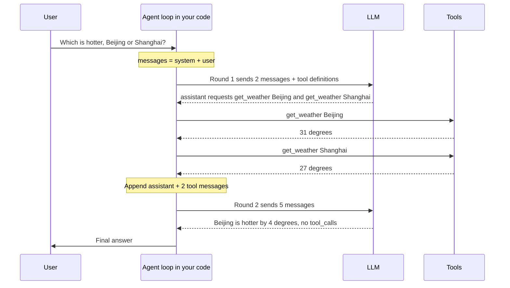
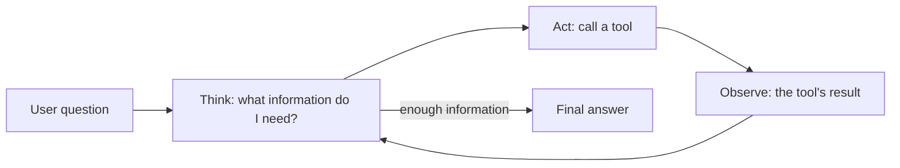
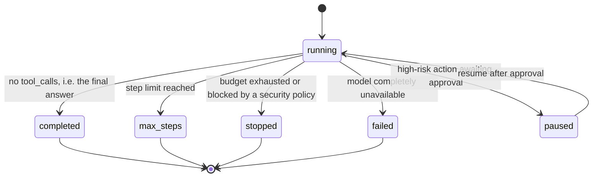
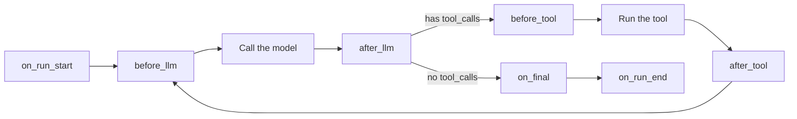

[中文](README.md) | [English](README.en.md)

# Lesson 02: The agent loop, demystified

> 🕐 Time: 20 minutes | 🎯 You'll be able to: hand-write a correct agent loop without any framework, and explain what the "enterprise" loop adds and why | 📦 Source: [`agentkit/agent.py`](../../agentkit/agent.py), [`agentkit/types.py`](../../agentkit/types.py), [`agentkit/llm.py`](../../agentkit/llm.py), [`agentkit/hooks.py`](../../agentkit/hooks.py)

## 0. In one sentence

**An agent is a while loop: call the model → run the tools it asks for → feed the results back → repeat until it says "I'm done."**

Here's an analogy. The model is an expert locked in a glass room. They're brilliant, but they can't reach outside the glass — no internet, no database, no email. The only thing they can do is slip notes under the door: "Please check the weather in Beijing for me."

Your code is the assistant outside the door: it takes the note, goes and looks it up, and slides the result back under the door. After reading the result, the expert may pass out another note, or say, "OK, the answer is…"

| Analogy | Technical concept |
|---|---|
| The fixed format of the notes | The message protocol (`tool_calls`) |
| The assistant running errands | Executing tools |
| Passing notes back and forth until the expert says "OK" | The agent loop |
| "At most 10 trips; if it isn't done by then, stop" | `max_steps` |
| The assistant's record of every note exchanged | The `messages` list |

If you remember one thing from this lesson, make it this: **the model never executes anything itself.** It only outputs text, or "please call such-and-such tool for me." Actually executing tools, deciding when to stop, and keeping things safe are all your code's job. LangGraph, the OpenAI Agents SDK, the Claude Agent SDK… at the core of every agent framework is this loop. There's no magic.

## 1. Core concepts

### 1.1 The message protocol: the agent's "language"

We use the OpenAI Chat Completions message format (the de facto industry standard, supported by nearly every model gateway; see [`agentkit/types.py`](../../agentkit/types.py)). There are four roles:

| role | Written by | Purpose |
|---|---|---|
| `system` | The developer | Sets identity, rules, and boundaries |
| `user` | The user | Asks a question or gives an instruction |
| `assistant` | The model | The final answer, **or** a request to call tools (with `tool_calls`) |
| `tool` | Your code | A tool's result, with `tool_call_id` indicating which call it answers |

Below is one turn (excerpted) from running `demo_raw.py` against a real model. (Demo output translated from Chinese.) Instead of answering directly, the model requested **two** tool calls at once:

```json
{
  "role": "assistant",
  "content": null,
  "tool_calls": [
    {"id": "call_vhDW04I4...", "type": "function",
     "function": {"name": "get_weather", "arguments": "{\"city\":\"Beijing\"}"}},
    {"id": "call_ENh4I8Ky...", "type": "function",
     "function": {"name": "get_weather", "arguments": "{\"city\":\"Shanghai\"}"}}
  ]
}
```

After our code executes them, it appends two `tool` messages:

```json
{"role": "tool", "tool_call_id": "call_vhDW04I4...", "content": "{\"city\": \"Beijing\", \"temp_c\": 31, \"condition\": \"sunny\"}"}
{"role": "tool", "tool_call_id": "call_ENh4I8Ky...", "content": "{\"city\": \"Shanghai\", \"temp_c\": 27, \"condition\": \"sunny\"}"}
```

**Three iron rules** (break any one of them and either the API returns an error or the agent misbehaves):

1. **Assistant first, then tool.** The assistant message with `tool_calls` must go into the history first, immediately followed by its tool results.
2. **Every `tool_call` must get exactly one `tool` message in response, matched one-to-one by `tool_call_id`.** Miss one and the next call fails with a 400. When we tested this against this course's model endpoint, leaving one call unanswered produced `No tool output found for function call call_SOMUyKBM...`; OpenAI's official Chat Completions API returns something like `An assistant message with 'tool_calls' must be followed by tool messages responding to each 'tool_call_id'`. The wording varies by provider; the rule doesn't.
3. **`arguments` is a JSON string, not an object.** The JSON the model generates may be invalid, missing fields, or have extra fields — parsing and validating it is **your** job (Lesson 03). That's why [`ToolCall.arguments`](../../agentkit/types.py) is deliberately typed as `str`.

### 1.2 The message flow of one complete loop



Note that round 2 sends **all 5 messages**. The model is stateless: it doesn't remember what was said in the previous round, so every call has to resend the full history. In a real run of `demo.py`, round 1 had 395 input tokens and round 2 grew to 501. This fact will come up again and again: it determines an agent's cost structure (section 1.4) and why context engineering is necessary (Lesson 04).

### 1.3 ReAct: the idea behind the loop

The 2022 paper [ReAct: Synergizing Reasoning and Acting in Language Models](https://arxiv.org/abs/2210.03629) (Yao et al., ICLR 2023) proposed having the model alternate between **reasoning** and **acting**, feeding the **observation** from each action back in before reasoning again.



- Reasoning without acting: the model can only answer from memory and will confidently make things up;
- Acting without reasoning: it calls tools like a headless chicken, with no idea why it's calling them or what to do with the results;
- Alternating: every action is grounded in reasoning, and every round of reasoning is grounded in real observations.

The original ReAct used a plain-text format (the model outputs `Thought: ... Action: search[...]`, which is then parsed with regexes). Today's **function calling is a native, structured version of ReAct**: `tool_calls` are the Action, `tool` messages are the Observation, and brittle regex parsing is no longer needed.

### 1.4 Stop conditions: when does the loop end?

"Stop when the model says it's done" is only the happy path. An enterprise agent must explicitly handle **every** way a run can end:



| How it ends | Trigger | agentkit `status` | What the caller should do |
|---|---|---|---|
| Final answer | No `tool_calls` in the response | `completed` | Show the answer |
| Step limit | `step >= max_steps` | `max_steps` | Report it as unfinished; hand off to a human |
| Budget exhausted | Tokens / spend / tool calls / duration over the limit (Lesson 08) | `stopped` | Alert; fall back |
| Security block | Input matches injection patterns, etc. (Lesson 09) | `stopped` | Politely decline |
| Model failure | Retries and fallbacks all failed (Lesson 08) | `failed` | Ask the user to try again later |
| Awaiting approval | A high-risk tool was called (Lesson 09) | `paused` | Notify the approver; `resume` after approval |

**Why must there be a `max_steps`?** Models get stuck in loops: calling the same tool over and over with the same bad arguments, bouncing back and forth between two tools, or forever feeling they "need to check one more thing." Worse still is the cost structure — because every step resends the full history, **cost grows roughly quadratically with the number of steps**. Suppose the initial prompt is 400 tokens and each step adds 500:

| Steps N | Cumulative input tokens ≈ 400N + 250N(N−1) |
|---|---|
| 5 | 7,000 |
| 10 | 26,500 |
| 50 | 632,500 |

5× the steps (10 → 50) means roughly 24× the input tokens. An agent without a step limit is a credit card without a credit limit.

What should `max_steps` be? Don't pull a number out of thin air. Look at the step-count distribution of normal tasks in your eval set and production traces (say, the P99), and leave some headroom above it; different task types can have different values. **Hitting `max_steps` is itself a signal worth monitoring** (Lesson 10) — it usually means a tool is badly designed or the task is beyond the agent's abilities.

### 1.5 finish_reason: why the model stopped

Every model response carries a `finish_reason`:

| Value | Meaning | What to do |
|---|---|---|
| `stop` | The model finished naturally | Usually the final answer |
| `tool_calls` | The model is requesting tool calls | Run the tools and keep looping |
| `length` | Output hit the `max_tokens` limit and was **truncated** | The answer is incomplete! If truncation happened while generating tool arguments, `arguments` will be half a JSON document |
| `content_filter` | Blocked by the provider's content-safety policy | Treat it as a refusal |

**Decide whether the run is finished by checking whether `tool_calls` is empty**, not by looking at `finish_reason` or whether `content` is empty. There are two reasons: different vendors and compatibility layers don't fill in `finish_reason` entirely consistently; and a model can perfectly well say "let me look that up" (non-empty `content`) while issuing tool calls. That's exactly how [`agentkit/agent.py`](../../agentkit/agent.py) does it: `if not response.tool_calls:`, while also recording `finish_reason` in the trace so `length` truncations can be spotted after the fact.

### 1.6 Parallel tool calls

A single assistant message can contain **multiple** `tool_calls` (as in the weather example above). The benefit is one fewer round trip: the weather for both cities comes back in one round instead of two.

When handling parallel calls, keep in mind:

- **Execute every one, and respond to every one** (iron rule 2). Handling only `tool_calls[0]` is the most common beginner bug.
- **Execution order**: agentkit executes them sequentially — simple, deterministic, and audit-friendly. Latency-sensitive production systems can run **read-only** tools concurrently in a thread pool, but all results must be appended before the next model call.
- **Dependent writes don't belong in parallel**: if the model sends "create a ticket" and "add a note to that ticket" in the same round, the second call has no way to get the ticket ID. OpenAI's API offers a `parallel_tool_calls=false` parameter to turn parallel calls off.

## 2. From toy to production: building it layer by layer

### 2.1 The minimal version: 30 lines, no magic

This is the core of [`demo_raw.py`](demo_raw.py), using nothing but the `openai` SDK:

```python
messages = [{"role": "system", "content": "..."}, {"role": "user", "content": question}]
for step in range(1, max_steps + 1):                       # loop + step limit
    resp = client.chat.completions.create(model=model, messages=messages, tools=TOOLS)
    msg = resp.choices[0].message

    assistant = {"role": "assistant", "content": msg.content}
    if msg.tool_calls:
        assistant["tool_calls"] = [
            {"id": tc.id, "type": "function",
             "function": {"name": tc.function.name, "arguments": tc.function.arguments}}
            for tc in msg.tool_calls
        ]
    messages.append(assistant)                              # Iron rule 1: assistant first

    if not msg.tool_calls:                                  # no tool calls = final answer
        return msg.content

    for tc in msg.tool_calls:                               # parallel calls: execute every one
        try:
            result = FUNCTIONS[tc.function.name](**json.loads(tc.function.arguments or "{}"))
        except Exception as e:                              # errors are "observations" too
            result = f"Error: {type(e).__name__}: {e}"
        messages.append({"role": "tool", "tool_call_id": tc.id, "content": result})  # Iron rule 2
return "(Reached the maximum number of steps; task not completed)"
```

Two design choices worth noting:

- **The assistant message is converted to a dict by hand** instead of stuffing the SDK object back in. That keeps the history as plain JSON you can print, persist, and restore across processes.
- **Tool exceptions are caught by `except` and turned into strings** instead of crashing the program. After seeing "Error: KeyError: 'Paris'", the model will often retry with different arguments on its own. This is "errors as observations," which Lesson 03 takes to production grade.

### 2.2 The enterprise version: what `agentkit/agent.py` adds

This is the main loop of [`agentkit/agent.py`](../../agentkit/agent.py). Its structure is identical to the toy version above:

```python
def _loop(self, state: RunState) -> None:
    # Resuming: if we last stopped after the model issued tool calls but before they all ran, finish them first
    self._run_pending_tools(state)
    while state.step < self.max_steps:
        state.step += 1
        response = self._call_llm(state)            # inside: context strategy → hooks → tracing → model call → accounting
        state.messages.append(response.to_message())
        self._save(state)                           # persist after every step

        if not response.tool_calls:                 # no tool calls = the model gave its final answer
            output = response.content or ""
            for h in self.hooks:
                new = h.on_final(state, output)     # e.g. OutputGuard redacts here
                if new is not None:
                    output = new
            state.messages[-1]["content"] = output  # store the processed version in the history too
            state.status, state.stop_reason, state.output = "completed", "final_answer", output
            return

        self._run_pending_tools(state)

    state.status, state.stop_reason = "max_steps", "max_steps"
```

Let's go through what's been added, one piece at a time, and **why**:

| Toy version | Enterprise version | Why |
|---|---|---|
| Local variable `messages` | A `RunState` object (messages, step count, usage, cost, approvals, identity) | Serializable state → it can be persisted, restored, and audited. An agent run may wait until the next day for approval; a local variable won't live that long |
| None | `_save(state)` after every step and every tool execution | After a process crash or a rolling deploy, the run resumes from where it stopped instead of starting over, paying twice, and repeating writes (Lesson 08) |
| None | `_run_pending_tools` at the start of the loop | If the crash happened after the model decided to call a tool but before the tool ran, recovery only runs the pending tools and **doesn't ask the model again** — asking again costs money, and the model might decide differently |
| Exceptions propagate | `_drive` funnels `StopRun` / `PauseRun` / `LLMError` into a single `status` | The caller (a web endpoint, a ticketing system) always gets a `RunResult` and only has to check `status` to decide what's next, instead of scattering `try/except` everywhere |
| None | 8 hook points | **Cross-cutting concerns** like security, permissions, budgets, auditing, and redaction stay out of the loop (see 2.3) |
| None | `context_strategy.apply()` | Truncates or summarizes the history when it gets too long (Lesson 04) |
| None | `tracer.span(...)` wraps every model and tool call | When something goes wrong, you can see each step's inputs, outputs, latency, and tokens (Lesson 10) |
| Calls functions directly | `ToolRegistry.execute(call, ctx)` | One place for JSON parsing, schema validation, identity injection, timeouts, truncation, and idempotency (Lesson 03) |
| Returns output as-is | `on_final` rewrites it and **writes it back to the history** | What goes into checkpoints and logs is the redacted version, not the original with someone's resident ID number in it |

One detail: the result of `on_final` is written back to `state.messages[-1]`. If you only change the return value and not the history, the original sensitive content still sits in the checkpoint file and gets sent to the model again on the next turn — a common data-leak path in real systems.

### 2.3 The hook middleware pattern: why it's good architecture

An enterprise agent needs input screening, access control, human approval, budget control, tool output isolation, output redaction, audit logging… Put all of it in the main loop and the loop balloons into a swamp of if-else hundreds of lines long, where every new capability means touching core code and risking new bugs.

agentkit uses the **middleware (interceptor) pattern** instead: the main loop just "broadcasts" at key points, and each capability is an independent [`Hook`](../../agentkit/hooks.py):



A hook can do five things: nothing (just observe), rewrite data (return a new value), reject a tool call (`before_tool` returns a reason, which is fed back to the model as an observation), abort the run (raise `StopRun`), or pause for a human (raise `PauseRun`).

Every enterprise capability in this course is a hook:

| Hook | When it runs | What it does | Lesson |
|---|---|---|---|
| `InputGuard` | `on_run_start` | Input matches injection patterns → `StopRun` | 09 |
| `PermissionPolicy` | `visible_tools` / `before_tool` | Hides tools by role, rejects unauthorized calls, `PauseRun` for high-risk actions | 09 |
| `BudgetHook` | `before_llm` / `after_llm` / `before_tool` | Tokens, spend, call count, or duration over the limit → `StopRun` | 08 |
| `ToolOutputGuard` | `after_tool` | Wraps tool output in `<untrusted_data>` | 09 |
| `OutputGuard` | `on_final` | Redacts sensitive data, blocks leaked secrets | 09 |
| `AuditLog` | `after_tool` / `on_run_end` | Writes the audit log | 09 |

Why it's good architecture:

1. **Single responsibility + the open/closed principle**: adding a capability = writing a new class, without changing a single line of the main loop. The main loop in `agent.py` is still only a few dozen lines.
2. **Composable**: each business line assembles what it needs (approvals on for the customer-service agent, off for the internal knowledge Q&A agent).
3. **Independently testable**: `BudgetHook`'s tests need neither a real model nor any other hooks.
4. **The same shape as the rest of the industry**: it's the same pattern as web framework middleware, gRPC interceptors, and Servlet filters. Agent frameworks have widely adopted it too: LangChain v1's agent [middleware](https://docs.langchain.com/oss/python/langchain/middleware/custom) (`before_model` / `after_model` / `wrap_tool_call`, etc.) and the OpenAI Agents SDK's [lifecycle hooks](https://openai.github.io/openai-agents-python/ref/lifecycle/) (`on_llm_start` / `on_tool_start`, etc.).

Be clear about the costs, too:

- **Order matters.** Hooks run in list order: `InputGuard` must come first, or a hook that writes user input to long-term memory might store the malicious input before it gets caught; `before_tool` stops at the first rejection, so later hooks never see that call. Order is part of the configuration — review it and test it.
- **Control flow is less explicit.** Hooks can raise exceptions that interrupt the loop, so reading the main loop won't tell you "this might pause here." agentkit's countermeasure is to funnel every interruption through a single place: `_drive()`.

## 3. Hands-on: run the demo

```bash
# Raw version: only the openai SDK; prints the messages at every round
.venv/bin/python lessons/02_agent_loop/demo_raw.py            # real model
.venv/bin/python lessons/02_agent_loop/demo_raw.py --offline  # scripted offline run

# Framework version: the same task implemented with agentkit.Agent
.venv/bin/python lessons/02_agent_loop/demo.py
.venv/bin/python lessons/02_agent_loop/demo.py --offline
```

Real-model output of `demo_raw.py` (excerpt):

```text
━━━━━━━━ Round 1: sending 2 messages to the model ━━━━━━━━
finish_reason = 'tool_calls'
👉 The model didn't answer directly; it requested 2 tool calls. Our code executes them:
   🔧 Done, appending tool message: {"role": "tool", "tool_call_id": "call_vhDW...", "content": "{\"city\": \"Beijing\", \"temp_c\": 31, ...}"}
   🔧 Done, appending tool message: {"role": "tool", "tool_call_id": "call_ENh4...", "content": "{\"city\": \"Shanghai\", \"temp_c\": 27, ...}"}

━━━━━━━━ Round 2: sending 5 messages to the model ━━━━━━━━
finish_reason = 'stop'

━━━━━━━━ The final, complete messages (this is the agent's entire state) ━━━━━━━━
[0] system    You are a weather assistant. Call tools when you need weather data; don't make anything up. Keep answers brief.
[1] user      Which is hotter right now, Beijing or Shanghai? By how many degrees?
[2] assistant   tool_calls=get_weather{"city":"Beijing"}#ZPwvor, get_weather{"city":"Shanghai"}#u2szpP
[3] tool      {"city": "Beijing", "temp_c": 31, "condition": "sunny"}  (responds to #ZPwvor)
[4] tool      {"city": "Shanghai", "temp_c": 27, "condition": "sunny"}  (responds to #u2szpP)
[5] assistant Beijing is hotter.   Beijing is 31℃ and Shanghai is 27℃, so Beijing is 4℃ warmer.
```

Real-model output of `demo.py` (excerpt):

```text
▶ Hook event stream (every beat of the main loop):
  [on_run_start] run_id=342a8b385566  user input: Which is hotter right now, Beijing or Shanghai? By how many degrees?
  [before_llm]   step 1: about to send 2 messages to the model
  [after_llm]    model requested get_weather{"city":"Beijing"}, get_weather{"city":"Shanghai"}  (finish_reason=tool_calls, tokens=443)
  [before_tool]  about to run get_weather, risk level=read
  [after_tool]   get_weather → success: {"city": "Beijing", "temp_c": 31, "condition": "sunny"}
  ...
  [on_run_end]   run finished, status=completed (this is where the audit log gets written, Lesson 09)

▶ Trace tree (covered in depth in Lesson 10):
agent.run  4394ms  tokens=896→71  status=completed steps=2 cost=$0.00183
├─ llm.chat  2218ms  tokens=395→48  → tool_calls: get_weather, get_weather
├─ tool.get_weather  0ms  ok
├─ tool.get_weather  0ms  ok
└─ llm.chat  2171ms  tokens=501→23  → final_answer

Part 2: the 5 ways an agent run ends (scripted offline run, deterministic results)
Scenario                            status     stop_reason                steps  output
Model gives a final answer          completed  final_answer               1      Hello!
Model keeps calling tools forever   max_steps  max_steps                  3      (Reached the maximum of 3 steps; task not completed.)
Token budget exhausted              stopped    budget_exceeded            2      Token budget exceeded (60 > 50); run aborted.
Model service completely down       failed     llm_error: 503 overloaded  1      Sorry, the service is temporarily unavailable. Please try again later.
High-risk action awaiting approval  paused     needs_approval             1      Action reset_password({"employee_i…
```

What to notice:

1. Both demos produce **exactly the same message sequence**: `system → user → assistant(tool_calls) → tool → tool → assistant`. The framework doesn't change what an agent fundamentally is.
2. In the trace tree, **nearly all the time is spent in `llm.chat`** (over 2 seconds per call), while tool execution takes 0ms. In real systems, reducing the number of model calls (for example, with parallel tool calls) is the most effective way to cut latency.
3. Round 2's input tokens (501) exceed round 1's (395) — the history was resent in full.
4. All 5 endings **return** a `RunResult`; none of them throws an exception at the caller.

## 4. Exercise

Open [`exercise.py`](exercise.py) and implement two functions:

1. **`execute_tool_call(tools, call) -> str`**: executes one tool call, **always returns a string, and never raises**. It must handle: an unknown tool, invalid JSON, JSON that isn't an object, an empty `arguments` string, exceptions raised by the function (including the `TypeError` from wrong argument names), and serializing non-string results.
2. **`run_agent_loop(llm, tools, user_input, max_steps=5) -> dict`**: the main loop. It must handle: direct answers, single and multi-round tool calls, multiple parallel calls in one round, hitting `max_steps`, passing `tools=None` when there are no tools, and responses that contain both `content` and `tool_calls`.

Hints:

- `llm.chat(messages, tools=...)` returns an `LLMResponse`; use `response.to_message()` to convert it into an assistant message;
- `system()` / `user()` / `tool_message()` in `agentkit.types` help you build messages;
- `assert_protocol_ok()` in the test file checks iron rules 1 and 2, and its failure message tells you where the pairing broke.

Verify:

```bash
make lesson N=02
# or
.venv/bin/python -m pytest lessons/02_agent_loop
```

You're done when all 20 tests pass. Afterwards, compare your version with [`solution.py`](solution.py) and the `_loop()` in [`agentkit/agent.py`](../../agentkit/agent.py) to see what yours is still missing compared with the enterprise version.

## 5. Going deeper (optional)

**The same loop inside frameworks.** Every mainstream framework has this loop and a step limit, just under different names: the OpenAI Agents SDK's `Runner` calls the model each turn, runs tools or handles a handoff, and raises [`MaxTurnsExceeded`](https://openai.github.io/openai-agents-python/running_agents/) once it exceeds `max_turns`; LangGraph uses `recursion_limit` to cap the number of graph execution steps and raises [`GraphRecursionError`](https://docs.langchain.com/oss/python/langgraph/errors/GRAPH_RECURSION_LIMIT) when it's exceeded. Once you understand this lesson's 30 lines, reading any framework's source gets much easier.

**Own your control flow.** Factor 8 of [12-Factor Agents](https://github.com/humanlayer/12-factor-agents), "Own your control flow," argues that only by owning the loop can you pause for a human at any point, serialize the context, and resume from where you stopped. agentkit's `PauseRun` + checkpoints follow the same idea. Black-box frameworks are fast for prototyping, but when you need "this step must wait for approval," you often end up fighting the framework.

**Streaming.** In production you usually stream the answer to the user token by token. In streaming mode, `tool_calls` arrive in **chunks**: each chunk carries an `index`, and `arguments` is split into several string fragments. You have to stitch the fragments together by `index` and wait until the stream ends before parsing the JSON and running the tool. This is where hand-written streaming agents most often break.

**Quadratic cost and prefix caching.** Since every step resends the full history, you want the history's **prefix to stay stable** (caching and model routing are covered systematically in Lesson 14): all major providers support prefix caching (prompt caching), and cached input tokens are cheaper and faster. So: only append to the history, never modify it; don't put content that changes on every call, like timestamps, at the start of the system prompt; push dynamic information as late as you can. Lesson 04's truncation/summarization breaks the prefix — that's a trade-off you'll need to weigh.

**The Responses API.** OpenAI later introduced the Responses API, which splits messages into finer-grained items: a tool call is a `function_call` item and a tool result is a `function_call_output` item, paired by `call_id`. The shape changed; not one of this lesson's three iron rules did. (The 400 error from this course's model endpoint, `No tool output found for function call ...`, is in fact Responses-style wording.)

**What agentkit does halfway, and production systems should finish:**

- **Handling `finish_reason == "length"`**: agentkit already marks `stop_reason` as `output_truncated`, so callers, evals, and alerts can tell "a complete answer" from "an answer cut off halfway." But it **doesn't recover automatically yet**. In production, you can retry with a higher `max_tokens` after detecting truncation, or have the model "continue from where you left off."

**What agentkit doesn't do yet, but production systems should:**

- **Loop detection**: when the same tool is called with the same arguments N times in a row, the agent is almost certainly stuck in a loop. You can inject a hint ("You've already called this with the same arguments 3 times") or stop early, rather than just waiting for `max_steps`.
- **Concurrent execution of read-only tools**: run the read-only tool calls from one round concurrently in a thread pool to reduce latency.

## 6. Common pitfalls and anti-patterns

1. **Handling only the first tool call**: `msg.tool_calls[0]`. As soon as the model calls several in parallel, the next request fails with a 400.
2. **Forgetting to append the assistant message first** and appending the tool messages directly → orphaned tool messages → 400.
3. **Making up your own `tool_call_id`**, or reusing one id for multiple results. Always use the id the model gave you, verbatim.
4. **Using `finish_reason == "stop"` to detect the end**, or using "`content` is non-empty." Check whether `tool_calls` is empty instead.
5. **Calling `eval()` on the model's argument string.** That's a remote code execution vulnerability. Always use `json.loads`, then validate against the schema.
6. **Letting tool exceptions propagate and crash the whole agent.** Turn errors into observations so the model gets a chance to correct itself.
7. **No `max_steps`**, or setting it to 100 and forgetting about it.
8. **Putting tool results in `user` messages.** The model will then treat content from web pages and emails as the user's instructions — throwing the door wide open to prompt injection (Lesson 09) — and you lose the `tool_call_id` pairing.
9. **Modifying messages in the middle of the history** (e.g. rewriting early tool results to save tokens), which invalidates the prefix cache and can even break call/result pairing. When you need to compress, use Lesson 04's block-level truncation/summarization.
10. **Passing `tools=[]` when there are no tools.** An empty array is meaningless and may be rejected by some servers; omit the parameter instead.

## 7. Interview & design review questions

<details>
<summary>Q1: In one sentence, how is an agent different from a plain LLM call?</summary>

- Plain call: one input, one output; the flow is hard-coded.
- Agent: the model decides, in a **loop**, which tool to call next and when to stop; code executes the tools and provides the safety nets (steps, budget, permissions).
- The key difference is **who decides the control flow**: code decides in a workflow, the model decides in an agent (Lessons 00, 06).
</details>

<details>
<summary>Q2: The model returns 3 tool_calls at once, and the 2nd tool throws an exception. How should your loop handle it?</summary>

- Respond to all 3: the 1st and 3rd return their normal results; the 2nd returns an observation that starts with "Error" (the exception type, the message, and possibly a suggested fix).
- Don't skip the 3rd because the 2nd failed, and don't let the loop crash — otherwise the message history is incomplete and the next call fails with a 400.
- Then move on to the next round and let the model decide, based on the error, whether to retry or try another approach.
</details>

<details>
<summary>Q3: Why check whether tool_calls is empty, rather than finish_reason, to decide whether the run is over?</summary>

- Different vendors and compatibility layers don't fill in `finish_reason` fully consistently;
- The model may output text and tool calls at the same time ("let me check" + tool_calls); `content` is non-empty, but the task isn't done;
- `finish_reason` is still useful: `length` means the output was truncated, which should trigger an alert or a retry rather than being treated as a complete answer.
</details>

<details>
<summary>Q4: An agent ran 20 steps. How many times the cost of a 5-step run is that? Why? How do you mitigate it?</summary>

- Far more than 4×. The model is stateless, so every step resends the full history, and input tokens grow roughly **quadratically** with the number of steps.
- Mitigations: a sensible `max_steps` and budget; parallel tool calls to cut the number of rounds; lean tool results (Lesson 03); context truncation/summarization (Lesson 04); keeping the history prefix stable to hit the cache, and routing simple steps to cheaper models (Lesson 14).
</details>

<details>
<summary>Q5: The process crashed after the model decided to call transfer_money but before the tool ran. What should happen on recovery?</summary>

- Load the state from the checkpoint, notice that the last assistant message has a tool_call with no result, and **run that tool directly** instead of calling the model again.
- Asking the model again wastes money and may yield a different decision (nondeterminism).
- Writes also need an **idempotency key** (Lesson 08): if the crash happened after the tool ran but before its result was saved, the idempotency key prevents a duplicate transfer when the tool is re-run. agentkit's `_run_pending_tools` + `IdempotencyStore` is exactly this combination.
- In multi-instance deployments, you also have to make sure the same run isn't resumed by two workers at once (leases and fencing tokens, Lesson 13).
</details>

<details>
<summary>Q6: Would you put permission checks in the main loop, in the tool functions, or in hooks?</summary>

- Coarse-grained control of which roles can use which tools: hooks (`PermissionPolicy`'s `visible_tools` + `before_tool`), decoupled from the business tools and audited uniformly.
- Fine-grained checks like "is this record yours?": **must live inside the tool** (the ctx identity from Lesson 03), because only the tool knows who owns the data.
- Not in the main loop: the main loop should only orchestrate, and cross-cutting concerns belong in hooks. You need both layers — that's defense in depth.
</details>

<details>
<summary>Q7: What are the downsides of the hook (middleware) pattern? How do you mitigate them?</summary>

- Order sensitivity: execution order is an implicit dependency. Mitigation: review the order as part of the configuration, and write tests that cover the critical orderings (e.g. InputGuard must come first).
- Implicit control flow: hooks can raise exceptions that interrupt the loop. Mitigation: funnel them into a status in one place (`_drive`), and record the interruption reason in the trace.
- Hooks that share state (`state.metadata`) can trample each other. Mitigation: agree on namespaces and put type constraints on key fields.
</details>

## 8. Self-check

- [ ] I can name the 4 message roles, who writes each one, and what each one is for
- [ ] I can state the three iron rules of the tool-calling protocol, and what happens when each is broken
- [ ] I can draw the complete message flow for "two parallel tool calls"
- [ ] I can explain why an agent's cost grows roughly quadratically with the number of steps
- [ ] I can list at least 5 ways an agent run can end, and how the caller should handle each
- [ ] I can name the 4 common values of `finish_reason`, and explain why it shouldn't be used to detect the end
- [ ] I can list what agentkit's main loop adds over the toy version, and what problem each addition solves
- [ ] I can explain the benefits and costs of the hook middleware pattern
- [ ] My `run_agent_loop` passes all 20 tests

## Further reading

- [ReAct: Synergizing Reasoning and Acting in Language Models](https://arxiv.org/abs/2210.03629) — Yao et al., ICLR 2023. The original paper on alternating reasoning and acting.
- [Building effective agents](https://www.anthropic.com/engineering/building-effective-agents) — Anthropic, 2024-12. The most widely cited engineering article on the agent/workflow distinction and when to use an agent.
- [Function calling guide](https://platform.openai.com/docs/guides/function-calling) — OpenAI's official docs; the authoritative reference on tool definitions, `tool_calls`, and parallel calls.
- [12-Factor Agents](https://github.com/humanlayer/12-factor-agents) — HumanLayer. 12 principles for engineering agents, especially "Own your control flow."
- [A practical guide to building agents](https://cdn.openai.com/business-guides-and-resources/a-practical-guide-to-building-agents.pdf) — OpenAI, 2025. A hands-on guide covering everything from selection and orchestration to guardrails.
