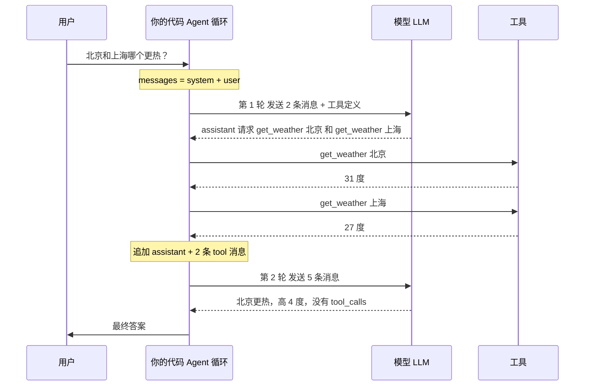
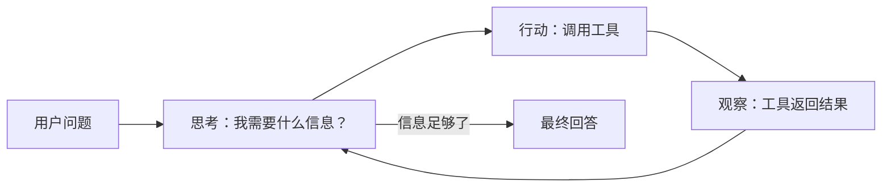
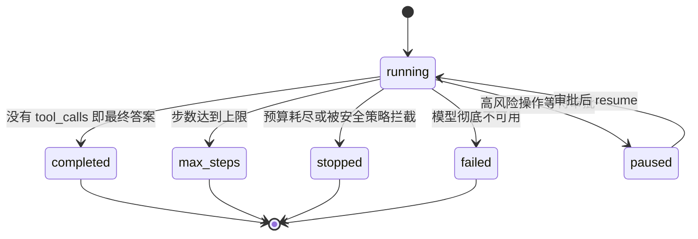
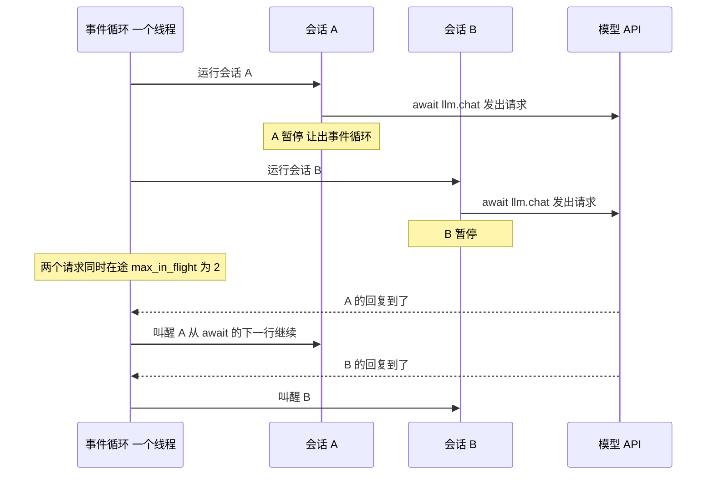
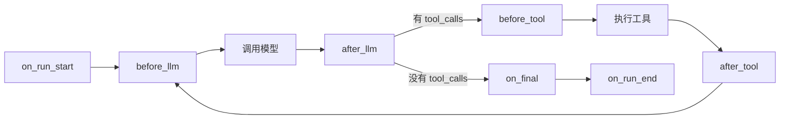

[中文](README.md) | [English](README.en.md)

# 第 02 课：Agent 循环的本质

> 🕐 建议用时：30 分钟 ｜ 🎯 学完你能：不依赖任何框架手写一个正确的 Agent 循环，并说清"企业版"循环多了什么、为什么 ｜ 📦 对应源码：[`agentkit/agent.py`](../../agentkit/agent.py)、[`agentkit/types.py`](../../agentkit/types.py)、[`agentkit/llm.py`](../../agentkit/llm.py)、[`agentkit/hooks.py`](../../agentkit/hooks.py)
>
> 📖 必读：[ReAct: Synergizing Reasoning and Acting in Language Models](https://arxiv.org/abs/2210.03629)（Yao 等, 2023）—— "推理 → 行动 → 观察"循环的原始论文；重点读 §2 的形式化定义和 §3.3 的人工失败模式分析（Table 2），其中模型反复生成之前的思考和行动、跳不出循环的错误，正是本课必须设 `max_steps` 的原因之一。

## 0. 一句话讲清楚

**Agent 就是一个 while 循环：调用模型 → 执行它要求的工具 → 把结果喂回去 → 直到它说"我答完了"。**

打个比方：模型是一位关在玻璃房里的专家。他很聪明，但手伸不出玻璃房 —— 不能上网、不能查数据库、不能发邮件。他唯一能做的，是往门缝外递纸条："请帮我查一下北京的天气"。

你写的代码是门外的助理：接过纸条、去查、把结果从门缝塞回去。专家看完结果，可能再递一张纸条，也可能说"好了，答案是……"。

| 比喻 | 技术概念 |
|---|---|
| 纸条的固定格式 | 消息协议（`tool_calls`） |
| 助理去跑腿 | 执行工具 |
| 来回递纸条，直到专家说"好了" | Agent 循环 |
| "最多跑 10 趟，跑不完就停" | `max_steps` |
| 助理记下的往来纸条 | `messages` 列表 |

记住这节课最重要的一句话：**模型自己从不执行任何东西。** 它只会输出文字，或者输出"请帮我调用某某工具"。真正执行工具、决定何时停止、保证安全的，都是你的代码。LangGraph、OpenAI Agents SDK、Claude Agent SDK……所有 Agent 框架的内核都是这个循环，没有魔法。

## 1. 核心概念

### 1.1 消息协议：Agent 的"语言"

我们使用 OpenAI Chat Completions 的消息格式（事实上的行业标准，几乎所有模型网关都兼容，见 [`agentkit/types.py`](../../agentkit/types.py)）。一共四种角色：

| role | 谁写的 | 作用 |
|---|---|---|
| `system` | 开发者 | 设定身份、规则、边界 |
| `user` | 用户 | 提问或下指令 |
| `assistant` | 模型 | 最终回答，**或者**请求调用工具（带 `tool_calls`） |
| `tool` | 你的代码 | 工具执行结果，用 `tool_call_id` 指明回答的是哪次调用 |

下面是 `demo_raw.py` 用真实模型跑出来的一轮（节选）。模型没有直接回答，而是一次请求了**两个**工具调用：

```json
{
  "role": "assistant",
  "content": null,
  "tool_calls": [
    {"id": "call_W2Y6Sno3...", "type": "function",
     "function": {"name": "get_weather", "arguments": "{\"city\":\"北京\"}"}},
    {"id": "call_7CQpUQLs...", "type": "function",
     "function": {"name": "get_weather", "arguments": "{\"city\":\"上海\"}"}}
  ]
}
```

我们的代码执行后，追加两条 `tool` 消息：

```json
{"role": "tool", "tool_call_id": "call_W2Y6Sno3...", "content": "{\"city\": \"北京\", \"temp_c\": 31, \"condition\": \"晴\"}"}
{"role": "tool", "tool_call_id": "call_7CQpUQLs...", "content": "{\"city\": \"上海\", \"temp_c\": 27, \"condition\": \"晴\"}"}
```

**三条铁律**（违反任何一条，要么 API 报错，要么 Agent 行为错乱）：

1. **先 assistant，后 tool。** 带 `tool_calls` 的 assistant 消息必须先进入历史，它的 tool 结果紧随其后。
2. **每个 `tool_call` 必须恰好有一条 `tool` 消息回应，`tool_call_id` 一一对应。** 漏掉一条，下一次调用直接 400。我们用本课程的模型接口实测，漏回一个调用时报错是：`No tool output found for function call call_SOMUyKBM...`；OpenAI 官方 Chat Completions 的报错则类似 `An assistant message with 'tool_calls' must be followed by tool messages responding to each 'tool_call_id'`。措辞因服务商而异，但规则相同。
3. **`arguments` 是 JSON 字符串，不是对象。** 模型生成的 JSON 可能不合法、可能缺字段、可能多字段 —— 解析和校验是**你的**责任（第 03 课）。这就是为什么 [`ToolCall.arguments`](../../agentkit/types.py) 被刻意定义为 `str`。

### 1.2 一次完整循环的消息流



注意第 2 轮发送的是**全部 5 条消息**。模型是无状态的：它不记得上一轮说过什么，每次调用都要把完整历史重新发一遍。`demo.py` 的真实运行里，第 1 轮输入 395 tokens，第 2 轮就涨到了 501 tokens。这个事实会在后面反复出现：它决定了 Agent 的成本结构（1.4 节）和上下文工程的必要性（第 04 课）。

### 1.3 ReAct：循环背后的思想

2022 年的论文 [ReAct: Synergizing Reasoning and Acting in Language Models](https://arxiv.org/abs/2210.03629)（Yao 等，ICLR 2023）提出：让模型交替进行**推理（Reason）**和**行动（Act）**，并把行动的**观察（Observation）**喂回去，再继续推理。



- 只推理、不行动：模型只能靠记忆作答，容易一本正经地编造事实；
- 只行动、不推理：像没头苍蝇一样乱调工具，不知道为什么调、调完怎么办；
- 交替进行：每一步行动都基于推理，每一次推理都基于真实的观察。

原始 ReAct 是用纯文本格式实现的（让模型输出 `Thought: ... Action: search[...]`，再用正则解析）。今天的 **function calling 就是 ReAct 的原生结构化版本**：`tool_calls` 是 Action，`tool` 消息是 Observation，不再需要脆弱的正则解析。

### 1.4 停止条件：循环什么时候结束？

"模型说答完了就结束"只是最理想的情况。企业级 Agent 必须对**每一种**结束方式都有明确的处理：



| 结束方式 | 触发条件 | agentkit 的 `status` | 调用方该怎么做 |
|---|---|---|---|
| 最终答案 | 响应里没有 `tool_calls` | `completed` | 展示答案 |
| 步数上限 | `step >= max_steps` | `max_steps` | 告知未完成、转人工 |
| 预算耗尽 | token / 金额 / 工具次数 / 时长超限（第 08 课） | `stopped` | 告警、降级 |
| 安全拦截 | 输入命中注入特征等（第 09 课） | `stopped` | 礼貌拒绝 |
| 模型故障 | 重试、降级都失败（第 08 课） | `failed` | 提示稍后重试 |
| 等待审批 | 调用了高风险工具（第 09 课） | `paused` | 通知审批人，审批后 `resume` |

**为什么一定要有 `max_steps`？** 模型会陷入循环：反复用同样的错误参数调用同一个工具、在两个工具之间来回横跳、或者永远觉得"还需要再查一下"。更要命的是成本结构 —— 因为每一步都重发完整历史，**成本随步数近似平方增长**。假设初始提示 400 tokens、每步新增 500 tokens：

| 步数 N | 累计输入 tokens ≈ 400N + 250N(N−1) |
|---|---|
| 5 | 7,000 |
| 10 | 26,500 |
| 50 | 632,500 |

步数翻 5 倍（10 → 50），输入 token 翻了约 24 倍。一个没有步数上限的 Agent 就是一张没有额度的信用卡。

`max_steps` 设多少？不要拍脑袋：看评估集和线上追踪里正常任务的步数分布（比如 P99），在它之上留一点余量；不同类型的任务可以设不同的值。**触发 `max_steps` 本身就是一个需要监控的信号**（第 10 课）—— 它通常意味着工具设计有问题或任务超出了 Agent 的能力。

### 1.5 finish_reason：模型为什么停下

每次模型响应都带一个 `finish_reason`：

| 值 | 含义 | 你该做什么 |
|---|---|---|
| `stop` | 模型自然说完了 | 通常是最终答案 |
| `tool_calls` | 模型请求调用工具 | 执行工具，继续循环 |
| `length` | 输出达到 `max_tokens` 上限被**截断** | 答案不完整！如果截断发生在生成工具参数时，`arguments` 会是半截 JSON |
| `content_filter` | 被服务商的内容安全策略拦截 | 按拒答处理 |

**判断"是否结束"应以 `tool_calls` 是否为空为准**，而不是看 `finish_reason` 或 `content` 是否为空。原因有二：不同厂商、不同兼容层对 `finish_reason` 的填写并不完全一致；而且模型完全可能一边说"我先查一下"（`content` 非空）一边发起工具调用。[`agentkit/agent.py`](../../agentkit/agent.py) 里就是这么判断的：`if not response.tool_calls:`，同时把 `finish_reason` 记进追踪，方便事后发现 `length` 截断。

### 1.6 并行工具调用

一条 assistant 消息里可以有**多个** `tool_calls`（上面的天气例子就是）。好处是少一个来回：两个城市的天气一轮就查完，而不是两轮。

处理并行调用时要注意：

- **每一个都要执行、每一个都要回应**（铁律 2）。只处理 `tool_calls[0]` 是新手最常见的 bug。
- **执行顺序**：如果一轮里的调用**全是只读工具**，agentkit 用 `asyncio.gather` 并发执行它们（`parallel_tools=True`，同时最多 `max_parallel_tools=8` 个），结果**按模型给出的原顺序**写回；只要有一个写 / 高危工具，就按顺序逐个执行，保证副作用有序、每执行完一个就存一次盘。不论哪种，所有结果都必须在下一次调用模型之前追加完毕。本课练习按顺序执行就够了。
- **有依赖的写操作不适合并行**：比如"创建工单"和"给这个工单加备注"被模型放在同一轮发出时，第二个调用根本拿不到工单号。OpenAI 的接口提供 `parallel_tool_calls=false` 参数来关闭并行调用。

### 1.7 为什么是 async：一个进程怎么同时服务很多会话

动手写循环之前，先算一笔账。第 3 节 `demo.py` 的真实运行里，一次会话耗时 3.8 秒，其中两次 `llm.chat` 各 1.9 秒 —— **几乎全部时间都在等模型回复**，工具执行 0ms。等的时候 CPU 什么都没干。那一个服务同时有 200 个用户在聊，要怎么办？

**比喻：一个服务员照看很多桌。** 把玻璃房想成后厨：专家是厨师，纸条是点菜单，你的代码是跑堂的服务员。

- **同步写法**：服务员把单子递进厨房，就站在出菜口干等，菜不出来不走。200 桌客人就得雇 200 个服务员（200 个线程）—— 每个线程都占内存，操作系统还要在它们之间来回切换，扛不了多少。
- **async 写法**：服务员递完单子就去招呼别的桌，厨房铃一响（模型回复到了）再回来端菜。一个服务员照看几百桌。这个"记着哪桌在等什么、铃响了叫谁"的调度员，就是**事件循环（event loop）**。

| 比喻 | 技术概念 |
|---|---|
| 服务员 | 事件循环（一个线程） |
| 每一桌客人 | 一个会话（一个协程，跑在一个 asyncio Task 里） |
| 递完单子说"好了叫我"，转身去别的桌 | `await llm.chat(...)`：把控制权交还给事件循环 |
| 厨房铃响 | 网络回复到了，事件循环叫醒这个会话，从 `await` 的下一行接着执行 |
| 同时开很多桌，但最多接待 N 桌 | `asyncio.gather` + `asyncio.Semaphore(N)` |
| 客人走了，把他那桌的单撤掉 | 取消：`task.cancel()` |
| 服务员站在某一桌旁边发呆 2 秒 | 在 async 代码里调用阻塞函数：**所有桌子一起等** |



**三个关键字：`async def`、`await`、`asyncio.run`。**

```python
import asyncio

async def handle(question: str) -> str:          # async def：定义一个"协程函数"
    response = await llm.chat([user(question)])  # await：在这里等；等的时候让出事件循环
    return response.content

answer = asyncio.run(handle("北京天气？"))        # asyncio.run：脚本入口。创建事件循环、跑完协程、关掉循环
```

- 调用 `async def` 定义的函数**不会执行它**，只会得到一个**协程（coroutine）**—— 一张"待办单"。
- `await 协程` 才真正执行它。执行到要等外部（网络、定时器）的地方，这个协程暂停，事件循环去跑别的协程；等的东西到了，再从暂停处继续。**只有在 `await` 的地方才可能切换**，两个 `await` 之间的代码不会被别的会话打断。
- `await` 只能写在 `async def` 里面。脚本的最外层用 `asyncio.run(main())` 启动；在 Web 框架（FastAPI 等）里，框架已经替你运行了事件循环，直接把路由函数写成 `async def` 即可。

**并发：`gather` 同时跑，`Semaphore` 设上限。**

```python
results = await asyncio.gather(*(agent.run(q) for q in questions))   # 同时跑，结果按输入顺序返回

sem = asyncio.Semaphore(3)                   # 最多 3 个同时在跑（例如模型网关只给了 3 个并发配额）

async def limited(q: str):
    async with sem:                          # 拿不到名额就在这里排队（排队时同样让出事件循环）
        return await agent.run(q)

results = await asyncio.gather(*(limited(q) for q in questions))
```

没有上限的 `gather` 很危险：一次发出 1000 个请求，模型网关会直接回你一片 429（第 08、12 课）。生产代码里的并发一定要配上限。`agentkit.workflows.parallel(fns, max_concurrency=8)` 把这两步封装好了，而且一个失败其余立即取消（第 06 课）。

**取消。** `task.cancel()` 不会当场"杀掉"一个协程，而是让它在**下一次 `await` 的地方**抛出 `asyncio.CancelledError`。异常一路向外传播，途中的 `finally`、`async with` 照常执行收尾。所以：

- 用户关掉页面 → Web 框架取消这次请求的任务 → 正在等模型的那个 `await` 抛出 `CancelledError` → HTTP 请求被断开，不再为没人看的回答付钱。agentkit 的 `Agent` 在这里把检查点记为 `cancelled`，然后继续把异常往外抛。
- `CancelledError` 是 `BaseException`，不是 `Exception`，所以 `except Exception` 不会误吞它 —— 这是 Python 故意的设计。**不要**写 `except BaseException:` 或裸 `except:` 然后不重新抛出，那等于让"取消"失效。

**头号陷阱：在 async 代码里调用阻塞函数。** 事件循环只有一个线程。一个协程如果调用了 `time.sleep(2)`、`requests.get(...)`、同步的数据库驱动（`psycopg2`、`pymysql`），或者一段要算好几秒的纯 CPU 代码，它**不 await、不让出**，整个事件循环就卡在这里 —— 这 2 秒里**所有**会话都停了：别的会话的模型回复到了没人处理，健康检查超时，新请求没人接。它不报错，只会让服务"莫名其妙地慢"，是 async 服务里最常见、也最难查的问题。修法：

| 情况 | 修法 |
|---|---|
| 等一会儿 | `await asyncio.sleep(秒)`，而不是 `time.sleep` |
| 调 HTTP API | 用 async 客户端：`httpx.AsyncClient`、`openai.AsyncOpenAI` |
| 查数据库 / 缓存 | 用 async 驱动：`asyncpg`、`psycopg` 的 async 模式、`redis.asyncio` |
| 只有同步版本的库（换不掉） | `await asyncio.to_thread(函数, 参数...)`：放进线程池执行，await 它的结果 |
| 要算很久的纯 CPU 代码 | 放进子进程（线程受 GIL 限制，而且杀不掉；第 03 课的 `isolation="process"`） |

agentkit 替你兜了一层：普通 `def` 写的工具会被 `ToolExecutor` 自动放进线程池执行（第 03 课），所以同步工具不会卡住事件循环；但在 `async def` 里面写阻塞调用，框架救不了你。

**忘了 `await`。** `response = llm.chat(messages)` 少写了 `await`，拿到的是 `<coroutine object ScriptedLLM.chat at 0x...>`，模型根本没被调用。接着访问 `response.content` 会报 `AttributeError: 'coroutine' object has no attribute 'content'`；如果只是把它拼进字符串，就会悄悄把 `<coroutine object ...>` 这串字当成工具结果发给模型。Python 通常还会打印一句 `RuntimeWarning: coroutine '...' was never awaited` —— 看到它，就去找漏掉的 `await`。

**实测。** 运行 [`demo_async.py`](demo_async.py)（完全离线，用 `ScriptedLLM(latency=0.2)` 扮演一个每次要"想" 0.2 秒的模型）。下面的数字来自 Apple M1、8 GB 内存，运行时系统负载约 6–8（同时有别的任务在跑，负载偏高）。耗时会随机器和负载波动；`max_in_flight` 和"工具同时在跑"的个数是确定的。

10 个会话，每个会话 = 2 次模型调用 + 1 次工具调用：

| 写法 | 耗时 | `max_in_flight` | 模型调用次数 |
|---|---|---|---|
| 一个接一个（`for` + `await`） | 4.06s | 1 | 20 |
| `asyncio.gather` 同时跑 | 0.41s | 10 | 20 |
| `gather` + `Semaphore(3)` | 1.63s | 3 | 20 |

`max_in_flight` 是 `ScriptedLLM` 记下的"同一时刻在途的模型调用数"，它是并发真实发生的**确定性证据**：一个接一个时永远是 1；`gather` 时 10 个会话的模型调用同时在等；加了 `Semaphore(3)` 就封顶在 3。全程是同一个 `Agent` 实例、一个线程、一个进程。

同样 10 个会话同时跑，这次每个会话调一次要等 0.2 秒的"查库存"工具，四种写法：

| 工具的写法 | 耗时 | 工具同时在跑 | 事件循环最长卡顿 |
|---|---|---|---|
| `async def` + `await asyncio.sleep(0.2)` | 0.61s | 10 个 | 3ms |
| `async def` + `time.sleep(0.2)` ❌ | 2.48s | 1 个 | 2072ms |
| `async def` + `await asyncio.to_thread(time.sleep, 0.2)` | 0.61s | 10 个 | 2ms |
| 普通 `def` + `time.sleep(0.2)`（agentkit 放进线程池） | 0.61s | 10 个 | 3ms |

"事件循环最长卡顿"是用一个每 10ms 醒一次的心跳协程测的：它迟到多久，事件循环就被卡了多久。阻塞写法里 10 个工具只能一个接一个执行，事件循环整整 2 秒没有响应任何事 —— 换成真实服务，就是这 2 秒里所有用户都在转圈。

> 这一节讲的是**一个进程之内**的并发。一个进程能扛多少会话、多个 worker 进程怎么分工、一个进程崩溃后别的进程怎么接手，是第 12、13 课的内容（`agentkit.distributed`，真的起多个进程）。

## 2. 从玩具到生产：逐层实现

### 2.1 最小版本：30 行，没有魔法

这是 [`demo_raw.py`](demo_raw.py) 的核心，只用了 `openai` SDK 的异步客户端 `AsyncOpenAI`：

```python
async def run_agent(client, model, question, max_steps=5):      # client = AsyncOpenAI(...)
    messages = [{"role": "system", "content": "..."}, {"role": "user", "content": question}]
    for step in range(1, max_steps + 1):                        # 循环 + 步数上限
        resp = await client.chat.completions.create(model=model, messages=messages, tools=TOOLS)  # 等模型时让出事件循环
        msg = resp.choices[0].message

        assistant = {"role": "assistant", "content": msg.content}
        if msg.tool_calls:
            assistant["tool_calls"] = [
                {"id": tc.id, "type": "function",
                 "function": {"name": tc.function.name, "arguments": tc.function.arguments}}
                for tc in msg.tool_calls
            ]
        messages.append(assistant)                               # 铁律 1：先 assistant

        if not msg.tool_calls:                                   # 没有工具调用 = 最终答案
            return msg.content

        for tc in msg.tool_calls:                                # 并行调用：每一个都要执行
            try:
                result = FUNCTIONS[tc.function.name](**json.loads(tc.function.arguments or "{}"))
            except Exception as e:                               # 错误也是一种"观察"
                result = f"错误：{type(e).__name__}: {e}"
            messages.append({"role": "tool", "tool_call_id": tc.id, "content": result})  # 铁律 2
    return "（达到最大步数，任务未完成）"

answer = asyncio.run(run_agent(AsyncOpenAI(...), model, "北京和上海现在哪个更热？"))
```

和同步写法相比只多了三处：`async def`、调模型前的 `await`、入口的 `asyncio.run`。循环本身一个字没变。

两个值得注意的设计：

- **把 assistant 消息手动转成 dict**，而不是直接把 SDK 对象塞回去。这样历史是纯 JSON，可以打印、存盘、跨进程恢复。
- **工具异常被 `except` 接住并变成字符串**，而不是让程序崩溃。模型看到"错误：KeyError: 'Paris'"之后，往往会自己换个参数重试。这就是"错误即观察"，第 03 课会把它做到生产级。

### 2.2 企业版：`agentkit/agent.py` 多了什么

这是 [`agentkit/agent.py`](../../agentkit/agent.py) 的主循环 `_loop_body()`（省略了取消检查），结构和上面的玩具版一模一样：

```python
async def _loop_body(self, state: RunState, prepare) -> None:
    if prepare is not None:
        await prepare()                                 # on_run_start 钩子 + 追加用户消息 + 存盘
    # 断点续跑：如果上次停在"模型已发起工具调用、但工具还没执行完"，先把它们补完
    await self._run_pending_tools(state)
    while state.step < self.max_steps:
        response = await self._call_llm(state)          # 里面：上下文策略 → 钩子 → 步数 +1 → 追踪 → 调模型 → 记账
        state.messages.append(response.to_message())
        await self._save(state)                         # 每一步都存盘

        if not response.tool_calls:                     # 没有工具调用 = 模型给出了最终答案
            output = response.content or ""
            for h in self.hooks:
                new = await _call_hook(h, "on_final", state, output)  # 比如 OutputGuard 在这里脱敏
                if new is not None:
                    output = new
            state.messages[-1]["content"] = output      # 历史里也存处理后的版本
            reason = "output_truncated" if response.finish_reason == "length" else "final_answer"
            state.status, state.stop_reason, state.output = "completed", reason, output
            return

        await self._run_pending_tools(state)            # 全是只读工具就并发执行，有写操作就逐个执行

    state.status, state.stop_reason = "max_steps", "max_steps"
```

逐个看多出来的部分，以及**为什么**：

| 玩具版 | 企业版 | 为什么 |
|---|---|---|
| 局部变量 `messages` | `RunState` 对象（消息、步数、用量、成本、审批、身份） | 状态可序列化 → 可以存盘、恢复、审计。一个 Agent 运行可能要等审批等到第二天，局部变量活不到那时候 |
| 无 | 每一步、每个工具执行完都 `_save(state)` | 进程崩溃或滚动发布后能从断点继续，而不是从头再来、重复花钱、重复执行写操作（第 08 课） |
| 无 | 循环开头先 `_run_pending_tools` | 崩溃发生在"模型已决定调用工具、工具还没执行"时，恢复后只补执行工具，**不重新问模型** —— 重新问既花钱，模型还可能做出不同决定 |
| 异常直接抛出 | `_drive` 把 `StopRun` / `PauseRun` / `LLMError` / 超时 / 限流统一收敛成 `status` | 调用方（Web 接口、工单系统）永远拿到一个 `RunResult`，只需看 `status` 决定下一步，而不是到处 `try/except`。唯一的例外是取消：检查点记为 `cancelled` 后，`CancelledError` 照常向外抛 |
| 一个函数只跑一个会话 | 全链路 `async`，`Agent` 实例不保存任何"本次运行"的数据（都在 `RunState` 里） | 同一个 `Agent` 实例在一个进程里同时推进成百上千个会话（1.7 节） |
| 无 | 取消、`run_timeout`、`limiter` | 用户断开 → 立刻停下并记为 `cancelled`；超过时限 → `stopped`（`timeout`）；按租户限制同时在跑的运行数（第 12 课） |
| 无 | 8 个钩子点（普通方法或 `async def` 都可以） | 安全、权限、预算、审计、脱敏这些**横切关注点**不写进循环（见 2.3） |
| 无 | `context_strategy.apply()` | 历史太长时截断或摘要（第 04 课） |
| 无 | `tracer.span(...)` 包住每次模型和工具调用 | 出了问题能看到每一步的输入、输出、耗时、token（第 10 课） |
| 直接调函数 | `await self.executor.execute(call, ctx)`（`ToolExecutor`） | 统一做 JSON 解析、Schema 校验、身份注入、超时、截断、幂等；同步工具放进线程池，async 工具超时能真正取消（第 03 课） |
| 原样返回 | `on_final` 改写后**写回历史** | 存进检查点和日志的是脱敏后的版本，而不是含身份证号的原文 |

一个细节：`on_final` 的结果被写回 `state.messages[-1]`。如果只改返回值、不改历史，那么原始的敏感内容仍然躺在检查点文件里、下一轮对话还会发给模型 —— 这是真实系统里常见的数据泄露路径。

### 2.3 Hook 中间件模式：为什么这是好架构

一个企业级 Agent 需要：输入检测、权限控制、人工审批、预算控制、工具输出隔离、输出脱敏、审计日志……如果全写进主循环，循环会膨胀成几百行的 if-else 泥潭，每加一个能力都要改核心代码、都可能引入 bug。

agentkit 的做法是**中间件（拦截器）模式**：主循环只在关键节点"广播"，每种能力是一个独立的 [`Hook`](../../agentkit/hooks.py)：



钩子能做五件事：什么都不做（观察）、改写数据（返回新值）、拒绝一次工具调用（`before_tool` 返回拒绝理由，理由会作为观察反馈给模型）、中止运行（抛 `StopRun`）、暂停等人（抛 `PauseRun`）。钩子方法可以写成普通方法，也可以写成 `async def`（比如要查 Redis 的限流钩子），`Agent` 会自动 `await`；纯计算的钩子（权限表、预算、脱敏）写成普通方法就好。

本课程的企业能力全部是钩子：

| 钩子 | 用到的时机 | 做什么 | 课 |
|---|---|---|---|
| `InputGuard` | `on_run_start` | 输入命中注入特征 → `StopRun` | 09 |
| `PermissionPolicy` | `visible_tools` / `before_tool` | 按角色隐藏工具、拒绝越权调用、高风险操作 `PauseRun` | 09 |
| `BudgetHook` | `before_llm` / `after_llm` / `before_tool` | token、金额、次数、时长超限 → `StopRun` | 08 |
| `ToolOutputGuard` | `after_tool` | 工具输出包进 `<untrusted_data>` | 09 |
| `OutputGuard` | `on_final` | 脱敏、拦截密钥泄露 | 09 |
| `AuditLog` | `after_tool` / `on_run_end` | 写审计日志 | 09 |

为什么说这是好架构：

1. **单一职责 + 开闭原则**：加一个能力 = 写一个新类，主循环一行不改。`agent.py` 的主循环至今只有几十行。
2. **可组合**：不同业务线按需组装（客服 Agent 开审批，内部知识问答 Agent 不开）。
3. **可独立测试**：`BudgetHook` 的测试不需要真实的模型，也不需要其他钩子。
4. **业界同构**：这和 Web 框架的中间件、gRPC 拦截器、Servlet Filter 是同一个模式。Agent 框架也普遍采用了它：LangChain v1 的 agent [middleware](https://docs.langchain.com/oss/python/langchain/middleware/custom)（`before_model` / `after_model` / `wrap_tool_call` 等），OpenAI Agents SDK 的 [生命周期钩子](https://openai.github.io/openai-agents-python/ref/lifecycle/)（`on_llm_start` / `on_tool_start` 等）。

代价也要清楚：

- **顺序敏感**。钩子按列表顺序执行：`InputGuard` 必须排在最前面，否则一个会把用户输入写进长期记忆的钩子可能先把恶意输入存下来了；`before_tool` 遇到第一个拒绝就停止，后面的钩子看不到这次调用。顺序是配置的一部分，要评审、要测试。
- **控制流不够显式**。钩子可以抛异常中断循环，读主循环代码时看不出"这里可能暂停"。agentkit 的对策是在 `_drive()` 一个地方统一收敛所有中断。

## 3. 动手：运行 Demo

```bash
# 原始版：只用 openai SDK，打印每一轮的 messages
.venv/bin/python lessons/02_agent_loop/demo_raw.py            # 真实模型
.venv/bin/python lessons/02_agent_loop/demo_raw.py --offline  # 离线剧本

# 框架版：同一个任务用 agentkit.Agent 实现
.venv/bin/python lessons/02_agent_loop/demo.py
.venv/bin/python lessons/02_agent_loop/demo.py --offline

# async：一个进程同时服务很多会话、阻塞调用的陷阱、取消（完全离线）
.venv/bin/python lessons/02_agent_loop/demo_async.py
```

`demo_raw.py` 的真实运行输出（节选）：

```text
━━━━━━━━ 第 1 轮：把 2 条消息发给模型 ━━━━━━━━
finish_reason = 'tool_calls'
👉 模型没有直接回答，而是请求调用 2 个工具。由我们的代码去执行：
   🔧 执行完毕，追加 tool 消息：{"role": "tool", "tool_call_id": "call_W2Y6...", "content": "{\"city\": \"北京\", \"temp_c\": 31, ...}"}
   🔧 执行完毕，追加 tool 消息：{"role": "tool", "tool_call_id": "call_7CQp...", "content": "{\"city\": \"上海\", \"temp_c\": 27, ...}"}

━━━━━━━━ 第 2 轮：把 5 条消息发给模型 ━━━━━━━━
finish_reason = 'stop'

━━━━━━━━ 最终的完整 messages（这就是 Agent 的全部状态）━━━━━━━━
[0] system    你是天气助手。需要天气数据时调用工具，不要编造。回答简洁。
[1] user      北京和上海现在哪个更热？高几度？
[2] assistant   tool_calls=get_weather{"city":"北京"}#DTmoKO, get_weather{"city":"上海"}#BxYLS7
[3] tool      {"city": "北京", "temp_c": 31, "condition": "晴"}  (回应 #DTmoKO)
[4] tool      {"city": "上海", "temp_c": 27, "condition": "晴"}  (回应 #BxYLS7)
[5] assistant 北京更热。  - 北京：31℃，晴 - 上海：27℃，晴  北京比上海高 **4℃**。
```

`demo.py` 的真实运行输出（节选）：

```text
▶ 钩子事件流（主循环的每个节拍）：
  [on_run_start] run_id=fa796532321d  用户输入：北京和上海现在哪个更热？高几度？
  [before_llm]   第 1 步：准备把 2 条消息发给模型
  [after_llm]    模型请求调用 get_weather{"city":"北京"}, get_weather{"city":"上海"}  (finish_reason=tool_calls, tokens=443)
  [before_tool]  即将执行 get_weather，风险等级=read
  [before_tool]  即将执行 get_weather，风险等级=read
  [after_tool]   get_weather → 成功：{"city": "北京", "temp_c": 31, "condition": "晴"}
  [after_tool]   get_weather → 成功：{"city": "上海", "temp_c": 27, "condition": "晴"}
  [before_llm]   第 2 步：准备把 5 条消息发给模型
  ...
  [on_run_end]   运行结束 status=completed（这里是写审计日志的地方，第 09 课）

▶ 追踪树（第 10 课详讲）：
agent.run  3796ms  tokens=896→71  status=completed steps=2 cost=$0.00183
├─ llm.chat  1897ms  tokens=395→48  → tool_calls: get_weather, get_weather
├─ tool.get_weather  0ms  ok
├─ tool.get_weather  0ms  ok
└─ llm.chat  1897ms  tokens=501→23  → final_answer

第 2 部分：Agent 的 5 种结束方式（离线剧本，结果确定）
场景                      status     stop_reason               steps  output
模型给出最终答案          completed  final_answer              1      你好！
模型一直调工具停不下来    max_steps  max_steps                 3      （已达到最大步数 3，任务未完成。）
token 预算耗尽            stopped    budget_exceeded           2      已超过 token 预算（60 > 50），任务中止。
模型服务彻底不可用        failed     llm_error: 503 服务过载   1      抱歉，服务暂时不可用，请稍后再试。
高风险操作等待人工审批    paused     needs_approval            1      操作 reset_password({"employee_i…
```

`demo_async.py` 的输出（节选，数字见 1.7 节的两张表）：

```text
实验 1：忘了 await 会怎样
  oops = llm.chat(...)          → 得到 <coroutine object ScriptedLLM.chat>，类型是 coroutine
  这时模型被调用了几次？          → call_count = 0（协程只是一张'待办单'，还没执行）
  right = await llm.chat(...)   → 得到 LLMResponse，content = '你好！'，call_count = 1

实验 4：取消 —— 用户关掉了页面，这次运行要立刻停下，别再花钱
  0.1s 后：模型调用在途 1 个，调用 task.cancel()
  await task → 抛出 CancelledError，用时 0ms（不用等满 5 秒）
  检查点里的状态：status='cancelled'  stop_reason='cancelled'  模型在途 0 个
```

该观察什么：

1. 两个 demo 的**消息序列完全一样**：`system → user → assistant(tool_calls) → tool → tool → assistant`。框架没有改变 Agent 的本质。
2. 追踪树里，**耗时几乎全在 `llm.chat` 上**（每次近 2 秒），工具执行是 0ms。在真实系统里，减少模型调用次数（比如用并行工具调用）是降低延迟最有效的手段；而等模型的这段时间，正是 async 让同一个进程去服务别的会话的时间（1.7 节）。
3. 第 2 轮的输入 token（501）比第 1 轮（395）多 —— 历史被完整重发了。
4. 5 种结束方式都**返回**一个 `RunResult`，没有一种是抛异常给调用方。
5. 两次 `before_tool` 先打印、两次 `after_tool` 后打印：两个只读的 `get_weather` 是并发执行的（1.6 节），结果仍按模型给出的顺序写回。
6. `demo_async.py` 实验 4：取消在"正在等模型"的那个 `await` 处立刻生效，检查点记为 `cancelled`，没有再调用模型。

## 4. 练习

打开 [`exercise.py`](exercise.py)，实现两个 **`async def`** 函数：

1. **`async def execute_tool_call(tools, call) -> str`**：执行一次工具调用，**永远返回字符串、永远不抛异常**（取消除外）。要处理：未知工具、JSON 不合法、JSON 不是对象、`arguments` 为空字符串、函数抛异常（包括参数名不对的 `TypeError`）、非字符串结果的序列化。工具**既可以是普通函数，也可以是 `async def` 函数**：调用 `fn(**args)` 得到协程时，要再 `await` 它（`agentkit.tools.maybe_await` 就是做这个的），而且这个 `await` 要放在 `try` 里 —— async 工具的异常是在 `await` 时才抛出来的。
2. **`async def run_agent_loop(llm, tools, user_input, max_steps=5) -> dict`**：主循环。要处理：直接回答、单次和多轮工具调用、一轮多个并行调用、达到 `max_steps`、没有工具时传 `tools=None`、`content` 和 `tool_calls` 同时存在。调模型写 `await llm.chat(...)`，执行工具写 `await execute_tool_call(...)`。

设计决定：本练习里普通 `def` 工具是在事件循环里**直接调用**的 —— 测试里的工具都是几微秒就算完的纯函数，这样最简单。一个会阻塞的同步工具在这里会卡住所有会话（1.7 节），所以 agentkit 的 `ToolExecutor` 把同步工具放进线程池执行（第 03 课），练习不要求你做这一步。

提示：

- `await llm.chat(messages, tools=...)` 返回 `LLMResponse`，用 `response.to_message()` 把它转成 assistant 消息；
- `agentkit.types` 里的 `system()` / `user()` / `tool_message()` 可以帮你构造消息；
- 测试文件里的 `assert_protocol_ok()` 会检查铁律 1 和铁律 2，失败信息会告诉你哪里没配对上；
- 最后两个测试检查 async 本身：20 个会话用 `asyncio.gather` 同时跑时，20 个模型调用必须同时在途（`max_in_flight == 20`）；运行被取消时，`CancelledError` 必须原样抛出、不能再调用模型 —— 所以兜底要写 `except Exception`，不要写 `except BaseException`。

验证：

```bash
make lesson N=02
# 或
.venv/bin/python -m pytest lessons/02_agent_loop
```

25 个测试全部通过即完成。写完后对照 [`solution.py`](solution.py) 和 [`agentkit/agent.py`](../../agentkit/agent.py) 的 `_loop_body()`，看看你的版本和企业版还差什么。

## 5. 深入（给有余力的你）

**框架里的同一个循环。** 所有主流框架都有这个循环和步数上限，只是名字不同：OpenAI Agents SDK 的 `Runner` 每轮调用模型、执行工具或处理 handoff，超过 `max_turns` 抛 [`MaxTurnsExceeded`](https://openai.github.io/openai-agents-python/running_agents/)；LangGraph 用 `recursion_limit` 限制图的执行步数，超出抛 [`GraphRecursionError`](https://docs.langchain.com/oss/python/langgraph/errors/GRAPH_RECURSION_LIMIT)。理解了本课的 30 行，读任何框架的源码都会轻松很多。

**拥有你的控制流。** [12-Factor Agents](https://github.com/humanlayer/12-factor-agents) 的第 8 条 "Own your control flow" 主张：自己掌握循环，才能在任意位置暂停等人、序列化上下文、从中断处恢复。agentkit 的 `PauseRun` + 检查点就是这个思路。黑盒框架用来做原型很快，但当你需要"这一步必须等审批"时，往往得和框架较劲。

**流式输出（streaming）。** 生产环境里通常把答案逐字流给用户。流式模式下，`tool_calls` 是**分片**到达的：每个分片带 `index`，`arguments` 被切成若干段字符串，你必须按 `index` 把片段拼起来，等流结束后才能解析 JSON、执行工具。这是手写流式 Agent 时最容易出 bug 的地方。agentkit 里 `OpenAICompatLLM.stream()` 用 `ToolCallAccumulator` 做这件事（第 01 课练习的生产版），`Agent.stream()` 是一个 async 迭代器，逐步产出文本片段、工具开始 / 结束、需要审批、完成等事件；消费方不再读取（例如 HTTP 客户端断开），运行就会被取消。

**成本的平方增长与前缀缓存。** 既然每一步都重发完整历史，就要让历史的**前缀保持稳定**（缓存和模型路由在第 14 课系统展开）：主流服务商都支持前缀缓存（prompt caching），命中缓存的输入 token 更便宜、更快。所以：历史只追加、不修改；不要在 system prompt 开头放时间戳这类每次都变的内容；动态信息尽量放在后面。第 04 课的"截断/摘要"会破坏前缀，这是一个需要权衡的地方。

**Responses API。** OpenAI 后来推出了 Responses API，把消息拆成更细的 item：工具调用是 `function_call` item，工具结果是 `function_call_output` item，二者用 `call_id` 配对。形式变了，本课的三条铁律一条没变。（本课程所用模型接口的那条 400 报错 `No tool output found for function call ...`，其实就是 Responses 风格的措辞。）

**agentkit 已经做了一半、生产系统值得做完的：**

- **`finish_reason == "length"` 的处理**：agentkit 已经会把 `stop_reason` 标记为 `output_truncated`，让调用方、评估和告警能区分"完整答案"和"说到一半的答案"；但它**还不会自动补救**。生产中可以在检测到截断后提高 `max_tokens` 重试，或让模型"从中断处继续"。

**agentkit 还没做、但生产系统值得做的：**

- **循环检测**：同一个工具 + 同样的参数连续调用 N 次，基本可以断定陷入了循环，可以注入一句提示（"你已经用相同参数调用过 3 次了"）或提前停止，而不是傻等 `max_steps`。

（以前这里还有一条"只读工具并发执行"，现在已经做了：同一轮全是只读工具时用 `asyncio.gather` 并发执行，见 1.6 节。）

## 6. 常见坑与反模式

1. **只处理第一个工具调用**：`msg.tool_calls[0]`。一旦模型并行调用多个，下一次请求就 400。
2. **忘了先追加 assistant 消息**，直接追加 tool 消息 → 孤立的 tool 消息 → 400。
3. **自己编 `tool_call_id`**，或者多个结果用了同一个 id。必须原样使用模型给的 id。
4. **用 `finish_reason == "stop"` 判断结束**，或者用"`content` 非空"判断结束。应该看 `tool_calls` 是否为空。
5. **对模型给的参数字符串用 `eval()`**。这是远程代码执行漏洞。永远用 `json.loads`，再做 Schema 校验。
6. **工具异常直接抛出，整个 Agent 崩溃**。应该把错误变成观察，让模型有机会纠正。
7. **没有 `max_steps`**，或者设成 100 之后就不管了。
8. **把工具结果放进 `user` 消息**。这样模型会把网页、邮件里的内容当成用户的指令 —— 为提示词注入敞开了大门（第 09 课），也丢失了 `tool_call_id` 的配对关系。
9. **修改历史中间的消息**（比如为了省 token 改写早期的工具结果），导致前缀缓存失效、甚至调用和结果不再配对。需要压缩时用第 04 课的按块截断/摘要。
10. **没有工具时传 `tools=[]`**。空数组没有意义，还可能被部分服务端拒绝；应该不传。
11. **在 `async def` 里调用阻塞函数**（`time.sleep`、`requests.get`、同步数据库驱动）。它不报错，只会让整个进程的所有会话一起卡住。换成 async 客户端，或 `await asyncio.to_thread(...)`（1.7 节）。
12. **忘了 `await`，或者吞掉了 `CancelledError`**。前者拿到的是协程对象而不是结果；后者（`except BaseException` / 裸 `except` 不重新抛出）让取消失效：用户早就走了，运行还在接着调模型、接着花钱。

## 7. 面试 & 设计评审问题

<details>
<summary>Q1：用一句话解释 Agent 和普通的 LLM 调用有什么区别？</summary>

- 普通调用：一次输入、一次输出，流程由代码写死。
- Agent：模型在**循环**里自己决定下一步调用什么工具、何时结束；代码负责执行工具和兜底（步数、预算、权限）。
- 关键区别在于**控制流由谁决定**：Workflow 由代码决定，Agent 由模型决定（第 00、06 课）。
</details>

<details>
<summary>Q2：模型一次返回了 3 个 tool_calls，其中第 2 个工具抛了异常。你的循环应该怎么处理？</summary>

- 3 个都要回应：第 1、3 个正常返回结果，第 2 个返回一段以"错误"开头的观察（异常类型、消息、可能的修正建议）。
- 不能因为第 2 个失败就跳过第 3 个，也不能让循环崩溃 —— 否则消息历史不完整，下一次调用直接 400。
- 然后进入下一轮，让模型根据错误决定是否重试或换一种方式。
</details>

<details>
<summary>Q3：为什么判断"是否结束"要看 tool_calls 是否为空，而不是 finish_reason？</summary>

- 不同厂商和兼容层对 `finish_reason` 的填写不完全一致；
- 模型可能同时输出文字和工具调用（"我先查一下" + tool_calls），此时 `content` 非空但任务没完成；
- `finish_reason` 仍然有用：`length` 表示输出被截断，应当告警或重试，而不是当作完整答案。
</details>

<details>
<summary>Q4：Agent 跑了 20 步，成本是跑 5 步时的多少倍？为什么？怎么缓解？</summary>

- 远超 4 倍。模型无状态，每一步都重发完整历史，输入 token 随步数近似**平方**增长。
- 缓解：设置合理的 `max_steps` 和预算；并行工具调用减少轮数；工具返回精简的结果（第 03 课）；上下文截断/摘要（第 04 课）；保持历史前缀稳定以命中缓存、简单步骤路由到便宜模型（第 14 课）。
</details>

<details>
<summary>Q5：进程在"模型已决定调用 transfer_money、但工具还没执行"时崩溃了。恢复时应该怎么做？</summary>

- 从检查点加载状态，发现最后一条 assistant 消息里有还没有结果的 tool_call，**直接补执行这个工具**，而不是重新调用模型。
- 重新问模型既浪费钱，又可能得到不同的决定（非确定性）。
- 对写操作还要配合**幂等键**（第 08 课）：如果崩溃发生在"工具已执行、结果还没存盘"之间，补执行时要靠幂等键避免重复转账。agentkit 的 `_run_pending_tools` + `IdempotencyStore` 就是这个组合。
- 多实例部署时，还要保证同一个 run 不会被两个 Worker 同时恢复（租约与 fencing token，第 13 课）。
</details>

<details>
<summary>Q6：你会把"权限检查"写在主循环里、工具函数里、还是钩子里？</summary>

- 角色 → 可用工具的粗粒度控制：钩子（`PermissionPolicy` 的 `visible_tools` + `before_tool`），和业务工具解耦、统一可审计。
- "这条数据是不是你的"这种细粒度检查：**必须在工具内部**（第 03 课的 ctx 身份），因为只有工具知道数据归属。
- 不写在主循环里：主循环应该只负责编排，横切关注点放钩子。两层都要，这叫纵深防御。
</details>

<details>
<summary>Q7：钩子（中间件）模式有什么缺点？怎么缓解？</summary>

- 顺序敏感：执行顺序是隐式依赖。缓解：把顺序当作配置评审，写测试覆盖关键顺序（如 InputGuard 必须第一个）。
- 控制流隐式：钩子能抛异常中断循环。缓解：在一个地方（`_drive`）统一收敛为状态，并在追踪里标记中断原因。
- 钩子之间共享状态（`state.metadata`）可能互相踩踏。缓解：约定命名空间，关键字段做类型约束。
</details>

<details>
<summary>Q8：一个 Python 进程怎么同时服务 200 个 Agent 会话？如果有人在某个工具里写了 requests.get，会发生什么？</summary>

- Agent 的时间几乎都花在等模型和外部 API 上。用 async：`await llm.chat(...)` 时让出事件循环，一个线程就能同时推进几百个会话；并发要用 `Semaphore` 之类的上限保护下游（网关配额）。
- `requests.get` 是阻塞调用：如果写在 `async def` 工具里，它执行的那几秒整个事件循环都停了，**所有**会话一起卡住，而且不报错。本课 `demo_async.py` 实测：10 个会话的工具本该同时跑（0.61s），变成一个接一个（2.48s），事件循环卡顿 2 秒。
- 修法：换成 `httpx.AsyncClient`；换不掉就 `await asyncio.to_thread(requests.get, url)`；或者把工具写成普通 `def`，交给 agentkit 的 `ToolExecutor` 放进线程池。排查手段：监控事件循环延迟（心跳迟到多久），开 `asyncio` 的 debug 模式看慢回调。
- 一个进程终究有上限（CPU、内存、一个事件循环）。再往上扩，是多个 worker 进程分工（第 12、13 课）。
</details>

## 8. 自测清单

- [ ] 我能说出 4 种消息角色各自由谁写、起什么作用
- [ ] 我能说出工具调用协议的三条铁律，以及违反时会发生什么
- [ ] 我能画出一次"两个并行工具调用"的完整消息流
- [ ] 我能解释为什么 Agent 的成本随步数近似平方增长
- [ ] 我能列出至少 5 种 Agent 的结束方式，以及调用方分别该怎么处理
- [ ] 我能说出 `finish_reason` 的 4 个常见取值，以及为什么不用它判断结束
- [ ] 我能说出 agentkit 的主循环比玩具版多了哪些东西，每一样解决什么问题
- [ ] 我能解释 Hook 中间件模式的优点和代价
- [ ] 我能解释 `await llm.chat(...)` 的那一刻事件循环在做什么，以及为什么一个进程能同时服务很多会话
- [ ] 我能说出在 async 代码里调用阻塞函数的后果，以及至少三种修法
- [ ] 我能说出被取消的任务在哪里收到 `CancelledError`，以及为什么不能用 `except BaseException` 吞掉它
- [ ] 我的 `run_agent_loop` 通过了全部 25 个测试

## 延伸阅读

- [ReAct: Synergizing Reasoning and Acting in Language Models](https://arxiv.org/abs/2210.03629) —— Yao 等，ICLR 2023。"推理 + 行动"交替的原始论文。
- [Building effective agents](https://www.anthropic.com/engineering/building-effective-agents) —— Anthropic，2024-12。对 Agent 和 Workflow 的区分、何时该用 Agent，被引用最多的一篇工程文章。
- [Function calling 指南](https://platform.openai.com/docs/guides/function-calling) —— OpenAI 官方文档，工具定义、`tool_calls`、并行调用的权威说明。
- [12-Factor Agents](https://github.com/humanlayer/12-factor-agents) —— HumanLayer。把 Agent 工程化的 12 条原则，尤其是 "Own your control flow"。
- [A practical guide to building agents](https://cdn.openai.com/business-guides-and-resources/a-practical-guide-to-building-agents.pdf) —— OpenAI，2025。从选型、编排到护栏的实践指南。
