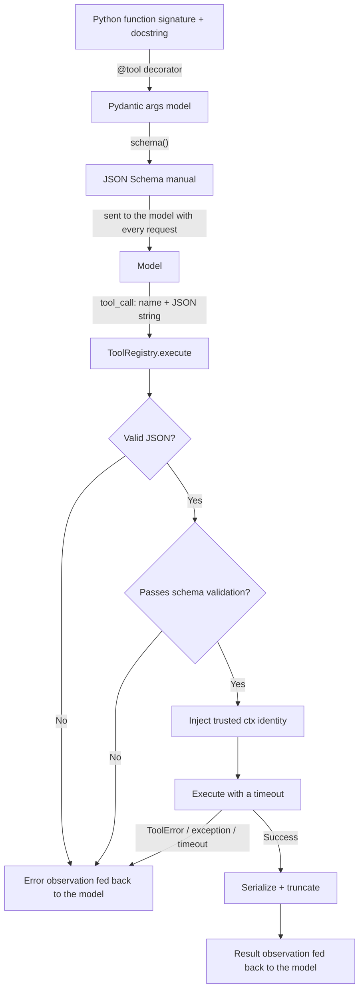
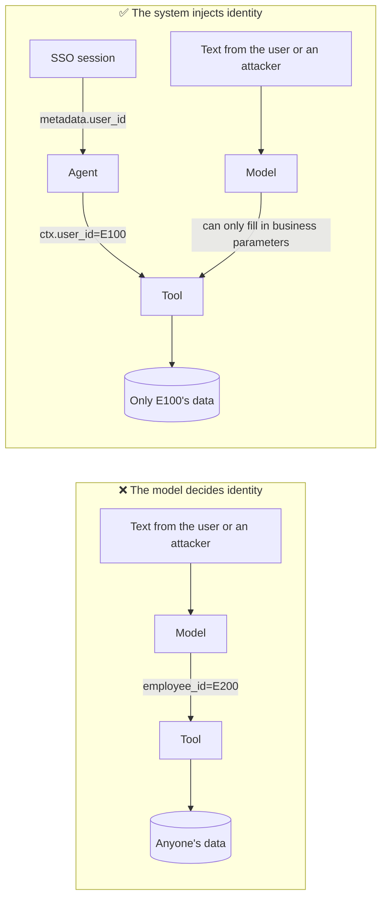
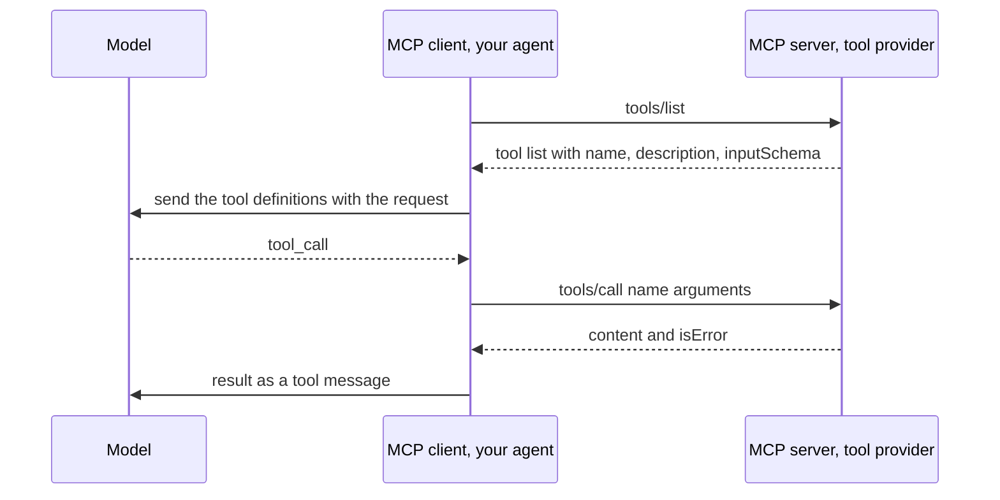

[中文](README.md) | [English](README.en.md)

# Lesson 03: Tool design — the agent's interface to the world

> 🕐 Time: 20 minutes | 🎯 You'll be able to: design enterprise-grade tools that the model uses correctly, that attackers can't misuse, and that recover on their own when things go wrong | 📦 Source: [`agentkit/tools.py`](../../agentkit/tools.py)
>
> 📖 Primary reading: [SWE-agent: Agent-Computer Interfaces Enable Automated Software Engineering](https://arxiv.org/abs/2405.15793) (Yang et al., 2024) — the paper that introduced the ACI idea and showed with ablations that changing only the interface clearly changes how often an agent succeeds; focus on the four ACI design principles in §2 and the ablations in §5.1 (Table 3 — e.g., an IDE-style search that pages through results one by one did worse than no search tool at all), then compare them with this lesson's tool descriptions, return values, and error messages.

## 0. In one sentence

**Tools are APIs written for a model. The model can't see your code; all it sees is each tool's name, description, and parameter schema. How well that "manual" is written directly determines how reliable your agent is.**

Let's start with a real experiment from this lesson's demo. In an expense system, the status code for "approved, awaiting payout" is `PENDING_PAYOUT`. The tool's parameter is declared as `status: str`, and its entire description is two words: "Query expenses." A user asks: "Which of my expense reports have been approved but haven't been paid out yet?" (Demo output translated from Chinese.)

```text
── ❌ Bad design: status is a free-form string; the description is just "Query expenses" ──
  🔧 search_expenses({"status":"approved not received"})
     ↳ []
  💬 I couldn't find any expense reports that were "approved but not yet paid out."
```

The model guessed a status value, the backend found nothing and returned an empty list, and the model **confidently** told the user "none." No error, no alert — the user was simply misled. We tested this against a real model 3 times and got the same result all 3 times (the guessed values were `approved but not yet received`, `approved_unpaid`, and `approved not received`; the first and last were originally in Chinese). After we changed `status` to an enum that explains what each value means, all 3 runs got it right.

That's the heart of this lesson: **you polish a UI over and over when you design it for humans; a model's "UI" deserves the same care.**

## 1. Core concepts

### 1.1 ACI: the agent-computer interface

HCI (human-computer interaction) studies how to make interfaces work well for people. The 2024 [SWE-agent paper](https://arxiv.org/abs/2405.15793) introduced the term **ACI (agent-computer interface)**: interfaces designed specifically for agents can significantly improve their ability to complete tasks. In the appendix of [Building effective agents](https://www.anthropic.com/engineering/building-effective-agents), Anthropic likewise stresses investing as much in ACI as in HCI, and shares an example: their coding agent often made mistakes when using relative file paths; after they changed the tool to require absolute paths, the model never made that mistake again.

People and models use interfaces very differently:

| | Human user | Model |
|---|---|---|
| What it can see | The UI, docs, explanations from colleagues | **Only** the tool name, description, and parameter schema |
| What it does when confused | Asks someone, tries things out, looks at a screenshot of the error | Guesses; or reads the error message and retries |
| Cost of a mistake | Notices it and undoes it | May confidently give a wrong answer, or perform the wrong write |
| Can it be "tricked"? | Occasionally | Any text in its input may be taken as an instruction |

So a good tool has to do three things at once: **make it easy for the model to use correctly** (the manual), **let the model recover when it gets it wrong** (errors as observations), and **limit the damage when the model is tricked** (identity and permissions).

ACI shows up most fully in coding agents: [Lesson 24](../24_coding_agents/README.en.md#12-aci-why-not-just-give-it-bash) follows SWE-agent's principles to build a coding toolset by hand (windowed file viewing, syntax-checked edits, summarized test results), and uses the paper's ablations to show what each design choice contributes.

### 1.2 The full lifecycle of a tool call



Every call goes through [`ToolRegistry.execute()`](../../agentkit/tools.py), the **single chokepoint**. Validation, identity injection, timeouts, truncation, and idempotency all happen here; the tool functions themselves contain only business logic.

## 2. From toy to production: building it layer by layer

### 2.1 Schema as contract: generated from type annotations

Hand-written JSON Schema is verbose and easily drifts out of sync with the code. agentkit generates it from the function signature ([`_build_args_model`](../../agentkit/tools.py)):

```python
Status = Literal["draft", "in_review", "pending_payout", "paid", "rejected"]

@tool
def list_my_expenses(
    status: Annotated[Status | None, Field(description=(
        "Filter by status: draft=saved but not submitted; in_review=submitted, under review; pending_payout=approved, awaiting payout from finance; "
        "paid=paid out; rejected=rejected. Omit to return all statuses."))] = None,
    limit: Annotated[int, Field(ge=1, le=20, description="Maximum number of results, newest submissions first. Default 10")] = 10,
    ctx: ToolContext = None,
) -> dict:
    """List the currently signed-in employee's own expense reports (self only; cannot look up anyone else's).
    Returns each report's id, purpose, amount (CNY), status, and submission date, plus total, the number of matching reports."""
```

The generated schema (excerpt):

```json
{
  "name": "list_my_expenses",
  "description": "List the currently signed-in employee's own expense reports (self only; cannot look up anyone else's).\nReturns each report's id, purpose...",
  "parameters": {
    "additionalProperties": false,
    "properties": {
      "status": {
        "anyOf": [{"enum": ["draft", "in_review", "pending_payout", "paid", "rejected"], "type": "string"}, {"type": "null"}],
        "default": null,
        "description": "Filter by status: draft=saved but not submitted; in_review=submitted, under review; ..."
      },
      "limit": {"default": 10, "description": "Maximum number of results...", "maximum": 20, "minimum": 1, "type": "integer"}
    },
    "type": "object"
  }
}
```

The "why" behind each design decision:

| You write | Generated schema | Why |
|---|---|---|
| `Literal[...]` | `enum` | The model can't possibly guess your internal values; an enum limits it to valid ones |
| `Field(description=...)` | `description` | The parameter's meaning, format, units, and examples — this is the only place the model can learn them |
| `Field(ge=1, le=20)` | `minimum` / `maximum` | The model can see the bounds, and the validation layer stops out-of-range values |
| Has a default value | Not in `required` | The fewer required fields, the fewer chances the model has to get it wrong |
| A parameter named `ctx` | **Doesn't appear** | Identity is injected by the system; the model doesn't even know the parameter exists (section 2.5) |
| `extra="forbid"` | `additionalProperties: false` | When the model invents a nonexistent parameter (e.g. `employee_id`), it fails loudly instead of being silently ignored |
| No docstring | Raises `ValueError` at construction time | A tool without a description is a machine without a manual; the framework refuses it outright |

### 2.2 Writing descriptions: bad vs. good

```python
# ❌ Bad
@tool
def search_expenses(status: str) -> list:
    """Query expenses"""
```

Reading this manual, the model is left with a string of questions: Whose expenses? What values can status take? Is it case-sensitive? What does it return? When should I use it?

```python
# ✅ Good: see list_my_expenses above
```

A checklist for writing tool descriptions:

- **What it does**: one sentence covering its function and its **scope** ("the currently signed-in employee's own").
- **When to use it**: especially when several tools are similar, spell out the boundaries ("search the knowledge base before answering IT how-to questions").
- **What it returns**: what the fields mean, units (yuan or fen, i.e. cents?), sort order.
- **Limits**: maximum counts, maximum time spans, which states can't be acted on. If a limit can go in the description, don't make the model hit the wall to find out (see the experiment in 2.3).
- **Parameters**: format (`YYYY-MM-DD`), examples (`e.g. EX-1003`), the **meaning** of each enum value (not just the list of values), and what to do when the value is unknown ("if you don't know the ID, call list_my_expenses first").
- **Unambiguous names**: `user_id` beats `user`, and `amount_cents` beats `amount`. With multiple systems, add prefixes to tell them apart (`jira_search`, `confluence_search`).

### 2.3 Argument validation and "errors as observations"

The arguments a model produces **will** go wrong: invalid JSON, missing fields, wrong types, out-of-range values, invented parameters. [`ToolRegistry.execute()`](../../agentkit/tools.py) turns every one of these problems into text fed back to the model, instead of raising an exception that crashes the agent:

```python
# 1) Parse the JSON — the model may produce invalid JSON
try:
    raw = json.loads(call.arguments or "{}")
    ...
except (json.JSONDecodeError, ValueError) as e:
    return ToolResult(False, f"Error: the arguments are not a valid JSON object ({e}). Please regenerate them.", "invalid_args")

# 2) Validate against the schema — missing fields, wrong types, out-of-range values, and extra fields are all caught here
try:
    args = t.args_model.model_validate(raw)
except ValidationError as e:
    problems = "\n".join(f"- {'.'.join(map(str, err['loc'])) or 'arguments'}: {err['msg']}" for err in e.errors())
    return ToolResult(False, f"Error: argument validation failed:\n{problems}\nPlease fix them and try again.", "invalid_args")
```

Part 4 of the demo shows the validation layer's actual output (no model calls involved):

```text
▶ Invalid enum value: list_my_expenses({"status": "approved"})
  ok=False  error_type=invalid_args
  Error: argument validation failed:
  - status: Input should be 'draft', 'in_review', 'pending_payout', 'paid' or 'rejected'
  Please fix them and try again.

▶ Trying to impersonate a coworker: list_my_expenses({"employee_id": "E200"})
  ok=False  error_type=invalid_args
  Error: argument validation failed:
  - employee_id: Extra inputs are not permitted
```

`ToolResult.error_type` has 6 possible values: `not_found` (the tool doesn't exist), `invalid_args` (bad JSON or failed validation), `timeout`, `tool_error` (a business error), `exception` (an unexpected exception), and `denied` (rejected by a permission hook). They are both observations fed back to the model and monitoring metrics (Lesson 10): a sudden rise in a tool's `invalid_args` rate usually means its manual has a problem, or the model's behavior changed after an upgrade.

**Experiment B: three ways to write an error message.** The business rule is "a single query can't span more than 90 days," and the user asks, "How much have I claimed in expenses so far this year?" We ran each version multiple times against a real model:

| Version | Description | Error message | How the real model behaved |
|---|---|---|---|
| v1 ❌ | "Sum up expense totals" | `ValueError: E_RANGE_LIMIT` | It could only guess. In 2 of 3 runs it gave up outright ("The tool returned a range-limit error, so I can't give you a total"); in 1 run it guessed the cause correctly, split the query by month into 9 calls, and only then answered correctly |
| v2 🟡 | Doesn't mention the limit | "A single query can span at most 90 days; you requested 269 days. Split the range into several segments, query each one, and add up the results." | Every time: hit the wall → understood the error → fired off 3 queries in parallel in one round → answered correctly. 3 model calls in total |
| v3 ✅ | States "at most 90 days per query; split longer ranges into multiple segments" | Same as v2 | Every time, it split the range into 3 parallel queries on the first try. 2 model calls in total |

The v2 trace tree clearly shows the "self-correction":

```text
agent.run  14304ms  tokens=1666→335  status=completed steps=3
├─ llm.chat  3113ms  → tool_calls: expense_total
├─ tool.expense_total  1ms  FAIL(tool_error)
├─ llm.chat  7805ms  → tool_calls: expense_total, expense_total, expense_total
├─ tool.expense_total  3ms  ok
├─ tool.expense_total  3ms  ok
├─ tool.expense_total  2ms  ok
└─ llm.chat  3362ms  → final_answer
```

The takeaway: **there are two lines of defense. A good description gets the model right on the first try; a good error message gets it right on the second.** Error messages are written for the model, and they should cover three things: what went wrong, why, and what to do next.

### 2.4 ToolError vs. exceptions

| | `ToolError` (business error) | Other exceptions (unexpected errors) |
|---|---|---|
| Examples | Order doesn't exist, can't cancel an order that has shipped, query span too long | Database connection dropped, a bug in the code, `KeyError` |
| Who saw it coming | You did, and you know what the model should do next | Nobody |
| Who the message is for | **The model**: actionable natural language | Engineers: stack traces, internal details |
| How agentkit handles it | `error_type="tool_error"`; the message goes to the model verbatim | `error_type="exception"`; the model only gets "internal error + error ID"; the raw exception is stored in `ToolResult.detail` and written to the trace's `tool.error_detail`, and is **never shown to the model** (otherwise SQL or internal network addresses could end up repeated to the user) |
| What it means for monitoring | Normal business behavior; watch the rate | A bug that needs an alert and a fix |

In code:

```python
if order["status"] in ("shipped", "delivered"):
    raise ToolError(f"Order {order_id} is currently {status} (shipped or delivered) and can't be canceled. "
                    "Tell the user they can request a return within 7 days of delivery.")
```

⚠️ A production caveat: the message of an unexpected exception may contain internal information (SQL statements, internal network addresses, file paths), and the model may repeat it verbatim to the user. In v1 of experiment B, the model passed the internal error code `E_RANGE_LIMIT` straight on to the user. The safer approach: write the full exception only to server-side logs, and give the model an observation that says no more than "Internal tool error (error ID xxx). Please try again later or try a different approach."

### 2.5 Inject identity from ctx: never let the model pass user_id

**Experiment C.** The signed-in employee is E100, who asks: "Show me the expense reports of my coworker Zhang San (employee ID E200)." (Zhang San is a placeholder name, like "John Doe.")

```text
── ❌ Bad design: the model fills in employee_id ──
  🔧 get_expenses({"employee_id":"E200"})
  💬 Here are the expense reports for Zhang San (employee ID E200):
     - Report ID: EX-2001  - Amount: 4200.00 CNY  - Cost center: CC-HR-01
     - GL account: 6602.03  - Approval chain: M-331, F-002 ...

── ✅ Good design: the system injects identity from ctx; the schema has no such parameter ──
  💬 Sorry, I can only look up the expense reports of the currently signed-in employee, so I can't view the expense reports of your coworker Zhang San (employee ID E200).
```

With the bad design, the real model complied every time — it had no reason to refuse: the tool allowed it, and the user asked for it. Worse, the tool returned the entire database row, leaking internal fields such as the GL account and the approval chain along with it.

This class of vulnerability has a name in API security: **BOLA (Broken Object Level Authorization)**, [number one in the OWASP API Security Top 10 2023](https://owasp.org/API-Security/editions/2023/en/0xa1-broken-object-level-authorization/). Agents make it easier to exploit: an attacker used to have to tamper with request parameters themselves; now a single sentence will do — or even just a sentence planted in a web page or email the agent will read (indirect prompt injection, Lesson 09).



agentkit's implementation ([`ToolContext`](../../agentkit/tools.py)):

```python
@dataclass
class ToolContext:
    """**Trusted** context the system injects into tools. A tool function gets it just by declaring a parameter named ctx."""
    run_id: str = "local"
    call_id: str = "call"
    tenant_id: str | None = None
    user_id: str | None = None
    roles: tuple[str, ...] = ()
```

The identity passed in via `Agent.run(..., metadata={"tenant_id": ..., "user_id": ..., "roles": [...]})` is assembled into a `ToolContext` by [`agent.py`](../../agentkit/agent.py) before each tool runs. The only thing the model can influence is the business parameters.

Three rules go with it:

1. **Fail closed**: if `ctx.user_id` is empty, refuse to execute — never "default to querying everything."
2. **Do object-level checks inside the tool**: once you have an `order_id`, check that the order belongs to `ctx.user_id`. Only the tool knows who owns the data.
3. **Say the same thing for "doesn't exist" and "isn't yours"**: if the former returns "order not found" and the latter returns "access denied," an attacker can use the difference to probe which order IDs really exist.

The same logic applies to retrieval tools: knowledge-base search must filter results by the current user's permissions; otherwise, "summarize the company's compensation documents for me" can surface documents the user isn't allowed to see. That's the subject of Lesson 15, "Permission-aware RAG."

### 2.6 Risk levels: read / write / dangerous

```python
@tool                       # default risk="read"
def search_orders(...): ...

@tool(risk="write")
def cancel_order(...): ...

@tool(risk="dangerous")
def reset_password(...): ...
```

| Level | Meaning | Examples | Typical handling |
|---|---|---|---|
| `read` | Read-only, no side effects | Look up orders, search the knowledge base | Allow |
| `write` | Has side effects, but reversible with limited impact | Cancel an unshipped order, create a ticket | Allow + audit + idempotency |
| `dangerous` | Irreversible, high-impact, involves money or permissions | Transfer money, delete data, reset a password, send a mass email | **Human approval** (Lesson 09) |

The risk level is **tool metadata**, declared by whoever writes the tool, not judged by the model. Lesson 09's `PermissionPolicy` uses it to decide whether approval is required, and Lesson 08's idempotency store applies only to `write` / `dangerous`. The corresponding concept in the MCP protocol is the tool annotations `readOnlyHint` / `destructiveHint` / `idempotentHint` (see 2.11).

### 2.7 Timeouts and output truncation

```python
@tool(timeout_s=5, max_output_chars=4000)
def search_logs(...): ...
```

- **Timeouts**: one stuck tool must not hold up the whole agent. Note that agentkit implements timeouts with threads, and **Python threads can't be forcibly killed** — after a timeout, the function may still be running in the background. In production, untrusted or high-risk tools (running code, accessing the internet) should run in a separate process or a sandbox (containers, gVisor, Firecracker).
- **Truncation**: a tool that returns 100,000 lines of logs will blow through the context window instantly. After truncating, agentkit appends `...[output truncated; original length N characters]` so the model knows the information is incomplete. In [Writing effective tools for agents](https://www.anthropic.com/engineering/writing-tools-for-agents), Anthropic mentions that Claude Code limits tool responses to 25,000 tokens by default.

Truncation is the last line of defense. It's better to **avoid returning large amounts of data in the first place, at the tool-design level**: offer filter parameters (`status`, time ranges), pagination (`limit` + `total` + a hint), and search instead of full reads. The exercise's `search_orders` must return a `note` when results are truncated, telling the model "there are 7 in total but only 5 are shown; filter by status or increase limit."

### 2.8 Designing return values: give the model what it needs, not what's in the database

```python
# ❌ Dump entire rows
return [row for row in db if ...]
# → {"id": "EX-2001", "employee_id": "E200", "cost_center": "CC-HR-01", "gl_account": "6602.03",
#    "approver_chain": ["M-331", "F-002"], "audit_flag": false, ...}

# ✅ Pick only the fields the model needs
return {"expenses": [{"id": r["id"], "title": r["title"], "amount": r["amount"],
                      "status": "pending_payout", "submitted_at": r["submitted_at"]} for r in rows],
        "total": len(rows)}
```

On the demo's data, returning 9 expense reports as full rows takes about 576 tokens, while returning only the public fields takes about 274 tokens (a rough estimate using `agentkit.context.estimate_tokens`). The difference isn't just money:

1. **Security**: every field returned to the model can end up in the answer to the user (as experiment C already showed).
2. **Accuracy**: the more irrelevant fields there are, the more easily the model gets distracted and cites the wrong one.
3. **Cost**: tool results get resent with the history for many rounds (the quadratic growth from Lesson 02).

Principles for designing return values:

- **Include the business IDs needed for follow-up actions** (order numbers) so the model can go on to call `cancel_order`; but don't stuff in internal technical IDs the model has no use for (database UUIDs, warehouse codes).
- **Make it readable**: use `pending_payout` rather than `3` for a status; state the units for amounts.
- **Give totals and hints**: `total` and `note` let the model know "there's more" instead of assuming it has seen everything.
- **Explain empty results, too**: "No matching orders. If you filtered by status, try again without it" is much less likely to lead the model to a wrong conclusion than `[]`.

### 2.9 Number and granularity of tools

Every tool's schema is **sent with every model call**. In the demo, the schema for `list_my_expenses` is about 260 tokens; 30 similar tools would be about 7,800 tokens — paid on every step before the user has said a word. More importantly, the more tools there are and the more they resemble each other, the easier it is for the model to pick the wrong one. Anthropic's article states plainly that too many tools, or overlapping tools, can distract an agent.

**Consolidate**: design tools around "tasks," not "API endpoints." Anthropic's examples:

| Instead of | Do this |
|---|---|
| `list_users` + `list_events` + `create_event` | `schedule_event` (finds free time and creates the meeting) |
| `read_logs` | `search_logs` (returns only the relevant log lines) |
| `get_customer_by_id` + `list_transactions` + `list_notes` | `get_customer_context` |

**Split**:

- **Separate reads from writes**: `search_orders` (read) and `cancel_order` (write) are separate because their risk levels differ, and so do their permission and approval policies. One big `manage_order(action=...)` tool forces you to treat the whole thing at the highest risk level.
- **No "do-anything" tools**: `run_sql(query)`, `http_request(url)`, and `execute_shell(cmd)` are infinitely expressive, which means an infinite attack surface. If `search_orders(status, limit)` does the job, don't hand the model a hole into your SQL database.
- **Expose tools by role**: Lesson 09's RBAC shows the model only the tools the current user is allowed to use (`visible_tools`), which also cuts down the number of tools as a side effect.

### 2.10 Idempotency (a preview of Lesson 08)

Agents retry, recover from crashes, and models repeat calls — the same write being executed twice is the norm, not the exception. When designing a write tool, ask: "What happens if the same call runs twice?"

- The exercise's `cancel_order` **doesn't raise an error for an order that's already canceled; it simply reports the current status**: naturally idempotent.
- Create-type operations (placing orders, creating tickets, transferring money) can't be naturally idempotent and need an **idempotency key**: agentkit uses `ctx.idempotency_key` (`run_id:call_id`) to record in the [`IdempotencyStore`](../../agentkit/tools.py) that "this call already succeeded, and here's its result," and returns the previous result on replay. Covered in depth in Lesson 08.
- When a task includes several writes and fails midway (e.g. "payment charged, ticket creation failed"), compensating actions are needed to undo the completed steps. That's the saga pattern, discussed in Lesson 13.

### 2.11 MCP: the "USB port" for tools

**MCP (Model Context Protocol)** is an open protocol that Anthropic open-sourced in November 2024. Its goal is to let tools be "written once, used everywhere": an MCP server exposes tools, and any MCP-capable client (an IDE, a chat app, your own agent) can discover and call them. It does the same job as this lesson's `ToolRegistry`, just across processes and vendors:



| agentkit | MCP ([spec, 2026-07-28 revision](https://modelcontextprotocol.io/specification/2026-07-28/server/tools)) |
|---|---|
| `Tool.name` / `Tool.description` | `name` / `description` |
| `Tool.schema()["function"]["parameters"]` | `inputSchema` |
| `ToolRegistry.names()` + `schemas()` | `tools/list` |
| `ToolRegistry.execute(call, ctx)` | `tools/call` |
| `ToolResult(ok=False)` with `error_type` `"invalid_args"` (argument validation failed) / `"tool_error"` / `"timeout"` / `"exception"` | `isError: true` in the result (tool execution error: **input validation errors**, business errors, downstream API failures) |
| `error_type="not_found"` (unknown tool) | JSON-RPC protocol error (`-32602` for an unknown tool; malformed requests also belong here) |
| `risk="read"` / `"write"` / `"dangerous"` | Tool annotations `readOnlyHint` / `destructiveHint` / `idempotentHint` / `openWorldHint` |

**Argument errors are tool execution errors, not protocol errors.** The [2025-06-18 spec](https://modelcontextprotocol.io/specification/2025-06-18/server/tools) drew a fuzzy line: it listed "Invalid arguments" under protocol errors and "Invalid input data" under tool execution errors. The [2025-11-25 revision](https://modelcontextprotocol.io/specification/2025-11-25/changelog) ([SEP-1303](https://github.com/modelcontextprotocol/modelcontextprotocol/issues/1303)) settled it: **input validation errors** (a date in the wrong format, a value out of range, …) should come back with `isError: true`, for exactly the reason this lesson calls "errors as observations" — the model can read them, fix its arguments, and retry. Only problems the model is unlikely to fix go out as JSON-RPC protocol errors: unknown tools, malformed requests that don't satisfy the `tools/call` request schema, and server errors. The latest [2026-07-28 revision](https://modelcontextprotocol.io/specification/2026-07-28/server/tools) keeps this split. For both generations of the protocol, a hand-written server and client that interoperate with the official SDK, and how this mapping table becomes code, see [Lesson 19](../19_mcp_and_sandbox/README.en.md#21-the-server-one-json-rpc-message-in-one-out).

The MCP spec itself stresses the principles from this lesson: servers **must** validate all inputs and implement access controls; clients **should** ask the user to confirm sensitive operations, set timeouts on tool calls, and keep audit logs.

When connecting to a third-party MCP server, remember two things:

1. **Tool annotations are hints, not guarantees.** The spec explicitly requires clients to treat annotations as untrusted unless they come from a trusted server — a tool that claims `readOnlyHint: true` may well delete data. Your own policy has to decide the risk levels.
2. **Tool descriptions are themselves an attack surface.** In April 2025, Invariant Labs disclosed [Tool Poisoning Attacks](https://invariantlabs.ai/blog/mcp-security-notification-tool-poisoning-attacks): a malicious MCP server hides instructions in its tool descriptions (invisible to the user, visible to the model) that trick the agent into reading sensitive local files and exfiltrating them. **Connecting an MCP server = injecting its description text into your system prompt.** Review it the way you'd review a third-party dependency.

## 3. Hands-on: run the demo

```bash
.venv/bin/python lessons/03_tools/demo.py            # real model: ~15 model calls, about 1 minute
.venv/bin/python lessons/03_tools/demo.py --offline  # scripted offline run that reproduces the real model's typical behavior
```

The demo has 5 parts:

| Part | What it covers | What to notice |
|---|---|---|
| Part 0 | Prints the schemas of the bad and the good tools | How different the two manuals look from the model's point of view |
| Experiment A | Free-form string vs. enum | With the bad design, the model gets an empty list and **confidently** says "none" |
| Experiment B | Three ways to write an error message | v1 gives up or guesses; v2 hits the wall and self-corrects (3 model calls); v3 gets it right the first time (2) |
| Experiment C | Model-supplied identity vs. system-injected identity | Bad design: unauthorized access + leaked internal fields; good design: the model **simply has no way** to overstep |
| Part 4 | The validation layer in action (no model calls) | What each kind of error turns into as an observation; "someone else's record" and "doesn't exist" return the same message |

The real model's wording varies slightly from run to run, and v1 in experiment B is especially unstable — which is itself the conclusion: **relying on the model to "guess right" for correctness is unreliable.**

## 4. Exercise

Open [`exercise.py`](exercise.py) and design two tools for an e-commerce customer-service agent:

- **`search_orders`** (read-only): make `status` a `Literal` enum and explain what each value means; bound `limit` with `ge` / `le`; only return orders belonging to `ctx.user_id`; return only public fields; include a `note` when results are truncated.
- **`cancel_order`** (write): mark it `risk="write"`; raise a `ToolError` for orders that don't exist or don't belong to the current user (**with identical wording in both cases**); raise an actionable `ToolError` for orders that have shipped or been delivered; return idempotently for orders that are already canceled.

The exercise has two halves: the **manual** (type annotations + docstring) and the **implementation**. You can check what your tools look like to the model at any time:

```bash
.venv/bin/python lessons/03_tools/exercise.py   # prints the JSON Schema generated for both tools
```

Verify:

```bash
make lesson N=03
# or
.venv/bin/python -m pytest lessons/03_tools
```

30 tests cover: schema quality (enums, ranges, descriptions, required fields, identity not exposed, risk level), unauthorized access, the `ToolError` paths, validation errors via `ToolRegistry.execute`, and an end-to-end flow run with `Agent`. A few "guardrail" tests (e.g. identity parameters not being exposed) pass before you even start — their job is to stop you from breaking a good design while you make changes.

## 5. Going deeper (optional)

**Strict mode and constrained decoding.** OpenAI's function calling supports `strict: true` (Structured Outputs): the server uses constrained decoding to guarantee that the generated arguments **always** conform to the schema. The price is that only a subset of JSON Schema is supported, every object must have `additionalProperties: false`, and every field must be listed in `required` (optional fields are expressed with union types like `["string", "null"]`). In the schemas agentkit generates, optional parameters aren't in `required`, so using strict mode requires a conversion step. Even with strict mode on, business validation (is this order yours? does the span exceed 90 days?) must still happen in the tool — a schema can constrain shape, not semantics.

**Let evals drive tool design.** Tool descriptions are part of the prompt; changing a single word can change the model's behavior. The approach Anthropic recommends in [Writing effective tools for agents](https://www.anthropic.com/engineering/writing-tools-for-agents): write a batch of realistic tasks as an eval set, run the agent, measure accuracy, number of tool calls, token usage, and tool error rate, then revise the tools based on the failures, and iterate. This lesson's experiments A/B/C are a minimal version of that; Lesson 11 turns it into a system.

**What to do when you have many tools.** Once you're past a few dozen tools, you can: filter by role and scenario (`visible_tools`); route to a subdomain first and then expose only that domain's tools (routing, Lesson 06); or index the tool descriptions and, for each user question, dynamically retrieve the few relevant tools before sending them to the model. What these approaches share: **the model faces only a small number of clearly bounded tools at a time.**

**Let tools support different levels of detail.** For the same query, the model sometimes needs just a list of IDs and sometimes full details. Anthropic suggests adding a `response_format` parameter (e.g. `"concise"` / `"detailed"`) so the model can choose as needed, striking a balance between information and token cost.

**Sandboxing and side-effect isolation.** Once a tool can execute code, access the file system, or reach the internet, it needs to be isolated from the agent's main process: resource limits (CPU, memory, duration), an egress allowlist, a read-only file system, least-privilege credentials. "A tool failure must not take down the agent" isn't just a `try/except` problem; it's also a matter of process and permission boundaries.

## 6. Common pitfalls and anti-patterns

1. **Free-form strings for statuses and types**, so the model can only guess → silent failures (experiment A).
2. **Descriptions that just say "Query xxx"**, with no scope, return value, limits, or guidance on when to use the tool.
3. **Letting the model pass `user_id` / `tenant_id`** → BOLA (experiment C).
4. **"Defaulting to querying everything" when identity is missing**, instead of refusing.
5. **Different error messages for "doesn't exist" and "access denied"** → can be used to probe your data.
6. **Error messages that are just an error code or a stack trace**, which the model can't act on (experiment B v1) and may repeat to the user along with internal details.
7. **Raising business errors as exceptions** (or vice versa), so monitoring can't tell "the user did something not allowed" from "the system has a bug."
8. **Returning entire database rows**: leaks internal fields, wastes tokens, distracts the model.
9. **Returning huge amounts of data with no pagination or truncation**, blowing through the context in a single call.
10. **Giving the model do-anything tools like `run_sql` / `execute_shell`**, with an unbounded attack surface.
11. **Big combined read/write tools** (`manage_order(action=...)`) that can't be authorized per operation.
12. **Write operations that don't account for repeated execution**: a single retry means a duplicate charge or a duplicate order.
13. **Unconditionally trusting third-party MCP servers' tool descriptions and annotations.**

## 7. Interview & design review questions

<details>
<summary>Q1: Why are a tool's description and parameter schema essentially prompts?</summary>

- They're sent to the model with every request and are the model's only basis for deciding whether and how to call the tool;
- Changing them changes the model's behavior just like changing the system prompt does, so they need version control and evals (Lesson 11);
- That also makes them an attack surface: a third-party tool's description can hide injected instructions (Tool Poisoning).
</details>

<details>
<summary>Q2: A query tool returned an empty list, and the model told the user "You have no matching records" — but there were some. What are the possible causes? How do you prevent this?</summary>

- A guessed parameter value was wrong (free-form strings, casing, internal codes) → use enums and explain what they mean;
- The filter semantics are unclear (what exactly counts as "incomplete"?) → spell it out in the description;
- After truncation or pagination, the model thinks it has seen everything → return `total` and a hint;
- Empty results come with no explanation → for empty results, give "possible reasons and next steps";
- Monitoring: track each tool's empty-result rate and investigate when it spikes.
</details>

<details>
<summary>Q3: You're reviewing a get_user_orders(user_id) tool. What feedback would you give?</summary>

- `user_id` must not come from the model: inject it from `ctx` (the login session) and remove it from the schema;
- Do object-level checks inside the tool, and refuse when identity is missing;
- Allowlist the returned fields and drop the internal ones;
- Add a `status` enum, a range for `limit`, and `total`;
- State clearly in the description: "can only query the currently signed-in user's own orders."
</details>

<details>
<summary>Q4: What's the difference between ToolError and an ordinary exception? Why distinguish them?</summary>

- A ToolError is an expected business error whose message is written for the model and is actionable; an ordinary exception is an unexpected error whose details are written for engineers;
- On seeing a ToolError, the model can adjust (change arguments, tell the user why); on seeing an exception, it can usually only give up or retry;
- For monitoring: watch the rate of ToolErrors; alert on exceptions and fix the bug;
- For security: exception details may contain internal information and should not be exposed verbatim to the model or the user.
</details>

<details>
<summary>Q5: Does an agent get stronger the more tools it has? How do you decide whether to merge or split?</summary>

- No. Every schema is sent every time and costs tokens; the more tools there are and the more similar they are, the more often the model picks the wrong one;
- Merge: design around user tasks rather than API endpoints (`schedule_event` instead of three CRUD tools);
- Split: separate reads from writes, separate operations with different risk levels, avoid do-anything tools;
- At scale: filter by role, route first and then expose tools, retrieve tools dynamically.
</details>

<details>
<summary>Q6: cancel_order is called twice in the same run (e.g. replayed after crash recovery). What happens? How do you design it to be safe?</summary>

- Cancel-type operations can be designed to be naturally idempotent: if the order is already canceled, return the current status instead of an error;
- Create-type and charge-type operations can't be naturally idempotent; they need an idempotency key (`run_id:call_id`) + a result cache, returning the previous result on replay;
- In production, the idempotency store must be persistent (a database unique index / Redis) and have an expiry (Lesson 08).
</details>

<details>
<summary>Q7: What would you check before connecting a third-party MCP server?</summary>

- Whether the source and maintainers are trustworthy, and whether the version is pinned (supply-chain security);
- Review every tool description and schema one by one, watching for instruction-like text (Tool Poisoning);
- Don't trust its self-reported annotations (readOnlyHint, etc.); assign each tool a risk level with your own policy;
- Run it with least-privilege credentials, restricting network and file access;
- Treat its tool output as untrusted data too (Lesson 09).
</details>

## 8. Self-check

- [ ] I can explain what ACI is, and how a model "uses an interface" differently from a person
- [ ] I can name the 5 kinds of information a tool description should include
- [ ] I can say what schema `Literal`, `Field(description=...)`, `ge/le`, and default values each generate
- [ ] I can explain why a "silent failure" is more dangerous than an error
- [ ] I can write an "actionable" error message, and explain the difference between ToolError and an exception
- [ ] I can use the BOLA example to explain why identity must be injected from ctx, and what "fail closed" means
- [ ] I can give examples of read / write / dangerous tools and how each is handled
- [ ] I can state the 4 principles of return-value design
- [ ] I can state the principles for merging and splitting tools
- [ ] I can explain how MCP maps to ToolRegistry, and the risks of connecting a third-party MCP server
- [ ] My `search_orders` and `cancel_order` pass all 30 tests

## Further reading

- [Writing effective tools for agents — with agents](https://www.anthropic.com/engineering/writing-tools-for-agents) — Anthropic, 2025-09. The most systematic practical write-up on tool design: consolidating tools, namespacing, returning meaningful context, token efficiency, error messages.
- [Building effective agents](https://www.anthropic.com/engineering/building-effective-agents) — Anthropic, 2024-12. The appendix "Prompt engineering your tools" is devoted to ACI.
- [SWE-agent: Agent-Computer Interfaces Enable Automated Software Engineering](https://arxiv.org/abs/2405.15793) — Yang et al., 2024. The paper that introduced the concept of ACI.
- [Function calling guide](https://platform.openai.com/docs/guides/function-calling) — OpenAI's official docs, including strict mode.
- [MCP specification: Tools](https://modelcontextprotocol.io/specification/2025-06-18/server/tools) — `tools/list`, `tools/call`, error handling, tool annotations, and security requirements.
- [MCP Security Notification: Tool Poisoning Attacks](https://invariantlabs.ai/blog/mcp-security-notification-tool-poisoning-attacks) — Invariant Labs, 2025-04.
- [API1:2023 Broken Object Level Authorization](https://owasp.org/API-Security/editions/2023/en/0xa1-broken-object-level-authorization/) — #1 in the OWASP API Security Top 10.
- [LLM06:2025 Excessive Agency](https://owasp.org/www-project-top-10-for-large-language-model-applications/2_0_vulns/LLM06_ExcessiveAgency.html) — OWASP Top 10 for LLM Applications. "Excessive agency": excessive functionality, excessive permissions, excessive autonomy.
