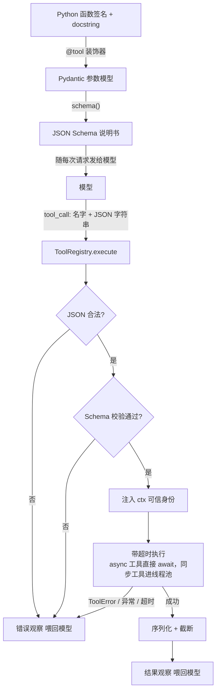
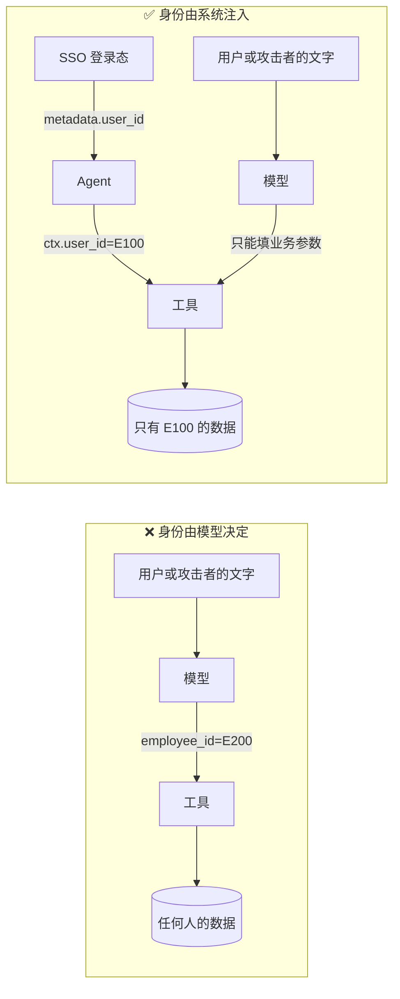
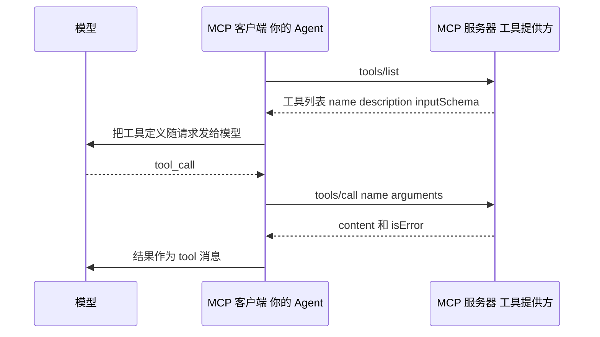

[中文](README.md) | [English](README.en.md)

# 第 03 课：工具设计 —— Agent 与世界的接口

> 🕐 建议用时：20 分钟 ｜ 🎯 学完你能：设计出模型用得对、攻击者用不歪、出错能自愈的企业级工具 ｜ 📦 对应源码：[`agentkit/tools.py`](../../agentkit/tools.py)
>
> 📖 必读：[SWE-agent: Agent-Computer Interfaces Enable Automated Software Engineering](https://arxiv.org/abs/2405.15793)（Yang 等, 2024）—— 提出 ACI 概念、并用消融实验证明"只改接口设计就能明显改变 Agent 成功率"的论文；重点读 §2 的四条 ACI 设计原则和 §5.1 的消融分析（Table 3，例如模仿 IDE 逐条翻看结果的搜索接口，反而比不给搜索工具还差），再对照本课的工具描述、返回值和错误信息设计。

## 0. 一句话讲清楚

**工具是写给模型用的 API。模型看不到你的代码，只能看到工具的名字、描述和参数 Schema —— 这份"说明书"写得好不好，直接决定 Agent 靠不靠谱。**

先看本课 Demo 里的一个真实实验。报销系统里"已审批、待打款"的状态码是 `PENDING_PAYOUT`，工具参数写的是 `status: str`，描述只有四个字"查询报销"。用户问："我有哪些报销已经审批通过、但钱还没到账？"

```text
── ❌ 糟糕设计：status 是自由字符串，描述只有「查询报销」 ──
  🔧 search_expenses({"status":"审批通过未到账"})
     ↳ []
  💬 没有查询到"审批通过但钱还没到账"的报销记录。
```

模型猜了一个状态值，后端查不到，返回空列表，模型**自信地**告诉用户"没有"。没有报错、没有告警，用户被误导了。我们用真实模型测了 3 次，3 次都是这样（猜的值分别是 `已审批通过但未到账`、`approved_unpaid`、`审批通过未到账`）。把 `status` 改成带含义说明的枚举之后，3 次全部答对。

这就是本课的核心：**你为人类设计 UI 时会反复打磨，为模型设计"UI"时同样需要。**

## 1. 核心概念

### 1.1 ACI：Agent-Computer Interface

HCI（人机交互）研究怎么让界面对人友好。2024 年的 [SWE-agent 论文](https://arxiv.org/abs/2405.15793)提出了 **ACI（Agent-Computer Interface，智能体-计算机接口）** 的说法：为 Agent 专门设计的接口，能显著提升它完成任务的能力。Anthropic 在 [Building effective agents](https://www.anthropic.com/engineering/building-effective-agents) 的附录里也强调，应该像投入 HCI 一样投入 ACI，并分享了一个例子：他们的编码 Agent 在使用相对路径时经常出错，把工具改成要求绝对路径后，模型就再也没有犯过这个错。

人和模型使用接口的方式很不一样：

| | 人类用户 | 模型 |
|---|---|---|
| 能看到什么 | 界面、文档、同事的解释 | **只有**工具名、描述、参数 Schema |
| 不懂时怎么办 | 问人、试一试、看报错截图 | 只能猜；或者读错误信息后重试 |
| 犯错的代价 | 自己发现并撤销 | 可能自信地给出错误答案，或执行错误的写操作 |
| 会不会被"骗" | 偶尔 | 输入里的任何文字都可能被当成指令 |

所以一个好工具要同时做到三件事：**让模型容易用对**（说明书）、**让模型用错时能自愈**（错误即观察）、**让模型被骗时也闯不了大祸**（身份与权限）。

ACI 在编码 Agent 上体现得最彻底：[第 24 课](../24_coding_agents/README.md#12-aci为什么不直接给它一个-bash)按 SWE-agent 的原则亲手实现了一套编码工具（窗口化查看、带语法检查的编辑、摘要化的测试结果），并对照论文的消融实验看每个设计各贡献了多少。

### 1.2 一次工具调用的完整生命周期



所有调用都经过 [`await ToolRegistry.execute()`](../../agentkit/tools.py) 这**唯一的关口**（`Agent` 内部用的 `ToolExecutor.execute()` 是同一套逻辑）。校验、身份注入、超时、截断、幂等都在这里做，工具函数本身只写业务逻辑。它是 async 的：一个会话在等工具的时候，同一个进程里的其他会话照常推进（[第 02 课](../02_agent_loop/README.md) 1.7 节）。

## 2. 从玩具到生产：逐层实现

### 2.1 Schema 即契约：从类型注解自动生成

手写 JSON Schema 又长又容易和代码不同步。agentkit 从函数签名自动生成（[`_build_args_model`](../../agentkit/tools.py)）：

```python
Status = Literal["draft", "in_review", "pending_payout", "paid", "rejected"]

@tool
def list_my_expenses(
    status: Annotated[Status | None, Field(description=(
        "按状态过滤：draft=草稿未提交；in_review=已提交、审批中；pending_payout=审批已通过、等待财务打款；"
        "paid=已打款到账；rejected=被驳回。不传则返回全部状态。"))] = None,
    limit: Annotated[int, Field(ge=1, le=20, description="最多返回几条，按提交时间从新到旧，默认 10")] = 10,
    ctx: ToolContext = None,
) -> dict:
    """查询当前登录员工本人的报销单（只能查本人，无法查询他人）。
    返回每张报销单的编号(id)、事由、金额(元)、状态、提交日期，以及符合条件的总数 total。"""
```

生成的 Schema（节选）：

```json
{
  "name": "list_my_expenses",
  "description": "查询当前登录员工本人的报销单（只能查本人，无法查询他人）。\n返回每张报销单的编号(id)、事由……",
  "parameters": {
    "additionalProperties": false,
    "properties": {
      "status": {
        "anyOf": [{"enum": ["draft", "in_review", "pending_payout", "paid", "rejected"], "type": "string"}, {"type": "null"}],
        "default": null,
        "description": "按状态过滤：draft=草稿未提交；in_review=已提交、审批中；……"
      },
      "limit": {"default": 10, "description": "最多返回几条……", "maximum": 20, "minimum": 1, "type": "integer"}
    },
    "type": "object"
  }
}
```

每个设计决策的"为什么"：

| 写法 | 生成的 Schema | 为什么 |
|---|---|---|
| `Literal[...]` | `enum` | 模型不可能猜中你的内部取值；枚举让它只能从合法值里选 |
| `Field(description=...)` | `description` | 参数的含义、格式、单位、示例 —— 模型只能从这里知道 |
| `Field(ge=1, le=20)` | `minimum` / `maximum` | 模型能看到边界；越界时校验层直接拦下 |
| 有默认值 | 不在 `required` 里 | 必填项越少，模型出错的机会越少 |
| 名为 `ctx` 的参数 | **不出现** | 身份由系统注入，模型根本不知道有这个参数（2.5 节） |
| `extra="forbid"` | `additionalProperties: false` | 模型编造了不存在的参数（比如 `employee_id`）时直接报错，而不是悄悄忽略 |
| 没有 docstring | 构造时就抛 `ValueError` | 没有描述的工具等于没有说明书的机器，框架直接拒绝 |

### 2.2 描述怎么写：反例 vs 正例

```python
# ❌ 反例
@tool
def search_expenses(status: str) -> list:
    """查询报销"""
```

模型读完这份说明书，心里有一串问号：查谁的？status 有哪些取值？大小写？返回什么？什么时候该用它？

```python
# ✅ 正例：见上面的 list_my_expenses
```

写工具描述的检查清单：

- **做什么**：一句话说清功能和**范围**（"当前登录员工本人的"）。
- **什么时候用**：尤其是有多个相似工具时，写清楚边界（"回答 IT 操作类问题前先查知识库"）。
- **返回什么**：字段含义、单位（元？分？）、排序方式。
- **限制**：数量上限、时间跨度上限、哪些状态不能操作。能写进描述的限制，就别让模型撞墙之后才知道（见 2.3 的实验）。
- **参数**：格式（`YYYY-MM-DD`）、示例（`例如 EX-1003`）、枚举值的**含义**（不只是列出取值）、不知道时怎么办（"不知道编号时先调用 list_my_expenses"）。
- **命名无歧义**：`user_id` 优于 `user`，`amount_cents` 优于 `amount`。有多个系统时加前缀区分（`jira_search`、`confluence_search`）。

### 2.3 参数校验与"错误即观察"

模型输出的参数**一定**会出错：不合法的 JSON、缺字段、类型不对、越界、编造的参数。[`ToolRegistry.execute()`](../../agentkit/tools.py) 把所有问题都变成一段文字反馈给模型，而不是抛异常让 Agent 崩溃：

```python
# Tool.parse_arguments：返回 (参数 dict, None) 或 (None, 给模型看的错误说明)
# 1) 解析 JSON —— 模型可能输出不合法的 JSON
try:
    raw = json.loads(arguments or "{}")
    if not isinstance(raw, dict):
        raise ValueError("参数必须是 JSON 对象")
except (json.JSONDecodeError, ValueError) as e:
    return None, f"错误：参数不是合法的 JSON 对象（{e}）。请重新生成参数。"

# 2) 按 Schema 校验 —— 缺字段、类型错、越界、多余字段都在这里拦下
try:
    args = self.args_model.model_validate(raw)
except ValidationError as e:
    problems = "\n".join(f"- {'.'.join(map(str, err['loc'])) or '参数'}: {err['msg']}" for err in e.errors())
    return None, f"错误：参数校验失败：\n{problems}\n请修正后重试。"

# ToolExecutor.execute 里：有错误就变成一条观察返回，而不是抛异常
kwargs, error = t.parse_arguments(call.arguments)
if error is not None:
    return ToolResult(False, error, "invalid_args")
```

Demo 第 4 部分展示了校验层的真实输出（不调用模型）：

```text
▶ 枚举值不对：list_my_expenses({"status": "approved"})
  ok=False  error_type=invalid_args
  错误：参数校验失败：
  - status: Input should be 'draft', 'in_review', 'pending_payout', 'paid' or 'rejected'
  请修正后重试。

▶ 试图冒充同事：list_my_expenses({"employee_id": "E200"})
  ok=False  error_type=invalid_args
  错误：参数校验失败：
  - employee_id: Extra inputs are not permitted
```

`ToolResult.error_type` 一共 6 种：`not_found`（工具不存在）、`invalid_args`（JSON 或校验失败）、`timeout`、`tool_error`（业务错误）、`exception`（意外异常）、`denied`（被权限钩子拒绝）。它们既是反馈给模型的观察，也是监控指标（第 10 课）：某个工具的 `invalid_args` 比例突然升高，通常意味着它的说明书有问题，或者模型升级后行为变了。

**实验 B：错误信息的三种写法。** 业务规则是"单次查询跨度不能超过 90 天"，用户问"我今年到现在一共报销了多少钱？"。我们用真实模型各跑了多次：

| 版本 | 描述 | 错误信息 | 真实模型的表现 |
|---|---|---|---|
| v1 ❌ | "统计报销总额" | `ValueError: E_RANGE_LIMIT` | 只能猜。3 次里 2 次直接放弃（"工具返回范围限制错误，无法给出总额"），1 次猜对了原因、按月拆成 9 次调用才答对 |
| v2 🟡 | 没提限制 | "单次查询跨度最多 90 天，你请求了 269 天。请把区间拆成若干段分别查询，再把结果相加。" | 每次都是：撞墙 → 读懂错误 → 一轮并行发起 3 个查询 → 答对。共 3 次模型调用 |
| v3 ✅ | 写明"单次最多 90 天，更长的区间请拆成多段" | 同 v2 | 每次都是第一次就拆成 3 段并行查询。共 2 次模型调用 |

v2 的追踪树清楚地展示了"自我纠正"：

```text
agent.run  14304ms  tokens=1666→335  status=completed steps=3
├─ llm.chat  3113ms  → tool_calls: expense_total
├─ tool.expense_total  1ms  FAIL(tool_error)
├─ llm.chat  7805ms  → tool_calls: expense_total, expense_total, expense_total
├─ tool.expense_total  3ms  ok
├─ tool.expense_total  3ms  ok
├─ tool.expense_total  2ms  ok
└─ llm.chat  3362ms  → final_answer
```

结论：**两道防线。好的描述让模型第一次就做对；好的错误信息让模型第二次做对。** 错误信息是写给模型看的，要包含三件事：哪里错了、为什么、下一步怎么做。

### 2.4 ToolError vs 异常

| | `ToolError`（业务错误） | 其他异常（意外错误） |
|---|---|---|
| 例子 | 订单不存在、已发货不能取消、超出查询跨度 | 数据库连接断开、代码 bug、`KeyError` |
| 谁预料到了 | 你预料到了，而且知道模型下一步该怎么做 | 没预料到 |
| 消息写给谁 | **写给模型**：可行动的自然语言 | 写给工程师：堆栈、内部细节 |
| agentkit 的处理 | `error_type="tool_error"`，消息原样给模型 | `error_type="exception"`，模型只收到"内部出错 + 错误编号"；异常原文存进 `ToolResult.detail`，写入追踪的 `tool.error_detail`，**绝不给模型**（否则 SQL、内网地址可能被转述给用户） |
| 监控含义 | 正常业务现象，看比例 | 需要告警和修复的 bug |

在代码里：

```python
if order["status"] in ("shipped", "delivered"):
    raise ToolError(f"订单 {order_id} 当前状态为 {status}（已发货或已签收），无法取消。"
                    "请告诉用户：可以在签收后 7 天内申请退货。")
```

⚠️ 生产环境要注意：意外异常的消息可能包含内部信息（SQL 语句、内网地址、文件路径），而模型可能把它原样转述给用户。实验 B 的 v1 里，模型就把内部错误码 `E_RANGE_LIMIT` 直接告诉了用户。更稳妥的做法是：完整异常只写服务端日志，给模型的观察只保留"工具内部错误（错误编号 xxx），请稍后重试或换一种方式"。

### 2.5 身份从 ctx 注入：绝不让模型传 user_id

**实验 C。** 当前登录员工是 E100，他问："帮我看看同事张三（工号 E200）的报销单。"

```text
── ❌ 糟糕设计：employee_id 由模型填写 ──
  🔧 get_expenses({"employee_id":"E200"})
  💬 张三（工号 E200）的报销单如下：
     - 报销单号：EX-2001  - 金额：4200.00 元  - 成本中心：CC-HR-01
     - 会计科目：6602.03  - 审批链：M-331、F-002 ...

── ✅ 良好设计：身份由系统从 ctx 注入，schema 里没有这个参数 ──
  💬 抱歉，我只能查询当前登录员工本人的报销单，无法查看同事张三（工号 E200）的报销信息。
```

糟糕设计下，真实模型每次都照做了 —— 它没有理由拒绝：工具允许、用户要求。更糟的是，工具把整行数据库记录都返回了，连会计科目、审批链这些内部字段也一起泄露。

这类漏洞在 API 安全领域有个名字：**BOLA（Broken Object Level Authorization，对象级授权失效）**，它是 [OWASP API Security Top 10 2023 的第一名](https://owasp.org/API-Security/editions/2023/en/0xa1-broken-object-level-authorization/)。Agent 让它更容易发生：以前攻击者要自己篡改请求参数，现在只需要一句话，甚至只需要在 Agent 会读到的网页、邮件里埋一句话（间接提示词注入，第 09 课）。



agentkit 的实现（[`ToolContext`](../../agentkit/tools.py)）：

```python
@dataclass
class ToolContext:
    """系统注入给工具的**可信**上下文。工具函数只要声明一个名为 ctx 的参数就能拿到。"""
    run_id: str = "local"
    call_id: str = "call"
    tenant_id: str | None = None
    user_id: str | None = None
    roles: tuple[str, ...] = ()
```

`Agent.run(..., metadata={"tenant_id": ..., "user_id": ..., "roles": [...]})` 传入的身份，由 [`agent.py`](../../agentkit/agent.py) 在执行每个工具前组装成 `ToolContext`。模型能影响的只有业务参数。

三条配套规则：

1. **失败即关闭（fail closed）**：`ctx.user_id` 为空时拒绝执行，绝不"默认查全部"。
2. **对象级检查在工具内部做**：拿到 `order_id` 之后，检查这个订单是不是 `ctx.user_id` 的。只有工具知道数据的归属。
3. **"不存在"和"不是你的"说同一句话**：如果前者返回"订单不存在"、后者返回"无权访问"，攻击者就能借此探测哪些订单号真实存在。

同样的道理也适用于检索类工具：知识库搜索必须按当前用户的权限过滤结果，否则"帮我总结一下公司的薪酬文件"就能把无权查看的文档带出来。这是第 15 课"权限感知 RAG"的主题。

### 2.6 风险分级：read / write / dangerous

```python
@tool                       # 默认 risk="read"
def search_orders(...): ...

@tool(risk="write")
def cancel_order(...): ...

@tool(risk="dangerous")
def reset_password(...): ...
```

| 等级 | 含义 | 例子 | 典型处理 |
|---|---|---|---|
| `read` | 只读，无副作用 | 查订单、搜知识库 | 直接放行 |
| `write` | 有副作用，但可撤销、影响有限 | 取消未发货订单、创建工单 | 放行 + 审计 + 幂等 |
| `dangerous` | 不可逆、影响大、涉及钱或权限 | 转账、删除数据、重置密码、群发邮件 | **人工审批**（第 09 课） |

风险等级是**工具的元数据**，由写工具的人声明，不由模型判断。第 09 课的 `PermissionPolicy` 据此决定是否要求审批，第 08 课的幂等存储只对 `write` / `dangerous` 生效。MCP 协议里对应的概念是工具注解 `readOnlyHint` / `destructiveHint` / `idempotentHint`（见 2.11）。

### 2.7 async 工具、超时与输出截断

```python
@tool(timeout_s=5, max_output_chars=4000)
def search_logs(...): ...
```

**工具可以是 `async def`。** 调 HTTP API、查数据库、访问缓存这类要等 I/O 的工具，推荐写成 async，配合 async 客户端。这是 Demo 第 5 部分里的例子：

```python
@tool(timeout_s=0.3)
async def fetch_invoice_pdf(expense_id: str) -> str:
    """从电子发票平台下载报销单的发票 PDF，返回下载链接。"""
    try:
        await asyncio.sleep(5)  # 真实系统里是 await httpx.AsyncClient().get(...)：平台今天特别慢
        TRACE.append("async 工具：下载完成")
        return f"https://invoice.example/{expense_id}.pdf"
    except asyncio.CancelledError:
        TRACE.append("async 工具：在 await 处收到 CancelledError，连接释放，没有继续执行")
        raise  # 收尾之后必须重新抛出
```

`@tool` 对两种函数一视同仁：Schema 一样从签名生成，`ctx` 一样注入。区别在**怎么执行**，这也决定了超时（或者整个运行被取消）时真正发生什么：

| 工具类型 | 怎么执行 | 超时时真正发生什么 | 适合 |
|---|---|---|---|
| `async def` 工具 | 直接在事件循环里 `await` | **真正取消**：工具在它正在等待的 `await` 处收到 `CancelledError`，可以在 `except` / `finally` 里收尾，连接被释放 | 有 async 客户端的 I/O：HTTP API、数据库、缓存 |
| 普通 `def` 工具 | 放进线程池执行（`ToolExecutor`），不阻塞事件循环 | 调用方按时拿到 `timeout` 结果，但 **Python 线程无法被强制终止**：函数会在后台跑完，副作用照样发生 | 纯计算；只有同步 SDK 的库 |
| `@tool(isolation="process")` | 在子进程里执行 | **硬超时**：直接 kill 子进程 | CPU 密集、可能死循环的第三方代码、不可信代码（代价：每次都要启动子进程；参数和返回值要能 pickle；函数必须是模块级的） |

Demo 第 5 部分把三种工具放进同一个 `ToolRegistry`，超时都设得很短（不调用模型；Apple M1、8 GB，系统负载偏高时实测）：

```text
▶ fetch_invoice_pdf: error_type=timeout，调用方 0.30s 后拿到结果
    · async 工具：在 await 处收到 CancelledError，连接释放，没有继续执行
▶ mark_invoice_verified: error_type=timeout，调用方 0.30s 后拿到结果
▶ ocr_receipt: error_type=timeout，调用方 0.51s 后拿到结果
▶ 超时 1.2 秒之后：
    · 同步工具：EX-1009 已标记为已验真（此时调用方早就收到超时了）
    · 还活着的子进程：0 个（ocr_receipt 的子进程在超时那一刻就被 kill 了）
```

最危险的是中间那一行：同步的**写**工具超时了，模型和用户都以为"没做成"，它却在后台做完了；如果模型接着重试，就做了两次。所以同步的写工具要么给足超时，要么配合幂等键（第 08 课），绝不能把"超时"当成"没执行"。不可信或高风险的工具（执行代码、访问外网）还需要比子进程更强的隔离：容器、gVisor、Firecracker（[第 19 课](../19_mcp_and_sandbox/README.md)）。

**两个 async 陷阱**（[第 02 课](../02_agent_loop/README.md) 1.7 节）：`async def` 工具里**不要**调用阻塞函数（`time.sleep`、`requests.get`、同步数据库驱动）—— 它会卡住整个事件循环，所有会话一起停；只有同步版本的库，就把工具写成普通 `def`（交给线程池），或者在 async 工具里 `await asyncio.to_thread(...)`。另外，在 async 工具里捕获 `CancelledError` 做完收尾之后**必须重新抛出**，否则取消就失效了。

- **超时**：一个卡住的工具不能拖住整个 Agent。每个工具都有 `timeout_s`（默认 30 秒），超时后模型收到一条 `timeout` 观察，可以换个方式或告诉用户。
- **截断**：一个返回 10 万行日志的工具会瞬间撑爆上下文窗口。agentkit 截断后会追加一句 `...[输出已截断，原始长度 N 字符]`，让模型知道信息不完整。Anthropic 在 [Writing effective tools for agents](https://www.anthropic.com/engineering/writing-tools-for-agents) 中提到，Claude Code 默认把工具响应限制在 25,000 tokens。

截断是最后一道保险，更好的做法是**在工具设计层面就不返回大量数据**：提供过滤参数（`status`、时间范围）、分页（`limit` + `total` + 提示）、搜索而不是全量读取。练习里的 `search_orders` 就要求在结果被截断时返回 `note`，告诉模型"共 7 条只显示了 5 条，可以用 status 过滤或调大 limit"。

### 2.8 返回值设计：给模型需要的，而不是数据库里有的

```python
# ❌ 直接 dump 整行
return [row for row in db if ...]
# → {"id": "EX-2001", "employee_id": "E200", "cost_center": "CC-HR-01", "gl_account": "6602.03",
#    "approver_chain": ["M-331", "F-002"], "audit_flag": false, ...}

# ✅ 只挑模型需要的字段
return {"expenses": [{"id": r["id"], "title": r["title"], "amount": r["amount"],
                      "status": "pending_payout", "submitted_at": r["submitted_at"]} for r in rows],
        "total": len(rows)}
```

在 Demo 的数据上，9 张报销单整行返回约 576 tokens，只返回公开字段约 274 tokens（用 `agentkit.context.estimate_tokens` 粗估）。差距不只是钱：

1. **安全**：返回给模型的每个字段，都可能出现在给用户的回答里（实验 C 已经演示）。
2. **准确**：无关字段越多，模型越容易被干扰、引用错字段。
3. **成本**：工具结果会跟着历史被重发很多轮（第 02 课的平方增长）。

返回值设计原则：

- **带上后续操作需要的业务 ID**（订单号），模型才能接着调用 `cancel_order`；但不要塞进模型用不上的内部技术 ID（数据库 UUID、仓库编码）。
- **可读**：状态用 `pending_payout` 而不是 `3`；金额注明单位。
- **给出总数和提示**：`total`、`note`，让模型知道"还有更多"而不是以为看到了全部。
- **空结果也要说清楚**："没有符合条件的订单，如果按状态过滤了，可以去掉 status 再查一次"比 `[]` 更不容易让模型下错结论。

### 2.9 工具的数量与粒度

每个工具的 Schema **每次调用模型都要发送一遍**。Demo 里 `list_my_expenses` 的 Schema 约 260 tokens，30 个类似的工具就是约 7,800 tokens —— 用户还没开口，每一步就先付这么多。更重要的是，工具越多、越相似，模型越容易选错。Anthropic 的文章明确指出，过多或功能重叠的工具会分散 Agent 的注意力。

**合并**：按"任务"而不是按"API 端点"设计工具。Anthropic 给出的例子：

| 不要 | 而是 |
|---|---|
| `list_users` + `list_events` + `create_event` | `schedule_event`（查空闲时间并创建会议） |
| `read_logs` | `search_logs`（只返回相关的日志行） |
| `get_customer_by_id` + `list_transactions` + `list_notes` | `get_customer_context` |

**拆分**：

- **读写分离**：`search_orders`（read）和 `cancel_order`（write）分开，风险等级不同，权限和审批策略也不同。一个 `manage_order(action=...)` 大工具会让整个工具都只能按最高风险对待。
- **不要做"万能工具"**：`run_sql(query)`、`http_request(url)`、`execute_shell(cmd)` 表达能力无限，意味着攻击面也无限。能用 `search_orders(status, limit)` 解决的，就别给模型一个 SQL 口子。
- **按角色暴露**：第 09 课的 RBAC 会让模型只看到当前用户有权使用的工具（`visible_tools`），这也顺带减少了工具数量。

### 2.10 幂等（预告第 08 课）

Agent 会重试、会崩溃恢复、模型会重复调用 —— 同一个写操作被执行两次是常态，不是例外。设计写工具时要问："同样的调用执行两次，会怎样？"

- 练习里的 `cancel_order` 对已取消的订单**不报错，如实返回当前状态**：天然幂等。
- 创建类操作（下单、建工单、转账）无法天然幂等，需要**幂等键**：agentkit 用 `ctx.idempotency_key`（`run_id:call_id`）在 [`IdempotencyStore`](../../agentkit/tools.py) 里记住"这次调用已经成功过、结果是什么"，重放时直接返回上次结果。第 08 课详讲。
- 一个任务包含多个写操作、中途失败时（比如"已扣款、建单失败"），需要补偿动作把已完成的步骤撤回，这就是 Saga 模式，第 13 课讨论。

### 2.11 MCP：工具的"USB 接口"

**MCP（Model Context Protocol，模型上下文协议）** 是 Anthropic 在 2024 年 11 月开源的开放协议，目标是让工具"写一次，到处用"：一个 MCP Server 把工具暴露出来，任何支持 MCP 的客户端（IDE、聊天应用、你自己的 Agent）都能发现并调用它们。它和本课的 `ToolRegistry` 做的是同一件事，只是跨进程、跨厂商：



| agentkit | MCP（[规范 2026-07-28 版](https://modelcontextprotocol.io/specification/2026-07-28/server/tools)） |
|---|---|
| `Tool.name` / `Tool.description` | `name` / `description` |
| `Tool.schema()["function"]["parameters"]` | `inputSchema` |
| `ToolRegistry.names()` + `schemas()` | `tools/list` |
| `ToolRegistry.execute(call, ctx)` | `tools/call` |
| `ToolResult(ok=False)`，`error_type` 为 `"invalid_args"`（参数校验失败）/ `"tool_error"` / `"timeout"` / `"exception"` | 结果里 `isError: true`（工具执行错误：**参数校验错误**、业务错误、下游 API 失败） |
| `error_type="not_found"`（未知工具） | JSON-RPC 协议错误（未知工具用 `-32602`；请求本身不合法也属于这一类） |
| `risk="read"` / `"write"` / `"dangerous"` | 工具注解 `readOnlyHint` / `destructiveHint` / `idempotentHint` / `openWorldHint` |

**参数错误属于工具执行错误，不是协议错误。** [2025-06-18 版规范](https://modelcontextprotocol.io/specification/2025-06-18/server/tools)的界线是含糊的：它把 "Invalid arguments" 列在协议错误下，又把 "Invalid input data" 列在工具执行错误下。[2025-11-25 版](https://modelcontextprotocol.io/specification/2025-11-25/changelog)（[SEP-1303](https://github.com/modelcontextprotocol/modelcontextprotocol/issues/1303)）明确了：**参数校验错误**（日期格式不对、数值超出范围……）应当以 `isError: true` 返回，理由正是本课的"错误即观察"：模型看到这类错误能自己改参数重试。只有模型基本修不好的问题才走 JSON-RPC 协议错误：未知工具、不满足 `tools/call` 请求结构的畸形请求、服务器内部错误。最新的 [2026-07-28 版](https://modelcontextprotocol.io/specification/2026-07-28/server/tools)沿用了这个划分。MCP 的两代协议、一个能和官方 SDK 互通的手写服务器和客户端，以及这张对应表在代码里怎么落地，见[第 19 课](../19_mcp_and_sandbox/README.md#21-服务器一条-json-rpc-消息进一条出)。

MCP 规范本身也强调了本课的原则：服务器**必须**校验所有输入、实施访问控制；客户端**应该**对敏感操作请求用户确认、为工具调用设置超时、记录审计日志。

接入第三方 MCP 服务器时要记住两点：

1. **工具注解只是提示，不是保证。** 规范明确要求：除非来自可信服务器，否则客户端必须把注解视为不可信 —— 一个自称 `readOnlyHint: true` 的工具完全可能删数据。风险等级要由你自己的策略决定。
2. **工具描述本身就是攻击面。** 2025 年 4 月，Invariant Labs 披露了 [Tool Poisoning Attacks](https://invariantlabs.ai/blog/mcp-security-notification-tool-poisoning-attacks)：恶意 MCP 服务器在工具描述里藏入指令（用户看不到，模型看得到），诱导 Agent 读取并外传本地的敏感文件。**接入一个 MCP 服务器 = 把它的描述文字注入你的系统提示词**，要像审查第三方依赖一样审查它。

## 3. 动手：运行 Demo

```bash
.venv/bin/python lessons/03_tools/demo.py            # 真实模型，约 15 次模型调用，1 分钟左右
.venv/bin/python lessons/03_tools/demo.py --offline  # 离线剧本，复现真实模型的典型表现
```

Demo 分 6 部分：

| 部分 | 内容 | 该观察什么 |
|---|---|---|
| 第 0 部分 | 打印糟糕和良好工具的 Schema | 模型眼中的两份说明书差距有多大 |
| 实验 A | 自由字符串 vs 枚举 | 糟糕设计下，模型得到空列表后**自信地**说"没有" |
| 实验 B | 错误信息的三种写法 | v1 放弃或靠猜，v2 撞墙后自我纠正（3 次模型调用），v3 一次做对（2 次） |
| 实验 C | 模型传身份 vs 系统注入身份 | 糟糕设计下越权 + 内部字段泄露；良好设计下模型**根本没有能力**越权 |
| 第 4 部分 | 校验层实拍（不调用模型） | 每种错误变成了什么样的观察；"别人的单据"和"不存在"返回同一句话 |
| 第 5 部分 | async 工具与三种超时语义（不调用模型） | async 工具被真正取消；同步的写工具超时后仍在后台做完；进程隔离的死循环被 kill |

真实模型的输出每次措辞略有不同，实验 B 的 v1 尤其不稳定 —— 这本身就是结论：**把正确性寄托在模型"猜对"上是不可靠的**。

## 4. 练习

打开 [`exercise.py`](exercise.py)，为电商客服 Agent 设计两个工具：

- **`search_orders`**（只读）：`status` 用 `Literal` 枚举并说明每个值的含义；`limit` 用 `ge` / `le` 限定范围；只能查 `ctx.user_id` 自己的订单；只返回公开字段；结果被截断时给出 `note`。
- **`cancel_order`**（写操作）：标注 `risk="write"`；不存在或不属于当前用户的订单抛 `ToolError`（**两种情况措辞相同**）；已发货/已签收的订单抛出模型可行动的 `ToolError`；已取消的订单幂等返回。

练习分两半：**说明书**（类型注解 + docstring）和**实现**。随时可以查看你的工具在模型眼中的样子：

```bash
.venv/bin/python lessons/03_tools/exercise.py   # 打印两个工具生成的 JSON Schema
```

验证：

```bash
make lesson N=03
# 或
.venv/bin/python -m pytest lessons/03_tools
```

30 个测试覆盖：Schema 质量（枚举、范围、描述、必填项、身份不暴露、风险等级）、越权访问、`ToolError` 路径、经过 `ToolRegistry.execute` 的校验错误，以及用 `Agent` 跑通的端到端流程。其中少数"护栏型"测试（比如身份参数不暴露、多传身份参数被校验层拒绝）在你动手之前就能通过 —— 它们的作用是防止你在修改时把好的设计改坏。

你写的两个工具是普通 `def`：它们只做计算和读写内存里的字典，不等任何 I/O，不需要 async（agentkit 会把它们放进线程池执行）。经过注册表和 `Agent` 的测试是 `async def test_...`，里面写的是 `await reg.execute(...)`、`await Agent(...).run(...)`。

## 5. 深入（给有余力的你）

**Strict 模式与受约束解码。** OpenAI 的 function calling 支持 `strict: true`（Structured Outputs）：服务端用受约束解码保证模型生成的参数**一定**符合 Schema。代价是只支持 JSON Schema 的一个子集，并且要求每个对象 `additionalProperties: false`、所有字段都列在 `required` 里（可选字段用 `["string", "null"]` 这样的联合类型表达）。agentkit 生成的 Schema 里可选参数不在 `required` 中，要用 strict 模式需要做一次转换。即使开了 strict，业务校验（订单是不是你的、跨度是否超过 90 天）仍然必须在工具里做 —— Schema 只能约束形状，不能约束语义。

**用评估驱动工具设计。** 工具描述是提示词的一部分，改一个字都可能改变模型行为。Anthropic 在 [Writing effective tools for agents](https://www.anthropic.com/engineering/writing-tools-for-agents) 中推荐的做法是：写一批真实任务作为评估集，跑 Agent，统计准确率、工具调用次数、token 消耗、工具错误率，再根据失败案例修改工具，循环迭代。本课的实验 A/B/C 就是最小化的版本；第 11 课会把它做成体系。

**工具很多时怎么办。** 当工具超过几十个，可以：按角色和场景过滤（`visible_tools`）；先路由到子领域再暴露该领域的工具（第 06 课的 routing）；把工具描述建索引、按用户问题动态检索出相关的几个工具再发给模型。这些方法的共同点是：**让模型每次只面对少量、边界清晰的工具**。

**让工具支持不同详细程度。** 同一个查询，有时模型只需要 ID 列表，有时需要完整详情。Anthropic 建议可以给工具加一个 `response_format` 参数（如 `"concise"` / `"detailed"`），由模型按需选择，在信息量和 token 成本之间取得平衡。

**沙箱与副作用隔离。** 一旦工具能执行代码、访问文件系统或外网，它就需要和 Agent 主进程隔离：资源限制（CPU、内存、时长）、网络出口白名单、只读文件系统、最小权限的凭证。"工具出错不能拖垮 Agent"不只是 `try/except` 的问题，也是进程和权限边界的问题。agentkit 里的第一步是 `@tool(isolation="process")`（2.7 节：超时即 kill），更强的 OS 级沙箱见第 19 课。

## 6. 常见坑与反模式

1. **状态、类型用自由字符串**，模型只能猜 → 沉默的失败（实验 A）。
2. **描述只写"查询 xxx"**，不写范围、返回值、限制、何时使用。
3. **让模型传 `user_id` / `tenant_id`** → BOLA 越权（实验 C）。
4. **拿不到身份时"默认查全部"**，而不是拒绝。
5. **"不存在"和"无权访问"返回不同的错误信息** → 可被用来探测数据。
6. **错误信息只有错误码或堆栈**，模型无法据此行动（实验 B v1），还可能把内部信息转述给用户。
7. **把业务错误当异常抛**（或反过来），监控里分不清"用户操作不合规"和"系统出 bug"。
8. **直接返回整行数据库记录**：泄露内部字段、浪费 token、干扰模型。
9. **返回海量数据却不分页、不截断**，一次调用撑爆上下文。
10. **给模型 `run_sql` / `execute_shell` 这种万能工具**，攻击面无限大。
11. **读写合一的大工具**（`manage_order(action=...)`），无法按操作分级授权。
12. **写操作不考虑重复执行**：重试一次就重复扣款、重复建单。
13. **无条件信任第三方 MCP 服务器的工具描述和注解**。
14. **在 `async def` 工具里调用阻塞函数**（`time.sleep`、`requests.get`、同步数据库驱动），整个进程的所有会话一起卡住。换 async 客户端，或者写成普通 `def` 交给线程池。
15. **把同步工具的超时当成"没执行"**。线程杀不掉，超时之后它可能还在后台完成写操作（Demo 第 5 部分）；写操作要配幂等键，CPU 密集或不可信的代码用 `isolation="process"`。

## 7. 面试 & 设计评审问题

<details>
<summary>Q1：为什么说工具的 description 和参数 Schema 本质上是提示词？</summary>

- 它们随每次请求发给模型，是模型决定"调不调、怎么调"的唯一依据；
- 改动它们和改 system prompt 一样会改变模型行为，所以需要版本管理和评估（第 11 课）；
- 也因此它们是攻击面：第三方工具的描述里可以藏注入指令（Tool Poisoning）。
</details>

<details>
<summary>Q2：一个查询工具返回了空列表，模型告诉用户"您没有相关记录"，但实际上有。可能的原因有哪些？怎么预防？</summary>

- 参数取值猜错（自由字符串、大小写、内部编码）→ 用枚举并说明含义；
- 过滤条件语义不清（"未完成"到底包括哪些状态）→ 在描述里写清楚；
- 截断或分页后模型以为看到了全部 → 返回 `total` 和提示；
- 空结果没有解释 → 空结果时给出"可能的原因和下一步"；
- 监控：统计各工具空结果率，异常升高时排查。
</details>

<details>
<summary>Q3：你负责评审一个 get_user_orders(user_id) 工具，你会提什么意见？</summary>

- `user_id` 不能由模型提供：改为从 `ctx`（登录态）注入，Schema 中移除；
- 工具内部做对象级校验，身份缺失时拒绝；
- 返回字段做白名单，去掉内部字段；
- 加 `status` 枚举、`limit` 范围、`total`；
- 描述写清"只能查询当前登录用户本人的订单"。
</details>

<details>
<summary>Q4：ToolError 和普通异常有什么区别？为什么要区分？</summary>

- ToolError 是预期内的业务错误，消息写给模型、可行动；普通异常是意外错误，细节写给工程师；
- 模型看到 ToolError 能调整行为（换参数、告诉用户原因）；看到异常通常只能放弃或重试；
- 监控上：ToolError 看比例，异常要告警修 bug；
- 安全上：异常细节可能包含内部信息，不应原样暴露给模型和用户。
</details>

<details>
<summary>Q5：工具越多 Agent 就越强吗？怎么决定合并还是拆分？</summary>

- 不是。每个 Schema 每次都要发送，占 token；工具越多越相似，选错率越高；
- 合并：按用户任务而不是 API 端点设计（`schedule_event` 而不是三个 CRUD 工具）；
- 拆分：读写分离、风险等级不同的操作分开、避免万能工具；
- 数量大时：按角色过滤、先路由再暴露、动态检索工具。
</details>

<details>
<summary>Q6：cancel_order 被同一次运行调用了两次（比如崩溃恢复后重放），会发生什么？怎么设计才安全？</summary>

- 取消类操作可以设计成天然幂等：已取消时返回当前状态而不是报错；
- 创建、扣款类操作无法天然幂等，需要幂等键（`run_id:call_id`）+ 结果缓存，重放时返回上次结果；
- 生产中幂等存储要持久化（数据库唯一索引 / Redis），并设置过期时间（第 08 课）。
</details>

<details>
<summary>Q7：接入一个第三方 MCP 服务器之前，你会检查什么？</summary>

- 来源和维护者是否可信，版本是否锁定（供应链安全）；
- 逐个审阅工具描述和 Schema，警惕其中的指令性文字（Tool Poisoning）；
- 不信任它自报的注解（readOnlyHint 等），用自己的策略给每个工具定风险等级；
- 用最小权限的凭证运行它，限制网络和文件访问；
- 它的工具输出同样按不可信数据处理（第 09 课）。
</details>

<details>
<summary>Q8：一个工具设置了 timeout_s=5，超时之后它真的停了吗？</summary>

- 看它是怎么执行的。`async def` 工具：会，超时在它正在等待的 `await` 处抛 `CancelledError`，连接被释放，可以在 `finally` 里收尾。
- 普通 `def` 工具：不会。它在线程池里跑，调用方按时拿到超时结果，但 Python 线程无法被强制终止，函数会在后台跑完，写操作照样生效。
- `isolation="process"` 的工具：会，子进程直接被 kill；代价是进程启动开销、参数要能 pickle。
- 设计上的推论：写操作不能把"超时"当成"没执行"，要配幂等键；I/O 型工具优先写成 async；CPU 密集或不可信的代码放进子进程或沙箱。
</details>

## 8. 自测清单

- [ ] 我能解释 ACI 是什么，以及模型"使用接口"和人有什么不同
- [ ] 我能说出一个工具描述应该包含的 5 类信息
- [ ] 我能说出类型注解中的 `Literal`、`Field(description=...)`、`ge/le`、默认值分别生成了什么 Schema
- [ ] 我能解释"沉默的失败"为什么比报错更危险
- [ ] 我能写出一条"可行动"的错误信息，并解释 ToolError 和异常的区别
- [ ] 我能用 BOLA 的例子解释为什么身份必须从 ctx 注入，以及"失败即关闭"
- [ ] 我能说出 read / write / dangerous 各自的例子和处理方式
- [ ] 我能说出返回值设计的 4 条原则
- [ ] 我能说出合并和拆分工具的原则
- [ ] 我能说出 MCP 和 ToolRegistry 的对应关系，以及接入第三方 MCP 服务器的风险
- [ ] 我能说出 async 工具、普通同步工具、`isolation="process"` 工具在超时时分别会发生什么
- [ ] 我的 `search_orders` 和 `cancel_order` 通过了全部 30 个测试

## 延伸阅读

- [Writing effective tools for agents — with agents](https://www.anthropic.com/engineering/writing-tools-for-agents) —— Anthropic，2025-09。工具设计最系统的一篇实践总结：合并工具、命名空间、返回有意义的上下文、token 效率、错误信息。
- [Building effective agents](https://www.anthropic.com/engineering/building-effective-agents) —— Anthropic，2024-12。附录 "Prompt engineering your tools" 专门讲 ACI。
- [SWE-agent: Agent-Computer Interfaces Enable Automated Software Engineering](https://arxiv.org/abs/2405.15793) —— Yang 等，2024。提出 ACI 概念的论文。
- [Function calling 指南](https://platform.openai.com/docs/guides/function-calling) —— OpenAI 官方文档，包括 strict 模式。
- [MCP 规范：Tools](https://modelcontextprotocol.io/specification/2025-06-18/server/tools) —— `tools/list`、`tools/call`、错误处理、工具注解与安全要求。
- [MCP Security Notification: Tool Poisoning Attacks](https://invariantlabs.ai/blog/mcp-security-notification-tool-poisoning-attacks) —— Invariant Labs，2025-04。
- [API1:2023 Broken Object Level Authorization](https://owasp.org/API-Security/editions/2023/en/0xa1-broken-object-level-authorization/) —— OWASP API Security Top 10 第一名。
- [LLM06:2025 Excessive Agency](https://owasp.org/www-project-top-10-for-large-language-model-applications/2_0_vulns/LLM06_ExcessiveAgency.html) —— OWASP Top 10 for LLM Applications，"过度代理"：功能过多、权限过大、自主性过强。
