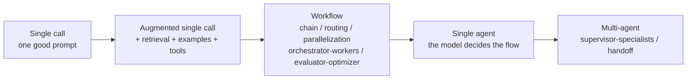
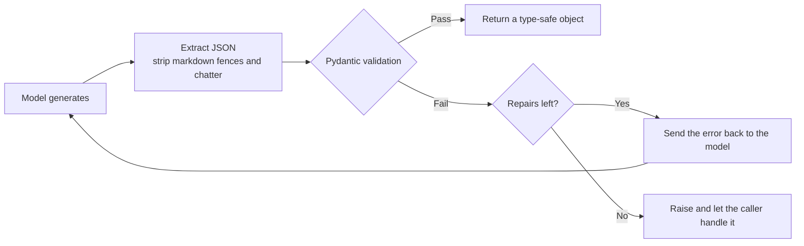
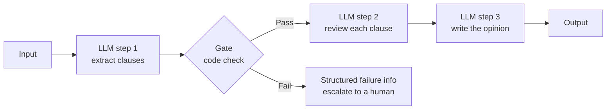
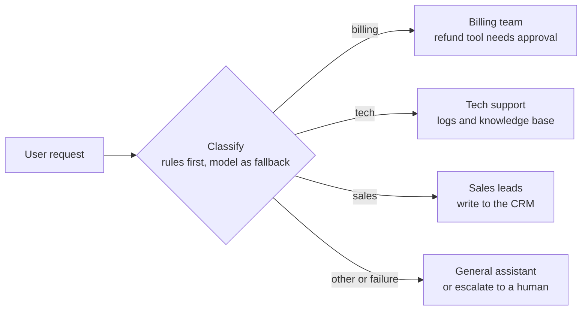
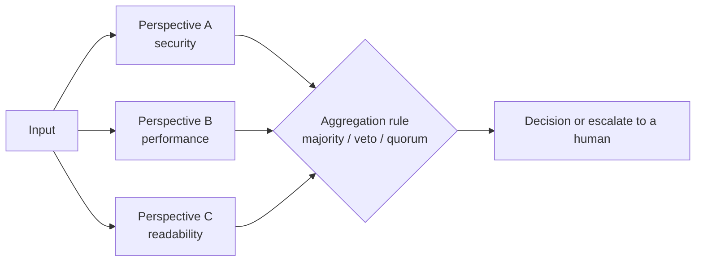
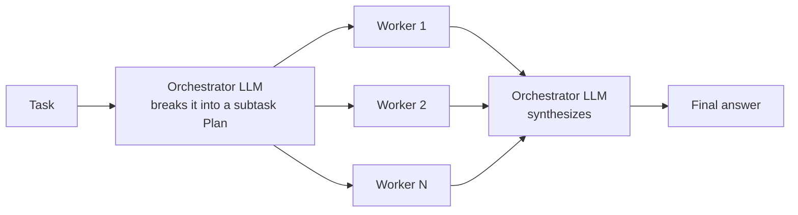
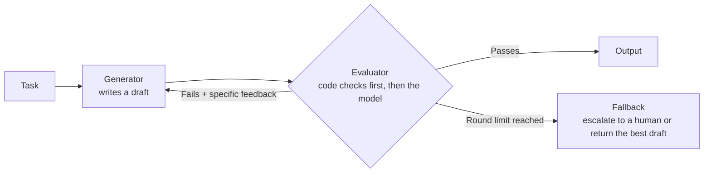
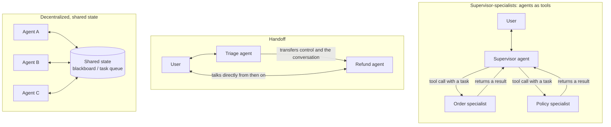
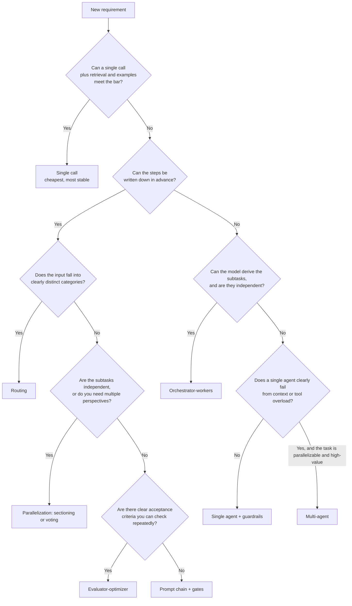

[中文](README.md) | [English](README.en.md)

# Lesson 04: Orchestration patterns — workflows, agents, and multi-agent systems

> 🕐 Suggested time: 15 min · 🎯 You'll learn to: pick the simplest orchestration that solves a given business need, and explain what it costs in money, latency, and reliability; tell when multi-agent is worth it and when it's a trap · 📦 Source: `agentkit/workflows.py`

> 📍 This lesson is part of **Part 1: Building Blocks** (concepts → build from scratch → exercises), and it's the last lesson of Part 1.
>
> 🧭 **Core path (15-minute must-read)**: §0 → §1.1–§1.3 → §2.1–§2.5, the five patterns (for each, start with the diagram and the "Best for" and "Cost" bullets) → §2.7 the costs of multi-agent and when it's worth it → §2.8 decision tree → §3 run the demo → §4 do the exercises.
> Sections marked **📖 Optional** (going deeper, pitfalls, interview questions) are deep dives for when you have time; skip them on the first pass. Distributed execution and high concurrency for multi-agent systems are covered in Lesson 10, [High concurrency and distributed execution](../10_distributed_concurrency/README.en.md).

## 0. In one sentence

**First ask who should decide the flow; then pick the pattern.**

Imagine a company needs to get something done. There are three ways to organize it:

| Setup | Analogy | Maps to |
|---|---|---|
| One employee follows a standard operating procedure (SOP) step by step | The process is fixed, and every step is clear | **Workflow**: **code** decides the flow |
| Hire a project manager, give them a goal and tools, and let them figure it out | Flexible, but you don't know how many steps they'll take or how much they'll spend | **Agent**: the **model** decides the flow |
| Build a team: a manager plus a few specialists | Can take on bigger jobs, but brings communication overhead, coordination overhead, and finger-pointing | **Multi-agent** |

Each row down is more flexible — and more expensive, slower, less predictable, and harder to hold accountable when something goes wrong. A good manager doesn't form a project team to photocopy a document.

That's exactly what Anthropic stresses again and again in *Building Effective Agents*: first "find the simplest solution possible," and add complexity only when it clearly pays off. Many so-called agent requirements can be met with a single call plus retrieval; many multi-agent requirements can be met with a single workflow.

This lesson's demo runs each of the 5 patterns against a real model and measures its "price":

| Pattern | Time | Model calls | Tokens | Who decides the flow |
|---|---|---|---|---|
| route (3 tickets) | 7.4s | 3 | 1,566 | Code (the model only classifies) |
| parallel voting | 3.2s | 3 | 1,722 | Code |
| orchestrator_workers | 19.1s | 5 | 2,859 | The model plans + code executes |
| evaluator_optimizer | 8.5s | 3 | 1,417 | A code loop + the model generates / reviews |
| agent_as_tool multi-agent | 26.6s | 7 | 5,082 | The model (the supervisor decides whom to delegate to) |

## 1. Core concepts

### 1.1 Workflows vs. agents

- **Workflow**: LLMs and tools orchestrated through **predefined code paths**. The LLM handles certain steps (classification, generation, extraction), while your `if / for` statements decide what happens next.
- **Agent**: the LLM **decides at runtime** what to do next, which tool to call, and when to stop (the agent loop from Lesson 01).

| | Workflow | Agent |
|---|---|---|
| Who decides the flow | Code | The model |
| Number of calls | Fixed or bounded | Unknown (max_steps / a budget acts as the backstop) |
| Predictability | High: same input, same path | Low: 3 steps today, 7 tomorrow |
| Testing | Every step can be unit-tested | Only statistical testing with eval sets (Lesson 08) |
| When it fails | You can pinpoint the exact step | You have to dig through traces to see what it was "thinking" (Lesson 07) |
| Best for | Tasks whose steps can be written down in advance | Open-ended tasks where the number of steps and the path can't be known in advance |

**It's not either/or; it's a spectrum.** The most common enterprise shape is a workflow as the backbone, with agents embedded at the few nodes that need flexibility. For example, in a fixed ticket-handling workflow, only the "troubleshoot the issue" step is handed to an agent with tools.

### 1.2 The complexity ladder: climb only when the rung below isn't enough



Every step to the right means **more calls, more latency, more cost, more uncertainty, and harder debugging**. So the question is always: "Why isn't the previous rung enough? Do you have data to prove it?"

- Anthropic's experience: for many applications, a single call done well, with retrieval and examples, is usually enough.
- OpenAI's *A practical guide to building agents* likewise recommends getting the most out of a single agent before splitting it into several.

### 1.3 Structured output: the interface contract of orchestration

Orchestration connects steps together, and **every connection is an interface**. If a step outputs free text, the code in the next step can only guess:

```python
label = llm("Classify this ticket: ...")   # the model answers: "This one belongs in the billing category."
HANDLERS[label]                             # KeyError!
```

That's why nearly every step in an orchestration asks the model for **a data structure that code can validate**. agentkit's `complete_json` ([agentkit/workflows.py](../../agentkit/workflows.py)) is the foundation of every orchestration pattern:

```python
def complete_json(llm, prompt, model_cls, system=None, max_repairs=2):
    schema = json.dumps(model_cls.model_json_schema(), ensure_ascii=False)
    messages = [...]  # append the JSON Schema to the prompt and ask for "JSON only"
    for _ in range(max_repairs + 1):
        text = llm.chat(messages).content or ""
        try:
            return model_cls.model_validate_json(extract_json(text))   # ① extract the JSON ② validate with Pydantic
        except (ValidationError, ValueError) as e:
            messages.append({"role": "assistant", "content": text})
            messages.append({"role": "user", "content": f"Your output failed validation:\n{e}\nOutput only the corrected JSON."})
    raise ValueError(...)                                               # ③ if it can't be fixed, fail loudly
```



Design points:

- **Send validation errors back verbatim**: Pydantic's error message ("route: Input should be 'billing', 'tech'...") is itself the best repair instruction;
- **Cap the repairs**: the worst case is `max_repairs + 1` calls, so the cost is predictable;
- **Use types to narrow the output space**: `route()` puts the categories into the schema with `Literal[...]`, so the return value is **guaranteed** to be a valid key; the same goes for `Plan` and `Review`;
- When the model or gateway supports **native structured output** (decoding constrained by a JSON Schema), prefer it, and keep this repair loop as a fallback.

## 2. From toy to production: pattern by pattern

Each pattern below answers five questions: **what it is, what it looks like, what it's good for, what it costs, and how enterprises use it**.

### 2.1 Prompt chaining + gates

Split the task into a fixed sequence of steps, where each step's output is the next step's input, and insert **gates** (checks) between the steps.



```python
def chain(steps, text, gate=None):
    for i, step in enumerate(steps):
        text = step(text)
        if gate is not None and not gate(i, text):
            raise ValueError(f"The output of step {i + 1} failed the gate: {text[:200]}")
    return text
```

- **Best for**: tasks that decompose cleanly into fixed subtasks, trading latency for accuracy — each step is simpler, so the model is less likely to get it wrong. Anthropic's examples: write marketing copy, then translate it; write an outline, check the outline, then write the full document.
- **Cost**: N calls; latency is the sum of all the steps.
- **Why gates**: errors compound. If each step is right 95% of the time, all 5 steps in a row are right only 0.95⁵ ≈ 77% of the time. Checks in **code** between steps (length, format, required fields, whether the source text is cited) stop errors before they spread.
- **The enterprise upgrade (Exercise 3)**: when a gate fails, `chain` simply raises. In an online service, that means a 500 and lost context. `run_with_gates` returns structured failure info instead — which step failed and why, which steps completed, and the last trustworthy intermediate result — so you can escalate to a human or resume from where it stopped.

### 2.2 Routing

Classify first, then hand off to a specialized handler. Each handler has its own prompt, tools, and permissions.



```python
def route(llm, text, routes: dict[str, str]) -> str:
    names = tuple(routes)
    Choice = create_model("RouteChoice", route=(Literal[names], ...), reason=(str, ""))
    options = "\n".join(f"- {k}: {v}" for k, v in routes.items())
    result = complete_json(llm, f"Assign the request below to the best-fitting category.\n\nCategories:\n{options}\n\nRequest: {text}", Choice)
    return result.route
```

- **Best for**: inputs that fall into clearly distinct categories that are better handled separately. Customer-support triage is the classic example. Another high-value use is **routing by difficulty to different models** — easy, common questions go to a small, cheap model, and hard ones go to a stronger model (Anthropic calls out this use specifically).
- **Cost**: one extra classification call (7.4s in total for 3 tickets in the demo).
- **The biggest risk is misrouting**: once a request lands in the wrong place, nothing downstream can save it. Enterprise practice:
  1. **Rules first**: anything keywords can settle ("refund," "invoice") is routed directly — zero cost, zero latency, explainable. Only the long tail the rules can't decide goes to the model. That's `hybrid_route` in Exercise 1;
  2. **Always have an other / fallback category**, so a model error or an unknown category degrades gracefully instead of crashing;
  3. **Evaluate the router as a classifier**: build a labeled set and look at the confusion matrix (which two categories get mixed up most), rather than eyeballing a few examples and deciding it's "pretty accurate" (Lesson 08).

### 2.3 Parallelization: sectioning and voting

Two flavors:

- **Sectioning**: split the task into **independent** subtasks and run them at the same time. For example, generate the answer in one branch while running a content-safety check in another, or review code from the security, performance, and readability angles simultaneously.
- **Voting**: run the same task several times and take the consensus. The academic reference point is Self-Consistency (Wang et al., ICLR 2023): sample multiple reasoning paths for the same question and pick the most common answer.



```python
def parallel(fns, max_workers=4):
    with ThreadPoolExecutor(max_workers=max_workers) as pool:
        return list(pool.map(lambda f: f(), fns))
```

- **Cost**: N × the calls, but **latency is set by the slowest branch, not the sum**. Measured in the demo: the three reviews take 8.1s sequentially and only 3.2s in parallel.
- **The aggregation rule is itself a business decision**. In the demo, the reviewers look at code with a SQL injection. In the offline script, the security perspective says REJECT and the other two say APPROVE — **so majority vote lets the vulnerability through**. Security and compliance checks should have **veto power**; Anthropic also notes that content moderation can use different vote thresholds to balance false positives and false negatives.
- **No consensus? Admit you're not sure**: Exercise 2's `vote_with_quorum` returns an answer only when the winner's share of the votes reaches the quorum; otherwise it returns None. In the enterprise, None means escalate to a human.
- **Production pitfalls**:
  - **Concurrency amplifies rate limits**: one request fanning out into 5 parallel calls is more likely to hit 429s at peak; pair it with Lesson 05's rate limiting and retries;
  - **What if one branch fails?** agentkit's `parallel` uses `pool.map`, so if any branch raises, the whole call fails. Production code usually tolerates partial failure (a failed branch counts as an abstention);
  - **Errors are correlated**: run the same model with the same prompt 5 times, and it tends to make the same mistake. Voting reduces random errors, not systematic bias — for truly different perspectives, vary the prompt, the model, or the information source.

### 2.4 Orchestrator-workers

The key difference from parallelization: **the subtasks aren't hardcoded — the model decides them after seeing the actual input**.



```python
def orchestrator_workers(llm, task, worker, max_subtasks=5):
    plan = complete_json(llm, f"Break the task below into at most {max_subtasks} independent subtasks that can run in parallel.\n\nTask: {task}", Plan)
    subtasks = plan.subtasks[:max_subtasks]                      # truncate again in code: don't trust the model to follow the rules
    results = parallel([lambda s=s: worker(s) for s in subtasks])
    parts = "\n\n".join(f"### Subtask {i + 1}: {s}\n{r}" for i, (s, r) in enumerate(zip(subtasks, results)))
    return complete(llm, f"Original task: {task}\n\nBelow are the results of each subtask. Combine them into one complete, coherent final answer without repetition:\n\n{parts}")
```

- **Best for**: complex tasks where you can't know in advance which subtasks are needed. Anthropic's examples: coding tasks that change multiple files; search tasks that gather and analyze information from multiple sources.
- **Cost**: 1 (plan) + N (workers) + 1 (synthesis) calls; latency ≈ planning + the slowest worker + synthesis.
- **Two limits you must set**:
  1. **Number of subtasks**: `max_subtasks` caps N, and code truncates again (`[:max_subtasks]`);
  2. **Synthesis length**: we actually hit this one while running the demo. On the first run, the task said nothing about length, and the synthesis step wrote a "complete checklist handbook" of 255+ lines — **this one pattern took 64.3s and 5,586 tokens**. After we added "at most 8 items in the final list, one sentence each" to the task, it dropped to **19.1s and 2,859 tokens**. In a multi-step orchestration, any step without an output constraint can become a black hole for latency and cost.
- **Plan quality is the bottleneck**: if the breakdown is wrong (overlapping subtasks, missing ones, or dependent subtasks run in parallel), flawless execution won't save it. In high-stakes scenarios, have a human review the plan before it runs.

### 2.5 Evaluator-optimizer

One component generates, another reviews; the draft is revised based on the review, and the loop repeats until it passes or hits the round limit.



```python
def evaluator_optimizer(generate, evaluate, task, max_rounds=3):
    feedback, reviews, candidate = None, [], ""
    for _ in range(max_rounds):
        candidate = generate(task, feedback)
        review = evaluate(candidate)
        reviews.append(review)
        if review.passed:
            break
        feedback = review.feedback
    return candidate, reviews
```

- **Best for**: tasks with **clear evaluation criteria**, where iteration produces measurable improvement. Anthropic's examples: literary translation that needs to capture nuance; complex search that takes multiple rounds of searching and analysis.
- **Cost**: at most 2 × max_rounds calls.
- **The best evaluator is code**. In the demo, the slogan has two acceptance criteria: at most 15 characters, and it must convey the "long battery life" selling point. Code counts the characters (deterministic, free, and impossible to talk out of it); only once the length passes do we pay the model to judge the selling point. (Demo output translated from Chinese. The slogan itself stays in Chinese because the length check counts Chinese characters.)

  ```text
  Round 1 · code check (17 chars) → ❌ Rejected: currently 17 chars, over the 15-char limit. Cut it to 15 chars or fewer and keep the core selling point…
  Round 2 · model check (11 chars) → ✅ Passed
  Final slogan: 「一充用30天，腕上更安心」 ("One charge lasts 30 days; peace of mind on your wrist")
  ```

  The same goes for coding: running tests, type checkers, and linters is far more reliable than asking a model to "see if the code looks right."
- **Feedback must be specific and actionable**: "make it better" sends the loop in circles; "17 characters now, cut it to 15 or fewer" converges.
- **max_rounds is a mandatory brake**: the model may never get it right, or it may flip-flop between two versions. Hitting the limit needs a fallback, and you should track it as a metric worth watching.

### 2.6 Agents: handing the flow to the model (📖 Optional)

Only when the number of steps and the path **genuinely can't be known in advance** (say, debugging a production incident you've never seen before, or fixing a bug in an unfamiliar codebase) do you need Lesson 01's agent loop. Anthropic warns that an agent's autonomy means **higher costs and the potential for compounding errors**, so agents need extensive testing in sandboxed environments, along with appropriate guardrails. In agentkit, those guardrails are `max_steps`, `BudgetHook` (Lesson 05), `PermissionPolicy` (Lesson 06), and eval sets (Lesson 08).

### 2.7 Multi-agent: when it's worth it and when it's a trap

#### Why you'd want multiple agents

- **Context isolation**: when a subtask needs to read 20 web pages, a sub-agent reads them in its own window and hands back only the conclusion (Lesson 03, §5.4);
- **Prompt and tool overload**: OpenAI's guide gives two signals for splitting — the prompt has so many conditional branches that it's hard to maintain, or there are many **overlapping** tools and the model keeps picking the wrong one (they note that some systems handle 15+ well-defined, distinct tools, while others struggle with fewer than 10 overlapping ones);
- **Permission isolation**: only the refund specialist has the refund tool; the other agents can't even see it (least privilege);
- **Parallelism**: multiple subtasks can make progress at the same time.

#### Three common topologies



| | Supervisor-specialists (agents as tools) | Handoff | Decentralized |
|---|---|---|---|
| Control | Always stays with the supervisor | Transferred one way to the next agent | No center |
| Who talks to the user | Only the supervisor | Whichever agent currently has control | Unclear |
| Context | Specialists see only the task the supervisor writes | Usually handed over along with the conversation history | Shared state |
| Best for | Unified synthesis and a consistent voice | Different stages served directly by different specialists | Research, open-ended collaboration |
| Main risk | The task leaves out needed context | State lost in the handoff; agents passing the buck back and forth | Hard to predict, hard to debug |

OpenAI's guide calls the first two the **Manager pattern** (agents as tools) and the **Decentralized pattern** (agents handing off to agents). In the OpenAI Agents SDK, a handoff is itself represented as a tool (named something like `transfer_to_refund_agent`); when the model calls it, control is handed over.

agentkit implements the first one ([agentkit/workflows.py](../../agentkit/workflows.py)):

```python
def agent_as_tool(agent, name: str, description: str) -> Tool:
    def delegate(
        task: Annotated[str, Field(description="The complete task for this specialist, including all necessary context")],
        ctx: ToolContext,
    ) -> str:
        meta = {"tenant_id": ctx.tenant_id, "user_id": ctx.user_id, "roles": list(ctx.roles), "parent_run": ctx.run_id}
        result = agent.run(task, metadata=meta)
        if not result.ok:
            return f"Specialist {name} could not complete the task ({result.status}): {result.output}"
        return result.output or ""
    return Tool(delegate, name=name, description=description)
```

Three design choices worth noting:

1. **The parameter description says "including all necessary context"**: the specialist never sees the user's original words — only the `task` the supervisor writes. The demo's supervisor prompt stresses this, so the supervisor wrote self-contained delegations such as "product category is earphones, delivered 2026-09-22, today is 2026-09-27, opened";
2. **Identity propagation**: tenant_id / user_id / roles are passed to the specialist via `ctx`, and the specialist's tools (`get_order` in the demo) use them to verify who owns the order. Without propagation, either the specialist loses the user's identity or the model has to pass it — which is an open invitation to prompt injection;
3. **Specialist failures don't raise**: they become a text observation handed back to the supervisor, which decides how to explain the failure to the user (Lesson 02's "errors as observations").

#### The costs of multi-agent

| Cost | What it looks like | Real data / case |
|---|---|---|
| **token × N** | Every agent has its own system prompt, tool definitions, and multi-turn loop | Anthropic's multi-agent research system: agents use about 4× the tokens of chat, and multi-agent systems about 15× |
| **Fragmented context** | Specialists don't know the user's original words or other specialists' decisions, and make conflicting assumptions | Cognition's *Don't Build Multi-Agents*: two sub-agents built the Flappy Bird background and the bird separately, the styles didn't match, and the pieces couldn't be put together |
| **Error propagation** | One specialist's wrong conclusion is treated as fact by the supervisor, which keeps reasoning from it | The more confident the downstream agent, the harder the error is to catch |
| **Latency** | Dependent delegations have to run sequentially | Demo: the supervisor asks about the order first, then asks about the policy with the order facts in hand — 7 calls, 26.6s in total |
| **Hard to debug** | One user request is scattered across multiple traces from multiple agents | Sub-agent traces must hang under the supervisor's trace; see §5.4 |

Cognition's article distills the lesson into two principles: **share context — full agent traces, not just individual messages; and actions carry implicit decisions, so conflicting decisions lead to bad results.**

#### When it's worth it

In Anthropic's experience, multi-agent systems excel at high-value tasks that **parallelize heavily**, involve information that **exceeds a single context window**, and interface with **many complex tools**. Their research system (Claude Opus 4 as the lead agent, Claude Sonnet 4 as sub-agents) outperformed single-agent Claude Opus 4 by 90.2% on their internal research eval. And in their BrowseComp analysis, **token usage by itself explained 80% of the performance variance** — much of the multi-agent gain comes simply from spending more tokens.

Conversely, tasks where all the agents need to **share the same context**, or where the subtasks have **many dependencies** (they specifically mention most coding tasks), are a poor fit.

In one sentence: **multi-agent trades money for breadth. It's worth it only when the task justifies the cost and genuinely splits into independent parts.**

#### Enterprise rollout checklist

- Least privilege for every agent: give it only the tools its job requires;
- Propagate identity, and only through ctx;
- Two-tier budgets: `max_steps` / a budget for each sub-agent + a total budget for the whole request;
- Limit delegation depth: don't let agents call each other recursively without bound;
- Self-contained delegations: state explicitly in the supervisor prompt and the tool descriptions that specialists can't see the user's original words;
- Traceability: every agent call for one user request should be visible in a single trace tree (in the demo, all three agents share one `Tracer`; see §5.4 and Lesson 07);
- Cost attribution: the tokens on the supervisor's `agent.run` count only its own model calls; the full cost of the request has to add up the sub-agents' entire subtrees (the demo uses a shared meter for the total).

When a multi-agent system has to serve many concurrent users and run across processes or even machines, distributed-systems problems show up: task queues, rate limiting, shared state, retrying failures. Lesson 10, [High concurrency and distributed execution](../10_distributed_concurrency/README.en.md), covers them.

### 2.8 Decision tree



Real systems usually combine patterns: after routing, one branch is a prompt chain with an evaluator-optimizer loop at one of its steps, and another branch goes to an agent with tools. **The point of the decision tree isn't to pick a single right answer; it's to force you to answer "why isn't the previous rung enough?"**

## 3. Hands-on: run the demo

```bash
python lessons/04_orchestration/demo.py            # real model, about 1 minute
python lessons/04_orchestration/demo.py --offline  # offline script, no API key needed
```

Excerpt from a real-model run:

```text
Pattern 2: parallel + voting — three perspectives review the same code at once
  [security   ] REJECT  SQL injection risk   (2.0s)
  [performance] REJECT  SELECT * with fetchall may be too expensive   (3.2s)
  [readability] APPROVE Clear naming and structure, easy to read   (2.9s)

  Sequential would take ~8.1s; parallel actually took 3.2s — latency is set by the slowest branch, not the sum.
  Majority vote (majority_vote): REJECT
  Security veto (business rule): REJECT

Pattern 5: agent_as_tool multi-agent — supervisor + order specialist + policy specialist
    → ask_order_expert(task='Look up the after-sales facts for order A1001: product category/name, delivery date, whether it has been opened or used. …')
      ← - Delivery date: 2026-09-22
      ← - Opened or used: opened
    → ask_policy_expert(task='Based on the after-sales policy, decide: product category is earphones, delivered 2026-09-22, today is 2026-09-27, opened. …')
      ← Per the after-sales policy: if these are in-ear earphones or a similar personal-contact item and they have been opened, no-questions-asked returns are not supported.
  🤖 Final answer (status=completed):
    │ It's been 5 days since delivery, which is within the 7-day no-questions-asked return window, but in-ear earphones are personal-contact items and can't be returned without a reason once opened, for hygiene reasons.
    │ If there's a performance defect, you can request a return or exchange within 15 days of delivery with an inspection report.

  Full trace of one request (every step of each specialist agent is nested under the supervisor's matching tool span):
    agent.run  23701ms  tokens=2403→282  status=completed steps=3 cost=$0.00582
    ├─ llm.chat  3095ms  tokens=578→114  → tool_calls: ask_order_expert
    ├─ tool.ask_order_expert  4059ms  ok
    │  └─ agent.run  4058ms  tokens=999→79  status=completed steps=2 cost=$0.00204
    │     ├─ llm.chat  1488ms  tokens=461→21  → tool_calls: get_order
    │     ├─ tool.get_order  1ms  ok
    │     └─ llm.chat  2568ms  tokens=538→58  → final_answer
    ├─ llm.chat  4136ms  tokens=714→73  → tool_calls: ask_policy_expert
    ├─ tool.ask_policy_expert  9259ms  ok
    │  └─ agent.run  9251ms  tokens=1044→360  status=completed steps=2 cost=$0.00490
    │     ├─ llm.chat  1979ms  tokens=458→45  → tool_calls: search_policy
    │     ├─ tool.search_policy  1ms  ok
    │     └─ llm.chat  7265ms  tokens=586→315  → final_answer
    └─ llm.chat  3145ms  tokens=1111→95  → final_answer

  ⏱ Time 23.7s | model calls: 7 | tokens 5167
```

**What to look for:**

1. The comparison table at the end: from routing to multi-agent, calls and tokens climb all the way up;
2. The sequential-vs-parallel timing in the parallel pattern. Offline mode deterministically reproduces the "majority vote lets the SQL injection through" case — compare it with the real run and think about how the voting rule should be set;
3. Whether each evaluator-optimizer round is a "code check" or a "model check," and why round 1 was rejected without spending a cent;
4. Multi-agent delegation is **sequential**: the supervisor needs the order facts before it can write a self-contained task for the policy specialist. The trace tree shows each specialist running 2 steps of its own; the policy specialist's final answer is 315 tokens long and is the slowest step in the whole request. Also compare: the tokens shown on the supervisor's `agent.run` (2403→282) are only its own — the whole request actually used 5167;
5. Try changing it: delete "最终不超过 8 条" ("at most 8 items in the final list") from `ORCH_TASK` and rerun it to see what happens to the synthesis step's time and tokens.

## 4. Exercises

Open [`exercise.py`](exercise.py) and implement the three most common pieces of orchestration "glue code." The model is abstracted as a plain function, so the tests are fully offline and deterministic:

**Task 1: `hybrid_route(text, rules, llm_route, default="other") -> (category, source)`**
- Keyword rules come first (substring match, case-insensitive); if several categories match, take the first in rules order; when a rule matches, **don't call** the model;
- Call `llm_route` only if no rule matches; strip whitespace from its output and ignore case before matching it against the known categories;
- If the model raises, returns an unknown category, or returns a non-string → `(default, "default")`; empty keywords must be ignored.

**Task 2: `vote_with_quorum(answers, quorum) -> str | None`**
- Normalize (strip leading and trailing whitespace, ignore case) before counting; return the winning answer as it was written at its first occurrence;
- None / blank answers are abstentions: they count toward the total but can't win; return None on a tie for first place or if the winner's share doesn't reach the quorum;
- Raise `ValueError` if quorum isn't in (0, 1]; watch out for the floating-point edge case of "exactly equal."

**Task 3: `run_with_gates(steps, text, gates) -> GateResult`**
- Configuration errors (duplicate step names, a gate pointing at a step that doesn't exist) raise `ValueError` before anything runs;
- Runtime errors (a step raises, a gate fails, a gate function itself raises) return structured failure info and never propagate; a gate function that errors counts as a failed check (fail closed).

All three tasks rest on the same enterprise principles: **determinism over the model, a fallback for every failure, escalate to a human when unsure, fail loudly on configuration errors, and return runtime errors as structured data**.

Verify:

```bash
make lesson N=04                     # done when everything passes (20 tests)
AGENTKIT_SOLUTION=1 make lesson N=04 # run against the reference solution to confirm the tests themselves are correct
```

## 5. Going deeper (📖 Optional, for the curious)

### 5.1 Framework or hand-rolled?

Anthropic's advice is to start by using the LLM API directly: many patterns take only a few lines of code (this lesson's `workflows.py` is under 200 lines). If you do use a framework, make sure you understand what it does under the hood — framework abstractions can obscure the underlying prompts and responses, which makes debugging harder, and they make it tempting to add complexity you don't need. When orchestration gets complex (dozens of nodes, branches, loops, human steps, a need for visualization), graph orchestration frameworks such as LangGraph, which express the flow as an explicit state graph, earn their keep. The test: does the framework help you **see** the flow, or does it **hide** it?

### 5.2 Long flows need durable execution

Say an orchestration runs for 10 minutes and waits 2 hours for human approval in the middle; the service may well restart in between. You need Lesson 05's checkpoints: persist each step's output to disk, and after a restart resume from where it stopped instead of starting over (re-calling the model and re-executing write operations). There are dedicated durable execution engines (such as Temporal) for exactly this problem; the `completed` and `last_good_output` fields that `run_with_gates` returns are precisely what a resume needs.

### 5.3 Advanced routing: cascades and confidence

- **Cascade**: answer with a small model first, along with a confidence score or a self-check; escalate to a larger model only when it isn't confident enough. Most requests finish at the cheap tier.
- **Don't rely on the model's self-reported confidence**: a model saying "I'm 95% sure" isn't reliable. Better signals: whether a rule matched, whether multiple samples agree (voting), and whether the output passes validation.

### 5.4 Tracing multi-agent systems: one request = one tree

Ideally, one user request lives in one trace tree: `supervisor agent.run → tool.ask_order_expert → specialist agent.run → llm.chat / tool.get_order` (the demo output in §3 looks exactly like this). Getting there takes two conditions, and you need both:

1. **Share one Tracer**: agentkit's `Tracer` uses a `ContextVar` to track the current span, and each Tracer has its own. If the three agents each use their own Tracer, each one starts a new tree.
2. **The current span must cross threads**: `ToolRegistry.execute` runs tools in a thread pool (to enforce timeouts), and Python's `ThreadPoolExecutor` does **not** carry the caller's contextvars into worker threads by default. agentkit wraps each submission in `contextvars.copy_context().run` (see [agentkit/tools.py](../../agentkit/tools.py)), which is how the specialist's `agent.run` finds its parent span.

Condition 2 is a real bug we hit while writing this lesson. The first implementation had no `copy_context`, so even with a shared Tracer, each specialist's trace became a new root with a new trace_id. When investigating "why was this request slow?" in production, you'd see three unrelated traces and have to guess from timestamps how they fit together. Check for this in any code that does its work in thread pools, coroutines, or callbacks. Across processes and services (say, a specialist agent deployed as a separate service), you need to propagate the trace context explicitly in request headers, as OpenTelemetry does; Lesson 07 goes deeper.

### 5.5 Partial failure in parallel

`parallel` is built on `pool.map`: if any branch raises, you lose the entire result, and the money spent on the branches that succeeded is wasted. Common production approaches:

- Wrap each branch in its own try/except and return None on failure (an abstention in a vote, which plugs straight into `vote_with_quorum`);
- Give each branch a timeout, so one slow branch can't hold up the rest;
- Set a minimum success count (e.g. at least 3 of 5 branches must succeed before aggregating); otherwise fail the whole thing or escalate to a human.

### 5.6 What to pass between agents: summaries or everything

In the supervisor-specialist pattern, specialists return only their final answer (a summary). The supervisor's context stays clean, but it loses the specialists' reasoning and can't judge whether a specialist is reliable. Cognition argues for sharing full traces; Anthropic's context engineering article recommends that sub-agents return condensed summaries. The two views aren't contradictory: **when tasks are tightly coupled and need consistent decisions, lean toward sharing more context (or don't split at all); when tasks are independent and mainly about breadth, lean toward concise summaries**. A middle ground is for specialists to return "conclusion + evidence (the facts cited and the tools called)," which keeps the output short and easy to verify.

## 6. Common pitfalls and anti-patterns (📖 Optional)

| Pitfall | Consequence | Do this instead |
|---|---|---|
| Going multi-agent from day one | N× the cost, hard to debug, and not necessarily better results | Start with a single call, and use eval data to prove the previous rung isn't enough |
| Passing free text between steps | Downstream parsing fails, KeyError | Structured output + validation + a repair loop |
| Routing without an other / fallback category | The whole request fails when the model outputs an unknown category or errors | Rules first, model as fallback, graceful degradation on failure (Exercise 1) |
| Using majority vote for security checks | The vulnerability gets through when most perspectives see "no problem" | Veto power for security and compliance; escalate to a human when there's no consensus (Exercise 2) |
| Assuming voting eliminates all errors | Systematic errors from the same model and prompt remain | Vary the prompt / model / information source to get truly independent perspectives |
| No cap on subtasks or synthesis length in orchestrator-workers | Runaway cost; the synthesis runs to hundreds of lines (64s in the demo) | `max_subtasks` + truncation in code + output length constraints |
| No round limit or vague feedback in evaluator-optimizer | Infinite loops, going in circles | Specific, actionable feedback; code checks first; max_rounds as a backstop |
| Raising immediately when a prompt chain's gate fails | A 500 error, and the completed intermediate results are lost | Return structured failure info (Exercise 3) |
| A misspelled gate name that's silently ignored | A security check is quietly skipped | Fail loudly on configuration errors at startup |
| Delegating tasks that aren't self-contained | The specialist can't see the user's original words and answers the wrong question | Require full context in the tool description and the supervisor prompt |
| Letting the model pass the user's identity as an argument | A prompt injection is all it takes to impersonate someone else | Propagate identity only through ctx |

## 7. Interview & design review questions (📖 Optional)

<details>
<summary>Q1: What's the fundamental difference between a workflow and an agent? How do you decide which to use?</summary>

- The fundamental difference is who decides the flow: in a workflow, code decides and the LLM only executes some of the steps; in an agent, the model decides the next step at runtime;
- Workflows are predictable, unit-testable, and bounded in cost; agents are flexible but unpredictable, and need budgets, permissions, and evals as backstops;
- The decision: if the steps can be written down in advance, use a workflow; use an agent only when the path and the number of steps truly can't be known in advance; a common shape is a workflow backbone with agents embedded at a few nodes;
- The key is being able to answer "why isn't a simpler solution enough?" — backed by eval data.
</details>

<details>
<summary>Q2: Design a customer-support ticket triage system that's accurate, cheap, and explainable.</summary>

- Two-tier routing: keywords / rules first (zero cost, explainable); when no rule matches, classify with a small model, with the output constrained to an enum;
- There must be an other / escalate-to-a-human fallback category; degrade gracefully when the model times out or returns invalid output;
- Handlers for high-risk categories (such as refunds) use restricted tools + human approval;
- Evaluate routing accuracy on a labeled set and look at the confusion matrix; in production, log the source of every routing decision (rule / model / fallback) for monitoring and for iterating on the rules.
</details>

<details>
<summary>Q3: Does parallel voting improve reliability? What are its limits?</summary>

- It reduces random errors: sample several times and take the consensus (the Self-Consistency idea), or review from multiple perspectives in parallel; latency is set by the slowest branch;
- Limits: errors from the same model and prompt are correlated, so voting can't remove systematic bias; N× the cost; concurrency amplifies rate limiting;
- The aggregation rule is a business decision: veto for security, majority vote for ordinary cases, and escalate to a human when there isn't enough consensus (quorum);
- Handle partial failure: count a failed branch as an abstention, and set a minimum success count.
</details>

<details>
<summary>Q4: How do orchestrator-workers and parallelization differ? What are the risks of each?</summary>

- In parallelization, the subtasks are hardcoded; in orchestrator-workers, the model derives them dynamically from the input;
- The orchestrator's risks: plan quality is the bottleneck (omissions, overlaps, dependent tasks run in parallel); the number of subtasks and the synthesis length can run away;
- Controls: cap the number of subtasks and truncate in code, constrain every step's output length, have a human review the plan in high-stakes scenarios, and validate the plan's structure.
</details>

<details>
<summary>Q5: When should you use multi-agent? What does it cost?</summary>

- Worth it when: the task parallelizes heavily, the information exceeds a single context window, a single agent clearly fails from tool or prompt overload, or you need permission isolation;
- Costs: token usage multiplies (Anthropic reports multi-agent at about 15× chat), fragmented context leads to conflicting decisions, errors propagate, latency grows, and debugging gets hard;
- Poor fit: tasks whose subtasks depend heavily on each other or that need one shared context (such as most coding tasks);
- Rollout: least privilege, identity propagation, tiered budgets, limited delegation depth, self-contained delegations, unified tracing.
</details>

<details>
<summary>Q6: Supervisor-specialists (agent as tool) or handoff — how do you choose?</summary>

- Supervisor-specialists: control always stays with the supervisor, and only the supervisor talks to the user; a good fit when you need unified synthesis and a consistent voice; the risk is delegations that leave out context;
- Handoff: control transfers to the specialist, who talks to the user directly, usually with the conversation history; a good fit for "triage, then a dedicated specialist takes over" scenarios; the risks are state lost in the handoff and agents passing the buck back and forth;
- Both need identity propagation, permission isolation, and tracing.
</details>

<details>
<summary>Q7: Why is structured output the foundation of orchestration? What do you do when the model's output is invalid?</summary>

- Every connection in an orchestration is an interface, and downstream code needs reliable data structures, not free text;
- Define outputs with JSON Schema / Pydantic, and narrow the output space with enums and similar types;
- Prefer native structured output; as a fallback, use an "extract → validate → send the error back to the model to fix" loop with a cap on repairs; if it still can't be fixed, fail loudly and let the caller degrade or escalate to a human.
</details>

<details>
<summary>Q8: A multi-step orchestration occasionally times out in production. How do you investigate and fix it?</summary>

- Start with the traces and find the slowest step (in the demo, an unbounded synthesis step alone took tens of seconds);
- Check whether every step has an output length constraint, a cap on subtasks, and a cap on repair / iteration rounds;
- For parallel steps, check whether rate limiting is slowing them down, and whether you need per-branch timeouts and tolerance for partial failure;
- See whether sequential dependencies can run in parallel, whether a smaller model would do, and whether you can cache;
- Set an overall deadline; on timeout, return what's been completed or escalate to a human (Lesson 05).
</details>

## 8. Self-check

- [ ] I can explain the difference between a workflow and an agent in one sentence, and draw the complexity ladder
- [ ] I can explain why structured output + a repair loop is the foundation of orchestration
- [ ] I can say what each of the 5 workflow patterns is good for, and roughly how many calls and how much latency each one takes
- [ ] I know the aggregation rule in parallel voting is a business decision, and I can give an example where majority vote is the wrong choice
- [ ] I know that orchestrator-workers needs caps on the number of subtasks and the synthesis length
- [ ] I know why evaluator-optimizer should check with code first and use max_rounds as a backstop
- [ ] I can compare the supervisor-specialists, handoff, and decentralized multi-agent topologies
- [ ] I can name at least four costs of multi-agent systems, and say when they're worth it
- [ ] I can use the decision tree to pick an orchestration approach for a new requirement, and answer "why isn't the previous rung enough?"
- [ ] I've finished the exercises, and `make lesson N=04` passes

## Further reading

- Anthropic, [Building Effective Agents](https://www.anthropic.com/engineering/building-effective-agents) (2024) — the backbone of this lesson: the workflow vs. agent distinction, the 5 patterns, when to use frameworks
- Anthropic, [How we built our multi-agent research system](https://www.anthropic.com/engineering/multi-agent-research-system) (2025) — the real benefits and costs of multi-agent systems: 15× the tokens, when it fits, engineering pitfalls
- Cognition (Walden Yan), [Don't Build Multi-Agents](https://cognition.com/blog/dont-build-multi-agents) (2025) — the opposing view: fragmented context and conflicting decisions
- OpenAI, [A practical guide to building agents](https://cdn.openai.com/business-guides-and-resources/a-practical-guide-to-building-agents.pdf) (2025) — when to split into multiple agents; the Manager and Decentralized patterns
- OpenAI Agents SDK, [Handoffs](https://openai.github.io/openai-agents-python/handoffs/) — one concrete implementation of the handoff pattern
- Anthropic, [Effective context engineering for AI agents](https://www.anthropic.com/engineering/effective-context-engineering-for-ai-agents) (2025) — sub-agents as a context-isolation technique
- Wang et al., [Self-Consistency Improves Chain of Thought Reasoning in Language Models](https://arxiv.org/abs/2203.11171) (ICLR 2023) — the theoretical basis for sampling multiple times and voting
