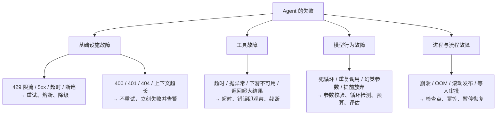
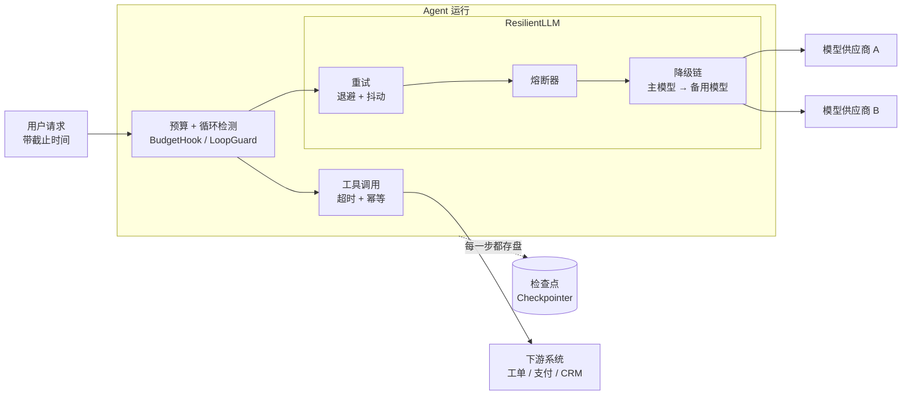
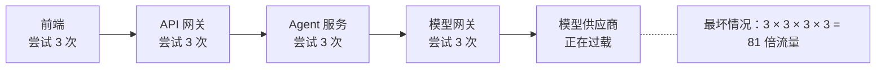
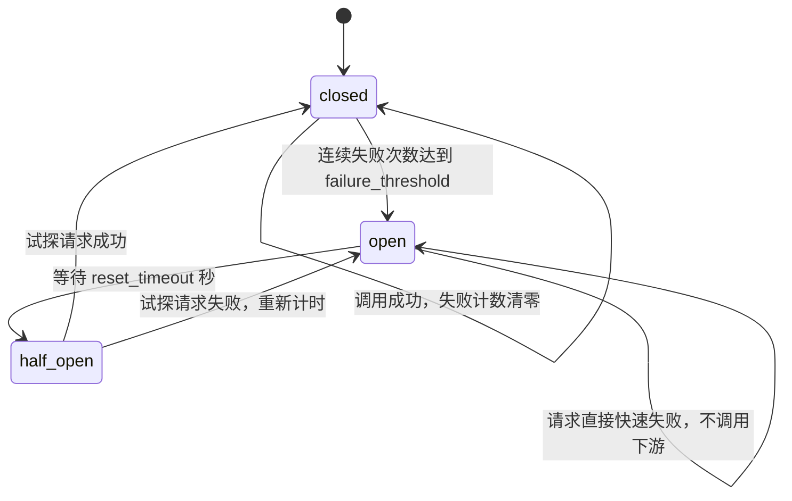
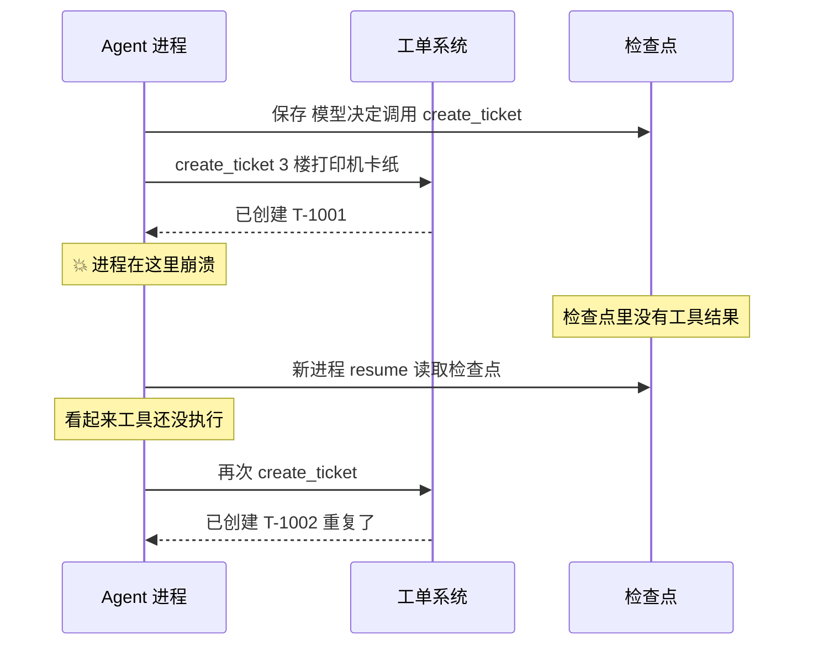
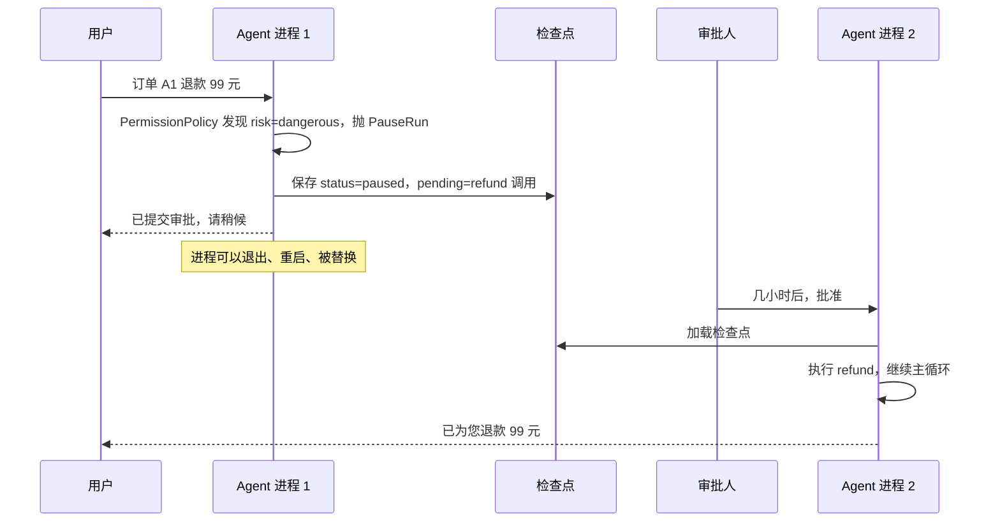

[中文](README.md) | [English](README.en.md)

# 第 05 课：可靠性工程 —— 让 Agent 在失败中存活

> 🕐 建议用时：20 分钟 ｜ 🎯 学完你能：面对限流、宕机、死循环、崩溃、重复副作用、长时间审批这六类企业常见故障，说出 2-4 种方案的取舍并选对方案 ｜ 📦 对应源码：`agentkit/reliability.py`、`agentkit/budget.py`、`agentkit/state.py`、`agentkit/tools.py`（幂等）、`agentkit/agent.py`（恢复）

## 0. 一句话讲清楚

**可靠的系统不是"不出故障"，而是"出了故障也能把事办成，并且不办错"。**

想象一个靠谱的快递员送一天的件：

| 快递员遇到的事 | 他怎么做 | 对应的工程手段 |
|---|---|---|
| 敲门没人应 | 等一会儿再敲，每次等得更久一点 | **重试 + 指数退避** |
| 整栋楼的快递员约好 10 点同时再来 | 各自随便挑个时间来，别挤电梯 | **抖动（jitter）** |
| 一条路连续三次都堵死 | 这段时间别走这条路，过会儿派一个人去探路 | **熔断器（circuit breaker）** |
| 主干道封了 | 绕小路；再不行放驿站；再不行让客户自取 | **降级链（fallback）** |
| 今天工时到了 | 收工，而不是通宵跑 | **预算（budget）** |
| 送到一半车坏了 | 换辆车，从上一个签收点接着送 | **检查点（checkpoint）** |
| 不确定上一单签收了没有 | 先查签收记录，别送两次 | **幂等键（idempotency key）** |
| 贵重物品要本人签字 | 先送别的件，等人回来再说 | **暂停 / 恢复** |

**为什么 Agent 比普通 API 更需要这些？** 一次 Agent 运行要调用模型和工具 20 次，每次成功率 99%，整次运行全部成功的概率只有 $0.99^{20} \approx 81.8\%$ —— **五个用户里就有一个看到报错**。每次调用失败后重试 2 次（假设失败相互独立），整次成功率回到 99.998%。但真实故障里"相互独立"往往不成立：供应商宕机时所有请求**同时**失败，重试只会雪上加霜。所以还需要熔断、降级、预算、检查点……

本课属于课程第二部分：**先给出企业里的真实问题，再对比多种方案，最后看 agentkit 怎么实现。**

## 1. 核心概念

### 1.1 Agent 会怎样失败：四类故障

对错误分类，决定了应对是否正确：把 400 当成可重试，你会白白浪费配额；把 503 当成不可重试，你会放弃本来能成功的请求。



**模型行为故障是 Agent 独有的。** 普通服务的 bug 稳定复现，模型的"坏行为"是概率性的：同一个输入，100 次里可能有 3 次陷入循环。你没法"修好"它，只能**限制它的破坏半径**，并用评估集（第 08 课）监控它的发生率。

### 1.2 可靠性的"洋葱"：每一层兜住上一层漏下的



- **重试**处理偶发、短暂的失败；**熔断**处理持续的失败（这时重试有害）；**降级**让熔断之后还有路可走；
- **预算和循环检测**处理"模型自己停不下来"；
- **检查点和幂等**处理"进程本身死掉了"。

### 1.3 本课的六张问题卡片

| # | 企业问题 | 关键技术 | agentkit | 练习 |
|---|---|---|---|---|
| 1 | 高峰期模型 API 频繁 429 | 退避 + 抖动、重试预算、截止时间 | `retry_call`、`backoff_delay` | (b) `retry_with_budget` |
| 2 | 主模型供应商宕机 | 熔断器、降级链 | `CircuitBreaker`、`ResilientLLM` | (c) 半开单试探 |
| 3 | Agent 死循环烧钱 | 多维预算、循环检测 | `BudgetHook` | (a) `LoopGuard` |
| 4 | 进程崩溃、发布重启 | 检查点、持久化执行 | `FileCheckpointer`、`Agent.resume` | — |
| 5 | 恢复后重复退款 / 重复建单 | 幂等键 | `IdempotencyStore`、`ToolContext.idempotency_key` | — |
| 6 | 审批要等好几个小时 | 暂停落盘、异步恢复 | `PauseRun`、`Agent.approve` | — |

## 2. 企业问题卡片

### 问题 1：高峰期模型 API 频繁返回 429

**场景**：一家 2000 人公司的 IT 助手，工作日 9:00–9:30 高峰每秒启动 30 个 Agent 运行，每个运行平均调用模型 6 次 → 峰值约 180 次/秒。供应商给的限额是每分钟 6000 次（100 次/秒）。高峰期约 45% 的调用返回 `429 Too Many Requests`。

**为什么难**：

- **什么都重试是错的。** 400（参数错、上下文超长）、401（key 失效）重试一万次也是同样结果，还可能触发风控；只有 429、5xx、超时、断连这类**瞬时错误**才值得重试；
- **固定间隔重试会制造"整齐的冲锋"。** 1000 个客户端同时收到 429、都等 1 秒后重试，服务端在同一瞬间又收到 1000 个请求（**惊群效应**，thundering herd）。Demo 场景 1 的模拟：

  ```text
  无抖动（每个客户端都等 1.0s 后重试）：   → 最拥挤的 100ms 里有 1000 个重试请求同时到达
  全抖动（每个客户端在 [0, 1.0s] 内随机等待）：→ 最拥挤的 100ms 里有 120 个重试请求同时到达
  ```

- **重试会放大流量。** Google SRE 书举过例子：数据库过载时，后端、前端、JavaScript 三层各自重试 3 次（每层 4 次尝试），一次用户操作最多在数据库上产生 $4^3=64$ 次请求。Agent 系统同样有前端 → 网关 → Agent 服务 → 模型网关多层；
- **持续超额时，重试只是把失败推迟。** 需求是限额的 1.8 倍，重试再多也塞不进去，只会增加延迟；
- **重试不能超过截止时间。** 用户请求 90 秒超时，单次模型调用超时 30 秒、最多 3 次 → 最坏 90 秒加退避，最后一次注定做到一半被取消，白白消耗配额。



| 方案 | 怎么做 | 优点 | 缺点 | 适用场景 |
|---|---|---|---|---|
| A. 客户端重试 | 只重试瞬时错误；指数退避 + 全抖动；单请求上限 + **全局重试预算** + 截止时间 | 实现简单，对偶发限流非常有效 | 持续超额时无效；多层重试会放大 | 偶发 429、需求低于限额 |
| B. 队列削峰 | 请求先进队列，按供应商限额匀速出队（令牌桶限速），可按优先级调度 | 平滑突发，不浪费配额，不触发 429 | 增加排队延迟；需要队列和分布式限流器 | 批处理、异步任务、能接受等待 |
| C. 多供应商 / 多账号负载均衡 | 模型网关按各自配额把流量分到多个供应商、区域或账号 | 提高总容量，顺便获得容灾能力 | 不同模型行为有差异，需要评估；合同与成本更复杂 | 峰值持续超过单一限额 |
| D. 减少调用 | 缓存相同问题的回答、简单问题分流给小模型、合并调用 | 从源头降低需求和成本 | 需要额外工程，命中率不确定 | 重复问题多、成本敏感 |

**怎么选**：先算账 —— 峰值需求 ÷ 限额。**A 是所有系统的必备底座**（任何规模都会遇到偶发 429）；比值长期大于约 0.8 时，A 已经不够：可延迟的任务上 B，交互式任务上 C；D 永远值得做（见[第 11 课：成本与延迟](../11_cost_latency/README.md)）。多实例部署时，限流器和重试预算要做成全局共享的（见[第 10 课：高并发与分布式](../10_distributed_concurrency/README.md)）。

**本课实现**：方案 A。

1. **错误分类在 LLM 适配层完成**（[agentkit/llm.py](../../agentkit/llm.py)），上层只看 `retryable` 一个布尔值，换厂商时重试逻辑不用改：

   ```python
   except self._openai.APIStatusError as e:
       code = e.status_code
       # 429 限流、408 超时、5xx 服务端错误：重试可能成功；400/401/403/404：重试没用
       raise LLMError(str(e), status_code=code, retryable=code in (408, 409, 429) or code >= 500) from e
   ```

   这个判定与 OpenAI 官方 Python SDK 的默认重试判定一致。注意 `OpenAICompatLLM` 创建客户端时写了 `max_retries=0`：**故意关掉 SDK 自带的重试**，否则 SDK 重试 2 次、你的代码再重试 3 次，一次调用最多变成 9 次请求，而且 SDK 内部的重试你看不见。**重试只在一层做，并且做在看得见的地方。**

2. **全抖动指数退避**（[agentkit/reliability.py](../../agentkit/reliability.py)）：

   ```python
   def backoff_delay(attempt: int, base: float = 0.5, cap: float = 8.0, rng: random.Random | None = None) -> float:
       upper = min(cap, base * (2 ** (attempt - 1)))   # 指数增长：0.5s、1s、2s、4s……封顶 8s
       return (rng or random).uniform(0, upper)         # 全抖动：在 [0, 上限] 内均匀随机
   ```

   AWS 的 Marc Brooker 用模拟比较过"不抖动 / 全抖动 / 等值抖动 / 去相关抖动"：不抖动的方案做的工作最多、耗时也最长；全抖动的总调用量最少，而且实现最简单。`rng`、`sleep`、`clock` 都可注入，所以本课的测试都是确定性的，不会真的睡眠。

3. **练习 (b)** 补上 agentkit 没有的两道闸门：**全局重试预算**（令牌桶：每个新请求存 0.1 个令牌、每次重试花 1 个，思路同 Google SRE 的"重试不超过请求的 10%"和 gRPC 的 `retryThrottling`）和**截止时间**（剩余时间不够再等一次退避，就不再重试）。测试会证明：下游彻底宕机时，100 个请求在"每个请求最多 3 次尝试"下本来要打 300 次，有了预算只打 113 次。

> 生产级升级：优先读取响应里的 `Retry-After` 头（OpenAI 官方 SDK 会读，agentkit 为简洁没有实现）；全局限流和重试预算放到模型网关或 Redis 里共享；给不同层约定"已重试过，别再重试"的错误码。

### 问题 2：主模型供应商宕机了 25 分钟

**场景**：周二 14:00，主模型供应商大面积返回 503，持续 25 分钟。Agent 的模型调用超时 60 秒、重试 3 次，每个用户请求要等 3 分钟才看到报错；Web 服务的 200 个工作线程在两分钟内全部被"等超时"的请求占满，连不需要调用模型的页面也打不开了。

**为什么难**：

- 重试的前提是"失败是暂时的"。持续故障时，每个请求都老老实实地"尝试 3 次、每次等 60 秒"，只会拖垮自己；供应商恢复的那一刻，积压的请求一拥而上，又把它打趴下；
- 切到备用模型听起来简单，但备用模型的能力、上下文长度、工具调用支持、提示词适配都可能不同：你可能只是把"报错"换成了"胡说八道"；
- 哪些错误算"供应商不健康"？一个用户的超长对话触发 400 `context_length_exceeded`，如果也计入熔断，几个这样的请求就能让所有用户都被切到备用模型。

| 方案 | 怎么做 | 优点 | 缺点 | 适用场景 |
|---|---|---|---|---|
| A. 只重试，最后报错 | 重试用尽后返回错误 | 最简单 | 用户久等；线程被耗尽；恢复时惊群 | 内部工具，能接受短时不可用 |
| B. 熔断 + 快速失败 | 连续失败达到阈值就"跳闸"，之后请求毫秒级失败，冷却后放试探请求 | 保护自己、给下游喘息 | 故障期间功能完全不可用 | 没有备选方案的依赖 |
| C. 熔断 + 降级到备用模型 | 跳闸后切到另一家供应商或另一个模型 | 用户基本无感 | 质量差异、提示词兼容、成本；备用模型也要评估 | 面向客户的核心功能 |
| D. 再兜底：缓存 / 规则 / 人工 | 所有模型都不可用时，用 FAQ、历史答案、转人工 | 最后一道体验保障 | 覆盖面有限，需要业务设计 | 客服等有人工渠道的场景 |

C 和 D 串起来就是一条降级链：


**怎么选**：面向客户的核心功能用 **C + D**，内部工具用 **B** 即可。无论选哪个都必须：备用模型跑一遍评估集（第 08 课）；降级事件打点并告警（"悄悄降级"最危险，质量下降一周都没人发现）；熔断器只统计能反映"下游健康"的错误（5xx、超时、429，以及 401、模型不存在这类"整个依赖都不可用"的错误），不统计单个请求自身的问题。

**本课实现**：方案 B + C。熔断器三态：



`CircuitBreaker` 的状态不存储，而是**根据时间算出来**，不需要后台定时器把 open 改成 half_open，少了一类并发 bug（[agentkit/reliability.py](../../agentkit/reliability.py)）：

```python
@property
def state(self) -> str:
    if self.opened_at is None:
        return "closed"
    if self.clock() - self.opened_at >= self.reset_timeout:
        return "half_open"
    return "open"
```

`ResilientLLM` 把"重试 → 熔断 → 降级"叠成一个装饰器，**对外依然是一个普通 LLM**，Agent 完全无感：

```python
from agentkit import Agent, ResilientLLM, default_llm

llm = ResilientLLM(
    default_llm("gpt-5.5"),                 # 主模型
    [default_llm("gpt-5.6-luna")],          # 备用模型（可以有多个，按顺序尝试）
    max_attempts=3, base_delay=0.5,         # 每个模型最多尝试 3 次，全抖动指数退避
    failure_threshold=5, reset_timeout=30,  # 连续 5 次失败就熔断，30 秒后半开试探
)
agent = Agent(llm, tools)
```

设计要点：每个模型有**自己的**熔断器；熔断器包在重试**外面**（一次"用尽了所有重试的调用"才算一次失败）；所有模型都失败时抛 `LLMError`，Agent 把它变成 `status="failed"` 和一句"服务暂时不可用"，而不是 500 —— 方案 D 应该在调用 Agent 的业务层根据这个状态来做。

agentkit 的两处简化，也是生产级实现要补上的：

- `CircuitBreaker` 把**所有**异常都计入失败（Demo 场景 2 正是用"模型不存在"的 400 来触发熔断）。生产级实现（如 Java 的 Resilience4j）都允许配置"哪些异常计入、哪些忽略"；
- half_open 时放行**所有**请求，500 个并发请求会同时涌向刚恢复的下游。练习 (c)（加分题）让你实现"半开时只放行 1 个试探请求"。

> 规模化之后：熔断器是进程内的（每个实例各自判断，简单、无依赖，业界主流），还是放在 Redis 里共享（整体跳闸更快，但引入新依赖）？这类问题见[第 10 课](../10_distributed_concurrency/README.md)。

### 问题 3：Agent 死循环，一晚上烧掉一大笔钱

**场景**：一个报表 Agent 的工具永远返回"生成中（进度 99%），请稍后再次查询"，系统提示又要求"完成前不许放弃"。它对同一个工具、用同样的参数调用了 400 次。每一步都要把越来越长的历史重新发给模型：Demo 场景 4 用真实模型测得每步输入 token 增长约 57 个（409 → 466 → 523 → 580）。照此推算，400 步累计约 470 万输入 token，按 agentkit 默认的示例单价（每百万输入 token $1.25）约 6 美元 —— 如果每天有 1000 个这样的运行呢？

**为什么难**：

- 普通程序花多少钱是确定的；Agent 花多少钱**由模型在运行时决定**。OWASP 把这类风险列为 LLM 应用十大风险之一：LLM10:2025 Unbounded Consumption；
- 成本不是线性的：每一步都比上一步贵，循环 N 步的总成本近似按 $N^2$ 增长；
- 只限步数不够：一步就可能用掉 10 万 token；只限金额又太晚：钱花完了才知道；
- 不能简单地"检测到重复就杀掉"：轮询类任务本来就会合理地重复几次。

| 方案 | 怎么做 | 优点 | 缺点 | 适用场景 |
|---|---|---|---|---|
| A. 步数上限 | `max_steps=15` | 零成本，最后一道保险 | 不管每步多贵；可能误杀正常的长任务 | 所有 Agent 都必须有 |
| B. 多维预算 | token、金额、工具次数、时长分别设上限，超限优雅停止 | 直接控制钱和时间 | 只知道"花完了"，不知道"为什么"；阈值不好定 | 所有 Agent 都必须有 |
| C. 循环检测 | 同工具 + 相同参数在滑动窗口内重复 → 先提醒模型换思路，再中止 | 精准、便宜，还给模型一次改正的机会 | 只能识别"完全相同"的重复，参数稍有变化就漏掉 | 工具调用多的 Agent |
| D. 进度看门狗 | 定期让规则或另一个模型判断"最近 N 步是否有新进展" | 能识别更隐蔽的原地打转 | 额外成本，可能误判 | 小时级长任务 |

**怎么选**：**A + B 是底线**，每个 Agent 都要有；C 成本极低，工具多的 Agent 都应该加；D 留给长时间运行的任务。单次运行的预算之外，还要有用户级、租户级的日 / 月配额，放在网关层做（[第 11 课](../11_cost_latency/README.md)）。

**本课实现**：A 是 `Agent(max_steps=...)`，B 是 `BudgetHook`（[agentkit/budget.py](../../agentkit/budget.py)）：

```python
agent = Agent(llm, tools, max_steps=15,
              hooks=[BudgetHook(max_tokens=50_000, max_cost_usd=0.50, max_tool_calls=20, max_seconds=120)])
```

超限时抛 `StopRun`，主循环把它收敛成 `status="stopped"`、正常保存检查点，用户看到"已超出预算，任务中止"，而不是 500。几个值得注意的细节：

- 金额和 token 在模型返回之后才知道，所以检查放在 `after_llm`，预算可能被"超出一次调用的量"，阈值要留余量；
- 工具次数的检查在 `before_tool`，这时模型已经发出了工具调用。中止时，Agent 会给最后一条 assistant 消息里**还没执行的工具调用**补一条结果"未执行：运行已中止（budget_exceeded）"。这是 OpenAI 消息协议的要求：**每个 `tool_call` 都必须有一条对应的 `tool` 消息**，否则用户接着这段历史继续对话时，下一次模型调用会直接返回 400；
- `max_seconds` 只统计**实际执行**的时间（`state.active_seconds`），暂停等待人工审批的时间不算（见问题 6）。

C 是**练习 (a) `LoopGuard`**。本题最重要的知识点是：**计数必须存在 `state.metadata` 上，而不是 hook 实例上。** 一个 Hook 实例被同一个 Agent 的所有运行共享 —— 在 Web 服务里就是所有用户、所有租户的并发请求。计数放在 `self` 上，A 用户的调用历史会让 B 用户被误判为死循环；而 `state` 是每次运行独有的，还会随检查点落盘，崩溃或审批暂停后恢复，计数也不会丢。

### 问题 4：发布一次，正在跑的任务全部从头再来

**场景**：一个合同审查 Agent 平均运行 8 分钟、调用模型 25 次。服务每天发布 3 次，每次发布时同一时刻约有 20 个任务正在运行，它们被强制中断，于是每天约 60 个任务要从头再跑：重复花钱、用户重复等待，更糟的是，已经执行过的工具调用会再执行一次。

**为什么难**：

- 进程会崩溃、机器会宕机、发布会重启，这些都无法避免；
- 从头重跑不仅浪费，而且**不确定**：模型重新做决定，可能得出和上次不同的结论；
- 保存进度本身也可能失败：写检查点写到一半崩溃，得到一个损坏的文件，连旧进度都没了。

| 方案 | 怎么做 | 优点 | 缺点 | 适用场景 |
|---|---|---|---|---|
| A. 不做检查点，失败重跑 | 任务失败就整个重新提交 | 最简单 | 浪费钱和时间；有副作用的工具会重复执行 | 几秒钟的只读任务 |
| B. 检查点 + 恢复 | 每一步把完整状态原子地写入存储；恢复时从断点继续，只补执行"没有结果的工具调用" | 自己可控，不需要新的基础设施 | 恢复的触发、并发恢复（两个实例抢同一个任务）、检查点清理都要自己做 | 分钟级、有副作用的任务 |
| C. 持久化工作流引擎 | 用 Temporal、LangGraph 等框架记录每一步，自动重放 | 定时器、重试、信号、可视化一应俱全 | 学习曲线；工作流代码有确定性约束；多一个要运维的组件 | 小时到天级、多步骤、多人参与的流程 |

**怎么选**：看任务时长和副作用。几秒钟的只读任务用 A；分钟级、会改外部系统的用 B；跨小时甚至跨天、需要定时唤醒或多方协作的用 C。

**本课实现**：方案 B。主循环在每个状态变化点存盘：初始状态、每次模型回复之后、**每个工具结果之后**（[agentkit/agent.py](../../agentkit/agent.py)）。`Agent.resume(run_id)` 加载检查点后先调用 `_run_pending_tools`：找到最后一条 assistant 消息里还没有结果的工具调用，补执行完再继续主循环，**不会让模型重新做一个已经做过的决定**。

`FileCheckpointer` 用"先写临时文件、再原子替换"保证检查点不会写坏（[agentkit/state.py](../../agentkit/state.py)）：

```python
def save(self, state: RunState) -> None:
    path = self._path(state.run_id)
    tmp = path.with_suffix(".json.tmp")
    tmp.write_text(json.dumps(state.to_dict(), ensure_ascii=False, indent=2), encoding="utf-8")
    os.replace(tmp, path)   # 原子替换：崩溃时文件要么是旧的完整版本，要么是新的完整版本
```

这就是**持久化执行（durable execution）** 的核心思想。和业界方案的对照：

| | agentkit | LangGraph checkpointer | Temporal |
|---|---|---|---|
| 存什么 | 完整的 RunState | 每个 super-step 结束时的图状态 | 事件历史：每个 Activity 的调用和结果 |
| 恢复方式 | 加载快照，补执行没有结果的工具调用 | 从最后一个检查点继续；同一步里已成功节点的写入不重跑 | 重放工作流代码，已完成的 Activity 直接用历史结果 |
| 对代码的要求 | 工具要幂等 | 节点确定性、幂等；副作用放进 task | 工作流代码确定性；Activity 幂等 |

注意最后一行：**所有方案都要求有副作用的操作是幂等的。** 为什么？见下一张卡片。

> 生产级升级：文件换成 Postgres / Redis；用一个后台任务扫描"状态为 running 但心跳过期"的运行来触发恢复，并用租约保证同一时刻只有一个实例在恢复它（[第 10 课](../10_distributed_concurrency/README.md)）；发布时先"排空"再停机（[第 13 课：发布与运维](../13_release_ops/README.md)）。

### 问题 5：恢复之后，客户收到了两笔退款

**场景**：退款 Agent 调用支付接口成功，就在写检查点之前，进程被 OOM kill。新进程从检查点恢复，看到"模型决定调用 refund，但没有结果"，于是又调用了一次。如果每天 5 万笔退款中有 0.01% 恰好落在这个窗口里，就是每天 5 笔重复退款。

**为什么难**：检查点再频繁，"执行工具"和"记录结果"之间总有一个缝隙：



分布式系统里做不到真正的"恰好执行一次"，能做到的是 **"至少执行一次 + 幂等" = 效果上恰好一次**。检查点保证"至少一次"（不丢），幂等保证"多次等于一次"（不重）。

| 方案 | 怎么做 | 优点 | 缺点 | 适用场景 |
|---|---|---|---|---|
| A. 调用方幂等存储 | 用稳定的幂等键（`run_id:call_id`），执行前查、成功后记 | 通用，对下游没有要求 | 副作用完成后、记录写入前崩溃，仍会重复；存储必须持久化 | 框架层默认开启 |
| B. 幂等键传给下游 | 下游在**同一个事务**里"执行操作 + 记录 key"，同一个 key 第二次到来直接返回上次结果 | 真正做到效果上恰好一次 | 需要下游支持 | 支付、发消息、对外 API |
| C. 业务唯一约束 | 用业务键建唯一索引，例如"一个订单只能有一笔退款" | 最强的保证，和技术实现无关 | 不是所有操作都有天然的唯一键；可能误拒合法的第二次操作 | 有明确业务键的写操作 |
| D. 先查后做 | 执行前查询"这件事做过没有" | 不用改下游 | 查和做之间有竞态窗口，并发时不可靠 | 只能作为辅助 |

**怎么选**：A 作为框架默认；涉及钱、对外通知、不可逆操作的，必须再加 B 或 C；D 不能单独依赖。

**本课实现**：方案 A。关键在于幂等键怎么来（[agentkit/tools.py](../../agentkit/tools.py)）：

```python
@property
def idempotency_key(self) -> str:
    """同一个 run 里的同一次工具调用 → 同一个 key。重放时据此去重。"""
    return f"{self.run_id}:{self.call_id}"
```

`tool_call_id` 由模型生成、存在检查点里，恢复后不会变，所以重放时能命中；模型在另一步里再决定建一张工单，是一个新的 `call_id`，不会被误去重。Temporal 官方文档给出的建议如出一辙：用 Workflow Run ID + Activity ID 组合成幂等键。**千万不要在工具内部用 `uuid4()` 现生成幂等键**：每次执行都生成新的，重放时 key 变了，等于没有。

`ToolRegistry.execute` 只对 `write` / `dangerous` 工具启用幂等（读操作天然幂等，缓存它反而会让恢复后读到过期数据）：

```python
agent = Agent(llm, tools, checkpointer=FileCheckpointer("runs"), idempotency_store=IdempotencyStore())
```

Demo 场景 3 会**真的杀掉一个子进程**（`os._exit`，不做任何清理）来复现这个窗口：没有幂等保护时，工单系统里出现两张一模一样的工单；换成持久化的幂等存储后只有一张。注意 agentkit 自带的 `IdempotencyStore` 在内存里，进程一崩就没了，恰恰在最需要它的时候失效，所以 Demo 里用了一个写文件的 `FileIdempotencyStore`。

方案 B 的写法（示意代码，`payments` 代表你的支付服务客户端）：

```python
@tool(risk="write")
def create_refund(order_id: str, amount: float, ctx: ToolContext) -> str:
    """发起退款"""
    return payments.refund(order_id, amount, idempotency_key=ctx.idempotency_key)
```

这正是 Stripe 等支付 API 支持 `Idempotency-Key` 请求头的原因。

> 生产级升级：幂等存储用 Redis（`SET key value NX` 加过期时间）或数据库唯一索引；并发场景下的去重、分布式锁、乐观锁见[第 10 课](../10_distributed_concurrency/README.md)。

### 问题 6：审批要等好几个小时

**场景**：报销 Agent 处理金额超过 5000 元的单据需要主管审批。主管平均 3 小时后才处理，高峰每小时新增 300 单待审批。如果每一单都让一个线程阻塞等待，稳态下同时挂着约 900 个线程；而且这 3 小时里服务只要发布一次，所有等待中的审批就全部丢失。

**为什么难**：等待时间不可预测（5 分钟到第二天）；等待期间服务会重启、会扩缩容；审批通过后，执行的必须**恰好是**当初提交审批的那个操作，参数不能被改。

| 方案 | 怎么做 | 优点 | 缺点 | 适用场景 |
|---|---|---|---|---|
| A. 同步阻塞等待 | 线程里等回调或轮询审批结果 | 实现最简单 | 占用资源；发布或崩溃就丢；无法扩容 | 命令行工具、秒级确认 |
| B. 暂停落盘 + 异步恢复 | 状态保存为 paused，通知审批人，审批后任意实例加载检查点继续 | 等待期间零资源占用，跨进程、跨机器 | 通知、提醒、超时处理要自己做 | 大多数企业场景 |
| C. 工作流引擎的信号 / 中断 | Temporal 的 signal、LangGraph 的 interrupt 等 | 内置定时器（超时自动拒绝）、提醒、可视化 | 需要引入引擎 | 多级审批、复杂流程 |

**怎么选**：秒级、有人坐在屏幕前的确认用 A；其余默认用 B；审批链条复杂（多级、会签、超时升级）时用 C。无论哪种，**审批超时都应按拒绝处理**（fail closed）。

**本课实现**：方案 B。



代码上只需要两步：

```python
agent = Agent(llm, [refund], hooks=[PermissionPolicy()], checkpointer=FileCheckpointer("runs/approvals"))
res = agent.run("订单 A1 退款 99 元")
res.status            # 'paused'
res.pending_approval  # ToolCall(id='call_1', name='refund', arguments='{"order_id": "A1", "amount": 99.0}')

# ……审批系统通知主管。几小时后，可能是另一个进程、另一台机器：
agent2 = Agent(llm, [refund], hooks=[PermissionPolicy()], checkpointer=FileCheckpointer("runs/approvals"))
res2 = agent2.approve(res.run_id, approved=True,   # 执行退款并继续；approved=False 则把"未获批准"告诉模型
                      by="zhang.manager", comment="核对订单无误")   # 谁批的、为什么批，写入审批记录
```

审批按 `tool_call_id` 记录，调用参数随检查点保存，所以批准的就是当初那次调用，模型没有机会在批准后改参数。"审批什么、谁来批、如何避免审批疲劳"是第 06 课的内容。

`by` 和 `comment` 会写进 `state.approval_log`，`AuditLog` 的记录里也会带上 `approved_by`：审计要回答的不只是"批没批"，还有"谁批的"。

> **暂停的时间算不算预算？** 不算。设想一个运行因审批暂停了 2 小时，如果时长预算按"从开始运行到现在"计算，批准后恢复：被批准的退款先执行，紧接着下一次模型调用前时长预算就会触发 `budget_exceeded` —— **钱退了，用户却只收到"已超过时长预算"**。所以 agentkit 的 `BudgetHook` 用 `state.active_seconds` 只累计每一段 `run` / `resume` 实际执行的时间。设计预算时要想清楚每个维度统计的是什么：金额和 token 跨暂停累计，墙钟时长只算活跃时间，而"审批最多等多久"是另一个独立的超时（到期按拒绝处理）。

## 3. 动手：运行 Demo

```bash
python lessons/05_reliability/demo.py --offline   # 离线剧本，无需 API key，结果确定
python lessons/05_reliability/demo.py             # 真实模型（约 30 秒，十几次模型调用）
```

真实模式下，场景 1 在真实模型外面套了一层故障注入（`FlakyLLM`：前两次调用抛 429）；场景 2 用一个故意不存在的模型名模拟主模型不可用，备用模型读取 `.env` 里的 `LLM_FALLBACK_MODEL`。以下是真实模型的输出节选：

**场景 1：重试（对应问题 1）**

```text
▶ Agent → ResilientLLM → FlakyLLM（前两次抛 429）→ 模型
   📝 retry gpt-5.5 #1 after 0.37s: Error code: 429 - Rate limit reached, please retry later
   📝 retry gpt-5.5 #2 after 0.47s: Error code: 429 - Rate limit reached, please retry later
   ✅ 状态=completed，底层共调用 3 次，总耗时 3.6s
▶ 对照：如果错误是 400（参数错误），重试有用吗？
   底层调用次数：1（没有重试），状态=failed，给用户的回复：抱歉，服务暂时不可用，请稍后再试。
```

👀 观察：Agent 对两次 429 毫无感知；400 一次都没有重试。后面还有 1000 个客户端的抖动模拟直方图。

**场景 2：熔断 + 降级（对应问题 2）**

```text
▶ 请求 1：用一句话解释：什么是熔断器？
   熔断器：closed → closed    实际回答的模型：gpt-5.6-luna    耗时 3.9s
▶ 请求 2：用一句话解释：什么是降级？
   熔断器：closed → open    实际回答的模型：gpt-5.6-luna    耗时 1.6s
▶ 请求 3：用一句话解释：什么是重试预算？
   熔断器：open → open    实际回答的模型：gpt-5.6-luna    耗时 2.4s
   📝 fallback from gpt-5.5-does-not-exist: 熔断器 [gpt-5.5-does-not-exist] 处于打开状态，快速失败
▶ ⏩ 31 秒过去了，主模型已经修好。熔断器进入 half_open，放一个试探请求过去……
▶ 请求 4：用一句话解释：什么是幂等？
   熔断器：half_open → closed    实际回答的模型：gpt-5.5    耗时 2.1s
```

👀 观察：请求 3 根本没有调用主模型；请求 4 的试探成功后流量回到主模型。熔断器用的是注入的假时钟，所以不用真等 30 秒。

**场景 3：崩溃恢复（对应问题 4、5）**

```text
▶ 【没有幂等保护】启动子进程运行 Agent
      [子进程] 工具已执行：工单已创建：T-1001（3 楼打印机卡纸，优先级 high）
      [子进程] 💥 就在此刻进程被 kill -9 —— 工具结果还没来得及写进检查点
   子进程退出码：137（被杀死）
▶ 新进程接手：用同一个 run_id 从检查点恢复（agent.resume）
   ❌ 外部工单系统里现在一共有 2 张工单：T-1001, T-1002
▶ 【有幂等保护（持久化的 IdempotencyStore）】启动子进程运行 Agent
   ...
   ✅ 外部工单系统里现在一共有 1 张工单：T-1001
```

👀 观察：打开 `runs/05_reliability/crash_plain/checkpoints/ticket-demo.json`，看崩溃时检查点里最后一条消息；再看 `crash_idempotent/idempotency.json` 里的 key 长什么样。

**场景 4：预算（对应问题 3）**

```text
   状态=stopped  stop_reason=budget_exceeded  模型调用 4 次  工具执行 3 次
▶ 链路追踪（第 07 课详讲）—— 一眼看出它在原地打转：
   agent.run  8411ms  tokens=1978→88  status=stopped steps=4 cost=$0.00335
   ├─ llm.chat  1622ms  tokens=409→22  → tool_calls: check_report_status
   ├─ tool.check_report_status  3ms  ok
   ...
   每一步的输入 token：409 → 466 → 523 → 580
```

👀 观察：每一步的输入 token 都在增长。把 `BudgetHook` 去掉，它会一直跑到 `max_steps=30`。

## 4. 练习

打开 [exercise.py](exercise.py)，完成三道题：

**(a) `LoopGuard`：检测 Agent 死循环（问题 3）**

- 任务：实现 `normalize_arguments`（参数 JSON 归一化）和 `LoopGuard.before_tool`：同一工具 + 相同参数在最近 `window` 次调用中出现 `>= max_repeats` 次时，第一次返回拒绝理由提醒模型换思路，之后再超限抛 `StopRun("loop_detected")`。
- 提示：计数存在 `state.metadata` 上；被拒绝的那次调用也要计入窗口；`'{"a":1,"b":2}'` 和 `'{"b": 2, "a": 1}'` 是同一个调用。

**(b) `retry_with_budget`：带全局预算和截止时间的重试（问题 1）**

- 任务：实现 `RetryBudget.on_request` / `try_acquire` 和 `retry_with_budget`（单请求上限 + 全局预算 + 截止时间三道闸门）。
- 提示：docstring 里列出了判断顺序。注定因截止时间而放弃的重试**不应消耗令牌**；放弃时抛出**原始异常**，调用方原有的错误处理（比如降级）不受影响。

**(c) 加分题 `SingleProbeCircuitBreaker`：半开时只放行 1 个试探请求（问题 2）**

- 提示：调用 `fn()` 时不要持有锁；无论试探成功失败，都在 `finally` 里复位 `_probing`。没做时它的测试会自动跳过。

验证：

```bash
make lesson N=05                                                           # 跑你的实现
AGENTKIT_SOLUTION=1 .venv/bin/python -m pytest lessons/05_reliability -v   # 对照参考答案
```

测试全部离线，注入了假时钟、假 sleep 和固定随机种子，结果确定，不到 1 秒跑完。

## 5. 深入（给有余力的你）

- **对冲请求（hedged request）**：请求在 p95 延迟内还没返回，就向另一个副本再发一份，谁先回来用谁。Jeff Dean 和 Luiz André Barroso 在 *The Tail at Scale*（2013）中讨论过这一技术，gRPC 也支持。对 LLM 来说代价很高（两份 token 费），而且**只能用于没有副作用的请求**。
- **客户端自适应限流**：Google SRE 书 Handling Overload 一章描述了一种做法：客户端统计最近两分钟的请求数和被后端接受的请求数，请求数达到接受数的 K 倍（通常 K=2）后，开始在本地按概率拒绝新请求。在 LLM 场景下，可以用它在供应商限流时把一部分流量提前导向备用模型。
- **LLM 特有的"软失败"**：HTTP 200 不代表成功。`finish_reason == "length"`（输出被截断）、JSON 不符合 schema、空回复、工具参数校验失败，都要"带着错误信息重发"，而不是原样重试（第 02 课的错误即观察、第 04 课的 `complete_json`）。
- **流式输出中途断开**：用户已经看到半段回答时，不能简单地重试整个请求。常见做法是分开设置"首 token 超时"（这时重试是安全的）和"总时长超时"，中断后在 UI 上标记并提供"重新生成"。
- **故障注入**：没有演练过的恢复流程等于没有恢复流程。Demo 里的 `FlakyLLM` 和 `CrashAfterTool` 就是最小的故障注入；生产中要在预发环境定期注入 429、超时、进程崩溃，并盯住重试率、熔断次数、降级比例、`budget_exceeded` 比例这些指标（第 07 课）。
- **持久化执行框架**：当流程复杂到需要定时唤醒、多 Agent 协作、跨天等待时，可以考虑 Temporal、LangGraph，或 DBOS、Restate、Inngest 等框架。它们的核心思想和本课一样：**记录每一步、重放而不是重做、副作用必须幂等**。

## 6. 常见坑与反模式

| 反模式 | 后果 | 正确做法 |
|---|---|---|
| 所有异常都重试 | 400/401 重试浪费配额，还可能触发风控 | 按 `retryable` 分类，只重试瞬时错误 |
| 固定间隔重试、没有抖动 | 惊群效应 | 指数退避 + 全抖动 |
| SDK 重试 + 自己重试 + 网关重试 | 重试次数相乘，故障时流量翻几十倍 | 只在一层重试（`max_retries=0`） |
| 只有单请求重试上限 | 下游宕机时流量直接翻 3 倍 | 加全局重试预算 |
| 内层超时 × 重试次数 > 外层超时 | 最后几次重试注定被取消 | 截止时间传播，按剩余时间决定是否重试 |
| 单个请求的 400 也计入熔断 | 个别用户的问题让所有人被降级 | 只统计反映下游健康的错误 |
| 悄悄降级 | 质量下降一周没人发现 | 降级事件打点、告警；备用模型跑评估集 |
| 只设 `max_steps` | 一步 10 万 token 照样烧钱 | 多维预算 |
| 在 hook 实例上存"本次运行"的状态 | 不同用户的数据串在一起；恢复后状态丢失 | 存在 `state.metadata` 上（JSON 可序列化） |
| 直接覆盖写检查点文件 | 写到一半崩溃，连旧进度都丢了 | 先写临时文件，再原子替换 |
| 幂等键在工具内部用 `uuid4()` 生成 | 重放时 key 变了，幂等形同虚设 | 用稳定的 `run_id:call_id` |
| 幂等存储放在内存里 | 进程崩溃时它也一起丢了 | Redis / 数据库，并把 key 传给下游 |
| 有检查点，但从没测过恢复 | 真出事才发现恢复路径有 bug | 在测试里模拟崩溃并恢复（Demo 场景 3） |
| 时长预算把"等审批"的时间也算进去 | 批准的操作执行了，用户却收到"超时中止" | 只统计活跃运行时间（`state.active_seconds`） |
| 中止运行时留下没有结果的 `tool_call` | 下一轮带着这段历史调用模型直接 400 | 给每个未执行的调用补一条"未执行"结果 |

## 7. 面试 & 设计评审问题

<details>
<summary><b>Q1：为什么重试要加抖动？"全抖动"是什么？</b></summary>

- 没有抖动时，同时失败的大量客户端会在同一时刻重试，形成周期性的流量尖峰（惊群效应）；
- 全抖动：等待时间在 `[0, min(cap, base × 2^n)]` 内均匀随机；
- 加分：封顶 cap、优先遵守 `Retry-After`、测试时注入随机数生成器。
</details>

<details>
<summary><b>Q2：请求链路是 前端 → 网关 → Agent 服务 → 模型网关 → 模型，每层都重试 3 次，会怎样？怎么改？</b></summary>

- 重试次数相乘：四层各 3 次尝试，最坏 81 倍流量打到已经过载的模型上；
- 只在一层重试（通常是最懂错误语义的 LLM 适配层），其他层关闭；下层用明确的错误告诉上层"别再重试"；
- 再加全局重试预算和截止时间传播。
</details>

<details>
<summary><b>Q3：模型 API 限额是每秒 100 次，而高峰需求是每秒 180 次，你怎么设计？</b></summary>

- 先认识到：需求持续超过限额时，客户端重试只会推迟失败；
- 交互式请求：多供应商 / 多账号负载均衡扩容量；异步请求：进队列匀速消费；
- 同时从源头减少调用：缓存、小模型分流、合并调用；
- 客户端重试 + 重试预算作为底座，限流器和预算全局共享。
</details>

<details>
<summary><b>Q4：熔断器有哪三种状态？哪些错误应该计入熔断？半开时要注意什么？</b></summary>

- closed → open → half_open，试探成功回到 closed，失败回到 open 并重新计时；
- 计入：5xx、超时、429、依赖级别的错误（key 失效、模型不存在）；不计入：单个请求自身的问题（如上下文超长）；
- 半开时只放行 1 个或少量试探请求。
</details>

<details>
<summary><b>Q5：Agent 运行到一半进程崩溃了，如何保证既不丢进度、也不重复扣款？</b></summary>

- 每一步原子地写入持久化检查点；恢复时只补执行没有结果的工具调用，不让模型重新做决定；
- 写操作使用稳定的幂等键（`run_id + tool_call_id`），幂等存储要持久化；
- 涉及钱的操作把幂等键传给下游，由下游在同一事务里去重，或用业务唯一约束；
- "至少一次执行 + 幂等" = 效果上恰好一次。
</details>

<details>
<summary><b>Q6：审批可能要等几个小时，架构上怎么支持？</b></summary>

- 不能阻塞线程：暂停、状态落盘、异步通知、审批后任意实例恢复；
- 审批与具体调用和参数绑定；审批超时按拒绝处理；
- 预算计时要扣除等待时间；复杂流程可以用工作流引擎的信号机制。
</details>

<details>
<summary><b>Q7：怎样防止 Agent 死循环烧钱？</b></summary>

- 步数 + 多维预算（token、金额、工具次数、时长），超限用 StopRun 优雅结束；
- 循环检测：同工具同参数重复，先提醒再中止；状态存在每次运行的 state 上；
- 租户 / 用户级配额、成本告警，评估集里加入容易陷入循环的用例。
</details>

## 8. 自测清单

- [ ] 我能把 Agent 的失败分成四类，并为每一类说出对策
- [ ] 我能说出哪些错误应该重试、哪些不应该，以及为什么要关掉 SDK 自带的重试
- [ ] 我能解释惊群效应、重试放大，以及重试预算和截止时间如何应对
- [ ] 面对"需求持续超过限额"，我能说出重试之外的三种方案
- [ ] 我能画出熔断器三态图，并说出降级的三个隐藏代价
- [ ] 我能说出预算的多个维度，以及循环检测的状态为什么要存在 `state.metadata` 上
- [ ] 我能画出"工具执行了但没记录"的崩溃窗口，并对比幂等存储、下游幂等键、业务唯一约束
- [ ] 我能说出长时间审批的三种实现方式及其取舍
- [ ] 我完成了练习 (a)(b)，并且 `make lesson N=05` 全部通过

## 延伸阅读

- Marc Brooker，[Exponential Backoff And Jitter](https://aws.amazon.com/blogs/architecture/exponential-backoff-and-jitter/)，AWS Architecture Blog（2015）
- Amazon Builders' Library，[Timeouts, retries, and backoff with jitter](https://aws.amazon.com/builders-library/timeouts-retries-and-backoff-with-jitter/)
- Malcolm Featonby，[Making retries safe with idempotent APIs](https://aws.amazon.com/builders-library/making-retries-safe-with-idempotent-APIs/)，Amazon Builders' Library
- Google SRE Book，[Handling Overload](https://sre.google/sre-book/handling-overload/)（重试预算、客户端自适应限流）与 [Addressing Cascading Failures](https://sre.google/sre-book/addressing-cascading-failures/)（重试放大、截止时间传播）
- [gRPC 提案 A6：Client Retries](https://github.com/grpc/proposal/blob/master/A6-client-retries.md) —— `retryThrottling` 令牌桶的定义
- [Envoy 熔断器配置（含 retry_budget）](https://www.envoyproxy.io/docs/envoy/latest/api-v3/config/cluster/v3/circuit_breaker.proto)
- Martin Fowler，[CircuitBreaker](https://martinfowler.com/bliki/CircuitBreaker.html)
- Brandur Leach，[Designing robust and predictable APIs with idempotency](https://stripe.com/blog/idempotency)，Stripe Blog（2017）
- Temporal 文档，[Activity Definition](https://docs.temporal.io/activity-definition) —— Activity 至少执行一次，以及如何构造幂等键
- LangGraph 文档，[Durable execution](https://docs.langchain.com/oss/python/langgraph/durable-execution) 与 [Persistence](https://docs.langchain.com/oss/python/langgraph/persistence)
- OWASP，[Top 10 for LLM Applications 2025](https://genai.owasp.org/llm-top-10/) —— LLM10 Unbounded Consumption 与预算直接相关
