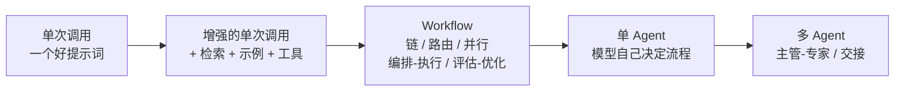
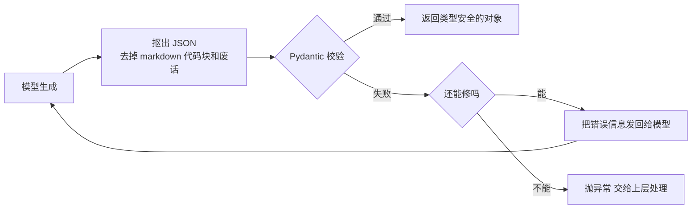
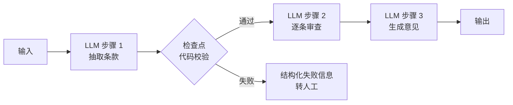
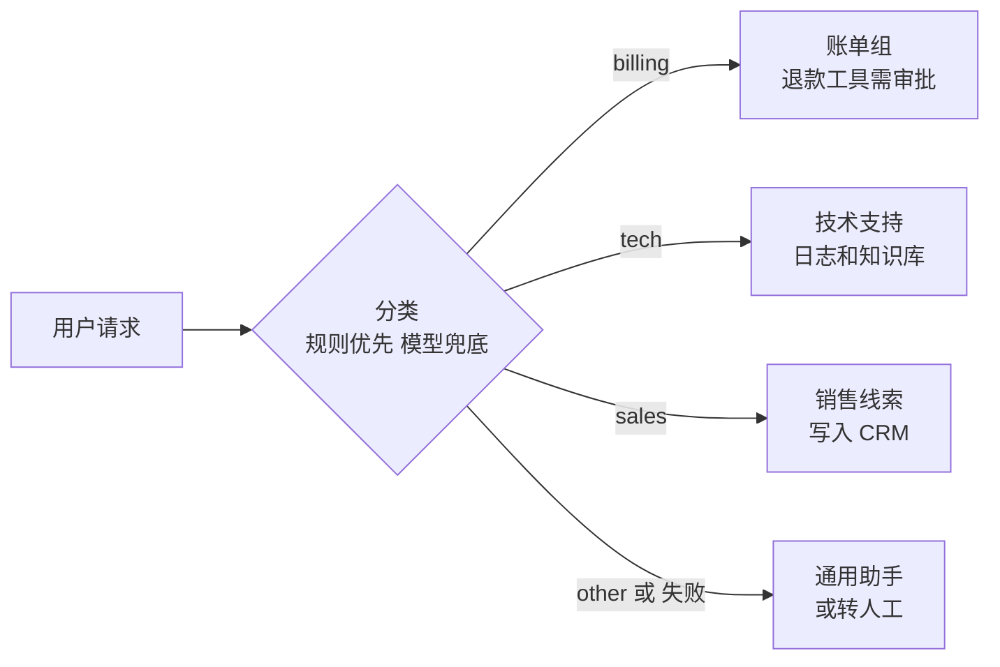
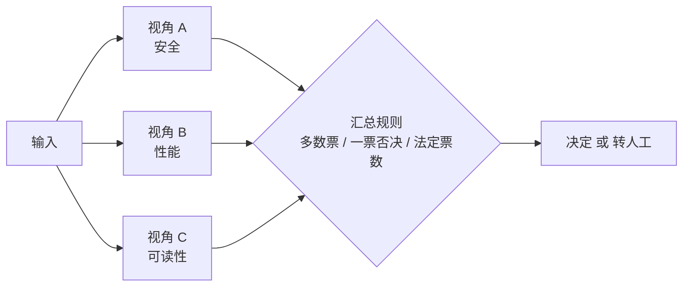
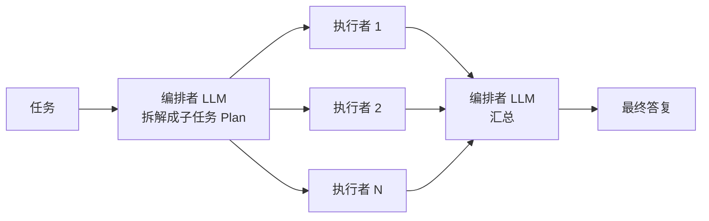
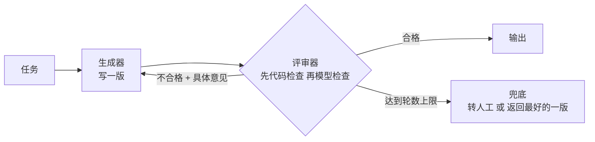
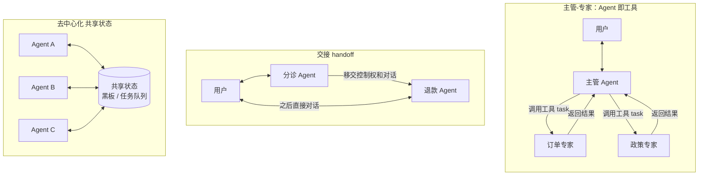
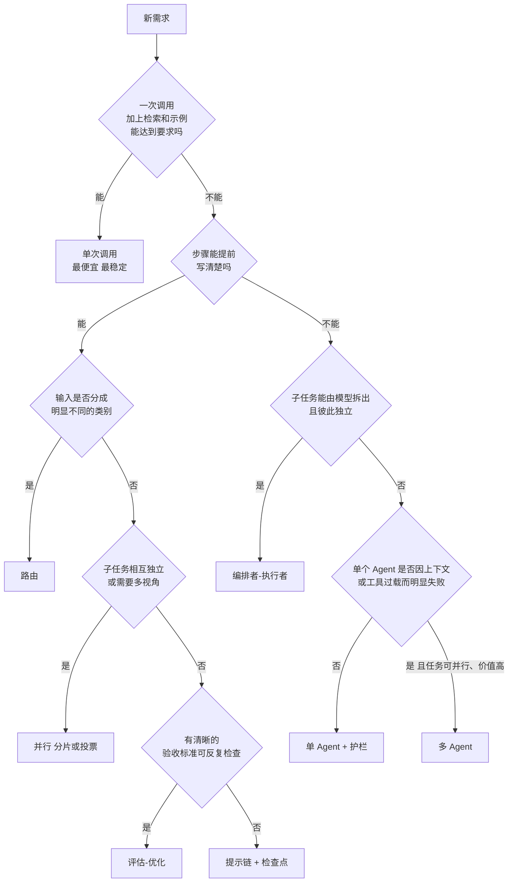

[中文](README.md) | [English](README.en.md)

# 第 06 课：编排模式 —— Workflow、Agent 与多 Agent

> 🕐 建议用时：15 分钟 ｜ 🎯 学完你能：面对一个业务需求，选出"能解决问题的最简单"编排方案，并说清它在成本、延迟、可靠性上的代价；知道多 Agent 什么时候值得、什么时候是坑 ｜ 📦 对应源码：`agentkit/workflows.py`
>
> 📖 必读：[Building effective agents](https://www.anthropic.com/engineering/building-effective-agents)

> 📍 本课属于**第一部分：基础构建**（概念 → 从零实现 → 练习）。上一课 [第 05 课 常见 Agent 架构](../05_agent_architectures/README.md) 讲的是 Agent 内部的推理架构和多 Agent 拓扑，本课讲 Workflow 编排模式，两课互补（分工见第 05 课 §1.3）；下一课 [第 07 课 工程考量全景](../07_engineering_perspectives/README.md) 是第一部分的收尾。
>
> 🧭 **核心路径（15 分钟必读）**：§0 → §1.1~§1.3 → §2.1~§2.5 五种模式（每节先看图和"适合 / 代价"两条）→ §2.7 多 Agent 的"代价"与"什么时候值得" → §2.8 决策树 → §3 跑 Demo → §4 做练习。
> 标 **📖 选读** 的小节（深入、常见坑、面试题）是给有余力者的深入内容，第一遍可以跳过。多 Agent 的分布式执行与高并发问题在第 13 课 [高并发与分布式执行](../13_distributed_concurrency/README.md) 展开。

## 0. 一句话讲清楚

**先问"流程该由谁来决定"，再决定用什么模式。**

想象公司要办一件事，有三种组织方式：

| 组织方式 | 类比 | 对应 |
|---|---|---|
| 一名员工照着标准作业流程（SOP）一步步做 | 流程写死，每一步做什么都清楚 | **Workflow（工作流）**：流程由**代码**决定 |
| 请一位项目经理，给他目标和工具，让他自己看着办 | 灵活，但你不知道他会走几步、花多少钱 | **Agent（智能体）**：流程由**模型**决定 |
| 组建一个团队：经理 + 几个专家 | 能处理更大的事，但沟通成本、协调成本、扯皮成本都来了 | **多 Agent** |

越往下越灵活，也越贵、越慢、越难预测、出了问题越难追责。好的管理者不会为了"复印一份文件"去成立项目组。

这正是 Anthropic 在《Building Effective Agents》里反复强调的：先 "find the simplest solution possible"，只在复杂度能明显换来效果时才增加它。很多所谓的"Agent 需求"，其实一次调用 + 检索就能解决；很多"多 Agent 需求"，其实一个工作流就能解决。

本课的 Demo 用真实模型把 5 种模式各跑了一遍，量出了它们的"价格"：

| 模式 | 耗时 | 模型调用 | tokens | 流程由谁决定 |
|---|---|---|---|---|
| route 路由（3 张工单） | 7.4s | 3 | 1,566 | 代码（模型只做分类） |
| parallel 并行投票 | 3.2s | 3 | 1,722 | 代码 |
| orchestrator_workers | 19.1s | 5 | 2,859 | 模型拆解 + 代码执行 |
| evaluator_optimizer | 8.5s | 3 | 1,417 | 代码循环 + 模型生成 / 评审 |
| agent_as_tool 多 Agent | 26.6s | 7 | 5,082 | 模型（主管决定委派谁） |

## 1. 核心概念

### 1.1 Workflow 与 Agent

- **Workflow**：LLM 和工具通过**预先写好的代码路径**编排起来。LLM 只负责其中的某些步骤（分类、生成、抽取），"下一步做什么"由你的 `if / for` 决定。
- **Agent**：LLM **在运行时自己决定**下一步做什么、调哪个工具、什么时候结束（第 02 课的主循环）。

| | Workflow | Agent |
|---|---|---|
| 谁决定流程 | 代码 | 模型 |
| 调用次数 | 固定或有上界 | 不确定（要靠 max_steps / 预算兜底） |
| 可预测性 | 高：同样输入走同样路径 | 低：今天 3 步，明天 7 步 |
| 测试 | 每一步都能单独写单元测试 | 只能靠评估集做统计意义上的测试（第 11 课） |
| 出错时 | 能精确定位到哪一步 | 要翻链路追踪才知道它"想了什么"（第 10 课） |
| 适合 | 步骤可以提前写清楚的任务 | 步骤数和路径无法提前预知的开放任务 |

**这不是二选一，而是一条光谱。** 企业里最常见的形态是"Workflow 为骨架，在少数需要灵活性的节点上嵌入 Agent"：比如一个固定的工单处理流程里，只有"排查故障"这一步交给一个带工具的 Agent。

### 1.2 复杂度阶梯：只有上一级不够用时，才往上爬



每往右一级：**调用次数↑、延迟↑、成本↑、不确定性↑、调试难度↑**。所以要问的问题永远是："上一级为什么不够用？有数据证明吗？"

- Anthropic 的经验：对很多应用来说，把单次调用配上检索和示例做到位，通常就够了。
- OpenAI 的《A practical guide to building agents》也建议先把单个 Agent 的能力用足，再考虑拆成多个 Agent。

### 1.3 结构化输出：编排的"接口契约"

编排就是把多个步骤连起来，**每条连线都是一个接口**。如果上一步输出的是一段自由文本，下一步的代码就只能猜：

```python
label = llm("把这条工单分类：...")   # 模型回答："这个问题应该属于账单类（billing）。"
HANDLERS[label]                       # KeyError！
```

所以编排里几乎每一步都要求模型输出**可被代码校验的数据结构**。agentkit 的 `complete_json`（[agentkit/workflows.py](../../agentkit/workflows.py)）是所有编排模式的地基：

```python
def complete_json(llm, prompt, model_cls, system=None, max_repairs=2):
    schema = json.dumps(model_cls.model_json_schema(), ensure_ascii=False)
    messages = [...]  # 提示词末尾附上 JSON Schema，要求"只输出 JSON"
    for _ in range(max_repairs + 1):
        text = llm.chat(messages).content or ""
        try:
            return model_cls.model_validate_json(extract_json(text))   # ① 抠出 JSON ② Pydantic 校验
        except (ValidationError, ValueError) as e:
            messages.append({"role": "assistant", "content": text})
            messages.append({"role": "user", "content": f"你的输出没有通过校验：\n{e}\n请只输出修正后的 JSON。"})
    raise ValueError(...)                                               # ③ 修不好就大声失败
```



设计要点：

- **把校验错误原样发回去**：Pydantic 的报错（"route: Input should be 'billing', 'tech'..."）本身就是最好的修改指令；
- **修复有上限**：最坏情况是 `max_repairs + 1` 次调用，成本可预期；
- **用类型收窄输出空间**：`route()` 用 `Literal[...]` 把类别写进 Schema，返回值**保证**是合法的 key；`Plan`、`Review` 同理；
- 模型或网关支持**原生结构化输出**（按 JSON Schema 约束解码）时优先用原生能力，这个修复循环作为兜底。

## 2. 从玩具到生产：逐个模式

下面每个模式都回答五个问题：**是什么、长什么样、适合什么、代价是什么、企业里怎么用**。

### 2.1 提示链（Prompt Chaining）+ 检查点

把任务拆成固定的几步，上一步的输出是下一步的输入，步骤之间可以插入**检查点（gate）**。



```python
def chain(steps, text, gate=None):
    for i, step in enumerate(steps):
        text = step(text)
        if gate is not None and not gate(i, text):
            raise ValueError(f"第 {i + 1} 步的输出没有通过检查：{text[:200]}")
    return text
```

- **适合**：能干净地拆成固定子任务的场景，用延迟换准确率——每一步都更简单，模型更不容易错。Anthropic 举的例子：先写营销文案再翻译；先写大纲、检查大纲、再写全文。
- **代价**：N 次调用，延迟是各步之和。
- **为什么要检查点**：错误会逐级传递。假设每一步有 95% 的概率做对，5 步串起来全对的概率只有 0.95⁵ ≈ 77%。在中间用**代码**检查（长度、格式、必含字段、是否引用了原文），能在错误扩散之前拦住它。
- **企业里的改进（练习 3）**：`chain` 检查失败时直接抛异常——在线服务里这意味着一个 500 和一段丢失的上下文。`run_with_gates` 改为返回结构化失败信息：哪一步、什么原因、已完成哪些步骤、最后一个可信的中间结果是什么，方便转人工或断点重跑。

### 2.2 路由（Routing）

先分类，再交给专门的处理器。每个处理器有自己的提示词、工具和权限。



```python
def route(llm, text, routes: dict[str, str]) -> str:
    names = tuple(routes)
    Choice = create_model("RouteChoice", route=(Literal[names], ...), reason=(str, ""))
    options = "\n".join(f"- {k}: {v}" for k, v in routes.items())
    result = complete_json(llm, f"请把下面的请求分到最合适的类别。\n\n可选类别：\n{options}\n\n请求：{text}", Choice)
    return result.route
```

- **适合**：输入有明显不同的类别、且分开处理效果更好的场景。经典例子是客服分流；另一个高价值用法是**按难度分流到不同模型**——简单常见的问题交给小而便宜的模型，难题交给更强的模型（Anthropic 在文章里专门提到了这种用法）。
- **代价**：多一次分类调用（Demo 里 3 张工单共 7.4s）。
- **最大风险是分错类**：分错了，后面做得再好也白搭。企业做法：
  1. **规则优先**：能用关键词确定的（"退款""发票"）直接分，零成本、零延迟、可解释；规则拿不准的长尾才问模型——这就是练习 1 的 `hybrid_route`；
  2. **一定要有 other / 兜底类别**，模型报错或输出未知类别时降级，而不是崩溃；
  3. **把路由当成分类器来评估**：准备标注集，看混淆矩阵（哪两类最容易混），而不是看几个例子觉得"挺准的"（第 11 课）。

### 2.3 并行（Parallelization）：分片与投票

两种用法：

- **分片（sectioning）**：把任务拆成**独立**的子任务同时做。例如一路生成回答、另一路同时做内容安全检查；或从安全、性能、可读性三个视角同时评审代码。
- **投票（voting）**：同一个任务跑多次，取共识。学术上的代表是 Self-Consistency（Wang 等，ICLR 2023）：对同一问题采样多条推理路径，取出现最多的答案。



```python
def parallel(fns, max_workers=4):
    with ThreadPoolExecutor(max_workers=max_workers) as pool:
        return list(pool.map(lambda f: f(), fns))
```

- **代价**：调用次数 × N，但**延迟取决于最慢的那一路，而不是总和**。Demo 实测：三个评审串行需要 8.1s，并行只要 3.2s。
- **汇总规则本身是业务决策**。Demo 里评审一段有 SQL 注入的代码：离线剧本中安全视角 REJECT、另外两个视角 APPROVE，**少数服从多数就把漏洞放行了**。安全、合规类检查应该**一票否决**；Anthropic 也提到内容审核可以用不同的投票阈值来平衡误报和漏报。
- **没有共识时，承认没把握**：练习 2 的 `vote_with_quorum` 只有在多数票占比达到法定比例（quorum）时才返回答案，否则返回 None——在企业里，None 意味着转人工。
- **生产中的坑**：
  - **并发放大限流**：一个请求扇出成 5 个并行调用，高峰期更容易触发 429，要配合第 08 课的限流和重试；
  - **一路失败怎么办**：agentkit 的 `parallel` 用 `pool.map`，任意一路抛异常整个调用就失败。生产中通常要允许部分失败（失败的一路按弃权处理）；
  - **错误是相关的**：同一个模型、同样的提示词跑 5 次，犯的往往是同一个错。投票能降低随机错误，降不了系统性偏差——想要真正的"多视角"，要换提示词、换模型或换信息源。

### 2.4 编排者-执行者（Orchestrator-Workers）

和并行的关键区别：**子任务不是写死在代码里的，而是模型看了具体输入后决定的**。



```python
def orchestrator_workers(llm, task, worker, max_subtasks=5):
    plan = complete_json(llm, f"把下面的任务拆解成最多 {max_subtasks} 个可以并行完成的独立子任务。\n\n任务：{task}", Plan)
    subtasks = plan.subtasks[:max_subtasks]                      # 用代码再截一次：不信任模型会守规矩
    results = parallel([lambda s=s: worker(s) for s in subtasks])
    parts = "\n\n".join(f"### 子任务 {i + 1}：{s}\n{r}" for i, (s, r) in enumerate(zip(subtasks, results)))
    return complete(llm, f"原始任务：{task}\n\n以下是各子任务的结果，请整合成一份完整、连贯、不重复的最终答复：\n\n{parts}")
```

- **适合**：无法提前知道需要哪些子任务的复杂任务。Anthropic 的例子：需要改动多个文件的编程任务；需要从多个来源收集和分析信息的搜索任务。
- **代价**：1（拆解）+ N（执行）+ 1（汇总）次调用；延迟 ≈ 拆解 + 最慢的执行者 + 汇总。
- **两个必须设的上限**：
  1. **子任务数**：`max_subtasks` 限制 N，并且在代码里再截一次（`[:max_subtasks]`）；
  2. **汇总长度**：这是我们跑 Demo 时踩到的真坑。第一次运行时任务里没写长度要求，汇总步骤写出了 255 行以上的"完整检查手册"，**这一个模式就耗时 64.3s、5,586 tokens**；在任务里加上"最终不超过 8 条，每条一句话"后，降到 **19.1s、2,859 tokens**。多步编排里，任何一步没有输出约束，都可能成为延迟和成本的黑洞。
- **计划质量是瓶颈**：拆错了（子任务重叠、遗漏、互相依赖却被并行执行），执行得再好也没用。高风险场景可以让人审核计划后再执行。

### 2.5 评估-优化（Evaluator-Optimizer）

一个负责生成，一个负责评审，按评审意见修改，循环直到合格或达到轮数上限。



```python
def evaluator_optimizer(generate, evaluate, task, max_rounds=3):
    feedback, reviews, candidate = None, [], ""
    for _ in range(max_rounds):
        candidate = generate(task, feedback)
        review = evaluate(candidate)
        reviews.append(review)
        if review.passed:
            break
        feedback = review.feedback
    return candidate, reviews
```

- **适合**：有**清晰的评价标准**、且迭代能带来可衡量提升的任务。Anthropic 的例子：需要捕捉细微差别的文学翻译；需要多轮搜索和分析的复杂检索。
- **代价**：最多 2 × max_rounds 次调用。
- **最好的评审器是代码**。Demo 里写 slogan 的验收标准有两条：≤15 字、体现"续航长"卖点。字数用代码数（确定、免费、不会被说服），只有字数合格后才花钱让模型判断卖点：

  ```text
  第 1 轮 · 代码检查（17 字） → ❌ 退回：当前 17 字，超过 15 字上限。请压缩到 15 字以内，并保留核心卖点……
  第 2 轮 · 模型检查（11 字） → ✅ 通过
  最终 slogan：「一充用30天，腕上更安心」
  ```

  编程场景里同理：跑测试、跑类型检查、跑 linter，比让模型"看看代码对不对"可靠得多。
- **反馈必须具体、可执行**："写得更好一点"会让循环原地打转；"当前 17 字，请压缩到 15 字以内"才能收敛。
- **max_rounds 是必需的刹车**：模型可能永远改不到合格，或者在两个版本之间来回摇摆。达到上限要有兜底，并把它记为一个需要关注的指标。

### 2.6 Agent：把流程交给模型（📖 选读）

当步骤数量和路径**确实无法提前预知**时（比如排查一个没见过的线上故障、在陌生代码库里修 bug），才需要第 02 课的 Agent 主循环。Anthropic 提醒：Agent 的自主性意味着**更高的成本和错误累积的可能**，需要在沙箱环境里充分测试，并配上合适的护栏。在 agentkit 里，这些护栏就是 `max_steps`、`BudgetHook`（第 08 课）、`PermissionPolicy`（第 09 课）和评估集（第 11 课）。

### 2.7 多 Agent：什么时候值得，什么时候是坑

#### 为什么会想要多个 Agent

- **上下文隔离**：一个子任务要读 20 个网页，让子 Agent 在自己的窗口里读完，只把结论交回来（第 04 课 §5.4）；
- **提示词和工具过载**：OpenAI 的指南给出了两个拆分信号——提示词里的条件分支多到难以维护；工具多且相互**重叠**导致模型频繁选错（他们提到有的系统能驾驭 15 个以上清晰区分的工具，有的系统不到 10 个重叠工具就开始混乱）；
- **权限隔离**：退款专家才有退款工具，其他 Agent 连看都看不到（最小权限）；
- **并行**：多个子任务可以同时推进。

#### 三种常见拓扑



| | 主管-专家（Agent 即工具） | 交接（handoff） | 去中心化 |
|---|---|---|---|
| 控制权 | 始终在主管手里 | 单向移交给下一个 Agent | 没有中心 |
| 谁面对用户 | 只有主管 | 当前接手的 Agent | 不确定 |
| 上下文 | 专家只看到主管写的 task | 通常连同对话历史一起移交 | 共享状态 |
| 适合 | 需要统一汇总、统一口径 | 不同阶段由不同专家直接服务用户 | 研究型、开放协作 |
| 主要风险 | task 写漏了上下文 | 移交时丢状态、来回踢皮球 | 难以预测、难以调试 |

OpenAI 的指南把前两种称为 **Manager 模式**（agents as tools）和 **Decentralized 模式**（agents handing off to agents）；在 OpenAI Agents SDK 里，handoff 本身也被表示成一个工具（名字形如 `transfer_to_refund_agent`），模型调用它就把控制权交出去。

agentkit 实现的是第一种（[agentkit/workflows.py](../../agentkit/workflows.py)）：

```python
def agent_as_tool(agent, name: str, description: str) -> Tool:
    def delegate(
        task: Annotated[str, Field(description="交给该专家的完整任务描述，要包含所有必要的上下文")],
        ctx: ToolContext,
    ) -> str:
        meta = {"tenant_id": ctx.tenant_id, "user_id": ctx.user_id, "roles": list(ctx.roles), "parent_run": ctx.run_id}
        result = agent.run(task, metadata=meta)
        if not result.ok:
            return f"专家 {name} 未能完成任务（{result.status}）：{result.output}"
        return result.output or ""
    return Tool(delegate, name=name, description=description)
```

三个值得注意的设计：

1. **参数描述写着"要包含所有必要的上下文"**：专家看不到用户的原话，只能看到主管写的 `task`。Demo 的主管提示词里专门强调了这一点，于是主管写出了"商品品类为耳机，签收日期 2026-09-22，今天 2026-09-27，已拆封"这样自包含的委派；
2. **身份透传**：tenant_id / user_id / roles 通过 `ctx` 传给专家，专家的工具（Demo 里的 `get_order`）用它做订单归属校验。如果不透传，要么专家"失去身份"，要么被迫让模型传身份——那就是在邀请提示词注入；
3. **专家失败不抛异常**：变成一段文字观察交还给主管，由主管决定怎么向用户解释（第 03 课"错误即观察"）。

#### 多 Agent 的代价

| 代价 | 具体表现 | 真实数据 / 案例 |
|---|---|---|
| **token × N** | 每个 Agent 都有自己的 system、工具定义和多轮循环 | Anthropic 的多 Agent 研究系统：Agent 约为普通聊天的 4 倍 token，多 Agent 约为 15 倍 |
| **上下文割裂** | 专家不知道用户原话和其他专家的决定，各自做出互相冲突的假设 | Cognition 的《Don't Build Multi-Agents》：两个子 Agent 分头做 Flappy Bird 的背景和小鸟，风格对不上，最后没法拼 |
| **错误传播** | 一个专家的错误结论被主管当成事实继续推理 | 下游越自信，错误越难被发现 |
| **延迟** | 有依赖的委派只能串行 | Demo：主管先问订单、再带着订单事实问政策，共 7 次调用、26.6s |
| **调试难** | 一次用户请求散落在多个 Agent 的多条链路里 | 必须让子 Agent 的 trace 挂到主管的 trace 下，见 §5.4 |

Cognition 的文章把教训总结为两条原则：**共享上下文，而且要共享完整的 Agent 轨迹，而不只是单条消息；行动隐含着决策，相互冲突的决策会带来糟糕的结果。**

这些代价在实证研究里是什么样子？UC Berkeley 等人分析了 7 个多 Agent 框架的运行轨迹，归纳出 14 种失败模式；OpenHands 的 Graham Neubig 则专门为单 Agent 辩护。两者的内容，以及每类失败怎么检测、怎么缓解，见 §5.7。

#### 什么时候值得

Anthropic 的经验是：多 Agent 擅长**可以大量并行**、信息量**超出单个上下文窗口**、需要对接**大量复杂工具**的高价值任务。他们的研究系统（Claude Opus 4 做主导、Claude Sonnet 4 做子 Agent）在内部研究评估上比单 Agent 的 Claude Opus 4 高出 90.2%；而在他们的 BrowseComp 分析里，**token 用量本身就解释了 80% 的性能差异**——多 Agent 的收益很大一部分来自"花了更多 token"。

反过来，需要所有 Agent **共享同一份上下文**、或子任务之间**依赖很多**的场景（他们特别提到大多数编程任务）并不适合。

一句话：**多 Agent 是用钱换广度。任务值这个钱、而且确实能拆成互不依赖的部分时，才值得。**

#### 企业落地清单

- 每个 Agent 最小权限：只给它完成本职需要的工具；
- 身份透传，且只从 ctx 传；
- 预算分两层：每个子 Agent 各自的 `max_steps` / 预算 + 整个请求的总预算；
- 限制委派深度：禁止 Agent 无限递归地互相调用；
- 委派描述自包含：在主管提示词和工具描述里明确"专家看不到用户原话"；
- 链路可追踪：一次用户请求的所有 Agent 调用，要能在一棵 trace 树里看全（Demo 里三个 Agent 共用一个 `Tracer`，见 §5.4 和第 10 课）；
- 成本归因：主管 `agent.run` 上的 token 只统计它自己的模型调用，整次请求的成本要把子 Agent 的整棵子树加起来（Demo 用一个共享的计量器统计总数）。

当多 Agent 系统要服务大量并发用户、跨进程甚至跨机器执行时，还会遇到任务队列、限流、状态共享、失败重试等分布式问题——这些在第 13 课 [高并发与分布式执行](../13_distributed_concurrency/README.md) 讲。

### 2.8 选型决策树



真实系统往往是组合：路由之后，某个分支是一条提示链，链中的某一步是评估-优化循环，另一个分支交给一个带工具的 Agent。**决策树的意义不是选出唯一答案，而是逼你回答"为什么上一级不够用"。**

## 3. 动手：运行 Demo

```bash
python lessons/06_orchestration/demo.py            # 真实模型，约 1 分钟
python lessons/06_orchestration/demo.py --offline  # 离线剧本，无需 API key
```

真实模型运行节选：

```text
模式 2：parallel 并行 + 投票 —— 三个视角同时评审一段代码
  [安全  ] REJECT  存在SQL注入风险   （2.0s）
  [性能  ] REJECT  SELECT *且fetchall可能消耗过高   （3.2s）
  [可读性] APPROVE 命名和结构清晰，易读   （2.9s）

  串行需要约 8.1s，并行实际 3.2s —— 延迟取决于最慢的那个，而不是总和。
  少数服从多数（majority_vote）：REJECT
  安全一票否决（业务规则）    ：REJECT

模式 5：agent_as_tool 多 Agent —— 主管 + 订单专家 + 政策专家
    → ask_order_expert(task='请查询订单 A1001 的售后相关事实信息：商品品类/商品名称、签收日期、是否拆封或使用。…')
      ← - 签收日期：2026-09-22
      ← - 是否拆封或使用：已拆封
    → ask_policy_expert(task='请根据售后政策判断：商品品类为耳机，签收日期 2026-09-22，今天 2026-09-27，已拆封。…')
      ← 根据售后政策判断：如果该耳机属于入耳式耳机等贴身商品，且已拆封，则不支持无理由退货。
  🤖 最终答复（status=completed）：
    │ 今天距签收 5 天，虽在 7 天内，但入耳式耳机属贴身商品，拆封后因卫生原因不支持无理由退货。
    │ 如存在性能故障，可在签收后 15 天内凭检测结果申请退/换货。

  一次请求的完整链路追踪（专家 Agent 的每一步都嵌套在主管对应的 tool span 下）：
    agent.run  23701ms  tokens=2403→282  status=completed steps=3 cost=$0.00582
    ├─ llm.chat  3095ms  tokens=578→114  → tool_calls: ask_order_expert
    ├─ tool.ask_order_expert  4059ms  ok
    │  └─ agent.run  4058ms  tokens=999→79  status=completed steps=2 cost=$0.00204
    │     ├─ llm.chat  1488ms  tokens=461→21  → tool_calls: get_order
    │     ├─ tool.get_order  1ms  ok
    │     └─ llm.chat  2568ms  tokens=538→58  → final_answer
    ├─ llm.chat  4136ms  tokens=714→73  → tool_calls: ask_policy_expert
    ├─ tool.ask_policy_expert  9259ms  ok
    │  └─ agent.run  9251ms  tokens=1044→360  status=completed steps=2 cost=$0.00490
    │     ├─ llm.chat  1979ms  tokens=458→45  → tool_calls: search_policy
    │     ├─ tool.search_policy  1ms  ok
    │     └─ llm.chat  7265ms  tokens=586→315  → final_answer
    └─ llm.chat  3145ms  tokens=1111→95  → final_answer

  ⏱ 耗时 23.7s ｜ 模型调用 7 次 ｜ tokens 5167
```

**该观察什么：**

1. 最后的对比表：从路由到多 Agent，调用次数和 token 一路上涨；
2. 并行模式的"串行 vs 并行"耗时对比；离线模式固定复现了"多数票放行 SQL 注入"的情形——对比真实运行的结果，想想投票规则该怎么定；
3. 评估-优化的每一轮是"代码检查"还是"模型检查"，以及第 1 轮为什么没花钱就被退回；
4. 多 Agent 的委派是**串行**的：主管先拿到订单事实，才能写出给政策专家的自包含 task。trace 树里能看到每个专家内部又跑了 2 步；政策专家的最终回答写了 315 个 token，是整次请求里最慢的一步。再对比一下：主管 `agent.run` 上显示的 token（2403→282）只是它自己的，整次请求实际花了 5167；
5. 试着改一改：把 `ORCH_TASK` 里的"最终不超过 8 条"删掉再跑，看看汇总步骤的耗时和 token 会变成多少。

## 4. 练习

打开 [`exercise.py`](exercise.py)，实现编排里最常用的三块"胶水代码"。模型被抽象成普通函数，所以测试完全离线、确定：

**任务 1：`hybrid_route(text, rules, llm_route, default="other") -> (类别, 来源)`**
- 关键词规则优先（子串匹配、忽略大小写），命中多个类别时按 rules 顺序取第一个，规则命中时**不调用**模型；
- 规则未命中才调用 `llm_route`，其输出去空白、忽略大小写后匹配已知类别；
- 模型抛异常、返回未知类别或非字符串 → `(default, "default")`；空关键词必须忽略。

**任务 2：`vote_with_quorum(answers, quorum) -> str | None`**
- 归一化（去首尾空白、忽略大小写）后计票，返回获胜答案第一次出现时的写法；
- None / 空白是弃权票：计入总数、不能胜出；并列第一或比例未达 quorum 返回 None；
- quorum 不在 (0, 1] 抛 `ValueError`；注意"恰好等于"的浮点边界。

**任务 3：`run_with_gates(steps, text, gates) -> GateResult`**
- 配置错误（步骤名重复、gate 指向不存在的步骤）在执行前抛 `ValueError`；
- 运行时错误（步骤异常、检查不通过、检查函数自身异常）返回结构化失败信息，绝不向外抛；检查函数出错按不通过处理（fail closed）。

这三个任务背后是同一组企业原则：**确定性优先于模型、失败要有兜底、没把握就转人工、配置错误要大声、运行错误要结构化**。

验证：

```bash
make lesson N=06                     # 全部通过即完成（共 20 个测试）
AGENTKIT_SOLUTION=1 make lesson N=06 # 用参考答案跑，确认测试本身没问题
```

## 5. 深入（📖 选读，给有余力的你）

### 5.1 框架还是手写？

Anthropic 的建议是先直接用 LLM API：很多模式几行代码就能实现（本课的 `workflows.py` 不到 200 行）；如果用框架，一定要理解它底层在做什么——框架的抽象层可能遮住真实的提示词和响应，让调试更难，也容易诱使你加上不必要的复杂度。当编排变复杂（几十个节点、分支、循环、人工节点、需要可视化）时，图编排框架（如 LangGraph）把流程显式表达成状态图，是有价值的；判断标准是：它帮你**看清**了流程，还是**藏起**了流程。

### 5.2 长流程需要"持久化执行"

一个编排跑 10 分钟、中间等人工审批 2 小时，期间服务可能重启。这时需要第 08 课的检查点：每一步的输出落盘，重启后从断点继续，而不是从头再来（重复调用模型、重复执行写操作）。业界有专门的持久化执行引擎（如 Temporal）来解决这类问题；`run_with_gates` 返回的 `completed` 和 `last_good_output` 正是断点重跑需要的信息。

### 5.3 路由的进阶：级联与置信度

- **级联（cascade）**：先用小模型回答，带上置信度或自检；不够有把握时再升级到大模型。大部分请求在便宜的一层就结束了。
- **置信度不能只靠模型自报**：模型说"我有 95% 把握"并不可靠。更可靠的信号是：规则是否命中、多次采样是否一致（投票）、输出是否通过校验。

### 5.4 多 Agent 的链路追踪：一次请求 = 一棵树

理想状态下，一次用户请求在一棵 trace 树里：`主管 agent.run → tool.ask_order_expert → 专家 agent.run → llm.chat / tool.get_order`（§3 的 Demo 输出就是这样）。要做到这一点需要两个条件，缺一不可：

1. **共用同一个 Tracer**：agentkit 的 `Tracer` 用一个 `ContextVar` 记录"当前正在进行的 Span"，每个 Tracer 有自己独立的一份。三个 Agent 各用各的 Tracer，就会各自开一棵新树。
2. **"当前 Span"要能跨线程传递**：`ToolRegistry.execute` 在线程池里执行工具（为了实现超时），而 Python 的 `ThreadPoolExecutor` 默认**不会**把调用方的 contextvars 带进工作线程。agentkit 在提交任务时用 `contextvars.copy_context().run` 包了一层（见 [agentkit/tools.py](../../agentkit/tools.py)），专家的 `agent.run` 才能找到自己的父 Span。

第 2 条是编写本课时真实踩到的坑：最初的实现没有 `copy_context`，即使共用 Tracer，专家的 trace 也会变成一棵新的根、拿到新的 trace_id——线上排查"这次请求为什么慢"时，你会看到三条互不相关的链路，只能靠时间戳去猜它们的关系。凡是"在线程池 / 协程 / 回调里干活"的代码都要检查这一点。跨进程、跨服务时（比如专家 Agent 部署成独立服务），就需要像 OpenTelemetry 那样把 trace 上下文放进请求头显式传播，第 10 课会深入。

### 5.5 并行里的部分失败

`parallel` 基于 `pool.map`：任意一路抛异常，整个结果就拿不到了，已经成功的几路也白花了钱。生产中常见的做法：

- 每一路单独 try/except，失败的一路返回 None（投票里当弃权票，正好对接 `vote_with_quorum`）；
- 给每一路设超时，慢的那一路不能拖住整体；
- 设最少成功数（比如 5 路里至少 3 路成功才汇总），否则整体失败或转人工。

### 5.6 多 Agent 之间传什么：摘要还是全量

主管-专家模式里，专家只返回最终答案（摘要），主管的上下文干净，但丢失了专家的推理过程——主管无法判断专家是否可靠。Cognition 主张共享完整轨迹，Anthropic 的上下文工程文章则建议子 Agent 返回浓缩的摘要。两者并不矛盾：**任务之间依赖强、需要一致决策时，偏向共享更多上下文（甚至不拆）；任务独立、主要为了广度时，偏向返回精炼摘要**。一个折中是专家返回"结论 + 依据（引用的事实、调用过的工具）"，既控制长度又便于核查。

### 5.7 多 Agent 系统为什么失败

§2.7 讲了多 Agent 的代价，这一节看实证研究：多 Agent 系统到底是**怎么**失败的，失败了怎么发现、怎么修。

**MAST：多 Agent 系统失败分类法。** Cemri 等人（UC Berkeley 等）的 [Why Do Multi-Agent LLM Systems Fail?](https://arxiv.org/abs/2503.13657)（NeurIPS 2025 数据集与基准赛道）的出发点是：多 Agent 系统在流行基准上的提升往往很小，相对单 Agent 框架或 best-of-N 采样这样的简单基线都是如此。他们请专家细读 150 条多 Agent 运行轨迹，归纳出 **MAST**（Multi-Agent System Failure Taxonomy）。标注者之间的一致性 κ = 0.88（Cohen's kappa：扣除"碰巧一致"之后两个人意见一致的程度，1 表示完全一致）。之后他们用 LLM 评委扩大标注，最新版本（arXiv v3，2025 年 10 月）发布了覆盖 7 个框架、1600 多条标注轨迹的数据集 MAST-Data。

MAST 共 **14 种失败模式，分 3 大类**。括号里的比例来自论文 v3 的图 1，只看量级就好：不同框架、不同版本的分布差别很大。

| 大类 | 失败模式 |
|---|---|
| **FC1 系统设计问题**（44.2%）：失败发生在运行时，根源却是事先的设计：架构、提示词、状态管理 | FM-1.1 违反任务规格（11.8%）· FM-1.2 违反角色规格（1.5%）· FM-1.3 步骤重复（15.7%）· FM-1.4 丢失对话历史（2.8%）· FM-1.5 不知道何时该终止（12.4%） |
| **FC2 智能体间失配**（32.3%）：Agent 之间的关键信息流断了 | FM-2.1 对话重置（2.2%）· FM-2.2 该问不问、带着错误假设往下做（6.8%）· FM-2.3 任务偏离（7.4%）· FM-2.4 信息隐瞒（0.85%）· FM-2.5 忽视其他 Agent 的输入（1.9%）· FM-2.6 推理与行动不一致（13.2%） |
| **FC3 任务验证**（23.5%）：没发现或没纠正错误，或者提前收工 | FM-3.1 过早终止（6.2%）· FM-3.2 没有验证或验证不完整（8.2%）· FM-3.3 验证出错（9.1%） |

论文的三条洞察，对做系统的人最有用：

1. **失败不只是模型的锅。** 同一个底层模型，系统设计得好就能提升效果。他们的干预实验里，只改进 ChatDev 的角色规格，用户提示词和模型（GPT-4o）都不变，成功率就提升了 9.4%。
2. **只统一消息格式解决不了"失配"。** MCP、A2A 这类协议统一了消息格式，但 FC2 类失败在同一个框架内、用自然语言交流时照样发生。作者认为根子在于 Agent 推断不出别的 Agent 需要什么信息，要靠更好的系统结构和模型能力一起解决。
3. **需要多层验证。** 很多验证器只做表面检查，比如代码能不能编译、有没有遗留的 TODO。ChatDev 生成的国际象棋程序通过了编译，却违反棋规。给 ChatDev 加上一步"对照高层任务目标"的验证，在 ProgramDev 上任务成功率提升了 15.6%。

**反方视角：别小看单 Agent。** Graham Neubig 在 OpenHands 博客的 [Don't Sleep on Single-agent Systems](https://www.openhands.dev/blog/dont-sleep-on-single-agent-systems)（2024-09）里以编程 Agent CodeR 为例（规划、复现问题、定位、编辑、验证各由一个 Agent 负责），承认这种结构在任务恰好符合预设流程时效果很好，但指出三个问题：

- **结构脆弱**：验证 Agent 想自己定位一下文件、确认答案对不对，却没有那个工具，因为工具分给了别的 Agent；
- **信息丢失**：Agent 之间交接时只传摘要，下游拿不到完整信息；
- **维护负担**：每个 Agent 一套提示词，甚至一套代码。

他的替代方案是**一个**强大的通用模型，加上合并后的工具集（OpenHands 给 Agent 的是写代码、运行代码、浏览网页三类工具），提示词要么全部拼在一起，要么按需检索相关的那部分。这之所以可行，是因为通用模型的能力足够广、上下文足够长（当时 Claude 是 200K token），提示词缓存又降低了长提示词的成本。他也明确承认多 Agent 的正当场景：某个 Agent 持有其他 Agent 不该看到的特权信息，或者不同的 Agent 代表不同的人行事。他的结论不是"多 Agent 没用"，而是提醒大家对"不断增加复杂度"的趋势保持批判：有时候简单就是最好。这和 Cognition 的《Don't Build Multi-Agents》、Anthropic 的"先找最简单的方案"是同一个方向（§2.7）。

**每类失败怎么检测、怎么缓解：** 把 MAST 的 14 种模式和本仓库[失败模式图鉴](../../docs/failure-modes.md)的条目对上，就能直接落到 agentkit 的工具上：

| MAST 失败模式 | 在 agentkit 里长什么样 | 怎么检测 | 怎么缓解 | 图鉴条目 |
|---|---|---|---|---|
| FM-1.1 违反任务规格 · FM-1.2 违反角色规格 | 汇总结果漏了用户的约束；专家做了主管没让它做的事 | 评估用例对照用户原始需求打分（`must_contain`、rubric）；按 Agent 统计工具调用，发现"越界"的调用 | 委派写成自包含的任务契约：目标、约束、验收标准；角色边界靠**工具权限**实现，每个 Agent 只拿到本职需要的工具，而不是靠提示词里的一句"你只负责……" | [O2](../../docs/failure-modes.md#o2-委派上下文饥饿delegation-context-starvation)、[S5](../../docs/failure-modes.md#s5-过度授权excessive-agency) |
| FM-1.3 步骤重复 · FM-1.5 不知道何时该终止 | 同一个工具、几乎同样的参数调用了 8 次；主管反复委派同一个专家；运行以 `max_steps` 结束 | trace 里统计 `(工具, 规范化参数)` 的重复次数；监控 `max_steps` 结束的比例；统计一次请求里的委派深度和 Agent 调用次数 | 每个 Agent 的 `max_steps` 加上整个请求的总预算（`BudgetHook`）；限制委派深度；完成条件写成代码能判断的结构化清单 | [M3](../../docs/failure-modes.md#m3-循环与重复调用tool-call-loop)、[O4](../../docs/failure-modes.md#o4-无界委派unbounded-delegation) |
| FM-1.4 丢失对话历史 · FM-2.1 对话重置 | 专家不知道之前做过的决定；上下文压缩后丢了"已经退过款" | 看子 Agent 的第一步是不是在问主管早就知道的信息；做"压缩点之前已有写操作"的专项评估 | 委派任务自包含；"已完成的操作"存成结构化状态（数据库字段），不只放在对话历史里 | [O2](../../docs/failure-modes.md#o2-委派上下文饥饿delegation-context-starvation)、[C3](../../docs/failure-modes.md#c3-有损压缩lossy-compaction) |
| FM-2.2 该问不问 · FM-2.3 任务偏离 | 专家在信息不全时自己编了个假设；答非所问 | 评估集里放信息不全的请求，看系统会不会追问；LLM 评委对照原始目标打分 | 允许子 Agent 返回结构化的"需要澄清"，由主管去问用户，而不是让子 Agent 猜；委派契约里写明验收标准 | [M4](../../docs/failure-modes.md#m4-参数幻觉hallucinated-arguments) |
| FM-2.4 信息隐瞒 · FM-2.5 忽视其他 Agent 的输入 | 专家查到了关键事实，主管的最终回答里却没用上；两个并行专家的结论互相矛盾 | 汇总步骤做一致性检查；对比专家返回的事实和最终回答 | 专家返回"结论 + 依据"（§5.6）；写操作串行，由一个决策者执行；汇总时显式处理冲突，而不是简单拼接 | [O3](../../docs/failure-modes.md#o3-并行决策冲突conflicting-parallel-decisions)、[O2](../../docs/failure-modes.md#o2-委派上下文饥饿delegation-context-starvation) |
| FM-2.6 推理与行动不一致 | 说"我先查订单"，调用的却是别的工具；说"已提交工单"，其实没有调用 | 在 `on_final` 钩子里做"声明-证据核对"：回答里声称做了的事，`tools_called()` 里必须有对应的成功调用 | 关键结果（工单号、退款流水号）直接用工具返回值填进回答模板，不让模型自己写 | [M1](../../docs/failure-modes.md#m1-编造行动phantom-action) |
| FM-3.1 过早终止 | "5 项检查都做完了"，实际只做了 2 项 | 对比结构化清单和实际执行的工具调用；`completed` 但步数明显低于同类任务的中位数 | 由**代码**判断是否全部完成，没完成就把剩余项反馈给模型继续 | [M2](../../docs/failure-modes.md#m2-过早宣布完成premature-completion) |
| FM-3.2 没有验证或验证不完整 · FM-3.3 验证出错 | 评审 Agent 几乎总说"通过"；代码能编译就算过 | 统计评审的通过率（接近 100% 本身就是危险信号）；给评审注入已知错误，看它能不能发现 | 能用确定性检查的优先（跑测试、校验 Schema、对账、查数据库终态）；多层验证：既查低层正确性，也对照高层目标；LLM 评审用具体的评分细则，最好换一个模型 | [O5](../../docs/failure-modes.md#o5-无人验收missing-verification)、[E3](../../docs/failure-modes.md#e3-评委偏差llm-judge-bias) |

**怎么用这套分类法。** 上多 Agent 之前，先做一个单 Agent 基线，在同一个评估集上比（Neubig 和 Anthropic 都这么建议）。上线之后做**错误分析**：抽一批失败的轨迹，按上面 14 类逐条标注，统计哪一类最多，先修最大的那一块。修完再跑评估，确认没有修一坏三。这也是[项目报告模板](../../capstone/REPORT_TEMPLATE.md)里"失败模式错误分析"一节要你做的事。

## 6. 常见坑与反模式（📖 选读）

| 坑 | 后果 | 正确做法 |
|---|---|---|
| 一上来就做多 Agent | 成本 ×N、调试困难、效果未必更好 | 从单次调用开始，用评估数据证明上一级不够用 |
| 步骤之间传自由文本 | 下游解析失败、KeyError | 结构化输出 + 校验 + 修复循环 |
| 路由没有 other / 兜底类别 | 模型输出未知类别或报错时整个请求失败 | 规则优先、模型兜底、失败降级（练习 1） |
| 安全检查用多数票 | 多数视角"没问题"就放行了漏洞 | 安全、合规一票否决；没共识转人工（练习 2） |
| 以为投票能消除所有错误 | 同一模型同一提示词的系统性错误依旧 | 换提示词 / 模型 / 信息源来获得真正独立的视角 |
| 编排-执行不限子任务数和汇总长度 | 成本失控，汇总写出几百行（Demo 实测 64s） | `max_subtasks` + 代码截断 + 输出长度约束 |
| 评估-优化没有轮数上限或反馈含糊 | 无限循环、原地打转 | 具体可执行的反馈、代码检查优先、max_rounds 兜底 |
| 提示链检查失败直接抛异常 | 500 错误，丢失已完成的中间结果 | 返回结构化失败信息（练习 3） |
| gate 名字拼错被静默忽略 | 一道安全检查被悄悄跳过 | 配置错误在启动时大声失败 |
| 委派给专家的 task 不自包含 | 专家看不到用户原话，答非所问 | 工具描述和主管提示词里明确要求写全上下文 |
| 让模型通过参数传用户身份 | 提示词注入即可冒充他人 | 身份只通过 ctx 透传 |
| 验证只做表面检查（能编译、有输出就算过） | 错误结果通过"评审"流到用户手里 | 多层验证：确定性检查优先，再对照高层目标（§5.7） |

## 7. 面试 & 设计评审问题（📖 选读）

<details>
<summary>Q1：Workflow 和 Agent 的本质区别是什么？你怎么决定用哪个？</summary>

- 本质区别是"谁决定流程"：Workflow 由代码决定，LLM 只执行其中的步骤；Agent 由模型在运行时决定下一步；
- Workflow 可预测、可单元测试、成本有上界；Agent 灵活但不可预测，需要预算、权限、评估兜底；
- 决策：步骤能提前写清楚就用 Workflow；只有在路径和步数确实无法预知时才用 Agent；常见形态是 Workflow 为骨架、少数节点嵌入 Agent；
- 关键是能回答"为什么更简单的方案不够用"，并用评估数据支撑。
</details>

<details>
<summary>Q2：设计一个客服工单分流系统，要求准确、便宜、可解释。</summary>

- 两级路由：关键词 / 规则优先（零成本、可解释），规则未命中再用小模型分类，输出用枚举约束；
- 必须有 other / 转人工的兜底类别；模型超时或输出非法时降级；
- 高风险类别（如退款）的处理器使用受限工具 + 人工审批；
- 用标注集评估路由准确率，看混淆矩阵；线上记录每次路由的来源（规则 / 模型 / 兜底）用于监控和迭代规则。
</details>

<details>
<summary>Q3：并行投票能提高可靠性吗？有什么局限？</summary>

- 能降低随机错误：多次采样取共识（Self-Consistency 思路），多视角并行评审；延迟取决于最慢的一路；
- 局限：同一模型同一提示词的错误是相关的，投票消除不了系统性偏差；成本 ×N；并发放大限流；
- 汇总规则是业务决策：安全类一票否决，普通类多数票，没有足够共识（quorum）就转人工；
- 要处理部分失败：失败的一路当弃权票，设最少成功数。
</details>

<details>
<summary>Q4：orchestrator-workers 和 parallel 有什么区别？各自的风险是什么？</summary>

- parallel 的子任务在代码里写死；orchestrator-workers 的子任务由模型根据输入动态拆出；
- orchestrator 的风险：计划质量是瓶颈（遗漏、重叠、把有依赖的任务并行）；子任务数和汇总长度可能失控；
- 控制手段：限制子任务数并在代码里截断、约束每一步的输出长度、高风险场景人工审核计划、对计划做结构化校验。
</details>

<details>
<summary>Q5：什么时候应该用多 Agent？代价是什么？</summary>

- 值得：任务可大量并行、信息量超出单个上下文、工具或提示词过载导致单 Agent 明显失败、需要权限隔离；
- 代价：token 成倍增长（Anthropic 报告多 Agent 约为聊天的 15 倍）、上下文割裂导致决策冲突、错误传播、延迟、调试困难；
- 不适合：子任务之间强依赖、需要共享同一份上下文的任务（如大多数编程任务）；
- 落地：最小权限、身份透传、分层预算、限制委派深度、委派描述自包含、统一链路追踪。
</details>

<details>
<summary>Q6：主管-专家（agent as tool）和交接（handoff）怎么选？</summary>

- 主管-专家：控制权始终在主管，只有主管面对用户，适合需要统一汇总和统一口径的场景；风险是委派描述漏上下文；
- 交接：控制权移交给专家，专家直接面对用户，通常带着对话历史，适合"分诊后由专人服务"的场景；风险是移交时丢状态、在 Agent 之间来回踢皮球；
- 两者都要处理身份透传、权限隔离和链路追踪。
</details>

<details>
<summary>Q7：为什么说结构化输出是编排的地基？模型输出不合法怎么办？</summary>

- 编排的每条连线都是接口，下游代码需要可靠的数据结构而不是自由文本；
- 用 JSON Schema / Pydantic 定义输出，用枚举等类型收窄输出空间；
- 优先使用原生结构化输出；兜底用"抽取 → 校验 → 把错误发回模型修复"的循环，并设修复次数上限；修不好就大声失败，交给上层降级或转人工。
</details>

<details>
<summary>Q8：一个多步编排线上偶发超时，你会怎么排查和治理？</summary>

- 先看链路追踪，找出耗时最长的步骤（Demo 里汇总步骤不限长时单步就耗时数十秒）；
- 检查每一步是否有输出长度约束、子任务数上限、修复 / 迭代轮数上限；
- 并行步骤检查是否被限流拖慢，是否需要每路超时和部分失败容忍；
- 串行依赖能否改为并行、能否用更小的模型、能否缓存；
- 设整体截止时间，超时返回已完成部分或转人工（第 08 课）。
</details>

<details>
<summary>Q9：你们的多 Agent 系统上线后任务成功率不理想。你会怎么定位问题？要不要换成单 Agent？</summary>

- 先做错误分析，而不是凭感觉改：抽样失败轨迹，按 MAST 的三大类（系统设计、智能体间失配、任务验证）14 种模式逐条标注，统计哪类最多；
- 系统设计类（违反规格、步骤重复、不知道何时终止）：改委派契约、角色的工具权限、终止条件和分层预算；
- 失配类（该问不问、信息隐瞒、推理与行动不一致）：委派任务自包含，专家返回"结论 + 依据"，写操作由一个决策者串行执行，做声明-证据核对；
- 验证类：确定性检查优先，多层验证，LLM 评审换模型并用注入已知错误的方式测它；
- 同时在同一评估集上跑一个单 Agent 基线。MAST 论文开篇就指出，多 Agent 相对简单基线的提升常常很小；如果单 Agent 差不多甚至更好，就换回去（Neubig 的观点）。只有在权限隔离、代表不同的人、可大量并行这类场景下，多 Agent 才明显值得。
</details>

## 8. 自测清单

- [ ] 我能用一句话说清 Workflow 和 Agent 的区别，并画出复杂度阶梯
- [ ] 我能解释为什么结构化输出 + 修复循环是编排的地基
- [ ] 我能说出 5 种 Workflow 模式各自适合什么场景、调用次数和延迟大致是多少
- [ ] 我知道并行投票的汇总规则是业务决策，并能举出"不该用多数票"的例子
- [ ] 我知道编排-执行模式里要限制子任务数和汇总长度
- [ ] 我知道评估-优化里"代码检查优先"和"max_rounds 兜底"的原因
- [ ] 我能比较主管-专家、交接、去中心化三种多 Agent 拓扑
- [ ] 我能说出多 Agent 的至少四种代价，以及它什么时候值得
- [ ] 我能说出 MAST 的三大类失败，并为每一类给出一种检测方法和一种缓解方法
- [ ] 我能用决策树为一个新需求选出编排方案，并回答"为什么上一级不够用"
- [ ] 我完成了练习，`make lesson N=06` 全部通过

## 延伸阅读

- Anthropic, [Building Effective Agents](https://www.anthropic.com/engineering/building-effective-agents)（2024）—— 本课的主线：Workflow 与 Agent 的区分、5 种模式、何时用框架
- Anthropic, [How we built our multi-agent research system](https://www.anthropic.com/engineering/multi-agent-research-system)（2025）—— 多 Agent 的真实收益与代价：15 倍 token、何时适合、工程上的坑
- Cemri et al., [Why Do Multi-Agent LLM Systems Fail?](https://arxiv.org/abs/2503.13657)（NeurIPS 2025 数据集与基准赛道）—— MAST 失败分类法：14 种失败模式、3 大类，附数据集和 LLM 标注器
- Graham Neubig, [Don't Sleep on Single-agent Systems](https://www.openhands.dev/blog/dont-sleep-on-single-agent-systems)（OpenHands 博客，2024）—— 为单 Agent 辩护：结构脆弱、信息丢失、维护负担
- Cognition（Walden Yan）, [Don't Build Multi-Agents](https://cognition.com/blog/dont-build-multi-agents)（2025）—— 反方观点：上下文割裂与冲突决策
- OpenAI, [A practical guide to building agents](https://cdn.openai.com/business-guides-and-resources/a-practical-guide-to-building-agents.pdf)（2025）—— 何时拆分 Agent、Manager 与 Decentralized 两种模式
- OpenAI Agents SDK, [Handoffs](https://openai.github.io/openai-agents-python/handoffs/) —— 交接模式的一个具体实现
- Anthropic, [Effective context engineering for AI agents](https://www.anthropic.com/engineering/effective-context-engineering-for-ai-agents)（2025）—— 子 Agent 作为上下文隔离手段
- Wang et al., [Self-Consistency Improves Chain of Thought Reasoning in Language Models](https://arxiv.org/abs/2203.11171)（ICLR 2023）—— 多次采样 + 投票的理论基础
