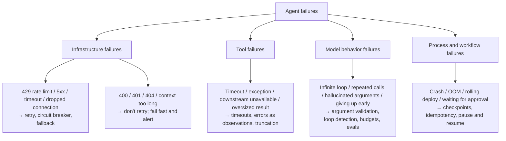
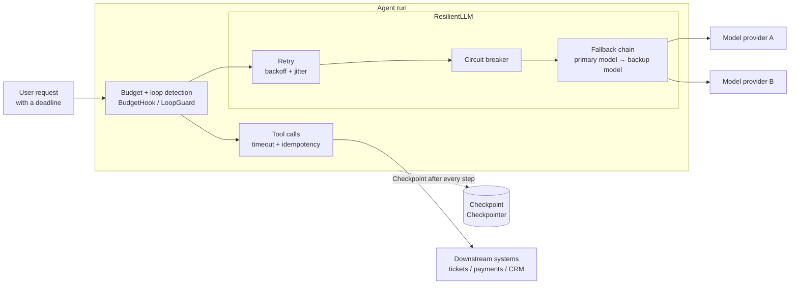
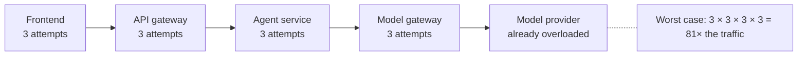
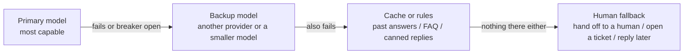
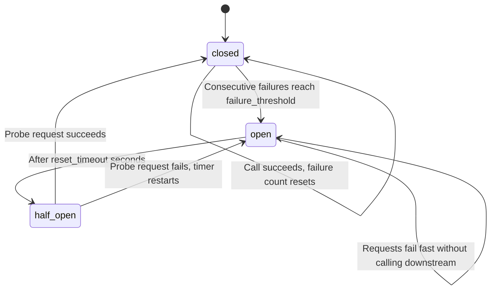
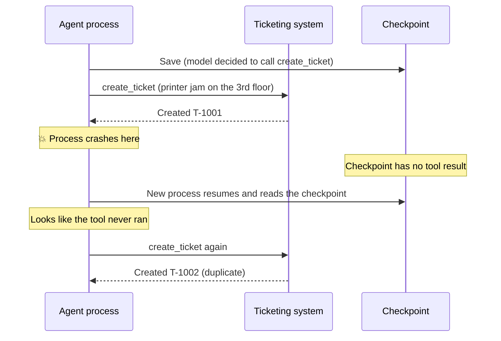
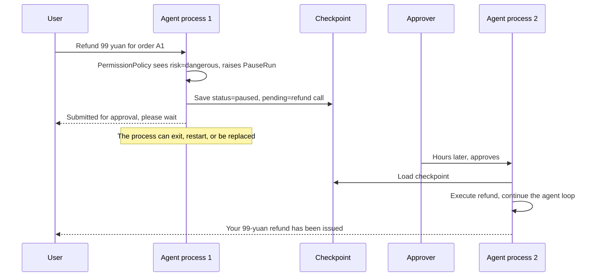

[中文](README.md) | [English](README.en.md)

# Lesson 08: Reliability engineering — keeping agents alive through failure

> 🕐 Suggested time: 30 minutes | 🎯 After this lesson you can: take the six failures enterprises hit most often — rate limits, outages, runaway loops, crashes, duplicate side effects, and approvals that take hours — weigh 2–4 solutions for each, and pick the right one | 📦 Source code: `agentkit/reliability.py`, `agentkit/budget.py`, `agentkit/state.py`, `agentkit/tools.py` (idempotency), `agentkit/agent.py` (recovery), `agentkit/distributed/sqlite.py` (cross-process circuit breaker and idempotency store)
>
> 📖 Primary reading: [Addressing Cascading Failures](https://sre.google/sre-book/addressing-cascading-failures/) (Mike Ulrich, 2016) — Chapter 22 of Google's SRE book explains how failures amplify along a call chain, and the "retries multiply across layers" example in Problem 1 of this lesson comes from it; focus on the "Retries" and "Latency and Deadlines" sections to see why retries need a budget and deadlines need to propagate down the chain.

## 0. In one sentence

**A reliable system isn't one that never fails. It's one that still gets the job done when things fail — and never gets it wrong.**

Picture a dependable courier working through a day of deliveries:

| What the courier runs into | What they do | Engineering equivalent |
|---|---|---|
| Nobody answers the door | Wait, then knock again, waiting a little longer each time | **Retry + exponential backoff** |
| Every courier in the building agrees to come back at exactly 10:00 | Each picks a random time instead, so they don't jam the elevator | **Jitter** |
| The same road is blocked three times in a row | Avoid it for a while, then send one person to scout it | **Circuit breaker** |
| The main road is closed | Take a side street; failing that, leave it at a pickup point; failing that, have the customer collect it | **Fallback chain** |
| The shift is over | Clock out instead of driving all night | **Budget** |
| The van breaks down mid-route | Switch vans and resume from the last signed-for delivery | **Checkpoint** |
| Not sure whether the last package was signed for | Check the delivery log first; don't deliver twice | **Idempotency key** |
| A valuable item needs the recipient's own signature | Deliver the other packages and come back when they're home | **Pause / resume** |

**Why do agents need this more than ordinary APIs?** A single agent run calls the model and tools 20 times. At 99% success per call, the chance that the whole run succeeds is only $0.99^{20} \approx 81.8\%$ — **one user in five sees an error**. Retry each failed call up to 2 times (assuming failures are independent) and the run's success rate climbs back to 99.998%. But real-world failures are rarely independent: when a provider goes down, every request fails **at the same time**, and retries only make things worse. That's why you also need circuit breakers, fallbacks, budgets, checkpoints…

This lesson belongs to Part 2 of the course: **start from a real enterprise problem, compare several solutions, then see how agentkit implements one.**

## 1. Core concepts

### 1.1 How agents fail: four categories

How you classify an error decides whether you respond correctly. Treat a 400 as retryable and you burn quota for nothing; treat a 503 as non-retryable and you give up on requests that would have succeeded.



**Model behavior failures are unique to agents.** A bug in an ordinary service reproduces reliably; a model's "bad behavior" is probabilistic. The same input might send it into a loop 3 times out of 100. You can't "fix" that. You can only **limit its blast radius** and track how often it happens with an eval set (Lesson 11).

### 1.2 The reliability "onion": each layer catches what the one before it missed



- **Retries** handle occasional, short-lived failures. **Circuit breakers** handle sustained failures, when retrying does more harm than good. **Fallbacks** leave you a way forward once the breaker trips.
- **Budgets and loop detection** handle "the model can't stop itself".
- **Checkpoints and idempotency** handle "the process itself died".

### 1.3 The six problem cards in this lesson

| # | Enterprise problem | Key techniques | agentkit | Exercise |
|---|---|---|---|---|
| 1 | Frequent 429s from the model API at peak hours | Backoff + jitter, retry budget, deadlines | `retry_call`, `backoff_delay` | (b) `retry_with_budget` |
| 2 | The primary model provider goes down | Circuit breaker, fallback chain, breaker state shared across processes | `CircuitBreaker`, `ResilientLLM`, `SQLiteCircuitBreaker` | (c) Single probe while half-open |
| 3 | A runaway agent loop burns money | Multi-dimensional budgets, loop detection | `BudgetHook` | (a) `LoopGuard` |
| 4 | Process crashes and deploy restarts | Checkpoints, durable execution | `FileCheckpointer`, `Agent.resume` | — |
| 5 | Duplicate refunds / duplicate tickets after recovery | Idempotency keys | `SQLiteIdempotencyStore`, `ToolContext.idempotency_key` | — |
| 6 | Approvals take hours | Persist on pause, resume asynchronously | `PauseRun`, `Agent.approve` | — |

## 2. Enterprise problem cards

### Problem 1: The model API keeps returning 429 at peak hours

**Scenario**: An IT assistant at a 2,000-person company. During the 9:00–9:30 weekday peak, 30 agent runs start every second, and each run calls the model 6 times on average → a peak of about 180 calls/second. The provider's limit is 6,000 calls per minute (100 calls/second). At peak, about 45% of calls return `429 Too Many Requests`.

**Why it's hard**:

- **Retrying everything is wrong.** A 400 (bad parameters, context too long) or a 401 (invalid key) returns the same result after ten thousand retries, and may even trip the provider's abuse detection. Only **transient errors** — 429s, 5xx, timeouts, dropped connections — are worth retrying.
- **Fixed-interval retries create a synchronized stampede.** When a large batch of clients gets a 429 at the same moment and every one of them waits the same amount of time before retrying, the server receives another whole batch in a single instant (the **thundering herd**) — so most of them are rejected again, wait in lockstep again, and charge again. Demo scenario 1 runs a real experiment (not a histogram drawn from random numbers): 500 concurrent clients hit a gateway running in **a separate process**; the gateway handles at most 50 requests at a time, 100 ms each, and returns 429 immediately when full. Every number below comes from the gateway's own log (MacBook, 8 cores / 8 GB, load average about 4, one run):

  ```text
  Strategy                   Requests  429s  Densest 10 ms of retries  All done  Half done  Gateway utilization
  Fixed 0.5s                 2750      2250  324                       4.67s     2.64s      21%
  Exponential, no jitter     2750      2250  340                       6.66s     2.64s      15%
  Exponential + full jitter  2001      1501  76                        1.64s     0.61s      61%
  ```

  With a fixed interval there is a "wall" every 0.5 seconds: hundreds of retries land in the same 10 ms, the gateway accepts 50, the rest get 429s — and between walls the gateway sits idle (21% utilization). Exponential backoff without jitter just stretches the gaps between walls. Full jitter spreads the same retries along the time axis: a third fewer 429s, and everyone is done in about a third of the time.

- **Retries amplify traffic.** The Google SRE book gives an example: when a database is overloaded and the backend, frontend, and JavaScript layers each retry 3 times (4 attempts per layer), a single user action can generate up to $4^3=64$ requests against the database. Agent systems are layered the same way: frontend → gateway → agent service → model gateway.
- **When demand stays above the limit, retries only postpone failure.** Demand is 1.8× the limit. No amount of retrying will squeeze it in; it only adds latency.
- **Retries must not outlive the deadline.** The user request times out at 90 seconds, and each model call times out at 30 seconds with up to 3 attempts → 90 seconds plus backoff in the worst case. The last attempt is doomed to be cancelled halfway through, wasting quota.



| Option | How it works | Pros | Cons | When to use |
|---|---|---|---|---|
| A. Client-side retries | Retry only transient errors; exponential backoff + full jitter; per-request cap + **global retry budget** + deadline | Simple; very effective against occasional rate limiting | Useless when demand stays above the limit; retries at several layers amplify | Occasional 429s, demand below the limit |
| B. Queue-based load leveling | Requests enter a queue and drain at the provider's limit (token-bucket rate limiting), optionally by priority | Smooths bursts, wastes no quota, never triggers 429s | Adds queueing delay; needs a queue and a distributed rate limiter | Batch jobs, async tasks, work that can wait |
| C. Load balancing across providers / accounts | A model gateway spreads traffic across providers, regions, or accounts according to each one's quota | Raises total capacity and gives you disaster recovery along the way | Models behave differently and need evals; contracts and costs get more complex | Peaks that consistently exceed a single limit |
| D. Make fewer calls | Cache answers to identical questions, route simple questions to a small model, batch calls | Cuts demand and cost at the source | Extra engineering; uncertain hit rates | Many repeated questions; cost-sensitive workloads |

**How to choose**: Do the math first: peak demand ÷ limit. **A is the mandatory foundation for every system** — you'll hit occasional 429s at any scale. Once that ratio stays above roughly 0.8, A alone isn't enough: use B for work that can be delayed and C for interactive traffic. D is always worth doing (see [Lesson 14: Cost and latency](../14_cost_latency/README.en.md)). With multiple instances, the rate limiter and the retry budget must be global and shared (see [Lesson 13: High concurrency and distributed execution](../13_distributed_concurrency/README.en.md)).

**What this lesson implements**: Option A.

1. **Errors are classified in the LLM adapter layer** (`map_openai_error` in [agentkit/llm.py](../../agentkit/llm.py)). The layers above only look at a single boolean, `retryable`, so switching vendors doesn't touch the retry logic:

   ```python
   code = e.status_code
   # 429 rate limit, 408 timeout, 5xx server error: a retry may succeed; 400/401/403/404: retrying won't help.
   # But there are two kinds of 429: rate limiting (just wait) and quota exhausted (insufficient_quota, retrying never helps).
   retryable = code in (408, 409, 429) or code >= 500
   if code == 429 and "insufficient_quota" in str(e):
       retryable = False
   retry_after = float(e.response.headers.get("retry-after"))   # the server's suggested wait in seconds (None without the header)
   return LLMError(str(e), status_code=code, retryable=retryable, retry_after=retry_after)
   ```

   This matches the default retry rules of the official OpenAI Python SDK. Note that `OpenAICompatLLM` creates its client with `max_retries=0`: **it deliberately turns off the SDK's built-in retries**. Otherwise the SDK retries 2 times, your code retries 3 times on top of that, a single call can turn into as many as 9 requests — and you never see the SDK's internal retries. **Retry in exactly one layer, and do it where you can see it.**

2. **Exponential backoff with full jitter** ([agentkit/reliability.py](../../agentkit/reliability.py)):

   ```python
   def backoff_delay(attempt: int, base: float = 0.5, cap: float = 8.0, rng: random.Random | None = None) -> float:
       upper = min(cap, base * (2 ** (attempt - 1)))   # exponential growth: 0.5s, 1s, 2s, 4s... capped at 8s
       return (rng or random).uniform(0, upper)         # full jitter: uniformly random in [0, upper]
   ```

   Marc Brooker of AWS used simulations to compare no jitter, full jitter, equal jitter, and decorrelated jitter. No jitter did the most work and took the longest; full jitter made the fewest total calls and is also the simplest to implement. The demo's real experiment above reaches the same conclusion (the full-jitter row uses exactly `backoff_delay(n, base=0.1, cap=1.0)`).

   The retry loop itself is async (`retry_call`, which `ResilientLLM` uses internally):

   ```python
   async def retry_call(fn, *, max_attempts=3, base_delay=0.5, max_delay=8.0, retry_if=is_retryable, sleep=asyncio.sleep, on_retry=None):
       for attempt in range(1, max_attempts + 1):
           try:
               return await fn()            # fn returns a new coroutine each time: a coroutine can be awaited only once
           except Exception as e:           # CancelledError is a BaseException: a caller's cancellation passes straight through, never retried
               if attempt == max_attempts or not retry_if(e):
                   raise
               delay = backoff_delay(attempt, base_delay, max_delay)
               server_hint = getattr(e, "retry_after", None)   # if the server said "retry in N seconds", listen to it
               if server_hint is not None:
                   delay = max(delay, min(server_hint, max_delay * 4))
               await sleep(delay)           # yields the event loop while waiting: other sessions in this process keep going
   ```

   Usage: `await retry_call(lambda: llm.chat(messages))`. `rng`, `sleep`, and `clock` are all injectable, so every exercise test in this lesson is deterministic and never actually sleeps.

3. **Exercise (b)** adds the two gates agentkit doesn't have: a **global retry budget** (a token bucket: each new request deposits 0.1 tokens and each retry spends 1 — the same idea as Google SRE's "retries must stay under 10% of requests" and gRPC's `retryThrottling`) and a **deadline** (stop retrying once the remaining time can't cover another backoff). The test fires 100 requests truly concurrently with `asyncio.gather`, all sharing one budget: when the downstream is completely down, "at most 3 attempts each" would have made 300 calls; with the budget, they make only 110. Why 110 rather than the 113 you get when sending them one by one? Concurrently, all 100 first attempts deposit their tokens before any failure comes back, so the bucket hits its cap `max_tokens=10` — which is exactly what the cap is for: limiting how many retries can charge out at once when an outage starts.

   The budget needs no lock: the 100 requests are coroutines on one event loop, and coroutines switch only at `await`. There's no `await` inside `try_acquire`, so "read tokens → check → deduct" can't be interrupted. When several **processes** share a budget, an in-memory bucket is no longer enough; it has to live somewhere every process can see (one machine: `agentkit.distributed.SQLiteTokenBucket`; many machines: Redis or the model gateway).

> Production upgrades: `Retry-After` is already wired up (`OpenAICompatLLM` parses the header into `LLMError.retry_after`, and `retry_call` uses whichever is larger, that or its own backoff); share global rate limits and retry budgets through the model gateway or Redis; agree across layers on an error code that means "already retried, don't retry again".

### Problem 2: The primary model provider was down for 25 minutes

**Scenario**: Tuesday, 14:00. The primary model provider returns 503s across the board for 25 minutes. The agent's model calls time out after 60 seconds with 3 retries, so every user waits 3 minutes just to see an error. Within two minutes, all 200 worker threads of the web service are tied up by requests waiting to time out, and even pages that never call the model stop loading.

**Why it's hard**:

- Retrying assumes the failure is temporary. During a sustained outage, every request dutifully "tries 3 times and waits 60 seconds each time", which only drags your own service down. The moment the provider recovers, the backlog rushes in and knocks it over again.
- Switching to a backup model sounds easy, but the backup may differ in capability, context length, tool-calling support, and how it responds to your prompts. You may just be trading "errors" for "nonsense".
- Which errors mean "the provider is unhealthy"? If one user's very long conversation triggers a 400 `context_length_exceeded` and that counts toward the breaker too, a handful of such requests can push every user onto the backup model.

| Option | How it works | Pros | Cons | When to use |
|---|---|---|---|---|
| A. Retry, then give up | Return an error once retries are exhausted | Simplest | Users wait a long time; threads get exhausted; thundering herd on recovery | Internal tools that can tolerate brief outages |
| B. Circuit breaker + fail fast | Once consecutive failures reach a threshold, the breaker "trips" and later requests fail within milliseconds; after a cooldown, a probe request is let through | Protects you and gives the downstream room to recover | The feature is completely unavailable during the outage | Dependencies with no alternative |
| C. Circuit breaker + fall back to a backup model | Once tripped, switch to another provider or another model | Users barely notice | Quality differences, prompt compatibility, cost; the backup model needs evals too | Core customer-facing features |
| D. Last resort: cache / rules / humans | When no model is available, fall back to FAQs, past answers, or a human | A final safety net for user experience | Limited coverage; needs business design | Customer service and other scenarios with a human channel |

Chain C and D together and you get a fallback chain:



**How to choose**: Use **C + D** for core customer-facing features; **B** is enough for internal tools. Whichever you pick, you must: run the eval set against the backup model (Lesson 11); instrument and alert on fallback events (a "silent fallback" is the most dangerous kind — quality can drop for a week before anyone notices); and count toward the breaker only errors that reflect downstream health (5xx, timeouts, 429s, plus errors like a 401 or "model not found" that mean the whole dependency is unusable), never problems specific to a single request.

**What this lesson implements**: Options B + C. The circuit breaker's three states:



`CircuitBreaker` doesn't store its state; it **computes it from the clock**. No background timer is needed to flip open to half_open, which eliminates a whole class of concurrency bugs ([agentkit/reliability.py](../../agentkit/reliability.py)):

```python
@property
def state(self) -> str:
    if self.opened_at is None:
        return "closed"
    if self.clock() - self.opened_at >= self.reset_timeout:
        return "half_open"
    return "open"
```

`ResilientLLM` stacks "retry → circuit breaker → fallback" into a single decorator. **From the outside it's still an ordinary LLM**, and the agent never knows the difference:

```python
from agentkit import Agent, ResilientLLM, default_llm

llm = ResilientLLM(
    default_llm("gpt-5.5"),                 # primary model
    [default_llm("gpt-5.6-luna")],          # backup models (there can be several; tried in order)
    max_attempts=3, base_delay=0.5,         # up to 3 attempts per model, exponential backoff with full jitter
    failure_threshold=5, reset_timeout=30,  # trip after 5 consecutive failures; half-open probe after 30 seconds
)
agent = Agent(llm, tools)
```

Design notes: each model gets **its own** breaker. The breaker wraps **around** the retries, so one call that exhausted all its retries counts as one failure. When every model fails, it raises `LLMError`, and the agent turns that into `status="failed"` plus a "service temporarily unavailable" message instead of a 500. Option D belongs in the business layer that calls the agent, driven by this status.

Two more breaker details that production implementations (such as Java's Resilience4j) have, and agentkit implements too:

- **Which exceptions count toward the breaker**: `CircuitBreaker(record_if=...)` (same parameter on `ResilientLLM`). By default everything counts — demo scenario 2 trips the breaker with exactly that kind of error, a 400 for a model that doesn't exist. In production you can count only errors that reflect an unhealthy downstream, so one user's oversized context can't push everyone onto the backup model.
- **Only one probe request gets through while half-open**; other concurrent requests keep failing fast. Otherwise, the moment the downstream recovers a little, 500 concurrent requests stampede it and knock it over again:

  ```python
  async def call(self, fn):
      state = self.state
      if state == "open":
          raise CircuitOpenError(self.name)
      probe = state == "half_open"
      if probe:
          if self._probing:              # a probe request is already in flight
              raise CircuitOpenError(self.name)
          self._probing = True           # no await between the check and the set: no other coroutine on this loop can slip in
      try:
          result = await fn()            # the only switch point: the probe waits here, other coroutines are stopped by the check above
      except Exception as e:
          ...                            # count the failure; a failed probe reopens the breaker and restarts the timer
      finally:
          if probe:
              self._probing = False      # reset on success, failure, or cancellation
      ...
  ```

  Why is a plain boolean flag enough, with no lock? Coroutines switch only at `await`. Exercise (c) (bonus) has you implement it yourself; the test fires 50 requests at once with `asyncio.gather` while half-open and proves that only 1 reaches the downstream.

**Several worker processes sharing one breaker.** The breaker above lives in process memory. A service usually runs many worker processes: process A has already failed repeatedly and tripped, while processes B and C each still have to fail `failure_threshold` times before they trip — the downstream is already dead and you keep hitting it with another batch of requests; every freshly scaled-out process also starts closed and learns the hard way again. `agentkit.distributed.SQLiteCircuitBreaker` is the same state machine, except that the failure count, the time it opened, and "who is probing" all live in a SQLite file shared by every process:

```python
from agentkit.distributed import SQLiteCircuitBreaker

llm = ResilientLLM(primary, [backup], max_attempts=2,
                   breaker_factory=lambda model: SQLiteCircuitBreaker("runs/breakers.db", model,
                                                                      failure_threshold=3, reset_timeout=30))
```

Part B of demo scenario 2 verifies it with real processes: the broken primary model is another process (`services.py`, which returns 503 every time and counts its own calls), and each worker is another `demo.py` process (`OpenAICompatLLM` → the primary, at most 2 attempts per request). The call counts recorded by the primary model service:

| Process | Breaker | Calls to the broken primary |
|---|---|---|
| A (the first to see the outage) | Shared | 6 (3 requests × 2 attempts, then it trips; request 4 fails fast) |
| B (starts after A has exited) | Shared | **0**: its very first call fails fast and goes straight to the backup |
| B′ (control) | Its own in-memory `CircuitBreaker` | 6: it has to hit the wall with 3 requests itself before tripping |
| C (after the primary is fixed and `reset_timeout` has passed) | Shared | 4: its first request is the half-open probe; on success the breaker closes |

"Only one probe while half-open" has to hold across processes too, and an in-memory flag is invisible to other processes. So `SQLiteCircuitBreaker` uses a **probe lease** with an expiry (`probe_until`): the process that checks and claims it inside one write transaction does the probing, and every other process keeps failing fast; if the prober crashes midway, the lease expires and another process can take over probing, so the breaker never gets stuck half-open. `tests/test_distributed.py` has two matching tests: after a real child process trips the breaker, this process's very first call fails fast with zero calls to the primary; and two instances with their own connections (sharing state only through the file, just like two processes) let exactly one probe through while half-open. Limitation: SQLite can only be shared on one machine; across machines, put the breaker in the model gateway layer (Lesson 29) or in Redis.

### Problem 3: A looping agent burns through a pile of money overnight

**Scenario**: A reporting agent's tool always returns "Generating (99% done), please check again later", and the system prompt insists "don't give up until it's done". The agent calls the same tool with the same arguments 400 times. Every step resends an ever-growing history to the model: demo scenario 4, run against a real model, measured input tokens growing by about 57 per step (409 → 466 → 523 → 580). Extrapolated, 400 steps add up to about 4.7 million input tokens — roughly $6 at agentkit's default example price ($1.25 per million input tokens). Now imagine 1,000 of these runs a day.

**Why it's hard**:

- An ordinary program's cost is deterministic. An agent's cost is **decided by the model at runtime**. OWASP lists this among the top 10 risks for LLM applications: LLM10:2025 Unbounded Consumption.
- Cost isn't linear: every step costs more than the last, so the total cost of an N-step loop grows roughly as $N^2$.
- Capping steps alone isn't enough, because a single step can use 100,000 tokens. Capping dollars alone is too late, because you find out after the money is gone.
- You can't simply "kill anything that repeats": polling tasks legitimately repeat a few times.

| Option | How it works | Pros | Cons | When to use |
|---|---|---|---|---|
| A. Step limit | `max_steps=15` | Free; the last line of defense | Ignores how expensive each step is; may kill legitimate long tasks | Every agent must have one |
| B. Multi-dimensional budget | Separate caps on tokens, dollars, tool calls, and duration; stop gracefully when one is exceeded | Directly controls money and time | Tells you "it ran out", not "why"; thresholds are hard to set | Every agent must have one |
| C. Loop detection | Same tool + same arguments repeated within a sliding window → first nudge the model to change approach, then abort | Precise and cheap; gives the model a chance to correct itself | Only catches exact repeats; slightly different arguments slip through | Agents that make many tool calls |
| D. Progress watchdog | Periodically have rules or another model judge whether the last N steps made any progress | Catches subtler cases of spinning in place | Extra cost; can misjudge | Hour-long tasks |

**How to choose**: **A + B are the baseline** for every agent. C is so cheap that every tool-heavy agent should have it. Save D for long-running tasks. Beyond per-run budgets, you also need daily / monthly quotas per user and per tenant, enforced at the gateway ([Lesson 14](../14_cost_latency/README.en.md)).

**What this lesson implements**: A is `Agent(max_steps=...)`; B is `BudgetHook` ([agentkit/budget.py](../../agentkit/budget.py)):

```python
agent = Agent(llm, tools, max_steps=15,
              hooks=[BudgetHook(max_tokens=50_000, max_cost_usd=0.50, max_tool_calls=20, max_seconds=120)])
```

When a limit is exceeded, it raises `StopRun`. The agent loop turns that into `status="stopped"` and saves the checkpoint as usual, and the user sees "Budget exceeded, task stopped" instead of a 500. A few details worth noting:

- Dollars and tokens are only known after the model responds, so that check runs in `after_llm`. The budget can be overshot by up to one call's worth, so leave headroom in your thresholds.
- The tool-call check runs in `before_tool`, by which point the model has already issued its tool calls. On abort, the agent adds a result reading "Not executed: run aborted (budget_exceeded)" for every **tool call that hasn't run yet** in the last assistant message. The OpenAI message protocol requires this: **every `tool_call` must have a matching `tool` message**. Otherwise, when the user continues the conversation from this history, the next model call immediately returns a 400.
- `max_seconds` counts only **active execution** time (`state.active_seconds`). Time spent paused waiting for human approval doesn't count (see Problem 6).

C is **Exercise (a), `LoopGuard`**. The most important takeaway: **counts must live in `state.metadata`, not on the hook instance.** A hook instance is shared by every run of the same agent — in a web service, that means concurrent requests from every user and every tenant. Keep the counts on `self`, and user A's call history can get user B flagged for looping. `state`, on the other hand, belongs to exactly one run and is persisted with the checkpoint, so the counts survive a crash or an approval pause.

### Problem 4: Every deploy restarts all in-flight tasks from scratch

**Scenario**: A contract-review agent runs for 8 minutes on average and calls the model 25 times. The service deploys 3 times a day, and each deploy catches about 20 tasks mid-run and forcibly interrupts them. That's about 60 tasks a day starting over from scratch: you pay twice, users wait twice, and, worse, tool calls that already ran get executed again.

**Why it's hard**:

- Processes crash, machines die, deploys restart things. None of this can be avoided.
- Rerunning from scratch isn't just wasteful, it's **nondeterministic**: the model makes its decisions all over again and may reach a different conclusion.
- Saving progress can fail too. Crash halfway through writing a checkpoint and you get a corrupted file — and lose the old progress along with it.

| Option | How it works | Pros | Cons | When to use |
|---|---|---|---|---|
| A. No checkpoints, rerun on failure | Resubmit the whole task when it fails | Simplest | Wastes money and time; tools with side effects run again | Read-only tasks that take seconds |
| B. Checkpoint + resume | Atomically write the full state to storage at every step; on recovery, continue from where it stopped and only execute "tool calls with no result" | Under your control; no new infrastructure | You own recovery triggers, concurrent recovery (two instances grabbing the same task), and checkpoint cleanup | Minute-scale tasks with side effects |
| C. Durable workflow engine | A framework such as Temporal or LangGraph records every step and replays automatically | Timers, retries, signals, and visualization out of the box | Learning curve; determinism constraints on workflow code; one more component to operate | Multi-step, multi-party processes lasting hours to days |

**How to choose**: It comes down to task duration and side effects. Use A for read-only tasks that take seconds, B for minute-scale tasks that modify external systems, and C for work that spans hours or days and needs scheduled wake-ups or coordination among several parties.

**What this lesson implements**: Option B. The agent loop saves at every state change: the initial state, after every model reply, and **after every tool result** ([agentkit/agent.py](../../agentkit/agent.py)). `Agent.resume(run_id)` loads the checkpoint and first calls `_run_pending_tools`: it finds the tool calls in the last assistant message that have no result yet, executes them, and only then continues the agent loop. **The model never gets to re-make a decision it has already made.**

`FileCheckpointer` writes a temp file and then atomically replaces the original, so a checkpoint can never be half-written ([agentkit/state.py](../../agentkit/state.py)):

```python
def save(self, state: RunState) -> None:
    path = self._path(state.run_id)
    # the temp file name must be unique: if two processes save the same run at once, a fixed .tmp name gets trampled
    tmp = path.with_name(f"{path.name}.{os.getpid()}.{uuid.uuid4().hex[:8]}.tmp")
    tmp.write_text(state.to_json(indent=2), encoding="utf-8")
    os.replace(tmp, path)   # atomic replace: after a crash the file is either the complete old version or the complete new one
```

Atomic replace only guarantees that the file is never half-written, not that it's never overwritten: when two processes both believe they're handling the same run, whoever writes last silently overwrites the other. So `FileCheckpointer` fits "only one process handles a given run at a time" (demo scenario 3 in this lesson: process 1 dies, and only then does process 2 take over). When several workers might grab the same run, you need checkpoints with version numbers and fencing tokens (see "Who triggers recovery?" below).

This is the core idea behind **durable execution**. How it compares with industry solutions:

| | agentkit | LangGraph checkpointer | Temporal |
|---|---|---|---|
| What's stored | The full RunState | Graph state at the end of each super-step | Event history: every Activity call and its result |
| How it recovers | Load the snapshot; execute the tool calls that have no result | Continue from the last checkpoint; writes from nodes that already succeeded in the same step aren't rerun | Replay the workflow code; completed Activities reuse their recorded results |
| What it requires of your code | Idempotent tools | Deterministic, idempotent nodes; side effects wrapped in tasks | Deterministic workflow code; idempotent Activities |

Note the last row: **every approach requires side-effecting operations to be idempotent.** Why? See the next card.

**Who triggers recovery?** In the demo, we start process 2 by hand. In production this must be automatic — "a process died, so someone else picks up its runs" — and only one process may recover a given run at a time. `agentkit.distributed` implements this for real (covered in depth in [Lesson 13](../13_distributed_concurrency/README.en.md)), and the core idea is a **lease**:

- Runs go into a durable queue as jobs. A worker doesn't "take" a job, it "borrows it for a while" (a lease), and `run_worker` starts a heartbeat coroutine per job that keeps renewing it;
- If the holder crashes, hangs, or is paused, the heartbeat stops. The next time any worker claims a job, `SQLiteJobQueue.claim` first reaps expired leases **inside the same write transaction**:

  ```python
  rows = conn.execute("SELECT id, attempts, max_attempts, worker_id FROM agent_jobs "
                      "WHERE status = 'leased' AND lease_until < ?", (now,)).fetchall()
  # attempts left → back in the queue after a backoff; none left → dead letter (a "poison message" that crashes
  # every worker that touches it can kill at most max_attempts workers)
  ```

- The worker that takes over runs the job through `AgentJobHandler`: if the run already has a checkpoint, it calls `agent.resume(run_id)` and continues from where it stopped instead of starting over;
- An old holder that was paused and wakes up again (a "zombie") still thinks it owns the job. Every claim issues a globally increasing fencing token, and checkpoint and job-status writes carry it; mismatches are rejected — which is why checkpoints switch to `SQLiteCheckpointer`, with version-number CAS and fences.

  ```python
  # in each worker process (python -m agentkit.distributed.worker ..., or WorkerPool starting N of them):
  db = SQLiteDB("runs/jobs.db")                   # objects in one process share one connection
  queue, ckpt, idem = SQLiteJobQueue(db), SQLiteCheckpointer(db), SQLiteIdempotencyStore(db)
  for x in (queue, ckpt, idem):
      await x.setup()                             # create the tables
  agent = Agent(llm, tools, checkpointer=ckpt, idempotency_store=idem)
  await run_worker(queue, AgentJobHandler(agent, ckpt), worker_id="w1", stop_event=stop, lease_seconds=30)
  ```

`tests/test_distributed.py` verifies these with real processes and signals: after `kill -9` on the worker holding a job, another process takes over once the lease expires, continues from the checkpoint, and the tool is not executed again; a zombie frozen with `SIGSTOP` has its lease renewals, checkpoint writes, and commit all rejected after it wakes up. For draining before shutdown during a deploy, see [Lesson 16: Release and operations](../16_release_ops/README.en.md).

> Checkpoints handle "the same task gets interrupted within minutes to hours." When a task is too long to fit in one context window (hours to days), you need a different kind of durability: a feature list, a progress file, and git, so that a brand-new session can read the handoff notes and take over. See [Lesson 24's long-running harness](../24_coding_agents/README.en.md#13-long-running-work-the-agent-wakes-up-with-amnesia-every-time).

> 🏭 **In production**: on a single machine with several processes, the `SQLiteIdempotencyStore` and `SQLiteCircuitBreaker` used in this lesson's demo, plus Lesson 13's `SQLiteCheckpointer` / `SQLiteJobQueue`, are already real cross-process implementations. Across machines, checkpoints move to Postgres with version-number CAS and fencing, and the idempotency store moves to Redis, behind the same interfaces — see [Lesson 26](../26_state_and_queues/README.en.md). Flows that wait days for approval or need timed wake-ups belong in a durable execution engine such as Temporal — see [Lesson 27](../27_durable_workflows/README.en.md). On timeouts: an `async def` tool that times out is truly cancelled; a plain synchronous function runs in a thread pool, and on timeout the caller stops waiting but the thread can't be killed; `@tool(isolation="process")` runs in a child process that is killed outright on timeout ([Lesson 30](../30_async_runtime/README.en.md) covers cancellation semantics in depth).

### Problem 5: After recovery, the customer got two refunds

**Scenario**: A refund agent calls the payment API successfully, and just before the checkpoint is written, the process is OOM-killed. The new process resumes from the checkpoint, sees "the model decided to call refund, but there's no result", and calls it again. If 0.01% of 50,000 daily refunds land in this window, that's 5 duplicate refunds a day.

**Why it's hard**: No matter how often you checkpoint, there's always a gap between "executing the tool" and "recording the result":



True exactly-once execution is impossible in a distributed system. What you can achieve is **"at-least-once + idempotency" = effectively exactly-once**. Checkpoints guarantee at-least-once (nothing is lost); idempotency guarantees "many times equals once" (nothing is duplicated).

| Option | How it works | Pros | Cons | When to use |
|---|---|---|---|---|
| A. Caller-side idempotency store | Use a stable idempotency key (`run_id:call_id`); check it before executing, record it after success | General-purpose; asks nothing of the downstream | A crash after the side effect but before the record is written still duplicates; the store must be durable | On by default at the framework layer |
| B. Pass the idempotency key downstream | The downstream performs the operation and records the key in **the same transaction**; a second request with the same key gets the previous result back | Truly effectively-once | Requires downstream support | Payments, messaging, external APIs |
| C. Business uniqueness constraint | A unique index on a business key, e.g., "at most one refund per order" | The strongest guarantee, independent of implementation | Not every operation has a natural unique key; may wrongly reject a legitimate second operation | Writes with a clear business key |
| D. Check, then act | Query "has this been done already?" before executing | No downstream changes | A race window between the check and the action; unreliable under concurrency | Only as a supplement |

**How to choose**: A as the framework default. Anything involving money, external notifications, or irreversible operations must add B or C. Never rely on D alone.

**What this lesson implements**: Option A. The key question is where the idempotency key comes from ([agentkit/tools.py](../../agentkit/tools.py)):

```python
@property
def idempotency_key(self) -> str:
    """Same tool call in the same run → same key. Replays are deduplicated by it."""
    return f"{self.run_id}:{self.call_id}"
```

The `tool_call_id` is generated by the model and stored in the checkpoint, so it stays the same after recovery and the replay hits the stored entry. If the model decides to create another ticket in a later step, that's a new `call_id`, so it won't be deduplicated by mistake. Temporal's official documentation gives the same advice: combine the Workflow Run ID and the Activity ID into an idempotency key. **Never generate the idempotency key with `uuid4()` inside the tool**: every execution gets a fresh one, the key changes on replay, and you have no protection at all.

The tool executor enables idempotency only for `write` / `dangerous` tools (reads are naturally idempotent, and caching them would actually serve stale data after recovery): `get(key)` before executing, returning the previous result on a hit; `put(key, result)` after success.

```python
from agentkit.distributed import SQLiteIdempotencyStore

store = SQLiteIdempotencyStore("runs/idempotency.db")
await store.setup()   # create the table
agent = Agent(llm, tools, checkpointer=FileCheckpointer("runs/checkpoints"), idempotency_store=store)
```

**The idempotency store must live somewhere the process that takes over can also see.** agentkit's built-in `IdempotencyStore` is a dict in memory; it dies with the process, failing precisely when you need it most. A homemade "read a JSON file → modify → write it back" version doesn't work either: two processes read the same old content, each adds an entry and writes it back, and the later write overwrites the earlier one (a lost update); a fixed `.tmp` temp file name even lets the two processes trample each other's temp file. `SQLiteIdempotencyStore` keeps the records in a SQLite table, and `put` is an `INSERT OR IGNORE` inside a transaction (when two processes succeed almost simultaneously, the first write wins).

Demo scenario 3 reproduces this window with real processes: the external ticketing system is another process (`services.py`); the agent in process 1 calls `create_ticket` (a real HTTP request that creates a ticket) and then **actually dies** (`os._exit(137)`, no cleanup at all); process 2 is a brand-new process that resumes from the checkpoint with the same `run_id`. Ticket counts come from the ticketing system's own records:

| Case | Where process 1 dies | Protection | Tickets |
|---|---|---|---|
| 1 | After the tool ran, before the checkpoint write | None | 2 ❌ |
| 2 | Same (idempotency record already written) | `SQLiteIdempotencyStore` | 1 ✅ process 2 hits the idempotency record; the tool doesn't run again |
| 3 | Inside the tool: downstream already created the ticket, idempotency record not yet written | `SQLiteIdempotencyStore` | 2 ❌ the caller-side store can't help |
| 4 | Same | Also pass `ctx.idempotency_key` downstream as an `Idempotency-Key` header | 1 ✅ the ticketing system recognizes the key and returns the original ticket |

Case 3 is exactly the weakness listed for option A in the table: "a crash after the side effect but before the record is written still duplicates". Case 4 is option B — the downstream "performs the operation + records the key" in its own storage, and a second request with the same key gets the previous result back:

```python
@tool(risk="write")
async def create_ticket(title: str, ctx: ToolContext) -> str:
    """Create a ticket"""
    async with httpx.AsyncClient() as http:
        r = await http.post(f"{TICKETS_URL}/tickets", json={"title": title},
                            headers={"Idempotency-Key": ctx.idempotency_key})   # the key stays the same when this call is replayed
    return f"Ticket created: {r.json()['id']}"
```

This is exactly why payment APIs such as Stripe's support an `Idempotency-Key` request header.

> Production upgrades: `SQLiteIdempotencyStore` for several processes on one machine (this lesson's demo); Redis (`SET key value NX` with an expiry) or a database unique index across machines (Lesson 26). Note that it only records results *after* success: when two processes execute the same call **at the same time** (a zombie worker colliding with its replacement), neither finds a record and both execute, so any downstream with real side effects still has to honor the idempotency key itself. For deduplication, leases, and fencing under concurrency, see [Lesson 13](../13_distributed_concurrency/README.en.md).

### Problem 6: Approvals take hours

**Scenario**: An expense agent needs a manager's approval for any claim over 5,000 yuan. Managers take 3 hours on average to respond, and at peak, 300 new claims per hour need approval. If every claim waits in memory (a thread or a coroutine), about 900 of them sit parked at steady state. Coroutines are cheap, so 900 of them isn't the problem in itself; the real problem is that if the service deploys even once during those 3 hours, every pending approval is lost.

**Why it's hard**: Wait times are unpredictable (anywhere from 5 minutes to the next day). The service restarts and scales while you wait. And once approved, the operation that runs must be **exactly** the one submitted for approval, with no changed parameters.

| Option | How it works | Pros | Cons | When to use |
|---|---|---|---|---|
| A. Block synchronously | A thread waits for a callback or polls for the result | Simplest | Ties up resources; lost on deploy or crash; can't scale | CLI tools, confirmations that take seconds |
| B. Persist on pause + resume asynchronously | Save the state as paused and notify the approver; after approval, any instance loads the checkpoint and continues | Zero resources while waiting; works across processes and machines | You build notifications, reminders, and timeout handling yourself | Most enterprise scenarios |
| C. Workflow-engine signals / interrupts | Temporal signals, LangGraph interrupts, and the like | Built-in timers (auto-reject on timeout), reminders, visualization | Requires adopting an engine | Multi-level approvals, complex flows |

**How to choose**: Use A for confirmations that take seconds, with someone sitting at the screen. Default to B for everything else. Use C when approval chains get complex (multiple levels, joint sign-off, escalation on timeout). Whatever you choose, **treat an approval timeout as a rejection** (fail closed).

**What this lesson implements**: Option B.



In code, it takes just two steps:

```python
agent = Agent(llm, [refund], hooks=[PermissionPolicy()], checkpointer=FileCheckpointer("runs/approvals"))
res = await agent.run("Refund 99 yuan for order A1")
res.status            # 'paused'
res.pending_approval  # ToolCall(id='call_1', name='refund', arguments='{"order_id": "A1", "amount": 99.0}')

# ...the approval system notifies the manager. Hours later, possibly in another process on another machine:
agent2 = Agent(llm, [refund], hooks=[PermissionPolicy()], checkpointer=FileCheckpointer("runs/approvals"))
res2 = await agent2.approve(res.run_id, approved=True,   # execute the refund and continue; approved=False tells the model "not approved"
                            by="zhang.manager", comment="Order checked, all correct")   # who approved and why, written to the approval log
```

Approvals are recorded by `tool_call_id`, and the call's arguments are saved with the checkpoint, so what gets approved is exactly the original call. The model has no chance to change the arguments after approval. "What needs approval, who approves it, and how to avoid approval fatigue" is covered in Lesson 09.

`by` and `comment` are written to `state.approval_log`, and `AuditLog` records include `approved_by`. An audit must answer not just "was it approved?" but "who approved it?".

> **Does paused time count against the budget?** No. Suppose a run pauses for 2 hours waiting for approval. If the duration budget measured "time since the run started", then on resume the approved refund would execute first, and the duration budget would fire `budget_exceeded` right before the next model call — **the money is refunded, but the user only sees "duration budget exceeded"**. That's why agentkit's `BudgetHook` uses `state.active_seconds`, which only accumulates the time each `run` / `resume` segment actually spends executing. When you design budgets, be clear about what each dimension measures: dollars and tokens accumulate across pauses, wall-clock duration counts only active time, and "how long an approval may wait" is a separate, independent timeout (treated as a rejection when it expires).

## 3. Hands-on: run the demo

```bash
python lessons/08_reliability/demo.py --offline            # offline script, no API key needed (about 20 seconds)
python lessons/08_reliability/demo.py                      # real model (about 1 minute, roughly twenty model calls)
python lessons/08_reliability/demo.py --offline --only 1   # scenario 1 only; --keep leaves checkpoints and SQLite files in runs/08_reliability/
```

The demo starts by launching [services.py](services.py) as **a separate process** that plays three downstreams: a capacity-limited model gateway (scenario 1), a broken primary model (scenario 2B), and a ticketing system (scenario 3); it's shut down when the demo ends. Scenarios 2B and 3 also start several more `demo.py` child processes as workers — the processes share no memory and interact only over HTTP and through SQLite files. The numbers in the thundering-herd experiment, the cross-process breaker, and crash recovery all come from "another process's" own records, and they're the same in both modes.

In real mode, scenario 1 wraps the real model in a fault-injection layer (`FlakyLLM`: the first two calls raise a 429). Scenario 2A simulates an unavailable primary model with a model name that deliberately doesn't exist, and the backup model is read from `LLM_FALLBACK_MODEL` in `.env`. Below are excerpts from one real-model run (MacBook, 8 cores / 8 GB, load average about 4). (Demo output translated from Chinese.)

**Scenario 1: Retries + the thundering-herd experiment (Problem 1)**

```text
▶ Agent → ResilientLLM → FlakyLLM (first two calls raise 429) → model
   📝 retry gpt-5.5 #1 after 0.29s: Error code: 429 - Rate limit reached, please retry later
   📝 retry gpt-5.5 #2 after 0.49s: Error code: 429 - Rate limit reached, please retry later
   ✅ status=completed, 3 underlying calls, 4.4s total elapsed
▶ Control: if the error is a 400 (bad parameters), does retrying help?
   Underlying calls: 1 (no retries), status=failed, reply to the user: Sorry, the service is temporarily unavailable. Please try again later.
▶ Why jitter is a must: a real experiment with 500 clients hitting one gateway process at the same moment
   Requests reaching the gateway per 100 ms (one character = 100 ms, █ = 500, · = 0; from the gateway's log):
     Fixed 0.5s                 █····█····▇····▆····▅····▄····▄····▃····▂····▁
                                first second: 500 0 0 0 0 450 0 0 0 0
     Exponential, no jitter     ██·▇···▆·······▅·········▄·········▄·········▃·········▂·········▁
                                first second: 500 450 0 400 0 0 0 350 0 0
     Exponential + full jitter  █▆▄▂▂▂▁▁▁▁▁▁▁▁▁▁
                                first second: 948 343 197 112 115 75 58 23 36 34

   Strategy                   Requests  429s  Densest 10 ms of retries  All done  Half done  Gateway utilization
   Fixed 0.5s                 2750      2250  324                       4.67s     2.64s      21%
   Exponential, no jitter     2750      2250  340                       6.66s     2.64s      15%
   Exponential + full jitter  2001      1501  76                        1.64s     0.61s      61%
```

👀 Observe: the agent never notices the two 429s, and the 400 isn't retried even once. In the herd experiment, the fixed-interval row is a series of neat "walls": each one is hundreds of retries squeezed into the same 10 ms, and the gateway can only take 50 of them; the full-jitter row is one continuously falling curve. Full jitter's first 100 ms actually has the most requests (948): with `base=0.1s`, the wait before the first retry is random in [0, 0.1s], so most first retries land inside those same 100 ms — but they arrive spread out, and the densest 10 ms holds only 76.

Two design details of the experiment: ① the clients don't use httpx; each client is one keep-alive connection with hand-built request bytes. Measured on this machine, httpx sends only one or two hundred requests per second from a single process, so 500 "simultaneous" requests get smeared across several seconds by its own CPU overhead — the herd is flattened by the client before it ever reaches the gateway; ② the gateway is hand-written on the standard-library asyncio rather than FastAPI, for the same reason: if the server spends an extra 1 ms per request, 500 requests arriving together get spread over half a second by the server itself. **The measuring instrument must not become part of the phenomenon being measured.**

**Scenario 2: Circuit breaker + fallback (Problem 2)**

```text
▶ A. In-process breaker (CircuitBreaker): real clock — actually waiting reset_timeout seconds instead of winding a fake clock forward
▶ Request 1: Explain in one sentence: what is a circuit breaker?
   Breaker: closed → closed    primary called 1 time    answered by: gpt-5.6-luna    3.8s
▶ Request 2: Explain in one sentence: what is a fallback?
   Breaker: closed → open    primary called 1 time    answered by: gpt-5.6-luna    3.5s
▶ Request 3: Explain in one sentence: what is a retry budget?
   Breaker: open → open    primary called 0 times    answered by: gpt-5.6-luna    3.1s
   📝 fallback from gpt-5.5-does-not-exist: circuit breaker [gpt-5.5-does-not-exist] is open, failing fast
▶ ⏳ Actually waiting for the breaker to go half-open (reset_timeout=8.0s, counted from the moment it opened)...
   Waited another 1.4s; the primary model is fixed. The breaker is now half_open; letting one probe request through...
▶ Request 4: Explain in one sentence: what is idempotency?
   Breaker: half_open → closed    primary called 1 time    answered by: gpt-5.5    1.6s

▶ B. A circuit breaker shared across processes (SQLiteCircuitBreaker): every worker is a separate OS process
▶ Process A: the first worker to discover the outage
      [process A pid=43836] request 3: breaker closed → open    answered by backup-model
      [process A pid=43836] request 4: breaker open → open    answered by backup-model
▶ Process B: another worker (A has exited; all B can see is that SQLite file)
      [process B pid=43839] request 1: breaker open → open    answered by backup-model
      ...
▶ Call counts recorded by the primary model service itself (at most 2 attempts per request)
   Process A (shared breaker)          hit the primary 6 times: after 3 consecutive failed requests (2 attempts each) the breaker opened, and later requests stopped hitting it
   Process B (shared breaker)          hit the primary 0 times ✅ its very first call failed fast and went straight to the backup
   Process B′ (own in-memory breaker)  hit the primary 6 times: it had to fail 3 more requests itself before tripping
   Process C (after recovery)          hit the primary 4 times: once per request; the first was the probe, and on success the breaker closed (final state: closed)
```

👀 Observe: request 3 never calls the primary model at all; after request 4's probe succeeds, traffic returns to the primary. Part A uses the real clock: `reset_timeout=1.5` seconds offline and 8 seconds with the real model — it has to be longer than one backup-model answer. The first time we ran the real model with 1.5 seconds, a backup answer took 2–3 seconds, so the breaker had already gone half-open before request 2 finished; request 3 became yet another (failed) probe, and "failing fast while open" never showed up at all. **Tests that only use a fake clock can't catch this.**

**Scenario 3: Crash recovery (Problems 4 and 5)**

```text
▶ Case 1: no idempotency protection
      [process 1 pid=43846] Tool executed: ticket created: T-1001 (printer jam on the 3rd floor, priority high)
      [process 1] 💥 The process dies right here (os._exit(137)) — the tool result never made it into the checkpoint
   Process 1 exit code: 137 (killed)
   The ticketing system (another process) already has 1 ticket; the last message in the checkpoint is role=assistant with 1 tool call and no tool result → it looks "not yet executed"
      [process 2 pid=43860] status after resume: completed    🤖 Your IT ticket has been submitted: T-1002.
   Process 2 exit code: 0    ❌ The ticketing system now has 2 tickets in total: T-1001, T-1002
▶ Case 2: SQLiteIdempotencyStore (idempotency records shared by every process)
      ...
      [process 2] ♻️  Idempotency store hit ticket-demo:call_1eC2O6CQMKzwWpZBgOAlgCZv → returning the previous result; the tool didn't run again
   Process 2 exit code: 0    ✅ The ticketing system now has 1 ticket in total: T-1001
▶ Case 3: same, but crashing in a narrower window: downstream already created the ticket, idempotency record not yet written
      ...
   Process 2 exit code: 0    ❌ The ticketing system now has 2 tickets in total: T-1001, T-1002
▶ Case 4: also pass the idempotency key downstream (Idempotency-Key request header)
      ...
      [process 2] The ticketing system recognized the same Idempotency-Key (ticket-demo:call_PZrV9sxB7ErMCVyiQwnredPU) → returned the original T-1001, created nothing new
   Process 2 exit code: 0    ✅ The ticketing system now has 1 ticket in total: T-1001
```

👀 Observe: run with `--keep`, open `runs/08_reliability/crash_1/checkpoint_at_crash.json` (a copy of the checkpoint at the moment process 1 died; the one under `checkpoints/` has since been overwritten by process 2's completed state), and look at the last message. Then run `sqlite3 runs/08_reliability/crash_2/idempotency.db "select key from idempotency"` to see what the idempotency keys look like (`run_id:call_id`).

**Scenario 4: Budget (Problem 3)**

```text
   status=stopped  stop_reason=budget_exceeded  4 model calls  3 tool executions
▶ Tracing (covered in Lesson 10) — you can see at a glance that it's spinning in place:
   agent.run  6762ms  tokens=1978→88  status=stopped steps=4 cost=$0.00335
   ├─ llm.chat  1724ms  tokens=409→22  → tool_calls: check_report_status
   ├─ tool.check_report_status  0ms  ok
   ...
   Input tokens per step: 409 → 466 → 523 → 580
```

👀 Observe: input tokens grow with every step. Remove `BudgetHook` and it keeps going until it hits `max_steps=30`.

## 4. Exercises

Open [exercise.py](exercise.py) and complete three tasks:

**(a) `LoopGuard`: detect agent loops (Problem 3)**

- Task: implement `normalize_arguments` (normalize argument JSON) and `LoopGuard.before_tool`. When the same tool + same arguments appear `>= max_repeats` times within the last `window` calls, the first time, return a rejection reason that nudges the model to change approach; if the limit is exceeded again after that, raise `StopRun("loop_detected")`.
- Hints: store the counts in `state.metadata`; the rejected call also counts toward the window; `'{"a":1,"b":2}'` and `'{"b": 2, "a": 1}'` are the same call. Both functions are plain functions (hook methods may be synchronous; pure computation doesn't need `async`).

**(b) `retry_with_budget`: retries with a global budget and a deadline (Problem 1)**

- Task: implement `RetryBudget.on_request` / `try_acquire` (plain functions) and `async def retry_with_budget` (three gates: per-request cap + global budget + deadline).
- Hints: the docstring lists the order of checks. Each attempt is `await fn()` (`fn` returns a new coroutine every time), and backoff is `await sleep(delay)`. A retry that the deadline dooms anyway **should not consume a token**. When giving up, raise the **original exception** so the caller's existing error handling (a fallback, for example) keeps working. Catch only `Exception` so `asyncio.CancelledError` passes through (a test cancels an in-flight request and checks it isn't retried).

**(c) Bonus: `SingleProbeCircuitBreaker` — let only one probe request through while half-open (Problem 2)**

- Task: implement `async def call(fn)`. While half-open, the test fires 50 requests at once with `asyncio.gather`, with the probe request parked on an `await`; exactly 1 may reach the downstream and 49 must fail fast. It also cancels an in-flight probe and checks that the next request can probe again.
- Hints: no lock needed — there must be no `await` between "check `_probing`" and "set it"; reset `_probing` in `finally`, whether the probe succeeds, fails, or is cancelled. Its tests are skipped automatically until you implement it.

Verify:

```bash
make lesson N=08                                                           # run your implementation
AGENTKIT_SOLUTION=1 .venv/bin/python -m pytest lessons/08_reliability -v   # check against the reference solution
```

The tests run fully offline with an injected fake clock, a fake async sleep, and a fixed random seed. Concurrency is real (`asyncio.gather`), and the assertions are on deterministic quantities (call counts, who got rejected), never on wall-clock time. Results are deterministic, and the suite finishes in under a second.

## 5. Going deeper (optional)

- **Hedged requests**: if a request hasn't come back within the p95 latency, send a copy to another replica and use whichever answers first. Jeff Dean and Luiz André Barroso discuss this technique in *The Tail at Scale* (2013), and gRPC supports it. For LLMs it's expensive (you pay for the tokens twice), and it's **only safe for requests without side effects**.
- **Client-side adaptive throttling**: the Handling Overload chapter of the Google SRE book describes an approach in which the client tracks, over the last two minutes, how many requests it sent and how many the backend accepted. Once requests reach K times the accepted count (typically K=2), it starts rejecting new requests locally with some probability. In an LLM setting, you can use this to steer part of the traffic to the backup model early when the provider starts rate limiting.
- **LLM-specific "soft failures"**: an HTTP 200 doesn't mean success. `finish_reason == "length"` (truncated output), JSON that doesn't match the schema, empty replies, and tool arguments that fail validation all call for "resend with the error message", not a blind retry (see errors as observations in Lesson 03 and `complete_json` in Lesson 06).
- **Streams that break mid-response**: once the user has seen half an answer, you can't simply retry the whole request. The common approach is to set separate timeouts for time to first token (retrying is safe at that point) and total duration, and after an interruption, flag it in the UI and offer a "Regenerate" button.
- **Fault injection**: a recovery process you've never rehearsed is a recovery process you don't have. The demo's `FlakyLLM`, `CrashAfterTool`, and the 429/503-returning `services.py` are minimal fault injection; `agentkit.distributed.WorkerPool` can also send `kill -9` / `SIGSTOP` / `SIGTERM` to real worker processes (Lesson 13). In production, regularly inject 429s, timeouts, and process crashes in staging, and keep an eye on retry rate, breaker trips, fallback ratio, and `budget_exceeded` ratio (Lesson 10).
- **Durable execution frameworks**: when a process gets complex enough to need scheduled wake-ups, multi-agent collaboration, or waits that span days, consider Temporal, LangGraph, or frameworks such as DBOS, Restate, and Inngest. Their core idea is the same as this lesson's: **record every step, replay instead of redoing, and make side effects idempotent**.

## 6. Common pitfalls and anti-patterns

| Anti-pattern | Consequence | Do this instead |
|---|---|---|
| Retrying every exception | Retrying 400s/401s wastes quota and may trip abuse detection | Classify by `retryable`; retry only transient errors |
| Fixed-interval retries with no jitter | Thundering herd | Exponential backoff + full jitter |
| SDK retries + your retries + gateway retries | Retry counts multiply; traffic grows dozens of times during an outage | Retry in one layer only (`max_retries=0`) |
| Only a per-request retry cap | Traffic triples the moment the downstream goes down | Add a global retry budget |
| Inner timeout × retries > outer timeout | The last few retries are doomed to be cancelled | Propagate deadlines; decide whether to retry based on the time remaining |
| A single request's 400 counts toward the breaker | One user's problem downgrades everyone | Count only errors that reflect downstream health (`record_if`) |
| Each worker process has its own breaker | When the downstream dies, N processes each hit it threshold more times; newly scaled-out processes hit it all over again | Share breaker state (`SQLiteCircuitBreaker` on one machine, the gateway layer across machines) |
| Silent fallback | Quality drops for a week before anyone notices | Instrument and alert on fallback events; run the eval set on the backup model |
| Setting only `max_steps` | A single 100,000-token step still burns money | Multi-dimensional budgets |
| Storing per-run state on the hook instance | Different users' data gets mixed; state is lost on recovery | Store it in `state.metadata` (JSON-serializable) |
| Overwriting the checkpoint file in place | Crash mid-write and you lose even the old progress | Write a temp file, then atomically replace |
| Generating the idempotency key with `uuid4()` inside the tool | The key changes on replay, so idempotency does nothing | Use a stable `run_id:call_id` |
| Keeping the idempotency store in memory | It dies with the process | Use storage every process shares (`SQLiteIdempotencyStore` / Redis / a database), and pass the key downstream |
| A cross-process idempotency store built on "read a JSON file → modify → write back" | Two processes write at once and the later write overwrites the earlier (lost update) | Database transactions + a unique key (`INSERT OR IGNORE`) |
| Shipping a breaker tested only with a fake clock | When real latency exceeds `reset_timeout`, "failing fast while open" never happens (measured in demo scenario 2) | At least one end-to-end drill with real time and real downstream latency |
| Checkpoints whose recovery was never tested | You discover bugs in the recovery path during a real incident | Actually kill the process and resume from the checkpoint (demo scenario 3, `tests/test_distributed.py`) |
| Counting approval wait time against the duration budget | The approved operation runs, but the user gets "timed out, aborted" | Count only active run time (`state.active_seconds`) |
| Leaving `tool_call`s without results when aborting a run | The next model call with this history immediately returns 400 | Add a "not executed" result for every call that didn't run |

## 7. Interview & design review questions

<details>
<summary><b>Q1: Why add jitter to retries? What is "full jitter"?</b></summary>

- Without jitter, many clients that failed at the same time also retry at the same time, creating periodic traffic spikes (the thundering herd).
- Full jitter: wait a uniformly random time in `[0, min(cap, base × 2^n)]`.
- Bonus points: a cap, honoring `Retry-After` first, and injecting the random number generator in tests.
</details>

<details>
<summary><b>Q2: The request path is frontend → gateway → agent service → model gateway → model, and every layer retries 3 times. What happens? How do you fix it?</b></summary>

- Retry counts multiply: with 3 attempts at each of four layers, the already-overloaded model gets up to 81× the traffic in the worst case.
- Retry in one layer only (usually the LLM adapter layer, which understands the error semantics best) and turn retries off everywhere else. Lower layers should use explicit errors to tell upper layers "don't retry".
- Add a global retry budget and deadline propagation on top.
</details>

<details>
<summary><b>Q3: The model API limit is 100 calls per second, but peak demand is 180 calls per second. How do you design for it?</b></summary>

- First recognize that when demand stays above the limit, client retries only postpone failure.
- Interactive requests: add capacity with load balancing across providers / accounts. Async requests: queue them and consume at a steady rate.
- At the same time, cut calls at the source: caching, routing to smaller models, batching.
- Client retries + a retry budget as the foundation, with the rate limiter and the budget shared globally.
</details>

<details>
<summary><b>Q4: What are a circuit breaker's three states? Which errors should count toward it? What do you need to watch out for when it's half-open?</b></summary>

- closed → open → half_open. A successful probe returns it to closed; a failed probe sends it back to open and restarts the timer.
- Count: 5xx, timeouts, 429s, dependency-level errors (invalid key, model not found). Don't count: problems specific to a single request (such as context too long).
- While half-open, let through only one or a few probe requests.
</details>

<details>
<summary><b>Q5: The process crashes halfway through an agent run. How do you make sure you neither lose progress nor charge the customer twice?</b></summary>

- Atomically write a durable checkpoint at every step. On recovery, execute only the tool calls that have no result, and don't let the model re-make its decisions.
- Use stable idempotency keys for writes (`run_id + tool_call_id`), and keep the idempotency store durable.
- For operations involving money, pass the idempotency key downstream so the downstream deduplicates in the same transaction, or use a business uniqueness constraint.
- "At-least-once execution + idempotency" = effectively exactly-once.
</details>

<details>
<summary><b>Q6: Approvals can take hours. How does the architecture support that?</b></summary>

- Don't wait in memory (a thread or a coroutine — one deploy and it's all gone): pause, persist the state, notify asynchronously, and let any instance resume after approval.
- Bind the approval to the specific call and its arguments; treat an approval timeout as a rejection.
- Exclude waiting time from time budgets. For complex processes, use a workflow engine's signal mechanism.
</details>

<details>
<summary><b>Q7: How do you stop a looping agent from burning money?</b></summary>

- A step limit + multi-dimensional budgets (tokens, dollars, tool calls, duration), ending gracefully with StopRun when a limit is exceeded.
- Loop detection: the same tool with the same arguments repeated → nudge first, then abort. Keep that state on each run's state.
- Tenant / user-level quotas, cost alerts, and loop-prone cases in the eval set.
</details>

## 8. Self-check

- [ ] I can sort agent failures into four categories and name a countermeasure for each
- [ ] I can say which errors should be retried and which shouldn't, and why to turn off the SDK's built-in retries
- [ ] I can explain the thundering herd and retry amplification, and how retry budgets and deadlines address them
- [ ] When demand consistently exceeds the limit, I can name three solutions besides retrying
- [ ] I can draw the circuit breaker's three-state diagram and name three hidden costs of falling back
- [ ] I can list the dimensions of a budget, and explain why loop-detection state must live in `state.metadata`
- [ ] I can draw the "tool ran but wasn't recorded" crash window, and compare an idempotency store, a downstream idempotency key, and a business uniqueness constraint
- [ ] I can describe three ways to implement long-running approvals and their trade-offs
- [ ] I've completed exercises (a) and (b), and `make lesson N=08` passes

## Further reading

- Marc Brooker, [Exponential Backoff And Jitter](https://aws.amazon.com/blogs/architecture/exponential-backoff-and-jitter/), AWS Architecture Blog (2015)
- Amazon Builders' Library, [Timeouts, retries, and backoff with jitter](https://aws.amazon.com/builders-library/timeouts-retries-and-backoff-with-jitter/)
- Malcolm Featonby, [Making retries safe with idempotent APIs](https://aws.amazon.com/builders-library/making-retries-safe-with-idempotent-APIs/), Amazon Builders' Library
- Google SRE Book, [Handling Overload](https://sre.google/sre-book/handling-overload/) (retry budgets, client-side adaptive throttling) and [Addressing Cascading Failures](https://sre.google/sre-book/addressing-cascading-failures/) (retry amplification, deadline propagation)
- [gRPC proposal A6: Client Retries](https://github.com/grpc/proposal/blob/master/A6-client-retries.md) — defines the `retryThrottling` token bucket
- [Envoy circuit breaker configuration (including retry_budget)](https://www.envoyproxy.io/docs/envoy/latest/api-v3/config/cluster/v3/circuit_breaker.proto)
- Martin Fowler, [CircuitBreaker](https://martinfowler.com/bliki/CircuitBreaker.html)
- Brandur Leach, [Designing robust and predictable APIs with idempotency](https://stripe.com/blog/idempotency), Stripe Blog (2017)
- Temporal docs, [Activity Definition](https://docs.temporal.io/activity-definition) — at-least-once Activity execution and how to construct idempotency keys
- LangGraph docs, [Durable execution](https://docs.langchain.com/oss/python/langgraph/durable-execution) and [Persistence](https://docs.langchain.com/oss/python/langgraph/persistence)
- OWASP, [Top 10 for LLM Applications 2025](https://genai.owasp.org/llm-top-10/) — LLM10 Unbounded Consumption relates directly to budgets
