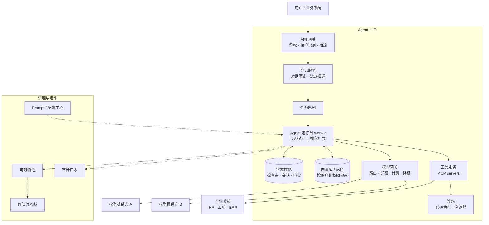
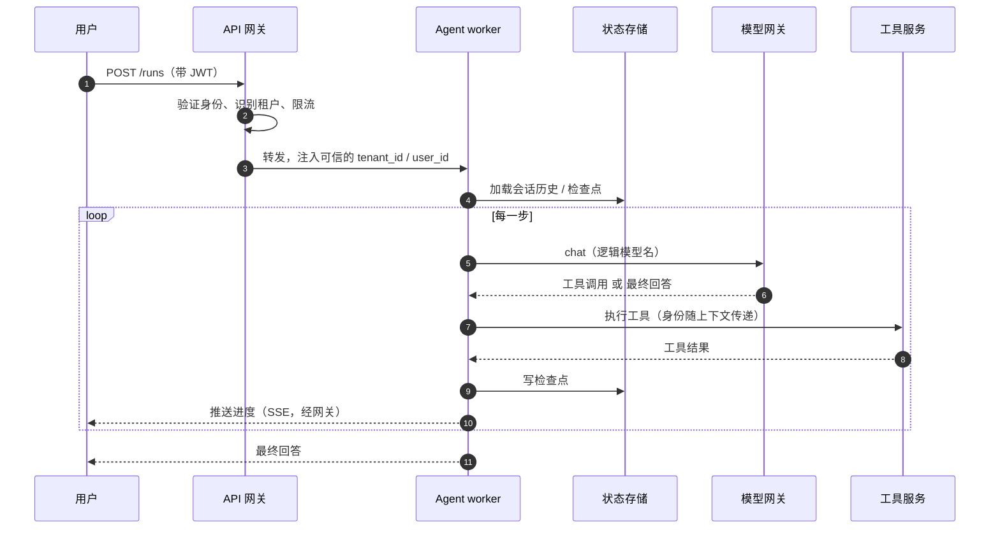
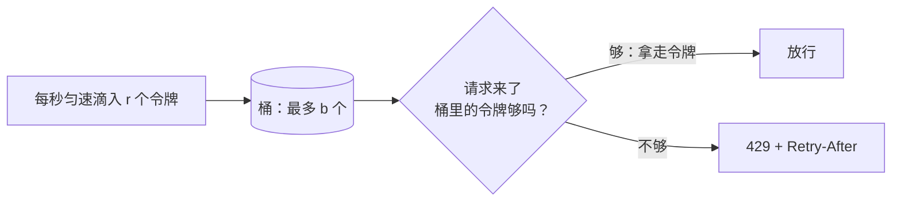

[中文](README.md) | [English](README.en.md)

# 第 09 课：生产架构 —— 从脚本到服务

> 🕐 建议用时：15 分钟 ｜ 🎯 学完你能：画出企业级 Agent 平台的参考架构，说清每个组件解决什么问题；在同步 / 异步、有状态 / 无状态、租户隔离、框架选型、模型网关这几个架构决策上做出合理选择 ｜ 📦 对应源码：本课练习（多租户限流、模型路由）、`agentkit/state.py`、`agentkit/llm.py`，完整的服务示例见 `capstone/server.py`

## 0. 一句话讲清楚

**在家做一桌菜，和开一家每天接待上万人的连锁餐厅，是两件完全不同的事。** 连锁餐厅需要前台接待和排队叫号，需要多个可以互相替班的厨师、写清楚每一桌点了什么的小票、统一的中央采购、食品安全抽检，还要算清每家分店的账。

Agent 也一样。`python agent.py` 在你的电脑上跑得很好，但周一早上 9 点，公司 5000 名员工同时打开 HR 助手：

| 现象 | 缺的是什么 | 在哪里讲 |
|---|---|---|
| 模型提供方返回 429，一半请求失败 | 限流、模型网关的重试与降级 | 本课练习、第 05 课、问题 5 |
| 某个部门的脚本死循环调用，把全公司的配额用光了 | 多租户限流 | 本课练习 |
| "汇总部门上季度请假情况"要跑 2 分钟，网关 60 秒就超时了 | 异步任务 | 问题 1 |
| 滚动发布时，正在跑的 200 个任务全丢了 | 无状态 worker + 检查点 | 问题 2、第 10 课 |
| A 公司的员工看到了 B 公司的制度 | 多租户隔离 | 问题 3、第 12 课 |
| 有人改了 prompt，整个下午所有人都得到错误的回答，回滚还要重新发版 | 配置中心、灰度、回滚 | 第 13 课 |
| 月底财务问：AI 花了多少钱，分别算哪个部门的？ | 成本归因 | 本课 Demo、第 11 课 |

这一课是第二部分的**架构总览**：先给出一张完整的参考架构图，说清每个组件在解决什么问题；再讨论 5 个架构层面的关键决策；更深入的主题（并发、成本、RAG、发布运维）分别在第 10-13 课展开。

## 1. 核心概念

### 1.1 参考架构



### 1.2 组件地图：每个组件解决什么问题

| 组件 | 解决什么问题 | agentkit 里的对应 | 深入 |
|---|---|---|---|
| API 网关 | 验证身份、识别租户、限流、拦截超大请求 | 本课练习 `TenantRateLimiter` | [第 10 课](../10_distributed_concurrency/README.md)（全局限流与背压） |
| 会话服务 | 多轮对话历史、流式推送、断线重连 | `RunResult.history` | 问题 1 |
| 任务队列 | 长任务异步化、削峰填谷、失败重试 | — | [第 10 课](../10_distributed_concurrency/README.md)（租约队列、投递语义） |
| Agent 运行时 worker | 执行 Agent 循环；无状态，可随时扩缩容 | [agent.py](../../agentkit/agent.py) | 问题 2、[第 01 课](../01_agent_loop/README.md) |
| 状态存储 | 检查点、会话、审批状态 | [state.py](../../agentkit/state.py) | [第 05 课](../05_reliability/README.md)、[第 10 课](../10_distributed_concurrency/README.md)（并发写） |
| 向量库 / 记忆 | 知识检索、长期记忆，按租户和权限隔离 | [memory.py](../../agentkit/memory.py) | [第 03 课](../03_context_memory/README.md)、[第 12 课](../12_enterprise_rag/README.md) |
| 模型网关 | 统一接口、密钥托管、路由、配额、计费、降级、缓存 | [llm.py](../../agentkit/llm.py)、[reliability.py](../../agentkit/reliability.py)、本课练习 `choose_model` | 问题 5、[第 11 课](../11_cost_latency/README.md) |
| 工具服务 | 把企业系统包装成标准化的工具（MCP） | [tools.py](../../agentkit/tools.py) | [第 02 课](../02_tools/README.md)、1.5 节 |
| 沙箱 | 隔离执行不可信的代码、浏览网页 | — | [第 06 课](../06_security/README.md) |
| 护栏与权限 | 注入检测、脱敏、最小权限、人工审批 | [guardrails.py](../../agentkit/guardrails.py)、[permissions.py](../../agentkit/permissions.py) | [第 06 课](../06_security/README.md) |
| Prompt / 配置中心 | prompt 和配置的版本管理、灰度发布、回滚 | — | [第 13 课](../13_release_ops/README.md) |
| 可观测性 | 追踪、指标、告警 | [tracing.py](../../agentkit/tracing.py)、[viewer.py](../../agentkit/viewer.py) | [第 07 课](../07_observability/README.md) |
| 评估流水线 | 离线评估、CI 门禁、在线抽样评估 | [evals.py](../../agentkit/evals.py) | [第 08 课](../08_evals/README.md) |
| 审计日志 | 谁、何时、以什么身份、做了什么 | [audit.py](../../agentkit/audit.py) | [第 06 课](../06_security/README.md) |

### 1.3 一次请求的旅程



三个要点：

1. **身份只在网关验证一次，之后作为可信上下文向下传递**（第 02 课的 `ToolContext`）。模型永远没有机会"声明自己是谁"。
2. **每一步都写检查点**，所以任何一个 worker 随时都可以被替换掉（问题 2）。
3. **worker 只认识逻辑模型名**（`mini`、`pro`），背后用哪家的哪个模型由模型网关决定（问题 5）。

### 1.4 两个守门员：限流和模型路由（本课练习）

**限流：令牌桶（token bucket）。** 想象一个桶，最多装 b 个令牌，每秒匀速滴入 r 个，满了就溢出。每个请求要拿走令牌才能通过，拿不到就返回 `429 Too Many Requests`，并在 `Retry-After` 头里告诉客户端多久以后再试。



- **b 决定突发**：空闲一阵后，最多能连续放行多少请求；**r 决定长期平均速率**。
- 和"每分钟最多 N 次"的**固定窗口**相比，令牌桶没有窗口边界的问题：固定窗口在两个窗口交界处，短时间内最多能放进 2N 个请求。
- LLM 场景要同时限两样东西：请求数（RPM）和 token 数（TPM）。一个请求可以按预计消耗的 token 数扣令牌，`try_acquire(tokens=...)` 就是为此设计的。
- **每个租户一个桶**防止"吵闹的邻居"；外层再套一个全局桶，保护上游模型的总配额。多副本部署时，桶的状态要放进 Redis 等共享存储并原子更新，Stripe 的工程博客 *Scaling your API with rate limiters* 介绍过他们基于令牌桶和 Redis 的做法。分布式限流和背压在[第 10 课](../10_distributed_concurrency/README.md)展开。

**模型路由：够用就好。** 大多数请求是简单问题，交给便宜的模型；少数难题才用强模型。本课练习的规则顺序是：**先硬约束（要不要工具调用、上下文放不放得下），再质量要求（复杂度高就只用强模型），最后才在剩下的候选里挑最便宜的**。Demo 里，这样路由后每天的账单比"全部用强模型"低 69%。更进一步的做法是**级联**：先让便宜模型回答，校验不通过再升级到强模型，见[第 11 课](../11_cost_latency/README.md)。注意：路由改变了"谁来回答"，每个会被路由到的模型都要单独跑评估集（第 08 课）。

### 1.5 MCP 与 A2A：两个方向的标准接口

| | MCP（Model Context Protocol） | A2A（Agent2Agent） |
|---|---|---|
| 解决什么 | AI 应用 / Agent 如何**连接工具和数据**（纵向） | **不同 Agent 之间**如何协作（横向），即使它们用不同的框架、来自不同的厂商 |
| 发起与归属 | Anthropic 于 2024 年 11 月发布；2025 年 12 月捐给 Linux Foundation 旗下新成立的 Agentic AI Foundation | Google 于 2025 年 4 月发布；2025 年 6 月捐给 Linux Foundation |
| 核心概念 | server 提供 tools、resources、prompts；AI 应用里的 client 连接 server 并调用 | 用 Agent Card 描述一个 Agent 的能力；Agent 之间以"任务"为单位协作 |
| 在架构里的位置 | 工具服务层：把 HR、工单、ERP 系统包装成 MCP server，任何支持 MCP 的 Agent 都能用 | 你的 Agent 和其他团队、其他公司的 Agent 对接 |

A2A 官网对两者关系的概括是：用 MCP 给单个 Agent 配上它需要的工具，用 A2A 让这些 Agent 彼此协作。企业接入 MCP server 时要把它当作**供应链**来管理：只接入审核过的 server，锁定版本，并且意识到工具描述本身也可能藏着注入指令（第 06 课）。

## 2. 企业问题卡片

### 问题 1：一个任务要跑 2 分钟，结果怎么交给用户？

**场景**：HR 助手里，"帮我汇总部门上季度的请假情况并生成报告"平均要走 8 步、耗时 90 秒，最长 4 分钟，而公司负载均衡器的空闲超时是 60 秒。请假申请还要等主管审批，可能是几小时以后。

**为什么难**：同步请求会被网关超时掐断；用户盯着空白页面等 90 秒，会以为卡住了，于是反复点"重试"，结果重复提交；等待审批的几个小时里，任何网络连接都撑不住。

| 方案 | 怎么做 | 优点 | 缺点 | 适用场景 |
|---|---|---|---|---|
| A. 同步请求-响应 | 一个 HTTP 请求，等 Agent 跑完再返回 | 最简单，客户端最好写 | 超过网关超时就失败；用户干等；长时间占用连接 | 几秒内能完成的问答 |
| B. 流式（SSE） | 服务端用 `text/event-stream` 持续推送事件：token、"正在查询请假记录…"、最终结果 | 体感快，第一个事件很快就到；比 WebSocket 简单；浏览器的 `EventSource` 断线会自动重连，并带上 `Last-Event-ID` | 仍然是一条长连接，受网关和代理的超时、缓冲影响；连接断了任务怎么办需要另外设计 | 交互式对话（几秒到一两分钟） |
| C. 异步任务 | 提交后立刻返回 `202 Accepted` 和 task_id；任务进队列由 worker 执行；客户端轮询状态，或服务端通过 webhook / 消息推送结果 | 不受连接时长限制；可以排队削峰、失败重试；天然支持"暂停等审批" | 架构更复杂（队列、状态存储、通知）；要设计"进行中"的交互 | 长任务、批处理、需要人工审批的流程 |

**怎么选**：按任务时长和是否需要人工介入来定。10 秒内的用 A；交互式对话默认用 B；超过一两分钟、或者可能暂停等审批的用 C。实践中最常见的是 **C + B 组合**：任务异步执行、状态落库，客户端通过 SSE 订阅进度，断线后凭 task_id 重新订阅。记住一点：**流式只是传输方式，任务的生命周期不能绑在一条连接上**，连接断了，任务要继续跑。

**本课实现**：Demo 第 4 节的"暂停 → 状态进检查点 → 另一个 worker 恢复"就是方案 C 的核心机制。[capstone/server.py](../../capstone/server.py) 把它做成了 HTTP API（`POST /runs` 发起、`GET /runs/{run_id}` 轮询、`POST /runs/{run_id}/approval` 审批后恢复）。任务队列、租约和投递语义见[第 10 课](../10_distributed_concurrency/README.md)。

### 问题 2：Agent worker 要不要把会话留在内存里？

**场景**：3 台机器跑 Agent 服务，每天两次滚动发布。某次发布时，200 个进行中的任务全部丢失，其中一些已经替用户提交了请假申请，却没来得及告诉用户结果。还有用户的第二轮对话被负载均衡到了另一台机器，Agent 完全不记得上一轮说过什么。

**为什么难**：状态放在内存里最快、最简单，但机器会重启、会扩缩容。状态放到外部又会带来新问题：两个 worker 同时处理同一个会话怎么办？工具已经执行了、检查点还没来得及写，这时候崩溃怎么办？

| 方案 | 怎么做 | 优点 | 缺点 | 适用场景 |
|---|---|---|---|---|
| A. 有状态 + 粘性会话 | 负载均衡按会话把请求固定到同一台机器，状态存在内存里 | 实现简单，延迟最低 | 重启或发布就丢状态；负载不均；没法随意扩缩容 | 原型、小型内部工具 |
| B. 无状态 worker + 外部状态 | 每一步都把状态写进 Postgres / Redis（检查点），任何 worker 都能接手任何任务 | 横向扩展、滚动发布、崩溃恢复都变得简单 | 每步多一次读写；要处理并发（锁或版本号）和"执行了但没记录"的窗口（幂等） | 大多数生产系统的默认选择 |
| C. 持久化执行引擎 | 用 Temporal 这类引擎：编排逻辑写成 workflow，调模型、调工具写成 activity，引擎记录事件历史，崩溃后重放恢复 | 重试、超时、长时间等待、崩溃恢复都由引擎保证 | 多一套基础设施；有编程约束（workflow 代码必须是确定性的）；学习成本高 | 长流程、跨多个系统、失败代价高（比如涉及资金） |

**怎么选**：默认用 B。流程很长、跨多个系统、失败代价高时考虑 C。A 只用于原型。不管选 B 还是 C，**写操作工具都必须幂等**（第 05 课）：恢复时重放一次工具调用，不能重复扣款、重复提交申请。

**本课实现**：agentkit 用检查点实现方案 B：主循环每走一步都会调用 `checkpointer.save`，`FileCheckpointer` 先写临时文件再原子替换（见 [agentkit/state.py](../../agentkit/state.py)）。Demo 第 4 节里，worker A 暂停后被销毁，worker B 从检查点接手完成，身份、待审批的调用和审批记录都在检查点里。生产中把文件换成 Postgres / Redis；多个 worker 并发写同一个会话的问题（分布式锁、乐观锁、分区串行、fencing token）见[第 10 课](../10_distributed_concurrency/README.md)。

### 问题 3：多租户隔离要做到什么程度？

**场景**：一个 SaaS 形态的 HR 助手服务 300 家企业客户。其中 2 家银行要求"我们的数据不能和其他客户放在一起"，其余大多是看重价格的中小企业。某次事故中，语义缓存没有按租户区分，A 公司的员工收到了 B 公司的年假制度。

**为什么难**：隔离越彻底越安全，但成本和运维负担会随租户数线性增长；共享得越多越省钱，但每一层（数据库、向量库、缓存、记忆、日志、配额）都必须正确地按租户隔离，漏掉一处就是数据泄露。

下表的三种模式借用了 AWS 白皮书 *SaaS Tenant Isolation Strategies* 的术语：

| 方案 | 怎么做 | 优点 | 缺点 | 适用场景 |
|---|---|---|---|---|
| A. 独立部署（silo） | 每个租户一套独立的服务和存储 | 隔离最强，满足严格的合规要求；一个租户出问题不影响别人 | 成本高；几百套部署的升级和运维负担很重 | 少数大客户、强监管行业 |
| B. 共享部署 + 逻辑隔离（pool） | 所有租户共用服务和存储，每条数据都带 tenant_id，所有查询、缓存键、向量检索都按租户过滤 | 成本低、运维简单、资源利用率高 | 隔离全靠代码正确，漏一个过滤条件就泄露；有"吵闹的邻居" | 大量中小租户 |
| C. 混合（bridge） | 默认共享；对大客户或敏感组件单独部署（比如独立的数据库和向量库），计算层仍然共享 | 在成本和隔离之间按需取舍 | 两种模式并存，架构和运维更复杂 | 客户规模差异大的 SaaS |

**怎么选**：先按合规要求分级。有明确"物理隔离"要求的客户用 A，或者至少是数据层独立的 C；其余用 B。选 B 时，隔离必须是**框架层的默认行为**，而不是靠每个开发者记得加过滤条件：身份由网关注入；存储层强制带 tenant_id；缓存键里包含 tenant_id；每个租户有独立的限流桶和配额；成本按租户归因。Agent 系统里特别容易漏掉的隔离点有：长期记忆、语义缓存、检索索引、工具凭证（每个租户应该用自己的凭证访问自己的企业系统）以及 trace 数据。

**本课实现**：练习里的 `TenantRateLimiter` 给每个租户一个独立的桶；agentkit 的 `ToolContext` 由系统注入身份，`MemoryStore` 按租户和用户隔离（第 03 课）。Demo 第 3 节里，同一个问题，不同租户的员工拿到的是各自的数据，成本也按租户记账。权限感知的检索和索引隔离见[第 12 课](../12_enterprise_rag/README.md)。

### 问题 4：自建、用框架，还是用托管平台？

**场景**：一个 5 人团队要在一个季度内上线 3 个内部 Agent（HR、IT、财务报销）。公司有 Kubernetes 平台，但没有专门的 AI 平台团队；安全团队要求所有工具调用都可审计，高危操作必须人工审批。

**为什么难**：框架能省掉 Agent 循环、工具调用、多 Agent 编排这些样板代码，但在权限、审计、数据流这些地方可能限制你；自建的控制力最强，但持久化、追踪、评估都要自己做；托管平台最省运维，但数据和运行环境在别人那里，还有被锁定的风险。

| 方案 | 怎么做 | 优点 | 缺点 | 适用场景 |
|---|---|---|---|---|
| A. 自建 | 自己写 Agent 循环、工具层、钩子，接入公司已有的存储、追踪和鉴权（本课程的 agentkit 就是一个教学版） | 完全可控，和现有基础设施无缝集成，没有多余的抽象 | 持久化执行、并发、评估等都要自己做，维护成本高 | 核心业务，安全合规要求高，需要深度定制 |
| B. 开源框架 | LangGraph、OpenAI Agents SDK、Claude Agent SDK、Google ADK 等（见下表） | 开发快，有社区生态和现成的最佳实践 | 抽象未必合适；版本变化快；出问题时要读框架源码 | 大多数新项目 |
| C. 托管平台 | 由云厂商或模型厂商托管运行时、记忆、身份、观测等。例如 Amazon Bedrock AgentCore（Runtime、Gateway、Memory、Identity、Observability 等组件），Anthropic 的 Managed Agents（托管的 agent 运行环境和沙箱） | 运维最少，能很快获得企业级能力 | 数据和执行环境在第三方；厂商锁定；定制受限 | 没有平台团队、希望尽快上线，并且合规允许 |

常见框架对照（只列确定的事实，细节以各自官方文档为准）：

| | 出品方 | 定位与核心抽象 | 持久化与恢复 | 语言 |
|---|---|---|---|---|
| [LangGraph](https://docs.langchain.com/oss/python/langgraph/overview) | LangChain 团队 | 底层编排框架，用图（节点、边、共享状态）描述 Agent 和工作流 | checkpointer 持久化，支持人工介入后恢复 | Python、JavaScript |
| [OpenAI Agents SDK](https://openai.github.io/openai-agents-python/) | OpenAI（2025 年 3 月发布） | 轻量框架：Agent、handoff（移交）、guardrail、session，内置 tracing | session 管理对话记忆；可以和 Temporal 集成获得持久化执行 | Python、TypeScript |
| [Claude Agent SDK](https://code.claude.com/docs/en/agent-sdk/overview) | Anthropic（2025 年 9 月由 Claude Code SDK 更名而来） | 以库的形式提供 Claude Code 背后的 agent 循环：内置工具、hooks、子 Agent、MCP、权限控制 | session 可以恢复、可以分叉 | Python、TypeScript |
| [Google ADK](https://google.github.io/adk-docs/) | Google（2025 年 4 月发布） | 代码优先的开源框架：多 Agent 组合、工具生态、评估与开发 UI | 提供 session / state 管理 | Python、Java、Go、TypeScript 等 |
| [Temporal](https://docs.temporal.io) | Temporal（开源，MIT 许可） | 不是 Agent 框架，而是持久化执行平台：workflow 编排，activity 执行有副作用的操作 | 事件历史持久化，崩溃后重放恢复 | 多语言 SDK |

**怎么选**：先回答两个问题：这个 Agent 是不是核心业务、对权限和审计有没有特殊要求？团队有没有能力运维一套平台？一般路径是从 B 起步，选和你的模型、语言、云环境匹配的框架；核心业务、定制需求多的，用 A，或者"自建外壳 + 框架内核"；没有平台团队而且合规允许的，考虑 C。不管选哪种，**身份注入、权限、审计、评估这些横切能力都要自己掌握**。框架能帮你省掉"循环怎么写"，省不掉评估集、权限模型和成本控制。

**本课实现**：agentkit 就是方案 A 的教学版。它的核心设计（钩子、检查点、`ToolContext`、追踪、评估）在上面这些框架里都有对应的概念，吃透它，再上手任何一个框架都会很快。

### 问题 5：模型网关自建、用开源，还是用云厂商的？

**场景**：公司同时在用 3 家模型提供方，12 个团队各自在代码里写死了 API key。某天一个 key 泄露到了公开仓库，没人说得清有哪些服务在用它。月底财务问 AI 花了多少钱、分别算哪个部门的，也没人答得上来。

**为什么难**：模型网关位于所有模型调用的关键路径上：它挂了，全公司的 Agent 都停；它慢了，每一步都慢。它要承担的功能又很多：统一接口、密钥托管、路由、配额、计费、降级、缓存、审计。自己做工作量不小，用现成的又要评估性能、数据合规和可扩展性。

| 方案 | 怎么做 | 优点 | 缺点 | 适用场景 |
|---|---|---|---|---|
| A. 自建薄代理 | 自己写一个 OpenAI 兼容的代理：鉴权、转发、记账，再按需加路由和降级 | 完全可控，能和内部的鉴权、计费系统深度集成 | 要自己跟进各家 API 的差异和变化，功能要一点点补 | 有平台团队、需求特殊 |
| B. 开源网关 | 例如 [LiteLLM](https://github.com/BerriAI/litellm)：开源的 Python SDK 加代理服务，用 OpenAI 格式统一访问 100 多家模型提供方，支持虚拟 key、按 key / 用户 / 团队统计花费、预算、限流、负载均衡和降级 | 功能全、上线快；可以自托管，数据不出公司 | 要自己保证高可用；要评估它的性能和安全更新节奏 | 大多数企业的起点 |
| C. 云厂商的 AI 网关 | 例如 Azure API Management 的 AI 网关能力（按 token 限流的 `llm-token-limit` 策略、语义缓存）、Cloudflare AI Gateway（缓存、限流、分析、降级） | 托管、免运维，和同一家云的其他服务集成好 | 绑定云厂商；跨云、多提供方的灵活性受限 | 已经深度使用某一家云 |

**怎么选**："所有模型调用都必须经过网关"这条纪律，比选哪个产品更重要。起步通常用 B 或 C；规模很大或者有特殊需求时，在 B 的基础上二次开发，或者换成 A。不管选哪种，都要做到：业务代码只认识**逻辑模型名**（`mini`、`pro`），真实模型由网关配置决定；网关本身多副本部署；准备好绕过网关直连某家提供方的应急通道。

**本课实现**：agentkit 的 LLM 抽象（第 01 课）让业务代码只依赖 `chat(messages, tools)`；本课练习的 `choose_model` 相当于网关里的路由规则；第 05 课的 `ResilientLLM` 相当于网关里的重试、熔断和降级。你本机 `.env` 指向的 cliproxyapi（`http://localhost:8317/v1`）就是一个 OpenAI 兼容的本地代理：代码只知道一个地址和一个 key，背后接的是哪个模型，由代理决定。

## 3. 从玩具到生产：agentkit 在参考架构里的位置

agentkit 的**设计模式**是生产级的，但它是教学实现：同步、单进程、内存或本地文件存储。上生产时，每一块要换成什么：

| 能力 | agentkit 教学实现 | 生产中换成 |
|---|---|---|
| Agent 循环 | [agent.py](../../agentkit/agent.py)，同步、单进程 | 无状态 worker 集群，由队列驱动（问题 1、2） |
| 检查点 | `InMemoryCheckpointer` / `FileCheckpointer` | Postgres / Redis，带版本号或租约（第 10 课） |
| 工具执行 | 进程内线程 + 超时 | 独立的工具服务（MCP server）+ 沙箱（容器、gVisor、Firecracker）。[tools.py](../../agentkit/tools.py) 的注释里也写了：Python 线程没法被强行终止，高风险工具必须放到独立进程或沙箱里 |
| 模型调用 | `OpenAICompatLLM` + `ResilientLLM` | 模型网关（问题 5） |
| 限流 | 练习里的内存令牌桶 | 网关层统一执行；Redis + 原子脚本实现的分布式令牌桶（第 10 课） |
| 追踪 | `Tracer` + JSONL + 查看器 | OTel SDK + Collector + 后端（第 07 课） |
| Prompt 与配置 | 代码里的字符串 | 配置中心 + 版本管理 + 灰度发布（第 13 课） |
| 审计 | `AuditLog` 写 JSONL | 只能追加、不可篡改的存储（第 06 课） |
| 评估 | `run_eval` | CI 流水线 + 在线抽样评估（第 08 课） |

**练习里的两个设计决策：**

- **令牌桶用"惰性补充"**：不开后台线程定时加令牌，而是每次访问时，根据距上次更新过去了多久，一次性算出该补多少。这样是 O(1) 的，没有定时器，也便于移植成 Redis 的原子脚本。**时钟可注入**，所以测试可以用假时钟，结果完全确定。还有一个容易忽略的边界：时钟倒退时，不能把"上次更新时间"也往回拨，否则时钟走回来时，这段时间会被重复计算、凭空多出令牌。
- **路由找不到合适的强模型时直接报错，而不是悄悄降级到弱模型**。"悄悄降级"会让质量问题无声无息地发生。要降级，应该由调用方显式决定，并记录到 trace 里。

练习里的 `TenantRateLimiter` 把每个租户的桶放在内存 dict 里，而且只增不减。生产中要注意两点：长期不活跃的租户要淘汰（LRU / TTL），否则内存会无限增长；多副本部署时，状态要放到共享存储里。

## 4. 动手：运行 Demo

```bash
python lessons/09_production_architecture/demo.py --offline   # 全部离线（几秒）
python lessons/09_production_architecture/demo.py             # 第 3、4 节调用真实模型（约 30 秒）
```

第 1、2 节是纯模拟（用假时钟），两种模式输出相同。输出节选：

```
  租户      发出    A. 全局一个桶（容量 60，30/秒）   B. 每租户一个桶（按套餐）
  acme      100     放行  54（ 54%）                  放行 100（100%）
  globex    40      放行  20（ 50%）                  放行  40（100%）
  initech   5       放行   1（ 20%）                  放行   5（100%）
  hooli     500     放行 281（ 56%）                  放行  14（  3%）
...
  合计：路由后每天 $36.73，全用强模型每天 $117.62，节省 69%
...
  [hooli/u-carl] 我还剩几天年假？？             → 429 Too Many Requests（Retry-After: 60）
...
worker B：从检查点恢复 run_id = 5af8f12fa345
  工具执行结果：已为 acme/u-alice 提交年假：2026-10-08 起 3 天，审批单号 LV-5af8f1
  审批记录（写在检查点里，供审计）：by=mgr-zhao  approved=True  comment=同意，请做好工作交接  tool=submit_leave
```

**重点观察：**

1. **第 1 节：全局一个桶时，hooli 一个租户就抽干了配额**，付费最多的 acme 有将近一半请求被拒；每租户一个桶时，hooli 只会耗尽自己的额度。
2. **第 2 节：绝大多数流量是简单请求**，交给便宜模型就够了；超出所有模型上下文的请求被直接拒绝，而不是硬塞进去。
3. **第 3 节：同一个问题，不同租户的员工查到的是各自的数据**，因为工具从 `ctx` 拿身份，而不是让模型填；每一分钱都能归到具体的租户上。真实模式下，所有逻辑模型都映射到本机唯一的真实模型，Demo 会打印说明。
4. **第 4 节：worker B 从没见过这次运行，却能接着做完**，身份、待审批的调用、审批记录全都在检查点里。这就是无状态 worker 能随意扩缩容、滚动发布的前提。

## 5. 练习

打开 [exercise.py](exercise.py)，实现：

| 要写的 | 要点 |
|---|---|
| `TokenBucket._refill / try_acquire / retry_after` | 惰性补充、封顶 capacity；不够时不扣令牌；时钟倒退时不回拨；`retry_after` 在永远等不到时返回 `math.inf` |
| `TenantRateLimiter._bucket` | 按需创建、缓存每个租户的桶；未登记的租户用默认套餐；所有桶共用同一个时钟 |
| `choose_model(task, models)` | 能力 → 容量（输入 + 输出）→ 质量 → 成本；成本相同时按列表顺序；候选为空时抛 `NoModelAvailable`，并说明是哪条规则排除的 |

```bash
make lesson N=09
# 等价于 .venv/bin/python -m pytest lessons/09_production_architecture
```

写完后重新跑 Demo，第一行会显示"实现来自 exercise.py（你的实现）"。

## 6. 深入：上线检查清单

每一项后面标注了对应的课程。

**可靠性**
- [ ] 模型调用有超时、重试、降级（05）
- [ ] 步数、token、金额都有上限（05）
- [ ] 每一步写检查点，写操作工具幂等（05、10）
- [ ] 按租户限流，有配额（09、10）

**安全**
- [ ] 身份由网关注入，模型拿不到身份参数（02、09）
- [ ] 最小权限，高危操作人工审批（06）
- [ ] 不可信代码在沙箱里执行（06）
- [ ] 输入、输出、工具输出三道护栏（06）
- [ ] 密钥托管在网关或密钥管理服务里（09）

**可观测**
- [ ] trace 覆盖模型和工具调用（07）
- [ ] 指标看板和告警（07）
- [ ] 用户能报出 run_id，能从投诉反查 trace（07）
- [ ] 有 PII 处理策略（07）

**评估**
- [ ] 评估集 + CI 门禁，安全用例一票否决（08）
- [ ] 线上抽样评估（08）

**发布与运维**
- [ ] prompt 和模型版本化（13）
- [ ] 灰度发布和一键回滚（13）
- [ ] kill switch：出事时能立刻关掉某个工具或整个 Agent（13）

**成本**
- [ ] 按租户、功能归因（09、11）
- [ ] 预算告警（07、11）
- [ ] 模型路由和缓存（09、11）

**合规**
- [ ] 审计日志完整、不可篡改（06）
- [ ] 数据保留期有明确规定（07）
- [ ] 评估过模型提供方的数据处理条款，以及数据出境问题

## 7. 常见坑与反模式

1. **把 Agent 当成普通的同步 API**：长任务被网关超时掐断，用户反复重试，导致重复提交。
2. **状态放在 worker 内存里**：每次发布都丢任务。
3. **让模型或客户端声明身份**：`user_id` 作为工具参数由模型填，或者直接信任客户端的请求头。
4. **只有一个全局限流**：一个租户就能让所有租户一起被 429。
5. **每个团队自己接模型提供方**：key 散落各处，成本算不清，出事时没法统一降级。
6. **共享缓存不带 tenant_id**：语义缓存把 A 公司的答案返回给了 B 公司。
7. **路由规则悄悄降级**：复杂任务被路由到弱模型，质量问题没人发现。
8. **先选框架，再想需求**：框架的抽象和你的权限、审计模型不匹配，最后只能绕着框架写代码。
9. **prompt 写死在代码里**：改一个字都要发版，出了问题也没法快速回滚。

## 8. 面试 & 设计评审问题

<details>
<summary>Q1：画出一个企业级 Agent 平台的架构，说明一次请求经过哪些组件。</summary>

- 网关（鉴权、租户识别、限流）→ 会话服务 → 队列 → 无状态 worker（Agent 循环）→ 模型网关 / 工具服务（MCP）/ 沙箱；
- 状态存储（检查点、会话、审批）、向量库和记忆（按租户、权限隔离）；
- 治理：配置中心、可观测性、评估流水线、审计日志；
- 关键点：身份在网关验证一次后注入上下文；每步写检查点；worker 只认逻辑模型名。
</details>

<details>
<summary>Q2：一个任务可能要跑几分钟，还可能要等人工审批，你怎么设计交互？</summary>

- 异步任务：提交后返回 202 和 task_id，任务进队列，状态落库；
- 进度通过 SSE 推送，断线后凭 task_id 重新订阅，也可以轮询；
- 等待审批时暂停并写检查点，审批通过后由任意 worker 恢复；
- 结果通过站内消息或 webhook 通知；写操作工具幂等，重复提交不会重复执行。
</details>

<details>
<summary>Q3：为什么 worker 要无状态？无状态之后会引入什么新问题？</summary>

- 好处：横向扩展、滚动发布、崩溃恢复都变得简单；
- 新问题：每一步多一次读写；多个 worker 并发处理同一个会话（需要锁、版本号或按会话分区串行）；工具执行了但检查点没写（需要幂等）；
- 流程很长、失败代价高时，可以考虑 Temporal 这类持久化执行引擎。
</details>

<details>
<summary>Q4：300 个租户，其中 2 个是银行，你怎么设计隔离？</summary>

- 混合模式：银行的数据层独立部署（独立的数据库、向量库，甚至独立的密钥），其余租户共享部署、逻辑隔离；
- 共享部分的隔离由框架默认保证：身份由网关注入、存储层强制带 tenant_id、缓存键包含 tenant_id；
- 每个租户独立的限流桶和配额，成本按租户归因；
- 容易漏的地方：记忆、语义缓存、检索索引、工具凭证、trace 数据。
</details>

<details>
<summary>Q5：团队要上线第一个 Agent，你会推荐自建还是用框架？</summary>

- 先看约束：是否是核心业务、权限和审计要求、团队的运维能力、数据合规；
- 一般从成熟的开源框架起步，选和模型、语言、云匹配的；
- 身份注入、权限、审计、评估这些横切能力无论如何都要自己掌握；
- 核心业务、定制需求多的考虑自建或"自建外壳 + 框架内核"；没有平台团队且合规允许，可以考虑托管平台。
</details>

<details>
<summary>Q6：为什么需要模型网关？它应该具备哪些能力？</summary>

- 统一接口，让业务代码和提供方解耦；密钥集中托管，泄露时能统一轮换；
- 路由（按任务选模型）、配额与限流、按租户 / 团队计费；
- 重试、熔断、降级，缓存，审计日志；
- 纪律：所有模型调用必须经过网关；网关本身多副本部署，并保留应急直连通道。
</details>

## 9. 自测清单

- [ ] 我能画出参考架构图，并说出每个组件解决什么问题
- [ ] 我能根据任务时长和是否需要审批，在同步、流式、异步之间做选择
- [ ] 我能解释为什么 worker 要无状态，以及无状态之后要解决哪些新问题
- [ ] 我能说出 silo、pool、bridge 三种隔离模式的取舍，以及 Agent 系统里容易漏掉的隔离点
- [ ] 我能说出选择自建、框架、托管平台的依据
- [ ] 我能说清模型网关的职责，以及为什么业务代码只该认逻辑模型名
- [ ] 我能解释令牌桶的两个参数分别控制什么，以及为什么要每个租户一个桶
- [ ] 我完成了练习：`make lesson N=09` 全部通过

## 10. 纸面设计练习

**需求**：为一家 5000 人的公司设计"HR 政策问答 + 请假申请"Agent。

- 员工分布在 3 个城市，部分制度（比如某些假期规定）各城市不同；
- HR 制度文档约 300 篇，每季度更新一次；
- 请假需要直属主管审批，超过 5 天还需要 HR 审批；
- 高峰期是周一上午 9-10 点，约 800 次对话，每次对话平均 4 轮；
- 员工数据（薪资、病假原因）高度敏感；
- 要求：制度问答 p95 延迟 < 5 秒，回答必须引用制度原文。

**请回答下面这些设计问题**（先自己写，再展开参考要点）：

1. 制度问答和请假申请分别用同步、流式还是异步？
2. 画出你的架构图：用到了参考架构里的哪些组件？
3. 身份和权限：谁能看谁的请假记录？模型在哪一步拿到身份？
4. 请假审批：等待期间状态放在哪里？worker 重启了怎么办？主管一天后才审批怎么办？
5. 容量估算：高峰期每秒多少次模型调用？每月大概多少 token、多少钱？限流怎么设？
6. 模型路由：问答、请假、复杂的政策解读，分别用什么档位的模型？
7. 知识库：制度更新后，怎么保证不再引用旧版本？不同城市的制度差异怎么处理？
8. 评估与可观测：上线前评估集怎么建？上线后看哪些指标？
9. 隐私：病假原因这类敏感信息，在 trace、日志、模型提供方那里分别怎么处理？
10. 发布：prompt 改动怎么灰度？出了问题怎么止血？

<details>
<summary>参考要点（展开前请先自己写一遍）</summary>

1. **交互方式**：制度问答用流式（SSE），p95 < 5 秒的要求主要靠首个事件尽快到达、减少步数来满足；请假申请用异步任务（C + B 组合），提交后进入"等待审批"状态，审批结果通过 IM 或站内信通知。
2. **架构**：网关（SSO / JWT 鉴权、限流）→ 会话服务 → worker（Agent 循环）→ 模型网关；工具服务包括"制度检索"（向量库 + 按城市过滤）、"查询假期余额"、"提交请假"（写操作，需要审批）；状态存储保存检查点和审批状态；配置中心、可观测性、评估、审计齐备。
3. **身份和权限**：身份来自 SSO，由网关注入 `ToolContext`；"查询余额"只能查本人；主管只能看直属下属的申请；HR 可以看全部，但要留审计记录；模型只能看到工具返回的、当前用户有权看到的数据。
4. **审批**：`PauseRun` 后检查点写入 Postgres；审批系统回调时，任意 worker 通过 `approve(run_id, by=审批人)` 恢复；超过 5 天的申请是两级审批，可以建模成两次暂停；设置审批超时提醒和自动过期；`submit_leave` 用 run_id + 调用 id 作为幂等键。
5. **容量估算**（假设每轮平均 2.5 次模型调用，每次输入 3000 token、输出 300 token）：高峰小时 800 × 4 = 3200 轮，约每秒 0.9 轮、2.2 次模型调用；考虑分钟级的突发（3-5 倍），按每秒约 10 次模型调用设计。按利特尔法则（并发数 = 到达率 × 平均耗时），每次调用约 4 秒，需要支撑约 40 个并发的模型调用。假设每天 3000 次对话，每月 22 个工作日：输入约 20 亿 token、输出约 2 亿 token。按本课 Demo 的示例价格，全用 `mini` 每月约 420 美元，全用 `pro` 约 9000 美元，模型路由的价值很明显。限流：每个员工每分钟若干次（防止脚本滥用），每个部门一个桶，外层一个全局桶，对齐模型提供方的配额。
6. **路由**：简单制度问答和查余额用便宜的模型；涉及多条制度交叉解读、跨城市对比的用强模型；提交请假的参数抽取用中档模型，并做严格的 schema 校验。每个会被路由到的模型都要跑一遍评估集。
7. **知识库**：文档带版本号和生效日期，更新时整篇替换并重建索引，旧版本标记为失效，检索时只取生效的版本；文档带城市标签，检索时按员工所在城市过滤（身份信息来自 ctx）；回答必须附带引用，引用要校验确实来自检索结果（第 12 课）。
8. **评估与可观测**：上线前由 HR 编写 50 条核心用例，覆盖三个城市的差异、边界（假期余额不足、跨年度请假）和对抗（冒充主管自己审批、查询别人的病假原因）；安全用例一票否决。上线后看的指标：成功率、p95 延迟、引用校验通过率、转人工率、每次对话成本、审批平均时长。
9. **隐私**：病假原因只存在业务系统里，Agent 不需要读取它（最小权限）；trace 默认不记录内容，工具参数脱敏；确认模型提供方的数据处理条款（是否用于训练、保留多久、存在哪个地区），敏感场景可以考虑私有化部署的模型。
10. **发布**：prompt 放在配置中心并做版本管理，改动先跑评估门禁，再按员工 ID 哈希灰度 5% → 25% → 100%，并盯住指标；准备 kill switch（一键关闭"提交请假"工具，退回人工流程）和一键回滚到上一个 prompt 版本（第 13 课）。
</details>

## 延伸阅读

- [Anthropic · Building effective agents](https://www.anthropic.com/engineering/building-effective-agents)：什么时候用 workflow，什么时候用 Agent，以及"能简单就别复杂"
- [Model Context Protocol 官网](https://modelcontextprotocol.io)、[MCP 加入 Agentic AI Foundation](https://blog.modelcontextprotocol.io/posts/2025-12-09-mcp-joins-agentic-ai-foundation/)
- [A2A Protocol 官网](https://a2a-protocol.org)、[Google Cloud 将 A2A 捐给 Linux Foundation](https://developers.googleblog.com/en/google-cloud-donates-a2a-to-linux-foundation/)
- [AWS 白皮书 · SaaS Tenant Isolation Strategies](https://docs.aws.amazon.com/whitepapers/latest/saas-tenant-isolation-strategies/saas-tenant-isolation-strategies.html)：silo / pool / bridge 隔离模式
- [Stripe · Scaling your API with rate limiters](https://stripe.com/blog/rate-limiters)：令牌桶限流在生产中的实践
- [LiteLLM](https://github.com/BerriAI/litellm)：开源的 LLM 网关
- [Temporal 文档](https://docs.temporal.io)：持久化执行（durable execution）
