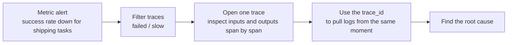
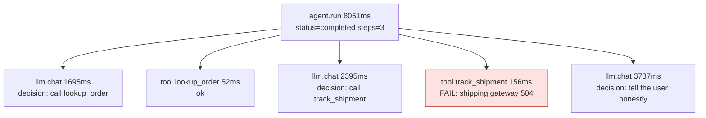
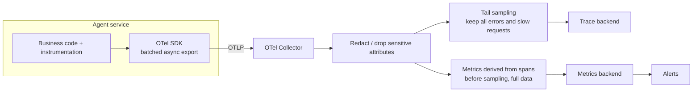
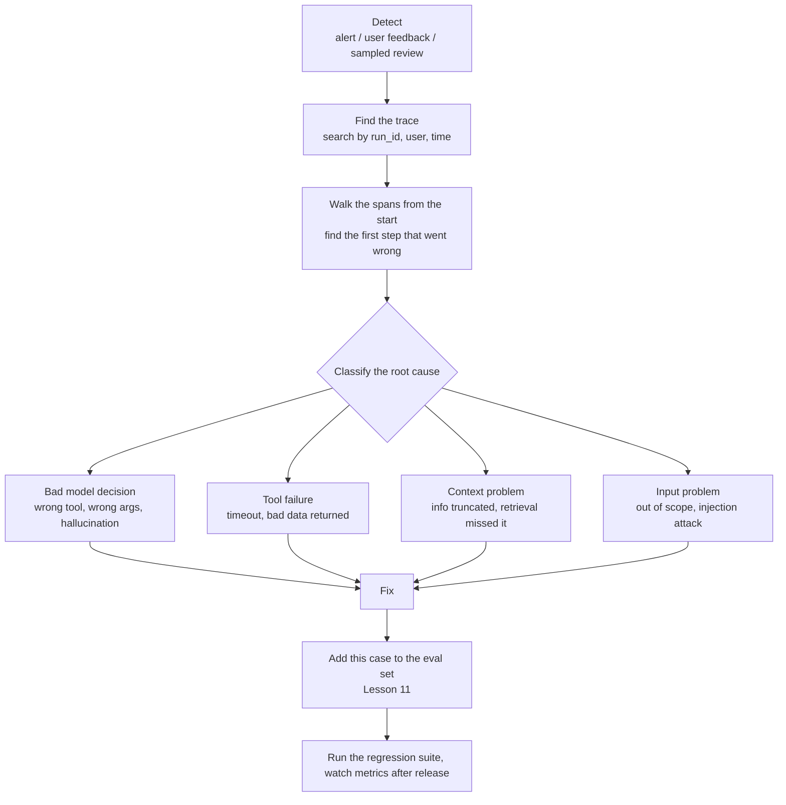

[中文](README.md) | [English](README.en.md)

# Lesson 10: Observability — seeing what your agent is thinking

> 🕐 Time: 15 min | 🎯 You'll be able to: add tracing to an agent, use metrics to spot problems and traces to find root causes, and make sound trade-offs on sampling, privacy, tooling, and alerting | 📦 Source: `agentkit/tracing.py`, `agentkit/agent.py`, `agentkit/viewer.py`
>
> 📖 Primary reading: [Dapper, a Large-Scale Distributed Systems Tracing Infrastructure](https://research.google/pubs/dapper-a-large-scale-distributed-systems-tracing-infrastructure/) (Sigelman et al., 2010) — Google's technical report on its distributed tracing system, whose trace-tree/span model was carried on by Zipkin, OpenTelemetry, and others; focus on §2 (trace trees and spans, sampling, security and privacy) and §4 (tracing overhead and adaptive sampling), and compare them with this lesson's sampling and privacy trade-offs.

## 0. In one sentence

**Why do airplanes carry a black box?** Because when something goes wrong, nobody can reliably reconstruct what just happened. Agents are no different. Users only say "it gave the wrong answer," and the agent itself won't remember which tool it called, what came back, or why it answered the way it did.

Picture Monday morning. The head of customer support walks over:

> "Last Friday afternoon we got a pile of complaints. Whenever users asked about shipping, the agent said it 'couldn't find anything.'"

You open the logs and see nothing but line after line of `POST /chat 200 5.8s`. The problem could be any of these:

1. The model never called the shipping tool and made up "couldn't find anything." (hallucination)
2. It called the tool, but the shipping API timed out. (downstream failure)
3. The tool returned the right result, but the model misread it. (model comprehension)
4. The conversation got too long, was truncated, and the order number was lost. (context problem)

Each cause has a completely different fix: change the prompt, fix the tool, add retries, or change the context strategy. **Without tracing, you're guessing.**

Agents need observability **more** than ordinary backend services do. An ordinary service's execution path lives in its code: read the code and you know what it will do. An agent's path is **decided by the model at runtime**. The same question might take 3 steps today and 7 tomorrow. The only way to know what an agent actually did is to look at the trace.

## 1. Core concepts

### 1.1 The three pillars: what logs, metrics, and traces each answer

| | Metrics | Traces | Logs |
|---|---|---|---|
| In plain words | Numbers on a dashboard | The full "dashcam recording" of one request | One thing that happened at one moment |
| Question it answers | **Is something wrong? How bad is it?** | **What exactly happened this time? Where did the time go?** | **What were the details at that moment?** |
| Agent example | Success rate drops from 92% to 81%; p95 rises from 8s to 20s; cost per task doubles | Step 2 called `track_shipment` with `YT2002` and got a 504 timeout; in step 3 the model decided to give up | An approver approved a refund; prompt config v12 was hot-reloaded; a stack trace |
| Cost | Low (pre-aggregated) | High (one tree per request) | Medium |
| Best for | Alerting, trends, SLOs | Debugging, postmortems, performance analysis | Auditing, discrete events |

Use all three together. Troubleshooting moves from the big picture down to a single point. The prerequisite is that **all three can be joined on `trace_id`**. A log line without a trace_id is like a medical record without the patient's name.



### 1.2 Traces and spans: turning one run into a tree

- **Trace**: one complete run, identified by a `trace_id`.
- **Span**: one step within the run, such as a model call or a tool call. Each span has a `span_id`, a `parent_id` pointing to its parent, start and end times, attributes, and a status (ok / error).

Here is a trace from the Section 4 demo, run against a real model ("Can you check the shipping status of order A1002?"):



Lay it out on a timeline and you get a waterfall chart that shows at a glance where the time went. In this trace, model calls take 97% of the time. If you want a faster agent, cut the number of steps first; optimizing tools buys you far less.

```
agent.run            |████████████████████████████████████████| 8051ms
  llm.chat           |████████                                | 1695ms
  tool.lookup_order  |        ▏                               |   52ms
  llm.chat           |         ████████████                   | 2395ms
  tool.track_shipment|                     ▏                  |  156ms
  llm.chat           |                      ██████████████████| 3737ms
```

We use a tree instead of a flat list of events because agent steps nest. In a multi-agent setup, a single tool call made by the supervisor contains an entire run of a specialist agent (`agent_as_tool` from Lesson 06). A tree expresses "who contains whom" directly, and lets you break latency down level by level.

### 1.3 OpenTelemetry and the GenAI semantic conventions

**OpenTelemetry (OTel)** is an open-source observability standard under the CNCF. It includes a unified API/SDK and a wire protocol, OTLP. Instrument with OTel and you can send data to any backend that speaks OTLP; switching backends doesn't touch your business code.

A protocol alone isn't enough. Attribute names have to agree too: if you call it `model` and I call it `llm_name`, the backend still can't make sense of it. **Semantic conventions** define what attributes are called. OTel defines a set of `gen_ai.*` attributes for generative AI. The common ones:

| Attribute | Meaning | Example |
|---|---|---|
| `gen_ai.operation.name` | Operation type | `chat`, `execute_tool`, `invoke_agent` |
| `gen_ai.provider.name` | Model provider | `openai`, `anthropic` |
| `gen_ai.request.model` / `gen_ai.response.model` | Requested model / model that actually responded | Can differ after a gateway fallback |
| `gen_ai.usage.input_tokens` / `gen_ai.usage.output_tokens` | Input / output token count | `524` / `39` |
| `gen_ai.response.finish_reasons` | Finish reasons | `["stop"]`, `["length"]` |
| `gen_ai.conversation.id` / `gen_ai.agent.name` | Conversation ID / agent name | |
| `gen_ai.tool.name` / `gen_ai.tool.call.id` | Tool name / tool call ID | `track_shipment` |
| `error.type` | Error category (a general OTel attribute) | `timeout`, `500` |

Span naming conventions: model calls are named `chat gpt-5.5` (`{operation} {model}`), tools `execute_tool {tool name}`, and agents `invoke_agent {agent name}`. Common metrics include `gen_ai.client.operation.duration` (a histogram of operation duration) and, for streaming, `gen_ai.client.operation.time_to_first_chunk` (time until the first chunk arrives).

> ⚠️ **These conventions are still changing.** As of September 2026, the GenAI semantic conventions are still in **Development** status, and they have moved out of the main OTel repository into a dedicated one, [open-telemetry/semantic-conventions-genai](https://github.com/open-telemetry/semantic-conventions-genai). Renames have already happened: `gen_ai.system` (v1.36 and earlier) became `gen_ai.provider.name` in v1.37, and token usage, once a single histogram called `gen_ai.client.token.usage`, is now split into several counters such as `gen_ai.client.inference.usage.input_tokens`. In production, **pin the convention version that matches your SDK**.

agentkit simplifies things for teaching. Here's how it maps to the standard:

| agentkit | OTel GenAI conventions |
|---|---|
| spans `agent.run` / `llm.chat` / `tool.<tool name>` | `invoke_agent {agent}` / `chat {model}` / `execute_tool {tool}` |
| attributes `tool.name`, `tool.arguments`, `tool.result_preview` | `gen_ai.tool.name`, `gen_ai.tool.call.arguments`, `gen_ai.tool.call.result` (the last two are **Opt-In** in the standard and not captured by default) |
| attributes `gen_ai.request.model`, `gen_ai.response.model`, `gen_ai.usage.*` | Same names |
| attributes `agent.status`, `agent.steps`, `agent.cost_usd` | Not in the standard. These are custom business attributes, which OTel allows; give them a namespace prefix |

### 1.4 What every run should record, at minimum

| Category | What | Why |
|---|---|---|
| Model calls | Requested model, response model, tokens, latency, finish reason | You need these for cost, latency, and spotting truncated output (`length`) |
| Decisions | Whether the model "called these tools" or "gave a final answer" at this step | Unique to agents, and the most important debugging signal |
| Tool calls | Tool name, arguments (redacted), success or failure, error type, latency | Tools are the most common source of agent failures |
| Run summary | Final status, steps, total tokens, cost, stop reason | One line tells you whether this run was healthy |
| Versions | Prompt version, model version, code version | When metrics get worse, you can tie the problem to a specific change |
| Identity and correlation | run_id, tenant, (hashed) user ID, conversation ID | Go from a user complaint back to the trace; analyze by tenant |

How much to record, how to store it, and who gets to see it are the trade-offs the problem cards below work through.

## 2. Enterprise problem cards

### Problem 1: Trace storage is costing almost as much as the model bill

**Scenario**: An e-commerce customer-service agent handles 200,000 runs a day, averaging 25 spans per run. With metadata only, each span is about 1 KB, roughly 5 GB a day. Later, to make debugging easier, the team turned on full prompt recording (multi-turn conversations plus retrieval results). That added about 60 KB per run: about 17 GB a day, 500 GB a month, and queries kept getting slower.

**Why it's hard**: The intuitive fix is "randomly keep 10%." But failed requests are only 2% of traffic to begin with. After random sampling, the one you most want to see (say, the run behind a specific user's complaint) has a 90% chance of already being gone. A subtler problem: if you then compute the success rate from the sampled traces, that number is biased too.

| Option | How | Pros | Cons | Best for |
|---|---|---|---|---|
| A. Keep everything | Store every trace; expire by age | Simplest; any trace can be found | High volume, expensive; slow queries | Up to about 10,000 runs a day; dev and test environments |
| B. Head-based sampling | Decide at the start of each request whether to record it, by a fixed ratio | Easy: set one ratio in the SDK; lowest overhead | Failed and slow requests get dropped at the same rate as everything else | You only care about overall trends, not individual investigations |
| C. Tail-based sampling | Decide after the whole trace finishes: keep 100% of errors, 100% of slow requests, 100% of those with user feedback, and 5% of the rest | Keeps the most valuable traces while cutting storage dramatically | The collector has to buffer whole traces first, so deployment is more complex; the OTel Collector's `tail_sampling` processor does exactly this | The default once you're at scale |

**How to choose**: Up to 10,000 runs a day, just use A. At scale, use C, and separate "content" (prompts, results) from "metadata" (latency, tokens, status): keep metadata longer, and keep content only for traces that were sampled. **Whichever you pick, compute metrics before sampling, from the full data.** Tail sampling keeps 100% of errors but only 5% of successes, so a success rate computed from the remaining traces will be badly understated. B only fits cases where "watching trends is enough."

**In this lesson**: agentkit's `Tracer` exports everything (option A), which is fine for learning and small scale. The exercise's `compute_metrics` shows how to derive metrics from spans; in production that step must run before sampling, for example with the OTel Collector's `spanmetrics` connector. Upgrade path: OTel SDK (batched async export) → OTel Collector (tail sampling + derived metrics) → trace backend.

### Problem 2: Users' phone numbers and national ID numbers are sitting in your traces

**Scenario**: A customer-service agent sends its traces to a third-party SaaS platform. 200 engineers have read access, and data is kept for 90 days. A compliance review finds that within 30 days, 120,000 spans had plaintext mobile numbers in their tool arguments, and some users had pasted their resident ID numbers (China's national ID) straight into the chat.

**Why it's hard**: Record nothing and you can't debug issues like "the user says the order can't be found," because you can't even see the order number. Record it and you have a compliance risk. Regex redaction only covers fixed-format data (phone numbers, ID numbers); it can't catch free text such as names and addresses.

| Option | How | Pros | Cons | Best for |
|---|---|---|---|---|
| A. Don't record content by default | Spans carry metadata only: tool name, latency, tokens, error type | Safest; also what the OTel GenAI conventions require by default (content capture is opt-in) | When debugging, you can't see exactly what the input was | The default starting point for every system |
| B. Redact before export | Handle it centrally in the exporter / Collector: masking (`138****5678`), keyed hashing (HMAC), or replacement with `[phone redacted]` | Keeps most of your debugging ability; handled centrally at the exit point instead of relying on every developer to remember | Regexes miss things; free text needs an NER model | Most teams that need to see content to debug |
| C. Externalize content + tiered access | Store content in a separate encrypted store and put only a reference on the span; viewing the original needs separate authorization and leaves an audit record | Meets strict compliance requirements; ops staff and data are managed by tier | More complex architecture; one extra step when debugging | Heavily regulated industries such as finance and healthcare |

**How to choose**: Default to A. When you truly need to see content, B is the minimum, and it must happen centrally at the export layer, not in business code. Heavily regulated industries add C on top, which is also what OTel recommends for production. When you need to correlate multiple requests from the same user, use HMAC, not plain SHA-256. Chinese mobile numbers are only 11 digits with a limited set of prefixes, so an attacker can hash every possible number and reverse the lookup (a rainbow table). HMAC uses a key only you know, which rules out that kind of brute force.

**In this lesson**: Before agentkit records tool arguments (first 500 characters) and the result preview (first 200 characters), it calls `redact_pii` from Lesson 09. This is option B's first line of defense, placed at the instrumentation point (see Section 3.2). Section 5 of the demo shows what it catches and what it misses: phone numbers and emails get replaced, while names and addresses pass through untouched. In production, add a second safety net in the OTel Collector with an attributes processor, covering attributes that business code adds on its own, exception messages, and so on. The order of truncation and redaction matters too: **redact first, then truncate**. Otherwise a number cut off right at the boundary is only half there, and the regex won't match it.

### Problem 3: Build or buy your observability platform?

**Scenario**: A 20-person AI team. The company already runs an OTel stack of Prometheus + Grafana + Jaeger. The business side also wants a UI where they can "read the conversations," plus prompt management and online evaluation. Legal requires that user data never leave the country.

**Why it's hard**: General-purpose tracing backends don't understand LLM semantics: no conversation view, no evaluation features. LLM-specific platforms are feature-rich but may be SaaS, which means data leaves the company. And running several systems side by side means duplicate instrumentation and fragmented data.

| Option | How | Pros | Cons | Best for |
|---|---|---|---|---|
| A. General-purpose OTel backend | Jaeger or Grafana Tempo for traces, Prometheus for metrics | Reuses the existing stack and ops expertise; you keep your data | Doesn't understand LLM semantics: no conversation view, prompt management, or evals | You already have a mature OTel stack and mostly care about performance and availability |
| B. Self-hosted open-source LLM platform | [Langfuse](https://langfuse.com/) (MIT-licensed core), [Arize Phoenix](https://github.com/Arize-ai/phoenix) (built on OpenTelemetry and OpenInference) | LLM-specific features such as conversation views and evals; data stays on your network | You run it yourself (databases, upgrades, scaling) | Data can't leave the company, but you need LLM-specific features |
| C. SaaS platform | [LangSmith](https://docs.langchain.com/langsmith), Langfuse Cloud, and others | Works out of the box; fastest to get started | Data leaves the company; usage-based pricing gets expensive at scale; vendor lock-in risk | Early-stage teams with light compliance requirements |

**How to choose**: Look at data compliance first; it often decides outright whether C is even an option. Then **choose your instrumentation standard before you choose a backend**. Instrument with OTel and the GenAI conventions and the backend becomes swappable. You can even send to A and B at the same time (A for performance, B for conversations and evals). Avoid making business code depend directly on any platform's proprietary SDK.

**In this lesson**: [agentkit/tracing.py](../../agentkit/tracing.py) is a zero-dependency teaching Tracer that exports JSONL, and [agentkit/viewer.py](../../agentkit/viewer.py) renders that JSONL into a single-file HTML viewer (Section 4). They're meant for learning and local debugging. In production, switch to the OTel SDK and rename attributes using the mapping table in Section 1.3.

### Problem 4: So many alerts that on-call starts ignoring them

**Scenario**: In its first month after launch, the agent generates about 150 alerts a week. Ninety percent of them are "success rate < 90%" during overnight low traffic (3 requests total, 1 failed), plus "awaiting approval" being counted as an error. Then one day a tool's schema changes and `invalid_args` errors spike. That alert drowns in the noise, and the problem is only discovered two hours later through user complaints.

**Why it's hard**: Agent traffic has pronounced peaks and troughs, so fixed thresholds are guaranteed to misfire at low traffic. Agents also have states like "paused" and "denied" that aren't failures. Hardest of all is model behavior drift: it raises no errors at all, so error-rate alerts can't catch it.

| Option | How | Pros | Cons | Best for |
|---|---|---|---|---|
| A. Fixed threshold | Alert immediately when error rate > 10% | Simple | False alarms at low traffic, not sensitive enough at high traffic | Prototypes only |
| B. Threshold + minimum volume + duration | E.g. "success rate < 90% over 5 minutes, with > 50 requests, sustained for 10 minutes" | Simple and effective; removes most of the noise | Thresholds are tuned by experience; insensitive to slow degradation | The default when starting out |
| C. SLO burn-rate alerts | Define an SLO (e.g. "≥ 95% success over 30 days") and alert on how fast the error budget is being consumed | Tied directly to user impact; catches both fast and slow burns | You need a well-defined SLO first; harder to understand | Core services with explicit SLOs |
| D. Distribution drift detection | Monitor how average steps, tool-call distribution, output length, and refusal rate change versus last week | Catches degradation that raises no errors, e.g. a model provider silently updating its model | More prone to false positives; suited to a daily report, not to waking people up at night | Agent-specific; a complement to B/C |

**How to choose**: Start with B. Once you have explicit SLOs, use C for alerts that page on-call, and D for a daily report. Two general principles: **alert on symptoms, not causes** (a principle from Google's SRE book: an alert should mean "users are affected," not "some machine's CPU is high"), and pauses, approval denials, and budget stops **do not count as errors**. Examples of good agent alerts: hourly cost exceeds 3× the baseline for the same time of day (an infinite loop or abuse); a single tool's error rate is > 20% with > 20 calls; more than 5% of runs hit `max_steps`.

**In this lesson**: In [agentkit/tracing.py](../../agentkit/tracing.py), `PauseRun` / `StopRun` carry `trace_as_error = False`, so they are only marked as `interrupted` and never recorded as errors. The exercise's `compute_metrics` breaks error rates down by tool, which is the data foundation for per-tool error-rate alerts.

### Problem 5: 99% success rate, yet users are complaining

**Scenario**: The dashboard shows a 99.2% task success rate, but the head of customer support reports that user satisfaction has dropped from 4.5 to 3.8. The investigation finds that 30% of calls to the shipping API time out, the agent politely replies "I can't look that up right now," and every one of those runs has status `completed`.

**Why it's hard**: `completed` only means the agent finished normally, not that the problem was solved. A polite refusal and a plausible but wrong answer both count as "success" in run status. And whether the problem was actually solved is hard to judge automatically.

| Option | How | Pros | Cons | Best for |
|---|---|---|---|---|
| A. Run status | Measure the share of runs with `status == completed` | Free, real-time, covers all traffic | Only tells you "did it crash," not "was the answer right" | The baseline health metric |
| B. Explicit user signals | 👍/👎, asking the same question again, asking for a human | Directly reflects how users feel | Sparse (most users never click), biased (unhappy users click more), delayed | A signal source for finding problems |
| C. Online sampled evaluation | Each day, sample 1-5% of production traces and score them with an LLM-as-judge or humans (Lesson 11) | Measures "was the answer right" with controllable coverage | Costs money; judges need calibration | The main source of quality metrics |
| D. Business outcome metrics | Was the ticket reopened, did the refund actually land, did the user come back with the same question within 24 hours | Closest to "actually solved" | Requires integrating with business systems; long delay | North-star metric |

**How to choose**: A is only the floor, and you must read it together with **per-tool error rates**. On top of that, use B to find problems, C to measure quality, and D as the ultimate north-star metric. At a minimum, have A + per-tool error rates + C. Every bad case you find should flow back into the eval set from Lesson 11.

**In this lesson**: Section 3 of the demo reproduces this scenario: a 100% success rate, while `track_shipment` has a 67% error rate. The exercise's `compute_metrics` outputs both the overall success rate and per-tool error rates.

### Problem 6: Call chains across agents and services don't connect

**Scenario**: A supervisor agent calls a specialist agent (deployed in a separate service), which in turn calls an MCP server. While investigating a 40-second slow request, you find three unrelated traces in the backend, and have to guess from timestamps which ones belong to the same request.

**Why it's hard**: Trace context can get lost at every boundary: thread pools (Python's `contextvars` are **not** propagated automatically into `ThreadPoolExecutor` worker threads), async tasks, HTTP calls, message queues, and waits of several hours for approval.

| Option | How | Pros | Cons | Best for |
|---|---|---|---|---|
| A. In-process context propagation | Keep the current span in `contextvars`; across threads, use `contextvars.copy_context().run(...)` | Automatic nesting, invisible to callers | Every thread or coroutine boundary has to be handled; miss one and the chain breaks | Within a single process (mandatory) |
| B. Propagate traceparent across services | Following the [W3C Trace Context](https://www.w3.org/TR/trace-context/) standard, pass `traceparent` in HTTP / MCP / message headers | Stitches a single tree together across services and languages | Every service in the chain has to support it | Microservices and multi-agent services (mandatory) |
| C. Correlate by business ID | Write run_id and conversation_id onto every span and search by ID afterward | Simple and reliable; humans can search it directly | You can't see parent-child hierarchy or timing | Always have it, as a fallback |
| D. Span links | A new trace links back to the original trace | Fits async work and long pauses without one trace spanning hours | Backend support for displaying links is uneven | Queue consumers, resuming after approval |

**How to choose**: A + B are the foundation: they guarantee one trace_id per request. Always have C, because users who complain report a run_id, not a trace_id. Use D for queues and long pauses. Before launch, run an end-to-end check: send one complete request and confirm that exactly one trace_id shows up in the backend.

**In this lesson**: agentkit's `Tracer` keeps a span stack in `contextvars` (option A). When `ToolRegistry.execute` runs a tool in a thread pool, it calls `pool.submit(contextvars.copy_context().run, t.fn, **kwargs)` to carry the context into the tool thread, so a sub-agent called via `agent_as_tool` nests under the parent span (see [agentkit/tools.py](../../agentkit/tools.py)). A run resumed from a checkpoint gets a new root span, `agent.resume`, correlated by run_id (option C), and the viewer stitches together all traces with the same run_id. You can check this yourself with the code below:

```python
from agentkit import Agent, ScriptedLLM, Tracer, call_tool, reply
from agentkit.workflows import agent_as_tool

t = Tracer()
expert = Agent(ScriptedLLM([reply("Expert answer")]), [], name="expert", tracer=t)
boss = Agent(ScriptedLLM([call_tool("ask_expert", task="x"), reply("Done")]),
             [agent_as_tool(expert, "ask_expert", "Expert")], name="boss", tracer=t)
boss.run("hi")
print(len(t.traces))  # agentkit prints 1: the sub-agent nests inside the parent trace; 2 means the context broke at the thread boundary
```

## 3. From toy to production: building it layer by layer

### 3.1 The smallest span: a timed `with` block

At its core, [agentkit/tracing.py](../../agentkit/tracing.py) is a single context manager:

```python
@contextmanager
def span(self, name: str, **attrs) -> Iterator[Span]:
    stack = self._stack.get()
    parent = stack[-1] if stack else None
    s = Span(
        name=name,
        trace_id=parent.trace_id if parent else uuid.uuid4().hex[:16],
        span_id=uuid.uuid4().hex[:8],
        parent_id=parent.span_id if parent else None,
        start=time.time(),
        attrs=dict(attrs),
    )
    ...
    token = self._stack.set(stack + (s,))
    try:
        yield s
    except Exception as e:
        if getattr(e, "trace_as_error", True):
            s.status = "error"
            s.attrs["error"] = f"{type(e).__name__}: {e}"
        else:  # a pause / deliberate stop is not a failure; just mark it
            s.attrs["interrupted"] = type(e).__name__
        raise
    finally:
        s.end = time.time()
        self._stack.reset(token)
        if parent is None:
            self.traces.append(s)
            if self.exporter:
                self.exporter(s)
```

1. **`contextvars` holds the "current span stack."** Nested `with tracer.span(...)` blocks find their parent automatically, so you never pass `parent` down by hand. It isolates correctly across threads and asyncio: two concurrent requests each get their own stack. The OTel Python SDK works the same way.
2. **Pauses and stops are not errors** (see Problem 4).
3. **Record the exception, then re-`raise` it.** Tracing only observes; it must never change program behavior.
4. **When the root span ends, the whole tree goes to the exporter.** That's simple, but a run that waits 3 hours for approval stays completely invisible to the backend until it finishes. The OTel SDK's `BatchSpanProcessor` instead queues each span as soon as it ends and exports in async batches.

### 3.2 Where the agent is instrumented

[agentkit/agent.py](../../agentkit/agent.py) creates spans in three places: the whole run, each model call, and each tool call.

```python
with self.tracer.span(
    "llm.chat",
    **{"gen_ai.request.model": getattr(self.llm, "model", "?"), "step": state.step, "messages": len(state.messages)},
) as span:
    response = self.llm.chat(state.messages, tools=tools)
    span.set(
        **{
            "gen_ai.response.model": response.model,
            "gen_ai.usage.input_tokens": response.usage.input_tokens,
            "gen_ai.usage.output_tokens": response.usage.output_tokens,
            "finish_reason": response.finish_reason,
            "result": ("tool_calls: " + ", ".join(c.name for c in response.tool_calls))
            if response.tool_calls
            else "final_answer",
        }
    )
```

- **Record both the requested model and the response model.** Lesson 08's `ResilientLLM` falls back to a backup model, and the model gateway in Lesson 12 can rewrite routing. Record only the requested model, and the backup model's quality problems get blamed on the primary.
- **`result` records the model's decision at this step.** An ordinary service's decisions live in code; an agent's decisions are made on the fly by the model, so you have to write them down.
- **`messages` records the context length.** More steps mean longer context, and latency and cost rise with it.

```python
with self.tracer.span(
    f"tool.{call.name}",
    **{"tool.name": call.name, "tool.arguments": redact_pii(call.arguments)[:500], "tool.risk": t.risk if t else None},
) as span:
    ...  # permission hooks → run the tool → after_tool hooks
    span.set(**{"tool.ok": result.ok, "tool.error_type": result.error_type, "tool.result_preview": redact_pii(result.content)[:200]})
```

- **Arguments are truncated to 500 characters, and only a 200-character preview of the result is kept**, so large payloads can't blow up the span (most backends cap the length of a single attribute value).
- **Redact before recording.** More people usually have access to the tracing system than to the business database, so both arguments and result previews go through `redact_pii` first. Regex redaction has blind spots; see Problem 2.
- `tool.result_preview` is recorded **after** the `after_tool` hooks run. If a hook redacts or wraps the output in `after_tool` (for example, Lesson 09's `ToolOutputGuard`), the trace shows the processed version too.
- **`tool.error_type` tells you who should fix it**; see the table in Section 6.1.

When the run finishes, `_annotate` writes the status, step count, cost, and token totals onto the root span. Note that the tokens on the root span are **totals**: add every `llm.chat` on top of them and you double-count. One of the exercise tests exists specifically to catch this mistake.

### 3.3 Export: flat JSONL

`jsonl_exporter` flattens the tree into one JSON line per span, with `parent_id` pointing to the parent:

```python
def export(root: Span) -> None:
    with path.open("a", encoding="utf-8") as f:
        for s in root.walk():
            f.write(json.dumps(s.to_dict(), ensure_ascii=False, default=str) + "\n")
```

- **Append-only**: if the process crashes, you lose at most the last line; the file as a whole never gets corrupted.
- **Streamable**: `grep`, `jq`, and log shippers can all read it line by line.
- **Same data shape as OTLP**: OTel also transmits a flat list of spans, and the backend assembles the tree from parent span IDs.

After running the demo, a single command finds every failed tool call:

```bash
grep '"tool.ok": false' lessons/10_observability/traces/demo.jsonl
```

There are two ways to connect to OTel in production. One is to switch to the OTel SDK directly (`tracer.start_as_current_span(...)` maps almost one-to-one onto `Tracer.span()`). The other is to keep agentkit's Tracer and write an exporter adapter that, when the root span ends, rebuilds the spans with the OTel SDK using the original start and end times (`start_span` and `end` both accept explicit timestamps, in nanoseconds). You can also use auto-instrumentation from **OpenInference** (maintained by Arize) or **OpenLLMetry** (maintained by Traceloop); both produce OTel spans. The full pipeline:



## 4. Hands-on: run the demo

```bash
python lessons/10_observability/demo.py --offline   # scripted offline run, no API key needed (about 6 seconds)
python lessons/10_observability/demo.py             # real model (about 25 seconds)
```

The demo's e-commerce customer-service agent handles 4 tasks: a normal shipping lookup, a question about the return policy, **a shipping API outage**, and **a lookup that includes a phone number**. Here is an excerpt from the offline run. (Demo output translated from Chinese.)

```
▶ [t3-tool-failure] User: Can you check the shipping status of order A1002?
  Assistant: Sorry, the carrier's API is timing out right now, so I can't check the status of YT2002. The order has shipped; please check again later.
  agent.run  2147ms  tokens=2008→122  status=completed steps=4 cost=$0.00250
  ├─ llm.chat  308ms  tokens=408→22  → tool_calls: lookup_order
  ├─ tool.lookup_order  56ms  ok
  ├─ llm.chat  351ms  tokens=470→24  → tool_calls: track_shipment
  ├─ tool.track_shipment  156ms  FAIL(tool_error)
  ├─ llm.chat  404ms  tokens=530→24  → tool_calls: track_shipment
  ├─ tool.track_shipment  159ms  FAIL(tool_error)
  └─ llm.chat  701ms  tokens=600→52  → final_answer
...
  Success rate (status=completed)   100%
  Run latency p50 / p95             0.97s / 2.15s
  ...
  Tool                    Calls  Failed  Error rate
  track_shipment          3      2       67%   ← needs attention
...
First line of defense (at the instrumentation point): agentkit calls redact_pii before recording tool.arguments / tool.result_preview:
  tool.find_orders_by_phone    tool.arguments = {"phone": "[phone redacted]"}
...
But regex redaction has blind spots: it catches fixed formats, not free text.
  Original: Recipient Zhang Wei, address Room 1201, No. 88 Zhangjiang Road, Pudong New Area, Shanghai, phone 13812345678, email zhangwei@example.com
  Redacted: Recipient Zhang Wei, address Room 1201, No. 88 Zhangjiang Road, Pudong New Area, Shanghai, phone [phone redacted], email [email redacted]
```

**What to look for:**

1. **A 100% success rate alongside a 67% tool error rate**: the Problem 5 scenario.
2. **In the offline script, the model retries the failed tool once**, wasting a model call. In our real-model run, the model followed the system prompt's instruction not to keep retrying, but a real model may behave differently each time. The trace tells you whether a prompt constraint actually took effect.
3. **Model calls account for more than 80% of total latency** (97% in real mode).
4. **The phone number in the tool arguments is replaced at the instrumentation point, but the name and address slip past the regex.** This is why Problem 2 recommends not recording content by default.

**Viewing traces in the browser**: agentkit's built-in viewer, [agentkit/viewer.py](../../agentkit/viewer.py), renders the JSONL into an HTML page:

```bash
python -m agentkit.viewer lessons/10_observability/traces/demo.jsonl --open
# or: make viewer T=lessons/10_observability/traces/demo.jsonl   (writes trace.html to the repo root)
```

- On the left is the trace list, one entry per run, showing status, latency, tokens, and run_id, with search.
- On the right is a **waterfall chart**: one row per span, indented by hierarchy, with each bar's position and length proportional to its real start and end times.
- **Click any span to see all its attributes**: model, tokens, tool arguments, `tool.result_preview`, error messages.
- **Pause / resume correlation**: multiple traces with the same run_id (run → pause for approval → `agent.resume`) are linked together, with cost broken down per segment. Use it to follow the approval flows from Lessons 08 and 09 from start to finish.

Common options: `-o out.html` sets the output path (by default, the input file name with an `.html` extension); the input can be a directory (all `*.jsonl` files in it are merged); `--title` sets the page title; `--open` opens the page once it's generated. From Python, use `from agentkit.viewer import load_spans, render_html`. The page is a single HTML file with no external dependencies, so it works offline. It escapes span content and sets a CSP, because user input captured in a trace might be a malicious `<script>`, and the viewer must not become an XSS entry point.

## 5. Exercise

Open [exercise.py](exercise.py) and implement 3 functions:

| Function | What it does | What it tests |
|---|---|---|
| `percentile(values, p)` | Nearest-rank percentile | The definition of a percentile, floating-point error |
| `compute_metrics(spans)` | From flat spans, compute the run count, success rate, p50/p95, total tokens, per-tool call counts and error rates, and average steps | Identifying root spans, avoiding double-counted tokens, handling missing fields |
| `slowest_path(spans, trace_id)` | Starting at the root, follow the slowest child span at each level and return the chain of names | Building a tree from parent_id, tie-breaking rules |

```bash
make lesson N=10
# equivalent to .venv/bin/python -m pytest lessons/10_observability
```

Tip: run the demo first and open `traces/demo.jsonl` to see what real data looks like. Every rule listed in the docstrings has a matching test, and each one comes from a real pitfall. When you're done, run the demo again: Section 3 will report that the metric functions come from exercise.py (your implementation).

## 6. Going deeper (if you have time)

### 6.1 What belongs on an agent dashboard

| Metric | Definition | Why it matters | Watch out for |
|---|---|---|---|
| **Task success rate** | Finished normally and (optionally) passed online evaluation with no negative user feedback | The most important metric | See Problem 5 |
| **Cost per task** | Total tokens × unit price ÷ number of tasks, broken down by tenant, feature, and model | Agents spend money on their own | Look at the distribution: infinite loops create an extreme long tail |
| **Step distribution** | Histogram of model calls per run | A spike in steps means the model is going in circles or a tool keeps failing | Monitor the share of runs that hit `max_steps` separately |
| **Latency p50 / p95 / p99** | Percentiles of end-to-end latency | Averages hide the long tail: 99 requests at 1 second and 1 at 100 seconds average out to just 1.99 seconds | p99 is meaningless on small samples: with 100 samples, p99 is simply the second-slowest one |
| **Time to first token (TTFT)** | Time from the request until the first token arrives | With streaming, this decides whether users feel it's fast | For multi-step agents, also watch when the first progress update appears |
| **Tool error rate** | Broken down by tool and by error type | The most common source of failures | The error type tells you who should fix it; see the table below |
| **Prompt cache hit rate** | Cached input tokens ÷ all input tokens (OTel attribute `gen_ai.usage.cache_read.input_tokens`; `Usage.cached_input_tokens` in agentkit) | Cached input is usually cheaper and faster. Agents resend a long history at every step, so the hit rate directly affects cost and latency | Changing the start of the system prompt or the order of the tool list can make the hit rate collapse (Lesson 14) |
| **Human intervention rate** | Share of runs that need approval, get handed off to a human, or where users rephrase and ask again | Measures how automated the system is and how much users trust it | Be wary of sudden drops too: approvals may be getting bypassed |

| error_type | Usually means | Who fixes it |
|---|---|---|
| `invalid_args`, `not_found` | The model generated invalid arguments or made up a tool that doesn't exist | Fix the tool description, schema, or prompt (Lesson 03) |
| `timeout`, `exception` | Downstream is slow or down | The tool / downstream team; add retries and circuit breakers (Lesson 08) |
| `tool_error` | A business error (e.g. "order not found") | Mostly normal; investigate when the rate changes sharply |
| `denied` | Rejected by the permission policy | Not a failure. A sudden spike may mean someone is probing permissions |

### 6.2 Using traces to investigate bad cases



- **The first step that went wrong often comes before the step that raised the error.** For example, in step 2 the model writes order number `A1002` as `A1020`, in step 3 the tool returns "order not found," and in step 5 the model makes up an answer. The error shows up in step 3; the root cause is in step 2.
- **Let users report a run_id.** Return it to the frontend and include it in the feedback button's payload, so support can jump straight to the trace when a complaint comes in.
- **Turn every bad case into an eval case**, or the same problem will be back next month.

## 7. Common pitfalls and anti-patterns

1. **Recording only the final answer**, with no intermediate steps. When something breaks, you know the answer was wrong but not why.
2. **Using averages for latency.** Look at p95 and p99.
3. **Computing success rate from sampled traces** (Problem 1).
4. **Double-counting tokens** by adding the root span's totals to the child spans' details.
5. **Recording "awaiting approval" or "budget stop" as errors** (Problem 4).
6. **Sending prompts and PII in plaintext to a third-party platform** (Problem 2).
7. **Not recording prompt and model versions**, so when metrics degrade you can't match it to a change.
8. **Leaving trace_id out of logs**, so the three pillars can't be connected.
9. **Using user_id or run_id as metric labels.** Every distinct value creates a new time series, and the metrics system will buckle under the load. Fields like these belong in traces and logs.

## 8. Interview & design review questions

<details>
<summary>Q1: How is agent observability fundamentally different from observability for ordinary microservices?</summary>

- The execution path is decided by the model at runtime and can't be inferred from the code, so the model's decisions themselves must be recorded.
- The same input produces different executions, so debugging means looking at one specific run.
- Cost varies with behavior and should be monitored as a first-class metric.
- Quality can degrade without a single error (model updates, prompt changes); you catch that with drift monitoring and evals.
- The content naturally carries a lot of user data, so privacy is a much bigger issue than for ordinary services.
</details>

<details>
<summary>Q2: Which spans should an agent trace contain? What attributes should each span record, at minimum?</summary>

- Root span: agent name, run_id, tenant, final status, steps, total tokens, cost, stop reason, prompt and model versions.
- Model calls: requested model, response model, input/output tokens, latency, finish reason, and the decision made at this step.
- Tool calls: tool name, redacted arguments, success or failure, error type, latency, risk level.
- Optional: retrieval (query, number of results, top relevance score), guardrails (blocked or not, and why), sub-agents.
</details>

<details>
<summary>Q3: At 500,000 runs a day, how would you design trace sampling and storage?</summary>

- Tail sampling: keep every trace with an error, a slow request, or user feedback; keep 1-5% of the rest.
- Compute metrics before sampling, from the full data (for example, with the Collector's spanmetrics).
- Store metadata and content separately: keep metadata longer, keep content only for sampled traces, and redact or externalize it.
- Set retention by data type; estimate storage (runs × spans × size per span) and set a budget alert.
</details>

<details>
<summary>Q4: How do you protect user privacy while keeping the ability to debug?</summary>

- Don't capture content by default (this is also the default the OTel GenAI conventions require).
- When you need content, redact twice, at the export layer and in the Collector; correlate users with HMAC, not a plain hash.
- In heavily regulated settings, move content into access-controlled, audited storage and keep only a reference on the span.
- Use redacted copies or synthetic data in debugging environments.
</details>

<details>
<summary>Q5: The success rate is 99%, but user complaints keep rising. How do you investigate?</summary>

- Start by questioning the definition of "success": `completed` doesn't mean the answer was right.
- Look at error rates per tool, and at refusal and human-handoff rates.
- Sample production traces for evaluation (LLM-as-judge or human), find the run_ids behind the complaints, and review them one by one.
- Improve: add user feedback, online sampled evaluation, and business outcome metrics, plus drift monitoring on behavior distributions.
</details>

<details>
<summary>Q6: How do you stitch calls across multiple agents and services into a single trace? How do you verify it?</summary>

- In-process, rely on contextvars, and copy the context manually at thread pool and async task boundaries.
- Across services, rely on W3C Trace Context's `traceparent`, propagated through HTTP, MCP, and message queues.
- For long pauses and queue consumers, correlate with span links or run_id.
- Verify: send one end-to-end request and check that the backend shows exactly one trace_id.
</details>

## 9. Self-check

- [ ] I can explain what metrics, traces, and logs each answer, and describe the troubleshooting path from alert to root cause
- [ ] I can draw the span tree of an agent run and explain which attributes each kind of span should record
- [ ] I know the common OTel GenAI attributes, and that the conventions are still changing
- [ ] I can choose between keeping everything, head-based sampling, and tail-based sampling based on scale, and explain why metrics must be computed before sampling
- [ ] I can name three approaches to redacting traces, and explain why phone numbers call for HMAC rather than a plain hash
- [ ] I can design agent alerts that don't cry wolf, and explain why "awaiting approval" isn't an error
- [ ] I can explain the likely causes of "99% success rate, but users are complaining" and what to do about it
- [ ] I've finished the exercise: `make lesson N=10` passes

## Further reading

- [OpenTelemetry GenAI semantic conventions (dedicated repo)](https://github.com/open-telemetry/semantic-conventions-genai): the authoritative definitions of spans, agent spans, and metrics; start with `docs/gen-ai/`
- [Google SRE Book · Monitoring Distributed Systems](https://sre.google/sre-book/monitoring-distributed-systems/): the four golden signals, and alerting on symptoms
- [Google SRE Workbook · Alerting on SLOs](https://sre.google/workbook/alerting-on-slos/): alerting on error-budget burn rate
- [W3C Trace Context](https://www.w3.org/TR/trace-context/): the standard for propagating traces across services
- [Langfuse docs](https://langfuse.com/docs), [Arize Phoenix](https://github.com/Arize-ai/phoenix), [LangSmith docs](https://docs.langchain.com/langsmith): LLM observability platforms
