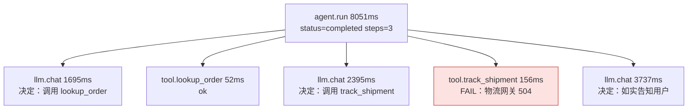
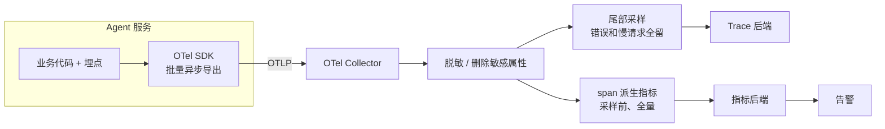
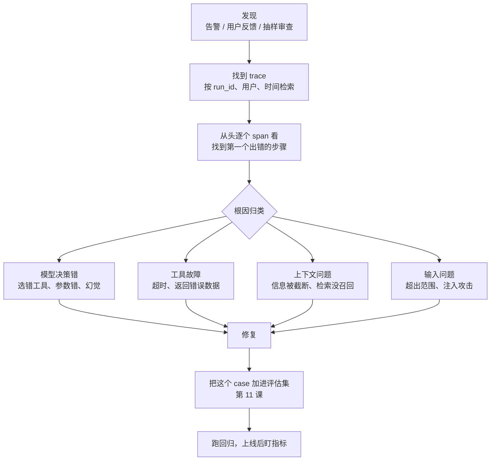

[中文](README.md) | [English](README.en.md)

# 第 10 课：可观测性 —— 看见 Agent 在想什么

> 🕐 建议用时：15 分钟 ｜ 🎯 学完你能：给 Agent 装上链路追踪，用指标发现问题、用 trace 定位根因，并对采样、隐私、选型、告警做出合理取舍 ｜ 📦 对应源码：`agentkit/tracing.py`、`agentkit/agent.py`、`agentkit/viewer.py`
>
> 📖 必读：[Dapper, a Large-Scale Distributed Systems Tracing Infrastructure](https://research.google/pubs/dapper-a-large-scale-distributed-systems-tracing-infrastructure/)（Sigelman 等, 2010）—— Google 分布式追踪系统的技术报告，后来的 Zipkin、OpenTelemetry 等都沿用了它的 trace 树 / span 模型；重点读 §2（trace 树与 span、采样、安全与隐私）和 §4（追踪开销与自适应采样），对照本课在采样和隐私上的取舍。

## 0. 一句话讲清楚

**飞机为什么要装黑匣子？** 因为出事的时候，没人能准确复述刚才发生了什么。Agent 也一样：用户只会说"它答错了"，Agent 自己也不会记得刚才调了哪个工具、拿到了什么结果、为什么这样回答。

设想周一早上，客服主管来找你：

> "上周五下午好多用户投诉，问物流的时候 Agent 回答'查不到'。"

你打开日志，只看到一行行 `POST /chat 200 5.8s`。问题可能出在：

1. 模型根本没调物流工具，自己编了一句"查不到"？（幻觉）
2. 调了，但物流接口超时了？（下游故障）
3. 工具返回了正确结果，模型却读错了？（模型理解问题）
4. 对话太长被截断，订单号丢了？（上下文问题）

这四种原因的修法完全不同：改 prompt、修工具、加重试、改上下文策略。**没有链路追踪（tracing），你只能猜。**

Agent 比普通后端服务**更需要**可观测性。普通服务的执行路径写在代码里，读代码就知道它会做什么。Agent 的路径是**模型在运行时决定的**：同一个问题今天走 3 步，明天可能走 7 步。所以要知道 Agent 实际做了什么，只能看 trace。

## 1. 核心概念

### 1.1 三支柱：日志、指标、追踪各回答什么问题

| | 指标 Metrics | 追踪 Traces | 日志 Logs |
|---|---|---|---|
| 大白话 | 仪表盘上的数字 | 一次请求的完整"行车记录" | 某个时刻发生的一件事 |
| 回答的问题 | **有没有问题？多严重？** | **这一次到底发生了什么？时间花在哪？** | **那一刻的细节是什么？** |
| Agent 里的例子 | 成功率从 92% 掉到 81%；p95 从 8s 涨到 20s；每任务成本翻倍 | 第 2 步调了 `track_shipment`，参数 `YT2002`，504 超时；第 3 步模型决定放弃 | 审批人批准了退款；prompt 配置 v12 热更新；异常栈 |
| 成本 | 低（预先聚合） | 高（每个请求一棵树） | 中 |
| 最适合 | 告警、趋势、SLO | 调试、复盘、性能分析 | 审计、离散事件 |

三者配合使用，排障路径是从"面"到"点"。前提是**三者能用 `trace_id` 串起来**：日志里没有 trace_id，就像病历上没写病人姓名。


### 1.2 Trace 与 Span：把一次运行拆成一棵树

- **Trace（链路）**：一次完整的运行，用一个 `trace_id` 标识。
- **Span（跨度）**：运行中的一步，比如一次模型调用、一次工具调用。每个 span 有 `span_id`、指向父节点的 `parent_id`、开始/结束时间、属性（attributes）和状态（ok / error）。

下面是第 4 节 Demo 用真实模型跑出来的一条 trace（"帮我看看订单 A1002 的物流进度"）：



按时间轴展开就是瀑布图，时间花在哪一目了然。这条 trace 里模型调用占了 97% 的时间：想让 Agent 变快，首先要减少步数，优化工具的收益相对小得多。

```
agent.run            |████████████████████████████████████████| 8051ms
  llm.chat           |████████                                | 1695ms
  tool.lookup_order  |        ▏                               |   52ms
  llm.chat           |         ████████████                   | 2395ms
  tool.track_shipment|                     ▏                  |  156ms
  llm.chat           |                      ██████████████████| 3737ms
```

之所以用树而不是平铺的事件列表，是因为 Agent 的步骤会嵌套：多 Agent 时，主管的一次工具调用里面是一整个专家 Agent 的运行（第 06 课的 `agent_as_tool`）。树能直接表达"谁包含谁"，耗时也能逐层往下拆。

### 1.3 OpenTelemetry 与 GenAI 语义约定

**OpenTelemetry（OTel）** 是 CNCF 旗下的开源可观测性标准，包括统一的 API/SDK 和传输协议 OTLP。按 OTel 埋点，数据可以发到任何支持 OTLP 的后端，换后端不用改业务代码。

光有协议不够，属性名也要统一：你叫 `model`、我叫 `llm_name`，后端照样认不出。**语义约定（Semantic Conventions）** 规定属性叫什么名字。OTel 为生成式 AI 定义了 `gen_ai.*` 属性，常用的有：

| 属性 | 含义 | 示例 |
|---|---|---|
| `gen_ai.operation.name` | 操作类型 | `chat`、`execute_tool`、`invoke_agent` |
| `gen_ai.provider.name` | 模型提供方 | `openai`、`anthropic` |
| `gen_ai.request.model` / `gen_ai.response.model` | 请求的模型 / 实际响应的模型 | 网关降级后两者可能不同 |
| `gen_ai.usage.input_tokens` / `gen_ai.usage.output_tokens` | 输入 / 输出 token 数 | `524` / `39` |
| `gen_ai.response.finish_reasons` | 结束原因 | `["stop"]`、`["length"]` |
| `gen_ai.conversation.id` / `gen_ai.agent.name` | 会话 ID / Agent 名称 | |
| `gen_ai.tool.name` / `gen_ai.tool.call.id` | 工具名 / 工具调用 ID | `track_shipment` |
| `error.type` | 错误类别（OTel 通用属性） | `timeout`、`500` |

Span 命名约定：模型调用 `chat gpt-5.5`（`{操作} {模型}`），工具 `execute_tool {工具名}`，Agent `invoke_agent {Agent 名}`。常用指标有 `gen_ai.client.operation.duration`（操作耗时直方图）和流式场景的 `gen_ai.client.operation.time_to_first_chunk`（首个 chunk 的到达时间）。

> ⚠️ **这套约定还在变。** 截至 2026 年 9 月，GenAI 语义约定仍是 **Development（开发中）** 状态，已从 OTel 主仓库搬到独立仓库 [open-telemetry/semantic-conventions-genai](https://github.com/open-telemetry/semantic-conventions-genai)。改名已经发生过：v1.36 及以前的 `gen_ai.system` 从 v1.37 起改为 `gen_ai.provider.name`；token 用量指标原来是一个直方图 `gen_ai.client.token.usage`，现在拆成了 `gen_ai.client.inference.usage.input_tokens` 等多个计数器。生产中要**锁定所用 SDK 对应的约定版本**。

agentkit 为教学做了简化，和标准的对应关系：

| agentkit | OTel GenAI 约定 |
|---|---|
| span `agent.run` / `llm.chat` / `tool.<工具名>` | `invoke_agent {agent}` / `chat {model}` / `execute_tool {tool}` |
| 属性 `tool.name`、`tool.arguments`、`tool.result_preview` | `gen_ai.tool.name`、`gen_ai.tool.call.arguments`、`gen_ai.tool.call.result`（后两者在标准里是 **Opt-In**，默认不采集） |
| 属性 `gen_ai.request.model`、`gen_ai.response.model`、`gen_ai.usage.*` | 同名 |
| 属性 `agent.status`、`agent.steps`、`agent.cost_usd` | 标准里没有，属于自定义业务属性（OTel 允许，建议加命名空间前缀） |

### 1.4 每次运行至少要记下什么

| 类别 | 内容 | 为什么 |
|---|---|---|
| 模型调用 | 请求模型、响应模型、token、耗时、结束原因 | 成本、延迟、输出被截断（`length`）都靠它 |
| 决策 | 这一步模型是"调用了哪些工具"还是"给出最终答案" | Agent 特有，也是最重要的调试信息 |
| 工具调用 | 工具名、参数（脱敏后）、成功与否、错误类型、耗时 | 工具是 Agent 最常见的故障源 |
| 运行汇总 | 最终状态、步数、总 token、成本、停止原因 | 一行就能判断这次运行是否健康 |
| 版本 | prompt 版本、模型版本、代码版本 | 指标变差时，把问题对应到具体某次变更 |
| 身份与关联 | run_id、租户、（哈希后的）用户 ID、会话 ID | 从用户投诉反查 trace，按租户分析 |

记多少、怎么存、谁能看，是下面几张问题卡片要讨论的取舍。

## 2. 企业问题卡片

### 问题 1：追踪数据太多，存储账单快赶上模型账单了

**场景**：一个电商客服 Agent，日均 20 万次运行，每次平均 25 个 span。只记元数据时每个 span 约 1 KB，一天约 5 GB。后来为了排查方便打开了完整 prompt 记录（多轮对话加检索结果），每次运行多出约 60 KB，一天变成约 17 GB，一个月 500 GB，查询也越来越慢。

**为什么难**：直觉方案是"随机保留 10%"。但失败请求本来只占 2%，随机采样后，你最想看的那条（比如某个投诉用户的那次运行）有 90% 的概率已经被丢掉了。更隐蔽的问题是：如果再用采样后的 trace 去算成功率，结果也是偏的。

| 方案 | 怎么做 | 优点 | 缺点 | 适用场景 |
|---|---|---|---|---|
| A. 全量保留 | 所有 trace 都存，按时间过期 | 最简单；任何一条都查得到 | 量大、贵；查询慢 | 日均万次以内；开发和测试环境 |
| B. 头部采样（head-based） | 请求开始时就按比例决定记不记 | 实现简单，SDK 里配一个比例即可；开销最小 | 失败请求和慢请求会被等比例丢掉 | 只关心总体趋势，不做单条排查 |
| C. 尾部采样（tail-based） | 整条 trace 结束后再决定：错误 100%、慢请求 100%、有用户反馈的 100%、其余 5% | 保留了最有价值的 trace，存储量大幅下降 | 采集端要先缓存整条 trace，部署更复杂；OTel Collector 的 `tail_sampling` processor 就是做这个的 | 规模上来之后的默认选择 |

**怎么选**：日均一万次以内直接用 A。规模上来之后用 C，并且把"内容"（prompt、结果）和"元数据"（耗时、token、状态）分开：元数据可以多留，内容只保留采样命中的那部分。**无论选哪种，指标都必须在采样之前、基于全量数据计算。** 尾部采样后错误被 100% 保留、成功只留 5%，这时用 trace 算出来的成功率会严重偏低。B 只适合"看趋势就够了"的场景。

**本课实现**：agentkit 的 `Tracer` 全量导出（方案 A），适合学习和小规模；练习里的 `compute_metrics` 演示"从 span 算指标"，生产中这一步要放在采样之前，比如用 OTel Collector 的 `spanmetrics` connector。升级路径：OTel SDK（批量异步导出）→ OTel Collector（尾部采样 + 派生指标）→ trace 后端。

### 问题 2：trace 里躺着用户的手机号和身份证

**场景**：客服 Agent 的 trace 发往第三方 SaaS 平台，200 名工程师有查看权限，保留 90 天。一次合规检查发现，30 天内有 12 万个 span 的工具参数里带着明文手机号，还有用户直接把身份证号贴进了对话。

**为什么难**：完全不记录，就没法排查"用户说查不到订单"这类问题，因为你连订单号都看不到；记录了，就是合规风险。正则脱敏只能覆盖格式固定的数据（手机号、身份证号），姓名、住址这类自由文本抓不住。

| 方案 | 怎么做 | 优点 | 缺点 | 适用场景 |
|---|---|---|---|---|
| A. 默认不记录内容 | span 只记元数据：工具名、耗时、token、错误类型 | 最安全；这也是 OTel GenAI 约定的默认要求（内容采集是 opt-in） | 排查时看不到"具体输入了什么" | 所有系统的默认起点 |
| B. 导出前脱敏 | 在 exporter / Collector 统一处理：掩码 `138****5678`、带密钥的哈希（HMAC）、替换为 `[手机号已脱敏]` | 保留了大部分排查能力；在出口集中处理，不依赖每个开发者自觉 | 正则有漏网之鱼；自由文本需要 NER 模型 | 需要看内容排查问题的大多数团队 |
| C. 内容外置 + 分级访问 | 内容存到独立的加密存储，span 上只记引用；查看原文要单独授权并留审计记录 | 满足严格合规要求；运维人员和数据分级管理 | 架构更复杂；排查多一步 | 金融、医疗等强监管行业 |

**怎么选**：以 A 为默认。确实需要看内容时，B 是底线，而且要在导出层统一做，不能指望业务代码自己处理。强监管行业再叠加 C，这也是 OTel 在生产环境推荐的做法。需要"关联同一用户的多次请求"时用 HMAC，不要用普通的 SHA-256：手机号只有 11 位、号段有限，攻击者把所有号码哈希一遍就能反查（彩虹表），HMAC 带一个只有你知道的密钥，没法这样穷举。

**本课实现**：agentkit 记录工具参数（前 500 字符）和结果预览（前 200 字符）之前，会先调用第 09 课的 `redact_pii`，这是方案 B 的第一道防线，放在埋点处（见 3.2 节）。Demo 第 5 节演示了它的效果和盲区：手机号、邮箱被替换了，姓名和地址原样保留。生产中还要在 OTel Collector 里用属性处理器做第二道兜底，覆盖业务代码自己加的属性、异常信息等。另外，截断和脱敏的顺序也有讲究：应该**先脱敏、再截断**，否则恰好被截断在边界上的号码只剩半截，正则就匹配不到了。

### 问题 3：可观测平台自己搭，还是买？

**场景**：一个 20 人的 AI 团队。公司已经有 Prometheus + Grafana + Jaeger 这套 OTel 体系；业务方还想要一个能"看对话"的界面，以及 prompt 管理和在线评估。法务要求用户数据不能出境。

**为什么难**：通用追踪后端不理解 LLM 语义，看不到对话视图，也没有评估功能；LLM 专用平台功能多，但可能是 SaaS，数据要出公司；多套系统并存又会让埋点重复、数据割裂。

| 方案 | 怎么做 | 优点 | 缺点 | 适用场景 |
|---|---|---|---|---|
| A. 通用 OTel 后端 | Jaeger、Grafana Tempo 存 trace，Prometheus 存指标 | 复用现有体系和运维能力；数据在自己手里 | 不理解 LLM 语义：没有对话视图、prompt 管理和评估 | 已有成熟 OTel 体系，主要关心性能和可用性 |
| B. 开源 LLM 平台自托管 | [Langfuse](https://langfuse.com/)（核心 MIT 开源）、[Arize Phoenix](https://github.com/Arize-ai/phoenix)（基于 OpenTelemetry 和 OpenInference） | 有对话视图、评估等 LLM 专用功能；数据留在内网 | 要自己运维（数据库、升级、扩容） | 数据不能出公司，又需要 LLM 专用功能 |
| C. SaaS 平台 | [LangSmith](https://docs.langchain.com/langsmith)、Langfuse Cloud 等 | 开箱即用，起步最快 | 数据出公司；按量计费，规模大了会贵；有被厂商锁定的风险 | 早期团队、数据合规要求不高 |

**怎么选**：先看数据合规，它往往直接决定能不能用 C。然后**先定埋点标准，再选后端**：埋点统一用 OTel 和 GenAI 约定，后端就可以替换，甚至同时发给 A 和 B（性能看 A，对话和评估看 B）。尽量不要让业务代码直接依赖某个平台专有的 SDK。

**本课实现**：[agentkit/tracing.py](../../agentkit/tracing.py) 是零依赖的教学版 Tracer，导出 JSONL；[agentkit/viewer.py](../../agentkit/viewer.py) 把 JSONL 渲染成单文件 HTML 查看器（第 4 节）。它们适合学习和本地调试。生产中换成 OTel SDK，属性名按 1.3 节的对照表改就行。

### 问题 4：告警太多，值班的人开始无视告警

**场景**：Agent 上线第一个月，每周产生约 150 条告警，其中九成是凌晨低流量时的"成功率 < 90%"（总共 3 个请求，失败了 1 个），以及"等待审批"被当成了错误。某天一个工具的 schema 改了，`invalid_args` 错误暴涨，这条告警淹没在噪声里，两个小时后才被用户投诉发现。

**为什么难**：Agent 的流量有明显的波峰波谷，固定阈值在低流量时必然误报；Agent 还有"暂停""拒绝"这类不是故障的状态；最麻烦的是模型行为漂移，它不报任何错误，错误率告警根本抓不到。

| 方案 | 怎么做 | 优点 | 缺点 | 适用场景 |
|---|---|---|---|---|
| A. 固定阈值 | 错误率 > 10% 立即告警 | 简单 | 低流量时误报，高流量时又不够灵敏 | 只适合做原型 |
| B. 阈值 + 最小流量 + 持续时间 | 例如"5 分钟内成功率 < 90%，且请求数 > 50，持续 10 分钟" | 简单有效，能消除大部分噪声 | 阈值要靠经验调；对缓慢恶化不敏感 | 起步阶段的默认选择 |
| C. SLO 燃烧率告警 | 定义 SLO（如"30 天成功率 ≥ 95%"），按错误预算的消耗速度告警 | 和用户影响直接挂钩；快速燃烧和慢速燃烧都能抓到 | 要先定义好 SLO；理解成本较高 | 有明确 SLO 的核心服务 |
| D. 分布漂移检测 | 监控平均步数、工具调用分布、输出长度、拒答率与上周相比的变化 | 能抓住"没有报错的退化"，比如模型提供方静默更新了模型 | 更容易误报，适合出日报，不适合半夜叫人 | Agent 特有，作为 B/C 的补充 |

**怎么选**：起步用 B。有了明确的 SLO 之后，用 C 做需要值班人员立即处理的告警（paging），用 D 做每日报告。两条通用原则：**按症状告警，不按原因告警**（Google SRE 书里的原则：告警对应"用户受影响了"，而不是"某台机器 CPU 高"）；暂停、审批拒绝、预算中止都**不计入错误**。适合 Agent 的告警示例：成本每小时超过同时段基线 3 倍（死循环或被刷）；单个工具错误率 > 20% 且调用数 > 20；命中 `max_steps` 的运行超过 5%。

**本课实现**：[agentkit/tracing.py](../../agentkit/tracing.py) 里，`PauseRun` / `StopRun` 带有 `trace_as_error = False`，只标记为 `interrupted`，不会被记成错误。练习里的 `compute_metrics` 按工具拆分错误率，这是"单个工具错误率"告警的数据基础。

### 问题 5：成功率 99%，用户却在投诉

**场景**：看板上任务成功率 99.2%，客服主管却反馈用户满意度从 4.5 分掉到了 3.8 分。排查发现，物流接口有 30% 的调用超时，Agent 礼貌地回答"暂时查不到"，而这些运行的状态全部是 `completed`。

**为什么难**：`completed` 只代表 Agent 正常结束，不代表问题被解决了。礼貌地拒答、给出看似合理的错误答案，在运行状态上都是"成功"。而"是否真的解决了问题"很难自动判断。

| 方案 | 怎么做 | 优点 | 缺点 | 适用场景 |
|---|---|---|---|---|
| A. 运行状态 | 统计 `status == completed` 的比例 | 免费、实时、全量 | 只能反映"有没有崩"，反映不了"答得对不对" | 健康度的底线指标 |
| B. 用户显式信号 | 👍/👎、同一问题重问、要求转人工 | 直接反映用户感受 | 稀疏（多数用户不点）、有偏（不满意的人更爱点）、有延迟 | 发现问题的信号源 |
| C. 在线抽样评估 | 每天抽 1-5% 的线上 trace，用 LLM 评委或人工打分（第 11 课） | 能衡量"答得对不对"，覆盖面可控 | 有成本；评委需要校准 | 质量指标的主要来源 |
| D. 业务结果指标 | 工单是否被重开、退款是否真的到账、用户 24 小时内是否再次来问 | 最接近"真的解决了" | 要打通业务系统；有较长延迟 | 北极星指标 |

**怎么选**：A 只是底线，必须和**按工具拆分的错误率**一起看。在此基础上，B 用来发现问题，C 用来衡量质量，D 作为最终的北极星指标。至少要有 A + 工具错误率 + C。每一个被发现的坏案例，都要回流进第 11 课的评估集。

**本课实现**：Demo 第 3 节复现了这个场景：成功率 100%，`track_shipment` 的错误率却有 67%。练习里的 `compute_metrics` 同时输出整体成功率和按工具拆分的错误率。

### 问题 6：多 Agent、跨服务的调用链串不起来

**场景**：主管 Agent 调用专家 Agent（部署在另一个服务里），专家 Agent 又调用了一个 MCP server。排查一次 40 秒的慢请求时，后端里出现了三个互不相关的 trace，只能按时间戳去猜哪几个是同一次请求。

**为什么难**：trace 上下文在每一道边界都可能丢失：线程池（Python 的 `contextvars` **不会**自动传进 `ThreadPoolExecutor` 的工作线程）、异步任务、HTTP 调用、消息队列，以及等待审批的几个小时。

| 方案 | 怎么做 | 优点 | 缺点 | 适用场景 |
|---|---|---|---|---|
| A. 进程内上下文传播 | 用 `contextvars` 维护当前 span；跨线程时 `contextvars.copy_context().run(...)` | 自动嵌套，调用方无感 | 每一道线程或协程边界都要处理，漏一处就断 | 单进程内（必须做） |
| B. 跨服务透传 traceparent | 按 [W3C Trace Context](https://www.w3.org/TR/trace-context/) 标准，在 HTTP / MCP / 消息头里传 `traceparent` | 跨服务、跨语言拼成一棵树 | 链路上每个服务都要支持 | 微服务、多 Agent 服务（必须做） |
| C. 业务 ID 关联 | 把 run_id、conversation_id 写进每个 span，事后按 ID 检索 | 简单可靠；人能直接搜 | 看不到父子层级和时间关系 | 永远都要有，作为兜底 |
| D. span link | 新 trace 通过 link 指向原来的 trace | 适合异步和长时间暂停，不会让一个 trace 跨越几个小时 | 后端对 link 的展示支持参差不齐 | 队列消费、审批后恢复 |

**怎么选**：A + B 是基础，保证同一个请求只有一个 trace_id；C 永远要有，用户投诉时报的是 run_id，不是 trace_id；D 用在队列和长时间暂停的场景。上线前做一次端到端验证：发一个完整的请求，确认后端里只出现一个 trace_id。

**本课实现**：agentkit 的 `Tracer` 用 `contextvars` 维护 span 栈（方案 A）；`ToolRegistry.execute` 在线程池里执行工具时，用 `pool.submit(contextvars.copy_context().run, t.fn, **kwargs)` 把上下文带进工具线程，所以通过 `agent_as_tool` 调用的子 Agent 会嵌套在父 span 下面（见 [agentkit/tools.py](../../agentkit/tools.py)）。从检查点恢复的运行会生成新的根 span `agent.resume`，用 run_id 关联（方案 C），查看器会把同一个 run_id 的多条 trace 串起来。可以用下面的代码自检：

```python
from agentkit import Agent, ScriptedLLM, Tracer, call_tool, reply
from agentkit.workflows import agent_as_tool

t = Tracer()
expert = Agent(ScriptedLLM([reply("专家答复")]), [], name="expert", tracer=t)
boss = Agent(ScriptedLLM([call_tool("ask_expert", task="x"), reply("完成")]),
             [agent_as_tool(expert, "ask_expert", "专家")], name="boss", tracer=t)
boss.run("hi")
print(len(t.traces))  # agentkit 输出 1：子 Agent 嵌套在父 trace 里；输出 2 说明上下文在线程边界断了
```

## 3. 从玩具到生产：逐层实现

### 3.1 最小的 Span：一个带计时的 `with` 块

[agentkit/tracing.py](../../agentkit/tracing.py) 的核心只有一个上下文管理器：

```python
@contextmanager
def span(self, name: str, **attrs) -> Iterator[Span]:
    stack = self._stack.get()
    parent = stack[-1] if stack else None
    s = Span(
        name=name,
        trace_id=parent.trace_id if parent else uuid.uuid4().hex[:16],
        span_id=uuid.uuid4().hex[:8],
        parent_id=parent.span_id if parent else None,
        start=time.time(),
        attrs=dict(attrs),
    )
    ...
    token = self._stack.set(stack + (s,))
    try:
        yield s
    except Exception as e:
        if getattr(e, "trace_as_error", True):
            s.status = "error"
            s.attrs["error"] = f"{type(e).__name__}: {e}"
        else:  # 暂停 / 主动中止 不是故障，只做标记
            s.attrs["interrupted"] = type(e).__name__
        raise
    finally:
        s.end = time.time()
        self._stack.reset(token)
        if parent is None:
            self.traces.append(s)
            if self.exporter:
                self.exporter(s)
```

1. **用 `contextvars` 维护"当前 span 栈"**，嵌套的 `with tracer.span(...)` 会自动认出父节点，不用一层层传 `parent`。它在多线程和 asyncio 下都能正确隔离，两个并发请求各有各的栈。OTel Python SDK 也是这么做的。
2. **暂停和中止不算错误**（见问题 4）。
3. **记录异常后继续 `raise`。** 追踪只负责观察，不能改变程序行为。
4. **根 span 结束时把整棵树交给 exporter。** 实现简单，但一个等了 3 小时审批的运行，结束前后端完全看不到它。OTel SDK 的 `BatchSpanProcessor` 是每个 span 一结束就放进队列、分批异步导出。

### 3.2 Agent 在哪里埋点

[agentkit/agent.py](../../agentkit/agent.py) 在三处创建 span：整次运行、每次模型调用、每次工具调用。

```python
with self.tracer.span(
    "llm.chat",
    **{"gen_ai.request.model": getattr(self.llm, "model", "?"), "step": state.step, "messages": len(state.messages)},
) as span:
    response = self.llm.chat(state.messages, tools=tools)
    span.set(
        **{
            "gen_ai.response.model": response.model,
            "gen_ai.usage.input_tokens": response.usage.input_tokens,
            "gen_ai.usage.output_tokens": response.usage.output_tokens,
            "finish_reason": response.finish_reason,
            "result": ("tool_calls: " + ", ".join(c.name for c in response.tool_calls))
            if response.tool_calls
            else "final_answer",
        }
    )
```

- **请求模型和响应模型都要记。** 第 08 课的 `ResilientLLM` 会降级到备用模型，第 12 课的模型网关也会改写路由。只记请求模型，备用模型的质量问题会被算到主模型头上。
- **`result` 记录模型这一步的决策**：普通服务的决策写在代码里，Agent 的决策是模型临时做出的，必须记下来。
- **`messages` 记录上下文长度**：步数越多上下文越长，延迟和成本都跟着涨。

```python
with self.tracer.span(
    f"tool.{call.name}",
    **{"tool.name": call.name, "tool.arguments": redact_pii(call.arguments)[:500], "tool.risk": t.risk if t else None},
) as span:
    ...  # 权限钩子 → 执行工具 → after_tool 钩子
    span.set(**{"tool.ok": result.ok, "tool.error_type": result.error_type, "tool.result_preview": redact_pii(result.content)[:200]})
```

- **参数截断到 500 字符，结果只留前 200 字符的预览**，防止大数据撑爆 span（多数后端对单个属性值有长度上限）。
- **记录前先脱敏**：追踪系统通常比业务数据库有更多人能访问，所以参数和结果预览都先过一遍 `redact_pii`。正则脱敏有盲区，见问题 2。
- `tool.result_preview` 是在 `after_tool` 钩子**之后**记录的。如果某个钩子在 `after_tool` 里做了脱敏或包装（比如第 09 课的 `ToolOutputGuard`），trace 里看到的也是处理后的版本。
- **`tool.error_type` 告诉你该找谁修**，见 6.1 节的表格。

运行结束时，`_annotate` 把状态、步数、成本、token 汇总写到根 span 上。注意根 span 上的 token 是**汇总值**，统计时再加上各个 `llm.chat` 就重复了，练习里有一条测试专门防这个错。

### 3.3 导出：扁平的 JSONL

`jsonl_exporter` 把树拍平，每个 span 一行 JSON，用 `parent_id` 指向父节点：

```python
def export(root: Span) -> None:
    with path.open("a", encoding="utf-8") as f:
        for s in root.walk():
            f.write(json.dumps(s.to_dict(), ensure_ascii=False, default=str) + "\n")
```

- **只追加写**：进程崩溃最多丢最后一行，不会把整个文件写坏；
- **可以流式处理**：`grep`、`jq`、日志采集器都能逐行读；
- **和 OTLP 的数据形状一致**：OTel 传输的也是扁平的 span 列表，树是后端根据 parent span id 拼出来的。

跑完 Demo 后，一行命令就能找出所有失败的工具调用：

```bash
grep '"tool.ok": false' lessons/10_observability/traces/demo.jsonl
```

生产中接入 OTel 有两条路：一是直接换成 OTel SDK（`tracer.start_as_current_span(...)` 和 `Tracer.span()` 的用法几乎一一对应）；二是保留 agentkit 的 Tracer，写一个 exporter 适配器，在根 span 结束时用 OTel SDK 按原始的起止时间重建 span（`start_span` 和 `end` 都接受显式时间戳，单位是纳秒）。也可以用 Arize 维护的 **OpenInference** 或 Traceloop 维护的 **OpenLLMetry** 做自动埋点，它们产出的都是 OTel span。完整链路：



## 4. 动手：运行 Demo

```bash
python lessons/10_observability/demo.py --offline   # 离线剧本，无需 API key（约 6 秒）
python lessons/10_observability/demo.py             # 真实模型（约 25 秒）
```

Demo 里的电商客服 Agent 处理 4 个任务：正常查物流、问退货政策、**物流接口故障**、**带手机号的查询**。离线模式输出节选：

```
▶ [t3-工具故障] 用户：帮我看看订单 A1002 的物流进度
  助手：抱歉，物流商接口暂时超时，无法查询 YT2002 的进度。订单已发货，建议稍后再查。
  agent.run  2147ms  tokens=2008→122  status=completed steps=4 cost=$0.00250
  ├─ llm.chat  308ms  tokens=408→22  → tool_calls: lookup_order
  ├─ tool.lookup_order  56ms  ok
  ├─ llm.chat  351ms  tokens=470→24  → tool_calls: track_shipment
  ├─ tool.track_shipment  156ms  FAIL(tool_error)
  ├─ llm.chat  404ms  tokens=530→24  → tool_calls: track_shipment
  ├─ tool.track_shipment  159ms  FAIL(tool_error)
  └─ llm.chat  701ms  tokens=600→52  → final_answer
...
  成功率（status=completed）    100%
  运行耗时 p50 / p95            0.97s / 2.15s
  ...
  工具                    调用  失败  错误率
  track_shipment          3     2     67%   ← 需要关注
...
第一道防线（埋点处）：agentkit 记录 tool.arguments / tool.result_preview 之前，先调用 redact_pii：
  tool.find_orders_by_phone    tool.arguments = {"phone": "[手机号已脱敏]"}
...
但正则脱敏有盲区：格式固定的能抓住，自由文本抓不住。
  原文：收货人张伟，地址上海市浦东新区张江路 88 号 1201 室，电话 13812345678，邮箱 zhangwei@example.com
  脱敏：收货人张伟，地址上海市浦东新区张江路 88 号 1201 室，电话 [手机号已脱敏]，邮箱 [邮箱已脱敏]
```

**重点观察：**

1. **成功率 100%，工具错误率 67%**：问题 5 的场景。
2. **离线剧本里模型对失败的工具重试了一次**，白花了一次模型调用。我们用真实模型跑的那次，模型遵守了 system prompt 里"不要反复重试"的要求；真实模型每次的行为可能不同。prompt 的约束有没有生效，看 trace 就知道。
3. **模型调用占了总耗时的八成以上**（真实模式下是 97%）。
4. **工具参数里的手机号在埋点处就被替换掉了，但姓名和地址逃过了正则**：这就是问题 2 里"默认不记录内容"的理由。

**在浏览器里看 trace**：用 agentkit 自带的查看器 [agentkit/viewer.py](../../agentkit/viewer.py) 把 JSONL 渲染成一个 HTML 页面：

```bash
python -m agentkit.viewer lessons/10_observability/traces/demo.jsonl --open
# 或者：make viewer T=lessons/10_observability/traces/demo.jsonl   （输出到仓库根目录的 trace.html）
```

- 左侧是 trace 列表，每次运行一条，显示状态、耗时、token、run_id，支持搜索；
- 右侧是**瀑布图**：每行一个 span，按父子层级缩进，条形的位置和长度与真实起止时间成比例；
- **点击任意 span 查看全部属性**：模型、token、工具参数、`tool.result_preview`、错误信息；
- **暂停 / 恢复关联**：同一个 run_id 的多条 trace（运行 → 暂停等审批 → `agent.resume`）会被关联起来，成本也按段拆开。第 08、09 课的审批流程可以用它看完整的来龙去脉。

常用参数：`-o out.html` 指定输出路径（默认和输入文件同名，扩展名改成 `.html`）；输入可以是目录（合并其中所有 `*.jsonl`）；`--title` 设置标题；`--open` 生成后直接打开。Python 里可以调用 `from agentkit.viewer import load_spans, render_html`。页面是没有外部依赖的单个 HTML 文件，断网也能打开；它对 span 内容做了转义并设置了 CSP，因为 trace 里的用户输入可能是恶意的 `<script>`，查看器本身不能成为 XSS 的入口。

## 5. 练习

打开 [exercise.py](exercise.py)，实现 3 个函数：

| 函数 | 做什么 | 考察点 |
|---|---|---|
| `percentile(values, p)` | 最近秩法百分位数 | 百分位定义、浮点误差 |
| `compute_metrics(spans)` | 从扁平 span 算出运行次数、成功率、p50/p95、总 token、每个工具的调用次数和错误率、平均步数 | 识别根 span、避免 token 重复统计、字段缺失的处理 |
| `slowest_path(spans, trace_id)` | 从根开始，每层走向耗时最长的子 span，返回名称链 | 用 parent_id 建树、平局规则 |

```bash
make lesson N=10
# 等价于 .venv/bin/python -m pytest lessons/10_observability
```

提示：先跑一次 Demo，打开 `traces/demo.jsonl` 看看真实数据长什么样；docstring 里的"规则细节"每一条都有测试对应，也都来自真实的坑。写完再跑 Demo，第 3 节会显示"计算函数来自 exercise.py（你的实现）"。

## 6. 深入（给有余力的你）

### 6.1 Agent 看板上该放哪些指标

| 指标 | 定义 | 为什么重要 | 注意 |
|---|---|---|---|
| **任务成功率** | 正常结束，并且（可选）通过在线评估、没有用户负反馈 | 最核心的指标 | 见问题 5 |
| **每任务成本** | 总 token × 单价 ÷ 任务数，按租户、功能、模型拆分 | Agent 会自己花钱 | 看分布：死循环会形成极端长尾 |
| **步数分布** | 每次运行调用模型次数的直方图 | 步数暴涨，说明模型在兜圈子或工具一直报错 | 命中 `max_steps` 的比例要单独监控 |
| **延迟 p50 / p95 / p99** | 端到端耗时的百分位 | 平均值掩盖长尾：99 个请求 1 秒、1 个 100 秒，平均才 1.99 秒 | 样本少时 p99 没意义：100 个样本的 p99 就是第二慢的那个 |
| **首 token 延迟（TTFT）** | 从请求到收到第一个 token | 流式输出时决定了用户觉得快不快 | 多步 Agent 还要看"第一条进度"何时出现 |
| **工具错误率** | 按工具、按错误类型拆分 | 最常见的故障源 | 错误类型决定找谁修，见下表 |
| **提示词缓存命中率** | 命中缓存的输入 token ÷ 全部输入 token（OTel 属性 `gen_ai.usage.cache_read.input_tokens`；agentkit 的 `Usage.cached_input_tokens`） | 命中缓存的输入通常更便宜、更快，Agent 每一步都会重发很长的历史，命中率直接影响成本和延迟 | 改了 system prompt 开头或工具列表的顺序，命中率可能骤降（第 14 课） |
| **人工介入率** | 需要审批、转人工、用户换说法重问的比例 | 衡量自动化程度和信任 | 突然下降也要警惕，可能是审批被绕过了 |

| error_type | 通常说明 | 找谁 |
|---|---|---|
| `invalid_args`、`not_found` | 模型生成的参数不合法，或编了一个不存在的工具 | 改工具描述、schema、prompt（第 03 课） |
| `timeout`、`exception` | 下游慢或挂了 | 工具 / 下游团队；加重试、熔断（第 08 课） |
| `tool_error` | 业务错误（如"订单不存在"） | 多数是正常现象，比例突变时再查 |
| `denied` | 权限策略拒绝 | 不是故障。突增可能是有人在试探权限 |

### 6.2 用 trace 复盘坏案例



- **"第一个出错的步骤"往往比"报错的步骤"早。** 例如第 2 步模型把订单号 `A1002` 写成了 `A1020`，第 3 步工具返回"订单不存在"，第 5 步模型编了一个答案。报错在第 3 步，根因在第 2 步。
- **让用户能报出 run_id**：把它返回给前端，放进"反馈"按钮的数据里，客服接到投诉就能直接定位到 trace。
- **每个坏案例都要变成一条评估用例**，否则同样的问题下个月还会出现。

## 7. 常见坑与反模式

1. **只记录最终答案**，中间步骤一概没有，出了问题只知道"答错了"，不知道为什么。
2. **用平均值看延迟。** 要看 p95、p99。
3. **用采样后的 trace 算成功率**（问题 1）。
4. **token 重复统计**：根 span 的汇总值加上子 span 的明细。
5. **把"等待审批""预算中止"记成错误**（问题 4）。
6. **把 prompt 和 PII 明文发到第三方平台**（问题 2）。
7. **不记录 prompt 版本和模型版本**，指标变差了却对不上是哪次变更。
8. **日志里没有 trace_id**，三支柱各管各的。
9. **把 user_id、run_id 当作指标标签。** 每个不同的值都会生成一条新的时间序列，指标系统会被撑爆。这类字段应该放在 trace 和日志里。

## 8. 面试 & 设计评审问题

<details>
<summary>Q1：Agent 的可观测性和普通微服务有什么本质区别？</summary>

- 执行路径由模型在运行时决定，不能靠读代码推断，所以"模型的决策"本身必须记录下来；
- 同样的输入会产生不同的执行过程，调试时要看的是具体某一次运行；
- 成本随行为变化，要当作一等指标来监控；
- 会出现没有任何报错的质量退化（模型更新、prompt 改动），要靠分布漂移监控和评估来发现；
- 内容里天然带有大量用户数据，隐私问题比普通服务严重得多。
</details>

<details>
<summary>Q2：一个 Agent 的 trace 里应该有哪些 span？每个 span 至少记录哪些属性？</summary>

- 根 span：Agent 名、run_id、租户、最终状态、步数、总 token、成本、停止原因、prompt 和模型版本；
- 模型调用：请求模型、响应模型、输入/输出 token、耗时、结束原因、这一步的决策；
- 工具调用：工具名、脱敏后的参数、成功与否、错误类型、耗时、风险等级；
- 可选：检索（query、召回数、最高相关度）、护栏（是否拦截、原因）、子 Agent。
</details>

<details>
<summary>Q3：日均 50 万次运行，怎么设计 trace 的采样和存储？</summary>

- 尾部采样：错误、慢请求、有用户反馈的 trace 全部保留，其余按 1-5% 保留；
- 指标在采样前基于全量数据计算（比如 Collector 的 spanmetrics）；
- 元数据和内容分开存：元数据多留，内容只保留采样命中的，并且做脱敏或外置；
- 按数据类型设置保留期；估算存储量（运行次数 × span 数 × 每个 span 的大小）并设置预算告警。
</details>

<details>
<summary>Q4：怎么在保留调试能力的前提下保护用户隐私？</summary>

- 默认不采集内容（这也是 OTel GenAI 约定的默认要求）；
- 需要内容时在导出层和 Collector 做两道脱敏，关联用户时用 HMAC 而不是普通哈希；
- 强监管场景把内容外置到有访问控制和审计的存储，span 上只记引用；
- 调试环境用脱敏副本或合成数据。
</details>

<details>
<summary>Q5：成功率 99%，但用户投诉越来越多，怎么排查？</summary>

- 先怀疑"成功"的定义：`completed` 不代表答对了；
- 按工具看错误率，看拒答和转人工的比例；
- 抽样线上 trace 做评估（LLM 评委或人工），把投诉对应的 run_id 找出来逐条复盘；
- 改进：接入用户反馈、在线抽样评估和业务结果指标，加上行为分布的漂移监控。
</details>

<details>
<summary>Q6：多 Agent、跨服务的调用链怎么串成一条 trace？怎么验证？</summary>

- 进程内靠 contextvars，线程池和异步任务的边界要手动复制上下文；
- 跨服务靠 W3C Trace Context 的 `traceparent`，HTTP、MCP、消息队列都要透传；
- 长时间暂停和队列消费用 span link 或 run_id 关联；
- 验证：发一个端到端请求，检查后端里是否只有一个 trace_id。
</details>

## 9. 自测清单

- [ ] 我能说出指标、追踪、日志分别回答什么问题，并描述从告警到根因的排障路径
- [ ] 我能画出一次 Agent 运行的 span 树，并说清每种 span 该记录哪些属性
- [ ] 我知道常用的 OTel GenAI 属性，也知道这套约定仍在变化
- [ ] 我能根据规模选择全量、头部采样或尾部采样，并解释为什么指标要在采样前计算
- [ ] 我能说出 trace 脱敏的三种方案，以及为什么手机号要用 HMAC 而不是普通哈希
- [ ] 我能为 Agent 设计一套不扰民的告警，并解释为什么"等待审批"不算错误
- [ ] 我能解释"成功率 99% 但用户在投诉"的可能原因和应对办法
- [ ] 我完成了练习：`make lesson N=10` 全部通过

## 延伸阅读

- [OpenTelemetry GenAI 语义约定（独立仓库）](https://github.com/open-telemetry/semantic-conventions-genai)：spans、agent spans、metrics 的权威定义，重点看 `docs/gen-ai/`
- [Google SRE Book · Monitoring Distributed Systems](https://sre.google/sre-book/monitoring-distributed-systems/)：四个黄金信号，按症状告警
- [Google SRE Workbook · Alerting on SLOs](https://sre.google/workbook/alerting-on-slos/)：基于错误预算燃烧率的告警
- [W3C Trace Context](https://www.w3.org/TR/trace-context/)：跨服务传播 trace 的标准
- [Langfuse 文档](https://langfuse.com/docs)、[Arize Phoenix](https://github.com/Arize-ai/phoenix)、[LangSmith 文档](https://docs.langchain.com/langsmith)：LLM 可观测性平台
