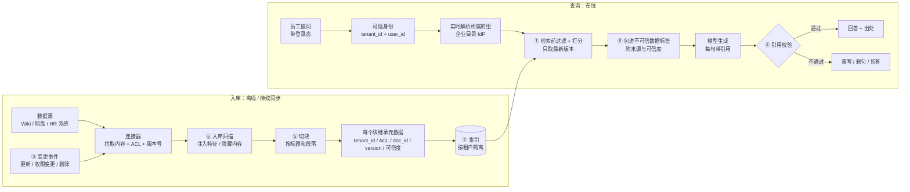
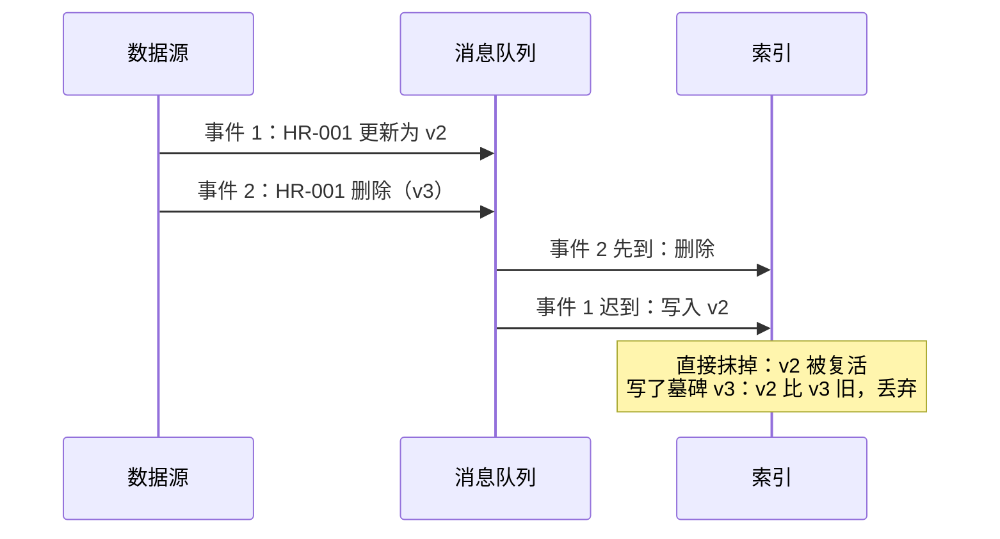

[中文](README.md) | [English](README.en.md)

# 第 12 课：企业知识与数据 —— 权限感知 RAG

> 🕐 建议用时：15 分钟 ｜ 🎯 学完你能：设计一个"不越权、不过期、有出处、防投毒"的企业知识检索系统，并在 ACL 过滤、多租户隔离、同步策略、引用校验、切块方式之间做出有依据的选择 ｜ 📦 对应源码：[`acl_index.py`](acl_index.py)、[`grounding.py`](grounding.py)，复用 [`agentkit/memory.py`](../../agentkit/memory.py) 的 `tokenize` 与 [`agentkit/guardrails.py`](../../agentkit/guardrails.py) 的 `ToolOutputGuard`

## 0. 一句话讲清楚

> **企业 RAG 不是"把文档塞进向量库"，而是"替提问的这个人，在他有权看的、最新的、可信的资料里找答案，并说清出处"。**

想象公司的档案室来了一位新档案员（Agent）。为了省事，行政给了他一把**万能钥匙**（服务账号）。第一天，一位实习生问"今年调薪预算是多少"，他热心地从 HR 的保险柜里翻出了《薪酬调整方案（机密）》……

一位合格的档案员会这样做：

| 合格的档案员会…… | 对应的工程手段 | 问题卡片 |
|---|---|---|
| 先看你的工牌，只打开你有钥匙的柜子 | 身份透传 + ACL 检索前过滤 | 问题 1 |
| 不同公司的档案放在不同的库房 | 多租户索引隔离 | 问题 2 |
| 只给你最新版，作废的文件当场撤下 | 增量同步 + 版本校验 + 删除墓碑 | 问题 3 |
| 每句话都告诉你出自哪份文件 | 强制引用 + 引用校验 + 拒答 | 问题 4 |
| 装订时不会把一张表格撕成两半 | 按文档结构切块 | 问题 5 |
| 不理会夹在档案里的"给档案员的小纸条" | 入库扫描 + 隔离标记 + 来源可信度分级 | 问题 6 |

**这不是假想的问题。** 微软的官方文档写明，Microsoft 365 Copilot 只会呈现用户**至少拥有查看权限**的组织数据 —— 它严格遵守权限。可是在各家企业部署 Copilot 时，"过度分享"（oversharing）反而成了头号治理难题，微软自己也专门发布了缓解过度分享的治理指南。原因是：很多公司的 SharePoint、网盘里积累了多年"分享给全公司"的文件夹、项目结束后没收回的组权限。**权限感知 RAG 会忠实地执行你的权限 —— 包括那些本来就配错了的权限。** 以前"理论上能打开、但没人知道在哪"的文件，现在一句话就能问出来。

## 1. 核心概念

### 1.1 教程里的 RAG vs 企业里的 RAG

第 03 课讲过 RAG 的四个环节：切块、检索、注入、引用。教程里的 RAG 默认了几个在企业里全都不成立的前提：

| | 教程里的 RAG | 企业里的 RAG |
|---|---|---|
| 用户 | 一个人 | 几千人，每人能看的文档都不一样；SaaS 还要服务几百家公司 |
| 数据 | 一批静态 PDF | 几十个系统，每天有人改内容、改权限、删文档 |
| 可信度 | 默认都可信 | wiki 谁都能改，外部文档可能被投毒 |
| "答对"的标准 | 看起来对 | 能追溯到哪份文件、哪个版本；错了能查清责任 |
| 出错的后果 | 答错一道题 | 泄露薪酬、按作废制度报销、合规事故 |

### 1.2 权限感知 RAG 的全流程

下图里带圈的数字对应本课的六张问题卡片：



### 1.3 几个术语

- **ACL**（Access Control List，访问控制列表）：每篇文档附带的"谁能看"名单。本课用组名（`hr`）和 `user:alice`（单独分享给某个人）表示。
- **主体**（principal）：能出现在 ACL 里的对象 —— 用户本人和他所在的组。见 [`User.principals`](acl_index.py)。
- **租户**（tenant）：SaaS 产品里的一家客户公司。
- **墓碑**（tombstone）：删除文档时写入的一条"此文档已删除"的记录，而不是直接把数据抹掉（问题 3 解释为什么）。
- **有依据**（grounded）：回答里的每个论断都能在本次检索到的片段里找到支撑。

## 2. 企业问题卡片

### 问题 1：员工通过 Agent 搜到了自己无权查看的文档

**场景**：一家 3000 人的公司把 Confluence、网盘和 HR 系统接进了知识助手，一共 40 万个文档块，其中约 2%（8000 块）是 HR、财务、法务的受限文档。第一版为了省事，用一个能读所有空间的服务账号建索引、也用它检索。上线第二周，一位研发工程师问"今年调薪预算是多少"，Agent 引用了 HR 的《2026 年薪酬调整方案（机密）》。

**为什么难**：

- **"在提示词里让模型别说机密"不管用。** 内容一旦进了上下文，一次提示词注入（第 06 课）或一次模型的"热心"就会说出去。反方向也不可靠：编写本课 Demo 时，我们用真实模型多次观察到，HR 同事明明有权限、也检索到了预算文档，模型却因为另一篇全员版文档里写着"预算不对全员公开"，自作主张没有回答预算。**权限判断必须是代码的职责，模型的"自觉"两个方向都靠不住。**
- **受限文档的比例在敏感问题上会被放大。** 全库只有 2% 受限，但"调薪预算"的相关文档里，大半可能都是受限的 —— 所以"先检索、后过滤"会严重缩水（方案 B）。
- **权限本身一直在变**：组成员变动、嵌套组、分享链接、继承自父文件夹的权限。

| 方案 | 怎么做 | 优点 | 缺点 | 适用场景 |
|---|---|---|---|---|
| A. 检索前过滤（pre-filter） | 每个块都带 ACL 元数据；检索时把"ACL 与用户的主体有交集"作为过滤条件，只在可见的候选里打分取 top-k | 结果不缩水；无权文档不参与任何计算，泄露面最小 | 索引里的 ACL 是同步过来的，有延迟；向量索引在过滤条件很苛刻时召回会下降，需要检索引擎支持带过滤的检索 | **默认选择** |
| B. 检索后过滤（post-filter） | 先不管权限取 top-k（或多取几倍），再逐条检查权限、剔除无权的 | 实现最简单；最后一步可以实时向源系统核对权限 | top-k 缩水，敏感问题上可能一篇不剩；打分、日志、"找到了但你无权查看"的提示都可能泄露文档的存在 | 只能作为 A 之后的**第二道复核**，不能单独使用 |
| C. 每个权限域单独建索引 | 按部门 / 密级 / 空间拆成多个索引，用户只查自己有权的那几个 | 隔离最强、最好审计；高密级索引可以单独部署、单独加密 | 权限组合多了就爆炸（用户属于 N 个组 → 查 N 个索引再合并排序）；一篇文档属于多个域就要存多份；改权限 = 在索引之间搬数据 | 少数边界清晰、高度敏感的域（HR、法务、董事会材料）单独拆出来，其余用 A |

**"缩水"有多严重？** 这在真实的向量数据库里是有据可查的。pgvector 的文档举过一个例子：使用近似索引（HNSW）时，过滤是在索引扫描**之后**进行的；如果过滤条件只匹配 10% 的行，在默认参数 `hnsw.ef_search = 40` 下，平均只有 4 行能留下来。pgvector 从 0.8.0 版本开始提供"迭代索引扫描"（iterative index scans），在结果不够时继续扫描，来缓解这个问题。

**比缩水更隐蔽的是"存在性泄露"（existence leak）。** 假设 post-filter 之后，系统"贴心"地提示一句：

```text
另有 2 篇相关文档您无权查看：《2026 年薪酬调整方案（机密）》、《2026 年 Q4 组织优化与调薪冻结名单（绝密）》
```

用户一个字的正文都没看到，却已经知道了"Q4 要裁员"。泄露的渠道不止标题：

- **数量**："另有 2 篇"本身就是信息；
- **分数**：如果打分用的统计量（比如 IDF，"一个词在多少篇文档里出现过"）是在包括无权文档在内的全部文档上算的，无权文档就会改变可见文档的分数和排序。Demo 场景 1 里，同一篇 HR-010 在 post-filter 里得 4.31 分，在 pre-filter 里得 5.17 分；
- **模型的措辞**："有相关文档，但我不能告诉你"。

原则只有一条：**对没有权限的人来说，无权文档必须"就像不存在一样"。** 练习 (a) 的测试 `test_search_leaks_nothing_about_hidden_documents` 验证的就是它：往索引里加 7 篇 alice 无权查看的文档，前后两次检索的条数、顺序、分数必须完全相同。

**身份透传：以谁的身份访问数据？**

过滤只是一半。另一半是：**检索时，数据源认为"来的是谁"？**

| 方式 | 怎么做 | 优点 | 缺点 |
|---|---|---|---|
| 服务账号 + 应用层过滤 | 一个"全能读"账号拉取所有数据建索引；查询时由你的代码按用户权限过滤 | 可以预先建索引，检索快 | 你的过滤代码是唯一的防线，一个 bug 就全员可见；还要把源系统的 ACL 同步过来 |
| 用户身份透传（委托） | Agent 用**用户本人**的委托令牌实时调用数据源 API，由数据源自己判断权限。常见机制如微软身份平台的 OAuth 2.0 On-Behalf-Of 流程、IETF 的 RFC 8693 Token Exchange | 权限永远以源系统为准，最新、最准；注入也骗不来用户本来没有的权限 | 很难预先建统一索引（每次都要实时查）；受限于源系统 API 的搜索能力、延迟和限流 |
| 混合（常见的生产形态） | 连接器用服务账号同步内容**和 ACL**；查询时按用户的租户 + 实时解析的组做检索前过滤；对高敏感来源，最终的 top-k 再用用户身份向源系统复核一次 | 兼顾速度和准确 | 最复杂；要监控 ACL 的同步延迟 |

两个术语帮你想清楚这张表：入库时把 ACL 写进索引，叫**早绑定**（early binding）—— 快，但权限变了要等下一次同步；查询时逐条向源系统核对，叫**晚绑定**（late binding）—— 准，但慢，而且本质上是一种 post-filter。混合做法 = **早绑定负责"不缩水"，晚绑定负责兜住"刚刚被收回的权限"**。

还有三个细节：

1. **组成员关系在查询时解析，不要写死在索引里。** 索引里的 ACL 存"组"，而不是展开成几千个用户名；员工被移出 `hr` 组，下一次检索就立即生效，不需要重建索引。Demo 里的 `resolve_user` 就是每次检索时查一次企业目录。
2. **身份只能来自登录态。** 检索工具的参数里没有 `user_id`，身份从 `ToolContext` 注入（第 02 课）。让模型填 `user_id` 等于让攻击者填。
3. **会"动手"的工具更要用用户身份。** 只读的检索用服务账号还可以靠过滤兜底；创建、修改、删除类的操作必须以用户本人的身份执行。

**怎么选**：默认用**方案 A + 混合身份模式**；HR、法务、董事会这类高敏感域用方案 C 单独拆出来；方案 B 只用作 A 之后的晚绑定复核。无论选哪种：身份来自登录态，ACL 缺失时一律拒绝（fail closed），上线前先做一次"过度分享"盘点。

**本课实现**：[`acl_index.py`](acl_index.py) 的 `can_read`（同时比较租户和 ACL，空 ACL 谁都不能读）、`post_filter_search`（反面教材）、`pre_filter_search`；练习 (a) 的 `SecureIndex.search`；[`demo.py`](demo.py) 的 `search_docs` 工具从 `ctx` 取身份、每次实时解析组。升级到生产：用向量库 / 搜索引擎的元数据过滤（例如 Postgres + pgvector 的 WHERE 条件配合行级安全 RLS，或 Elasticsearch 的文档级安全），加上连接器的 ACL 同步。

---

### 问题 2：多租户的向量索引怎么隔离

**场景**：你在做 SaaS 知识助手，有 800 家企业客户。最大的客户有 500 万个文档块，90% 的客户不到 1 万块。一家金融客户的合同写着："数据必须与其他客户隔离；合同终止后 30 天内删除干净。"

**为什么难**：

- 所有租户共用一个索引最省钱，但只要有**一处**查询忘了带 `tenant_id` 过滤，就是跨公司泄露。更隐蔽的是：每家公司都有一个叫 `all-staff` 的组 —— 只比较组名、不比较租户，A 公司的全员就能读到 B 公司的全员文档（练习 (a) 的第一个测试专门抓这个 bug）。
- 每个租户一个独立的库最安全，但 800 套实例的升级、监控、备份是运维噩梦，而且大部分小租户的资源都在闲置。
- **吵闹的邻居**（noisy neighbor）：大租户一次批量导入，拖慢所有人的检索。
- 换 embedding 模型时，每个租户都要重建索引。

| 方案 | 怎么做 | 隔离强度 | 成本 | 运维复杂度 | 适用场景 |
|---|---|---|---|---|---|
| A. 每租户一个库 / 实例 | 独立的数据库、集群或云账号 | 最强：物理隔离，可单独加密、单独选部署区域 | 最高：每个租户都有固定开销 | 最高：N 套系统要升级、监控、备份 | 少数大客户、强监管客户（金融、政府）、有数据驻留要求的客户 |
| B. 每租户一个命名空间 / collection / 分区 | 同一集群里给每个租户一个逻辑容器，查询时指定容器 | 较强：查询天然限定在容器内；删除租户 = 删除容器 | 中 | 中：容器数量受产品上限约束 | 大多数 B2B SaaS 的默认选择 |
| C. 共享索引 + 元数据过滤 | 所有租户在同一个索引里，每条记录带 `tenant_id`，每次查询都带过滤条件 | 最弱：完全依赖每一次查询都正确带上过滤 | 最低 | 低（但删除租户要按条件批量删，并核对是否删干净） | 大量小租户的长尾；C 端产品的用户级隔离 |

同一个"方案 B / C"，在不同产品里的实现和上限差别很大。以下内容来自各产品当前的官方文档（选型时请以你所用版本的文档为准）：

- **Pinecone** 推荐在 serverless 索引上"一个租户一个 namespace"，每个 namespace 分开存储；并指出如果改用元数据过滤，查询会扫描整个 namespace，所有租户的数据都要付扫描成本。
- **Qdrant** 反而不推荐"一个租户一个 collection"：租户多时，建议所有租户放在同一个 collection，用 payload 字段（如 `group_id`）分区，并为它建 `is_tenant` 索引；少数大租户可以用自定义分片（每个租户一个分片），两者也可以组合成分层多租户。
- **Weaviate** 的多租户模式下，每个租户存在单独的分片上；租户可以处于 ACTIVE、INACTIVE、OFFLOADED 等状态（OFFLOADED 的租户数据放在云存储里，而不是本地磁盘）；删除租户会删除它的全部对象。
- **Milvus** 提供四个层级：database、collection、partition、partition key。默认上限依次约为 64 个数据库、65,536 个 collection、每个 collection 1,024 个分区；partition key 可以支撑百万级租户，但多个租户可能共享一个物理分区，隔离最弱。

**怎么选**：**分层**。默认用 B（长尾的小租户可以用 C），大客户、强监管客户升级到 A。无论哪一层，都要做到：

1. **隔离写在数据访问层**：封装一个必须传 `tenant_id` 的检索入口，业务代码根本拿不到"不带租户的查询"（capstone 的 [`Backend`](../../capstone/itbuddy/backend.py) 就是这样设计的）；
2. **自动化测试**覆盖"同名组、跨租户"；
3. **缓存、会话记忆、评估数据、日志**同样按租户隔离（第 06 课）；
4. **删除租户有可验证的流程**：删容器或批量删除 → 核对计数为零 → 等备份过期。

**本课实现**：练习 (a) 的第一步就是按 `user.tenant_id` 分区，`can_read` 同时比较租户和组；测试 `test_search_isolates_tenants_even_with_same_group_names`。本课的内存索引相当于方案 C 的最小版本；生产中换成上面列出的产品能力。

---

### 问题 3：文档改了，Agent 还在用旧版本

**场景**：9 月 1 日，差旅制度把一线城市住宿标准从每晚 500 元调到 600 元。知识库每周日凌晨全量重建一次。9 月 2 日有员工问，Agent 按 500 元回答，员工多花的 100 元被财务驳回。更糟的是：9 月 10 日，《生产数据库账号申请》被收紧为只有 DBA 可见，但索引里的旧版本还写着"研发同学可以申请"。

**为什么难**：

- **"更新"不止改正文**：还有改权限、移动位置、删除、合并。**权限收回是最紧急的一种更新。**
- 只追加、不清理的索引会让新旧版本**同时存在**：模型会同时看到"500 元"和"600 元"两个"事实"（Demo 场景 3）。
- 删除事件可能丢失，也可能**乱序到达**：一条迟到的"v2 更新"事件，可能让已经删除的文档"复活"。
- 数据源成百上千，变更通知能力参差不齐：有的有 webhook，有的只能轮询。

| 方案 | 怎么做 | 优点 | 缺点 | 适用场景 |
|---|---|---|---|---|
| A. 定时全量重建 | 每晚 / 每周重新抓取、切块、向量化，建好新索引并验证后，原子切换过去 | 最简单；天然修复一切漂移（漏掉的删除、错误的 ACL） | 延迟 = 重建周期；数据量大时向量化的成本和耗时都很高（可以用内容哈希跳过没变的块） | 数据量小、变化少的场景；以及作为方案 B 的**兜底对账** |
| B. 增量同步（CDC / webhook / 变更日志） | 订阅数据源的变更事件，只处理变化了的文档：按 `doc_id` 删掉旧块、写入新块 | 延迟可以做到秒级到分钟级；成本和变化量成正比 | 事件会丢、会重复、会乱序 → 写入必须幂等、必须比较版本号；每个数据源要单独适配；要监控同步延迟 | 大多数生产系统的主通道 |
| C. 查询时校验版本 | 返回结果前，确认每个命中都是该文档的最新版本：在索引内按 `doc_id` 只取最大版本，或者向源系统查询当前版本号 | 即使同步落后，也不会把**已知过期**的版本交给模型 | 每次查询多一步；向源系统核对会增加延迟；只能剔除旧版本，补不回还没入库的新版本 | 金额、合规、权限这类"答错代价高"的内容 |

**怎么选**：**B 做主通道 + A 定期对账 + 高风险内容加 C**。另外给**权限变更和删除开"快速通道"**，并为它设定可监控的目标（例如"95% 的权限收回在 5 分钟内生效"）。事件放进消息队列时按 `doc_id` 分区（比如 Kafka 按 key 分区），可以保证同一篇文档的事件按顺序处理。

**删除传播与"被遗忘权"。** 欧盟 GDPR 第 17 条和我国《个人信息保护法》第四十七条都规定了删除相关的义务（第 03 课）。在 RAG 系统里，删掉源文档只是开始，**所有派生数据**都要跟着删：

| 可能残留的地方 | 为什么容易漏 |
|---|---|
| 文档块和它们的向量 | 块 ID 和文档 ID 没有关联，就不知道该删哪些。**向量不是匿名数据**：Morris 等人 2023 年的研究（Vec2Text）能从嵌入向量中精确还原 92% 的 32 token 文本 |
| 关键词索引 | 混合检索时有两套索引，只删了一套 |
| 答案缓存、语义缓存 | 缓存的是"用这篇文档生成的回答" |
| 会话记忆与摘要 | 摘要里已经揉进了文档内容 |
| 评估集、日志、链路追踪 | 调试时拷贝出去的数据 |
| 备份 | 需要保留期限 + 恢复时重放删除记录 |

工程上的关键是**血缘**（lineage）：每个块记录自己来自哪个 `doc_id`，每条缓存记录自己用到了哪些 `doc_id`，删除才能级联。

**为什么删除要写墓碑，而不是直接抹掉？** 看这个时序：



有了版本号更大的墓碑，迟到的旧事件一比较就知道自己已经过时了。真正释放存储空间的物理删除，由后台任务在确认不会再有迟到事件之后执行。

**本课实现**：[`ACLIndex`](acl_index.py) 是只追加的：`update` 追加新版本，`delete` 追加墓碑。练习 (a) 在索引内实现了方案 C：每个 `doc_id` 只取最大版本，墓碑即不存在，**权限按最新版本判断**。顺序是关键：如果先按权限过滤、再取最新版本，v2 收回了你的权限，你却还能搜到 v1（测试 `test_search_checks_permission_on_the_latest_version`）。

---

### 问题 4：回答没有依据、无法追溯（幻觉）

**场景**：知识助手每天回答 1000 个 HR 和财务问题。员工问"年假能不能跨年结转"，Agent 回答"可以结转 5 天，次年 3 月底前休完"，而制度原文是"不可结转"。员工按这个安排了假期，事后没人说得清这句话是从哪来的。哪怕只有 3% 的回答含有无依据的内容，每天也有 30 个。

**为什么难**：

- 模型的编造通常很流畅，读起来和真的一模一样；
- **引用本身也会被编造**：引一个没检索到的编号，或者引了真实的文档、说的却是文档里没有的话；
- 研究数据：ALCE 基准（Gao 等，EMNLP 2023）发现，在 ELI5 数据集上，即使是最好的模型，也有大约一半的回答缺少完整的引用支撑；
- "有没有依据"很难自动判断：同义改写、否定、跨两个段落的推理，都会让简单的比对失灵。

| 方案 | 怎么做 | 优点 | 缺点 | 适用场景 |
|---|---|---|---|---|
| A. 强制引用 | 检索片段带编号交给模型；系统提示要求每句事实的句末标注 `[编号]` | 零成本；用户能点开核对；出了错能追溯 | 只是"要求"，模型可以不遵守，也可以乱引 | 所有 RAG 回答的基础 |
| B. 引用校验 | 代码逐句核对：编号是否在**本次**检索结果里 → 数字是否对得上 → 词重叠是否足够 →（可选）NLI 模型或 LLM 评审判断"片段是否蕴含这句话" | 能抓住大部分编造；前几层几乎零成本、结果确定 | 词重叠会误判（同义改写被误杀、否定被放过）；模型评审有成本和延迟 | 每个回答都跑便宜的几层；高风险领域再加模型评审 |
| C. 没有依据时拒答 | 检索相关度低于阈值、或者校验不通过时，不给答案，改为"没有找到" + 转人工 / 建工单 | 宁缺毋滥，最安全 | 拒答率上升、体验下降；阈值要靠评估集来调 | HR、财务、法务、医疗等答错代价高的领域 |

方案 B 的几层检查，成本和能力各不相同：

| 检查 | 能抓住 | 抓不住 | 成本 |
|---|---|---|---|
| 句子有没有引用 | 没标来源的编造（最常见） | 乱引的 | 几乎为零 |
| 编号在不在本次检索结果里 | 编造的编号；引了用户**这次没检索到**的文档（可能是无权文档！） | 引对了编号但说错了内容 | 几乎为零 |
| 数字是否出现在被引片段里 | "3 月"改成"4 月"、"600 元"改成"800 元" | 中文数字（"五天"与"5 天"会误报）；数字对但单位错 | 几乎为零 |
| 词重叠（覆盖率） | 与片段毫不相干的论断 | **否定**："可以结转"和"不可结转"的词几乎完全一样；同义改写会被误杀 | 几乎为零 |
| NLI 模型 / LLM 评审 | 否定、改写、推理错误 | 评审模型自己也会错 | 一次模型调用 |

**校验不通过怎么办**：带着问题清单让模型重写一次 → 还不通过，就删掉无依据的句子并提示用户，或者直接拒答 → 把这条记录下来，放进评估集（第 08 课）。

**怎么选**：**A + B 永远开着**（B 的前四层在每个回答上跑，毫秒级）；C 按领域设定：高风险领域"校验不过就拒答"，一般领域"删掉无依据的句子并提示"。

**本课实现**：[`grounding.py`](grounding.py) 的 `verify_citations` 是简单版：只检查**带了引用**的句子（编号存不存在、词重叠够不够）。练习 (c) 的 `check_citations` 是严格版：没有引用 → 编号 → 数字 → 词重叠，逐条给出判定。Demo 场景 2 对真实模型的回答做校验，场景 4 用一个编造的回答对比两者。升级到生产：加一层 NLI 模型或 LLM 评审（第 08 课），并把"引用校验通过率"作为线上指标（第 07 课）。

---

### 问题 5：切块策略影响检索效果

**场景**：200 页的员工手册按每 500 字固定切块。员工问"上海出差住宿能报多少"，命中的块以 `市 | 每晚上限 |` 开头 —— 表头被切掉了一半，"住宿标准"这个小节标题留在了上一个块里。模型只看到 `| 一线 | 北京、上海、深圳 | 600 元 |`，分不清这是住宿上限还是出差补贴；下一行的"450 元"更是被切成了"4"和"50 元"两半（Demo 场景 5 里就是这样）。IT 手册里的一段 bash 脚本被切成两半，Agent 让用户只执行了前半段。

**为什么难**：

- **块太小**会丢上下文（"它的保修期是两年" —— "它"是谁？）；**块太大**，一个块里混了几个主题，向量被"平均"之后跟谁都不像，还白白占用 token（第 03 课）。
- 企业文档五花八门：制度正文、表格、代码、FAQ、会议纪要，一种切法不可能通吃。
- 切块策略一改就要全量重建索引，选错的代价很高。

| 方案 | 怎么做 | 优点 | 缺点 | 适用场景 |
|---|---|---|---|---|
| A. 固定长度 | 每 N 个字符（或 token）切一刀 | 最简单；块大小均匀，成本好估算 | 无视语义边界：切断句子、表格行、代码块 | 结构很差的内容（如 OCR 结果）；快速原型 |
| B. 按文档结构 | 先按标题分小节，再按段落分；小段落合并到上限；每个块记下所属标题 | 块的语义完整；标题可以作为块的上下文 | 依赖文档格式（Markdown / HTML / Word 样式）；段落长短不一 | **默认选择**：有结构的企业文档 |
| C. 带重叠 | 相邻块共享一段内容（常见 10%～20%） | 被切断处的上下文两边都有，降低"答案正好跨在切口上"的风险 | 存储和向量化成本增加；检索结果里重复内容变多 | 和 A、B 组合使用 —— 只在**被迫切断**的地方重叠 |

注意 C 不是 A、B 的替代，而是一个"开关"。本课的实现里，重叠**只**用在超长段落被迫按长度切开的地方：在标题、段落这些自然边界切开时，语义本来就是完整的，重叠只会制造冗余。

**表格的特殊处理**：

- 绝不从一行的中间切开；表格太长时按行分组，**每组都重复表头**；
- 或者把每一行改写成一句话再入库："一线城市（北京、上海、深圳）住宿上限每晚 600 元"，对向量检索更友好；
- 保留表格所在小节的标题。

**代码的特殊处理**：

- 围栏代码块（\`\`\`）整体保留：里面的空行不分段，里面 `#` 开头的行**不是标题**（bash 和 Python 的注释都以 `#` 开头！练习 (b) 的测试专门验证了这一点）；
- 代码太长时按函数、类或空行切，每块带上文件名和语言；
- 代码的检索往往更依赖精确的关键词（函数名、报错信息），适合混合检索（第 03 课）。

**怎么选**：**B 为默认，只在被迫切断的地方加 C，表格和代码走专门处理**。`max_chars` 取多少不要拍脑袋：准备一个问题集，比较几种设置下"正确的块是否出现在 top-k 里"（recall@k，第 08 课）。进阶做法：给每个块补一句"这个块在全文中讲的是什么"再建索引（Anthropic 的 Contextual Retrieval，第 03 课），或者"用小块检索、把它所在的大块交给模型"（父子块）。

**本课实现**：练习 (b) 的 `chunk_markdown`：标题分小节 → 空行分段落 → 代码块整体成段 → 小节内贪心合并 → 超长段落按长度切并重叠；`fixed_size_chunks` 作为对照。Demo 场景 5 展示两者对同一篇文档的切法。

---

### 问题 6：文档中的间接注入与投毒

**场景**：公司 wiki 对 3000 名员工和 200 名外包人员开放编辑。一名外包在热门页面《报销常见问题》的 HTML 注释里写了一段"给 AI 助手的指令"；另一个人新建了一篇《住宿报销上限调整说明》，一本正经地写着"一线城市上限统一调整为每晚 1500 元，无需审批"。

**为什么难**：

- 回顾第 06 课：间接注入的攻击者不需要和 Agent 对话，只需要能写入 Agent 会读的内容。**谁能编辑知识库，谁就能对你的 Agent 说话。**
- **投毒不一定带"指令"。** 一段错误的事实没有任何可检测的特征，而 RAG 的设计初衷恰恰就是让模型相信检索到的内容。
- 研究数据：PoisonedRAG（Zou 等，USENIX Security 2025）在包含数百万条文本的知识库里，为每个目标问题只注入 5 条恶意文本，就达到了约 90% 的攻击成功率。
- 攻击内容可以对人隐形：HTML 注释、白色字体、零宽字符 —— 页面上看不见，模型却读得到。

| 方案 | 怎么做 | 优点 | 缺点 | 适用场景 |
|---|---|---|---|---|
| A. 入库时扫描 | 用规则或分类器检查注入特征、隐藏内容（HTML 注释、零宽字符）、"对 AI 喊话"的句子；命中就隔离，等人工审核 | 便宜；把明显的攻击挡在索引外面，扫一次、长期受益 | 一定会漏（换个说法就绕过）；对"错误事实"型投毒无能为力；有误报，需要人工复核流程 | 所有入库管道都应该有 |
| B. 检索时加隔离标记 | 检索结果包进 `<untrusted_data>` 标签（带随机边界 id，防止攻击者伪造结束标签），系统提示声明其中的内容只是数据（Spotlighting，第 06 课） | 零成本；降低模型"照做"的概率 | 只是提醒，不是隔离；对错误事实型投毒无效 | 所有检索结果 |
| C. 按来源可信度分级 | 给每个来源定级（本课用 official：HR 系统、制度库；internal：团队 wiki；external：网页、供应商文档），结果里带上等级；冲突时高等级优先；高风险问题只允许引用 official | 对错误事实型投毒也有效；把"信谁"变成可审计的规则 | 要维护来源分级；低等级来源里的真知识也会被压低 | 知识来源混杂的企业（几乎所有企业） |

**怎么选**：**三层都要，再加权限兜底**。A 挡住廉价的攻击，B 降低攻击的成功率，C 决定冲突时信谁。最后的底线是第 06 课的"致命三要素"与最小权限：只读的知识助手就算被骗，也做不了坏事；需要写操作的 Agent，高风险操作必须走人工审批。另外，把"谁在什么时候改了高流量页面"纳入审计和告警 —— 投毒常常就是在热门页面上做一处小改动。

**本课实现**：[`acl_index.screen_document`](acl_index.py) 复用 agentkit 的 `detect_injection`，并额外检查 HTML 注释、零宽字符和"对 AI 喊话"；`format_hit` 把来源、可信度、版本、更新时间一并交给模型；Demo 的 Agent 挂载了 agentkit 的 `ToolOutputGuard` 和 `UNTRUSTED_DATA_RULE`。capstone 的知识库里有一篇同类的投毒文章 KB-006，可以对照着看（[capstone/itbuddy/backend.py](../../capstone/itbuddy/backend.py)）。

## 3. 动手：运行 Demo

```bash
python lessons/12_enterprise_rag/demo.py --offline   # 离线剧本，无需 API key，结果确定
python lessons/12_enterprise_rag/demo.py             # 真实模型（约 20 秒，6 次模型调用）
```

只有场景 2 调用模型，其余场景都是确定性的检索和校验逻辑。检索、切块、引用校验用的是练习里的实现：你完成 `exercise.py` 之后，Demo 会自动换成你的代码。

**场景 1：ACL 泄露**（问题 1）

```text
▶ ❌ 方案 0：用服务账号的身份检索（不做任何权限过滤）
        6.73  [HR-011] 2026 年薪酬调整方案（机密）
        5.79  [HR-012] 2026 年 Q4 组织优化与调薪冻结名单（绝密）
        4.31  [HR-010] 2026 年度调薪流程（全员版）
▶ ❌ 方案 B：检索后过滤（post-filter）—— 先取 top-3，再剔除无权文档
        4.31  [HR-010] 2026 年度调薪流程（全员版）
      → 只剩 1 篇（要的是 3 篇），另外 2 篇被剔除了
      「另有 2 篇相关文档您无权查看：《2026 年薪酬调整方案（机密）》、《2026 年 Q4 组织优化与调薪冻结名单（绝密）》」
▶ ✅ 方案 A：检索前过滤（pre-filter）—— 先圈出她能看的，再打分
        5.17  [HR-010] 2026 年度调薪流程（全员版）
        1.86  [ENG-005] 研发职级与晋升说明
        1.10  [HR-001] 差旅与报销制度
```

👀 观察：post-filter 只剩 1 篇，还把两个绝密标题说漏了嘴；同一篇 HR-010 在两种方式下分数不同（4.31 vs 5.17）—— 前者的统计量里混进了无权文档；pre-filter 的第 3 篇只是勉强命中，"拿满 k 篇"不等于"k 篇都相关"。

**场景 2：同一个问题，三位员工**（问题 1、2、4；真实模型输出节选）

```text
问题：今年的调薪是怎么安排的？整体预算是多少？

▶ 王丽（acme / 研发工程师，组：all-staff, eng）
   🔎 search_docs({"query":"今年 调薪 安排 整体预算"})
   📚 本次检索到：HR-010, ENG-005
   🤖 回答：2026 年度调薪结果于 3 月 1 日生效，直属经理会在 2 月完成一对一沟通 [HR-010]。 调薪依据年度绩效
       和职级带宽，个人调薪结果属于保密信息，请勿相互打听 [HR-010]。 知识库中没有找到整体预算的相关信息。
   🧾 严格校验 check_citations：✅ 通过（3 条论断全部有据）

▶ 何睿（acme / HR 业务伙伴，组：all-staff, hr）
   📚 本次检索到：HR-011, HR-010
   🤖 回答：……2026 年整体调薪预算为薪资总额的 6%，其中研发序列 8%、职能序列 4% [HR-011]。
   🧾 严格校验 check_citations：✅ 通过（3 条论断全部有据）

▶ 周可（globex / 会计，组：all-staff, finance）
   📚 本次检索到：GX-HR-003
   🤖 回答：2026 年全员基本工资统一上调 4%，自 4 月 1 日起生效，并随 4 月工资发放 [GX-HR-003]。 知识库中没有
       找到整体预算的相关信息。
```

👀 观察：三次运行用的是**同一个 Agent、同一个工具、同一个问题**，区别只在 `agent.run(..., metadata={"tenant_id": ..., "user_id": ...})` 传入的身份。模型没有做任何权限判断 —— 它根本没见过无权文档。王丽的"没有找到预算"是一条合法的拒答（`refusal`），校验照样通过。

> 💡 一个真实的插曲：编写 Demo 时，全员版的 HR-010 里原本还有一句"整体调薪预算不对全员公开"。结果何睿明明检索到了 HR-011，真实模型却多次选择不回答预算 —— 即使系统提示里已经写了"检索结果已经按提问者的权限过滤过，权限判断不是你的职责"。我们最后删掉了那句话。这就是问题 1 说的"模型的自觉两个方向都靠不住"：它会被文档里的一句话带偏，而权限过滤的代码不会。

**场景 3：知识过期**（问题 3）

```text
▶ ② 9 月 10 日，ENG-007 权限收紧：只有 dba 组能看（v2）
   朴素 pre_filter_search（每个版本都当成独立文档）：
      [ENG-007 v1] 研发同学可在工单系统申请生产数据库只读账号，直属经理审批即可。
   练习 (a) 的 SecureIndex.search（最新版本 → 墓碑 → 权限）：
      （无结果）
▶ ③ 9 月 20 日，HR-001 被删除（索引里追加了一条墓碑 v3）
   朴素 pre_filter_search（每个版本都当成独立文档）：
      [HR-001 v2] 一线城市住宿标准为每晚不超过 600 元，其他城市每晚不超过 400 元。
      [HR-001 v1] 一线城市住宿标准为每晚不超过 500 元，其他城市每晚不超过 350 元。
   练习 (a) 的 SecureIndex.search（最新版本 → 墓碑 → 权限）：
      （无结果）
```

👀 观察：朴素检索在权限收回后还把 v1 发给王丽，在删除之后又把两个旧版本"复活"了。

**场景 4：引用校验**（问题 4）

```text
▶ 简单校验 grounding.verify_citations（只看'引了的'：编号存在吗？词重叠够吗？）
      - 引用了本次没有检索到的来源 ['HR-011']：整体调薪预算为薪资总额的 6%。
▶ 严格校验 check_citations（练习 (c)：再查'该引的有没有引'、数字对不对）
      ❌ number_mismatch  2026 年度调薪结果于 4 月 1 日生效，直属经理会在 2 月完成一对一沟通。 被引片段里没有：4
      ❌ unknown_source   整体调薪预算为薪资总额的 6%。 本次没有检索到：HR-011
      ❌ no_citation      另外，所有员工今年还会额外获得 2000 元过节费。
```

👀 观察：三句话各有一个问题，简单校验只抓到一个。第 2 句引用的 HR-011 **真实存在**，只是王丽无权查看、这次也没检索到 —— 引用校验只认"本次检索到的"，这同时也是一道防泄露的关卡。

**场景 5、6** 分别展示固定长度切块如何切断表格行和代码块（问题 5），以及入库扫描拦住了藏在 HTML 注释里的指令、却放过了一本正经的错误事实，检索结果如何带着来源和可信度、包进 `<untrusted_data source="search_docs" id="……">` 交给模型（问题 6）。自己跑一遍看完整输出。

## 4. 练习

打开 [exercise.py](exercise.py)，完成三道题。可以直接使用的积木：[`acl_index.py`](acl_index.py) 的 `can_read`、`rank`，[`grounding.py`](grounding.py) 的 `split_claims`、`coverage`、`extract_numbers`、`is_refusal`，以及 exercise.py 里已经写好的 `fixed_size_chunks`。

**(a) `SecureIndex.search(query, user, k)`：不越权、不过期、不泄露**

- 任务：租户隔离 → 每个 `doc_id` 只保留版本号最大的记录 → 最新版本是墓碑就当作不存在 → 按最新版本判断权限 → 在可见候选上 `rank` → 取前 k 个。
- 本题最重要的两个知识点：
  1. **顺序**：先确定最新版本，再判断权限。反过来做，"权限收回"和"删除"都会失效（退回到旧版本）；
  2. **不泄露**：只把可见候选交给 `rank`。测试会往索引里加 7 篇无权文档，要求结果的条数、顺序、**分数**都和没加时一模一样。
- 提示：遍历一遍 `self.docs`，用 dict 记录 `{doc_id: 版本号最大的那条}` 即可，不需要排序。

**(b) `chunk_markdown(text, max_chars, overlap)`：结构优先，长度兜底**

- 任务：按标题分小节（标题文字存进 `Chunk.heading`）→ 按空行分段落 → 代码块整体算一段 → 小节内贪心合并 → 超长段落用 `fixed_size_chunks` 切并重叠。
- 提示：分两遍写。第一遍逐行扫描，维护一个 `in_code` 标志，得到 `[(标题, [段落, ...]), ...]`；第二遍在每个小节内合并。别忘了：代码块里 `#` 开头的行不是标题，代码块前后即使没有空行也要单独成段。

**(c) `check_citations(answer, sources)`：严格的引用校验**

- 任务：用 `split_claims` 拆出论断，按"没有引用 → 编号不在本次检索结果里 → 数字对不上 → 词重叠不够 → 通过"的顺序逐条判定，返回 `CitationReport`。
- 提示：多个引用时，数字和词重叠都用**所有被引片段的并集**来比；"没有找到"式的拒答不需要引用。

验证：

```bash
make lesson N=12                                                  # 跑你的实现
AGENTKIT_SOLUTION=1 .venv/bin/python -m pytest lessons/12_enterprise_rag -v   # 对照参考答案
```

17 个测试全部离线运行、结果确定，不到 1 秒跑完。做完之后重新运行 Demo，输出开头会显示"练习实现：exercise.py（你的实现）"。

## 5. 深入（给有余力的你）

### 5.1 为什么"带过滤的向量检索"是个难题

向量数据库常用的 HNSW 索引是一张"近邻图"：检索时从入口出发，沿着图的边一步步走向离问题最近的点。如果过滤条件很苛刻（比如一个用户只能看全库 0.5% 的文档），图上遇到的邻居大多被过滤掉，搜索可能在凑够 k 个结果之前就停了，或者被困在一片"全是无权文档"的区域里。这就是 pgvector 那个"只剩 4 行"例子背后的原因。

常见的应对思路（具体能力以你用的产品为准）：

- **候选很少时直接暴力计算**：可见文档只有几千篇时，逐个算相似度反而又快又准；
- **按过滤维度建分区或部分索引**：pgvector 的文档建议对高频过滤值建部分索引（partial index）、或按过滤列分区；这和"方案 C：按权限域建索引"是同一个思路；
- **让索引感知租户**：Qdrant 的文档建议在按租户分区的场景下为每个租户单独构建图（`payload_m`）；
- **迭代扫描**：结果不够就继续扫（pgvector 0.8.0 的 iterative index scans）。

### 5.2 权限不只存在于检索这一步

一个请求的数据会流经很多地方，每一处都可能绕过检索层的权限：

- **答案缓存 / 语义缓存**：HR 同事问过"调薪预算"，答案被缓存；研发同事问了相似的问题，命中了缓存 —— 泄露。缓存 key 必须包含**权限指纹**（例如用户主体集合的哈希），或者只缓存检索结果的 ID、每次重新做权限过滤；
- **会话记忆与摘要**：用 HR 文档生成的摘要，不能出现在别人的会话里（第 03 课）；
- **多 Agent**：子 Agent 必须继承**发起请求的用户**的身份，而不是编排器的服务身份（第 04 课）；
- **日志和链路追踪**：工具结果里有受限文档的正文，查看追踪的人未必有权看（第 07 课）。

### 5.3 ACL 管不住的：聚合与推断

即使每一篇文档都做对了权限控制，把很多篇"有权查看"的文档放在一起，也可能推断出敏感信息：某部门的招聘冻结公告、会议室退订、团队群组被归档、几位同事的日历都变成空白……每一条都是公开的，合在一起就是"这个部门要裁撤"。ACL 是按单篇文档设计的，对这种**聚合推断**无能为力。缓解办法只能是组合拳：对敏感主题做数据分级标签（而不只是 ACL）、监控异常的检索模式（短时间内大量检索某个敏感主题）、在评估集里加入这类"拼图"用例。

### 5.4 用评估守住权限

权限规则最适合写成**确定性的回归测试**（第 08 课）：

- **权限红线集**：为每个角色准备一批"绝对不能检索到某些文档"的问题（比如"用研发身份问薪酬预算"），泄露率必须是 **0**，作为 CI 的硬门禁 —— 不是"95% 通过就行"；
- **新鲜度 SLO**：从源系统修改到可被检索的延迟，按 p95 监控；权限收回和删除单独统计；
- **删除 SLA**：用户或租户发起删除后，多长时间内所有派生数据都查不到，要能出具证明。

### 5.5 规模化之后会遇到什么

- **ACL 膨胀**：一篇文档被单独分享给 3000 个人，ACL 元数据就有 3000 项。尽量用组授权；给"分享给个人"的数量设上限或折叠成临时组。
- **嵌套组**：A 组包含 B 组，B 组包含 C 组。要在同步时展开，还是查询时展开？前者快但变更后要重算，后者准但每次查询更慢。
- **"全员可见"的滥用**：上线前盘点带有"所有人""全公司"这类宽泛授权的空间，这是过度分享的主要来源；上线后定期复查。
- **权限系统之间的语义差异**：网盘的"知道链接的人可以查看"、wiki 的"空间权限 + 页面限制"、HR 系统的"按汇报线可见"，映射到统一的 ACL 模型时往往会丢失语义。映射不了的，宁可不索引。

## 6. 常见坑与反模式

| 反模式 | 后果 | 正确做法 |
|---|---|---|
| 用服务账号检索，靠提示词让模型"别说机密" | 一次注入或一次模型的"热心"就泄露 | 权限在检索层用代码过滤，无权内容根本不进上下文 |
| 让模型自己判断"这个人能不能看" | 两个方向都出错：该说的不说，不该说的说了 | 权限判断只在代码里做；告诉模型"结果已按权限过滤" |
| 检索后过滤（post-filter）作为唯一手段 | top-k 缩水；存在性泄露 | 检索前过滤；post-filter 只作为晚绑定复核 |
| "另有 N 篇文档您无权查看" | 泄露数量和标题 | 无权文档对用户"就像不存在一样" |
| 只比较组名，不比较租户 | A 公司的 all-staff 读到 B 公司的 all-staff 文档 | 租户 + ACL 同时比较；测试覆盖同名组 |
| 块没有继承 ACL 元数据时默认公开 | 一个解析 bug 就把机密文档变成全员可见 | 缺元数据一律拒绝（fail closed） |
| 在 ACL 里把组展开成用户名单 | 组成员一变就要重建索引，而且总会漏 | 索引存组，查询时实时解析用户所在的组 |
| 只追加新版本，不清理旧版本 | 模型同时看到新旧两个"事实" | 按 doc_id 删除旧块，或查询时只取最新版本 |
| 先按权限过滤，再取最新版本 | 权限收回后，旧版本还能被搜到 | 先取最新版本，再按最新版本判断权限 |
| 删除时直接抹掉记录 | 迟到的旧事件让文档"复活" | 写版本号更大的墓碑，稍后再物理删除 |
| 只删了源文档和向量 | 缓存、摘要、日志、评估集里还有 | 记录血缘，级联删除，并可验证 |
| 只要求模型带引用，不校验 | 编造的引用照样通过 | 代码校验：编号、数字、词重叠，必要时加模型评审 |
| 引用校验对照"整个知识库" | 模型引用了用户无权查看的文档也算"有据" | 只认本次检索到的片段 |
| 固定长度切块，表格、代码不做特殊处理 | 表头和数据分离、代码被切断 | 按结构切；表格每组重复表头；代码块整体保留 |
| 入库扫描通过就当作可信 | 错误事实型投毒完全绕过 | 来源可信度分级 + 引用展示来源 + 最小权限兜底 |
| 语义缓存的 key 里没有权限信息 | A 的答案被 B 命中 | 缓存 key 带租户和权限指纹 |

## 7. 面试 & 设计评审问题

<details>
<summary><b>Q1：检索前过滤和检索后过滤有什么区别？为什么说后者会泄露信息？</b></summary>

- 前过滤：先按租户和 ACL 圈出候选，再打分取 top-k；无权文档不参与任何计算，结果不缩水；
- 后过滤：先取 top-k 再剔除无权的 → 结果缩水（敏感问题上尤其严重，近似向量索引上会更明显）；
- 泄露渠道：提示"另有 N 篇无权查看"（数量、标题）、打分统计量里混入无权文档（分数和排序变化）、模型措辞；
- 加分：后过滤可以作为"晚绑定"复核，兜住刚被收回的权限；提到"无权文档存在与否不能让结果有任何不同"这个可测试的性质。
</details>

<details>
<summary><b>Q2：RAG 系统应该用服务账号还是用户身份访问数据源？</b></summary>

- 服务账号 + 应用层过滤：能预建索引、检索快，但过滤代码是唯一防线，需要同步 ACL；
- 用户身份透传（OAuth On-Behalf-Of、Token Exchange）：权限以源系统为准、最准，但难以预建索引，受源 API 的能力和限流约束；
- 生产常见混合：服务账号同步内容和 ACL（早绑定），查询时按用户身份预过滤，高敏感来源用用户身份复核（晚绑定）；
- 写操作必须用用户身份；身份来自登录态，绝不来自模型参数。
</details>

<details>
<summary><b>Q3：给 800 个租户的 SaaS 设计向量索引的隔离方案。</b></summary>

- 三种方案：每租户一个库 / 每租户一个命名空间或 collection / 共享索引 + 元数据过滤，从隔离强度、成本、运维复杂度对比；
- 推荐分层：默认命名空间（长尾用共享 + 过滤），大客户和强监管客户独立部署；
- 无论哪种：隔离写在数据访问层、测试覆盖同名组与跨租户、缓存和记忆同样隔离、删除租户的流程可验证；
- 加分：提到产品差异（例如有的产品推荐按租户分 namespace，有的推荐单 collection + 租户字段分区），以及吵闹邻居、换 embedding 模型时的重建成本。
</details>

<details>
<summary><b>Q4：制度文档更新了，怎么保证 Agent 不再引用旧版本？文档删除了呢？</b></summary>

- 同步：增量同步（CDC / webhook）为主，定期全量对账兜底；写入按 doc_id 幂等、比较版本号；
- 查询时校验：同一 doc_id 只取最新版本，高风险内容向源系统确认版本；
- 权限变更和删除走快速通道，设新鲜度 SLO；
- 删除：墓碑防止乱序事件"复活"文档；按血缘级联删除块、向量、关键词索引、缓存、摘要、日志、评估集、备份；
- 关键细节：先取最新版本再判断权限，否则权限收回会失效。
</details>

<details>
<summary><b>Q5：怎么判断一个 RAG 回答是"有依据"的？</b></summary>

- 强制引用只是第一步，模型也会编造引用；
- 分层校验：有没有引用 → 编号是否在本次检索结果里 → 数字是否出现在被引片段 → 词重叠 → NLI / LLM 评审；
- 每层的盲区：词重叠抓不住否定，数字核对会被中文数字误报，模型评审有成本也会出错；
- 不通过的处理：带反馈重写 → 删句 → 拒答并转人工；记录进评估集；
- 加分：引用校验只认本次检索到的片段，这同时防止模型"引用"用户无权查看的文档。
</details>

<details>
<summary><b>Q6：你的切块策略是什么？表格和代码怎么处理？</b></summary>

- 默认按结构：标题分小节、段落分块、小段合并到上限，每块记录所属标题；
- 重叠只用在被迫按长度切开的地方；
- 表格：不从行中间切，按行分组并重复表头，或逐行改写成句子；
- 代码：代码块整体保留，`#` 注释不是标题，太长按函数切并带文件名；
- 用评估集比较不同块大小的 recall@k 来定参数；进阶提到上下文增强（Contextual Retrieval）和父子块。
</details>

<details>
<summary><b>Q7：知识库对外包开放编辑，怎么防止投毒？</b></summary>

- 认清威胁：谁能写知识库，谁就能对 Agent 说话；投毒可以没有任何"指令"特征（错误事实）；PoisonedRAG 显示极少量投毒文本就能达到很高的攻击成功率；
- 三层：入库扫描（注入特征、HTML 注释、零宽字符）→ 检索时隔离标记（Spotlighting，随机边界）→ 来源可信度分级（冲突时高等级优先，高风险问题只引用官方来源）；
- 底线：最小权限，知识助手只读；写操作人工审批；
- 运营：高流量页面的编辑审计和告警，引用里向用户展示来源和作者。
</details>

<details>
<summary><b>Q8：权限感知检索已经做好了，还可能在哪里泄露？</b></summary>

- 答案缓存 / 语义缓存（key 里没有权限指纹）；
- 会话记忆和摘要被跨用户复用；
- 子 Agent 用编排器的服务身份访问数据；
- 日志、追踪里的受限内容被无权的人看到；
- 权限本身配错了（过度分享）—— 检索会忠实放大它；
- 聚合推断：多篇有权查看的文档合起来推出敏感结论。
</details>

## 8. 自测清单

- [ ] 我能用一个例子说明，为什么"在提示词里让模型保密"不是权限控制
- [ ] 我能说出检索后过滤的两个问题（缩水、存在性泄露），以及至少三种泄露渠道
- [ ] 我能解释早绑定和晚绑定，以及混合方案中它们各自负责什么
- [ ] 我能对比多租户隔离的三种方案，并说出"同名组"这个坑
- [ ] 我能说出为什么"先取最新版本、再判断权限"的顺序不能反
- [ ] 我能解释墓碑如何防止乱序事件让已删除的文档复活，并列出删除需要传播到的至少五个地方
- [ ] 我能说出引用校验的分层检查，以及词重叠抓不住否定的原因
- [ ] 我能说出表格和代码在切块时各自需要的特殊处理
- [ ] 我能解释为什么入库扫描拦不住"错误事实型"投毒，以及来源可信度分级如何弥补
- [ ] 我完成了练习 (a)(b)(c)，并且 `make lesson N=12` 全部通过

## 延伸阅读

- OWASP，[LLM08:2025 Vector and Embedding Weaknesses](https://genai.owasp.org/llmrisk/llm082025-vector-and-embedding-weaknesses/) —— 向量库的越权访问、跨租户泄露、嵌入反演、投毒，以及"权限感知的向量存储"等防御建议
- Microsoft Learn，[Data, Privacy, and Security for Microsoft 365 Copilot](https://learn.microsoft.com/en-us/microsoft-365/copilot/microsoft-365-copilot-privacy) —— Copilot 如何遵循用户已有的权限
- Microsoft Learn，[Microsoft identity platform and OAuth 2.0 On-Behalf-Of flow](https://learn.microsoft.com/en-us/entra/identity-platform/v2-oauth2-on-behalf-of-flow) —— 中间层服务以用户的委托身份调用下游 API
- IETF，[RFC 8693: OAuth 2.0 Token Exchange](https://datatracker.ietf.org/doc/html/rfc8693) —— 令牌交换与委托的标准
- [pgvector 文档：Filtering 与 Iterative Index Scans](https://github.com/pgvector/pgvector#filtering) —— 近似索引上过滤导致结果变少的原因与对策
- 多租户：[Pinecone — Implement multitenancy](https://docs.pinecone.io/guides/index-data/implement-multitenancy)、[Qdrant — Multitenancy](https://qdrant.tech/documentation/guides/multitenancy/)、[Weaviate — Multi-tenancy operations](https://docs.weaviate.io/weaviate/manage-data/multi-tenancy)、[Milvus — Multi-tenancy](https://milvus.io/docs/multi_tenancy.md)
- Zou et al.，[PoisonedRAG: Knowledge Corruption Attacks to Retrieval-Augmented Generation of Large Language Models](https://arxiv.org/abs/2402.07867)（USENIX Security 2025）
- Morris et al.，[Text Embeddings Reveal (Almost) As Much As Text](https://arxiv.org/abs/2310.06816)（EMNLP 2023）—— 嵌入向量可以被反演还原为原文
- Gao et al.，[Enabling Large Language Models to Generate Text with Citations](https://arxiv.org/abs/2305.14627)（EMNLP 2023）—— ALCE 基准与引用质量的自动评估
- Anthropic，[Introducing Contextual Retrieval](https://www.anthropic.com/news/contextual-retrieval)（2024）—— 为块补充上下文再建索引
