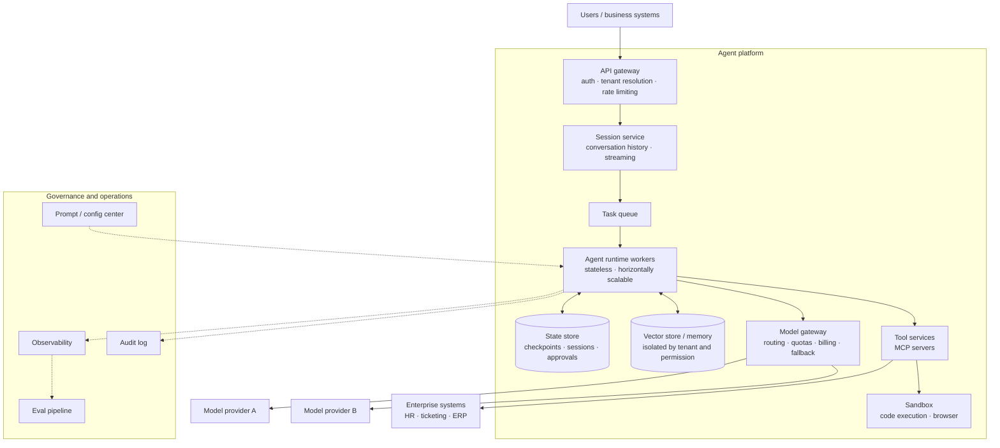
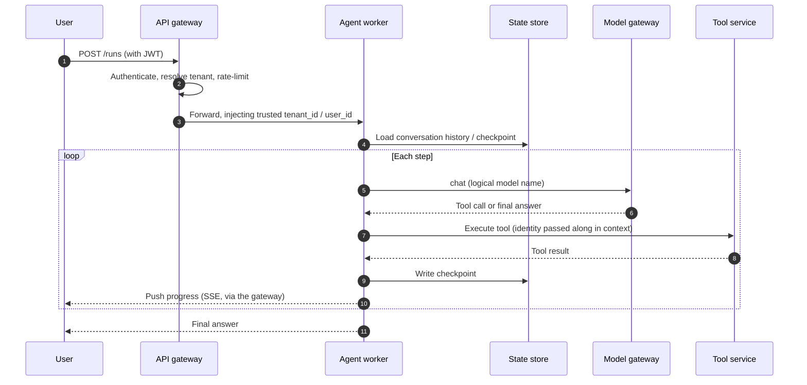
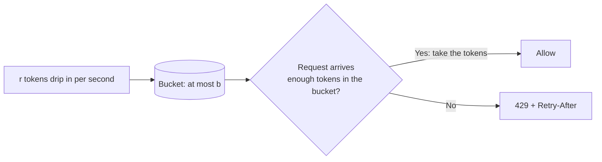

[中文](README.md) | [English](README.en.md)

# Lesson 12: Production architecture — from script to service

> 🕐 Time: 15 min | 🎯 You'll be able to: draw a reference architecture for an enterprise agent platform and explain what problem each component solves, and make sound calls on the key architectural decisions: sync vs async, stateful vs stateless, tenant isolation, framework choice, and model gateways | 📦 Source: this lesson's exercise (multi-tenant rate limiting, model routing), `agentkit/state.py`, `agentkit/llm.py`; for a complete service example, see `capstone/server.py`
>
> 📖 Primary reading: [12-Factor Agents - Principles for building reliable LLM applications](https://github.com/humanlayer/12-factor-agents) (Dex Horthy, 2025) — HumanLayer's twelve principles for turning an agent into software you can put in front of customers, mapping directly onto this lesson's problem cards on async tasks, stateless workers, and framework choice; focus on Factor 5 (unify execution state and business state), Factor 6 (launch/pause/resume with simple APIs), and Factor 8 (own your control flow).

## 0. In one sentence

**Cooking dinner at home and running a restaurant chain that serves over ten thousand guests a day are two completely different jobs.** A restaurant chain needs a host stand and a queue-number system, cooks who can cover for one another, order tickets that record exactly what each table ordered, centralized purchasing, food-safety spot checks, and clean books for every branch.

Agents are the same. `python agent.py` runs just fine on your laptop. Then, at 9 a.m. on a Monday, 5,000 employees open the HR assistant at the same time:

| Symptom | What's missing | Where it's covered |
|---|---|---|
| The model provider returns 429 and half the requests fail | Rate limiting; retries and fallback in the model gateway | This lesson's exercise, Lesson 08, Problem 5 |
| One department's script calls the agent in an infinite loop and burns through the whole company's quota | Multi-tenant rate limiting | This lesson's exercise |
| "Summarize my department's leave last quarter" takes 2 minutes, but the gateway times out at 60 seconds | Async tasks | Problem 1 |
| A rolling deploy loses all 200 in-flight tasks | Stateless workers + checkpoints | Problem 2, Lesson 13 |
| Company A's employees see Company B's policies | Multi-tenant isolation | Problem 3, Lesson 15 |
| Someone edits the prompt, everyone gets wrong answers all afternoon, and rolling back requires a new deploy | Config center, progressive rollout, rollback | Lesson 16 |
| At month-end, finance asks: how much did AI cost, and which department should pay for what? | Cost attribution | This lesson's demo, Lesson 14 |

This lesson is the **architecture overview** for Part 2. It starts with a complete reference architecture diagram and what problem each component solves, then works through 5 key architecture-level decisions. Deeper topics (concurrency, cost, RAG, release and operations) each get their own lesson in Lessons 13-16.

## 1. Core concepts

### 1.1 Reference architecture



### 1.2 Component map: what each component solves

| Component | Problem it solves | In agentkit | Deep dive |
|---|---|---|---|
| API gateway | Authenticates callers, identifies the tenant, rate-limits, rejects oversized requests | This lesson's exercise: `TenantRateLimiter` | [Lesson 13](../13_distributed_concurrency/README.en.md) (global rate limiting and backpressure) |
| Session service | Multi-turn conversation history, streaming, reconnecting after a dropped connection | `RunResult.history` | Problem 1 |
| Task queue | Makes long tasks async, smooths out traffic peaks, retries failures | — | [Lesson 13](../13_distributed_concurrency/README.en.md) (lease-based queues, delivery semantics) |
| Agent runtime workers | Run the agent loop; stateless, so they can scale up or down at any time | [agent.py](../../agentkit/agent.py) | Problem 2, [Lesson 02](../02_agent_loop/README.en.md) |
| State store | Checkpoints, sessions, approval state | [state.py](../../agentkit/state.py) | [Lesson 08](../08_reliability/README.en.md), [Lesson 13](../13_distributed_concurrency/README.en.md) (concurrent writes) |
| Vector store / memory | Knowledge retrieval and long-term memory, isolated by tenant and permission | [memory.py](../../agentkit/memory.py) | [Lesson 04](../04_context_memory/README.en.md), [Lesson 15](../15_enterprise_rag/README.en.md) |
| Model gateway | Unified interface, key custody, routing, quotas, billing, fallback, caching | [llm.py](../../agentkit/llm.py), [reliability.py](../../agentkit/reliability.py), this lesson's exercise: `choose_model` | Problem 5, [Lesson 14](../14_cost_latency/README.en.md) |
| Tool services | Wrap enterprise systems as standardized tools (MCP) | [tools.py](../../agentkit/tools.py) | [Lesson 03](../03_tools/README.en.md), Section 1.5 |
| Sandbox | Isolated execution of untrusted code and web browsing | — | [Lesson 09](../09_security/README.en.md) |
| Guardrails and permissions | Injection detection, redaction, least privilege, human approval | [guardrails.py](../../agentkit/guardrails.py), [permissions.py](../../agentkit/permissions.py) | [Lesson 09](../09_security/README.en.md) |
| Prompt / config center | Versioning, progressive rollout, and rollback for prompts and config | — | [Lesson 16](../16_release_ops/README.en.md) |
| Observability | Tracing, metrics, alerting | [tracing.py](../../agentkit/tracing.py), [viewer.py](../../agentkit/viewer.py) | [Lesson 10](../10_observability/README.en.md) |
| Eval pipeline | Offline evals, CI gates, online sampled evaluation | [evals.py](../../agentkit/evals.py) | [Lesson 11](../11_evals/README.en.md) |
| Audit log | Who did what, when, and under which identity | [audit.py](../../agentkit/audit.py) | [Lesson 09](../09_security/README.en.md) |

### 1.3 The journey of a request



Three key points:

1. **Identity is verified once, at the gateway, and then passed down as trusted context** (`ToolContext` from Lesson 03). The model never gets a chance to "declare who it is."
2. **Every step writes a checkpoint**, so any worker can be replaced at any moment (Problem 2).
3. **Workers only know logical model names** (`mini`, `pro`). Which provider and which model sit behind each name is up to the model gateway (Problem 5).

### 1.4 Two gatekeepers: rate limiting and model routing (this lesson's exercise)

**Rate limiting: the token bucket.** Picture a bucket that holds at most b tokens, with r tokens dripping in every second at a steady rate; once it's full, the extra tokens spill over. Each request has to take tokens to get through. If there aren't enough, it gets `429 Too Many Requests`, with a `Retry-After` header telling the client how long to wait before trying again.



- **b sets the burst size**: after an idle stretch, how many requests can go through back to back. **r sets the long-term average rate.**
- Compared with a **fixed window** of "at most N per minute," a token bucket has no window-boundary problem. With a fixed window, up to 2N requests can get through in a short span straddling the boundary between two windows.
- For LLMs you need to limit two things at once: requests (RPM) and tokens (TPM). A request can deduct tokens based on its expected token usage; that's what `try_acquire(tokens=...)` is for.
- **One bucket per tenant** prevents the "noisy neighbor" problem; a global bucket around them protects the total upstream model quota. With multiple replicas, bucket state has to live in shared storage such as Redis and be updated atomically. Stripe's engineering blog post *Scaling your API with rate limiters* describes their approach based on token buckets and Redis. Distributed rate limiting and backpressure are covered in [Lesson 13](../13_distributed_concurrency/README.en.md).

**Model routing: good enough is good enough.** Most requests are simple and can go to a cheap model; only the hard ones need a strong model. The rule order in this lesson's exercise is: **hard constraints first (does it need tool calling, does the context fit), then quality requirements (high complexity means strong models only), and only then pick the cheapest of the remaining candidates**. In the demo, routing this way cuts the daily bill by 69% compared with "use the strong model for everything." A step further is a **cascade**: let the cheap model answer first, and escalate to the strong model if the answer fails validation; see [Lesson 14](../14_cost_latency/README.en.md). Keep in mind that routing changes who answers, so every model that requests can be routed to needs its own run of the eval set (Lesson 11).

### 1.5 MCP and A2A: standard interfaces in two directions

| | MCP (Model Context Protocol) | A2A (Agent2Agent) |
|---|---|---|
| What it solves | How AI applications and agents **connect to tools and data** (vertical) | How **different agents** collaborate (horizontal), even when they use different frameworks and come from different vendors |
| Origin and stewardship | Released by Anthropic in November 2024; donated in December 2025 to the Agentic AI Foundation, newly formed under the Linux Foundation | Released by Google in April 2025; donated to the Linux Foundation in June 2025 |
| Core concepts | Servers expose tools, resources, and prompts; a client inside the AI application connects to servers and calls them | An Agent Card describes an agent's capabilities; agents collaborate in units of "tasks" |
| Place in the architecture | The tool service layer: wrap HR, ticketing, and ERP systems as MCP servers that any MCP-capable agent can use | Connecting your agents with agents from other teams and other companies |

The A2A website sums up the relationship like this: use MCP to give a single agent the tools it needs, and use A2A to let those agents work together. When an enterprise connects to MCP servers, it should manage them like a **supply chain**: connect only vetted servers, pin their versions, and remember that tool descriptions themselves can hide injected instructions (Lesson 09).

## 2. Enterprise problem cards

### Problem 1: A task takes 2 minutes. How do you get the result back to the user?

**Scenario**: In an HR assistant, "summarize my department's leave last quarter and generate a report" takes 8 steps and 90 seconds on average, and up to 4 minutes at worst, while the company load balancer's idle timeout is 60 seconds. Leave requests also have to wait for a manager's approval, which may come hours later.

**Why it's hard**: Synchronous requests get cut off by the gateway timeout. A user staring at a blank page for 90 seconds assumes it's stuck and keeps clicking "retry," which creates duplicate submissions. And no network connection will survive hours of waiting for approval.

| Option | How | Pros | Cons | Best for |
|---|---|---|---|---|
| A. Synchronous request-response | One HTTP request that waits for the agent to finish before returning | Simplest; easiest client code | Fails once it exceeds the gateway timeout; users wait with no feedback; ties up connections for a long time | Q&A that finishes within a few seconds |
| B. Streaming (SSE) | The server keeps pushing events over `text/event-stream`: tokens, "Looking up leave records…", the final result | Feels fast because the first event arrives quickly; simpler than WebSocket; the browser's `EventSource` reconnects automatically and sends `Last-Event-ID` | Still one long-lived connection, subject to gateway and proxy timeouts and buffering; what happens to the task when the connection drops needs a separate design | Interactive chat (a few seconds to a minute or two) |
| C. Async tasks | Return `202 Accepted` and a task_id immediately on submission; the task goes into a queue and a worker runs it; the client polls for status, or the server pushes the result via webhook or notification | Not bound by connection lifetime; queues absorb peaks and failures can be retried; naturally supports "pause for approval" | More complex architecture (queue, state store, notifications); you need to design the "in progress" user experience | Long tasks, batch jobs, flows that need human approval |

**How to choose**: Decide by task duration and whether a human needs to step in. Use A for anything that finishes within 10 seconds, default to B for interactive chat, and use C for anything longer than a minute or two, or anything that may pause for approval. The most common real-world pattern is **C + B combined**: the task runs asynchronously with its state persisted, the client subscribes to progress over SSE, and after a disconnect it resubscribes using the task_id. Remember: **streaming is just a transport, and a task's lifecycle must never be tied to a connection.** If the connection drops, the task keeps running.

**In this lesson**: The "pause → save state in a checkpoint → another worker resumes" flow in Section 4 of the demo is the core mechanism behind option C. [capstone/server.py](../../capstone/server.py) turns it into an HTTP API (`POST /runs` to start, `GET /runs/{run_id}` to poll, `POST /runs/{run_id}/approval` to resume after approval). Task queues, leases, and delivery semantics are covered in [Lesson 13](../13_distributed_concurrency/README.en.md).

### Problem 2: Should agent workers keep sessions in memory?

**Scenario**: The agent service runs on 3 machines, with rolling deploys twice a day. During one deploy, all 200 in-flight tasks are lost; some of them had already submitted leave requests on users' behalf but hadn't told the users the outcome yet. Meanwhile, some users' second turns get load-balanced to a different machine, and the agent has no memory of the previous turn.

**Why it's hard**: Keeping state in memory is the fastest and simplest option, but machines restart and scale up and down. Moving state out of process creates new problems: what if two workers handle the same session at once? What if the process crashes after a tool has run but before the checkpoint is written?

| Option | How | Pros | Cons | Best for |
|---|---|---|---|---|
| A. Stateful + sticky sessions | The load balancer pins each session to one machine, and state lives in memory | Simple; lowest latency | Restarts and deploys lose state; uneven load; can't scale freely | Prototypes, small internal tools |
| B. Stateless workers + external state | Write state to Postgres / Redis at every step (checkpoints), so any worker can pick up any task | Horizontal scaling, rolling deploys, and crash recovery all become simple | An extra read/write per step; you have to handle concurrency (locks or version numbers) and the "executed but not recorded" window (idempotency) | The default for most production systems |
| C. Durable execution engine | Use an engine like Temporal: write orchestration logic as workflows and model and tool calls as activities; the engine records event history and replays it to recover after a crash | Retries, timeouts, long waits, and crash recovery are guaranteed by the engine | One more piece of infrastructure; programming constraints (workflow code must be deterministic); steep learning curve | Long flows that span multiple systems where failure is costly (e.g. anything involving money) |

**How to choose**: Default to B. Consider C when flows are long, span multiple systems, and failure is costly. Use A only for prototypes. Whether you choose B or C, **write tools must be idempotent** (Lesson 08): replaying a tool call during recovery must never charge a customer twice or submit a request twice.

**In this lesson**: agentkit implements option B with checkpoints. The main loop calls `checkpointer.save` at every step, and `FileCheckpointer` writes to a temp file first and then atomically replaces the original (see [agentkit/state.py](../../agentkit/state.py)). In Section 4 of the demo, worker A pauses and is destroyed, and worker B picks up from the checkpoint and finishes the job; the identity, the pending call awaiting approval, and the approval record are all in the checkpoint. In production, swap the files for Postgres / Redis. For multiple workers writing to the same session concurrently (distributed locks, optimistic concurrency, per-partition serialization, fencing tokens), see [Lesson 13](../13_distributed_concurrency/README.en.md).

### Problem 3: How far should multi-tenant isolation go?

**Scenario**: A SaaS HR assistant serves 300 enterprise customers. Two of them are banks that require "our data must not be stored alongside other customers' data"; most of the rest are price-sensitive small and midsize businesses. In one incident, the semantic cache wasn't partitioned by tenant, and Company A's employees received Company B's annual leave policy.

**Why it's hard**: The more complete the isolation, the safer, but cost and operational burden grow linearly with the number of tenants. The more you share, the cheaper it gets, but every layer (database, vector store, cache, memory, logs, quotas) has to isolate tenants correctly, and missing a single spot means a data leak.

The three models in the table below borrow their terms from the AWS whitepaper *SaaS Tenant Isolation Strategies*:

| Option | How | Pros | Cons | Best for |
|---|---|---|---|---|
| A. Dedicated deployment (silo) | Each tenant gets its own services and storage | Strongest isolation, meets strict compliance requirements; one tenant's problems don't affect others | Expensive; upgrading and operating hundreds of deployments is a heavy burden | A few large customers, heavily regulated industries |
| B. Shared deployment + logical isolation (pool) | All tenants share services and storage; every record carries a tenant_id, and every query, cache key, and vector search filters by tenant | Low cost, simple operations, high resource utilization | Isolation depends entirely on correct code, and a single missing filter leaks data; noisy neighbors | Large numbers of small and midsize tenants |
| C. Hybrid (bridge) | Shared by default; large customers or sensitive components get dedicated deployments (e.g. separate databases and vector stores), while the compute layer stays shared | Lets you trade cost against isolation case by case | Both models coexist, so architecture and operations get more complex | SaaS products whose customers vary widely in size |

**How to choose**: Tier customers by compliance requirements first. Customers with an explicit "physical isolation" requirement get A, or at least C with a dedicated data layer; everyone else gets B. With B, isolation must be the **framework's default behavior**, not something every developer has to remember to add: identity is injected by the gateway, the storage layer enforces tenant_id, cache keys include tenant_id, each tenant has its own rate-limit bucket and quota, and cost is attributed per tenant. Isolation points that agent systems are especially prone to miss: long-term memory, semantic caches, retrieval indexes, tool credentials (each tenant should use its own credentials to access its own enterprise systems), and trace data.

**In this lesson**: The exercise's `TenantRateLimiter` gives each tenant its own bucket; in agentkit, identity in `ToolContext` is injected by the system, and `MemoryStore` isolates data by tenant and user (Lesson 04). In Section 3 of the demo, employees of different tenants ask the same question and each get their own tenant's data, with cost booked per tenant. Permission-aware retrieval and index isolation are covered in [Lesson 15](../15_enterprise_rag/README.en.md).

### Problem 4: Build it yourself, use a framework, or use a managed platform?

**Scenario**: A 5-person team needs to launch 3 internal agents (HR, IT, and expense reimbursement) within a quarter. The company has a Kubernetes platform but no dedicated AI platform team. The security team requires every tool call to be auditable and every high-risk operation to go through human approval.

**Why it's hard**: Frameworks save you the boilerplate of the agent loop, tool calling, and multi-agent orchestration, but they may box you in on permissions, auditing, and data flow. Building it yourself gives you the most control, but you have to build durability, tracing, and evals on your own. Managed platforms save the most ops work, but your data and runtime live with someone else, and there's a risk of lock-in.

| Option | How | Pros | Cons | Best for |
|---|---|---|---|---|
| A. Build it yourself | Write your own agent loop, tool layer, and hooks, and plug into the company's existing storage, tracing, and auth (this course's agentkit is a teaching version of this) | Full control, seamless integration with existing infrastructure, no unnecessary abstractions | You build durable execution, concurrency, evals, and more yourself; high maintenance cost | Core business, strict security and compliance requirements, deep customization |
| B. Open-source framework | LangGraph, OpenAI Agents SDK, Claude Agent SDK, Google ADK, and others (see the table below) | Fast development, community ecosystem, ready-made best practices | The abstractions may not fit; versions change quickly; when something breaks, you end up reading framework source code | Most new projects |
| C. Managed platform | A cloud or model vendor hosts the runtime, memory, identity, observability, and more. Examples: Amazon Bedrock AgentCore (with components such as Runtime, Gateway, Memory, Identity, and Observability) and Anthropic's Managed Agents (a hosted agent runtime and sandbox) | Least ops work; you get enterprise-grade capabilities quickly | Data and execution environment sit with a third party; vendor lock-in; limited customization | No platform team, a need to launch fast, and compliance allows it |

Common frameworks compared (only well-established facts are listed; see each project's official docs for details):

| | Maker | Positioning and core abstractions | Durability and recovery | Languages |
|---|---|---|---|---|
| [LangGraph](https://docs.langchain.com/oss/python/langgraph/overview) | The LangChain team | Low-level orchestration framework that models agents and workflows as graphs (nodes, edges, shared state) | Persistence through checkpointers; supports resuming after human intervention | Python, JavaScript |
| [OpenAI Agents SDK](https://openai.github.io/openai-agents-python/) | OpenAI (released March 2025) | Lightweight framework: Agent, handoff, guardrail, and session, with built-in tracing | Sessions manage conversation memory; can integrate with Temporal for durable execution | Python, TypeScript |
| [Claude Agent SDK](https://code.claude.com/docs/en/agent-sdk/overview) | Anthropic (renamed from the Claude Code SDK in September 2025) | Provides the agent loop behind Claude Code as a library: built-in tools, hooks, subagents, MCP, permission controls | Sessions can be resumed and forked | Python, TypeScript |
| [Google ADK](https://google.github.io/adk-docs/) | Google (released April 2025) | Code-first open-source framework: multi-agent composition, a tool ecosystem, evaluation, and a dev UI | Provides session / state management | Python, Java, Go, TypeScript, and more |
| [Temporal](https://docs.temporal.io) | Temporal (open source, MIT license) | Not an agent framework but a durable execution platform: workflows handle orchestration, activities perform side-effecting operations | Event history is persisted and replayed to recover after a crash | SDKs for many languages |

**How to choose**: Start by answering two questions. Is this agent core to the business, and does it have special permission and audit requirements? Does the team have the capacity to operate a platform? The usual path is to start with B, picking a framework that matches your model, language, and cloud. For core business with lots of custom needs, use A, or "your own shell around a framework core." If there's no platform team and compliance allows it, consider C. Whichever you choose, **own the cross-cutting capabilities yourself: identity injection, permissions, auditing, and evals.** A framework can save you from writing the loop; it can't save you from building eval sets, a permission model, and cost controls.

**In this lesson**: agentkit is a teaching version of option A. Its core design elements (hooks, checkpoints, `ToolContext`, tracing, evals) all have counterparts in the frameworks above. Once you really understand it, you'll pick up any of them quickly.

### Problem 5: Model gateway: build it, use open source, or use your cloud vendor's?

**Scenario**: The company uses 3 model providers, and 12 teams have each hard-coded API keys into their own code. One day a key leaks to a public repository, and nobody can say which services depend on it. At month-end, finance asks how much AI cost and which department should pay for what, and nobody can answer that either.

**Why it's hard**: The model gateway sits on the critical path of every model call. If it goes down, every agent in the company stops; if it's slow, every step is slow. And it has a long list of responsibilities: unified interface, key custody, routing, quotas, billing, fallback, caching, and auditing. Building one is significant work, and adopting an off-the-shelf one means evaluating its performance, data compliance, and extensibility.

| Option | How | Pros | Cons | Best for |
|---|---|---|---|---|
| A. Build a thin proxy | Write your own OpenAI-compatible proxy that handles auth, forwarding, and accounting, then add routing and fallback as needed | Full control; deep integration with internal auth and billing systems | You have to keep up with every provider's API differences and changes yourself, and add features piece by piece | Teams with a platform team and special requirements |
| B. Open-source gateway | For example, [LiteLLM](https://github.com/BerriAI/litellm): an open-source Python SDK plus proxy server that provides unified, OpenAI-format access to 100+ model providers, with virtual keys, spend tracking per key / user / team, budgets, rate limiting, load balancing, and fallback | Feature-rich and quick to launch; self-hostable, so data stays in-house | You're responsible for its high availability; you need to evaluate its performance and the cadence of its security updates | The starting point for most enterprises |
| C. Cloud vendor's AI gateway | For example, the AI gateway capabilities in Azure API Management (the token-based `llm-token-limit` policy, semantic caching) or Cloudflare AI Gateway (caching, rate limiting, analytics, fallback) | Managed, no ops work, integrates well with the same cloud's other services | Tied to one cloud vendor; less flexibility across clouds and providers | Teams already heavily invested in one cloud |

**How to choose**: The discipline that "every model call goes through the gateway" matters more than which product you choose. Most teams start with B or C; at very large scale or with special needs, they build on top of B or switch to A. Whichever you choose: business code knows only **logical model names** (`mini`, `pro`), with the real model decided by gateway config; the gateway itself runs with multiple replicas; and there's an emergency path that bypasses the gateway and connects directly to a provider.

**In this lesson**: agentkit's LLM abstraction (Lesson 02) means business code depends only on `chat(messages, tools)`. The exercise's `choose_model` plays the role of the gateway's routing rules, and Lesson 08's `ResilientLLM` plays the role of the gateway's retries, circuit breaking, and fallback. The cliproxyapi instance your local `.env` points to (`http://localhost:8317/v1`) is exactly this kind of OpenAI-compatible local proxy: your code only knows one address and one key, and the proxy decides which model sits behind them.

## 3. From toy to production: where agentkit fits in the reference architecture

agentkit's **design patterns** are production-grade, but agentkit itself is a teaching implementation: synchronous, single-process, with in-memory or local-file storage. Here's what each piece becomes in production:

| Capability | agentkit teaching implementation | In production |
|---|---|---|
| Agent loop | [agent.py](../../agentkit/agent.py), synchronous and single-process | A cluster of stateless workers driven by a queue (Problems 1 and 2) |
| Checkpoints | `InMemoryCheckpointer` / `FileCheckpointer` | Postgres / Redis, with version numbers or leases (Lesson 13) |
| Tool execution | In-process threads + timeouts | Separate tool services (MCP servers) + sandboxes (containers, gVisor, Firecracker). The comments in [tools.py](../../agentkit/tools.py) say so too: Python threads can't be forcibly killed, so high-risk tools must run in a separate process or sandbox |
| Model calls | `OpenAICompatLLM` + `ResilientLLM` | A model gateway (Problem 5) |
| Rate limiting | The in-memory token bucket from the exercise | Enforced centrally at the gateway; a distributed token bucket built on Redis + atomic scripts (Lesson 13) |
| Tracing | `Tracer` + JSONL + viewer | OTel SDK + Collector + backend (Lesson 10) |
| Prompts and config | Strings in code | Config center + versioning + progressive rollout (Lesson 16) |
| Auditing | `AuditLog` writing JSONL | Append-only, tamper-proof storage (Lesson 09) |
| Evals | `run_eval` | CI pipeline + online sampled evaluation (Lesson 11) |

**Two design decisions in the exercise:**

- **The token bucket uses "lazy refill."** Instead of running a background thread that adds tokens on a timer, each access works out how many tokens to add in one go, based on how much time has passed since the last update. It's O(1), needs no timer, and ports easily to an atomic Redis script. **The clock is injectable**, so tests can use a fake clock and get fully deterministic results. There's also an easy-to-miss edge case: when the clock goes backward, don't move "last updated" backward with it. Otherwise, when the clock catches up again, that interval gets counted twice and tokens appear out of thin air.
- **When routing can't find a suitable strong model, it raises an error instead of silently falling back to a weak one.** Silent fallback lets quality problems creep in without anyone noticing. Falling back should be an explicit decision by the caller, and it should be recorded in the trace.

The exercise's `TenantRateLimiter` keeps each tenant's bucket in an in-memory dict that only ever grows. In production, watch out for two things: evict tenants that have been inactive for a long time (LRU / TTL), or memory will grow without bound; and with multiple replicas, move the state into shared storage.

## 4. Hands-on: run the demo

```bash
python lessons/12_production_architecture/demo.py --offline   # fully offline (a few seconds)
python lessons/12_production_architecture/demo.py             # Sections 3 and 4 call a real model (about 30 seconds)
```

Sections 1 and 2 are pure simulations (with a fake clock), so both modes produce the same output. Here is an excerpt. (Demo output translated from Chinese.)

```
  Tenant    Sent    A. One global bucket (cap 60, 30/s)   B. One bucket per tenant (by plan)
  acme      100     allowed  54 ( 54%)                    allowed 100 (100%)
  globex    40      allowed  20 ( 50%)                    allowed  40 (100%)
  initech   5       allowed   1 ( 20%)                    allowed   5 (100%)
  hooli     500     allowed 281 ( 56%)                    allowed  14 (  3%)
...
  Total: $36.73/day with routing vs. $117.62/day using the strong model for everything, a 69% saving
...
  [hooli/u-carl] How many vacation days do I have left??   → 429 Too Many Requests (Retry-After: 60)
...
worker B: resuming from checkpoint run_id = 5af8f12fa345
  Tool result: submitted annual leave for acme/u-alice: 3 days starting 2026-10-08, approval ID LV-5af8f1
  Approval record (stored in the checkpoint for auditing): by=mgr-zhao  approved=True  comment=Approved, please arrange a proper handover  tool=submit_leave
```

**What to look for:**

1. **Section 1: with one global bucket, hooli alone drains the quota**, and acme, the top-paying tenant, has nearly half its requests rejected. With one bucket per tenant, hooli only exhausts its own allowance.
2. **Section 2: the vast majority of traffic is simple requests**, and a cheap model handles them fine. Requests that exceed every model's context window are rejected outright instead of being crammed in anyway.
3. **Section 3: employees of different tenants who ask the same question each get their own data**, because tools take identity from `ctx` instead of letting the model fill it in. Every cent can be attributed to a specific tenant. In real mode, all logical models map to the single real model available on this machine, and the demo prints a note saying so.
4. **Section 4: worker B has never seen this run before, yet it finishes it**, because the identity, the pending call awaiting approval, and the approval record are all in the checkpoint. This is what makes it possible for stateless workers to scale freely and survive rolling deploys.

## 5. Exercise

Open [exercise.py](exercise.py) and implement:

| What to write | Key points |
|---|---|
| `TokenBucket._refill / try_acquire / retry_after` | Lazy refill, capped at capacity; don't deduct tokens when there aren't enough; don't move time backward when the clock goes backward; `retry_after` returns `math.inf` when the wait would be forever |
| `TenantRateLimiter._bucket` | Create each tenant's bucket on demand and cache it; unregistered tenants get the default plan; all buckets share the same clock |
| `choose_model(task, models)` | Capabilities → capacity (input + output) → quality → cost; on a cost tie, keep list order; when no candidates remain, raise `NoModelAvailable` and say which rule eliminated them |

```bash
make lesson N=12
# equivalent to .venv/bin/python -m pytest lessons/12_production_architecture
```

When you're done, run the demo again: the first line will report that the implementation comes from exercise.py (your implementation).

## 6. Going deeper: launch checklist

Each item is tagged with the relevant lesson(s).

**Reliability**
- [ ] Model calls have timeouts, retries, and fallback (05)
- [ ] Steps, tokens, and spend are all capped (05)
- [ ] Every step writes a checkpoint, and write tools are idempotent (05, 10)
- [ ] Per-tenant rate limits and quotas (09, 10)

**Security**
- [ ] Identity is injected by the gateway; the model never gets identity parameters (02, 09)
- [ ] Least privilege, with human approval for high-risk operations (06)
- [ ] Untrusted code runs in a sandbox (06)
- [ ] Three layers of guardrails: input, output, and tool output (06)
- [ ] Secrets are held in the gateway or a key management service (09)

**Observability**
- [ ] Traces cover model and tool calls (07)
- [ ] Metrics dashboards and alerts (07)
- [ ] Users can report a run_id, and you can go from a complaint to the trace (07)
- [ ] A PII handling policy is in place (07)

**Evals**
- [ ] Eval set + CI gate, with a safety-case veto (08)
- [ ] Online sampled evaluation (08)

**Release and operations**
- [ ] Prompts and models are versioned (13)
- [ ] Progressive rollout and one-click rollback (13)
- [ ] Kill switch: shut off a single tool or the whole agent immediately when something goes wrong (13)

**Cost**
- [ ] Attribution by tenant and feature (09, 11)
- [ ] Budget alerts (07, 11)
- [ ] Model routing and caching (09, 11)

**Compliance**
- [ ] Complete, tamper-proof audit logs (06)
- [ ] Clearly defined data retention periods (07)
- [ ] The model providers' data processing terms, and any cross-border data transfer issues, have been reviewed

## 7. Common pitfalls and anti-patterns

1. **Treating an agent like an ordinary synchronous API**: long tasks get cut off by the gateway timeout, users keep retrying, and submissions get duplicated.
2. **Keeping state in worker memory**: every deploy loses tasks.
3. **Letting the model or the client declare identity**: `user_id` is a tool argument the model fills in, or client request headers are trusted blindly.
4. **Having only one global rate limit**: a single tenant can get every tenant 429'd.
5. **Every team integrating with model providers on its own**: keys scattered everywhere, costs impossible to account for, and no way to fall back uniformly during an incident.
6. **Shared caches without tenant_id**: the semantic cache returns Company A's answer to Company B.
7. **Routing rules that silently downgrade**: complex tasks get routed to a weak model, and nobody notices the quality problems.
8. **Picking a framework before working out the requirements**: the framework's abstractions don't match your permission and audit model, and you end up coding around the framework.
9. **Hard-coding prompts in code**: changing a single word requires a deploy, and there's no quick way to roll back when something goes wrong.

## 8. Interview & design review questions

<details>
<summary>Q1: Draw the architecture of an enterprise agent platform and explain which components a request passes through.</summary>

- Gateway (auth, tenant resolution, rate limiting) → session service → queue → stateless workers (agent loop) → model gateway / tool services (MCP) / sandbox.
- State store (checkpoints, sessions, approvals), plus a vector store and memory (isolated by tenant and permission).
- Governance: config center, observability, eval pipeline, audit log.
- Key points: identity is verified once at the gateway and injected into the context; every step writes a checkpoint; workers only know logical model names.
</details>

<details>
<summary>Q2: A task may run for several minutes and may need to wait for human approval. How do you design the interaction?</summary>

- Async task: return 202 and a task_id on submission; the task goes into a queue and its state is persisted.
- Push progress over SSE; after a disconnect, the client resubscribes with the task_id, or polls instead.
- While waiting for approval, pause and write a checkpoint; once approved, any worker can resume the run.
- Deliver the result via in-app message or webhook; write tools are idempotent, so duplicate submissions don't execute twice.
</details>

<details>
<summary>Q3: Why should workers be stateless? What new problems does that introduce?</summary>

- Benefits: horizontal scaling, rolling deploys, and crash recovery all become simple.
- New problems: an extra read/write per step; multiple workers handling the same session concurrently (which needs locks, version numbers, or per-session partitioned serialization); a tool that ran before its checkpoint was written (which needs idempotency).
- For long flows where failure is costly, consider a durable execution engine such as Temporal.
</details>

<details>
<summary>Q4: You have 300 tenants, 2 of which are banks. How do you design isolation?</summary>

- Hybrid model: the banks get a dedicated data layer (separate databases and vector stores, possibly even separate keys), while all other tenants share a deployment with logical isolation.
- In the shared part, isolation is guaranteed by the framework by default: identity injected by the gateway, tenant_id enforced by the storage layer, tenant_id included in cache keys.
- Each tenant gets its own rate-limit bucket and quota, and cost is attributed per tenant.
- Easy-to-miss spots: memory, semantic caches, retrieval indexes, tool credentials, trace data.
</details>

<details>
<summary>Q5: A team is launching its first agent. Would you recommend building it from scratch or using a framework?</summary>

- Start from the constraints: whether it's core business, the permission and audit requirements, the team's ops capacity, and data compliance.
- Usually start with a mature open-source framework that matches your model, language, and cloud.
- No matter what, own the cross-cutting capabilities yourself: identity injection, permissions, auditing, and evals.
- For core business with lots of custom needs, consider building it yourself or "your own shell around a framework core"; with no platform team and compliance permitting, consider a managed platform.
</details>

<details>
<summary>Q6: Why do you need a model gateway? What capabilities should it have?</summary>

- A unified interface decouples business code from providers; centralized key custody means keys can be rotated in one place after a leak.
- Routing (picking a model per task), quotas and rate limiting, billing per tenant / team.
- Retries, circuit breaking, fallback, caching, audit logs.
- Discipline: every model call goes through the gateway; the gateway itself runs with multiple replicas and keeps an emergency direct-connect path.
</details>

## 9. Self-check

- [ ] I can draw the reference architecture and say what problem each component solves
- [ ] I can choose between synchronous, streaming, and async based on task duration and whether approval is needed
- [ ] I can explain why workers should be stateless, and which new problems that creates
- [ ] I can explain the trade-offs between the silo, pool, and bridge isolation models, and the isolation points agent systems tend to miss
- [ ] I can explain how to decide between building it yourself, using a framework, and using a managed platform
- [ ] I can explain what a model gateway is responsible for, and why business code should only know logical model names
- [ ] I can explain what each of the token bucket's two parameters controls, and why each tenant needs its own bucket
- [ ] I've finished the exercise: `make lesson N=12` passes

## 10. Design exercise on paper

**Requirements**: Design an "HR policy Q&A + leave requests" agent for a 5,000-person company.

- Employees are spread across 3 cities, and some policies (such as certain leave rules) differ from city to city.
- There are about 300 HR policy documents, updated once a quarter.
- Leave requires approval from the employee's direct manager; leave longer than 5 days also requires HR approval.
- Peak time is 9-10 a.m. on Mondays, with about 800 conversations averaging 4 turns each.
- Employee data (salaries, reasons for sick leave) is highly sensitive.
- Requirements: policy Q&A must have p95 latency < 5 seconds, and answers must cite the original policy text.

**Answer the following design questions** (write your own answers first, then expand the reference points):

1. Should policy Q&A and leave requests each be synchronous, streaming, or async?
2. Draw your architecture: which components from the reference architecture do you use?
3. Identity and permissions: who can see whose leave records? At which step does the model get the user's identity?
4. Leave approval: where does state live while waiting? What happens if a worker restarts? What if the manager approves a day later?
5. Capacity estimate: how many model calls per second at peak? Roughly how many tokens and how much money per month? How do you set the rate limits?
6. Model routing: which model tier do you use for Q&A, for leave requests, and for complex policy interpretation?
7. Knowledge base: after a policy update, how do you make sure the old version is no longer cited? How do you handle differences between cities?
8. Evals and observability: how do you build the eval set before launch? Which metrics do you watch after launch?
9. Privacy: how do you handle sensitive information such as sick-leave reasons in traces, in logs, and with the model provider?
10. Release: how do you roll out prompt changes progressively? How do you mitigate when something goes wrong?

<details>
<summary>Reference points (write your own answers before expanding)</summary>

1. **Interaction model**: policy Q&A uses streaming (SSE); the p95 < 5 s requirement is met mainly by getting the first event out as fast as possible and cutting the number of steps. Leave requests use async tasks (the C + B combination): after submission, the request enters an "awaiting approval" state, and the approval result is delivered via IM or in-app message.
2. **Architecture**: gateway (SSO / JWT auth, rate limiting) → session service → workers (agent loop) → model gateway. Tool services include "policy search" (vector store + filtering by city), "check leave balance," and "submit leave request" (a write operation that needs approval). The state store holds checkpoints and approval state. The config center, observability, evals, and auditing are all in place.
3. **Identity and permissions**: identity comes from SSO and is injected into `ToolContext` by the gateway. "Check balance" can only look up the requester's own balance; managers can only see requests from their direct reports; HR can see everything, but every access is audited. The model only sees data that tools return and that the current user is allowed to see.
4. **Approval**: after `PauseRun`, the checkpoint is written to Postgres. When the approval system calls back, any worker resumes the run via `approve(run_id, by=approver)`. Requests longer than 5 days need two levels of approval, which can be modeled as two pauses. Set up reminders for approvals that time out, plus automatic expiry. `submit_leave` uses run_id + call id as its idempotency key.
5. **Capacity estimate** (assuming an average of 2.5 model calls per turn, each with 3,000 input tokens and 300 output tokens): the peak hour has 800 × 4 = 3,200 turns, or about 0.9 turns and 2.2 model calls per second. Allowing for minute-level bursts (3-5×), design for about 10 model calls per second. By Little's Law (concurrency = arrival rate × average duration), with each call taking about 4 seconds, you need to support about 40 concurrent model calls. Assuming 3,000 conversations a day and 22 working days a month, that's about 2 billion input tokens and 200 million output tokens per month. At the example prices in this lesson's demo, that comes to about $420 a month using `mini` for everything versus about $9,000 using `pro`, so the value of model routing is obvious. Rate limits: a handful of requests per employee per minute (to stop script abuse), one bucket per department, and a global bucket on the outside aligned with the model provider's quota.
6. **Routing**: simple policy Q&A and balance lookups use a cheap model; anything that cross-references multiple policies or compares cities uses a strong model; parameter extraction for leave submissions uses a mid-tier model with strict schema validation. Every model that requests can be routed to must run the eval set.
7. **Knowledge base**: documents carry a version number and an effective date. On an update, replace the whole document and rebuild its index, mark the old version as inactive, and retrieve only active versions. Documents carry a city tag, and retrieval filters by the employee's city (with identity taken from ctx). Answers must include citations, and each citation must be verified to actually come from the retrieval results (Lesson 15).
8. **Evals and observability**: before launch, HR writes 50 core cases covering the differences between the three cities, edge cases (insufficient leave balance, leave spanning the new year), and adversarial cases (impersonating a manager to self-approve, asking for someone else's sick-leave reason); safety cases have veto power. Metrics to watch after launch: success rate, p95 latency, citation-verification pass rate, human-handoff rate, cost per conversation, and average approval time.
9. **Privacy**: sick-leave reasons live only in the business system, and the agent has no need to read them (least privilege). Traces don't record content by default, and tool arguments are redacted. Confirm the model provider's data processing terms (whether data is used for training, how long it's retained, and in which region it's stored); for sensitive scenarios, consider a privately deployed model.
10. **Release**: prompts live in the config center under version control. A change first goes through the eval gate, then rolls out progressively by employee ID hash, 5% → 25% → 100%, while you watch the metrics. Prepare a kill switch (one click to disable the "submit leave request" tool and fall back to the manual process) and one-click rollback to the previous prompt version (Lesson 16).
</details>

## Further reading

- [Anthropic · Building effective agents](https://www.anthropic.com/engineering/building-effective-agents): when to use workflows and when to use agents, and "don't make it complex when simple will do"
- [Model Context Protocol website](https://modelcontextprotocol.io), [MCP joins the Agentic AI Foundation](https://blog.modelcontextprotocol.io/posts/2025-12-09-mcp-joins-agentic-ai-foundation/)
- [A2A Protocol website](https://a2a-protocol.org), [Google Cloud donates A2A to the Linux Foundation](https://developers.googleblog.com/en/google-cloud-donates-a2a-to-linux-foundation/)
- [AWS whitepaper · SaaS Tenant Isolation Strategies](https://docs.aws.amazon.com/whitepapers/latest/saas-tenant-isolation-strategies/saas-tenant-isolation-strategies.html): the silo / pool / bridge isolation models
- [Stripe · Scaling your API with rate limiters](https://stripe.com/blog/rate-limiters): token-bucket rate limiting in production
- [LiteLLM](https://github.com/BerriAI/litellm): an open-source LLM gateway
- [Temporal docs](https://docs.temporal.io): durable execution
