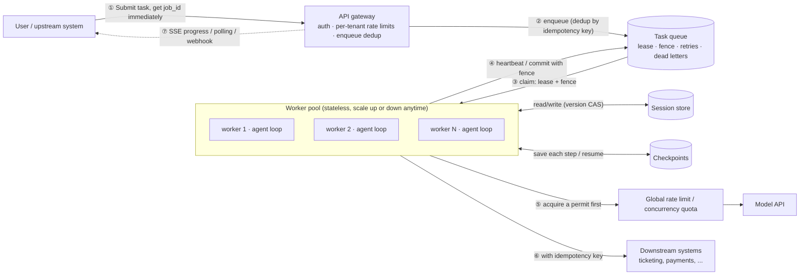
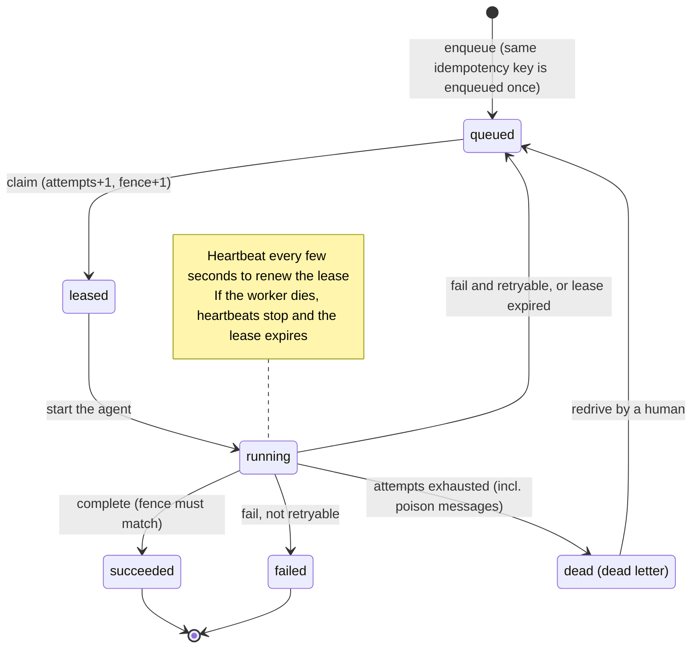
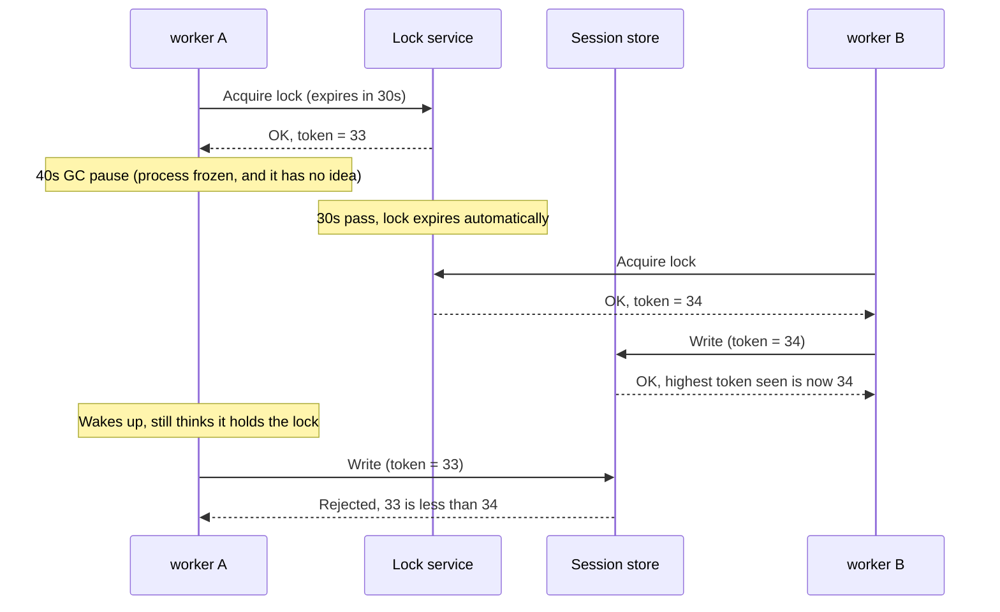
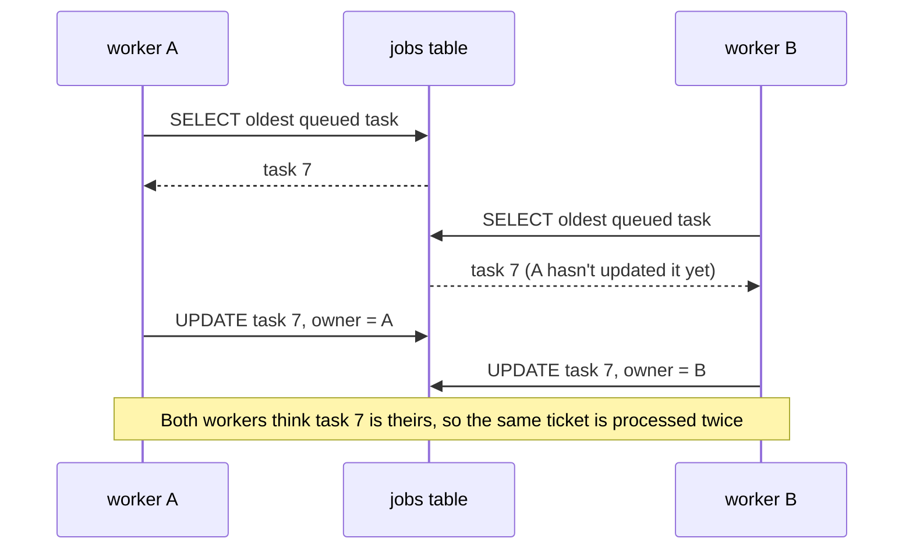

[中文](README.md) | [English](README.en.md)

# Lesson 13: High concurrency and distributed execution — when one machine isn't enough

> 🕐 Time: 25 min | 🎯 You'll be able to: scale a single-process agent into a cluster of workers, keep tasks from being lost, duplicated, reordered, or overwhelmed, and pick among several solutions for each problem with clear reasoning | 📦 Source: [`jobqueue.py`](jobqueue.py) (lease queue), [`session_store.py`](session_store.py) (optimistic concurrency), [`agentkit/state.py`](../../agentkit/state.py) (checkpoints), [`agentkit/tools.py`](../../agentkit/tools.py) (idempotency keys)

## 0. In one sentence

**The hard part of distributed systems isn't getting many machines to work together. It's making sure that when one of them gets slow, dies, or only *looks* dead, no work is lost, duplicated, or scrambled.**

Picture a restaurant kitchen. It starts with one cook (a single process). Business picks up, you hire eight (multiple workers), and a new set of problems shows up right away:

| What happens in the kitchen | What distributed systems call it | This lesson's fix |
|---|---|---|
| Two cooks grab the same ticket and the dish gets made twice | Double claim | **Atomic claim** |
| A cook faints halfway through with the ticket in his pocket; the table waits forever | Worker crash, lost task | **Lease**: you only "borrow" a ticket for 10 minutes, then it goes back on the rail |
| The fainted cook wakes up and sends out a cold plate, replacing the one the new cook made | Zombie worker | **Fencing token**: the pass only accepts the newest ticket number |
| The dish gets remade and the customer's card gets charged twice | Duplicate side effect | **Idempotency key** |
| One table orders two more dishes; two servers each edit the bill and the later write wipes out the earlier one | Lost update | **Version-number CAS** / one server per table |
| Eight cooks fighting over three ovens | Shared quota | **Semaphore / token bucket / queueing** |
| The ovens break for a bit and all eight cooks retry every second | Retry storm | **Backoff + jitter + circuit breaking** |

**Why do agents trip over this more easily than ordinary web services?**

- **Tasks are long.** A normal API call returns in 100 ms; an agent run takes 10 seconds to several minutes. The longer a task runs, the more likely it is to overlap a deploy, a crash, or a timeout.
- **Every step costs something.** Running a task twice means paying for the model twice, and possibly filing the ticket or issuing the refund twice.
- **The bottleneck isn't yours.** Model APIs cap requests per minute (RPM) and tokens per minute (TPM). No number of machines gets you past that.
- **Agents are stateful.** Conversation history, checkpoints, and runs paused for approval all have to be shared across machines.

Start with some arithmetic. **Little's Law**: the number of tasks in flight = arrival rate × average time per task. If the morning peak brings 20 requests per second and each agent task takes 15 seconds on average, you have 20 × 15 = **300 tasks** running at once. A 32-thread process can't hold that, and all 300 half-finished tasks get interrupted together at the next deploy.

This lesson turns that kitchen table into a system that really runs across multiple processes.

## 1. Core concepts

### 1.1 The big picture: centralize the state, make the workers stateless



| Layer | Stateful? | How it scales | Where in this lesson |
|---|---|---|---|
| API gateway | No | Add machines freely | [Lesson 12](../12_production_architecture/README.en.md) (auth, per-tenant rate limiting) |
| Task queue | **Yes** (durable) | Switch to a dedicated queue / partition it | [`jobqueue.py`](jobqueue.py) |
| Workers | **No** | Add or remove processes based on queue backlog | `agent_worker` in [`demo.py`](demo.py) |
| Session store, checkpoints | **Yes** | Database / KV store | [`session_store.py`](session_store.py), `FileCheckpointer` |
| Rate limits / quotas | **Yes** (counters) | Centralized (Redis) | `LimitedLLM` in the demo |
| Downstream systems | Yes | Not yours to scale, but they must support idempotency keys | `TicketSystem` in the demo |

The whole design comes down to one sentence: **workers can die or be added at any moment, because nothing that must not be lost lives on a worker.**

### 1.2 A task's life: the state machine



In the code, `leased` and `running` are a single status (`status='leased'`): a worker starts working as soon as it claims, and **the heartbeat is the "I'm still running" signal**. Nobody has to flip the status back to queued when a lease expires, either: once `lease_until` passes, the task automatically matches the "claimable" condition (see [`CLAIMABLE_WHERE`](jobqueue.py)).

### 1.3 Five key terms

| Term | Plain English | More precisely | Code |
|---|---|---|---|
| Lease (SQS calls it the visibility timeout) | A task is borrowed, and it goes back automatically if you don't return it in time | Claiming writes `lease_until`; after it passes, someone else may claim the task | `JobQueue.claim` |
| Heartbeat | "I'm still alive, let me keep it a bit longer" | Periodically pushes `lease_until` forward; heartbeats stop when the worker dies | `JobQueue.heartbeat`, the demo's `Heartbeat` thread |
| Fencing token | Every claim hands out a bigger number, and storage only accepts the latest one | A monotonically increasing integer; every write protected by the lease carries it, and storage rejects smaller ones | the `jobs.fence` column |
| Idempotency key | Doing it twice = doing it once | A stable unique ID per logical operation, used by downstream systems to deduplicate | `ToolContext.idempotency_key` |
| CAS / optimistic concurrency | "I'll only change it if it still looks the way I saw it" | `UPDATE ... WHERE version = the version I read`; 0 rows affected = someone beat you to it | `SessionStore.compare_and_set` |

## 2. Enterprise problem cards

Seven cards, in the order a request flows: arrive → queue → execute → write state → call downstream → fail.

### Problem 1: A single-process agent can't keep up. How do you scale out?

**Scenario**: An IT help desk agent starts life as a single Python process on a 4-core VM (a web framework plus 32 threads). After a company-wide rollout, the 9:00–9:30 a.m. peak brings about 20 tickets per second, and each agent task takes 15 seconds on average. By Little's Law that's about 300 tasks in flight — 32 threads are nowhere near enough, the backlog keeps growing, and requests start timing out. Worse, every time the machine restarts, every half-finished task is lost.

**Why it's hard**: The obvious move is "run a few identical machines behind a load balancer." But agents are **stateful**: conversation history, checkpoints, and runs paused for approval all live in process memory. When the load balancer sends a user's second message to a different machine, that machine has no idea what was said before. Worse, two machines may end up working on the same session at the same time.

| Option | How it works | Pros | Cons | Best for |
|---|---|---|---|---|
| A. Stateless workers + external state store | Sessions, checkpoints, and tasks all live in shared storage (Postgres / Redis); any worker can handle any task, loading state before and writing it back after | Simplest to scale (add or remove pods based on backlog); losing any machine doesn't matter; rolling deploys are invisible | Every step reads and writes external storage (a few extra ms, and storage becomes the new hot spot); two workers handling the same session at once causes concurrent-write problems (see Problem 4) | **The default for almost everything** |
| B. Sticky sessions | The load balancer routes each session_id to the same machine, and state stays in memory | Smallest change; fastest (memory access); a session never runs concurrently with itself | When a machine dies or redeploys, its sessions' state is gone; scaling reshuffles routing (consistent hashing reduces but can't eliminate moves); hot sessions or big tenants can overload one machine | A stopgap during migration; cases where losing state is acceptable |
| C. Session-sharded actors (single writer) | Each session_id maps to a logically single-threaded actor that is active on exactly one machine at a time and processes messages one by one; state is persisted and the actor is reactivated elsewhere if its machine dies. Examples: Microsoft Orleans virtual actors (grains), Akka Cluster Sharding, Cloudflare Durable Objects (whose docs describe them as globally uniquely named and single-threaded) | A session is serialized by construction, so there are no concurrent writes; state can stay in memory without the risk of losing it | Requires an actor framework, or building sharding + routing + failover yourself — by far the most complex; a single extremely hot session can't be split further | Highly interactive, long-lived, strictly ordered sessions (multi-user collaboration, real-time voice); teams with distributed-systems experience |

**How to choose**: Default to A. Turning the agent into "stateless workers + external state" is the foundation for everything else here (queues, leases, checkpoints). Patch the concurrent-write problem A introduces with Problem 4's solutions: CAS as a safety net, or a queue that serializes each session (which is really a poor man's actor). Use B only as a stopgap. The signals that C is worth it: session state is large and expensive to load from storage every time, or you have very strict requirements on in-session ordering and latency.

**In this lesson**: Demo scenario 1 is option A. Workers are separate OS processes that share nothing but a SQLite file; checkpoints use agentkit's `FileCheckpointer` with `run_id = f"job-{id}"`, so any worker can pick up where another left off. The queue's `group_key` (`CLAIMABLE_WHERE` in [`jobqueue.py`](jobqueue.py)) guarantees only one worker handles a given session at a time, which gets you C's effect through the queue. For production: SQLite → Postgres / Redis; deploy workers as a Kubernetes Deployment and autoscale on queue backlog (KEDA, for example).

### Problem 2: The agent needs 3 minutes, but the HTTP request dies at 60 seconds

**Scenario**: A "weekly report agent" retrieves 20 documents and calls the model 8 times — 3 minutes on average, 10 at worst. The frontend calls `POST /report` and waits synchronously. Nginx's `proxy_read_timeout` defaults to 60 seconds (the connection is closed if the upstream sends nothing for 60 seconds), and the load balancer, CDN, and corporate proxy all have timeouts of their own. Impatient users refresh the page, and the same report gets generated three times.

**Why it's hard**: Raise every timeout to 10 minutes? Then every hop in the chain (browser, CDN, load balancer, gateway, service) has to change, and missing one still breaks it; each connection ties up resources for 10 minutes, so you run out under load. Worst of all, **when the connection drops, the server usually keeps running** (and keeps spending money) while the client assumes failure and retries — so the work runs twice. Long tasks and HTTP's request/response model are a fundamental mismatch.

| Option | How it works | Pros | Cons | Best for |
|---|---|---|---|---|
| A. Synchronous request | Run the agent to completion inside the request, then respond | Simplest; easy to debug | Bounded by the shortest timeout in the chain; a dropped connection wastes the whole run; no way to resume | Short tasks with P99 under 30 seconds |
| B. SSE streaming | Still one HTTP request, but the server pushes events as it goes ("searching…", token stream) | Users see feedback immediately; data keeps flowing, so read timeouts don't fire (Nginx's read timeout is the gap between two reads); the browser's `EventSource` reconnects automatically and sends `Last-Event-ID` so the server knows where to resume | The connection is still pinned to one machine, so a restart kills the stream; proxy buffering must be off (with Nginx, the response can send `X-Accel-Buffering: no`); resuming after a disconnect needs event IDs plus a server-side buffer | Interactive chat, tens of seconds to a few minutes |
| C. Async jobs (queue + polling / webhook) | `POST` only enqueues and returns `202 + job_id` immediately; workers run it in the background; the client polls `GET /jobs/{id}` or waits for a webhook | Request and execution are decoupled, so task length doesn't matter; a crashed worker's task can be taken over; rate limiting, queueing, and retries come naturally | Adds a queue and a task-state store; polling adds latency and extra requests; webhooks need signature verification, retries, and idempotency | Tasks of several minutes or more, batch jobs, system-to-system integration |
| D. Durable workflow engine (durable execution, e.g. Temporal) | Write each agent step as an activity in a workflow; the engine records an event history and resumes from the last step after a crash, and manages timeouts, heartbeats, and retries for you | Flows that run for hours or days, with human approvals in the middle, still complete reliably | Heavyweight infrastructure (self-hosted or a cloud service); workflow code has determinism constraints; steep learning curve | Critical multi-step processes that span hours or days and involve approvals and compensation |

OpenAI's background mode for the Responses API is option C in exactly this shape: set `background=true` and the call returns immediately; the client polls while the response is `queued` or `in_progress`, and can cancel it.

**How to choose**: Tier by task duration. Under 30 seconds, use A. For interactive work lasting tens of seconds to a few minutes, use B — **ideally with C underneath**: submit the task to get a job_id, have SSE only stream that job's progress, and resubscribe by job_id after a disconnect. The stream can drop without the task dropping. For anything that takes minutes and doesn't need someone watching, use C. Reach for D when a flow runs for hours or days and involves approvals and several systems. **Don't fix long tasks by raising timeouts.**

**In this lesson**: The demo implements the execution side of C: tasks go into a SQLite queue, and workers claim them, heartbeat, and commit. agentkit's checkpoints ([Lesson 08](../08_reliability/README.en.md)) are the smallest possible version of D: "save after every step, resume by run_id after a crash." For production: swap the queue for SQS, RabbitMQ, Redis Streams, or Postgres, and D for an engine like Temporal.

### Problem 3: Tasks get lost or run twice. How many times did it actually run?

**Scenario**: After switching to async jobs, the ops team notices three strange things. ① A Monday-morning deploy rolls 12 workers, and 37 tasks "vanish" — neither succeeded nor failed, and users see "processing" forever. ② Once that's fixed, a user complains that the same ticket was filed twice. ③ A ticket with a 20 MB attachment crashes its worker with an out-of-memory error every time, gets redelivered again and again, and takes down more than 40 worker processes.

**Why it's hard**: There are two naive approaches, and each is half wrong:

- **"Delete on claim"**: the worker removes the task from the queue as soon as it claims it. If the worker crashes mid-task, the task is gone for good (cause of ①).
- **"Delete when done"**: if the worker crashes, the task is still there for someone else. But a crash can also happen between "done" and "delete" → the task runs twice (cause of ②).

This isn't sloppy implementation; it's the nature of networks. A sender can never tell "they didn't get it" apart from "they got it but the reply was lost." So **exactly-once delivery — never lost and never duplicated — does not exist**. You pick between "might lose" and "might duplicate," then deal with it on the processing side.

| Option | How it works | Pros | Cons | Best for |
|---|---|---|---|---|
| A. At-most-once | Acknowledge / delete on claim; no retries on failure | Never duplicates; simplest | A crash loses the task | Tasks you can afford to lose: metrics, non-critical notifications |
| B. At-least-once | Claiming takes a lease; acknowledge only when done; if the lease expires unacknowledged, the task becomes visible again and someone else claims it | Nothing is lost | Can run twice: a crash between "done" and "acknowledge," or processing so slow the lease expires | The default semantics of almost every queue |
| C. Effectively-once | B + idempotent processing: every side effect carries a stable idempotency key, and downstream systems deduplicate | Nothing is lost, and duplicate runs are harmless | Every downstream with side effects must support idempotency keys, and the keys must be designed correctly (see section 3.8) | **Tasks with side effects (filing tickets, charging cards, sending email) — the default for agents** |

B needs four supporting mechanisms to work reliably:

1. **Heartbeats: how long should a lease be?** Too short, and healthy in-progress tasks get declared dead and run again by someone else. Too long, and when a worker really does crash, its task waits a long time for a new owner. The answer is **short leases + heartbeats**: say, a 30-second lease renewed every 10 seconds. As long as the worker lives, it keeps renewing; once it dies, its task can be taken over within 30 seconds. The AWS SQS docs make the same recommendation: when processing time is uncertain, implement a heartbeat that periodically extends the visibility timeout (30 seconds by default, 12 hours at most).
2. **Retry limits: increment attempts on *claim*, not on *failure*.** A crashed worker never gets the chance to report failure. If you only count in `fail()`, a task that crashes its worker every time is never counted at all.
3. **Dead-letter queue (DLQ)**: tasks over the limit move to a dead-letter queue, stop retrying automatically, and trigger an alert; once a human fixes the problem, they get redriven. The `maxReceiveCount` in an SQS redrive policy is exactly this limit.
4. **Poison messages**: messages that crash the worker every time they're processed (cause of ③). Without "count on claim + a limit + dead letters," they loop forever, killing your workers one after another.

Also, classify failures: **non-retryable** errors like invalid arguments or missing permissions go straight to `failed` instead of burning retries; only 429s and timeouts get backoff and retry (Lesson 08).

Duplicate delivery doesn't only come from your own crashes. The SQS API docs warn explicitly that on rare occasions a standard queue can deliver a message again even after you've deleted it, so applications must be idempotent. **In an at-least-once system, duplicates are normal, not an incident.**

**How to choose**: Agent tasks with side effects always get C. Rules of thumb: a lease of about three heartbeat intervals, `max_attempts` of 3–5, and an alert on every dead-letter queue. Use A only for tasks with no side effects that you can afford to lose.

**In this lesson**: [`jobqueue.py`](jobqueue.py) implements everything B needs: deduplicating `enqueue`, `claim` with lease + attempts + fence, `heartbeat`, the three outcomes of `fail` (backoff / failed / dead), `claim` sweeping "lease expired and out of attempts" poison messages into dead letters, and `redrive`. Demo scenario 2 goes from B to C: after `kill -9`, the task is taken over (nothing lost); without an idempotency key an extra ticket appears (duplicate); with one there's exactly one ticket (effectively-once). For production: SQS (visibility timeout + `ChangeMessageVisibility` for renewal + DLQ), or Postgres with `FOR UPDATE SKIP LOCKED` for claims (see section 6.1).

### Problem 4: A user sends two messages in a row, and the second reply "forgets" the first

**Scenario**: On their phone, a user says "book me a flight to Shanghai tomorrow," then quickly adds "window seat, please." Two workers pick up the two messages at the same time: worker A reads session v7 (3 messages of history), and so does worker B. A calls the model for 5 seconds and writes back; B does the same — overwriting A's write. The database now only has the "window seat" message. The flight request and its reply are simply gone, **with no error anywhere**. It also happens when a user is on two devices at once (laptop + phone) or mashes "regenerate."

**Why it's hard**: "Read → modify → write" isn't atomic, and an agent's "modify" takes seconds (a model call), so the window is huge. The obvious fix is "add a lock," but a single-process `threading.Lock` can't stop a process on another machine, and a Redis distributed lock runs into the problem of "the lock expired, but the holder still thinks it has it" (see the diagram below).

| Option | How it works | Pros | Cons | Best for |
|---|---|---|---|---|
| A. Pessimistic locking: distributed lock + lease + fencing token | Acquire a lock before touching the session (e.g. Redis `SET lock:sess-42 <random value> NX PX 30000`), with an expiry so a crashed holder can't deadlock everyone; each acquisition also yields an increasing fencing token that every write carries, and storage rejects tokens smaller than the largest it has seen | Only one processor at a time, so no wasted work; intuitive semantics | The lock service must be highly available; the expiry is hard to tune; you **must** have fencing tokens, and some lock implementations (Redlock, for example) don't provide them; waiters hold resources while they wait | Short critical sections, frequent conflicts, very expensive redo |
| B. Optimistic concurrency: version CAS + retry | The session carries a `version`; writes use `UPDATE ... WHERE version = the version I read`; 0 rows = conflict → reread, reapply the change, try again, **with a retry limit** | No lock service; zero overhead without conflicts; no "expired lock" problem (the version number acts as the fence) | Conflicts mean redoing work — for an agent, **another model call** (more cost, more latency); lots of wasted spinning when conflicts are frequent; no ordering guarantee | Low-conflict workloads (most sessions rarely see concurrency), or as a safety net under other approaches |
| C. Serialize per session_id | All messages for a session go through one "serial lane," so only one worker handles that session at a time: Kafka partitions by key (same key → same partition, consumed in write order), SQS FIFO message groups (while one message in a group is in flight, the rest are hidden), this lesson's `group_key`; Problem 1's actors also fall in this category | Zero conflicts, zero wasted work; **strict ordering** (which conversations need anyway); different sessions run fully in parallel | A session's messages are processed one at a time; one stuck task blocks the whole session (lease expiry is the backstop); the number of partitions caps parallelism | **The first choice for conversational agents** |

**Why does a lock need a fencing token?** Look at this timeline (adapted from Martin Kleppmann's article; see Further reading):



The key point: **a lock holder cannot reliably know that it has lost the lock.** Even if worker A checks "is the lock still mine?" right before writing, it can pause again between the check and the write. So the check has to be done **by the storage, at the moment of the write** — that's what a fencing token is. Kleppmann also separates two uses: if the lock is only for **efficiency** (avoiding duplicate work, where an occasional duplicate is harmless), a single-node Redis lock is fine; if the lock protects **correctness**, you need fencing.

**How to choose**: For conversational agents, lead with C (serialize each session, so ordering is correct by construction) and back it with B (if a lease expires and two workers end up on the same session, CAS keeps updates from being lost). For shared state that doesn't partition cleanly (a team's shared knowledge entries, a collaboratively edited document): use B when conflicts are rare, and A when they're frequent and redo is expensive — and A must carry fencing tokens. **Never rely on a distributed lock without fencing tokens for correctness.**

**In this lesson**: [`session_store.py`](session_store.py) implements B, and exercise (c) has you write the CAS retry loop. `group_key` in [`jobqueue.py`](jobqueue.py) implements C (the `NOT EXISTS` in `CLAIMABLE_WHERE`: only the oldest unfinished task in a group can be claimed). The `fence` column is the fencing token, and both `complete` and `heartbeat` check it (exercise (b)). Demo scenario 4 has 4 workers process 16 messages in the same session at once: with no concurrency control only 4 are saved; CAS loses nothing but makes about 20 extra "model calls" and scrambles the order; per-session serialization has zero conflicts, correct order, and in this scenario is even faster than CAS.

### Problem 5: The model API allows 500 calls a minute, and the peak brings 3,000 tasks

**Scenario**: The model gateway gives the IT help desk a quota of 500 RPM + 200K TPM. During the morning peak, 3,000 tasks arrive within 10 minutes (3 model calls each, 9,000 calls in total), and 30 workers call the model whenever they have work: the whole minute's quota is gone in the first 20 seconds, and everything after that is a 429. Each worker retries on its own, which produces even more 429s. Meanwhile, another department on the same gateway submits a 50,000-item batch job that eats most of the quota, and the help desk's interactive requests wait 10 minutes behind it — the noisy neighbor problem.

**Why it's hard**: The quota is **global**, but the workers are scattered: each one knows how much it has sent, not how much everyone else has. A per-machine limiter × 30 machines = 30 times the quota, and every time the worker count changes (autoscaling), each machine's share has to be recomputed. You also have to manage two dimensions, requests and tokens, and you don't know how many tokens a call will use until it's made.

| Option | How it works | Pros | Cons | Best for |
|---|---|---|---|---|
| A. Per-machine token bucket | One token bucket per worker, sized total quota / number of workers | No dependencies, no added latency | Must be reallocated whenever the worker count changes; with uneven load some buckets sit idle while others run dry; total usage is only approximately controlled | A small, fixed number of workers, or as a coarse first filter before global limiting |
| B. Global rate limiting (centralized counter) | Every worker gets a permit from a central store (usually Redis) before calling: fixed-window counters (`INCR` + `EXPIRE`), sliding windows, or a token bucket implemented atomically in a Lua script | Precise control of the total; independent of worker count | An extra network round trip per call; Redis becomes a single point of failure (needs HA, and a fallback to A when it's down); fixed windows can allow a 2× burst at window boundaries | Many workers sharing one hard quota — most production setups |
| C. Concurrency semaphore | Limit how many calls are *in flight* instead of how many per minute: take a permit at the start, return it at the end | Self-adjusting: when the downstream slows, fewer calls are in flight, so you slow down automatically; a great fit for long LLM calls; directly caps connections and memory | Doesn't map directly to the provider's RPM / TPM (combine it with A or B); permits in a distributed semaphore **must have leases**, or a permit held by a killed process is never returned | Protecting the downstream and controlling cost; pairs well with B |
| D. Queue + backpressure | Requests go into a queue first, and consumers pull at the quota rate; when the queue is full, reject at the entrance ("too many requests in line right now") or degrade | Smooths out peaks without dropping requests; rejecting at the door is kinder to users than timing out deep in the call chain | Queueing adds latency; the queue needs a cap or the backlog grows without bound (by the time a request that waited two hours is processed, the user is long gone) | Batch and async jobs; workloads with pronounced peaks |
| E. Priorities and weighted fair queuing (WFQ) | Separate queues per tenant / business line; the scheduler takes from them in turn by weight (e.g. interactive : batch = 4 : 1), with a cap per tenant | Stops noisy neighbors; interactive requests go first; shares can follow pricing tiers | More complex scheduler; weights need tuning; low priorities can starve (give them a guaranteed minimum) | Multi-tenant platforms; interactive and batch traffic on the same quota |

Following the rate-limiter pattern in the Redis docs for the `INCR` command (with `INCR` and `EXPIRE` wrapped in a single `MULTI` / `EXEC` transaction), a per-minute fixed window looks roughly like this:

```text
key = "llm:rpm:" + current minute
MULTI
    INCR key
    EXPIRE key 120
EXEC
If INCR returned > 500: reject (or wait for the next minute)
```

**How to choose**: In production it's usually a combination, from the outside in: per-tenant rate limiting at the entrance (Lesson 12's per-tenant token buckets) → fair queues by priority / tenant (E + D) → workers take a global permit before calling the model (B for RPM / TPM, C for in-flight calls) → if a 429 still comes back, back off according to `Retry-After`. A small system with only a few workers can get by with A + C. One principle: **do your waiting in your own queue, not on the model API's 429s.**

**In this lesson**: Demo scenario 1 implements C with a `multiprocessing` semaphore shared across processes (`LimitedLLM`): under a "model concurrency ≤ 3" limit, 8 workers only get about 3× the throughput — that's the quota putting a ceiling on throughput. Lesson 12's `TokenBucket` / `TenantRateLimiter` covers A and per-tenant isolation; `jobqueue`'s `enqueue` + `claim` is the skeleton of D; section 6.3 shows how to do weighted fair scheduling inside `claim`.

### Problem 6: The flight got booked, but the hotel didn't

**Scenario**: A travel agent books a business trip: flight (airline API) → hotel (hotel API) → expense pre-approval (internal system). The flight is ticketed and 2,380 yuan is charged; the hotel API returns "fully booked." Now the employee holds a ticket they can't use, the money is spent, and there's nothing in the expense system. The even worse version: the hotel API **times out**, and you have no idea whether the room was booked.

**Why it's hard**: Inside a single database this is just `BEGIN ... ROLLBACK`. But these three systems belong to different companies and teams, with no shared transaction manager. There's no switch for "all or nothing" here.

| Option | How it works | Pros | Cons | Best for |
|---|---|---|---|---|
| A. Distributed transactions (two-phase commit, 2PC / XA) | A coordinator first asks every participant to "prepare" (lock resources and guarantee it can commit), then tells them all to "commit" | Strong consistency, true atomicity | **Essentially unworkable for agents** (see below) | Databases inside one organization that all support XA |
| B. Saga + compensation | Break the flow into a chain of local transactions, each paired with a compensating action (book flight ↔ cancel ticket, book hotel ↔ cancel booking); when a step fails, run the compensations for the completed steps in reverse. Either a coordinator drives it (orchestration) or services hand off via events (choreography) | No global locks; systems stay independent; suits long flows | No isolation: intermediate states are visible; compensation can't always fully undo (cancellation fees, emails already sent); compensations can fail too and must also be idempotent and retryable | **Multi-step side effects across systems — the default for agents** |
| C. Outbox pattern | In one local transaction, write the business data + insert a "message to send" into an `outbox` table; a separate process (the relay) reads the outbox, delivers, and marks messages as sent | The local transaction guarantees "data changed ⇔ message will be sent"; only needs one table | The relay may deliver a message twice (crash after sending, before marking) → consumers must be idempotent; slight delay | An agent updating its own state that also needs to trigger something downstream (notifications, approvals, async tool calls) |
| D. Human fallback | When compensation fails, is impossible, or the outcome is unknown, move the task to a "needs human" queue with full context (the trace, every step's request and response) | Covers the long tail automation can't handle; the safest option for high-risk operations | Slow and labor-intensive; needs ticketing / dashboard tooling around it | The last line of defense for every saga; large or irreversible operations |

**Why is 2PC essentially unworkable for agents?** ① External APIs (airlines, hotels, SaaS products) almost never offer a prepare / commit interface — you can't ask an airline to "hold this ticket without issuing it until I say so." ② 2PC is a blocking protocol: if the coordinator crashes after "prepare," participants sit holding their locks. ③ An agent's steps have model calls between them, sometimes hours of human approval — holding locks that long is unacceptable. ④ The model decides the next step at runtime, so you don't even know the set of participants up front.

**Treat timeouts separately**: a timeout isn't a failure, it's "unknown." Query before compensating ("look up the booking reference and see if it went through") — which requires that the original request carried an idempotency key or a client-generated booking reference. Otherwise you can't even ask.

**How to choose**: First make every step idempotent (carry an idempotency key so retries are safe); that's a prerequisite for both B and C. Use B for multi-step side effects across external systems. Orchestration fits agents better: the agent is already the orchestrator — but **write the compensation logic in deterministic code; don't let the model improvise it**. Use C when you need "change state + send notification" atomically. Every failure branch of B must be able to fall through to D. And don't forget the cheapest trick of all: **reorder steps and pre-check** — check hotel availability first, make reversible holds first, and do the irreversible payment and ticketing last. **Don't attempt 2PC with agents.**

**In this lesson**: This lesson doesn't implement a full saga (it's business orchestration logic; [Lesson 06](../06_orchestration/README.en.md)'s orchestration patterns plus this lesson's idempotent queue are its building blocks, and section 6.5 has a sketch). The demo's `TicketSystem` idempotency uses the same idea as C: put "perform the operation" and "record the key" in **the same local transaction** (one `INSERT` + a unique index), leaving no gap where it happened but wasn't recorded.

### Problem 7: The model provider hiccupped for 30 seconds, and the system was down for 20 minutes

**Scenario**: The model API returns 503s for 30 seconds starting at 10:00. It recovers at 10:00:30, but the system doesn't recover until 10:20. The postmortem finds: ① 200 workers failed at the same instant and retried on a fixed 1, 2, 4-second schedule, so each wave hit in perfect sync (thundering herd); ② the frontend, gateway, agent, and model gateway each retried 3 times, so a single user request could become 3⁴ = 81 calls in the worst case (retry storm); ③ the knowledge-base retrieval cache had a 10-minute TTL, a batch of entries happened to expire during the outage, and 500 concurrent requests for the popular question "how do I connect to the VPN?" all missed the cache at once and took down the vector database (cache stampede).

**Why it's hard**: Every component looks reasonable on its own — retry on failure, refill the cache on expiry. But when hundreds or thousands of replicas do it at once, you get a positive feedback loop: slower system → more retries → slower system. The outage itself is over, yet the pent-up retries and cache refills can knock the system over a second time.

| Option | How it works | Pros | Cons | Best for |
|---|---|---|---|---|
| A. Exponential backoff + jitter | Retry delays grow exponentially and are drawn at random from [0, cap] (full jitter) | Spreads simultaneous failures out over time; one line of code | Individual requests recover more slowly; doesn't cap the total number of retries | The default for every retry |
| B. Retry budget | Cap retries globally (e.g. ≤ 10% of requests) or with a token bucket, and retry at only one layer | Retries shrink automatically during an outage instead of amplifying traffic | Needs shared statistics; a budget that's too small abandons requests that would have succeeded | Multi-layer call chains; large clusters |
| C. Request coalescing (singleflight) | For concurrent requests with the same key, let only one go to the source; the rest wait and share its result | A cache stampede goes from N source requests to 1 | Errors are shared too; only identical requests can be merged; across machines you need a distributed version | Cache refills for hot keys; identical retrieval / embedding requests |
| D. Circuit breaker | When a downstream keeps failing, fail fast, and send a single probe after a while | Gives the downstream room to recover; callers don't sit waiting for timeouts | Thresholds need tuning; you need a fallback while the circuit is open | Every external dependency: model APIs, vector stores, business APIs |

Two more common fixes for cache stampedes: **add random jitter to TTLs** (so a batch of entries doesn't expire together), and **refill tokens**. Facebook's memcache paper (NSDI 2013) used "leases" to solve both stale sets and thundering herds: on a cache miss, memcached hands the client a token to refill the value, by default only once every 10 seconds per key, and other clients wait briefly and read again — by which time the value has usually been written back. In the paper, for a set of keys prone to thundering herds, peak database queries dropped from 17K/s to 1.3K/s.

**How to choose**: A is the floor for every retry (Lesson 08's `backoff_delay` already uses full jitter). B is mandatory once you have multiple layers (the retry budget from Lesson 08's exercise). Every external dependency needs D (Lesson 08's `CircuitBreaker`). Add C on hot read paths (retrieval, embeddings, config), and jitter your TTLs. At cluster scale there's one more thing to watch: **circuit breakers and budgets keep their state per process**. If each of 200 processes needs 5 consecutive failures before it trips, the downstream takes 1,000 hits first. At scale, move circuit breaking and budgets into a shared layer (the model gateway or a sidecar), and ramp traffic back up gradually during recovery.

**In this lesson**: The queue's `fail()` uses exponential backoff with full jitter to compute the next runnable time (`available_at`), so failed tasks don't all come back in the same second; the workers' polling interval is jittered too (`poll_s × uniform(0.5, 1.5)`); and retries are capped, with dead letters beyond that. The retry budget and circuit breaker are in Lesson 08; a singleflight sketch is in section 6.6.

## 3. From toy to production: building it layer by layer

### 3.1 Why SQLite can stand in for a distributed system

Every worker in the demo is a **separate OS process** started with `multiprocessing` (spawn). They share no memory and coordinate only through the same SQLite file. Who claims first, who overwrites whom, what a crashed worker leaves behind — all of it is real contention, not something staged with `sleep`.

Know how SQLite differs from a production database, though:

| | This lesson's SQLite | Production (Postgres / Redis / SQS) |
|---|---|---|
| Write concurrency | Only **one** writer at a time (others queue up) | Row-level locks, many writers in parallel |
| Deployment | Single machine only (per the docs, WAL mode doesn't work over a network filesystem) | Truly multi-machine |
| Time | All processes share one machine's clock | Clocks drift between machines; leases should use the database server's time |
| Semantics | Atomic claim, leases, fences, and CAS are written **exactly as in production** | Same |

### 3.2 Connection settings: three knobs, and missing any one bites

```python
def connect(path, timeout=10.0):
    conn = sqlite3.connect(str(path), timeout=timeout, isolation_level=None)  # autocommit; we control transactions explicitly
    conn.execute(f"PRAGMA busy_timeout = {int(timeout * 1000)}")  # wait in line while someone else writes, instead of erroring out
    conn.execute("PRAGMA journal_mode = WAL")                      # readers and writers don't block each other; only writers exclude writers
    conn.execute("PRAGMA synchronous = NORMAL")                    # the usual pairing with WAL
    return conn
```

- **`isolation_level=None`**: by default, Python's `sqlite3` quietly opens a transaction before DML statements. Under concurrency, you need to decide exactly where each transaction starts and ends.
- **WAL (write-ahead logging)**: in the default rollback-journal mode, committing a write transaction blocks all readers; in WAL mode, reads and writes proceed at the same time, and only writers exclude each other.
- **`busy_timeout`**: without it, when two processes write at once, the second immediately gets `database is locked`.

There's one more trap many people fall into, and we reproduced it: **a default `BEGIN` (DEFERRED) transaction that reads and then writes fails outright when it tries to upgrade to a write transaction — and `busy_timeout` doesn't help.**

```text
Connection A: BEGIN; SELECT ...          ← opens a read transaction
Connection B: UPDATE ... (autocommit)    ← changes data after A has read
Connection A: UPDATE ...                 ← the read transaction tries to become a write transaction
        → sqlite3.OperationalError: database is locked (SQLITE_BUSY_SNAPSHOT), after 0.000 seconds
```

Why: A's snapshot is now stale, and SQLite can't let it write based on stale data. Waiting wouldn't help either (B's change isn't going away), so it errors immediately instead of using the busy wait. The fix is `BEGIN IMMEDIATE`: take the write lock at the start of the transaction (queueing per `busy_timeout` if it's taken), after which you won't hit `SQLITE_BUSY` again until `COMMIT`. That's what [`write_txn`](jobqueue.py) does.

### 3.3 Atomic claim: each task goes to exactly one worker

First, the wrong way. It works perfectly in a single-process test:

```python
row = conn.execute("SELECT id FROM jobs WHERE status = 'queued' ORDER BY id LIMIT 1").fetchone()
conn.execute("UPDATE jobs SET status = 'leased', worker_id = ? WHERE id = ?", (me, row["id"]))  # ❌
```



There are two correct approaches, and this lesson uses both:

**Approach A: pessimistic — take the write lock, then "find + update"** ([`JobQueue.claim`](jobqueue.py)):

```python
with write_txn(self.conn) as c:          # BEGIN IMMEDIATE: no other writer can get in
    # ① Poison-message sweep: lease expired and out of attempts → dead letters (omitted)
    row = c.execute(f"SELECT j.id FROM jobs AS j WHERE {CLAIMABLE_WHERE} ORDER BY j.id LIMIT 1",
                    {"now": now}).fetchone()
    if row is None:
        return None
    c.execute("""UPDATE jobs SET status = 'leased', worker_id = :worker, lease_until = :until,
                                attempts = attempts + 1, fence = fence + 1, updated_at = :now
                 WHERE id = :id""", {...})
    return get_job(c, row["id"])
```

**Approach B: optimistic — conditional UPDATE + check the row count** (the reference answer for exercise (a)): first `SELECT` a candidate's `id` and `fence` without locking, then `UPDATE ... WHERE id = :id AND fence = :fence AND <still claimable>`. A single `UPDATE` is atomic on its own. `rowcount == 1` means you got it; `0` means someone got there after you looked, so move on to the next candidate. Because `fence` increments on every claim, "the fence hasn't changed" is equivalent to "nobody has claimed it since I looked."

Which one? Approach A is the most straightforward in SQLite. Approach B needs no explicit transaction, works on any database, and is the second appearance of the CAS idea (the first is the session's version number). On Postgres, the standard answer is a third option: `FOR UPDATE SKIP LOCKED` (section 6.1).

The full definition of "claimable" lives in [`CLAIMABLE_WHERE`](jobqueue.py), and all three conditions are required:

```sql
((j.status = 'queued' AND j.available_at <= :now)       -- queued and due (tasks still backing off don't count)
  OR (j.status = 'leased' AND j.lease_until < :now))    -- or: lease expired (the holder probably crashed or froze)
AND j.attempts < j.max_attempts                          -- attempts not yet exhausted
AND (j.group_key IS NULL OR NOT EXISTS (                 -- grouped tasks: must be the oldest unfinished task in the group
      SELECT 1 FROM jobs AS e
      WHERE e.group_key = j.group_key AND e.id < j.id AND e.status IN ('queued', 'leased')))
```

The last condition is option C from Problem 4: within one `group_key` (a session_id, say), later tasks can't be claimed while an earlier one is unfinished. So a group has **at most one task running at a time, processed strictly in enqueue order**, and different groups don't affect each other.

### 3.4 Fencing tokens: only the latest holder counts

```python
def complete(self, job_id, fence, result="", *, now=None):
    cur = self.conn.execute(
        """UPDATE jobs SET status = 'succeeded', result = ?, lease_until = NULL, updated_at = ?
           WHERE id = ? AND fence = ? AND status = 'leased'""",
        (result, now, job_id, fence),
    )
    if cur.rowcount != 1:
        raise LeaseLostError(explain_lost(self.conn, job_id, fence))
```

Three design decisions:

1. **The check lives in the `WHERE` clause, so the database does it at the moment of the write.** "`SELECT` to check the fence, then `UPDATE`" would reopen a race window between the two steps.
2. **It checks the fence, not whether the lease has expired.** If the lease has expired but nobody has taken over, a late result is still valid and there's no reason to redo the work. The criterion is "are you the latest holder," not "has your lease expired."
3. **It raises `LeaseLostError` instead of returning `False`.** Return values are easy to ignore; this error means "stop right now," and retrying would only be rejected again.

`heartbeat` and `fail` check the fence the same way. **Every write protected by a lease should carry the fence.**

### 3.5 Heartbeats: short leases, renewed regularly

```python
def heartbeat(self, job_id, fence, lease_seconds, *, now=None):
    cur = self.conn.execute(
        "UPDATE jobs SET lease_until = ?, updated_at = ? WHERE id = ? AND fence = ? AND status = 'leased'",
        (now + lease_seconds, now, job_id, fence))
    if cur.rowcount != 1:
        raise LeaseLostError(...)   # someone else took over: the worker should stop
```

In the demo, each task gets a background `Heartbeat` thread that renews every `lease / 4`. When the worker process is `kill -9`'d, the heartbeat thread dies with it and the lease expires on its own. Note that the heartbeat thread must **use its own database connection**: `sqlite3` connections can't be shared across threads. (That's also why the demo's `TicketSystem` opens a new connection per call — agentkit runs tools in a separate thread.)

### 3.6 Failures, retries, dead letters

`fail()` splits failures three ways:

```python
if not retryable:
    status = "failed"                                   # bad arguments, no permission: retrying won't help
elif row["attempts"] >= row["max_attempts"]:
    status = "dead"                                     # out of attempts: dead-letter it for a human
else:
    status = "queued"                                   # back off, then requeue: exponential growth + full jitter
    upper = min(max_backoff_s, base_backoff_s * 2 ** (row["attempts"] - 1))
    available_at = now + rng.uniform(0, upper)
```

A worker that **crashes** never reaches `fail()`. That's why the first thing `claim()` does is sweep: tasks whose lease has expired and whose attempts are exhausted go straight to dead letters, with `last_error` noting that "the worker processing it may have crashed every time." This is the key to handling poison messages: counting happens at **claim** time and doesn't depend on a live worker to report anything.

### 3.7 Optimistic concurrency for sessions

```python
cur = self.conn.execute(
    "UPDATE sessions SET data = ?, version = version + 1, updated_at = ? WHERE session_id = ? AND version = ?",
    (body, now, session_id, expected_version))
if cur.rowcount != 1:
    raise ConflictError(session_id, expected_version, self._version(session_id))
```

`expected_version = 0` means "I believe it doesn't exist yet," so it's created with `INSERT`; a primary-key conflict means someone else created it first, which also raises `ConflictError`. Exercise (c) has you write the retry loop on top of this. The one thing that matters: **every retry must reread the latest version and reapply the change** — for an agent, that means calling the model again on the new conversation history.

### 3.8 Idempotency keys: why run_id must come from the task

agentkit's idempotency key is `run_id:tool_call_id` (Lesson 08). In a distributed setting, it only works if **the worker that takes over computes exactly the same key as its predecessor**.

- `run_id = f"job-{job.id}"`: derived from the task. A different worker finds the same checkpoint and computes the same run_id. With agentkit's default random run_id, the new worker would have to start over, every key would change, and idempotency would be meaningless.
- `tool_call_id`: generated by the model and stored in the checkpoint. The new worker calls `agent.resume(run_id)` and replays **the same** tool call, so the key doesn't change.

```python
key = ctx.idempotency_key if cfg["idempotent"] else None      # e.g. "job-1:call_QSNolaMUdUjzr1mLnbmyOOH2"
no, created = tickets.create(title, priority, job_id=job.id, created_by=worker_id, idempotency_key=key)
```

`TicketSystem.create` deduplicates with a unique index: a successful `INSERT` is a new ticket; a unique-constraint violation looks up and returns the existing one. "Do it" and "record the key" happen in the same statement, with no gap between them.

One more easy-to-miss point: agentkit's built-in `IdempotencyStore` lives in process memory. **It disappears when the process dies**, and other workers can't see it anyway. In a distributed system, idempotency records must live somewhere every worker shares — ideally in the same transaction as the side effect, which means the downstream system itself.

### 3.9 From this lesson's code to production

| This lesson | Postgres | Managed queue (SQS as an example) |
|---|---|---|
| `claim` (BEGIN IMMEDIATE / conditional UPDATE) | `UPDATE ... WHERE id = (SELECT ... FOR UPDATE SKIP LOCKED)` | `ReceiveMessage` (the message is invisible to others during the visibility timeout) |
| `lease_until` / `heartbeat` | Same, timed with the database's `now()` | Visibility timeout / `ChangeMessageVisibility` |
| `complete` | Conditional UPDATE with fence | `DeleteMessage` (must use the receipt handle from the most recent receive) |
| `attempts` / dead letters | Same | `maxReceiveCount` + DLQ |
| `group_key` | Same, or partition by key | FIFO queue message groups |
| `fence` | Same | No strict equivalent: per the docs, deleting with an old receipt handle still returns success, but the message might not be deleted. So fencing for "commit the result" has to live in your own storage layer |
| `SessionStore` CAS | `UPDATE ... WHERE version = $n` | e.g. DynamoDB conditional writes |

## 4. Hands-on: run the demo

```bash
.venv/bin/python lessons/13_distributed_concurrency/demo.py --offline   # offline: ScriptedLLM, about 30 seconds
.venv/bin/python lessons/13_distributed_concurrency/demo.py             # real model: about 26 calls, model concurrency ≤ 3, about 1 minute
.venv/bin/python lessons/13_distributed_concurrency/demo.py --offline --only 2,3   # run only scenarios 2 and 3
```

(Demo output translated from Chinese.)

**Scenario 1: scaling out** (actual output, offline mode)

```text
   workers    model cap  done    time     throughput/s  speedup  tasks per worker
   ──────────────────────────────────────────────────────────────────────────────
   1          none       16/16   5.12s    3.1           1.0x     16
   2          none       16/16   2.55s    6.3           2.0x     8/8
   4          none       16/16   1.29s    12.4          4.0x     4/4/4/4
   8          none       16/16   0.68s    23.6          7.6x     2/2/2/2/2/2/2/2
   8          ≤3         16/16   1.72s    9.3           3.0x     2/2/2/2/2/2/2/2
```

What to notice: agents spend nearly all their time waiting on the model, so adding processes speeds things up almost linearly. But once "model concurrency ≤ 3" is in place, 8 workers only get 3× — **the bottleneck moves from "not enough workers" to "not enough model quota."** In real-model mode (3 tasks, 1 worker vs. 3 workers), one run took 9.9 seconds vs. 4.4 seconds.

**Scenario 2: kill -9 a worker right after it files a ticket** (actual output, real-model mode, the round with idempotency keys)

```text
   [+  3.2s] worker-1 │ 🧾 Filed ticket T-1001 (idempotency key job-1:call_QSNolaMUdUjzr1mLnbmyOOH2)
   [+  3.2s] worker-1 │ Ticket filed, but the result isn't in the checkpoint yet and the task isn't committed...
   [+  3.2s] scheduler│ 💥 kill -9 worker-1: the process vanishes instantly — no lease release, no checkpoint, no last words
   ...
   [+  6.8s] worker-2 │ Claimed task #1 (attempt 2, fence=2): The printer in the east wing of floor 3 keeps jamming, red light blinking
   [+  6.8s] worker-2 │ Found a checkpoint left by the previous worker → resuming instead of starting over
   [+  6.8s] worker-2 │ ♻️  Idempotency key hit → returning existing ticket T-1001, no duplicate created
   [+  8.6s] worker-2 │ ✅ Done #1: I've created ticket T-1001 for you.

                    done   total tickets (should be 3)   task #1 tickets   task #1 claims
   no idem. key     3/3    4 (1 duplicate ❌)             T-1001, T-1004    2 / fence=2
   with idem. key   3/3    3 (✅ no duplicates)           T-1001            2 / fence=2
```

What to notice: ① The kill happens at 3.2 seconds. The lease expires within 3 seconds, but both surviving workers are busy at that point; worker-2 finishes its current task at 6.8 seconds and immediately takes over task #1. That's the cost of leases: **noticing that a worker has died can take up to one full lease duration**. ② In both rounds, task #1 was claimed twice and ended with fence 2 — the lease guarantees nothing is lost. ③ Only the round with idempotency keys has no duplicate ticket.

**Scenario 3: a zombie worker**

```text
   [+  4.2s] worker-1 │ 😵 Agent finished, but froze for 8 seconds right before committing (simulating a GC pause / VM suspension: heartbeats stopped too)
   [+  7.0s] worker-2 │ Claimed task #1 (attempt 2, fence=2): ...
   [+  7.0s] worker-2 │ Found a checkpoint left by the previous worker → resuming instead of starting over
   [+  7.0s] worker-2 │ ✅ Done #1: I've created ticket T-1001 for you.
   [+ 11.7s] worker-1 │ Woke up! Still thinks it holds the lease, committing the result...
   [+ 11.7s] worker-1 │ ❌ Commit rejected (LeaseLostError): task #1 was claimed again: current fence=2 (held by worker-2), your fence=1 is stale
```

What to notice: worker-2 sees from the checkpoint that the agent already finished and commits right away, without a single model call. worker-1 wakes up with no idea it has been replaced; it's the fence in storage that stops it.

**Scenario 4: concurrent writes to one session** (no model calls, so both modes behave the same)

```text
   approach                                 saved   lost    model calls        CAS conflicts  in order  time
   A. No concurrency control (last write wins)  4/16    12 ❌   16 (12 wasted)     -              -         0.22s
   B. Optimistic: version CAS + retry        16/16   0 ✅    37 (21 wasted)     21             ❌ no     1.01s
   C. Serialize per session: queue group_key 16/16   0 ✅    16                 0              ✅ yes    0.92s
```

What to notice: A loses three quarters of the messages **without a single error**; B loses nothing but pays for twenty-odd extra "model calls" because of conflicts; C has zero conflicts and correct ordering. Once you finish exercise (c), B and C automatically switch to your `update_session_with_retry`.

The demo writes its artifacts under `lessons/13_distributed_concurrency/runs/`. Open `queue.db` in any SQLite tool to see each task's `attempts`, `fence`, and `worker_id`.

## 5. Exercise

Open [`exercise.py`](exercise.py) and implement three functions:

| Task | What to do | How the tests check it |
|---|---|---|
| (a) `claim_job` | Atomically claim the oldest claimable task: set the lease, `attempts + 1`, `fence + 1` | 8 threads race for 40 tasks and each task is claimed exactly once; after a lease expires the task can be reclaimed with a bigger fence; once attempts run out it's no longer handed out |
| (b) `complete_job` | Only allow the commit if `status='leased'` and the fence matches | A zombie worker's commit is rejected and the data is untouched; duplicate commits are rejected; a late commit with an expired lease but no takeover still succeeds |
| (c) `update_session_with_retry` | CAS + bounded retries: after each conflict, reread and reapply the change, with jittered backoff | A conflict is created deterministically and the second attempt must see the new data; it gives up at the limit; 10 threads do 100 concurrent increments without losing one |

```bash
make lesson N=13
# or: .venv/bin/python -m pytest lessons/13_distributed_concurrency -v
```

Hints:

- The concurrency tests install a trace callback on each connection that pauses 1 ms before every SQL statement, widening the race window. Both "SELECT, then an unconditional UPDATE" and anything using a plain `BEGIN` fail reliably (the latter with `database is locked`; see section 3.2 for why).
- For (a), you can reuse `jobqueue.CLAIMABLE_WHERE` directly. Try approach B, and compare it with approach A in `JobQueue.claim`.
- For (c), `update_fn` must be applied to the `data` from **each fresh read**.
- When you're done, rerun the demo: scenario 4 will report that it's using your implementation from exercise.py.

## 6. Going deeper (if you have time)

### 6.1 Claiming on Postgres: SKIP LOCKED

```sql
UPDATE jobs
SET status = 'leased', worker_id = $1, lease_until = now() + interval '30 seconds',
    attempts = attempts + 1, fence = fence + 1
WHERE id = (
    SELECT id FROM jobs
    WHERE ((status = 'queued' AND available_at <= now())
           OR (status = 'leased' AND lease_until < now()))
      AND attempts < max_attempts
    ORDER BY id
    LIMIT 1
    FOR UPDATE SKIP LOCKED
)
RETURNING *;
```

`FOR UPDATE` locks the selected row, and `SKIP LOCKED` makes other workers **skip** rows that are already locked and take the next one instead of waiting in line. The PostgreSQL docs say plainly that skipping locked rows gives an inconsistent view of the data, so it isn't suitable for general-purpose work, but it can be used to avoid lock contention with multiple consumers accessing a queue-like table. Also note the use of the database's `now()`: every worker judges leases by the same clock, which sidesteps clock drift between machines.

### 6.2 Time is the Achilles' heel of leases

Leases depend on time, and time is unreliable in distributed systems: machine clocks drift and get stepped by NTP; processes get frozen by GC, VM migration, and CPU throttling. Some practices:

- Use **one** clock as the source of truth (the database server's), and don't let each worker judge other workers' leases by its local time;
- Workers should keep a safety margin of their own, e.g. stop starting new side effects once less than a third of the lease remains;
- But no margin **replaces fencing**: a pause can land exactly between "check the margin" and "perform the write."

### 6.3 Weighted fair scheduling inside claim

The problem with FIFO: if a batch tenant enqueues 50,000 tasks first, interactive requests queue up behind all of them. A simple, effective fix is to order by "tenant's tasks in flight / weight," so tenants with fewer tasks in flight (relative to their weight) go first:

```python
conn.create_function("weight", 1, lambda tenant: {"helpdesk": 4, "batch-team": 1}.get(tenant, 1))
row = conn.execute(f"""
    SELECT j.id FROM jobs AS j
    WHERE {CLAIMABLE_WHERE}
    ORDER BY (SELECT COUNT(*) FROM jobs AS r WHERE r.tenant_id = j.tenant_id AND r.status = 'leased') * 1.0
             / weight(j.tenant_id),
             j.id
    LIMIT 1""", {"now": now}).fetchone()
```

We tested it: with 50 `batch-team` tasks enqueued first and 3 `helpdesk` tasks after them, the first 8 claims came out as `batch, helpdesk, helpdesk, helpdesk, batch, batch, batch, batch` — the late-arriving interactive requests didn't wait behind 50 batch tasks. In production this kind of scheduling usually lives in a scheduler or a dedicated queueing system, and each tenant also gets a concurrency cap.

### 6.4 Graceful shutdown: don't create zombies during deploys

During a rolling deploy, Kubernetes sends the pod SIGTERM, waits out a grace period, then sends SIGKILL. On SIGTERM, a worker should: ① stop claiming new tasks immediately; ② try to finish its current task within the grace period; ③ put back anything it can't finish (or just let the lease expire). Putting a task back shouldn't count against `attempts`, or every deploy burns a retry. This lesson's `JobQueue` doesn't implement voluntary release; try adding a `release(job_id, fence)` yourself: check the fence, set the status back to `queued`, and decrement `attempts`.

### 6.5 A minimal saga skeleton (sketch)

```python
def book_trip(trip, ctx):
    done = []                                           # compensations for completed steps, in order
    steps = [
        (lambda: airline.book(trip, idem=f"{ctx.run_id}:flight"), lambda: airline.cancel(idem=f"{ctx.run_id}:flight")),
        (lambda: hotel.book(trip, idem=f"{ctx.run_id}:hotel"),    lambda: hotel.cancel(idem=f"{ctx.run_id}:hotel")),
        (lambda: expense.submit(trip, idem=f"{ctx.run_id}:expense"), None),
    ]
    for action, compensate in steps:
        try:
            action()
        except Exception as e:
            for undo in reversed(done):                 # compensate in reverse
                try:
                    undo()                              # compensations must be idempotent and retryable too
                except Exception:
                    escalate_to_human(trip, e)          # compensation failed → human fallback
                    raise
            raise
        if compensate:
            done.append(compensate)
```

A few key points: every step and every compensation carries a **deterministic** idempotency key (derived from run_id, never random); the set of completed steps must be persisted (in the checkpoint), or if the worker running compensations crashes, its replacement won't know what to undo; and on a timeout, query the status before deciding whether to compensate. In production, flows like this are a great fit for a durable workflow engine.

### 6.6 An in-process singleflight

```python
import threading
from concurrent.futures import Future


class SingleFlight:
    """For a given key, let only one real call run at a time; other callers wait for its result."""

    def __init__(self):
        self._lock = threading.Lock()
        self._inflight: dict[str, Future] = {}

    def do(self, key: str, fn):
        with self._lock:
            fut = self._inflight.get(key)
            leader = fut is None
            if leader:
                fut = self._inflight[key] = Future()
        if not leader:
            return fut.result()           # follower: wait for the leader's result (exceptions propagate too)
        try:
            fut.set_result(fn())
        except BaseException as e:
            fut.set_exception(e)
        finally:
            with self._lock:
                del self._inflight[key]  # remove when done: the next wave refetches instead of reusing a stale result forever
        return fut.result()
```

We tested it: 500 threads calling a 0.2-second function with the same key at once resulted in exactly 1 real call, with all 500 callers getting the same result. It only works within one process; across processes or machines you need a distributed lock (with a lease) or the "refill token" idea above. Go's `golang.org/x/sync/singleflight` provides the same semantics: only one execution is in flight for a given key at a time, and duplicate callers wait for it and receive the same result.

### 6.7 Checkpoint writes need fencing too

In scenario 3, the zombie worker froze right before committing, so it didn't write any more checkpoints after waking up. But if it had frozen **in the middle** of the agent loop, it would wake up, keep running, and keep saving checkpoints — overwriting the new worker's checkpoint. `FileCheckpointer` knows nothing about fences. The more rigorous approach: store the writer's fence in the checkpoint record and save with a conditional write (`WHERE fence <= my fence`), or at least check the heartbeat thread's `lost` flag before each step (which narrows the window but doesn't close it). **Every write protected by a lease should carry the fence.**

### 6.8 What changes at larger scale

- **The limits of a database as a queue**: past a few thousand tasks per second, a single `jobs` table runs into index and lock contention, and finished tasks need regular archiving or the table keeps growing. At that point, move to a dedicated messaging system (Kafka, SQS, RabbitMQ, Redis Streams) and keep only task state in the database.
- **Partitioning**: hash by `tenant_id` or `session_id` into partitions, each with its own set of workers. The partition count caps parallelism, and hot partitions need special handling.
- **Observability**: queue backlog, age of the oldest waiting task, lease expirations, dead-letter count, and fence rejections tell you far more about system health than CPU usage ([Lesson 10](../10_observability/README.en.md)).

## 7. Common pitfalls and anti-patterns

| Anti-pattern | Consequence | Do this instead |
|---|---|---|
| Claiming with `SELECT` followed by an unconditional `UPDATE` | The same task is processed by several workers | `BEGIN IMMEDIATE`, conditional UPDATE + rowcount, or `SKIP LOCKED` |
| Using a plain SQLite `BEGIN` to read then write | Instant `database is locked` under concurrency; busy_timeout doesn't help | Use `BEGIN IMMEDIATE` for transactions that read then write |
| Deleting a task as soon as it's claimed | Worker crash = lost task | Lease + acknowledge when done |
| A very long lease (say, 1 hour) instead of heartbeats | A crashed worker's task waits an hour for a new owner | Short lease + heartbeat renewal |
| Distributed locks without fencing tokens | Zombie writes after the lock expires overwrite newer data | Storage validates a monotonically increasing token |
| Incrementing `attempts` only in `fail()` | Poison messages kill workers in an endless loop | Count on claim + a limit + dead letters |
| Idempotency keys from `uuid4()` on the fly, or a random run_id | Replays get a different key, so idempotency does nothing | Derive stable keys from the task / message ID |
| Keeping idempotency records only in process memory | They vanish with the process, and other workers can't see them | A downstream unique index, with "do it + record it" in one transaction |
| Session updates as "read → call model → overwrite" | Lost updates, with no error at all | Version CAS, or serialize each session |
| Retrying CAS conflicts forever with no backoff | Livelock and amplified downstream load | A retry limit + jittered backoff |
| Every worker rate-limiting itself to the *total* quota | You actually send N× the quota and get nothing but 429s | Global rate limiting / split the quota by worker count |
| Coordinating external APIs from an agent with 2PC | External APIs don't support it; locks held for ages | Saga + compensation + human fallback |
| "Fixing" long tasks by raising timeouts | Miss one hop and it still breaks; disconnects cause duplicate runs | Async jobs + progress streaming |

## 8. Interview & design review questions

<details>
<summary>Q1: Why is "exactly-once delivery" impossible, and how do you get an "exactly-once effect" in practice?</summary>

- A sender can't tell "they didn't get it" from "they got it but the acknowledgment was lost," so it can only choose between not resending (might lose) and resending (might duplicate);
- In practice you choose at-least-once: a lease + acknowledge when done guarantees nothing is lost;
- Then make processing idempotent: every side effect carries a stable idempotency key that the downstream deduplicates on (a unique index, with "do it + record it" in one transaction);
- At-least-once + idempotency = effectively-once. The key must stay the same across retries and be unique across different operations.
</details>

<details>
<summary>Q2: A distributed lock already has an expiry. Why does it still need a fencing token?</summary>

- The expiry solves "the holder crashed and the lock is never released";
- But the holder may not be dead, just paused (GC, VM suspension, network partition). The lock expires, someone else acquires it, and the original holder wakes up still believing it holds the lock;
- The holder checking "is the lock still mine?" isn't reliable either, because it can pause again between the check and the write;
- So the storage has to validate a monotonically increasing token at write time and reject writes with old tokens;
- If the lock is only for efficiency (an occasional duplicate is harmless), you can skip fencing; if correctness depends on it, you can't.
</details>

<details>
<summary>Q3: Design a task queue for agents. What fields and operations does it need at minimum?</summary>

- Fields: id, tenant_id, payload, idempotency_key (unique), status, attempts, max_attempts, fence, worker_id, lease_until, available_at, group_key, result, last_error;
- Operations: enqueue (deduplicated), claim (atomic; sets the lease, attempts+1, fence+1), heartbeat (checks the fence), complete / fail (check the fence), dead letters and redrive;
- Be ready to explain: why attempts increments on claim, why leases need heartbeats, why the fence goes in the WHERE clause, how poison messages are handled, and why backoff needs jitter.
</details>

<details>
<summary>Q4: Two workers are handling two messages from the same session at the same time. What do you do, and what does each option cost?</summary>

- Pessimistic locking: distributed lock + lease + fencing token; no wasted work, but it depends on a lock service and must have fencing;
- Optimistic concurrency: version CAS + retry; lock-free and free when conflicts are rare, but a conflict means calling the model again, and ordering isn't guaranteed;
- Serialize per session_id: Kafka key partitioning, SQS FIFO message groups, actors; zero conflicts and correct ordering, but no parallelism within a session;
- Conversational agents usually go with "serialize per session + CAS as a safety net."
</details>

<details>
<summary>Q5: The model API allows 500 RPM and you have 30 workers. How do you stay under quota without wasting it?</summary>

- Per-tenant rate limiting at the entrance plus a queue to absorb peaks; reject or degrade when the entrance is full;
- Workers get a permit from a global limiter (Redis counter / Lua token bucket) before calling the model, and a concurrency semaphore caps calls in flight; semaphore permits need leases so they don't leak when a process is killed;
- Use weighted fair queuing across tenants to stop noisy neighbors, and put interactive requests ahead of batch jobs;
- If a 429 still comes back, back off per Retry-After with jitter;
- Monitor quota utilization, queue wait time, and the 429 rate.
</details>

<details>
<summary>Q6: An agent booked the flight but failed to book the hotel. How do you keep things consistent, and why not 2PC?</summary>

- External APIs don't offer prepare / commit; 2PC is a blocking protocol; agent steps have model calls and human approvals between them, so locks can't be held that long; the participants are decided by the model at runtime;
- Use a saga: every step has a compensation, run in reverse on failure; steps and compensations are idempotent, and completed steps are persisted;
- A timeout means "unknown": query first, then decide whether to compensate;
- If compensation fails or is impossible, hand it to a human;
- Reorder: pre-check first, make reversible holds first, and do irreversible operations last.
</details>

<details>
<summary>Q7: The model provider was down for 30 seconds, yet the system stayed down for 20 minutes after it recovered. Likely causes and fixes?</summary>

- Synchronized retries caused a thundering herd → exponential backoff + full jitter;
- Retries amplified across layers (3 each across 4 layers = 81×) → retry at one layer only + a retry budget;
- Cache entries expired together and a hot key stampeded → jittered TTLs, singleflight, refill tokens;
- Per-process circuit breakers each needed many failures before opening → move circuit breaking to a shared layer (gateway / sidecar) and ramp up gradually on recovery;
- Backed-up tasks flooded in after recovery → rate-limited queue consumption and backpressure at the entrance.
</details>

<details>
<summary>Q8: A worker is kill -9'd in the middle of a "file a ticket" tool call. How does the takeover avoid filing a duplicate?</summary>

- When the lease expires, another worker claims the task (fence + 1);
- run_id is derived from the task (e.g. job-7), so the new worker finds the checkpoint with it, and resume replays the same tool call (the tool_call_id is stored in the checkpoint);
- Idempotency key = run_id + tool_call_id, identical before and after;
- Pass the key to the ticketing system, which deduplicates with a unique index and returns the existing ticket number;
- An in-process idempotency cache doesn't help (the process is dead, and other workers can't see it anyway).
</details>

## 9. Self-check

- [ ] I can use Little's Law to estimate required concurrency, and explain why an agent's bottleneck is often the model quota rather than machines
- [ ] I can describe the trade-offs between stateless workers, sticky sessions, and actors
- [ ] I can choose between synchronous calls, SSE, async jobs, and durable workflows based on task duration
- [ ] I can explain at-most-once, at-least-once, and effectively-once, and what leases, heartbeats, retry limits, dead letters, and poison-message handling each solve
- [ ] I can draw the "lock expires during a GC pause" timeline and explain why locks need fencing tokens
- [ ] I can compare pessimistic locking, optimistic concurrency, and per-session serialization for session writes
- [ ] I can design rate limiting for a model quota shared by many workers, and explain how to stop noisy neighbors
- [ ] I can explain why agents don't use 2PC, and sketch a saga
- [ ] I can explain the causes of retry storms, thundering herds, and cache stampedes, and how to counter each
- [ ] I finished the exercise: `make lesson N=13` passes

## Further reading

- [Martin Kleppmann: How to do distributed locking](https://martin.kleppmann.com/2016/02/08/how-to-do-distributed-locking.html): locks broken by GC pauses, fencing tokens (the 33 / 34 example), and an analysis of Redlock
- [Redis docs: Distributed Locks with Redis](https://redis.io/docs/latest/develop/clients/patterns/distributed-locks/): `SET NX PX` and releasing a lock safely
- [Redis docs: the rate-limiter pattern for INCR](https://redis.io/docs/latest/commands/incr/): fixed-window counters and fixing their race condition
- [Amazon SQS: visibility timeout](https://docs.aws.amazon.com/AWSSimpleQueueService/latest/SQSDeveloperGuide/sqs-visibility-timeout.html), [dead-letter queues](https://docs.aws.amazon.com/AWSSimpleQueueService/latest/SQSDeveloperGuide/sqs-dead-letter-queues.html): leases, heartbeats, FIFO message groups, maxReceiveCount
- [PostgreSQL docs: the locking clause of SELECT](https://www.postgresql.org/docs/current/sql-select.html): `FOR UPDATE SKIP LOCKED`
- [SQLite: WAL mode](https://www.sqlite.org/wal.html), [transactions](https://www.sqlite.org/lang_transaction.html), [result code SQLITE_BUSY_SNAPSHOT](https://www.sqlite.org/rescode.html)
- [Introduction to Kafka](https://kafka.apache.org/intro): events with the same key go to the same partition and are read in the order they were written
- [Temporal docs: detecting Activity failures](https://docs.temporal.io/encyclopedia/detecting-activity-failures): heartbeat timeouts and Start-To-Close timeouts; and [why Activities should be idempotent](https://docs.temporal.io/activity-definition)
- [OpenAI: Background mode](https://developers.openai.com/api/docs/guides/background): a model API's own "async job + polling" shape
- [microservices.io: Saga](https://microservices.io/patterns/data/saga.html), [Transactional Outbox](https://microservices.io/patterns/data/transactional-outbox.html)
- [Marc Brooker: Exponential Backoff And Jitter](https://aws.amazon.com/blogs/architecture/exponential-backoff-and-jitter/) (AWS Architecture Blog, 2015)
- [Scaling Memcache at Facebook (NSDI 2013)](https://www.usenix.org/conference/nsdi13/technical-sessions/presentation/nishtala): using leases against stale sets and thundering herds
- [Go: singleflight](https://pkg.go.dev/golang.org/x/sync/singleflight)
- [Cloudflare Durable Objects](https://developers.cloudflare.com/durable-objects/concepts/what-are-durable-objects/), [Microsoft Orleans](https://learn.microsoft.com/en-us/dotnet/orleans/overview): two implementations of the actor / single-writer model
