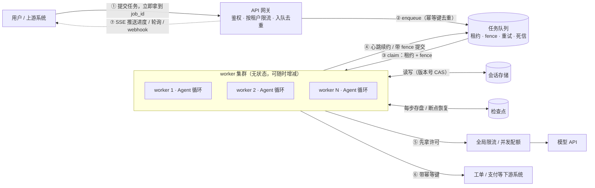
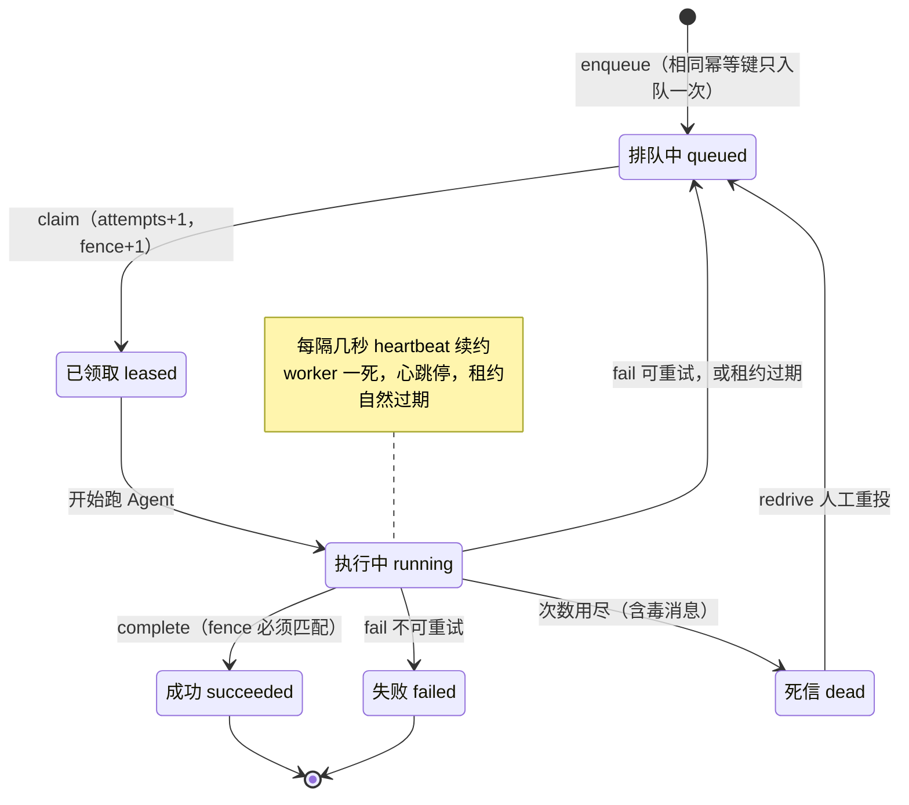
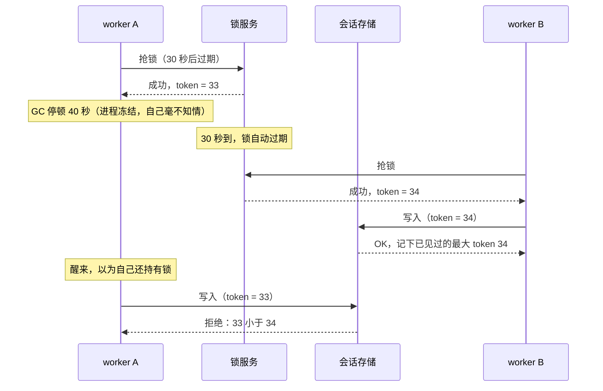
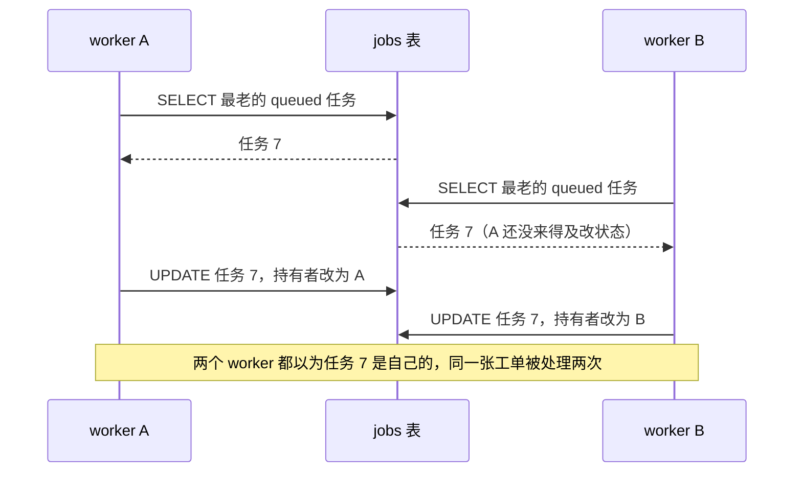

[中文](README.md) | [English](README.en.md)

# 第 13 课：高并发与分布式执行 —— 一台机器不够用之后

> 🕐 建议用时：25 分钟 ｜ 🎯 学完你能：把单进程 Agent 扩展成多 worker 集群，让任务"不丢、不重、不乱、不被压垮"，并为每一项在多种方案里做出有依据的选择 ｜ 📦 对应源码：[`jobqueue.py`](jobqueue.py)（租约队列）、[`session_store.py`](session_store.py)（乐观并发）、[`agentkit/state.py`](../../agentkit/state.py)（检查点）、[`agentkit/tools.py`](../../agentkit/tools.py)（幂等键）
>
> 📖 必读：[How to do distributed locking](https://martin.kleppmann.com/2016/02/08/how-to-do-distributed-locking.html)（Martin Kleppmann, 2016）—— 本课 fencing token 时间线的出处；重点读 "Protecting a resource with a lock" 和 "Making the lock safe with fencing" 两节，理解为什么进程暂停和网络延迟会让"拿到过锁"不等于"现在还持有锁"。

## 0. 一句话讲清楚

**分布式系统最难的不是"让很多机器一起干活"，而是"其中一台机器慢了、死了、假死了的时候，活儿不丢、不重、不乱"。**

想象一家餐厅的后厨。一开始只有一个厨师（单进程），生意好了雇到 8 个（多 worker），新问题马上就来了：

| 后厨里发生的事 | 分布式里叫什么 | 本课的解法 |
|---|---|---|
| 两个厨师同时拿起同一张单子，一道菜做了两份 | 重复领取 | **原子领取**（claim） |
| 厨师做到一半晕倒了，单子揣在他兜里，客人一直干等 | worker 崩溃，任务丢失 | **租约**（lease）：单子只"借"你 10 分钟，到点收回 |
| 晕倒的厨师醒来，把一盘凉了的菜端出去，顶掉了新厨师做的那盘 | 僵尸 worker | **fencing token**：出菜口只认最新的单号 |
| 菜重做了一遍，客人的卡也被刷了两次 | 重复副作用 | **幂等键**（idempotency key） |
| 同一桌先后加了两道菜，两个服务员各改一份账单，后写的覆盖了先写的 | 丢失更新 | **版本号 CAS** / 同一桌只让一个人负责 |
| 8 个厨师抢 3 个烤箱 | 共享配额 | **信号量 / 令牌桶 / 排队** |
| 烤箱坏了一会儿，8 个厨师每秒都去试一次 | 重试风暴 | **退避 + 抖动 + 熔断** |

**为什么 Agent 比普通 Web 服务更容易在这里翻车？**

- **任务长**：普通 API 100 毫秒返回，一次 Agent 运行要 10 秒到几分钟。时间越长，遇到发版、崩溃、超时的概率越大。
- **每一步都有代价**：重复执行 = 重复花模型的钱，还可能重复建工单、重复退款。
- **瓶颈不在你手里**：模型 API 按每分钟请求数（RPM）和 token 数（TPM）限额，加再多机器也突破不了。
- **有状态**：对话历史、检查点、等待审批的暂停状态，都要在多台机器之间共享。

先算一笔账。**利特尔法则（Little's Law）**：系统里同时在处理的任务数 = 到达速率 × 平均处理时长。如果早高峰每秒进来 20 条请求、每个 Agent 任务平均跑 15 秒，那么同时在跑的任务就是 20 × 15 = **300 个**。一个 32 线程的进程根本装不下，而这 300 个"跑到一半"的任务，会在下一次发版时一起被打断。

这节课就是把上面那张后厨的表，变成一个能在多进程下真实运行的系统。

## 1. 核心概念

### 1.1 总架构：有状态的东西都集中起来，干活的都变成无状态



| 层 | 有状态吗 | 怎么扩展 | 本课在哪 |
|---|---|---|---|
| API 网关 | 无 | 随便加机器 | [第 12 课](../12_production_architecture/README.md)（鉴权、按租户限流） |
| 任务队列 | **有**（持久化） | 换成专业队列 / 分区 | [`jobqueue.py`](jobqueue.py) |
| worker | **无** | 按队列积压量加减进程 | [`demo.py`](demo.py) 的 `agent_worker` |
| 会话存储、检查点 | **有** | 数据库 / KV 存储 | [`session_store.py`](session_store.py)、`FileCheckpointer` |
| 限流 / 配额 | **有**（计数器） | 集中式（Redis） | demo 里的 `LimitedLLM` |
| 下游系统 | 有 | 不归你管，但要求它支持幂等键 | demo 里的 `TicketSystem` |

整个设计的核心思想只有一句：**worker 可以随时死掉、随时增减，因为所有"不能丢"的东西都不在 worker 身上。**

### 1.2 任务的一生：状态机



代码里 `leased` 和 `running` 合成了一个状态（`status='leased'`）：领到就开始干，**心跳就是"我还在 running"的信号**。"租约过期回到 queued"也不需要谁去改状态：`lease_until` 一过，这个任务自动满足"可领取"条件（见 [`CLAIMABLE_WHERE`](jobqueue.py)）。

### 1.3 五个关键词

| 术语 | 大白话 | 精确一点 | 本课代码 |
|---|---|---|---|
| 租约 lease（SQS 里叫 visibility timeout） | 任务是"借"走的，到点不还就自动收回 | 领取时写入 `lease_until`；过期后任务可被他人重新领取 | `JobQueue.claim` |
| 心跳 heartbeat | "我还活着，再借我一会儿" | 定期把 `lease_until` 往后推；worker 一死心跳就停 | `JobQueue.heartbeat`、demo 的 `Heartbeat` 线程 |
| fencing token | 每次领取发一个更大的号码，存储只认最新的号 | 单调递增的整数；所有由租约保护的写入都带上它，存储拒绝更小的 | `jobs.fence` 列 |
| 幂等键 idempotency key | 同一件事做两次 = 做一次 | 每个逻辑操作一个稳定的唯一 ID，下游据此去重 | `ToolContext.idempotency_key` |
| CAS / 乐观并发控制 | "只有它还是我看到的那个样子，我才改" | `UPDATE ... WHERE version = 我读到的版本`，影响 0 行 = 被人抢先了 | `SessionStore.compare_and_set` |

## 2. 企业问题卡片

七张卡片，按"请求进来 → 排队 → 执行 → 写状态 → 调下游 → 出故障"的顺序排列。

### 问题 1：单进程 Agent 撑不住了，怎么横向扩展？

**场景**：IT 服务台 Agent 起初跑在一台 4 核虚拟机的单个 Python 进程里（Web 框架 + 32 个线程）。全员推广后，早上 9:00–9:30 每秒约 20 条报修，每个 Agent 任务平均 15 秒。按利特尔法则，同时在跑的任务约 300 个 —— 32 个线程远远不够，请求越排越长、开始超时。更要命的是：这台机器一重启，所有跑到一半的任务全部丢失。

**为什么难**：直觉方案是"多开几台一样的机器，前面挂负载均衡"。但 Agent 是**有状态**的：对话历史、检查点、等待审批的暂停状态都在进程内存里。用户的第二条消息被负载均衡发到了另一台机器，那台机器完全不知道之前聊过什么；更糟的是，两台机器可能同时在处理同一个会话。

| 方案 | 怎么做 | 优点 | 缺点 | 适用场景 |
|---|---|---|---|---|
| A. 无状态 worker + 外部状态存储 | 会话、检查点、任务全部放共享存储（Postgres / Redis）；任何 worker 都能处理任何任务，处理前加载、处理后写回 | 扩缩容最简单（按队列积压加减 Pod）；任何机器挂了都不影响；滚动发布无感 | 每一步都要读写外部存储（多几毫秒，存储成为新热点）；同一会话被两个 worker 同时处理时会出现并发写问题（见问题 4） | **绝大多数场景的默认选择** |
| B. 会话粘性（sticky session） | 负载均衡按 session_id 把同一会话固定路由到同一台机器，状态留在内存 | 改造最小；内存访问最快；同一会话天然不并发 | 机器挂了或发版，这些会话的状态全丢；扩缩容会打乱路由（一致性哈希只能减少、不能消除迁移）；热点会话或大租户会压垮单台机器 | 改造期的过渡方案；状态丢了也能接受的场景 |
| C. 按会话分片的 actor（单写者）模型 | 每个 session_id 对应一个逻辑上单线程的 actor，同一时刻只在一台机器上激活，消息排队串行处理；状态持久化，机器挂了在别处重新激活。代表：Microsoft Orleans 的 virtual actor（grain）、Akka Cluster Sharding、Cloudflare Durable Objects（官方文档说明它全局唯一命名、单线程执行） | 同一会话天然串行，没有并发写；状态可以留在内存里又不怕丢 | 要引入 actor 框架或自建"分片 + 路由 + 故障转移"，复杂度最高；单个超级热点会话无法再拆 | 强交互、长连接、会话内严格有序的 Agent（多人协作、实时语音）；团队有分布式经验 |

**怎么选**：默认选 A。先把 Agent 改造成"无状态 worker + 外部状态"，这是后面所有方案（队列、租约、检查点）的地基。A 带来的"同一会话并发写"问题，用问题 4 的方案补上：CAS 兜底，或者让队列按会话串行（它其实就是"穷人版 actor"）。B 只用作过渡。真正值得上 C 的信号是：会话状态很大、每次从存储加载都很贵，或者对会话内顺序和延迟的要求非常高。

**本课实现**：Demo 场景 1 就是方案 A：worker 是独立的操作系统进程，除了 SQLite 文件什么都不共享；检查点用 agentkit 的 `FileCheckpointer`，`run_id = f"job-{id}"`，任何 worker 都能接着跑。队列的 `group_key`（[`jobqueue.py`](jobqueue.py) 的 `CLAIMABLE_WHERE`）保证同一会话同一时刻只有一个 worker 在处理，用队列达到了 C 的效果。升级到生产：SQLite → Postgres / Redis；worker 部署为 K8s Deployment，按队列积压量自动扩缩容（例如 KEDA）。

### 问题 2：Agent 要跑 3 分钟，HTTP 请求 60 秒就断了

**场景**：一个"周报生成 Agent"要检索 20 份文档、调用 8 次模型，平均 3 分钟，最慢 10 分钟。前端直接 `POST /report` 同步等结果。Nginx 的 `proxy_read_timeout` 默认是 60 秒（上游连续 60 秒没有数据就断开），负载均衡、CDN、公司代理还各有各的超时。用户等不及刷新页面，同一份周报被生成了三次。

**为什么难**：把所有超时都调成 10 分钟？链路上每一跳（浏览器、CDN、负载均衡、网关、服务）都要改，漏掉任何一跳都会断；每个连接要占住资源 10 分钟，并发一高就耗尽。最致命的是：**连接断了，服务端通常还在继续跑**（接着花钱），客户端却以为失败了而重试 → 重复执行。长任务和"一问一答"的 HTTP 模型天生不匹配。

| 方案 | 怎么做 | 优点 | 缺点 | 适用场景 |
|---|---|---|---|---|
| A. 同步请求 | 在请求里跑完 Agent 再返回 | 最简单，调试直观 | 受链路上最短的那个超时约束；断线 = 白跑；无法恢复进度 | P99 < 30 秒的短任务 |
| B. SSE 流式推送 | 仍是一个 HTTP 请求，但服务端边跑边推送事件（"正在检索…"、token 流） | 用户马上看到反馈；持续有数据，不会触发"读超时"（Nginx 的读超时是两次读之间的间隔）；浏览器的 `EventSource` 断线会自动重连，并通过 `Last-Event-ID` 告诉服务端从哪接着推 | 连接仍绑定在一台机器上，机器重启流就断；要关掉代理缓冲（Nginx 可在响应里返回 `X-Accel-Buffering: no`）；断线续推需要事件 ID + 服务端缓存 | 交互式对话，几十秒到几分钟 |
| C. 异步任务（队列 + 轮询 / webhook） | `POST` 只负责入队，立即返回 `202 + job_id`；worker 在后台跑；客户端轮询 `GET /jobs/{id}` 或等 webhook 回调 | 请求和执行解耦，任务多长都不怕；worker 崩溃可被接手；天然可以限流、排队、重试 | 多了队列和任务状态存储；轮询有延迟和额外请求；webhook 要做签名校验、重试和幂等 | 分钟级以上的任务、批处理、系统间集成 |
| D. 持久化工作流引擎（durable execution，如 Temporal） | 把 Agent 的每一步写成工作流里的活动（activity），引擎记录事件历史，崩溃后从上一步继续；超时、心跳、重试都由引擎管理 | 跑几小时、几天、中间等人工审批的流程也能可靠完成 | 引入重量级基础设施（自己运维或买云服务）；工作流代码有确定性约束；学习曲线陡 | 跨小时 / 天、多步骤、涉及审批和补偿的关键流程 |

OpenAI 的 Responses API 提供的 background 模式就是 C 的形态：请求时设置 `background=true` 立即返回，任务处于 `queued` / `in_progress` 时由客户端轮询，也可以取消。

**怎么选**：按任务时长分层。30 秒以内用 A；交互式、几十秒到几分钟用 B，**并且最好在 B 下面垫一层 C**：先提交任务拿到 job_id，SSE 只负责推送这个 job 的进度，断线后按 job_id 重新订阅 —— 流断了，任务不会断。分钟级以上、不需要人盯着的用 C；流程长达小时 / 天、涉及审批和多个系统时再上 D。**不要用"把超时调大"来解决长任务问题。**

**本课实现**：Demo 实现的是 C 的执行端：任务进 SQLite 队列，worker 领取、心跳、提交。agentkit 的检查点（[第 08 课](../08_reliability/README.md)）是 D 的最小版本："每走一步存一次盘，崩溃后按 run_id 恢复"。升级：队列换成 SQS、RabbitMQ、Redis Streams 或 Postgres；D 换成 Temporal 这类引擎。

### 问题 3：任务会丢、会重复，到底执行了几次？

**场景**：切换到异步任务后，运维发现三件怪事：① 周一凌晨发版，滚动重启了 12 个 worker，37 个任务"消失"了 —— 既没成功也没失败，用户一直看到"处理中"；② 修好之后，又有用户投诉同一个工单被建了两次；③ 一条带 20 MB 附件的报修每次都让 worker 内存溢出崩溃，被反复投递，前后打死了 40 多个 worker 进程。

**为什么难**：两种"天真"做法，各错一半：

- **"领到就删"**：worker 一领取就把任务从队列删掉。处理中崩溃 → 任务永远丢了（① 的原因）。
- **"做完再删"**：崩溃了任务还在，别人可以重做。但"做完"和"删除"之间也可能崩溃 → 做了两次（② 的原因）。

这不是实现得不够好，而是网络的本质：发送方永远无法区分"对方没收到"和"对方收到了但回复丢了"。所以**不存在**既不丢也不重的"恰好一次投递"（exactly-once delivery）。你只能在"可能丢"和"可能重"之间选一个，再在处理端想办法。

| 方案 | 怎么做 | 优点 | 缺点 | 适用场景 |
|---|---|---|---|---|
| A. 最多一次（at-most-once） | 领取即确认 / 删除，失败不重试 | 绝不重复；最简单 | 崩溃就丢 | 丢了也无所谓的任务：统计打点、非关键通知 |
| B. 至少一次（at-least-once） | 领取 = 租约；做完才确认；租约到期还没确认 → 任务重新可见，被别人再领 | 不丢 | 可能重复执行：崩溃在"做完"和"确认"之间，或处理太慢导致租约到期 | 几乎所有队列的默认语义 |
| C. 效果上恰好一次（effectively-once） | B + 处理端幂等：每个副作用都带稳定的幂等键，由下游去重 | 不丢，重复执行也无害 | 每个有副作用的下游都要支持幂等键；幂等键要设计对（见第 3.8 节） | **有副作用的任务（建单、扣款、发邮件）—— Agent 的默认选择** |

B 要可靠地跑起来，还需要四个配套机制：

1. **心跳续约：租约多长才合适？** 太短，正常处理中的任务会被误判为死亡、被别人重复执行；太长，worker 真的崩了，任务要等很久才有人接手。解法是**短租约 + 心跳**：比如租约 30 秒、每 10 秒续一次。worker 活着就一直续，死了最多 30 秒后就能被接手。AWS SQS 的文档也建议：处理时间不确定时实现心跳，定期延长可见性超时（默认 30 秒，最长 12 小时）。
2. **重试上限：attempts 在"领取"时加一，而不是在"失败"时加一。** 崩溃的 worker 根本没机会报告失败，如果只在 `fail()` 里计数，一个每次都让 worker 崩溃的任务永远不会被计数。
3. **死信（DLQ, dead-letter queue）**：超过上限的任务移入死信，停止自动重试、触发告警，人工排查修好后再重新投递（redrive）。SQS redrive policy 里的 `maxReceiveCount` 就是这个上限。
4. **毒消息（poison message）**：每次处理都会让 worker 崩溃的消息（③ 的原因）。没有"领取时计数 + 上限 + 死信"，它会无限循环，一个接一个地杀死你的 worker。

另外，失败要分类：参数非法、权限不足这类**不可重试**的错误直接 `failed`，别浪费重试次数；429、超时这类才退避后重试（第 08 课）。

重复投递不只来自你自己的崩溃：SQS 的 API 文档就明确提醒，标准队列在少数情况下，消息被删除之后仍可能再次被收到，所以应用必须幂等。**at-least-once 系统里，"会重复"是常态，不是事故。**

**怎么选**：有副作用的 Agent 任务一律选 C。经验参数：租约约为心跳间隔的 3 倍，`max_attempts` 取 3~5，死信必须配告警。只有没有副作用、丢了能接受的任务才用 A。

**本课实现**：[`jobqueue.py`](jobqueue.py) 实现了 B 的全部机制：`enqueue` 幂等去重、`claim` 租约 + attempts + fence、`heartbeat`、`fail` 的退避 / 失败 / 死信三条路、`claim` 时把"租约过期且次数用尽"的毒消息送进死信、`redrive`。Demo 场景 2 演示了从 B 到 C：`kill -9` 之后任务被别人接手（不丢），不带幂等键时多出一张工单（会重），带上之后只有一张（effectively-once）。升级：SQS（visibility timeout + `ChangeMessageVisibility` 续约 + DLQ）；或者 Postgres 用 `FOR UPDATE SKIP LOCKED` 做领取（见第 6.1 节）。

### 问题 4：用户连发两条消息，第二条的回复"忘了"第一条

**场景**：用户在手机上说"帮我订明天去上海的机票"，紧接着补一句"要靠窗的座位"。两条消息被两个 worker 同时处理：worker A 读到会话 v7（3 条历史），worker B 也读到 v7；A 调模型 5 秒后写回，B 同样写回 —— 覆盖了 A 的写入。数据库里只剩"靠窗"那一句，"订机票"的消息和回复凭空消失，**没有任何报错**。多端同时在线（电脑 + 手机）、用户狂点"重新生成"时都会出现。

**为什么难**："读 → 改 → 写"不是原子操作，而 Agent 的"改"要花好几秒（调模型），窗口特别大。直觉方案是"加个锁"：但单机的 `threading.Lock` 管不住另一台机器上的进程；换成 Redis 分布式锁，又会遇到"锁已经过期，持有者还以为自己拿着锁"的问题（见下图）。

| 方案 | 怎么做 | 优点 | 缺点 | 适用场景 |
|---|---|---|---|---|
| A. 悲观锁：分布式锁 + 租约 + fencing token | 处理会话前先抢锁（如 Redis `SET lock:sess-42 <随机值> NX PX 30000`），锁带过期时间，防止持有者崩溃后死锁；每次拿锁同时拿到一个递增的 fencing token，所有写入都带上它，存储拒绝比见过的更小的 token | 同一时刻只有一个处理者，不做无用功；语义直观 | 锁服务本身要高可用；过期时间很难定；**必须**配 fencing token，而不少锁实现（如 Redlock）并不提供；等锁的请求占着资源 | 临界区短、冲突频繁、重做代价很高 |
| B. 乐观并发控制：版本号 CAS + 重试 | 会话带 `version`；写入时 `UPDATE ... WHERE version = 我读到的版本`；影响 0 行 = 冲突 → 重新读、重新应用修改、再试，**次数有上限** | 不需要锁服务；没有冲突时零开销；不存在"锁过期"问题（版本号本身就起到了 fencing 的作用） | 冲突时要重做 —— 对 Agent 来说 = **再调一次模型**（花钱、变慢）；冲突一多就大量空转；处理顺序没有保证 | 冲突少的场景（大多数会话其实很少并发）；或者作为其他方案的兜底 |
| C. 按 session_id 分区串行化 | 同一会话的消息进同一条"串行通道"，同一时刻只有一个 worker 处理：Kafka 按 key 分区（同 key 进同一分区，分区内按写入顺序消费）、SQS FIFO 的 message group（同组有一条在处理时，后面的不可见）、本课队列的 `group_key`；问题 1 的 actor 也属于这一类 | 零冲突、零无用功；**顺序严格保证**（对话天然需要）；不同会话之间完全并行 | 同一会话只能一条一条处理；一个卡住的任务会阻塞整个会话（靠租约超时兜底）；分区数决定并行度上限 | **对话类 Agent 的首选** |

**为什么锁必须配 fencing token？** 看这个时间线（改编自 Martin Kleppmann 的文章，见延伸阅读）：



关键在于：**持有者无法可靠地知道自己已经失去了锁**。worker A 就算在写之前检查一下"锁还是我的吗"，检查和写入之间也可能再停顿一次。所以检查必须由**存储在写入的那一刻**来做 —— 这就是 fencing token。Kleppmann 还区分了两种用途：如果锁只是为了**效率**（避免重复劳动，偶尔重复一次也无妨），单节点 Redis 锁就够了；如果锁关系到**正确性**，就必须有 fencing。

**怎么选**：对话类 Agent 以 C 为主（同一会话串行，顺序天然正确），再用 B 兜底（万一租约过期导致两个 worker 同时处理同一会话，CAS 保证不丢更新）。不适合分区的共享状态（比如团队共享的知识条目、多人协作的文档）：冲突少用 B；冲突多、重做代价高用 A，并且 A 一定要带 fencing token。**不要用不带 fencing token 的分布式锁来保证正确性。**

**本课实现**：[`session_store.py`](session_store.py) 实现 B，练习 (c) 让你写 CAS 重试循环；[`jobqueue.py`](jobqueue.py) 的 `group_key` 实现 C（`CLAIMABLE_WHERE` 里的 `NOT EXISTS`：只有组里最老的未完成任务可以被领取）；`fence` 列就是 fencing token，`complete` / `heartbeat` 都要校验它（练习 (b)）。Demo 场景 4 用 4 个 worker 同时处理同一会话的 16 条消息：不做控制时只保存下来 4 条；CAS 一条不丢，但多调用了约 20 次"模型"，顺序也乱了；按会话串行零冲突、顺序正确，在这个场景下甚至比 CAS 还快。

### 问题 5：模型 API 每分钟只给 500 次，高峰期来了 3000 个任务

**场景**：模型网关给 IT 服务台分配的配额是 500 RPM + 20 万 TPM。早高峰 10 分钟内涌入 3000 个任务（每个 3 次模型调用，共 9000 次），30 个 worker 各自"有活就调"：前 20 秒就把一分钟的配额打光，之后全是 429；每个 worker 各自重试，429 更多了。同一个网关上，另一个部门一次提交了 5 万条批量任务，吃掉了大半配额，IT 服务台的交互请求排在后面等 10 分钟 —— 这就是"吵闹的邻居"（noisy neighbor）。

**为什么难**：配额是**全局**的，worker 却是分散的：每个 worker 只知道自己发了多少，不知道别人发了多少。单机限流器 × 30 台 = 30 倍的额度；worker 数量一变（自动扩缩容），每台的份额又得重算。而且请求数和 token 数两个维度都要管，一次请求会消耗多少 token，调用之前并不确定。

| 方案 | 怎么做 | 优点 | 缺点 | 适用场景 |
|---|---|---|---|---|
| A. 单机令牌桶 | 每个 worker 一个令牌桶，额度 = 总额度 / worker 数 | 零依赖、零延迟 | worker 数一变就要重新分配；负载不均时有的桶闲着、有的不够用；总量只能近似控制 | worker 数固定且少；或者作为全局限流前的粗筛 |
| B. 全局限流（集中式计数器） | 所有 worker 调用前都去一个中心（通常是 Redis）拿许可：固定窗口计数（`INCR` + `EXPIRE`）、滑动窗口，或用 Lua 脚本原子地实现令牌桶 | 精确控制总量；与 worker 数量无关 | 每次调用多一次网络往返；Redis 成为单点（要高可用，挂了要能降级到 A）；固定窗口在边界处可能出现两倍突发 | 多个 worker 共享一个硬配额 —— 大多数生产场景 |
| C. 并发信号量 | 不限"每分钟多少次"，而是限"同时有多少个在途"：开始时拿许可，结束时归还 | 自适应：下游变慢时在途请求自然减少，自动降速；很适合耗时长的 LLM 调用；直接限制了连接和内存占用 | 不直接对应供应商的 RPM / TPM（要和 A 或 B 配合）；分布式信号量的许可**必须带租约**，否则持有许可的进程被 kill 后，许可永远还不回来 | 保护下游、控制成本；和 B 搭配使用 |
| D. 队列 + 背压（backpressure） | 请求先进队列，消费者按配额速率取出执行；队列满了就在入口拒绝（"当前排队人数过多"）或降级 | 削峰填谷，高峰的请求不丢；在入口拒绝比在链路深处超时对用户更友好 | 排队带来延迟；队列必须有上限，否则积压无限增长（排了两小时的请求处理完时，用户早就走了） | 批处理、异步任务；高峰明显的业务 |
| E. 优先级与加权公平排队（WFQ） | 按租户 / 业务线分队列，调度器按权重轮流取任务（比如交互 : 批量 = 4 : 1），每个租户再设上限 | 防止吵闹的邻居；交互请求优先；可以按付费套餐分配份额 | 调度器更复杂；权重需要调；低优先级可能被饿死（要设最低保障） | 多租户平台；交互流量和批量流量混跑 |

仿照 Redis 官方文档里 `INCR` 命令的限流模式（`INCR` 和 `EXPIRE` 放进同一个 `MULTI` / `EXEC` 事务），一个按分钟计数的固定窗口大致是这样：

```text
key = "llm:rpm:" + 当前分钟
MULTI
    INCR key
    EXPIRE key 120
EXEC
如果 INCR 的返回值 > 500：拒绝（或者等到下一分钟）
```

**怎么选**：生产里通常是组合拳，从外到内依次是：入口按租户限流（第 12 课的每租户令牌桶）→ 按优先级 / 租户的公平队列（E + D）→ worker 调模型前拿全局许可（B 管 RPM / TPM，C 管在途数）→ 仍然收到 429 时按 `Retry-After` 退避。只有几个 worker 的小规模系统，用 A + C 就够了。一条原则：**让等待发生在自己的队列里，而不是发生在模型 API 的 429 上。**

**本课实现**：Demo 场景 1 用跨进程共享的 `multiprocessing` 信号量实现了 C（`LimitedLLM`）：8 个 worker 在"模型并发 ≤ 3"的限制下，吞吐只剩约 3 倍 —— 这就是配额在给吞吐封顶。第 12 课的 `TokenBucket` / `TenantRateLimiter` 是 A 和按租户隔离；`jobqueue` 的 `enqueue` + `claim` 就是 D 的骨架；第 6.3 节给出了在 `claim` 里做加权公平调度的写法。

### 问题 6：订机票成功了，订酒店失败了

**场景**：差旅 Agent 帮员工安排出差：订机票（航司 API）→ 订酒店（酒店 API）→ 提交报销预审（内部系统）。机票出票成功，扣了 2380 元；酒店 API 返回"满房"。现在员工手里有一张用不上的机票，钱已经花出去了，报销系统里什么都没有。更糟的版本：酒店 API **超时**了 —— 你根本不知道订上没有。

**为什么难**：在单个数据库里，这就是一个 `BEGIN ... ROLLBACK` 的事。但这三个系统属于不同的公司和团队，没有共享的事务管理器，"要么全成功，要么全失败"在这里没有现成的开关。

| 方案 | 怎么做 | 优点 | 缺点 | 适用场景 |
|---|---|---|---|---|
| A. 分布式事务（两阶段提交 2PC / XA） | 协调者先让所有参与者"准备"（锁定资源、保证能提交），全部准备好再统一"提交" | 强一致，真正的原子性 | **在 Agent 场景基本不可行**（见下文） | 同一组织内、都支持 XA 的数据库之间 |
| B. Saga + 补偿 | 把流程拆成一串本地事务，每一步配一个补偿动作（订机票 ↔ 退票，订酒店 ↔ 取消）；某一步失败时，按相反顺序执行已完成步骤的补偿。可以由一个协调者编排（orchestration），也可以由各服务靠事件接力（choreography） | 不需要全局锁；各系统保持独立；适合长流程 | 没有隔离性：中间状态对外可见；补偿不一定能完全撤销（退票有手续费、发出的邮件收不回）；补偿本身也会失败，也必须幂等、可重试 | **跨系统的多步副作用 —— Agent 的默认选择** |
| C. Outbox 模式 | 在同一个本地事务里写业务数据 + 往 `outbox` 表插一条"待发送消息"；另一个进程（relay）读取 outbox 并投递，成功后标记 | 本地事务保证"数据改了 ⇔ 消息一定会发出"；只需要一张表 | relay 可能重复投递（发完、标记前崩溃）→ 消费方必须幂等；有少量延迟 | Agent 更新自身状态、同时要触发下游（通知、审批、异步工具调用） |
| D. 人工兜底 | 补偿失败、无法补偿，或者结果不确定时，转入"待人工处理"队列，附上完整上下文（trace、每一步的请求和响应） | 覆盖自动化处理不了的长尾；对高风险操作最稳妥 | 慢，占人力；需要工单 / 看板等配套 | 任何 Saga 的最后一道防线；金额大、不可逆的操作 |

**为什么 2PC 在 Agent 场景基本不可行？** ① 外部 API（航司、酒店、各种 SaaS）几乎都不提供"准备 / 提交"两阶段接口，你没法让航司"先把票锁住别出，等我通知"；② 2PC 是阻塞协议：协调者在"准备"之后崩溃，参与者只能锁着资源干等；③ Agent 的步骤之间夹着秒级的模型调用，甚至几小时的人工审批，长时间持锁不可接受；④ 下一步做什么是模型在运行时决定的，参与者集合事先都不确定。

**"超时"要单独对待**：超时 ≠ 失败，而是"不知道"。补偿之前先查询（"用预订号查一下到底订上没有"），这要求当初的请求带了幂等键或客户端生成的预订号 —— 否则你连查都没法查。

**怎么选**：先让每一步都幂等（带幂等键，可以放心重试），这是 B 和 C 的前提。跨外部系统的多步副作用用 B，编排式更适合 Agent：Agent 本身就是编排者，但**补偿逻辑要写在确定性代码里，不要让模型临场发挥**。需要"改状态 + 发通知"原子性时用 C。B 的每一条失败分支，最后都要能落到 D。另外别忘了最便宜的一招：**调整步骤顺序并做预检**：先查酒店有没有房、先做可撤销的"预留"，最后才做不可逆的付款和出票。**不要在 Agent 场景尝试 2PC。**

**本课实现**：本课没有实现完整的 Saga（它是业务编排逻辑：[第 06 课](../06_orchestration/README.md)的编排模式 + 本课的幂等队列就是它的积木，第 6.5 节给出了示意代码）。Demo 里 `TicketSystem` 的幂等实现和 C 是同一个思想：把"执行操作"和"记下 key"放进**同一个本地事务**（同一条 `INSERT` + 唯一索引），不留"做了但没记下来"的缝隙。

### 问题 7：模型供应商抖了 30 秒，系统却瘫了 20 分钟

**场景**：模型 API 在 10:00 出现 30 秒的 503。10:00:30 就恢复了，可系统直到 10:20 才恢复正常。复盘发现：① 200 个 worker 在同一时刻失败，按固定的 1、2、4 秒重试，每一波都整齐地同时打过去（惊群）；② 前端、网关、Agent、模型网关四层各自重试 3 次，一个用户请求在最坏情况下放大成 3⁴ = 81 次调用（重试风暴）；③ 知识库检索缓存设置为 10 分钟过期，而这批缓存恰好在故障期间集中过期，同一个热门问题"VPN 怎么连"的 500 个并发请求同时穿透缓存，打爆了向量数据库（缓存击穿）。

**为什么难**：每个组件单独看都很"合理"：失败了就重试，缓存过期了就回源。但成百上千个副本同时这么做，就形成了正反馈：系统越慢 → 重试越多 → 系统越慢。故障本身已经结束，积压的重试和回源请求却能再把系统打倒一次。

| 方案 | 怎么做 | 优点 | 缺点 | 适用场景 |
|---|---|---|---|---|
| A. 指数退避 + 抖动 | 重试间隔指数增长，并在 [0, 上限] 内随机取值（full jitter） | 把同一时刻的失败打散到一段时间里；实现只需一行 | 单个请求恢复得更慢；不限制重试总量 | 所有重试的默认配置 |
| B. 重试预算 | 全局限制重试占比（如 ≤ 10%）或用令牌桶控制重试；并且只在一层重试 | 故障时重试自动收缩，不放大流量 | 需要共享的统计；预算太小会放弃本可成功的请求 | 多层调用链；大规模集群 |
| C. 请求合并（singleflight） | 相同 key 的并发请求只放一个去回源，其余等待并共享结果 | 缓存击穿时回源请求从 N 个变成 1 个 | 错误也会被共享；只能合并完全相同的请求；跨机器需要分布式版本 | 热点 key 的缓存回源；相同的检索 / 嵌入请求 |
| D. 熔断 | 下游持续失败时直接快速失败，隔一段时间放一个试探请求 | 给下游恢复的空间；调用方不用干等超时 | 阈值要调；熔断期间需要降级方案 | 所有外部依赖：模型 API、向量库、业务 API |

缓存击穿还有两个常用招：**过期时间加随机抖动**（避免一批缓存同时过期），以及**回源令牌**。Facebook 的 memcache 论文（NSDI 2013）用"lease"同时解决了过期数据回写和惊群两个问题：缓存未命中时，memcached 给客户端发一个回源令牌，默认每个 key 每 10 秒只发一次，其他客户端稍等片刻再读，这时数据通常已经被写回缓存了。论文里，一批容易出现惊群的 key，数据库查询峰值从 17K/s 降到了 1.3K/s。

**怎么选**：A 是所有重试的底线（第 08 课的 `backoff_delay` 已经是 full jitter）；有多层调用时必须加 B（第 08 课练习的重试预算）；每个外部依赖都要有 D（第 08 课的 `CircuitBreaker`）；热点读路径（检索、嵌入、配置）加 C，再给缓存过期时间加抖动。到了集群规模还要注意一点：**熔断器和预算的状态是每个进程各一份的**。200 个进程各自要连续失败 5 次才熔断，意味着下游要先挨 1000 次打；所以大规模时要把熔断 / 预算放到共享的一层（比如模型网关或 sidecar），恢复阶段也要逐步放量。

**本课实现**：队列的 `fail()` 用"指数退避 + 全抖动"计算下次可执行时间 `available_at`，失败的任务不会在同一秒卷土重来；worker 轮询间隔也带抖动（`poll_s × uniform(0.5, 1.5)`）；重试次数有上限，超出就进死信。重试预算和熔断器在第 08 课实现；singleflight 的示意代码见第 6.6 节。

## 3. 从玩具到生产：逐层实现

### 3.1 为什么用 SQLite 模拟"分布式"

Demo 里的每个 worker 都是用 `multiprocessing`（spawn 方式）启动的**独立操作系统进程**，彼此不共享任何内存，只通过同一个 SQLite 文件协作。谁先抢到、谁覆盖了谁、谁崩溃后留下了什么，全都是真实发生的竞争，而不是用 `sleep` 演出来的。

SQLite 和生产数据库的差别也要心里有数：

| | 本课的 SQLite | 生产（Postgres / Redis / SQS） |
|---|---|---|
| 写并发 | 同一时刻只有**一个**写者（其他写者排队） | 行级锁，多个写者并行 |
| 部署 | 只能在同一台机器上（官方文档：WAL 模式不支持网络文件系统） | 真正的多机 |
| 时间 | 所有进程共用一台机器的时钟 | 不同机器的时钟会漂移，租约应以数据库服务器的时间为准 |
| 语义 | 原子领取、租约、fence、CAS 的写法和生产**完全一样** | 同左 |

### 3.2 连接设置：三个参数，少一个就出问题

```python
def connect(path, timeout=10.0):
    conn = sqlite3.connect(str(path), timeout=timeout, isolation_level=None)  # 自动提交，事务由我们显式控制
    conn.execute(f"PRAGMA busy_timeout = {int(timeout * 1000)}")  # 有人在写时排队等，而不是立刻报错
    conn.execute("PRAGMA journal_mode = WAL")                      # 读写互不阻塞，只有写和写互斥
    conn.execute("PRAGMA synchronous = NORMAL")                    # WAL 下的常用搭配
    return conn
```

- **`isolation_level=None`**：Python 的 `sqlite3` 默认会在 DML 语句前"偷偷"帮你开事务。并发场景下事务从哪开始、到哪结束必须由你自己说了算。
- **WAL（预写日志）**：默认的回滚日志（rollback journal）模式下，写事务提交时会挡住所有读者；WAL 模式下读和写可以同时进行，只有写和写互斥。
- **`busy_timeout`**：不设的话，两个进程同时写，后到的那个立刻收到 `database is locked`。

还有一个很多人踩过的坑，我们实测过：**默认的 `BEGIN`（DEFERRED）事务先读后写，会在升级为写事务时直接失败，`busy_timeout` 也救不了**。

```text
连接 A：BEGIN；SELECT ...          ← 开启了一个读事务
连接 B：UPDATE ...（自动提交）      ← 在 A 读完之后改了数据
连接 A：UPDATE ...                  ← 读事务要升级为写事务
        → sqlite3.OperationalError: database is locked（SQLITE_BUSY_SNAPSHOT），耗时 0.000 秒
```

原因：A 读到的快照已经过时了，SQLite 不能让它基于过时的数据去写，而且等待也没用（B 的修改不会消失），所以立刻报错，不走 busy 等待。解法是 `BEGIN IMMEDIATE`：事务一开始就拿写锁（拿不到就按 `busy_timeout` 排队），拿到之后到 `COMMIT` 为止都不会再遇到 `SQLITE_BUSY`。这就是 [`write_txn`](jobqueue.py) 做的事。

### 3.3 原子领取：同一个任务只能被一个 worker 领到

先看错误写法，它在单进程测试里完全正常：

```python
row = conn.execute("SELECT id FROM jobs WHERE status = 'queued' ORDER BY id LIMIT 1").fetchone()
conn.execute("UPDATE jobs SET status = 'leased', worker_id = ? WHERE id = ?", (me, row["id"]))  # ❌
```



正确写法有两种，本课两种都用到了：

**写法 A：悲观 —— 先拿写锁再"查 + 改"**（[`JobQueue.claim`](jobqueue.py)）：

```python
with write_txn(self.conn) as c:          # BEGIN IMMEDIATE：别的写者进不来
    # ① 毒消息兜底：租约过期且次数用尽 → 送进死信（代码略）
    row = c.execute(f"SELECT j.id FROM jobs AS j WHERE {CLAIMABLE_WHERE} ORDER BY j.id LIMIT 1",
                    {"now": now}).fetchone()
    if row is None:
        return None
    c.execute("""UPDATE jobs SET status = 'leased', worker_id = :worker, lease_until = :until,
                                attempts = attempts + 1, fence = fence + 1, updated_at = :now
                 WHERE id = :id""", {...})
    return get_job(c, row["id"])
```

**写法 B：乐观 —— 条件 UPDATE + 检查影响行数**（练习 (a) 的参考答案）：先不加锁地 `SELECT` 出候选的 `id` 和 `fence`，然后 `UPDATE ... WHERE id = :id AND fence = :fence AND <仍然可领取>`。单条 `UPDATE` 本身是原子的；`rowcount == 1` 说明抢到了，`0` 说明在你看过之后别人抢先了，换下一个候选重来。`fence` 每次领取都 +1，所以"fence 没变"就等价于"从我看到它到现在，没人领过它"。

两种写法怎么选？写法 A 在 SQLite 里最直观；写法 B 不需要显式事务，在任何数据库里都能用，也是"CAS"思想的第二次出场（第一次是会话的版本号）。到了 Postgres，标准做法是第三种：`FOR UPDATE SKIP LOCKED`（第 6.1 节）。

"可领取"的完整定义在 [`CLAIMABLE_WHERE`](jobqueue.py) 里，三个条件缺一不可：

```sql
((j.status = 'queued' AND j.available_at <= :now)       -- 排队中，且到了可执行时间（退避中的不算）
  OR (j.status = 'leased' AND j.lease_until < :now))    -- 或者：租约已过期（持有者大概率崩溃或卡死了）
AND j.attempts < j.max_attempts                          -- 还没用完尝试次数
AND (j.group_key IS NULL OR NOT EXISTS (                 -- 分组任务：必须是组里最老的未完成任务
      SELECT 1 FROM jobs AS e
      WHERE e.group_key = j.group_key AND e.id < j.id AND e.status IN ('queued', 'leased')))
```

最后一条就是问题 4 的方案 C：同一个 `group_key`（比如 session_id）里，只要有更早的任务还没结束，后面的就领不到。这样同组任务**同一时刻最多一个在跑，并且严格按入队顺序处理**；不同组之间互不影响。

### 3.4 fencing token：只认最新的持有者

```python
def complete(self, job_id, fence, result="", *, now=None):
    cur = self.conn.execute(
        """UPDATE jobs SET status = 'succeeded', result = ?, lease_until = NULL, updated_at = ?
           WHERE id = ? AND fence = ? AND status = 'leased'""",
        (result, now, job_id, fence),
    )
    if cur.rowcount != 1:
        raise LeaseLostError(explain_lost(self.conn, job_id, fence))
```

三个设计决策：

1. **检查放在 `WHERE` 里，由数据库在写入的那一刻完成。** 如果写成"先 `SELECT` 看 fence 对不对，再 `UPDATE`"，这两步之间又会出现竞态窗口。
2. **只看 fence，不看租约有没有过期。** 租约过期、但还没人接手时，迟到的结果依然有效，没必要白白重做一遍。判定标准是"你是不是最新的持有者"，而不是"你的租约是否过期"。
3. **失败时抛 `LeaseLostError`，而不是返回 `False`。** 返回值很容易被忽略；这个错误的意思是"立刻停手"，重试只会再被拒绝一次。

`heartbeat` 和 `fail` 也用同样的方式校验 fence。**凡是受租约保护的写入，都应该带上 fence。**

### 3.5 心跳：短租约 + 定期续约

```python
def heartbeat(self, job_id, fence, lease_seconds, *, now=None):
    cur = self.conn.execute(
        "UPDATE jobs SET lease_until = ?, updated_at = ? WHERE id = ? AND fence = ? AND status = 'leased'",
        (now + lease_seconds, now, job_id, fence))
    if cur.rowcount != 1:
        raise LeaseLostError(...)   # 已经被别人接手：worker 应该停止处理
```

Demo 里每个任务配一个后台 `Heartbeat` 线程，每隔 `租约 / 4` 续一次。worker 进程被 `kill -9` 时，心跳线程随之消失，租约自然过期。注意心跳线程必须**用自己的数据库连接**：`sqlite3` 连接不能跨线程使用（这也是为什么 demo 的 `TicketSystem` 每次调用都新开一个连接 —— agentkit 在单独的线程里执行工具）。

### 3.6 失败、重试、死信

`fail()` 把失败分成三条路：

```python
if not retryable:
    status = "failed"                                   # 参数错、没权限：重试也没用
elif row["attempts"] >= row["max_attempts"]:
    status = "dead"                                     # 次数用尽：进死信，等人排查
else:
    status = "queued"                                   # 退避后再排队：指数增长 + 全抖动
    upper = min(max_backoff_s, base_backoff_s * 2 ** (row["attempts"] - 1))
    available_at = now + rng.uniform(0, upper)
```

而**崩溃**的 worker 根本走不到 `fail()`。所以 `claim()` 的第一步是兜底：把"租约已过期、次数已用尽"的任务直接送进死信，并在 `last_error` 里注明"处理它的 worker 可能每次都崩溃"。这就是防毒消息的关键：计数发生在**领取**时，不依赖 worker 活着报告。

### 3.7 会话的乐观并发控制

```python
cur = self.conn.execute(
    "UPDATE sessions SET data = ?, version = version + 1, updated_at = ? WHERE session_id = ? AND version = ?",
    (body, now, session_id, expected_version))
if cur.rowcount != 1:
    raise ConflictError(session_id, expected_version, self._version(session_id))
```

`expected_version = 0` 表示"我认为它还不存在"，用 `INSERT` 创建；主键冲突说明别人抢先创建了，同样抛 `ConflictError`。练习 (c) 要你在这之上写重试循环。重点只有一条：**每次重试都要重新读取最新版本，再把修改重新应用一遍** —— 对 Agent 来说，这意味着基于新的对话历史重新调用模型。

### 3.8 幂等键：为什么 run_id 必须由任务决定

agentkit 的幂等键是 `run_id:tool_call_id`（第 08 课）。在分布式场景下，它能起作用的前提是：**接手的 worker 算出来的 key 和前任一模一样**。

- `run_id = f"job-{job.id}"`：由任务决定。换了 worker，也能找到同一个检查点，算出同一个 run_id。如果用默认的随机 run_id，接手者只能从头再跑，key 全变了，幂等形同虚设。
- `tool_call_id`：模型生成、存在检查点里。接手的 worker 调用 `agent.resume(run_id)`，重放的是**同一个** tool call，所以 key 不变。

```python
key = ctx.idempotency_key if cfg["idempotent"] else None      # 例如 "job-1:call_QSNolaMUdUjzr1mLnbmyOOH2"
no, created = tickets.create(title, priority, job_id=job.id, created_by=worker_id, idempotency_key=key)
```

`TicketSystem.create` 用唯一索引去重：`INSERT` 成功就是新建；唯一约束冲突就查出已有的那张返回。"执行"和"记录 key"在同一条语句里完成，中间没有缝。

还有一个容易漏掉的点：agentkit 自带的 `IdempotencyStore` 存在进程内存里，**进程一死就没了**，而且别的 worker 也看不到。分布式场景下，幂等记录必须放在所有 worker 共享、最好和副作用在同一个事务里的地方，也就是下游系统本身。

### 3.9 从本课代码到生产

| 本课 | Postgres 版 | 托管队列版（以 SQS 为例） |
|---|---|---|
| `claim`（BEGIN IMMEDIATE / 条件 UPDATE） | `UPDATE ... WHERE id = (SELECT ... FOR UPDATE SKIP LOCKED)` | `ReceiveMessage`（消息在可见性超时内对别人不可见） |
| `lease_until` / `heartbeat` | 同左，用数据库的 `now()` 计时 | visibility timeout / `ChangeMessageVisibility` |
| `complete` | 带 fence 的条件 UPDATE | `DeleteMessage`（必须用最近一次接收拿到的 receipt handle） |
| `attempts` / 死信 | 同左 | `maxReceiveCount` + DLQ |
| `group_key` | 同左，或按 key 分区 | FIFO 队列的 message group |
| `fence` | 同左 | 没有严格的等价物：官方文档说明，用旧的 receipt handle 删除，请求照样成功，但消息不一定被删掉。所以"提交结果"的 fencing 要在你自己的存储层实现 |
| `SessionStore` CAS | `UPDATE ... WHERE version = $n` | 例如 DynamoDB 的条件写入 |

## 4. 动手：运行 Demo

```bash
.venv/bin/python lessons/13_distributed_concurrency/demo.py --offline   # 离线：ScriptedLLM，约 30 秒
.venv/bin/python lessons/13_distributed_concurrency/demo.py             # 真实模型：约 26 次调用、模型并发 ≤ 3，约 1 分钟
.venv/bin/python lessons/13_distributed_concurrency/demo.py --offline --only 2,3   # 只跑场景 2 和 3
```

**场景 1：横向扩展**（离线模式实际输出）

```text
   worker 数  模型并发  完成    耗时     吞吐(个/秒)  加速比   各 worker 处理数
   ──────────────────────────────────────────────────────────────────────────────
   1          不限      16/16   5.12s    3.1          1.0x     16
   2          不限      16/16   2.55s    6.3          2.0x     8/8
   4          不限      16/16   1.29s    12.4         4.0x     4/4/4/4
   8          不限      16/16   0.68s    23.6         7.6x     2/2/2/2/2/2/2/2
   8          ≤3        16/16   1.72s    9.3          3.0x     2/2/2/2/2/2/2/2
```

观察：Agent 的时间几乎都花在"等模型"上，所以加进程能近似线性地提速；但加上"模型并发 ≤ 3"之后，8 个 worker 也只剩 3 倍 —— **瓶颈从"worker 不够"转移到了"模型配额不够"**。真实模型模式下（3 个任务，1 个 vs 3 个 worker）一次运行的结果是 9.9 秒 vs 4.4 秒。

**场景 2：kill -9 一个刚建完工单的 worker**（真实模型模式实际输出，带幂等键的一轮）

```text
   [+  3.2s] worker-1 │ 🧾 建工单 T-1001（幂等键 job-1:call_QSNolaMUdUjzr1mLnbmyOOH2）
   [+  3.2s] worker-1 │ 工单建好了，但结果还没写进检查点、任务也还没提交……
   [+  3.2s] 调度器   │ 💥 kill -9 worker-1：进程瞬间消失 —— 不释放租约、不写检查点、不留遗言
   ...
   [+  6.8s] worker-2 │ 领取任务 #1（第 2 次尝试，fence=2）：3 楼东区的打印机一直卡纸，红灯闪个不停
   [+  6.8s] worker-2 │ 发现前任留下的检查点 → 从断点继续，而不是从头再来
   [+  6.8s] worker-2 │ ♻️  幂等键命中 → 返回已有工单 T-1001，没有重复创建
   [+  8.6s] worker-2 │ ✅ 完成 #1：已为您创建工单：T-1001

               任务完成  工单总数（应为 3）    任务 #1 的工单      任务 #1 领取次数
   不带幂等键  3/3       4（重复 1 张 ❌）     T-1001、T-1004      2 次 / fence=2
   带幂等键    3/3       3（✅ 无重复）        T-1001              2 次 / fence=2
```

观察：① kill 发生在 3.2 秒。租约最多 3 秒后过期，而此时两个活着的 worker 都在忙，worker-2 在 6.8 秒做完手头的任务后立刻接手了任务 #1。租约的代价就在这里：**发现一个 worker 死了，最多要等一个租约的时长**；② 两轮的"领取次数"都是 2、fence 都是 2，说明租约保证了"不丢"；③ 只有带幂等键的那一轮没有重复工单。

**场景 3：僵尸 worker**

```text
   [+  4.2s] worker-1 │ 😵 Agent 跑完了，正要提交时卡住 8 秒（模拟 GC 停顿 / 虚拟机被暂停：心跳也停了）
   [+  7.0s] worker-2 │ 领取任务 #1（第 2 次尝试，fence=2）：...
   [+  7.0s] worker-2 │ 发现前任留下的检查点 → 从断点继续，而不是从头再来
   [+  7.0s] worker-2 │ ✅ 完成 #1：已为您创建工单：T-1001
   [+ 11.7s] worker-1 │ 醒了！以为自己还持有租约，继续提交结果……
   [+ 11.7s] worker-1 │ ❌ 提交被拒绝（LeaseLostError）：任务 #1 已被重新领取：当前 fence=2（持有者 worker-2），你手里的 fence=1 已经过期
```

观察：worker-2 从检查点发现 Agent 已经跑完，直接提交，一次模型都没调；worker-1 醒来时完全不知道自己已经"失业"，是存储端的 fence 挡住了它。

**场景 4：同一会话并发写**（不调用模型，两种模式一致）

```text
   方案                              保存的消息  丢失    模型调用次数      CAS 冲突  顺序正确  耗时
   A. 不做并发控制（最后写入者胜）   4/16        12 ❌   16（浪费 12）     -         -         0.22s
   B. 乐观并发：版本号 CAS + 重试    16/16       0 ✅    37（浪费 21）     21        ❌ 否     1.01s
   C. 按会话串行：队列 group_key     16/16       0 ✅    16                0         ✅ 是     0.92s
```

观察：A 丢了 3/4 的消息，却**没有任何报错**；B 一条不丢，但为冲突多付了二十几次"模型调用"；C 零冲突、顺序正确。你完成练习 (c) 之后，B 和 C 会自动改用你写的 `update_session_with_retry`。

运行产物在 `lessons/13_distributed_concurrency/runs/` 下，可以用任何 SQLite 工具打开 `queue.db` 看每个任务的 `attempts`、`fence`、`worker_id`。

## 5. 练习

打开 [`exercise.py`](exercise.py)，实现三个函数：

| 题目 | 要做什么 | 测试怎么验证 |
|---|---|---|
| (a) `claim_job` | 原子领取最老的可领取任务：写租约，`attempts + 1`，`fence + 1` | 8 个线程同时抢 40 个任务，每个任务恰好被领取一次；租约过期后可被重新领取且 fence 变大；次数用尽后不再发出 |
| (b) `complete_job` | 只有 `status='leased'` 且 fence 匹配时才允许提交 | 僵尸 worker 的提交被拒绝且数据不变；重复提交被拒绝；租约过期但没人接手时迟到的提交仍然有效 |
| (c) `update_session_with_retry` | CAS + 有限次重试，每次冲突后重新读取、重新应用修改，带抖动的退避 | 确定性地制造冲突，检查第二次拿到的是新数据；达到上限后放弃；10 个线程并发自增 100 次，一次不丢 |

```bash
make lesson N=13
# 或者：.venv/bin/python -m pytest lessons/13_distributed_concurrency -v
```

提示：

- 并发测试会给每个连接装一个 trace 回调，在每条 SQL 执行前停 1 毫秒，把竞态窗口放大。"先 SELECT、再无条件 UPDATE"的写法，以及用默认 `BEGIN` 的写法，都会稳定地失败（后者会报 `database is locked`，原因见 3.2 节）。
- (a) 可以直接复用 `jobqueue.CLAIMABLE_WHERE`；建议用写法 B 实现，和 `JobQueue.claim` 的写法 A 对照着理解。
- (c) 里 `update_fn` 必须作用在**每次新读到的** `data` 上。
- 做完之后重跑 demo，场景 4 会显示"来自 exercise.py（你的实现 👍）"。

## 6. 深入（给有余力的你）

### 6.1 Postgres 版的领取语句：SKIP LOCKED

```sql
UPDATE jobs
SET status = 'leased', worker_id = $1, lease_until = now() + interval '30 seconds',
    attempts = attempts + 1, fence = fence + 1
WHERE id = (
    SELECT id FROM jobs
    WHERE ((status = 'queued' AND available_at <= now())
           OR (status = 'leased' AND lease_until < now()))
      AND attempts < max_attempts
    ORDER BY id
    LIMIT 1
    FOR UPDATE SKIP LOCKED
)
RETURNING *;
```

`FOR UPDATE` 锁住选中的行，`SKIP LOCKED` 让其他 worker **跳过**已被锁住的行去拿下一个，而不是排队等它。PostgreSQL 文档明确说，跳过锁住的行会得到一个不一致的数据视图，不适合一般用途，但适合"多个消费者访问一张类似队列的表"来避免锁争用。另外注意这里用的是数据库的 `now()`：所有 worker 以同一个时钟判断租约，避免机器之间的时钟漂移。

### 6.2 时间是租约的阿喀琉斯之踵

租约依赖"时间"，而分布式系统里的时间并不可靠：机器时钟会漂移、会被 NTP 突然调整；进程会被 GC、虚拟机迁移、CPU 限流冻结。几条实践：

- 以**一个**时钟为准（数据库服务器的时间），不要让每个 worker 用本机时间判断别人的租约是否过期；
- worker 自己要留安全余量：比如租约剩余不足 1/3 时就不再开始新的副作用；
- 但无论余量留多少，都**不能代替 fencing**：停顿可能恰好发生在"检查余量"和"执行写入"之间。

### 6.3 在 claim 里做加权公平调度

FIFO 的问题：批量租户先入队 5 万条，交互请求就要排在它们后面。一个简单有效的改法是按"该租户当前在途任务数 / 权重"排序，在途越少（相对权重）越优先：

```python
conn.create_function("weight", 1, lambda tenant: {"helpdesk": 4, "batch-team": 1}.get(tenant, 1))
row = conn.execute(f"""
    SELECT j.id FROM jobs AS j
    WHERE {CLAIMABLE_WHERE}
    ORDER BY (SELECT COUNT(*) FROM jobs AS r WHERE r.tenant_id = j.tenant_id AND r.status = 'leased') * 1.0
             / weight(j.tenant_id),
             j.id
    LIMIT 1""", {"now": now}).fetchone()
```

我们实测：先入队 50 条 `batch-team` 任务、再入队 3 条 `helpdesk` 任务，前 8 次领取的顺序是 `batch, helpdesk, helpdesk, helpdesk, batch, batch, batch, batch` —— 后到的交互请求不用等 50 条批量任务。生产中这类调度通常放在调度器或专门的队列系统里，每个租户还要有并发上限。

### 6.4 优雅停机：发版时别制造"僵尸"

滚动发布时，K8s 先给 Pod 发 SIGTERM，等待一段宽限期后再 SIGKILL。worker 收到 SIGTERM 时应该：① 立刻停止领取新任务；② 在宽限期内尽量完成手头的任务；③ 做不完的，主动把任务放回队列（或者干脆等租约过期）。放回时不应计入 `attempts`，否则每次发版都会消耗一次重试机会。本课的 `JobQueue` 没有实现"主动归还"，你可以试着加一个 `release(job_id, fence)`：校验 fence，把状态改回 `queued`，并把 `attempts` 减一。

### 6.5 Saga 的最小骨架（示意代码）

```python
def book_trip(trip, ctx):
    done = []                                           # 已完成步骤的补偿动作，按顺序记录
    steps = [
        (lambda: airline.book(trip, idem=f"{ctx.run_id}:flight"), lambda: airline.cancel(idem=f"{ctx.run_id}:flight")),
        (lambda: hotel.book(trip, idem=f"{ctx.run_id}:hotel"),    lambda: hotel.cancel(idem=f"{ctx.run_id}:hotel")),
        (lambda: expense.submit(trip, idem=f"{ctx.run_id}:expense"), None),
    ]
    for action, compensate in steps:
        try:
            action()
        except Exception as e:
            for undo in reversed(done):                 # 反向补偿
                try:
                    undo()                              # 补偿也要幂等、可重试
                except Exception:
                    escalate_to_human(trip, e)          # 补偿失败 → 人工兜底
                    raise
            raise
        if compensate:
            done.append(compensate)
```

几个要点：每一步和每个补偿都带**确定性**的幂等键（由 run_id 推出，而不是随机生成）；"已完成哪些步骤"要持久化（放进检查点），否则执行补偿的 worker 崩溃后，接手的人不知道该补偿什么；超时要先查询状态再决定补不补偿。生产中这类流程非常适合交给持久化工作流引擎。

### 6.6 singleflight 的进程内实现

```python
import threading
from concurrent.futures import Future


class SingleFlight:
    """同一个 key 同一时刻只放行一个真正的调用，其余调用者等它的结果。"""

    def __init__(self):
        self._lock = threading.Lock()
        self._inflight: dict[str, Future] = {}

    def do(self, key: str, fn):
        with self._lock:
            fut = self._inflight.get(key)
            leader = fut is None
            if leader:
                fut = self._inflight[key] = Future()
        if not leader:
            return fut.result()           # 跟随者：等领头的结果（异常也会原样抛出）
        try:
            fut.set_result(fn())
        except BaseException as e:
            fut.set_exception(e)
        finally:
            with self._lock:
                del self._inflight[key]  # 结束就移除：下一批请求重新回源，不会永远复用旧结果
        return fut.result()
```

我们实测：500 个线程同时对同一个 key 调用一个耗时 0.2 秒的函数，真正执行的只有 1 次，500 个调用者拿到同一个结果。它只在一个进程内有效；跨进程 / 跨机器时，要用分布式锁（带租约）或前面提到的"回源令牌"来实现同样的效果。Go 的 `golang.org/x/sync/singleflight` 提供的是同样的语义：同一个 key 同一时刻只有一个执行在途，重复的调用者等待并拿到同一个结果。

### 6.7 检查点的写入也需要 fencing

本课场景 3 里，僵尸 worker 卡在"提交"之前，所以它醒来后没有再写检查点。但如果它卡在 Agent 循环的**中间**，醒来后会继续跑、继续存检查点，把新 worker 写的检查点覆盖掉。`FileCheckpointer` 不知道 fence 的存在。更严谨的做法是：检查点记录里带上写入者的 fence，保存时用条件写入（`WHERE fence <= 我的 fence`）；或者每一步开始前检查一次心跳线程的 `lost` 标志（能缩小窗口，但不能消除）。**凡是受租约保护的写入，都应该带 fence。**

### 6.8 规模再大一些会怎样

- **数据库当队列的上限**：一张 `jobs` 表在每秒几千个任务之后，索引和锁争用会成为瓶颈，而且已完成的任务要定期归档，不然表越来越大。这时换成专门的消息系统（Kafka、SQS、RabbitMQ、Redis Streams），数据库只存任务状态。
- **分区**：按 `tenant_id` 或 `session_id` 哈希分区，每个分区一组 worker。分区数决定并行度上限，热点分区需要单独处理。
- **可观测性**：队列积压量、最老任务的等待时长、租约过期次数、死信数量、fence 拒绝次数，这几个指标比 CPU 使用率更能反映系统健康（[第 10 课](../10_observability/README.md)）。

## 7. 常见坑与反模式

| 反模式 | 后果 | 正确做法 |
|---|---|---|
| 先 `SELECT` 再无条件 `UPDATE` 来领取任务 | 同一个任务被多个 worker 处理 | `BEGIN IMMEDIATE`、条件 UPDATE + rowcount，或 `SKIP LOCKED` |
| SQLite 用默认 `BEGIN` 做"先读后写" | 并发时立刻 `database is locked`，busy_timeout 无效 | 读后要写的事务用 `BEGIN IMMEDIATE` |
| 领到任务就删除 | worker 崩溃 = 任务丢失 | 租约 + 做完再确认 |
| 超长租约（比如 1 小时）代替心跳 | worker 崩溃后任务要等 1 小时才被接手 | 短租约 + 心跳续约 |
| 分布式锁不带 fencing token | 锁过期后的僵尸写入覆盖新数据 | 存储端校验单调递增的 token |
| `attempts` 只在 `fail()` 里加 | 毒消息无限循环地杀死 worker | 领取时计数 + 上限 + 死信 |
| 幂等键用 `uuid4()` 临时生成、或 run_id 随机 | 重放时 key 变了，幂等失效 | 由任务 / 消息 ID 推导出稳定的 key |
| 幂等记录只存在进程内存里 | 进程一死记录就没了，别的 worker 也看不到 | 下游唯一索引，"执行 + 记录"在同一事务 |
| 会话"读 → 调模型 → 直接覆盖写" | 丢失更新，且没有任何报错 | 版本号 CAS；或同一会话串行处理 |
| CAS 冲突后无限重试、不退避 | 活锁，放大下游压力 | 次数上限 + 抖动退避 |
| 每个 worker 各自按"总配额"限流 | 实际打出 N 倍配额，全是 429 | 全局限流 / 按 worker 数分配 |
| 在 Agent 里用 2PC 协调外部 API | 外部 API 不支持；长时间持锁 | Saga + 补偿 + 人工兜底 |
| 用"调大超时"解决长任务 | 任何一跳漏改就断；断线后重复执行 | 异步任务 + 进度推送 |

## 8. 面试 & 设计评审问题

<details>
<summary>Q1：为什么说"恰好一次投递"做不到？那工程上怎么实现"恰好一次的效果"？</summary>

- 发送方无法区分"对方没收到"和"对方收到了但确认丢了"，只能选择"不重发（可能丢）"或"重发（可能重）"；
- 工程上选"至少一次"：租约 + 做完才确认，保证不丢；
- 再让处理端幂等：每个副作用带稳定的幂等键，由下游去重（唯一索引，"执行 + 记录"同一事务）；
- 至少一次 + 幂等 = 效果上恰好一次（effectively-once）。关键在于幂等键在重试之间不变，而不同的操作之间唯一。
</details>

<details>
<summary>Q2：分布式锁已经有过期时间了，为什么还需要 fencing token？</summary>

- 过期时间解决的是"持有者崩溃后锁永远不释放"；
- 但持有者可能没死，只是停顿了（GC、虚拟机暂停、网络分区）。锁过期后别人拿到了锁，它醒来后仍然以为自己持有锁；
- 持有者自己检查"锁还在不在"也不可靠：检查和写入之间还可能再停顿；
- 所以必须由存储在写入时校验单调递增的 token，拒绝旧 token 的写入；
- 如果锁只用于效率（偶尔重复执行也无害），可以不用 fencing；关系到正确性就必须有。
</details>

<details>
<summary>Q3：设计一个 Agent 任务队列，至少要有哪些字段和操作？</summary>

- 字段：id、tenant_id、payload、idempotency_key（唯一）、status、attempts、max_attempts、fence、worker_id、lease_until、available_at、group_key、result、last_error；
- 操作：enqueue（去重）、claim（原子，写租约，attempts+1，fence+1）、heartbeat（校验 fence）、complete / fail（校验 fence）、死信与 redrive；
- 要讲清楚：attempts 为什么在领取时加、租约为什么要配心跳、fence 为什么放在 WHERE 里、毒消息怎么处理、退避为什么要抖动。
</details>

<details>
<summary>Q4：同一会话的两条消息被两个 worker 同时处理，怎么办？三种方案各有什么代价？</summary>

- 悲观锁：分布式锁 + 租约 + fencing token；不做无用功，但依赖锁服务，且必须有 fencing；
- 乐观锁：版本号 CAS + 重试；无锁、冲突少时零开销，但冲突时要重新调用模型，而且顺序没有保证；
- 按 session_id 串行：Kafka 按 key 分区、SQS FIFO message group、actor；零冲突、顺序正确，但同一会话不能并行；
- 对话类 Agent 通常选"按会话串行 + CAS 兜底"。
</details>

<details>
<summary>Q5：模型 API 限额 500 RPM，30 个 worker，怎么保证既不超额又不浪费配额？</summary>

- 入口按租户限流 + 队列削峰，入口满了就拒绝或降级；
- worker 调模型前向全局限流器拿许可（Redis 计数器 / Lua 令牌桶），同时用并发信号量控制在途数；信号量许可要带租约，防止进程被 kill 后泄漏；
- 多租户用加权公平队列，防止吵闹的邻居；交互请求优先于批量任务；
- 仍然收到 429 时按 Retry-After 退避加抖动；
- 监控配额使用率、排队时长和 429 比例。
</details>

<details>
<summary>Q6：Agent 订了机票、订酒店失败，怎么保证一致性？为什么不用 2PC？</summary>

- 外部 API 不支持准备 / 提交两阶段；2PC 是阻塞协议；Agent 步骤之间夹着模型调用和人工审批，不能长时间持锁；参与者由模型在运行时决定；
- 用 Saga：每一步配补偿，失败时反向补偿；每一步和补偿都要幂等，已完成的步骤要持久化；
- 超时 = 不确定：先查询再决定是否补偿；
- 补偿失败或无法补偿时转人工；
- 调整顺序：先预检、先做可撤销的预留，最后才做不可逆操作。
</details>

<details>
<summary>Q7：模型供应商故障 30 秒，恢复后系统却持续瘫痪 20 分钟，可能的原因和对策？</summary>

- 同步重试造成惊群 → 指数退避 + 全抖动；
- 多层重试放大（每层 3 次，4 层就是 81 倍）→ 只在一层重试 + 重试预算；
- 缓存集中过期、热点 key 击穿 → 过期时间加抖动、singleflight、回源令牌；
- 每个进程各自的熔断器要先挨很多次失败才打开 → 熔断放在共享层（网关 / sidecar），恢复时逐步放量；
- 积压的任务在恢复后一起涌入 → 队列限速消费，入口背压。
</details>

<details>
<summary>Q8：worker 被 kill -9 时正在执行一个"建工单"的工具调用，接手后怎么保证不重复建单？</summary>

- 租约到期后任务被别人领取（fence + 1）；
- run_id 由任务决定（如 job-7），接手者用它找到检查点，resume 时重放的是同一个 tool call（tool_call_id 存在检查点里）；
- 幂等键 = run_id + tool_call_id，前后完全一致；
- 把幂等键传给工单系统，由它用唯一索引去重，返回已有的工单号；
- 进程内的幂等缓存不起作用（进程死了，别的 worker 也看不到）。
</details>

## 9. 自测清单

- [ ] 我能用利特尔法则估算需要多少并发，并解释为什么 Agent 的瓶颈常常是模型配额而不是机器
- [ ] 我能说出无状态 worker、会话粘性、actor 三种扩展方式的取舍
- [ ] 我能根据任务时长，在同步、SSE、异步任务、持久化工作流之间做选择
- [ ] 我能解释 at-most-once、at-least-once、effectively-once，以及租约、心跳、重试上限、死信、毒消息各自解决什么问题
- [ ] 我能画出"锁过期 + GC 停顿"的时间线，说明为什么锁必须配 fencing token
- [ ] 我能比较悲观锁、乐观锁、按会话串行三种会话并发控制方式
- [ ] 我能为多 worker 共享的模型配额设计一套限流方案，并解释吵闹的邻居怎么防
- [ ] 我能解释为什么 Agent 场景不用 2PC，并写出一个 Saga 的骨架
- [ ] 我能说出重试风暴、惊群、缓存击穿的成因和对策
- [ ] 我完成了练习：`make lesson N=13` 全部通过

## 延伸阅读

- [Martin Kleppmann：How to do distributed locking](https://martin.kleppmann.com/2016/02/08/how-to-do-distributed-locking.html)：GC 停顿导致锁失效、fencing token（33 / 34 的例子），以及对 Redlock 的分析
- [Redis 文档：Distributed Locks with Redis](https://redis.io/docs/latest/develop/clients/patterns/distributed-locks/)：`SET NX PX` 与安全释放锁
- [Redis 文档：INCR 的限流模式](https://redis.io/docs/latest/commands/incr/)：固定窗口计数器及其竞态修复
- [Amazon SQS：可见性超时](https://docs.aws.amazon.com/AWSSimpleQueueService/latest/SQSDeveloperGuide/sqs-visibility-timeout.html)、[死信队列](https://docs.aws.amazon.com/AWSSimpleQueueService/latest/SQSDeveloperGuide/sqs-dead-letter-queues.html)：租约、心跳、FIFO message group、maxReceiveCount
- [PostgreSQL 文档：SELECT 的锁定子句](https://www.postgresql.org/docs/current/sql-select.html)：`FOR UPDATE SKIP LOCKED`
- [SQLite：WAL 模式](https://www.sqlite.org/wal.html)、[事务](https://www.sqlite.org/lang_transaction.html)、[结果码 SQLITE_BUSY_SNAPSHOT](https://www.sqlite.org/rescode.html)
- [Kafka 简介](https://kafka.apache.org/intro)：相同 key 的事件进入同一分区，并按写入顺序被消费
- [Temporal 文档：Activity 的失败检测](https://docs.temporal.io/encyclopedia/detecting-activity-failures)：心跳超时、Start-To-Close 超时；以及[为什么 Activity 应该幂等](https://docs.temporal.io/activity-definition)
- [OpenAI：Background mode](https://developers.openai.com/api/docs/guides/background)：模型 API 自己的"异步任务 + 轮询"形态
- [microservices.io：Saga](https://microservices.io/patterns/data/saga.html)、[Transactional Outbox](https://microservices.io/patterns/data/transactional-outbox.html)
- [Marc Brooker：Exponential Backoff And Jitter](https://aws.amazon.com/blogs/architecture/exponential-backoff-and-jitter/)（AWS Architecture Blog，2015）
- [Scaling Memcache at Facebook（NSDI 2013）](https://www.usenix.org/conference/nsdi13/technical-sessions/presentation/nishtala)：用 lease 解决过期回写与惊群
- [Go：singleflight](https://pkg.go.dev/golang.org/x/sync/singleflight)
- [Cloudflare Durable Objects](https://developers.cloudflare.com/durable-objects/concepts/what-are-durable-objects/)、[Microsoft Orleans](https://learn.microsoft.com/en-us/dotnet/orleans/overview)：actor / 单写者模型的两种实现
