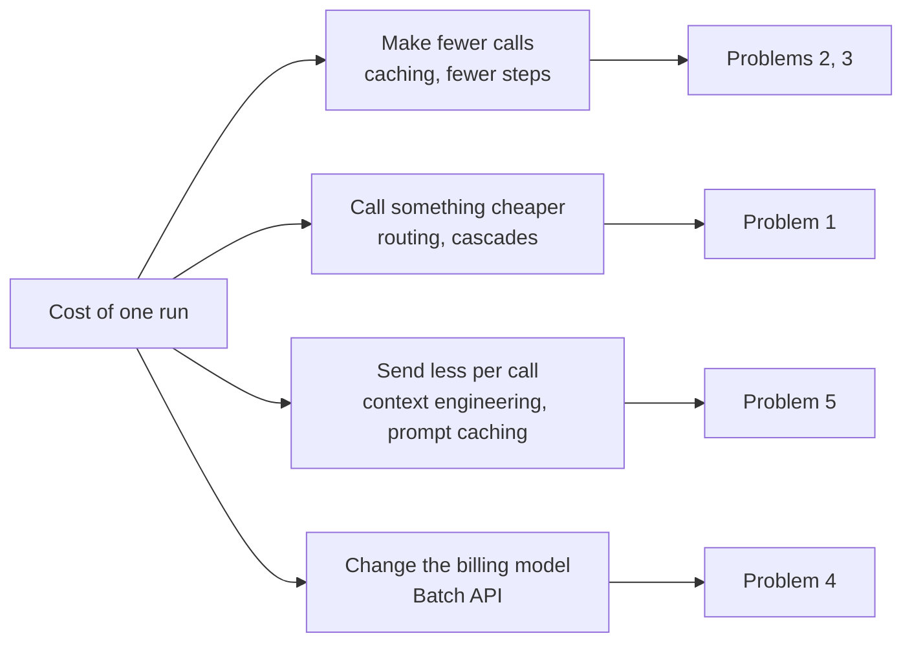

[中文](README.md) | [English](README.en.md)

# Lesson 14: Cost and latency optimization — making agents cheaper and faster

> 🕐 Time: 15 min | 🎯 You'll be able to: take an agent's bill and latency distribution, explain where the money and the time go, pick the right optimization for each item, and explain what that optimization costs you | 📦 Source: [costkit.py](costkit.py) (this lesson), [`agentkit/pricing.py`](../../agentkit/pricing.py), [`agentkit/tracing.py`](../../agentkit/tracing.py)

## 0. In one sentence

**Cost and latency optimization comes down to four questions: Can you skip this call? Can something cheaper handle it? Can you send less? Can you avoid making the user sit and wait?**

Picture an IT service-desk agent at a 5,000-person company. During the proof of concept it cost a few hundred dollars a month, and everyone was happy. Then it rolled out company-wide: 20,000 conversations a day, 4 steps per conversation on average, and about 6,000 input tokens and 200 output tokens per step. At this lesson's **example prices** ($2.5 input and $20 output per million tokens, used only to illustrate the math, not any vendor's quote):

$$20000 \times 4 \times (6000 \times 2.5 + 200 \times 20) / 10^6 \approx \$1520 / \text{day} \approx \$46{,}000 / \text{month}$$

Finance asks: which department and which feature is the money going to? Product asks: why do users say "I have to wait more than ten seconds every time"? All you can say is "the model is probably just expensive and slow."

This lesson gives you answers you can put into practice right away. Like Lesson 08's `ResilientLLM`, most of them are **decorators wrapped around the LLM**, so the agent's main loop doesn't change by a single line.

## 1. Core concepts

### 1.1 Where the money goes: one formula, four levers

The cost of one agent run:

$$\text{cost} = \sum_{\text{each step}} \left( \text{input tokens} \times \text{input price} + \text{output tokens} \times \text{output price} \right)$$

Agents differ from ordinary chat in two ways:

1. **Input dwarfs output**: every step resends the system prompt, the tool definitions, and the full history. As Lesson 04 mentioned, the Manus team has shared that their input-to-output ratio is about 100:1.
2. **Input accumulates with every step**: the input at step k contains everything from the previous k−1 steps, so total input grows **quadratically** with the number of steps (Problem 5 walks through the math).

That gives you four levers for saving money. Each problem card covers one or more of them:



### 1.2 Where the time goes: first separate "actually slow" from "feels slow"

The end-to-end latency of one agent run:

$$\text{latency} \approx \text{queueing} + \sum_{\text{each step}} \left( \text{TTFT} + \text{output tokens} \times \text{TPOT} \right) + \sum \text{tool time}$$

- **TTFT (Time To First Token)**: the time from sending the request to receiving the first token. It includes the network, queueing, and the time to "read the whole input" (prefill). The longer the input, the longer the TTFT.
- **TPOT (Time Per Output Token)**: how fast the model generates tokens, one at a time. The longer the output, the slower the response. A reasoning model's "thinking" counts as output tokens too.
- **Perceived latency**: how long the user feels they waited. Streaming doesn't shorten the total time, but it lets the user see the first word within 1 second.

You also need to tell **average latency** apart from **tail latency**. A system with p50 = 2 seconds and p99 = 20 seconds makes 1 in every 100 users wait 20 seconds. Multi-step agents amplify the tail: if a run makes 5 model calls, it only takes 1 of them landing in the slowest 1% to make the whole run slow. The probability that none of the 5 lands there is $0.99^5 \approx 95\%$. In other words, **about 5% of runs hit at least one "p99-level" slow call**.

### 1.3 The overriding principle: quality is a constraint, not a variable you can trade away

Every way of saving money or speeding things up carries the same risk: **quietly trading away quality**. A smaller model, a cache, truncated context: any of them can make answers worse, and none of them will raise an error. So:

1. **Measure before you optimize**: find the biggest cost and latency items in your traces (Lesson 10). Don't optimize on gut feeling.
2. **Every optimization must pass the eval set** (Lesson 11): it only counts as an optimization if quality doesn't drop.
3. **Look at distributions, not averages**: for cost, look at p95 cost per run (a handful of runaway runs often account for most of the spend); for latency, look at p95 / p99.

## 2. Enterprise problem cards

### Problem 1: The bill is out of control — every request uses the strongest model

**Scenario**: The IT service-desk agent above launched with the flagship model for everything, to get the best results. A sample of 1,000 conversations shows that about 70% are questions like "How do I connect to the VPN?" or "How do I request a monitor?", which a knowledge-base lookup can answer. Only the remaining 30% need multi-step troubleshooting across several systems. At the example prices, the model one tier down is 10× cheaper.

**Why it's hard**: The obvious answer is "use a small model for simple questions." The catch is that **you don't know whether a question is simple until you've answered it**. "My computer can't get online" might mean Wi-Fi is switched off, or it might be an expired certificate plus a misconfigured proxy. Routing by keyword sends hard problems to the small model; using the large model for everything is too expensive.

| Option | How | Pros | Cons | Best for |
|---|---|---|---|---|
| A. Static routing | Hard-code which model to use by task type, feature, or tenant plan (the `choose_model` exercise in Lesson 12) | Simple, predictable, no added latency | Coarse-grained: hard problems within a task type still go to the small model; rules need human upkeep | Clear boundaries between task types: classification, extraction, and summarization go to the small model; complex reasoning goes to the large one |
| B. Cascade | Let the small model answer first; escalate to the large model if the validator rejects the answer (or the small model errors out) | You pay according to each request's actual difficulty; with a deterministic validator, there's almost no extra cost | Escalated requests pay twice and wait twice; you need a reliable validator | Output that can be validated cheaply: JSON / schemas, tool names and arguments, executable checks |
| C. Learned routing | Train a classifier that predicts, as each request arrives, whether the small model can handle it (e.g. RouteLLM trains its router on human preference data) | No need to call the small model first, so latency doesn't stack up | Needs labeled data and ongoing retraining; quietly degrades when the data distribution shifts; hard to explain why a request was routed the way it was | High traffic, lots of accumulated eval data, and an ML team to maintain it |

**The math of a cascade**: Let the per-call cost of the small and large models be $c_s$ and $c_l$, and let the escalation rate be $p$. The expected cost of a cascade is $c_s + p \cdot c_l$ (for an escalated request, you still pay for the small model's attempt). It beats "large model for everything" when:

$$c_s + p \cdot c_l < c_l \iff p < 1 - \frac{c_s}{c_l}$$

If the small model is 10× cheaper, you save money as long as the escalation rate stays below 90%, which looks generous. But **the latency math is much tighter**. A cascade's expected latency is $t_s + p \cdot t_l$, and the small model usually isn't 10× faster. If the small model takes half as long as the large one ($t_s = 0.5\,t_l$), then once the escalation rate passes 50%, the cascade is slower than just using the large model. In one real run of this lesson's demo, the cascade cut cost by 75%, yet average latency rose from 2.77 seconds to 3.86 seconds. This "small" model was no faster than the large one, and the escalated ticket paid for two calls' worth of time, small plus large. **A cheaper model isn't necessarily a faster one. Always measure.**

**The validator is the heart of a cascade.** Common approaches, ordered by reliability:

| Check | Extra cost | Reliability | Example |
|---|---|---|---|
| Format / schema | ≈0 | High, but it only checks format, not correctness | The JSON parses, all fields are present, enum values are valid |
| Tool call validity | ≈0 | High | The tool name exists; the arguments pass schema validation |
| Executable verification | Low | High | The SQL passes `EXPLAIN`, generated code passes its unit tests, the total matches the line items |
| Self-reported confidence | ≈0 | Low: a model's self-reported confidence isn't necessarily calibrated | Have the model output `confidence`; escalate below a threshold |
| Sample several times and check agreement | Small-model cost × N | Medium-high | Ask the small model twice; accept only if the answers agree |
| LLM-as-judge | One extra call | Medium | Have another model judge "Did this answer the question?" |

**How to choose**: Start with **A**. Routing by task type is a small change that pays off fast, and it usually saves a big chunk on its own. Then add **B** for tasks whose output can be validated cheaply: structured extraction, classification, tool calls. **C** is only worth the investment once you have enough traffic and enough eval data. Whichever you choose, every change to the routing rules must pass the eval set.

**In this lesson**: [`CascadeLLM`](costkit.py). The core logic is just these few lines (excerpt, with locking and bookkeeping omitted):

```python
def chat(self, messages, tools=None, **kwargs):
    try:
        draft = self.small.chat(messages, tools, **kwargs)
    except LLMError:                                   # small model rate-limited / timed out / unavailable: escalate right away
        return self._escalate("error", messages, tools, kwargs)
    try:
        ok = bool(self.validator(messages, draft))
        reason = "rejected"
    except Exception:                                  # the validator itself has a bug: treat it as "rejected"; never let the request fail
        ok, reason = False, "validator_error"
    if ok:
        return draft
    self.wasted = self.wasted + draft.usage           # discarded small-model answer: money wasted, but still billed
    return self._escalate(reason, messages, tools, kwargs)
```

Three design decisions:

1. **It keeps its own books**: the agent's `cost_usd` only prices "the response that was finally returned," so it never sees the discarded small-model calls. `CascadeLLM` tracks `small_usage`, `large_usage`, and `wasted` separately. Otherwise you'd systematically underestimate what the cascade costs.
2. **Escalation rate is the key metric**: in production, monitor the escalation rate per task type. A sudden rise means the traffic distribution has shifted, or the vendor has updated the small model (Lesson 16).
3. **It escalates per step**: in an agent, the cascade applies to every model call. The small model can handle step 1's tool call while step 2's summary gets escalated. The alternative is **per-task escalation**: once any step escalates, the rest of the run uses the large model, because the task is clearly hard. `CascadeLLM` doesn't know where a run starts and ends, so per-task escalation has to live in a hook or in the service layer.

In production: manage "which model to use" and "the escalation rules" centrally in a **model gateway** (Lesson 12), and feed escalation rates and per-model usage into your monitoring dashboards.

---

### Problem 2: The same question, asked ten thousand times

**Scenario**: The service desk handles 20,000 conversations a day. "What do I do if the VPN won't connect?" comes up 800 times a day, and "How do I request a monitor?" 300 times. Every one of them triggers a full model call, and the answers are almost word-for-word identical.

**Why it's hard**: Caching itself isn't hard. The hard part is **when an answer can be reused, and for whom**.

- Does a rephrasing ("the VPN won't log in" vs. "the VPN won't connect") count as the same question? If it does, you risk false hits. If it doesn't, your hit rate will be low.
- If an employee at company A has asked a question, can an employee at company B who asks the same thing get that answer directly? The answer might contain company A's internal information.
- Can "Refund order A1 for me" be cached? If it is, the second request gets "Refunded" straight back, **and no refund ever actually happens**.

| Option | How | Pros | Cons | Best for |
|---|---|---|---|---|
| A. Exact-match cache | Hash "the full request + its scope" (tenant, permissions, …); hit only on an exact match | Zero false hits; simple to implement; on a hit, latency and cost are close to zero | Only works for verbatim repeats; requests that include timestamps or usernames almost never hit | FAQs, classification, extraction, fixed templates, eval replays |
| B. Semantic cache | Turn the question into a vector (embedding) and reuse the answer when similarity exceeds a threshold (open-source implementations include GPTCache) | A much higher hit rate; rephrasings still hit | **False hits happen**: `reset my password` and `reset his password`, or `cancel order A123` and `cancel order A124`, have nearly identical vectors but completely different meanings; embeddings add their own cost and latency; the threshold is hard to tune | Public-knowledge Q&A where the answer doesn't depend on who's asking and mistakes are tolerable, with the false-hit rate quantified on an eval set |
| C. Prompt caching | The vendor reuses the computation for identical prefixes on its servers (for how it works, see [Lesson 04, Section 2.5](../04_context_memory/README.en.md)) | Doesn't change the answer (the model still generates it in full); broadly effective for multi-step agents; almost no code changes | Only saves on "input" cost and time to first token; requires a byte-for-byte stable prefix; the exact rules and prices vary by vendor | Every agent should do this: put stable content first |

The three don't conflict. **C is the default setting**, A is for highly repetitive scenarios, and B calls for great caution.

**The cache key: anything that could give two people different answers must go into the key.** This lesson's [`cache_key`](costkit.py) is built from these parts:

```python
payload = {
    "v": KEY_VERSION,                  # key algorithm version: bump it when the algorithm changes, and old entries are invalidated automatically
    "scope": normalize_scope(scope),   # tenant, roles, ...: come from the auth system, not from the model
    "model": model,                    # a new model must not return the old model's answers
    "params": params or {},            # a different temperature / max_tokens can mean a different answer
    "tools": tools or [],              # a different role-filtered tool list means different model decisions
    "messages": normalize_call_ids(messages),
}
return hashlib.sha256(canonical_json(payload).encode("utf-8")).hexdigest()
```

- `canonical_json` normalizes with `sort_keys=True`, so requests with the same content but a different dict key order get the same key.
- `normalize_call_ids` replaces the random `tool_call_id`s the model generates (like `call_x8Jf2…`) with `#0`, `#1`, and so on, in order of appearance. These ids carry no meaning. Without this step, every request from the agent's step 2 onward is full of random ids, and two identical conversations will never hit.
- Use `hashlib.sha256`, not the built-in `hash()`. The built-in uses a different random seed in each process, so multiple instances sharing Redis will never match.

**Why must the cache key include the tenant?** You might think: the request content is already fully in the key. If two tenants send byte-for-byte identical requests, what's wrong with giving them the same answer? At least four things:

1. **The answer may depend on things outside the request.** Suppose the cache sits in front of "the whole agent" and stores final answers by user question (we'll call this a request-level cache below). Then the answer comes from data retrieved under that user's identity. An employee at company A asks "What's our VPN address?" and gets `vpn.acme.com`. An employee at company B asks the same thing, hits the cache, and gets company A's address. The same applies within a tenant: if HR asks "What is Zhang San's salary?" and gets an answer, a regular employee who asks the same question must never hit that entry. So a request-level cache's scope must include the tenant **and** the permission context.
2. **Timing side channel**: cache hits respond much faster. An attacker sends a guessed piece of content; if the response comes back unusually fast, "someone has sent exactly this before." A Stanford team's paper, *Auditing Prompt Caching in Language Model APIs* (ICML 2025), audited real API providers, detected prompt caching shared across users at 7 providers including OpenAI, and pointed out that this could leak information about other users' prompts. Your own cache has the same problem.
3. **Compliance and deletion**: when a customer leaves and demands "delete all our data," you can't tell which cache entries belong to them if the key has no tenant.
4. **Per-tenant policies**: some customer contracts require that data never enter any shared storage; others require a shorter TTL.

So `CachingLLM` checks at construction time and raises an error if `scope` has no `tenant_id`. **Better no cache at all than a cache that doesn't separate tenants.**

**Why must write operations with side effects never be cached?** First be clear about which layer the cache sits at:

| Cache layer | What's cached | What happens if a write gets cached |
|---|---|---|
| Request-level (caches the final answer by user question) | "Refund order A1" → "Your refund has been processed" | The second request gets "Refunded" straight back, **and the tool never runs**. The user thinks they got the refund; they didn't. A semantic cache is even worse: `refund order A2` may hit A1's answer |
| Tool-result-level (caches the tool's return value) | `create_ticket(...)` → `T-1001` | The second ticket is never created, yet the user is told it was |
| Model-call-level (this lesson's `CachingLLM`) | The model's "decision": call `refund(order_id=A1)` | The tool still really runs, but one model decision gets "frozen" and replayed again and again, each time skipping the model's fresh judgment in the current context |

The rule: **neither the results nor the decisions of write operations go into the cache; results of read-only operations can be cached briefly; a request-level cache is only for requests whose entire trajectory is read-only.**

**Should a model-call-level cache store "tool call" responses?** `CachingLLM` defaults to `cache_tool_calls=False` and caches only final text answers:

| | Cache only final text (default) | Also cache tool-call decisions |
|---|---|---|
| What happens on a hit | You get the final answer directly | You get the decision "go call tool X"; the tool **still really runs** and reads the latest data |
| Benefit | Saves the last generation | Also saves the step 1 "planning" call, and step 1 (system prompt + user question) happens to be the most repetitive request of all |
| Risk | The answer may be stale; control it with a TTL | One bad decision gets replayed over and over; if the same cached response is replayed twice within one run, `tool_call_id`s get duplicated |
| Recommendation | The default | Enable it only when your tools are mostly read-only, and list every write tool in `never_cache_tools` |

A note on "freshness": say a user asks "Where's my ticket at?" Step 1 is a tool call (not cached by default), so the tool queries in real time. The step 2 request includes the latest ticket status, so when the status changes, the key changes. Under the default policy, answers that depend on real-time data never go stale.

**In this lesson**: [`ResponseCache`](costkit.py) (LRU + TTL + hit-rate stats) and [`CachingLLM`](costkit.py). The cache store is shared globally, the decorator is created per request, and the scope comes from the auth system:

```python
CACHE = ResponseCache(ttl_s=600)          # process-level singleton; Redis in production

def handle(request, identity):
    llm = CachingLLM(base_llm, CACHE, scope={"tenant_id": identity["tenant_id"], "roles": identity["roles"]})
    return Agent(llm, tools).run(request.text, metadata=identity)
```

A few more details: on a hit, the returned `usage` is 0 (the call really did cost nothing, and the agent's `cost_usd` and the trace reflect that faithfully). Responses whose `finish_reason` is `length` (truncated), or whose content is empty, aren't cached, so an incomplete answer never gets frozen in place. Exceptions aren't cached either.

In production: move the store to Redis (`SET key value EX ttl`, with the eviction policy set to `allkeys-lru`) so that multiple instances share it naturally; monitor hit rate separately by tenant and by feature; when the knowledge base changes, proactively purge the affected entries for each tenant.

---

### Problem 3: Users say it's too slow

**Scenario**: An agent averages 4 steps. Each model call takes 2–6 seconds (measured in this lesson's demo), and there are tool calls on top of that. p50 is about 12 seconds; p99 is over 40 seconds. Users report: "I hit send, the screen showed nothing for over ten seconds, and I thought it had frozen."

**Why it's hard**: Latency is the sum of many segments, and different segments need different fixes. A faster model may be a dumber one, and adding machines doesn't change how fast the model "spits out tokens one at a time." Tail latency often comes from things you don't control: the vendor's queues, cold starts, a slow node somewhere.

| Option | How | Pros | Cons | Best for |
|---|---|---|---|---|
| A. Streaming | Show output as it's generated; during tool calls, show "Checking the ticket system…" | Users see feedback within the first second; the biggest improvement in how fast it feels | Total time is unchanged; mid-stream disconnects are hard to handle (Lesson 08, 8.4); output guardrails have to check text as it's generated | Every human-facing chat interface |
| B. Parallel tool calls | The model issues several independent calls in one turn, and they run concurrently | Total tool time goes from "the sum" to "the max" | Only for independent calls; concurrent writes need care around ordering and idempotency | Querying several systems at once: orders + shipping + inventory |
| C. Fewer steps | Merge tools that are always called together; have a tool return everything the next step needs in one go; rewrite fixed flows as workflows (Lesson 06) | Every step removed is one fewer full model call (seconds each) | Tools need redesigning; you may lose some flexibility | Trajectory analysis shows lots of fixed "check A → check B → check C" sequences |
| D. Small models for classification and guardrails | Hand intent detection, routing, and input/output checks to a small model or to rules | These pre-steps sit on every request's critical path, so a smaller model cuts latency directly | The small model's accuracy needs its own evaluation | Pre-checks that every request passes through |
| E. Hedged requests | If a request hasn't returned by the p95 mark, send an identical one and use whichever comes back first | Targets the tail specifically: p99 can drop close to p95 | Costs extra (roughly the share of requests that trigger a hedge); **only for requests without side effects** | Scenarios with a p99 requirement and fairly short individual requests |

**How to choose**: For human-facing interfaces, **A is a must**: it's the cheapest and gives the biggest felt improvement. Then look at the trajectories in your traces. If there are many steps, do **C**; if one turn has several independent tools, do **B**. Use **D** for pre-step classification and guardrails. Use **E** only when "average latency is already acceptable and the tail is what hurts," and the threshold must come from your own latency distribution.

A fact about B: to keep things simple, agentkit's main loop runs multiple tool calls from the same turn **sequentially** (see the `for` loop in [`Agent._run_pending_tools`](../../agentkit/agent.py)). The model may issue the calls in parallel, but they still run one after another. In production, you can run `risk="read"` tools concurrently and keep write tools sequential.

**Why does hedging work?** The idea comes from Jeff Dean and Luiz André Barroso's paper *The Tail at Scale* (2013). Tail latency is often **sporadic**: a request just happens to land on a slow node. Send it again and it will most likely land on a healthy one. If you send the second request at the p95 mark, only the slowest 5% of requests get sent twice, for about 5% extra cost, and those 5% now take "p95 + one normal request's time." Simulated results from this lesson's demo. (Demo output translated from Chinese.)

```text
                      p50     p90     p99    calls
   no hedging        40ms    63ms   505ms       60
   hedge after 80ms  41ms    64ms   141ms       64
   extra cost: +7% more calls
```

**In this lesson**: [`hedged_call`](costkit.py).

```python
futures = [pool.submit(fn)]
pending = set(futures)
while True:
    can_hedge = len(futures) < max_requests
    done, pending = wait(pending, timeout=hedge_after_s if can_hedge else None, return_when=FIRST_COMPLETED)
    if not done:                          # waited long enough and nothing has come back → send a hedge request
        f = pool.submit(fn); futures.append(f); pending.add(f); continue
    for f in done:
        if f.exception() is None:
            return HedgeOutcome(f.result(), futures.index(f), len(futures), ...)   # use whichever succeeds first
    ...                                   # all failed: resend immediately on a retryable error, otherwise raise
```

Two limitations you need to know:

- **The losing request can't be cancelled**: Python threads can't be forcibly killed, and the HTTP request may already be generating on the server. The tokens it consumes will very likely still be billed (depending on the vendor and whether you're streaming). So `HedgeOutcome.launched` is the number of calls you pay for.
- **Only hedge calls without side effects**: hedging a "refund" request means refunding twice.

On a real model, demo scenario 3 deliberately sets the threshold to 1.5 seconds (below this model's median latency). The result: 2 requests went out, you paid twice, and latency didn't improve. **With the threshold below median latency, almost every request pays double for almost no benefit.**

In production: do hedging in the model gateway or the HTTP client layer, and enable it only for idempotent read requests; compute the threshold dynamically from the recent latency distribution; monitor the hedge trigger rate and the "hedge win rate." A very low win rate means the threshold is too aggressive.

---

### Problem 4: Offline batch jobs pay online prices

**Scenario**: Every night, the day's 20,000 tickets need to be classified, tagged, and summarized so operations can read the report the next morning. On top of that, every prompt change means running 2,000 eval cases. Nobody is sitting at a screen waiting for any of this, yet all of it pays online API prices and competes with daytime online traffic for the same rate-limit quota.

**Why it's hard**: Online API prices and limits are set for a service level of "on demand, right now." Offline jobs don't need that service level, but if you don't treat them any differently, you pay the same price.

| Option | How | Pros | Cons | Best for |
|---|---|---|---|---|
| A. Batch API | Write a batch of requests to a file and submit it; the vendor processes it asynchronously within a time window, and you poll for the results | As of this writing (September 2026), the official docs for both OpenAI's Batch API and Anthropic's Message Batches API state a price of 50% of the synchronous API; a separate rate-limit quota, so it doesn't crowd out online traffic | No guaranteed completion time: OpenAI commits to finishing within 24 hours, and Anthropic's docs say most batches finish within 1 hour and a batch not done within 24 hours expires; **not suited to multi-step agent loops**: every step has to wait for a batch | Offline evals, bulk classification and tagging, nightly reports, historical backfills |
| B. Off-peak scheduling | Use your own job queue and run during off-peak hours | Doesn't eat into peak-hour rate-limit quota; with a self-hosted inference cluster, you can max out GPUs that sit idle at night | With pay-as-you-go commercial APIs, running off-peak doesn't lower the unit price by itself | Self-hosted models; tight rate limits |
| C. Online API + concurrency | Call the online API directly, concurrently | Fastest results, simplest to implement | Most expensive; competes with online traffic for quota and may push daytime users into 429s | Small, urgent jobs |

**How to choose**: For single-step tasks (classification, extraction, summarization, LLM-as-judge scoring in evals), prefer **A**. If you also want batching for multi-step agent tasks, switch to "per-step batching": submit step 1 of every task as one batch; when the results come back, submit step 2 of every task as the next batch. The price is that total time becomes "number of steps × batch time." Save **C** for jobs that really are urgent.

**In this lesson**: Batching is a vendor feature, so this lesson has no implementation code for it. Prices and rules change; check the official docs before you use it (see Further reading). Three things to watch for when you roll it out:

1. **Idempotency and deduplication**: batch results come back asynchronously, so your write-back logic must handle duplicates and partial failures.
2. **Result retention**: Anthropic's docs say batch results are kept only for a limited time (29 days), so fetch them promptly.
3. **Evals can save money too**: once Lesson 11's eval set gets large, LLM-as-judge scoring is a great fit for batch processing.

---

### Problem 5: Longer context costs more, and it grows quadratically

**Scenario**: A troubleshooting agent has about 3,000 tokens of system prompt plus tool definitions, and each step (one tool call + its result) adds about 800 tokens. Simple issues are resolved in 5 steps; complex ones take 40. The team finds that a complex issue doesn't cost 8× as much as a simple one. It costs over 30×.

**Why it's hard**: Every step resends the full history. Let the system prompt + tool definitions be $S$ and the amount each step adds be $d$. The input at step $k$ is $S + (k-1)d$, and the total input over $N$ steps is:

$$\sum_{k=1}^{N} \left(S + (k-1)d\right) = N \cdot S + d \cdot \frac{N(N-1)}{2}$$

The second term is on the order of $N^2$: **double the steps, and input tokens far more than double**. Plug in $S=3000$ and $d=800$: 5 steps comes to 23,000 tokens, and 40 steps comes to 744,000 tokens, a 32× difference.

Truncation or summarization can hold the growth down, but every change to the history changes the prefix and invalidates the prompt cache. "Keep the context short" and "keep the prefix stable" pull in opposite directions (Lesson 04, Section 2.5).

| Option | How | Effect on the cost curve | Trade-off | Best for |
|---|---|---|---|---|
| A. Append-only + prompt caching | History is only ever appended to, never modified, to maximize prefix hits | Still quadratic, but the prefix shared with the previous step is billed at the cached price, which shrinks the coefficient dramatically | The context window fills up eventually; long context also degrades quality on its own | Tasks with a moderate number of steps and a stable prefix (the default) |
| B. Sliding window / clearing old tool results | Cap each step's input at W | Growth becomes linear | Once the window starts sliding, only the system prompt + tool definitions stay unchanged in the prefix, so most of the cache is lost; early information is lost too | Very long tasks where early details don't matter |
| C. Summarization (compaction) with high/low watermarks | Append-only most of the time; when input passes the high watermark, compress it down to the low watermark in one go | Benefits from caching most of the time, with the occasional cost of a compression | The summary itself takes a model call; some information is lost | Long tasks where early constraints and decisions matter |
| D. Cut growth at the source | Tools return only the fields that are needed; store large results externally and include only a reference; isolate work in sub-agents (Lesson 06) | Directly reduces $d$ | Requires changing how tools are designed | Every scenario; the best value for money |

Demo scenario 4 uses [`context_cost`](costkit.py) to compute the "full-price-equivalent tokens" for the four strategies (cache hits are priced at 0.1× the normal price, and the window is capped at 12,000 tokens):

```text
   steps  append-only     append+cache    sliding window  window+cache
   5      23,000          7,880           23,000          7,880
   10     66,000          15,780          66,000          15,780
   20     212,000         37,580          184,800         93,900
   40     744,000         105,180         424,800         279,900
```

Three things to take from this table:

1. **Append-only + caching** is the cheapest at every step count, because at each step only the 800 new tokens are billed at full price and everything else is billed at a tenth of it.
2. **A sliding window on its own** only makes a noticeable difference at high step counts (at 40 steps, it drops from 740K to 420K).
3. **Window + caching** is actually more expensive than "append-only + caching" (at 20 steps: 93,900 vs. 37,580). As soon as the window slides, the prefix changes, and only the 3,000 tokens of system prompt + tool definitions can still hit the cache. **The two optimizations don't simply stack.**

This is, of course, an idealized model. It assumes the cache hits at every step, ignores the minimum cacheable length and cache expiry, and doesn't account for the quality loss that comes with overly long context. Append-only can't go on forever; the window fills up eventually. What the model does is show you the trend: **reduce $d$ first (option D), then keep the prefix stable (option A), and when you have to compress, compress in batches with high/low watermarks (option C).**

**How to choose**: **D + A is the default combination.** When a task gets long enough to approach the context window, add **C**. Use **B** only where "early information really doesn't matter."

**In this lesson**: [`context_cost`](costkit.py) is for estimating and comparing. The real context strategies live in [`agentkit/context.py`](../../agentkit/context.py), and Lesson 04 explains how they work. To see whether the cache is actually hitting, look at `Usage.cached_input_tokens`. agentkit reads it from `usage.prompt_tokens_details.cached_tokens` in OpenAI-compatible APIs, and `PRICES` in [`agentkit/pricing.py`](../../agentkit/pricing.py) lets you set a third price per model (the input price for cache hits). If your gateway doesn't return this field, it's always 0.

---

### Problem 6: Who is the money being spent on?

**Scenario**: The month-end bill is $46,000. Finance asks how much each business unit should be charged. Sales wants to know whether heavy users will turn the $500/month "Pro" plan into a money-loser. Ops notices that the globex tenant's cost tripled in a week, but can't say whether that's more users, longer conversations, or some feature stuck in an infinite loop.

**Why it's hard**: The vendor's bill only shows "which API key, which model, how many tokens." **It doesn't know which tenant or which feature a call served.** That information exists only in your own request context. The server has to tag it at the request entry point and pass it all the way down. Miss it once, and you can't recover it after the fact.

| Option | How | Pros | Cons | Best for |
|---|---|---|---|---|
| A. Vendor bill only | Look at the total at month-end, split roughly by API key | Zero effort | You don't know who the money went to; by the time you spot an anomaly, you're a month late | Early stage, with a single application |
| B. Gateway metering | Every model call goes through a model gateway with tenant, feature, and model tags, and is written to a metering system | Real-time, complete (no sampling), covers every application; can block calls in real time based on budget | You have to build the gateway; tags must be injected server-side | Production environments with multiple applications and multiple tenants |
| C. Attribution from traces | Tag the trace's root span and aggregate offline | Pinpoints "which step, which tool, which loop" made things expensive | **Traces are usually sampled**: bills computed from sampled traces come out wrong | Cost analysis and root-cause investigation (alongside B) |

**How to choose**: Use **B** for billing and budget enforcement, which have to be complete and real-time. Use **C** to analyze "why is this expensive." The two must share the same tagging scheme.

**Budget governance** needs at least three layers:

1. **A per-run budget**: Lesson 08's `BudgetHook`, which keeps a single run from spiraling out of control.
2. **Tenant budgets + tiered alerts**: at 80%, notify the tenant admin and the customer success manager; at 100%, apply the policy the contract specifies (fall back to a small model, rate-limit, go read-only, suspend service). **Check before the call** (reserve quota up front); finding the overspend at month-end is too late.
3. **Unit economics**: total cost alone doesn't tell you much. Look at **cost per successful task** = total cost ÷ number of successes. Failed runs cost money too, so raising the success rate is itself a way to lower unit cost. Only by comparing it with "the cost of a human handling one ticket" can you say whether the agent is worth it.

**In this lesson**: The demo uses [`cost_report`](costkit.py) to total up cost and cost per successful task by tenant and by "tenant × feature," and [`budget_alerts`](costkit.py) for two-level budget alerts. The tagging convention: the service layer opens a **root span** for each request and writes the tenant and feature from the auth system onto it, and `agent.run` becomes its child span:

```python
with tracer.span("request", **{"tenant.id": identity["tenant_id"], "app.feature": "faq"}):
    agent.run(text, metadata=identity)
```

Why not write them straight onto the `agent.run` span? Because agentkit's `agent.run` span only records `agent.name` and `run_id`; it doesn't copy the tenant over from `metadata`. This is actually common. The framework you use won't necessarily add business tags for you, and the service layer's root span (the equivalent of an HTTP request's server span) is where business tags belong. For attribution, use `trace_id` to join the cost on `agent.run` with the tenant on the root span.

There's one more real-world trap: `agent.cost_usd` is **the run's cumulative cost**. When a run pauses for approval and is later `resume`d, the `agent.resume` span records the total of "run phase + resume phase." Add the two spans' costs together and the run phase gets counted twice. Exercise (c) has you handle this.

In production: use a model gateway (LiteLLM, a cloud provider's AI gateway, or your own) for complete metering, written to a time-series database or data warehouse; store budgets in a database and have the gateway check them before every call; build dashboards that show cost and unit economics across three dimensions: tenant, feature, and model.

## 3. Hands-on: run the demo

```bash
python lessons/14_cost_latency/demo.py --offline   # offline script, no API key needed, simulated latencies
python lessons/14_cost_latency/demo.py             # real model, about 30 calls, 1-2 minutes
```

In real mode, the large model is `LLM_MODEL` from `.env`, and the small model is `LLM_SMALL_MODEL` (falling back to `LLM_FALLBACK_MODEL` if that isn't set). **All costs are computed with the demo's example prices** (large model $2.5 / $20, small model $0.25 / $2, per million tokens), not any vendor's real prices.

**Scenario 1: exact-match cache** (an excerpt of real-model output; model latency and token counts vary from run to run, so your numbers will differ)

```text
▶ Control: no cache, 7 requests processed one by one
   7 model calls, total cost $0.01274, total time 22.6s

▶ Experiment: exact-match cache on (ResponseCache shared globally, CachingLLM created per request, scope = tenant + roles)
   #  tenant   question                                        cache     latency       cost
   1  acme     What do I do if the VPN won't connect?          · miss      2.45s   $0.00168
   2  acme     How do I request a new monitor?                 · miss      2.33s   $0.00156
   3  acme     What do I do if the VPN won't connect?          ✅ hit      0.00s   $0.00000
   4  globex   What do I do if the VPN won't connect?          · miss      2.65s   $0.00168
   5  acme     What do I do if the VPN won't connect?          ✅ hit      0.00s   $0.00000
   6  globex   Summarize as a ticket title, max 10 chars: …    · miss      4.12s   $0.00350
   7  globex   What do I do if the VPN won't connect?          ✅ hit      0.00s   $0.00000

   Hit rate 43% (3/7), saved 1248+96 tokens
   Cost: $0.01274 → $0.00842 (-34%)
   Avg latency: no cache 3.22s → with cache 1.65s (hits 0.00s / misses 2.89s)

▶ Trace of the run that hit the cache (llm.chat tokens are 0 → 0: this call cost nothing)
   agent.run  0ms  tokens=0→0  status=completed steps=1 cost=$0.00000
   └─ llm.chat  0ms  tokens=0→0  → final_answer
```

👀 What to notice:

- Request 4: globex asked exactly the same question as acme and **didn't hit**, because the tenant is part of the cache key.
- **Hit rate is not the same as savings**: the hit rate was 43%, but cost dropped only 34%. Request 6 (a summary) cost $0.0035 on its own, more than two FAQs combined, and it wasn't a repeat. How much a cache saves depends on "the share of cost that comes from repeated traffic." When the two numbers are more than 10 percentage points apart, the demo prints a dedicated ⚠️ warning line.
- In the trace of the run that hit the cache, `llm.chat` shows tokens `0→0`. That call really did cost nothing, and cost attribution reflects it faithfully.
- The requests that missed took anywhere from 2 to 4 seconds. That's the latency variability Problem 3 talks about.

**Scenario 2: cascade**

```text
   Ticket                                                 Large only      Cascade                Latency A→B
   VPN won't connect since this morning, error 809…       network/P1      network/P1 (small)     2.1s → 2.8s
   3rd-floor printer jammed again                         hardware/P2     hardware/P3 (small)    3.2s → 2.5s
   Excel crashes whenever I open a large file             software/P2     software/P3 (small)    3.5s → 5.3s
   My computer's been acting strange lately, sometimes…   software/P3     software/P3 (large)    2.3s → 6.2s
   ...
   Escalation rate: 17% (1/6), reasons: {'rejected': 1}
   Discarded small-model output: 500 tokens — wasted, but still billed
   Cost: A $0.01506  vs  B $0.00374 (-75%)
   Avg latency: A 2.77s  vs  B 3.86s
   Agreement with 'large only': category 6/6, priority 4/6 (the mismatches are the cascade's quality cost; keep watching them with the eval set)
```

👀 What to notice:

- For the ambiguous ticket ("My computer's been acting strange lately…"), the small model's self-reported confidence was too low, so it was escalated to the large model, and its latency was the sum of both calls.
- Cost dropped 75%, but **latency got worse**: this small model is no faster than the large one (the latency break-even analysis from Problem 1).
- Every category matched, but two tickets got a different **priority** (P2 vs. P3). A cascade's quality isn't "free." Whether being off by one priority level is a problem is for the eval set and the business owners to decide.

**Scenarios 3–5**: a hedged-request simulation (see Problem 3; in real mode it also deliberately tries an overly low threshold once on a real model), the context cost curve (see Problem 5), and cost attribution and budget alerts by tenant and feature:

```text
▶ By tenant
   acme     5 runs  5 succeeded  cost $0.00490  cost per successful task $0.00098
   globex   3 runs  3 succeeded  cost $0.00518  cost per successful task $0.00173
▶ By tenant × feature
   acme       faq        cost $0.00490
   globex     faq        cost $0.00168
   globex     summary    cost $0.00350
▶ Budget check (example budgets: acme $0.006 / month, globex $0.003 / month; 80% = warning, 100% = over budget)
   🟡 Warning acme: 82% used
   🔴 Over budget globex: 173% used
```

👀 What to notice: globex has fewer runs than acme but a higher cost, because the "summary" feature is expensive per call. The "tenant × feature" report makes that obvious at a glance. Scenario 5 reads the trace file that scenario 1 exported, `runs/14_cost_latency/traces.jsonl`. Open it and look at `tenant.id` and `app.feature` on the root spans.

## 4. Exercises

Open [exercise.py](exercise.py) and complete three exercises:

**(a) `cache_key(messages, tools, model, tenant_id)`: the cache key**

- Task: compute a cache key for a model request using SHA-256. Dict key order must not affect the result; `tools=None` and `[]` are equivalent; raise `ValueError` if the tenant is empty.
- Hint: put all four things into **a single** dict, then serialize it with `json.dumps(..., sort_keys=True, separators=(",", ":"), ensure_ascii=False)`. Don't concatenate strings: tenant `"ab"` + model `"c"` and tenant `"a"` + model `"bc"` produce the same string. One test recomputes the key in a separate process, so the built-in `hash()` won't pass.

**(b) `CascadeLLM.chat`: the cascade's escalation logic**

- Task: the small model errors → escalate (reason `error`); the validator returns a falsy value → escalate (`rejected`); the validator itself raises → escalate (`validator_error`). Record the usage of discarded small-model answers in `wasted`, and don't swallow exceptions from the large model.
- One test hands a `CascadeLLM` directly to an `Agent`. The small model invents a tool that doesn't exist, the validator rejects it, and that step escalates to the large model; on the next step, the small model can handle things again.

**(c) `cost_by_tenant(spans)`: attribute cost by tenant**

- Task: the tenant comes from `attrs["tenant.id"]` on each trace's root span, and the cost comes from spans that carry `agent.cost_usd`; join the two on `trace_id`. When the same `run_id` appears more than once, take the maximum (cumulative values can't be summed). Cost that can't be attributed goes to `"unknown"`.
- The docstring has the full conventions and a worked example. Two of the tests generate traces with a real `Tracer` + `jsonl_exporter`, including one run that goes "pause for approval → resume."

Verify:

```bash
make lesson N=14                                                  # run your implementation
AGENTKIT_SOLUTION=1 .venv/bin/python -m pytest lessons/14_cost_latency -v    # check against the reference solution
```

All 18 tests run offline and finish in about 1 second.

## 5. Going deeper (if you have time)

### 5.1 Semantic caching: how to quantify "false hits"

The biggest problem with a semantic cache is that **you can't tell when it's wrong**: a cached answer always looks plausible. Before launch, evaluate it the way you'd evaluate a classifier:

1. Sample pairs of questions from production logs and have people label whether "these two questions can share one answer."
2. For a range of similarity thresholds, compute **precision** (how many of the hits really should have hit) and the **hit rate**.
3. Pick the threshold based on the false-hit rate the business can accept. Where "a wrong answer causes real damage," you'll often find the threshold has to be so high that there's barely any hit rate left. At that point, give up on semantic caching.

There are also a few simple safeguards: skip the semantic cache when the question contains numbers, order numbers, names, or dates ("today," "tomorrow"); enable it only for intents labeled "public knowledge"; and make sure cached answers never contain anything specific to a user or tenant.

### 5.2 Cache stampedes and single-flight

The moment a popular question's cache entry expires, 100 concurrent requests all miss at once, all call the model, and you pay 100 times. This is a **cache stampede**. Common countermeasures:

- **Request coalescing (single-flight)**: only one request per key may call the model at a time; the others wait for its result.
- **Early refresh**: when an entry is close to expiring, one request refreshes it in the background while the others keep using the old value.
- **TTL with random jitter**: keeps a batch of entries from all expiring at the same moment (the same idea as retry jitter in Lesson 08).

`CachingLLM` doesn't implement any of these. In production with Redis, you can use `SET NX` as a short-lived lock.

### 5.3 The cost–quality Pareto frontier

Choosing a model isn't about "the cheaper the better," or "the stronger the better." It's about finding a point on the **cost–quality curve**. Here's how: run every candidate model (plus combinations such as cascades and routing) on the same eval set, and plot cost per run on the x-axis against pass rate on the y-axis. Drop any configuration that falls below the curve (more expensive and worse). Among the configurations on the curve, pick the cheapest one that meets the minimum quality the business will accept. Redraw the chart every time a vendor releases a new model or changes its prices. Lesson 11's `run_eval` already records `cost_usd` in each `CaseResult`, so the data for this chart is ready to go.

### 5.4 What else you can do with self-hosted inference

If you self-host models on an engine like vLLM, a whole class of "inference-side" optimizations opens up: continuous batching for higher GPU utilization, prefix caching (the same principle as vendors' prompt caching), quantization, speculative decoding, and more. They change "the cost and speed of each token." That layer complements this lesson's "call less, call something cheaper, send less."

### 5.5 Latency budgets: giving each segment its share of time

Like the timeout hierarchy in Lesson 08, latency can be turned into a budget too. With an end-to-end p95 target of 10 seconds, you might allow 0.5 seconds for the pre-step guardrails, 2 seconds per model call, at most 4 steps, 0.5 seconds per tool call… and you can see at a glance which segment went over. The duration of each span in your traces (Lesson 10) is the data you check the budget against.

## 6. Common pitfalls and anti-patterns

| Anti-pattern | Consequence | Do this instead |
|---|---|---|
| Using the strongest model for every request | The bill grows linearly with traffic, and most of it goes to simple questions | Start with static routing by task type, then add a cascade for tasks you can verify |
| Judging a cascade by the agent's `cost_usd` alone | Discarded small-model calls are invisible, so cost is systematically underestimated | Have the cascade keep its own books (`small_usage`, `large_usage`, `wasted`) |
| Using the model's self-reported confidence as the only validator | Confidence isn't calibrated, so requests that should escalate don't | Prefer deterministic checks; calibrate confidence thresholds on the eval set |
| No tenant or permission context in the cache key | Leaks across tenants and permission levels; a timing side channel; no way to delete by tenant | Scope comes from the auth system; no tenant, no cache |
| Caching the results of writes, or "done" answers | Users think the operation completed, but it never ran | Never cache writes; use request-level caching only for requests that are read-only end to end |
| Computing cache keys with the built-in `hash()` | Results differ per process, so a cache shared across instances never hits | `hashlib.sha256` + canonical JSON |
| Treating the cache hit rate as the savings rate | The hits are all cheap requests, so the bill barely moves | Track "cost saved by hits / total cost" |
| Putting timestamps or usernames at the start of the system prompt | Prompt caching stops working entirely | Stable content first, dynamic content last (Lesson 04) |
| Sliding the window at every step | The prefix changes every step, so almost nothing but the system prompt hits the cache | Compress in batches with high/low watermarks; append-only the rest of the time |
| Picking a very low hedge threshold on gut feeling | Almost every request pays double | Set the threshold at p90–p95 of your own latency distribution, and monitor the hedge win rate |
| Hedging or retrying requests with side effects | Duplicate refunds, duplicate emails | Only hedge read-only requests; use idempotency keys for writes (Lesson 08) |
| Running offline jobs through the online API | You pay more and compete with online traffic for quota | Use the Batch API for single-step offline jobs |
| Computing bills from sampled traces | Cost is systematically underestimated | Bill from complete gateway metering; use traces only for analysis |
| Looking at the bill only at month-end | A runaway tenant or feature has already burned through a month of spend | Tenant budgets + pre-call checks + tiered 80% / 100% alerts |
| Skipping evals after an optimization | You save money while quality quietly degrades | Every optimization must pass the eval set; quality is a constraint |

## 7. Interview & design review questions

<details>
<summary>Q1: An agent's monthly bill suddenly doubles. How do you investigate?</summary>

- First break it down by dimension: look at tenant, feature, and model separately. Did one dimension spike, or did everything go up?
- Then break down the formula: cost = number of runs × average steps × tokens per step × unit price. Which term changed? More traffic? More steps (loops, retries after tool failures)? More tokens per step (a broken context strategy, bigger tool output, a falling cache hit rate)? A higher unit price (a routing rule change, a rising escalation rate, an accidental switch to a pricier model)?
- Look at the distribution: are a few runs extremely expensive (infinite loops, runaway output), or did every run get more expensive?
- Finally, look at the timeline: line it up against recent releases, prompt changes, and vendor model updates (Lesson 16).
</details>

<details>
<summary>Q2: What's the difference between a cascade and routing? When does a cascade end up more expensive or slower?</summary>

- Routing decides which model to use before the call and calls only once. A cascade calls the small model first, validates afterward, and calls the large model if the answer fails.
- A cascade's expected cost is $c_s + p \cdot c_l$. When the escalation rate $p > 1 - c_s/c_l$, it costs more than just using the large model.
- Its latency is $t_s + p \cdot t_l$. When the small model isn't fast enough and the escalation rate is high, the cascade is slower.
- It presupposes a cheap, reliable validator. If the validator is itself a model call, redo the math.
</details>

<details>
<summary>Q3: Design an LLM response cache. What goes into the cache key? What must never be cached?</summary>

- Key: the normalized full request (messages, tools, model, call parameters) + scope (tenant and permission context, plus the user when responses are personalized) + a key-algorithm version. Use SHA-256, not a process-dependent hash.
- Never cache: results of write operations and "done" answers; truncated or content-filtered responses; errors.
- Request-level caching (caching the final answer by user question) is only for requests whose entire trajectory is read-only and whose answer doesn't depend on who's asking.
- Bonus points: tool_call_id normalization; TTLs and per-tenant purging; timing side channels; stampedes and single-flight.
</details>

<details>
<summary>Q4: When does each fit: exact-match caching, semantic caching, and prompt caching?</summary>

- Prompt caching: happens on the vendor's side and doesn't change answers; it saves only input cost and time to first token. Every agent should take advantage of it by keeping a "stable prefix."
- Exact-match caching: zero false hits; suits highly repetitive requests with stable answers (FAQs, classification, eval replays).
- Semantic caching: a high hit rate, but false hits happen. Use it only for public-knowledge Q&A where mistakes are tolerable and the answer doesn't depend on who's asking, and quantify the false-hit rate.
</details>

<details>
<summary>Q5: Users complain the agent is too slow. Where do you start?</summary>

- Start with the traces: is the time going to model calls (too many steps? slow individual steps? long output?), to tool calls, or to queueing?
- Perceived latency: stream the output and show intermediate progress ("Checking the ticket system…").
- Actual latency: cut steps (merge tools, turn fixed flows into workflows), run independent tool calls in parallel, and use small models for pre-step classification and guardrails.
- The tail: when p99 is far above p95, hedge read-only requests with the threshold at p95.
- Watch for multi-step amplification: the more steps, the more likely a run hits a slow call.
</details>

<details>
<summary>Q6: How do hedged requests work, what do they cost, and when can't you use them?</summary>

- How: tail latency is usually sporadic. If nothing has come back by p95, send another request and use whichever returns first, pulling p99 back close to p95.
- Cost: the extra spend is roughly the share of requests that trigger a hedge; the losing request usually can't be cancelled and is still billed.
- When not to use them: requests with side effects (refunds, sending emails); requests that are slow every single time by nature (hedging only doubles the load); when downstream is already overloaded (hedging makes it worse; pair it with Lesson 08's retry budget).
</details>

<details>
<summary>Q7: In a multi-tenant SaaS, how do you do cost attribution and budget control?</summary>

- Tags: the tenant, feature, and model are injected server-side at the request entry point (from the auth system) and carried through gateway metering, traces, and logs.
- Metering: complete metering in the model gateway; don't rely on sampled traces.
- Budgets: check before the call (reserve quota up front); warn at 80%, and apply the contract policy at 100% (fallback model, rate limiting, read-only).
- Metrics: cost per successful task (unit economics). Compare it with the cost of human handling, and use it to judge whether your plan pricing makes sense.
- Pitfall: for runs that pause and resume, don't double-count the cumulative cost.
</details>

## 8. Self-check

- [ ] I can write down the cost formula for an agent run and name the four levers for saving money
- [ ] I can explain the differences among TTFT, TPOT, perceived latency, and tail latency, and why multi-step agents amplify the tail
- [ ] I can compare static routing, cascades, and learned routing, and work out a cascade's break-even points for cost and latency
- [ ] I can name several ways to build a validator, and explain why self-reported confidence is unreliable
- [ ] I can compare exact-match caching, semantic caching, and prompt caching, and explain why the cache key must include tenant and permission context
- [ ] I can explain the difference between request-level, tool-result-level, and model-call-level caching, and why write operations must not be cached
- [ ] I can explain why hedged requests lower p99, how to set the threshold, and what they cost
- [ ] I can say which tasks suit the Batch API, and why it doesn't fit multi-step agent loops
- [ ] I can derive the quadratic growth formula for context cost, and explain why "window + cache" doesn't simply stack
- [ ] I can design a multi-tenant cost attribution and budget alerting scheme, and explain why "cost per successful task" is more useful than total cost
- [ ] I've finished exercises (a)(b)(c), and `make lesson N=14` passes

## Further reading

- Lingjiao Chen, Matei Zaharia, James Zou, [FrugalGPT: How to Use Large Language Models While Reducing Cost and Improving Performance](https://arxiv.org/abs/2305.05176) (2023): the representative paper on LLM cascades
- Isaac Ong et al., [RouteLLM: Learning to Route LLMs with Preference Data](https://arxiv.org/abs/2406.18665) (ICLR 2025) and the [LMSYS blog post introducing it](https://www.lmsys.org/blog/2024-07-01-routellm/): learned routing
- Chenchen Gu et al., [Auditing Prompt Caching in Language Model APIs](https://arxiv.org/abs/2502.07776) (ICML 2025): timing side channels in prompt caching, and caches shared across users
- Jeffrey Dean, Luiz André Barroso, [The Tail at Scale](https://research.google/pubs/the-tail-at-scale/), Communications of the ACM (2013): tail latency and hedged requests
- OpenAI docs, [Batch API](https://developers.openai.com/api/docs/guides/batch): pricing, the completion window, rate-limit rules
- Anthropic docs, [Batch processing](https://platform.claude.com/docs/en/build-with-claude/batch-processing): the Message Batches API
- [GPTCache](https://github.com/zilliztech/GPTCache): an open-source semantic cache implementation, useful for understanding a semantic cache's building blocks (embeddings, a vector store, similarity checks)
- In this repo: [Lesson 04: Context engineering and prompt caching](../04_context_memory/README.en.md) · [Lesson 08: Budgets and retries](../08_reliability/README.en.md) · [Lesson 10: Computing metrics from traces](../10_observability/README.en.md) · [Lesson 11: Evals](../11_evals/README.en.md) · [Lesson 12: Model gateways and routing](../12_production_architecture/README.en.md) · [Failure mode B2: Prompt cache busting](../../docs/failure-modes.en.md#b2-prompt-cache-busting)
