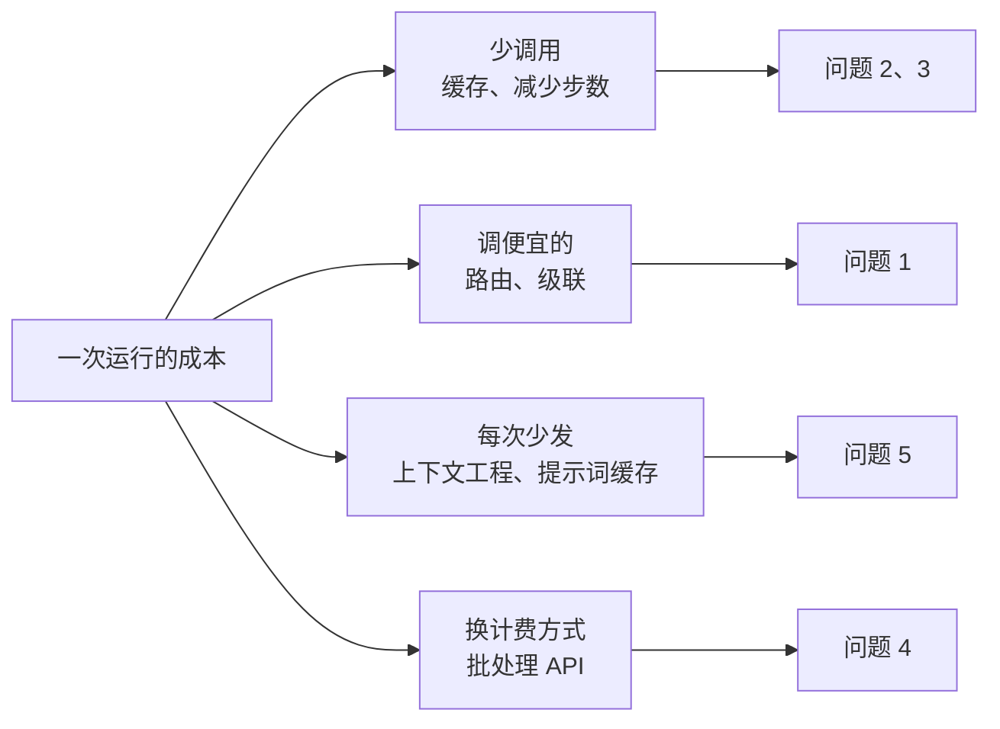

[中文](README.md) | [English](README.en.md)

# 第 14 课：成本与延迟优化 —— 让 Agent 又省钱又快

> 🕐 建议用时：15 分钟 ｜ 🎯 学完你能：拿到一份 Agent 账单和延迟分布，说清钱和时间花在了哪里，为每一项选出合适的优化手段，并讲清它的代价 ｜ 📦 对应源码：[costkit.py](costkit.py)（本课）、[`agentkit/pricing.py`](../../agentkit/pricing.py)、[`agentkit/tracing.py`](../../agentkit/tracing.py)
>
> 📖 必读：[FrugalGPT: How to Use Large Language Models While Reducing Cost and Improving Performance](https://arxiv.org/abs/2305.05176)（Chen 等, 2023）—— LLM 级联的代表性论文，它的三类手段（提示词适配、模型近似（含补全缓存）、级联）对应本课四个问题中的前三个；重点读 §3 的三类策略和级联里"打分函数 + 阈值"的设计，再对照本课 `CascadeLLM` 的 validator。

## 0. 一句话讲清楚

**成本和延迟优化，本质上是在回答四个问题：这次调用能不能不做？能不能换个便宜的来做？能不能少发点东西？能不能不让用户干等？**

假设一个 5000 人公司的 IT 服务台 Agent：概念验证阶段每月几百美元，大家都很满意。全员推广后，每天 2 万次对话，平均每次 4 步，每步输入约 6000 token、输出约 200 token。按本课使用的**示例单价**（输入 $2.5、输出 $20 / 百万 token，只用于演示计算，不是任何厂商的报价）：

$$20000 \times 4 \times (6000 \times 2.5 + 200 \times 20) / 10^6 \approx \$1520 / \text{天} \approx \$4.6 \text{ 万} / \text{月}$$

财务问：钱花在哪个部门、哪个功能上了？产品问：为什么用户说"每次都要等十几秒"？你只能回答"大概是模型比较贵、比较慢"。

这节课给你一套可以直接落地的回答。它们和第 08 课的 `ResilientLLM` 一样，大多是**包在 LLM 外面的装饰器**，Agent 主循环一行都不用改。

## 1. 核心概念

### 1.1 钱花在哪：一个公式，四个杠杆

一次 Agent 运行的成本：

$$\text{成本} = \sum_{\text{每一步}} \left( \text{输入 token} \times \text{输入单价} + \text{输出 token} \times \text{输出单价} \right)$$

Agent 有两个和普通聊天不同的特点：

1. **输入远大于输出**：每一步都要把 system prompt、工具定义、完整历史重新发一遍。第 04 课提到，Manus 团队分享过他们的输入输出比约为 100:1；
2. **输入随步数累积**：第 k 步的输入包含前 k−1 步的所有内容，所以总输入随步数**平方**增长（问题 5 会算给你看）。

所以省钱的杠杆有四个，每个问题卡片对应其中一个或几个：



### 1.2 时间花在哪：先分清"真的慢"和"感觉慢"

一次 Agent 运行的端到端延迟：

$$\text{延迟} \approx \text{排队} + \sum_{\text{每一步}} \left( \text{TTFT} + \text{输出 token 数} \times \text{TPOT} \right) + \sum \text{工具耗时}$$

- **TTFT（Time To First Token，首 token 时间）**：请求发出到收到第一个 token 的时间，包含网络、排队和"读完整个输入"（prefill）的时间。输入越长，TTFT 越长；
- **TPOT（Time Per Output Token，每个输出 token 的时间）**：模型逐个生成 token 的速度。输出越长越慢。推理型模型的"思考"也是输出 token；
- **感知延迟**：用户觉得等了多久。流式输出不会让总时间变短，但能让用户在 1 秒内看到第一个字。

还要分清**平均延迟**和**长尾延迟**。p50 = 2 秒、p99 = 20 秒的系统，意味着每 100 个用户里就有 1 个要等 20 秒。多步 Agent 会放大长尾：一次运行 5 次模型调用，只要有 1 次落进最慢的 1%，整次运行就慢了。5 次都没有落进去的概率是 $0.99^5 \approx 95\%$，也就是说，**约 5% 的运行至少会碰上一次"p99 级别"的慢调用**。

### 1.3 总原则：质量是约束条件，不是可以拿来换的变量

所有省钱、提速的手段都有同一个风险：**悄悄把质量换掉了**。换小模型、加缓存、截断上下文，都可能让回答变差，而且不会报错。所以：

1. **先测量再优化**：从 trace（第 10 课）里找出成本和延迟的大头，别凭感觉优化；
2. **每个优化都要过评估集**（第 11 课）：质量不降，才算优化；
3. **看分布，不看平均**：成本看 p95 单次成本（少数失控的运行往往占了大头），延迟看 p95 / p99。

本课的"优化"指的是在质量不降的前提下省钱、提速。反过来的问题——质量本身不够好时，该改提示词、加测试时计算还是微调——见[第 23 课](../23_optimization/README.md)。

## 2. 企业问题与解决方案

### 问题 1：账单失控 —— 每个请求都用最强的模型

**场景**：上面那个 IT 服务台 Agent，上线时为了效果统一用了旗舰模型。抽样 1000 条对话发现，约 70% 是"VPN 怎么连""怎么申请显示器"这种查知识库就能答的问题，剩下 30% 才需要多步排障、调用多个系统。按示例单价，小一档的模型便宜 10 倍。

**为什么难**：直觉方案是"简单问题用小模型"。难点在于**你在回答之前并不知道它简不简单**。"我电脑连不上网"可能是 Wi-Fi 没开，也可能是证书过期加上代理配置错误。按关键词分流会把难题分给小模型；全部用大模型又太贵。

| 方案 | 怎么做 | 优点 | 缺点 | 适用场景 |
|---|---|---|---|---|
| A. 静态路由 | 按任务类型、功能、租户套餐写死用哪个模型（第 12 课练习的 `choose_model`） | 简单、可预测、没有额外延迟 | 粒度粗：同一类任务里的难题也会被分给小模型；规则要人维护 | 任务类型边界清楚：分类、抽取、摘要交给小模型，复杂推理交给大模型 |
| B. 级联（cascade） | 先让小模型答，validator 判不合格（或小模型报错）再升级到大模型 | 按每个请求的实际难度花钱；validator 是确定性规则时，几乎没有额外成本 | 被升级的请求要付两次钱、等两次时间；需要一个可靠的 validator | 输出能被廉价验证：JSON / Schema、工具名和参数、可执行的检查 |
| C. 学习型路由 | 训练一个分类器，请求来了先预测"小模型能不能搞定"（如 RouteLLM 用人类偏好数据训练路由器） | 不用先调用小模型，延迟不叠加 | 需要标注数据和持续再训练；数据分布变了会悄悄变差；难以解释为什么这样分 | 流量大、积累了大量评估数据、有 ML 团队维护 |

**级联的账怎么算**：设小模型和大模型单次成本为 $c_s$、$c_l$，升级率为 $p$。级联的期望成本是 $c_s + p \cdot c_l$（被升级的请求，小模型那次也要付钱）。它比"全用大模型"便宜的条件是：

$$c_s + p \cdot c_l < c_l \iff p < 1 - \frac{c_s}{c_l}$$

小模型便宜 10 倍时，升级率低于 90% 就省钱，看起来很宽松。但**延迟的账要紧得多**：级联的期望延迟是 $t_s + p \cdot t_l$，而小模型通常不会快 10 倍。如果小模型的耗时是大模型的一半（$t_s = 0.5\,t_l$），升级率超过 50% 时，级联就比直接用大模型还慢。本课 Demo 的一次真实运行里，级联省了 75% 的钱，平均延迟却从 2.77 秒涨到了 3.86 秒：这个"小"模型并不比大模型快，被升级的那张工单还要付"小 + 大"两次时间。**便宜的模型不一定快，一定要实测。**

**validator 是级联的灵魂**。常见做法按可靠性排序：

| 校验方式 | 额外成本 | 可靠性 | 例子 |
|---|---|---|---|
| 格式 / Schema | ≈0 | 高，但只能判断格式，判断不了对错 | JSON 能解析、字段齐全、枚举值合法 |
| 工具调用合法性 | ≈0 | 高 | 工具名存在、参数通过 Schema 校验 |
| 可执行的验证 | 低 | 高 | SQL 能通过 `EXPLAIN`、生成的代码能跑通单测、金额和明细对得上 |
| 自报置信度 | ≈0 | 低：模型自报的置信度未必校准 | 让模型输出 `confidence`，低于阈值就升级 |
| 多次采样看是否一致 | 小模型成本 × N | 中高 | 小模型答两次，一致才采用 |
| LLM 评委 | 一次额外调用 | 中 | 让另一个模型判断"是否回答了问题" |

**怎么选**：先做 **A**：按任务类型分流，改动小、见效快，通常就能省下一大块。然后在"输出能被廉价验证"的任务上加 **B**：结构化抽取、分类、工具调用。**C** 只在流量足够大、评估数据足够多时才值得投入。无论选哪种，路由规则的每次改动都要过评估集。

**本课实现**：[`CascadeLLM`](costkit.py)。核心逻辑就这几行（节选，省略了加锁和统计）：

```python
def chat(self, messages, tools=None, **kwargs):
    try:
        draft = self.small.chat(messages, tools, **kwargs)
    except LLMError:                                   # 小模型限流 / 超时 / 不可用：直接升级
        return self._escalate("error", messages, tools, kwargs)
    try:
        ok = bool(self.validator(messages, draft))
        reason = "rejected"
    except Exception:                                  # 校验器自己有 bug：按"不合格"处理，不能让请求失败
        ok, reason = False, "validator_error"
    if ok:
        return draft
    self.wasted = self.wasted + draft.usage           # 被丢弃的小模型回答：白花了，但照样计费
    return self._escalate(reason, messages, tools, kwargs)
```

三个设计决策：

1. **自己记账**：Agent 的 `cost_usd` 只按"最终返回的那个响应"计价，看不到被丢弃的小模型调用。`CascadeLLM` 分别累计 `small_usage`、`large_usage`、`wasted`，否则你会系统性地低估级联的成本；
2. **升级率是核心指标**：线上要按任务类型监控升级率。升级率突然上升，说明流量分布变了，或者小模型被厂商更新了（第 16 课）；
3. **按步升级**：在 Agent 里，级联作用于每一次模型调用。第 1 步的工具调用可以由小模型完成，第 2 步的总结再升级。另一种做法是**按任务升级**：只要有一步升级，这次运行剩下的步骤都用大模型，因为这个任务显然很难。`CascadeLLM` 不知道运行边界，要实现按任务升级，得在 Hook 或服务层做。

生产级替换：把"用哪个模型"和"升级规则"放到**模型网关**里集中管理（第 12 课），升级率、各模型用量进入监控看板。用 LiteLLM Router 落地的模型网关（按模型组路由、失败降级、按团队预算）见[第 29 课](../29_gateway_and_guardrails/README.md)。

---

### 问题 2：同样的问题被问了一万遍

**场景**：服务台每天 2 万次对话，"VPN 连不上怎么办"一天被问 800 次，"怎么申请显示器"被问 300 次。每一次都完整地调用一遍模型，答案几乎一字不差。

**为什么难**：缓存本身不难，难的是**什么时候能复用、复用给谁**。

- 换个说法（"VPN 登不上" vs "VPN 连不上"）算不算同一个问题？算，就可能误命中；不算，命中率就很低；
- A 公司员工问过的问题，B 公司员工再问，能不能直接给答案？答案里可能有 A 公司的内部信息；
- "帮我给订单 A1 退款"能不能缓存？如果缓存了，第二次请求会直接收到"已退款"，**退款却没有真的发生**。

| 方案 | 怎么做 | 优点 | 缺点 | 适用场景 |
|---|---|---|---|---|
| A. 精确缓存 | 对"完整请求 + 作用域"（租户、权限……）做哈希，完全相同才命中 | 零误命中；实现简单；命中时延迟和成本都接近 0 | 只对逐字重复的请求有效；带时间戳、带用户名的请求几乎不命中 | FAQ、分类、抽取、固定模板、评估回放 |
| B. 语义缓存 | 把问题转成向量（embedding），相似度超过阈值就复用答案（开源实现如 GPTCache） | 命中率高得多，换个说法也能命中 | **会误命中**：`重置我的密码` 和 `重置他的密码`、`取消订单 A123` 和 `取消订单 A124` 向量非常接近，意思却完全不同；embedding 本身也有成本和延迟；阈值很难调 | 答案与提问者无关、容错度高的公开知识问答，并且要用评估集量化误命中率 |
| C. 提示词缓存（prompt caching） | 厂商在服务端复用相同前缀的计算结果（原理见[第 04 课 2.5 节](../04_context_memory/README.md)） | 不改变答案（模型仍然完整生成）；对多步 Agent 普遍有效；几乎零改动 | 只省"输入"的钱和首 token 时间；要求前缀逐字稳定；具体规则和价格因厂商而异 | 所有 Agent 都应该做：稳定内容放前面 |

三种方案不冲突：**C 是默认配置**，A 用在高重复的场景，B 要非常谨慎。

**缓存键：任何会让两个人得到不同答案的东西，都必须进键。** 本课的 [`cache_key`](costkit.py) 由这几部分组成：

```python
payload = {
    "v": KEY_VERSION,                  # 键算法的版本：改了算法就换版本号，旧缓存自然失效
    "scope": normalize_scope(scope),   # 租户、角色……来自认证系统，不是来自模型
    "model": model,                    # 换了模型不能返回旧模型的答案
    "params": params or {},            # temperature / max_tokens 不同，答案也可能不同
    "tools": tools or [],              # 按角色裁剪过的工具列表不同，模型的决定也不同
    "messages": normalize_call_ids(messages),
}
return hashlib.sha256(canonical_json(payload).encode("utf-8")).hexdigest()
```

- `canonical_json` 用 `sort_keys=True` 规范化，dict 键顺序不同但内容相同的请求得到同一个键；
- `normalize_call_ids` 把模型随机生成的 `tool_call_id`（如 `call_x8Jf2…`）换成按出现顺序的 `#0`、`#1`。这些 id 不带任何语义。不做这一步，Agent 第 2 步之后的请求里全是随机 id，两次一模一样的对话也永远不会命中；
- 用 `hashlib.sha256` 而不是内置 `hash()`：后者每个进程的随机种子不同，多个实例共享 Redis 时永远对不上。

**为什么缓存键里一定要有租户？** 你可能会想：请求内容已经完整地放进键里了，两个租户的请求逐字相同，给出同一个答案有什么问题？至少有四个问题：

1. **答案可能依赖请求之外的东西**。如果缓存放在"整个 Agent"前面（按用户问题缓存最终答案，下面称为请求级缓存），答案来自用这个用户的身份检索到的数据。A 公司员工问"我们的 VPN 地址是多少"，答案是 `vpn.acme.com`；B 公司员工问同一句话，命中缓存就会拿到 A 公司的地址。同一租户内也一样：HR 问"张三的工资"得到了答案，普通员工问同一句话绝不能命中。所以请求级缓存的作用域要包含租户**和**权限上下文；
2. **计时侧信道**：命中缓存的响应快得多。攻击者发送一段猜测的内容，如果响应特别快，就说明"有人发过一模一样的内容"。斯坦福团队的论文 *Auditing Prompt Caching in Language Model APIs*（ICML 2025）审计了真实的 API 提供商，在包括 OpenAI 在内的 7 家提供商中检测到了跨用户共享的提示词缓存，并指出这可能泄露其他用户的提示词信息。你自己的缓存同样有这个问题；
3. **合规与删除**：客户解约时要求"删除我们的全部数据"，键里没有租户，你就找不到哪些缓存条目属于它；
4. **按租户定制策略**：有的客户合同要求数据不进任何共享存储，有的要求更短的 TTL。

所以 `CachingLLM` 在构造时就检查：`scope` 里没有 `tenant_id` 直接报错。**宁可不用缓存，也不能用一个不分租户的缓存。**

**为什么带副作用的写操作绝不能缓存？** 要分清缓存放在哪一层：

| 缓存层 | 缓存了什么 | 写操作被缓存的后果 |
|---|---|---|
| 请求级（按用户问题缓存最终答案） | "给订单 A1 退款" → "已为您退款" | 第二次请求直接返回"已退款"，**工具根本没执行**。用户以为退了，实际没退；语义缓存更糟：`给订单 A2 退款` 可能命中 A1 的答案 |
| 工具结果级（缓存工具的返回值） | `create_ticket(...)` → `T-1001` | 第二张工单根本没创建，却告诉用户建好了 |
| 模型调用级（本课的 `CachingLLM`） | 模型的"决定"：调用 `refund(order_id=A1)` | 工具仍然会真实执行，但模型的一次决定被"固化"并反复重放，每次都跳过了模型结合当前上下文的重新判断 |

规则：**写操作的结果和决定都不进缓存；只读操作的结果可以短时间缓存；请求级缓存只用于"整条轨迹都是只读"的请求。**

**模型调用级缓存要不要缓存"工具调用"响应？** `CachingLLM` 默认 `cache_tool_calls=False`，只缓存最终的文本回答：

| | 只缓存最终文本（默认） | 也缓存工具调用决定 |
|---|---|---|
| 命中后发生什么 | 直接拿到最终答案 | 拿到"去调用工具 X"的决定，工具**仍会真实执行**，读到的是最新数据 |
| 收益 | 省掉最后一次生成 | 还能省掉第 1 步的"规划"调用，而第 1 步（system + 用户问题）恰恰是重复度最高的请求 |
| 风险 | 答案可能过时，用 TTL 控制 | 一次错误的决定被反复重放；同一个缓存响应在一次运行里重放两次时，`tool_call_id` 会重复 |
| 建议 | 默认 | 只在工具基本只读时开启，并用 `never_cache_tools` 列出所有写工具 |

注意"新鲜度"：用户问"我的工单处理到哪了"，第 1 步是工具调用（默认不缓存），工具会实时查询；第 2 步的请求里包含了最新的工单状态，状态一变，键就变了。所以默认策略下，依赖实时数据的回答天然不会过时。

**本课实现**：[`ResponseCache`](costkit.py)（LRU + TTL + 命中率统计）和 [`CachingLLM`](costkit.py)。缓存存储全局共享，装饰器按请求创建，作用域来自认证系统：

```python
CACHE = ResponseCache(ttl_s=600)          # 进程级单例；生产中是 Redis

def handle(request, identity):
    llm = CachingLLM(base_llm, CACHE, scope={"tenant_id": identity["tenant_id"], "roles": identity["roles"]})
    return Agent(llm, tools).run(request.text, metadata=identity)
```

另外几个细节：命中时返回的 `usage` 为 0（这次确实没花钱，Agent 的 `cost_usd` 和 trace 会如实反映）；`finish_reason` 为 `length`（被截断）或内容为空的响应不缓存，免得把残缺的答案固化下来；异常不缓存。

生产级替换：存储换成 Redis（`SET key value EX ttl`，淘汰策略设为 `allkeys-lru`），多实例天然共享；命中率按租户、功能分别监控；知识库更新时按租户主动清理相关条目。

---

### 问题 3：用户嫌慢

**场景**：一个 Agent 平均 4 步，每步模型调用 2~6 秒（本课 Demo 的真实测量），再加上工具调用，p50 约 12 秒，p99 超过 40 秒。用户反馈"点了发送，屏幕十几秒没反应，以为卡死了"。

**为什么难**：延迟是很多段加起来的，不同的段要用不同的办法。换更快的模型可能变笨，加机器也解决不了"模型一个 token 一个 token 往外吐"的速度。而长尾延迟往往来自你控制不了的地方：厂商的排队、冷启动、某个慢节点。

| 方案 | 怎么做 | 优点 | 缺点 | 适用场景 |
|---|---|---|---|---|
| A. 流式输出 | 边生成边显示，工具调用时显示"正在查询工单系统…" | 用户第 1 秒就能看到反馈，体感提升最大 | 总耗时不变；中途断流难处理（第 08 课 5.4）；输出护栏要改成边生成边检查 | 所有面向人的对话界面 |
| B. 并行工具调用 | 模型在一轮里发起多个互不依赖的调用，并发执行 | 多个工具的耗时从"相加"变成"取最大" | 只适用于互不依赖的调用；写操作并发要注意顺序和幂等 | 一次要查多个系统：订单 + 物流 + 库存 |
| C. 减少步数 | 合并总是一起调用的工具；让工具一次返回下一步需要的全部信息；固定流程改写成 workflow（第 06 课） | 每少一步，就少一次完整的模型调用（秒级） | 要重新设计工具，可能损失一些灵活性 | 轨迹分析发现大量固定的"查 A → 查 B → 查 C"序列 |
| D. 小模型做分类与护栏 | 意图识别、路由、输入输出检测交给小模型或规则 | 这些前置步骤在每个请求的关键路径上，换小模型直接减少延迟 | 小模型的准确率要单独评估 | 每个请求都要经过的前置检查 |
| E. 对冲请求（hedged request） | 等了 p95 的时间还没回来，就再发一个一样的请求，谁先回来用谁 | 专门砍长尾：p99 可以降到接近 p95 | 多花钱（约等于触发对冲的比例）；**只能用于没有副作用的请求** | 对 p99 有要求、单次请求较短的场景 |

**怎么选**：面向人的界面，**A 是必做项**，成本最低、体感收益最大。然后看 trace 里的轨迹：步数多就做 **C**，同一轮有多个独立工具就做 **B**。前置的分类、护栏用 **D**。**E** 只在"平均延迟已经可以接受、长尾拖后腿"时才用，而且阈值必须来自你自己的延迟分布。

关于 B 的一个事实：agentkit 的主循环为了简单，**按顺序**执行同一轮里的多个工具调用（见 [`Agent._run_pending_tools`](../../agentkit/agent.py) 里的 `for` 循环）。模型虽然一次发起了并行调用，执行时仍然是串行的。生产中可以并发执行 `risk="read"` 的工具，写工具保持串行。

**对冲为什么有效？** 这个思路来自 Jeff Dean 和 Luiz André Barroso 的论文 *The Tail at Scale*（2013）。长尾延迟往往是**偶发**的：某次请求刚好排在一个慢节点上。再发一次，大概率会落到一个正常的节点。如果在 p95 时刻发出第二个请求，只有最慢的 5% 请求会多发一次，额外成本约 5%，而这 5% 请求的延迟变成"p95 + 一次正常请求的耗时"。本课 Demo 的模拟结果：

```text
                      p50     p90     p99   调用次数
   不对冲            40ms    63ms   505ms       60
   80ms 后对冲       41ms    64ms   141ms       64
   多花的钱：+7% 的调用量
```

**本课实现**：[`hedged_call`](costkit.py)。

```python
futures = [pool.submit(fn)]
pending = set(futures)
while True:
    can_hedge = len(futures) < max_requests
    done, pending = wait(pending, timeout=hedge_after_s if can_hedge else None, return_when=FIRST_COMPLETED)
    if not done:                          # 等够了还没有任何一个回来 → 发对冲请求
        f = pool.submit(fn); futures.append(f); pending.add(f); continue
    for f in done:
        if f.exception() is None:
            return HedgeOutcome(f.result(), futures.index(f), len(futures), ...)   # 谁先成功用谁
    ...                                   # 都失败了：可重试的错误立刻补发，否则抛出
```

两个必须知道的限制：

- **输掉的请求取消不了**：Python 线程无法被强行终止，HTTP 请求可能已经在服务端开始生成。它消耗的 token 很可能照样计费（取决于厂商以及是否流式）。所以 `HedgeOutcome.launched` 就是你要付的调用次数；
- **只能对冲没有副作用的调用**：对冲一个"退款"请求，就是退两次款。

Demo 场景 3 在真实模型上故意把阈值设成 1.5 秒（低于这个模型的中位延迟）：结果发出了 2 个请求，钱付了两份，延迟却没有改善。**阈值低于中位延迟时，几乎每个请求都付双份钱，却几乎没有收益。**

生产级替换：把对冲做到模型网关或 HTTP 客户端层，只对幂等的读请求开启；阈值根据最近的延迟分布动态计算；监控对冲触发率和"对冲请求胜出率"。胜出率很低，说明阈值设得太激进。

---

### 问题 4：离线批量任务也按在线价格付钱

**场景**：每天夜里，要对当天 2 万张工单做分类、打标签、写摘要，第二天早上给运营看报表。另外每次改 prompt 都要跑 2000 条评估用例。这些任务没有人在屏幕前等着，却都按在线接口的价格付钱，还和白天的在线流量抢同一份限流额度。

**为什么难**：在线接口的价格和限额，是按"随时要、马上要"的服务质量定的。离线任务不需要这种服务质量，但如果你不做任何区分，就会为它付同样的价格。

| 方案 | 怎么做 | 优点 | 缺点 | 适用场景 |
|---|---|---|---|---|
| A. 批处理 API | 把一批请求写成文件提交，厂商在一个时间窗口内异步处理完，你轮询结果 | 撰写本课时（2026 年 9 月），OpenAI Batch API 和 Anthropic Message Batches API 的官方文档都写明价格是同步接口的 50%；使用独立的限流额度，不挤占在线流量 | 完成时间没有保证：OpenAI 承诺 24 小时内完成，Anthropic 文档说大多数批次 1 小时内完成、24 小时未完成即过期；**不适合多步 Agent 循环**：每一步都要等一个批次 | 离线评估、批量分类打标、夜间报表、历史数据回填 |
| B. 错峰执行 | 用自己的任务队列，在低峰期执行 | 不占用高峰期的限流额度；自建推理集群时，可以吃满夜间闲置的 GPU | 调用按量计费的商业 API 时，错峰本身不降低单价 | 自建模型；限流额度紧张 |
| C. 在线接口 + 并发 | 直接并发调用在线接口 | 最快拿到结果，实现最简单 | 最贵；和在线流量抢额度，可能把白天的用户挤到 429 | 小规模、急用的任务 |

**怎么选**：单步任务（分类、抽取、摘要、评估里的 LLM 评委打分）优先用 **A**。多步 Agent 任务如果也想用批处理，可以改成"按步批处理"：所有任务的第 1 步一起提交一个批次，结果回来后，所有任务的第 2 步再提交一个批次。代价是总耗时变成"步数 × 批次耗时"。**C** 只留给真正着急的任务。

**本课实现**：批处理是厂商的能力，本课没有实现代码。价格和规则会变，使用前请以官方文档为准（见延伸阅读）。落地时要注意三件事：

1. **幂等与去重**：批处理的结果是异步回来的，你的回写逻辑要能处理重复和部分失败；
2. **结果留存期限**：Anthropic 文档说明批处理结果只保留有限时间（29 天），要及时取回；
3. **评估也能省钱**：第 11 课的评估集规模一大，LLM 评委的打分非常适合走批处理。

---

### 问题 5：上下文越长越贵，而且是平方增长

**场景**：一个排障 Agent，system prompt 加工具定义约 3000 token，每一步（一次工具调用 + 结果）新增约 800 token。简单问题 5 步就解决，复杂问题要 40 步。团队发现复杂问题的成本不是简单问题的 8 倍，而是 30 多倍。

**为什么难**：每一步都要把完整历史重新发一遍。设 system + 工具定义为 $S$，每步新增 $d$，第 $k$ 步的输入是 $S + (k-1)d$，$N$ 步的总输入为：

$$\sum_{k=1}^{N} \left(S + (k-1)d\right) = N \cdot S + d \cdot \frac{N(N-1)}{2}$$

后一项是 $N^2$ 量级：**步数翻倍，输入 token 远不止翻倍**。代入 $S=3000$、$d=800$：5 步是 23,000 token，40 步是 744,000 token，差了 32 倍。

截断或摘要能压住增长，但每次改动历史都会改变前缀，让提示词缓存失效。"让上下文变短"和"让前缀保持稳定"是冲突的（第 04 课 2.5 节）。

| 方案 | 怎么做 | 对成本曲线的影响 | 代价 | 适用场景 |
|---|---|---|---|---|
| A. 只追加 + 提示词缓存 | 历史只追加不修改，最大化前缀命中 | 仍然是平方增长，但和上一步相同的前缀按缓存价计费，系数大幅下降 | 上下文窗口终究会满；长上下文本身也会降低质量 | 步数中等、前缀稳定的任务（默认做法） |
| B. 滑动窗口 / 清理旧工具结果 | 每步输入封顶 W | 变成线性增长 | 窗口一开始滑动，前缀只剩 system + 工具定义没变，缓存大部分失效；丢失早期信息 | 很长的任务，早期细节不重要 |
| C. 摘要压缩（高低水位） | 平时只追加；超过高水位时一次性压缩到低水位 | 大部分时间享受缓存，偶尔付一次压缩的钱 | 摘要本身要一次模型调用；有信息损失 | 长任务，早期的约束和决定很重要 |
| D. 从源头减少增长 | 工具只返回需要的字段；大结果存外部，只放引用；子 Agent 隔离（第 06 课） | 直接减小 $d$ | 需要改工具设计 | 所有场景，性价比最高 |

Demo 场景 4 用 [`context_cost`](costkit.py) 算出了四种策略的"折算全价 token"（缓存命中价按正常价的 0.1 倍计算，窗口上限 12000 token）：

```text
   步数  只追加        只追加+缓存   滑动窗口      窗口+缓存
   5     23,000        7,880         23,000        7,880
   10    66,000        15,780        66,000        15,780
   20    212,000       37,580        184,800       93,900
   40    744,000       105,180       424,800       279,900
```

读这张表的三个要点：

1. **只追加 + 缓存**在各个步数下都是最便宜的。因为每一步只有新增的 800 token 是全价，其余都按一折计费；
2. **滑动窗口单独用**只在步数很多时才有明显效果（40 步从 74 万降到 42 万）；
3. **窗口 + 缓存**反而比"只追加 + 缓存"贵（20 步：93,900 vs 37,580）。窗口一滑动，前缀就变了，只剩 3000 token 的 system + 工具定义能命中缓存。**两种优化不能简单叠加。**

当然，这是一个理想化的模型：它假设缓存每步都命中，忽略了缓存的最小长度、过期时间，也没有考虑上下文太长导致的质量下降。只追加不可能无限进行下去，窗口终究会满。它的作用是帮你看清趋势：**优先减小 $d$（方案 D），再保持前缀稳定（方案 A），不得不压缩时用高低水位成批压缩（方案 C）。**

**怎么选**：**D + A 是默认组合**。任务长到接近上下文窗口时，加上 **C**。只有"早期信息确实不重要"的场景才用 **B**。

**本课实现**：[`context_cost`](costkit.py) 用来估算和对比。真正的上下文策略在 [`agentkit/context.py`](../../agentkit/context.py)，原理见第 04 课。想观察缓存是否真的命中，看 `Usage.cached_input_tokens`：agentkit 会从 OpenAI 兼容接口的 `usage.prompt_tokens_details.cached_tokens` 读取它，[`agentkit/pricing.py`](../../agentkit/pricing.py) 的 `PRICES` 可以为每个模型填写第三个价格（缓存命中的输入单价）。网关不返回这个字段时它恒为 0。

---

### 问题 6：钱花在了谁身上？

**场景**：月底账单 $4.6 万。财务问哪个事业部该分摊多少；销售想知道"专业版"套餐定价 $500/月，会不会被重度用户用亏；运维发现 globex 这个租户一周的成本涨了 3 倍，却说不清是用户多了、每次对话变长了，还是某个功能出了死循环。

**为什么难**：厂商账单只有"哪个 API key、哪个模型、多少 token"，**不知道这次调用是为哪个租户、哪个功能服务的**。这些信息只存在于你自己的请求上下文里，必须在请求入口由服务端打上标签，并一路传下去。一旦漏了，事后就补不回来了。

| 方案 | 怎么做 | 优点 | 缺点 | 适用场景 |
|---|---|---|---|---|
| A. 只看厂商账单 | 月底看总数，按 API key 粗分 | 零成本 | 不知道钱花在谁身上；发现异常时已经晚了一个月 | 只有一个应用的早期阶段 |
| B. 网关计量 | 每次模型调用经过模型网关，带上租户、功能、模型标签，写入计量系统 | 实时、完整（不采样）、覆盖所有应用；可以按预算实时拦截 | 需要建设网关；标签必须由服务端注入 | 多应用、多租户的正式生产环境 |
| C. 从 trace 归因 | 在 trace 的根 span 上打标签，离线聚合 | 能定位"哪一步、哪个工具、哪次循环"导致变贵 | **trace 通常是采样的**：用采样后的 trace 算账单会算错 | 成本分析、根因排查（和 B 配合） |

**怎么选**：计费和预算拦截用 **B**，它必须是全量、实时的；分析"为什么贵"用 **C**。两者的标签体系要一致。

**预算治理**，至少要有三层：

1. **单次运行预算**：第 08 课的 `BudgetHook`，防止一次运行失控；
2. **租户预算 + 分级告警**：到 80% 通知租户管理员和客户成功经理，到 100% 执行合同约定的策略（降级到小模型、限流、只读、停服）。**检查要在调用之前做**（预扣额度），月底才发现超支就晚了；
3. **单位经济（unit economics）**：只看总成本没有意义，要看**每次成功任务的成本** = 总成本 ÷ 成功次数。失败的运行也花了钱，所以提高成功率本身就是在降低单位成本。拿它和"人工处理一张工单的成本"比较，才能说清这个 Agent 值不值得。

**本课实现**：Demo 用 [`cost_report`](costkit.py) 按租户、按"租户 × 功能"汇总成本和每次成功任务的成本，用 [`budget_alerts`](costkit.py) 做两级预算告警。标签约定是：服务层给每个请求开一个**根 span**，把认证系统给出的租户和功能写进去，`agent.run` 成为它的子 span：

```python
with tracer.span("request", **{"tenant.id": identity["tenant_id"], "app.feature": "faq"}):
    agent.run(text, metadata=identity)
```

为什么不直接写在 `agent.run` 的 span 上？因为 agentkit 的 `agent.run` span 只记录了 `agent.name` 和 `run_id`，没有把 `metadata` 里的租户写进去。这其实很常见：你用的框架未必替你打好了业务标签，服务层的根 span（相当于 HTTP 请求的 server span）才是打业务标签的地方。归因时，用 `trace_id` 把 `agent.run` 上的成本和根 span 上的租户关联起来。

还有一个真实的坑：`agent.cost_usd` 是**这个 run 的累计成本**。运行因审批暂停、之后 `resume` 时，`agent.resume` span 上记的是"run 阶段 + resume 阶段"的总和。把两个 span 的成本直接相加，run 阶段的钱就被算了两遍。练习 (c) 会让你处理这个问题。

生产级替换：模型网关（LiteLLM、各云厂商的 AI 网关，或自建）做全量计量，写入时序库或数仓；预算存在数据库里，由网关在每次调用前检查；看板按租户、功能、模型三个维度展示成本和单位经济。

## 3. 动手：运行 Demo

```bash
python lessons/14_cost_latency/demo.py --offline   # 离线剧本，无需 API key，延迟为模拟值
python lessons/14_cost_latency/demo.py             # 真实模型，约 30 次调用，1~2 分钟
```

真实模式下，大模型用 `.env` 的 `LLM_MODEL`，小模型用 `LLM_SMALL_MODEL`（没配就用 `LLM_FALLBACK_MODEL`）。**所有成本都按 demo 里的示例单价计算**（大模型 $2.5 / $20，小模型 $0.25 / $2，每百万 token），不是任何厂商的真实报价。

**场景 1：精确缓存**（真实模型输出节选；模型的延迟和 token 数每次都不同，你看到的数字会不一样）

```text
▶ 对照组：不开缓存，依次处理 7 个请求
   模型调用 7 次，总成本 $0.01274，总耗时 22.6s

▶ 实验组：开启精确缓存（ResponseCache 全局共享，CachingLLM 按请求创建，作用域 = 租户 + 角色）
   #  租户     问题                                        缓存         耗时         成本
   1  acme     VPN 连不上怎么办？                          · 未命中    2.45s   $0.00168
   2  acme     怎么申请新显示器？                          · 未命中    2.33s   $0.00156
   3  acme     VPN 连不上怎么办？                          ✅ 命中     0.00s   $0.00000
   4  globex   VPN 连不上怎么办？                          · 未命中    2.65s   $0.00168
   5  acme     VPN 连不上怎么办？                          ✅ 命中     0.00s   $0.00000
   6  globex   把这句话总结成 10 个字以内的工单标题：…     · 未命中    4.12s   $0.00350
   7  globex   VPN 连不上怎么办？                          ✅ 命中     0.00s   $0.00000

   命中率 43%（3/7），省下 1248+96 token
   成本：$0.01274 → $0.00842（-34%）
   平均延迟：不开缓存 3.22s → 开缓存 1.65s（命中 0.00s / 未命中 2.89s）

▶ 命中缓存的那次运行，trace 长这样（llm.chat 的 token 是 0 → 0：这次调用没花钱）
   agent.run  0ms  tokens=0→0  status=completed steps=1 cost=$0.00000
   └─ llm.chat  0ms  tokens=0→0  → final_answer
```

👀 观察：

- 第 4 个请求：globex 问了和 acme 一字不差的问题，**没有命中**，因为缓存键里有租户；
- **命中率不等于省钱比例**：命中率 43%，成本只降了 34%。第 6 个请求（摘要）一次就花了 $0.0035，比两个 FAQ 加起来还贵，而它没有重复。缓存能省多少，看的是"重复流量占成本的比例"。当两者差距超过 10 个百分点时，Demo 会专门打印一行 ⚠️ 提醒；
- 命中那次运行的 trace 里，`llm.chat` 的 token 是 `0→0`。这次调用确实没花钱，成本归因会如实反映；
- 未命中的请求耗时 2~4 秒不等，这就是问题 3 说的延迟波动。

**场景 2：级联**

```text
   工单                                          全用大模型      级联                耗时 A→B
   VPN 从今早开始一直连不上，报错 809…           network/P1      network/P1（小）    2.1s → 2.8s
   3 楼打印机又卡纸了                            hardware/P2     hardware/P3（小）   3.2s → 2.5s
   Excel 一打开大文件就崩溃                      software/P2     software/P3（小）   3.5s → 5.3s
   电脑最近有点怪，时快时慢，可能是网络问题，…   software/P3     software/P3（大）   2.3s → 6.2s
   ...
   升级率：17%（1/6），原因：{'rejected': 1}
   被丢弃的小模型输出：500 token —— 白花了，但照样计费
   成本：A $0.01506  vs  B $0.00374（-75%）
   平均延迟：A 2.77s  vs  B 3.86s
   与'全用大模型'的结果一致：类别 6/6，优先级 4/6（不一致的部分就是级联的质量代价，要用评估集持续盯住）
```

👀 观察：

- 模棱两可的那张工单（"电脑最近有点怪……"），小模型自报的置信度不够，被升级到了大模型，耗时是两次调用之和；
- 钱省了 75%，**延迟反而变长了**：这个小模型并不比大模型快（问题 1 的延迟盈亏平衡分析）；
- 类别全部一致，但有两张工单的**优先级**不同（P2 vs P3）。级联的质量不是"免费的"：优先级判断差一档算不算问题，要由评估集和业务方来定。

**场景 3~5**：对冲请求的模拟（见问题 3，真实模式还会在真实模型上故意用一个过低的阈值试一次）、上下文成本曲线（见问题 5）、按租户和功能的成本归因与预算告警：

```text
▶ 按租户
   acme     运行 5 次  成功 5 次  成本 $0.00490  每次成功任务成本 $0.00098
   globex   运行 3 次  成功 3 次  成本 $0.00518  每次成功任务成本 $0.00173
▶ 按 租户 × 功能
   acme       faq        成本 $0.00490
   globex     faq        成本 $0.00168
   globex     summary    成本 $0.00350
▶ 预算检查（示例预算：acme $0.006 / 月，globex $0.003 / 月；80% 预警，100% 超限）
   🟡 预警 acme：已用 82%
   🔴 超限 globex：已用 173%
```

👀 观察：globex 的运行次数比 acme 少，成本却更高，原因是"摘要"这个功能单价高，"按租户 × 功能"的报表一眼就能看出来。场景 5 读取的是场景 1 导出的 trace 文件 `runs/14_cost_latency/traces.jsonl`，打开它看看根 span 上的 `tenant.id` 和 `app.feature`。

## 4. 练习

打开 [exercise.py](exercise.py)，完成三道题：

**(a) `cache_key(messages, tools, model, tenant_id)`：缓存键**

- 任务：用 SHA-256 为一次模型请求计算缓存键。dict 键顺序不影响结果；`tools=None` 和 `[]` 等价；租户为空时抛 `ValueError`。
- 提示：把四样东西放进**同一个** dict，再用 `json.dumps(..., sort_keys=True, separators=(",", ":"), ensure_ascii=False)` 序列化。不要用字符串拼接：租户 `"ab"` + 模型 `"c"` 和租户 `"a"` + 模型 `"bc"` 会拼出同一个字符串。有一个测试专门在另一个进程里重新计算键，用内置 `hash()` 是过不了的。

**(b) `CascadeLLM.chat`：级联的升级逻辑**

- 任务：小模型报错 → 升级（原因 `error`）；validator 返回假值 → 升级（`rejected`）；validator 自己抛异常 → 升级（`validator_error`）。被丢弃的小模型回答的 usage 要记进 `wasted`；大模型的异常不能吞掉。
- 有一个测试把 `CascadeLLM` 直接交给 `Agent`：小模型编造了一个不存在的工具，validator 拒绝，这一步升级到大模型；下一步小模型又能胜任。

**(c) `cost_by_tenant(spans)`：按租户归因成本**

- 任务：租户来自每个 trace 根 span 的 `attrs["tenant.id"]`，成本来自带 `agent.cost_usd` 的 span，用 `trace_id` 关联；同一个 `run_id` 出现多次时取最大值（累计值不能相加）；归不了因的成本记到 `"unknown"`。
- docstring 里有完整的约定和一个算好的例子。其中两个测试用真实的 `Tracer` + `jsonl_exporter` 生成 trace，包括一次"暂停审批 → resume"的运行。

验证：

```bash
make lesson N=14                                                  # 跑你的实现
AGENTKIT_SOLUTION=1 .venv/bin/python -m pytest lessons/14_cost_latency -v    # 对照参考答案
```

测试全部离线，共 18 个，1 秒左右跑完。

## 5. 深入（给有余力的你）

### 5.1 语义缓存：怎么量化"误命中"

语义缓存最大的问题是**你不知道它什么时候错了**：命中的答案看起来总是很合理。上线前要像评估分类器一样评估它：

1. 从线上日志里采样一批问题对，人工标注"这两个问题能不能共用一个答案"；
2. 对不同的相似度阈值，计算**精确率**（命中的里面有多少是真该命中的）和**命中率**；
3. 按业务可接受的误命中率选阈值。对"答错了会造成损失"的场景，往往会发现阈值要高到命中率所剩无几，这时就该放弃语义缓存。

还有一些简单的防线：问题里有数字、订单号、人名、日期（"今天""明天"）时不走语义缓存；只对标注为"公开知识"的意图启用；缓存的答案里不能含任何用户或租户专属的信息。

### 5.2 缓存击穿与 single-flight

热门问题的缓存条目过期的那一刻，100 个并发请求同时未命中，同时调用模型，钱付了 100 次。这叫**缓存击穿（cache stampede）**。常见对策：

- **请求合并（single-flight）**：同一个键同时只允许一个请求去调用模型，其他请求等它的结果；
- **提前刷新**：条目快过期时，由一个请求在后台刷新，其他请求继续用旧值；
- **TTL 加随机抖动**：避免一批条目在同一时刻集中过期（和第 08 课重试抖动的道理一样）。

`CachingLLM` 没有实现这些，生产中用 Redis 时可以用 `SET NX` 做一把短期的锁。

### 5.3 成本和质量的帕累托前沿

选模型不是"越便宜越好"，也不是"越强越好"，而是在**成本-质量曲线**上找一个点。做法：把候选模型（以及级联、路由等组合）都在同一个评估集上跑一遍，横轴是单次成本，纵轴是通过率，画出来。在曲线下方的配置（又贵又差）直接淘汰；在曲线上的配置之间，按业务能接受的最低质量选最便宜的那个。每次厂商发布新模型、调价，都重新画一次。第 11 课的 `run_eval` 已经在 `CaseResult` 里记录了 `cost_usd`，画这张图的数据是现成的。

### 5.4 自建推理时还能做什么

如果你用 vLLM 这类引擎自建模型服务，还有一整类"推理侧"的优化：连续批处理（continuous batching）提高 GPU 利用率、前缀缓存（和厂商的提示词缓存是同一个原理）、量化、投机解码（speculative decoding）等。它们改变的是"每个 token 的成本和速度"，和本课讲的"少调用、调便宜的、少发送"是互补的两层。

### 5.5 延迟预算：给每一段分配时间

和第 08 课的超时层级一样，延迟也可以做成预算：端到端 p95 目标 10 秒，那么前置护栏 0.5 秒、每步模型调用 2 秒、最多 4 步、工具调用每次 0.5 秒……哪一段超了一眼就能看出来。trace 里每个 span 的耗时（第 10 课）就是检查预算的数据来源。

## 6. 常见坑与反模式

| 反模式 | 后果 | 正确做法 |
|---|---|---|
| 所有请求都用最强模型 | 账单随流量线性暴涨，其中大部分花在简单问题上 | 先按任务类型静态路由，再在可验证的任务上做级联 |
| 级联只看 Agent 的 `cost_usd` | 看不到被丢弃的小模型调用，系统性低估成本 | 级联自己记账（`small_usage`、`large_usage`、`wasted`） |
| 用模型自报的置信度作为唯一的 validator | 置信度没校准，该升级的没升级 | 优先用确定性校验；置信度阈值要用评估集校准 |
| 缓存键里没有租户和权限上下文 | 跨租户、跨权限泄露；计时侧信道；无法按租户删除 | 作用域来自认证系统；没有租户就不缓存 |
| 缓存写操作的结果或"已完成"的答案 | 用户以为操作完成了，实际没有执行 | 写操作不缓存；请求级缓存只用于全程只读的请求 |
| 用内置 `hash()` 算缓存键 | 每个进程结果不同，多实例共享缓存时永远不命中 | `hashlib.sha256` + 规范化 JSON |
| 把缓存命中率当成省钱比例 | 命中的都是便宜请求，账单没怎么降 | 统计"命中省下的成本 / 总成本" |
| system prompt 开头放时间戳、用户名 | 提示词缓存全部失效 | 稳定内容放前面，动态内容放最后（第 04 课） |
| 滑动窗口每一步都滑 | 前缀每步都变，缓存几乎只剩 system 能命中 | 高低水位成批压缩，平时只追加 |
| 对冲阈值拍脑袋设得很低 | 几乎每个请求都付双份钱 | 阈值取自己延迟分布的 p90~p95，并监控对冲胜出率 |
| 对有副作用的请求做对冲或重试 | 重复退款、重复发邮件 | 只对冲只读请求；写请求用幂等键（第 08 课） |
| 离线任务走在线接口 | 多付钱，还和在线流量抢限额 | 单步离线任务用批处理 API |
| 用采样后的 trace 计算账单 | 成本被系统性低估 | 计费走网关全量计量，trace 只用于分析 |
| 月底才看账单 | 失控的租户或功能已经烧了一个月 | 租户预算 + 调用前检查 + 80% / 100% 分级告警 |
| 优化之后不跑评估 | 省了钱，质量悄悄变差 | 每个优化都要过评估集，质量是约束条件 |

## 7. 面试 & 设计评审问题

<details>
<summary>Q1：一个 Agent 的月账单突然翻倍，你怎么排查？</summary>

- 先拆维度：按租户、功能、模型分别看，是某一个维度突增，还是整体上涨；
- 再拆公式：成本 = 运行次数 × 平均步数 × 每步 token × 单价。分别看哪一项变了：流量涨了？步数涨了（循环、工具失败重试）？每步 token 涨了（上下文策略失效、工具输出变大、缓存命中率下降）？单价变了（路由规则改动、升级率上升、误切到更贵的模型）？
- 看分布：是少数运行极贵（死循环、输出爆炸），还是所有运行都变贵；
- 最后看时间线：和最近的发布、prompt 改动、厂商模型更新对齐（第 16 课）。
</details>

<details>
<summary>Q2：级联（cascade）和路由（routing）有什么区别？级联在什么情况下反而更贵、更慢？</summary>

- 路由在调用之前决定用哪个模型，只调用一次；级联先调用小模型，事后校验，不合格再调用大模型；
- 级联的期望成本是 $c_s + p \cdot c_l$，升级率 $p > 1 - c_s/c_l$ 时比直接用大模型还贵；
- 延迟是 $t_s + p \cdot t_l$，小模型不够快、升级率又高时，级联更慢；
- 前提是有廉价、可靠的 validator；validator 本身是一次模型调用时，账要重新算。
</details>

<details>
<summary>Q3：设计一个 LLM 响应缓存，缓存键要包含什么？哪些东西绝对不能缓存？</summary>

- 键：规范化后的完整请求（messages、tools、model、调用参数）+ 作用域（租户、权限上下文，个性化时加上用户）+ 键算法版本号；用 SHA-256，不用进程相关的哈希；
- 不能缓存：写操作的结果和"已完成"的答案；被截断或被内容过滤的响应；错误；
- 请求级缓存（按用户问题缓存最终答案）只用于整条轨迹都是只读、答案不依赖提问者身份的请求；
- 加分：tool_call_id 规范化；TTL 和按租户清理；计时侧信道；击穿和 single-flight。
</details>

<details>
<summary>Q4：精确缓存、语义缓存、提示词缓存分别适合什么场景？</summary>

- 提示词缓存：厂商侧、不改变答案，只省输入成本和首 token 时间，所有 Agent 都应该通过"稳定前缀"去利用它；
- 精确缓存：零误命中，适合高重复、答案稳定的请求（FAQ、分类、评估回放）；
- 语义缓存：命中率高但会误命中，只用于容错度高、答案与提问者无关的公开知识问答，并且要量化误命中率。
</details>

<details>
<summary>Q5：用户抱怨 Agent 太慢，你会从哪里入手？</summary>

- 先看 trace：时间花在模型调用（步数多？单步慢？输出长？）、工具调用，还是排队上；
- 体感：流式输出，显示中间进度（"正在查询工单系统…"）；
- 实际：减少步数（合并工具、固定流程改 workflow）、并行执行独立的工具调用、前置的分类和护栏用小模型；
- 长尾：p99 远大于 p95 时，对只读请求做对冲，阈值取 p95；
- 注意多步放大效应：步数越多，一次运行碰上慢调用的概率越高。
</details>

<details>
<summary>Q6：对冲请求的原理和代价是什么？什么时候不能用？</summary>

- 原理：长尾延迟通常是偶发的，等到 p95 还没返回就再发一个，谁先回来用谁，把 p99 拉回到接近 p95；
- 代价：多花的钱约等于触发对冲的比例；输掉的请求往往取消不了，照样计费；
- 不能用：有副作用的请求（退款、发邮件）；本来就很慢、且每次都慢的请求（对冲只会让负载翻倍）；下游已经过载时（对冲会雪上加霜，要配合第 08 课的重试预算）。
</details>

<details>
<summary>Q7：多租户 SaaS 里，怎么做成本归因和预算控制？</summary>

- 标签：租户、功能、模型在请求入口由服务端注入（来自认证系统），贯穿网关计量、trace、日志；
- 计量：模型网关全量计量，不能依赖采样后的 trace；
- 预算：调用前检查（预扣），80% 预警、100% 执行合同策略（降级、限流、只读）；
- 指标：每次成功任务的成本（单位经济），和人工处理成本对比，也用来评估套餐定价是否合理；
- 坑：暂停恢复的运行，累计成本不能重复计算。
</details>

## 8. 自测清单

- [ ] 我能写出一次 Agent 运行的成本公式，并说出省钱的四个杠杆
- [ ] 我能解释 TTFT、TPOT、感知延迟和长尾延迟的区别，以及多步 Agent 为什么会放大长尾
- [ ] 我能比较静态路由、级联和学习型路由，并算出级联在成本和延迟上的盈亏平衡点
- [ ] 我能说出 validator 的几种做法，以及为什么自报置信度不可靠
- [ ] 我能比较精确缓存、语义缓存和提示词缓存，并说清缓存键为什么必须包含租户和权限上下文
- [ ] 我能说清请求级、工具结果级、模型调用级缓存的区别，以及为什么写操作不能缓存
- [ ] 我能解释对冲请求为什么能降低 p99，以及它的阈值怎么定、代价是什么
- [ ] 我能说出批处理 API 适合什么任务，以及它为什么不适合多步 Agent 循环
- [ ] 我能推导上下文成本的平方增长公式，并解释为什么"窗口 + 缓存"不能简单叠加
- [ ] 我能设计一个多租户的成本归因和预算告警方案，并说出"每次成功任务的成本"为什么比总成本更有用
- [ ] 我完成了练习 (a)(b)(c)，并且 `make lesson N=14` 全部通过

## 延伸阅读

- Lingjiao Chen, Matei Zaharia, James Zou，[FrugalGPT: How to Use Large Language Models While Reducing Cost and Improving Performance](https://arxiv.org/abs/2305.05176)（2023）—— LLM 级联的代表性论文
- Isaac Ong 等，[RouteLLM: Learning to Route LLMs with Preference Data](https://arxiv.org/abs/2406.18665)（ICLR 2025）与 [LMSYS 博客介绍](https://www.lmsys.org/blog/2024-07-01-routellm/) —— 学习型路由
- Chenchen Gu 等，[Auditing Prompt Caching in Language Model APIs](https://arxiv.org/abs/2502.07776)（ICML 2025）—— 提示词缓存的计时侧信道与跨用户共享
- Jeffrey Dean, Luiz André Barroso，[The Tail at Scale](https://research.google/pubs/the-tail-at-scale/)，Communications of the ACM（2013）—— 长尾延迟与对冲请求
- OpenAI 文档，[Batch API](https://developers.openai.com/api/docs/guides/batch) —— 价格、完成窗口、限流规则
- Anthropic 文档，[Batch processing](https://platform.claude.com/docs/en/build-with-claude/batch-processing) —— Message Batches API
- [GPTCache](https://github.com/zilliztech/GPTCache) —— 开源的语义缓存实现，可以用来理解语义缓存的组成部分（embedding、向量存储、相似度判断）
- 本仓库：[第 04 课：上下文工程与 Prompt Caching](../04_context_memory/README.md) · [第 08 课：预算与重试](../08_reliability/README.md) · [第 10 课：从 trace 计算指标](../10_observability/README.md) · [第 11 课：评估](../11_evals/README.md) · [第 12 课：模型网关与路由](../12_production_architecture/README.md) · [失败模式 B2：缓存击穿](../../docs/failure-modes.md#b2-缓存击穿prompt-cache-busting)
