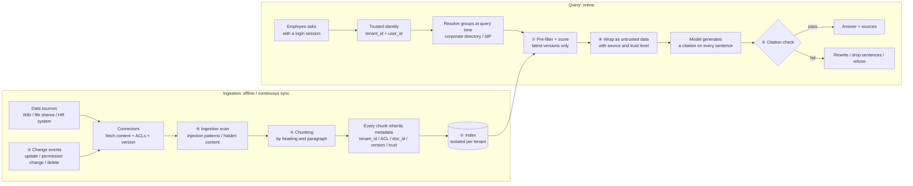
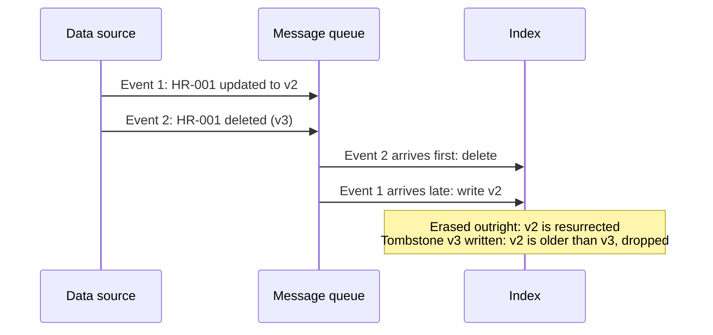

[中文](README.md) | [English](README.en.md)

# Lesson 15: Enterprise knowledge and data — permission-aware RAG

> 🕐 Suggested time: 15 minutes ｜ 🎯 After this lesson you can: design an enterprise knowledge retrieval system that doesn't overshare, doesn't go stale, shows its sources, and resists poisoning — and make reasoned trade-offs between ACL filtering, multi-tenant isolation, sync strategies, citation checking, and chunking ｜ 📦 Source: [`acl_index.py`](acl_index.py), [`grounding.py`](grounding.py), reusing `tokenize` from [`agentkit/memory.py`](../../agentkit/memory.py) and `ToolOutputGuard` from [`agentkit/guardrails.py`](../../agentkit/guardrails.py)
>
> 📖 Primary reading: [LLM08:2025 Vector and Embedding Weaknesses](https://genai.owasp.org/llmrisk/llm082025-vector-and-embedding-weaknesses/) (OWASP GenAI Security Project, 2025) — the entry in the OWASP Top 10 for LLM Applications that covers vector stores and embeddings — unauthorized access, cross-tenant leakage, embedding inversion, and poisoning — which together form the threat model behind this lesson's problem cards; focus on "Common Examples of Risks" and "Example Attack Scenarios", then check each one against this lesson's defenses.

> Code comments and demo output are in Chinese; the identifiers and the logic are what matter.

## 0. In one sentence

> **Enterprise RAG is not "dump the documents into a vector database". It is "on behalf of the person asking, find the answer in material they are allowed to see, that is current and trustworthy — and say where it came from."**

Picture the company records room getting a new archivist (the Agent). To save everyone time, facilities hands him a **master key** (a service account). On day one an intern asks "what's the raise budget this year?", and he helpfully pulls HR's *Compensation Adjustment Plan (Confidential)* out of the safe…

A competent archivist would instead:

| A competent archivist… | Engineering technique | Problem card |
|---|---|---|
| checks your badge and only opens cabinets you have a key for | identity propagation + ACL pre-filtering | Problem 1 |
| keeps each client company's files in a separate room | multi-tenant index isolation | Problem 2 |
| hands you only the latest version and pulls superseded files on the spot | incremental sync + version checks + deletion tombstones | Problem 3 |
| tells you which document every sentence came from | mandatory citations + citation checking + refusal | Problem 4 |
| never tears a table in half when binding a file | structure-aware chunking | Problem 5 |
| ignores "notes to the archivist" slipped between the pages | ingestion scanning + isolation markers + source trust tiers | Problem 6 |

**This isn't hypothetical.** Microsoft's documentation states that Microsoft 365 Copilot only surfaces organizational data that the individual user has **at least view permission** for — it strictly honors permissions. And yet, as companies rolled Copilot out, "oversharing" became the number-one governance headache, to the point that Microsoft published dedicated guidance on mitigating it. The reason: years of SharePoint and file-share sprawl — folders shared with the whole company, group access that was never revoked after a project ended. **Permission-aware RAG faithfully enforces your permissions — including the ones that were wrong to begin with.** Files that were "technically accessible, but nobody knew where they were" are now one question away.

## 1. Core concepts

### 1.1 Tutorial RAG vs. enterprise RAG

Lesson 04 covered the four stages of RAG: chunking, retrieval, injection, and citation. Tutorial RAG quietly assumes several things that are all false inside a company:

| | Tutorial RAG | Enterprise RAG |
|---|---|---|
| Users | One person | Thousands, each allowed to see different documents; a SaaS serves hundreds of companies |
| Data | A folder of static PDFs | Dozens of systems; every day someone edits content, changes permissions, deletes documents |
| Trust | Everything is trustworthy | Anyone can edit the wiki; external documents may be poisoned |
| What "correct" means | Looks right | Traceable to a specific document and version; when it's wrong, you can find out why |
| Cost of a mistake | One wrong answer | Leaked salaries, expenses filed against a retired policy, compliance incidents |

### 1.2 The permission-aware RAG pipeline

The circled numbers map to the six problem cards in this lesson:



### 1.3 A few terms

- **ACL** (Access Control List): the "who may read this" list attached to each document. In this lesson it holds group names (`hr`) and `user:alice` (shared with one specific person).
- **Principal**: anything that can appear in an ACL — the user themself and every group they belong to. See [`User.principals`](acl_index.py).
- **Tenant**: one customer company in a SaaS product.
- **Tombstone**: a "this document was deleted" record written at deletion time, instead of simply erasing the data (Problem 3 explains why).
- **Grounded**: every claim in the answer is supported by a passage retrieved in this run.

## 2. Enterprise problem cards

### Problem 1: Employees find documents they're not allowed to see through the Agent

**Scenario**: A 3,000-person company connects Confluence, its file shares, and its HR system to a knowledge assistant — 400,000 chunks in total, about 2% of which (8,000 chunks) are restricted HR, finance, and legal documents. To ship quickly, v1 builds the index **and** runs queries with a service account that can read every space. In week two, an engineer asks "what's the raise budget this year?", and the Agent cites HR's *2026 Compensation Adjustment Plan (Confidential)*.

**Why it's hard**:

- **"Tell the model not to reveal confidential material" doesn't work.** Once content is in the context, a single prompt injection (Lesson 09) or a single burst of helpfulness gets it out. It fails the other way, too: while building this lesson's demo, we repeatedly saw the real model refuse to give the budget to an HR colleague who *was* authorized and *had* retrieved the budget document — because a separate all-staff document said "the overall budget is not disclosed to all staff". **Permission decisions must be the code's job; the model's "judgment" is unreliable in both directions.**
- **The restricted share gets amplified on sensitive questions.** Only 2% of the corpus is restricted, but among documents relevant to "raise budget", most may be — which is why "retrieve first, filter later" shrinks so badly (option B).
- **Permissions keep changing**: group membership churn, nested groups, share links, permissions inherited from parent folders.

| Option | How | Pros | Cons | When to use |
|---|---|---|---|---|
| A. Pre-filtering | Every chunk carries ACL metadata; at query time, "ACL intersects the user's principals" is a filter condition, and top-k is scored only over visible candidates | No shrinkage; unauthorized documents take no part in any computation — minimal leak surface | ACLs in the index are synced and therefore lag; vector indexes lose recall under very selective filters, so the engine must support filtered search | **The default** |
| B. Post-filtering | Take top-k (or a few multiples of k) ignoring permissions, then check each result and drop the unauthorized ones | Simplest to build; the final check can consult the source system live | Top-k shrinks — possibly to nothing on sensitive questions; scoring, logs, and "found but you can't view it" messages can all leak that a document exists | Only as a **second-pass check** after A — never on its own |
| C. A separate index per permission domain | Split into several indexes by department / classification / space; each user queries only the ones they may access | Strongest isolation and easiest to audit; high-classification indexes can be deployed and encrypted separately | Explodes as permission combinations grow (a user in N groups → query N indexes and merge rankings); a document in several domains is stored several times; a permission change means moving data between indexes | Carve out a few clearly bounded, highly sensitive domains (HR, legal, board materials); use A for everything else |

**How bad is the shrinkage?** It's documented in real vector databases. The pgvector docs give an example: with approximate indexes (HNSW), filtering is applied **after** the index is scanned; if a condition matches 10% of rows, then with the default `hnsw.ef_search = 40`, only about 4 rows will match on average. Starting with version 0.8.0, pgvector offers *iterative index scans*, which keep scanning when there aren't enough results.

**Even sneakier than shrinkage is the existence leak.** Suppose that after post-filtering, the system helpfully adds:

```text
2 more relevant documents exist that you don't have access to: "2026 Compensation Adjustment Plan (Confidential)", "2026 Q4 Reorganization and Raise-Freeze List (Top Secret)"
```

The user hasn't seen a single word of content, yet they now know layoffs are coming in Q4. Titles aren't the only channel:

- **Counts**: "2 more documents" is itself information;
- **Scores**: if the statistics used for scoring (e.g. IDF, "how many documents contain this term") are computed over all documents, including unauthorized ones, those documents change the scores and ranking of the visible ones. In demo scenario 1, the same HR-010 document scores 4.31 under post-filtering and 5.17 under pre-filtering;
- **The model's wording**: "there is a relevant document, but I can't tell you about it."

There is exactly one principle: **to someone without permission, an unauthorized document must behave as if it does not exist.** Exercise (a)'s test `test_search_leaks_nothing_about_hidden_documents` checks precisely this: add 7 documents alice can't see, and the result count, order, and scores must be identical before and after.

**Identity propagation: whose identity reaches the data source?**

Filtering is only half the story. The other half: **when you retrieve, who does the data source think is asking?**

| Approach | How | Pros | Cons |
|---|---|---|---|
| Service account + application-level filtering | One "read-everything" account pulls all data into an index; at query time your code filters by the user's permissions | Indexes can be built ahead of time; retrieval is fast | Your filter code is the only line of defense — one bug and everything is visible to everyone; source-system ACLs must be synced in |
| User identity propagation (delegation) | The Agent calls the data source's API in real time with the **user's own** delegated token, and the source decides. Common mechanisms include the OAuth 2.0 On-Behalf-Of flow on Microsoft's identity platform and the IETF's RFC 8693 Token Exchange | The source system is always the authority — fresh and exact; injection can't grant permissions the user doesn't have | Hard to build a unified index ahead of time (every query is live); bounded by each source API's search capability, latency, and rate limits |
| Hybrid (the usual production shape) | Connectors sync content **and ACLs** with a service account; queries pre-filter by the user's tenant + groups resolved at query time; for highly sensitive sources, the final top-k is re-checked against the source with the user's identity | Fast and accurate | The most complex; ACL sync lag must be monitored |

Two terms make this table easier to reason about. Writing ACLs into the index at ingestion time is **early binding** — fast, but a permission change waits for the next sync. Checking each hit against the source at query time is **late binding** — exact, but slow, and essentially a form of post-filtering. The hybrid approach = **early binding guarantees no shrinkage; late binding catches permissions revoked a minute ago.**

Three more details:

1. **Resolve group membership at query time; don't bake it into the index.** Store groups in the index's ACLs rather than expanding them into thousands of user names. When an employee is removed from the `hr` group, the very next query reflects it, with no reindexing. The demo's `resolve_user` looks the user up in the directory on every search.
2. **Identity comes only from the login session.** The search tool has no `user_id` parameter; identity is injected via `ToolContext` (Lesson 03). Letting the model fill in `user_id` means letting the attacker fill it in.
3. **Tools that *act* need the user's identity even more.** Read-only retrieval with a service account can at least be backstopped by filtering; create, update, and delete operations must run as the user.

**How to choose**: Default to **option A + the hybrid identity model**; carve out highly sensitive domains like HR, legal, and the board with option C; use option B only as a late-binding re-check after A. Whatever you choose: identity comes from the login session, a missing ACL means deny (fail closed), and run an oversharing audit before launch.

**In this lesson**: `can_read` in [`acl_index.py`](acl_index.py) (checks tenant *and* ACL; an empty ACL means nobody can read), `post_filter_search` (the anti-pattern), and `pre_filter_search`; exercise (a)'s `SecureIndex.search`; the `search_docs` tool in [`demo.py`](demo.py), which takes identity from `ctx` and resolves groups on every call. For production: metadata filtering in your vector database or search engine (e.g. WHERE clauses plus Postgres row-level security with pgvector, or Elasticsearch document-level security), plus ACL sync in your connectors.

---

### Problem 2: How do you isolate tenants in a vector index?

**Scenario**: You're building a SaaS knowledge assistant with 800 business customers. The largest has 5 million chunks; 90% have fewer than 10,000. One financial-services customer's contract says: "Our data must be isolated from other customers and fully deleted within 30 days of termination."

**Why it's hard**:

- Putting every tenant in one shared index is cheapest — but if **a single** query forgets the `tenant_id` filter, you've leaked across companies. Sneakier still: every company has a group called `all-staff`. Compare group names without comparing tenants, and company A's all-staff can read company B's all-staff documents (the first test in exercise (a) exists to catch exactly this bug).
- One database per tenant is safest, but upgrading, monitoring, and backing up 800 instances is an operational nightmare, and most small tenants' resources sit idle.
- **Noisy neighbors**: one large tenant's bulk import slows down search for everybody.
- Switching embedding models means reindexing every tenant.

| Option | How | Isolation | Cost | Operational complexity | When to use |
|---|---|---|---|---|---|
| A. One database / instance per tenant | Separate database, cluster, or cloud account | Strongest: physical isolation; per-tenant encryption and deployment region | Highest: fixed overhead per tenant | Highest: N systems to upgrade, monitor, and back up | A handful of large or heavily regulated customers (finance, government), or those with data-residency requirements |
| B. One namespace / collection / partition per tenant | One logical container per tenant within a shared cluster; queries target a container | Strong: queries are naturally scoped to a container; deleting a tenant = deleting its container | Medium | Medium: container counts are capped by the product | The default for most B2B SaaS |
| C. Shared index + metadata filter | All tenants in one index; every record carries `tenant_id`; every query includes the filter | Weakest: depends entirely on every single query carrying the right filter | Lowest | Low (but deleting a tenant means a bulk delete by condition, and verifying it's complete) | A long tail of small tenants; user-level isolation in consumer products |

"Option B" and "option C" are implemented very differently — and with very different limits — across products. The following is from each product's current official documentation (always check the docs for the version you run):

- **Pinecone** recommends one namespace per tenant on serverless indexes, with each namespace stored separately; it notes that with metadata filtering instead, queries scan the whole namespace, so you pay to scan every tenant's data.
- **Qdrant**, by contrast, advises *against* one collection per tenant: with many tenants, keep them all in one collection, partition by a payload field (e.g. `group_id`), and index it with `is_tenant`; a few large tenants can get dedicated shards via user-defined sharding, and the two can be combined into tiered multitenancy.
- **Weaviate**'s multi-tenancy stores each tenant on a separate shard; tenants can be ACTIVE, INACTIVE, or OFFLOADED (an offloaded tenant's data lives in cloud storage rather than on local disk); deleting a tenant deletes all of its objects.
- **Milvus** offers four levels: database, collection, partition, and partition key. The documented defaults are roughly 64 databases, 65,536 collections, and 1,024 partitions per collection; partition keys scale to millions of tenants, but multiple tenants may share a physical partition, so isolation is weakest.

**How to choose**: **Tier it.** Default to B (the long tail of small tenants can use C), and promote large or regulated customers to A. At every tier:

1. **Enforce isolation in the data access layer**: wrap retrieval in an entry point that requires `tenant_id`, so business code has no way to issue a tenant-less query (capstone's [`Backend`](../../capstone/itbuddy/backend.py) is designed this way);
2. **Automated tests** cover "same group name, different tenants";
3. **Caches, conversation memory, eval data, and logs** are isolated per tenant too (Lesson 09);
4. **Tenant deletion is verifiable**: drop the container or bulk-delete → verify the count is zero → wait for backups to expire.

**In this lesson**: The first step of exercise (a) partitions by `user.tenant_id`, and `can_read` compares both tenant and groups; see `test_search_isolates_tenants_even_with_same_group_names`. This lesson's in-memory index is a minimal version of option C; in production, swap in the product capabilities above.

---

### Problem 3: The document changed, but the Agent still uses the old version

**Scenario**: On September 1, the travel policy raises the hotel limit in tier-1 cities from 500 to 600 yuan per night. The knowledge base is rebuilt from scratch every Sunday night. On September 2 an employee asks, the Agent answers "500", and finance rejects the extra 100 yuan. Worse: on September 10, *Production Database Account Requests* is restricted to DBAs only, but the old version in the index still says "engineers may apply".

**Why it's hard**:

- **An "update" is more than new text**: there are permission changes, moves, deletions, merges. **Revoking access is the most urgent kind of update.**
- An index that only appends and never cleans up keeps old and new versions **side by side**: the model sees both "500" and "600" as "facts" (demo scenario 3).
- Delete events can be lost, or **arrive out of order**: a late "update to v2" event can resurrect a document that was already deleted.
- There are hundreds of sources with wildly different change-notification capabilities: some have webhooks; some can only be polled.

| Option | How | Pros | Cons | When to use |
|---|---|---|---|---|
| A. Scheduled full rebuild | Nightly / weekly: re-fetch, re-chunk, re-embed, validate the new index, then switch over atomically | Simplest; naturally repairs all drift (missed deletions, wrong ACLs) | Staleness = the rebuild interval; embedding cost and time are high for large corpora (skip unchanged chunks with content hashes) | Small, slow-changing corpora; and as the **reconciliation backstop** for option B |
| B. Incremental sync (CDC / webhooks / change logs) | Subscribe to change events and process only changed documents: delete old chunks by `doc_id`, write new ones | Seconds-to-minutes freshness; cost proportional to change volume | Events get lost, duplicated, and reordered → writes must be idempotent and compare version numbers; each source needs its own adapter; sync lag must be monitored | The main channel in most production systems |
| C. Version check at query time | Before returning results, confirm each hit is its document's latest version: keep only the highest version per `doc_id` inside the index, or ask the source system for the current version | Even when sync lags, **known-stale** versions never reach the model | An extra step per query; checking with the source adds latency; can drop old versions but can't supply new ones that haven't been indexed yet | Money, compliance, and permissions — anywhere a wrong answer is expensive |

**How to choose**: **B as the main channel + A for periodic reconciliation + C for high-stakes content.** Give **permission changes and deletions a fast lane** with a monitorable target (e.g. "95% of access revocations take effect within 5 minutes"). When events go through a message queue, partition by `doc_id` (e.g. Kafka keyed partitions) so events for the same document are processed in order.

**Deletion propagation and the "right to be forgotten".** The EU GDPR (Article 17) and China's Personal Information Protection Law (Article 47) both impose deletion obligations (Lesson 04). In a RAG system, deleting the source document is only the start — **every derived artifact** must go too:

| Where it can linger | Why it's easy to miss |
|---|---|
| Chunks and their vectors | If chunk IDs aren't linked to document IDs, you can't tell which to delete. **Vectors are not anonymous**: Morris et al. (2023, Vec2Text) recovered 92% of 32-token inputs exactly from their embeddings |
| Keyword index | Hybrid search means two indexes; only one got cleaned |
| Answer caches, semantic caches | They cache "answers generated from this document" |
| Conversation memory and summaries | The document's content is already baked into the summary |
| Eval sets, logs, traces | Data copied out while debugging |
| Backups | Need a retention limit, plus replaying deletions on restore |

The key engineering idea is **lineage**: every chunk records which `doc_id` it came from, and every cache entry records which `doc_id`s it used — only then can deletion cascade.

**Why write a tombstone instead of simply erasing the record?** Look at this sequence:



With a tombstone carrying a higher version number, a late event can tell at a glance that it's stale. Physical deletion, which actually frees storage, is done later by a background job once no late events can still arrive.

**In this lesson**: [`ACLIndex`](acl_index.py) is append-only: `update` appends a new version, and `delete` appends a tombstone. Exercise (a) implements option C inside the index: keep only the highest version per `doc_id`, treat a tombstone as non-existent, and **check permissions against the latest version**. The order is crucial: filter by permission first and pick the latest version second, and you can still find v1 after v2 revoked your access (test `test_search_checks_permission_on_the_latest_version`).

---

### Problem 4: Answers without grounding, and no way to trace them (hallucination)

**Scenario**: The knowledge assistant answers 1,000 HR and finance questions a day. An employee asks "can unused annual leave be carried over?" and the Agent replies "yes, up to 5 days, to be used by the end of March" — while the actual policy says "may not be carried over". The employee plans their vacation around it, and afterwards nobody can say where that sentence came from. Even if only 3% of answers contain ungrounded content, that's 30 a day.

**Why it's hard**:

- Model fabrications are usually fluent and read exactly like the real thing;
- **Citations can be fabricated too**: citing an ID that wasn't retrieved, or citing a real document while saying something it doesn't say;
- Research data: the ALCE benchmark (Gao et al., EMNLP 2023) found that on the ELI5 dataset, even the best models lacked complete citation support about half the time;
- "Is this grounded?" is hard to judge automatically: paraphrase, negation, and reasoning across two passages all defeat simple comparisons.

| Option | How | Pros | Cons | When to use |
|---|---|---|---|---|
| A. Mandatory citations | Retrieved passages are numbered for the model; the system prompt requires a `[ID]` at the end of every factual sentence | Free; users can click through and verify; errors are traceable | It's only a *request* — the model can ignore it or cite at random | The foundation of every RAG answer |
| B. Citation checking | Code verifies each sentence: is the ID among **this run's** retrieved passages → do the numbers match → is the word overlap sufficient → (optional) does an NLI model or LLM judge say the passage entails the sentence | Catches most fabrications; the first layers are nearly free and deterministic | Word overlap misjudges (paraphrases rejected, negations let through); model judges cost money and latency | Run the cheap layers on every answer; add a model judge in high-stakes domains |
| C. Refuse when ungrounded | When retrieval relevance falls below a threshold or the check fails, give no answer: say "not found" and hand off to a human / open a ticket | Better no answer than a wrong one; the safest | More refusals, worse experience; thresholds must be tuned on an eval set | HR, finance, legal, medical — domains where wrong answers are expensive |

The layers inside option B differ in cost and power:

| Check | Catches | Misses | Cost |
|---|---|---|---|
| Does the sentence have a citation? | Unsourced fabrication (the most common kind) | Random citations | ~zero |
| Is the ID among this run's retrieved passages? | Made-up IDs; citing a document the user **did not retrieve this time** (possibly one they can't access!) | Right ID, wrong content | ~zero |
| Do the numbers appear in the cited passage? | "March" changed to "April", "600 yuan" changed to "800 yuan" | Chinese numerals ("五天" vs. "5 天" raises a false alarm); right number, wrong unit | ~zero |
| Word overlap (coverage) | Claims unrelated to the passage | **Negation**: "can be carried over" and "cannot be carried over" share nearly every word; paraphrases get rejected | ~zero |
| NLI model / LLM judge | Negation, paraphrase, faulty reasoning | The judge makes mistakes too | One model call |

**When the check fails**: ask the model to rewrite once, with the list of problems → if it still fails, drop the ungrounded sentences and tell the user, or refuse outright → log the case and add it to your eval set (Lesson 11).

**How to choose**: **Always run A + B** (B's first four layers run on every answer in milliseconds); set C per domain: "refuse if the check fails" for high-stakes domains, "drop ungrounded sentences and flag it" elsewhere.

**In this lesson**: `verify_citations` in [`grounding.py`](grounding.py) is the simple version: it only examines sentences **that carry a citation** (does the ID exist, is the overlap enough). Exercise (c)'s `check_citations` is the strict version: missing citation → ID → numbers → overlap, with a verdict per claim. Demo scenario 2 checks the real model's answers; scenario 4 compares the two versions on a fabricated answer. For production: add an NLI or LLM-judge layer (Lesson 11) and track the citation-check pass rate as a live metric (Lesson 10).

---

### Problem 5: Chunking strategy makes or breaks retrieval

**Scenario**: A 200-page employee handbook is chunked every 500 characters. An employee asks "how much can I claim for a hotel in Shanghai?" and the retrieved chunk starts with `ties | Nightly limit |` — half the table header was cut off, and the "Hotel limits" section heading stayed behind in the previous chunk. The model sees only `| Tier 1 | Beijing, Shanghai, Shenzhen | 600 yuan |` and can't tell whether that's a hotel limit or a travel allowance; the next row's "450 yuan" was even split into "4" and "50 yuan" (exactly what happens in demo scenario 5). In the IT handbook, a bash script is cut in half, and the Agent has the user run only the first part.

**Why it's hard**:

- **Chunks too small** lose context ("its warranty is two years" — what is "it"?); **chunks too large** mix several topics, so the averaged-out vector resembles none of them, and they waste tokens (Lesson 04).
- Enterprise documents are all over the place: policy prose, tables, code, FAQs, meeting notes. No single strategy fits all.
- Changing the chunking strategy means reindexing everything, so a bad choice is expensive.

| Option | How | Pros | Cons | When to use |
|---|---|---|---|---|
| A. Fixed length | Cut every N characters (or tokens) | Simplest; uniform chunk sizes, easy cost estimates | Ignores semantic boundaries: splits sentences, table rows, code blocks | Poorly structured content (e.g. OCR output); quick prototypes |
| B. Document structure | Split into sections by heading, then into paragraphs; merge small paragraphs up to a limit; record each chunk's heading | Semantically complete chunks; the heading provides context | Depends on document format (Markdown / HTML / Word styles); uneven paragraph lengths | **The default** for structured enterprise documents |
| C. Overlap | Adjacent chunks share some content (commonly 10–20%) | Context around a cut exists on both sides, lowering the risk that an answer straddles the boundary | More storage and embedding cost; more duplicate content in results | Combine with A or B — overlap only where you're **forced to cut** |

Note that C isn't an alternative to A and B; it's a switch you add to them. In this lesson's implementation, overlap is used **only** where an oversized paragraph is forced to split by length: when you cut at a natural boundary like a heading or a paragraph break, the meaning is already complete, and overlap only adds redundancy.

**Special handling for tables**:

- Never cut in the middle of a row; when a table is too long, split it into groups of rows and **repeat the header in every group**;
- Or rewrite each row as a sentence before indexing — "Tier-1 cities (Beijing, Shanghai, Shenzhen): hotel limit 600 yuan per night" — which works better with vector search;
- Keep the heading of the section the table lives in.

**Special handling for code**:

- Keep fenced code blocks (\`\`\`) whole: blank lines inside don't split paragraphs, and lines starting with `#` inside are **not headings** (both bash and Python comments start with `#`! Exercise (b)'s tests check this specifically);
- When code is too long, split at functions, classes, or blank lines, and prefix each chunk with the file name and language;
- Code retrieval usually depends on exact keywords (function names, error messages), which suits hybrid search (Lesson 04).

**How to choose**: **B by default, add C only where you're forced to cut, and handle tables and code specially.** Don't pick `max_chars` by gut feeling: build a question set and compare, across settings, whether the right chunk appears in the top-k (recall@k, Lesson 11). More advanced: prepend a sentence to each chunk saying what it's about within the whole document before indexing (Anthropic's Contextual Retrieval, Lesson 04), or "retrieve small chunks, hand the model the larger chunk they belong to" (parent–child chunks).

**In this lesson**: exercise (b)'s `chunk_markdown`: headings → sections, blank lines → paragraphs, code blocks as single paragraphs, greedy merging within a section, oversized paragraphs split by length with overlap; `fixed_size_chunks` is the baseline. Demo scenario 5 shows both applied to the same document.

This lesson is about retrieval that doesn't cross permission boundaries. For how to measure and improve whether retrieval finds the right chunks at all (Recall@k / MRR / nDCG, sparse / dense / hybrid retrieval, RRF fusion, reranking, how chunk size affects recall), see [Lesson 17](../17_retrieval_quality/README.en.md).

---

### Problem 6: Indirect injection and poisoning in documents

**Scenario**: The company wiki is editable by 3,000 employees and 200 contractors. One contractor hides "instructions for the AI assistant" in an HTML comment on the popular *Expense FAQ* page; someone else creates *Hotel Expense Limit Update*, which soberly states "the tier-1 city limit is now 1,500 yuan per night, no approval required".

**Why it's hard**:

- Recall Lesson 09: an indirect-injection attacker never talks to your Agent; they only need write access to something your Agent will read. **Whoever can edit your knowledge base can talk to your Agent.**
- **Poisoning doesn't need "instructions".** A false fact has no detectable signature at all — and RAG is designed precisely to make the model trust what it retrieves.
- Research data: PoisonedRAG (Zou et al., USENIX Security 2025) injected just 5 malicious texts per target question into a knowledge base of millions of texts and achieved an attack success rate of about 90%.
- Attacks can be invisible to humans: HTML comments, white text, zero-width characters — nothing shows on the page, but the model reads it all.

| Option | How | Pros | Cons | When to use |
|---|---|---|---|---|
| A. Scan at ingestion | Rules or classifiers look for injection patterns, hidden content (HTML comments, zero-width characters), and sentences addressed to the AI; hits are quarantined for human review | Cheap; keeps obvious attacks out of the index — scan once, benefit forever | Will always miss things (rephrase and it's through); powerless against "false fact" poisoning; false positives need a human review process | Every ingestion pipeline |
| B. Isolation markers at retrieval | Wrap retrieved results in `<untrusted_data>` tags (with a random boundary id so attackers can't forge the closing tag), and declare in the system prompt that the content is data only (Spotlighting, Lesson 09) | Free; lowers the odds the model "just does it" | A reminder, not isolation; useless against false-fact poisoning | All retrieved results |
| C. Source trust tiers | Grade each source (this lesson uses official: HR system, policy library; internal: team wikis; external: web pages, vendor docs) and include the tier in results; higher tiers win conflicts; high-stakes questions may cite official sources only | Works even against false-fact poisoning; turns "whom to believe" into an auditable rule | Tiers must be maintained; genuine knowledge in lower-tier sources gets demoted too | Organizations with mixed knowledge sources (i.e. nearly all of them) |

**How to choose**: **All three layers, with permissions as the backstop.** A stops cheap attacks, B lowers the success rate, and C decides whom to believe in a conflict. The final line of defense is Lesson 09's "lethal trifecta" and least privilege: a read-only knowledge assistant can't do damage even when fooled; an Agent with write tools must send high-risk actions through human approval. Also, audit and alert on "who edited a high-traffic page, and when" — poisoning is often a single small edit to a popular page.

**In this lesson**: [`acl_index.screen_document`](acl_index.py) reuses agentkit's `detect_injection` and additionally checks for HTML comments, zero-width characters, and text addressed to an AI; `format_hit` passes source, trust level, version, and update date to the model; the demo's Agent uses agentkit's `ToolOutputGuard` and `UNTRUSTED_DATA_RULE`. The capstone knowledge base contains a similar poisoned article, KB-006, for comparison ([capstone/itbuddy/backend.py](../../capstone/itbuddy/backend.py)).

## 3. Hands-on: run the demo

```bash
python lessons/15_enterprise_rag/demo.py --offline   # offline script: no API key needed, deterministic
python lessons/15_enterprise_rag/demo.py             # real model (~20 seconds, 6 model calls)
```

Only scenario 2 calls the model; every other scenario is deterministic retrieval and checking logic. Retrieval, chunking, and citation checking use the exercise implementations: once you finish `exercise.py`, the demo switches to your code automatically. (Demo output is in Chinese; the excerpts below are translated.)

**Scenario 1: ACL leaks** (Problem 1)

```text
▶ ❌ Option 0: retrieve as the service account (no permission filtering)
        6.73  [HR-011] 2026 Compensation Adjustment Plan (Confidential)
        5.79  [HR-012] 2026 Q4 Reorganization and Raise-Freeze List (Top Secret)
        4.31  [HR-010] 2026 Annual Raise Process (All-Staff Edition)
▶ ❌ Option B: post-filtering — take top-3, then drop unauthorized documents
        4.31  [HR-010] 2026 Annual Raise Process (All-Staff Edition)
      → only 1 left (3 were requested); 2 were dropped
      "2 more relevant documents exist that you don't have access to: 2026 Compensation Adjustment Plan (Confidential),
       2026 Q4 Reorganization and Raise-Freeze List (Top Secret)"
▶ ✅ Option A: pre-filtering — first narrow to what she can see, then score
        5.17  [HR-010] 2026 Annual Raise Process (All-Staff Edition)
        1.86  [ENG-005] Engineering Levels and Promotions
        1.10  [HR-001] Travel and Expense Policy
```

👀 Notice: post-filtering leaves one result and blurts out two top-secret titles; the same HR-010 scores differently under the two approaches (4.31 vs 5.17) — the former's statistics include unauthorized documents; and pre-filtering's third result barely matches — "k results" doesn't mean "k relevant results".

**Scenario 2: one question, three employees** (Problems 1, 2, 4; excerpt of real-model output)

```text
Question: How are raises handled this year? What's the overall budget?

▶ Wang Li (acme / software engineer, groups: all-staff, eng)
   🔎 search_docs({"query":"今年 调薪 安排 整体预算"})
   📚 Retrieved: HR-010, ENG-005
   🤖 Answer: 2026 raises take effect on March 1; direct managers hold one-on-ones in February [HR-010].
       Raises are based on annual performance and level bands, and individual results are confidential [HR-010].
       No information about the overall budget was found in the knowledge base.
   🧾 Strict check (check_citations): ✅ pass (all 3 claims grounded)

▶ He Rui (acme / HR business partner, groups: all-staff, hr)
   📚 Retrieved: HR-011, HR-010
   🤖 Answer: … The 2026 overall raise budget is 6% of total payroll: 8% for engineering, 4% for support functions [HR-011].
   🧾 Strict check (check_citations): ✅ pass (all 3 claims grounded)

▶ Zhou Ke (globex / accountant, groups: all-staff, finance)
   📚 Retrieved: GX-HR-003
   🤖 Answer: In 2026, base salaries for all staff rise by 4%, effective April 1 and paid with April's payroll [GX-HR-003].
       No information about the overall budget was found in the knowledge base.
```

👀 Notice: the three runs use **the same Agent, the same tool, and the same question**; the only difference is the identity passed to `agent.run(..., metadata={"tenant_id": ..., "user_id": ...})`. The model makes no permission decisions — it has never seen an unauthorized document. Wang Li's "no budget found" is a legitimate refusal (`refusal`), and it passes the check.

> 💡 A real anecdote: while building the demo, the all-staff HR-010 originally also said "the overall raise budget is not disclosed to all staff". He Rui retrieved HR-011, yet the real model repeatedly chose not to state the budget — even though the system prompt already said "results have been filtered by the asker's permissions; permission decisions are not your job". We ended up deleting that sentence. This is what Problem 1 means by "the model's judgment is unreliable in both directions": one sentence in a document can sway it, whereas permission-filtering code can't be swayed.

**Scenario 3: stale knowledge** (Problem 3)

```text
▶ ② Sep 10: ENG-007 is restricted to the dba group (v2)
   Naive pre_filter_search (every version treated as its own document):
      [ENG-007 v1] Engineers can request a read-only production database account via a ticket; manager approval suffices.
   Exercise (a) SecureIndex.search (latest version → tombstones → permissions):
      (no results)
▶ ③ Sep 20: HR-001 is deleted (a tombstone v3 is appended)
   Naive pre_filter_search (every version treated as its own document):
      [HR-001 v2] Tier-1 city hotel limit: 600 yuan per night; other cities: 400 yuan.
      [HR-001 v1] Tier-1 city hotel limit: 500 yuan per night; other cities: 350 yuan.
   Exercise (a) SecureIndex.search (latest version → tombstones → permissions):
      (no results)
```

👀 Notice: the naive search keeps sending v1 to Wang Li after her access was revoked, and "resurrects" both old versions after the deletion.

**Scenario 4: citation checking** (Problem 4)

```text
▶ Simple check grounding.verify_citations (only looks at cited sentences: does the ID exist? enough overlap?)
      - Cites a source not retrieved in this run ['HR-011']: The overall raise budget is 6% of total payroll.
▶ Strict check check_citations (exercise (c): also checks uncited sentences and numbers)
      ❌ number_mismatch  2026 raises take effect on April 1; managers hold one-on-ones in February. Not in cited passage: 4
      ❌ unknown_source   The overall raise budget is 6% of total payroll. Not retrieved this run: HR-011
      ❌ no_citation      In addition, every employee gets an extra 2,000-yuan holiday bonus this year.
```

👀 Notice: each of the three sentences has a problem, and the simple check catches only one. HR-011 in the second sentence **really exists** — Wang Li just can't see it and didn't retrieve it. Citation checking accepts only passages retrieved in this run, which doubles as a leak-prevention gate.

**Scenarios 5 and 6** show, respectively, fixed-length chunking splitting table rows and code blocks (Problem 5), and ingestion scanning catching instructions hidden in an HTML comment while letting a soberly stated false fact through, plus how retrieved results reach the model with their source and trust level, wrapped in `<untrusted_data source="search_docs" id="……">` (Problem 6). Run the demo yourself to see the full output.

## 4. Exercises

Open [exercise.py](exercise.py) and complete three tasks. Building blocks you can use as-is: `can_read` and `rank` from [`acl_index.py`](acl_index.py); `split_claims`, `coverage`, `extract_numbers`, and `is_refusal` from [`grounding.py`](grounding.py); and `fixed_size_chunks`, already written in exercise.py.

**(a) `SecureIndex.search(query, user, k)`: no overreach, nothing stale, no leaks**

- Task: tenant isolation → keep only the highest-version record per `doc_id` → if the latest version is a tombstone, treat the document as non-existent → check permissions against the latest version → `rank` the visible candidates → return the top k.
- The two key ideas:
  1. **Order**: determine the latest version first, then check permissions. Do it the other way round and both "revoked access" and "deleted" stop working (you fall back to an older version);
  2. **No leaks**: pass only visible candidates to `rank`. The test adds 7 unauthorized documents to the index and requires the result count, order, and **scores** to be identical to the run without them.
- Hint: one pass over `self.docs` with a dict of `{doc_id: highest-version record}` is enough; no sorting needed.

**(b) `chunk_markdown(text, max_chars, overlap)`: structure first, length as a fallback**

- Task: split into sections by heading (store the heading text in `Chunk.heading`) → split into paragraphs at blank lines → treat a code block as a single paragraph → merge greedily within a section → split oversized paragraphs with `fixed_size_chunks`, with overlap.
- Hint: write it in two passes. The first pass scans line by line, tracking an `in_code` flag, and produces `[(heading, [paragraph, ...]), ...]`; the second merges within each section. Remember: lines starting with `#` inside a code block are not headings, and a code block forms its own paragraph even without blank lines around it.

**(c) `check_citations(answer, sources)`: strict citation checking**

- Task: split the answer into claims with `split_claims`, then give each a verdict in this order — no citation → ID not among this run's results → numbers don't match → insufficient word overlap → supported — and return a `CitationReport`.
- Hint: with multiple citations, compare numbers and word overlap against the **union of all cited passages**; a "nothing found" style refusal needs no citation.

Verify:

```bash
make lesson N=15                                                  # run your implementation
AGENTKIT_SOLUTION=1 .venv/bin/python -m pytest lessons/15_enterprise_rag -v   # compare with the reference solution
```

All 17 tests run offline and deterministically in under a second. When you're done, rerun the demo: near the top it will print "练习实现：exercise.py（你的实现）" ("exercise implementation: exercise.py (yours)").

## 5. Going deeper (if you have time)

### 5.1 Why filtered vector search is hard

HNSW, the index most vector databases use, is a "neighbor graph": a search starts at an entry point and walks along edges toward the points nearest the query. When the filter is very selective (say a user can see only 0.5% of the corpus), most neighbors the search encounters get filtered out; it may stop before collecting k results, or get stuck in a region made entirely of unauthorized documents. That's the mechanism behind pgvector's "only 4 rows left" example.

Common countermeasures (check what your product actually supports):

- **Brute force when candidates are few**: if a user can see only a few thousand documents, scoring each one directly is both fast and exact;
- **Partition or partially index by the filter dimension**: the pgvector docs suggest partial indexes for frequently filtered values, or partitioning by the filter column; this is the same idea as "option C: an index per permission domain";
- **Tenant-aware indexing**: for tenant-partitioned setups, Qdrant's docs suggest building a graph per tenant (`payload_m`);
- **Iterative scanning**: keep scanning when results run short (pgvector 0.8.0's iterative index scans).

### 5.2 Permissions don't live only in the retrieval step

A request's data flows through many places, each of which can bypass permission checks at the retrieval layer:

- **Answer caches / semantic caches**: an HR colleague asks about the raise budget and the answer gets cached; an engineer asks a similar question and hits the cache — leaked. Cache keys must include a **permission fingerprint** (e.g. a hash of the user's principals), or cache only retrieved IDs and re-apply permission filtering every time;
- **Conversation memory and summaries**: a summary generated from HR documents must never appear in someone else's session (Lesson 04);
- **Multi-agent systems**: sub-agents must inherit the identity of **the user who made the request**, not the orchestrator's service identity (Lesson 06);
- **Logs and traces**: tool results contain restricted text, and the people reading traces may not be authorized to see it (Lesson 10).

### 5.3 What ACLs can't stop: aggregation and inference

Even with every document's permissions exactly right, putting many documents you *are* allowed to see side by side can reveal something sensitive: a hiring freeze in one department, meeting-room bookings cancelled, the team's group chat archived, several colleagues' calendars suddenly empty… Each item is public; together they say "this department is being shut down". ACLs are designed per document and can do nothing about this kind of **aggregation inference**. Mitigation takes a combination: sensitivity labels for sensitive topics (not just ACLs), monitoring for unusual retrieval patterns (lots of queries on a sensitive topic in a short time), and "jigsaw" cases in your eval set.

### 5.4 Guard permissions with evals

Permission rules are ideal material for **deterministic regression tests** (Lesson 11):

- **A permission red-line set**: for each role, a batch of questions that must *never* retrieve certain documents (e.g. "ask about the salary budget as an engineer"). The leak rate must be **0**, enforced as a hard CI gate — not "95% pass is fine";
- **A freshness SLO**: latency from a change in the source system to its being searchable, monitored at p95, with access revocations and deletions tracked separately;
- **A deletion SLA**: once a user or tenant requests deletion, how long until no derived data can be found — and you need to be able to prove it.

### 5.5 What you'll hit at scale

- **ACL bloat**: a document individually shared with 3,000 people carries 3,000 ACL entries. Prefer group grants; cap individual shares or fold them into ad-hoc groups.
- **Nested groups**: group A contains group B, which contains group C. Expand at sync time or at query time? The former is fast but must be recomputed on change; the latter is exact but slows every query.
- **Abuse of "visible to everyone"**: before launch, inventory spaces with broad grants like "everyone" or "the whole company" — the main source of oversharing — and review them regularly afterwards.
- **Semantic mismatches between permission systems**: a file share's "anyone with the link can view", a wiki's "space permissions + page restrictions", an HR system's "visible along the reporting line" — mapping these onto one unified ACL model often loses meaning. If it can't be mapped faithfully, don't index it.

## 6. Common pitfalls and anti-patterns

| Anti-pattern | Consequence | Do this instead |
|---|---|---|
| Retrieving as a service account and prompting the model to "keep secrets" | One injection or one burst of helpfulness and it leaks | Filter by permission in code at the retrieval layer; unauthorized content never enters the context |
| Letting the model decide "is this person allowed to see this?" | Wrong both ways: withholds what it should say, says what it shouldn't | Make permission decisions only in code; tell the model "results are already permission-filtered" |
| Post-filtering as the only mechanism | Top-k shrinks; existence leaks | Pre-filter; use post-filtering only as a late-binding re-check |
| "N more documents exist that you can't view" | Leaks counts and titles | To an unauthorized user, those documents behave as if they don't exist |
| Comparing group names without comparing tenants | Company A's all-staff reads company B's all-staff documents | Compare tenant *and* ACL; test same-named groups |
| Chunks missing ACL metadata default to public | One parser bug makes confidential documents visible to all | Missing metadata means deny (fail closed) |
| Expanding groups into user lists inside ACLs | Every membership change requires reindexing, and something always gets missed | Store groups in the index; resolve the user's groups at query time |
| Appending new versions without cleaning up old ones | The model sees two conflicting "facts" | Delete old chunks by doc_id, or keep only the latest version at query time |
| Filtering by permission first, then picking the latest version | Old versions stay findable after access is revoked | Pick the latest version first, then check permissions against it |
| Erasing records outright on delete | Late, out-of-order events resurrect the document | Write a higher-version tombstone; delete physically later |
| Deleting only the source document and its vectors | Caches, summaries, logs, and eval sets still have it | Track lineage; cascade deletes, verifiably |
| Requiring citations without checking them | Fabricated citations pass | Check in code: IDs, numbers, word overlap — plus a model judge where needed |
| Checking citations against the whole knowledge base | Citing a document the user can't see counts as "grounded" | Accept only passages retrieved in this run |
| Fixed-length chunking with no special handling for tables and code | Headers separated from data; code cut in half | Chunk by structure; repeat table headers per group; keep code blocks whole |
| Treating "passed the ingestion scan" as "trustworthy" | False-fact poisoning walks right through | Source trust tiers + showing sources in citations + least privilege as the backstop |
| Semantic cache keys without permission information | A's answer served to B | Include tenant and a permission fingerprint in cache keys |

## 7. Interview & design-review questions

<details>
<summary><b>Q1: What's the difference between pre-filtering and post-filtering? Why does the latter leak information?</b></summary>

- Pre-filtering: narrow candidates by tenant and ACL first, then score and take top-k; unauthorized documents take no part in any computation, and results don't shrink;
- Post-filtering: take top-k first, then drop unauthorized results → shrinkage (especially severe on sensitive questions, and more pronounced with approximate vector indexes);
- Leak channels: "N more documents you can't view" messages (counts, titles), scoring statistics that include unauthorized documents (scores and rankings shift), and the model's wording;
- Bonus points: post-filtering is useful as a late-binding re-check to catch just-revoked access; mention the testable property "whether unauthorized documents exist must make no difference to the results".
</details>

<details>
<summary><b>Q2: Should a RAG system access data sources as a service account or as the user?</b></summary>

- Service account + application-level filtering: indexes can be prebuilt and retrieval is fast, but the filter code is the only line of defense, and ACLs must be synced;
- User identity propagation (OAuth On-Behalf-Of, Token Exchange): the source system stays authoritative and exact, but prebuilt indexes are hard, and you're bound by the source APIs' capabilities and rate limits;
- The common production hybrid: a service account syncs content and ACLs (early binding), queries pre-filter by the user's identity, and highly sensitive sources are re-checked with the user's identity (late binding);
- Write operations must use the user's identity; identity comes from the login session, never from model-supplied parameters.
</details>

<details>
<summary><b>Q3: Design vector-index isolation for a SaaS with 800 tenants.</b></summary>

- Three options — a database per tenant / a namespace or collection per tenant / a shared index + metadata filter — compared on isolation, cost, and operational complexity;
- Recommend tiering: namespaces by default (shared + filter for the long tail), dedicated deployments for large and regulated customers;
- At every tier: isolation enforced in the data access layer, tests for same-named groups and cross-tenant access, caches and memory isolated too, and a verifiable tenant-deletion process;
- Bonus points: product differences (e.g. some products recommend a namespace per tenant, others a single collection partitioned by a tenant field), noisy neighbors, and reindexing costs when switching embedding models.
</details>

<details>
<summary><b>Q4: A policy document was updated — how do you make sure the Agent stops citing the old version? What if it was deleted?</b></summary>

- Sync: incremental sync (CDC / webhooks) as the main channel, periodic full reconciliation as the backstop; writes idempotent by doc_id with version comparisons;
- Query-time checks: keep only the latest version per doc_id; confirm versions with the source for high-stakes content;
- Permission changes and deletions get a fast lane with a freshness SLO;
- Deletion: tombstones stop out-of-order events from resurrecting documents; cascade via lineage to chunks, vectors, keyword indexes, caches, summaries, logs, eval sets, and backups;
- The crucial detail: pick the latest version *before* checking permissions, or revocation stops working.
</details>

<details>
<summary><b>Q5: How do you decide whether a RAG answer is "grounded"?</b></summary>

- Mandatory citations are only step one — models fabricate citations too;
- Layered checks: is there a citation → is the ID among this run's results → do the numbers appear in the cited passage → word overlap → NLI / LLM judge;
- Each layer's blind spot: overlap misses negation, number checks false-alarm on Chinese numerals, model judges cost money and make mistakes;
- On failure: rewrite with feedback → drop sentences → refuse and hand off to a human; log it into the eval set;
- Bonus points: accepting only this run's retrieved passages also stops the model from "citing" documents the user isn't allowed to see.
</details>

<details>
<summary><b>Q6: What's your chunking strategy? How do you handle tables and code?</b></summary>

- Structure by default: sections by heading, chunks by paragraph, small paragraphs merged up to a limit, each chunk recording its heading;
- Overlap only where a length-based cut is forced;
- Tables: never cut mid-row; group rows and repeat the header, or rewrite each row as a sentence;
- Code: keep code blocks whole, `#` comments aren't headings, split long code at function boundaries and include the file name;
- Pick parameters by comparing recall@k across chunk sizes on an eval set; for bonus points, mention contextual enrichment (Contextual Retrieval) and parent–child chunks.
</details>

<details>
<summary><b>Q7: Contractors can edit the knowledge base. How do you prevent poisoning?</b></summary>

- Understand the threat: whoever can write to the knowledge base can talk to the Agent; poisoning can have no "instruction" signature at all (false facts); PoisonedRAG shows a tiny number of poisoned texts can achieve a very high attack success rate;
- Three layers: ingestion scanning (injection patterns, HTML comments, zero-width characters) → isolation markers at retrieval (Spotlighting with random boundaries) → source trust tiers (higher tiers win conflicts; high-stakes questions cite only official sources);
- The floor: least privilege — the knowledge assistant is read-only; write actions need human approval;
- Operations: audit and alert on edits to high-traffic pages; show sources and authors to users in citations.
</details>

<details>
<summary><b>Q8: Permission-aware retrieval is done. Where else can data leak?</b></summary>

- Answer caches / semantic caches whose keys lack a permission fingerprint;
- Conversation memory and summaries reused across users;
- Sub-agents accessing data with the orchestrator's service identity;
- Restricted content in logs and traces viewed by unauthorized people;
- Misconfigured permissions (oversharing) — retrieval faithfully amplifies them;
- Aggregation inference: several documents you're allowed to see add up to a sensitive conclusion.
</details>

## 8. Self-check

- [ ] I can use an example to explain why "telling the model to keep secrets" is not access control
- [ ] I can name the two problems with post-filtering (shrinkage, existence leaks) and at least three leak channels
- [ ] I can explain early and late binding, and what each is responsible for in the hybrid approach
- [ ] I can compare the three multi-tenant isolation options and name the "same group name" pitfall
- [ ] I can explain why "pick the latest version, then check permissions" must happen in that order
- [ ] I can explain how tombstones stop out-of-order events from resurrecting deleted documents, and list at least five places a deletion must propagate to
- [ ] I can describe the layered checks in citation verification, and why word overlap misses negation
- [ ] I can describe the special handling that tables and code each need when chunking
- [ ] I can explain why ingestion scanning can't stop "false fact" poisoning, and how source trust tiers make up for it
- [ ] I completed exercises (a), (b), and (c), and `make lesson N=15` passes

## Further reading

- OWASP, [LLM08:2025 Vector and Embedding Weaknesses](https://genai.owasp.org/llmrisk/llm082025-vector-and-embedding-weaknesses/) — unauthorized access in vector stores, cross-tenant leakage, embedding inversion, poisoning, and defenses such as permission-aware vector stores
- Microsoft Learn, [Data, Privacy, and Security for Microsoft 365 Copilot](https://learn.microsoft.com/en-us/microsoft-365/copilot/microsoft-365-copilot-privacy) — how Copilot honors users' existing permissions
- Microsoft Learn, [Microsoft identity platform and OAuth 2.0 On-Behalf-Of flow](https://learn.microsoft.com/en-us/entra/identity-platform/v2-oauth2-on-behalf-of-flow) — a middle-tier service calling downstream APIs with the user's delegated identity
- IETF, [RFC 8693: OAuth 2.0 Token Exchange](https://datatracker.ietf.org/doc/html/rfc8693) — the standard for token exchange and delegation
- [pgvector docs: Filtering and Iterative Index Scans](https://github.com/pgvector/pgvector#filtering) — why filtering on approximate indexes returns fewer results, and what to do about it
- Multi-tenancy: [Pinecone — Implement multitenancy](https://docs.pinecone.io/guides/index-data/implement-multitenancy), [Qdrant — Multitenancy](https://qdrant.tech/documentation/guides/multitenancy/), [Weaviate — Multi-tenancy operations](https://docs.weaviate.io/weaviate/manage-data/multi-tenancy), [Milvus — Multi-tenancy](https://milvus.io/docs/multi_tenancy.md)
- Zou et al., [PoisonedRAG: Knowledge Corruption Attacks to Retrieval-Augmented Generation of Large Language Models](https://arxiv.org/abs/2402.07867) (USENIX Security 2025)
- Morris et al., [Text Embeddings Reveal (Almost) As Much As Text](https://arxiv.org/abs/2310.06816) (EMNLP 2023) — embeddings can be inverted back into the original text
- Gao et al., [Enabling Large Language Models to Generate Text with Citations](https://arxiv.org/abs/2305.14627) (EMNLP 2023) — the ALCE benchmark and automatic evaluation of citation quality
- Anthropic, [Introducing Contextual Retrieval](https://www.anthropic.com/news/contextual-retrieval) (2024) — adding context to chunks before indexing
