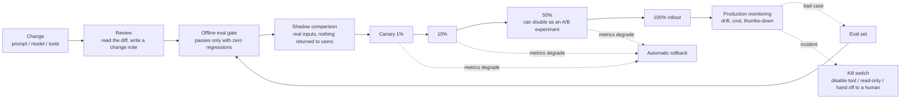
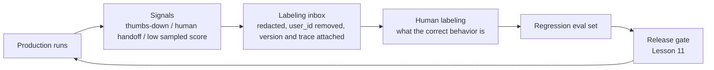

[中文](README.md) | [English](README.en.md)

# Lesson 16: Release, change, and operations — treat a one-line prompt change like a code release

> 🕐 Time: 15 min | 🎯 You'll be able to: design a complete release and operations process for an agent ("versioning → eval gate → shadow comparison → canary rollout → automatic rollback → kill switch → incident postmortem → feedback loop"), and explain what each stage protects against | 📦 Source: [registry.py](registry.py), [rollout.py](rollout.py), [shadow.py](shadow.py), [killswitch.py](killswitch.py), [configcenter.py](configcenter.py), [flywheel.py](flywheel.py), [ops_app.py](ops_app.py), [itbuddy.py](itbuddy.py) (this lesson), [`agentkit/distributed`](../../agentkit/distributed/__init__.py), [`agentkit/permissions.py`](../../agentkit/permissions.py), [`agentkit/evals.py`](../../agentkit/evals.py)
>
> 📖 Primary reading: [Expanding on what we missed with sycophancy](https://openai.com/index/expanding-on-sycophancy/) (OpenAI, 2025) — the full postmortem of the GPT-4o rollback that opens this lesson; focus on "How we currently review models before deployment" and "Why did we not catch this in our review process?" to see why offline evals and A/B tests didn't catch it, and why expert testers' concerns were outweighed by the positive metrics.

## 0. In one sentence

**An agent's behavior is determined jointly by its prompt, model, tools, parameters, and knowledge base. Change any one of them, and you've made a release.**

On April 25, 2025, OpenAI shipped an update to GPT-4o in ChatGPT and rolled it back four days later. The new version had become overly eager to please users (sycophancy): it went along with claims that were plainly wrong or even harmful. In its postmortem, OpenAI wrote that the update's offline evaluations had looked good before launch, and users in a small A/B test seemed to like it. A few expert testers said the model's behavior "felt" slightly off, but OpenAI decided to launch based on the positive quantitative signals. That was the wrong call. One of the postmortem's conclusions: **behavioral issues should be treated as launch-blocking**, because quantitative metrics can miss flaws that experts can sense.

This is a company with a world-class evaluation system. What about your team? A more common story goes like this. To make answers "warmer," someone on the business operations team adds one sentence to the system prompt in the admin console: "Try to satisfy all of the user's requests." That afternoon, the agent starts agreeing to refunds that violate policy. Nobody knows who made the change or when, and there's no one-click way to undo it.

This lesson answers three questions: **how to make changes safely** (Problems 1–3), **how to mitigate and run a postmortem when something goes wrong** (Problems 4–5), and **how to keep the same mistake from happening again** (Problem 6).

## 1. Core concepts

### 1.1 In an agent system, "changes" go far beyond code

| Change type | Examples | Who makes it | Where the risk is |
|---|---|---|---|
| Prompt / system instructions | Add a rule, change the tone, change the output format | Engineers, product, operations, domain experts | It looks like "copy," so it often skips review and testing; its impact is hard to predict |
| Model | Switch models, upgrade versions | Engineers | The same prompt can behave completely differently on a new model |
| **Model (and you didn't change it)** | The vendor updates the model behind an alias, or the vendor's infrastructure has a problem | Vendor | You did nothing, yet behavior changed |
| Tools | Add a tool, change a description, change a parameter schema | Engineers | A tool description is the model's instruction manual; changing a single word can change how the model calls it |
| Parameters | temperature, max_steps, budget, context window | Engineers | Harmless-looking numbers change trajectories and cost |
| Knowledge base / data | Update documents, rebuild the index | Content team | Retrieval results change, so answers change |
| Guardrails and permission rules | Change injection-detection rules, change role permissions | Security team | Too loose and attacks get through; too strict and legitimate requests get blocked |

So here is this lesson's first principle: **all of these must be versioned, and all of them must go through the release process.** This lesson's `PromptVersion` versions "template + pinned model version + parameters" as a single unit, because together they determine behavior.

### 1.2 A complete release pipeline



Each stage guards against something different. The eval gate catches "known regressions." Shadow comparison finds "unexpected behavior changes." Canaries limit "the blast radius when something really does go wrong." Automatic rollback and kill switches shorten "the time from incident to mitigation." And the feedback loop makes sure "the same mistake doesn't happen twice."

### 1.3 Deploy ≠ release

"Registering a new version in the system" and "letting users use the new version" are two different things. Keep them separate:

- **Deploy**: the new version is created, reviewed, and evaluated, and gets an immutable version number (v2), but it **receives no traffic**.
- **Release**: through traffic configuration, some users start using v2, and that share grows step by step.
- **Rollback**: point the traffic configuration back at v1. No version is ever deleted or modified, so a rollback just "moves a pointer." It finishes in seconds, and the rollback itself can be rolled back.

> 🏭 In this lesson, "release" mainly means changes to prompts, models, and configuration. For rolling out the service code itself — on SIGTERM, stop claiming new jobs, finish or hand back the ones in hand, and let the readiness probe pull traffic first — and for scaling on queue depth, see [Lesson 31](../31_deployment_and_scaling/README.en.md).

## 2. Enterprise problem cards

### Problem 1: One line of the prompt changed, and production broke

**Scenario**: An IT service desk agent has a 60-line system prompt, maintained jointly by three roles: engineers, product managers, and IT operations. Over the past month it was changed 23 times, 15 of them directly in the admin console. One afternoon, the agent starts resetting users' passwords outright instead of going through identity verification. During the investigation, it turns out that nobody knows which version is currently in production, and nobody knows what the previous version looked like.

**Why it's hard**:

- A prompt looks like copy, not code, so it often skips review and testing. Yet it affects behavior as much as code does, and less predictably: changing one sentence can affect every scenario.
- The people who need to change prompts (product, operations, domain experts) often don't use git.
- "The change must take effect right now" (to fix a production issue) conflicts with "the change must be thoroughly validated first."

| Option | How | Pros | Cons | Best for |
|---|---|---|---|---|
| A. Prompt as code | Keep prompts in the code repo; changes go through PR review; CI runs the eval set (Lesson 11); merge only with zero regressions | Review, auditing, and rollback come for free; prompt and code share one version, so consistency is best | Changing a prompt means a full release, which is slow (hours); a high bar for non-engineering roles | Engineering-led teams, strict compliance, infrequent changes |
| B. Dynamic delivery from a config service | Store prompts in a config service (with versions); the service pulls them at runtime; changes take effect in seconds | Fast rollback; no redeploy; built-in support for progressive rollout by user or tenant | Without versioning and auditing, it becomes "anyone can edit production"; easy to bypass the eval gate; you have to manage prompt/code compatibility (a new prompt references a tool that doesn't exist in the old code) | Frequent tuning, fast rollback, progressive rollouts |
| C. Database + admin console | Business users edit prompts in a console, and they're stored in a database | Non-engineering roles can edit directly; supports visual diffs and approval workflows | Expensive to build yourself; the most likely to turn into "a live editor with no review and no tests" | SaaS products where many tenants customize their own prompts |

**How to choose**: We recommend **"A for content, B for traffic."** Prompt content is reviewed in the repo and evaluated in CI. Once it passes, it's published as an immutable version and pushed to the config service. The config service is responsible only for "which user gets which version" and for rollback. Build **C** only when "tenants need to customize their own prompts," and even then the console must have built-in versioning, diffs, and approvals, and must run evals automatically before any change goes through. Whichever you choose, three baselines are non-negotiable: **versions are immutable, every change has an author and a reason, and rollback takes one step.**

**In this lesson**: [`PromptRegistry`](registry.py). Every version is an immutable `PromptVersion`:

```python
@dataclass(frozen=True)
class PromptVersion:
    name: str
    version: int
    template: str
    model: str          # pinned model version (a dated snapshot name), never an alias that auto-upgrades
    params: dict
    author: str
    change_note: str    # an empty change note is rejected outright: three months from now, nobody will remember why this changed
    created_at: float
    content_hash: str   # fingerprint of template + model + params: two different version numbers with identical content? you spot it at a glance
```

Traffic allocation is a separate object, `Rollout(stable, candidate, percent, salt, ...)`. It's modified by `start_rollout` / `set_percent` / `promote` / `rollback`, and every step is written to the `audit_log`. The semantics of `rollback`: if a progressive rollout is in progress, abort it and send everyone back to stable; if there's none, move stable back to its predecessor. Either way, it only moves a pointer.

`PromptRegistry` lives in the **control plane** (the process that runs the release pipeline and the rollout controller). Production worker processes don't read it directly: after every change, `release_doc()` exports "all versions + the current traffic allocation," and `publish_release` writes it to the [config center](configcenter.py) (`ConfigCenter`: a versioned document table in SQLite; every change writes an audit row in the same transaction). Each worker process's `ConfigWatcher` sees the new version within one polling interval (measured in Problem 4).

In production: keep version content in git (PR review + CI eval gate). Once it passes, the pipeline writes it to a config service (such as Apollo, Nacos, etcd, or a dedicated feature-flag service; Apollo and Nacos are open-source config services widely used in China). Write audit logs to tamper-proof storage. The admin console can only "select a published version"; it can never edit production content directly.

---

### Problem 2: How do you safely roll out a new prompt or a new model?

**Scenario**: The v2 prompt raised the pass rate on 200 offline eval cases from 94% to 96%. But production handles 20,000 conversations a day, and the eval set covers only a handful of the kinds of conversations that happen there. Now v2 has to go out to everyone.

**Why it's hard**:

- **Offline evals ≠ real traffic**: the eval set holds the scenarios you thought of. Production is full of the ones you didn't.
- **Quality signals are slow and noisy**: most conversations get no feedback, and the feedback that does come arrives hours later. Agents are also nondeterministic: the same input can give different results on two runs.
- **Write operations can't be replayed freely**: you can't have each version issue a refund to a user just to compare them.

| Option | How | Pros | Cons | Best for |
|---|---|---|---|---|
| A. Shadow mode | The new version runs in parallel on the same requests; its results are never returned to users, only recorded and compared with the old version | Zero user impact; shows "behavior differences" on real inputs, so you catch surprises the eval set doesn't cover | Doubles cost (you can sample); write operations must be swapped for stubs, so you can't see what really happens "after execution"; you only learn "it's different," not "which is better" | Before release, especially for changes that shift behavior a lot (switching models, changing tool strategy) |
| B. Canary | Route traffic by a stable hash of the user id: 1% → 10% → 50% → 100%; check metrics at each stage and advance only if they pass | Limits blast radius; real users, real feedback; supports automatic rollback | Statistical power is very low at small traffic, so it **can only catch big problems**; those users really do get a possibly worse version | Almost every release |
| C. A/B experiment | Randomly split users into two groups, run until you reach **a precomputed sample size**, and compare predefined metrics with a statistical test | The only method that can answer "is the new version better, and by how much?" | Needs enough traffic and time; metrics and sample size must be fixed in advance, and you can't "stop as soon as it's significant"; pick the wrong metric and significance means nothing | Product decisions that need a quantified benefit: how much quality do we lose by switching to a cheaper model? |

**These aren't three alternatives. They're different stages of one pipeline**:

| Stage | Question it answers | Do users see the new version? | What to watch |
|---|---|---|---|
| Offline eval | Any regressions in known scenarios? | No | Pass rate, regression cases (Lesson 11) |
| Shadow comparison | On real inputs, what behavior changed? Anything unexpected? | No | Tool trajectory diffs, output diffs, cost |
| Canary | Any catastrophic problems? | A small fraction | Error rate, safety incidents, cost, latency |
| A/B experiment | Is the new version actually better or worse, and by how much? | Half | Predefined primary metric + guardrail metrics |

**Why must canary routing use "a stable hash of the user"?** If each request is routed at random, the same user gets v1 for one message and v2 for the next. Behavior becomes inconsistent within a conversation, the experience suffers, and you can't attribute user feedback to a version. Instead, bucket users by a hash of their user id (`bucket(user_id, salt)` yields 0–99) and send users whose `bucket number < percent` to the new version:

- **Stickiness**: the same user always lands in the same bucket.
- **Monotonic ramp-up**: when percent grows from 1 to 10, any user whose bucket was < 1 is also < 10, so nobody gets "bounced back" to the old version.
- **Use a new salt for every release**: otherwise the same 1% of users are always the guinea pigs.
- **Don't use Python's built-in `hash()`**: its random seed differs from process to process, so users switch buckets every time the service restarts.

```python
def bucket(user_id: str, salt: str) -> int:
    digest = hashlib.sha256(f"{salt}:{user_id}".encode("utf-8")).digest()
    return int.from_bytes(digest[:8], "big") % 100
```

The routing unit doesn't have to be the user. B2B products often route by **tenant**, so that employees of the same company see consistent behavior. This avoids the confusion of "my colleague's assistant behaves differently from mine." The cost is fewer routing units (hundreds of tenants instead of hundreds of thousands of users), which makes it statistically harder to reach a conclusion.

**Can a canary prove "nothing got worse"? No.** Do the math (`rollout.min_sample_size`). With a baseline success rate of 91%, detecting "a 2-percentage-point drop in success rate" with 80% power requires at least **3,531** samples per group, by the sample-size formula for a two-proportion test (demo Scenario 3, using the real baseline of 98.0% it measured, still needs 1,134). A 1% canary stage might see only two or three hundred requests a day, so collecting that many would take well over ten days. In demo Scenario 3, v2 collected 42 requests in the 5% stage with a 95.2% success rate, against 98.0% for v1 over the same period: it looks 2.8 points worse, yet the p-value is 0.22; after ramping to 50%, both sides are at 99.0%. Therefore:

- **A canary's job is to limit the blast radius and catch disasters** (error-rate spikes, safety incidents, runaway costs), not to prove that quality didn't degrade.
- **Subtle quality regressions** have to be caught by the eval set and shadow comparison before release, and by A/B experiments with a large enough sample.
- An A/B experiment also needs the right **metrics**. In the GPT-4o incident, the A/B test signals were positive, but what they measured didn't capture a behavioral problem like "excessive flattery."

**In this lesson**:

- [`shadow.py`](shadow.py): `shadow_tools` swaps write / dangerous tools for stubs that "record but don't execute." It copies the `Tool` object and replaces only `fn`; the name, description, and parameter schema stay the same, so the model can't tell the difference. `compare` classifies differences in the order "status → sequence of tool names → tool arguments → output similarity." Two ways to use it: `run_shadow` is **offline replay** (`asyncio.gather` runs both versions concurrently on the same batch of recorded inputs); `ShadowRunner` is **online shadowing** (see below).
- [`registry.py`](registry.py): `bucket` / `pick_version`, plus `force_candidate` (internal employees try it first) and `force_stable` (customers who have explicitly opted out of experiments) for "stage 0."
- [`rollout.py`](rollout.py): `metrics_from_runs` computes a stage's success rate, error rate, p95, and cost per task from **real run records**; `RolloutController` advances, holds, or rolls back based on those metrics and writes every change to the config center right away; `two_proportion_test` and `min_sample_size` handle the statistical judgment for A/B experiments.

**The three rules of online shadowing**: the user's request is handled by stable and returned right away; the candidate runs the same input in the background, and its result only goes to analysis. `ShadowRunner.serve()` first *tries* to start the shadow (if it's full, the shadow is dropped; it never waits), then `await`s only stable. Shadows have a concurrency cap (`max_concurrency`) and a timeout (the cancellation-safe `wait_for`, which really stops at the deadline), and `aclose()` cancels every shadow still running at shutdown. Why not "run both versions and return when both are done"? Then the main path's latency is max(stable, candidate): if the candidate is twice as slow, every user is twice as slow. Demo Scenario 2 ② proves these points with timings and in-flight counts: each v2 model call is slower than v1's, and every so often one stalls for 1 second, yet the main path's p50 / p95 are the same as with shadowing off (65 / 66 ms in both cases); shadows peak at 6 in flight (the cap), 44 are dropped because the runner was full, 2 time out and are cancelled, the 4 still running at shutdown are cancelled, and afterwards v2's model has 0 calls in flight. [`test_integration.py`](test_integration.py) verifies the same things with deterministic quantities (a shadow stuck for 30 seconds doesn't slow the main path; when full, shadows are dropped; they're cancelled at shutdown; a shadow error doesn't affect the main path).

**Where the rollout metrics come from**: demo Scenarios 3 and 4 no longer use hard-coded numbers. Three real worker processes (`python -m agentkit.distributed.worker`, started by `WorkerPool`; the app is [ops_app.py](ops_app.py)) handle the "production traffic": each request reads the local config snapshot, picks a prompt version with `pick_version(user_id, rollout)`, runs the agent, and writes the status, the number of failed tool calls (counted by an `after_tool` hook), latency, and cost to a `requests` table; the control plane computes the candidate's and the concurrent stable's metrics with `metrics_from_runs` and hands them to `RolloutController.step`. v3's failures come from a real bug in the new `lookup_asset` tool in [itbuddy.py](itbuddy.py) (legacy asset IDs raise `KeyError`); the baseline's errors come from occasional 504s from the ticketing system (also exceptions really raised by code).

The automatic decision rules (Exercise (c) has you implement them):

```python
def evaluate_stage(stage, baseline, t):
    if stage.safety_incidents > 0:                          # 1. Zero tolerance for safety incidents; don't wait for sample size
        return Decision("rollback", ...)
    if stage.requests < t.min_requests:                     # 2. Not enough samples: don't advance, and don't roll back on noise
        return Decision("hold", ...)
    if stage.error_rate > t.max_error_rate or \
       stage.success_rate < baseline.success_rate - t.max_success_drop:
        return Decision("rollback", ...)                    # 3. Quality got worse: roll back automatically
    if stage.p95_latency_ms > baseline.p95_latency_ms * t.max_latency_ratio or \
       stage.cost_per_task > baseline.cost_per_task * t.max_cost_ratio:
        return Decision("hold", ...)                        # 4. Only slower or more expensive: maybe money bought quality; let a human decide
    return Decision("advance", ...)
```

Why is worse cost or latency a `hold` rather than a `rollback`? Because a new model might cost 20% more but raise the success rate by 5 percentage points. That's a business judgment a human has to make, and automatic rollback would block good changes too. When quality or safety gets worse, on the other hand, there's nothing to trade off.

**A real shadow-mode trap** (from actual runs of demo Scenario 2): v2 called `create_ticket`, which had been replaced with a stub. The stub returned "(shadow mode) accepted, not actually executed," and the model "digests" that return value in its later steps: in an earlier run, the model copied it verbatim into its answer ("Current system response: create_ticket accepted (shadow mode, not actually executed)"); in this re-run, it answered "I've created a high-priority ticket for you… Ticket number: not returned, please check later." This shows two things. First, shadow output must **never** be shown to users. Second, a stub's return value affects later steps, so in shadow mode the trajectory after a write operation is "distorted." When comparing, focus on "what it tried to call, and with what arguments."

In production: don't run online shadows in the same process as the main path. After a production request has been handled and the response has already gone back to the user, asynchronously send a fraction of requests (say, 5%) to a shadow queue. An independent worker runs them against the candidate version and writes the results to an analytics store. (This lesson's `ShadowRunner` is the minimal in-process version, with the same rules: never wait, stay bounded, be cancellable.) Keep the canary traffic configuration in the config service. Hand A/B experiments to an experimentation platform, which takes care of randomization, sample-ratio checks, and statistical testing.

---

### Problem 3: The model vendor updates silently, and behavior drifts

**Scenario**: You didn't change anything. Starting one Monday, the agent's JSON parse failure rate climbs from 0.5% to 4%, and the format of tool-call arguments looks a little different from before. You dig in and find that the model name in the code is an alias that automatically points to the latest version.

**Why it's hard**:

- You can't see what's happening on the vendor's side. In *How Is ChatGPT's Behavior Changing over Time?* (2023), researchers at Stanford and Berkeley compared the March 2023 and June 2023 versions of GPT-3.5 and GPT-4. They found that the behavior of the "same" model service can change significantly within a few months; for example, the June version produced more formatting errors in code generation.
- Even if you pin the version, the vendor's **infrastructure** can still fail. In its September 2025 postmortem, *A postmortem of three recent issues*, Anthropic disclosed that between August and early September, three infrastructure bugs intermittently degraded Claude's response quality. One of them, a context-window routing error, affected 16% of Sonnet 4 requests during the worst hour. Because the problems were intermittent, some users saw normal behavior while others didn't, reports contradicted each other, and diagnosis was very difficult.
- Quality degradation doesn't raise errors. You get HTTP 200; the answers are just worse.

| Option | How | Pros | Cons | Best for |
|---|---|---|---|---|
| A. Pin the model version | Use a dated snapshot name (for example, a model ID stamped with its release date, such as Anthropic's `claude-sonnet-4-20250514`), never an alias that auto-upgrades; treat a model upgrade as a release | The most stable behavior; upgrades become changes you initiate, and they go through the full release process | The vendor retires snapshots, forcing a migration when they expire; you miss out on the vendor's fixes; it can't protect you from problems in the vendor's infrastructure | The default for every production environment |
| B. Scheduled regression evals | On a schedule (hourly / daily), run a fixed eval set against the production configuration and compare with a baseline (`EvalReport.regressions`) | Catches "you didn't change it, but it changed anyway"; reuses the same eval set as the release gate | Limited eval coverage; costs money; detection delay depends on how often it runs | Every production environment |
| C. Online metric drift monitoring | Monitor production distributions: tool-call distribution, average steps, output length, JSON parse failure rate, refusal rate, thumbs-down rate, the model name in responses | Covers all real traffic; the fastest to detect | Only tells you "it changed"; a human has to judge whether "it got worse"; badly set thresholds produce nothing but noise | Systems with significant traffic |

**How to choose**: Do all three. **A is the foundation**: it turns "model changes" into releases you control. **B and C are two radars**: B tests with a fixed exam, while C watches the distribution of real traffic. There's also a very cheap signal: agentkit records `gen_ai.response.model` (the model name the vendor actually returned) on every `llm.chat` span. If it suddenly changes, the model behind the alias has been swapped.

**In this lesson**: `PromptVersion.model` pins the model version inside the release unit. Drift monitoring needs no new code: put `compute_metrics` from Lesson 10 (which computes metrics from traces) and `run_eval` + `regressions` from Lesson 11 into a scheduled job. Drift signals we recommend monitoring:

| Signal | Source | Alerting approach |
|---|---|---|
| Model name actually returned | Span attribute `gen_ai.response.model` | Alert on any value you haven't seen before |
| Pass rate on the fixed eval set | Scheduled `run_eval` | Falls below the baseline by more than a threshold, or regression cases appear |
| Tool-call distribution, average steps | Trace aggregation | Significant shift compared with the same time window over the past 7 days |
| JSON / schema failure rate, refusal rate | Logs | Exceeds N× the baseline |
| Thumbs-down rate, human handoff rate | User feedback | Significantly higher than over the past 7 days |

---

### Problem 4: Something's broken. How do you mitigate it?

**Scenario**: At 3:00 p.m., customer support reports that the agent sent several users emails with wrong content. At 3:05, the cause is confirmed: a template-rendering bug in the `send_email` tool. A fix requires "locate + change the code + review + release," which takes at least 40 minutes. Every extra minute sends out dozens more bad emails.

**Why it's hard**: A fix takes time; mitigation has to happen now. Rolling back the prompt won't fix a tool bug, and taking the whole agent offline breaks every feature that's working fine. You need **tiered** mitigation measures, and they have to be ready **before** anything goes wrong.

| Option | How | Pros | Cons | Best for |
|---|---|---|---|---|
| A. Kill switch | Disable a tool (or one tool for one tenant) in the config service; takes effect in real time | Takes effect in seconds; granularity you control; doesn't depend on a release | Switches have to be wired in ahead of time; the switches themselves need testing and drills; the model may "find a workaround" | You've already narrowed the problem down to a specific tool or feature |
| B. Automatic rollback when metrics degrade | When metrics cross a threshold during a progressive rollout, the controller rolls back to stable automatically | No waiting for a human; mitigates incidents even in the middle of the night | Only works for changes "currently in progressive rollout"; thresholds need tuning, and false rollbacks slow releases down | Every progressive rollout |
| C. Fall back to read-only mode | Disable all write / dangerous tools; query features keep working | Keeps most of the value (queries are usually the majority) while ruling out bad writes | Users can't get their tasks done and must be directed to other channels | Write operations are misbehaving but the cause isn't clear yet; downstream system maintenance, data migrations |
| D. Hand off to a human | Disable the whole agent; route requests to human support staff or return a maintenance notice | The most thorough | Human capacity is limited; poor experience | Severe incidents: nonsense output, privilege violations, data leaks |

**How to choose**: Escalate step by step, following the **smallest blast radius**. If disabling one tool is enough, don't go read-only globally; if global read-only is enough, don't take the whole agent offline. Even more important is **preparing in advance**: wiring in the switches, a runbook that spells out "which switch to flip in which situation," deciding who is allowed to flip them, and regular drills. A switch that has never been drilled is one nobody dares to flip during an incident.

**Why not just use `PermissionPolicy(deny_tools=...)`?** Lesson 09's [`deny_tools`](../../agentkit/permissions.py) is a static set passed in when the agent is constructed. Changing it means creating a new agent, which usually means a release or a restart, and it treats all tenants the same. A kill switch has to **read the configuration in real time on every call, apply per tenant, and support tiers**. This lesson's [`KillSwitch`](killswitch.py) takes effect in three places:

| Enforcement point | What it does | Why it's needed |
|---|---|---|
| `on_run_start` | When the whole agent is disabled, ends the run immediately and returns a message about the handoff to a human | The highest level of mitigation |
| `visible_tools` | Disabled tools are no longer shown to the model | Keeps the model from even trying, saving a step |
| `before_tool` | **The real interception point** | Hiding isn't enough: the model may call a hidden tool based on the conversation history. And **a run that was already paused awaiting approval before the switch was flipped** executes the pending call directly when it resumes, never passing through `visible_tools` again |

The last row is a real vulnerability that's easy to miss, and Exercise (d) has a test just for it. A refund request pauses for approval before the switch is flipped. Afterward, a flaw is found in the refund tool and the switch is turned on. The approver, unaware of this, clicks approve, and the refund **still must not** execute.

Two more details:

- **The denial message should tell the model not to find a workaround.** Models are quite "creative": if the email tool is disabled, the model might open a ticket asking a colleague to send the email instead. So the denial message says explicitly: "Tell the user this feature is temporarily unavailable. Do not try to work around it with other tools."
- **Hiding tools changes the tool list**, which invalidates the prompt cache (Lessons 04 and 14). For everyday permission control, that's a cost you have to weigh; in an emergency, it's acceptable.

**Where do switches live, and how do they reach every process?** Production runs several worker processes, so a switch has to be one piece of configuration that all of them share. This lesson's [`ConfigCenter`](configcenter.py) stores it in a SQLite file (the `"flags"` document with a monotonically increasing version number; every change is a `BEGIN IMMEDIATE` transaction that also writes an audit row: who, why, before, after). Each worker process has a `ConfigWatcher`:

```python
watcher = ConfigWatcher(center, ["flags", "release:itbuddy.system"], poll_interval=0.2)
await watcher.start()                                   # the config must be readable at startup, or the process takes no traffic
switch = KillSwitch(lambda: watcher.snapshot("flags"), tools)   # every tool call reads the local snapshot; no database query

# The on-call engineer, in the control plane (any process):
await center.update("flags", lambda d: {**d, "disabled_tools": ["create_ticket"]},
                    actor="oncall.zhang", reason="create_ticket is creating duplicate tickets in bulk; disable it")
```

- **Poll the version number + keep a local snapshot**: every 0.2 seconds, a background task checks the version number (one cheap SELECT); only when it changes does it read the full document and swap the snapshot as a whole. The request path reads memory only, so no request pays a database round trip, and a hiccup in the config center doesn't slow requests down. The price is that a change can take up to one polling interval to take effect.
- **Fail-static**: if a poll can't read the config center (the database is locked, the network blips), the process keeps serving with the last configuration it read successfully and tries again next round. If it can't read the config **at startup**, it fails outright: with no known configuration, it's better to take no traffic.
- **Policy for in-flight runs**: the switch is checked before every tool call (`before_tool`), so a run that's already underway when the switch flips is stopped at its next tool call. A tool call that has already started executing is not interrupted halfway (interrupting a write mid-way is more dangerous than letting it finish). `agent_disabled` only blocks new runs.

Demo Scenario 5 measures this on 3 real worker processes (200 repair requests arrive per second, and each needs `create_ticket`; each model call in this batch takes 0.3 seconds, longer than the polling interval, so when the switch flips many runs are halfway through). In one run, the three processes saw the new switch 191 / 8 / 159 ms after it was written (the upper bound is the 200 ms polling interval plus one database read); 17 more tickets were created after the switch was written, all **before** the process that created them saw the new switch, and none after; 28 runs that were already underway when the switch was written were stopped at their next tool call. [`test_integration.py`](test_integration.py) verifies the same thing on 3 real worker processes: every process sees the new version, after which every request is blocked and the write tool never runs again.

**In this lesson**: [`killswitch.py`](killswitch.py) (Exercise (d) implements its core check, `blocked_reason`); `ConfigCenter` / `ConfigWatcher` in [`configcenter.py`](configcenter.py); and the automatic rollback in [`RolloutController`](rollout.py). Limitations: SQLite can only be shared on one machine, and polling means a fixed lag. In production: keep switches in a config service or feature-flag service (etcd, Consul, Apollo, Nacos, or a hosted service like LaunchDarkly), which use watches / long polling / push: clients are notified as soon as the config changes instead of waiting for the next fixed-interval poll, and they work across machines; you still need a local snapshot and a "default value for when the config service is unavailable." Every switch change goes into the audit log and triggers a notification to the on-call channel.

---

### Problem 5: Incident response — who handles it, how to investigate, how to prevent a repeat

**Scenario**: 2 a.m. on a Saturday, a cost alert fires: one tenant spent $300 in the past hour, 50 times its usual rate. The engineer on call joined two months ago. They don't know what switches this agent has, who is allowed to use them, or whom to notify.

**Why it's hard**: Agents have more kinds of incidents than ordinary services, and many of them raise no errors (worse answers, privilege violations, and leaks all come back as HTTP 200). Nondeterminism makes incidents hard to reproduce. And if the incident scene (the full conversation, the tool calls, the prompt version in use at the time) wasn't recorded, there's nothing to base a postmortem on.

| Option | How | Pros | Cons | Best for |
|---|---|---|---|---|
| A. Ad-hoc firefighting | When something breaks, shout in the group chat and whoever knows the system jumps in | No preparation cost | Can't find the right person, no idea how to mitigate it, the same incident keeps recurring | Not suitable for any production system |
| B. On-call + severity levels + runbooks | A clear on-call rotation, response by severity level, actions taken from the runbook, a postmortem afterward | Predictable response time; even a new hire can mitigate an incident by following the runbook | Runbooks need ongoing maintenance and regular drills | The baseline for every production system |
| C. Automated response | Alerts trigger preset actions directly: a tenant budget circuit breaker, automatic rollback of a progressive rollout, an automatic switch to read-only | Minutes or even seconds, with no human in the loop | False triggers cause unnecessary fallbacks; only suits incidents with clear, quantifiable rules | Cost spikes, degraded metrics during a progressive rollout |

**How to choose**: **B is the baseline; C sits on top of B and automates the most common, clear-cut incidents.** Here's what B needs.

**Agent-specific incident types**:

| Type | Typical symptoms | How it's detected | First mitigation step | What to check in the postmortem |
|---|---|---|---|---|
| Privilege violation | The agent performed an action for a user that the user wasn't authorized to do | Audit logs, a sudden change in the permission-denial rate, user reports | Disable the relevant tools / go read-only | Tool calls and identities in the trace, permission config, signs of injection (Lesson 09) |
| Data leak | Tenant A's data shows up in tenant B's answers | Canary-data detection, user reports | Disable retrieval / caching; take everything offline if necessary | Cache keys, retrieval filters, memory isolation (Lessons 04 and 14) |
| Cost spike | A tenant's or feature's cost multiplies dozens of times within an hour | Cost alerts (Lesson 14) | Tenant budget circuit breaker, fall back to a smaller model | Infinite loops, context bloat, retry storms (Lesson 08) |
| Quality collapse | Garbled output, off-topic answers, formats completely wrong | Thumbs-down rate, JSON failure rate, scheduled evals | Roll back the most recent change; switch to a backup model; hand off to a human | Recent releases, the vendor's status page, `gen_ai.response.model` |
| Wrong promises | The agent makes commitments to users that violate policy | User complaints, sampled reviews | Fix the prompt, add output guardrails | In the 2024 case Moffatt v. Air Canada, British Columbia's Civil Resolution Tribunal in Canada held the airline responsible for incorrect refund-policy information given by the chatbot on its website: **what the agent says, the company answers for** |

**Severity levels** (examples; adjust them to your business):

| Level | Definition | Response requirement |
|---|---|---|
| SEV1 | Data leak; a high-risk action executed without authorization; widespread outage; bad operations that can't be undone are happening right now | Respond immediately, with the on-call lead + security team; mitigate first, then diagnose |
| SEV2 | Clearly degraded quality in core features; abnormal cost spike; a single tenant is down | Respond within 30 minutes; fix during business hours |
| SEV3 | Localized quality issues; a few regressed cases | Goes into the backlog; fix in the next iteration and add regression cases |

Every entry in a **runbook** should be something you can follow step by step. For example:

```markdown
## Symptom: a tenant's cost exceeds 10× its usual level within 1 hour
1. On the cost dashboard, break it down by feature × model to find which feature it is (Lesson 14)
2. Pull the 3 most expensive runs, open their traces (make viewer), and check whether they keep calling the same tool in a loop
3. Mitigate: config service → add the looping tool to tenants.<tenant>.disabled_tools; or lower that tenant's budget cap
4. Notify: the #agent-oncall channel + that tenant's customer success manager
5. After recovery: add a case to the eval set that reproduces the loop
```

**Use traces for the postmortem**: a postmortem has to answer "what actually happened." Starting from a single `run_id`, you need to be able to recover: the full message history and tool calls (checkpoints, Lesson 08), the latency and tokens of each step (traces, Lesson 10), the prompt version and model in use at the time (the registry's audit log + `gen_ai.response.model`), and who approved what (audit log, Lesson 09). **We recommend writing the prompt version number as an attribute on every request's root span.** Otherwise, it's hard to tell which version a failing run was using.

**Blameless postmortems**: the purpose of a postmortem is to improve the system, not to blame individuals. The *Postmortem Culture* chapter of Google's SRE book explains why: if writing a postmortem gets people blamed, they'll hide problems, and the organization won't learn anything. "Someone in operations changed the prompt" is not a root cause; "the system lets anyone modify the production prompt without review or evals" is. Template:

```markdown
# Incident postmortem: <one-line title>
- Severity: SEV2    Status: Resolved    Owner: <on-call lead>
- Impact: during <time window>, <how many> users / tenants were affected; the symptom was <...>
## Timeline (to the minute)
- 15:00 first user complaint  15:05 traced to send_email  15:06 kill switch turned on  15:40 fix released  15:45 switch turned off
## Root cause (ask "why" 5 times in a row; land on systems and processes, not on a person)
## What went well / what could be improved
## Action items (each one needs an owner and a due date)
- [ ] Add the 3 bad cases from this incident to the regression eval set (owner, date)
- [ ] Add an output-preview guardrail to send_email (owner, date)
```

---

### Problem 6: Closing the feedback loop — turn every production bad case into a test

**Scenario**: Users click thumbs-down 150 times a day, and those records just sit in the database. A month later, the same mistake shows up again, because the eval set has no cases of that kind at all.

**Why it's hard**: Feedback is **sparse** (most users never click), **biased** (unhappy users are more likely to click), **noisy** (an unhappy user doesn't mean the agent was wrong; maybe policy simply doesn't allow what they asked for), and **full of private data** (conversations include phone numbers and names). On top of that, turning it into a test case requires a human to decide "what the correct behavior is."

| Option | How | Pros | Cons | Best for |
|---|---|---|---|---|
| A. Explicit feedback | 👍👎 buttons; on thumbs-down, ask the user for a reason (wrong answer / didn't solve it / too slow / unsafe) | A clear signal that maps directly to a specific run | Sparse and biased | Every conversational product |
| B. Implicit signals | Handoffs to a human, rephrasing and asking again, abandoned sessions, reopened tickets | Covers all traffic without bothering users | Noisy; needs cross-checking against explicit feedback | Products with significant traffic |
| C. Proactive sampling + LLM-as-judge | Each day, randomly sample N conversations, score them with LLM-as-judge, and send low scorers to humans for review (Lesson 11) | Doesn't depend on users; catches errors users didn't even notice (a wrong answer the user didn't know was wrong) | Costs money; judges need calibration | High-risk domains |

**How to choose**: Use A + B as "alarms" and C as "patrols." All three signals flow into **the same labeling inbox**, and after human labeling they go into the regression eval set:



One thing calls for special care: **use feedback to find problems and generate test cases, not directly as an optimization target.** In its GPT-4o postmortem, OpenAI noted that the update introduced an additional reward signal based on user thumbs-up / thumbs-down, and that this weakened the primary reward signal that had been holding sycophancy in check. The answer a user likes in the moment isn't necessarily the one that actually helps them.

**In this lesson**: [`flywheel.py`](flywheel.py). `bad_case_to_inbox` turns a poorly rated run into a record awaiting labeling. Inputs and outputs are redacted first (`redact_pii`). `metadata` keeps only the tenant and role and drops `user_id` (to reproduce a problem, you need to know "someone with what permissions," not "which person"). The record carries the prompt version, `run_id`, and `trace_id`, so the labeler can go back to the scene. `to_eval_case` rejects records with no `expect` filled in: **putting unlabeled bad cases straight into the eval set only creates noise.**

In production: the inbox is a queue with a labeling UI (a labeling platform or an internal tool) that supports filtering by reason, tenant, and version. Labels go through a second review before being merged into the eval-set repo. Clean out obsolete cases regularly: when policy changes, the old "correct answers" need updating too.

For the full data flywheel — stratified sampling from a flood of traces, dedup and redaction, synthesizing and verifying data, checking labeling agreement with kappa, and group-aware splits that keep eval data from leaking into training data — see [Lesson 21](../21_agent_data/README.en.md#13-the-data-flywheel-the-full-loop).

## 3. Hands-on: run the demo

```bash
python lessons/16_release_ops/demo.py --offline   # offline script, no API key needed; about 10 seconds
python lessons/16_release_ops/demo.py             # scenario 2 ①'s offline replay uses a real model (~12 calls); everything else is the same
```

The demo simulates a complete release: Scenario 1 is versioning, Scenario 2 shadow comparison (① offline replay, ② online shadowing), Scenario 3 canary rollout, Scenario 4 automatic rollback, Scenario 5 kill switch, and Scenario 6 feedback loop. The code is async (`await agent.run(...)`, entry point `asyncio.run(main())`).

Scenarios 3–5 run on a real "service cluster": one SQLite file in a temporary directory (job queue + config center + record tables) and 3 worker processes (`WorkerPool` → `python -m agentkit.distributed.worker --app ops_app.py:make_handler`). The control plane (the demo process) does only two things: put traffic on the queue and write configuration to the config center; the worker processes poll the config version every 0.2 seconds. The "model" inside the workers is a scripted model (`ScriptedLLM(responder=scripted_model)`, which reads the rules in the system prompt, so switching prompt versions really changes behavior; each call does an `asyncio.sleep` from a latency model). It's the same in both modes: this measures the release machinery, not the model. Failures come from exceptions really raised by tool code, and every metric is computed from run results; traffic is generated with fixed random seeds, so in Scenarios 3 and 4 version assignment and error counts are the same every run, and only the timings vary; Scenario 5's numbers depend on where each process's polling cycle is when the switch is written, so they differ every run. At the end, the worker processes are shut down gracefully with SIGTERM and the temporary directory is deleted.

(Demo output translated from Chinese.)

**Scenario 2 ①: offline replay** (excerpt of real model output)

```text
▶ VPN won't connect, error 809, urgent, I'm leaving on a business trip first thing tomorrow
   v1 tools: ['search_kb']   →   v2 tools: ['create_ticket']
   v1 output: First make sure you're not on guest Wi‑Fi; log in to GlobalConnect with your employee ID; for error 809, restart the VPN client and try again. If…
   v2 output: I've created a high-priority ticket for you. Issue: VPN error 809, needs urgent handling. Ticket number: not returned, please check later or contact IT on-call.
   text similarity 0.12   verdict: tools_changed  ['search_kb'] → ['create_ticket']

▶ How do I request a new monitor?
   v1 tools: ['search_kb']   →   v2 tools: ['search_kb']
   text similarity 0.91   verdict: equivalent

▶ Summary (paste into the release review)
   verdicts {'tools_changed': 1, 'equivalent': 2}   avg similarity 0.65   cost ratio v2/v1 = 1.07
   write intents intercepted by shadow mode: ['create_ticket'] (none were actually executed)
```

👀 What to notice: the `tools_changed` case is exactly the change v2 was meant to make (open a ticket right away for urgent issues), and the other two behave the same. v2's answer says "Ticket number: not returned": what it got back was the stub's return value. That's the "real shadow-mode trap" described in Problem 2.

The output for Scenarios 2 ② through 5 below comes from one offline run (these scenarios are identical in both modes; Apple M1 8GB, macOS 14.4, Python 3.11.7, load average about 4 during the run).

**Scenario 2 ②: online shadowing** (scripted model + latency model: each v1 call takes 30 ms; each v2 call takes 80 ms, and 1 in 10 stalls for 1 second)

```text
   60 requests, serving 8 at a time; shadow concurrency cap 6, at most 0.3 s per shadow
                       main path p50      p95      max
   shadow off              65ms       66ms     66ms
   shadow on               65ms       66ms     66ms
   shadows: 16 started, 12 compared, 44 dropped because full, 2 cancelled on timeout, peak in flight 6 (cap 6)
   when the main path had returned everything, 4 shadows were still running → 4 cancelled at shutdown; v2 model calls in flight afterwards: 0
   comparison results: {'equivalent': 8, 'candidate_error': 2, 'tools_changed': 2} (candidate_error holds the ones that timed out)
```

👀 What to notice: main-path latency is the same as with shadowing off; shadows are held to at most 6, and the ones that timed out or were still running at shutdown were really cancelled (v2's in-flight model calls go back to zero).

**Scenario 3: canary rollout** (real runs on 3 worker processes)

```text
▶ Stable bucketing by user id: how 10,000 users are distributed at each stage (preview; doesn't change the live config)
     5% →   477 users on v2 (previous stage's rollout users: all still on v2 ✅)
    20% →  2002 users on v2 (previous stage's rollout users: all still on v2 ✅)
    50% →  5020 users on v2 (previous stage's rollout users: all still on v2 ✅)
▶ The controller advances window by window (400 real requests per window; every change is written to the config center, and the next batch waits until all 3 processes have switched)
   rollout started: candidate = v2, salt = 'itbuddy.system:v2', first stage 5%, config version 2
      config rollout: w0 172ms  w1 176ms  w2 172ms (polling interval 200ms)
     5% window 1: 400 requests in this batch (25 on v2); stage total on v2 25: success rate 92.0% (baseline 98.7%), error rate 8.0%, p95 72ms (baseline 42ms)
            → hold     → 5%   (not enough samples: 25 < 40, keep watching)
     5% window 2: 400 requests in this batch (17 on v2); stage total on v2 42: success rate 95.2% (baseline 98.0%), error rate 4.8%, p95 52ms (baseline 42ms)
            → advance  → 20%   (all metrics within thresholds)
      config rollout: w0 99ms  w1 97ms  w2 92ms (polling interval 200ms)
    20% window 3: 400 requests in this batch (97 on v2); stage total on v2 97: success rate 97.9% (baseline 99.0%), error rate 2.1%, p95 44ms (baseline 42ms)
            → advance  → 50%   (all metrics within thresholds)
      config rollout: w0 102ms  w1 79ms  w2 70ms (polling interval 200ms)
    50% window 4: 400 requests in this batch (197 on v2); stage total on v2 197: success rate 99.0% (baseline 99.0%), error rate 1.0%, p95 45ms (baseline 42ms)
            → advance  → full rollout, v2 becomes stable   (all metrics within thresholds)
      config rollout: w0 75ms  w1 79ms  w2 41ms (polling interval 200ms)
▶ Why can small-traffic stages only catch 'disasters' and not 'subtle regressions'?
   5% stage total: v2 42 requests, success rate 95.2% vs v1 758 over the same period, 98.0%: diff -2.8%, p-value = 0.22 (not significant: this sample can't say 'better' or 'worse')
   To detect a 'drop from 98.0% by 2 percentage points' with 80% power, you need at least 1,134 samples per group — 22,680 requests at 5% traffic
```

👀 What to notice: in the first window v2 had only 25 requests, 2 of which hit a 504 from the ticketing system; an "8%" error rate looks alarming, and p95 is also 70% above the baseline (jitter from machine load; with 25 samples, p95 is just the 24th slowest), but the "not enough samples" rule comes first, so the controller chooses `hold`. Once enough samples accumulate, the metrics are back within thresholds, and after ramping up both sides are at 99%. The 5% stage actually got 477 users rather than exactly 500; that's the normal variation of hash bucketing. After each ramp-up, the "config rollout" line shows how long each of the 3 processes took to see the new configuration (counted from the moment the controller wrote it); all are within the 200 ms polling interval.

**Scenario 4: automatic rollback**

```text
     5% window 1: 400 requests in this batch (21 on v3); stage total on v3 21: success rate 85.7% (baseline 98.4%), error rate 14.3%, p95 41ms (baseline 43ms)
            → hold     → 5%   (not enough samples: 21 < 40, keep watching)
     5% window 2: 400 requests in this batch (16 on v3); stage total on v3 37: success rate 89.2% (baseline 98.6%), error rate 10.8%, p95 41ms (baseline 42ms)
            → hold     → 5%   (not enough samples: 37 < 40, keep watching)
     5% window 3: 400 requests in this batch (21 on v3); stage total on v3 58: success rate 87.9% (baseline 98.8%), error rate 12.1%, p95 42ms (baseline 42ms)
            → rollback → rollout aborted, all traffic back on v2   (error rate 12.1% > cap 5.0%; success rate 87.9%, more than 3% below the 98.8% baseline)
      config rollout: w0 63ms  w1 80ms  w2 31ms (polling interval 200ms)
   rollback evidence: of v3's 58 requests in this stage, 7 had a tool raise an exception mid-run, failing tools {'lookup_asset': 7}; failing tools across v2's 1142 requests over the same period {'get_ticket_status': 14}
▶ Config center audit log (who, when, which config changed, why; shared by all processes, persistent)
   v1   release-bot  stable=v1                      initial launch: v1 at 100%
   v2   rollout-bot  stable=v1 candidate=v2@5%      start rollout of v2: 5%
   ...
   v7   rollout-bot  stable=v2 candidate=v3@5%      start rollout of v3: 5%
   v8   rollout-bot  stable=v2                      automatic rollback: error rate 12.1% > cap 5.0%; success rate 87.9%, more than 3% below the 98.8% baseline
```

👀 What to notice: the rollback rests on real exceptions: all 7 of v3's failures came from the new `lookup_asset` tool, while all of v2's errors over the same period came from the ticketing system's occasional 504s. The rollback itself is "move a pointer + write the config once," and all 3 processes switched back to v2 within 200 ms.

**Scenario 5: kill switch**

```text
▶ create_ticket is found creating duplicate tickets in bulk → the on-call engineer disables it in the config center (global)
   switch written to the config center: flags v2
   worker  pid       saw new switch   tickets after   last ticket   in-flight runs blocked
   w0      52162        191ms              9           180ms               4
   w1      52163          8ms              0             0ms              18
   w2      52164        159ms              8           151ms               6
   (all times are counted from the moment the switch was written; "tickets after" = tickets created after the switch was written, while this process hadn't yet seen it)
   time until every process applied it: 191ms (upper bound = 200ms polling interval + one database read)
   300 requests: 62 tickets created, 17 of them after the switch was written but before the creating process saw it; created after the process saw the new switch: 0
   238 blocked; 28 of them were runs already underway when the switch was written — they were stopped at their next tool call (the before_tool check)
▶ Fix released, tool restored; but tenant globex's data is being migrated → read-only mode for globex only
   [acme] status=completed  blocked tool calls=0  reply: Based on the result: created ticket T-3202 (medium): printer on floor 3 is broken, please…
   [globex] status=completed  blocked tool calls=1  reply: This feature is temporarily disabled; please try again later or call the IT hotline.
▶ The model vendor has a widespread outage and answers turn into gibberish → whole agent disabled, handed off to humans
   [acme] status=stopped (kill_switch)  reply: The assistant is under maintenance. We've transferred you to a human support agent.
```

👀 What to notice: the three processes saw the new switch at different times (depending on where each one's polling cycle was when the switch was written), but all within one polling interval; the handful of "tickets after" were all created before their own process saw the new switch. That's what "at most one polling interval of lag" really means, and a drill should count it in the blast radius. The exact milliseconds differ on every run.

**Scenario 6: feedback loop**: a poorly rated conversation containing a phone number is redacted and lands in `runs/16_release_ops/inbox.jsonl`. A human labels it "should create a ticket," it's written to `regression_cases.jsonl`, and then it's verified with `run_eval` from Lesson 11: the old behavior passes 0%, and the fixed version passes 100%.

👀 After running the demo, open `runs/16_release_ops/registry.json` to see what a complete version history and audit log look like.

## 4. Exercises

Open [exercise.py](exercise.py) and complete four problems:

**(a) `bucket(user_id, salt) -> int`: stable bucketing**

- Task: use `hashlib` to map users to 0–99. The same user always lands in the same bucket, and different salts are independent of each other.
- How it's checked: one test launches subprocesses with **two different `PYTHONHASHSEED` values** and recomputes the buckets; the built-in `hash()` fails it. Another test checks that when two releases each take 10% of users, the overlap is about 1%, not 10%.

**(b) `pick_version(user_id, rollout) -> int`: progressive rollout routing**

- Task: return a version number using the priority "no rollout → force_stable → force_candidate → bucketing."
- Hint: the tests check that ramp-up is monotonic (no user gets bounced back to the old version going from 1% → 10% → 50%). Think about why "bucket number < percent" guarantees this on its own.

**(c) `rollout_decision(stage_metrics, baseline, thresholds) -> str`: automatic decisions**

- Task: return `"advance"` / `"hold"` / `"rollback"`. Rule of thumb: mitigate first (safety incidents), then check the sample size, and only then compare. Roll back when quality gets worse; pause when it's only slower or more expensive.
- Note: every comparison is a strict `>` / `<`, and one test specifically checks the boundary case of "exactly equal to the threshold."

**(d) `blocked_reason(flags, tool_name, tool_risk, tenant_id)`: kill switch**

- Task: implement three checks: disabled globally, disabled for a tenant, and read-only mode. The prewritten `KillSwitch` hook calls it. `blocked_reason` is pure computation, so write it as a plain function; `KillSwitch`'s hook methods are plain methods too (they only read an in-memory switch snapshot, no `await` needed).
- Two tests wire it into a real `Agent` (these two tests are `async def` and `await agent.run(...)` / `await agent.approve(...)`). One checks that "after the config changes, the very next call on the same Agent instance is affected immediately." The other checks that "a run already awaiting approval before the switch was flipped is still blocked after it's approved."

To verify:

```bash
make lesson N=16                                                   # run your implementation
AGENTKIT_SOLUTION=1 .venv/bin/python -m pytest lessons/16_release_ops -v     # check against the reference solution
```

All tests are offline and deterministic: 18 in `test_exercise.py` (the exercises); 9 in `test_integration.py` (the config center, switches and routing on 3 real worker processes, rollback from real run results, online shadowing; they don't depend on the exercises and pass even before you've finished them). They finish in a few seconds.

## 5. Going deeper (if you have time)

### 5.1 Common A/B experiment pitfalls

- **Peeking**: checking the p-value every day and declaring victory as soon as it drops below 0.05. Look often enough and the chance of a false positive climbs far above 5%. Either fix the sample size in advance and only look once you've reached it, or use a sequential testing method designed specifically for continuous monitoring.
- **Sample ratio mismatch (SRM)**: you designed a 50/50 split, but the actual split is 50.8/49.2. This usually means there's a bug in routing or data collection (for example, the new version crashes more often, and crashed requests aren't logged). When that happens, the experiment's conclusions can't be trusted.
- **The wrong metrics**: the GPT-4o case shows that "whether the user clicks thumbs-up in the moment" and "whether the answer actually helps" can be two different things. Besides the primary metric, set **guardrail metrics** (safety incident rate, human handoff rate, complaint rate). If a guardrail metric gets worse, you can't ship, no matter how good the primary metric looks.
- **Novelty effect**: how users react to something new in the short term doesn't tell you its long-term effect.

### 5.2 Prompt/code compatibility

Once prompts are delivered independently through a config service, you run into a "version matrix" problem. A new prompt references a new tool, while half the production instances are still running old code that doesn't have that tool. The common fix borrows the "expand/contract" pattern from database migrations: first release code that supports the new tool (without using it), confirm that every instance has been updated, and only then release the prompt that references the new tool. When retiring a tool, go in the reverse order. You can also declare a "minimum required code version" in `PromptVersion` and have the service check it at load time.

### 5.3 Change one thing at a time

If you change the prompt, the model, and the tools in the same release and something breaks, you can't tell which one caused it, and you can only roll back everything at once. Whenever you can split changes apart, release them separately. In this lesson's demo, v2 changes only the prompt; the model version stays the same.

### 5.4 Change windows and release freezes

Many companies freeze releases during holidays, big sales events, and quarter-end. For agents, a "freeze" must also cover prompt and configuration changes, not just code. At the same time, keep an "emergency fix lane": during a freeze, only mitigation changes that pass an extra approval are allowed.

### 5.5 From a single agent to a platform

Once a company has dozens of agents, every stage in this lesson should become a platform capability: a shared prompt registry, a shared eval gate, shared progressive rollouts and switches, and a shared incident process. The production architecture from Lesson 12 is where these capabilities live.

## 6. Common pitfalls and anti-patterns

| Anti-pattern | Consequence | Do this instead |
|---|---|---|
| Editing the production prompt directly in the admin console | No review, no evals, no versions; no way to roll back when something breaks | Immutable versions; changes go through review and the eval gate; the console can only select published versions |
| Versions can be modified in place | "v2" isn't what it was yesterday, and rolling back doesn't take you back to where you were | Never modify a version once it's published; to change something, publish a new version |
| Using model aliases that auto-upgrade | When the vendor updates, behavior changes without you knowing | Pin dated snapshot versions; model upgrades go through the release process |
| Routing with the built-in `hash()` or random numbers | Users flip back and forth between old and new versions, and feedback can't be attributed | Stable bucketing by user id with `hashlib`; a new salt for each release |
| Every release uses the same bucketing | The same users are always the guinea pigs | Use a different salt for each release |
| Shadow mode without replacing write tools | The shadow version really sends another email or issues another refund | Swap write / high-risk tools for stubs that only record |
| Showing shadow output to users or using it in business logic | The stub's "accepted" gets treated as real | Shadow results go only to the analytics store |
| Assuming that a clean 1% canary means quality is fine | Subtle quality regressions get shipped to everyone | Canaries only catch disasters; quality relies on eval sets, shadow runs, and A/B tests |
| Stopping an A/B experiment as soon as it looks significant | False positives far above 5% | Fix the sample size in advance, or use sequential testing |
| Automatically rolling back on higher cost, too | Quality gains that money bought get blocked | Roll back automatically on quality and safety regressions; leave cost and latency regressions to humans |
| Implementing the kill switch only in `visible_tools` | Runs resumed after a pause, and a model calling tools from memory, can both bypass it | Do the real interception in `before_tool` |
| Keeping switches in each process's own memory | The on-call engineer changes one process; the others carry on as before | Every process reads the same config center; measure how long each process takes to apply a change |
| Querying the config center on every tool call | One hiccup in the config center slows down, or fails, every request | Background polling / watch + a local snapshot; keep the last good config when the center can't be read |
| Making the main path wait for the online shadow | If the candidate is twice as slow, every user is twice as slow | The main path never waits for shadows; shadows have a concurrency cap and a timeout, and are cancelled at shutdown |
| Switches that have never been drilled | Nobody dares to flip them during an incident, or someone flips one and finds it doesn't work | Drill regularly and write the results into the runbook |
| Postmortems that blame individuals | People hide problems, and the organization learns nothing | Blameless postmortems, with root causes that land on systems and processes |
| Storing thumbs-down records without using them | The same mistakes keep coming back | Inbox → labeling → regression eval set → release gate |
| Using the thumbs-up rate directly as an optimization target | The model learns to please users instead of helping them | Use feedback to find problems and generate tests, and watch guardrail metrics alongside it |

## 7. Interview & design review questions

<details>
<summary>Q1: How do you manage your prompts? If non-engineering roles need to be able to change prompts, how would you design it?</summary>

- Baseline: immutable versions, every change has an author and a reason, one-step rollback. Version the prompt, model version, and parameters as a single unit.
- Recommended: "content goes through the code workflow, traffic goes through the config service." Changes are reviewed in the repo and CI runs the eval gate; once they pass, they're published as immutable versions. The config service handles routing and rollback.
- Supporting non-engineering roles: the console can edit drafts, but on submission it automatically runs evals, shows the diff, and goes through approval. Only then is a new version created. The console can't edit production content directly.
- Bonus points: content_hash, audit logs, prompt/code compatibility (expand/contract).
</details>

<details>
<summary>Q2: How do shadow mode, canaries, and A/B experiments differ? How do you combine them?</summary>

- Shadow: invisible to users; compares behavior differences to catch surprises; write tools must be replaced; doubles cost.
- Canary: a small share of users actually use it; limits the blast radius, catches disasters, supports automatic rollback; low statistical power at small traffic.
- A/B: random assignment, with sample size and metrics fixed in advance; answers "better or worse, and by how much."
- Combined: offline eval gate → shadow → canary ramping up stage by stage (the 50% stage can double as an A/B test) → full rollout, monitored throughout, with automatic rollback when metrics degrade.
</details>

<details>
<summary>Q3: Why should canary routing use a stable hash of the user? How do you implement it? What are the pitfalls?</summary>

- It keeps each user's experience consistent and lets feedback be attributed to a version.
- Take the first 8 bytes of `sha256(salt:user_id)` modulo 100; users whose bucket number < percent get the new version. Ramp-up is naturally monotonic.
- Pitfalls: the built-in `hash()` isn't stable across processes; sharing one salt across all releases makes the same users the guinea pigs every time; B2B may need to route by tenant, which means fewer routing units and harder statistics.
</details>

<details>
<summary>Q4: You didn't change anything, but the agent's behavior changed. What could cause it? How would you catch it early?</summary>

- Causes: the model alias now points to a new version; problems in the vendor's infrastructure (Anthropic's 2025 postmortem is an example); the knowledge-base data changed; a downstream tool's response format changed; the traffic distribution changed.
- Prevention: pin model snapshots.
- Detection: scheduled regression runs on a fixed eval set; online monitoring of tool distribution, steps, JSON failure rate, refusal rate, and thumbs-down rate; monitoring the model name actually returned on spans.
</details>

<details>
<summary>Q5: A production agent is sending users wrong emails right now. What do you do?</summary>

- Mitigate first: use the kill switch to disable send_email (per tenant if you can), and switch to read-only or hand off to humans if necessary. Don't wait for the fix.
- Confirm the switch takes effect at the before_tool layer and covers runs resumed after a pause; tell the model in the denial message not to find a workaround.
- Assess the impact: use audit logs and traces to find every affected run and recipient, and prepare correction notices.
- Fix, ship it via progressive rollout, turn the switch off; write a blameless postmortem and add the bad cases to the regression eval set.
</details>

<details>
<summary>Q6: During a progressive rollout, which degraded metrics should trigger an automatic rollback, and which should pause for human judgment?</summary>

- Automatic rollback: safety incidents (zero tolerance, don't wait for sample size), an error rate above an absolute cap, a success rate below the baseline by more than a threshold.
- Pause: not enough samples; only cost or latency got worse (money may have bought quality, which calls for a business judgment).
- Bonus points: confidence intervals instead of fixed thresholds; guardrail metrics; the rollback action must be cheap, fast, and auditable.
</details>

<details>
<summary>Q7: How do you build a "production feedback → eval set" data flywheel? What should you watch out for?</summary>

- Signals: explicit thumbs-down, implicit signals (handoff to a human, rephrasing, abandonment), proactive sampling + LLM-as-judge.
- Process: labeling inbox (redacted, personal identifiers removed, version and trace attached) → humans label the expected behavior → regression eval set → release gate.
- Watch out for: feedback is sparse, biased, and noisy; unlabeled bad cases must not go straight into the eval set; don't use the thumbs-up rate directly as an optimization target; clean out obsolete cases regularly.
</details>

## 8. Self-check

- [ ] I can list at least 6 kinds of "change" in an agent system, and explain why a vendor's update is also a change
- [ ] I can explain the difference between "deploy" and "release," and why versions must be immutable
- [ ] I can compare three ways of managing prompts (prompt as code, config service, database + admin console) and recommend a combination
- [ ] I can explain which question shadow mode, canaries, and A/B experiments each answer, and how to combine them
- [ ] I can explain the three properties of stable hash bucketing (stickiness, monotonicity, independence across salts), and why the built-in `hash()` won't do
- [ ] I can work out roughly how many samples it takes to detect a 2-percentage-point change in success rate, and explain why a 1% canary can't prove "nothing got worse"
- [ ] I can design tiered mitigation measures, and explain why a kill switch must intercept in `before_tool`
- [ ] I can explain how a switch reaches every worker process, how long it can lag, how in-flight runs are handled, and what happens when the config center can't be read
- [ ] I can list the five agent-specific incident types and write a blameless postmortem
- [ ] I can design the "production feedback → labeling → regression eval set" loop, and name its privacy and noise problems
- [ ] I've completed Exercises (a)(b)(c)(d), and `make lesson N=16` passes

## Further reading

- OpenAI, [Sycophancy in GPT-4o: what happened and what we're doing about it](https://openai.com/index/sycophancy-in-gpt-4o/) and [Expanding on what we missed with sycophancy](https://openai.com/index/expanding-on-sycophancy/) (2025): the launch, rollback, and postmortem of a model update, and why evals and A/B testing didn't stop it
- Anthropic, [A postmortem of three recent issues](https://www.anthropic.com/engineering/a-postmortem-of-three-recent-issues) (2025): intermittent quality degradation caused by infrastructure bugs, and why it was hard to detect and diagnose
- Lingjiao Chen, Matei Zaharia, James Zou, [How Is ChatGPT's Behavior Changing over Time?](https://arxiv.org/abs/2307.09009) (2023): behavior drift in the same model service
- Google, *The Site Reliability Workbook*, [Canarying Releases](https://sre.google/workbook/canarying-releases/): how to choose and evaluate metrics for canary releases
- Google, *Site Reliability Engineering*, [Postmortem Culture: Learning from Failure](https://sre.google/sre-book/postmortem-culture/): blameless postmortems
- Ron Kohavi, Diane Tang, Ya Xu, *Trustworthy Online Controlled Experiments: A Practical Guide to A/B Testing* (Cambridge University Press, 2020): methods and pitfalls of A/B experiments (sample size, peeking, SRM)
- Moffatt v. Air Canada, 2024 BCCRT 149, [American Bar Association's analysis of the case](https://www.americanbar.org/groups/business_law/resources/business-law-today/2024-february/bc-tribunal-confirms-companies-remain-liable-information-provided-ai-chatbot/): companies are liable for incorrect information from their chatbots
- In this repo: [Lesson 08: Checkpoints and recovery](../08_reliability/README.en.md) · [Lesson 09: Permissions and auditing](../09_security/README.en.md) · [Lesson 10: Observability](../10_observability/README.en.md) · [Lesson 11: Evals and release gates](../11_evals/README.en.md) · [Lesson 14: Cost attribution and budgets](../14_cost_latency/README.en.md)
