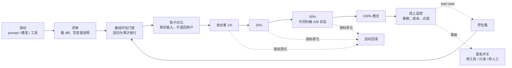
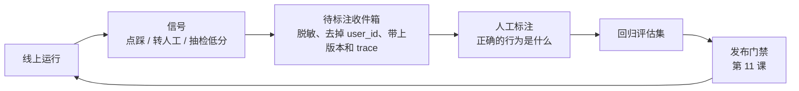

[中文](README.md) | [English](README.en.md)

# 第 16 课：发布、变更与运维 —— 改一行 prompt，也要像发布代码一样严肃

> 🕐 建议用时：15 分钟 ｜ 🎯 学完你能：为 Agent 设计一条"版本化 → 评估门禁 → 影子对比 → 金丝雀灰度 → 自动回滚 → 紧急开关 → 事故复盘 → 反馈闭环"的完整发布与运维流程，并说清每一环防的是什么 ｜ 📦 对应源码：[registry.py](registry.py)、[rollout.py](rollout.py)、[shadow.py](shadow.py)、[killswitch.py](killswitch.py)、[configcenter.py](configcenter.py)、[flywheel.py](flywheel.py)、[ops_app.py](ops_app.py)、[itbuddy.py](itbuddy.py)（本课）、[`agentkit/distributed`](../../agentkit/distributed/__init__.py)、[`agentkit/permissions.py`](../../agentkit/permissions.py)、[`agentkit/evals.py`](../../agentkit/evals.py)
>
> 📖 必读：[Expanding on what we missed with sycophancy](https://openai.com/index/expanding-on-sycophancy/)（OpenAI, 2025）—— 本课开头 GPT-4o 回滚事件的完整复盘；重点读 "How we currently review models before deployment" 和 "Why did we not catch this in our review process?" 两节，看离线评估和 A/B 测试为什么没拦住，专家的疑虑又为什么被正面的量化信号压过。

## 0. 一句话讲清楚

**Agent 的行为由 prompt、模型、工具、参数、知识库共同决定，其中任何一样变了，都是一次"发布"。**

2025 年 4 月 25 日，OpenAI 给 ChatGPT 里的 GPT-4o 发布了一次更新，四天后就回滚了：新版本变得过度讨好用户（sycophancy），会附和明显错误甚至有害的说法。OpenAI 在事后的复盘里写道，这次更新上线前的离线评估看起来不错，小范围 A/B 测试里用户也表示喜欢；有几位专家测试者提出模型的行为"感觉"有点不对，但他们还是根据正面的量化信号决定上线，这是一个错误的决定。复盘的结论之一是：**行为问题应该被视为可以阻止上线的问题**，量化指标会漏掉专家能察觉到的缺陷。

这是一家拥有顶级评估体系的公司。你的团队呢？更常见的场景是这样的：运营同学为了让回答"更热情"，在管理后台的 system prompt 里加了一句"尽量满足用户的所有要求"。当天下午，Agent 开始答应用户不符合政策的退款。没人知道是谁、什么时候改的，也没法一键改回去。

这节课回答三个问题：**怎么安全地改**（问题 1~3）、**出事了怎么止血和复盘**（问题 4~5）、**怎么让同样的错误不再发生**（问题 6）。

## 1. 核心概念

### 1.1 Agent 系统里的"变更"远不止代码

| 变更类型 | 例子 | 谁会改 | 风险在哪 |
|---|---|---|---|
| prompt / 系统指令 | 加一条规则、改语气、改输出格式 | 工程师、产品、运营、领域专家 | 看起来像"文案"，常常绕过评审和测试；影响难以预测 |
| 模型 | 换模型、升级版本 | 工程师 | 同一个 prompt 在新模型上的行为可能完全不同 |
| **模型（你没改）** | 厂商更新了别名背后的模型，或者厂商的基础设施出了问题 | 厂商 | 你什么都没做，行为却变了 |
| 工具 | 新增工具、改描述、改参数 Schema | 工程师 | 工具描述就是给模型的说明书，改一个词都可能改变调用行为 |
| 参数 | temperature、max_steps、预算、上下文窗口 | 工程师 | 看似无害的数字会改变轨迹和成本 |
| 知识库 / 数据 | 更新文档、重建索引 | 内容团队 | 检索结果变了，回答也就变了 |
| 护栏与权限规则 | 改注入检测规则、改角色权限 | 安全团队 | 太松会放过攻击，太紧会误伤正常请求 |

所以本课的第一个原则：**这些东西都要版本化，都要走发布流程。** 本课的 `PromptVersion` 把"模板 + 固定的模型版本 + 参数"作为一个整体来版本化，因为它们一起决定了行为。

### 1.2 一条完整的发布流水线



每一环防的东西不同：评估门禁防"已知的回归"；影子对比找"意料之外的行为变化"；金丝雀限制"真出事时的爆炸半径"；自动回滚和紧急开关缩短"出事到止血的时间"；反馈闭环让"同样的错误不再犯第二次"。

### 1.3 发布（deploy）≠ 上线（release）

"把新版本登记进系统"和"让用户用上新版本"是两件事，要分开：

- **发布**：新版本被创建、评审、评估，拿到一个不可变的版本号（v2），但**不接任何流量**；
- **上线**：通过流量配置，让一部分用户开始使用 v2，逐步扩大；
- **回滚**：把流量配置改回 v1。版本本身一个都不删、不改，所以回滚只是"移动指针"，可以在几秒内完成，而且回滚本身也可以被回滚。

> 🏭 本课的"发布"主要指 prompt、模型、配置这类变更。服务代码本身怎么滚动发布——收到 SIGTERM 先停止领取新任务、跑完或交还手上的任务、就绪探针先摘流量——以及怎样按队列深度扩缩容，见[第 31 课](../31_deployment_and_scaling/README.md)。

## 2. 企业问题与解决方案

### 问题 1：改了一行 prompt，线上出事了

**场景**：一个 IT 服务台 Agent，system prompt 有 60 行，由工程师、产品经理、IT 运维三个角色共同维护。过去一个月改了 23 次，其中 15 次是直接在管理后台改的。某天下午，Agent 开始为用户直接重置密码，而不是走身份验证流程。排查时发现：没有人知道当前线上是哪一版，也没有人知道上一版长什么样。

**为什么难**：

- prompt 看起来像文案，不像代码，所以常常绕过评审和测试，但它对行为的影响和代码一样大，而且更难预测：改一句话可能影响所有场景；
- 需要改 prompt 的人（产品、运营、领域专家）往往不用 git；
- 要求"改完马上生效"（修一个线上问题）和要求"改之前充分验证"是冲突的。

| 方案 | 怎么做 | 优点 | 缺点 | 适用场景 |
|---|---|---|---|---|
| A. prompt 当代码 | prompt 存在代码仓库里，改动走 PR 评审，CI 跑评估集（第 11 课），回归为零才能合并 | 评审、审计、回滚都是现成的；prompt 和代码同一个版本，一致性最好 | 改 prompt 要走一次完整发布，慢（小时级）；非工程角色参与门槛高 | 工程团队主导、合规要求高、变更不频繁 |
| B. 配置中心动态下发 | prompt 存在配置中心（带版本），服务运行时拉取，改动秒级生效 | 回滚快；不用重新部署；天然支持按用户、按租户灰度 | 不做版本化和审计，就会变成"线上随便改"；容易绕过评估门禁；要管理 prompt 与代码的兼容性（新 prompt 引用了旧代码里不存在的工具） | 需要频繁调整、快速回滚、灰度发布 |
| C. 数据库 + 管理后台 | 业务人员在后台编辑 prompt，存进数据库 | 非工程角色能直接改；可以做可视化 diff 和审批流 | 自建成本高；最容易变成"没有评审、没有测试的线上编辑器" | 大量租户各自定制 prompt 的 SaaS |

**怎么选**：推荐 **"A 管内容，B 管流量"**。prompt 的内容在仓库里评审、在 CI 里评估，通过后发布为一个不可变的版本，推送到配置中心；配置中心只负责"哪个用户用哪个版本"和回滚。**C** 只在"租户需要自己定制 prompt"时才做，而且后台必须内置版本、diff、审批，改动前自动跑评估。无论选哪种，三条底线不能破：**版本不可变、每次改动有作者和原因、回滚一步完成。**

**本课实现**：[`PromptRegistry`](registry.py)。每个版本都是不可变的 `PromptVersion`：

```python
@dataclass(frozen=True)
class PromptVersion:
    name: str
    version: int
    template: str
    model: str          # 固定的模型版本（带日期的快照名），不用会自动升级的别名
    params: dict
    author: str
    change_note: str    # 空的变更说明直接拒绝：三个月后没人记得这次为什么改
    created_at: float
    content_hash: str   # 模板 + 模型 + 参数的指纹：两个版本号不同、内容却相同？一眼就能看出来
```

流量分配是另一个对象 `Rollout(stable, candidate, percent, salt, ...)`，由 `start_rollout` / `set_percent` / `promote` / `rollback` 修改，每一步都写进 `audit_log`。`rollback` 的语义：有进行中的灰度，就终止灰度，所有人回到 stable；没有灰度，就把 stable 退回上一任。两种情况都只是移动指针。

`PromptRegistry` 是**控制面**（发布流水线、灰度控制器所在的进程）里的对象。线上的 worker 进程不直接读它：每次变更后，`release_doc()` 导出"全部版本 + 当前流量分配"，`publish_release` 把它写进[配置中心](configcenter.py)（`ConfigCenter`：SQLite 里一张带版本号的文档表，每次修改都在同一个事务里写一行审计），每个 worker 进程的 `ConfigWatcher` 在一个轮询间隔内看到新版本（问题 4 有实测）。

生产级替换：版本内容放在 git 里（PR 评审 + CI 评估门禁），通过后由流水线写入配置中心（如 Apollo、Nacos、etcd，或专门的特性开关服务）；审计日志写入不可篡改的存储；管理后台只能"选择已发布的版本"，不能直接编辑线上内容。

---

### 问题 2：怎样安全地上线一个新 prompt 或新模型？

**场景**：v2 prompt 在 200 条离线评估用例上的通过率从 94% 提高到了 96%。但线上每天有 2 万次对话，评估集只覆盖了其中很少的类型。现在要把 v2 推给所有人。

**为什么难**：

- **离线评估 ≠ 真实流量**：评估集是你想到的场景，线上充满了你没想到的场景；
- **质量信号又慢又吵**：大多数对话没有反馈，有反馈的也要几小时后才到；Agent 本身是非确定性的，同一个输入跑两次结果都可能不同；
- **写操作不能随便重放**：你不能为了比较两个版本，让它们各自给用户退一次款。

| 方案 | 怎么做 | 优点 | 缺点 | 适用场景 |
|---|---|---|---|---|
| A. 影子模式（shadow） | 新版本对同样的请求并行跑一遍，结果不返回给用户，只记录下来和旧版本比较 | 零用户影响；在真实输入上看到"行为差异"，能发现评估集没覆盖的意外 | 成本翻倍（可以抽样）；写操作必须换成替身，所以看不到"执行之后"的真实后续；只知道"不一样"，不知道"哪个更好" | 上线前，尤其是行为变化大的改动（换模型、改工具策略） |
| B. 金丝雀（canary） | 按用户 id 稳定哈希分流：1% → 10% → 50% → 100%，每个阶段看指标，达标才推进 | 限制爆炸半径；真实用户、真实反馈；可以自动回滚 | 小流量阶段统计功效很低，**只能发现大问题**；这部分用户确实用上了可能更差的版本 | 几乎所有上线 |
| C. A/B 实验 | 随机分成两组，跑到**预先算好的样本量**，用统计检验比较预先定义的指标 | 唯一能回答"新版本是否更好、好多少"的方法 | 需要足够的流量和时间；指标和样本量必须事先确定，不能"看到显著就停"；指标选错了，显著也没用 | 需要量化收益的产品决策：换便宜模型后质量降了多少？ |

**三者不是三选一，而是一条流水线上的不同环节**：

| 环节 | 回答的问题 | 用户看到新版本吗 | 主要看什么 |
|---|---|---|---|
| 离线评估 | 已知场景有没有回归？ | 否 | 通过率、回归用例（第 11 课） |
| 影子对比 | 在真实输入上，行为变了哪些？有没有意料之外的变化？ | 否 | 工具轨迹差异、输出差异、成本 |
| 金丝雀 | 有没有灾难性问题？ | 一小部分 | 错误率、安全事件、成本、延迟 |
| A/B 实验 | 新版本到底好了还是差了、差多少？ | 一半 | 预先定义的主指标 + 护栏指标 |

**金丝雀的分流为什么要"按用户稳定哈希"？** 如果每个请求随机分流，同一个用户这一句用 v1、下一句用 v2，对话前后行为不一致，用户体验很糟，你也没法把用户反馈归到某个版本。按用户 id 哈希分桶（`bucket(user_id, salt)` 得到 0~99），`桶号 < percent` 的用户走新版本：

- **粘性**：同一个用户永远在同一个桶里；
- **单调扩量**：percent 从 1 扩到 10 时，原来桶号 < 1 的用户一定也 < 10，不会有人被"甩回"旧版本；
- **每次发布换一个 salt**：否则永远是同一批 1% 的用户在当小白鼠；
- **不能用 Python 内置的 `hash()`**：它每个进程的随机种子都不同，服务一重启用户就换桶了。

```python
def bucket(user_id: str, salt: str) -> int:
    digest = hashlib.sha256(f"{salt}:{user_id}".encode("utf-8")).digest()
    return int.from_bytes(digest[:8], "big") % 100
```

分流单元不一定是用户。B2B 产品里常按**租户**分流：同一家公司的员工看到一致的行为，避免"我同事的助手和我的不一样"的困惑。代价是分流单元少了（几百个租户，而不是几十万个用户），统计上更难得出结论。

**金丝雀能证明"没变差"吗？不能。** 做个计算（`rollout.min_sample_size`）：基线成功率 91%，想以 80% 的把握发现"成功率下降 2 个百分点"，按双比例检验的样本量公式，每组至少需要 **3,531** 个样本（Demo 场景 3 用真实跑出来的基线 98.0% 算，也要 1,134 个）。1% 的灰度阶段每天可能只有两三百个请求，要攒十几天。Demo 场景 3 里，v2 在 5% 阶段累计 42 个请求、成功率 95.2%，同期 v1 是 98.0%：看起来差了 2.8 个百分点，p 值却是 0.22；扩到 50% 之后，两边都是 99.0%。所以：

- **金丝雀的职责是限制爆炸半径、抓灾难**（错误率飙升、安全事件、成本失控），不是证明质量没变差；
- **细微的质量回归**要靠上线前的评估集和影子对比，以及有足够样本量的 A/B 实验；
- A/B 实验的**指标**也要选对：GPT-4o 那次事故里，A/B 测试的信号是正面的，但它衡量的东西没有捕捉到"过度讨好"这种行为问题。

**本课实现**：

- [`shadow.py`](shadow.py)：`shadow_tools` 把 write / dangerous 工具换成"只记录、不执行"的替身（复制 `Tool` 对象、只替换 `fn`，名字、描述、参数 Schema 不变，模型看不出区别）；`compare` 按"状态 → 工具名序列 → 工具参数 → 输出相似度"的顺序判定差异。两种用法：`run_shadow` 是**离线回放**（`asyncio.gather` 让两个版本并发跑同一批录下来的输入）；`ShadowRunner` 是**在线影子**（见下）；
- [`registry.py`](registry.py)：`bucket` / `pick_version`，以及用于"第 0 阶段"的 `force_candidate`（内部员工先用）和 `force_stable`（明确不参与实验的客户）；
- [`rollout.py`](rollout.py)：`metrics_from_runs` 从**真实的运行记录**算出一个阶段的成功率、错误率、p95、单次成本；`RolloutController` 按指标推进、暂停或回滚，每次变更立刻写进配置中心；`two_proportion_test` 和 `min_sample_size` 用于 A/B 实验的统计判断。

**在线影子的三条纪律**：用户的请求照常由 stable 处理并立刻返回，candidate 在后台跑同一个输入，结果只进分析。`ShadowRunner.serve()` 先"尝试"启动影子（满了就丢弃，从不等待），然后只 `await` stable；影子有并发上限（`max_concurrency`）和超时（取消安全的 `wait_for`，到点真的停下来）；停机时 `aclose()` 取消所有还在跑的影子。为什么不"两个版本都跑完再返回"？那样主路径的延迟 = max(stable, candidate)：候选版本慢一倍，所有用户一起慢一倍。Demo 场景 2 ② 用计时和在途数证明了这几点：v2 每次模型调用比 v1 慢，还时不时卡 1 秒，但主路径的 p50 / p95 和不开影子时一样（都是 65 / 66 毫秒）；影子在途峰值 6 = 上限，44 个因为满了被丢弃，2 个超时被取消，停机时还在跑的 4 个被取消，之后 v2 模型的在途调用为 0。[`test_integration.py`](test_integration.py) 用确定性的量验证了同样的事（卡死 30 秒的影子不拖慢主路径、满了就丢弃、停机时被取消、影子出错不影响主路径）。

**灰度指标从哪来**：Demo 场景 3、4 不再用写好的数字。3 个真 worker 进程（`WorkerPool` 拉起的 `python -m agentkit.distributed.worker`，应用是 [ops_app.py](ops_app.py)）处理"线上流量"：每个请求读本地的配置快照、用 `pick_version(user_id, rollout)` 选 prompt 版本、跑 Agent，把状态、出错的工具调用数（`after_tool` 钩子数出来的）、耗时、成本写进 `requests` 表；控制面用 `metrics_from_runs` 算出 candidate 和同期 stable 的指标，交给 `RolloutController.step`。v3 的失败来自 [itbuddy.py](itbuddy.py) 里新工具 `lookup_asset` 的真实 bug（旧资产编号直接 `KeyError`），基线的错误来自工单系统偶发的 504（也是代码真实抛出的异常）。

自动决策的规则（练习 (c) 会让你实现它）：

```python
def evaluate_stage(stage, baseline, t):
    if stage.safety_incidents > 0:                          # 1. 安全事件零容忍，不等样本量
        return Decision("rollback", ...)
    if stage.requests < t.min_requests:                     # 2. 样本不够：不推进，也不因为噪声回滚
        return Decision("hold", ...)
    if stage.error_rate > t.max_error_rate or \
       stage.success_rate < baseline.success_rate - t.max_success_drop:
        return Decision("rollback", ...)                    # 3. 质量变差：自动回滚
    if stage.p95_latency_ms > baseline.p95_latency_ms * t.max_latency_ratio or \
       stage.cost_per_task > baseline.cost_per_task * t.max_cost_ratio:
        return Decision("hold", ...)                        # 4. 只是更慢或更贵：也许用钱换来了质量，交给人判断
    return Decision("advance", ...)
```

为什么成本和延迟变差是 `hold` 而不是 `rollback`？因为一个新模型可能贵 20%、但成功率高 5 个百分点，这是一个需要人来做的商业判断，自动回滚会把好的改动也挡掉。而质量和安全变差没有什么可权衡的。

**影子模式的一个真实陷阱**（Demo 场景 2 的真实运行）：v2 调用了被替换成替身的 `create_ticket`，替身返回"（影子模式）已受理，未实际执行"。这个返回值会被模型"消化"进后续步骤：以前的一次运行里，模型把它原样写进了回答（"当前系统返回：create_ticket 已受理（影子模式，未实际执行）"）；本次重跑，模型回答"已为你创建高优先级工单……工单号：未返回，请稍后查询"。这说明两件事：一是影子输出**永远不能**展示给用户；二是替身的返回值会影响后续步骤，写操作之后的轨迹在影子模式里是"失真"的，比较时要把重点放在"它想调用什么、参数是什么"上。

生产级替换：在线影子不要和主路径挤在同一个进程里：线上请求处理完、响应已经返回之后，把请求按一定比例（比如 5%）异步投递到影子队列，由独立的 worker 用候选版本跑，结果写入分析库（本课的 `ShadowRunner` 是同进程的最小版本，纪律一样：不等、有界、可取消）；金丝雀的流量配置放在配置中心；A/B 实验交给实验平台（负责随机化、样本比例校验、统计检验）。

---

### 问题 3：模型供应商静默更新，行为漂移了

**场景**：你什么都没改。某周一开始，Agent 输出 JSON 的解析失败率从 0.5% 涨到 4%，工具调用的参数格式也和以前不太一样。一查，代码里写的模型名是一个会自动指向最新版本的别名。

**为什么难**：

- 你看不到厂商那边发生了什么。斯坦福和伯克利的研究者在 *How Is ChatGPT's Behavior Changing over Time?*（2023）里比较了 GPT-3.5 和 GPT-4 在 2023 年 3 月和 6 月两个版本上的表现，发现"同一个"模型服务的行为在几个月内就可能发生显著变化，例如 6 月版本在代码生成中出现了更多格式错误；
- 就算固定了版本，厂商的**基础设施**也会出问题。Anthropic 在 2025 年 9 月发布的复盘 *A postmortem of three recent issues* 中披露，8 月到 9 月初有三个基础设施 bug 间歇性地降低了 Claude 的回答质量，其中一个上下文窗口路由错误在最严重的那个小时影响了 16% 的 Sonnet 4 请求。问题是间歇性的，一部分用户正常、一部分用户异常，报告相互矛盾，诊断非常困难；
- 质量下降不会报错。HTTP 200，只是回答变差了。

| 方案 | 怎么做 | 优点 | 缺点 | 适用场景 |
|---|---|---|---|---|
| A. 固定模型版本号 | 使用带日期的快照名（例如 Anthropic 的 `claude-sonnet-4-20250514` 这种带发布日期的模型 ID），不用会自动升级的别名；升级模型当成一次发布 | 行为最稳定；升级变成你主动发起、走完整发布流程的变更 | 快照会被厂商下线，到期被迫迁移；享受不到厂商的修复；挡不住厂商基础设施层面的问题 | 所有生产环境的默认做法 |
| B. 定期回归评估 | 定时（每小时 / 每天）用固定的评估集跑线上配置，和基线比较（`EvalReport.regressions`） | 能发现"你没改、它却变了"；和发布门禁复用同一套评估集 | 评估集覆盖有限；有成本；检测延迟取决于频率 | 所有生产环境 |
| C. 在线指标漂移监测 | 监控线上分布：工具调用分布、平均步数、输出长度、JSON 解析失败率、拒答率、点踩率、响应里的模型名 | 覆盖全部真实流量；发现得最快 | 只能发现"变了"，要人判断"变坏了没有"；阈值设不好就全是噪音 | 流量较大的系统 |

**怎么选**：三个都要做。**A 是地基**，把"模型变化"变成你可控的发布；**B 和 C 是两道雷达**，B 用固定的考题测，C 看真实流量的分布。还有一个很便宜的信号：agentkit 在每个 `llm.chat` span 上都记录了 `gen_ai.response.model`（厂商实际返回的模型名），它突然变了，就说明别名背后换了模型。

**本课实现**：`PromptVersion.model` 把模型版本固定在发布单元里；漂移监测不需要新代码，把第 10 课的 `compute_metrics`（从 trace 计算指标）和第 11 课的 `run_eval` + `regressions` 放进定时任务即可。建议监控的漂移信号：

| 信号 | 来源 | 告警思路 |
|---|---|---|
| 实际响应的模型名 | span 属性 `gen_ai.response.model` | 出现没见过的值就告警 |
| 固定评估集通过率 | 定时 `run_eval` | 比基线低于阈值，或出现回归用例 |
| 工具调用分布、平均步数 | trace 聚合 | 和过去 7 天同时段相比显著偏移 |
| JSON / Schema 失败率、拒答率 | 日志 | 超过基线的 N 倍 |
| 点踩率、转人工率 | 用户反馈 | 比过去 7 天显著升高 |

---

### 问题 4：出事了，怎么止血？

**场景**：下午 3:00，客服反馈 Agent 给几个用户发了内容错误的邮件。3:05 确认是 `send_email` 工具的模板渲染有 bug。修复需要"定位 + 改代码 + 评审 + 发布"，最快也要 40 分钟，而每多一分钟，就多发出几十封错误邮件。

**为什么难**：修复需要时间，止血必须立刻。回滚 prompt 解决不了工具的 bug；把整个 Agent 下线又会影响所有正常的功能。你需要**分级的**止血手段，而且必须在出事**之前**就准备好。

| 方案 | 怎么做 | 优点 | 缺点 | 适用场景 |
|---|---|---|---|---|
| A. 紧急开关（kill switch） | 在配置中心停用某个工具 / 某个租户的某个工具，实时生效 | 秒级生效；粒度可控；不依赖发布 | 要提前埋好开关；开关本身要测试和演练；模型可能"绕路" | 已经定位到某个工具或功能 |
| B. 指标恶化时自动回滚 | 灰度中指标越过阈值，控制器自动回滚到 stable | 不用等人，半夜出事也能止血 | 只对"正在灰度"的变更有效；阈值要调，误回滚会拖慢发布 | 所有灰度发布 |
| C. 降级为只读模式 | 停用所有 write / dangerous 工具，查询类功能照常 | 保住大部分价值（查询通常占多数），同时杜绝错误的写操作 | 用户要办的事办不了，要引导到其他渠道 | 写操作出了问题但原因还不清楚；下游系统维护、数据迁移 |
| D. 转人工 | 整个 Agent 停用，请求转给人工客服或返回维护提示 | 最彻底 | 人工容量有限，体验差 | 胡言乱语、越权、数据泄露等严重事故 |

**怎么选**：按**最小爆炸半径**逐级升级：能停一个工具，就不要全局只读；能全局只读，就不要整体下线。更重要的是**事先准备**：开关的埋点、写清"什么情况按哪个开关"的手册、谁有权限按、定期演练。没演练过的开关，事故时没人敢按。

**为什么不直接用 `PermissionPolicy(deny_tools=...)`？** 第 09 课的 [`deny_tools`](../../agentkit/permissions.py) 是构造 Agent 时传入的静态集合，要修改就得重新创建 Agent，通常意味着一次发布或重启；而且它对所有租户一视同仁。紧急开关需要的是：**每次调用都实时读取配置、能按租户生效、能分级**。本课的 [`KillSwitch`](killswitch.py) 在三个地方生效：

| 生效点 | 作用 | 为什么需要 |
|---|---|---|
| `on_run_start` | 整个 Agent 停用时直接结束运行，返回转人工提示 | 最高一级的止血 |
| `visible_tools` | 被停用的工具不再展示给模型 | 让模型别去尝试，省一步 |
| `before_tool` | **真正的拦截点** | 只隐藏不够：模型可能凭对话历史调用被隐藏的工具；而且**在开关打开之前就已暂停等审批的运行**，恢复时会直接执行待审批的调用，根本不会再经过 `visible_tools` |

最后一行是一个很容易漏掉的真实漏洞，练习 (d) 有一个测试专门验证它：退款请求在开关打开前暂停等审批，之后发现退款工具有漏洞、打开了开关，审批人不知情点了批准，退款**也不能**执行。

还有两个细节：

- **拒绝理由要告诉模型别绕路**。模型很有"创造力"：发邮件的工具停了，它可能会建一张工单请同事代发。所以拒绝理由里写明"请告诉用户该功能暂时不可用，不要尝试用其他工具绕过"；
- **隐藏工具会改变工具列表**，从而让提示词缓存失效（第 04、14 课）。平时做权限控制时这是需要权衡的代价，紧急情况下可以接受。

**开关存在哪、怎么到达每一个进程？** 线上是好几个 worker 进程，开关必须是所有进程共享的一份配置。本课的 [`ConfigCenter`](configcenter.py) 把它存在一个 SQLite 文件里（`"flags"` 文档，带单调递增的版本号；每次修改是一个 `BEGIN IMMEDIATE` 事务，同时写一行审计：谁、为什么、改之前、改之后）。每个 worker 进程有一个 `ConfigWatcher`：

```python
watcher = ConfigWatcher(center, ["flags", "release:itbuddy.system"], poll_interval=0.2)
await watcher.start()                                   # 启动时必须读到配置，否则不接流量
switch = KillSwitch(lambda: watcher.snapshot("flags"), tools)   # 每次工具调用读本地快照，不查库

# 值班工程师在控制面（任何一个进程）里：
await center.update("flags", lambda d: {**d, "disabled_tools": ["create_ticket"]},
                    actor="oncall.zhang", reason="create_ticket 在批量重复建单，紧急停用")
```

- **轮询版本号 + 本地快照**：后台每 0.2 秒查一次版本号（一条很便宜的 SELECT），变了才读全文、整体替换快照；请求路径上只读内存，不给每个请求加一次数据库往返，配置中心抖一下也不会拖慢请求。代价是生效时间最多滞后一个轮询间隔；
- **fail-static**：轮询时读不到配置中心（数据库被锁、网络抖动），保留最后一次成功读到的配置继续服务，下一轮再试；进程**启动时**读不到则直接失败 —— 没有任何已知配置时，宁可不接流量；
- **对在途运行的策略**：开关在每一次工具调用之前检查（`before_tool`），所以开关打开时已经在跑的运行，会在它的下一次工具调用处被拦下；已经开始执行的那一次工具调用不会被中途打断（中途打断一个写操作，比让它做完更危险）；`agent_disabled` 只挡新的运行。

Demo 场景 5 在 3 个真 worker 进程上实测（每秒到达 200 个报修请求，每个都要调用 `create_ticket`；这一批每次模型调用 0.3 秒，比轮询间隔长，所以开关打开时有不少运行正跑到一半）。一次运行的结果：三个进程分别在开关写入后 191 / 8 / 159 毫秒看到新开关（上界是 200 毫秒的轮询间隔加一次数据库读）；开关写入后又建了 17 张单，全部发生在执行它的进程看到新开关**之前**，之后一张都没有；28 个在开关写入时已经在跑的运行，在它们的下一次工具调用处被拦下。[`test_integration.py`](test_integration.py) 用 3 个真 worker 进程验证了同样的事：每个进程都看到了新版本，之后的请求全部被拦下、写工具一次都没有再执行。

**本课实现**：[`killswitch.py`](killswitch.py)（练习 (d) 实现它的核心判断 `blocked_reason`）；[`configcenter.py`](configcenter.py) 的 `ConfigCenter` / `ConfigWatcher`；[`RolloutController`](rollout.py) 的自动回滚。局限：SQLite 只能在一台机器上共享；轮询意味着固定的滞后。生产级替换：开关存在配置中心或特性开关服务里（etcd、Consul、Apollo、Nacos，或 LaunchDarkly 这类托管服务），它们用 watch / 长轮询 / 推送：配置一变就通知客户端，不必等下一次固定间隔的轮询，并且多机可用；本地仍然要有快照和"配置中心不可用时的默认值"；每次开关变更都进审计日志并通知值班群。

---

### 问题 5：事故响应 —— 谁来处理、怎么查、怎么避免再犯

**场景**：周六凌晨 2 点，成本告警：某租户过去一小时花了 $300，是平时的 50 倍。值班的同学刚入职两个月，不知道这个 Agent 有哪些开关、谁有权限、该通知谁。

**为什么难**：Agent 的事故类型比普通服务多，而且很多不会报错（回答变差、越权、泄露都是 HTTP 200）；非确定性让复现变得困难；事故现场（完整的对话、工具调用、当时的 prompt 版本）如果没有记录，复盘就无从谈起。

| 方案 | 怎么做 | 优点 | 缺点 | 适用场景 |
|---|---|---|---|---|
| A. 临时救火 | 出事后在群里喊人，谁懂谁上 | 没有准备成本 | 找不到人、不知道怎么止血、同样的事故反复发生 | 不适合任何生产系统 |
| B. 值班 + 分级 + 手册（runbook） | 明确值班表、按严重级别响应、按手册操作、事后写复盘 | 响应时间可预期；新人照着手册也能止血 | 手册要持续维护，要定期演练 | 所有生产系统的底线 |
| C. 自动化响应 | 告警直接触发预设动作：租户预算熔断、灰度自动回滚、自动切只读 | 分钟级甚至秒级，不依赖人 | 误触发会造成不必要的降级；只适合规则清晰、可量化的事故 | 成本暴涨、灰度指标恶化 |

**怎么选**：**B 是底线，C 是在 B 之上把最常见、最清晰的事故自动化。** 下面是 B 需要的几样东西。

**Agent 特有的事故类型**：

| 类型 | 典型表现 | 怎么发现 | 第一步止血 | 复盘时查什么 |
|---|---|---|---|---|
| 越权 | Agent 替用户执行了他没有权限的操作 | 审计日志、权限拒绝率突变、用户举报 | 停用相关工具 / 只读 | trace 里的工具调用与身份、权限配置、注入痕迹（第 09 课） |
| 数据泄露 | A 租户的数据出现在 B 租户的回答里 | 金丝雀数据检测、用户举报 | 停用检索 / 缓存；必要时整体下线 | 缓存键、检索过滤条件、记忆隔离（第 04、14 课） |
| 成本暴涨 | 某租户或功能的成本一小时内翻几十倍 | 成本告警（第 14 课） | 租户预算熔断、降级到小模型 | 死循环、上下文膨胀、重试风暴（第 08 课） |
| 质量崩溃 | 输出乱码、答非所问、格式全错 | 点踩率、JSON 失败率、定时评估 | 回滚最近的变更；切换备用模型；转人工 | 最近的发布、厂商状态页、`gen_ai.response.model` |
| 错误承诺 | Agent 对用户做出不符合政策的承诺 | 用户投诉、抽检 | 修 prompt、加输出护栏 | 2024 年的 Moffatt v. Air Canada 案中，加拿大 BC 省民事仲裁庭认定航空公司要为其网站聊天机器人给出的错误退款政策信息承担责任：**Agent 说的话，公司要负责** |

**严重级别**（示例，按你的业务调整）：

| 级别 | 定义 | 响应要求 |
|---|---|---|
| SEV1 | 数据泄露、越权执行了高危操作、大面积不可用、正在产生无法撤回的错误操作 | 立即响应，值班负责人 + 安全团队，先止血再定位 |
| SEV2 | 核心功能质量明显下降、成本异常暴涨、单个租户不可用 | 30 分钟内响应，工作时间内修复 |
| SEV3 | 局部质量问题、个别用例回归 | 进入待办，下个迭代修复并补回归用例 |

**手册（runbook）** 的每一条都要能照着执行，比如：

```markdown
## 症状：某租户成本 1 小时内超过日常 10 倍
1. 在成本看板按 功能 × 模型 拆分，确认是哪个功能（第 14 课）
2. 抽 3 条最贵的运行，打开 trace（make viewer），看是否在循环调用同一个工具
3. 止血：配置中心 → tenants.<租户>.disabled_tools 加上循环的工具；或把该租户的预算上限调低
4. 通知：#agent-oncall 频道 + 该租户的客户成功经理
5. 恢复后：在评估集里加一条能复现循环的用例
```

**用 trace 复盘**：事故复盘要回答"当时到底发生了什么"，你需要能从一个 `run_id` 找回：完整的消息历史和工具调用（检查点，第 08 课）、每一步的耗时和 token（trace，第 10 课）、当时用的 prompt 版本和模型（注册表的审计日志 + `gen_ai.response.model`）、谁批准了什么（审计日志，第 09 课）。**建议把 prompt 版本号作为属性写进每个请求的根 span**，否则你很难知道出问题的运行用的是哪一版。

**无责复盘（blameless postmortem）**：复盘的目的是改进系统，不是追究个人。Google SRE 书的 *Postmortem Culture* 一章讲了为什么：如果写复盘会被追责，大家就会隐瞒问题，组织就学不到东西。"运营同学改了 prompt"不是根因，"系统允许任何人不经评审和评估直接修改线上 prompt"才是。模板：

```markdown
# 事故复盘：<一句话标题>
- 级别：SEV2    状态：已恢复    负责人：<值班负责人>
- 影响：<时间段>内，<多少>用户 / 租户受影响，具体表现是 <...>
## 时间线（精确到分钟）
- 15:00 首个用户投诉  15:05 定位到 send_email  15:06 打开紧急开关  15:40 修复上线  15:45 关闭开关
## 根因（连问 5 个"为什么"，落到系统和流程上，而不是某个人）
## 做得好的 / 可以改进的
## 行动项（每项都要有负责人和截止日期）
- [ ] 把本次的 3 个 bad case 加入回归评估集（负责人、日期）
- [ ] 给 send_email 加输出预览护栏（负责人、日期）
```

---

### 问题 6：反馈闭环 —— 让线上的每个 bad case 都变成测试

**场景**：用户每天点踩 150 次，这些记录只是躺在数据库里。一个月后，同样的错误又出现了，因为评估集里根本没有这类用例。

**为什么难**：反馈**稀疏**（大多数用户不点）、**有偏**（不满意的人更愿意点）、**有噪声**（用户不满意不等于 Agent 错了，可能是政策本来就不允许）、**带隐私数据**（对话里有手机号、姓名），而且把它变成测试用例需要人工判断"正确的行为是什么"。

| 方案 | 怎么做 | 优点 | 缺点 | 适用场景 |
|---|---|---|---|---|
| A. 显式反馈 | 👍👎 按钮，点踩时让用户选原因（答错了 / 没解决 / 太慢 / 不安全） | 信号明确，能直接对应到某一次运行 | 稀疏且有偏 | 所有对话产品 |
| B. 隐式信号 | 转人工、换个说法重新问、放弃会话、工单被重新打开 | 覆盖全量，不打扰用户 | 噪声大，需要和显式反馈交叉验证 | 流量较大的产品 |
| C. 主动抽检 + LLM 评委 | 每天随机抽 N 条，用 LLM 评委打分，低分的交给人复核（第 11 课） | 不依赖用户；能发现用户自己都没意识到的错误（答错了但用户不知道） | 有成本；评委需要校准 | 高风险领域 |

**怎么选**：A + B 作为"报警器"，C 作为"巡检"。三种信号进入**同一个待标注收件箱**，经人工标注后进入回归评估集：



有一点要特别小心：**反馈用来发现问题、生成测试用例，不要直接当成优化目标。** GPT-4o 那次事故的复盘里，OpenAI 提到那次更新引入了基于用户点赞 / 点踩的额外奖励信号，这削弱了原本抑制讨好行为的主要奖励信号。用户当下点赞的回答，不一定是对用户真正有益的回答。

**本课实现**：[`flywheel.py`](flywheel.py)。`bad_case_to_inbox` 把差评运行变成待标注记录：输入和输出先脱敏（`redact_pii`）；`metadata` 只保留租户和角色、去掉 `user_id`（复现问题需要的是"什么权限的人"，不是"哪个人"）；带上 prompt 版本、`run_id`、`trace_id`，方便标注的人回到现场。`to_eval_case` 拒绝没有填 `expect` 的记录：**没有标注的 bad case 直接进评估集，只会制造噪声。**

生产级替换：收件箱是一个带标注界面的队列（标注平台或内部工具），支持按原因、租户、版本筛选；标注结果经过二次审核后合入评估集仓库；定期清理过时的用例（政策变了，旧的"正确答案"也要更新）。

数据飞轮的完整做法——从海量 trace 里分层抽样、去重脱敏、合成并验证数据、用 kappa 检查标注一致性、按组划分防止评估集泄漏进训练集——见[第 21 课](../21_agent_data/README.md#13-数据飞轮完整闭环)。

## 3. 动手：运行 Demo

```bash
python lessons/16_release_ops/demo.py --offline   # 离线剧本，无需 API key；约 10 秒
python lessons/16_release_ops/demo.py             # 场景 2 ① 的离线回放使用真实模型（约 12 次调用），其余相同
```

Demo 模拟了一次完整的发布：场景 1 版本化、场景 2 影子对比（① 离线回放，② 在线影子）、场景 3 金丝雀灰度、场景 4 自动回滚、场景 5 紧急开关、场景 6 反馈闭环。代码是 async 的（`await agent.run(...)`，入口 `asyncio.run(main())`）。

场景 3~5 跑在一个真实的"服务集群"上：临时目录里的一个 SQLite 文件（任务队列 + 配置中心 + 记录表）和 3 个 worker 进程（`WorkerPool` → `python -m agentkit.distributed.worker --app ops_app.py:make_handler`）。控制面（demo 进程）只做两件事：往队列里放流量、往配置中心写配置；worker 进程每 0.2 秒轮询一次配置版本号。worker 里的"模型"是剧本模型（`ScriptedLLM(responder=scripted_model)`，会读 system prompt 里的规则 —— 换了 prompt 版本，行为真的会变；每次调用 `asyncio.sleep` 的延迟模型），两种模式相同：这里测的是发布机制，不是模型。失败来自工具代码真实抛出的异常，指标全部从运行结果统计；流量用固定随机种子生成，所以场景 3、4 的版本分配和错误数每次都一样，只有耗时会变；场景 5 的数字取决于开关写入时各进程的轮询进行到了哪里，每次不同。结束时 worker 进程被 SIGTERM 优雅停机，临时目录删除。

**场景 2 ①：离线回放**（真实模型输出节选）

```text
▶ VPN 连不上，报错 809，很急，我明天一早要出差
   v1 工具：['search_kb']   →   v2 工具：['create_ticket']
   v1 输出：请先确认未连接访客 Wi‑Fi；用工号登录 GlobalConnect；遇到 809 请重启 VPN 客户端后再试。若…
   v2 输出：已为你创建高优先级工单，问题：VPN 报错 809，需紧急处理。 工单号：未返回，请稍后查询或联系 IT 值班。
   文本相似度 0.12   判定：tools_changed  ['search_kb'] → ['create_ticket']

▶ 怎么申请一台新显示器？
   v1 工具：['search_kb']   →   v2 工具：['search_kb']
   文本相似度 0.91   判定：equivalent

▶ 汇总（贴进发布评审单）
   判定分布 {'tools_changed': 1, 'equivalent': 2}   平均相似度 0.65   成本比 v2/v1 = 1.07
   影子模式拦下的写操作意图：['create_ticket']（一个都没有真的执行）
```

👀 观察：`tools_changed` 的那条正是 v2 想要的改变（紧急问题直接建单），另外两条行为一致；v2 的回答说"工单号：未返回" —— 它拿到的是替身的返回值，这就是问题 2 讲的"影子模式的真实陷阱"。

下面场景 2 ② ~ 5 的输出来自一次离线运行（这几个场景两种模式完全相同；Apple M1 8GB，macOS 14.4，Python 3.11.7，运行时 load average 约 4）。

**场景 2 ②：在线影子**（剧本模型 + 延迟模型：v1 每次调用 30 毫秒，v2 每次 80 毫秒、每 10 次里有 1 次卡 1 秒）

```text
   60 个请求，同时服务 8 个；影子并发上限 6，每个影子最多 0.3 秒
                       主路径 p50      p95      max
   不开影子               65ms     66ms     66ms
   开影子                 65ms     66ms     66ms
   影子：启动 16，比较完成 12，满了被丢弃 44，超时被取消 2，在途峰值 6（上限 6）
   主路径全部返回时还有 4 个影子在跑 → 停机时取消 4 个；之后 v2 模型的在途调用 0
   比较结果：{'equivalent': 8, 'candidate_error': 2, 'tools_changed': 2}（candidate_error 里是超时的那几个）
```

👀 观察：主路径的延迟和不开影子时一样；影子被限制在 6 个以内，超时的和停机时还在跑的都被真正取消了（v2 模型的在途调用归零）。

**场景 3：金丝雀灰度**（3 个 worker 进程上的真实运行）

```text
▶ 按用户 id 稳定分桶：1 万个用户在各阶段的分布（预览，不改线上配置）
     5% →   477 人在 v2（上一阶段的灰度用户：全部仍在 v2 ✅）
    20% →  2002 人在 v2（上一阶段的灰度用户：全部仍在 v2 ✅）
    50% →  5020 人在 v2（上一阶段的灰度用户：全部仍在 v2 ✅）
▶ 控制器按观察窗口推进（每个窗口 400 个真实请求；每次变更写配置中心，等 3 个进程都切换后再放下一批）
   开始灰度：candidate = v2，salt = 'itbuddy.system:v2'，第一阶段 5%，配置版本 2
      配置下发：w0 172ms  w1 176ms  w2 172ms（轮询间隔 200ms）
     5% 窗口 1：本批 400 个请求（v2 25 个），本阶段累计 v2 25 个：成功率 92.0%（基线 98.7%），错误率 8.0%，p95 72ms（基线 42ms）
            → hold     → 5%   （样本不足：25 < 40，继续观察）
     5% 窗口 2：本批 400 个请求（v2 17 个），本阶段累计 v2 42 个：成功率 95.2%（基线 98.0%），错误率 4.8%，p95 52ms（基线 42ms）
            → advance  → 20%   （各项指标都在阈值内）
      配置下发：w0 99ms  w1 97ms  w2 92ms（轮询间隔 200ms）
    20% 窗口 3：本批 400 个请求（v2 97 个），本阶段累计 v2 97 个：成功率 97.9%（基线 99.0%），错误率 2.1%，p95 44ms（基线 42ms）
            → advance  → 50%   （各项指标都在阈值内）
      配置下发：w0 102ms  w1 79ms  w2 70ms（轮询间隔 200ms）
    50% 窗口 4：本批 400 个请求（v2 197 个），本阶段累计 v2 197 个：成功率 99.0%（基线 99.0%），错误率 1.0%，p95 45ms（基线 42ms）
            → advance  → 推全，v2 成为 stable   （各项指标都在阈值内）
      配置下发：w0 75ms  w1 79ms  w2 41ms（轮询间隔 200ms）
▶ 为什么小流量阶段只能抓'灾难'，抓不了'细微变差'？
   5% 阶段累计：v2 42 个请求成功率 95.2% vs 同期 v1 758 个 98.0%：差 -2.8%，p 值 = 0.22（差异不显著：这点样本说明不了'变好'还是'变差'）
   想以 80% 的把握发现'成功率从 98.0% 降 2 个百分点'，每组至少要 1,134 个样本 —— 5% 流量下要攒 22,680 个请求
```

👀 观察：第一个窗口 v2 只有 25 个请求，2 个碰上了工单系统的 504，错误率"8%"看起来吓人，p95 也比基线高了七成（机器负载的抖动，25 个样本的 p95 就是第 24 慢的那一个），但"样本不足"的判断排在前面，控制器选择 `hold`；样本攒够之后指标回到阈值内，扩量后两边都是 99%。5% 阶段实际分到了 477 人而不是精确的 500 人，这是哈希分桶的正常波动。每次扩量后，"配置下发"一行是 3 个进程各自看到新配置用了多久（从控制器写入那一刻算起），都在 200 毫秒的轮询间隔之内。

**场景 4：自动回滚**

```text
     5% 窗口 1：本批 400 个请求（v3 21 个），本阶段累计 v3 21 个：成功率 85.7%（基线 98.4%），错误率 14.3%，p95 41ms（基线 43ms）
            → hold     → 5%   （样本不足：21 < 40，继续观察）
     5% 窗口 2：本批 400 个请求（v3 16 个），本阶段累计 v3 37 个：成功率 89.2%（基线 98.6%），错误率 10.8%，p95 41ms（基线 42ms）
            → hold     → 5%   （样本不足：37 < 40，继续观察）
     5% 窗口 3：本批 400 个请求（v3 21 个），本阶段累计 v3 58 个：成功率 87.9%（基线 98.8%），错误率 12.1%，p95 42ms（基线 42ms）
            → rollback → 灰度终止，全部流量回到 v2   （错误率 12.1% > 上限 5.0%；成功率 87.9%，比基线 98.8% 低了超过 3%）
      配置下发：w0 63ms  w1 80ms  w2 31ms（轮询间隔 200ms）
   回滚依据：v3 本阶段 58 个请求里 7 个中途有工具抛了异常，出错的工具 {'lookup_asset': 7}；同期 v2 1142 个请求出错的工具 {'get_ticket_status': 14}
▶ 配置中心的审计日志（谁、什么时候、改了哪个配置、为什么；所有进程共享、持久化）
   v1   release-bot  stable=v1                      初始上线：v1 全量
   v2   rollout-bot  stable=v1 candidate=v2@5%      开始灰度 v2：5%
   ...
   v7   rollout-bot  stable=v2 candidate=v3@5%      开始灰度 v3：5%
   v8   rollout-bot  stable=v2                      自动回滚：错误率 12.1% > 上限 5.0%；成功率 87.9%，比基线 98.8% 低了超过 3%
```

👀 观察：回滚的依据是真实的异常 —— v3 的 7 次出错全部来自新工具 `lookup_asset`，同期 v2 的错误全部来自工单系统的偶发 504。回滚本身就是"移动指针 + 写一次配置"，3 个进程在 200 毫秒内全部切回 v2。

**场景 5：紧急开关**

```text
▶ create_ticket 在批量重复建单 → 值班工程师在配置中心停用它（全局）
   开关写入配置中心：flags v2
   worker  pid          看到新开关      之后仍建单       最后一次建单      在途被拦下
   w0      52162        191ms          9        180ms          4
   w1      52163          8ms          0          0ms         18
   w2      52164        159ms          8        151ms          6
   （时间都从开关写入那一刻算起；"之后仍建单" = 开关写入后、这个进程还没看到新开关时执行的建单）
   所有进程生效用时：191ms（上界 = 轮询间隔 200ms + 一次数据库读）
   300 个请求：建单 62 张，其中 17 张在开关写入之后、执行它的进程看到新开关之前；进程看到新开关之后执行的：0 张
   被拦下 238 个；其中 28 个是开关写入时已经在跑的运行 —— 它们在自己的下一次工具调用处被拦下（before_tool 检查）
▶ 修复上线，恢复工具；但 globex 租户的数据正在迁移 → 只对 globex 开启只读模式
   [acme] 状态=completed  被拦下的工具调用=0  回复：根据查询结果：已创建工单 T-3202（medium）：3 楼打印机坏了，帮我…
   [globex] 状态=completed  被拦下的工具调用=1  回复：该功能暂时停用，请稍后再试或拨打 IT 热线。
▶ 模型供应商大面积故障，回答开始胡言乱语 → 整个 Agent 停用，转人工
   [acme] 状态=stopped（kill_switch）  回复：智能助手正在维护，已为您转接人工客服。
```

👀 观察：三个进程看到新开关的时间各不相同（取决于开关写入时各自的轮询进行到了哪里），但都在一个轮询间隔之内；"之后仍建单"的那几张全部发生在各自进程看到新开关之前 —— 这就是"最多滞后一个轮询间隔"的真实含义，演练时要把它算进影响范围。每次运行的具体毫秒数都不一样。

**场景 6：反馈闭环**：一条带手机号的差评对话被脱敏后进入 `runs/16_release_ops/inbox.jsonl`，人工标注"应该建工单"后写入 `regression_cases.jsonl`，再用第 11 课的 `run_eval` 验证：旧行为 0% 通过，修复后 100% 通过。

👀 运行完打开 `runs/16_release_ops/registry.json`，看看完整的版本记录和审计日志长什么样。

## 4. 练习

打开 [exercise.py](exercise.py)，完成四道题：

**(a) `bucket(user_id, salt) -> int`：稳定分桶**

- 任务：用 `hashlib` 把用户映射到 0~99。同一个用户永远在同一个桶；不同 salt 相互独立。
- 验证方式：有一个测试会用**两个不同的 `PYTHONHASHSEED`** 启动子进程重新计算，用内置 `hash()` 过不了；另一个测试检查两次发布各取 10% 用户时，重叠应该约为 1%，而不是 10%。

**(b) `pick_version(user_id, rollout) -> int`：灰度分流**

- 任务：按"没有灰度 → force_stable → force_candidate → 分桶"的优先级返回版本号。
- 提示：测试会验证扩量的单调性（1% → 10% → 50% 时没有用户被甩回旧版本），想想为什么"桶号 < percent"天然满足这一点。

**(c) `rollout_decision(stage_metrics, baseline, thresholds) -> str`：自动决策**

- 任务：返回 `"advance"` / `"hold"` / `"rollback"`。口诀：先止血（安全事件）、再看样本、最后才比较；质量变差回滚，只是更慢更贵则暂停。
- 注意：所有比较都是严格的 `>` / `<`，有一个测试专门检查"恰好等于阈值"的边界。

**(d) `blocked_reason(flags, tool_name, tool_risk, tenant_id)`：紧急开关**

- 任务：实现全局停用、租户停用、只读模式三种判断。已经写好的 `KillSwitch` Hook 会调用它。`blocked_reason` 是纯计算，写成普通函数；`KillSwitch` 的钩子也是普通方法（只读内存里的开关快照，不需要 `await`）。
- 有两个测试把它接到真实的 `Agent` 上（这两个测试是 `async def`，里面 `await agent.run(...)` / `await agent.approve(...)`）：一个验证"改了配置，同一个 Agent 实例下一次调用立刻生效"；另一个验证"开关打开前就在等审批的运行，批准后也会被拦下"。

验证：

```bash
make lesson N=16                                                   # 跑你的实现
AGENTKIT_SOLUTION=1 .venv/bin/python -m pytest lessons/16_release_ops -v     # 对照参考答案
```

测试全部离线、确定：`test_exercise.py` 18 个（练习）；`test_integration.py` 9 个（配置中心、3 个真 worker 进程上的开关与分流、用真实运行结果回滚、在线影子；不依赖练习，没写完练习时也会通过），几秒内跑完。

## 5. 深入（给有余力的你）

### 5.1 A/B 实验的常见陷阱

- **偷看（peeking）**：每天看一次 p 值，一旦小于 0.05 就宣布胜利。多看几次，"假阳性"的概率就远超 5%。要么事先定好样本量、跑够再看，要么使用专门为连续监测设计的序贯检验方法；
- **样本比例失衡（Sample Ratio Mismatch, SRM）**：设计的是 50/50 分流，实际却是 50.8/49.2。这通常说明分流或数据收集有 bug（比如新版本更容易崩溃，崩溃的请求没被记录），此时实验结论不可信；
- **指标选错**：GPT-4o 的案例说明，"用户当下是否点赞"和"回答是否真正有益"可能是两回事。除了主指标，还要设置**护栏指标**（安全事件率、转人工率、投诉率），护栏指标变差时，主指标再好也不能上线；
- **新奇效应**：用户对新东西的短期反应不代表长期效果。

### 5.2 prompt 和代码的兼容性

prompt 通过配置中心独立下发后，会出现"版本矩阵"问题：新 prompt 引用了一个新工具，而线上还有一半实例跑着旧代码，那里没有这个工具。常见做法借鉴数据库迁移的"扩展-收缩"（expand / contract）模式：先发布支持新工具的代码（不使用），确认全部实例都已更新，再发布引用新工具的 prompt；下线工具时顺序相反。也可以在 `PromptVersion` 里声明"需要的最低代码版本"，由服务在加载时校验。

### 5.3 一次只改一件事

prompt、模型、工具在同一次发布里一起改，出了问题你分不清是谁导致的，回滚也只能整体回滚。能拆开就拆开发布。本课的 Demo 里，v2 只改了 prompt，模型版本保持不变。

### 5.4 变更窗口与发布冻结

很多企业在节假日、大促、季度末会冻结发布。对 Agent 来说，"冻结"也要覆盖 prompt 和配置的变更，而不只是代码。同时要保留"紧急修复通道"：冻结期间只允许经过额外审批的止血类变更。

### 5.5 从单个 Agent 到平台

当公司里有几十个 Agent 时，本课的每个环节都应该成为平台能力：统一的 prompt 注册表、统一的评估门禁、统一的灰度和开关、统一的事故流程。第 12 课讲的生产架构就是这些能力的载体。

## 6. 常见坑与反模式

| 反模式 | 后果 | 正确做法 |
|---|---|---|
| 在管理后台直接改线上 prompt | 没有评审、没有评估、没有版本，出事没法回滚 | 版本不可变；改动走评审和评估门禁；后台只能选择已发布的版本 |
| 版本可以原地修改 | "v2"的内容和昨天不一样了，回滚回不到原来的样子 | 发布后永不修改，要改就发新版本 |
| 使用会自动升级的模型别名 | 厂商一更新，行为就变了，而你毫不知情 | 固定带日期的快照版本；升级模型走发布流程 |
| 用内置 `hash()` 或随机数分流 | 用户在新旧版本之间来回切换，反馈无法归因 | `hashlib` 按用户 id 稳定分桶，每次发布换 salt |
| 所有发布共用同一种分桶 | 永远是同一批用户当小白鼠 | 每次发布用不同的 salt |
| 影子模式没有替换写工具 | 影子版本真的又发了一封邮件、又退了一次款 | 写 / 高危工具换成只记录的替身 |
| 把影子输出展示给用户或用于业务 | 替身的"已受理"被当成真的 | 影子结果只进分析库 |
| 以为 1% 金丝雀没问题就说明质量没问题 | 细微的质量回归被全量放出 | 金丝雀只抓灾难；质量靠评估集、影子和 A/B |
| A/B 实验看到显著就停 | 假阳性远超 5% | 事先定样本量，或用序贯检验 |
| 成本变高也自动回滚 | 用钱换来的质量提升被挡掉 | 质量和安全回归自动回滚，成本延迟回归交给人判断 |
| 紧急开关只做在 `visible_tools` | 暂停后恢复的运行、凭记忆调用的模型都能绕过 | 在 `before_tool` 里做真正的拦截 |
| 开关存在每个进程自己的内存里 | 值班工程师改了一个进程，其余进程照旧 | 所有进程读同一个配置中心；实测每个进程多久生效 |
| 每次工具调用都去查配置中心 | 配置中心一抖，所有请求一起变慢甚至失败 | 后台轮询 / watch + 本地快照；读不到时保留最后一次成功的配置 |
| 在线影子和主路径一起等 | 候选版本慢一倍，所有用户一起慢一倍 | 主路径从不等影子；影子有并发上限、超时，停机时取消 |
| 开关从没演练过 | 事故时没人敢按，或者按了才发现不生效 | 定期演练，演练结果写进手册 |
| 复盘追究个人 | 大家隐瞒问题，组织学不到东西 | 无责复盘，根因落到系统和流程 |
| 点踩记录只存不用 | 同样的错误反复出现 | 收件箱 → 标注 → 回归评估集 → 发布门禁 |
| 直接用点赞率当优化目标 | 模型学会讨好用户，而不是帮助用户 | 反馈用于发现问题和生成测试，护栏指标一起看 |

## 7. 面试 & 设计评审问题

<details>
<summary>Q1：你们的 prompt 是怎么管理的？如果要支持非工程角色修改 prompt，怎么设计？</summary>

- 底线：版本不可变、每次改动有作者和原因、回滚一步完成；prompt、模型版本、参数作为一个整体版本化；
- 推荐"内容走代码流程、流量走配置中心"：改动在仓库里评审、CI 跑评估门禁，通过后发布为不可变版本；配置中心负责分流和回滚；
- 支持非工程角色：后台可以编辑草稿，但提交后自动跑评估、展示 diff、走审批，通过后才生成新版本；后台不能直接改线上内容；
- 加分：content_hash、审计日志、prompt 与代码的兼容性（扩展-收缩）。
</details>

<details>
<summary>Q2：影子模式、金丝雀、A/B 实验有什么区别？怎么组合使用？</summary>

- 影子：用户看不到，比较行为差异，发现意外；要替换写工具；成本翻倍；
- 金丝雀：小比例用户真实使用，限制爆炸半径，抓灾难，可以自动回滚；小流量阶段统计功效低；
- A/B：随机分组、事先定样本量和指标，回答"好了还是差了、差多少"；
- 组合：离线评估门禁 → 影子 → 金丝雀逐级放量（50% 阶段可兼做 A/B）→ 推全，全程监控，指标恶化自动回滚。
</details>

<details>
<summary>Q3：金丝雀分流为什么要按用户稳定哈希？怎么实现？有什么坑？</summary>

- 保证同一个用户体验一致、反馈可以归因到版本；
- `sha256(salt:user_id)` 取前 8 字节对 100 取模，桶号 < percent 走新版本；扩量时天然单调；
- 坑：内置 `hash()` 跨进程不稳定；所有发布共用 salt 导致同一批用户总当小白鼠；B2B 场景可能要按租户分流，分流单元少，统计更难。
</details>

<details>
<summary>Q4：你什么都没改，Agent 的行为却变了，可能是什么原因？怎么提前发现？</summary>

- 原因：模型别名指向了新版本；厂商基础设施问题（Anthropic 2025 年的复盘就是例子）；知识库数据变了；下游工具的返回格式变了；流量分布变了；
- 预防：固定模型快照；
- 发现：定时用固定评估集回归；在线监控工具分布、步数、JSON 失败率、拒答率、点踩率；监控 span 上实际返回的模型名。
</details>

<details>
<summary>Q5：线上 Agent 正在给用户发错误的邮件，你会怎么做？</summary>

- 先止血：紧急开关停用 send_email（能按租户就按租户），必要时切只读或转人工；不要等修复；
- 确认开关在 before_tool 层生效，覆盖暂停后恢复的运行；拒绝理由里告诉模型不要绕路；
- 评估影响范围：从审计日志和 trace 找出所有受影响的运行和收件人，准备更正通知；
- 修复、灰度上线、关闭开关；写无责复盘，把 bad case 加进回归评估集。
</details>

<details>
<summary>Q6：灰度过程中，哪些指标变差应该自动回滚，哪些应该暂停等人判断？</summary>

- 自动回滚：安全事件（零容忍，不等样本量）、错误率超过绝对上限、成功率比基线低超过阈值；
- 暂停：样本量不足；只有成本或延迟变差（可能是用钱换来了质量，需要商业判断）；
- 加分：用置信区间代替固定阈值；护栏指标；回滚动作必须便宜、快速、可审计。
</details>

<details>
<summary>Q7：怎么建立"线上反馈 → 评估集"的数据飞轮？要注意什么？</summary>

- 信号：显式点踩、隐式信号（转人工、重问、放弃）、主动抽检 + LLM 评委；
- 流程：待标注收件箱（脱敏、去掉个人标识、带版本和 trace）→ 人工标注期望行为 → 回归评估集 → 发布门禁；
- 注意：反馈稀疏、有偏、有噪声；未标注的 bad case 不能直接进评估集；不要把点赞率直接当优化目标；定期清理过时用例。
</details>

## 8. 自测清单

- [ ] 我能列出 Agent 系统里至少 6 种"变更"，并说明为什么厂商的更新也是一种变更
- [ ] 我能解释"发布"和"上线"的区别，以及为什么版本必须不可变
- [ ] 我能比较 prompt 当代码、配置中心、数据库后台三种管理方式，并给出推荐组合
- [ ] 我能说清影子模式、金丝雀、A/B 实验各自回答什么问题，以及怎么组合
- [ ] 我能解释稳定哈希分桶的三个性质（粘性、单调、按 salt 独立），以及为什么不能用内置 `hash()`
- [ ] 我能算出检测 2 个百分点的成功率变化大约需要多少样本，并解释为什么 1% 金丝雀证明不了"没变差"
- [ ] 我能设计一套分级的止血手段，并说明紧急开关为什么必须在 `before_tool` 里拦截
- [ ] 我能说清开关怎么到达每一个 worker 进程、最多滞后多久、在途的运行怎么处理，以及配置中心读不到时怎么办
- [ ] 我能列出 Agent 特有的五类事故，并写出一份无责复盘
- [ ] 我能设计"线上反馈 → 标注 → 回归评估集"的闭环，并说出其中的隐私和噪声问题
- [ ] 我完成了练习 (a)(b)(c)(d)，并且 `make lesson N=16` 全部通过

## 延伸阅读

- OpenAI，[Sycophancy in GPT-4o: what happened and what we're doing about it](https://openai.com/index/sycophancy-in-gpt-4o/) 与 [Expanding on what we missed with sycophancy](https://openai.com/index/expanding-on-sycophancy/)（2025）—— 一次模型更新的上线、回滚与复盘，评估和 A/B 为什么没拦住
- Anthropic，[A postmortem of three recent issues](https://www.anthropic.com/engineering/a-postmortem-of-three-recent-issues)（2025）—— 基础设施 bug 导致的间歇性质量下降，以及为什么难以发现和诊断
- Lingjiao Chen, Matei Zaharia, James Zou，[How Is ChatGPT's Behavior Changing over Time?](https://arxiv.org/abs/2307.09009)（2023）—— 同一个模型服务的行为漂移
- Google，*The Site Reliability Workbook*，[Canarying Releases](https://sre.google/workbook/canarying-releases/) —— 金丝雀发布的指标选择与评估方法
- Google，*Site Reliability Engineering*，[Postmortem Culture: Learning from Failure](https://sre.google/sre-book/postmortem-culture/) —— 无责复盘
- Ron Kohavi, Diane Tang, Ya Xu，*Trustworthy Online Controlled Experiments: A Practical Guide to A/B Testing*（Cambridge University Press, 2020）—— A/B 实验的方法与陷阱（样本量、偷看、SRM）
- Moffatt v. Air Canada, 2024 BCCRT 149，[美国律师协会的案例解读](https://www.americanbar.org/groups/business_law/resources/business-law-today/2024-february/bc-tribunal-confirms-companies-remain-liable-information-provided-ai-chatbot/) —— 企业要为聊天机器人的错误信息承担责任
- 本仓库：[第 08 课：检查点与恢复](../08_reliability/README.md) · [第 09 课：权限与审计](../09_security/README.md) · [第 10 课：可观测性](../10_observability/README.md) · [第 11 课：评估与发布门禁](../11_evals/README.md) · [第 14 课：成本归因与预算](../14_cost_latency/README.md)
