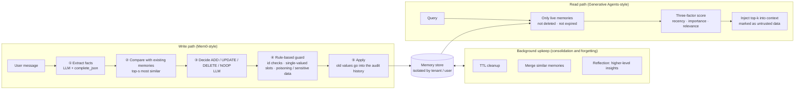
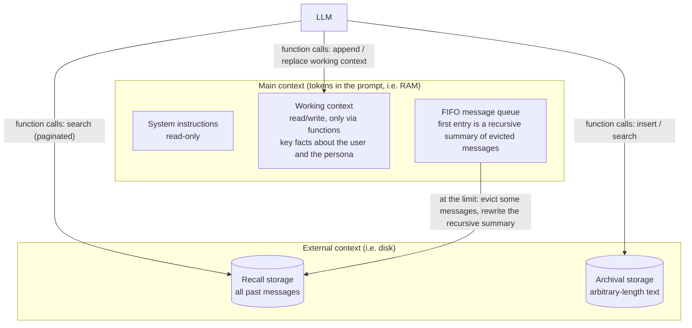

[中文](README.md) | [English](README.en.md)

# Lesson 18: Advanced memory systems — from notebooks to MemGPT / Mem0

> 🕐 Suggested time: 20 minutes ｜ 🎯 After this lesson you can: explain why append-only memory rots; build a memory system that still "remembers who you are now" across sessions, using Mem0-style writes (ADD / UPDATE / DELETE / NOOP), Generative Agents-style retrieval scoring, and MemGPT-style tiered memory; and meet the enterprise requirements of viewing, correcting, deleting, and poisoning defense ｜ 📦 Source: [`memory_kit.py`](memory_kit.py), [`agentkit/memory.py`](../../agentkit/memory.py) (baseline), [`agentkit/workflows.py`](../../agentkit/workflows.py) (`complete_json`)
>
> 📖 Required reading: [Mem0: Building Production-Ready AI Agents with Scalable Long-Term Memory](https://arxiv.org/abs/2504.19413) (Chhikara et al., 2025) — the prototype of this lesson's write path (extract → compare → ADD / UPDATE / DELETE / NOOP). Focus on the two-phase pipeline in §2.1, then read §4.3–§4.5: compared with "full context", a memory system wins some and loses some on accuracy, latency, and tokens.

> 📍 This lesson is part of **Part 3: Advanced** (concepts → build from scratch → exercises). It maps to the Memory topic in week 4 of CS329Z; we recommend pairing it with that course's public required reading, [MemGPT](https://arxiv.org/abs/2310.08560) (Packer et al., 2023). MemGPT is also Lesson 04's required reading; §2.7 of this lesson reads its memory hierarchy closely again.
>
> 🧭 **Prerequisites**: [Lesson 04](../04_context_memory/README.en.md) covered context-window strategies, an "append-only, keyword-search, tenant-isolated" `MemoryStore`, and the right to be forgotten; [Lesson 05 §5](../05_agent_architectures/README.en.md#5-memory-architecture) covered the episodic / semantic / procedural taxonomy. This lesson doesn't repeat them and goes straight to **how to design a memory system**.

## 0. In one sentence

**The hard part of memory isn't remembering, it's changing your mind: when a user moves, changes their diet, or corrects an allergy, the agent has to know which memories no longer count.**

Lesson 04's `MemoryStore` is like a diary you can only append to: every new fact gets a new line on the last page. Production memory is more like a **personal file that someone maintains**: when a new message arrives, you check the file first, then decide whether to add an entry, rewrite one, cross one out, or leave it alone. Every change leaves a trace, and temporary information expires.

This lesson's demo runs the whole thing on one concrete user. Over 4 months, Alice talks to her company's assistant 5 times:

| Session | Alice says | Append-only notebook | Maintained file |
|---|---|---|---|
| 1 | I'm a backend engineer in Shanghai, vegetarian, allergic to peanuts | Writes 5 lines | Creates 5 entries |
| 2 | Started working out, **no longer vegetarian**, eating fish and chicken now | Adds 2 more lines; the "vegetarian" line stays | Rewrites the "diet" entry |
| 3 | **Moved to Shenzhen**; on a business trip in Beijing this week | Adds 2 more lines | Rewrites "city" (the second real run missed it, see §2.3); stores the trip with a 7-day expiry |
| 4 | **Changed jobs**, now at an AI startup | The real model split this sentence into 4 facts; all appended | Merged into a single rewrite |
| 5 | The allergy is **actually mango**, not peanut; **stop remembering** the workout stuff | Adds 2 more lines | Deletes "peanut", adds "mango", deletes "workout" |

In session 6 she asks: "I want to take a new colleague to dinner this Saturday. Recommend a restaurant and remind me what to watch out for when ordering." In the real run (gpt-5.5), the notebook has 16 lines by now, with Shanghai and Shenzhen, vegetarian and not, peanut and mango all lying side by side. The file has only 6 entries, and all 5 retrieved ones are current. Keyword search over the notebook returns just two lines: the job, and "on a business trip in Beijing this week" from three months ago. Based on that, the model recommended **a roast duck restaurant in Beijing**. That happened in both real runs.

(Demo output in this document is translated from Chinese.)

## 1. Core concepts

### 1.1 How append-only memory rots

| Symptom | Example from the demo | Consequence |
|---|---|---|
| **Duplication** | "changed jobs", "at an AI startup", "works on an agent platform", "no longer writes backend code": the real model split one sentence into 4 facts | Fills up the top-k slots and crowds out other memories |
| **Contradiction** | "user is vegetarian" and "user is no longer vegetarian" both exist | The model has to guess which one is newer; retrieval may even return only the old one |
| **Staleness** | "on a business trip in Beijing this week", from three months ago | Treated as current; a Beijing restaurant gets recommended |
| **Bloat** | 16 entries after 5 sessions, hundreds after a year | Injecting everything gets too expensive, so you must retrieve; distractors pile up and recall gets worse |
| **Incomplete deletion** | The user said "stop remembering the workout stuff", but the "started working out" line is still there | A privacy promise broken |

On top of that sits Lesson 04's old problem: keyword search only matches literal text, so "吃素" (eats vegetarian) doesn't match "素食" (vegetarian food) ([Lesson 04 §2.6](../04_context_memory/README.en.md#26-long-term-memory--external-storage--retrieval--injection)). Retrieval quality itself belongs to [Lesson 17](../17_retrieval_quality/README.en.md). This lesson focuses on something else: **even with perfect retrieval, an append-only store hands you a pile of facts that contradict each other.**

### 1.2 The whole picture: write path, read path, background upkeep



MemGPT takes a different route: instead of managing memory for the agent from the outside, it splits memory into tiers and **lets the agent manage them itself with tools** (§2.7).

### 1.3 A few terms

- **Extraction**: distilling self-contained facts from a conversation, e.g. "the user is allergic to mango". In plain words: turning a chat log into index cards.
- **Slot (key)**: a category for a fact, such as city, diet, or allergy. A **single-valued slot** holds one value at a time (a person lives in one city), so a new value necessarily invalidates the old one.
- **Soft delete / hard delete**: a soft delete only marks an entry as "no longer valid" and keeps the original text for auditing; a hard delete actually erases it from storage. "This is out of date" calls for the former; "please delete my data" requires the latter.
- **Consolidation**: merging and summarizing scattered, duplicated memories into fewer, cleaner ones.
- **Core / archival / recall memory**: MemGPT / Letta's tiers. Core memory always sits in the context; archival memory is an external knowledge store; recall memory is the full, searchable conversation history.
- **Reflection**: periodically having the model draw higher-level conclusions from a batch of memories, and storing those conclusions as memories too.
- **Lineage**: derived data records "which original memories I came from", so it can be deleted when they are.

## 2. Building it from scratch

### 2.1 Data model: what a memory has beyond Lesson 04

```python
@dataclass
class MemoryRecord:
    id: str
    text: str
    key: str = "other"            # slot: the rule-based guard uses it to detect conflicts
    importance: float = 5.0       # 1-10, used in retrieval scoring; "allergy" matters more than "likes blue"
    created_at: float = 0.0
    updated_at: float = 0.0
    last_accessed: float = 0.0    # recency is computed from this
    expires_at: float | None = None  # TTL: short-lived facts expire automatically
    sources: list[str] = ...      # lineage: which sessions / memories this came from
    status: str = "active"        # active / deleted (soft delete)
    history: list[dict] = ...     # every change: {op, old, new, at, reason, source}
```

Each field answers one symptom from §1.1: `key` fights contradictions, `expires_at` fights staleness, `history` makes "changing your mind" traceable and reversible, and `sources` lets deletions cascade.

### 2.2 Mem0-style writes: extract → compare → decide

The Mem0 paper (Chhikara et al., 2025) splits a write into two phases, and this lesson implements it the same way:

1. **Extraction phase**: the input is the newest message pair, plus a summary of the whole conversation and the last m messages (the paper uses m = 10). An LLM outputs a set of candidate facts. The summary is refreshed periodically by an asynchronous module, so it doesn't block the conversation.
2. **Update phase**: for each candidate fact, vector search retrieves the s most similar existing memories (the paper uses s = 10). An LLM then picks one of four operations through function calling: **ADD** (no equivalent memory exists), **UPDATE** (augment or rewrite an existing memory), **DELETE** (the new information contradicts it), or **NOOP** (no change needed).

The core of [`FactMemory.observe`](memory_kit.py) is exactly these steps:

```python
facts = self.last_facts = self._extract(message, now)            # ① extract (complete_json guarantees structure)
if not facts:
    return []
live = [r for r in store.values() if r.is_live(now)]
candidates = self._candidates(facts, live)                        # ② top_s most similar entries per fact
if not candidates:                                                #    nothing to compare with: it can only be ADD
    ops = [MemoryOp("ADD", None, f.text, f.key, f.importance, f.ttl_days, "new user / new topic") for f in facts]
else:
    ops = self._decide(message, facts, candidates, now)           # ③ LLM decides
ops = self._guard(ops, store, now)                                # ④ rule-based guard
results = self.apply_fn(store, ops, now=now, new_id=self.new_id)  # ⑤ apply (Exercise b)
```

A few design decisions:

- **Why two model calls instead of one?** Extraction only looks at the message; the decision also needs existing memories. Split this way, the extraction prompt stays short and stable, and the decision input contains only relevant candidates. You can also use different model sizes for the two steps. The cost is an extra call (in 2026 Mem0 itself moved to a single call, see §5.1).
- **Why `complete_json`?** The decision gets executed by code, so it must be a reliable data structure. [`complete_json`](../../agentkit/workflows.py) validates against a Pydantic model and sends errors back to the model to fix ([Lesson 06](../06_orchestration/README.en.md)).
- **Why show the model short ids like "0" and "1"?** It's a small trick from Mem0's open-source code (the code comment calls it anti-hallucination): ask a model to copy a UUID and it may copy it wrong or make one up. Short ids get mapped back to real ids in code.
- **Skip the decision call when the store is empty.** The only possible decision is ADD, so there's no point paying a model to say so.
- **Only things the user said can be written.** `observe(..., source_type="document")` is rejected outright, without even calling the model (Lesson 04's first anti-poisoning principle).

> 💡 **An easy-to-miss number**: in the Mem0 paper's LOCOMO results, **putting the entire conversation into the context (full-context) actually has the highest accuracy** (LLM-as-judge score 72.9% vs. 66.9% for Mem0). What the memory system buys you is 91% lower p95 latency (17.1 s → 1.4 s) and over 90% fewer tokens. **A memory system is first of all a cost and latency optimization, not a free accuracy win.**

### 2.3 The rule-based guard: the model understands, rules hold the line

Before the model's decisions reach the store, they go through deterministic checks (`FactMemory._guard`):

| Check | Rule | What it prevents |
|---|---|---|
| id validation | UPDATE pointing at a nonexistent memory → turn it into an ADD and re-check; DELETE pointing at a nonexistent memory → ignore | Made-up ids, ids of deleted records |
| Single-valued slots | City / job / diet / name already has a value but the model ADDs a second one → turn it into an UPDATE | The model "forgot" to update, leaving two cities in the store |
| Temporary-fact exemption | Facts with a TTL ("on a business trip in Beijing this week") never trigger single-valued replacement | The rule itself overwriting the home city with a trip destination |
| Duplicates | Same slot and similarity ≥ 0.85 → NOOP | The same thing recorded several times |
| Content safety | Instruction-like content, secrets, national ID numbers, bank card numbers → not written | Poisoning, sensitive data in memory |
| Degradation | Decision call fails (gateway 5xx, JSON still invalid after repairs) → treat every fact as ADD, then apply the rules above | Memory writes grinding to a halt when the model is unavailable |

The offline script deliberately makes the "model" treat the move as an ADD in session 3, so you can watch the guard catch it:

```text
▶ Session 3｜2026-03-06｜Alice: Just so you know, I moved to Shenzhen last week, I live in Nanshan. Oh, and I'm on a business trip in Beijing this week.
   FactMemory decisions:
     UPDATE 「User works in Shanghai」→ 「User has moved to Nanshan, Shenzhen」  reason: new home (rule: single-valued slot conf…
     ADD    「User is on a business trip in Beijing this week」 applied  reason: temporary plan
     🛡 Guard: single-valued slot city already holds「User works in Shanghai」; ADD「User has moved to Nanshan, Shenzhen」→ changed to UPDATE
```

To be honest, this rule didn't fire in either real run, for two different reasons. The second run happened to expose its blind spot:

- **First run**: session 1 labeled "user works in Shanghai" with the `city` slot, and in session 3 the model produced the correct UPDATE on its own. No guard needed.
- **Second run**: session 1 labeled the same sentence with the `other` slot. In session 3 the model ADDed "moved to Shenzhen" and left "works in Shanghai" untouched. The guard only looks at slots, and the city slot had no old value, so it noticed nothing. The file ended up with "works in Shanghai" and "lives in Shenzhen" both alive. We got lucky: it ranked 6th in retrieval, missed the top 5, and the answer was still correct. That's why the demo now has a "self-check" step that inspects all live memories, not just the retrieved ones.

"Works in Shanghai" was actually invalidated **indirectly**. It doesn't literally contradict "lives in Shenzhen" (living in Shenzhen and working in Shanghai isn't impossible). What really made it stale was the job change in session 4, and in that step the model only updated the job slot. **The guard depends on structure (slots) produced by the model. When the structure is wrong, the rules are blind.** Mitigations: give slot definitions and examples in the extraction prompt; periodically have a strong model read through all of a user's memories and flag stale ones (the "offline upkeep" in §2.8); and cover "indirect invalidation" explicitly in your eval set. The guard exists for smaller, cheaper models (the write path often uses them to save money) and for occasional slips. It isn't a cure-all.

**Rules can't replace the model.** "I was wrong about the peanut allergy, it's actually mango" is beyond any rule: allergy is a multi-valued slot, and a person can perfectly well be allergic to both. Only by understanding "I was wrong" do you know to DELETE the peanut entry. Conversely, the model can't replace the rules: it occasionally invents ids or forgets to update. **The model handles semantics, the rules hold the line.** That's the central division of labor in this lesson's code.

### 2.4 UPDATE and DELETE don't overwrite (Exercise b)

When [`apply_ops`](memory_kit.py) executes decisions, **UPDATE writes the old value into `history`, and DELETE only sets `status` to `deleted`**:

```text
[diet] User is no longer vegetarian, eats fish and chicken  (active, sources session-1, session-2)
    2026-01-05 ADD     — → User is vegetarian
    2026-02-04 UPDATE  User is vegetarian → User is no longer vegetarian, eats fish and chicken
[allergy] User is allergic to peanuts  (deleted, sources session-1)
    2026-01-05 ADD     — → User is allergic to peanuts
    2026-05-05 DELETE  User is allergic to peanuts → —
```

Why not just overwrite?

1. **Memories go wrong**: a model might read "I don't eat cilantro" as "I'm not vegetarian" and UPDATE away a correct memory. With history, you can find which session changed it and why, and change it back.
2. **"What it used to be" is information too**: "moved from Shanghai to Shenzhen" says more than "lives in Shenzhen". A recommendation could mention "your old friends in Shanghai", for example.
3. **The industry is moving this way**: the Mem0 paper's graph variant (Mem0g) marks outdated relationships as invalid rather than physically removing them; Zep's temporal knowledge graph records when each fact became true and when it stopped being true, and when a contradiction appears it sets the old fact's invalidation time instead of deleting it (§2.8).

But **a soft delete is not the right to be forgotten**. When a user says "please delete this information about me", you must delete it physically, including the original text in `history`. These are two separate interfaces: DELETE in `apply_ops` means "this is out of date"; `FactMemory.forget` means "delete my data" (§2.9).

### 2.5 Generative Agents-style retrieval scoring (Exercise a)

Generative Agents (Park et al., UIST 2023) gives each memory three scores and adds them up:

- **Recency**: exponential decay over the number of game hours since the memory was last retrieved, with a decay factor of 0.995.
- **Importance**: the model rates each memory from 1 to 10 when it's written. 1 is mundane ("brushing teeth, making bed"); 10 is poignant ("a break up, college acceptance").
- **Relevance**: cosine similarity between the memory's embedding and the query's.
- Each score is min-max scaled to [0, 1]; all three weights α are 1; the sum ranks the memories.

The implementation in [`score_memory`](memory_kit.py):

```python
age = max(0.0, now - record.last_accessed)           # clock skew can make age negative
parts = {
    "recency": 0.5 ** (age / half_life),              # halves every half-life
    "importance": (min(10, max(1, record.importance)) - 1) / 9,
    "relevance": min(1.0, max(0.0, relevance)),
}
score = sum(w.get(k, 0.0) * v for k, v in parts.items()) / total_w
```

It departs from the paper in two places, both on purpose:

- **Half-life instead of a decay factor**: 0.995 per hour is a half-life of about 138 hours (ln 0.5 / ln 0.995 ≈ 138.3). "Recency halves every 30 days" is easier to understand and tune than "multiply by 0.995 every hour".
- **Absolute normalization instead of min-max**: min-max rescales within the candidate set. With just two candidates, one is always 0 and the other always 1, so a tiny difference becomes a huge one. Scores also can't be compared across queries, so you can't set a threshold like "don't inject anything below 0.3". With absolute normalization, each factor has a fixed meaning, and dividing by the sum of weights keeps the total in [0, 1].

From the real run (30-day half-life, equal weights):

```text
▶ Default: equal weights, 30-day half-life (recency halves every 30 days)
   Memory                                             Recency Import. Relev.  Score
   User is allergic to mango                          0.50    1.00    0.00    0.500
   User changed jobs, now works on an agent platfo…   0.25    0.67    0.04    0.319
   User's name is Alice                               0.03    0.78    0.00    0.270
   User moved to Shenzhen last week, lives in Nans…   0.12    0.67    0.00    0.264
   User is no longer vegetarian, eats fish and chi…   0.06    0.56    0.00    0.206
   User works in Shanghai                             0.03    0.56    0.00    0.196
```

The question is "recommend a restaurant; what should I watch out for when ordering". It contains neither "allergy" nor "mango". The allergy memory's **relevance is 0**, so pure retrieval is guaranteed to miss it, the same disease as Lesson 04's "吃素 vs 素食". But the model rated its importance 10, and three-factor scoring put it first. **Importance is insurance for memories that are literally unrelated but costly to miss.** Also note the last row: the leftover stale fact from §2.3, "User works in Shanghai", ranks 6th, one place away from the top 5.

### 2.6 Reflection: from facts to insights

Facts alone aren't enough. Generative Agents' reflection works like this: it triggers when the summed importance of recent events exceeds a threshold (150 in the paper's implementation), roughly two or three times a day. Taking the 100 most recent records, the model first proposes the 3 most salient high-level questions, uses them to retrieve memories, and then distills 5 insights, each of which must **cite the memories that support it**. Insights are stored as memories too, and you can reflect on top of insights, forming a "reflection tree": leaves are observations, and nodes get more abstract as you go up.

[`FactMemory.maybe_reflect`](memory_kit.py) implements a simplified version: it triggers when the accumulated importance of newly written memories crosses a threshold, requires each insight to carry `evidence` (memory ids), and **discards any insight without evidence**, because an "insight" without evidence is a hallucination. The real run produced two:

```text
🧠 The user's career and life have shifted from Shanghai to Nanshan, Shenzhen, and she now works on an agent platform at an AI startup; future suggestions should favor local Shenzhen and AI agent product/platform contexts.
   Evidence: User changed jobs, now at…; User moved to Shenzhen last…; User works in Shanghai
🧠 The user no longer eats vegetarian and can have fish and chicken, but must strictly avoid mango and anything containing it.
   Evidence: User is allergic to mango; User is no longer vegetarian, eats…
```

The first insight correctly read the leftover "User works in Shanghai" as the past: here, reflection patched up a temporal relationship the write path had missed. That's also why the "periodic read-through" in §2.8 works.

The evidence chain has a second use: **cascading deletion**. When Alice deletes her "job" memory, the first insight, which cites it, must go too, or her career information would "come back to life" through the insight. `forget` follows `sources` to find every derived memory and hard-deletes them together:

```text
▶ ③ Right to be forgotten: Alice deletes the "job" entry in the memory settings page → insights citing it must go too (lineage cascade)
   forget(m03) hard-deleted 2 entries: User changed jobs, now works at an AI…; The user's career and life have shifted from…
```

### 2.7 MemGPT / Letta-style tiered memory: let the agent manage it

FactMemory manages memory for the agent from the outside. MemGPT (CS329Z's required reading for this week, and Lesson 04's) takes a different view: **treat the context window as RAM and external storage as disk, and let the model page things in and out itself, like an operating system.** The structure from the paper:



- When the prompt exceeds a "warning token count" (the paper's example: 70% of the context window), the system inserts a "memory pressure" warning into the queue so the model can save important information to working context or archival storage in time. When it exceeds the "flush token count" (e.g. 100%), a batch of messages is evicted (e.g. 50% of the window), and a new recursive summary is generated from the old summary plus the evicted messages. Evicted messages stay in recall storage and can be brought back through function calls.
- The model can include `request_heartbeat=true` in a function call to request another inference step right away, chaining several calls together (e.g. paging through search results).
- On the "deep memory retrieval" (DMR) task (5 sessions of conversation, then a question in session 6), GPT-4's accuracy went from 32.1% to 92.5% and GPT-4 Turbo's from 35.3% to 93.4%. The baselines saw a lossy summary of the 5 previous sessions. This lesson's demo ("5 sessions + a question in session 6") follows the same setup.

MemGPT's open-source implementation later became Letta. Letta calls the working context **core memory**, made up of **memory blocks**, each with a label, a description, a value, and a character limit. Its older tools were `core_memory_append` / `core_memory_replace` / `archival_memory_insert` / `archival_memory_search` / `conversation_search`; newer versions switched to `memory_insert` / `memory_replace` / `memory_rethink`.

This lesson's implementation ([`CoreMemory`](memory_kit.py), [`memgpt_tools`](memory_kit.py), [`CoreMemoryHook`](memory_kit.py)):

```python
core = CoreMemory({"human": ("Key facts and preferences about the user", 120), "persona": ("Your identity and style", 80)})
archival = MemoryStore()                                   # archival memory reuses Lesson 04's MemoryStore
tools = memgpt_tools(core, archival)                       # core_memory_append / core_memory_replace / archival_insert / archival_search
agent = Agent(llm, tools, system_prompt=PROMPT, hooks=[CoreMemoryHook(core, archival, PROMPT)])
agent.run("……", metadata={"tenant_id": "acme", "user_id": "alice"})   # identity only comes from metadata → ctx
```

Design decisions:

- **Refresh the system message on every step** (`CoreMemoryHook.before_llm`): if the model edits memory in one step, it sees the result in the next. The cost: once the system message changes, the prompt cache is invalidated from that point on ([Lesson 04 §2.5](../04_context_memory/README.en.md#25-prompt-caching-why-a-stable-prefix-saves-money-and-latency--optional-but-important-in-the-enterprise)). So core memory must stay small and shouldn't change too often.
- **Show "used / limit" characters when rendering**, e.g. `<human chars="42/120">`. This is a simplified version of MemGPT's "memory pressure" idea: let the model see how much room is left. When a write would exceed the limit, the tool returns an error the model can act on: "condense with core_memory_replace first, or move details to archival memory with archival_insert".
- **Core memory is the most expensive place in the whole system to get poisoned**: it's spliced into the system prompt and read as top-priority context on every turn. So every write goes through `detect_injection` and sensitive-data checks, and is recorded in the audit history (who, when, old value, new value), so it can be rolled back with `rollback` if something goes wrong.
- **Identity comes from `ctx`**, so the model has no way to choose whose memory to edit (Lesson 03, principle 4).

A few behaviors from the real runs (gpt-5.5) are worth noting:

1. **It never does partial replacements; it always rewrites the whole block**: across the two runs there were 8 `core_memory_replace` calls, and every `old_content` was the entire block while `new_content` was the whole revised block (the demo's audit summary shows these as `rewrite`). That works, but the bigger the block, the more likely the model mistypes one character and the replacement fails; and every rewrite is a chance to drop something else "along the way". The old values in the audit history exist for exactly this case.
2. **It follows the rules**: temporary information like the business trip went into archival memory, not core memory; it never recorded the workout in the first place. Core memory peaked at 47/120 characters and never hit the limit, which is why the offline script specifically demonstrates what happens at the limit.
3. **In both runs, it archived "taking a new colleague to dinner this Saturday" on its own in session 6.** Nobody asked it to, but it is a useful episodic memory. The quality of MemGPT-style memory depends on how diligent and disciplined the model is.

### 2.8 Consolidation and forgetting: time decay, merging, TTL (Exercise c)

Memory can't be write-only. Common techniques:

| Technique | What it solves | This lesson | Industry practice / risks |
|---|---|---|---|
| **Time decay** | Old memories naturally weigh less | Recency in `score_memory` | MemoryBank (Zhong et al., 2023) borrows the Ebbinghaus forgetting curve, forgetting or reinforcing memories based on elapsed time and significance. Risk: stable, important facts (allergies) shouldn't decay, so combine it with importance |
| **Merging** | The same thing recorded as several entries | Exercise (c) `consolidate` | Keep the latest value + all sources. Risk: chained merges (A looks like B, B looks like C, but A and C are different things), so restrict merges to the same slot and use a high threshold |
| **Summarization** | Compress many small memories into a few key points | Reflection (§2.6) | MemGPT's recursive summary; Zep builds a "community" subgraph over entities for high-level summaries. Risk: summaries are lossy, and they're derived data that must cascade on deletion |
| **TTL** | Short-lived information expires | `expires_at`, `purge_expired` | Tell two TTLs apart: **how long a fact is true** (a one-week trip) and **how long data may be kept** (compliance requires deletion after 90 days). The first stops being retrieved when it expires; the second must be physically deleted |
| **Offline upkeep** | Upkeep without slowing the conversation; catching stale memories the write path missed | —— | Periodically have a strong model read through all of a user's memories and flag stale, contradictory, or duplicated entries (this is what rescues §2.3's indirect invalidation). Letta's sleep-time agents reorganize and improve memory during idle periods (based on the Sleep-time Compute paper, Lin et al., 2025). You can also run it asynchronously in Lesson 13's job queue |

### 2.9 Enterprise concerns: where memory is more dangerous than a knowledge base

Lesson 04 covered three hard requirements: isolation, the right to be forgotten, and poisoning defense ([Lesson 04 §2.8](../04_context_memory/README.en.md#28-three-hard-requirements-for-enterprise-memory)). Once memory can rewrite itself, a few more things need attention:

| Problem | Why memory systems are especially risky | This lesson | What else production needs |
|---|---|---|---|
| **Memory poisoning** | One write takes effect in every future session. MINJA (Dong et al., 2025) injects malicious records into an agent's memory through **ordinary queries alone**, with a reported average injection success rate of 98.2%. Lesson 04's SpAIware is a real-world case | Only what the user said can be written; injection / sensitive-data checks before writing; core memory writes go through the same checks | Tiered write approval; changes to high-risk slots (payout account, mailing address) must be confirmed by the user in the UI; retrieved memories are isolated as untrusted data ([Lesson 09 Problem 1](../09_security/README.en.md#problem-1-a-knowledge-base-document-hides-malicious-instructions-meant-for-the-ai)) |
| **Cross-tenant leaks** | Reflection, merging, and caching all create derived data; any place without a tenant key leaks | `FactMemory.store(tenant, user)` is the only entry point; tool identity comes from `ctx` | Enforced filtering at the storage layer; vector indexes partitioned by tenant ([Lesson 15 Problem 2](../15_enterprise_rag/README.en.md#problem-2-how-do-you-isolate-tenants-in-a-vector-index), [Lesson 09 Problem 6](../09_security/README.en.md#problem-6-company-a-sees-company-bs-data)); tests for isolation |
| **User can view and delete** | Users can't correct what they can't see | `export` lists all memories with their change history; `forget` hard-deletes with cascade | Deletion must cover vector indexes, summaries, caches, logs, and backups. OpenAI's help docs specifically warn that deleting a chat does not delete the memories saved from it. Derived data is that easy to miss |
| **Correcting wrong memories** | A wrong memory gets read out again and again, each time "confidently" wrong | `correct` (source marked `user_edit`); `CoreMemory.rollback`; audit history | Lock user-edited memories so automated flows can't overwrite them; alert on memory write metrics (a spike in UPDATE / DELETE ratio) |
| **Privacy** | Memory **generates new personal information**: reflection can infer "possibly pregnant" from "often searches for baby products". Importance scoring also surfaces sensitive memories in unrelated conversations | The extraction prompt forbids recording sensitive data and third-party private information; when the user says "don't remember this", the original record is deleted | Sensitive categories (health, religion, politics, sexual orientation) are not extracted or reflected on by default; inferred attributes are usually personal information too and should be viewable and deletable in the same way |

The real run has a very concrete privacy lesson: Alice said "stop remembering the workout stuff", and FactMemory deleted that record; but in the "append-only + inject everything" baseline, "User recently started working out" was still sent to the model verbatim. **A deletion promise only counts if the deletion actually happens in storage.**

### 2.10 Comparison: choosing among four memory designs

| Design | How it stores | Write cost | Read cost | Strengths | Weaknesses | Good for |
|---|---|---|---|---|---|---|
| **A. Raw log** (Lesson 04's `MemoryStore`; MemGPT's recall storage) | Append raw messages or raw facts | Nearly zero | Inject everything: grows linearly with entries; retrieval: only as good as retrieval | Loses nothing, auditable by nature; with dates, strong models can often sort out contradictions on their own (§3) | Contradictions, staleness, and duplicates all land on the reader; keeps growing | Few memories; compliance requires keeping originals; the underlying "source of truth" for other designs |
| **B. Extracted fact store** (the Mem0 paper; this lesson's `FactMemory`) | Each entry is a standalone fact; add / update / delete is decided at write time | 1–2 model calls per message (small models work) | Low: few, clean entries | What you read is (mostly) the current state; fewest tokens (demo: 91 vs. 219 tokens) | Extraction errors lose information; "indirectly" stale facts slip through (§2.3); overwriting updates destroy history (hence the audit trail) | User profiles for personal assistants and customer support; preferences |
| **C. Tiered (MemGPT / Letta)** | Core memory in context; archival and recall outside | Tool calls inside the conversation loop add tokens and latency every turn | Core memory needs no retrieval; archival must be searched by the model | The most important information is always in view; the agent decides what to remember per task | Depends on a diligent, disciplined model; a frequently changing system message lowers the cache hit rate | Long-lived companion agents; long tasks for a single agent |
| **D. Knowledge graph** (Zep / Graphiti; Mem0g) | Entities + relations + time; contradictions invalidate old edges | Highest: entity extraction, disambiguation, relation merging | Graph traversal + search; strong at multi-hop queries | Multi-hop and temporal reasoning ("which company was she at before she moved"), relationships across entities | Complex; in the Mem0 paper the graph variant gained only about 2% accuracy while p95 latency went from 1.44 s to 2.59 s | Enterprise memory with many intertwined entities: customers, contracts, contacts, tickets |

**How to choose**:

- A user has only a few dozen memories and doesn't talk often: **A + inject everything at session start + include dates**. It's the simplest, and this lesson's real runs show a strong model handles it well.
- Memories keep growing and are about "this person's preferences and state": **B**. Put writes in an async queue (Lesson 13), extract with a small model, and keep the audit history.
- The agent itself is a long-running "personal assistant" that should decide what to remember: **C**, with the essentials of B in core memory (the fact store maintains, core memory displays).
- You need to answer "who is related to whom, and when did that change": **D**, and build and govern it like a knowledge base (Lesson 15).

Real systems often combine them: A as the immutable source of truth (so you can replay when something goes wrong), B or D as indexes derived from A, and C deciding what enters the context.

## 3. Hands-on: run the demo

```bash
.venv/bin/python lessons/18_memory_systems/demo.py --offline   # offline script, no API key needed
.venv/bin/python lessons/18_memory_systems/demo.py             # real model (~10 FactMemory calls + 3 answers + a dozen or so for the MemGPT agent)
.venv/bin/python lessons/18_memory_systems/demo.py --only 5    # run only experiment 5 (MemGPT-style agent)
```

Five experiments: ① the same extraction results, append-only vs. FactMemory; ② recall and answers in session 6; ③ the three-factor score, broken down; ④ viewing, reflection with cascading deletion, correction, TTL, and poisoning defense; ⑤ a MemGPT-style agent managing its own core memory across 6 sessions.

Excerpt from a real run (gpt-5.5), experiment 2:

```text
▶ A append-only + keyword top-5: 2 memories (~34 tokens)
     [2026-04-05] User now works at an AI startup
     [2026-03-06] User is on a business trip in Beijing this week.
▶ B append-only + inject everything: 16 memories (~219 tokens)
▶ C FactMemory top-5: 5 memories (~91 tokens)

▶ Per-slot grading (✅ current only / ⚠️ old and new side by side, the model must guess / ❌ current value missing)
                              City          Diet          Allergy       Job           Workout (asked to forget)
   A append-only + keyword    ❌ old only   ❌ missing    ❌ missing    ✅ current    ✅ absent
   B append-only + all        ⚠️ both       ⚠️ both       ⚠️ both       ⚠️ both       ❌ still there
   C FactMemory top-5         ✅ current    ✅ current    ✅ current    ✅ current    ✅ absent

▶ Give each set of memories to the model and ask the same question
   【A append-only + keyword top-5】
     🤖 If you're in Beijing, "Siji Minfu Roast Duck" is a safe bet for a Saturday dinner — book ahead. When ordering: ask about dietary restrictions/allergies, balance meat and veg, go easy on spicy and heavy dishes.
   【B append-only + inject everything】
     🤖 Try "Dian Dou De" at Coastal City in Nanshan, Shenzhen — Cantonese dim sum, relaxed and good for a new colleague. When ordering: avoid mango desserts/drinks and tell the staff in advance; also ask your colleague about restrictions and allergies.
   【C FactMemory top-5】
     🤖 Try "Runyuan Siji Coconut Chicken" at Shenzhen Bay MixC — good for dinner with a new colleague, with plenty of fish and chicken. Reminder: you're allergic to mango, so skip mango drinks/desserts/sauces and tell the server in advance.
```

**What to look for**:

1. **A fails at retrieval**: the question and the memories share no literal words, so keyword search only finds the job and the three-month-old trip. The model faithfully used what it could see: it recommended a Beijing roast duck restaurant and didn't mention the allergy at all.
2. **B is a counterintuitive result**: all 16 contradictory memories went in, and gpt-5.5 still got it right, in both runs. It reads the dates, understands "correction: not peanut but mango", and knows that "this week" three months ago is long over. This is exactly the bet behind Mem0's 2026 move to "ADD only, reason at read time" (§5.1). But B's cost is right there in the output: 2.4 times C's tokens, growing linearly with the number of memories, and the workout information the user asked to forget still went to the model.
3. **C resolves most contradictions at write time**: all 5 retrieved memories are current, with the fewest tokens. But check the "self-check" at the end of experiment 1: in the second run, a stale "User works in Shanghai" survived (§2.3).
4. **Sessions 2 and 4 in experiment 1**: the real model split one sentence into 2 and 4 facts respectively (Lesson 04 saw this kind of splitting too), so the append-only store bloated quickly; FactMemory's decision step merged each batch into a single UPDATE. **Extraction granularity is unstable, and the decision step doubles as deduplication.**
5. **Run the same demo twice and you get different results**: slot labels, fact splitting, and the wording of insights all change. That's why memory systems need an eval set rather than "it looked right once, ship it" (§5.2).
6. **Experiment 5**: notice that the model always rewrites the whole core memory block (§2.7), and the audit summary at the end.

(The offline output is scripted, but the extract → compare → decide → guard → store data flow is exactly the same as in a real run. The offline script copies several behaviors from real runs, such as the 4-way split in session 4 and how group B answers, and it deliberately stages one model mistake in session 3 to demonstrate the guard.)

## 4. Exercises

Open [`exercise.py`](exercise.py) and implement three functions:

| # | Function | Key points |
|---|---|---|
| (a) | `retrieval_score(memory, query_relevance, now, half_life, weights)` | Normalize each factor to [0, 1], then take a weighted average; clamp clock skew and out-of-range inputs; raise `ValueError` on invalid weights |
| (b) | `apply_memory_ops(store, ops, *, now, new_id)` | Execute ADD / UPDATE / DELETE / NOOP; nonexistent or deleted ids return `not_found`; a duplicate ADD only merges sources; UPDATE / DELETE write the old value into the audit history, and DELETE is a soft delete |
| (c) | `consolidate(memories, similarity_fn, threshold)` | Merge memories in the same slot with similarity ≥ threshold (similarity is transitive); keep the latest value and all sources; don't mutate the input |

```bash
make lesson N=18
# or: .venv/bin/python -m pytest lessons/18_memory_systems -v
```

All 14 tests run offline. One integration test plugs your `apply_memory_ops` into `FactMemory` and runs two full sessions with a script standing in for the model. Stuck? Reread §2.4 and §2.5 first, then look at [`solution.py`](solution.py).

## 5. Going deeper (if you have time)

### 5.1 Mem0 itself gave up on UPDATE / DELETE

In April 2026, Mem0 released a new memory algorithm. According to its official blog, the old algorithm made two model calls: extract first, then reconcile against existing memories; that reconciliation step was slow, and overwrites sometimes wiped out key information from the original fact. The new algorithm uses **a single call that only ADDs**: when information changes, both the old and new facts are kept, and the retrieval stage (fusing semantic, keyword, and entity scoring) plus the reader work out how things evolved. The new prompt in the open-source code states that ADD is the only operation, and requires relative times like "last week" to be resolved into concrete dates. The company reports gains of more than 20 points on both benchmarks it cites (vendor-reported; treat with care).

This matches group B's real result in §3: **a strong model plus a complete, dated history** can resolve contradictions at read time. The trade-off between the two approaches:

| | Resolve at write time (this lesson's FactMemory, the Mem0 paper) | Resolve at read time (Mem0 2026, raw log + dates) |
|---|---|---|
| Writing | Expensive (reconciliation), can update or delete the wrong thing | Cheap, loses nothing |
| Reading | Cheap and clean | Larger context; depends on a strong enough reader |
| Deletion / privacy | Deleted content is already gone from the "current view" | You must separately guarantee that "forget this" content is really deleted |

This lesson takes a middle path: the current view resolves at write time, while `history` keeps every old value. You get part of both benefits.

### 5.2 Can memory benchmarks be trusted?

- **LoCoMo** (Maharana et al., ACL 2024) and **LongMemEval** (Wu et al., ICLR 2025) are the two most common. LongMemEval tests five abilities: information extraction, multi-session reasoning, temporal reasoning, **knowledge updates**, and abstention; it reports that commercial chat assistants and long-context LLMs show about a 30% accuracy drop when memorizing information across sustained interactions.
- Letta ran an experiment: an agent with nothing but file-reading and grep tools, on GPT-4o mini, scored 74.0% on LoCoMo, above the 68.5% Mem0 reported for its graph variant. Their conclusion was that agent capabilities matter more than the memory tools themselves, and that current memory benchmarks may not be very meaningful.
- The MemGPT paper reports 93.4% on DMR for GPT-4 Turbo + MemGPT; the Zep paper reports 94.8%.
- Every vendor's numbers are self-reported, under different setups. **The only thing you can rely on is an eval set built from your own data**: label "what is asked in session N → what should and shouldn't be recalled", with particular coverage of **updates** and **deletions** ([Lesson 11](../11_evals/README.en.md)).

### 5.3 Memory is just files

CS329Z's topics for this week include "externalized memory using file systems". Anthropic's Claude API offers a client-side memory tool (`memory_20250818`): the model reads and writes a `/memories` directory through the commands view / create / str_replace / insert / delete / rename, and your application implements the storage entirely. The security advice in the official docs matches this lesson's conclusions: **prevent path traversal** (`/memories/../../secrets.env`), strip sensitive information, cap file sizes, and periodically delete memory files that haven't been accessed in a long time. The CLAUDE.md / AGENTS.md files from Lesson 05 belong to this category too, except they hold procedural memory.

### 5.4 Shared memory across agents

Mem0's API scopes memories along three dimensions: `user_id`, `agent_id`, and `run_id`. When agents share memory, answer three questions: who can write (one injected sub-agent can poison every agent's memory); who wrote what you're reading (sources should carry the agent's identity); and whom to trust in a conflict (what the user said > what the user confirmed > what an agent inferred).

### 5.5 At scale

- **Asynchronous writes**: 1–2 model calls per message can't sit on the response path. Put them in a queue (Lesson 13) and process each user's writes serially; otherwise two messages reconciling concurrently cause lost updates.
- **Cost**: extraction and decisions can use small models, but monitor their error rates. Sample some writes for review by a larger model or a human.
- **Metrics**: memories per user, the ADD / UPDATE / DELETE ratio, the fraction of memories ever retrieved (memories that are never retrieved are cleanup candidates), and the number of user corrections (the most direct signal of memory quality).

## 6. Common pitfalls and anti-patterns

| Pitfall | Consequence | Do this instead |
|---|---|---|
| Implementing UPDATE as a plain overwrite | When the model gets it wrong, you can't find out or undo it | Write the old value into `history`; make DELETE a soft delete |
| Answering "delete my data" with a soft delete | The original text is still there; compliance risk | The right to be forgotten uses hard deletion + cascade (`forget`) |
| Trusting ids from the model | Wrong records updated, ids made up | Map short ids; check that the id exists and isn't deleted |
| Relying on rules alone to detect conflicts | Corrections like "I was wrong" go unnoticed; a trip destination replaces the home city | Rules only hold the line; temporary facts don't trigger single-valued replacement |
| Refreshing recency on retrieval (`touch=True`) without limits | Rich get richer: frequently retrieved memories stay "fresh" forever and crowd out new information | For user facts, base recency on "last confirmed / updated"; if you refresh at all, refresh only what was actually used |
| Scoring importance only once at write time | Something trivial back then becomes important later ("the new colleague is Wang" — who later becomes your direct manager) | Allow UPDATE to adjust importance; re-evaluate during reflection |
| Insights from reflection without evidence | Hallucinations become "memories"; deletion can't cascade | Require cited evidence; drop anything without it |
| No write checks on core memory (which enters the system prompt) | Poisoning is promoted straight to system instructions | Write checks + audit + rollback |
| Automatically writing tool output, web pages, or email content into memory | The main entry point for memory poisoning | Only record what the user explicitly said (the `source_type` check) |
| Resolving at read time without handling deletion requests | Content the user asked to forget still gets injected into context | Delete in storage; don't rely on a prompt saying "don't mention it" |

## 7. Interview & design review questions

<details>
<summary>Q1: What goes wrong with append-only long-term memory? Give examples.</summary>

- Duplication: one sentence gets split into several entries, the same thing is recorded many times, and top-k slots get used up;
- Contradiction: old and new values coexist ("vegetarian" / "not vegetarian"); the model has to guess, and retrieval may return only the old one;
- Staleness: short-lived information ("on a business trip this week") is treated as current;
- Bloat: with many entries, injecting everything is too expensive, and retrieval faces more and more distractors;
- Incomplete deletion: content the user asked to forget is still there.
- Remedies: resolve at write time (extract → compare → add/update/delete) or at read time (complete history + dates + a strong model), plus TTL, merging, and auditing.
</details>

<details>
<summary>Q2: Describe Mem0's write pipeline. Why show the model short ids instead of real ones?</summary>

- Extraction phase: new message + conversation summary + recent messages → the LLM extracts candidate facts;
- Update phase: for each candidate fact, retrieve the s most similar existing memories → the LLM picks ADD / UPDATE / DELETE / NOOP via function calling;
- Short ids: models copy long UUIDs wrong or make them up; short ids are mapped back to real ids in code, and an unmappable id means the model invented it, which the guard then handles;
- Also worth mentioning: the paper's data shows memory systems mainly buy large reductions in latency and tokens, not higher accuracy than full context; in 2026 Mem0 switched to ADD-only.
</details>

<details>
<summary>Q3: How does Generative Agents score memories for retrieval? How would you adapt it for an enterprise assistant?</summary>

- Recency (decays by 0.995 per hour) + importance (LLM-rated 1–10) + relevance (embedding cosine), each min-max normalized, added with equal weights;
- Adaptations: absolute normalization instead of min-max (scores comparable across queries, thresholds possible); express decay as a half-life; for user facts, base recency on "last updated / confirmed" rather than "last retrieved"; set a floor for categories that shouldn't decay (allergies, compliance requirements); keep sensitive memories out of unrelated contexts even if they're important.
</details>

<details>
<summary>Q4: What are MemGPT's memory tiers? What are the risks of letting the agent manage its own memory?</summary>

- Main context: system instructions (read-only) + working context / core memory (read/write, only via functions) + a FIFO message queue (with a recursive summary); external context: recall storage (all past messages) + archival storage;
- Memory pressure: past a warning threshold, the model is told to save important information; at the limit, messages are evicted and the summary is updated;
- Risks: the model may not be diligent (forgets to update) or disciplined (writes temporary information into core memory, writes contradictions); core memory sits in the system prompt, the most expensive place to be poisoned; a frequently changing system message invalidates the prompt cache; deletion can't depend on the model choosing to call a tool.
- Countermeasures: character limits with actionable errors, write checks, auditing and rollback, a system-level deletion API, and an eval set that checks whether what should be remembered actually is.
</details>

<details>
<summary>Q5: A user says "the allergy I told you about was wrong". How does your memory system handle it, and how do you make sure the wrong one is never used again?</summary>

- Extract the corrected fact; in the decision phase, DELETE the old record (soft delete, written to history) and ADD the new fact;
- Allergy is a multi-valued slot, so rules can't detect the conflict; the model has to understand "was wrong"; consider a dedicated eval for correction messages;
- Retrieval only reads live records, so the old value is never injected again; derived memories such as reflections that cite the old record must be invalidated or regenerated too;
- If the user corrects it manually in the UI, mark it `user_edit` and lock it so automated flows can't overwrite it.
</details>

<details>
<summary>Q6: How do you implement the right to be forgotten in a memory system with reflection, merging, and vector indexes?</summary>

- Distinguish soft deletion ("this is out of date", kept for audit) from hard deletion ("delete my data", original text and history removed);
- Cascade through lineage: every derived memory (insights, merge results, summaries) records its source ids, so deletion can find all derivatives;
- Cover every copy: vector indexes, caches, logs, backups (the table in Lesson 04 §2.8);
- Inferred attributes are personal information too and must be viewable and deletable;
- Write tests for deletion: after deletion, retrieval, reflection, and export must no longer surface the content.
</details>

<details>
<summary>Q7: When don't you need a memory system this complex?</summary>

- Each user has only a few dozen memories: inject everything with dates; in this lesson's real runs a strong model handled that well;
- Memory is only useful within a single task: context engineering (Lesson 04) is enough; no long-term memory needed;
- You need explainable, auditable "facts": prefer a structured database (a user profile table) maintained by business systems, rather than having a model remember;
- Rule of thumb: build an eval set first, measure when "inject everything" starts degrading on your data, then pick a design.
</details>

## 8. Self-check

- [ ] I can name the five ways append-only memory goes wrong and give an example of each
- [ ] I can draw the Mem0-style write pipeline and explain when ADD / UPDATE / DELETE / NOOP each apply
- [ ] I can explain why UPDATE / DELETE should keep history, and how a soft delete differs from the right to be forgotten
- [ ] I can write Generative Agents-style three-factor scoring and explain why importance rescues memories that are "literally unrelated"
- [ ] I can explain MemGPT's memory tiers, its memory-pressure mechanism, and the risks of letting an agent manage its own memory
- [ ] I can explain how reflection is triggered, why insights must carry evidence, and how that relates to cascading deletion
- [ ] I can compare raw logs, extracted fact stores, tiered memory, and knowledge graphs, and choose one for a given scenario
- [ ] I finished the exercises and `make lesson N=18` passes

## Further reading

- 📖 Required: Prateek Chhikara, Dev Khant, Saket Aryan, Taranjeet Singh, Deshraj Yadav. [Mem0: Building Production-Ready AI Agents with Scalable Long-Term Memory](https://arxiv.org/abs/2504.19413) (arXiv 2025)
- Charles Packer, Sarah Wooders, Kevin Lin, Vivian Fang, Shishir G. Patil, Ion Stoica, Joseph E. Gonzalez. [MemGPT: Towards LLMs as Operating Systems](https://arxiv.org/abs/2310.08560) (arXiv 2023; CS329Z week 4 required reading)
- Joon Sung Park, Joseph C. O'Brien, Carrie J. Cai, Meredith Ringel Morris, Percy Liang, Michael S. Bernstein. [Generative Agents: Interactive Simulacra of Human Behavior](https://arxiv.org/abs/2304.03442) (UIST 2023)
- Letta. [Agent Memory: How to Build Agents that Learn and Remember](https://www.letta.com/blog/agent-memory/) (2025)
- Letta. [Benchmarking AI Agent Memory: Is a Filesystem All You Need?](https://www.letta.com/blog/benchmarking-ai-agent-memory/) (2025)
- Mem0. [Introducing The Token-Efficient Memory Algorithm](https://mem0.ai/blog/mem0-the-token-efficient-memory-algorithm) (2026, vendor blog)
- Preston Rasmussen et al. [Zep: A Temporal Knowledge Graph Architecture for Agent Memory](https://arxiv.org/abs/2501.13956) (arXiv 2025)
- Di Wu et al. [LongMemEval: Benchmarking Chat Assistants on Long-Term Interactive Memory](https://arxiv.org/abs/2410.10813) (ICLR 2025)
- Wanjun Zhong et al. [MemoryBank: Enhancing Large Language Models with Long-Term Memory](https://arxiv.org/abs/2305.10250) (arXiv 2023)
- Kevin Lin et al. [Sleep-time Compute: Beyond Inference Scaling at Test-time](https://arxiv.org/abs/2504.13171) (arXiv 2025)
- Shen Dong et al. [Memory Injection Attacks on LLM Agents via Query-Only Interaction](https://arxiv.org/abs/2503.03704) (MINJA, arXiv 2025)
- Anthropic. [Memory tool](https://platform.claude.com/docs/en/agents-and-tools/tool-use/memory-tool) (Claude API docs)
