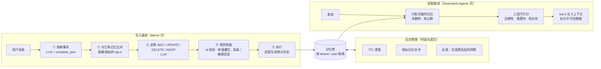
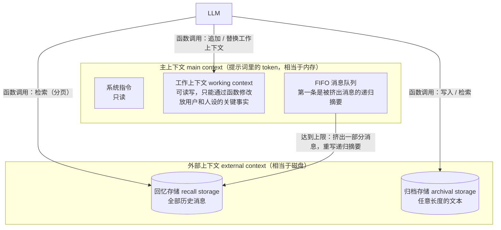

[中文](README.md) | [English](README.en.md)

# 第 18 课：记忆系统进阶 —— 从笔记本到 MemGPT / Mem0

> 🕐 建议用时：20 分钟 ｜ 🎯 学完你能：说清"只追加"的记忆为什么会烂掉；用 Mem0 式写入（ADD / UPDATE / DELETE / NOOP）、Generative Agents 式检索打分、MemGPT 式分层记忆，搭出一个跨会话也能"想起现在的你"的记忆系统，并满足查看、纠正、删除、防投毒这些企业要求 ｜ 📦 对应源码：[`memory_kit.py`](memory_kit.py)、[`agentkit/memory.py`](../../agentkit/memory.py)（对照组）、[`agentkit/workflows.py`](../../agentkit/workflows.py)（`complete_json`）
>
> 📖 必读：[Mem0: Building Production-Ready AI Agents with Scalable Long-Term Memory](https://arxiv.org/abs/2504.19413)（Chhikara 等，2025）—— 本课写入路径（抽取 → 比对 → ADD / UPDATE / DELETE / NOOP）的原型；重点读 §2.1 的两阶段流程，再看 §4.3~§4.5：和"全量上下文"比，记忆系统在准确率、延迟、token 上各得各失。

> 📍 本课属于**第三部分：进阶**，讲法是"概念 → 从零实现 → 练习"。本课对应 CS329Z 第 4 周的 Memory 主题，推荐搭配阅读其公开的必读论文 [MemGPT](https://arxiv.org/abs/2310.08560)（Packer 等，2023）。它也是第 04 课的必读，本课 §2.7 会再精读一遍它的记忆分层。
>
> 🧭 **前置**：[第 04 课](../04_context_memory/README.md)讲了上下文窗口策略、一个"只追加、关键词检索、按租户隔离"的 `MemoryStore`，以及被遗忘权；[第 05 课 §5](../05_agent_architectures/README.md#5-记忆架构)讲了情景 / 语义 / 程序性记忆的分类。本课不重复这些，直接往下讲**记忆系统怎么设计**。

## 0. 一句话讲清楚

**记忆系统难的不是"记住"，而是"改口"：用户搬了家、改了饮食、更正了过敏原，Agent 得知道哪条已经不算数了。**

第 04 课的 `MemoryStore` 像一本只能往后写的日记本：每次听到新情况，就在最后一页添一行。生产级的记忆更像一份有人维护的**个人档案**：新消息来了，先翻档案，再决定是新增一条、改写一条、划掉一条，还是不动；每次改动都留底；临时信息到期作废。

本课的 Demo 用一个具体的用户把这件事跑了一遍。Alice 在 4 个月里和公司的助手聊了 5 次：

| 会话 | Alice 说 | 只追加的笔记本 | 维护过的档案 |
|---|---|---|---|
| 1 | 我在上海做后端，吃素，对花生过敏 | 记下 5 行 | 建 5 条 |
| 2 | 开始健身了，**不吃素了**，改吃鱼和鸡肉 | 又添 2 行，"吃素"那行还在 | 改写"饮食"那条 |
| 3 | **搬到深圳**了；这周在北京出差 | 又添 2 行 | 改写"城市"（第二次真实运行漏了，见 §2.3）；出差记成 7 天后过期 |
| 4 | **换工作**了，去了 AI 创业公司 | 真实模型把这句话拆成 4 条，全添上 | 合并成一次改写 |
| 5 | 过敏的**其实是芒果**，不是花生；健身的事**别记了** | 又添 2 行 | 删掉"花生"、新增"芒果"、删掉"健身" |

第 6 次会话她问："这周六想请新同事吃饭，推荐一家餐厅，提醒我点菜要注意什么。"真实运行（gpt-5.5）里，笔记本已经有 16 行，上海和深圳、吃素和不吃素、花生和芒果全都并排躺着；档案只有 6 条，检索出来的 5 条全是现状。用关键词从笔记本里检索，只捞出两条：一条工作，一条三个月前的"这周在北京出差"。模型据此推荐了**北京的烤鸭店**，两次真实运行都是如此。

## 1. 核心概念

### 1.1 只追加的记忆会怎样烂掉

| 症状 | Demo 里的例子 | 后果 |
|---|---|---|
| **重复** | "换工作了""在 AI 创业公司""做 Agent 平台""不写后端了"：真实模型把一句话拆成了 4 条 | 占满 top-k 的名额，把别的记忆挤出去 |
| **矛盾** | "用户吃素"和"用户现在不吃素了"同时存在 | 模型只能猜哪条是新的；检索时还可能只捞到旧的那条 |
| **过期** | 三个月前的"这周在北京出差" | 被当成现状，推荐了北京的餐厅 |
| **膨胀** | 5 次会话 16 条，一年后几百条 | 全量注入太贵，只能检索；检索的干扰项越来越多，召回越来越差 |
| **删不干净** | 用户说"健身的事别记了"，但"开始健身"那行还在 | 隐私承诺落空 |

这里还叠加着第 04 课的老毛病：关键词检索只认字面，"吃素"匹配不上"素食"（[第 04 课 §2.6](../04_context_memory/README.md#26-长期记忆--外部存储--检索--注入)）。检索质量本身留给[第 17 课](../17_retrieval_quality/README.md)，本课关注的是：**就算检索完美，只追加的库里读出来的也是一堆互相打架的事实。**

### 1.2 一张图看全：写入、读取、后台整理



MemGPT 走的是另一条思路：不在 Agent 外面"替它管"记忆，而是把记忆分成几层，**让 Agent 自己用工具管理**（§2.7）。

### 1.3 几个术语

- **抽取（extraction）**：从一段对话里提炼出独立成句的事实，例如"用户对芒果过敏"。大白话：把聊天记录整理成卡片。
- **槽位（slot / key）**：给事实分类，例如 city、diet、allergy。**单值槽位**同一时间只能有一个值（人只住在一个城市），新值来了旧值必然失效。
- **软删除 / 物理删除**：软删除只是标记"不再有效"，原文留给审计；物理删除是真的从存储里抹掉。"信息过时了"用前者，"请删掉我的数据"必须用后者。
- **巩固（consolidation）**：把零散、重复的记忆合并、总结成更少、更干净的记忆。
- **核心记忆 / 归档记忆 / 回忆记忆（core / archival / recall memory）**：MemGPT / Letta 的分层。核心记忆常驻上下文；归档记忆是外部的知识库；回忆记忆是完整的历史对话，可以搜索。
- **反思（reflection）**：定期让模型从一批记忆里总结出更高层的结论，并把结论本身也存成记忆。
- **血缘（lineage）**：派生数据记录"我来自哪些原始记忆"，原始记忆被删除时，派生数据才能跟着删。

## 2. 从零实现

### 2.1 数据模型：一条记忆比第 04 课多了什么

```python
@dataclass
class MemoryRecord:
    id: str
    text: str
    key: str = "other"            # 槽位：规则兜底靠它判断冲突
    importance: float = 5.0       # 1~10：检索打分用；"过敏"比"喜欢蓝色"重要
    created_at: float = 0.0
    updated_at: float = 0.0
    last_accessed: float = 0.0    # 近期性按它算
    expires_at: float | None = None  # TTL：短期信息到期自动失效
    sources: list[str] = ...      # 血缘：来自哪些会话 / 哪些记忆
    status: str = "active"        # active / deleted（软删除）
    history: list[dict] = ...     # 每次变更：{op, old, new, at, reason, source}
```

每个字段都对应 §1.1 的一个症状：`key` 治矛盾，`expires_at` 治过期，`history` 让"改口"可追溯、可回滚，`sources` 让删除能级联。

### 2.2 Mem0 式写入：抽取 → 比对 → 决策

Mem0 论文（Chhikara 等，2025）把写入分成两个阶段，本课照此实现：

1. **抽取阶段**：输入是新的一对消息，加上整段对话的摘要和最近 m 条消息（论文取 m = 10），由 LLM 输出一组候选事实。摘要由一个异步模块定期刷新，不阻塞对话。
2. **更新阶段**：对每条候选事实，用向量检索取出最相似的 s 条已有记忆（论文取 s = 10），再由 LLM 通过函数调用（function calling）从四个操作里选一个：**ADD**（没有等价的记忆，新增）、**UPDATE**（补充或改写已有记忆）、**DELETE**（新信息与之矛盾，删除）、**NOOP**（无需改动）。

[`FactMemory.observe`](memory_kit.py) 的主干就是这几步（`observe` 是 `async def`，调用方写 `await mem.observe(...)`）：

```python
facts = self.last_facts = await self._extract(message, now)      # ① 抽取（complete_json 保证结构）
if not facts:
    return []
live = [r for r in store.values() if r.is_live(now)]
candidates = self._candidates(facts, live)                        # ② 每条事实取最相似的 top_s 条
if not candidates:                                                #    没东西可比：只可能是 ADD
    ops = [MemoryOp("ADD", None, f.text, f.key, f.importance, f.ttl_days, "新用户 / 新话题") for f in facts]
else:
    ops = await self._decide(message, facts, candidates, now)     # ③ LLM 决策
ops = self._guard(ops, store, now)                                # ④ 规则兜底
results = self.apply_fn(store, ops, now=now, new_id=self.new_id)  # ⑤ 执行（练习 b）
```

几个设计决定：

- **为什么分成两次模型调用，而不是一次？** 抽取只看消息，决策还要看已有记忆。拆开以后，抽取的提示词短而稳定，决策的输入只包含相关的候选；两步也可以用不同大小的模型。代价是多一次调用（2026 年 Mem0 自己也改成了单次调用，见 §5.1）。
- **为什么用 `complete_json`？** 决策结果要被代码执行，必须是可靠的数据结构。[`complete_json`](../../agentkit/workflows.py) 会按 Pydantic 模型校验，不合格就把错误发回给模型让它改（[第 06 课](../06_orchestration/README.md)）。
- **为什么给模型看 "0""1" 这样的短编号？** 这是 Mem0 开源代码里的一个小技巧（代码注释写的是 anti-hallucination）：让模型抄一串 UUID，它容易抄错、甚至编一个；短编号在代码里再映射回真实 id。
- **记忆库是空的时候跳过决策调用。** 这时候唯一可能的决策就是 ADD，没必要花钱问模型。
- **只有用户本人说的话才能写入。** `observe(..., source_type="document")` 会被直接拒绝，连模型都不调用（第 04 课防投毒原则 1）。
- **同一个用户的写入排队，不同用户照常并发。** 主干里"读已有记忆"（`live = ...`）和"落库"（`apply_fn`）之间隔着两次 `await`（抽取、决策）。同一个用户的两条消息如果交错执行，第二条就拿着过时的候选记忆去决策。所以 `observe` / `maybe_reflect` 外面套了一把按 `(tenant_id, user_id)` 的锁（`agentkit.limits.KeyedLocks`）。测试 `test_fact_memory_serializes_writes_per_user_but_not_across_users` 让两条消息同时到达："我对花生过敏"和"更正：不是花生，是芒果"。有锁时第二条排在后面，看得到"花生过敏"，把它删掉，模型调用的在途峰值是 1；把锁拿掉，两条同时等模型（在途峰值 2），第二条的决策没看到"花生"，过时的记忆就活了下来。三个不同用户同时写入时，在途峰值是 3，互不等待。这把锁只管一个进程：记忆存在进程内的 dict 里，多个 worker 进程各有一份。生产里记录放 Postgres（第 26 课），向量索引用 pgvector 之类（第 15、17 课），按用户串行靠按用户分区的队列或数据库锁（[第 26 课 问题 5](../26_state_and_queues/README.md#问题-5分布式锁--redispostgres-advisory-locketcdzookeeper怎么选)）。

> 💡 **一个容易忽略的数字**：Mem0 论文在 LOCOMO 基准上的结果里，**把全部对话塞进上下文（full-context）的准确率反而最高**（LLM 评委分 72.9%，Mem0 是 66.9%）。记忆系统换来的是 p95 延迟降低 91%（17.1 秒 → 1.4 秒）、token 省掉 90% 以上。**记忆系统首先是成本和延迟的优化，不是准确率的免费午餐。**

### 2.3 规则兜底：模型负责理解，规则负责底线

模型的决策在落库前要过一遍确定性的检查（`FactMemory._guard`）：

| 检查 | 规则 | 防的是什么 |
|---|---|---|
| id 校验 | UPDATE 指向不存在的记忆 → 改成 ADD 再检查；DELETE 指向不存在的记忆 → 忽略 | 模型编造 id、指向已删除的记录 |
| 单值槽位 | 城市 / 工作 / 饮食 / 姓名已有一个值，模型却 ADD 了第二个 → 改成 UPDATE | 模型"忘了"更新，库里出现两个城市 |
| 临时信息豁免 | 带 TTL 的事实（"这周在北京出差"）不参与单值替换 | 规则误伤：把长期住址覆盖成出差地 |
| 重复 | 同槽位、相似度 ≥ 0.85 → NOOP | 同一件事被记好几遍 |
| 内容安全 | 像指令的内容、密钥、证件号、银行卡号 → 不写入 | 投毒、敏感信息进记忆 |
| 降级 | 决策调用失败（网关 5xx、JSON 修复几次都不合格）→ 每条事实先当 ADD，再走上面的规则 | 模型不可用时记忆写入不能整个停摆 |

离线剧本故意在会话 3 让"模型"把搬家当成 ADD，你能看到兜底规则接住了它：

```text
▶ 会话 3｜2026-03-06｜Alice：跟你说一声，我上周已经搬到深圳了，住在南山。对了，这周我在北京出差。
   FactMemory 的决策：
     UPDATE 「用户在上海工作」→ 「用户已搬到深圳南山居住」  理由：新的居住地（规则：单值槽位冲…
     ADD    「用户这周在北京出差」 applied  理由：临时安排
     🛡 规则兜底：单值槽位 city 已有「用户在上海工作」，ADD「用户已搬到深圳南山居住」→ 改为 UPDATE
```

实话实说，两次真实运行里这条规则都没有触发，而且原因不一样，第二次恰好暴露了它的盲区：

- **第一次**：会话 1 把"用户在上海工作"标成了 `city` 槽位，会话 3 模型直接给出了正确的 UPDATE，不需要兜底。
- **第二次**：会话 1 把同一句话标成了 `other` 槽位。会话 3 模型对"搬到深圳"做了 ADD，没有动"在上海工作"；兜底规则只认槽位，city 槽位里没有旧值，所以它什么也没发现。结果档案里"在上海工作"和"住在深圳"同时活着。这次运气好：它在检索里只排第 6，没进 top-5，回答仍然正确。Demo 为此加了一步"自检"，检查全部有效记忆，而不只是检索出来的那几条。

"在上海工作"其实是被**间接**推翻的：它和"住在深圳"字面上并不矛盾（住深圳、在上海上班也不是不可能），真正让它失效的是会话 4 的换工作，而那一步模型只更新了 job 槽位。**规则兜底依赖模型给出的结构（槽位），结构错了，规则就瞎了。** 缓解办法：在抽取提示词里给出槽位的定义和例子；定期让强模型把一个用户的全部记忆通读一遍，找出过时的（§2.8 的"离线整理"）；在评估集里专门覆盖"间接失效"的情形。兜底规则防的是更小、更便宜的模型（写入路径通常就用它们省钱）和偶发失误，它不是万能的。

**规则替代不了模型。**"花生过敏是我记错了，其实是芒果"这件事，规则判断不了：过敏是多值槽位，一个人完全可以同时对花生和芒果过敏。只有理解了"记错了"三个字，才知道要 DELETE 花生。反过来，模型也替代不了规则：它偶尔会编 id、会忘记更新。**模型负责理解语义，规则负责守底线**，这是本课代码最核心的分工。

### 2.4 UPDATE 和 DELETE 不物理覆盖（练习 b）

[`apply_ops`](memory_kit.py) 执行决策时，**UPDATE 把旧值写进 `history`，DELETE 只把 `status` 标成 `deleted`**：

```text
[diet] 用户现在不吃素了，吃鱼和鸡肉  （active，出处 session-1, session-2）
    2026-01-05 ADD     — → 用户吃素
    2026-02-04 UPDATE  用户吃素 → 用户现在不吃素了，吃鱼和鸡肉
[allergy] 用户对花生过敏  （deleted，出处 session-1）
    2026-01-05 ADD     — → 用户对花生过敏
    2026-05-05 DELETE  用户对花生过敏 → —
```

为什么不直接覆盖？

1. **记忆会出错**：模型可能把"我不吃香菜"理解成"我不吃素"，然后 UPDATE 掉一条正确的记忆。有历史，就能查出是哪次会话、因为什么改的，并且能改回去。
2. **"曾经是什么"本身就是信息**："从上海搬到了深圳"比"住在深圳"信息更多，比如推荐时可以提一句"上海的老朋友"。
3. **业界都在往这个方向走**：Mem0 论文里的图记忆变体（Mem0g）发现关系过时时，是"标记为失效，而不是物理删除"；Zep 的时序知识图谱给每条事实记录"何时开始成立 / 何时不再成立"，矛盾出现时设置旧事实的失效时间，而不是删掉它（§2.8）。

但**软删除不等于被遗忘权**。用户说"请删掉关于我的这条信息"时，必须物理删除，连 `history` 里的原文一起删。这是两个不同的接口：`apply_ops` 里的 DELETE 表示"过时了"，`FactMemory.forget` 表示"删掉我的数据"（§2.9）。

### 2.5 Generative Agents 式检索打分（练习 a）

Generative Agents（Park 等，UIST 2023）给每条记忆打三个分，再加起来：

- **近期性（recency）**：按"距离上次被检索过了多少游戏小时"做指数衰减，衰减因子 0.995。
- **重要性（importance）**：写入时让模型打 1~10 分。1 是"刷牙、铺床"这种日常琐事，10 是"分手、被大学录取"这种大事。
- **相关性（relevance）**：记忆和查询的 embedding 余弦相似度。
- 三个分数各自用 min-max 缩放到 [0, 1]，三个权重 α 都取 1，加起来排序。

[`score_memory`](memory_kit.py) 的实现：

```python
age = max(0.0, now - record.last_accessed)           # 时钟偏差可能让 age 为负
parts = {
    "recency": 0.5 ** (age / half_life),              # 过一个半衰期减半
    "importance": (min(10, max(1, record.importance)) - 1) / 9,
    "relevance": min(1.0, max(0.0, relevance)),
}
score = sum(w.get(k, 0.0) * v for k, v in parts.items()) / total_w
```

两处和论文不同，都是有意的：

- **用半衰期代替衰减因子**：0.995 每小时，相当于半衰期约 138 小时（ln 0.5 / ln 0.995 ≈ 138.3）。"过 30 天近期性减半"比"每小时乘 0.995"好理解，也好调。
- **用绝对归一化代替 min-max**：min-max 是在候选集合内部缩放，只有两个候选时，一个必然是 0、一个必然是 1，一点点差别被放大成天壤之别；分数也没法跨查询比较，设不了"低于 0.3 就不注入"这种阈值。绝对归一化让每个因子都有固定含义，总分再除以权重之和，稳定落在 [0, 1]。

真实运行里（半衰期 30 天，等权）：

```text
▶ 默认：三个因子等权，半衰期 30 天（每过 30 天近期性减半）
   记忆                                          近期   重要   相关   总分
   用户对芒果过敏                                0.50   1.00   0.00   0.500
   用户换工作了，现在在一家 AI 创业公司做 Agen…  0.25   0.67   0.04   0.319
   用户叫 Alice                                  0.03   0.78   0.00   0.270
   用户上周已经搬到深圳了，住在南山。            0.12   0.67   0.00   0.264
   用户现在不吃素了，吃鱼和鸡肉                  0.06   0.56   0.00   0.206
   用户在上海工作                                0.03   0.56   0.00   0.196
```

问题是"推荐一家餐厅，点菜要注意什么"，里面没有"过敏""芒果"。过敏那条的**相关性是 0**，纯检索必然漏掉它，和第 04 课"吃素 vs 素食"是同一个病。但模型给它的重要性是 10 分，三因子打分把它排到了第一。**重要性是给"字面不相关、但出了事后果严重"的记忆准备的保险。** 也注意最后一行：§2.3 说的那条残留旧值"用户在上海工作"排在第 6，差一名就进了 top-5。

### 2.6 反思：从事实到洞察

只有事实还不够。Generative Agents 的反思机制是这样的：最近事件的重要性之和超过阈值（论文实现取 150）时触发，大约一天两三次；取最近 100 条记忆，先让模型提出 3 个"最值得思考的高层问题"，再用这些问题去检索，最后总结出 5 条洞察，每条都要**引用支撑它的记忆**。洞察本身也存成记忆，还可以在洞察之上再反思，形成一棵"反思树"：叶子是观察，越往上越抽象。

[`FactMemory.maybe_reflect`](memory_kit.py) 实现了一个简化版：新写入记忆的重要性累计超过阈值就触发，要求每条洞察带 `evidence`（证据编号），**没有证据的洞察直接丢弃**，因为没有证据的"洞察"就是幻觉。真实运行生成了两条：

```text
🧠 用户近期职业和生活重心已从上海转到深圳南山，并进入 AI 创业公司做 Agent 平台相关工作，后续建议应优先贴合深圳本地和 AI Agent 产品/平台场景。
   证据：用户换工作了，现在在…；用户上周已经搬到深圳…；用户在上海工作
🧠 用户饮食上已不再吃素，可接受鱼和鸡肉，但需要严格避开芒果及含芒果成分的食物。
   证据：用户对芒果过敏；用户现在不吃素了，吃…
```

第一条洞察把那条残留的"用户在上海工作"正确地解读成了"过去"：反思在这里顺手修补了写入时漏掉的时间关系。这也是 §2.8 说的"定期通读"能起作用的原因。

证据链还有第二个用处：**级联删除**。Alice 删掉"工作"那条记忆时，引用了它的第一条洞察必须跟着删，否则她的职业信息会通过洞察"复活"。`forget` 会沿着 `sources` 找出所有派生记忆一起物理删除：

```text
▶ ③ 被遗忘权：Alice 在记忆管理页删除"工作"那条 → 引用了它的洞察必须一起删（血缘级联）
   forget(m03) 物理删除了 2 条：用户换工作了，现在在一家 AI …；用户近期职业和生活重心已从上…
```

### 2.7 MemGPT / Letta 式分层记忆：让 Agent 自己管

前面的 FactMemory 是"系统在 Agent 外面替它管记忆"。MemGPT（CS329Z 这一周的必读，也是第 04 课的必读）换了个思路：**把上下文窗口当成内存，把外部存储当成磁盘，让模型像操作系统一样自己换页。** 论文里的结构：



- 提示词超过"警告阈值"（论文举例：上下文窗口的 70%）时，系统往队列里插一条"内存压力"警告，让模型趁早把重要信息存进工作上下文或归档；超过"刷新阈值"（例如 100%）时，挤出一部分消息（例如窗口的 50%），并用旧摘要加上被挤出的消息生成新的递归摘要。被挤出的消息仍然留在回忆存储里，可以通过函数调用找回来。
- 模型可以在函数调用里带一个 `request_heartbeat=true`，要求紧接着再推理一次，把多个函数调用串起来（例如多次翻页检索）。
- 在"深度记忆检索"（DMR）任务上（前 5 次会话的对话记录，第 6 次会话提问），GPT-4 的准确率从 32.1% 提到 92.5%，GPT-4 Turbo 从 35.3% 提到 93.4%。对照组看的是前 5 次会话的有损摘要。本课 Demo 的"5 次会话 + 第 6 次提问"就是仿照这个设置。

MemGPT 的开源实现后来成了 Letta。Letta 把工作上下文叫做**核心记忆（core memory）**，由若干**记忆块（memory block）**组成，每块有标签、描述、值和字符上限。它旧版的工具叫 `core_memory_append` / `core_memory_replace` / `archival_memory_insert` / `archival_memory_search` / `conversation_search`，新版改成了 `memory_insert` / `memory_replace` / `memory_rethink`。

本课的实现（[`CoreMemory`](memory_kit.py)、[`memgpt_tools`](memory_kit.py)、[`CoreMemoryHook`](memory_kit.py)）：

```python
core = CoreMemory({"human": ("关于当前用户的关键事实和偏好", 120), "persona": ("你的身份和说话风格", 80)})
archival = MemoryStore()                                   # 归档直接复用第 04 课的 MemoryStore
tools = memgpt_tools(core, archival)                       # core_memory_append / core_memory_replace / archival_insert / archival_search
agent = Agent(llm, tools, system_prompt=PROMPT, hooks=[CoreMemoryHook(core, archival, PROMPT)])
await agent.run("……", metadata={"tenant_id": "acme", "user_id": "alice"})   # 身份只从 metadata → ctx 来
```

设计决定：

- **每一步都刷新 system 消息**（`CoreMemoryHook.before_llm`）：模型这一步改了记忆，下一步立刻就能看到。代价是 system 消息一变，提示词缓存从这里开始失效（[第 04 课 §2.5](../04_context_memory/README.md#25-prompt-caching为什么稳定前缀能省钱降延迟-选读企业里很重要)）。所以核心记忆要小，也不能改得太频繁。
- **渲染时标出"已用 / 上限"字符数**，例如 `<human chars="42/120">`。这是 MemGPT"内存压力"思想的简化版：让模型看得见还剩多少空间。写入超限时，工具返回一条模型能照着做的错误："请先用 core_memory_replace 精简，或者把细节 archival_insert 进归档"。
- **核心记忆是全系统投毒代价最高的位置**：它被拼进 system prompt，每一轮都会被当作最高优先级的上下文读。所以每次写入都要过 `detect_injection` 和敏感信息检查，并记录审计历史（谁、何时、旧值、新值），出事可以 `rollback`。
- **身份从 `ctx` 取**，模型没有办法指定"改谁的记忆"（第 03 课原则 4）。
- **四个工具都是 `async def`，虽然函数体里没有 `await`**：普通函数工具会被放进线程池执行（给阻塞 I/O 用的，见 [`agentkit/tools.py`](../../agentkit/tools.py)），那样核心记忆就会在工具线程里被改、同时在事件循环线程里被 `CoreMemoryHook` 读，并发的会话之间还得加锁。这几个工具只动进程内的数据结构（微秒级），放在事件循环线程上执行，所有读写都在一个线程里，两次 `await` 之间不会被打断。换成数据库存储后，函数体里就是真正的 `await`。

真实运行（gpt-5.5）里有几个值得注意的行为：

1. **它从不做局部替换，总是整块重写**：两次运行一共 8 次 `core_memory_replace`，每一次的 `old_content` 都是整块原文，`new_content` 是改好的整块（Demo 的审计统计会显示为 `rewrite`）。这样能用，但块越大，模型抄错一个字、替换失败的概率越高；每次重写也都有机会"顺手"丢掉别的信息。审计历史里的旧值就是为这种情况准备的。
2. **它守规矩**：出差这种临时信息放进了归档，没有放进核心记忆；健身这件事它从一开始就没记。核心记忆最多只用了 47/120 字符，从来没碰到上限，所以离线剧本特意演示了超限时的处理流程。
3. **两次运行里，它都在第 6 次会话主动归档了"本周六请新同事吃饭"**。没人要求它这么做，但这确实是一条有用的情景记忆。MemGPT 式记忆的质量取决于模型勤不勤快、守不守规矩。

### 2.8 巩固与遗忘：时间衰减、合并、TTL（练习 c）

记忆不能只进不出。几种常见手段：

| 手段 | 解决什么 | 本课实现 | 业界做法 / 风险 |
|---|---|---|---|
| **时间衰减** | 老记忆的权重自然下降 | `score_memory` 的近期性 | MemoryBank（Zhong 等，2023）借鉴艾宾浩斯遗忘曲线，按时间和重要性决定遗忘或强化。风险：稳定而重要的事实（过敏）不该衰减，所以要和重要性一起用 |
| **合并** | 同一件事被记成了好几条 | 练习 (c) `consolidate` | 保留最新值 + 全部来源。风险：链式合并（A 像 B、B 像 C，A 和 C 却是两件事），所以要限定同槽位、阈值要高 |
| **摘要** | 大量细碎记忆压缩成少量要点 | 反思（§2.6） | MemGPT 的递归摘要；Zep 在实体之上建"社区"子图做高层摘要。风险：摘要是有损的，而且是派生数据，删除时要级联 |
| **TTL** | 短期信息到期作废 | `expires_at`、`purge_expired` | 两种 TTL 要分清：**事实的有效期**（出差一周）和**数据的保留期**（合规要求 90 天后删除）。前者到期不再检索，后者到期必须物理删除 |
| **离线整理** | 整理工作不拖慢对话；找出写入时漏掉的过时记忆 | —— | 定期让强模型通读一个用户的全部记忆，找出过时、矛盾、重复的条目（§2.3 的间接失效靠它补救）。Letta 的 sleep-time agent 就是在空闲时重组、改进记忆（依据论文 Sleep-time Compute，Lin 等，2025）。也可以放进第 13 课的任务队列里异步执行 |

### 2.9 企业级：记忆比知识库更危险的地方

第 04 课讲了隔离、被遗忘权、防投毒三条硬要求（[第 04 课 §2.8](../04_context_memory/README.md#28-企业级记忆的三条硬要求)）。有了"会改写自己"的记忆系统之后，还有几件事要补上：

| 问题 | 为什么记忆系统特别危险 | 本课做法 | 生产中还要做 |
|---|---|---|---|
| **记忆投毒** | 一次写入，之后每次会话都生效。MINJA（Dong 等，2025）只通过**正常提问**就能往 Agent 的记忆里注入恶意记录，论文报告平均注入成功率 98.2%。第 04 课的 SpAIware 是真实案例 | 只有用户本人说的话能写入；写入前做注入 / 敏感信息检查；核心记忆写入走同一道检查 | 写入分级审批；高风险槽位（收款账户、邮寄地址）的变更必须由用户在界面上确认；检索出的记忆按不可信数据隔离（[第 09 课问题 1](../09_security/README.md#问题-1知识库文档里藏着一段给-ai-看的恶意指令)） |
| **跨租户** | 反思、合并、缓存都会产生派生数据，任何一处没带租户键就会串 | `FactMemory.store(tenant, user)` 是唯一入口；工具身份从 `ctx` 取 | 存储层强制过滤；向量索引按租户分区（[第 15 课问题 2](../15_enterprise_rag/README.md#问题-2多租户的向量索引怎么隔离)、[第 09 课问题 6](../09_security/README.md#问题-6a-公司看到了-b-公司的数据)）；为隔离写测试 |
| **用户可查看、可删除** | 用户不知道你记了什么，就无从纠正 | `export` 列出全部记忆和变更历史；`forget` 物理删除并级联 | 删除要覆盖向量索引、摘要、缓存、日志、备份。OpenAI 的帮助文档专门提醒：删除一段对话，并不会删除从中保存下来的记忆。派生数据就是这么容易被漏掉的 |
| **记忆出错如何纠正** | 错误的记忆会被一次次读出来，每次都"自信地"错 | `correct`（出处标为 `user_edit`）；`CoreMemory.rollback`；审计历史 | 用户改过的记忆加锁，自动流程不能覆盖；记忆写入指标（UPDATE / DELETE 比例突增）要有告警 |
| **隐私** | 记忆会**生成新的个人信息**：反思能从"最近常搜婴儿用品"推断出"可能怀孕"。重要性打分还会让敏感记忆出现在不相干的对话里 | 抽取提示词禁止记录敏感信息和第三方隐私；用户要求"别记"时删掉原始记录 | 敏感类别（健康、宗教、政治、性取向）默认不抽取、不反思；推断出来的属性通常也属于个人信息，应当同样支持查看和删除 |

真实运行里有一个很具体的隐私教训：Alice 说了"健身的事别记了"，FactMemory 删掉了那条记录；但在"只追加 + 全部注入"的对照组里，"用户最近开始健身了"仍然被原样发给了模型。**删除承诺只有在删除真的发生在存储层时才算数。**

### 2.10 方案对比：四种记忆怎么选

| 方案 | 怎么存 | 写入成本 | 读取成本 | 擅长 | 短板 | 适合 |
|---|---|---|---|---|---|---|
| **A. 原样日志**（第 04 课 `MemoryStore`；MemGPT 的回忆存储） | 原话或原始事实直接追加 | 几乎为 0 | 全量注入：随条数线性增长；检索：看检索质量 | 不丢信息，天然可审计；强模型带着日期往往能自己理清矛盾（§3） | 矛盾、过期、重复全留给读的一方；越积越多 | 记忆条数少；合规要求保留原文；作为其他方案的底层"事实来源" |
| **B. 抽取式事实库**（Mem0 论文；本课 `FactMemory`） | 每条是一个独立的事实，写入时就决定增 / 改 / 删 | 每条消息 1~2 次模型调用（可用小模型） | 低：条数少、内容干净 | 读出来基本就是现状；token 最省（Demo：91 vs 219 token） | 抽取错了信息就丢了；"间接"过时的事实容易漏（§2.3）；覆盖式更新会毁掉历史（所以要留审计） | 个人助理、客服的用户画像；偏好类信息 |
| **C. 分层（MemGPT / Letta）** | 核心记忆常驻上下文；归档、回忆放外部 | 在对话循环里调工具，每轮都多一些 token 和延迟 | 核心记忆 0 次检索；归档要模型主动去查 | 最关键的信息永远在眼前；Agent 能按任务决定记什么 | 依赖模型勤快、守规矩；system 消息常变，缓存命中率下降 | 长期陪伴型 Agent；单个 Agent 的长任务 |
| **D. 知识图谱式**（Zep / Graphiti；Mem0g） | 实体 + 关系 + 时间，矛盾时让旧边失效 | 最高：实体抽取、消歧、关系合并 | 图遍历 + 检索，多跳查询强 | 多跳推理、时间推理（"她搬家前在哪家公司"）、跨实体关系 | 系统复杂；Mem0 论文里图变体只多了约 2% 的准确率，p95 延迟却从 1.44 秒涨到 2.59 秒 | 企业里多实体交织的记忆：客户、合同、联系人、工单 |

**怎么选**：

- 用户记忆只有几十条、对话不频繁：**A + 会话开始时全量注入 + 带日期**，最简单，而且本课的真实运行显示强模型能处理好。
- 记忆会持续增长，而且是"关于这个人的偏好和状态"：**B**。写入放进异步队列（第 13 课），用小模型抽取，并保留审计历史。
- Agent 本身是长期运行的"个人助理"，需要自己决定记什么：**C**，核心记忆里放 B 的精华（事实库负责维护，核心记忆负责展示）。
- 需要回答"谁和谁是什么关系、什么时候变的"：**D**，把它当成知识库（第 15 课）来建设和治理。

实际系统常常是组合：A 作为不可变的事实来源（出了事可以重放），B 或 D 作为从 A 派生出来的索引，C 负责决定哪些内容进上下文。

## 3. 动手：运行 Demo

```bash
.venv/bin/python lessons/18_memory_systems/demo.py --offline   # 离线剧本，无需 API key
.venv/bin/python lessons/18_memory_systems/demo.py             # 真实模型（FactMemory 约 10 次调用 + 回答 3 次 + MemGPT Agent 十几次）
.venv/bin/python lessons/18_memory_systems/demo.py --only 5    # 只跑实验 5（MemGPT 式 Agent）
```

五个实验：① 同一份抽取结果，只追加 vs FactMemory；② 第 6 次会话的召回对比和回答；③ 三因子打分拆解；④ 查看、反思与级联删除、纠正、TTL、投毒拦截；⑤ MemGPT 式 Agent 跨 6 次会话自己管理核心记忆。

真实运行（gpt-5.5）节选，实验 2：

```text
▶ A 只追加 + 关键词 top-5：召回 2 条（约 34 token）
     [2026-04-05] 用户现在在一家 AI 创业公司工作
     [2026-03-06] 用户这周在北京出差。
▶ B 只追加 + 全部注入：召回 16 条（约 219 token）
▶ C FactMemory top-5：召回 5 条（约 91 token）

▶ 逐项判分（✅ 只有现状 / ⚠️ 新旧并存，模型得自己猜 / ❌ 缺现状）
                             居住城市      饮食          过敏          工作          已要求忘记的健身
   A 只追加 + 关键词 top-5   ❌ 只有旧值   ❌ 没召回     ❌ 没召回     ✅ 只有现状   ✅ 没出现
   B 只追加 + 全部注入       ⚠️ 新旧并存   ⚠️ 新旧并存   ⚠️ 新旧并存   ⚠️ 新旧并存   ❌ 还在
   C FactMemory top-5        ✅ 只有现状   ✅ 只有现状   ✅ 只有现状   ✅ 只有现状   ✅ 没出现

▶ 把三份记忆分别交给模型回答同一个问题
   【A 只追加 + 关键词 top-5】
     🤖 若在北京，推荐「四季民福烤鸭店」周六聚餐稳妥，记得提前订位。点菜注意：问忌口/过敏，荤素搭配，少点太辣和重口味。
   【B 只追加 + 全部注入】
     🤖 推荐深圳南山「点都德」海岸城店，粤菜/点心适合请新同事，氛围轻松、选择多。点菜注意：避开含芒果的甜品/饮品，提前告知店员；也问下同事是否忌口、过敏。
   【C FactMemory top-5】
     🤖 推荐「润园四季椰子鸡·深圳湾万象城店」，适合新同事聚餐，鱼、鸡肉都好点。点菜提醒：你芒果过敏，避开芒果饮品/甜品/酱料，提前告知服务员。
```

**该观察什么**：

1. **A 败在检索**：问题和记忆没有字面重合，关键词检索只捞到"工作"和三个月前的"出差"。模型老老实实地用了它能看到的信息：推荐北京的烤鸭店，而且完全没提过敏。
2. **B 是一个和直觉相反的结果**：16 条互相矛盾的记忆全塞进去，gpt-5.5 却答对了，两次运行都是。它看得懂日期，知道"更正：不是花生而是芒果"，也知道三个月前的"这周"早就过去了。这正是 2026 年 Mem0 转向"只 ADD、读时再推理"的底气（§5.1）。但 B 的代价也写在输出里：token 是 C 的 2.4 倍，而且随记忆条数线性增长；用户要求忘掉的健身信息照样发给了模型。
3. **C 在写入时就把矛盾消解了大部分**：召回的 5 条全是现状，token 最少。但要看实验 1 末尾的"自检"：第二次运行里残留了一条"用户在上海工作"（§2.3）。
4. **实验 1 的会话 2 和会话 4**：真实模型把一句话拆成了 2 条和 4 条事实（第 04 课也见过这种拆分），只追加的库因此迅速膨胀；FactMemory 的决策步骤把它们各自合成了一次 UPDATE。**抽取的粒度是不稳定的，决策这一步顺带做了去重。**
5. **同一个 Demo 跑两次，结果会不一样**：槽位标注、事实拆分、洞察的措辞都会变。这就是为什么记忆系统需要评估集，而不是跑一次看着对就上线（§5.2）。
6. **实验 5**：留意模型每次都是整块重写核心记忆（§2.7），以及最后那条审计统计。

（离线模式的输出是剧本，但抽取 → 比对 → 决策 → 兜底 → 落库的数据流和真实运行完全一样。离线剧本照搬了真实运行里的几个行为，比如会话 4 的拆分、B 组的回答方式；另外在会话 3 故意制造了一次模型失误，用来演示兜底规则。）

（故事里的"4 个月"是逻辑时钟：每次会话前把 `now` 拨到那一天，写入日期、近期性衰减、TTL 都按它算，这样 Demo 几秒钟就能跑完 4 个月。它模拟的是时间流逝，不是并发：每次会话、每次模型调用都是真实的 `await`，一个接一个地跑。）

## 4. 练习

打开 [`exercise.py`](exercise.py)，完成三个函数：

| 题 | 函数 | 要点 |
|---|---|---|
| (a) | `retrieval_score(memory, query_relevance, now, half_life, weights)` | 三因子各自归一化到 [0, 1]，加权平均；时钟偏差、越界输入要截断；非法权重抛 `ValueError` |
| (b) | `apply_memory_ops(store, ops, *, now, new_id)` | 执行 ADD / UPDATE / DELETE / NOOP；不存在或已删除的 id 返回 `not_found`；重复 ADD 只合并出处；UPDATE / DELETE 把旧值写进审计历史，DELETE 是软删除 |
| (c) | `consolidate(memories, similarity_fn, threshold)` | 同槽位且相似度 ≥ 阈值的记忆合并（相似关系可传递）；保留最新值、合并全部来源；不修改输入 |

```bash
make lesson N=18
# 或者：.venv/bin/python -m pytest lessons/18_memory_systems -v
```

15 个测试全部离线：14 个测你的练习，其中一个集成测试会把你写的 `apply_memory_ops` 塞进 `FactMemory`，用剧本代替模型跑完整的两次会话（`FactMemory.observe` 是 async 的，测试里用 `await`；你要写的三个函数都是纯计算，仍是普通函数）；另外 1 个测的是课程代码本身（§2.2 的按用户排队），不做练习也会通过。卡住了先重读 §2.4、§2.5，再看 [`solution.py`](solution.py)。

## 5. 深入（给有余力的你）

### 5.1 Mem0 自己放弃了 UPDATE / DELETE

2026 年 4 月，Mem0 发布了新的记忆算法。按其官方博客的说法，旧算法分两次模型调用：先抽取，再和已有记忆对账（reconcile）；对账这一步既慢，又容易在覆盖时抹掉原有事实里的关键信息。新算法改成**单次调用、只做 ADD**：信息变化时，新旧事实都保留，由检索阶段（语义、关键词、实体三路打分融合）和读的一方去推理"它是怎么变过来的"。开源代码里的新提示词也明确规定唯一的操作就是 ADD，并要求把"上周"这样的相对时间换算成具体日期。官方自报两个基准都提升了 20 分以上（厂商自测，谨慎看待）。

这和本课 §3 里 B 组的真实结果是一致的：**强模型 + 带日期的完整历史**，读的时候能自己消解矛盾。两条路线的取舍：

| | 写时消解（本课 FactMemory、Mem0 论文） | 读时消解（Mem0 2026、原样日志 + 日期） |
|---|---|---|
| 写入 | 贵（要对账），可能改错、删错 | 便宜，不丢信息 |
| 读取 | 便宜、干净 | 上下文更大，依赖读的模型足够强 |
| 删除 / 隐私 | "当前视图"里已经没有被删的内容 | 必须额外保证"要求忘记"的内容真的被删了 |

本课的做法是折中：当前视图做写时消解，同时用 `history` 保留全部旧值。两边的好处都拿一部分。

### 5.2 记忆基准靠得住吗

- **LoCoMo**（Maharana 等，ACL 2024）和 **LongMemEval**（Wu 等，ICLR 2025）是最常用的两个。LongMemEval 考五种能力：信息抽取、跨会话推理、时间推理、**知识更新**、拒答；它报告商用聊天助手和长上下文模型在持续交互中的记忆准确率下降约 30%。
- Letta 做过一个实验：一个只有文件读取和 grep 工具的 Agent，用 GPT-4o mini 在 LoCoMo 上拿到 74.0%，高于 Mem0 报告的图变体 68.5%。他们的结论是"Agent 的能力比记忆工具本身更重要"，并认为现有的记忆基准意义有限。
- MemGPT 论文里 GPT-4 Turbo + MemGPT 在 DMR 上是 93.4%，Zep 论文报告 94.8%。
- 各家的数字都是自报的，测试设置也各不相同。**唯一靠得住的是用你自己的数据建一个评估集**：准备"第 N 次会话问什么 → 应该想起什么、不应该想起什么"的标注，特别要覆盖**更新**和**删除**（[第 11 课](../11_evals/README.md)）。

### 5.3 记忆就是文件

CS329Z 这一周的主题里列了"用文件系统外化记忆"。Anthropic 的 Claude API 提供了一个客户端执行的 memory tool（`memory_20250818`）：模型通过 view / create / str_replace / insert / delete / rename 这几个命令读写 `/memories` 目录，存储完全由你的应用实现。官方文档里的安全建议和本课的结论一致：**防路径穿越**（`/memories/../../secrets.env`）、剥离敏感信息、限制单个文件大小、定期删除长期没有被访问过的记忆文件。第 05 课讲过的 CLAUDE.md / AGENTS.md 也属于这一类，只不过存的是程序性记忆。

### 5.4 多 Agent 共享记忆

Mem0 的接口按 `user_id` / `agent_id` / `run_id` 三个维度划分记忆的作用域。多 Agent 共享记忆时要想清楚三件事：谁能写（一个被注入的子 Agent 可以污染所有 Agent 的记忆）；读到的记忆是谁写的（出处要带上 Agent 身份）；冲突时听谁的（用户亲口说的 > 用户确认过的 > Agent 推断的）。

### 5.5 规模化之后

- **写入移出响应路径**：每条消息 1~2 次模型调用，即使是 `await`，也会让用户多等几秒。放进后台任务队列（第 13 课），并按用户串行执行，否则两条消息并发对账，会出现"丢失更新"。本课的 `FactMemory` 在一个进程内用按用户的锁做到了串行（§2.2，有测试证明）；多个 worker 进程之间，要靠按用户分区的队列或数据库锁（第 26 课）。
- **成本**：抽取和决策可以用小模型，但要监控它们的错误率。可以抽样一部分写入，交给大模型或人工复核。
- **指标**：每个用户的记忆条数、ADD / UPDATE / DELETE 的比例、被检索到的比例（从来没被检索到的记忆可以考虑清理）、"用户纠正"的次数（记忆质量最直接的信号）。

## 6. 常见坑与反模式

| 坑 | 后果 | 正确做法 |
|---|---|---|
| 把 UPDATE 实现成直接覆盖 | 模型改错了查不到、改不回来 | 旧值写进 `history`；DELETE 做成软删除 |
| 用软删除回应"删掉我的数据" | 原文还在，合规风险 | 被遗忘权走物理删除 + 级联（`forget`） |
| 相信模型给的 id | 改错记录、编造 id | 短编号映射；校验 id 存在且未删除 |
| 只靠规则判断冲突 | "记错了"这种更正识别不了；把出差地当成新住址 | 规则只做底线；临时信息不参与单值替换 |
| 检索时刷新近期性（`touch=True`）却不加限制 | 富者愈富：常被检索的记忆永远"新鲜"，挤掉新信息 | 对用户事实，近期性按"最近被确认 / 更新"算；要刷新也只刷新真正被用到的 |
| 重要性只在写入时打一次分 | 当时的琐事后来变重要了（"新同事叫小王"后来成了直属领导） | 允许 UPDATE 调整重要性；反思时重新评估 |
| 反思出的洞察不带证据 | 幻觉变成"记忆"；删除时无法级联 | 必须引用证据，没有证据就丢弃 |
| 核心记忆（进 system prompt）不做写入检查 | 投毒直接升级为系统指令 | 写入检查 + 审计 + 回滚 |
| 把工具输出、网页、邮件内容自动写进记忆 | 记忆投毒的主要入口 | 只记用户本人明确表达的内容（`source_type` 检查） |
| 用"读时消解"却不处理删除请求 | 用户要求忘掉的内容仍被注入上下文 | 删除在存储层执行，不能只靠提示词说"别提" |

## 7. 面试 & 设计评审问题

<details>
<summary>Q1：只追加的长期记忆会出什么问题？举例说明。</summary>

- 重复：一句话被拆成多条，同一件事被记多遍，挤占 top-k 名额；
- 矛盾：旧值和新值同时存在（"吃素"/"不吃素"），模型只能猜，检索时还可能只捞到旧的那条；
- 过期：短期信息（"这周在出差"）被当成现状；
- 膨胀：条数一多，全量注入太贵，检索的干扰项又越来越多；
- 删不干净：用户要求忘记的内容还在。
- 解决思路：写时消解（抽取 → 比对 → 增改删）或读时消解（完整历史 + 日期 + 强模型），加上 TTL、合并、审计。
</details>

<details>
<summary>Q2：描述 Mem0 的写入流程。为什么要给模型看短编号而不是真实 id？</summary>

- 抽取阶段：新消息 + 对话摘要 + 最近若干条消息 → LLM 抽出候选事实；
- 更新阶段：每条候选事实检索最相似的 s 条已有记忆 → LLM 通过函数调用选择 ADD / UPDATE / DELETE / NOOP；
- 短编号：模型抄长 UUID 容易抄错、编造；短编号在代码里映射回真实 id，映射不到就说明模型编了，交给兜底规则处理；
- 补充：论文数据显示记忆系统主要换来的是延迟和 token 的大幅下降，准确率并不比全量上下文高；2026 年 Mem0 改成了只 ADD。
</details>

<details>
<summary>Q3：Generative Agents 的检索打分怎么算？你会怎么改进它用于企业助手？</summary>

- 近期性（每小时衰减 0.995）+ 重要性（LLM 打 1~10 分）+ 相关性（embedding 余弦），各自 min-max 归一化，等权相加；
- 改进：用绝对归一化代替 min-max（分数可以跨查询比较、可以设阈值）；用半衰期表达衰减；对用户事实，近期性按"最近更新 / 确认"算，而不是"最近被检索"；给不该衰减的类别（过敏、合规要求）设下限；敏感记忆即使重要也不应出现在不相干的场景。
</details>

<details>
<summary>Q4：MemGPT 的记忆分几层？"让 Agent 自己管理记忆"有什么风险？</summary>

- 主上下文：系统指令（只读）+ 工作上下文 / 核心记忆（可读写，只能通过函数修改）+ FIFO 消息队列（带递归摘要）；外部上下文：回忆存储（全部历史消息）+ 归档存储；
- 内存压力：超过警告阈值时提醒模型保存重要信息，超过上限时挤出消息并更新摘要；
- 风险：模型可能不勤快（忘了更新）、不守规矩（把临时信息写进核心记忆、写入矛盾内容）；核心记忆拼在 system prompt 里，是投毒代价最高的位置；system 消息频繁变化会让提示词缓存失效；删除不能依赖模型主动调用工具。
- 对策：字数上限 + 可行动的错误提示、写入检查、审计与回滚、系统级的删除接口，以及用评估集检查"该记的记了没有"。
</details>

<details>
<summary>Q5：用户说"之前告诉你的过敏原记错了"，你的记忆系统如何处理？怎么保证以后不会再用到错的那条？</summary>

- 抽取出更正后的事实；决策阶段对旧记录 DELETE（软删除、写历史），对新事实 ADD；
- 过敏是多值槽位，规则无法判断冲突，必须靠模型理解"记错了"；可以对"更正"类消息做专门的评估；
- 检索只读活着的记录，旧值不会再被注入；反思等派生记忆如果引用了旧记录，要一起失效或重新生成；
- 如果是用户在界面上手动更正，标记为 `user_edit` 并加锁，自动流程不能覆盖。
</details>

<details>
<summary>Q6：被遗忘权在一个带反思、合并、向量索引的记忆系统里怎么落地？</summary>

- 区分软删除（"信息过时了"，留审计）和物理删除（"删掉我的数据"，连原文和历史一起删）；
- 靠血缘级联：每条派生记忆（洞察、合并结果、摘要）记录来源 id，删除时沿着来源找到所有派生物；
- 覆盖所有副本：向量索引、缓存、日志、备份（第 04 课 §2.8 的表格）；
- 推断出来的属性也是个人信息，同样要能查看、能删除；
- 为删除写测试：删除后检索、反思、导出都不能再出现相关内容。
</details>

<details>
<summary>Q7：什么时候不需要这么复杂的记忆系统？</summary>

- 每个用户只有几十条记忆：全量注入 + 带日期，本课真实运行里强模型处理得很好；
- 记忆只在单个任务内有用：用上下文工程（第 04 课）就够了，不需要长期记忆；
- 需要可解释、可审计的"事实"：优先用结构化数据库（用户资料表），由业务系统维护，而不是让模型来记；
- 判断标准：先建评估集，测出"全量注入"在你的数据上什么时候开始变差，再决定上哪种方案。
</details>

## 8. 自测清单

- [ ] 我能说出只追加的记忆会出现的五种问题，并各举一个例子
- [ ] 我能画出 Mem0 式写入流程，并说清 ADD / UPDATE / DELETE / NOOP 各在什么情况下用
- [ ] 我能解释为什么 UPDATE / DELETE 要保留历史，以及软删除和被遗忘权的区别
- [ ] 我能写出 Generative Agents 式三因子打分，并解释为什么重要性能救回"字面不相关"的记忆
- [ ] 我能说清 MemGPT 的记忆分层、内存压力机制，以及让 Agent 自管记忆的风险
- [ ] 我能说出反思的触发方式、为什么洞察必须带证据，以及它和级联删除的关系
- [ ] 我能比较原样日志、抽取式事实库、分层、知识图谱四种方案，并按场景做出选择
- [ ] 我完成了练习，`make lesson N=18` 全部通过

## 延伸阅读

- 📖 必读：Prateek Chhikara, Dev Khant, Saket Aryan, Taranjeet Singh, Deshraj Yadav. [Mem0: Building Production-Ready AI Agents with Scalable Long-Term Memory](https://arxiv.org/abs/2504.19413)（arXiv 2025）
- Charles Packer, Sarah Wooders, Kevin Lin, Vivian Fang, Shishir G. Patil, Ion Stoica, Joseph E. Gonzalez. [MemGPT: Towards LLMs as Operating Systems](https://arxiv.org/abs/2310.08560)（arXiv 2023；CS329Z 第 4 周必读）
- Joon Sung Park, Joseph C. O'Brien, Carrie J. Cai, Meredith Ringel Morris, Percy Liang, Michael S. Bernstein. [Generative Agents: Interactive Simulacra of Human Behavior](https://arxiv.org/abs/2304.03442)（UIST 2023）
- Letta. [Agent Memory: How to Build Agents that Learn and Remember](https://www.letta.com/blog/agent-memory/)（2025）
- Letta. [Benchmarking AI Agent Memory: Is a Filesystem All You Need?](https://www.letta.com/blog/benchmarking-ai-agent-memory/)（2025）
- Mem0. [Introducing The Token-Efficient Memory Algorithm](https://mem0.ai/blog/mem0-the-token-efficient-memory-algorithm)（2026，厂商博客）
- Preston Rasmussen 等. [Zep: A Temporal Knowledge Graph Architecture for Agent Memory](https://arxiv.org/abs/2501.13956)（arXiv 2025）
- Di Wu 等. [LongMemEval: Benchmarking Chat Assistants on Long-Term Interactive Memory](https://arxiv.org/abs/2410.10813)（ICLR 2025）
- Wanjun Zhong 等. [MemoryBank: Enhancing Large Language Models with Long-Term Memory](https://arxiv.org/abs/2305.10250)（arXiv 2023）
- Kevin Lin 等. [Sleep-time Compute: Beyond Inference Scaling at Test-time](https://arxiv.org/abs/2504.13171)（arXiv 2025）
- Shen Dong 等. [Memory Injection Attacks on LLM Agents via Query-Only Interaction](https://arxiv.org/abs/2503.03704)（MINJA，arXiv 2025）
- Anthropic. [Memory tool](https://platform.claude.com/docs/en/agents-and-tools/tool-use/memory-tool)（Claude API 文档）
