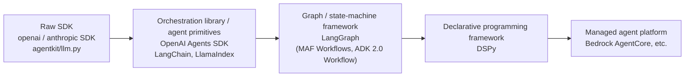
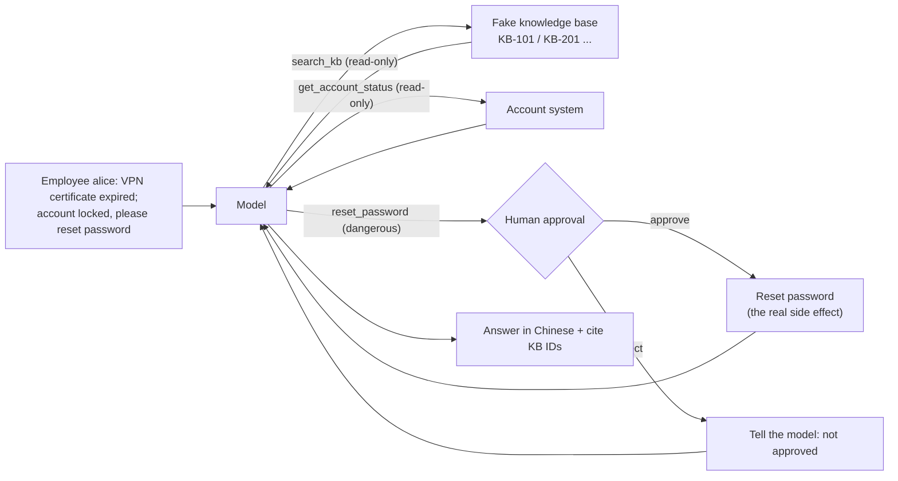
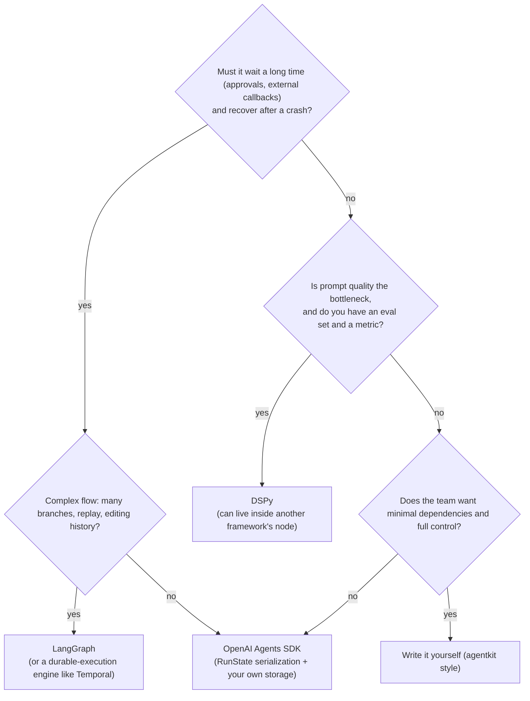

[中文](README.md) | [English](README.en.md)

# Lesson 20: From agentkit to frameworks — DSPy / LangGraph / OpenAI Agents SDK

> 🕐 Time: 25 min | 🎯 You'll be able to: get productive with DSPy, LangGraph, and the OpenAI Agents SDK within an hour, explain what each framework does for you and what it hides from you, and choose between them with clear reasoning | 📦 Source: [`shared_tools.py`](shared_tools.py) (the shared task), [`impl_agentkit.py`](impl_agentkit.py), [`impl_dspy.py`](impl_dspy.py), [`impl_langgraph.py`](impl_langgraph.py), [`impl_openai_agents.py`](impl_openai_agents.py), [`agentkit/agent.py`](../../agentkit/agent.py)
>
> 📖 Primary reading: [Khattab et al. 2024, *DSPy: Compiling Declarative Language Model Calls into Self-Improving Pipelines* (ICLR 2024)](https://arxiv.org/abs/2310.03714)

This lesson covers the topic of week 3 of Stanford's CS329Z (Fall 2026), "Frameworks & Agent Design", and its primary reading is that week's publicly listed required paper. This project is not affiliated with Stanford University or the course.

## 0. In one sentence

**A framework is "an agentkit someone else wrote for you": it saves you from writing the loop, but not from understanding it.**

So far in this course you have been driving stick: how messages are assembled, when the loop stops, how an approval pauses and resumes, where trace data goes — you wrote all of it. Now you switch to an automatic: DSPy, LangGraph, the OpenAI Agents SDK. Automatics are far easier to drive, but when something breaks, the person who understands the gearbox finds it in five minutes, and everyone else stares at the dashboard.

This lesson puts four implementations side by side on one concrete task: **the same IT help-desk question, the same tools, and the same operation that needs human approval**, built with agentkit, DSPy, LangGraph, and the OpenAI Agents SDK, all running for real against the same local model gateway. You will see things you would never guess without reading the source:

- DSPy's ReAct **does not use the model's native tool calling at all**. Tool descriptions are written into the prompt, and on the same task it uses 1.4–3.5 times as many input tokens as the other three.
- When LangGraph resumes after an approval, the approval node **runs again from the top**. That is by design, not a bug — and if you get it wrong, you charge the customer twice.
- The OpenAI Agents SDK's tracing is **on by default and uploads to OpenAI**. If you point it at a local gateway and do nothing, your conversation data will try to leave the building.
- Write "high risk, requires approval" in a tool description and the model may **simply refuse to call the tool**, so the approval flow never fires.

Anthropic's *Building Effective Agents* gives very practical advice here: start with the model API directly — many patterns take only a few lines — and if you do use a framework, make sure you understand the code underneath, because wrong assumptions about what is under the hood are a common source of customer errors. This lesson follows that line: **framework on the outside, principles on the inside**.

## 1. Core concepts

### 1.1 The abstraction spectrum

"Framework" is too vague a word. Sort the options by "what you write versus what the framework owns" and you get a spectrum:



| Layer | What you write | What the framework does for you | What it hides | Examples |
|---|---|---|---|---|
| Raw SDK | Messages, loop, tool execution, retries, state — everything | HTTP and data formats only | Almost nothing | `openai`, `anthropic` SDKs |
| Orchestration library / agent primitives | Agent definition, tool functions, a little control flow | Model↔tool loop, tool schemas, approval pauses, tracing | Loop details and defaults (retry counts, where traces go) | OpenAI Agents SDK, LangChain |
| Graph / state-machine framework | Node functions, edges, state schema | Scheduling, a checkpoint per step, interrupt and resume, replay | Super-step scheduling, the re-run-on-resume semantics | LangGraph |
| Declarative programming framework | Signatures ("what goes in, what comes out") + module composition + an evaluation metric | **The prompt itself** (generation, parsing, automatic optimization) | Every word sent to the model | DSPy |
| Managed agent platform | Configuration and business code, deployed to the cloud | Runtime, sessions, memory, identity, sandboxes, observability | The infrastructure itself; your data and runs live on someone else's servers | Amazon Bedrock AgentCore, etc. |

The further right you go, the less code you write and **the more you cannot see**. Right is not "more advanced": every step to the right trades control for development speed.

> Name clash: in October 2025 OpenAI released a product suite called **AgentKit** (the visual Agent Builder, ChatKit, and more). It shares a name with this course's `agentkit` and nothing else. Its Agent Builder was announced as deprecated in June 2026 with a shutdown date of November 30, 2026 — a ready-made example of the "platform lock-in" risk in section 5.2.

### 1.2 Two axes: abstracting control flow vs. abstracting prompts

The spectrum makes it tempting to read DSPy as "a more advanced LangGraph". In fact they abstract two different things:

| | Abstracts control flow (loops, branches, pause, resume) | Abstracts prompts (how you talk to the model) |
|---|---|---|
| **LangGraph** | ✅ Core strength: graph + checkpoints + interrupt | ❌ You write every prompt |
| **OpenAI Agents SDK** | ✅ Runner owns the loop, approvals, handoffs | ⚪ Only `instructions`; assembly is fixed |
| **DSPy** | ⚪ Modules like ReAct carry a simple loop; no pause/resume | ✅ Core strength: signature → prompt, plus automatic optimization |
| **agentkit** | ✅ Your hand-written `Agent._loop_body` + checkpoints | ❌ Your hand-written system prompt |

So they **compose**: LangGraph runs the workflow and approvals, and one of its nodes calls a DSPy program for classification or extraction. That is a common setup.

### 1.3 The task in this lesson



Six comparison dimensions, written out with the same headings at the top of all four implementation files so you can read them side by side: **how state is represented, how tools are declared, where the loop lives, how checkpoints and interrupts work, how tracing hooks in, sync or async**. All four implementations' `run()` are `async def`, each using its framework's async entry point: agentkit's `await agent.run(...)`, DSPy's `await agent.acall(...)`, LangGraph's `await graph.ainvoke(...)`, and the OpenAI Agents SDK's `await Runner.run(...)`.

### 1.4 Concept map

This table is the data source for exercise (c) (`map_concept` parses the Chinese version of this Markdown directly), and your quick reference for "what is agentkit's X called in framework Y". All API names were checked in September 2026 against the official docs and the installed packages (dspy 3.4.0, langgraph 1.2.12, openai-agents 0.22.3).

<!-- concept-map:start -->
| agentkit | DSPy | LangGraph | OpenAI Agents SDK |
|---|---|---|---|
| `Agent` / `Agent.run` | `dspy.ReAct(signature, tools)`; calling the module runs it; async entry point `await module.acall(...)` | `StateGraph(...).compile()`, `graph.invoke(inputs, config)`; async version `await graph.ainvoke(...)` | `Agent(...)` + `await Runner.run(agent, input)` (`Runner.run_sync` is a sync wrapper) |
| `max_steps` | `ReAct(max_iters=20)` (default 20); on reaching it, stops and extracts an answer | `recursion_limit` (default 1000, counted in super-steps); exceeding it raises `GraphRecursionError` | `max_turns` (default 10); exceeding it raises `MaxTurnsExceeded` |
| `@tool` / `Tool` | Plain functions or `dspy.Tool`; descriptions go into the prompt, no native function calling | `langchain_core.tools.tool` + `model.bind_tools()`; execute with `ToolNode` or your own node | `@function_tool` (strict JSON Schema; the docstring's Args section becomes parameter descriptions) |
| `ToolContext` | No equivalent; inject via closures | Nodes declare a `runtime` parameter and read `runtime.context` (`StateGraph(State, context_schema=...)`) | `RunContextWrapper`, passed via `Runner.run(context=...)`, never sent to the model |
| `RunState` / `Checkpointer` | No runtime checkpoints (`program.save()` stores optimized instructions and demos, not run state) | A checkpointer (`InMemorySaver` / `PostgresSaver`) + `thread_id`; one checkpoint per super-step | `RunState` (`to_string()` / `from_string()`); multi-turn history goes in a `Session` |
| `PauseRun` / `approve` / `PermissionPolicy` | No pause mechanism; wait for the approver's answer right there inside the tool | `interrupt(payload)` in a node; resume with `ainvoke(Command(resume=...), config)` (sync version `invoke`); the node re-runs from the top | `needs_approval=True` on the tool → `result.interruptions` → `state.approve()` / `state.reject()` → `Runner.run(agent, state)` |
| `Hook` | `BaseCallback` (`on_lm_start` / `on_tool_start`, etc.; mainly for observation) | Nodes and edges are the insertion points; LangChain v1's `create_agent` uses `AgentMiddleware` | `RunHooks` / `AgentHooks` (mostly observational) |
| `InputGuard` / `OutputGuard` | No built-in guardrails; `dspy.BestOfN` can retry against a reward function | None built in; write a node or use LangChain middleware (e.g. `PIIMiddleware`) | `@input_guardrail` / `@output_guardrail` (tripwires); tool-level `@tool_input_guardrail` |
| `Tracer` / `Span` | `lm.history`, `dspy.inspect_history()`, `BaseCallback`, MLflow's `mlflow.dspy.autolog()` | Replay checkpoints with `get_state_history()`; online tracing via LangSmith (`LANGSMITH_TRACING=true`) | Built-in tracing, uploads to OpenAI by default; replace with `set_trace_processors()`, disable with `set_tracing_disabled(True)` |
| `ScriptedLLM` | `dspy.utils.DummyLM` | `GenericFakeChatModel` (langchain_core; you add `bind_tools` yourself) | `agents.testing.ScriptedModel` |
| `complete_json` | Typed output fields on the signature, parsed by an Adapter (`ChatAdapter` / `JSONAdapter`) | `model.with_structured_output(Schema)` | `Agent(output_type=PydanticModel)`; result in `result.final_output` |
| `ResilientLLM` | `dspy.LM(num_retries=3)` (default 3) | Node-level `RetryPolicy`; the model client's `max_retries` | `ModelSettings(retry=...)`; the client's `max_retries` |
| `SlidingWindow` / `SummarizingCompactor` | ReAct drops the oldest trajectory step when the context overflows (`truncate_trajectory`) | `trim_messages`; LangChain `SummarizationMiddleware` | `OpenAIResponsesCompactionSession`; a handoff's `input_filter` |
| `agent_as_tool` | Module composition: call submodules in `forward()` | A subgraph as a node, or call a sub-agent inside a tool | `agent.as_tool()`; transfer control with `handoffs=[...]` |
| `workflows` | A custom `dspy.Module` with plain Python control flow in `forward()` | Nodes + conditional edges; `Send` for dynamic fan-out | Code-driven orchestration (`asyncio.gather`) or LLM-driven (handoff / `as_tool`) |
| `parallel_tools` (read-only tools from one turn run concurrently) | None: ReAct picks one tool per turn; run several modules in parallel with `dspy.Parallel` | Multiple nodes triggered in the same super-step run concurrently | All function tool calls from one turn run concurrently by default (cap it with `RunConfig(tool_execution=ToolExecutionConfig(max_function_tool_concurrency=...))`) |
<!-- concept-map:end -->

Every agentkit API in the table is async: `await agent.run(...)`, `await agent.approve(...)`, and tools may be `async def`. Of the four, only agentkit has no sync entry point at all (Lesson 02 explains why).

For a fuller comparison (including Claude Agent SDK, Google ADK, CrewAI, Microsoft Agent Framework, and Temporal), see [agentkit concepts ↔ mainstream frameworks](../../docs/framework-comparison.en.md).

## 2. One task, four implementations (side by side)

### 2.1 The shared part: `shared_tools.py`

To keep the comparison fair, all four implementations share [`shared_tools.py`](shared_tools.py): the same `QUESTION`, the same `SYSTEM_PROMPT`, the same tools, the same approver `auto_approver`, and the same result type `FrameworkResult`. The file depends on no framework.

Two design decisions are worth covering first:

**① Tools are plain functions; identity is injected through a closure.** All four frameworks can wrap "a plain function with type hints and a docstring" as a tool, so the tools are written once:

```python
class ITDesk:
    def __init__(self, user_id: str = "alice"):
        self.user_id = user_id          # passed in by the system; the model never sees it
        ...
    def functions(self):
        desk = self
        def reset_password(reason: str) -> str:
            """Reset the current user's password: unlock the account and email a one-time reset link.
            Args:
                reason: why, in one sentence; goes into the audit record
            """
            desk.resets.append(desk.user_id)   # identity comes from the closure, not a model argument
            ...
```

Why not let the model pass a `username`? As Lesson 03 put it: letting the model decide "who am I" lets a prompt-injection attacker decide "who am I". Every framework has its own context-injection mechanism (see the `ToolContext` row in the concept map), but DSPy does not; a closure is the one approach that is identical in all four.

**② Don't write "requires approval" in the tool description.** We hit this in a real run. `reset_password` was first described as "reset the user's password (high risk, requires approval)". The model read that and told the user "this is a high-risk operation, please submit an approval request first and I'll continue" — **it never called the tool**, so the approval flow never fired even once. Approval is the system's job, not the model's. Describe only what the tool does, and if needed say explicitly "the system routes this to human approval automatically; just call it" (which is what `SYSTEM_PROMPT` does).

### 2.2 Baseline: the agentkit version

[`impl_agentkit.py`](impl_agentkit.py) is what you built by hand in the earlier lessons — 65 effective lines of code:

```python
tools = [
    tool(fns["search_kb"]),
    tool(fns["get_account_status"]),
    tool(fns["reset_password"], risk="dangerous"),   # risk level is a property of the tool
]
agent = Agent(llm, tools, system_prompt=shared.SYSTEM_PROMPT, max_steps=8,
              hooks=[PermissionPolicy(ask_risks={"dangerous"})], tracer=Tracer())

result = await agent.run(question, metadata={"user_id": desk.user_id})
while result.status == "paused":                     # state is persisted; the process may exit
    call = result.pending_approval
    ok = approver(call.name, call.parsed_args())
    result = await agent.approve(result.run_id, ok, by="demo-approver")
```

| Dimension | How agentkit does it |
|---|---|
| State | `RunState`: messages, step count, usage, pending call, approval log — saved to a `Checkpointer` at every step |
| Tools | `@tool` generates the JSON Schema from type hints; `risk` marks the risk level |
| Loop | `Agent._loop_body`: `while step < max_steps` → call the model → run tools → stop when there are no tool calls |
| Checkpoint / interrupt | `PermissionPolicy.before_tool` raises `PauseRun` → persisted → `approve()` resumes from the checkpoint |
| Tracing | `Tracer`: nested `agent.run` / `llm.chat` / `tool.*` spans |
| Sync / async | Async only: `await agent.run()`; read-only tools from one turn run concurrently with `asyncio.gather`, and if any tool writes they run in order |

Keep this table in mind; the three frameworks below are all compared against it.

### 2.3 The DSPy version: hand the prompt to the framework

The core of [`impl_dspy.py`](impl_dspy.py) is a few lines:

```python
class ITHelpdesk(dspy.Signature):
    __doc__ = shared.SYSTEM_PROMPT          # the docstring *is* the instruction
    question: str = dspy.InputField(desc="the employee's IT question")
    answer: str = dspy.OutputField(desc="reply to the employee in Chinese, citing knowledge-base article IDs")

lm = dspy.LM(f"openai/{model}", api_base=base_url, api_key=api_key, cache=False)
agent = dspy.ReAct(ITHelpdesk, tools=[dspy.Tool(f) for f in ...], max_iters=8)
with dspy.context(lm=lm, callbacks=[counter]):   # built on contextvars, so it's safe in async code too
    pred = await agent.acall(question=question)  # async entry point; the sync form is agent(question=question)
```

You did not write a single word of prompt. So what does the model receive? The system message in `lm.history[0]` (excerpt from a real run; the Chinese parts are the lesson's own instructions and tool docstrings, translated here):

```text
Your input fields are:
1. `question` (str): the employee's IT question
2. `trajectory` (str):
Your output fields are:
1. `next_thought` (str):
2. `next_tool_name` (Literal['search_kb', 'get_account_status', 'reset_password', 'finish']):
3. `next_tool_args` (dict[str, Any]):
...
In adhering to this structure, your objective is:
        You are the company's IT help-desk assistant. Search the knowledge base with search_kb before answering...
        You are an Agent. In each episode, you will be given the fields `question` as input. ...
        (1) search_kb, whose description is <desc>Search the company IT knowledge base...</desc>. It takes arguments {'query': ...}.
        ...
        (4) finish, whose description is <desc>Marks the task as complete. ...</desc>. It takes arguments {}.
```

That is what DSPy "hides" — and also its entire value:

| Dimension | How DSPy does it | Difference from agentkit |
|---|---|---|
| State | No run-state object; ReAct concatenates thought / tool_name / tool_args / observation into a `trajectory` string field | Nothing serializable that represents "half-way through a run" |
| Tools | Function signatures and docstrings are **written into the prompt**; the model picks a tool "in text" via the `next_tool_name` and `next_tool_args` output fields | No native function calling (ChatAdapter defaults to `use_native_function_calling=False`); one tool per turn |
| Loop | `ReAct.forward`: up to `max_iters` turns; stops when the model picks the built-in `finish` tool; **then one more `ChainOfThought` call extracts the answer from the trajectory** | Always one extra model call |
| Checkpoint / interrupt | None. Approval can only **wait right there** inside the tool for the approver's answer (this lesson wraps it with `with_approval`), like agentkit's `PermissionPolicy(approver=...)` rather than a persisted `PauseRun` pause | If the approver doesn't answer, the run just stays stuck there; a restart loses everything |
| Tracing | `lm.history` (messages, usage, cost), `dspy.inspect_history()`, `BaseCallback`, MLflow | This lesson counts events with a `BaseCallback` |
| Sync / async | Calling a module directly is sync; `await module.acall()` is the async entry point (used here) | On the async path, sync tool functions run directly on the event loop, not in a thread pool: write slow tools as `async def` (this lesson's approval wrapper is async) |

In real runs the DSPy version made **4 model calls and used about 5,200 input tokens** all four times, while the other three made 2–4 calls with 1,500–3,600 input tokens; it usually took longer, too. What you get in exchange: the prompt becomes a "parameter" a program can rewrite.

**Two details for connecting to the gateway:**
- The `"openai/<model name>"` prefix means "call it with the OpenAI-compatible protocol"; `api_base` points at the local gateway. Starting with DSPy 3.4.0 (released 2026-09-25), `dspy.LM` defaults to `engine="auto"`: it uses its new native engine, lm15, when it can and falls back to LiteLLM otherwise. On our local gateway, `auto` picked lm15; setting `DSPY_ENGINE=litellm` (which `impl_dspy.py` reads) to force LiteLLM also works. Many tutorials say "DSPy calls models through LiteLLM" — since 3.4 that is no longer the whole story.
- `cache=False`: DSPy **caches model responses by default**. Without this, a second run of the same question "finishes in 0 seconds with 0 model calls" and every comparison number is wrong.

#### DSPy's core idea: signatures, modules, optimizers

The core claim of the DSPy paper (this lesson's primary reading) is: **write LM pipelines as programs and treat prompts as parameters that can be "compiled"**, rather than strings you tune by hand. Three concepts:

| Concept | Plain words | Analogy | Code in this lesson |
|---|---|---|---|
| **Signature** | A declaration of what goes in and what comes out; the official definition is "a declarative specification of input/output behavior of a DSPy module" | A function signature | `ITHelpdesk`; you build one in exercise (b) |
| **Module** | A signature plus a calling strategy (`Predict` asks directly, `ChainOfThought` reasons first, `ReAct` loops with tools); modules compose like neural-network layers | A neural-network layer | `dspy.ReAct`; `Predict` in exercise (b) |
| **Optimizer** (formerly "teleprompter") | Given a program, a few training examples, and a metric, automatically rewrites instructions, picks few-shot demos, or even fine-tunes weights to raise the metric | A compiler / trainer | Not run here; see [Lesson 23](../23_optimization/README.en.md) |

What optimizers change is concrete: **instructions and demos**. That is why the `Signature` in exercise (b) has `with_instructions()` and `with_demos()` — those are exactly the "parameters" an optimizer tunes. Optimizers listed in the official docs include `BootstrapFewShot` (generates demos with a teacher program), `MIPROv2` (Bayesian optimization over instructions and demos together), `GEPA` (has the model reflect on execution trajectories to improve prompts), and `BootstrapFinetune` (distills a prompt-based program into weights). They all follow the same pattern:

```python
optimizer = dspy.BootstrapFewShotWithRandomSearch(metric=my_metric, max_bootstrapped_demos=4, max_labeled_demos=4)
optimized_program = optimizer.compile(my_program, trainset=trainset)
```

Results reported in the paper's abstract: within minutes of compiling, a few lines of DSPy let GPT-3.5 self-bootstrap pipelines that generally beat standard few-shot prompting by over 25% and pipelines with expert-created demonstrations by up to 5–46%; for Llama2-13b-chat the figures are over 65% and 16–40%. How these optimizers work — and how to tell whether an optimization really helped — is left to Lesson 23.

### 2.4 The LangGraph version: draw the control flow as a graph

There is no `while` loop in [`impl_langgraph.py`](impl_langgraph.py) — the loop is a back edge in the graph:

```python
class HelpdeskState(TypedDict):
    messages: Annotated[list[AnyMessage], add_messages]  # reducer: append instead of overwrite
    decisions: dict[str, bool]                           # no reducer: last write wins

async def approval(state):                          # nodes may be async def (the agent and tools nodes await the model and tools)
    # This node re-runs from the top on resume: only read state and call interrupt, no side effects
    decisions = dict(state.get("decisions") or {})
    for call in state["messages"][-1].tool_calls:
        if call["name"] in shared.NEEDS_APPROVAL and call["id"] not in decisions:
            decisions[call["id"]] = bool(interrupt({"tool": call["name"], "args": call["args"]}))
    return {"decisions": decisions}

builder = StateGraph(HelpdeskState)
builder.add_node("agent", agent); builder.add_node("approval", approval); builder.add_node("tools", run_tools)
builder.add_edge(START, "agent")
builder.add_conditional_edges("agent", route)     # tool calls → approval, otherwise → END
builder.add_edge("approval", "tools")
builder.add_edge("tools", "agent")                # back edge: this *is* the agent loop
graph = builder.compile(checkpointer=InMemorySaver())

result = await graph.ainvoke(inputs, {"configurable": {"thread_id": tid}, "recursion_limit": 25})
while result.get("__interrupt__"):
    ok = approver(...)
    result = await graph.ainvoke(Command(resume=ok), config)   # resume on the same thread_id
```

| Dimension | How LangGraph does it | Difference from agentkit |
|---|---|---|
| State | A `TypedDict` + an optional reducer per field (`add_messages` = append) | You define the state schema; nodes return only partial updates |
| Tools | Wrap with `tool(f)`, hand to the model with `model.bind_tools()`; execute with `ToolNode` — this lesson writes its own `tools` node | Validation, timeouts, and truncation are yours to guarantee |
| Loop | The back edge `tools → agent`; `recursion_limit` (default 1000) caps super-steps | It caps super-steps, not model calls |
| Checkpoint / interrupt | Per the official docs, a checkpointer saves a state snapshot at **every super-step**; `interrupt()` pauses, `Command(resume=...)` resumes | **On resume, the interrupted node re-runs from the top** |
| Tracing | `get_state_history(config)` (newest first) is a replayable execution record; LangSmith for online tracing | Checkpoints double as the execution log |
| Sync / async | Two entry points, `invoke` / `ainvoke`; nodes may be `async def`; multiple nodes in the same super-step run concurrently | Under `ainvoke`, sync nodes run in a thread pool (thread name `asyncio_0` in a test here); the same goes for a tool's `ainvoke` |

**Why make approval its own node?** Because the official docs say it plainly: on resume the node executes again from the beginning, so the code before `interrupt()` runs twice. Real run output (re-run on 2026-09-28 after switching to `ainvoke`; the numbers are unchanged; demo output translated from Chinese):

```text
  · 9 checkpoints (one per super-step; get_state_history can replay each one)
  · Node runs {'agent': 3, 'approval': 3, 'tools': 2}; 1 approval — the extra approval run = the node re-ran from the top on resume
```

Put `interrupt()` in the `tools` node after `search_kb`, and `search_kb` runs again on resume. Harmless for a read-only tool; an incident if it's "charge the card". The rule: **the node that calls `interrupt()` only reads state and has no side effects**. Likewise, don't wrap `interrupt()` in a bare `try/except` — it pauses by raising, and you would swallow it.

One easy-to-miss consequence: the approval node here gates the whole batch. When the model calls `search_kb` and `reset_password` in the same turn, **even the read-only `search_kb` waits until the approval comes through** (`test_integration.py` pins this behavior). The OpenAI Agents SDK behaves differently; see the next section.

**Connecting to the gateway:** `ChatOpenAI(model=..., base_url=..., api_key=..., use_responses_api=False)`. The official docs say `ChatOpenAI` automatically switches to the Responses API when certain features (such as reasoning parameters) are used, and many compatible gateways only support `/chat/completions`, so turning it off explicitly is safer. The docs also warn that `ChatOpenAI` only parses responses per the official OpenAI spec, so non-standard third-party fields (such as `reasoning_content`) are dropped.

### 2.5 The OpenAI Agents SDK version: the one closest to agentkit

[`impl_openai_agents.py`](impl_openai_agents.py):

```python
client = AsyncOpenAI(base_url=cfg["base_url"], api_key=cfg["api_key"], max_retries=2)
model = OpenAIChatCompletionsModel(model=cfg["model"], openai_client=client)
agent = Agent(name="it-helpdesk", instructions=shared.SYSTEM_PROMPT, model=model, tools=[
    function_tool(fns["search_kb"]),
    function_tool(fns["get_account_status"]),
    function_tool(fns["reset_password"], needs_approval=True),   # approval is a property of the tool
])
set_trace_processors([LocalSpanCounter()])     # replace the default "upload to OpenAI" processor

result = await Runner.run(agent, question, max_turns=8)
while result.interruptions:
    saved = result.to_state().to_string()                 # store it in a database; resume hours later
    state = await RunState.from_string(agent, saved)
    for item in result.interruptions:
        state.approve(item) if approver(item.name, json.loads(item.arguments)) else state.reject(item)
    result = await Runner.run(agent, state, max_turns=8)
```

| Dimension | How the OpenAI Agents SDK does it | Difference from agentkit |
|---|---|---|
| State | `RunState`: the complete half-way state, serializable; a `Session` separately holds multi-turn history | Split in two: Session ≈ chat log, RunState ≈ agentkit's `RunState` |
| Tools | `@function_tool`: type hints + the docstring's Args section → strict JSON Schema; `needs_approval` marks approval | Approval is marked on the tool rather than decided by a separate permission policy |
| Loop | `Runner.run(..., max_turns=10)`; exceeding it raises `MaxTurnsExceeded` | Nearly one-to-one |
| Checkpoint / interrupt | `result.interruptions` → `to_state()` → `approve()` / `reject()` → `Runner.run(agent, state)` | Tools that don't need approval **run before the pause**; only the one awaiting approval is held back |
| Tracing | Built in, **on by default and uploads to OpenAI**; replace with `set_trace_processors()`, disable with `set_tracing_disabled(True)` | agentkit keeps traces in memory by default |
| Sync / async | Async-native: `await Runner.run()`; multiple function tools from one turn run concurrently | The closest to agentkit; `Runner.run_sync` is only a wrapper and can't be used where an event loop is already running (async functions, FastAPI, Jupyter) |

**Two details for connecting to the gateway:**
- By default the SDK uses `OpenAIResponsesModel`, which calls `/responses`; the official docs warn that many third-party providers don't support it and you may see 404s. Our gateway actually supports both, but for portability (common gateways such as vLLM, DeepSeek, and Qwen mostly offer only Chat Completions) we use `OpenAIChatCompletionsModel` explicitly. The alternative is a global `set_default_openai_api("chat_completions")`.
- Tracing: the official docs recommend `set_tracing_disabled()` if you don't have a platform.openai.com key. This lesson **replaces** instead of disabling: `set_trace_processors([...])` removes the default uploading processor and installs our own local counter — in production, this is where you forward to OpenTelemetry / Langfuse.

Two details you only notice in real data (demo output translated from Chinese):

```text
  · Spans received by the local trace processor: {'Generation': 3, 'Function': 5, 'Turn': 3, 'Agent': 2, 'Task': 2}
  · result.raw_responses = 3 (the resumed result already includes pre-pause responses; don't add them up)
```

- Tools actually ran 4 times, but there are 5 Function spans: the call awaiting approval gets a span before the pause (with empty output) and another when it really runs after resume. Counting tool calls by spans over-counts.
- After resume, `result.raw_responses` already contains the responses from before the pause. We first added the `raw_responses` lengths of both runs and got 5 model calls; `usage.requests` showed the real number was 3. **Count with `result.context_wrapper.usage`** (it accumulates along with `RunState`).

Handoffs, guardrails, and sessions aren't needed for this task; their agentkit mappings are in the concept map in 1.4: a handoff ≈ the "control transfers" version of `agent_as_tool`; `@input_guardrail` / `@output_guardrail` ≈ `InputGuard` / `OutputGuard` (note that input guardrails only apply to the first agent in the chain; see [framework comparison 2.5](../../docs/framework-comparison.en.md#25-guardrails-agentkit-inputguard--tooloutputguard--outputguard)).

### 2.6 All six dimensions side by side

| | agentkit | DSPy | LangGraph | OpenAI Agents SDK |
|---|---|---|---|---|
| **State** | `RunState` (you define it) | A trajectory string; no run-state object | `TypedDict` + reducers | `RunState` + `Session` |
| **Tools** | `@tool` + `risk` | Functions → written into the prompt | `tool()` + `bind_tools()` | `@function_tool` + `needs_approval` |
| **Where the loop lives** | The `while` in `Agent._loop_body` | The `for` in `ReAct.forward` + an extraction step | The graph's back edge `tools → agent` | Inside `Runner.run` |
| **Checkpoint / interrupt** | Persisted every step; `PauseRun` → `approve()` | None; the tool can only wait for the approver in place | A checkpoint per super-step; `interrupt()` → `Command(resume=)`, node re-runs | `interruptions` → `to_state()` → `approve()` |
| **Tracing** | `Tracer`, in memory by default | `lm.history` / callbacks / MLflow | Checkpoint history / LangSmith | Built in, uploads to OpenAI by default |
| **Sync / async** | Async only | Mostly sync; `acall` is the async entry point | Both `invoke` and `ainvoke` | Async-native; `run_sync` is a wrapper |
| **Good for** | Learning the principles; full control | Prompts that must be optimized against data and models; classification, extraction, RAG pipelines | Complex stateful flows, long waits, replay | The fewest abstractions, shipping fast |
| **Cost** | You write everything | Invisible prompts, more tokens, no pause/resume | Heavy mental model (super-steps, reducers, re-run semantics) | Defaults lean toward the OpenAI platform (Responses API, trace upload) |

### 2.7 A framework's core is smaller than you think

What is LangGraph's core? A loop of "run a node → merge state → pick the next edge → save a checkpoint", plus an `interrupt` that "pauses by raising and re-runs the node with a resume value". Exercise (a) has you write that in under 60 lines, then combine it with agentkit's `LLM` and `ToolRegistry` to build an approval agent with the same shape as `impl_langgraph.py` — without a single line of framework code. It is async too: `await graph.invoke(...)` corresponds to LangGraph's `ainvoke`, and nodes may be plain functions or `async def` (the `agent` and `tools` nodes await the model and tools). `interrupt()` finds its resume value through a contextvar, and a contextvar stays valid across `await`s within the same task, so async nodes can pause too. After that, words like "super-step", "reducer", and "node re-run" in the LangGraph docs stop being abstract.

Exercise (b) is the same idea: the core of a DSPy signature is "field declarations → prompt text → parse JSON back into a structure", plus "instructions and demos are replaceable parameters".

## 3. Hands-on: run the demo

```bash
# Offline (runs in CI): only the agentkit version (ScriptedLLM script); other frameworks print instructions
.venv/bin/python lessons/20_frameworks_bridge/demo.py --offline

# Real model: install the frameworks, then run all four in sequence (serially: running them at once would compete for the gateway and make the timings incomparable)
.venv/bin/pip install dspy langgraph langchain-openai openai-agents
.venv/bin/python lessons/20_frameworks_bridge/demo.py
.venv/bin/python lessons/20_frameworks_bridge/demo.py --only dspy,langgraph   # run some frameworks only

# Run a single implementation
.venv/bin/python lessons/20_frameworks_bridge/impl_dspy.py      # also prints the prompt DSPy generated
```

If a framework isn't installed, the demo skips it and prints the install command. Versions verified for this lesson (2026-09-27, Python 3.11):

| Package | Version |
|---|---|
| `dspy` | 3.4.0 (depends on `litellm` 1.83.0) |
| `langgraph` | 1.2.12 (`langgraph-checkpoint` 4.2.0, `langgraph-prebuilt` 1.1.0) |
| `langchain-openai` | 1.6.6 (`langchain-core` 1.6.5) |
| `openai-agents` | 0.22.3 |
| `openai` | 3.19.2 (shared by all four implementations) |

Comparison tables from three full real-model runs (local gateway, gpt-5.5; excerpt of section 5 of the output; demo output translated from Chinese). The first two ran with agentkit 0.1.0 (the sync version); run 3 ran on 2026-09-28 after all four `run()` functions switched to async entry points (effective line counts changed with it: the DSPy version gained 4 lines, mostly the async approval wrapper):

```text
# Run 1
  Framework          Version  LLM calls  Tool calls  Tokens in→out  Time   Effective lines
  ------------------------------------------------------------------------------
  agentkit           0.1.0    3          3           2366→429       12.9s  64
  DSPy               3.4.0    4          2           5238→775       26.5s  79
  LangGraph          1.2.12   3          3           2290→465       12.2s  98
  OpenAI Agents SDK  0.22.3   3          4           2681→422       16.0s  77
# Run 2
  agentkit           0.1.0    2          4           1651→378       12.0s  64
  DSPy               3.4.0    4          2           5257→826       20.6s  79
  LangGraph          1.2.12   2          3           1520→331       9.6s   98
  OpenAI Agents SDK  0.22.3   3          4           2667→497       12.5s  77
# Run 3 (async entry points)
  agentkit           0.2.0    2          3           1526→343       9.0s   65
  DSPy               3.4.0    4          2           5161→590       15.6s  83
  LangGraph          1.2.12   3          4           2610→467       13.6s  99
  OpenAI Agents SDK  0.22.3   4          4           3604→439       13.0s  75
```

What to look for:

1. **DSPy uses 1.4–3.5 times the input tokens of the other three, and always makes one extra call.** The reasons are in 2.3: tool descriptions and the whole trajectory live in the prompt, and a final ChainOfThought extracts the answer. That's not "DSPy is bad" — it's the price of "prompts that can be optimized". If what your use case needs is approvals and long workflows, the price isn't worth paying.
2. **Fewer "effective lines" is not automatically better.** The agentkit version is shortest because the loop, approvals, and tracing already live in `agentkit/` — it *is* a framework. The LangGraph version is longest because you write every node and edge yourself, and in return get fully visible, replayable control flow. Line counts measure how much a framework does for you, not how good it is.
3. **Same model, same prompt, different trajectories.** In run 2, the agentkit and LangGraph versions both called 3–4 tools in parallel in the first turn, dropping from 3 model calls to 2; in run 3, agentkit again called 3 tools in the first turn and made only 2 model calls, while LangGraph took 3 turns this time. The OpenAI Agents SDK version searched the knowledge base twice in all three runs, and made one extra model call in run 3; the DSPy version (one tool per turn) never checked the account status in any of the four runs we did — once it even requested the password reset before searching the knowledge base. That's model randomness, not a framework difference. To compare the frameworks themselves, either fix the script (which is what `test_integration.py` does with each framework's own fake model) or run many times and look at the distribution ([Lesson 22](../22_eval_methodology/README.en.md)).
4. **All four answers cite KB-101, and all say "reset done" only after approval.** Functionally they're equivalent; the differences are all in the places you can't see: the prompts, the checkpoints, where traces go.

## 4. Exercises

Open [`exercise.py`](exercise.py). All three exercises are **offline and framework-free**; the goal is to understand how frameworks work:

| Exercise | You implement | Framework | Key ideas |
|---|---|---|---|
| (a) Mini StateGraph | `validate` / `_merge` / `_next` / `_run` (`async def`) | LangGraph | Conditional edges, reducers, a step limit, a checkpoint per step, `interrupt()` pause and `resume()` re-run; the graph is async, and nodes may be plain functions or `async def` |
| (b) DSPy-style signatures | `parse_signature` / `to_messages` / `parse_output` | DSPy | Generate a prompt from field declarations, turn few-shot demos into conversation turns, parse JSON back into typed structures |
| (c) Concept lookup | `parse_concept_table` / `map_concept` | All | Parse the table in section 1.4 of the Chinese README directly; name normalization, aliases, suggestions for typos |

Suggested order: (c) as a warm-up → (b) → (a). To verify:

```bash
make lesson N=20
# or: .venv/bin/python -m pytest lessons/20_frameworks_bridge/test_exercise.py -v
```

`test_exercise.py` has 20 tests, all offline and deterministic, with no framework installs required. The graph's `invoke` / `resume` and `Predict` are async, so the tests call them with `await`; of the functions you write, only `_run` is `async def` (the node-running step is `update = await self._call_node(...)`), and the rest are pure computation, written as plain `def`. Separately, [`test_integration.py`](test_integration.py) (8 tests) runs the async entry points of the four `impl_*.py` files offline with each framework's own fake model (`DummyLM`, `GenericFakeChatModel`, `agents.testing.ScriptedModel`) and skips automatically when a framework isn't installed. It isn't part of the exercises; its job is to **catch version drift** — when a framework upgrade changes an API, it fails first.

## 5. Going deeper

### 5.1 When to use a framework, and when to write it yourself



| Situation | Recommendation | Why |
|---|---|---|
| Prototypes, internal tools, agents with one or two tools | Raw SDK or OpenAI Agents SDK | A few dozen lines is enough; learning a framework may cost more than the code |
| Approvals, waits of hours, many branches | LangGraph (plus Temporal if needed) | Checkpoints + interrupt + replay are exactly its job |
| Classification, extraction, RAG steps with clear inputs/outputs and labeled data | DSPy | Optimizers search prompts systematically, more reproducibly than hand-tuning |
| Strict compliance: every byte sent to the model must be auditable | Write it yourself, or pick the thinnest framework | Invisible prompts and default trace uploads are both audit headaches |
| Nobody on the team is willing to read framework source | Pick the thinnest one | When something breaks and nobody can dig in, that's the most expensive tech debt |

### 5.2 Three risks: lock-in, debuggability, version drift

**① Framework lock-in.** State formats (LangGraph checkpoints, the SDK's `RunState` JSON), tool declarations, and trace formats are all framework-specific. When you switch frameworks, runs that are waiting for approval can't be migrated. Managed platforms lock you in even harder: OpenAI's Agent Builder, released in October 2025, was announced as deprecated in June 2026 with shutdown on November 30; the migration path the community settled on is "your own backend + the Agents SDK".
*Mitigation*: write business logic (tool functions, permission rules, risk levels) as framework-agnostic code and use the framework only as glue — the idea behind this lesson's `shared_tools.py`.

**② Debuggability.** None of this lesson's four "gotchas" (DSPy's hidden prompt, LangGraph's node re-run, the SDK's cumulative `raw_responses` and doubled Function spans) raises an error. They are all "the result looks right and a number is quietly wrong".
*Mitigation*: on day one, print exactly what is sent to the model (`lm.history`, LangSmith, a trace processor); write a few fixed-script integration tests with fake models.

**③ Version drift.** It happened the very week this lesson was written: DSPy 3.4.0, released 2026-09-25, made `dspy.LM` prefer its own new lm15 engine, with LiteLLM demoted to a compatibility fallback (`engine="auto"`). Earlier, LangGraph v1 deprecated `create_react_agent`; and the OpenAI Agents SDK's current docs state that it defaults to `gpt-5.6-luna` when you don't pick a model — code that relies on defaults quietly changes behavior as the SDK upgrades. A good share of year-old tutorials online no longer run, or behave differently.
*Mitigation*: **pin versions** in `pyproject.toml` (the "verified versions" table exists for exactly this); run contract tests like `test_integration.py` before upgrading; compute traces, counts, and cost with your own definitions instead of the framework's default fields.

### 5.3 "Framework on the outside, principles on the inside" in production

"On the outside": let the framework remove scaffolding — the loop, schema generation, checkpoint storage, trace export.
"On the inside": whatever framework you pick, these stay **in your hands**:

| Stays in your hands | Why the framework can't do it for you | Lesson |
|---|---|---|
| Identity injection and permissions (who may call which tool) | Most frameworks don't do role-based authorization | [Lesson 03](../03_tools/README.en.md), [Lesson 09](../09_security/README.en.md) |
| Idempotent writes | Every checkpoint scheme has a "side effect done, checkpoint not written" window | [Lesson 08](../08_reliability/README.en.md) |
| Eval sets and metrics | A framework gives scaffolding, not your real questions | [Lesson 11](../11_evals/README.en.md) |
| Trace definitions and data destinations | The default may be "upload to the vendor" | [Lesson 10](../10_observability/README.en.md) |
| Budgets (tokens, money, tenant quotas) | Most frameworks only cap steps | [Lesson 14](../14_cost_latency/README.en.md) |
| Release, canary, rollback (framework versions included) | A framework upgrade is itself a release | [Lesson 16](../16_release_ops/README.en.md) |

A practical structure: `business tools (plain functions)` → `your tool-registration layer (risk levels, identity injection, idempotency keys)` → `adapter layer (wrap as a given framework's tools)` → `framework`. Switching frameworks means rewriting only the adapter layer.

### 5.4 Frameworks and platforms this lesson doesn't cover

- **LlamaIndex**: officially positions itself as a framework for building LLM-powered agents over your data; its core concepts are indexes, query engines, agents, and event-driven Workflows. It is data- and retrieval-centric, closer to [Lesson 15](../15_enterprise_rag/README.en.md) and [Lesson 17](../17_retrieval_quality/README.en.md).
- **Managed agent platforms**: take Amazon Bedrock AgentCore. Its docs say it works with any framework and model (naming CrewAI, LangGraph, LlamaIndex, Strands Agents, and others) and offers independently usable services — runtime, memory, gateway, identity, a code-interpreter sandbox, a browser, observability, evaluations, policy — plus a managed agent loop (Harness). Platforms mainly solve deployment and operations; they don't replace designing the agent itself. And the better they get, the more obvious 1.1's "your data and runs live on someone else's servers" becomes.
- Concept-by-concept comparisons for more frameworks (Claude Agent SDK, Google ADK, CrewAI, Microsoft Agent Framework, Temporal) are in the [framework comparison doc](../../docs/framework-comparison.en.md).

### 5.5 Research frontier: from writing prompts to compiling them

The DSPy paper recasts prompt engineering as an optimization problem: humans write the program structure, and a compiler searches the prompts (instructions + demos) against a metric. Follow-up work keeps pushing on "what signal to optimize with": from bootstrapped demos (BootstrapFewShot), to searching instructions and demos together (MIPROv2), to having the model read execution trajectories and reflect in natural language (GEPA). How these optimizers work, and how to choose between them, test-time compute, and fine-tuning, is the topic of [Lesson 23](../23_optimization/README.en.md); how to tell whether "optimized" really means "better" rather than overfitting a small sample is the topic of [Lesson 22](../22_eval_methodology/README.en.md).

## 6. Common pitfalls and anti-patterns

| Pitfall | Symptom | What to do |
|---|---|---|
| Writing "high risk, requires approval" in a tool description | The model refuses to call it and the approval flow never fires (we hit this for real) | Describe only what the tool does; approval is the system's job. If needed, say in the system prompt "just call it; the system routes it to human approval" |
| DSPy caches responses by default | The second run takes 0 seconds and 0 model calls; load tests and comparisons are all wrong | Use `dspy.LM(..., cache=False)` for comparisons and load tests |
| Assuming DSPy's ReAct uses native tool calling | You debug "why won't the model call the tool" with function-calling intuitions and look in completely the wrong place | Read the actual prompt first with `dspy.inspect_history()` |
| The OpenAI Agents SDK uploads traces by default | With a local gateway, conversation data tries to go to OpenAI; without an OpenAI key you get upload-failure errors | Replace with `set_trace_processors([...])` or call `set_tracing_disabled(True)`; or set `OPENAI_AGENTS_DISABLE_TRACING=1` |
| The SDK defaults to the Responses API | Compatible gateways return 404 | Use `OpenAIChatCompletionsModel` or `set_default_openai_api("chat_completions")` |
| `ChatOpenAI` silently switching to the Responses API | After adding some parameter, you suddenly get 404s | `use_responses_api=False` |
| Side effects before LangGraph's `interrupt()` | On resume the side effect runs twice (duplicate email, duplicate charge) | Put `interrupt()` in a separate read-only node; do side effects in the next node |
| Wrapping `interrupt()` in `try/except Exception` | The pause gets swallowed and the graph keeps going | Don't; or re-raise it unchanged |
| Adding up `raw_responses` across runs | Model calls get double-counted (here: 5 computed, 3 real) | Use `result.context_wrapper.usage.requests` |
| Using `InMemorySaver` in production | A process restart loses every run awaiting approval | The official docs mark it as experimentation-only; use `PostgresSaver` or similar in production |
| Following a year-old tutorial | `create_react_agent` deprecation warnings, a changed DSPy call path, a changed default model | Pin versions; trust the current official docs; write contract tests |
| Calling a framework's sync entry point inside an async service | `graph.invoke` or calling a DSPy module directly blocks the event loop, and every session waits; `Runner.run_sync` raises when an event loop is already running | Use the async entry points: `ainvoke`, `acall`, `await Runner.run(...)`; write slow DSPy tools as `async def` |

## 7. Interview & design-review questions

<details>
<summary>1. On the same agent task, why can DSPy use twice the tokens of the OpenAI Agents SDK?</summary>

- DSPy's `ReAct` doesn't use native function calling: tool descriptions, field-format instructions, and the whole trajectory are written into the prompt as text on every turn.
- It picks one tool per turn (no parallel calls), and after finishing it makes one more `ChainOfThought` call to extract the answer from the trajectory.
- Measured here: DSPy made 4 calls with about 5,200 input tokens; the other three made 2–4 calls with 1,500–3,600 input tokens.
- That's the price of "prompts that can be optimized": only a textual prompt can be rewritten by an optimizer. If you don't plan to use optimizers, the price isn't worth paying.
</details>

<details>
<summary>2. When a LangGraph interrupt resumes, where does the node continue? What does that require of your code?</summary>

- It re-executes **from the top of the node**, not from the `interrupt()` line. The second time execution reaches `interrupt()`, it returns the resume value directly.
- Requirements: code before `interrupt()` must be idempotent or side-effect-free; don't wrap `interrupt()` in a bare `try/except`; keep the order of multiple `interrupt()` calls in a node stable (resume values are matched by order).
- In practice: make approval its own read-only node and put side effects in the next node. In this lesson's output, the approval node ran 3 times for 1 approval; the extra run is the re-execution.
</details>

<details>
<summary>3. You're migrating an in-house, agentkit-style agent to a framework. How do you design it to avoid lock-in?</summary>

- Write business tools as framework-agnostic pure functions; inject trusted data such as identity and tenant through the system (closures or the framework's context mechanism), never as model arguments.
- Keep your own tool-registration layer — risk levels, idempotency keys, permission rules — and map it onto the framework's mechanisms (`needs_approval`, `interrupt`, and so on).
- Define traces in OpenTelemetry terms and forward them through the framework's processors/callbacks instead of relying on the vendor's backend.
- Write contract tests with the framework's fake models to pin key behaviors (dangerous tools don't run before approval; no retry after rejection).
- Pin versions, and treat framework upgrades as releases that go through a canary.
</details>

<details>
<summary>4. What are DSPy's signatures, modules, and optimizers? What exactly does an optimizer change?</summary>

- Signature: a declarative spec of input/output fields (names, types, descriptions + instructions).
- Module: a signature plus a calling strategy (`Predict`, `ChainOfThought`, `ReAct`); modules compose into programs.
- Optimizer: given a program, training examples, and a metric, it automatically adjusts the program's "parameters" — mainly each predictor's **instructions** and **few-shot demos**; some optimizers can also fine-tune weights (`BootstrapFinetune`).
- The program structure (how modules compose, the control flow) is not changed. That's "humans write the structure, machines tune the prompts".
</details>

<details>
<summary>5. You're connecting the OpenAI Agents SDK to an internal gateway that only supports Chat Completions. What do you need to watch out for?</summary>

- Model: the default `OpenAIResponsesModel` calls `/responses`; switch to `OpenAIChatCompletionsModel(openai_client=AsyncOpenAI(base_url=...))`, or call `set_default_openai_api("chat_completions")` globally.
- Tracing: on by default and uploads to OpenAI. On an internal network, either `set_tracing_disabled(True)` or install your own exporter with `set_trace_processors()`.
- Structured output: the official docs warn that some providers don't support `json_schema`, so `output_type` may fail.
- Counting: use `result.context_wrapper.usage`; don't add up `raw_responses`.
</details>

<details>
<summary>6. Can a checkpoint scheme (LangGraph checkpointer / SDK RunState / agentkit Checkpointer) guarantee that a write happens exactly once?</summary>

- No. Every checkpoint scheme has a window where "the side effect has happened but the checkpoint hasn't been written"; crash in that window and the write runs again after recovery.
- LangGraph adds one more layer: the interrupted node re-runs in full on resume.
- The only fix is idempotent writes: a stable idempotency key (such as `run_id:call_id`) that lets the downstream deduplicate; see Lessons 08 and 13.
</details>

<details>
<summary>7. When would you advise a team to skip frameworks and write it directly?</summary>

- The flow is simple (one loop, a few tools), so learning and upgrading a framework costs more than it saves.
- Compliance requires byte-level auditing of what is sent to the model, and the framework hides or rewrites prompts.
- You need execution semantics the framework doesn't support (special retries, tenant-level budgets, a custom approval flow), and forcing them in makes things more complex.
- Nobody on the team is willing to read framework source — being unable to dig in when something breaks is the most expensive outcome.
- But if you need reliable long waits and crash recovery, "write it ourselves" usually underestimates the difficulty; that's when durable execution (a LangGraph checkpointer, Temporal) earns its place.
</details>

## 8. Self-check

- [ ] I can draw the abstraction spectrum from raw SDK to managed platform and say what each layer hides
- [ ] I can explain why DSPy and LangGraph can be combined (they abstract along two different axes)
- [ ] I can build a "search the knowledge base + a tool that needs approval" agent in all three frameworks and connect it to an OpenAI-compatible gateway
- [ ] I know why DSPy's ReAct makes one extra model call and why it uses more tokens
- [ ] I can explain LangGraph's re-run-on-resume semantics for `interrupt()` and what it requires of my code
- [ ] I know where the OpenAI Agents SDK sends traces by default and how to disable or replace that
- [ ] I can explain DSPy's signatures, modules, and optimizers, and what optimizers actually change
- [ ] I implemented the mini StateGraph (nodes, conditional edges, reducers, checkpoints, interrupt / resume)
- [ ] I can give reasons for "framework vs. write it yourself", and ways to reduce lock-in and version-drift risk

## Further reading

- 📖 Primary reading: Omar Khattab et al., [*DSPy: Compiling Declarative Language Model Calls into Self-Improving Pipelines*](https://arxiv.org/abs/2310.03714), ICLR 2024
- Erik Schluntz and Barry Zhang (Anthropic), [*Building Effective Agents*](https://www.anthropic.com/engineering/building-effective-agents), December 2024: advice on when and how to use frameworks
- DSPy docs: [Signatures](https://dspy.ai/learn/programming/signatures/), [Language models](https://dspy.ai/learn/programming/language_models/), [Optimizers](https://dspy.ai/learn/optimization/optimizers/), [Debugging & observability](https://dspy.ai/tutorials/observability/)
- LangGraph docs: [Graph API](https://docs.langchain.com/oss/python/langgraph/graph-api), [Interrupts](https://docs.langchain.com/oss/python/langgraph/interrupts), [Checkpointers](https://docs.langchain.com/oss/python/langgraph/checkpointers), [ChatOpenAI](https://docs.langchain.com/oss/python/integrations/chat/openai)
- OpenAI Agents SDK docs: [Overview](https://openai.github.io/openai-agents-python/), [Models (non-OpenAI providers)](https://openai.github.io/openai-agents-python/models/), [Human-in-the-loop](https://openai.github.io/openai-agents-python/human_in_the_loop/), [Tracing](https://openai.github.io/openai-agents-python/tracing/)
- In this repo: [agentkit concepts ↔ mainstream frameworks](../../docs/framework-comparison.en.md) (covers more frameworks), [Lesson 23: Optimization](../23_optimization/README.en.md) (how DSPy optimizers work)
