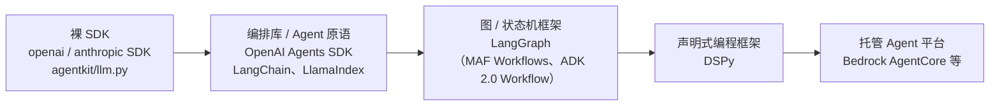
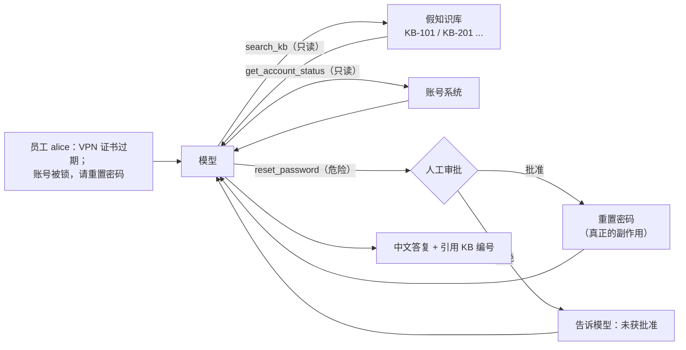
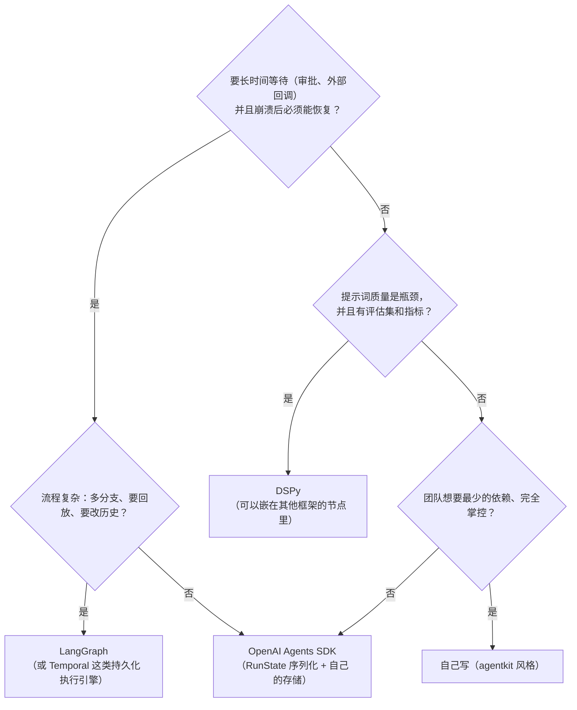

[中文](README.md) | [English](README.en.md)

# 第 20 课：从 agentkit 到框架 —— DSPy / LangGraph / OpenAI Agents SDK

> 🕐 建议用时：25 分钟 ｜ 🎯 学完你能：一小时内用上 DSPy、LangGraph、OpenAI Agents SDK 三个主流框架，说清每个框架"替你做了什么、藏起了什么"，并按场景做出有依据的选型 ｜ 📦 对应源码：[`shared_tools.py`](shared_tools.py)（共同任务）、[`impl_agentkit.py`](impl_agentkit.py)、[`impl_dspy.py`](impl_dspy.py)、[`impl_langgraph.py`](impl_langgraph.py)、[`impl_openai_agents.py`](impl_openai_agents.py)、[`agentkit/agent.py`](../../agentkit/agent.py)
>
> 📖 必读：[Khattab et al. 2024, *DSPy: Compiling Declarative Language Model Calls into Self-Improving Pipelines*（ICLR 2024）](https://arxiv.org/abs/2310.03714)

本课对应斯坦福 CS329Z（2026 秋）第 3 周 "Frameworks & Agent Design" 的主题，必读论文与该课程公开的第 3 周必读一致。本项目与斯坦福大学及该课程没有任何关联。

## 0. 一句话讲清楚

**框架就是"别人替你写好的 agentkit"：它省掉的是"写循环"的活儿，省不掉的是"懂循环"的责任。**

前面的课程里你一直在开手动挡：消息怎么拼、循环什么时候停、审批怎么暂停再恢复、追踪数据发到哪，全是自己写的。现在换自动挡——DSPy、LangGraph、OpenAI Agents SDK。自动挡开起来轻松得多，但出了故障，懂变速箱的人五分钟定位，不懂的人只能对着仪表盘发呆。

本课用一个具体任务把四种写法摆在一起：**同一个 IT 服务台问题、同一组工具、同一个需要人工审批的操作**，分别用 agentkit、DSPy、LangGraph、OpenAI Agents SDK 实现，全部连同一个本地模型网关真实跑通。你会看到一些不看源码就想不到的事：

- DSPy 的 ReAct **根本不用模型的原生工具调用**，工具说明被写进了提示词；同样的任务，它的输入 token 是另外三个的 2–3 倍；
- LangGraph 恢复一次审批，审批节点会**从头再执行一遍**——这不是 bug，是它的设计，写错了就会重复扣款；
- OpenAI Agents SDK 的追踪**默认开启并上传到 OpenAI**，连本地网关时不处理的话，你的对话数据会试图发往外部；
- 在工具描述里写一句"高风险，需审批"，模型可能**干脆不调用这个工具**，审批流程永远不会触发。

Anthropic 在《Building Effective Agents》里给过一个很实在的建议：先直接用模型 API，很多模式几行代码就能写出来；如果用框架，一定要弄懂它底下的代码——"对底层的错误假设"是用户出错的常见来源。本课就是按这个思路来的：**外框架，内原理**。

## 1. 核心概念

### 1.1 抽象层次光谱

"框架"这个词太笼统。按"你写什么、框架管什么"，可以排成一条光谱：



| 层 | 你写什么 | 框架替你做什么 | 藏起了什么 | 代表 |
|---|---|---|---|---|
| 裸 SDK | 消息、循环、工具执行、重试、状态……全部 | 只管 HTTP 和数据格式 | 几乎没有 | `openai`、`anthropic` SDK |
| 编排库 / Agent 原语 | Agent 定义、工具函数、少量控制流 | 模型↔工具循环、工具 Schema、审批暂停、追踪 | 循环细节、默认值（重试次数、追踪去向） | OpenAI Agents SDK、LangChain |
| 图 / 状态机框架 | 节点函数、边、状态结构 | 执行调度、每步检查点、中断与恢复、回放 | 超步（super-step）调度、恢复时的重跑语义 | LangGraph |
| 声明式编程框架 | "输入什么、输出什么"的签名 + 模块组合 + 评估指标 | **提示词本身**（生成、解析、自动优化） | 发给模型的全部文字 | DSPy |
| 托管 Agent 平台 | 配置、业务代码，部署到云上 | 运行时、会话、记忆、身份、沙箱、观测 | 基础设施本身；数据和运行都在别人那里 | Amazon Bedrock AgentCore 等 |

越往右，你写的代码越少，**看不见的东西越多**。它不是"越右越高级"：每往右走一格，都是在用可控性换开发速度。

> 名字撞车提醒：OpenAI 在 2025 年 10 月发布过一套名为 **AgentKit** 的产品（可视化 Agent Builder、ChatKit 等），和本课程的 `agentkit` 只是同名，没有关系。它的 Agent Builder 已在 2026 年 6 月宣布弃用、2026 年 11 月 30 日下线，这本身就是 5.2 节"平台锁定"风险的一个现成例子。

### 1.2 两条轴：抽象的是"控制流"，还是"提示词"

光谱容易让人误以为 DSPy 是"更高级的 LangGraph"。其实它们抽象的是两样不同的东西：

| | 抽象控制流（循环、分支、暂停、恢复） | 抽象提示词（怎么跟模型说话） |
|---|---|---|
| **LangGraph** | ✅ 核心能力：图 + 检查点 + interrupt | ❌ 提示词完全由你写 |
| **OpenAI Agents SDK** | ✅ Runner 管循环、审批、handoff | ⚪ 只有 instructions，拼装方式固定 |
| **DSPy** | ⚪ ReAct 等模块自带简单循环，没有暂停 / 恢复 | ✅ 核心能力：签名 → 提示词，还能自动优化 |
| **agentkit** | ✅ 你手写的 `Agent._loop` + 检查点 | ❌ 你手写的系统提示 |

所以它们可以**组合**：用 LangGraph 管流程和审批，在某个节点里调用一个 DSPy 程序做分类或抽取，这很常见。

### 1.3 本课的任务



五个对照维度，四个实现文件的开头都用同样的标题写了一遍，方便并排读：**状态怎么表示、工具怎么声明、循环在哪、检查点和中断怎么做、追踪怎么接**。

### 1.4 概念对照表

这张表是练习 (c) 的数据源（`map_concept` 直接解析这段 Markdown），也是你以后查"agentkit 里的 X 在框架里叫什么"的速查表。表中 API 名称均于 2026 年 9 月对照官方文档和已安装的包（dspy 3.4.0、langgraph 1.2.12、openai-agents 0.22.3）核实。

<!-- concept-map:start -->
| agentkit | DSPy | LangGraph | OpenAI Agents SDK |
|---|---|---|---|
| `Agent` / `Agent.run` | `dspy.ReAct(signature, tools)`，调用模块即运行 | `StateGraph(...).compile()`，`graph.invoke(inputs, config)` | `Agent(...)` + `Runner.run(agent, input)` |
| `max_steps` | `ReAct(max_iters=20)`（默认 20），超过就停下并抽取答案 | `recursion_limit`（默认 1000，按超步计），超限抛 `GraphRecursionError` | `max_turns`（默认 10），超限抛 `MaxTurnsExceeded` |
| `@tool` / `Tool` | 普通函数或 `dspy.Tool`；说明写进提示词，不走原生 function calling | `langchain_core.tools.tool` + `model.bind_tools()`；执行用 `ToolNode` 或自己写节点 | `@function_tool`（strict JSON Schema，docstring 的 Args 段成为参数说明） |
| `ToolContext` | 无对应机制，用闭包注入 | 节点声明 `runtime` 参数读 `runtime.context`（`StateGraph(State, context_schema=...)`） | `RunContextWrapper`，`Runner.run(context=...)` 传入，不发给模型 |
| `RunState` / `Checkpointer` | 无运行时检查点（`program.save()` 存的是优化后的指令和示例，不是运行状态） | checkpointer（`InMemorySaver` / `PostgresSaver`）+ `thread_id`，每个超步一个检查点 | `RunState`（`to_string()` / `from_string()`）；多轮对话历史用 `Session` |
| `PauseRun` / `approve` / `PermissionPolicy` | 无暂停机制，只能在工具里同步询问审批人 | 节点里 `interrupt(payload)`，恢复 `invoke(Command(resume=...), config)`；节点会从头重跑 | 工具上 `needs_approval=True` → `result.interruptions` → `state.approve()` / `state.reject()` → `Runner.run(agent, state)` |
| `Hook` | `BaseCallback`（`on_lm_start` / `on_tool_start` 等，主要用于观察） | 节点和边本身就是插入点；LangChain v1 的 `create_agent` 用中间件 `AgentMiddleware` | `RunHooks` / `AgentHooks`（观察为主） |
| `InputGuard` / `OutputGuard` | 无内置护栏；`dspy.BestOfN` 可按奖励函数多次尝试 | 无内置，写成节点或用 LangChain 中间件（如 `PIIMiddleware`） | `@input_guardrail` / `@output_guardrail`（tripwire），工具级 `@tool_input_guardrail` |
| `Tracer` / `Span` | `lm.history`、`dspy.inspect_history()`、`BaseCallback`、MLflow 的 `mlflow.dspy.autolog()` | `get_state_history()` 回放检查点；在线追踪用 LangSmith（`LANGSMITH_TRACING=true`） | 内置 tracing，默认上传 OpenAI；`set_trace_processors()` 替换、`set_tracing_disabled(True)` 关闭 |
| `ScriptedLLM` | `dspy.utils.DummyLM` | `GenericFakeChatModel`（langchain_core，需要自己补 `bind_tools`） | `agents.testing.ScriptedModel` |
| `complete_json` | 签名里的类型化输出字段，由 Adapter（`ChatAdapter` / `JSONAdapter`）解析 | `model.with_structured_output(Schema)` | `Agent(output_type=PydanticModel)`，结果在 `result.final_output` |
| `ResilientLLM` | `dspy.LM(num_retries=3)`（默认 3） | 节点级 `RetryPolicy`；模型客户端 `max_retries` | `ModelSettings(retry=...)`；客户端 `max_retries` |
| `SlidingWindow` / `SummarizingCompactor` | ReAct 超出上下文时丢弃最早一步轨迹（`truncate_trajectory`） | `trim_messages`；LangChain `SummarizationMiddleware` | `OpenAIResponsesCompactionSession`；handoff 的 `input_filter` |
| `agent_as_tool` | 模块组合：在 `forward()` 里调用子模块 | 子图作为节点；或在工具里调用子 Agent | `agent.as_tool()`；控制权转移用 `handoffs=[...]` |
| `workflows` | 自定义 `dspy.Module`，在 `forward()` 里写普通 Python 控制流 | 节点 + 条件边；`Send` 动态扇出 | 代码编排（`asyncio.gather`）或 LLM 编排（handoff / `as_tool`） |
<!-- concept-map:end -->

更完整的对照（含 Claude Agent SDK、Google ADK、CrewAI、Microsoft Agent Framework、Temporal）见 [agentkit 概念 ↔ 主流框架对照](../../docs/framework-comparison.md)。

## 2. 同一个任务，四种实现（逐段对照）

### 2.1 共同的部分：`shared_tools.py`

为了让对比公平，四个实现共用 [`shared_tools.py`](shared_tools.py)：同一个问题 `QUESTION`、同一段系统提示 `SYSTEM_PROMPT`、同一组工具、同一个审批人 `auto_approver`、同一种结果格式 `FrameworkResult`。这个文件不依赖任何框架。

两个设计决策值得先讲：

**① 工具是普通函数，身份用闭包注入。** 四个框架都能把"带类型注解和 docstring 的普通函数"包装成工具，所以工具只写一遍：

```python
class ITDesk:
    def __init__(self, user_id: str = "alice"):
        self.user_id = user_id          # 由系统传入，模型看不到
        ...
    def functions(self):
        desk = self
        def reset_password(reason: str) -> str:
            """为当前用户重置密码：解除锁定，并向登记邮箱发送一次性重置链接。
            Args:
                reason: 重置原因，一句话，会写进审计记录
            """
            desk.resets.append(desk.user_id)   # 身份来自闭包，不是模型参数
            ...
```

为什么不让模型传 `username`？第 03 课讲过：让模型决定"我是谁"，等于让提示词注入的攻击者决定"我是谁"。各框架都有自己的上下文注入机制（见对照表 `ToolContext` 一行），但 DSPy 没有；闭包是四个框架写法完全一致的办法。

**② 工具描述里不要写"需要审批"。** 这是真实运行中踩到的坑。最初 `reset_password` 的描述是"重置用户密码（高风险，需审批）"，结果模型读完直接回复用户"这是高风险操作，请先提交审批，我再继续处理"——**它根本没调用这个工具**，审批流程一次都没触发。审批是系统的职责，不是模型的职责；描述里只写工具做什么，必要时明说"系统会自动转人工审批，你直接调用即可"（`SYSTEM_PROMPT` 里就是这么写的）。

### 2.2 基准：agentkit 版

[`impl_agentkit.py`](impl_agentkit.py) 就是你在前面课程里亲手搭起来的那套，一共 64 行有效代码：

```python
tools = [
    tool(fns["search_kb"]),
    tool(fns["get_account_status"]),
    tool(fns["reset_password"], risk="dangerous"),   # 风险等级是工具的属性
]
agent = Agent(llm, tools, system_prompt=shared.SYSTEM_PROMPT, max_steps=8,
              hooks=[PermissionPolicy(ask_risks={"dangerous"})], tracer=Tracer())

result = agent.run(question, metadata={"user_id": desk.user_id})
while result.status == "paused":                     # 状态已落盘，进程可以退出
    call = result.pending_approval
    ok = approver(call.name, call.parsed_args())
    result = agent.approve(result.run_id, ok, by="demo-approver")
```

| 维度 | agentkit 的做法 |
|---|---|
| 状态 | `RunState`：消息、步数、用量、待审批调用、审批日志，每一步存进 `Checkpointer` |
| 工具 | `@tool` 从类型注解生成 JSON Schema；`risk` 标记风险等级 |
| 循环 | `Agent._loop`：`while step < max_steps` → 调模型 → 执行工具 → 没有工具调用就结束 |
| 检查点 / 中断 | `PermissionPolicy.before_tool` 抛 `PauseRun` → 落盘 → `approve()` 从断点继续 |
| 追踪 | `Tracer`：`agent.run` / `llm.chat` / `tool.*` 嵌套 Span |

记住这张表，下面三个框架都拿它对照。

### 2.3 DSPy 版：把提示词交给框架

[`impl_dspy.py`](impl_dspy.py) 的核心只有几行：

```python
class ITHelpdesk(dspy.Signature):
    __doc__ = shared.SYSTEM_PROMPT          # docstring 就是"指令"
    question: str = dspy.InputField(desc="员工的 IT 问题")
    answer: str = dspy.OutputField(desc="给员工的中文答复，注明参考的知识库文章编号")

lm = dspy.LM(f"openai/{model}", api_base=base_url, api_key=api_key, cache=False)
agent = dspy.ReAct(ITHelpdesk, tools=[dspy.Tool(f) for f in ...], max_iters=8)
with dspy.context(lm=lm, callbacks=[counter]):
    pred = agent(question=question)
```

你没有写一个字的提示词。那发给模型的是什么？`lm.history[0]` 里的 system 消息（真实输出节选）：

```text
Your input fields are:
1. `question` (str): 员工的 IT 问题
2. `trajectory` (str):
Your output fields are:
1. `next_thought` (str):
2. `next_tool_name` (Literal['search_kb', 'get_account_status', 'reset_password', 'finish']):
3. `next_tool_args` (dict[str, Any]):
...
In adhering to this structure, your objective is:
        你是公司 IT 服务台助手。回答前先用 search_kb 查知识库……
        You are an Agent. In each episode, you will be given the fields `question` as input. ...
        (1) search_kb, whose description is <desc>在公司 IT 知识库中搜索……</desc>. It takes arguments {'query': ...}.
        ...
        (4) finish, whose description is <desc>Marks the task as complete. ...</desc>. It takes arguments {}.
```

这就是 DSPy "藏起来"的东西，也是它的全部价值所在：

| 维度 | DSPy 的做法 | 和 agentkit 的差别 |
|---|---|---|
| 状态 | 没有运行状态对象；ReAct 把 thought / tool_name / tool_args / observation 拼成一个 `trajectory` 字符串字段 | 没有可序列化的"运行到一半"的状态 |
| 工具 | 函数签名和 docstring 被**写进提示词**；模型在 `next_tool_name`、`next_tool_args` 两个输出字段里"用文字"选工具 | 不走原生 function calling（ChatAdapter 默认 `use_native_function_calling=False`）；每轮只能调一个工具 |
| 循环 | `ReAct.forward`：最多 `max_iters` 轮，模型选内置的 `finish` 工具就停；**之后再用一次 `ChainOfThought` 从轨迹里抽取答案** | 永远多一次模型调用 |
| 检查点 / 中断 | 无。审批只能在工具里**同步**等（本课用 `with_approval` 包装），相当于 agentkit 的 `approver=` 同步模式 | 审批人不回应，整个程序卡住；进程重启就丢 |
| 追踪 | `lm.history`（消息、用量、成本）、`dspy.inspect_history()`、`BaseCallback`、MLflow | 本课用一个 `BaseCallback` 数事件 |

真实运行里，DSPy 版三次都是 **4 次模型调用、输入约 5,200 token**，另外三个框架是 2–3 次调用、输入 1,500–2,700 token；耗时也多出六成到一倍多。代价换来的是：提示词成了可以被程序改写的"参数"。

**连网关的两个细节**：
- `"openai/<模型名>"` 前缀表示按 OpenAI 兼容协议调用，配合 `api_base` 指向本地网关。DSPy 3.4.0（2026-09-25 发布）起，`dspy.LM` 默认 `engine="auto"`：能用它新的原生引擎 lm15 就用，否则回退到 LiteLLM。我们在本地网关上看到 `auto` 选的是 lm15；设 `DSPY_ENGINE=litellm`（`impl_dspy.py` 读这个环境变量）强制走 LiteLLM 也能跑通。很多教程说"DSPy 通过 LiteLLM 调模型"，在 3.4 之后已经不完全对了。
- `cache=False`：DSPy **默认缓存模型响应**。不关的话，第二次跑同一个问题会"0 秒完成、0 次模型调用"，对比数字全部失真。

#### DSPy 的核心思想：签名、模块、优化器

DSPy 论文（本课必读）的核心主张是：**把 LM 流水线当成程序来写，把提示词当成可以被"编译"的参数**，而不是手工调的字符串。三个概念：

| 概念 | 大白话 | 类比 | 本课代码 |
|---|---|---|---|
| **签名 Signature** | "输入什么、输出什么"的声明，官方定义是"对 DSPy 模块输入 / 输出行为的声明式规范" | 函数签名 | `ITHelpdesk`；练习 (b) 亲手实现 |
| **模块 Module** | 签名 + 一种调用策略（`Predict` 直接问、`ChainOfThought` 先推理、`ReAct` 带工具循环），可以像神经网络层一样组合 | 神经网络的层 | `dspy.ReAct`；练习 (b) 的 `Predict` |
| **优化器 Optimizer**（旧称 teleprompter） | 给定程序、少量训练样本和评估指标，自动改写指令、挑选 few-shot 示例，甚至微调权重，让指标变高 | 编译器 / 训练器 | 本课不运行，见[第 23 课](../23_optimization/README.md) |

优化器能改的东西很具体：**指令（instructions）和示例（demos）**。这就是为什么练习 (b) 里 `Signature` 有 `with_instructions()` 和 `with_demos()` 两个方法——它们正是优化器要调的"参数"。官方文档列出的优化器包括 `BootstrapFewShot`（用教师程序自动生成示例）、`MIPROv2`（用贝叶斯优化同时搜索指令和示例）、`GEPA`（让模型反思执行轨迹来改进提示词）、`BootstrapFinetune`（把提示词程序蒸馏成权重）等。用法都是同一个模式：

```python
optimizer = dspy.BootstrapFewShotWithRandomSearch(metric=my_metric, max_bootstrapped_demos=4, max_labeled_demos=4)
optimized_program = optimizer.compile(my_program, trainset=trainset)
```

论文摘要报告的效果：几行 DSPy 程序编译几分钟后，GPT-3.5 上的流水线通常比标准 few-shot 提示高 25% 以上、比使用专家示例的流水线高 5%–46%；Llama2-13b-chat 上这两个数字分别是 65% 以上和 16%–40%。原理和怎么评估"优化是否真的有效"，留给第 23 课。

### 2.4 LangGraph 版：把控制流画成图

[`impl_langgraph.py`](impl_langgraph.py) 里没有 `while` 循环——循环是图里的一条回边：

```python
class HelpdeskState(TypedDict):
    messages: Annotated[list[AnyMessage], add_messages]  # reducer：追加而不是覆盖
    decisions: dict[str, bool]                           # 没有 reducer：后写覆盖

def approval(state):
    # 恢复时本节点从头重跑：这里只读状态、调用 interrupt，不产生任何副作用
    decisions = dict(state.get("decisions") or {})
    for call in state["messages"][-1].tool_calls:
        if call["name"] in shared.NEEDS_APPROVAL and call["id"] not in decisions:
            decisions[call["id"]] = bool(interrupt({"tool": call["name"], "args": call["args"]}))
    return {"decisions": decisions}

builder = StateGraph(HelpdeskState)
builder.add_node("agent", agent); builder.add_node("approval", approval); builder.add_node("tools", run_tools)
builder.add_edge(START, "agent")
builder.add_conditional_edges("agent", route)     # 有工具调用 → approval，否则 → END
builder.add_edge("approval", "tools")
builder.add_edge("tools", "agent")                # 回边：这就是"Agent 循环"
graph = builder.compile(checkpointer=InMemorySaver())

result = graph.invoke(inputs, {"configurable": {"thread_id": tid}, "recursion_limit": 25})
while result.get("__interrupt__"):
    ok = approver(...)
    result = graph.invoke(Command(resume=ok), config)   # 同一个 thread_id 恢复
```

| 维度 | LangGraph 的做法 | 和 agentkit 的差别 |
|---|---|---|
| 状态 | `TypedDict` + 每个字段可选的 reducer（`add_messages` = 追加） | 状态结构由你定义，节点只返回"部分更新" |
| 工具 | `tool(f)` 包装、`model.bind_tools()` 交给模型；执行可用 `ToolNode`，本课自己写了 `tools` 节点 | 校验、超时、截断要你自己保证 |
| 循环 | 图的回边 `tools → agent`；`recursion_limit`（默认 1000）限制超步数 | 限制的是超步，不是模型调用次数 |
| 检查点 / 中断 | 官方文档：checkpointer 在**每个超步**保存一次状态快照；`interrupt()` 暂停，`Command(resume=...)` 恢复 | **恢复时被中断的节点从头重跑** |
| 追踪 | `get_state_history(config)`（最新在前）就是一条可回放的执行记录；在线追踪接 LangSmith | 检查点本身兼做"执行日志" |

**为什么把审批单独做成一个节点？** 因为官方文档明确写了：恢复时节点会从头重新执行，`interrupt()` 之前的代码会再跑一遍。真实运行输出：

```text
  · 检查点 9 个（每个超步一个，get_state_history 可逐个回放）
  · 节点执行次数 {'agent': 3, 'approval': 3, 'tools': 2}；审批 1 次——approval 多出来的执行 = 恢复时节点从头重跑
```

如果把 `interrupt()` 放进 `tools` 节点、排在 `search_kb` 后面，恢复时 `search_kb` 就会再执行一次——只读工具无所谓，换成"扣款"就是事故。所以原则是：**`interrupt()` 所在的节点只读状态、不做副作用**；同理，也不要用裸 `try/except` 把 `interrupt()` 包起来（它靠抛异常实现暂停，会被你吞掉）。

一个容易忽略的后果：本课的 approval 节点是"整批把关"——模型在同一轮里同时调用了 `search_kb` 和 `reset_password` 时，**连只读的 `search_kb` 也要等审批通过才执行**（`test_integration.py` 固定了这个行为）。OpenAI Agents SDK 的做法不同，见下一节。

**连网关的细节**：`ChatOpenAI(model=..., base_url=..., api_key=..., use_responses_api=False)`。官方文档说明 `ChatOpenAI` 在用到某些特性（如 reasoning 参数）时会自动改走 Responses API，而很多兼容网关只支持 `/chat/completions`；显式关掉更稳。另外文档也提醒：`ChatOpenAI` 只按 OpenAI 官方规范解析响应，第三方的非标准字段（如 `reasoning_content`）会被丢掉。

### 2.5 OpenAI Agents SDK 版：最像 agentkit 的那个

[`impl_openai_agents.py`](impl_openai_agents.py)：

```python
client = AsyncOpenAI(base_url=cfg["base_url"], api_key=cfg["api_key"], max_retries=2)
model = OpenAIChatCompletionsModel(model=cfg["model"], openai_client=client)
agent = Agent(name="it-helpdesk", instructions=shared.SYSTEM_PROMPT, model=model, tools=[
    function_tool(fns["search_kb"]),
    function_tool(fns["get_account_status"]),
    function_tool(fns["reset_password"], needs_approval=True),   # 审批是工具的属性
])
set_trace_processors([LocalSpanCounter()])     # 替换默认的"上传到 OpenAI"处理器

result = await Runner.run(agent, question, max_turns=8)
while result.interruptions:
    saved = result.to_state().to_string()                 # 可以存进数据库，隔几小时再恢复
    state = await RunState.from_string(agent, saved)
    for item in result.interruptions:
        state.approve(item) if approver(item.name, json.loads(item.arguments)) else state.reject(item)
    result = await Runner.run(agent, state, max_turns=8)
```

| 维度 | OpenAI Agents SDK 的做法 | 和 agentkit 的差别 |
|---|---|---|
| 状态 | `RunState`：运行到一半的完整状态，可序列化；`Session` 另外负责多轮对话历史 | 两者分开：Session ≈ 聊天记录，RunState ≈ agentkit 的 `RunState` |
| 工具 | `@function_tool`：类型注解 + docstring 的 Args 段 → strict JSON Schema；`needs_approval` 标记审批 | 审批标记在工具上，而不是由独立的权限策略决定 |
| 循环 | `Runner.run(..., max_turns=10)`，超限抛 `MaxTurnsExceeded` | 几乎一一对应 |
| 检查点 / 中断 | `result.interruptions` → `to_state()` → `approve()` / `reject()` → `Runner.run(agent, state)` | 不需要审批的工具**在暂停前就执行了**，只有待审批的那个被扣住 |
| 追踪 | 内置，**默认开启、默认上传到 OpenAI**；`set_trace_processors()` 替换，`set_tracing_disabled(True)` 关闭 | agentkit 默认只在内存 |

**连网关的两个细节**：
- SDK 默认用 `OpenAIResponsesModel`，走 `/responses` 接口；官方文档提醒很多第三方提供方不支持它，可能 404。我们的网关其实两种都支持，但为了可移植性（vLLM、DeepSeek、Qwen 等常见网关多数只有 Chat Completions），显式用 `OpenAIChatCompletionsModel`。另一种写法是全局 `set_default_openai_api("chat_completions")`。
- 追踪：官方文档建议没有 platform.openai.com 的 key 时用 `set_tracing_disabled()` 关掉。本课选择**替换**而不是关闭：`set_trace_processors([...])` 会移除默认的上传处理器，换成我们自己的本地计数器——生产里就在这里转发到 OpenTelemetry / Langfuse。

两个只有看真实数据才会发现的细节：

```text
  · 本地追踪处理器收到的 Span：{'Generation': 3, 'Function': 5, 'Turn': 3, 'Agent': 2, 'Task': 2}
  · result.raw_responses = 3（恢复后的结果里包含恢复前的响应，别拿它直接相加）
```

- 工具实际执行了 4 次，Function Span 却有 5 个：等待审批的那次调用在暂停前也记了一个 Span（输出为空），恢复后真正执行时又记了一个。按 Span 数工具调用会多算。
- 恢复后的 `result.raw_responses` 里已经包含恢复前的响应。我们最初把两次运行的 `raw_responses` 长度相加，得到 5 次模型调用，而 `usage.requests` 显示实际是 3 次。**计数请用 `result.context_wrapper.usage`**（它随 `RunState` 一起累计）。

Handoff、护栏、Session 这些原语本课的任务用不上，和 agentkit 的映射见 1.4 的对照表：handoff ≈ "控制权转移"版的 `agent_as_tool`；`@input_guardrail` / `@output_guardrail` ≈ `InputGuard` / `OutputGuard`（注意输入护栏只作用于链路中的第一个 Agent，详见 [框架对照 2.5](../../docs/framework-comparison.md#25-护栏agentkitinputguard--tooloutputguard--outputguard)）。

### 2.6 五个维度并排看

| | agentkit | DSPy | LangGraph | OpenAI Agents SDK |
|---|---|---|---|---|
| **状态** | `RunState`（你定义） | 轨迹字符串，无运行状态对象 | `TypedDict` + reducer | `RunState` + `Session` |
| **工具** | `@tool` + `risk` | 函数 → 写进提示词 | `tool()` + `bind_tools()` | `@function_tool` + `needs_approval` |
| **循环在哪** | `Agent._loop` 的 `while` | `ReAct.forward` 的 `for` + 抽取步 | 图的回边 `tools → agent` | `Runner.run` 内部 |
| **检查点 / 中断** | 每步落盘；`PauseRun` → `approve()` | 无；只能同步审批 | 每超步一个检查点；`interrupt()` → `Command(resume=)`，节点重跑 | `interruptions` → `to_state()` → `approve()` |
| **追踪** | `Tracer`，默认只在内存 | `lm.history` / 回调 / MLflow | 检查点历史 / LangSmith | 内置，默认上传 OpenAI |
| **适合** | 学原理；想完全掌控 | 提示词要随数据和模型优化；分类、抽取、RAG 流水线 | 复杂有状态流程、长时间等待、要回放 | 想要最少的抽象、快速上线 |
| **代价** | 什么都自己写 | 提示词不可见、token 多、无暂停恢复 | 心智模型重（超步、reducer、重跑语义） | 默认值偏向 OpenAI 平台（Responses API、追踪上传） |

### 2.7 框架的核心其实不大

LangGraph 的核心是什么？一个"执行节点 → 合并状态 → 选下一条边 → 存检查点"的循环，外加一个"抛异常暂停、带着恢复值重跑节点"的 `interrupt`。练习 (a) 让你用不到 60 行把它写出来，然后用它 + agentkit 的 `LLM` 和 `ToolRegistry` 搭出一个和 `impl_langgraph.py` 同构的审批 Agent——一行框架代码都没有。写完之后再看 LangGraph 的文档，"超步""reducer""节点重跑"这些词就不再抽象了。

练习 (b) 同理：DSPy 签名的核心就是"字段声明 → 提示词文本 → 解析 JSON 回结构"，外加"指令和示例是可替换的参数"。

## 3. 动手：运行 Demo

```bash
# 离线（CI 会跑）：只跑 agentkit 版（ScriptedLLM 剧本），其余框架打印说明
.venv/bin/python lessons/20_frameworks_bridge/demo.py --offline

# 真实模型：先装框架，再依次跑四种实现（串行，不并发）
.venv/bin/pip install dspy langgraph langchain-openai openai-agents
.venv/bin/python lessons/20_frameworks_bridge/demo.py
.venv/bin/python lessons/20_frameworks_bridge/demo.py --only dspy,langgraph   # 只跑部分框架

# 单独跑某一个实现
.venv/bin/python lessons/20_frameworks_bridge/impl_dspy.py      # 会额外打印 DSPy 生成的提示词
```

某个框架没装时，demo 会跳过它并打印安装命令。本课验证过的版本（2026-09-27，Python 3.11）：

| 包 | 版本 |
|---|---|
| `dspy` | 3.4.0（依赖 `litellm` 1.83.0） |
| `langgraph` | 1.2.12（`langgraph-checkpoint` 4.2.0，`langgraph-prebuilt` 1.1.0） |
| `langchain-openai` | 1.6.6（`langchain-core` 1.6.5） |
| `openai-agents` | 0.22.3 |
| `openai` | 3.19.2（四个实现共用） |

真实模型（本地网关，gpt-5.5）两次完整运行的对比表（第 5 节输出节选）：

```text
# 第 1 次
  框架               版本    模型调用  工具调用  tokens 入→出  耗时   有效代码行
  ------------------------------------------------------------------------------
  agentkit           0.1.0   3         3         2366→429      12.9s  64
  DSPy               3.4.0   4         2         5238→775      26.5s  79
  LangGraph          1.2.12  3         3         2290→465      12.2s  98
  OpenAI Agents SDK  0.22.3  3         4         2681→422      16.0s  77
# 第 2 次
  agentkit           0.1.0   2         4         1651→378      12.0s  64
  DSPy               3.4.0   4         2         5257→826      20.6s  79
  LangGraph          1.2.12  2         3         1520→331      9.6s   98
  OpenAI Agents SDK  0.22.3  3         4         2667→497      12.5s  77
```

该观察什么：

1. **DSPy 的输入 token 是其他三个的 2–3 倍，而且永远多一次调用。** 原因在 2.3：工具说明和整条轨迹都写在提示词里，最后还有一次 ChainOfThought 抽取。这不是"DSPy 不好"，而是它为"提示词可优化"付出的代价；如果你的场景需要的是审批和长流程，这个代价就不值得。
2. **"有效代码行"不是越少越好。** agentkit 版最短，因为循环、审批、追踪都在 `agentkit/` 里写好了——它本身就是一个框架。LangGraph 版最长，因为图的每个节点、每条边都要自己写，换来的是完全可见、可回放的控制流。行数衡量的是"这个框架替你做了多少"，不是"这个框架好不好"。
3. **同一个模型、同一段提示词，两次运行的轨迹也不一样。** 第 2 次运行里，agentkit 和 LangGraph 版都在第一轮就并行调用了 3–4 个工具，模型调用从 3 次降到 2 次；OpenAI Agents SDK 版两次都查了两遍知识库；DSPy 版（一轮只能调一个工具）在我们跑过的三次里从没查过账号状态，有一次甚至先申请重置密码、再去查知识库。这是模型的随机性，不是框架的差别。想比较框架本身，要么固定剧本（`test_integration.py` 用各框架自带的假模型做的就是这件事），要么多跑几次看分布（[第 22 课](../22_eval_methodology/README.md)）。
4. **四个答复都引用了 KB-101，都在审批通过后才说"已重置"。** 功能上它们等价；差别全在"看不见的地方"：提示词、检查点、追踪去向。

## 4. 练习

打开 [`exercise.py`](exercise.py)，三道题都**离线、零框架依赖**，目标是理解框架原理：

| 题 | 你要实现 | 对应框架 | 关键点 |
|---|---|---|---|
| (a) 迷你 StateGraph | `validate` / `_merge` / `_next` / `_run` | LangGraph | 条件边、reducer、最大步数、每步检查点、`interrupt()` 暂停与 `resume()` 重跑 |
| (b) DSPy 风格签名 | `parse_signature` / `to_messages` / `parse_output` | DSPy | 从字段声明生成提示词、few-shot 示例变成对话轮次、把 JSON 解析回带类型的结构 |
| (c) 概念对照查询 | `parse_concept_table` / `map_concept` | 全部 | 直接解析本 README 1.4 节的表格；名字规范化、别名、拼错时给出建议 |

建议顺序：(c) 热身 → (b) → (a)。验证：

```bash
make lesson N=20
# 或者：.venv/bin/python -m pytest lessons/20_frameworks_bridge/test_exercise.py -v
```

`test_exercise.py` 有 20 个测试，全部离线、确定，不需要安装任何框架。另外 [`test_integration.py`](test_integration.py) 用各框架自带的假模型（`DummyLM`、`GenericFakeChatModel`、`agents.testing.ScriptedModel`）离线跑四个 `impl_*.py`，框架没装时自动跳过；它不属于练习，作用是**防版本漂移**——框架升级改了 API，它会第一个报错。

## 5. 深入（给有余力的你）

### 5.1 什么时候用框架，什么时候自己写



| 场景 | 推荐 | 理由 |
|---|---|---|
| 原型、内部工具、一两个工具的 Agent | 裸 SDK 或 OpenAI Agents SDK | 几十行就够；框架的学习成本可能比代码还多 |
| 有审批、要等几小时、流程分支多 | LangGraph（必要时加 Temporal） | 检查点 + interrupt + 回放是它的本职 |
| 分类、抽取、RAG 这类"输入 → 输出"清晰、有标注数据的环节 | DSPy | 优化器能系统地搜索提示词，比手调更可复现 |
| 强合规：每个字节发给模型的内容都要审计 | 自己写，或选抽象最薄的框架 | 看不见的提示词和默认上传的追踪，都是审计难点 |
| 团队里没人愿意读框架源码 | 选抽象最薄的那个 | 出问题时没人查得动，是最贵的技术债 |

### 5.2 三种风险：锁定、调试难度、版本漂移

**① 框架锁定。** 状态格式（LangGraph 的检查点、SDK 的 `RunState` JSON）、工具声明方式、追踪数据格式都是框架私有的。换框架时，正在等审批的运行状态没法迁移。托管平台的锁定更彻底：OpenAI 2025 年 10 月发布的 Agent Builder，2026 年 6 月就宣布弃用、11 月 30 日下线，社区给的迁移路径是"换成自己的后端 + Agents SDK"。
*缓解*：业务逻辑（工具函数、权限规则、风险等级）写成框架无关的普通代码，框架只做"胶水"——本课的 `shared_tools.py` 就是这个思路。

**② 调试难度。** 本课的 4 个"坑"（DSPy 的隐藏提示词、LangGraph 的节点重跑、SDK 的累计 `raw_responses` 和双份 Function Span）没有一个会报错，全是"结果看起来对、数字悄悄不对"。
*缓解*：第一天就把"发给模型的原文"打出来看（`lm.history`、LangSmith、追踪处理器）；用假模型写几个固定剧本的集成测试。

**③ 版本漂移。** 写这节课的那一周就碰上了：DSPy 3.4.0 在 2026-09-25 发布，`dspy.LM` 默认优先走自己的新引擎 lm15，LiteLLM 退为兼容回退（`engine="auto"`）。再往前，LangGraph v1 弃用了 `create_react_agent`；OpenAI Agents SDK 当前文档写明不指定模型时默认用 `gpt-5.6-luna`——依赖默认值的代码，会随着 SDK 升级悄悄改变行为。网上一年前的教程，有相当一部分已经跑不通或行为不同。
*缓解*：在 `pyproject.toml` 里**锁版本**（本课的"验证过的版本"表就是为此而写）；升级前先跑 `test_integration.py` 这类合同测试；追踪、计数、成本统计用你自己的口径，不依赖框架的默认字段。

### 5.3 生产里的"外框架，内原理"

"外框架"：用框架省掉脚手架——循环、Schema 生成、检查点存储、追踪导出。
"内原理"：以下几件事不管用哪个框架都**留在你自己手里**：

| 留在自己手里的 | 为什么框架替不了你 | 对应课程 |
|---|---|---|
| 身份注入与权限（谁能调什么工具） | 大多数框架不做基于角色的授权 | [第 03 课](../03_tools/README.md)、[第 09 课](../09_security/README.md) |
| 写操作幂等 | 所有检查点方案都有"副作用已执行、检查点没写上"的窗口 | [第 08 课](../08_reliability/README.md) |
| 评估集和指标 | 框架能给脚手架，给不了你的真实问题 | [第 11 课](../11_evals/README.md) |
| 追踪口径与数据去向 | 默认值可能是"上传到厂商" | [第 10 课](../10_observability/README.md) |
| 预算（token、金额、租户配额） | 多数框架只有步数上限 | [第 14 课](../14_cost_latency/README.md) |
| 发布、灰度、回滚（含框架版本） | 框架升级本身就是一次发布 | [第 16 课](../16_release_ops/README.md) |

一个实用的结构：`业务工具（纯函数）` → `你的工具注册层（风险等级、身份注入、幂等键）` → `适配层（包装成某个框架的工具）` → `框架`。换框架只需要重写适配层。

### 5.4 本课没有展开的框架与平台

- **LlamaIndex**：官方自我定位是"在你的数据上构建 LLM Agent 的框架"，核心概念是索引（Index）、查询引擎（Query Engine）、Agent 和事件驱动的 Workflows。它以数据和检索为中心，和[第 15 课](../15_enterprise_rag/README.md)、[第 17 课](../17_retrieval_quality/README.md)的内容关系更紧。
- **托管 Agent 平台**：以 Amazon Bedrock AgentCore 为例，官方文档称它可以配合任何框架和模型使用（点名了 CrewAI、LangGraph、LlamaIndex、Strands Agents 等），提供运行时、记忆、网关、身份、代码解释器沙箱、浏览器、观测、评估、策略等可单独选用的服务，还有一个托管的 Agent 循环（Harness）。平台解决的主要是"部署和运维"，不替代你对 Agent 本身的设计；而且它越好用，1.1 里说的"数据和运行都在别人那里"就越明显。
- 更多框架（Claude Agent SDK、Google ADK、CrewAI、Microsoft Agent Framework、Temporal）的逐概念对照见 [框架对照文档](../../docs/framework-comparison.md)。

### 5.5 研究前沿：从"写提示词"到"编译提示词"

DSPy 论文把提示工程重新表述为一个优化问题：程序结构由人写，提示词（指令 + 示例）由编译器根据指标搜索。之后的工作沿着"用什么信号来优化"不断推进：从自举示例（BootstrapFewShot），到同时搜索指令和示例（MIPROv2），再到让模型阅读执行轨迹、用自然语言反思改进（GEPA）。这些优化器的原理、它们和"测试时计算""微调"之间怎么选，是[第 23 课](../23_optimization/README.md)的主题；怎么判断"优化后真的更好了"而不是在小样本上过拟合，是[第 22 课](../22_eval_methodology/README.md)的主题。

## 6. 常见坑与反模式

| 坑 | 现象 | 怎么办 |
|---|---|---|
| 工具描述里写"高风险，需审批" | 模型直接拒绝调用，审批流程从不触发（本课真实遇到） | 描述只写工具做什么；审批由系统负责，必要时在系统提示里说明"直接调用，系统会转人工审批" |
| DSPy 默认缓存响应 | 第二次运行 0 秒、0 次模型调用；压测、对比数据全部失真 | 对比和压测时 `dspy.LM(..., cache=False)` |
| 以为 DSPy 的 ReAct 用了原生工具调用 | 按 function calling 的经验去排查"为什么模型不调工具"，方向完全错 | 先 `dspy.inspect_history()` 看提示词原文 |
| OpenAI Agents SDK 追踪默认上传 | 连本地网关时对话数据试图发往 OpenAI；没有 OpenAI key 时出现上传失败的报错 | `set_trace_processors([...])` 替换或 `set_tracing_disabled(True)`；或环境变量 `OPENAI_AGENTS_DISABLE_TRACING=1` |
| SDK 默认走 Responses API | 兼容网关返回 404 | `OpenAIChatCompletionsModel` 或 `set_default_openai_api("chat_completions")` |
| `ChatOpenAI` 自动切换到 Responses API | 加了某个参数后突然 404 | `use_responses_api=False` |
| LangGraph `interrupt()` 前面有副作用 | 恢复时副作用执行两次（重复发邮件、重复扣款） | `interrupt()` 放在只读的独立节点；副作用放到下一个节点 |
| 用 `try/except Exception` 包住 `interrupt()` | 暂停被吞掉，图继续往下跑 | 不要包；或者捕获后原样重新抛出 |
| 把两次运行的 `raw_responses` 相加 | 模型调用数被重复计算（本课：算出 5 次，实际 3 次） | 用 `result.context_wrapper.usage.requests` |
| 生产用 `InMemorySaver` | 进程一重启，所有等审批的运行全丢 | 官方文档标注它只用于实验；生产用 `PostgresSaver` 等 |
| 照着一年前的教程写 | `create_react_agent` 弃用警告、DSPy 调用路径变了、默认模型变了 | 锁版本；以官方文档当前版本为准；写合同测试 |

## 7. 面试 & 设计评审问题

<details>
<summary>1. 同一个 Agent 任务，为什么 DSPy 的 token 消耗可能是 OpenAI Agents SDK 的两倍？</summary>

- DSPy 的 `ReAct` 不用原生 function calling：工具说明、字段格式说明、整条轨迹都作为文本写进每一轮的提示词。
- 每轮只能选一个工具，不能并行调用；结束后还要再调一次 `ChainOfThought` 从轨迹里抽取答案。
- 本课实测：DSPy 4 次调用、约 5,200 输入 token；其他三个 2–3 次调用、1,500–2,700 输入 token。
- 这是"提示词可被优化"的代价：文本化的提示词才能被优化器改写。如果不打算用优化器，这个代价就不值得。
</details>

<details>
<summary>2. LangGraph 的 interrupt 恢复时，节点从哪里继续执行？这对代码有什么要求？</summary>

- 从**节点开头**重新执行，不是从 `interrupt()` 那一行继续。第二次执行到 `interrupt()` 时，它直接返回恢复值。
- 要求：`interrupt()` 之前的代码必须幂等或没有副作用；不要用裸 `try/except` 包住 `interrupt()`；同一节点里多个 `interrupt()` 的调用顺序要稳定（恢复值按顺序匹配）。
- 实践：把审批做成独立的只读节点，副作用放到下一个节点。本课输出里 approval 节点执行 3 次、审批 1 次，多出来的就是重跑。
</details>

<details>
<summary>3. 你们要把一个 agentkit 风格的自研 Agent 迁移到框架上，怎么设计才能避免被框架锁定？</summary>

- 业务工具写成框架无关的纯函数；身份、租户等可信信息由系统注入（闭包或框架的 context 机制），不作为模型参数。
- 保留自己的工具注册层：风险等级、幂等键、权限规则；再映射到框架的机制（`needs_approval`、`interrupt` 等）。
- 追踪用 OpenTelemetry 口径，通过框架的处理器/回调转发，而不是依赖厂商后端。
- 用框架自带的假模型写合同测试，固定关键行为（审批前不执行危险工具、拒绝后不重试）。
- 锁版本，把框架升级当作一次发布走灰度。
</details>

<details>
<summary>4. DSPy 的签名、模块、优化器分别是什么？优化器到底改了什么？</summary>

- 签名：输入/输出字段的声明式规范（字段名、类型、描述 + 指令）。
- 模块：签名 + 调用策略（`Predict`、`ChainOfThought`、`ReAct`），可以组合成程序。
- 优化器：给定程序、训练样本和指标，自动调整程序的"参数"——主要是每个预测器的**指令**和**few-shot 示例**，部分优化器还能微调权重（`BootstrapFinetune`）。
- 程序结构（模块怎么组合、控制流）不会被改；这就是"人写结构、机器调提示词"。
</details>

<details>
<summary>5. OpenAI Agents SDK 接一个只支持 Chat Completions 的内网网关，需要注意哪几件事？</summary>

- 模型：默认 `OpenAIResponsesModel` 走 `/responses`，要改成 `OpenAIChatCompletionsModel(openai_client=AsyncOpenAI(base_url=...))`，或全局 `set_default_openai_api("chat_completions")`。
- 追踪：默认开启并上传 OpenAI。内网场景要么 `set_tracing_disabled(True)`，要么 `set_trace_processors()` 换成自己的导出器。
- 结构化输出：官方文档提醒部分提供方不支持 `json_schema`，`output_type` 可能失败。
- 计数：用 `result.context_wrapper.usage`，别累加 `raw_responses`。
</details>

<details>
<summary>6. 检查点方案（LangGraph checkpointer / SDK RunState / agentkit Checkpointer）能保证写操作只执行一次吗？</summary>

- 不能。所有检查点方案都存在"副作用已经执行、检查点还没写上"的窗口；进程在这个窗口崩溃，恢复后会再执行一次。
- LangGraph 还多一层：被中断的节点恢复时整个重跑。
- 唯一的解是写操作幂等：用稳定的幂等键（如 `run_id:call_id`）让下游去重，见第 08 课和第 13 课。
</details>

<details>
<summary>7. 什么情况下你会建议团队"不用框架，直接写"？</summary>

- 流程简单（一个循环、几个工具），框架的学习和升级成本高于收益。
- 合规要求逐字节审计发给模型的内容，而框架会隐藏或改写提示词。
- 需要框架不支持的执行语义（特殊的重试、租户级预算、自定义的审批流），硬塞进框架反而更复杂。
- 团队没有人愿意读框架源码——出问题时查不动是最贵的。
- 但如果需要长时间可靠等待、崩溃恢复，"自己写"往往低估了难度，这时持久化执行（LangGraph checkpointer、Temporal）值得引入。
</details>

## 8. 自测清单

- [ ] 我能画出从裸 SDK 到托管平台的抽象光谱，并说出每一层"藏起了什么"
- [ ] 我能解释为什么 DSPy 和 LangGraph 可以组合使用（两条不同的抽象轴）
- [ ] 我能用三个框架各写出"查知识库 + 需要审批的工具"的 Agent，并连上 OpenAI 兼容网关
- [ ] 我知道 DSPy 的 ReAct 为什么多一次模型调用、为什么 token 多
- [ ] 我能说清 LangGraph `interrupt()` 恢复时的重跑语义，以及它对代码的要求
- [ ] 我知道 OpenAI Agents SDK 的追踪默认去哪里，以及怎么关掉或替换
- [ ] 我能说出 DSPy 签名、模块、优化器的含义，以及优化器改的是什么
- [ ] 我实现了迷你 StateGraph（节点、条件边、reducer、检查点、interrupt / resume）
- [ ] 我能给出"什么时候用框架、什么时候自己写"的判断依据，以及降低锁定和版本漂移风险的做法

## 延伸阅读

- 📖 必读：Omar Khattab 等，[*DSPy: Compiling Declarative Language Model Calls into Self-Improving Pipelines*](https://arxiv.org/abs/2310.03714)，ICLR 2024
- Erik Schluntz、Barry Zhang（Anthropic），[*Building Effective Agents*](https://www.anthropic.com/engineering/building-effective-agents)，2024-12：关于"何时、如何使用框架"的建议
- DSPy 官方文档：[签名](https://dspy.ai/learn/programming/signatures/)、[语言模型配置](https://dspy.ai/learn/programming/language_models/)、[优化器](https://dspy.ai/learn/optimization/optimizers/)、[调试与可观测性](https://dspy.ai/tutorials/observability/)
- LangGraph 官方文档：[Graph API](https://docs.langchain.com/oss/python/langgraph/graph-api)、[Interrupts](https://docs.langchain.com/oss/python/langgraph/interrupts)、[Checkpointers](https://docs.langchain.com/oss/python/langgraph/checkpointers)、[ChatOpenAI](https://docs.langchain.com/oss/python/integrations/chat/openai)
- OpenAI Agents SDK 官方文档：[概览](https://openai.github.io/openai-agents-python/)、[Models（非 OpenAI 提供方）](https://openai.github.io/openai-agents-python/models/)、[Human-in-the-loop](https://openai.github.io/openai-agents-python/human_in_the_loop/)、[Tracing](https://openai.github.io/openai-agents-python/tracing/)
- 本仓库：[agentkit 概念 ↔ 主流框架对照](../../docs/framework-comparison.md)（覆盖更多框架）、[第 23 课：优化](../23_optimization/README.md)（DSPy 优化器原理）
