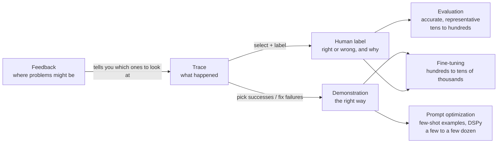
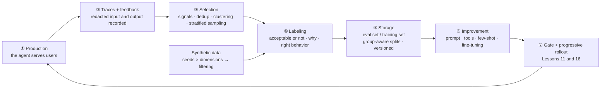
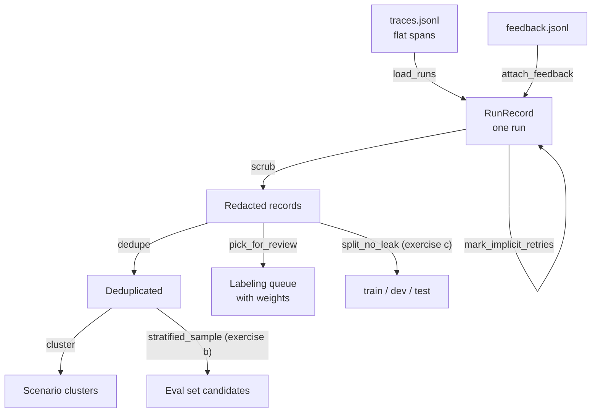
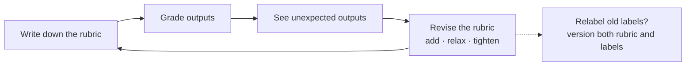

[中文](README.md) | [English](README.en.md)

# Lesson 21: Agent data — traces, data flywheels, synthetic data, and data quality

> 🕐 Time: 25 min | 🎯 You'll be able to: turn production traces into trustworthy eval sets and training data: pick (stratified sampling), clean (dedup, redaction), make (synthesize and verify), check (kappa, judge calibration), and split (group-aware splits that prevent leakage) | 📦 Source: [`data_kit.py`](data_kit.py) (the data toolkit), [`agentkit/tracing.py`](../../agentkit/tracing.py) (trace export format), [`agentkit/evals.py`](../../agentkit/evals.py) (`EvalCase`)
>
> 📖 Required reading: [Data Flywheels for LLM Applications](https://www.sh-reya.com/blog/ai-engineering-flywheel/) (Shreya Shankar, 2024). It frames "evaluate → monitor → continually improve" as a flywheel driven by production data. Focus on three points: define metrics by looking at real outputs; binary (pass / fail) metrics are easier to align with humans than scores; keep labeled data timestamped, because human preferences change.

This lesson maps to the "Data for Agentic Systems" and "Data Selection & Quality" topics in weeks 6–7 of Stanford CS329Z (Engineering AI Agents, Fall 2026). We recommend reading its public required readings alongside it (see [Further reading](#further-reading)). This project is not affiliated with that course.

## 0. In one sentence

**Anyone can switch models and anyone can copy a prompt. What only you have is "the problems your users hit on your tools." But while those problems sit in traces, they aren't data yet. They're ore.**

The customer-support agent at "Xiaoman Mall" (a fictional online store) has been live for a month. Traces are written every day, but the eval set is still the 20 cases written before launch. Last week a user complained that "the refund time you told me was wrong." Nobody could find a single case in the eval set that tests this.

The obvious move is to dump a month of traces into the eval set. You immediately hit these problems:

| Gold mining | Data work | What happens if you skip it | This lesson |
|---|---|---|---|
| Picking ore | Traces are huge in volume; most are unremarkable | Labeling everything takes months; random sampling misses the problems | `pick_for_review`, exercise (b) |
| Washing off mud | Dedup, redaction | "How do I return this?" gets labeled 300 times; users' phone numbers end up in git | `dedupe`, `scrub` |
| Assaying | Labeling + agreement checks | Two people disagree on what "acceptable" means, so the labels are noise | exercise (a), `agreement_report` |
| Synthetic gold | Synthetic data: cheap, but must be verified | The expected answer was made up by the model; you're testing the question writer, not the agent | `synthesize_cases`, `filter_candidates` |
| Packaging | Group-aware train / test splits | Variants of the same question land on both sides; scores are inflated | exercise (c) |

[Lesson 10](../10_observability/README.en.md) covered recording traces, [Lesson 11](../11_evals/README.en.md) covered the basics of building an eval set, and [Lesson 16](../16_release_ops/README.en.md#problem-6-closing-the-feedback-loop--turn-every-production-bad-case-into-a-test) covered the product flow from thumbs-down to a labeling inbox. This lesson fills the gap in the middle: **the data itself**. Where it comes from, how to select it, how to ensure its quality, and how to split it between evaluation and optimization. [Lesson 22](../22_eval_methodology/README.en.md) (eval methodology) and [Lesson 23](../23_optimization/README.en.md) (optimization) both build on it.

## 1. Core concepts

### 1.1 The four kinds of agent data

| Data | What it looks like | Where it comes from | Cost | What it lacks |
|---|---|---|---|---|
| **Trace** | The full record of one run: input, every model call and tool call, output, status, cost | Produced automatically in production (Lesson 10) | Nearly free | No notion of "right or wrong" |
| **Demonstration** | "The right way to handle this input": the ideal tool sequence and answer | Written by experts; picked from successful traces; failed traces corrected by humans | Expensive: needs experts | Narrow coverage |
| **Feedback** | Explicit: 👍👎, ratings, the user rewriting the answer. Implicit: rephrasing and asking again, abandoning, escalating to a human, a ticket getting reopened | Product UI, business systems | Free | Explicit feedback is sparse and biased; implicit feedback is noisy |
| **Human label** | A judgment about one trace: acceptable or not, why, and what the right behavior is | Annotators, domain experts | Most expensive | It is the "ground truth", but it can be wrong too (see 1.5 and 2.10) |



The three uses need different things from the data:

- **Evaluation** needs to be "accurate" (trustworthy labels) and "representative" (covers the real distribution, especially the long tail). It can be small.
- **Prompt optimization** (picking few-shot examples, or automatic optimizers like DSPy) needs a small number of very high-quality demonstrations.
- **Fine-tuning** needs more demonstrations or preference data, and they need to be more consistent. Lesson 23 covers these last two.

Notice that feedback points at traces, not at evaluation. A 👎 only says "the user wasn't happy." It doesn't say what the right answer is (maybe the agent was wrong, maybe the policy simply doesn't allow what they wanted). Feedback **tells you which traces to look at**. It is not a label.

### 1.2 The same data can't be both training set and test set

**Data leakage** means the exam questions were seen in advance: data used to "improve the system" is also used to "evaluate the system." Scores look great, and then the system falls apart in production.

For agents, "training" isn't just fine-tuning. **Any time you change the system while looking at a batch of data**, that's training:

- putting cases into the prompt as few-shot examples;
- staring at failing cases while editing the prompt or tool descriptions;
- editing the rubric while looking at judge-vs-human disagreements (you'll hit this in section 4 of the demo);
- using the data to pick a model or tune parameters.

Leakage also isn't just "the same record appears twice":

| Leakage type | Example | Prevention |
|---|---|---|
| Exact duplicates | The same question on both sides | Dedup |
| Near-duplicates | "签收5天了，还能退货吗" and "签收 5 天了还能退货吗？" (the same question, "delivered 5 days ago, can I still return it?", differing only in spaces and punctuation) | Similarity-based dedup, or put them in the same group |
| Same-source variants | 5 rewrites synthesized from the same seed question | Group by seed |
| Same user / session | One person's phrasing habits; earlier and later turns of the same conversation | Group by user, by session |
| Time travel | Tuning the prompt on October data, evaluating on September data | Split by time: past data for changes, future data for testing |

The fix is **group-aware splitting** (exercise (c)): first define "what counts as the same group", then make sure each group lands in exactly one split. Each split has its own job:

- **train**: produces few-shot examples, feeds the optimizer, gets used for fine-tuning;
- **dev**: for picking options, editing prompts, tuning thresholds. You can look at it as often as you like;
- **test**: evaluated once, at the end. The moment you go back and change the system because of a test result, test becomes a second dev set, and its score can no longer be trusted.

The "prevent data contamination" point in [Lesson 11](../11_evals/README.en.md) is the other side of the same coin. [Lesson 23](../23_optimization/README.en.md) enforces this division of labor strictly when optimizing prompts automatically.

### 1.3 The data flywheel: the full loop

Lesson 16 covered the "thumbs-down → labeling inbox → regression eval set" segment. The full flywheel looks like this:



| Stage | What happens | Owner | Tools (this lesson → industry) |
|---|---|---|---|
| ② Recording | Record redacted input and output in the trace; feedback carries the run_id | Application / platform engineers | agentkit `Tracer` → OpenTelemetry plus a trace platform such as Langfuse or Phoenix (Lesson 10) |
| ③ Selection | Join signals, dedup, cluster, sample by quota | Eval / data engineers | `data_kit` → SQL in the data warehouse, filtering and export in the trace platform |
| ④ Labeling | Judge acceptability, write the reason and the right behavior | Domain experts (one "principal labeler" who sets the standard) + annotators | Lesson 16's labeling inbox → annotation tools such as Label Studio or Argilla |
| ⑤ Storage | Eval set / training set, group-aware splits, versioned, reviewed | Eval owner | JSONL + git, reviewed together with code |
| ⑥ Improvement | Change prompts, tools, few-shot examples; fine-tune if needed | Agent developers | Lesson 23 |
| ⑦ Release | Gates, progressive rollout, rollback | Release owner | Lesson 11's `release_gate`, Lesson 16 |

When the flywheel doesn't turn, it's usually for one of three reasons:

1. **There's an inlet but no outlet.** Feedback comes in, nobody labels it; or it gets labeled and never reaches the eval set. Every stage needs an owner and a fixed cadence, e.g. 50 labels a week.
2. **Feedback is used directly as the optimization target.** Lesson 16 mentioned the GPT-4o sycophancy incident: the answer a user upvotes in the moment isn't necessarily the one that actually helps them.
3. **The standard is changing and nobody records it.** Labelers' sense of "acceptable" shifts as they see more data (criteria drift, section 5.3), and old and new labels mixed together become noise. The required reading recommends timestamping labeled data, and, when choosing few-shot examples for a judge, retrieving them dynamically by similarity to the current input while weighting recent labels more.

### 1.4 Key terms

| Term | Plain English | Code in this lesson |
|---|---|---|
| Tool signature | "Which path" a run took, e.g. `get_order → create_refund` | `tool_signature` |
| Stratified sampling | Group first, then sample each group by quota, so small groups aren't missed | `pick_for_review`, exercise (b) |
| Inverse probability weight | Oversampled records get discounted in statistics so you can recover the population | `Pick.weight`, `weighted_mean` |
| Near-duplicate | Two records that differ only in punctuation, spaces, or an order number | `dedupe`, `group_ids` |
| Synthetic data | Test questions or training examples generated by an LLM | `synthesize_cases` |
| Cohen's kappa | Agreement after removing "agreement by chance": 1 means perfect agreement, 0 means no better than guessing | exercise (a) |
| Criteria drift | The more data you look at, the more your standard for "good" changes | section 5.3 |
| Data leakage | The exam questions were seen in advance | exercise (c) |

### 1.5 Three ways to produce data: how to choose

| Option | How | Cost | Quality | Bias | When to use |
|---|---|---|---|---|---|
| A. Human labeling | Domain experts judge each case and write the reason; two people independently label a subset to compute kappa | Highest: expert time | Highest, provided there are guidelines and agreement meets the bar | The labeler's personal taste; fatigue lowers quality later on | Core set at cold start, judge calibration sets, high-risk domains, and **test sets at any stage** |
| B. LLM labeling + human spot checks | An LLM labels everything against a rubric; humans re-check 5–10%, prioritizing cases the judge was unsure about or where several judges disagreed; keep monitoring kappa, TPR, TNR | Medium: tokens + a little human time | Depends on calibration; well calibrated, it can approach human-human agreement | Systematic judge bias: preferring longer answers, preferring its own writing (Lesson 11); when it's wrong, it's "uniformly wrong" | Day-to-day labeling at scale, online sampled evaluation |
| C. Purely synthetic | An LLM generates questions and expected answers from seeds; only automatic filtering, no human looks | Lowest | Least stable: expected answers may be made up; questions skew simple and tidy | Distribution shift, self-preference, missing long tail | Expanding coverage at cold start; adversarial and edge cases; stress tests. **Never use it alone as a test set** |

**How to choose**: combine them by stage. Before you have traffic, use A to write 20–50 core cases ([Lesson 11, Problem 1](../11_evals/README.en.md#problem-1-no-labeled-data-where-does-the-eval-set-come-from)) and C to expand edge and adversarial cases, with a human glancing at every C case. After launch, production traces become the main source: label day-to-day data with B, label calibration and test sets with A, and use C only to fill coverage gaps. One hard rule: **test set labels must go through a human**. Otherwise all you've measured is "an LLM agreeing with an LLM."

## 2. Building it from scratch: a walkthrough of `data_kit.py`



### 2.1 The trace doesn't contain what you need

Open the demo's `runs/traces.jsonl`. The attributes of an `agent.run` span look like this:

```text
{"agent.name": "shop-support", "run_id": "...", "tenant.id": "xiaoman", "user.id": "u_zhang",
 "agent.status": "completed", "agent.steps": 2, "agent.cost_usd": 0.00122, ...}
```

Tools, status, cost. **But not what the user said, and not what the agent finally answered.** That's deliberate: as [Lesson 10](../10_observability/README.en.md#problem-2-users-phone-numbers-and-national-id-numbers-are-sitting-in-your-traces) explained, content capture should be opt-in, and agentkit only records redacted snippets of tool arguments and result previews.

To mine data from traces, the application layer has to record input and output explicitly, and **redact before recording**:

```python
with tracer.span("app.request", **{"app.input": redact_pii(v.text)}) as span:
    res = await agent.run(v.text, metadata={"tenant_id": "xiaoman", "user_id": v.user})
    span.set(**{"app.output": redact_pii(res.output or "")})
```

The `agent.run` span nests under `app.request` automatically (the Tracer keeps a span stack in contextvars), and the whole tree is exported as one trace. `Agent.run` is async: while it `await`s, the event loop can move other sessions forward. contextvars are copied per asyncio Task, so concurrent requests each have their own span stack and never attach to the wrong parent. Section 1 of the demo still replays one run at a time: this is "last month's traffic," and the order itself is data (section 2.3's "asked again within 5 minutes" is decided by start times).

### 2.2 From spans to "one run"

`load_runs` groups lines by `trace_id`, rebuilds the tree from `parent_id`, finds the outermost agent span, and collects the tool sequence, tokens, and cost. A few design decisions:

- **Skip bad lines, but count them.** When a process crashes, the last line may be half-written. Skipping silently hides the problem; failing on any bad line is too brittle.
- **Only look at the outermost agent's direct child spans.** A sub-agent ([Lesson 06](../06_orchestration/README.en.md)'s `agent_as_tool`) hangs under a tool span, and the tools it calls aren't part of the main agent's path.
- **Take the max cost, don't sum.** `agent.cost_usd` is cumulative for the whole run. A `resume` after a pause produces a new trace (a new root span) with the same run_id, and `load_runs` merges them back by run_id. **One run doesn't always map to one trace.**

### 2.3 Signals: explicit and implicit feedback

```python
dk.attach_feedback(records, feedback_rows)  # 👍👎 arrive later and asynchronously, in a separate table, joined by run_id
dk.mark_implicit_retries(records)           # same user asks a similar question within 5 minutes → the previous answer probably didn't help
```

`RunRecord.problems()` collects every signal: a status other than completed, tool errors, 👎, being asked again. In the demo, "退款多久到账？" ("how long until my refund arrives?") carries both a 👎 and a "retried" signal. Two independent sources point at the same run, so it's the first one to look at.

An implicit signal only means "worth a look." It can't be used as a "wrong answer" label: a user who rephrases may just want more detail.

### 2.4 Redaction: before data leaves the trace system

Eval sets go into git, get read by many people, and may be used for fine-tuning. Their exposure is much wider than the trace system's. `scrub` does two things:

- runs the text through `redact_pii` again ([Lesson 09](../09_security/README.en.md#problem-4-customers-national-id-numbers-flow-into-the-model-provider-logs-and-answers)). The application layer already did this once when recording; this is defense in depth;
- replaces user IDs with HMAC pseudonyms. The same person always gets the same pseudonym, so you can still group by user to prevent leakage, but without the key you can't reverse it. For why not plain SHA-256, see [Lesson 10, Problem 2](../10_observability/README.en.md#problem-2-users-phone-numbers-and-national-id-numbers-are-sitting-in-your-traces) (small ID spaces can be brute-forced).

Regex redaction can't catch free-text PII such as names and addresses (Lesson 10's demo showed this blind spot). So before an eval set goes in, a human should scan it at least once.

### 2.5 Text similarity: a zero-dependency compromise

```python
def normalize_text(text):   # full-width → half-width, lowercase, every number → 0, drop whitespace and punctuation
def shingles(text):         # single characters + adjacent character pairs
def text_similarity(a, b):  # Jaccard similarity = |intersection| / |union|
```

Three design decisions:

1. **Normalize numbers.** "订单 A1001 到哪了" and "订单 A1004 到哪了" ("where is order A1001 / A1004?") count as the same question. For an eval set that's right: it's the same scenario. But if you want to reproduce a bug with one specific order, you shouldn't normalize this way.
2. **Use both single characters and character pairs.** Chinese has no spaces between words, so without extra dependencies you can only slice by character. With pairs alone, a short sentence barely overlaps with its rewrite: "退货运费谁出" ("who pays return shipping") vs "退货的运费是谁承担" ("who bears the shipping cost for a return") scores only 0.18. Adding single characters raises it to 0.33, while most unrelated pairs in the demo stay below 0.2.
3. **This is not semantic similarity.** "发票怎么开" ("how do I get an invoice") and "电子发票在哪里申请" ("where do I request an e-invoice") score only 0.09. Real semantic clustering needs embeddings (see 5.5; vector retrieval is in [Lesson 17](../17_retrieval_quality/README.en.md)). This lesson's model gateway doesn't support the `/embeddings` endpoint, so the demo uses character similarity.

### 2.6 Dedup and clustering: one algorithm, two thresholds

`similarity_groups` connects every pair "in the same bucket with similarity ≥ threshold" and returns the connected components. That's single-linkage clustering:

- the result doesn't depend on input order, and it's fully deterministic;
- it guarantees that "any two records with similarity ≥ threshold end up in the same group", which is exactly the property you need to prevent leakage when splitting by group;
- the cost is chaining: if A is like B and B is like C, A and C end up in the same group even if they aren't alike.

Dedup (threshold 0.8) and clustering (threshold 0.25) both use the **tool signature** as the bucket. The signature collapses consecutive repeats of the same tool into `name+`: `[get_order, get_order, get_order]` becomes `get_order+`. Without that, every extra retry would create a "new path."

**Different signature, no dedup.** The demo has two "怎么退货" ("how do I return this?") runs. One called `search_policy`; in the other the model skipped retrieval and answered from memory. Nearly identical text, different paths: the agent's behavior is unstable. That's the most valuable data you have, and it must never be deleted as a duplicate. When deduplicating, the representative kept is preferably the one with a problem signal.

### 2.7 Sampling: quotas plus weights

```python
picks = dk.pick_for_review(records, 12, seed=0)
# stratum priority: has a problem signal > rare path (signature seen ≤ 2 times) > high cost (≥ 90th percentile) > normal
# default quotas 40% / 30% / 20% / 10%; if a stratum runs short, its slots roll over to the next one
```

- **Why not purely random**: in the demo only 10% of runs have a problem (4 out of 40). Sample 12 at random and there's a 22% chance of getting none of them.
- **Why not only failures**: you'd miss "the user didn't complain, but the path was weird," and you couldn't estimate overall quality.
- **Why record weights**: each sample records "how many records it represents in the population" (stratum size / number sampled from that stratum). The failure-first sample has a 33% problem rate; the real rate is 10%; after weighting, the estimate is exactly 10%. **Quality metrics computed from a biased sample must be weighted**, or you'll think production quality is three times worse than it is. It's the same reason Lesson 10 said you can't compute a success rate directly from tail-sampled traces.

Exercise (b)'s `stratified_sample` is a different kind of stratification: it allocates slots **proportionally** while guaranteeing at least 1 per stratum. It's the right tool for building an eval set that is "representative without dropping the long tail." How precisely a stratified eval set can estimate a score, and how many cases it needs, is Lesson 22's topic.

### 2.8 Synthetic data: generation

```python
cands = await dk.synthesize_cases(llm, SEEDS, DIMENSIONS, KNOWLEDGE, per_seed=[4, 3, 3], max_concurrency=2)
```

Why "seeds × dimensions" instead of a single "generate 100 test questions"? Without constraints, the model keeps producing what it considers typical: clean, complete, one question at a time. Those are easier than real users' questions, and similar to each other. **Seeds** anchor the topics in real traffic; **dimensions** force coverage of the variations you care about:

| Dimension | What it tests |
|---|---|
| Colloquial rewrite | Robustness to how people actually talk: omissions, typos, emotion |
| Combined constraints | Whether two rules applying at once trip it up (fresh food + within 7 days) |
| False premise | Whether it goes along with a wrong premise ("don't you have a 30-day no-questions-asked return policy?") |
| Outside the knowledge base | For something the knowledge base doesn't cover, does it admit it doesn't know, or make up an answer |

The output is constrained by `complete_json` into a structured `SynthCase`: question, dimension, should-answer or should-decline, reference answer, required keywords, and **verbatim evidence from the knowledge base**. Requiring verbatim evidence lets the next step catch "fabricated quotes" with plain string matching, at zero cost.

Each seed is one model call, independent of the others, so `synthesize_cases` is an async function that uses [`agentkit.workflows.parallel`](../../agentkit/workflows.py) to send them out together on one event loop: at most `max_concurrency` in flight (the model gateway is shared), results returned in seed order, and if any seed fails, the requests that haven't finished are cancelled right away instead of burning money in the background. [`test_exercise.py`](test_exercise.py) checks all three with `ScriptedLLM(latency=...)`: the in-flight peak of the three requests is 3 (with a limit of 3) or 2 (with a limit of 2); when they finish in reverse order, the results are still in seed order; when the first seed fails, the other two requests, still waiting on the model, are cancelled and never get a reply.

The first version of the prompt exposed two problems in a real run (gpt-5.5):

- One dimension said "include a false premise, **or** ask something the knowledge base doesn't cover." The model chose the false premise all 3 times and produced not a single should-decline question. **Put only one kind of variation in each dimension**, so the model has no choice to make. After splitting it into two dimensions, all 3 should-decline questions appeared.
- `must_contain` asked for keywords, but the model copied whole knowledge-base sentences ("质量问题退货由商家承担运费", "for quality issues, the merchant pays return shipping") and even included rules unrelated to the question. The rule grader ([`rule_grader`](../../agentkit/evals.py)) requires a verbatim match, so a correct answer phrased differently would be marked wrong. The prompt now says "at most 8 characters each, only what's required," and the filter double-checks. Running the current filter over the 9 "accepted" cases from the first version, 7 would be rejected for whole-sentence keywords; after the prompt fix, this rule didn't fire once in the next two real runs.

### 2.9 Synthetic data: filtering

The principle is **cheap checks first, model calls last**:

| Check | What it catches | Cost |
|---|---|---|
| Length | Too short (no information), too long | Free |
| Near-duplicate of the seed or of an already-kept question | A "rewrite" that changed one character | Free |
| Keywords and evidence appear verbatim in the knowledge base | Fabricated "quotes", fabricated numbers | Free |
| Keyword length | Whole sentences used as keywords, which trips the rule grader | Free |
| LLM check: can the knowledge base answer it, does the reference answer follow from the knowledge base, is every keyword necessary | The question writer passing off common knowledge as knowledge-base content; a mislabeled should-decline; over-specified expectations | 1 call per question |

The rule checks are pure computation and must run in order ("near-duplicate of an already-kept question" depends on what was kept before). The LLM checks are one call per question, independent of each other, so they go out concurrently through `parallel`, at most `max_concurrency` in flight (default 2). If checking one question fails (model error, structured output that can't be repaired), only that question is rejected as `llm:check_failed`; the others are unaffected. This used to be a thread pool. No threads are needed now: while waiting on the model, a coroutine yields the event loop, so a single thread keeps several requests on the wire at once.

The LLM checker's own prompt needs calibration too. The first version said "judge only by the knowledge base; don't use your own common sense." It then rejected a good question because "the knowledge base doesn't say a seafood gift box counts as fresh food." The prompt now says "you may make common-sense classifications and inferences, but you may not complete the answer with rules, numbers, or promises from outside the knowledge base." **Validators make mistakes too. Regularly look at what they reject and what they let through.**

### 2.10 Agreement: percent agreement, kappa, TPR / TNR

Two labelers (two humans, or a human and a judge) label the same batch:

- **Percent agreement**: the share of identical labels. Intuitive, but it doesn't remove agreement by chance.
- **Cohen's kappa**: `κ = (p_o − p_e) / (1 − p_e)`. `p_o` is the observed agreement; `p_e` is the agreement you'd expect if each labeler "labeled randomly" according to their own label proportions. κ = 1 means perfect agreement, κ = 0 means no better than guessing, κ < 0 means worse than guessing.

Why do you need kappa? Exercise (a) has a test with 100 samples where both labelers almost always say pass, and they agree on 90. Percent agreement is 90%, but kappa is **−0.05**: each says pass 95% of the time, so they'd agree by chance 90.5% of the time anyway. This is the **kappa paradox** (Feinstein & Cicchetti 1990): with highly imbalanced classes, high agreement can be meaningless, and kappa itself becomes very sensitive.

So `agreement_report` reports three things: percent agreement, kappa, and, treating the human as ground truth, the judge's **TPR** (of the cases the human failed, how many the judge caught) and **TNR** (of the cases the human passed, how many the judge let through). Hamel Husain's LLM-judge guide also recommends reporting these two separately instead of looking at overall agreement.

How much kappa is enough? The common bands are Landis & Koch (1977): 0.21–0.40 fair, 0.41–0.60 moderate, 0.61–0.80 substantial, 0.81 and above almost perfect. These bands are rules of thumb. A more practical reference is **human-human kappa on the same data**: when a judge's agreement with a human clearly exceeds it, don't celebrate yet; section 4 of the demo shows why. A kappa computed from 12 samples has a large error. Confidence intervals for agreement and kappa, how many calibration samples you need, and position bias in pairwise judges are covered in [Lesson 22](../22_eval_methodology/README.en.md).

### 2.11 Group-aware splitting

Exercise (c)'s `split_no_leak` is a greedy algorithm: shuffle the groups, sort them from largest to smallest, and put each group into the split that is furthest below its target size. How you define a "group" is up to you:

- near-duplicate groups: `dk.group_ids(records, 0.5, text_fn)`; records with similarity ≥ 0.5 are guaranteed to share a group;
- synthetic data: by seed (the `seed:S1` tag);
- production data: by user pseudonym, by session ID;
- time-sensitive scenarios: split by time directly, not randomly.

## 3. Hands-on: run the demo

```bash
.venv/bin/python lessons/21_agent_data/demo.py --offline   # offline script, no API key, about 1 second
.venv/bin/python lessons/21_agent_data/demo.py             # real model: about 50 calls, concurrency ≤ 2, about 2.5 minutes
```

Section 1 produces 40 runs. In real mode only 6 call the real model; the other 34 are scripted "historical traffic": mining needs some volume, and running all of it on a real model is too expensive. Section 2 is nearly identical in both modes; sections 3 and 4 differ the most. The excerpts below come from one real run (gpt-5.5). (Demo output translated from Chinese.)

**Is the concurrency real?** Question writing, checking, and judging in sections 3 and 4 are all sent concurrently (at most 2 in flight). The demo wraps the model in a counter (`InFlightLLM`: increments the in-flight count on entering `chat`, decrements it on return, records the peak) and prints the call count, in-flight peak, and elapsed time after each step. Here is one run of the async version against gpt-5.5 on 2026-09-28 (the whole demo took 2 min 34 s; Apple M1 8GB, macOS 14.4, Python 3.11.7, through a local gateway):

```text
   Question writing: 3 model calls, in-flight peak 2 (limit 2), 27.33s
   Checking: 10 model calls, in-flight peak 2 (limit 2), 33.30s
   (judges, concurrency ≤ 2: v1 12 calls, in-flight peak 2, 24.03s; v2 12 calls, in-flight peak 2, 34.88s)
```

A peak of 2 means two requests really were waiting on the model at the same time, and the limit was never exceeded. In offline mode the scripted model waits 50 ms per call (20 ms for the judges) and also prints a peak of 2; the 12 judge calls take about 0.14 s (one at a time would take at least 12 × 20 ms = 0.24 s).

**Section 1: real model vs script**

```text
   [real model] Order A1002's headphones are defective, …  → completed, tools ['get_order', 'search_policy', 'create_refund']: Refund request RF-2001 submitted. Order A1002 was delivered 5 days ago, within 7…
   [real model] Why hasn't order B9999 arrived?          → completed, tools ['get_order']: No order B9999 was found. Please check the order number…
```

In the script, "B9999" is a cautionary tale: the model keeps querying a nonexistent order until it hits the step limit. The real gpt-5.5 queries once and stops to ask the user to check the order number. So real mode has no `max_steps` in its status distribution, and this run is left with a single "tool error" signal. Before refunding, the real model also looked up the policy on its own, taking a new path the script never had.

**Section 2: mining**

```text
── 2.4 Near-duplicate dedup: same signature AND text similarity ≥ 0.8 (numbers normalized)
   40 → 38, removed 2:
     签收5天了，还能退货吗      ≈ 签收 5 天了还能退货吗？
     退货运费谁出               ≈ 退货运费谁出？
   Similarity ≥ 0.8 but different tool paths, so NOT deduplicated: 1 pair — same question, different paths = unstable behavior, most worth a look:
     怎么退货                   search_policy  vs  怎么退货？ (no tools)

── 2.6 Labeling sample: failures → rare paths → high cost → normal (n=12)
   stratum     population  picked  weight each
   failure     4           4       1.0
   rare_path   7           6       1.2
   high_cost   1           1       1.0
   normal      28          1       28.0
   Compare: sampling 12 purely at random, the chance of getting zero problem runs is 22%
   Problem rate: 33% in the sample, 10% after weighting, 10% in the full population

── 2.7 Eval set: stratified by tool path vs random (n=14)
   38 records and 11 paths after dedup. Stratified covers 11/11 paths; random (averaged over 1000 draws) covers only 6.0/11, 3 at worst

── 2.8 Train / test split: random by record vs by near-duplicate group
   Random by record: train/dev/test = 24/8/8, near-duplicate pairs across splits (similarity ≥ 0.5): 3, e.g. '签收5天了，还能退货吗' ↔ '签收 5 天了还能退货吗？'
   By near-duplicate group: train/dev/test = 24/8/8, near-duplicate pairs across splits (similarity ≥ 0.5): 0
```

(The Chinese questions are kept as-is because the similarity scores depend on the exact characters. They are "delivered 5 days ago, can I still return it", "who pays return shipping", and "how do I return this".)

What to notice: ① 40 runs contain 11 tool paths, 7 of which appear only once or twice; the long tail is long. ② A random sample of 14 covers only about half the paths on average, and only 3 when unlucky. ③ Splitting randomly by record puts 3 near-duplicate pairs on different sides: questions in the test set already have their "answers" in the training set.

**Section 3: synthetic data** (real run, improved prompt)

```text
   syn-S1-1   colloquial      answer   I got it 5 days ago, is it too late to return? Haven't…  ✅ kept
   syn-S1-2   combined        answer   Signed for it 3 days ago but it's fresh fruit, can I use the 7…  ✅ kept
   syn-S1-4   outside KB      decline  If I return it, what time can the courier come pick it up?  ✅ kept
   syn-S2-3   outside KB      decline  For a pickup return, if it's overweight, who pays the extra?  ✅ kept
   syn-S3-1   false premise   answer   I heard refunds go out as soon as I ship it back, same day…  ❌ llm:keyword_unnecessary
   ...
   Types: 7 should-answer, 3 should-decline
   Kept 9/10. Cheap rules rejected 0; only 10 needed a model check.
   Distribution: production questions average 13 characters, mean pairwise similarity 0.06; synthetic questions average 25 characters, mean pairwise similarity 0.08
   💡 Synthetic questions are 1.9× as long as production ones, more complete and more informative — that is distribution shift. …
```

What to notice:

- **Distribution shift**: across four real runs, synthetic questions averaged 25–27 Chinese characters, versus 13 for production questions. Real users say "怎么退货" ("how do I return this?"); the model writes "I got it 5 days ago, is it too late to return? It isn't damaged." More information, so it's easier to answer.
- **Its "imagination" is narrow**: 2 of the 3 outside-the-knowledge-base questions ask about courier pickup, and the previous run did the same. A dimension only guarantees "there is a question of this kind," not that questions of this kind differ from each other. You can put the already generated questions into the prompt and ask for different ones, or list the topics the knowledge base doesn't cover and let the model pick.
- **Automatic filtering can't replace humans**: syn-S1-1 asks "it isn't damaged, can I return it?", yet its required keywords include "生鲜" ("fresh food"); a correct answer doesn't need to mention fresh food at all. The LLM checker let it through, and it let the identical problem through in the previous run too.
- The offline script plants 5 typical problems: nearly identical to the seed, a whole sentence as a keyword, a fabricated knowledge-base quote, a question the knowledge base can answer labeled should-decline, and a reference answer that sneaks in a promise the knowledge base doesn't make ("10 yuan compensation if late"). The first three are caught by the free rule checks; the last two by the LLM checker.

**Section 4: who validates the validators** (real run)

```text
   Calibration set: 12 cases, labeled independently by two annotators; annotator A failed 5, B failed 7
   Annotator B (human-human agreement)             agreement  83%   kappa  0.68   TPR 100% (5/5)  TNR  71% (5/7)
   Judge v1 (vague rubric, Q&A only)               agreement  67%   kappa  0.23   TPR  20% (1/5)  TNR 100% (7/7)
   Judge v2 (specific rubric + KB + tool log)      agreement 100%   kappa  1.00   TPR 100% (5/5)  TNR 100% (7/7)

── 4.2 Cases where judge v1 disagrees with annotator A
   c02 Q: How long until my refund arrives?  A: Your refund will be returned to the original payment method within 24 hours, don't worry.
       Human: fail (the knowledge base says 1-3 business days; 24 hours is made up)   Judge: pass (the answer clearly states "refunded within 24 hours", directly answering the user's…)
   c11 Q: Don't you have 30-day no-questions-asked returns…  A: Yes, you can request a no-questions-asked return within 30 days of delivery.
       Human: fail   Judge: pass (the answer clearly states "yes, within 30 days of delivery", directly responding to…)
```

What to notice:

- Across four real runs (the latest being the async run above), both judges produced exactly the same results.
- **Judge v1's 67% agreement sounds OK, but its kappa is only 0.23.** It let 4 of the 5 bad answers through (TPR 20%): a made-up refund time, "refund done" without any tool call, a wrong invoice validity period, and agreeing with "30-day returns." v1 can't see the knowledge base or the tool log, so all it can judge is "does this look like a good answer." Fluent, confident, and responsive, and it passes.
- **Judge v2 agrees with annotator A perfectly (kappa 1.00), even more than the other human annotator, B, does (0.68).** Not because the judge beats humans, but because v2's rubric was written while looking at these 12 cases and following A's judgments. It learned A's taste and "overfit" to these 12 cases. **Data used to revise a rubric can't then be used to report the judge's accuracy.** That's exactly the leakage from section 1.2. Re-test on a batch the rubric has never seen; that's what exercise (c) is for.
- In the offline script, v2 disagrees with A on c09 ("prices dropped, can I get the difference back?"; the answer doesn't mention that flash-sale and clearance items are excluded from price protection), and B happens to fail it too. The rubric doesn't say how to handle "incomplete but not wrong." What needs fixing is the **annotation guideline**, not tuning the judge to match one person (sections 5.3, 5.4).
- Only one model is configured on this machine, so the agent, question writer, checker, and judge are all gpt-5.5. Self-preference (section 5.2) can't be ruled out here. In production, the judge should be a different model.

Artifacts land in `lessons/21_agent_data/runs/`: `traces.jsonl`, `feedback.jsonl`, `review_queue.jsonl` (the labeling queue, with weights), and `synthetic_cases.jsonl` (synthetic cases that passed the filters).

## 4. Exercises

Open [`exercise.py`](exercise.py) and implement three functions:

| Exercise | What to do | How the tests check it |
|---|---|---|
| (a) `cohen_kappa` | Cohen's kappa for any set of labels | Textbook example (0.4); perfect agreement and perfect opposition (1 and −1); the kappa paradox (90% agreement, kappa < 0); a category used by only one side; expected agreement equal to 1; invalid input |
| (b) `stratified_sample` | Proportional stratified sampling, at least 1 per stratum, exactly n in total, reproducible | 60/30/10 sampled down to 10 gives exactly 6/3/1; two long-tail strata get 1 each; same seed gives the same result and a different seed changes it; original order preserved; impossible requests raise ValueError |
| (c) `split_no_leak` | Group-aware train / dev / test split; no group crosses splits | No leakage, nothing lost or duplicated; equal-size groups hit the ratios exactly; unequal groups stay within two group sizes; synthetic cases split whole by seed; a zero-ratio split is empty; invalid ratios raise ValueError |

```bash
make lesson N=21
# or: .venv/bin/python -m pytest lessons/21_agent_data -v
```

Hints:

- (a) Use integers: multiply numerator and denominator by n², `κ = (n·agreements − Σ ca[c]·cb[c]) / (n² − Σ ca[c]·cb[c])`. This avoids `p_e` coming out as 0.9999999 due to floating-point error. [`data_kit.kappa_2x2`](data_kit.py) is the binary special case; use it to cross-check.
- (b) Collect indices by key in a dict first (dicts keep insertion order, i.e. "the order in which strata first appear"), then compute quotas, then `rng.sample` within each stratum. Track indices, not the elements themselves; elements may be unhashable dicts.
- (c) Python's `sort` is stable: shuffle first, then sort by group size, and groups of equal size keep their shuffled order.
- After you finish, rerun the demo: sections 2 and 4 will say "from exercise.py (your implementation 👍)".

## 5. Going deeper (optional)

### 5.1 Less is more: what LIMA did and didn't say

LIMA (Zhou et al., NeurIPS 2023) fine-tuned a 65B LLaMa on only **1,000** carefully chosen prompt-response pairs (750 from communities such as Stack Exchange and wikiHow, 250 written by the authors), with no RLHF. In a human preference study, LIMA's answers were equivalent to or better than GPT-4's in 43% of cases, 58% against Bard, and 65% against DaVinci003, which was trained with human feedback. From this the authors proposed the **Superficial Alignment Hypothesis**: a model's knowledge and capabilities come almost entirely from pretraining, and alignment mostly teaches it "which format and style to use with users."

The paper's ablations (7B model, 2,000 examples per condition, ChatGPT grading answer helpfulness on a 1–6 scale) deserve a closer look:

- **Diversity**: Stack Exchange data, with its wide variety of questions, clearly beats wikiHow data, where every question is a "how to";
- **Quality**: quality-filtered Stack Exchange data scores 0.5 points higher than unfiltered;
- **Quantity**: growing the data from 2K to 32K (16×) barely moves the score.

What it **didn't** say:

- **It didn't say "less data is better."** It said "beyond quantity, diversity and quality matter more," and the authors admit that building those 1,000 examples took significant effort that is hard to scale.
- **It didn't say this holds for learning new skills.** LIMA teaches conversational style, not abilities the model lacked. Teaching an agent your tools and business processes is closer to learning a skill. For example, SWE-smith (Yang et al., NeurIPS 2025 Datasets and Benchmarks Track) synthesized about 50,000 task instances for software engineering agents, and the resulting SWE-agent-LM-32B reached 40.2% on SWE-bench Verified. There, scale was the point.
- **Its conclusions come from general chat.** Your eval set is a different thing, but the principle carries over: **50 selected, correctly labeled cases that cover different paths beat 5,000 copies of "how do I return this?"**. The same idea applies to filtering training data: AlpaGasus (Chen et al., ICLR 2024) had ChatGPT score Alpaca's 52K instruction examples, kept only the 9K high scorers, and got a better model, while cutting the 7B model's training time from 80 minutes to 14.

### 5.2 Four pitfalls of synthetic data

| Pitfall | Symptom | Countermeasure |
|---|---|---|
| **Distribution shift** | Synthetic questions are longer, more complete, and tidier (demo: twice as long); they lack real users' omissions, typos, and several-questions-at-once | Pick seeds from real traffic; include a "colloquial" dimension; regularly compare statistics of synthetic and production data |
| **Self-preference** | When the same model writes the questions, answers them, and grades them, the judge favors outputs in its own style. Panickssery et al. (NeurIPS 2024) found that LLMs can recognize their own text to a meaningful degree, and the stronger this self-recognition, the stronger the self-preference | Use different model families for the question writer, the model under test, and the judge where possible; back key conclusions with a human-labeled calibration set |
| **Too easy** | The model writes what it's good at: one intent, the answer sitting in a single sentence. The demo's first version even picked "false premise" and avoided "outside the knowledge base" entirely | Split dimensions finely, one variation per dimension; deliberately generate combined constraints, multi-turn, and distractor-laden questions |
| **Unreliable expected answers** | Reference answers sneak in common knowledge or invented promises; should-decline labels are flipped; keywords copied as whole sentences or over-specified | Verbatim evidence checks + LLM checks + human spot checks; calibrate the checker itself too (section 2.9) |

Diversity filtering is a basic skill for synthetic data. Self-Instruct (Wang et al., ACL 2023) bootstrapped instructions from 175 human-written seed tasks and only kept a new instruction if its ROUGE-L similarity to every existing instruction was below 0.7. The near-duplicate check in this lesson's `filter_candidates` follows the same idea.

If synthetic data is used for **training**, watch for a longer-term problem too. Shumailov et al. (Nature 2024) found that when models are trained generation after generation on data produced by earlier models, the tails of the original distribution gradually disappear. This is "model collapse." For agents, the tails are exactly the rare paths and edge cases. So synthetic data can only **supplement** real data, never replace it.

### 5.3 Who validates the validators: EvalGen and criteria drift

An LLM judge grades thousands of outputs for you. Who checks the judge? In the UIST 2024 paper *Who Validates the Validators?*, Shankar et al. built a tool called **EvalGen**: it uses an LLM to generate several candidate implementations for each evaluation criterion (Python assertions or LLM-judge prompts), asks the user to give 👍👎 on some outputs, and picks the implementations that best match the user's judgments. "Match" is measured with two numbers: **coverage** (of the outputs the user marked bad, how many the assertion catches) and **false failure rate** (of the outputs the user marked good, how many the assertion wrongly fails), combined into one alignment score (checking against the numbers in the paper's table, it's the harmonic mean of coverage and 1 − false failure rate). In the paper's offline evaluation, compared with SPADE, a baseline that uses no human grades, EvalGen reached 66% alignment with 4 assertions on a product-description generation task (SPADE used 9 assertions and reached 54%).

More important than the tool is what they observed in a user study with 9 industry practitioners, which the authors call **criteria drift**:

> Users need criteria to grade outputs, but grading outputs is what helps them define the criteria.

For example, two participants initially required "all entities must be proper nouns," and after seeing a batch of outputs changed it to "most of them." Some criteria only occurred to people after they saw a specific kind of bad output.



What this means for your data work:

1. **A rubric can't be written all at once before looking at data.** Look at 30–50 real outputs first, then write the rubric. That's the required reading's "define metrics by looking at data."
2. **Validate the judge on held-out data.** The demo's kappa 1.00 in section 4 is the counterexample: the rubric was written while looking at those 12 cases.
3. **Version both the rubric and the labels.** When the rubric changes, old labels may no longer be right. At minimum, record which rubric version each label was made under.
4. **Re-check regularly.** When the judge model is updated, business rules change, or the user base shifts, re-measure agreement on freshly labeled samples.

### 5.4 How to write annotation guidelines

Low agreement usually isn't because annotators are careless. It's because the guideline is unclear. A usable guideline includes at least:

| Part | What to write | Example (this lesson's support scenario) |
|---|---|---|
| Goal | What these labels are for | "Decide whether the answer can go straight to the user; used for the eval set and judge calibration" |
| Label definitions | Define each label, with **positive and negative examples** | fail: facts contradict the knowledge base (e.g. "refund within 24 hours"); pass: verbose but correct (e.g. c07) |
| Boundary rules | How to judge ambiguous cases, ideally as a decision order | "Check facts first → then whether it claims actions it didn't take → then whether it gives a next step; incomplete but not wrong is handled as …" |
| What to look at | Which information the annotator must check | The knowledge-base text and the tool-call log, not just the Q&A text |
| An "unsure" option | Let people mark "not sure" with a reason instead of forcing a binary choice | Unsure cases go to the principal labeler for adjudication; the decision is added to the boundary rules |
| Version and changelog | Date, reason, and affected old labels for each change | "v3: 'did not mention the flash-sale exception' changed from fail to pass; 12 cases relabeled" |

**Have annotators jot down a reason**, not just pass / fail. Writing "the knowledge base says 180 days, the answer says 365" costs almost no extra time, and it's the highest-value data in the whole flywheel: you rely on it when analyzing disagreements, when writing the rubric and the judge's few-shot examples, and Lesson 23's optimizer treats it as its best feedback material.

Rollout: two people independently label 30 cases → compute kappa → discuss every disagreement → revise the guideline → label a fresh batch → only after kappa meets the bar (the team sets it and writes it down) start labeling at scale. During labeling, periodically mix in a few "gold questions" with known answers to detect annotator drift. It's the same method Lesson 11 used to calibrate LLM judges: **judges and humans should be calibrated against the same guideline**.

### 5.5 At scale

- **Dedup and clustering**: this lesson compares all pairs, O(n²), which is fine up to a few thousand records. At hundreds of thousands, use MinHash + LSH (locality-sensitive hashing) for near-duplicate detection, which brings the cost close to linear; use embeddings plus a clustering algorithm for semantic clustering. Lee et al. (ACL 2022) found that over 4% of the validation sets of common language-modeling datasets overlapped with their training sets, and after dedup, models emitted memorized training text ten times less often.
- **Active selection for labeling**: besides failures first, prioritize samples where the judge was unsure or several judges disagreed, so every unit of labeling budget goes where the information is.
- **Dataset versioning**: keep eval sets in git alongside code, and require review for any change to an expectation; record each record's source (production / synthetic / human), labeler, label time, and guideline version.
- **Privacy compliance**: retention periods, user deletion requests (which must also remove data from eval and training sets), and cross-border transfer all need to be designed into the flywheel from the start.

## 6. Common pitfalls and anti-patterns

| Anti-pattern | Consequence | Do this instead |
|---|---|---|
| Traces record only metadata, yet you expect to mine eval sets from them | All you get is tool names and statuses; you don't know what the user asked | Record redacted input and output at the application layer (section 2.1) |
| Treating 👎 directly as a "wrong answer" label | Things the policy simply doesn't allow get treated as bugs; answers that flatter the user get treated as correct | Use feedback only to select data; humans decide the labels |
| Sending a purely random sample for labeling | The labeling budget goes to lots of unproblematic data; not one long-tail path gets sampled | Failures first, rare paths first, quota-based strata |
| Computing quality metrics directly from a failure-first sample | Production quality is badly underestimated (demo: 33% vs a real 10%) | Record sampling weights and reweight |
| Splitting train and test randomly by record | Near-duplicates and same-source variants land on both sides; inflated scores | Split by group (user, session, seed, near-duplicate group), or by time |
| Deduplicating without looking at the tool path | You delete the most valuable data: the same question taking different paths | Only dedup within the same signature |
| Adding synthetic data without filtering | You're testing the question writer's common knowledge, not the agent | Evidence checks + LLM checks + human spot checks |
| Verbatim keyword matching on Chinese text without normalization | "1-3 个工作日" and "1～3个工作日" ("1–3 business days", written with different dash and spacing) count as different; correct answers get failed | Keep keywords short, numbers and terms only; normalize full-width/half-width characters and spaces before comparing; leave open-ended judgments to a calibrated judge |
| Reporting only percent agreement | With imbalanced classes, a judge that always says "pass" also has high agreement | Also report kappa, TPR, TNR |
| Revising the rubric on the calibration set, then reporting judge accuracy on the same set | Inflated agreement (demo: kappa 1.00) | Split the calibration set into dev and test |
| Writing the guideline once and never updating it | Criteria drift; old and new labels mixed together | Version the guideline with a changelog; let disagreements drive revisions |
| Phone numbers and real user IDs in the eval set | Once the eval set is in git, that's a data leak | Redact + HMAC pseudonyms + a human scan before it goes in |

## 7. Interview & design review questions

<details>
<summary>Q1: You get 100,000 traces a day and a labeling budget of 200 per week. How do you decide what to label?</summary>

- Join signals first: run status, tool errors, explicit 👎, implicit signals (asking again, escalation to a human, abandonment);
- Stratified sampling with quotas: runs with problem signals first, then rare paths (counted by tool signature), then high cost, and finally a purely random slice for estimating overall quality;
- Dedup before sampling (same signature + near-duplicate text), but keep runs where the same question took different paths;
- Record each sample's weight and reweight when computing overall metrics;
- Feed results back: newly discovered error types become new signals and quotas.
</details>

<details>
<summary>Q2: What is data leakage? What are some less obvious forms of it in agent development?</summary>

- Data used to improve the system is also used to evaluate it;
- Less obvious forms: few-shot examples overlapping the eval set; repeatedly editing the prompt while staring at eval failures; revising the rubric on the calibration set and then reporting judge accuracy on it; variants of the same seed on both sides; the same user's conversations on both sides; tuning on future data and evaluating on past data;
- Countermeasures: group-aware splits (user, session, seed, near-duplicate group); freeze the test set and iterate only on dev; split by time when time matters.
</details>

<details>
<summary>Q3: Two annotators agree 90% of the time. Does that mean the labels are high quality?</summary>

- Not necessarily. It depends on agreement by chance: if 95% of samples are pass and both annotators almost always say pass, agreement is high but kappa can be near 0 or even negative (the kappa paradox);
- Report kappa, and look separately at the minority class (usually fail): of the cases one side failed, how many did the other side agree on;
- When classes are very imbalanced, deliberately sample more minority-class cases before measuring agreement;
- When kappa is low, check the annotation guideline first, before replacing annotators.
</details>

<details>
<summary>Q4: How do you calibrate an LLM judge? Once calibrated, can you keep using it forever?</summary>

- Have a principal labeler label a 50–100 case calibration set per the guideline (pass / fail + reason), ideally with two people independently labeling part of it to get human-human kappa as a reference;
- Use binary judgments with the reasoning written first, and give the judge what a human needs to judge: the knowledge base, the tool log;
- Report agreement, kappa, TPR, TNR, and go through every disagreement: is the judge wrong, or is the rubric unclear;
- Split the calibration set into dev and test: revise the rubric on dev, report on test;
- Not forever: judge model updates, business rule changes, user base shifts, and criteria drift all call for regular re-checks on freshly labeled samples.
</details>

<details>
<summary>Q5: What are the pitfalls of synthetic data? How would you design the filtering pipeline?</summary>

- Pitfalls: distribution shift (longer, tidier), self-preference, questions that are too easy, unreliable expected answers; if used for training, the risk of model collapse;
- Generation: pick seeds from real traffic, split dimensions finely, require verbatim knowledge-base evidence in the output;
- Filtering: free rule checks first (length, near-duplicates, verbatim checks on evidence and keywords, keyword length), then an LLM check of "can the expected answer be derived from the knowledge base," then human spot checks;
- Split by seed; keep the test set mostly real data and use synthetic data to fill coverage gaps.
</details>

<details>
<summary>Q6: LIMA says 1,000 examples are enough. So fine-tuning our agent only needs 1,000 examples too?</summary>

- LIMA's conclusion is about "alignment style": knowledge and capabilities come from pretraining, and a small, high-quality, diverse dataset is enough to teach the model how to talk;
- Its ablations show diversity and quality matter more than quantity; 16× more data barely helped;
- But teaching an agent your tools and business processes is closer to learning a new skill and may need more data (SWE-smith, for example, used about 50,000 task instances);
- The right order: first make the data good (dedup, cover the different paths, trustworthy labels), then use a learning curve (performance at different data sizes) to decide whether you need more;
- Also, confirm fine-tuning is necessary first: many problems are fixed by changing the prompt or the tools (Lesson 23).
</details>

<details>
<summary>Q7: Design a data flywheel for a customer-support agent. Who owns each stage? How do you keep it from spinning without doing anything?</summary>

- Stages: production recording (redacted input and output + run_id) → signal joining → dedup, clustering, and stratified sampling → labeling (a principal labeler + a guideline) → storage (group-aware splits, versioned) → improvement → gates and progressive rollout → back to production;
- Owners: platform engineers own recording, eval engineers own selection and storage, domain experts own the labeling standard, agent developers own improvement, the release owner owns the gates;
- Preventing idle spinning: every stage needs a cadence and a metric (labels per week, new cases added, regressions caught by new cases);
- Use feedback only to find problems, never directly as the optimization target; review the guideline and the judge regularly to catch criteria drift.
</details>

## 8. Self-check

- [ ] I can explain the difference between traces, demonstrations, feedback, and human labels, and which of evaluation, prompt optimization, or fine-tuning each suits
- [ ] I can name at least four kinds of data leakage and explain how to define "groups" for a group-aware split
- [ ] I can draw the full data flywheel and name the owner and tools for each stage
- [ ] I can explain why to sample "failures first + rare paths first," and why to record sampling weights
- [ ] I can explain why "different signature, no dedup"
- [ ] I can design a "seeds × dimensions" synthesis pipeline and name at least four filtering checks and their order
- [ ] I can explain the kappa paradox and why to report kappa, TPR, and TNR together
- [ ] I can explain criteria drift and what it means for judge calibration and annotation guidelines
- [ ] I can state the scope of LIMA's conclusions
- [ ] I finished the exercises: `make lesson N=21` passes

## Further reading

- [Shreya Shankar · Data Flywheels for LLM Applications](https://www.sh-reya.com/blog/ai-engineering-flywheel/) (2024): **this lesson's required reading**. How evaluation, monitoring, and continual improvement are strung together with production data
- [Who Validates the Validators? Aligning LLM-Assisted Evaluation of LLM Outputs with Human Preferences](https://arxiv.org/abs/2404.12272) (Shankar et al., UIST 2024): EvalGen and criteria drift
- [LIMA: Less Is More for Alignment](https://arxiv.org/abs/2305.11206) (Zhou et al., NeurIPS 2023): alignment with 1,000 examples, plus ablations on diversity, quality, and quantity
- [Large Language Models for Data Annotation and Synthesis: A Survey](https://aclanthology.org/2024.emnlp-main.54/) (Tan et al., EMNLP 2024): a survey of LLMs for data annotation and synthesis, organized around generation, assessment, and utilization
- [SWE-smith: Scaling Data for Software Engineering Agents](https://arxiv.org/abs/2504.21798) (Yang et al., NeurIPS 2025 Datasets and Benchmarks Track): synthesizing agent training tasks from code repositories at scale
- [Self-Instruct: Aligning Language Models with Self-Generated Instructions](https://arxiv.org/abs/2212.10560) (Wang et al., ACL 2023): bootstrapping instructions from seeds, filtering near-duplicates with ROUGE-L
- [AlpaGasus: Training A Better Alpaca with Fewer Data](https://arxiv.org/abs/2307.08701) (Chen et al., ICLR 2024): filtering training data with LLM scores
- [LLM Evaluators Recognize and Favor Their Own Generations](https://arxiv.org/abs/2404.13076) (Panickssery et al., NeurIPS 2024): self-recognition and self-preference
- [AI models collapse when trained on recursively generated data](https://www.nature.com/articles/s41586-024-07566-y) (Shumailov et al., Nature 2024): model collapse
- [Deduplicating Training Data Makes Language Models Better](https://aclanthology.org/2022.acl-long.577/) (Lee et al., ACL 2022): near-duplicates and train-test overlap
- [Hamel Husain · Using LLM-as-a-Judge For Evaluation: A Complete Guide](https://hamel.dev/blog/posts/llm-judge/) (2024): critique shadowing; treat the judge as a binary classifier and report TPR and TNR separately
- Landis & Koch, *The measurement of observer agreement for categorical data* (Biometrics, 1977); Feinstein & Cicchetti, *High agreement but low kappa* (J Clin Epidemiol, 1990): kappa bands and paradoxes
