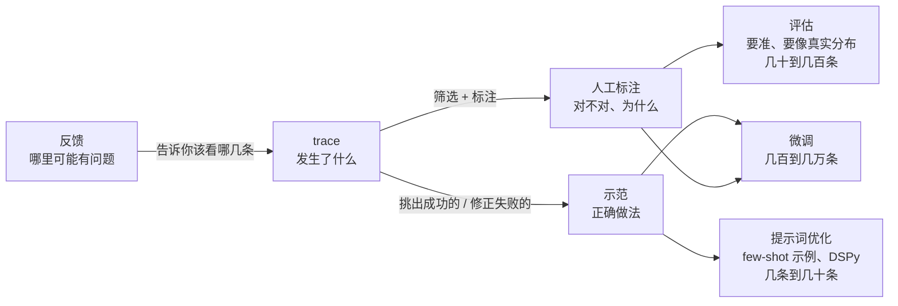
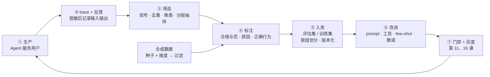
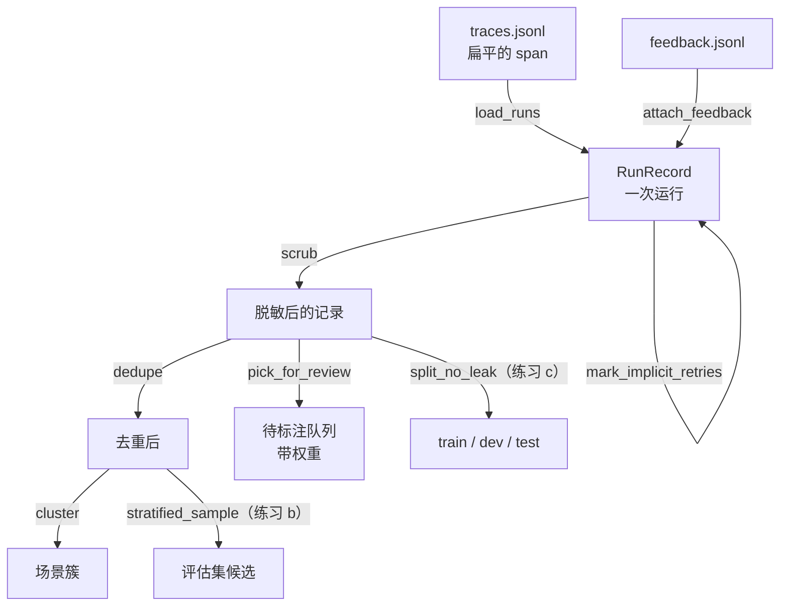

[中文](README.md) | [English](README.en.md)

# 第 21 课：Agent 的数据 —— trace、数据飞轮、合成数据与数据质量

> 🕐 建议用时：25 分钟 ｜ 🎯 学完你能：把生产 trace 变成可信的评估集和训练数据：会挑（分层抽样）、会洗（去重、脱敏）、会造（合成并验证）、会校（kappa、评委校准）、会分（按组划分防泄漏） ｜ 📦 对应源码：[`data_kit.py`](data_kit.py)（数据工具箱）、[`agentkit/tracing.py`](../../agentkit/tracing.py)（trace 导出格式）、[`agentkit/evals.py`](../../agentkit/evals.py)（`EvalCase`）
>
> 📖 必读：[Data Flywheels for LLM Applications](https://www.sh-reya.com/blog/ai-engineering-flywheel/)（Shreya Shankar，2024）—— 把"评估 → 监控 → 持续改进"讲成一个靠生产数据转起来的飞轮。重点读三处：评估指标要看着真实输出来定；二元（通过 / 不通过）指标比打分更容易和人对齐；标注数据要带时间戳，因为人的偏好会变。

本课对应 Stanford CS329Z（Engineering AI Agents，2026 秋）第 6–7 周的 "Data for Agentic Systems" 和 "Data Selection & Quality" 两个主题，推荐搭配阅读它公开的必读材料（见[延伸阅读](#延伸阅读)）。本项目与该课程没有关联。

## 0. 一句话讲清楚

**模型谁都能换，prompt 谁都能抄，只有"你的用户在你的工具上遇到过的问题"是你独有的。但这些问题躺在 trace 里的时候还不是数据，只是矿石。**

「小满商城」的客服 Agent 上线一个月了。trace 每天都在写，评估集却还是上线前写的那 20 条。上周有用户投诉"退款到账时间说错了"，翻遍评估集，没有一条测这个。

最直接的想法是把一个月的 trace 全倒进评估集，但马上会遇到下面这些问题：

| 淘金 | 数据工作 | 不做会怎样 | 本课 |
|---|---|---|---|
| 挑矿石 | trace 量大，绝大部分平平无奇 | 全标一遍要几个月；随机抽，又抽不到有问题的 | `pick_for_review`、练习 (b) |
| 洗掉泥沙 | 去重、脱敏 | "怎么退货"标了 300 遍；用户手机号进了 git | `dedupe`、`scrub` |
| 化验成色 | 标注 + 一致性检查 | 两个人对"合格"的理解不一样，标签就是噪声 | 练习 (a)、`agreement_report` |
| 人造金 | 合成数据：便宜，但要验真 | 期望答案是模型编的，测的是出题人而不是 Agent | `synthesize_cases`、`filter_candidates` |
| 分装入库 | 按组划分训练集 / 测试集 | 同一道题的变体两边都有，分数虚高 | 练习 (c) |

[第 10 课](../10_observability/README.md)讲了怎么记录 trace，[第 11 课](../11_evals/README.md)讲了评估集的基本构建，[第 16 课](../16_release_ops/README.md#问题-6反馈闭环--让线上的每个-bad-case-都变成测试)讲了"点踩 → 标注收件箱"的产品流程。这一课补上中间缺的那块：**数据本身**。它从哪来、怎么选、怎么保证质量、怎么分给评估和优化用。后面的[第 22 课](../22_eval_methodology/README.md)（评估方法论）和[第 23 课](../23_optimization/README.md)（优化）都建立在它上面。

## 1. 核心概念

### 1.1 Agent 的四种数据

| 数据 | 长什么样 | 从哪来 | 成本 | 缺什么 |
|---|---|---|---|---|
| **trace**（轨迹） | 一次运行的完整记录：输入、每次模型调用和工具调用、输出、状态、成本 | 生产环境自动产生（第 10 课） | 几乎免费 | 不知道"对不对" |
| **示范**（demonstration） | "这个输入的正确做法"：理想的工具序列和回答 | 专家手写；从成功的 trace 里挑；人工修正失败的 trace | 贵，要专家 | 覆盖面窄 |
| **反馈**（feedback） | 显式的：👍👎、打分、用户改写了回答；隐式的：换个说法重问、放弃、转人工、工单被重开 | 产品界面、业务系统 | 免费 | 显式反馈稀疏且有偏，隐式反馈噪声大 |
| **人工标注**（label） | 对某条 trace 的判断：合格与否、原因、正确的行为 | 标注员、领域专家 | 最贵 | 它就是"真值"，但也会出错（见 1.5 节、2.10 节） |



三种用途对数据的要求不一样：

- **评估**要"准"（标签可信）和"像"（覆盖真实分布，尤其是长尾），数量可以不大；
- **提示词优化**（挑 few-shot 示例，或者用 DSPy 这类自动优化器）需要少量、质量极高的示范；
- **微调**需要更多、更一致的示范或偏好数据。后两种第 23 课展开。

注意图里反馈指向的是 trace，而不是评估。👎 只说明"用户不满意"，不说明"正确答案是什么"（可能 Agent 错了，也可能政策本来就不允许）。反馈的作用是**告诉你该去看哪几条 trace**，它本身不是标签。

### 1.2 同一份数据不能既当训练集又当测试集

**数据泄漏**（data leakage）就是考题提前被看过了：用来"改进系统"的数据，又被拿来"评估系统"，分数自然好看，上线后原形毕露。

在 Agent 里，"训练"不只是微调。凡是**看着这批数据改系统**，都算训练：

- 把用例放进 prompt 当 few-shot 示例；
- 盯着失败用例改 prompt、改工具描述；
- 看着评委和人的分歧改评分标准（Demo 第 4 节就会遇到）；
- 用它挑模型、调参数。

泄漏也不只是"同一条数据出现了两次"：

| 泄漏类型 | 例子 | 防法 |
|---|---|---|
| 完全重复 | 同一个问题两边都有 | 去重 |
| 近重复 | "签收5天了，还能退货吗" 和 "签收 5 天了还能退货吗？" | 相似度去重，或者分到同一组 |
| 同源变体 | 同一个种子问题合成出来的 5 个改写 | 按种子分组 |
| 同一用户 / 会话 | 同一个人的说话习惯、同一段对话的前后几轮 | 按用户、会话分组 |
| 时间穿越 | 用 10 月的数据调 prompt，拿 9 月的数据评估 | 按时间切：过去的数据用来改，将来的数据用来测 |

对策是**按组划分**（练习 (c)）：先定义"什么算同一组"，再保证同一组只进一个集合。三个集合各有各的用途：

- **train（训练集）**：用来产生 few-shot 示例、给优化器当反馈、做微调；
- **dev（开发集）**：用来挑方案、改 prompt、调阈值，可以反复看；
- **test（测试集）**：只在最后评估一次。一旦看着 test 的结果回头改了系统，test 就变成了第二个 dev，它的分数也就不再可信。

[第 11 课](../11_evals/README.md)的"防止数据污染"讲的是同一件事的另一面；[第 23 课](../23_optimization/README.md)会在自动优化 prompt 时严格执行这套分工。

### 1.3 数据飞轮：完整闭环

第 16 课讲了"点踩 → 标注收件箱 → 回归评估集"这一段。完整的飞轮是这样的：



| 环节 | 做什么 | 谁负责 | 工具（本课 → 业界） |
|---|---|---|---|
| ② 记录 | trace 里记下脱敏后的输入输出；反馈带上 run_id | 应用 / 平台工程师 | agentkit `Tracer` → OpenTelemetry + Langfuse、Phoenix 等 trace 平台（第 10 课） |
| ③ 筛选 | 关联信号、去重、聚类、按配额抽样 | 评估 / 数据工程师 | `data_kit` → 数据仓库里的 SQL、trace 平台的筛选和导出 |
| ④ 标注 | 判断合格与否，写原因和正确行为 | 领域专家（一位"主标注人"定标准）+ 标注员 | 第 16 课的标注收件箱 → Label Studio、Argilla 等标注工具 |
| ⑤ 入库 | 评估集 / 训练集，按组划分、版本化、评审 | 评估负责人 | JSONL + git，和代码一起评审 |
| ⑥ 改进 | 改 prompt、工具、few-shot，必要时微调 | Agent 开发者 | 第 23 课 |
| ⑦ 上线 | 门禁、灰度、回滚 | 发布负责人 | 第 11 课的 `release_gate`、第 16 课 |

飞轮转不起来，通常是因为下面三个原因之一：

1. **只有入口没有出口**。反馈收上来了，没人标注；标了，没有进评估集。每个环节都要有负责人和固定节奏，比如每周标 50 条。
2. **把反馈直接当优化目标**。第 16 课提过 GPT-4o 的讨好事故：用户当下点赞的回答，不一定是对用户真正有益的回答。
3. **标准在变，却没人记录**。标注员对"合格"的理解会随着看的数据变多而改变（5.3 节的标准漂移），新旧标签混在一起就成了噪声。必读文章的建议是：标注数据带时间戳；给评委挑 few-shot 示例时，按和当前输入的相似度动态检索，并且更看重最近的标注。

### 1.4 关键词

| 术语 | 大白话 | 本课代码 |
|---|---|---|
| 工具序列签名（tool signature） | 一次运行"走了哪条路"，比如 `get_order → create_refund` | `tool_signature` |
| 分层抽样（stratified sampling） | 先分组，再每组按配额抽，小组就不会被漏掉 | `pick_for_review`、练习 (b) |
| 逆概率权重（inverse probability weight） | 被"多抽"了的样本在统计时要打折，才能还原全量 | `Pick.weight`、`weighted_mean` |
| 近重复（near-duplicate） | 只差标点、空格、订单号的两条数据 | `dedupe`、`group_ids` |
| 合成数据（synthetic data） | 用 LLM 生成的测试题或训练样本 | `synthesize_cases` |
| Cohen's kappa | 扣除"碰巧一致"之后的一致性：1 表示完全一致，0 表示和瞎猜一样 | 练习 (a) |
| 标准漂移（criteria drift） | 看的数据越多，对"什么算好"的标准就越会变 | 5.3 节 |
| 数据泄漏（data leakage） | 考题提前被看过了 | 练习 (c) |

### 1.5 三种数据生产方式怎么选

| 方案 | 怎么做 | 成本 | 质量 | 偏差 | 适用阶段 |
|---|---|---|---|---|---|
| A. 人工标注 | 领域专家逐条判断并写原因；两人独立标注一部分，算 kappa | 最高：专家的时间 | 最高，前提是有标注指南、一致性达标 | 标注员的个人口味；疲劳导致后期质量下降 | 冷启动的核心集、评委校准集、高风险领域，以及**任何阶段的测试集** |
| B. LLM 标注 + 人工抽检 | LLM 按评分标准（rubric）标全量；人工抽 5–10% 复核，优先抽评委没把握、多个评委意见不一的；持续监控 kappa、TPR、TNR | 中：token + 少量人工 | 取决于校准，校准好了可以接近人和人之间的一致性 | 评委的系统偏差：偏爱长回答、偏爱自己写的（第 11 课）；错起来会"整齐划一地错" | 规模化之后的日常标注、线上抽样评估 |
| C. 纯合成 | LLM 从种子生成题目和期望答案，只做自动过滤，人不看 | 最低 | 最不稳定：期望答案可能是编的，题目偏简单、偏规整 | 分布偏移、自我偏好、缺少长尾 | 冷启动时扩充覆盖面；对抗和边界用例；压力测试。**不能单独用作测试集** |

**怎么选**：按阶段组合。还没有流量时，用 A 写 20–50 条核心用例（[第 11 课问题 1](../11_evals/README.md#问题-1没有标注数据评估集从哪来)），用 C 扩充边界和对抗用例，C 的每一条至少人工看一眼。上线之后以生产 trace 为主：日常数据用 B 标，校准集和测试集用 A 标，C 只用来补覆盖面。记住一条硬规则：**测试集的标签必须经过人**，否则测出来的只是"LLM 同意 LLM"。

## 2. 从零实现：`data_kit.py` 逐段讲解



### 2.1 trace 里没有你要的东西

打开 Demo 生成的 `runs/traces.jsonl`，一个 `agent.run` span 的属性是这样的：

```text
{"agent.name": "shop-support", "run_id": "...", "tenant.id": "xiaoman", "user.id": "u_zhang",
 "agent.status": "completed", "agent.steps": 2, "agent.cost_usd": 0.00122, ...}
```

有工具、状态、成本，**但没有用户说了什么，也没有 Agent 最后答了什么**。这是故意的：[第 10 课](../10_observability/README.md#问题-2trace-里躺着用户的手机号和身份证)讲过，内容采集应该是 opt-in 的，agentkit 只在工具参数和结果预览里记了脱敏后的片段。

想从 trace 里挖数据，应用层就得显式记录输入输出，而且**先脱敏、再记录**：

```python
with tracer.span("app.request", **{"app.input": redact_pii(v.text)}) as span:
    res = agent.run(v.text, metadata={"tenant_id": "xiaoman", "user_id": v.user})
    span.set(**{"app.output": redact_pii(res.output or "")})
```

`agent.run` 的 span 会自动挂在 `app.request` 下面（Tracer 用 contextvars 维护 span 栈），导出时整棵树写进同一条 trace。

### 2.2 从 span 到"一次运行"

`load_runs` 按 `trace_id` 归组，用 `parent_id` 还原成树，找到最外层的 Agent span，再收集工具序列、token 和成本。几个设计决策：

- **坏行跳过，但要计数**。进程崩溃时，最后一行可能只写了一半。静默跳过会掩盖问题，遇到坏行就整体失败又太脆弱。
- **只看最外层 Agent 的直接子 span**。子 Agent（[第 06 课](../06_orchestration/README.md)的 `agent_as_tool`）挂在某个 tool span 下面，它调用的工具不算主 Agent 的路径。
- **成本取最大值，不相加**。`agent.cost_usd` 是整个 run 的累计值。暂停后 `resume` 会产生一条新的 trace（新的根 span），但 run_id 不变，`load_runs` 会按 run_id 合并回去。**一次运行不一定只对应一条 trace。**

### 2.3 信号：显式反馈和隐式反馈

```python
dk.attach_feedback(records, feedback_rows)  # 👍👎 是事后异步到达的，存在另一张表里，靠 run_id 关联
dk.mark_implicit_retries(records)           # 同一用户 5 分钟内又问了相似的问题 → 上一次多半没解决
```

`RunRecord.problems()` 汇总所有信号：状态不是 completed、工具报错、👎、被重问。Demo 里"退款多久到账？"同时带着 👎 和"被重问"两个信号，两种来源互相印证，这条最该先看。

隐式信号只能说明"值得看一眼"，不能直接当成"答错了"的标签：用户换个说法再问，也可能只是想追问细节。

### 2.4 脱敏：数据离开 trace 系统之前

评估集会进 git、会被很多人看、可能被拿去微调，访问面比 trace 系统大得多。`scrub` 做两件事：

- 文本再过一遍 `redact_pii`（[第 09 课](../09_security/README.md#问题-4客户身份证号流进了模型供应商日志和回答)）。应用层记录时已经做过一次，这里是纵深防御；
- 用户 ID 换成 HMAC 假名。同一个人始终对应同一个假名，还能按用户分组防泄漏，但没有密钥就反查不回去。为什么不用普通的 SHA-256，见[第 10 课问题 2](../10_observability/README.md#问题-2trace-里躺着用户的手机号和身份证)（ID 空间小，可以穷举）。

正则脱敏抓不住姓名、地址这类自由文本（第 10 课 Demo 演示过这个盲区）。所以评估集入库前，至少要有人工扫一遍。

### 2.5 文本相似度：零依赖下的折中

```python
def normalize_text(text):   # 全角转半角、小写、所有数字换成 0、去掉空白和标点
def shingles(text):         # 单字 + 相邻两字
def text_similarity(a, b):  # Jaccard 相似度 = 交集大小 / 并集大小
```

三个设计决策：

1. **数字归一化**。"订单 A1001 到哪了"和"订单 A1004 到哪了"会被当成同一个问题。做评估集时这是对的，它们是同一个场景；但如果想复现某个具体订单的 bug，就不该这样归一化。
2. **单字和双字都要**。中文没有空格，零依赖下只能按字符切片。只用双字的话，短句一改写就几乎不重叠："退货运费谁出"和"退货的运费是谁承担"只有 0.18。加上单字之后是 0.33，而 Demo 里无关的两句话大多在 0.2 以下。
3. **这不是语义相似度**。"发票怎么开"和"电子发票在哪里申请"只有 0.09。真正的语义聚类要用 embedding（见 5.5 节；向量检索在[第 17 课](../17_retrieval_quality/README.md)）。本课的模型网关不支持 `/embeddings` 接口，所以 Demo 用字符相似度。

### 2.6 去重与聚类：同一个算法，两个阈值

`similarity_groups` 把"同一个桶里、相似度 ≥ 阈值"的数据两两连边，返回连通分量，也就是单链接聚类（single-linkage clustering）：

- 结果和输入顺序无关，完全确定；
- 保证"任意两条相似度 ≥ 阈值的数据一定在同一组"，按组划分时这正是防泄漏需要的性质；
- 代价是链式效应：A 像 B、B 像 C，A 和 C 就会被放进同一组，哪怕它们并不像。

去重（阈值 0.8）和聚类（阈值 0.25）都以**工具签名**为桶。签名会把连续重复的同一个工具折叠成 `name+`：`[get_order, get_order, get_order]` 变成 `get_order+`。不折叠的话，每多重试一次就多出一条"新路径"。

**签名不同就不去重。** Demo 里有两条"怎么退货"，一条调用了 `search_policy`，另一条模型没检索、凭记忆直接答了。文本几乎一样，路径却不同，说明 Agent 的行为不稳定。这是最值得看的数据，绝不能当成重复删掉。去重时，代表优先选"有问题信号"的那一条。

### 2.7 抽样：配额 + 权重

```python
picks = dk.pick_for_review(records, 12, seed=0)
# 分层优先级：有问题信号 > 稀有路径（签名出现 ≤ 2 次）> 高成本（≥ 90 分位）> 普通
# 默认配额 40% / 30% / 20% / 10%；某一层不够，名额顺延给下一层
```

- **为什么不纯随机抽**：Demo 里有问题的运行只占 10%（40 条里 4 条）。随机抽 12 条，一条都抽不到的概率是 22%。
- **为什么不只看失败**：只看失败，会漏掉"用户没抱怨、但路径很奇怪"的问题，也没法估计整体质量。
- **为什么要记权重**：每条样本都记下"它在全量里代表多少条"（该层总数 / 该层抽中数）。按"失败优先"抽出来的样本，问题率是 33%，真实值是 10%，加权还原后正好是 10%。**用有偏的样本算质量指标，一定要加权**，否则会把线上质量估计得比实际差三倍。这和第 10 课"尾部采样之后，不能直接用 trace 算成功率"是同一个道理。

练习 (b) 的 `stratified_sample` 是另一种分层：**按比例**分配名额，同时保证每层至少 1 条。它适合用来建一个"有代表性、又不漏长尾"的评估集。分层之后的评估集能把分数估得多准、需要多少条，是第 22 课的内容。

### 2.8 合成数据：生成

```python
cands = dk.synthesize_cases(llm, SEEDS, DIMENSIONS, KNOWLEDGE, per_seed=[4, 3, 3])
```

为什么是"种子 × 维度"，而不是一句"帮我生成 100 条测试题"？不给约束，模型会反复生成它觉得典型的问题：干净、完整、只问一件事。这样的题比真实用户的问题简单，而且彼此相似。**种子**把主题锚定在真实流量上，**维度**强制覆盖你关心的变化方向：

| 维度 | 测什么 |
|---|---|
| 口语化改写 | 对真实说法的鲁棒性：省略、错别字、带情绪 |
| 组合约束 | 两条规则同时生效时，会不会顾此失彼（生鲜 + 7 天内） |
| 错误前提 | 会不会附和用户说错的前提（"你们不是 30 天无理由吗"） |
| 超出知识库 | 知识库没写的问题，是承认不知道，还是编一个答案 |

输出用 `complete_json` 约束成结构化的 `SynthCase`：问题、维度、该答还是该拒答、参考答案、必含关键词，以及**知识库原文证据**。要求证据逐字复制，是为了下一步能用字符串匹配、零成本地抓出"编造的原文"。

第一版 prompt 在真实运行（gpt-5.5）时暴露了两个问题：

- 维度写成"带一个错误前提，**或者**问知识库没有覆盖的问题"，模型 3 次全选了错误前提，一道"该拒答"的题都没出。**一个维度只放一种变化**，模型才没得挑。拆成两个维度之后，3 道"该拒答"的题都出来了。
- `must_contain` 要的是关键词，模型却成段复制知识库原文（"质量问题退货由商家承担运费"），还把和问题无关的规则也塞了进去。规则评分器（[`rule_grader`](../../agentkit/evals.py)）要求逐字出现，正确的回答换个说法就会被判错。现在 prompt 里写明了"每个不超过 8 个字、只放必需的"，过滤器再兜底检查一遍。用现在的过滤器回头检查第一版产出的 9 条"合格"用例，有 7 条会因为整句复制被拦下；改了 prompt 之后，后面两次真实运行里这条规则一次都没有触发。

### 2.9 合成数据：过滤

原则是**便宜的检查在前，调模型的检查在后**：

| 检查 | 抓什么 | 成本 |
|---|---|---|
| 长度 | 太短（没有信息量）、太长 | 免费 |
| 和种子、和已保留的题目近重复 | "改写"只换了一个字 | 免费 |
| 关键词、证据是否逐字出现在知识库里 | 编造的"原文"、编造的数字 | 免费 |
| 关键词长度 | 整句当关键词，规则评分会误判 | 免费 |
| LLM 核查：知识库能不能回答、参考答案能不能从知识库推出、关键词是不是都必需 | 出题模型把常识当成了知识库内容；"该拒答"标错了；期望写得过细 | 每题 1 次调用 |

LLM 核查员的 prompt 本身也需要校准。第一版写的是"只依据知识库判断，不要使用你自己的常识"，结果它因为"知识库没说海鲜礼盒属于生鲜"拒掉了一道好题。现在改成"可以做常识性的归类和推理，但不能用知识库以外的规则、数字或承诺来补全答案"。**验证者也会出错，要定期看它拒掉了什么、放过了什么。**

### 2.10 一致性：一致率、kappa、TPR / TNR

两个标注者（人和人，或者人和评委）给同一批样本打标签：

- **一致率**（percent agreement）：标签相同的比例。直观，但没有扣除"碰巧一致"的部分。
- **Cohen's kappa**：`κ = (p_o − p_e) / (1 − p_e)`。`p_o` 是实际一致率，`p_e` 是两人各按自己的标签比例"随机乱标"时的期望一致率。κ = 1 表示完全一致，κ = 0 表示和瞎猜一样，κ < 0 表示比瞎猜还差。

为什么需要 kappa？练习 (a) 里有一个测试：100 条样本，两人都几乎只说 pass，其中 90 条一致。一致率 90%，kappa 却是 **−0.05**：两人各有 95% 的概率说 pass，碰巧一致的概率本来就有 90.5%。这叫 **kappa 悖论**（Feinstein & Cicchetti 1990）：类别极不平衡时，高一致率可能毫无意义，kappa 本身也会变得很敏感。

所以 `agreement_report` 同时报告三样东西：一致率、kappa，以及把人当真值时评委的 **TPR**（人判为不合格的，评委抓到了多少）和 **TNR**（人判为合格的，评委放行了多少）。Hamel Husain 在他的 LLM 评委指南里也建议分别报告这两个数，而不是只看总一致率。

kappa 多少算好？常用的是 Landis & Koch（1977）的分档：0.21–0.40 一般（fair），0.41–0.60 中等（moderate），0.61–0.80 较强（substantial），0.81 以上几乎完全一致（almost perfect）。这套分档是经验性的。更实用的参照是**同一批数据上人和人之间的 kappa**：评委和人的一致性明显超过它时，先别高兴，Demo 第 4 节会告诉你为什么。12 条样本算出来的 kappa 误差很大，给一致率和 kappa 加置信区间、判断需要多少校准样本，以及成对比较时评委的位置偏差，见[第 22 课](../22_eval_methodology/README.md)。

### 2.11 按组划分

练习 (c) 的 `split_no_leak` 用的是贪心算法：把组打乱，按大小从大到小排，每次把一个组放进"离目标条数还差得最多"的集合。"组"怎么定义由你决定：

- 近重复组：`dk.group_ids(records, 0.5, text_fn)`，相似度 ≥ 0.5 的数据一定同组；
- 合成数据：按种子（tags 里的 `seed:S1`）；
- 生产数据：按用户假名、会话 ID；
- 对时间敏感的场景：直接按时间切，不要随机。

## 3. 动手：运行 Demo

```bash
.venv/bin/python lessons/21_agent_data/demo.py --offline   # 离线剧本，无需 API key，约 1 秒
.venv/bin/python lessons/21_agent_data/demo.py             # 真实模型：约 50 次调用、并发 ≤ 2，约 3 分钟
```

第 1 节生成 40 次运行。真实模式下只有 6 次调用真实模型，其余 34 次是剧本回放的"历史流量"：挖数据需要一定的量，全部用真实模型又太贵。第 2 节在两种模式下几乎一样，第 3、4 节差别最大。下面的节选来自一次真实运行（gpt-5.5）。

**第 1 节：真实模型和剧本的差别**

```text
   [真实模型] 订单 A1002 的耳机有质量问题，…  → completed，工具 ['get_order', 'search_policy', 'create_refund']：已为您提交退款申请：RF-2001。订单 A1002 已签收 5 天，符合 7…
   [真实模型] 订单 B9999 怎么还没到？         → completed，工具 ['get_order']：未查询到订单 B9999，请您核对订单号是否输入正确。…
```

剧本里的"B9999"是一个反面教材：模型对着不存在的订单反复查询，直到撞上步数上限。真实的 gpt-5.5 查一次就停下来，让用户核对订单号。所以真实模式的状态分布里没有 `max_steps`，这条运行只剩下"工具报错"一个信号。真实模型在退款前还主动查了一次政策，走出了一条剧本里没有的新路径。

**第 2 节：挖数据**

```text
── 2.4 近重复去重：签名相同 且 文本相似度 ≥ 0.8（数字归一化）
   40 → 38 条，去掉 2 条：
     签收5天了，还能退货吗      ≈ 签收 5 天了还能退货吗？
     退货运费谁出               ≈ 退货运费谁出？
   相似度 ≥ 0.8 但工具路径不同、因此没有去重的：1 对 —— 同一个问题走了不同路径 = 行为不稳定，最值得看：
     怎么退货                   search_policy  vs  怎么退货？ (无工具)

── 2.6 待标注抽样：失败优先 → 稀有路径 → 高成本 → 普通（n=12）
   层          全量条数  抽中    每条权重
   failure     4         4       1.0
   rare_path   7         6       1.2
   high_cost   1         1       1.0
   normal      28        1       28.0
   对比：纯随机抽 12 条，一条有问题的运行都抽不到的概率是 22%
   问题率：样本里 33%，按权重还原 10%，全量真实 10%

── 2.7 评估集：按工具路径分层抽样 vs 随机抽样（n=14）
   去重后共 38 条、11 种路径。分层抽样覆盖 11/11 种；随机抽样（1000 次平均）只覆盖 6.0/11 种，最差一次 3 种

── 2.8 划分训练 / 测试：按记录随机切 vs 按近重复组切
   按记录随机切：train/dev/test = 24/8/8，跨集合的近重复对（相似度 ≥ 0.5）3 对，例如 '签收5天了，还能退货吗' ↔ '签收 5 天了还能退货吗？'
   按近重复组切：train/dev/test = 24/8/8，跨集合的近重复对（相似度 ≥ 0.5）0 对
```

观察：① 40 条运行里有 11 种工具路径，7 种只出现过 1–2 次，长尾很长；② 随机抽 14 条，平均只能覆盖一半多的路径，运气差时只有 3 种；③ 按记录随机切，3 对近重复被拆到了不同集合，测试集里的题在训练集里已经有了"答案"。

**第 3 节：合成数据**（真实运行，改进后的 prompt）

```text
   syn-S1-1   口语化改写  该答    我收货都5天了，现在想退还来得及不？东西没拆…  ✅ 保留
   syn-S1-2   组合约束    该答    我签收才3天，但买的是生鲜水果，这种能走7天…   ✅ 保留
   syn-S1-4   超出知识库  该拒答  我要退货的话，快递员能几点上门取件？          ✅ 保留
   syn-S2-3   超出知识库  该拒答  退货上门取件如果超重了，额外运费是谁出？      ✅ 保留
   syn-S3-1   错误前提    该答    我听说退货一寄出去就能马上退钱，是不是当天…   ❌ llm:keyword_unnecessary
   ...
   类型分布：该答 7 条、该拒答 3 条
   保留 9/10。便宜的规则先拦下 0 条，只有 10 条需要调模型核查。
   分布对比：生产问题平均 13 字、两两平均相似度 0.06；合成问题平均 25 字、两两平均相似度 0.08
   💡 合成问题平均长度是生产问题的 1.9 倍，句子更完整、信息更全 —— 这就是分布偏移。…
```

观察：

- **分布偏移**：三次真实运行里，合成问题的平均长度都在 25–27 字，生产问题是 13 字。真实用户说"怎么退货"，模型生成的是"我收货都 5 天了，现在想退还来得及不？东西没拆坏。"：信息更全，也就更好答。
- **"想象力"很集中**：3 道"超出知识库"的题里有 2 道都在问上门取件，上一次运行也是这样。维度只保证了"有这类题"，不保证这类题彼此不同。可以把已经生成的题目放进 prompt，要求新题不同；或者直接列出知识库没覆盖的主题让它挑。
- **自动过滤不能替代人工**：syn-S1-1 问的是"东西没拆坏能不能退"，必含关键词里却有"生鲜"，正确回答完全可以不提生鲜。LLM 核查员放过了它，前一次运行里一模一样的问题它也放过了。
- 离线剧本里埋了 5 种典型问题：和种子几乎一样、整句当关键词、编造的知识库原文、把知识库能答的题标成"该拒答"、参考答案夹带知识库没有的承诺（"超时补偿 10 元"）。前三种被免费的规则检查拦下，后两种由 LLM 核查员拦下。

**第 4 节：谁来验证评估者**（真实运行）

```text
   校准集 12 条，两位标注员独立标注；标注员 A 判 fail 5 条，B 判 fail 7 条
   标注员 B（人和人的一致性）                 一致率  83%   kappa  0.68   TPR 100%（5/5）  TNR  71%（5/7）
   评委 v1（模糊标准，只看问答）              一致率  67%   kappa  0.23   TPR  20%（1/5）  TNR 100%（7/7）
   评委 v2（具体标准 + 知识库 + 工具记录）    一致率 100%   kappa  1.00   TPR 100%（5/5）  TNR 100%（7/7）

── 4.2 评委 v1 和标注员 A 不一致的案例
   c02 问：退款多久到账？  答：退款会在 24 小时内原路退回，请您放心。
       人：fail（知识库是 1-3 个工作日，24 小时是编的）   评委：pass（客服回答中明确说明“退款会在 24 小时内原路退回”，直接回应了用户“退款多…）
   c11 问：你们不是 30 天无理由退货…  答：是的，签收后 30 天内都可以申请无理由退货。
       人：fail   评委：pass（回答中明确说明“是的，签收后 30 天内都可以申请无理由退货”，直接回应了…）
```

观察：

- 三次真实运行，两版评委的结果完全相同。
- **v1 的一致率 67%，听起来还行，kappa 只有 0.23**。它把 5 条不合格的回答放过了 4 条（TPR 20%）：编造的到账时间、没调用工具却说"已退款"、写错的发票有效期、附和"30 天无理由"。v1 看不到知识库和工具记录，只能判断"像不像一个好回答"。流畅、自信、直接回应了问题，它就给过。
- **v2 和标注员 A 完全一致（kappa 1.00），甚至比另一位人类标注员 B 和 A 的一致性（0.68）还高**。这不是因为评委比人强，而是因为 v2 的评分标准就是看着这 12 条、照着 A 的判断写的：它学会的是 A 的口味，也在这 12 条上"过拟合"了。**用来改评分标准的数据，不能再用来报告评委的准确率**。这正是 1.2 节的数据泄漏。要换一批没看过的样本复测，练习 (c) 就是干这个的。
- 离线剧本里，v2 在 c09（"降价能补差价吗"，回答没提"秒杀、清仓不参与价保"）上和 A 不一致，而 B 恰好也判了 fail。这种"不完整但不算错"的情况，评分标准里没写清楚。该补的是**标注指南**，而不是把评委调成和某一个人一样（5.3、5.4 节）。
- 本机只配置了一个模型，Demo 里的 Agent、出题人、核查员和评委都是 gpt-5.5，自我偏好（5.2 节）在这里无法排除。生产中评委应该换用不同的模型。

运行产物在 `lessons/21_agent_data/runs/` 下：`traces.jsonl`、`feedback.jsonl`、`review_queue.jsonl`（待标注队列，带权重）、`synthetic_cases.jsonl`（通过过滤的合成用例）。

## 4. 练习

打开 [`exercise.py`](exercise.py)，实现三个函数：

| 题目 | 要做什么 | 测试怎么验证 |
|---|---|---|
| (a) `cohen_kappa` | 任意类别的 Cohen's kappa | 教科书例子（0.4）；完全一致和完全相反（1 和 −1）；kappa 悖论（一致率 90%，kappa < 0）；某个类别只有一方用过；期望一致率为 1；输入不合法 |
| (b) `stratified_sample` | 按比例分层抽样，每层至少 1 条，总数恰好为 n，可复现 | 60/30/10 抽 10 条正好是 6/3/1；两条长尾各得 1 条；同一 seed 结果相同、换 seed 会变；保持原始顺序；不可能完成的请求抛 ValueError |
| (c) `split_no_leak` | 按组划分 train / dev / test，同一组不跨集合 | 不泄漏、不丢不重；等大的组时条数精确命中比例；不等大时误差在两个组以内；合成用例按种子整组划分；比例为 0 的集合为空；比例不合法抛 ValueError |

```bash
make lesson N=21
# 或者：.venv/bin/python -m pytest lessons/21_agent_data -v
```

提示：

- (a) 用整数算：分子分母同乘 n²，`κ = (n·一致数 − Σ ca[c]·cb[c]) / (n² − Σ ca[c]·cb[c])`，可以避开 `p_e` 被浮点误差算成 0.9999999 的问题。[`data_kit.kappa_2x2`](data_kit.py) 是二分类的特例，可以拿来对照。
- (b) 先用 dict 按 key 收集下标（dict 保持插入顺序，也就是"层第一次出现的顺序"），再算配额，最后层内 `rng.sample`。记下标而不是记元素本身，元素可能是不可哈希的 dict。
- (c) Python 的 `sort` 是稳定的：先打乱、再按组大小排序，大小相同的组会保持打乱后的顺序。
- 做完之后重跑 Demo，第 2、4 节会显示"来自 exercise.py（你的实现 👍）"。

## 5. 深入（给有余力的你）

### 5.1 少而精：LIMA 说了什么、没说什么

LIMA（Zhou et al., NeurIPS 2023）只用 **1,000 条**精心挑选的问答对（750 条来自 Stack Exchange、wikiHow 等社区，250 条由作者手写）微调 65B 的 LLaMa，没有做 RLHF。在人工对比评测中，LIMA 的回答在 43% 的情况下与 GPT-4 相当或更好，对 Bard 是 58%，对经过人类反馈训练的 DaVinci003 是 65%。作者据此提出**表面对齐假设**（Superficial Alignment Hypothesis）：模型的知识和能力几乎都来自预训练，对齐主要是教它"用什么格式和风格跟用户说话"。

论文的消融实验（7B 模型，每组 2,000 条，用 ChatGPT 按 1–6 分给回答的有用性打分）更值得细看：

- **多样性**：问题五花八门的 Stack Exchange 数据，明显好于问题清一色是"如何……"的 wikiHow 数据；
- **质量**：经过质量过滤的 Stack Exchange 数据，比未过滤的高出 0.5 分；
- **数量**：数据量从 2K 翻到 32K（16 倍），分数基本没有提升。

它**没有**说的是：

- **没说"数据越少越好"**。它说的是"数量之外，多样性和质量更重要"，而且作者承认这 1,000 条的构造"需要大量心力，难以扩展"。
- **没说对"学新技能"也成立**。LIMA 教的是对话风格，不是模型原本不会的能力。让 Agent 学会你的工具和业务流程，更接近"学技能"。比如 SWE-smith（Yang et al., NeurIPS 2025 数据集与基准赛道）为软件工程 Agent 批量合成了约 5 万个任务实例，训练出的 SWE-agent-LM-32B 在 SWE-bench Verified 上达到 40.2%。在那里，规模是关键。
- **结论来自通用对话**。你的评估集和它是两回事，但道理相通：**50 条挑过的、标对的、覆盖不同路径的用例，胜过 5,000 条"怎么退货"的重复**。同样的思路也可以用来筛训练数据，AlpaGasus（Chen et al., ICLR 2024）用 ChatGPT 给 Alpaca 的 52K 条指令数据打分，只留下 9K 条高分数据，训练出的模型反而更好，7B 模型的训练时间从 80 分钟降到 14 分钟。

### 5.2 合成数据的四个陷阱

| 陷阱 | 表现 | 对策 |
|---|---|---|
| **分布偏移** | 合成问题更长、更完整、更规整（Demo：两倍长度）；缺少真实用户的省略、错别字、一次问好几件事 | 种子从真实流量里挑；维度里专门加"口语化"；定期比较合成数据和生产数据的统计特征 |
| **自我偏好** | 出题、答题、评分都用同一个模型，评委会偏爱自己风格的输出。Panickssery et al.（NeurIPS 2024）发现，LLM 能在相当程度上认出自己写的文本，而且这种"自我识别"能力越强，自我偏好越明显 | 出题模型、被测模型、评委尽量用不同的模型家族；关键结论要有人工标注的校准集支撑 |
| **过于简单** | 模型挑它擅长的写：单一意图、答案就在一句话里；Demo 第一版甚至挑了"错误前提"而完全回避"超出知识库" | 维度拆细，一个维度只放一种变化；专门生成组合约束、多轮、带干扰信息的题 |
| **期望答案不可靠** | 参考答案夹带常识或编造的承诺；"该拒答"标反；关键词整句复制或过细 | 证据逐字核对 + LLM 核查 + 人工抽检；核查员自己也要校准（2.9 节） |

多样性过滤是合成数据的基本功。Self-Instruct（Wang et al., ACL 2023）从 175 条人工写的种子任务出发让模型自举生成指令，只有当新指令和已有指令的 ROUGE-L 相似度都低于 0.7 时才收入。本课 `filter_candidates` 的近重复检查是同一个思路。

如果合成数据用来**训练**，还要警惕更长期的问题。Shumailov et al.（Nature 2024）发现，模型一代代地在前代模型生成的数据上训练，原始分布的尾部会逐渐消失，这就是"模型崩溃"（model collapse）。对 Agent 来说，尾部恰恰是那些罕见路径和边界情况。所以合成数据只能**补充**真实数据，不能取代它。

### 5.3 谁来验证评估者：EvalGen 与标准漂移

LLM 评委替你给成千上万条输出打分，那谁来检查评委？Shankar et al. 在 UIST 2024 的论文 *Who Validates the Validators?* 里做了一个叫 **EvalGen** 的工具：用 LLM 为每条评估标准生成多个候选实现（Python 断言或 LLM 评委 prompt），同时让用户对一部分输出点 👍👎，再挑出和用户判断最一致的实现。"一致"用两个数衡量：**覆盖率**（coverage，用户判为不好的输出，断言能拦下多少）和**误杀率**（false failure rate，用户判为好的输出，断言错拦了多少），再合成一个对齐度（按论文表中数据验算，是覆盖率与 1 − 误杀率的调和平均）。在论文的离线评测里，和不用人工评分的基线 SPADE 相比，EvalGen 在一个产品描述生成任务上用 4 条断言做到了 66% 的对齐度（SPADE 用了 9 条，54%）。

比工具本身更重要的，是他们对 9 位业界从业者的用户研究中观察到的现象，作者称之为**标准漂移**（criteria drift）：

> 用户需要先有标准才能给输出打分，但正是给输出打分的过程，帮他们确定了标准。

比如有两位参与者一开始要求"所有实体都必须是专有名词"，看了一批输出后改成了"大部分是"。还有些标准只有看到某种具体的错误输出之后才会被想到。


对你的数据工作意味着：

1. **评分标准不能在看数据之前一次写完**。先看 30–50 条真实输出，再写标准，这和必读文章"指标要看着数据定"是一个意思。
2. **评委要用留出的数据来验证**。Demo 第 4 节的 kappa 1.00 就是反面例子：标准是看着那 12 条写的。
3. **标准和标签都要有版本**。标准改了，旧标签可能就不对了。至少要记录每条标签是按哪个版本的标准标的。
4. **定期复核**。评委模型更新了、业务规则变了、用户群变了，都要用新标注的样本重新测一致性。

### 5.4 标注指南怎么写

标注一致性低，多半不是标注员不认真，而是指南没写清楚。一份能用的指南至少包括：

| 部分 | 写什么 | 例子（本课客服场景） |
|---|---|---|
| 任务目标 | 这批标签用来干什么 | "判断回答能否直接交给用户，用于评估集和评委校准" |
| 标签定义 | 每个标签的定义，配**正例和反例** | fail：事实与知识库不符（例：说"24 小时到账"）；pass：啰嗦但信息正确（例：c07） |
| 边界规则 | 遇到模棱两可的情况怎么判，最好写成决策顺序 | "先查事实 → 再查是否虚报操作 → 再查是否给出下一步；不完整但没说错的，按……处理" |
| 需要看什么 | 标注员必须看哪些信息 | 知识库原文、工具调用记录，而不只是问答文本 |
| "不确定"选项 | 允许标"拿不准"并写原因，而不是被迫二选一 | 拿不准的交给主标注人仲裁，仲裁结果补进"边界规则" |
| 版本与变更记录 | 每次修改的日期、原因、影响哪些旧标签 | "v3：'未提秒杀例外'从 fail 改为 pass，重标 12 条" |

**让标注员顺手写下理由**，而不只是打一个 pass / fail。写一句"知识库是 180 天，回答说 365 天"几乎不花额外时间，却是整个飞轮里性价比最高的数据：分析分歧时靠它，写评分标准和评委的 few-shot 示例时靠它，第 23 课的优化器也把它当作最好的反馈材料。

落地流程：两人独立标 30 条 → 算 kappa → 逐条讨论分歧 → 改指南 → 再标一批新的 → kappa 达标（团队自己定标准并写进文档）后再大规模标注。标注过程中定期混入几条答案已知的"金标题"，监测标注员有没有漂移。这和第 11 课校准 LLM 评委是同一套方法：**评委和人都要按同一份指南来校准**。

### 5.5 规模化之后

- **去重和聚类**：本课是 O(n²) 两两比较，几千条以内够用。几十万条时，近重复检测用 MinHash + LSH（局部敏感哈希）把复杂度降到接近线性；语义聚类用 embedding + 聚类算法。Lee et al.（ACL 2022）发现，常用语言模型数据集的验证集里有超过 4% 的数据和训练集重叠，去重之后模型逐字复述训练数据的频率降到原来的十分之一。
- **主动挑选标注样本**：除了失败优先，还可以优先标"评委没把握"或"几个评委意见不一"的样本，让每一份标注预算都花在信息量最大的地方。
- **数据集版本化**：评估集和代码一起放进 git，修改期望必须经过评审；每条数据记下来源（生产 / 合成 / 人工）、标注人、标注时间、所用指南的版本。
- **隐私合规**：数据保留期限、用户的删除请求（从评估集和训练集里也要删掉）、跨境传输，都要在飞轮设计之初就考虑进去。

## 6. 常见坑与反模式

| 反模式 | 后果 | 正确做法 |
|---|---|---|
| trace 只记元数据，却指望从里面挖评估集 | 挖出来的只有工具名和状态，不知道用户问了什么 | 应用层记录脱敏后的输入输出（2.1 节） |
| 把 👎 直接当成"答错了"的标签 | 政策本来就不允许的也被当成 bug；讨好用户的回答被当成正确答案 | 反馈只用来挑数据，标签由人来定 |
| 纯随机抽样送标 | 标注预算花在大量"没问题"的数据上，长尾路径一条都抽不到 | 失败优先、稀有路径优先、按配额分层 |
| 用"失败优先"的样本直接算质量指标 | 线上质量被严重低估（Demo：33% vs 真实 10%） | 记录抽样权重，加权还原 |
| 按记录随机划分训练集和测试集 | 近重复、同源变体分到两边，分数虚高 | 按组划分（用户、会话、种子、近重复组），或按时间切 |
| 去重时不看工具路径 | 把"同一个问题走了不同路径"这种最有价值的数据删掉了 | 签名相同才去重 |
| 合成数据不过滤就入库 | 测的是出题模型的常识，而不是 Agent | 证据核对 + LLM 核查 + 人工抽检 |
| 中文关键词做逐字匹配时不做归一化 | "1-3 个工作日"和"1～3个工作日"被判为不同，正确回答被误杀 | 关键词尽量短、只放数字和术语；比较前统一全角半角和空格；开放式判断交给校准过的评委 |
| 只报一致率 | 类别不平衡时，一个永远说"合格"的评委也有很高的一致率 | 同时报 kappa、TPR、TNR |
| 看着校准集改 rubric，再用同一批数据报告评委准确率 | 一致性虚高（Demo：kappa 1.00） | 校准集分成开发集和测试集 |
| 标注指南一次写完、永不更新 | 标准漂移，新旧标签混在一起 | 指南有版本号和变更记录，分歧驱动修订 |
| 评估集里带着手机号、真实用户 ID | 评估集进了 git，就等于数据泄露 | 入库前脱敏 + HMAC 假名 + 人工扫一遍 |

## 7. 面试 & 设计评审问题

<details>
<summary>Q1：线上每天 10 万条 trace，标注预算每周 200 条。你怎么决定标哪些？</summary>

- 先关联信号：运行状态、工具报错、显式 👎、隐式信号（重问、转人工、放弃）；
- 分层抽样并设配额：有问题信号的优先，其次是稀有路径（按工具序列签名统计），再是高成本，最后留一部分纯随机，用来估计整体质量；
- 抽之前先去重（签名相同 + 文本近重复），同一个问题走出不同路径的运行要保留；
- 记录每条样本的抽样权重，算整体指标时加权还原；
- 标注结果回流：新发现的错误类型加进信号和配额。
</details>

<details>
<summary>Q2：什么是数据泄漏？在 Agent 开发里有哪些不那么明显的泄漏？</summary>

- 用来改进系统的数据，又被拿来评估系统；
- 不明显的：few-shot 示例和评估集重叠；盯着评估集的失败用例反复改 prompt；看着校准集改 rubric，再用它报告评委准确率；同一种子合成的变体分到两边；同一用户的多条对话分到两边；用未来的数据调参、过去的数据评估；
- 对策：按组划分（用户、会话、种子、近重复组）；测试集冻结，迭代只用开发集；时间敏感时按时间切。
</details>

<details>
<summary>Q3：两个标注员的一致率是 90%，能说明标注质量高吗？</summary>

- 不一定。要看碰巧一致的概率：如果 95% 的样本都是 pass，两个人都几乎只标 pass，一致率很高，kappa 却可能接近 0，甚至为负（kappa 悖论）；
- 要报 kappa，并把"少数类"（通常是 fail）上的表现单独拿出来看：一方判 fail 的，另一方同意了多少；
- 样本太不平衡时，有针对性地多抽一些少数类样本再测一致性；
- kappa 低时，先查标注指南，而不是先换标注员。
</details>

<details>
<summary>Q4：怎么校准 LLM 评委？校准完之后可以一直用吗？</summary>

- 找一位主标注人，按标注指南标 50–100 条校准集（通过 / 不通过 + 原因），最好两人独立标注一部分，算人和人的 kappa 作为参照；
- 评委用二元判断 + 先写理由，给它知识库、工具记录这些人工判断时用到的信息；
- 报一致率、kappa、TPR、TNR，逐条看分歧：是评委错了，还是 rubric 没写清楚；
- 校准集要分开发集和测试集：看着开发集改 rubric，用测试集报告；
- 不能一直用：评委模型更新、业务规则变化、用户群变化、标准漂移，都要定期用新标注的样本复测。
</details>

<details>
<summary>Q5：合成数据有哪些坑？你会怎么设计过滤流程？</summary>

- 坑：分布偏移（更长、更规整）、自我偏好、题目过于简单、期望答案不可靠；用来训练时还有模型崩溃的风险；
- 生成：从真实流量挑种子，维度拆细，要求输出知识库原文证据；
- 过滤：先做免费的规则检查（长度、近重复、证据和关键词逐字核对、关键词长度），再用 LLM 核查"期望答案能否从知识库推出"，最后人工抽检；
- 划分时按种子分组；测试集以真实数据为主，合成数据用来补覆盖面。
</details>

<details>
<summary>Q6：LIMA 说 1,000 条数据就够了。我们给 Agent 做微调，是不是也只要 1,000 条？</summary>

- LIMA 的结论是关于"对齐风格"的：知识和能力来自预训练，少量高质量、多样的数据就能教会模型用什么格式说话；
- 消融实验显示，多样性和质量比数量更重要，数量翻 16 倍几乎没有提升；
- 但让 Agent 学会使用你的工具、处理你的业务流程，更接近"学新技能"，可能需要更多数据（比如 SWE-smith 用了约 5 万个任务实例）；
- 正确的顺序是：先把数据做"精"（去重、覆盖各种路径、标签可信），再用一条学习曲线（不同数据量下的效果）决定还要不要加量；
- 另外，先确认微调是否必要：很多问题改 prompt、改工具就能解决（第 23 课）。
</details>

<details>
<summary>Q7：设计一个客服 Agent 的数据飞轮。每个环节谁负责？怎么防止飞轮空转？</summary>

- 环节：生产记录（脱敏的输入输出 + run_id）→ 信号关联 → 去重聚类和分层抽样 → 标注（主标注人 + 指南）→ 入库（按组划分、版本化）→ 改进 → 门禁和灰度 → 回到生产；
- 负责人：平台工程师管记录，评估工程师管筛选和入库，领域专家管标注标准，Agent 开发者管改进，发布负责人管门禁；
- 防空转：每个环节都要有节奏和指标（每周标注量、新增用例数、被新用例抓到的回归数）；
- 反馈只用来发现问题，不直接当优化目标；标注指南和评委定期复核，防止标准漂移。
</details>

## 8. 自测清单

- [ ] 我能说出 trace、示范、反馈、人工标注的区别，以及它们分别适合评估、提示词优化还是微调
- [ ] 我能举出至少四种数据泄漏，并说出按组划分时"组"应该怎么定义
- [ ] 我能画出数据飞轮的完整闭环，并说出每个环节的负责人和工具
- [ ] 我能解释为什么要"失败优先 + 稀有路径优先"地抽样，以及为什么要记录抽样权重
- [ ] 我能解释为什么"签名不同就不去重"
- [ ] 我能设计一个"种子 × 维度"的合成流程，并说出至少四种过滤检查和它们的顺序
- [ ] 我能解释 kappa 悖论，并说明为什么要同时报 kappa、TPR、TNR
- [ ] 我能解释标准漂移，以及它对评委校准和标注指南意味着什么
- [ ] 我能说清 LIMA 结论的适用范围
- [ ] 我完成了练习：`make lesson N=21` 全部通过

## 延伸阅读

- [Shreya Shankar · Data Flywheels for LLM Applications](https://www.sh-reya.com/blog/ai-engineering-flywheel/)（2024）：**本课必读**。评估、监控、持续改进三个阶段怎么用生产数据串起来
- [Who Validates the Validators? Aligning LLM-Assisted Evaluation of LLM Outputs with Human Preferences](https://arxiv.org/abs/2404.12272)（Shankar et al., UIST 2024）：EvalGen 与标准漂移（criteria drift）
- [LIMA: Less Is More for Alignment](https://arxiv.org/abs/2305.11206)（Zhou et al., NeurIPS 2023）：1,000 条数据的对齐实验，以及多样性、质量、数量的消融
- [Large Language Models for Data Annotation and Synthesis: A Survey](https://aclanthology.org/2024.emnlp-main.54/)（Tan et al., EMNLP 2024）：LLM 做数据标注和合成的综述，按"生成、评估、使用"三部分组织
- [SWE-smith: Scaling Data for Software Engineering Agents](https://arxiv.org/abs/2504.21798)（Yang et al., NeurIPS 2025 数据集与基准赛道）：从代码仓库批量合成 Agent 训练任务
- [Self-Instruct: Aligning Language Models with Self-Generated Instructions](https://arxiv.org/abs/2212.10560)（Wang et al., ACL 2023）：从种子自举生成指令，用 ROUGE-L 过滤近重复
- [AlpaGasus: Training A Better Alpaca with Fewer Data](https://arxiv.org/abs/2307.08701)（Chen et al., ICLR 2024）：用 LLM 打分筛选训练数据
- [LLM Evaluators Recognize and Favor Their Own Generations](https://arxiv.org/abs/2404.13076)（Panickssery et al., NeurIPS 2024）：自我识别与自我偏好
- [AI models collapse when trained on recursively generated data](https://www.nature.com/articles/s41586-024-07566-y)（Shumailov et al., Nature 2024）：模型崩溃
- [Deduplicating Training Data Makes Language Models Better](https://aclanthology.org/2022.acl-long.577/)（Lee et al., ACL 2022）：近重复数据与训练集、测试集重叠
- [Hamel Husain · Using LLM-as-a-Judge For Evaluation: A Complete Guide](https://hamel.dev/blog/posts/llm-judge/)（2024）：critique shadowing，把评委当作二分类器，分别报告 TPR 和 TNR
- Landis & Koch, *The measurement of observer agreement for categorical data*（Biometrics, 1977）；Feinstein & Cicchetti, *High agreement but low kappa*（J Clin Epidemiol, 1990）：kappa 的分档与悖论
