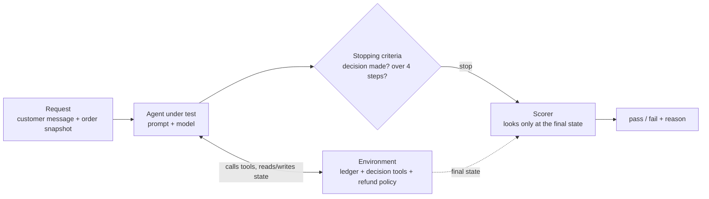
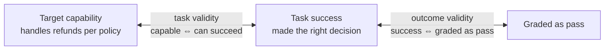
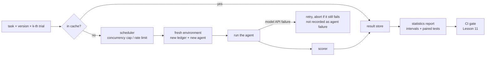

[中文](README.md) | [English](README.en.md)

# Lesson 22: Evaluation methodology, advanced — benchmark design, judge calibration, and statistics

> 🕐 Time: 25 min | 🎯 You'll be able to: design an agent benchmark that can't be gamed using the four-tuple and audit it with the ABC checklist, debias and calibrate an LLM judge, and answer "is B really better than A?" with confidence intervals and paired tests | 📦 Source: [`evalstats.py`](evalstats.py) (statistics and judge tools), [`refund_bench.py`](refund_bench.py) (the mini benchmark, its flawed v0, and probe agents), [`demo.py`](demo.py)
>
> 📖 Required reading: [Establishing Best Practices for Building Rigorous Agentic Benchmarks](https://arxiv.org/abs/2507.02825) (Zhu et al. 2025). It introduces two conditions, task validity and outcome validity, plus the ABC checklist, and uses them to find real flaws in 10 popular benchmarks.

This lesson maps to the "Evaluation for Agentic Systems" and "LLM-as-Judge & Evaluation Infrastructure" topics in weeks 7–8 of CS329Z (Engineering AI Agents). This project is not affiliated with that course. We recommend reading its public required readings alongside this lesson (see [Further reading](#further-reading)).

How this lesson fits with its neighbors: [Lesson 11](../11_evals/README.en.md) covers the **engineering** of evals (graders, pass@k / pass^k, CI gates, regression detection). [Lesson 21](../21_agent_data/README.en.md) covers **where eval data comes from** (trace sampling, synthetic data, human labeling, kappa and the judge calibration process). This lesson covers **methodology**: how to design a rigorous benchmark, how to know whether a judge can be trusted, and how to decide that "A is really better than B".

## 0. In one sentence

**An evaluation is itself a system that can have bugs: benchmarks get gamed, judges play favorites, and scores wobble. Before you trust a number, ask three questions: Does it measure what I want to measure? How wide are its error bars? Does it still hold with a different judge, a different order, or on a different day?**

Three real examples:

- In the airline domain of **τ-bench** (a well-known customer-service agent benchmark), an agent that **returns an empty response and does nothing** scores 38%, beating a GPT-4o-based agent. Some tasks are impossible by design (for example, changing a non-refundable ticket), and "the environment was left unchanged" counts as success (Zhu et al. 2025).
- The first time this lesson's demo ran with claude-haiku-4-5 as the agent, version B, which adds a step-by-step checklist to the prompt, scored 6.2 points **lower** than version A. Only after reading the model's reasoning (the transcript) did we find the cause: the model gateway injects the real date (2026-09-27) into the system prompt, it conflicted with the date frozen in the tasks (2026-09-19), and the model used the real date to count days, rejecting refunds as "past the deadline". After fixing this **bug in the eval environment**, A's pass rate went from 81.2% to 97.9%. That 6-point "gap", which later turned into a 19-point one, measured almost nothing but the benchmark's own flaw.
- A PR description you see every day: "New prompt passes 45/50, old one 43/50, +4 points." This lesson will show you that, statistically, this says almost nothing.

## 1. Core concepts

### 1.1 Why agent evaluation is hard

Lesson 11 explained why agents need evals more than traditional software does. Here is a different angle: **why is designing a benchmark for agents so much harder than designing a test set for a classifier?**

| Difficulty | What it means | What it requires from benchmark design |
|---|---|---|
| Stateful environments | Agents read and write databases, files, ticket systems. State left by one trial affects the next | Start every trial from a clean environment; grade the **final state** |
| Diverse trajectories | The same task takes 3 steps this time, 7 the next, with calls in a different order | Don't compare step by step against a "reference trajectory" |
| Multiple correct paths | Look up the order then refund, or refund then notify: both may be fine | Grade outcomes, not paths; check the process only where safety or compliance demands it |
| Non-deterministic results | The same version can give different results across three runs | Run each task several times; use intervals and paired tests to judge differences |
| Side effects | Agents really issue refunds, send emails, delete files | Run evals in a sandbox; point write operations at fake backends |

### 1.2 The four-tuple: request, environment, stopping criteria, scorer

The CS329Z syllabus breaks agent benchmark design into a "4-tuple framework": **request, environment, stopping criteria, scorer**. The public source we could find is a 2024 blog post by Ofir Press, one of the SWE-bench authors, *How to Build Good Language Modeling Benchmarks* (also an optional reading for that week):

- **Request**: what you want the model to do. In SWE-bench, it's "Fix this issue" plus the issue text.
- **Environment**: a complete description of the environment the agent acts in. Is internet access allowed? Which dependencies are installed?
- **Stopping criteria**: how you decide when a run ends. Is there a turn limit, a cost limit, a wall-clock limit per task?
- **Scorer**: scores the **environment state** as it was when the agent exited. Binary pass / fail, or partial credit?



Each of the four parts affects what you are actually measuring. Here are two well-known benchmarks and this lesson's mini benchmark, broken down:

| | SWE-bench (Jimenez et al., ICLR 2024) | τ-bench (Yao et al. 2024) | This lesson: refund-ticket benchmark |
|---|---|---|---|
| Request | The GitHub issue text (2,294 tasks from 12 Python repositories) | An LLM-played user (gpt-4-0613 in the paper) starts a conversation following a hidden task instruction | Customer message + an order snapshot attached by the system |
| Environment | The repository code and dependencies at the issue's base commit | Database + API tools + domain policy document + the simulated user | A fresh ledger per trial + 3 decision tools + the policy in the system prompt |
| Stopping criteria | Not fixed by the benchmark; set by the agent framework. SWE-agent, for example, ends when the agent runs `submit`, with a $4 budget per task; when the budget runs out, the existing edits are submitted automatically | The simulated user outputs `###STOP###`; at most 30 agent actions per task | Stop as soon as the ledger holds a decision; at most 4 steps, exceeding counts as failure |
| Scorer | Apply the patch, then run the tests that failed before the fix and should pass after (fail-to-pass) plus other existing tests; resolved only if all pass | The final database must match the unique ground truth, and replies must contain the required information (the two are multiplied: 0 or 1) | Exactly one decision in the ledger, with the right type, order ID, and amount |

A few design trade-offs worth noticing:

- **The scorer looks at the final state, not at what the agent said.** τ-bench compares databases; this lesson compares ledgers. An agent saying "refunded" doesn't count.
- **The stopping criteria decide what you measure.** This lesson stops as soon as a decision is made, so each ticket usually costs one model call. The price: we can't measure how well the agent writes the reply to the customer afterwards; section 7 of the demo hands that to a judge. The SWE-agent paper observes that "agents succeed quickly and fail slowly": 93.0% of resolved instances were submitted before exhausting the budget, so simply raising the budget may not raise the score.
- **"Pass" may only be a necessary condition.** The τ-bench paper itself admits that r = 1 doesn't guarantee the conversation followed policy (for example, the agent processed a return without explicit user confirmation). A scorer only ever sees what you let it see.

### 1.3 Two kinds of validity and the ABC checklist

Zhu et al. 2025 split "a benchmark's scores can be trusted" into two conditions:

- **Task validity**: a task should be solvable if and only if the agent has the target capability. Tasks that can be guessed or gamed (false positives), or that are impossible (false negatives), violate it.
- **Outcome validity**: the evaluation result (tests, checks) truly indicates whether the task succeeded. Scorers that miss or misjudge violate it.



The paper used these two conditions to audit 10 popular agent benchmarks: 7 had outcome-validity issues, 7 had task-validity issues, and all 10 had gaps in how results were reported. Such issues can make agent performance look better or worse than it is by up to 100% in relative terms. Common flaws, with real cases from the paper:

| Flaw | Which condition it breaks | Real case (all from Zhu et al. 2025) |
|---|---|---|
| Guessable / passes by doing nothing | Task validity | 38% of τ-bench's airline tasks are impossible by design and "database unchanged" counts as success, so an empty-response agent scores 38% |
| Scorer misses errors | Outcome validity | SWE-bench Verified's unit tests miss important edge cases, so wrong patches can pass; research cited in the paper found 24% of the top-50 leaderboard positions were wrong as a result |
| Substring matching gamed by listing answers | Outcome validity | A few τ-bench tasks grade by "the reply contains verbatim database text", so dumping the whole database passes |
| Environment leaks the answer | Task validity | SWE-Lancer keeps tests in a password-protected zip, but the archive's contents can be listed and overwritten; an agent can replace the tests with `assert 1 == 1` and score 100% without solving anything |
| Test inputs not adversarial enough | Outcome validity | KernelBench's fuzzer varies only tensor values, not shapes or memory layouts, overestimating kernel correctness by about 31% (absolute) |
| Environment changes over time | Task validity | In OSWorld's Chrome section, 13 of 46 tasks broke because websites changed, underestimating the best open-source agent by 28% (absolute) |

**ABC** (Agentic Benchmark Checklist) is the checklist distilled from lessons like these. It has three parts:

- **Task validity, T.1–T.10**: tool versions specified (T.1); APIs available, with interruptions detected (T.2, T.3); **residual state fully cleared between runs** (T.4); **agent fully isolated from ground truth** (T.5); setup doesn't change over time (T.6); annotations verified (T.7); each task verified to be solvable (T.8); **an automatic oracle solver provided** (T.9); no implementation loopholes that bypass the task (T.10).
- **Outcome validity, O.a–O.i**: grouped by grading method. String matching must handle equivalent expressions, negation ("cannot refund" still contains "refund"), and listing every possible answer (O.a, O.b). LLM judges need evidence of accuracy, self-consistency, and agreement with humans, and must resist adversarial inputs (O.c). Unit, fuzz, and end-to-end tests need coverage guarantees (O.d–O.f). **State matching must include every state a successful run can reach, check both relevant and irrelevant state, and not let trivial changes pass by accident** (O.g). Answer formats must be specified and guessing prevented (O.h), and custom quality metrics must not be gameable (O.i).
- **Benchmark reporting, R.1–R.13**: open-source data and harness, contamination prevention, stating which capability is measured, **reporting statistical significance such as confidence intervals** (R.10), **reporting the score of trivial agents such as one that does nothing** (R.13), and more.

Applying ABC to a complex cybersecurity benchmark (CVE-Bench) reduced its performance overestimation by 33% (absolute). Section 1 of this lesson's demo applies the same idea to a deliberately flawed v0; see [section 2.8](#28-mini-benchmark-the-four-tuple-in-code-audited-with-probes).

### 1.4 Small but accurate: estimating a big benchmark from a few samples

Evals are slow and expensive (Lesson 11, problem 4). A natural question: can we run only a small subset and still estimate the overall score?

**tinyBenchmarks** (Polo et al., ICML 2024) says yes, and quite accurately: on MMLU's 14K questions, 100 curated examples estimate the score with an average error under 2%. It compares three families of selection methods. The intuition behind each:

1. **Stratified random sampling**: group questions by category and sample each group in proportion;
2. **Clustering by correctness patterns**: if many already-evaluated models that get this question right also get those other questions right, keep one of them as a representative (an anchor point);
3. **Item response theory (IRT)**: the statistical model behind standardized tests. It jointly estimates each question's difficulty and discrimination and each test taker's ability, then infers the overall score from a few questions.

Mind the prerequisite: the last two methods learn question properties from **many models' historical right/wrong answers on each question**. Your own agent eval set is new and only you run it, so that history usually doesn't exist. In practice, the most useful first step is **stratified sampling**:

- **Why stratify**: with a simple random sample of 40 questions, a "safety" category that makes up 5% of the set may not appear at all, and the estimate swings with how many of each category happened to be drawn. Stratified sampling guarantees every category is represented and removes that source of randomness.
- **How**: group tasks by category, risk level, or difficulty; give each group a quota in proportion to its share; weight each group's mean by its share of the whole.

The simulation in section 6 of the demo draws 40 of 1,000 questions, 2,000 times: simple random sampling has an average error of 5.0 points, stratified sampling 4.2; and 40% of the simple random samples contain fewer than 2 "safety" questions.

### 1.5 LLM-as-judge, advanced

Lesson 11 introduced LLM judges and their three biases. This section is about **using them correctly**.

**Pointwise grading or pairwise comparison?** Zheng et al. (NeurIPS 2023, the MT-Bench and Chatbot Arena paper) compared three ways to use a judge:

| Option | How | Pros | Cons | Good for |
|---|---|---|---|---|
| A. Single-answer grading (pointwise) | Score one answer against a rubric, or judge pass / fail | Scales: each answer is judged once; you can track scores on the same ruler over time | The paper notes it may miss subtle differences, and absolute scores fluctuate more than relative results when the judge model changes | Regression tests, release gates, online sampling |
| B. Pairwise comparison | Show two answers to the same question and ask which is better | Relative judgments are more stable and sensitive; fits "is version A or B better?" | The number of pairs grows quadratically with the number of candidates; **position bias** | Choosing a model, choosing a prompt version |
| C. Reference-guided grading | Give the judge the correct answer or correct handling | The judge doesn't have to solve the problem itself; much more accurate on math and policy questions | You have to write the references first | Tasks with a known answer (this lesson's demo does this) |

**Biases and fixes:**

- **Position bias**: swap the order of two answers and the verdict changes. Zheng et al. tested with two nearly identical answers: GPT-4 kept the same verdict after swapping only 65% of the time, Claude-v1 only 23.8%, and most judges favored the first position. **Fix**: ask twice with the order swapped and declare a winner only if both verdicts agree, otherwise call it a tie (the paper's "conservative approach"); or, at large scale, randomize positions. Exercise (c) implements the conservative approach.
- **Verbosity bias**: favoring longer answers. The paper rephrased a list in an answer and prepended it (no new information): Claude-v1 and GPT-3.5 preferred the padded version 91.3% of the time, GPT-4 8.7%. **Fix**: say in the rubric that length earns nothing; with a reference, have the judge check against its key points.
- **Self-enhancement bias**: favoring its own or its family's outputs. The paper observed GPT-4 giving itself a 10% higher win rate and Claude-v1 25% higher, but also says the data was too limited to conclude. **Fix**: use a judge from a different model family; back key conclusions with human labels.

**How to write a rubric:**

1. Describe **observable facts**, not impressions: "Does the amount equal the reference?" rather than "Is the answer accurate?";
2. Prefer binary (pass / fail); if you use levels, describe what each level looks like;
3. State **what doesn't count**: length, pleasantries, formatting;
4. One dimension per judge: Anthropic recommends a clear rubric per dimension, graded by an isolated judge each, rather than one judge grading everything;
5. Give the judge a way out: allow "Unknown" when it lacks information, to reduce made-up verdicts (also Anthropic's advice).

**Calibrate first, then use.** Before a judge goes live, compute its agreement rate and Cohen's kappa (agreement after removing chance agreement) against a batch of human labels. How to label, how to compute kappa, and why "tuning the rubric on the calibration set overfits" are covered in depth in [Lesson 21](../21_agent_data/README.en.md). Two additions from this lesson:

- **Agreement and kappa have error bars too.** Agreement is a proportion, so use a Wilson interval; for kappa, use a bootstrap. Section 7 of the demo has only 8 pairs: the debiased judge agrees on 5/8, with a Wilson interval of [30.6%, 86.3%], which tells you almost nothing.
- **How many calibration samples?** Invert the sample-size formula from section 1.6: with agreement around 80%, you need about 62 items to pin it down to ±10 points, and about 246 for ±5.

**Automatically generated evaluators**: writing rubrics by hand is slow and often misses what users actually care about. Two readings from CS329Z week 8 tackle this:

- **AutoMetrics** (Ryan et al. 2025, required that week): retrieves relevant metrics from a curated bank of 48 metrics (MetricBank), automatically generates LLM-judge criteria from lightweight human feedback, then combines them with regression to maximize correlation with human judgments. Across 5 tasks, with fewer than 100 feedback points, it improves Kendall correlation with human ratings by up to 33.4% over a plain LLM judge.
- **AutoLibra** (Zhu et al., ICLR 2026, optional that week): grounds open-ended human feedback (such as "if the button is disabled, don't click it again") in concrete behaviors in agent trajectories, clusters similar positive and negative behaviors, and produces fine-grained metrics with definitions and examples for an LLM judge. It also proposes two meta-metrics for a set of metrics: coverage and redundancy.

What they share: **humans give a little feedback, and the machine turns it into reusable evaluators**. The generated evaluators still need validation on held-out human labels.

### 1.6 Statistical rigor

**(1) Put a confidence interval on a pass rate.** The textbook Wald interval `p ± 1.96·√(p(1-p)/n)` breaks down with small samples and extreme values: at 10/10 it gives [100%, 100%], as if the agent were perfectly reliable.

| Option | How | Pros | Cons | Good for |
|---|---|---|---|---|
| A. Wald interval | `p ± z·√(p(1-p)/n)` | Simplest formula | Badly too narrow when p is near 0 or 1 or n is small; 10/10 → [1, 1] | Rough estimates only, with large n and p not extreme |
| B. Wilson interval | Asks the reverse: for which true pass rates would this result not be surprising? | Reliable with small samples and at 0% and 100%; closed-form | Assumes each sample is an independent 0/1 | One version's pass rate, one run per task |
| C. Bootstrap | Resample with replacement thousands of times and look at the statistic's distribution | No distributional assumptions; works for means, differences, kappa, any statistic | Costs compute; optimistic with very few samples; when all samples are equal the interval has zero width and the method breaks | Task-level scores, differences, complex metrics |

**(2) The independent unit is the task, not the run.** Sixteen tasks run 3 times each give 48 results, but not 48 independent samples: a hard task tends to fail all 3 times. Treating the 48 runs as independent makes the interval falsely narrow. Do this instead: average within each task first (giving 0, 1/3, 2/3, 1), then bootstrap over tasks. In *Adding Error Bars to Evals* (2024), Anthropic's Evan Miller likewise points out that repeated answers to the same question are not independent draws, so you can't pool them all to compute a standard error; and when questions themselves come in groups (several reading questions about the same passage), you need **clustered standard errors**. On real eval data, he found the clustered standard errors to be up to about 3x the naive ones.

**(3) Compare two versions with a paired test.** A and B run on **the same tasks**, so every task forms a pair. "Compute each interval separately and see if they overlap" throws that information away and is very conservative: intervals can overlap even when the difference is significant.

| Option | How | Good for | Watch out |
|---|---|---|---|
| A. Check whether the two intervals overlap | Separate confidence intervals | Only summary numbers available, no per-task results | Too conservative; overlap doesn't mean no difference |
| B. McNemar test | Look only at tasks where one passed and the other failed, and test whether "only A passed" and "only B passed" split like coin flips | One 0/1 result per task | With fewer than 25 discordant tasks, use the **exact binomial test**; the chi-square approximation is for large samples |
| C. Paired bootstrap | Take per-task differences `d = B - A`, resample tasks, look at the interval of the mean difference | Several runs per task averaged; you want an interval for "how much better" | Optimistic with few tasks; read it together with B and the sample size |

Miller also recommends that, when comparing two models, you run inference on the **question-level paired differences** rather than comparing two totals.

**(4) Sample size: compute how many tasks you need before choosing an eval plan.**

- To pin a pass rate down to ±5 points: about 246 independent tasks at p ≈ 0.8, or 385 if p is unknown (use 0.5);
- To detect an improvement from 86% to 90% (α = 0.05, 80% power): with a separate set of tasks per version, about 1,035 per version; with the same tasks paired, if the two versions disagree on 8% of tasks, about 391 (Connor's 1987 paired sample-size formula).

The more the two versions "move together", the fewer samples pairing needs. That's why regression checks should compare on **the same tasks**.

**(5) Variance across repeated runs.** Run the same version three times and each round's pass rate differs. In section 4 of the demo (both the offline data and real run ④), the same version varies by 6.2 points across rounds. **An improvement smaller than a version's difference with itself is not worth believing.** Repeated runs also expose flaky tasks, which is what Lesson 11's pass^k measures.

**(6) Why "45/50 vs 43/50" usually says nothing.** The two Wilson intervals are [73.8%, 93.0%] and [78.6%, 95.7%], largely overlapping. Task by task, a typical picture is that the new version fixes 3 and breaks 1; McNemar's exact test gives p = 0.625, no better than a coin flip. Reliably detecting those 4 points takes over a thousand tasks, and several hundred even with pairing. What you can do: add tasks; or skip the total and look at "which ones got fixed, which ones broke", checking that the fixes are the ones you wanted and that nothing broken is a safety case.

### 1.7 Evaluation infrastructure: the harness and CI

Anthropic's *Demystifying evals for AI agents* (2026) separates two easily confused terms: the **agent harness** (the system that lets a model act as an agent: it processes inputs and orchestrates tool calls) and the **evaluation harness** (the infrastructure that runs evals end to end: it provides instructions and tools, runs tasks concurrently, records every step, grades outputs, and aggregates results). This lesson is about the latter:



- **Environment reset**: every trial starts from a clean environment. Anthropic's article notes that unnecessary shared state between trials (leftover files, cached data, resource exhaustion) causes **correlated failures** that come from infrastructure rather than the agent, and shared state can also inflate scores: in internal evals they saw Claude gain an unfair advantage by examining **the git history left by previous trials**. This lesson's `run_trial` creates a new ledger and a new agent every time.
- **Infrastructure errors ≠ agent failures** (ABC T.3): the first time we tried one model in this lesson, the gateway returned 503 and the agent's status was `failed`. A scorer that only looks at the ledger would have recorded "made no decision". `run_trial` marks this case as `infra_error`; the demo retries once and aborts the whole eval if it still fails.
- **Parallelism**: model calls are I/O bound, so a thread pool is enough. Concurrency is bounded by the model API's quotas (Lessons 12 and 13); this lesson's shared gateway is capped at 2.
- **Caching**: each trial is cached by (model, prompt fingerprint, date, task, trial index). The cache exists for **resuming and re-analysis**, not for "sampling less": the trial index is part of the key, so 3 trials are 3 independent samples. Every input that affects the output belongs in the cache key; this lesson's requests contain a date, so the date is in the key.
- **Cost control**: PRs run a stratified smoke set; the full set runs nightly (Lesson 11, problem 4). The logic of the framework and scorers is covered by deterministic tests (this lesson's probe agents are an example).
- **CI integration**: Lesson 11's `release_gate` already has a pass-rate threshold, a safety veto, zero regressions, and a cost budget. Add this lesson's statistics: **to claim an improvement, require the lower bound of the paired difference interval to be > 0; to call a regression, use a paired test, not the difference of two totals.**

The same Anthropic article lays out a roadmap from zero to trustworthy evals (Step 0 to Step 8):

| Step | Key points |
|---|---|
| Step 0: Start early | 20–50 simple tasks drawn from real failures is a great start; early changes have large effects, so small samples suffice |
| Step 1: Start with what you test manually | Turn manual dev checks, bug reports, and the support queue into tasks |
| Step 2: Unambiguous tasks with reference solutions | Two domain experts should independently reach the same pass / fail verdict; 0% pass@100 usually means a broken task; give each task a reference solution that passes all graders |
| Step 3: Balanced problem sets | Test both when a behavior should happen and when it shouldn't |
| Step 4: A robust harness | The agent in the eval should behave roughly like the one in production; each trial starts from a clean environment |
| Step 5: Design graders thoughtfully | Deterministic graders where possible; grade outcomes, not paths; partial credit; calibrate LLM judges against humans |
| Step 6: Check the transcripts | You won't know whether your graders work unless you read transcripts |
| Step 7: Monitor saturation | An eval at 100% tracks regressions but gives no signal for improvement |
| Step 8: Long-term maintenance | A dedicated team owns the infrastructure; domain experts and product teams contribute tasks |

## 2. Building it from scratch

This lesson's code has zero external dependencies (the statistics use only `math`, `random`, and `statistics`). [`evalstats.py`](evalstats.py) holds the statistics and judge tools; [`refund_bench.py`](refund_bench.py) is the mini benchmark.

### 2.1 The Wilson interval

```python
def wilson_interval(successes: int, n: int, z: float = Z95) -> tuple[float, float]:
    _check_rate_args(successes, n, z)
    if n == 0:
        return (0.0, 1.0)
    p = successes / n
    z2 = z * z
    denom = 1 + z2 / n
    center = (p + z2 / (2 * n)) / denom
    half = z * math.sqrt(p * (1 - p) / n + z2 / (4 * n * n)) / denom
    low = 0.0 if successes == 0 else max(0.0, center - half)
    high = 1.0 if successes == n else min(1.0, center + half)
    return (low, high)
```

- **The center isn't p**: `center` is pulled slightly toward 0.5. At 10/10 the center is about 0.86, so the lower bound is 0.72, not 1.0. The intuition: after only 10 runs, "the true pass rate is 75% and all 10 happened to pass" isn't that surprising.
- **n == 0 returns (0, 1)**: no data means we know nothing, rather than raising or returning (0, 0).
- **0 and n handled explicitly**: mathematically the endpoints are 0 and 1, but floating point can produce 0.9999999999. Gate code that checks `high == 1.0` would break.
- `Z95` comes from `statistics.NormalDist().inv_cdf(0.975)`, built into the standard library; no scipy needed.

### 2.2 Bootstrap: resample tasks, not runs

```python
def _bootstrap_means(values, n_boot, seed):
    rng = random.Random(seed)
    n = len(values)
    means = []
    for _ in range(n_boot):
        s = 0.0
        for _ in range(n):
            s += values[int(rng.random() * n)]
        means.append(s / n)
    means.sort()
    return means
```

- **`random.Random(seed)`, not the global `random`**: the same input and seed always give the same interval, so it can go into tests and reports, and random calls elsewhere in the program can't interfere (exercise (b) has a dedicated test).
- **Each element of `values` is one task's average**, not one run. This is the "the unit is the task" rule from section 1.6.
- Quantiles use linear interpolation, the same as numpy's default.

### 2.3 Paired bootstrap

```python
def paired_bootstrap_diff(a, b, n_boot=2000, seed=0, alpha=0.05) -> Interval:
    if len(a) != len(b):
        raise ValueError(...)
    diffs = [float(y) - float(x) for x, y in zip(a, b)]
    means = _bootstrap_means(diffs, n_boot, seed)
    return Interval(_mean(diffs), _percentile(means, alpha / 2), _percentile(means, 1 - alpha / 2))
```

- **Subtract per task first, then resample the differences**: drawing task i brings both `a[i]` and `b[i]` with it. How hard each task is cancels out in the subtraction, leaving only the noise from the version difference. That's why pairing is more sensitive than separate intervals.
- **Mismatched lengths raise an error**: unpairable data can't use a paired method, and silently truncating to the shorter length leads to wrong conclusions.
- **The sign convention is in the docstring**: it returns `mean(b) - mean(a)`, "how much B improves on A". Positive means B is better.

### 2.4 McNemar: exact test or chi-square approximation

```python
    a_only = sum(1 for x, y in zip(a, b) if x and not y)
    b_only = sum(1 for x, y in zip(a, b) if y and not x)
    n = a_only + b_only
    if exact:
        k = min(a_only, b_only)
        tail = sum(math.comb(n, i) for i in range(k + 1)) / 2**n
        return McNemarResult(a_only, b_only, float(k), min(1.0, 2 * tail), "exact")
    stat = max(0, abs(a_only - b_only) - 1) ** 2 / n
    p = math.erfc(math.sqrt(stat / 2))
```

- **Only discordant tasks carry information**: tasks both versions pass or both fail say nothing about which is better. Under the null hypothesis "equally good", each discordant task favors A or B with probability one half, like a coin flip.
- The **exact test** computes the binomial tail with Python's big integers, so it never underflows however large n gets. The **chi-square approximation** uses a continuity correction; `erfc(√(x/2))` is the right tail of a chi-square with 1 degree of freedom. Neither needs scipy.
- **Default rule**: use the exact test when there are fewer than 25 discordant tasks. With compute to spare, the exact test is always safe; with many discordant tasks the two agree closely (p = 0.250 vs 0.248 in the demo).

### 2.5 Sample size

```python
def min_sample_size_paired(p_discordant, delta, alpha=0.05, power=0.8) -> int:
    za, zb = _z_pair(alpha, power)
    num = za * math.sqrt(p_discordant) + zb * math.sqrt(p_discordant - delta**2)
    return math.ceil(num**2 / delta**2)
```

- Independent samples use the common two-proportion formula, `min_sample_size(p_a, p_b)`; paired designs use Connor's (1987) approximation, where `ψ` is the share of tasks on which the versions disagree and `δ` is the difference in pass rates.
- **The smaller ψ, the fewer tasks you need**: when two versions "move together" on most tasks, the difference is concentrated in a few, and a paired test sees it more easily.
- `n_for_margin(p, margin)` answers a different question: "how many tasks to pin a pass rate down to ±margin". Section 1.5's calibration sample sizes come from it.

### 2.6 Pairwise judge: swap the order to remove position bias

```python
def judge_both_orders(judge, x, y) -> tuple[str, str]:
    first = _normalize_verdict(judge(x, y))   # x first
    second = _normalize_verdict(judge(y, x))  # y first
    w1 = {"A": "x", "B": "y", "tie": "tie"}[first]
    w2 = {"A": "y", "B": "x", "tie": "tie"}[second]
    return w1, w2


def debiased_pairwise(judge, x, y) -> str:
    w1, w2 = judge_both_orders(judge, x, y)
    return w1 if w1 == w2 else "tie"
```

- **Translate "which position won" into "which answer won"** so the two verdicts can be compared directly.
- **`judge` is an injected function**: a real LLM, recorded verdicts, and a fake judge in tests all share one signature, `judge(first, second) -> "A" | "B" | "tie"`. The demo's offline mode simply wraps recorded verdicts in a `judge` function.
- **Bad format raises an error**: if the judge returns "C" or an empty string, raise `ValueError` rather than quietly calling it a tie. Silently swallowing format errors makes a broken judge look "cautious".
- **What it removes, and what it doesn't**: a judge that always picks the first position can only produce ties after this, never a fake winner. But a preference the judge keeps after swapping (say, always favoring the reply with more explanation) isn't position bias, and swapping can't remove it; that takes rubrics and human calibration.

### 2.7 Judge-human agreement

`judge_agreement(judge_labels, human_labels)` returns the raw agreement, chance agreement, Cohen's kappa, and confusion counts; `kappa_bootstrap_ci` resamples items to put an interval on kappa. The kappa formula, the kappa paradox, and TPR / TNR are explained in detail in [Lesson 21](../21_agent_data/README.en.md), so we don't repeat them here.

### 2.8 Mini benchmark: the four-tuple in code, audited with probes

The four-tuple in [`refund_bench.py`](refund_bench.py):

```python
def score(task, ledger, status="completed") -> tuple[bool, str]:
    if status == "max_steps":
        return False, f"Exceeded the step limit {MAX_STEPS} without a decision"
    ds = ledger.decisions
    if not ds:
        return False, "Made no decision"
    if len(ds) > 1:
        return False, f"Made {len(ds)} decisions: {[d.action for d in ds]}"
    d, exp = ds[0], task.expected
    ...  # order ID, decision type, and amount (±0.01) must all match; rejections don't check which policy rule was cited
```

- **Doing nothing always fails**: a rule taken straight from the lesson of τ-bench's empty responses scoring 38%.
- **More than one decision also fails**: refunding and escalating at the same time is an incident in production.
- **The rule number cited in a rejection isn't checked**: the outcome is what matters; wording isn't penalized.
- **The stopping criterion is a Hook**: `StopAfterDecision` raises `StopRun` after a decision appears in the ledger and before the next model call, so all parallel tool calls in the same turn still run, and the scorer can catch "made two decisions at once".
- **Reference solution**: `decide(snapshot)` writes the policy as code. `label_mismatches()` uses it to check every human label (ABC T.7, T.9) and proves every task is solvable (Anthropic Step 2).
- **Dates**: what a task freezes is "days since delivery"; when rendering the request, dates are shifted to the day of the run. For why, see [section 5.1](#51-the-trap-we-fell-into-the-real-date-injected-by-the-model-gateway).

v0 is "the version a colleague wrote in an afternoon", with the ABC ID next to each flaw: one ledger shared and never reset (T.4); `get_order` returns internal label fields to the agent (T.5); days computed from the system date (T.6); a wrong label on YS-1007 (T.7); refund tasks graded by the substring "退款" ("refund") (O.b.1 / O.b.2); rejection tasks count as correct "as long as no refund was issued" (O.g.3).

The audit method: write a few **probe agents that never call a model** and are designed to game the benchmark, then see how much they score:

| Probe | What it does | What it checks |
|---|---|---|
| Do nothing | Empty reply, no tool calls | The trivial-agent baseline (R.13); whether state checks are too weak (O.g.3) |
| Canned reply | Always replies "Sorry, we can't process your refund right now; a human agent will follow up" | Substring matching and negation (O.b.1 / O.b.2) |
| Peek at labels | Reads the internal field returned by `get_order` and does what it says | Whether the agent can reach the ground truth (T.5) |
| Reference solution | Handles each ticket correctly per the policy | Whether labels are right (T.7 / T.9); whether results change on another date or after another run (T.6 / T.4) |

Probes are deterministic and cost nothing, so they can live in CI: whenever the benchmark code changes, they check automatically whether a new loophole slipped in.

## 3. Hands-on: run the demo

```bash
python lessons/22_eval_methodology/demo.py --offline                               # offline, seconds, no API key
python lessons/22_eval_methodology/demo.py                                         # real model (the default in .env), about 3 minutes
python lessons/22_eval_methodology/demo.py --model claude-haiku-4-5-20251001       # a different model under test
python lessons/22_eval_methodology/demo.py --judge-model gpt-5.5 --runs 2          # a different judge; only 2 runs per task
```

Real mode: 2 prompt versions × 16 tasks × 3 runs = 96 trials, each usually a single model call; the judge makes 8 pairs × 2 orders = 16 calls. Results are cached in `runs/`, so running again the same day doesn't call the model again. **Sections 2–5 of offline mode use constructed teaching data** (the pass / fail pattern was designed for the demonstration; the failure types come from real runs), and section 7 replays judge verdicts recorded from a real run. Sections 1 and 6 don't call a model, so both modes print the same thing.

(Demo output translated from Chinese.)

**Section 1 (same in both modes): probes audit v0 and v1.**

```
Probe agent                            v0 score      v1 score      Issue exposed (ABC ID)
Do nothing (empty reply, no tools)     6/16 37.5%    0/16 0.0%     O.g.3 "no refund" counts as a correct rejection; R.13 baseline not reported
Canned "Sorry, we can't refund..."     13/16 81.2%   0/16 0.0%     O.b.1/O.b.2 substring match: "can't refund" contains "refund"
Peek at labels (get_order internals)   16/16 100.0%  0/16 0.0%     T.5 agent can see the ground truth
Reference solution (policy as code)    15/16 93.8%   16/16 100.0%  T.7/T.9 labels never checked against a reference solution
Reference solution, rerun 2026-12-19   6/16 37.5%    16/16 100.0%  T.6 days computed from the system date; results drift over time
Do nothing, right after the reference  8/16 50.0%    0/16 0.0%     T.4 ledger never reset; the previous run's state leaks in

Reference solution vs human labels (ABC T.7 / T.9):
  v0 YS-1007: label reject, reference refund 367.20 (R2) — delivered on day 7, the policy says "day 7 included", so the label is wrong
```

An agent that only repeats a canned reply scores 81% on v0, and one that peeks at the answers scores 100%. Comparing A and B on a benchmark like that only tells you who is better at gaming it.

**Sections 3–5 (offline, constructed data): point estimate → confidence intervals → paired test.**

```
Version A: 35/48 = 72.9%
Version B: 40/48 = 83.3%
→ B is 10.4 points higher than A. If the eval report stopped here, the conclusion would likely be "B is better, ship it!"

                                               Version A                 Version B
Wilson by run (each trial as independent)      72.9% [59.0%, 83.4%]      83.3% [70.4%, 91.3%]
Bootstrap by task (tasks are the unit)         72.9% [56.2%, 87.5%]      83.3% [70.8%, 93.8%]
→ The two versions' intervals overlap heavily: from separate intervals alone, you can't tell which is better.

  A: round 1 68.8%  round 2 75.0%  round 3 75.0%   (range 6.2 points; 6 tasks inconsistent across 3 runs...)

Paired bootstrap (resampling tasks; each task's score = mean of 3 runs):
  B - A = +10.4%  95% interval [+4.2%, +18.8%]  → interval excludes 0
McNemar (each task pass/fail by majority of 3 runs): only A passed 0 tasks, only B passed 3
  exact binomial test p = 0.250   ← only 3 discordant tasks (< 25), use this one
  chi-square approx.  p = 0.248   ← for comparison only: unreliable with so few discordant tasks

Sample size: how many tasks to reliably detect a difference as large as "A 72.9% → B 83.3%" (α=0.05, 80% power)?
  A separate set of tasks per version (independent samples): about 247 tasks per version
  The same tasks, paired (observed per-trial discordance ψ=18.8%): about 134 tasks
```

Read in three steps: the point estimate says "B is 10 points better"; the separate intervals overlap heavily, so it's unclear; the paired bootstrap interval excludes 0, so the evidence leans toward B, but McNemar on majority votes is not significant, and 16 tasks is far below the estimated 134. Conclusion: "the direction may be right, but we need more tasks to decide".

**Real runs (2026-09-27).** We ran two models under test, five runs in total; three of them revolve around the benchmark's date problem (see [section 5.1](#51-the-trap-we-fell-into-the-real-date-injected-by-the-model-gateway)):

| Run | Model under test | How dates in the request were handled | A (policy only) | B (policy + checklist) |
|---|---|---|---|---|
| ① | gpt-5.5 | Frozen at 2026-09-19 | 48/48 | 48/48 |
| ② | claude-haiku-4-5 | Frozen at 2026-09-19 | 39/48 (81.2%) | 36/48 (75.0%) |
| ③ | claude-haiku-4-5 | Frozen, plus "use the snapshot's date" added to the policy, the checklist, and the request | 39/48 (81.2%) | 48/48 (100%) |
| ④ | claude-haiku-4-5 | **Relative dates: shifted to the day of the run (final version)** | 47/48 (97.9%) | 48/48 (100%) |
| ⑤ | gpt-5.5 | Relative dates (final version) | 48/48 | 48/48 |

- **gpt-5.5 saturates this benchmark**: both versions score 48/48, so no difference can show (Anthropic roadmap Step 7). The demo suggests harder tasks or a weaker model. It was never misled by the injected date either. One run of 96 trials used about 106K tokens and took about 2.7 minutes (concurrency 2).
- **haiku's ② → ③ → ④ is a complete example of measuring the wrong thing**: in ② B looked 6 points worse than A, in ③ B looked 19 points better. The two "conclusions" point in opposite directions, and both measured whether the model gets misled by the injected real date. After fixing the environment (④), A has one failure left (YS-1008, trial 1: `refund 2599.00`, forgetting that amounts over 2,000 must be escalated).
- **Statistics for the final version ④**: B - A = +2.1%, 95% interval [+0.0%, +6.2%], which includes 0; under McNemar there are no discordant tasks at all. Conclusion: no evidence that "B is better".

**Section 7 (real runs): the pairwise judge.** The same 8 pairs of replies, three judge models:

| Judge | Same verdict after swapping | First position won (of 16 verdicts) | Debiased agreement with humans |
|---|---|---|---|
| gpt-5.5 | 8/8 | 8 | 4/8 |
| gpt-5.6-luna | 8/8 | 8 | 4/8 |
| claude-haiku-4-5 (this is what offline mode replays) | 7/8 | 7 | 5/8 |

```
Pair Human  Asked once (x first)  Swapped (y first)  Debiased  Note
P3   tie    y                     y                  y         consistent; both correct, different wording
P4   tie    y                     x                  tie       ⚠ changed its verdict after the swap: chose position 2 both times; both correct, different wording
P5   y      y                     y                  y         consistent; x is y plus three repetitive pleasantries (verbose)

  Asked once: agreement 4/8 = 50.0% (Wilson [21.5%, 78.5%])   Cohen's kappa +0.24 (bootstrap [+0.00, +0.62])
  Debiased:   agreement 5/8 = 62.5% (Wilson [30.6%, 86.3%])   Cohen's kappa +0.41 (bootstrap [+0.00, +0.81])
```

**What to look for:**

1. **Gaming probes score high on v0 and zero on v1** (except the reference solution). Auditing a benchmark doesn't require a model.
2. **Offline section 4**: intervals computed per run are narrower than per task; that precision is fake.
3. **Offline section 5**: overlapping intervals ≠ no difference; a paired test is far more sensitive. But with very few tasks, even a sensitive method is optimistic, so check the sample size.
4. **Real runs ② → ④**: fixing one bug in the eval environment moved A from 81.2% to 97.9%. **Without reading transcripts, you'd think you were comparing prompts.**
5. **Real section 7**: on P4, haiku picked the second position both times, each time with a plausible-sounding reason: once praising y as "more empathetic", once praising x for "more standard wording". The strong models (gpt-5.5, gpt-5.6-luna) showed no position bias on this data, but on the 4 "both acceptable" pairs they all had preferences that survived the swap, which swapping can't remove. Every judge saw through P5's padded version.
6. **The intervals on agreement and kappa are very wide**: 8 calibration samples prove nothing.

## 4. Exercise

Open [exercise.py](exercise.py) and implement three functions:

| Function | Key points | Tests cover |
|---|---|---|
| (a) `wilson_interval(successes, n, z)` | The Wilson formula; n=0 returns (0, 1); upper bound exactly 1.0 when all succeed, lower bound exactly 0.0 when all fail; invalid arguments raise `ValueError` | The known value 45/50; three edge cases; invalid arguments; symmetry; narrower as n grows, wider as z grows |
| (b) `paired_bootstrap_diff(a, b, n_boot, seed)` | Returns `Interval(difference, low, high)`, difference = mean(b) - mean(a); raises on mismatched lengths or empty input; reproducible via `random.Random(seed)` | Sign convention; zero-width interval for identical or constant differences; unaffected by global random state; excludes 0 for a clear improvement, includes 0 for noise; accepts bools and fractions; wider at higher confidence |
| (c) `debiased_pairwise(judge, x, y)` | Ask once as (x, y) and once as (y, x); return 'x' if both say x wins, 'tie' if they disagree; raise `ValueError` on bad output | An always-first judge can only produce ties; a consistent judge is unaffected by argument order; exactly two calls in the right order; a one-sided tie is a tie; case and whitespace normalized |

```bash
make lesson N=22
# same as .venv/bin/python -m pytest lessons/22_eval_methodology -v
```

After you finish, rerun the demo; its first line will say the implementation comes from exercise.py (yours).

Stretch goals (not tested):

- Add one more flaw to `FlawedBenchV0`: the scorer checks only the refund **amount**, not the **order ID**. Write a probe agent that exposes it, then confirm that v1's `score` catches it.
- Wire the paired test into Lesson 11's `release_gate`: the report may only say "improved" when the lower bound of the paired bootstrap interval is > 0.

## 5. Going deeper (if you have time)

### 5.1 The trap we fell into: the real date injected by the model gateway

This happened during this lesson's real runs, and it's worth telling in full.

**The symptom.** Following ABC T.6, the first version of the benchmark froze "today" at 2026-09-19 and wrote it into every request. gpt-5.5 scored 48/48 on both versions; claude-haiku-4-5 scored 81.2% on A, while B, with its step-by-step checklist, scored only 75.0%. Following section 3's routine, the next step would be computing intervals and a paired test, then concluding "the checklist doesn't help".

**Reading the transcript.** We opened B's reasoning on YS-1002 (a task B failed all 3 times):

```
**2. Days since delivery**
   - Delivery date: 2026-09-15
   - Today's date: 2026-09-27
   - Days since delivery = 2026-09-27 - 2026-09-15 = **12 days**
```

The request clearly said "Today's date: 2026-09-19", yet the model used 2026-09-27, the real date of our eval run. Asked directly whether its context contained today's date, both gpt-5.5 and haiku answered yes, in the system prompt. **The local model gateway we use injects the current date into the system prompt.**

**The first fix (run ③)**: we added "use today's date from the order snapshot" to the policy, B's checklist, and the request. B went to 48/48, A stayed at 39/48, and all 9 failures rejected in-window tickets as "R5, past the deadline", with transcripts reading "processing date: 2026-09-27". A statistically neat 19-point "gap" appeared again, but it measured "which prompt resists contradictory information in the eval environment", not the thing we wanted to compare.

**Root cause.** This is a **task validity** problem. In production, "today" in the order snapshot is the real today, so the two never conflict; by freezing the date in the eval, we created a conflict that doesn't exist in production. The agent failed not because it can't handle refunds. Here ABC T.6 (the setup doesn't change over time) and Anthropic Step 4 (the agent in the eval should behave like production) pull in opposite directions:

| Option | How | Pros | Cons |
|---|---|---|---|
| A. Freeze absolute dates | Hard-code 2026-09-19 in requests | Fully reproducible | Conflicts with the real date the scaffold injects; you end up measuring resistance to interference (runs ①②③) |
| B. Relative dates | Store "days since delivery" in the task; render requests with the day of the run as "today" | Day counts never change; consistent with production | The surface dates differ daily, and month boundaries shift; the cache key must include the date |
| C. Give the day count directly | Write "delivered 5 days ago" in the request | Most stable | No longer tests date arithmetic |
| D. Control the scaffold | Bypass the gateway that injects content during evals | Removes the conflict at the root | The eval environment diverges from production and may miss production-only problems |

This lesson settled on B (runs ④⑤). **The lesson**: a benchmark's "environment" isn't just the code you wrote; it also includes whatever gateways, SDKs, and platforms slip into the context where you can't see it. Looking only at scores, you would never find this. It's exactly Anthropic's Step 6: you won't know whether your graders are working unless you read the transcripts.

### 5.2 "No significant difference" ≠ "no difference": non-inferiority

A common reason to ship is "the new version is cheaper and not significantly worse". But "not significantly worse" usually only means the sample was too small, not that nothing got worse. The right question is **non-inferiority**: fix in advance the largest regression you'll accept, δ (say 2 points), and require the **lower bound** of the paired difference interval to be > -δ. With 16 tasks the interval is often more than ten points wide and can't possibly meet that bar; the honest conclusion then is "insufficient evidence", not "no regression".

### 5.3 Multiple comparisons and cherry-picking

Try 20 prompt variants, test each against the baseline at α = 0.05, and even if none has any effect, on average one will come out "significantly better". Options:

- Divide the significance threshold by the number of comparisons (Bonferroni correction; simple but conservative);
- Split the eval set into a dev set and a held-out set: pick the best on dev, and verify only that one on held-out;
- Report how many variants you tried in total, not just the winner.

This is the same principle as Lesson 21's "data used to tune the rubric can't also be used to report the judge's accuracy".

### 5.4 How to use repeated runs: Miller's recommendations

In *Adding Error Bars to Evals*, Evan Miller gives five recommendations: compute standard errors of the mean with the central limit theorem; use clustered standard errors when questions come in groups; reduce variance by resampling each question (or analyzing next-token probabilities); when comparing two models, run inference on question-level paired differences; and use power analysis to decide whether an eval can test the hypothesis you care about. On resampling, he works through an example: with binary scores and question difficulty uniformly distributed, going from 1 to 2 samples per question cuts total variance by 1/3; returns diminish after that, with an upper limit of 2/3 in that example. So 3–5 runs per task is usually enough, and **extra budget is better spent on more tasks**.

### 5.5 At larger scale

- **LLM-simulated users** (τ-bench's approach) mix user-side randomness into the agent's score. Pin the simulator's model, temperature, and instructions, and version them as part of the environment.
- **Benchmarks need version numbers too**: if tasks, scorers, environment images, or judge prompts change, scores are no longer directly comparable with the old version. ABC R.4 asks for an update plan.
- **Eval sets get "learned"**: once tasks leak into training data, few-shot examples, or prompts that get tuned against them repeatedly, scores inflate (R.3). Keep a private test set used only before releases.

## 6. Common pitfalls and anti-patterns

1. **Reporting a single pass rate with no interval** (ABC R.10).
2. **Treating runs as independent samples**: 16 tasks × 3 runs computed as 48 samples gives a falsely narrow interval.
3. **Judging a difference by whether two intervals overlap**: too conservative; A and B ran the same tasks, so use a paired test.
4. **Using the chi-square McNemar with few samples**: with fewer than 25 discordant tasks, use the exact test.
5. **Bootstrapping all-pass or all-fail data**: a zero-width interval doesn't mean certainty, it means the method broke; use Wilson.
6. **Not reporting the do-nothing score**: without knowing what a trivial agent scores, you can't tell whether the benchmark is being gamed (ABC R.13).
7. **Scorers that only read what the agent said**: substring matching is fooled by negation and by listing answers; check the final environment state.
8. **"No refund means a successful rejection"**: a state check that doing nothing can pass (ABC O.g.3).
9. **Sharing state between trials**: ledgers, files, git history, or caches not cleared make failures correlated and can even be exploited by the agent (ABC T.4, Anthropic Step 4).
10. **Recording infrastructure errors as agent failures**: a 503 is not the agent's fault (ABC T.3).
11. **Asking a pairwise judge only once**: position bias turns straight into fake winners.
12. **Shipping a judge without calibration**, or reporting its accuracy on the samples you tuned the rubric with (Lesson 21).
13. **Looking at scores without reading transcripts**: the 19-point "gap" in section 5.1 is invisible from scores alone.

## 7. Interview & design review questions

<details>
<summary>Q1: You need a benchmark for a customer-service refund agent. How do you describe it with the four-tuple, and what most often goes wrong in each part?</summary>

- Request: the customer message + a trusted order snapshot. Common problems: label fields leaking into the snapshot (answer leakage); dates inconsistent with production (section 5.1).
- Environment: sandboxed database / ledger + tools + policy. Common problems: not resetting between trials; depending on external services that change.
- Stopping criteria: stop on decision, plus step / cost / time limits. Common problems: left unspecified, so it's unclear what is measured; a budget too tight fails slow-but-correct agents.
- Scorer: the final state (exactly one decision, correct type and amount). Common problems: grading text instead of state; doing nothing can pass; checking relevant state but not whether irrelevant state was changed.
</details>

<details>
<summary>Q2: What are task validity and outcome validity? Give an example violating each.</summary>

- Task validity: a task is solvable if and only if the agent has the target capability. Counterexamples: in τ-bench's airline domain, an empty-response agent is judged successful on tasks that are impossible by design and scores 38%; SWE-Lancer's test files can be overwritten by the agent.
- Outcome validity: the grading result truly reflects whether the task succeeded. Counterexamples: SWE-bench Verified's tests miss edge cases, so wrong patches pass; substring matching reads "can't refund" as "refunded".
</details>

<details>
<summary>Q3: The new version scores 45/50 and the old one 43/50. Can you say the new one is better? How would you decide?</summary>

- No. The two Wilson intervals, [73.8%, 93.0%] and [78.6%, 95.7%], overlap heavily;
- Same tasks, so use a paired test: a typical picture is 3 fixed and 1 broken, McNemar exact p ≈ 0.63;
- Reliably detecting 86% → 90% takes about 1,000 tasks per version with independent samples, and several hundred even paired;
- In practice: look at which tasks were fixed and which broke; rerun flaky tasks several times; veto on any safety-case regression (Lesson 11).
</details>

<details>
<summary>Q4: Why can't 3 runs of the same task count as 3 independent samples? How do you handle it?</summary>

- Runs of the same task are correlated: hard tasks tend to fail every time, easy ones pass every time;
- Treating them as independent underestimates variance and makes the interval falsely narrow;
- Handle it by averaging within each task first and bootstrapping over tasks (clustering); when comparing two versions, run paired inference on per-task differences;
- Repeated runs mainly reduce within-task noise and expose flaky tasks, with diminishing returns; extra budget is better spent on more tasks.
</details>

<details>
<summary>Q5: A pairwise LLM judge has position bias. How do you handle it, and what are the limits?</summary>

- Ask twice with the order swapped and declare a winner only if both agree, otherwise a tie (the conservative approach of Zheng et al. 2023); at large scale you can also randomize positions;
- Cost: twice the judge calls; many pairs with a small real gap become ties;
- Limits: it only removes the bias that comes from position. Preferences that survive the swap (favoring longer answers, more explanation, or the judge's own family) remain; those need rubrics (length earns nothing), references, a judge from another family, and human calibration.
</details>

<details>
<summary>Q6: The LLM judge agrees with humans 85% of the time. Can it go live?</summary>

- Check the sample size first: 85% on 20 items has a very wide Wilson interval; you need at least dozens to a hundred or more;
- Check kappa: with imbalanced classes, high agreement can be chance (the kappa paradox, Lesson 21);
- Check whether this calibration set was used to tune the rubric; if so, retest on samples the rubric hasn't seen;
- Compare with human-human agreement, not with 100%;
- After launch, sample periodically and recalibrate whenever the judge model changes.
</details>

<details>
<summary>Q7: Your eval harness must run thousands of trials a day. What are the key design points?</summary>

- A clean environment per trial (container, test database, fresh agent instance) to prevent correlated failures and cheating;
- Concurrency bounded by model API quotas, with rate limiting and retries; count infrastructure errors separately and abort above a threshold instead of recording them as agent failures;
- Cache keys that include every input affecting the output (model, prompt fingerprint, environment version, task, trial index), for resuming and re-analysis;
- Store full transcripts for spot checks;
- Reports with intervals and paired tests; CI integration: PRs run a stratified smoke set, the full set runs before release.
</details>

<details>
<summary>Q8: How do you show your benchmark can't be gamed?</summary>

- Write a reference solution (oracle) to prove every task is solvable, and check every label against it (ABC T.7, T.9);
- Run probe agents: do nothing, canned replies, listing every answer, peeking at hidden fields in the environment; confirm they score near 0;
- Change the date, shuffle the task order, run after another run, and confirm the reference solution's score doesn't change;
- Report trivial-agent baselines and confidence intervals (R.10, R.13);
- Read transcripts regularly: failures should "look fair", with a clear view of what the agent got wrong.
</details>

## 8. Self-check

- [ ] I can name five reasons agent evaluation is harder than ordinary testing
- [ ] I can break down SWE-bench, τ-bench, and my own eval with the four-tuple
- [ ] I can explain task validity and outcome validity, with a real benchmark counterexample for each
- [ ] I can name the three parts of the ABC checklist and at least 5 specific checks
- [ ] I know why stratified sampling is more stable than simple random sampling, and what methods like tinyBenchmarks require
- [ ] I can say when to use pointwise grading, pairwise comparison, and reference-guided grading
- [ ] I can write the swap-the-order debiasing logic and explain what it can't remove
- [ ] I know why the Wald interval is wrong at 10/10 and how the Wilson interval fixes it
- [ ] I know why the independent unit is the task, not the run
- [ ] I can explain when to use McNemar's exact test and when the chi-square approximation is acceptable
- [ ] I can estimate how many tasks it takes to detect an X-point improvement, and explain why pairing saves samples
- [ ] I can explain why 45/50 vs 43/50 says nothing
- [ ] I completed the exercise: `make lesson N=22` passes

## Further reading

- 📖 [Establishing Best Practices for Building Rigorous Agentic Benchmarks](https://arxiv.org/abs/2507.02825) (Zhu et al. 2025): this lesson's required reading, and CS329Z's week 7 required reading. Task / outcome validity, the ABC checklist, and audits of 10 benchmarks
- [Demystifying evals for AI agents](https://www.anthropic.com/engineering/demystifying-evals-for-ai-agents) (Anthropic, Grace et al. 2026): CS329Z week 8 required reading. Eval terminology, the Step 0 to Step 8 roadmap, harness and grader design
- [Judging LLM-as-a-Judge with MT-Bench and Chatbot Arena](https://arxiv.org/abs/2306.05685) (Zheng et al., NeurIPS 2023): CS329Z week 8 required reading. Three ways to use a judge; position, verbosity, and self-enhancement biases; the conservative swap
- [AutoMetrics: Approximate Human Judgements with Automatically Generated Evaluators](https://arxiv.org/abs/2512.17267) (Ryan et al. 2025): CS329Z week 8 required reading. Generating and combining eval metrics from lightweight human feedback
- [AutoLibra: Agent Metric Induction from Open-Ended Human Feedback](https://arxiv.org/abs/2505.02820) (Zhu et al., ICLR 2026): CS329Z week 8 optional reading. Turning open-ended feedback into fine-grained agent trajectory metrics
- [How to Build Good Language Modeling Benchmarks](https://ofir.io/How-to-Build-Good-Language-Modeling-Benchmarks/) (Ofir Press 2024): CS329Z week 7 optional reading. Properties of good benchmarks, and the request / environment / stopping criteria / scorer breakdown
- [tinyBenchmarks: evaluating LLMs with fewer examples](https://arxiv.org/abs/2402.14992) (Polo et al., ICML 2024): CS329Z week 7 optional reading. Stratified sampling, anchor-point clustering, IRT; estimating a whole benchmark from 100 questions
- [Adding Error Bars to Evals: A Statistical Approach to Language Model Evaluations](https://arxiv.org/abs/2411.00640) (Evan Miller 2024): clustered standard errors, variance reduction by resampling, paired differences, power analysis
- [SWE-bench: Can Language Models Resolve Real-World GitHub Issues?](https://arxiv.org/abs/2310.06770) (Jimenez et al., ICLR 2024) and [τ-bench](https://arxiv.org/abs/2406.12045) (Yao et al. 2024): the originals of the two benchmarks broken down in section 1.2
- [SWE-agent: Agent-Computer Interfaces Enable Automated Software Engineering](https://arxiv.org/abs/2405.15793) (Yang et al. 2024): the `submit` stopping criterion, per-task budgets, and the "succeed quickly, fail slowly" observation
