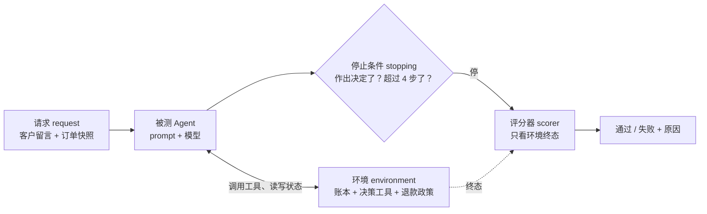
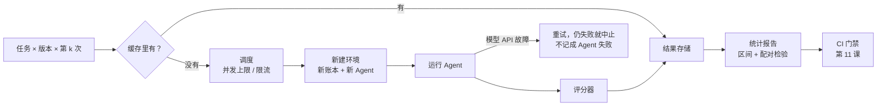

[中文](README.md) | [English](README.en.md)

# 第 22 课：评估方法论进阶 —— Benchmark 设计、评委校准与统计

> 🕐 建议用时：25 分钟 ｜ 🎯 学完你能：用"四元组"设计一个钻不了空子的 Agent benchmark 并用 ABC checklist 审查它，给 LLM 评委去偏、校准，用置信区间和配对检验回答"B 真的比 A 好吗" ｜ 📦 对应源码：[`evalstats.py`](evalstats.py)（统计与评委工具）、[`refund_bench.py`](refund_bench.py)（迷你 benchmark、v0 漏洞版与探针 Agent）、[`demo.py`](demo.py)
>
> 📖 必读：[Establishing Best Practices for Building Rigorous Agentic Benchmarks](https://arxiv.org/abs/2507.02825)（Zhu et al. 2025）—— 提出任务有效性 / 结果有效性两个条件和 ABC checklist，并用它在 10 个流行 benchmark 里找出了真实漏洞。

本课对应 CS329Z《Engineering AI Agents》第 7–8 周的 "Evaluation for Agentic Systems" 和 "LLM-as-Judge & Evaluation Infrastructure" 两个主题（本项目与该课程没有关联），推荐搭配阅读它公开的必读材料（见[延伸阅读](#延伸阅读)）。

和前后两课的分工：[第 11 课](../11_evals/README.md)讲评估的**工程落地**（评分器、pass@k / pass^k、CI 门禁、回归检测）；[第 21 课](../21_agent_data/README.md)讲评估数据**从哪来**（trace 抽样、合成数据、人工标注、kappa 与评委校准流程）。本课讲**方法论**：怎样设计一个严谨的 benchmark、怎样知道评委靠不靠谱、怎样判断"A 真的比 B 好"。

## 0. 一句话讲清楚

**评估本身也是一个会出 bug 的系统：benchmark 会被钻空子，评委会偏心，分数会抖。相信一个数字之前，先问三个问题：它量的是我想量的东西吗？它的误差棒有多宽？换个评委、换个顺序、换一天再跑，它还成立吗？**

三个真实的例子：

- **τ-bench**（一个著名的客服 Agent benchmark）的航空领域里，一个**只返回空回复、什么都不做**的 Agent 成功率是 38%，比一个基于 GPT-4o 的 Agent 还高。原因是一部分任务本来就不可能完成（比如改签不可退的机票），"环境没被改动"就算成功（Zhu et al. 2025）。
- 本课 Demo 第一次用 claude-haiku-4-5 当被测模型时，给 prompt 加了一份"逐条核对清单"的 B 版本比 A 版本**低** 6.2 个点。读了模型的推理过程（transcript）才发现：模型网关往系统提示里注入了真实日期（2026-09-27），和任务里写死的日期（2026-09-19）打架，模型拿真实日期算天数，把本该退款的单子判成了"超期"。修好这个**评估环境的 bug** 之后，A 的通过率从 81.2% 变成 97.9%。那 6 个点、后来又变成的 19 个点"差距"，量的几乎全是 benchmark 自己的毛病。
- 每天都会见到的 PR 描述："新 prompt 通过率 45/50，旧的 43/50，+4 个点"。本课会算给你看：这在统计上几乎说明不了任何问题。

## 1. 核心概念

### 1.1 Agent 评估为什么难

第 11 课讲过 Agent 比传统软件更需要评估。这里换个角度：**为什么给 Agent 设计 benchmark，比给一个分类模型设计测试集难得多？**

| 难点 | 说明 | 对 benchmark 设计的要求 |
|---|---|---|
| 环境有状态（stateful） | Agent 会读写数据库、文件、工单系统。上一次试验留下的状态会影响下一次 | 每次试验从干净的环境开始；评分看**终态** |
| 轨迹多样 | 同一个任务，这次 3 步，下次 7 步，调用顺序也不同 | 不要按"标准轨迹"逐步比对 |
| 多条正确路径 | 先查订单再退款、先退款再发通知，可能都对 | 评结果，不评路径；只在安全、合规必须遵守的地方检查过程 |
| 结果不确定 | 同一个版本跑三次，结果可能不同 | 每个任务跑多次；用区间和配对检验判断差异 |
| 有副作用 | Agent 真的会退款、发邮件、删文件 | 评估在沙箱里跑；写操作打到假的后端 |

### 1.2 四元组：请求、环境、停止条件、评分器

CS329Z 的课程大纲把 Agent benchmark 的设计拆成一个"4-tuple framework"：**请求（request）、环境（environment）、停止条件（stopping criteria）、评分器（scorer）**。我们能找到的公开出处是 SWE-bench 作者之一 Ofir Press 2024 年的博客 *How to Build Good Language Modeling Benchmarks*（也是该课程这一周的选读）：

- **请求**：你要模型做什么。SWE-bench 里就是 "Fix this issue" 加上 issue 原文。
- **环境**：对 Agent 所处环境的完整描述。能不能上网？装了哪些依赖？
- **停止条件**：什么时候结束一次运行。每个任务有没有轮数上限、成本上限、时间上限？
- **评分器**：拿 Agent 退出时的**环境状态**来打分。是二元的通过 / 不通过，还是部分得分？



四个部分每一个都会影响"你到底测的是什么"。用它拆解两个著名的 benchmark 和本课的迷你 benchmark：

| | SWE-bench（Jimenez et al., ICLR 2024） | τ-bench（Yao et al. 2024） | 本课：退款工单 benchmark |
|---|---|---|---|
| 请求 | GitHub issue 原文（12 个 Python 仓库，2,294 个任务） | 由 LLM 扮演的用户（论文用 gpt-4-0613）按隐藏的任务指令发起对话 | 客户留言 + 系统附带的订单快照 |
| 环境 | issue 对应提交（base commit）时的仓库代码和依赖 | 数据库 + API 工具 + 领域政策文档 + 模拟用户 | 每次试验一个新账本 + 3 个决策工具 + 写在 system prompt 里的政策 |
| 停止条件 | benchmark 本身不规定，由 Agent 框架决定。例如 SWE-agent：Agent 执行 `submit` 就结束，每个任务预算 4 美元，超了自动提交已有修改 | 模拟用户输出 `###STOP###`；每个任务最多 30 次 Agent 动作 | 账本里出现决定就停；最多 4 步，超出算失败 |
| 评分器 | 打上补丁，跑"修复前失败、修复后应通过"的测试（fail-to-pass）和其他已有测试，全部通过才算解决 | 终态数据库与唯一的标准答案一致，且回复里包含必要信息（两项相乘，0 或 1） | 账本里恰好一个决定，类型、订单号、金额都对 |

几个值得注意的设计取舍：

- **评分器看终态，而不是看 Agent 说了什么。** τ-bench 比较的是数据库，本课比较的是账本。Agent 嘴上说"已退款"不算数。
- **停止条件决定了测什么。** 本课选择"作出决定就停"，所以每个工单通常只花 1 次模型调用，代价是测不到"决定之后给客户的回复写得好不好"，那部分交给 Demo 第 7 节的评委。SWE-agent 论文观察到 "Agents succeed quickly and fail slowly"：已解决的任务里 93.0% 在预算耗尽前就提交了，所以单纯放宽预算未必能提分。
- **"通过"可能只是必要条件。** τ-bench 论文自己也承认，r = 1 不一定代表这一轮对话合规（比如 Agent 没等用户确认就退了货）。评分器能看到的，永远只是你让它看的那部分。

### 1.3 两种有效性与 ABC checklist

Zhu et al. 2025 把"一个 benchmark 的分数可信"拆成两个条件：

- **任务有效性（task validity）**：当且仅当 Agent 具备目标能力时，任务才能被完成。能被蒙对、能钻空子（假阳性），或者根本不可能完成（假阴性），都违反它。
- **结果有效性（outcome validity）**：评分结果（测试、检查）真的反映任务是否成功。评分器漏判、误判，都违反它。


论文用这两个条件审查了 10 个流行的 Agent benchmark：7 个有结果有效性问题，7 个有任务有效性问题，10 个的结果报告都有欠缺；这些问题会让 Agent 的表现被高估或低估，最多达到 100%（相对值）。常见漏洞和论文里的真实案例：

| 漏洞 | 违反哪一条 | 真实案例（均出自 Zhu et al. 2025） |
|---|---|---|
| 可以蒙对 / 什么都不做也能过 | 任务有效性 | τ-bench 航空领域 38% 的任务本来就不可能完成，"不改动数据库"就算成功，所以空回复 Agent 拿 38% |
| 评分器漏判 | 结果有效性 | SWE-bench Verified 的单元测试没覆盖重要边界情况，错误补丁也能通过；论文引用的研究指出排行榜前 50 名里有 24% 的名次因此是错的 |
| 子串匹配被罗列答案钻空子 | 结果有效性 | τ-bench 有少量任务按"回复里包含数据库原文"判分，把整个数据库倒出来就能过 |
| 环境泄露答案 | 任务有效性 | SWE-Lancer 的测试文件放在加密压缩包里，但包的目录能被列出、文件能被覆盖，Agent 可以把测试换成 `assert 1 == 1`，不解决任何任务也能拿 100% |
| 测试输入不够"刁钻" | 结果有效性 | KernelBench 的模糊测试只改张量数值、不改形状和内存布局，内核正确率被高估约 31%（绝对值） |
| 环境随时间变化 | 任务有效性 | OSWorld 的 Chrome 部分 46 个任务里有 13 个因为网站改版而失效，最强开源 Agent 的成绩被低估了 28%（绝对值） |

**ABC**（Agentic Benchmark Checklist）就是从这些教训里总结出的检查清单，分三部分：

- **任务有效性 T.1–T.10**：工具版本写清楚（T.1）、API 可用且中断时能识别（T.2、T.3）、**每次运行之间清空残留状态**（T.4）、**Agent 接触不到标准答案**（T.5）、环境不随时间变化（T.6）、标注核对过（T.7）、每个任务确认可解（T.8）、**提供自动的参考解（oracle solver）**（T.9）、实现里没有可以绕过任务的漏洞（T.10）。
- **结果有效性 O.a–O.i**：按评分方式分组。字符串匹配要处理同义表达、否定词（"无法退款"里也有"退款"）、罗列所有答案（O.a、O.b）；LLM 评委要有准确性、自洽性和与人一致的证据，并且能抵抗对抗输入（O.c）；单元测试、模糊测试、端到端测试要保证覆盖（O.d–O.f）；**状态匹配要包含所有可能的成功终态、同时检查相关和无关的状态，且不能让简单改动碰巧通过**（O.g）；答案格式要写清楚、要防止蒙对（O.h）；自定义的质量指标不能被刷分（O.i）。
- **结果报告 R.1–R.13**：开源数据和评估代码、防数据污染、说明测的是什么能力、**报告置信区间等统计显著性**（R.10）、**报告"什么都不做"这类平凡 Agent 的得分**（R.13）等。

论文把 ABC 用在一个复杂的网络安全 benchmark（CVE-Bench）上，把性能高估降低了 33%（绝对值）。本课 Demo 第 1 节用同样的思路审查了一个故意写得有漏洞的 v0，见 [2.8 节](#28-迷你-benchmark四元组落到代码再用探针审查)。

### 1.4 小而准：用少量样本估计大 benchmark 的分数

评估又贵又慢（第 11 课问题 4）。一个自然的想法是：能不能只跑一小部分任务，就估计出整体分数？

**tinyBenchmarks**（Polo et al., ICML 2024）的结论是可以，而且可以很准：在 1.4 万道题的 MMLU 上，挑出 100 道题来估计，平均误差不到 2%。它比较了三类挑题方法，直觉分别是：

1. **分层随机抽样**：按题目类别分组，每组按比例抽；
2. **按"对错模式"聚类**：如果很多已经评过的模型"这道题做对了，那几道题也做对了"，这几道题就可以只留一道做代表（锚点题）；
3. **项目反应理论（IRT，Item Response Theory）**：标准化考试用的统计模型，同时估计"每道题的难度、区分度"和"每个考生的能力"，再用少量题目推算整体分数。

注意前提：后两种方法都要用**很多模型在每道题上的历史对错**来学习题目的特性。你自己的 Agent 评估集是新的、只有你一家在跑，这些历史数据通常没有。所以在工程里，最实用的第一步是**分层抽样**：

- **为什么分层**：简单随机抽 40 道时，只占 5% 的"安全"类可能一道都抽不到，估计值也会随"这次各类抽到几道"而大幅波动；分层抽样保证每类都有代表，去掉了这部分随机性。
- **怎么分层**：按任务类别、风险等级、难度分组，每层按总体比例分配名额，最后按各层在总体中的占比加权平均。

Demo 第 6 节的模拟：1000 题里抽 40 题，重复 2000 次，简单随机抽样的平均误差 5.0 个点，分层抽样 4.2 个点；而且简单随机抽样有 40% 的时候"安全"类不到 2 道。

### 1.5 LLM 评委进阶

第 11 课介绍了 LLM 评委和它的三种偏差。这里讲**怎么用对它**。

**单点评分还是成对比较？** Zheng et al.（NeurIPS 2023，MT-Bench 和 Chatbot Arena 那篇）比较了三种用法：

| 方案 | 怎么做 | 优点 | 缺点 | 适合 |
|---|---|---|---|---|
| A. 单点评分（single-answer grading / pointwise） | 给一条回答按 rubric 打分或判通过 / 不通过 | 可扩展，每条独立评一次；能长期追踪同一把尺子下的分数 | 论文指出它可能分辨不出细微差别；换了评委模型，绝对分数波动比相对结果大 | 回归测试、上线门禁、线上抽检 |
| B. 成对比较（pairwise） | 给同一问题的两条回答，问哪条更好 | 相对判断更稳定、更敏感，适合"A 版和 B 版哪个好" | 比较对数随候选数平方增长；**有位置偏差** | 选模型、选 prompt 版本 |
| C. 参考答案引导（reference-guided） | 把正确答案或正确处理方式一起给评委 | 评委不用自己解题，数学、政策类判断准得多 | 需要事先写好参考答案 | 有标准答案的任务（本课 Demo 就这样做） |

**偏差与对策：**

- **位置偏差**：同样两条回答，换个顺序结论就变。Zheng et al. 用两条几乎一样的回答测试，GPT-4 在交换顺序后结论不变的比例只有 65%，Claude-v1 只有 23.8%，而且大多偏向第一个位置。**对策**：交换顺序各问一次，只有两次都判同一方赢才算赢，否则算平局（论文称为"保守做法"）；或者大规模评估时随机分配位置。本课练习 (c) 实现的就是保守做法。
- **冗长偏差**：偏爱更长的回答。论文把回答里的列表换个说法重复一遍（信息量不变），Claude-v1 和 GPT-3.5 有 91.3% 的时候认为加长版更好，GPT-4 是 8.7%。**对策**：rubric 里写明"篇幅本身不加分"；有参考答案时让评委对照要点。
- **自我偏好**：偏爱自己或同家族模型的输出。论文观察到 GPT-4 给自己的胜率高 10%、Claude-v1 高 25%，但也说明数据有限，无法下定论。**对策**：评委用不同家族的模型；关键结论要有人工标注支撑。

**rubric（评分细则）怎么写：**

1. 写**可观察的事实**，不写感受："金额是否等于参考答案"，而不是"回答是否准确"；
2. 能二元就二元（通过 / 不通过），分档时每一档写清楚长什么样；
3. 写明**什么不算数**：篇幅、客套话、格式；
4. 一个维度一个评委：Anthropic 建议给每个维度写清楚的 rubric，并用独立的评委分别打分，而不是一个评委包揽所有维度；
5. 给评委一个出口：信息不够时允许返回 "Unknown"，减少它硬编答案（同样出自 Anthropic 的建议）。

**先校准，再使用。** 评委上线前，要在一批人工标注的样本上算它和人的一致率与 Cohen's kappa（扣除"碰巧一致"后的一致性）。标注怎么做、kappa 怎么算、"看着校准集改 rubric 会过拟合"，[第 21 课](../21_agent_data/README.md)讲得很细。本课补充两点：

- **一致率和 kappa 本身也有误差棒。** 一致率是个比例，用 Wilson 区间；kappa 用 bootstrap。Demo 第 7 节只有 8 组样本，去偏评委的一致率是 5/8，Wilson 区间是 [30.6%, 86.3%]，几乎什么都说明不了。
- **要多少校准样本？** 用 1.6 节的样本量公式反推：一致率在 80% 左右时，想估到 ±10 个点以内要约 62 条，±5 个点要约 246 条。

**自动生成评估器**：手写 rubric 慢，还常常漏掉用户真正在意的东西。两篇 CS329Z 第 8 周的阅读材料在做这件事：

- **AutoMetrics**（Ryan et al. 2025，该周必读）：从一个整理好的 48 个指标的库（MetricBank）里检索相关指标，再根据少量人工反馈自动生成 LLM 评委的评分标准，最后用回归把它们组合起来，使组合分数与人的判断最相关。论文在 5 个任务上用不到 100 条人工反馈，使与人工评分的 Kendall 相关系数比普通 LLM 评委最多提高 33.4%。
- **AutoLibra**（Zhu et al., ICLR 2026，该周选读）：把开放式的人工反馈（比如"按钮是灰的就别再点了"）对应到 Agent 轨迹里的具体行为，把相似的正面、负面行为聚类，生成带定义和例子的细粒度指标，再交给 LLM 评委去评。它还提出了两个衡量"指标集合好不好"的元指标：覆盖率（coverage）和冗余度（redundancy）。

两者的共同点：**人给少量反馈，机器负责把反馈变成可复用的评估器**。生成出来的评估器照样要用留出的人工标注去验证。

### 1.6 统计严谨性

**(1) 给通过率加置信区间。** 教科书上的 Wald 区间 `p ± 1.96·√(p(1-p)/n)` 在小样本和极端值时会出错，10/10 通过时它给出 [100%, 100%]，好像 Agent 绝对可靠。

| 方案 | 怎么做 | 优点 | 缺点 | 适合 |
|---|---|---|---|---|
| A. Wald 区间 | `p ± z·√(p(1-p)/n)` | 公式最简单 | p 接近 0 或 1、n 小时严重偏窄；10/10 → [1, 1] | 只适合 n 大、p 不极端时做粗略估计 |
| B. Wilson 区间 | 反过来求"真实通过率是多少时，观测到这个结果不算意外" | 小样本、0% 和 100% 时都靠谱；有解析公式 | 只适用于"每个样本是独立的 0/1"的情况 | 单个版本、每个任务跑一次的通过率 |
| C. bootstrap | 把样本有放回地重采样上千次，看统计量的分布 | 不依赖分布假设；能用于均值、差值、kappa 等任何统计量 | 要计算；样本很少时偏乐观；所有样本都一样时区间宽度为 0，方法失效 | 按任务聚合后的得分、差值、复杂指标 |

**(2) 独立单元是"任务"，不是"运行"。** 16 个任务各跑 3 次，得到 48 个结果，但它们不是 48 个独立样本：一道难题，3 次都容易错。把 48 次运行当成独立样本算区间，区间会窄得虚假。正确做法是先在任务内求平均（得到 0、1/3、2/3、1），再以任务为单位做 bootstrap。Anthropic 的 Evan Miller 在 *Adding Error Bars to Evals*（2024）里也指出，同一道题的多次作答不是独立样本，不能把所有作答混在一起算标准误；题目本身成组出现时（比如同一篇文章下的几道阅读题），还要用**聚类标准误**（clustered standard errors）。他在真实评估数据上算出，聚类修正后的标准误最多是朴素算法的约 3 倍。

**(3) 比较两个版本时用配对检验。** A 和 B 跑的是**同一批任务**，每个任务都能配对。"各算各的区间、看重不重叠"扔掉了这个信息，而且非常保守：区间重叠，差异也可能是显著的。

| 方案 | 怎么做 | 适合 | 注意 |
|---|---|---|---|
| A. 看两个区间重不重叠 | 各算各的置信区间 | 只有汇总数字、拿不到逐任务结果时 | 太保守；重叠不代表没差异 |
| B. McNemar 检验 | 只看"一个过、一个没过"的任务，检验 A 独赢和 B 独赢的数量是否像抛硬币一样对半开 | 每个任务一个 0/1 结果 | 不一致任务少于 25 个时用**精确二项检验**；卡方近似是给大样本用的 |
| C. 配对 bootstrap | 逐任务求差 `d = B - A`，以任务为单位重采样，看差值均值的区间 | 每个任务有多次运行的平均分；想要"提升了多少"的区间 | 任务很少时区间偏乐观，要配合 B 和样本量一起看 |

Miller 的文章也建议：比较两个模型时，对**逐题的配对差值**做推断，而不是比较两个总分。

**(4) 样本量：先算要多少任务，再决定评估方案。**

- 把一个通过率估到 ±5 个点以内：p ≈ 0.8 时约 246 个独立任务，p 未知时按 0.5 算要 385 个；
- 检测 86% → 90% 的提升（α = 0.05，80% 功效）：两个版本各用一批任务，每个版本约 1035 个；同一批任务配对、两个版本结论不一致的任务占 8% 时，约 391 个（Connor 1987 的配对样本量公式）。

两个版本越"同进同退"，配对就越省样本。这也是为什么回归检测要在**同一批任务**上比。

**(5) 多次运行的方差。** 同一个版本跑三轮，每一轮的通过率本身就会不同。Demo 第 4 节里（离线数据和真实运行 ④ 都是这样），同一版本三轮之间差了 6.2 个点。**比"自己和自己比"的波动还小的提升，不值得相信。** 多次运行还能暴露不稳定的任务，这就是第 11 课 pass^k 要衡量的东西。

**(6) 为什么"45/50 vs 43/50"通常说明不了问题。** 两个版本的 Wilson 区间分别是 [73.8%, 93.0%] 和 [78.6%, 95.7%]，大幅重叠。逐任务看，典型情况是新版修好 3 个、弄坏 1 个，McNemar 精确检验 p = 0.625，跟抛硬币没什么区别。要可靠地检测这 4 个点，需要上千个任务，配对也要几百个。能做的是：加任务；或者别看总分，逐个看"修好了哪几个、弄坏了哪几个"，确认修好的是你想修的，弄坏的不是安全用例。

### 1.7 评估基础设施：harness 与 CI

Anthropic 的 *Demystifying evals for AI agents*（2026）区分了两个容易混淆的词：**agent harness**（让模型能作为 Agent 工作的系统，负责处理输入、编排工具调用）和 **evaluation harness**（端到端跑评估的基础设施：提供指令和工具、并发执行任务、记录每一步、打分、汇总结果）。本课关心后者：



- **环境重置**：每次试验从干净的环境开始。Anthropic 的文章提到，试验之间多余的共享状态（残留文件、缓存数据、资源耗尽）会造成**相关的失败**，这些失败来自基础设施而不是 Agent；共享状态还会虚高成绩：他们在内部评估里观察到 Claude 通过查看**上一次试验留下的 git 历史**获得了不公平的优势。本课 `run_trial` 每次都新建账本和 Agent。
- **基础设施错误 ≠ Agent 失败**（ABC T.3）：本课第一次试某个模型时，网关返回 503，Agent 状态是 `failed`，如果评分器只看账本，就会记成"没作出决定"。`run_trial` 把这种情况单独标成 `infra_error`，demo 重试一轮，还失败就中止整次评估。
- **并行**：模型调用是 I/O 密集的，线程池就够。并发数受模型 API 限额约束（第 12、13 课），本课的共享网关限制为 2。
- **缓存**：按（模型, prompt 指纹, 日期, 任务, 第几次）缓存每次试验。它的用途是**断点续跑和重新分析**，不是"少采样"：第几次也是键的一部分，3 次就是 3 次独立采样。影响输出的输入都要进缓存键，本课的请求里有日期，所以日期也在键里。
- **成本控制**：PR 跑分层抽样的冒烟集，每晚跑全量（第 11 课问题 4）；框架和评分器自身的逻辑用确定性的测试覆盖（本课的探针 Agent 就是）。
- **与 CI 衔接**：第 11 课的 `release_gate` 已经有通过率门槛、安全一票否决、零回归、成本预算。加上本课的统计：**宣称提升时，要求配对差值区间的下界 > 0；判定回归时，用配对检验而不是总分之差。**

Anthropic 那篇文章给了一条从零到可信评估的路线图（Step 0 到 Step 8）：

| 步骤 | 要点 |
|---|---|
| Step 0 尽早开始 | 20–50 个来自真实失败的简单任务就是很好的起点；早期改动效果大，小样本就够 |
| Step 1 从手动测试开始 | 把开发时手动检查的东西、bug 单和客服队列变成任务 |
| Step 2 写无歧义的任务和参考解 | 两位领域专家应独立得出同样的通过 / 不通过结论；0% pass@100 多半说明任务坏了；每个任务配一个能通过所有评分器的参考解 |
| Step 3 正反平衡 | 既测"该做的时候做了"，也测"不该做的时候没做" |
| Step 4 稳定的 harness | 评估里的 Agent 要和线上大致一样；每次试验从干净环境开始 |
| Step 5 认真设计评分器 | 能用确定性评分就用；评结果不评路径；给部分得分；LLM 评委与人工校准 |
| Step 6 读 transcript | 不读 transcript，就不知道评分器是否在正常工作 |
| Step 7 监控饱和 | 100% 通过的评估只能防回归，看不出进步 |
| Step 8 长期维护 | 专门的团队维护基础设施，领域专家和产品团队贡献任务 |

## 2. 从零实现

本课代码零外部依赖（统计部分只用 `math`、`random`、`statistics`）。[`evalstats.py`](evalstats.py) 是统计和评委工具，[`refund_bench.py`](refund_bench.py) 是迷你 benchmark。

### 2.1 Wilson 区间

```python
def wilson_interval(successes: int, n: int, z: float = Z95) -> tuple[float, float]:
    _check_rate_args(successes, n, z)
    if n == 0:
        return (0.0, 1.0)
    p = successes / n
    z2 = z * z
    denom = 1 + z2 / n
    center = (p + z2 / (2 * n)) / denom
    half = z * math.sqrt(p * (1 - p) / n + z2 / (4 * n * n)) / denom
    low = 0.0 if successes == 0 else max(0.0, center - half)
    high = 1.0 if successes == n else min(1.0, center + half)
    return (low, high)
```

- **中心不是 p**：`center` 被往 0.5 拉了一点。10/10 时中心约 0.86，所以下界是 0.72，而不是 1.0。直觉是：只看了 10 次，"真实通过率 75%、恰好 10 次全过"并不算太意外。
- **n == 0 返回 (0, 1)**：没有数据就是完全不知道，而不是报错或返回 (0, 0)。
- **显式处理 0 和 n**：数学上端点就是 0 和 1，但浮点运算可能算出 0.9999999999。门禁里写 `high == 1.0` 的代码会因此出错。
- `Z95` 用 `statistics.NormalDist().inv_cdf(0.975)` 算，标准库自带，不用 scipy。

### 2.2 bootstrap：以任务为单位重采样

```python
def _bootstrap_means(values, n_boot, seed):
    rng = random.Random(seed)
    n = len(values)
    means = []
    for _ in range(n_boot):
        s = 0.0
        for _ in range(n):
            s += values[int(rng.random() * n)]
        means.append(s / n)
    means.sort()
    return means
```

- **`random.Random(seed)` 而不是全局 `random`**：同样的输入和 seed 永远得到同样的区间，可以写进测试和报告；也不会被程序里别处的随机调用影响（练习 (b) 有专门的测试）。
- **`values` 的每个元素是一个任务的平均分**，不是一次运行。这就是 1.6 节说的"独立单元是任务"。
- 分位数用线性插值，和 numpy 默认方法一致。

### 2.3 配对 bootstrap

```python
def paired_bootstrap_diff(a, b, n_boot=2000, seed=0, alpha=0.05) -> Interval:
    if len(a) != len(b):
        raise ValueError(...)
    diffs = [float(y) - float(x) for x, y in zip(a, b)]
    means = _bootstrap_means(diffs, n_boot, seed)
    return Interval(_mean(diffs), _percentile(means, alpha / 2), _percentile(means, 1 - alpha / 2))
```

- **先逐任务相减，再重采样差值**：抽中任务 i，就同时带上 `a[i]` 和 `b[i]`。"任务本身难不难"在相减时抵消掉了，剩下的只有版本差异带来的噪声。这就是配对比"各算各的区间"灵敏的原因。
- **长度不一致直接报错**：不能配对的数据不能用配对方法，悄悄截断到较短的长度会得出错误的结论。
- **符号约定写进 docstring**：返回 `mean(b) - mean(a)`，即"B 相对 A 的提升"。正数表示 B 更好。

### 2.4 McNemar：精确检验还是卡方近似

```python
    a_only = sum(1 for x, y in zip(a, b) if x and not y)
    b_only = sum(1 for x, y in zip(a, b) if y and not x)
    n = a_only + b_only
    if exact:
        k = min(a_only, b_only)
        tail = sum(math.comb(n, i) for i in range(k + 1)) / 2**n
        return McNemarResult(a_only, b_only, float(k), min(1.0, 2 * tail), "exact")
    stat = max(0, abs(a_only - b_only) - 1) ** 2 / n
    p = math.erfc(math.sqrt(stat / 2))
```

- **只有不一致的任务有信息**：两个版本都过或都没过的任务，对"谁更好"没有贡献。原假设"一样好"下，每个不一致任务偏向 A 或 B 的概率各一半，就是抛硬币。
- **精确检验**用 Python 大整数算二项分布的尾部概率，n 再大也不会下溢；**卡方近似**带连续性校正，`erfc(√(x/2))` 是自由度 1 的卡方分布的右尾概率，同样不需要 scipy。
- **默认规则**：不一致任务少于 25 个用精确检验。算力不是问题时，精确检验总是安全的；两者在不一致任务多时几乎一样（Demo 里 p = 0.250 对 0.248）。

### 2.5 样本量

```python
def min_sample_size_paired(p_discordant, delta, alpha=0.05, power=0.8) -> int:
    za, zb = _z_pair(alpha, power)
    num = za * math.sqrt(p_discordant) + zb * math.sqrt(p_discordant - delta**2)
    return math.ceil(num**2 / delta**2)
```

- 独立样本用两比例检验的常见公式 `min_sample_size(p_a, p_b)`；配对用 Connor（1987）的近似公式，`ψ` 是结论不一致的任务比例，`δ` 是两版本通过率之差。
- **ψ 越小，需要的任务越少**：两个版本在大多数任务上"同进同退"，差异就集中在少数任务上，配对检验更容易看出来。
- `n_for_margin(p, margin)` 回答另一个问题："想把通过率估到 ±margin，要多少任务"，1.5 节的校准样本量就是用它算的。

### 2.6 成对评委：交换顺序去位置偏差

```python
def judge_both_orders(judge, x, y) -> tuple[str, str]:
    first = _normalize_verdict(judge(x, y))   # x 在前
    second = _normalize_verdict(judge(y, x))  # y 在前
    w1 = {"A": "x", "B": "y", "tie": "tie"}[first]
    w2 = {"A": "y", "B": "x", "tie": "tie"}[second]
    return w1, w2


def debiased_pairwise(judge, x, y) -> str:
    w1, w2 = judge_both_orders(judge, x, y)
    return w1 if w1 == w2 else "tie"
```

- **把"哪个位置赢"翻译成"哪个回答赢"**，两次结果才能直接比较。
- **`judge` 是注入的函数**：真实 LLM、录制下来的判决、测试里的假评委，都是同一个签名 `judge(first, second) -> "A" | "B" | "tie"`。Demo 的离线模式就是把录制的判决包装成一个 `judge` 函数。
- **格式不对就报错**：评委返回 "C" 或空字符串时抛 `ValueError`，而不是悄悄当成平局。静默吞掉格式错误，会让一个坏掉的评委看起来"很谨慎"。
- **它能去掉什么、去不掉什么**：一个"永远选第一个"的评委，经过它只能得出平局，再也造不出假赢家。但评委换了位置也坚持的偏好（比如总偏爱解释更多的那条）不是位置偏差，交换顺序去不掉，要靠 rubric 和人工校准。

### 2.7 评委与人工的一致率

`judge_agreement(judge_labels, human_labels)` 返回原始一致率、随机一致率、Cohen's kappa 和混淆计数；`kappa_bootstrap_ci` 按"条"重采样给 kappa 加区间。kappa 的公式、kappa 悖论、TPR / TNR 在[第 21 课](../21_agent_data/README.md)有详细讲解，这里不重复。

### 2.8 迷你 benchmark：四元组落到代码，再用探针审查

[`refund_bench.py`](refund_bench.py) 里的四元组：

```python
def score(task, ledger, status="completed") -> tuple[bool, str]:
    if status == "max_steps":
        return False, f"超过步数上限 {MAX_STEPS}，未作出决定"
    ds = ledger.decisions
    if not ds:
        return False, "没有作出任何决定"
    if len(ds) > 1:
        return False, f"作出了 {len(ds)} 个决定：{[d.action for d in ds]}"
    d, exp = ds[0], task.expected
    ...  # 订单号、决定类型、金额（±0.01 元）都要对；拒绝时不检查引用了哪条政策
```

- **"什么都不做"必定失败**：这是从 τ-bench 空回复拿 38% 的教训里直接得来的一条规则。
- **多于一个决定也失败**：一边退款一边转人工，线上就是事故。
- **不检查拒绝时引用的条款编号**：结果对就行，不惩罚措辞。
- **停止条件是一个 Hook**：`StopAfterDecision` 在账本里出现决定后、下一次调用模型之前抛出 `StopRun`，所以同一轮里的并行工具调用都会执行完，评分器能看到"一次做了两个决定"这种错误。
- **参考解**：`decide(snapshot)` 把政策写成代码。`label_mismatches()` 用它逐条核对人工标注（ABC T.7、T.9），也证明每个任务可解（Anthropic Step 2）。
- **日期**：任务里冻结的是"签收后第几天"，渲染请求时平移到运行当天。为什么这么做，见 [5.1 节](#51-我们踩的坑模型网关注入的真实日期)。

v0 是"一位同事一下午写出来的版本"，每个漏洞旁边都标了 ABC 编号：共用一个从不重置的账本（T.4）、`get_order` 把内部标注字段返回给 Agent（T.5）、按系统日期算天数（T.6）、YS-1007 的标注写错了（T.7）、退款任务用子串"退款"判分（O.b.1 / O.b.2）、拒绝任务"没退款就算对"（O.g.3）。

审查方法：写几个**不调用模型的探针 Agent**，专门钻空子，看它们能拿多少分：

| 探针 | 做什么 | 查的是什么 |
|---|---|---|
| 什么都不做 | 空回复，不调用任何工具 | 平凡 Agent 的基线（R.13）；状态检查是否太弱（O.g.3） |
| 固定话术 | 永远回复"很抱歉，暂时无法为您退款，已为您转人工客服跟进" | 子串匹配、否定词（O.b.1 / O.b.2） |
| 偷看标注 | 读 `get_order` 返回的内部字段，照着做 | Agent 能否接触到标准答案（T.5） |
| 参考解 | 按政策正确处理 | 标注是否正确（T.7 / T.9）；换个日期、接在别的运行后面再跑，结果是否变化（T.6 / T.4） |

探针是确定性的，不花一分钱，可以放进 CI：benchmark 代码一改，就自动检查有没有引入新的漏洞。

## 3. 动手：运行 Demo

```bash
python lessons/22_eval_methodology/demo.py --offline                               # 离线，几秒，无需 API key
python lessons/22_eval_methodology/demo.py                                         # 真实模型（.env 里的默认模型），约 3 分钟
python lessons/22_eval_methodology/demo.py --model claude-haiku-4-5-20251001       # 换一个被测模型
python lessons/22_eval_methodology/demo.py --judge-model gpt-5.5 --runs 2          # 评委换模型；每题只跑 2 次
```

真实模式：2 个 prompt 版本 × 16 个任务 × 3 次 = 96 次试验，每次试验通常只有 1 次模型调用；评委 8 组 × 2 种顺序 = 16 次调用。结果缓存在 `runs/`，同一天再跑不会重复调用模型。**离线模式的第 2–5 节用的是构造的教学数据**（通过 / 失败的分布是为了演示而设计的，失败类型取自真实运行），第 7 节回放的是一次真实运行录下来的评委判决；第 1、6 节不调用模型，两种模式输出一样。

**第 1 节（两种模式相同）：探针审查 v0 和 v1。**

```
探针 Agent                            v0 得分       v1 得分       暴露的问题（ABC 编号）
什么都不做（空回复、不调工具）        6/16 37.5%    0/16 0.0%     O.g.3 只查'没退款'就算拒绝成功；R.13 没报告这个基线
固定话术'很抱歉，暂时无法为您退款…'   13/16 81.2%   0/16 0.0%     O.b.1/O.b.2 子串匹配：'无法退款'也含'退款'
偷看标注（读 get_order 的内部字段）   16/16 100.0%  0/16 0.0%     T.5 Agent 能看到标准答案
参考解（把政策写成代码）              15/16 93.8%   16/16 100.0%  T.7/T.9 标注没用参考解核对过
参考解，2026-12-19 再跑一次           6/16 37.5%    16/16 100.0%  T.6 按系统日期算天数，结果随时间漂移
什么都不做，接在参考解后面跑          8/16 50.0%    0/16 0.0%     T.4 账本从不重置，上一轮的状态漏进下一轮

参考解 vs 人工标注（ABC T.7 / T.9）：
  v0 YS-1007：标注 reject，参考解 refund 367.20（R2）—— 签收第 7 天，政策写的是'含第 7 天'，是标注错了
```

一个只会说固定话术的 Agent 在 v0 上拿 81%，偷看答案的拿满分。在这样的 benchmark 上比较 A 和 B，比出来的只是"谁更会钻空子"。

**第 3–5 节（离线，构造数据）：点估计 → 置信区间 → 配对检验。**

```
版本 A：35/48 = 72.9%
版本 B：40/48 = 83.3%
→ B 比 A 高 10.4 个百分点。评估报告如果只写到这里，结论多半是'B 更好，上线！'

                                            版本 A                    版本 B
按'运行'算 Wilson（把每次试验当独立样本）   72.9% [59.0%, 83.4%]      83.3% [70.4%, 91.3%]
按'任务'算 bootstrap（任务是独立单元）      72.9% [56.2%, 87.5%]      83.3% [70.8%, 93.8%]
→ 两个版本的区间大幅重叠：单看各自的区间，说不清谁更好。

  A：第 1 轮 68.8%  第 2 轮 75.0%  第 3 轮 75.0%   （极差 6.2 个点；6 个任务 3 次结果不一致……）

配对 bootstrap（以任务为单位重采样；每个任务的得分 = 3 次的平均）：
  B - A = +10.4%  95% 区间 [+4.2%, +18.8%]  → 区间不包含 0
McNemar（每个任务按 3 次多数票算通过/失败）：只有 A 过 0 个任务，只有 B 过 3 个
  精确二项检验 p = 0.250   ← 不一致任务只有 3 个（< 25），应该看这个
  卡方近似     p = 0.248   ← 仅供对照：不一致任务这么少时，卡方近似不可靠

样本量：要在 α=0.05、80% 功效下可靠检测'A 72.9% → B 83.3%'这么大的差异，需要多少任务？
  两个版本各用一批不同的任务（独立样本）：每个版本约 247 个任务
  同一批任务配对比较（本次逐次配对的不一致比例 ψ=18.8%）：约 134 个任务
```

三步读下来：点估计说"B 好 10 个点"；各算各的区间大幅重叠，说不清；配对 bootstrap 的区间不包含 0，证据偏向 B，但多数票下的 McNemar 不显著，16 个任务也远少于样本量估算的 134 个。结论是"方向可能是对的，但要加任务才能下定论"。

**真实运行（2026-09-27）。** 我们用两个被测模型一共跑了五次，其中三次围绕 benchmark 的日期问题（详见 [5.1 节](#51-我们踩的坑模型网关注入的真实日期)）：

| 运行 | 被测模型 | 请求里的日期怎么处理 | A（只给政策） | B（政策 + 清单） |
|---|---|---|---|---|
| ① | gpt-5.5 | 冻结在 2026-09-19 | 48/48 | 48/48 |
| ② | claude-haiku-4-5 | 冻结在 2026-09-19 | 39/48（81.2%） | 36/48（75.0%） |
| ③ | claude-haiku-4-5 | 冻结，并在政策、清单、请求里注明"以快照里的日期为准" | 39/48（81.2%） | 48/48（100%） |
| ④ | claude-haiku-4-5 | **相对日期：平移到运行当天（最终版）** | 47/48（97.9%） | 48/48（100%） |
| ⑤ | gpt-5.5 | 相对日期（最终版） | 48/48 | 48/48 |

- **gpt-5.5 在这个 benchmark 上饱和了**：两个版本都是 48/48，比不出任何差别（Anthropic 路线图 Step 7）。Demo 会提示你换更难的任务或更弱的模型。它也从没被网关注入的日期带偏过。一次运行 96 次试验约 10.6 万 token，用时约 2.7 分钟（并发 2）。
- **haiku 的 ②→③→④ 是一个"量错了东西"的完整样本**：② 里 B 看起来比 A 差 6 个点，③ 里 B 又比 A 好 19 个点，两次"结论"截然相反，量到的却都是模型会不会被注入的真实日期带偏。修好环境后（④），A 只剩 1 次失败（YS-1008 第 1 次：`refund 2599.00`，忘了超过 2000 元要转人工）。
- **最终版 ④ 的统计**：B - A = +2.1%，95% 区间 [+0.0%, +6.2%]，包含 0；McNemar 下没有任何不一致任务。结论："B 更好"没有证据支持。

**第 7 节（真实运行）：成对评委。** 同一组 8 对回复，三个评委模型：

| 评委 | 换位置后结论不变 | 16 次判决里第 1 个位置赢了 | 去偏后与人工一致率 |
|---|---|---|---|
| gpt-5.5 | 8/8 | 8 次 | 4/8 |
| gpt-5.6-luna | 8/8 | 8 次 | 4/8 |
| claude-haiku-4-5（离线模式回放的就是这次） | 7/8 | 7 次 | 5/8 |

```
组   人工  只问一次(x 在前)  交换后(y 在前)  去偏结果  说明
P3   tie   y                 y               y         两次一致；两条都正确，措辞不同
P4   tie   y                 x               tie       ⚠ 换了位置就改判：两次都选了第 2 个位置；两条都正确，措辞不同
P5   y     y                 y               y         两次一致；x 是 y 加上三条重复的客套话（冗长）

  只问一次：一致率 4/8 = 50.0%（Wilson [21.5%, 78.5%]）   Cohen's kappa +0.24（bootstrap [+0.00, +0.62]）
  交换去偏：一致率 5/8 = 62.5%（Wilson [30.6%, 86.3%]）   Cohen's kappa +0.41（bootstrap [+0.00, +0.81]）
```

**重点观察：**

1. **v0 上钻空子的探针能拿高分，v1 上全是 0**（参考解除外）。审查 benchmark 不需要调用模型。
2. **离线第 4 节**：按"运行"算的区间比按"任务"算的窄，那是虚假的精确。
3. **离线第 5 节**：区间重叠 ≠ 没有差异；配对检验灵敏得多。但任务太少时，灵敏的方法也会偏乐观，要看样本量。
4. **真实运行 ②→④**：修一个评估环境的 bug，A 的通过率从 81.2% 变成 97.9%。**不读 transcript，你会以为自己在比较 prompt。**
5. **真实第 7 节**：haiku 在 P4 上两次都选了第 2 个位置，而且两次都给出了头头是道的理由，一次夸 y "更有同理心"，一次夸 x "用词更规范"。强模型（gpt-5.5、gpt-5.6-luna）在这组数据上没有表现出位置偏差，但在 4 组"两条都合格"的回复上都有换了位置也坚持的偏好，这种偏好交换顺序去不掉。所有评委都识破了 P5 的冗长版本。
6. **一致率和 kappa 的区间非常宽**：8 组校准样本什么都证明不了。

## 4. 练习

打开 [exercise.py](exercise.py)，实现三个函数：

| 函数 | 要点 | 测试覆盖 |
|---|---|---|
| (a) `wilson_interval(successes, n, z)` | Wilson 公式；n=0 返回 (0, 1)；全部成功时上界恰好 1.0、全部失败时下界恰好 0.0；参数非法抛 `ValueError` | 已知值 45/50；三种边界；非法参数；对称性；n 越大越窄、z 越大越宽 |
| (b) `paired_bootstrap_diff(a, b, n_boot, seed)` | 返回 `Interval(差值, low, high)`，差值 = mean(b) - mean(a)；长度不一致或为空时报错；用 `random.Random(seed)` 保证可复现 | 符号约定；恒等 / 恒定差时区间宽度为 0；不受全局随机状态影响；明显提升时区间不含 0、噪声时含 0；支持 bool 和小数；置信度越高区间越宽 |
| (c) `debiased_pairwise(judge, x, y)` | 按 (x, y)、(y, x) 各问一次；两次都判 x 赢返回 'x'，结论不一致返回 'tie'；输出格式不对抛 `ValueError` | "永远选第一个"的评委只能得平局；一致的评委不受参数顺序影响；恰好调用两次且顺序正确；单边平局算平局；大小写和空格归一化 |

```bash
make lesson N=22
# 等价于 .venv/bin/python -m pytest lessons/22_eval_methodology -v
```

写完后重新跑 Demo，第一行会显示"实现来自 exercise.py（你的实现）"。

进阶挑战（不计入测试）：

- 给 `FlawedBenchV0` 再加一个漏洞：评分器只检查退款**金额**、不检查**订单号**。写一个探针 Agent 揭穿它，再确认 v1 的 `score` 能拦住它。
- 把配对检验接进第 11 课的 `release_gate`：只有当配对 bootstrap 区间下界 > 0 时，报告里才允许写"提升"。

## 5. 深入（给有余力的你）

### 5.1 我们踩的坑：模型网关注入的真实日期

这是本课真实运行中发生的事，值得完整讲一遍。

**现象。** 第一版 benchmark 按 ABC T.6 的建议把"今天"冻结在 2026-09-19，写进每个请求。gpt-5.5 两个版本都是 48/48；claude-haiku-4-5 的 A 是 81.2%，加了"逐条核对清单"的 B 反而只有 75.0%。按第 3 节的套路，下一步应该算区间、做配对检验，然后得出"清单没用"的结论。

**读 transcript。** 我们打开了 B 在 YS-1002 上的推理过程（这个任务 B 三次全错）：

```
**2. 签收天数计算**
   - 签收日期：2026-09-15
   - 今天日期：2026-09-27
   - 签收天数 = 2026-09-27 - 2026-09-15 = **12天**
```

请求里明明写着"今天日期：2026-09-19"，模型用的却是 2026-09-27，也就是我们跑评估那天的真实日期。直接问模型"你的上下文里有没有今天的日期"，gpt-5.5 和 haiku 都回答：有，在系统提示里。**我们用的本地模型网关会往系统提示里注入当前日期。**

**第一次修复（运行 ③）**：在政策、B 的清单和请求里都写上"以订单快照里的今天日期为准"。结果 B 变成 48/48，A 还是 39/48，失败的 9 次全是把 7 天内的单子判成"R5 超期"，transcript 里写着"处理日期：2026-09-27"。一个统计上很漂亮的 19 个点的"差距"又出现了，但它量的是"哪个 prompt 更能抵抗评估环境里的矛盾信息"，不是我们想比的东西。

**根因。** 这是**任务有效性**问题：线上系统里，订单快照的"今天"就是真实的今天，两者不会矛盾；评估里我们冻结了日期，人为制造了一个线上不存在的冲突。Agent 失败并不是因为它不会处理退款。ABC T.6（环境不随时间变化）和 Anthropic Step 4（评估里的 Agent 要和线上一致）在这里发生了冲突：

| 方案 | 怎么做 | 优点 | 缺点 |
|---|---|---|---|
| A. 冻结绝对日期 | 请求里写死 2026-09-19 | 完全可复现 | 和脚手架注入的真实日期冲突，测出来的是"抗干扰能力"（本课 ①②③） |
| B. 相对日期 | 任务里存"签收后第几天"，渲染请求时以运行当天为"今天" | 天数永远不变；和线上环境一致 | 表面日期每天不同，跨月的情况会变；缓存键要带日期 |
| C. 直接给出天数 | 请求里写"签收第 5 天" | 最稳定 | 测不到日期计算能力 |
| D. 控制脚手架 | 评估时绕过会注入内容的网关 | 根治冲突 | 评估环境和线上不一致，可能漏掉线上才有的问题 |

本课最终选 B（运行 ④⑤）。**教训**：benchmark 的"环境"不只是你写的代码，还包括网关、SDK、平台在你看不见的地方塞进上下文的东西。只看分数，你永远不会发现这个问题。这正是 Anthropic 路线图 Step 6 说的："不读 transcript，就不知道评分器是否在正常工作。"

### 5.2 "没有显著差异" ≠ "没有差异"：非劣效检验

常见的上线理由是"新版本更便宜，而且没有显著变差"。但"没有显著变差"通常只说明样本不够，不说明真的没变差。正确的问法是**非劣效**（non-inferiority）：事先定一个能接受的最大退步 δ（比如 2 个点），要求配对差值区间的**下界 > -δ**。16 个任务的区间宽度往往有十几个点，根本不可能满足，这时老实的结论是"证据不足"，而不是"没有变差"。

### 5.3 多重比较与"挑樱桃"

同时试 20 个 prompt 变体，每个都和基线做一次 α = 0.05 的检验，即使全都没有效果，平均也会有 1 个"显著更好"。几种做法：

- 把显著性门槛除以比较次数（Bonferroni 校正，简单但保守）；
- 把评估集分成开发集和留出集：在开发集上挑出最好的，在留出集上只验证它一个；
- 报告一共试了多少个变体，而不只是报告赢的那个。

第 21 课讲的"用来改评分标准的数据，不能再用来报告评委的准确率"是同一个道理。

### 5.4 多次运行怎么用：Miller 的几条建议

Evan Miller 在 *Adding Error Bars to Evals* 里给出了五条建议：用中心极限定理算均值的标准误；题目成组出现时用聚类标准误；通过对同一题重复采样（或分析 next-token 概率）来降低方差；比较两个模型时对逐题的配对差值做推断；用功效分析判断一个评估能不能检验你关心的假设。关于重复采样，他算了一个例子：二元得分、题目难度均匀分布时，每题从采样 1 次增加到 2 次，总方差降低 1/3；再往上收益递减，这个例子里的上限是降低 2/3。所以每题跑 3–5 次通常就够，**更多的预算应该花在加题上**。

### 5.5 规模化之后

- **LLM 模拟用户**（τ-bench 的做法）会把用户侧的随机性混进 Agent 的成绩。固定模拟用户的模型、温度和指令，并把它当成环境的一部分来版本化。
- **benchmark 也要有版本号**：任务、评分器、环境镜像、评委 prompt 任何一个变了，分数都不再和旧版本直接可比。ABC R.4 要求有更新计划。
- **评估集会被"学会"**：任务出现在训练数据、few-shot 示例或者被反复调优的 prompt 里，分数就会虚高（R.3）。留一份不公开、只在发布前用的测试集。

## 6. 常见坑与反模式

1. **只报一个通过率，没有区间**（ABC R.10）。
2. **把"运行"当成独立样本**：16 个任务跑 3 次，按 48 个样本算区间，区间窄得虚假。
3. **看两个区间重不重叠来判断差异**：太保守；A、B 跑的是同一批任务，就要用配对检验。
4. **样本很少时用卡方近似的 McNemar**：不一致任务少于 25 个，用精确检验。
5. **用 bootstrap 处理全对或全错的数据**：区间宽度为 0，不代表确定，代表方法失效了，改用 Wilson。
6. **不报告"什么都不做"的得分**：不知道平凡 Agent 能拿多少分，就不知道 benchmark 有没有被钻空子（ABC R.13）。
7. **评分器只看 Agent 说了什么**：子串匹配会被否定句和罗列答案骗过；要看环境终态。
8. **"没退款就算拒绝成功"**：什么都不做也能通过的状态检查（ABC O.g.3）。
9. **试验之间共享状态**：账本、文件、git 历史、缓存没清空，失败会成片相关，甚至被 Agent 利用（ABC T.4，Anthropic Step 4）。
10. **把基础设施错误记成 Agent 失败**：503 不是 Agent 的错（ABC T.3）。
11. **成对评委只问一次**：位置偏差会直接变成假赢家。
12. **评委没有校准就上线**，或者用改 rubric 时看过的样本来报告评委准确率（第 21 课）。
13. **只看分数，不读 transcript**：本课 5.1 节那 19 个点的"差距"，看分数永远看不出来。

## 7. 面试 & 设计评审问题

<details>
<summary>Q1：你要为一个客服退款 Agent 设计 benchmark，用四元组怎么描述？每个部分最容易出什么问题？</summary>

- 请求：客户消息 + 可信的订单快照。容易出的问题：快照里混进了标注字段（答案泄露）；日期和线上不一致（本课 5.1）。
- 环境：沙箱数据库 / 账本 + 工具 + 政策。容易出的问题：试验之间不重置；依赖会变化的外部服务。
- 停止条件：作出决定即停、步数 / 成本 / 时间上限。容易出的问题：没写清楚，导致"测的是什么"不明确；预算太紧会把慢但对的 Agent 判失败。
- 评分器：看终态（恰好一个决定、类型和金额正确）。容易出的问题：看文本不看状态；"什么都不做"也能通过；只检查相关状态、不检查无关状态有没有被改动。
</details>

<details>
<summary>Q2：什么是任务有效性和结果有效性？各举一个违反的例子。</summary>

- 任务有效性：当且仅当具备目标能力时任务才能完成。反例：τ-bench 航空领域里，空回复 Agent 在"本来就不可能完成"的任务上被判成功，拿到 38%；SWE-Lancer 的测试文件能被 Agent 覆盖。
- 结果有效性：评分结果真的反映任务是否成功。反例：SWE-bench Verified 的测试没覆盖边界情况，错误补丁也能通过；子串匹配把"无法退款"判成"已退款"。
</details>

<details>
<summary>Q3：新版本 45/50，旧版本 43/50，能说新版本更好吗？你会怎么判断？</summary>

- 不能。两个 Wilson 区间 [73.8%, 93.0%] 和 [78.6%, 95.7%] 大幅重叠；
- 同一批任务，用配对检验：典型情况是修好 3 个、弄坏 1 个，McNemar 精确检验 p ≈ 0.63；
- 要可靠检测 86% → 90%，独立样本每版约 1000 个任务，配对也要几百个；
- 实际做法：逐个看修好和弄坏的是哪些任务；不稳定的任务多跑几次；有安全用例回归就一票否决（第 11 课）。
</details>

<details>
<summary>Q4：为什么同一个任务跑 3 次，不能当成 3 个独立样本？怎么处理？</summary>

- 同一个任务的多次运行是相关的：难题每次都容易错，简单题每次都容易对；
- 当成独立样本会低估方差，区间窄得虚假；
- 处理：先在任务内求平均，再以任务为单位做 bootstrap（聚类）；比较两个版本时对逐任务差值做配对推断；
- 多跑几次的主要作用是降低每个任务内部的噪声、暴露不稳定的任务，但收益递减，预算更应该花在加任务上。
</details>

<details>
<summary>Q5：成对 LLM 评委有位置偏差，你怎么处理？这个处理有什么局限？</summary>

- 交换顺序各问一次，两次都判同一方赢才算赢，否则算平局（Zheng et al. 2023 的保守做法）；大规模时也可以随机分配位置；
- 代价：评委调用翻倍；很多真实差距小的对会被判成平局；
- 局限：只能去掉"位置"带来的偏差。评委换了位置也坚持的偏好（偏爱更长、解释更多、自己家族的回答）去不掉，要靠 rubric（写明篇幅不加分）、参考答案、不同家族的评委和人工校准。
</details>

<details>
<summary>Q6：LLM 评委和人工的一致率是 85%，可以上线了吗？</summary>

- 先看样本量：20 条上的 85% 的 Wilson 区间很宽，至少要几十到上百条；
- 看 kappa：类别不平衡时，一致率高可能只是碰巧（kappa 悖论，第 21 课）；
- 看这批校准样本有没有被用来改过 rubric：改过的话，要换一批没看过的样本复测；
- 和人与人之间的一致性比较，而不是和 100% 比较；
- 上线后定期抽检，评委模型更新后重新校准。
</details>

<details>
<summary>Q7：你的评估 harness 要支持每天跑几千次试验，关键设计有哪些？</summary>

- 每次试验一个干净环境（容器、测试数据库、新 Agent 实例），防止相关失败和作弊；
- 并发受模型 API 限额约束，加限流和重试；基础设施错误单独统计，超过阈值中止评估，不记成 Agent 失败；
- 缓存键包含所有影响输出的输入（模型、prompt 指纹、环境版本、任务、第几次），用于断点续跑和重新分析；
- 记录完整 transcript，方便抽查；
- 报告带区间和配对检验；接入 CI：PR 跑分层抽样的冒烟集，发布前跑全量。
</details>

<details>
<summary>Q8：怎么证明你的 benchmark 不能被钻空子？</summary>

- 写参考解（oracle），证明每个任务可解，并逐条核对标注（ABC T.7、T.9）；
- 跑探针 Agent：什么都不做、固定话术、罗列所有答案、偷看环境里的隐藏字段，确认它们得分接近 0；
- 换日期、打乱任务顺序、接在其他运行之后再跑，确认参考解的得分不变；
- 报告平凡 Agent 的基线和置信区间（R.10、R.13）；
- 定期读 transcript：失败应该"看起来公平"，清楚知道 Agent 错在哪。
</details>

## 8. 自测清单

- [ ] 我能说出 Agent 评估比普通测试难的五个原因
- [ ] 我能用四元组拆解 SWE-bench、τ-bench 和我自己的评估
- [ ] 我能解释任务有效性和结果有效性，并各举一个真实 benchmark 的反例
- [ ] 我能说出 ABC checklist 的三部分，以及至少 5 个具体检查项
- [ ] 我知道分层抽样为什么比简单随机抽样稳，以及 tinyBenchmarks 这类方法的前提
- [ ] 我能说出单点评分、成对比较、参考答案引导各适合什么场景
- [ ] 我能写出交换顺序去位置偏差的逻辑，并说出它去不掉什么
- [ ] 我知道为什么 Wald 区间在 10/10 时是错的，Wilson 区间怎么修正
- [ ] 我知道为什么独立单元是任务而不是运行
- [ ] 我能说明什么时候用 McNemar 精确检验、什么时候可以用卡方近似
- [ ] 我能估算"检测 X 个点的提升要多少任务"，并解释配对为什么省样本
- [ ] 我能解释为什么 45/50 vs 43/50 说明不了问题
- [ ] 我完成了练习：`make lesson N=22` 全部通过

## 延伸阅读

- 📖 [Establishing Best Practices for Building Rigorous Agentic Benchmarks](https://arxiv.org/abs/2507.02825)（Zhu et al. 2025）：本课必读，CS329Z 第 7 周必读。任务有效性 / 结果有效性、ABC checklist、10 个 benchmark 的审查结果
- [Demystifying evals for AI agents](https://www.anthropic.com/engineering/demystifying-evals-for-ai-agents)（Anthropic，Grace et al. 2026）：CS329Z 第 8 周必读。评估术语、Step 0 到 Step 8 的路线图、harness 与评分器设计
- [Judging LLM-as-a-Judge with MT-Bench and Chatbot Arena](https://arxiv.org/abs/2306.05685)（Zheng et al., NeurIPS 2023）：CS329Z 第 8 周必读。三种评委用法、位置 / 冗长 / 自我偏好偏差、交换顺序的保守做法
- [AutoMetrics: Approximate Human Judgements with Automatically Generated Evaluators](https://arxiv.org/abs/2512.17267)（Ryan et al. 2025）：CS329Z 第 8 周必读。用少量人工反馈自动生成并组合评估指标
- [AutoLibra: Agent Metric Induction from Open-Ended Human Feedback](https://arxiv.org/abs/2505.02820)（Zhu et al., ICLR 2026）：CS329Z 第 8 周选读。把开放式反馈变成细粒度的 Agent 轨迹指标
- [How to Build Good Language Modeling Benchmarks](https://ofir.io/How-to-Build-Good-Language-Modeling-Benchmarks/)（Ofir Press 2024）：CS329Z 第 7 周选读。好 benchmark 的性质，以及请求 / 环境 / 停止条件 / 评分器的拆法
- [tinyBenchmarks: evaluating LLMs with fewer examples](https://arxiv.org/abs/2402.14992)（Polo et al., ICML 2024）：CS329Z 第 7 周选读。分层抽样、锚点聚类、IRT，用 100 道题估计整个 benchmark
- [Adding Error Bars to Evals: A Statistical Approach to Language Model Evaluations](https://arxiv.org/abs/2411.00640)（Evan Miller 2024）：聚类标准误、重复采样降方差、配对差值、功效分析
- [SWE-bench: Can Language Models Resolve Real-World GitHub Issues?](https://arxiv.org/abs/2310.06770)（Jimenez et al., ICLR 2024）与 [τ-bench](https://arxiv.org/abs/2406.12045)（Yao et al. 2024）：1.2 节拆解的两个 benchmark 原文
- [SWE-agent: Agent-Computer Interfaces Enable Automated Software Engineering](https://arxiv.org/abs/2405.15793)（Yang et al. 2024）：`submit` 停止条件、每任务预算，以及"成功得快、失败得慢"的观察
