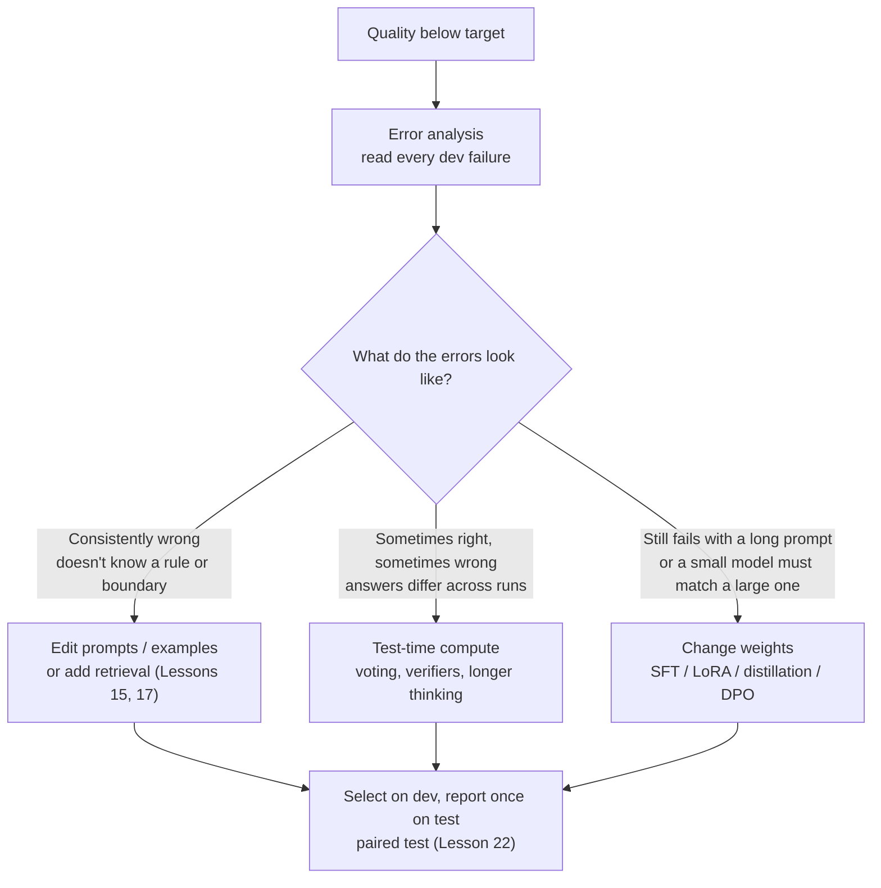
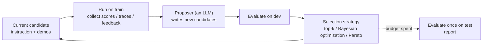

[中文](README.md) | [English](README.en.md)

# Lesson 23: Optimization — prompt optimization, test-time compute, and when to fine-tune

> 🕐 Time: 25 min | 🎯 You'll be able to: when an agent "isn't good enough", choose between editing prompts, adding test-time compute, and changing weights for a concrete reason; optimize prompts automatically with BootstrapFewShot, OPRO, and GEPA-style reflection; and tell a real improvement from noise | 📦 Source: [`optkit.py`](optkit.py) (optimizers, test-time compute, significance), [`ticket_task.py`](ticket_task.py) (task, data, offline simulated model), [`agentkit/evals.py`](../../agentkit/evals.py), [`agentkit/workflows.py`](../../agentkit/workflows.py)
>
> 📖 Required reading: [GEPA: Reflective Prompt Evolution Can Outperform Reinforcement Learning](https://arxiv.org/abs/2507.19457) (Agrawal et al., ICLR 2026 Oral)

## 0. In one sentence

**Optimization is not "tweak the prompt until it feels better". It is a search driven by eval scores, under a fixed data split and a budget: change the cheapest, most reversible thing first (prompts and examples), then consider spending more compute at inference time, and touch the model weights last.**

Back to the IT help desk from Lesson 11. The ticket classifier scores 80% on dev, and the product team wants 90%+. You open the prompt and add "printer issues go to hardware", then run the evals: two tickets fixed, one broken. You add another line... Two days later the prompt is three times longer, and nobody can say which lines matter and which ones just memorize the eval set.

This lesson hands that loop to an **optimizer**. It reads eval results, proposes new prompts, picks the best one on dev, and reports on test exactly once. We ran the demo against a real model (gpt-5.5). The results were mixed:

- **Baseline** (an instruction that only lists the category names): 80% on dev, 80% on test. Of the 8 company rules, gpt-5.5 guessed half from common sense;
- **The three optimizers** raised dev by at most 5 points (a single ticket) and **none of them improved test**; BootstrapFewShot even lost 10 points. The paired-bootstrap 95% confidence intervals are ±20–25 points wide;
- **Post-hoc analysis**: GEPA actually learned the right rules. Two other instructions in its candidate pool reached 95% and 100% on test, but they tied with the selected one on the 20 dev tickets (all 85%). Under the "ties go to the first one" rule, the pick was the one with the fewest rules and one wrong rule still in it. **The bottleneck wasn't the optimizer; it was a 20-ticket dev set that couldn't tell good from bad**;
- **Test-time compute**: 5-sample voting, best-of-5, even the "perfect verifier" ceiling all stayed at 80%. For rules the model doesn't know, all 5 samples were unanimously wrong;
- **Cost**: the optimized prompt grew from 127 to 811 tokens per call (GEPA), roughly 6× the input cost of every call.

None of this is a bug. It is what optimization normally looks like. This lesson covers three things: **the ways to make a system better, what each one costs, and how to confirm it really got better.**

This lesson builds on three others and doesn't repeat them: [Lesson 21](../21_agent_data/README.en.md) covers where data comes from, how to split it, and how to prevent leakage; [Lesson 22](../22_eval_methodology/README.en.md) covers how to decide whether an improvement is significant; [Lesson 11](../11_evals/README.en.md) covers the `agentkit.evals` framework. The "optimization" in [Lesson 14](../14_cost_latency/README.en.md) is about cost and latency. This lesson is about **quality**.

## 1. Core concepts

### 1.1 Three levers: prompts, test-time compute, weights

| Lever | What changes | Cost of one change | Time to effect | How to roll back | Best at fixing |
|---|---|---|---|---|---|
| Prompts and examples | Instruction text, few-shot demonstrations | Tens to hundreds of model calls to run evals | Minutes | Restore the old text | Rules, boundaries, and formats the model **doesn't know** (knowledge and convention gaps) |
| Test-time compute | How many samples per request, which verifier, how long the model may think | Every request's cost and latency multiplied by N | Immediately, it's a parameter | Set N back | Errors where the model is **right sometimes and wrong other times**; tasks whose answers can be verified reliably |
| Weights | Model parameters: SFT, LoRA, distillation, DPO... | Data curation + training + evaluation + deployment | Hours to days | Switch back to the old model version, which you now have to manage | Stable, high-volume formats and styles; moving a large model's quality onto a smaller, cheaper model |

**Test-time compute**: keep the model parameters fixed and spend more compute at inference time, for example by sampling several times and voting, letting a verifier pick the best candidate, or letting a reasoning model think longer. **SFT** (supervised fine-tuning): keep training the model on "input → desired output" examples. LoRA, distillation, and DPO are covered in section 1.6.

Do **error analysis** first, then pick a lever. Different errors call for different levers:



### 1.2 How to choose: a decision table

| Your situation | Consider first | Why |
|---|---|---|
| **Data**: only a few dozen labeled examples | Prompt optimization | A few dozen examples make a usable dev set; fine-tuning usually needs hundreds or more high-quality examples |
| **Data**: thousands of high-quality trajectories, stable distribution | Fine-tuning or distillation becomes an option | The data covers the long tail, and the prompt can no longer hold that many patterns |
| **Tight latency and cost budget**, high traffic | Prompt optimization, then maybe distill into a small model; be careful with test-time compute | Test-time compute multiplies the cost of **every** request by N; prompt optimization and fine-tuning are one-time investments |
| **Latency-tolerant, verifiable answers** (code, SQL, math, extraction with ground truth) | Test-time compute + a verifier | Best-of-N pays off most when a reliable verifier exists |
| **High controllability and auditability requirements** (finance, healthcare, compliance) | Prompt optimization | An instruction is text people can read, diff, and approve; behavior baked into weights can only be shown indirectly through evals |
| **Using a closed API model** | Prompt optimization + test-time compute; for fine-tuning, first check whether the vendor still offers it (see 1.6) | You can't change someone else's weights, and fine-tuning APIs can be shut down |
| **The team** has no ML engineering capacity | Prompt optimization | You only need an eval set and an optimizer; fine-tuning also needs a data pipeline, training, model versioning, and deployment |

The levers combine. In [*Fine-Tuning and Prompt Optimization: Two Great Steps that Work Better Together*](https://aclanthology.org/2024.emnlp-main.597/) (EMNLP 2024), Soylu, Potts, and Khattab tried combinations like this: optimize the prompt, use the optimized program to bootstrap training trajectories and fine-tune the same model on them, then optimize the prompt again for the fine-tuned model. They compared 8 combinations on three tasks (HotPotQA, GSM8K, Iris) and three 7B/8B open models (Mistral-7B, Llama-2-7B, Llama-3-8B). In the abstract's words, averaged across models and tasks, optimizing both beats optimizing weights alone and prompts alone by up to 60% and 6%, respectively. In 7 of the 9 task × model combinations, the best strategy used both. The paper also says clearly that there is no clear winner among the combination orders, so don't treat "prompt, then fine-tune, then prompt" as a law.

### 1.3 Every prompt optimizer runs the same loop



Methods differ in only three places:

1. **What the proposer sees**: only an aggregate score? Or the full trace and written feedback for every failure? The more specific the information, the more targeted each proposal, and the fewer evaluations you need;
2. **What it changes**: the instruction, the examples, or both;
3. **How it selects**: keep the top few, use a surrogate model to predict which combination will score well, or keep a set of candidates that are each good at something different.

The data rules are fixed (Lesson 21): **train** produces examples and feedback, **dev** selects candidates, **test** is evaluated once at the end. The moment you go back and edit the prompt because of a test result, test becomes a second dev set, and its score can no longer be trusted.

### 1.4 Prompt optimization: how five methods work

| Method | Source | What it changes | What the proposer sees | How it selects | Intuition in one line |
|---|---|---|---|---|---|
| BootstrapFewShot | DSPy (Khattab et al., ICLR 2024) | Examples | Traces where the program **succeeded** on training data | Random combinations, best on dev | Copy the problems you solved as worked examples |
| OPRO | Yang et al., ICLR 2024 | Instruction | Past instructions and their **aggregate scores** | Keep the top few | Guess the next draft from a report card |
| MIPROv2 | Opsahl-Ong et al., EMNLP 2024 | Instruction + examples | Data summary, program structure, bootstrapped examples | Surrogate model (Bayesian optimization) picks combinations | Tune "write the instruction" and "pick the examples" together, like hyperparameters |
| TextGrad | Yuksekgonul et al., Nature 2025 | Any text variable (prompt, answer, code...) | Written critiques from an LLM ("textual gradients") | Update step by step from the critique | Backpropagation with the gradient replaced by a critique |
| GEPA | Agrawal et al., ICLR 2026 | Instruction (each module of a multi-module program) | **Full traces + written feedback** on failures | Pareto front + frequency-weighted sampling | Review the mistakes like a person would, then rewrite the rules |

**BootstrapFewShot** ([DSPy](https://arxiv.org/abs/2310.03714)). To "bootstrap" is to produce your own training data: run the current program (or a stronger "teacher" program) over the training set, keep only the runs that pass the metric, and use each step's inputs and outputs as examples. Its value is that labeled data usually contains only the final answer, while a successful trace also carries the intermediate reasoning. Its limitation shows up clearly in this lesson's demo: **the only problems that make it into the example pool are the ones the program could already solve**.

**OPRO** ([Large Language Models as Optimizers](https://arxiv.org/abs/2309.03409)). An LLM acts as the optimizer. The meta-prompt (the prompt written for the optimizer) contains past instructions with their scores (the paper sorts them in **ascending** order and keeps the best 20) plus a few randomly drawn task examples. At each step the optimizer generates 8 new instructions, which are evaluated and added to the history. The paper reports that the best prompts OPRO found beat human-designed prompts by up to 8% on GSM8K and up to 50% on Big-Bench Hard. Its weakness is that the optimizer **only sees aggregate scores**. It has no idea which examples failed, so it searches blindly and needs a lot of evaluations.

**MIPROv2** ([Optimizing Instructions and Demonstrations for Multi-Stage Language Model Programs](https://aclanthology.org/2024.emnlp-main.525/)). Three steps: ① bootstrap candidate examples; ② have an LLM read a data summary, the program code, and the examples, and write a batch of candidate instructions (the paper calls this grounded proposal); ③ use Bayesian optimization (Optuna's TPE) to search the "instruction × examples" space, evaluating each trial on a small minibatch and letting a surrogate model (a cheap model that predicts roughly how well a combination will score) decide what to try next. The paper reports that with Llama-3-8B it beat baseline optimizers on 5 of 7 multi-stage programs, improving accuracy by up to 13%.

**TextGrad** ([arXiv 2406.07496](https://arxiv.org/abs/2406.07496), later published in [Nature 2025](https://www.nature.com/articles/s41586-025-08661-4)). It treats the system as a computation graph. An LLM writes a critique for each node ("this prompt never asks the model to check units"), and the critiques are "backpropagated" through the graph to update upstream variables. The paper reports that GPT-4o's zero-shot accuracy on GPQA rose from 51% to 55%, and LeetCode-Hard solutions improved by 20% (relative).

**GEPA** (this lesson's required reading). The name comes from Genetic-Pareto. The mechanism breaks down into four steps:

1. **Pick a parent**: for **each** example in dev (D_pareto in the paper), find the candidates with the best score on that example. Candidates that are best on at least one example form the Pareto front, and one is sampled with probability proportional to how many examples it is best on;
2. **Run a minibatch**: take a small batch from the training set (D_feedback in the paper), run the parent, record full traces (reasoning, tool calls, tool outputs), and let a feedback function write textual feedback (for example compiler errors or failed rubric items);
3. **Reflective mutation**: give "current instruction + traces + scores + feedback" to a reflection model, which diagnoses the failures and writes a new instruction. Multi-module programs update one module at a time, round-robin;
4. **Two-stage acceptance**: the new instruction must first **improve** on the same minibatch; only then is it evaluated on the full dev set and added to the candidate pool.

A "System Aware Merge" variant combines the best version of each module from different lineages into a new candidate. The paper runs experiments with Qwen3 8B and GPT-4.1 Mini on six tasks: HotpotQA, IFBench, HoVer, PUPA, AIME-2025, and LiveBench-Math. Results: GEPA beats GRPO (a reinforcement learning method; the baseline used 24,000 rollouts) by about 6 percentage points on average and by up to about 20, while using up to 35× fewer rollouts. It beats MIPROv2 by more than 10 points (e.g., +12 on AIME-2025), and its prompts are up to 9.2× shorter than MIPROv2's. In the ablation, Pareto-based parent selection beats "always pick the current best candidate" by up to 8.17 points.

**Why a Pareto front**: say instruction A is good at security tickets and instruction B is good at hardware tickets, and both average 80%. Keep only the top average and you throw away what the other one learned, and the search tends to get stuck in a local optimum. The Pareto front is "the candidates that nobody beats across the board": A dominates B if and only if A is at least as good as B on every example and strictly better on at least one.

### 1.5 Test-time compute: when "thinking longer" beats "a bigger model"

Test-time compute comes in three common forms:

| Approach | How it works | Prerequisite | Representative work |
|---|---|---|---|
| **Best-of-N + verifier** | Sample N candidates, score them with a verifier, keep the highest | A verifier more reliable than the generator | Cobbe et al. 2021 (which introduced GSM8K) found that training a verifier to pick among candidates was worth roughly a 30× larger model; the process reward model (PRM, scores each step) in Lightman et al. (ICLR 2024) beat a reward model that only looks at the final result |
| **Self-consistency** | Sample N reasoning paths and take a majority vote on the **final answer** | Answers are discrete and comparable (choices, numbers, categories) | Wang et al., ICLR 2023: 17.9 points above greedy chain-of-thought on GSM8K |
| **Longer thinking / sequential revision** | Let a reasoning model think longer, or let the model revise its previous answer step by step | The model supports a thinking budget or can revise | Snell et al., ICLR 2025 |

**The core findings of Snell et al.** ([Scaling LLM Test-Time Compute Optimally can be More Effective than Scaling Model Parameters](https://arxiv.org/abs/2408.03314), ICLR 2025). They studied two mechanisms with PaLM 2-S* on MATH: searching against a process reward model (best-of-N, beam search, lookahead search), and having the model sequentially revise its own answers. Three conclusions:

1. Which method works best **depends strongly on problem difficulty**. Allocating strategy and budget per problem by difficulty (the paper calls this compute-optimal) is more than 4× as efficient in test-time compute as a best-of-N baseline;
2. At matched total FLOPs, test-time compute on a small model can beat a 14× larger model, **but only on problems where the small model already has a non-trivial success rate**;
3. On the **hardest** problems, more test-time compute barely helps, and spending the compute on a bigger model (more pretraining) is more effective. In the paper's words, test-time and pretraining compute are "not 1-to-1 exchangeable".

As engineering decisions:

- **Medium per-question accuracy (the model can do it but not reliably) and a reliable verifier**: raising N pays off;
- **Per-question accuracy near 0 (the model simply doesn't know, e.g., a company rule)**: raising N does nothing. Edit the prompt, add knowledge, or use a stronger model. Scenario 6 of this lesson's demo shows exactly this: for rules the model doesn't know, all 5 samples are **unanimously** wrong;
- **Below 50% per-question accuracy, majority voting amplifies the error**: the few lucky correct samples get outvoted;
- **The verifier sets the ceiling**: a verifier that only checks format can't pick out correct answers. And aggressive best-of-N against an imperfect verifier is itself optimization that can game the verifier. Gao et al. (ICML 2023) found that over-optimizing a reward model lowers true quality, with both RL and best-of-n.

**The cost trade-off from Lesson 14**: test-time compute is **paid per request**. N samples multiply each request's cost by N. Parallel sampling takes as long as the slowest of the N calls, so it amplifies the long tail (the p99 problem in section 1.2 of Lesson 14); sequential revision multiplies latency by the number of rounds. Prompt optimization and fine-tuning are **one-time investments**, after which per-request cost depends only on prompt length. The higher the traffic, the better the one-time investment looks.

### 1.6 Fine-tuning decisions: concepts only

**When fine-tuning is worth it** (the more of these hold at once, the stronger the case):

1. **Stable, high-volume formats and styles**: the same output structure is generated hundreds of thousands of times a day;
2. **Latency- and cost-sensitive**: you want "small model + short prompt" to deliver what "large model + long prompt" delivers;
3. **Enough data**: hundreds to thousands of high-quality examples (or ones you can filter out of large-model traces), with a stable distribution;
4. **Prompt optimization has plateaued**: too many rules to fit in a prompt, or the model can't learn them even when they're written down.

**Don't fine-tune** when knowledge changes often (use retrieval, Lessons 15 and 17), when rules change often (use prompts, which take effect immediately), when you only have a few dozen examples, or when you're on a closed model with no fine-tuning API.

**The intuition behind LoRA**. Full fine-tuning updates every weight matrix $W$ (say 4096×4096, about 16.78 million parameters). LoRA (Low-Rank Adaptation) freezes $W$ and learns only a correction $\Delta W = BA$, where $B$ is 4096×r and $A$ is r×4096. With r = 8 that is only $2 \times 4096 \times 8 = 65{,}536$ parameters, about 0.4% of the original. The intuition: the change needed to adapt to a new task is itself "low-rank", so you don't need to touch every parameter. The paper ([Hu et al., ICLR 2022](https://arxiv.org/abs/2106.09685)) reports 10,000× fewer trainable parameters and 3× less GPU memory than fully fine-tuning GPT-3 175B with Adam. After training, $BA$ can be merged back into $W$, so inference has no extra latency. **QLoRA** ([Dettmers et al., NeurIPS 2023](https://arxiv.org/abs/2305.14314)) additionally quantizes the frozen base to 4 bits (the NF4 format), so a 65B model can be fine-tuned on a single 48GB GPU.

**Distillation: large-model traces → small model**. The term comes from [Hinton et al. 2015](https://arxiv.org/abs/1503.02531): train a small model on the probability distributions ("soft targets") a large model outputs. In LLM applications the more common recipe is: run a large model (or a large model with a good prompt) over lots of inputs, keep the traces a verifier accepts, and use them to SFT (supervised fine-tune) a small model. That collection step is exactly the one in BootstrapFewShot. The only difference is whether the filtered traces go into the prompt as examples or into the weights (DSPy's optimizer for the latter is BootstrapFinetune). [DeepSeek-R1](https://arxiv.org/abs/2501.12948) curated about 800K samples with R1 and used them to SFT small Qwen and Llama models directly. The resulting R1-Distill-Qwen-32B clearly beat large-scale RL applied directly to the Qwen-32B base on every benchmark. The authors conclude that distilling a strong model into a small one is cheap and effective, but pushing past the capability frontier still needs stronger base models and larger-scale RL.

**The intuition behind DPO**. Some qualities are hard to capture as a "correct answer", but people can compare "A is better than B". The classic RLHF pipeline first trains a reward model on preference data, then optimizes the policy with reinforcement learning (PPO). **DPO** (Direct Preference Optimization, [Rafailov et al., NeurIPS 2023](https://arxiv.org/abs/2305.18290)) shows the problem reduces to a classification-style loss trained directly on preference pairs: given (prompt, better response, worse response), raise the probability of the better response and lower that of the worse one, relative to a frozen reference model. It needs no separate reward model and no repeated sampling during training.

**Fine-tuning APIs for closed models today** (official docs checked in September 2026; this changes fast, so check again before you rely on it):

| Vendor | Status |
|---|---|
| OpenAI | The docs list SFT, vision fine-tuning, DPO (gpt-4.1 family and others), and reinforcement fine-tuning, RFT (o4-mini). But the top of the [official docs](https://developers.openai.com/api/docs/guides/model-optimization) says OpenAI is **winding down** the fine-tuning platform. The timeline on the [deprecations page](https://developers.openai.com/api/docs/deprecations): from 2026-05-07, organizations that have never run fine-tuning can't create jobs; from 2026-07-02, organizations that haven't run inference on a fine-tuned model in the past 60 days can't create jobs; from 2027-01-06, no customer can create new jobs. Existing fine-tuned models keep serving inference until their base model is deprecated |
| Google | Google Cloud offers [supervised fine-tuning](https://docs.cloud.google.com/gemini-enterprise-agent-platform/models/tuning/supervised-tuning) and [preference tuning](https://docs.cloud.google.com/gemini-enterprise-agent-platform/models/tuning/preference-tuning) for some Gemini models (formerly Vertex AI docs, now under Gemini Enterprise Agent Platform). Check the docs for which models are supported |
| Anthropic | The Claude API does **not** currently offer fine-tuning (the [official glossary](https://platform.claude.com/docs/en/about-claude/glossary) suggests asking your Anthropic contact). Amazon Bedrock made [Claude 3 Haiku fine-tuning generally available on 2024-11-01](https://aws.amazon.com/about-aws/whats-new/2024/11/fine-tuning-anthropics-claude-3-haiku-amazon-bedrock/), but the model entered Legacy status on 2026-03-10 (under Bedrock's policy, no new fine-tuning jobs can be created on Legacy models) and reached EOL on 2026-09-10 ([Bedrock model lifecycle](https://docs.aws.amazon.com/bedrock/latest/userguide/model-lifecycle-legacy.html)) |

For closed-model users the takeaway is simple: **prompt optimization and test-time compute are the two levers you always have**. If you want the fine-tuning route, the more realistic option is often to distill into an open model whose weights you control.

### 1.7 Overfitting, leakage, and gaming the grader

**Optimize on dev, report on test**. The optimizer picks the highest dev score among K candidates, and that maximum is **biased upward**: each candidate's dev score is "true quality + noise", and the maximum tends to be the one whose noise happened to be positive. This is the **winner's curse**. The larger K and the smaller dev, the larger the bias. So dev scores are for **choosing**, not for **reporting**. Report on a test set that played no part in the choice, and use it once. The summary table in this lesson's demo compares Δdev against Δtest for exactly this reason.

**Memorization**. Training examples the optimizer sees can be copied verbatim into the instruction ("e.g. 'my USB drive does nothing when I plug it in' is security"). That isn't leakage, but it shows the optimizer is memorizing specific tickets instead of summarizing rules. Worse is when dev or test text ends up in the instruction or examples. That is **leakage**, and the scores stop meaning anything (Lesson 21). This lesson's demo uses `verbatim_overlap` to check automatically whether any ticket text from any split was copied into the instruction.

**Gaming the grader** (reward hacking / specification gaming: satisfying the letter of the scoring rule while missing its intent). The optimizer only cares about the score, and if the grader has a loophole it will find it:

| Example | What happened |
|---|---|
| If this lesson's grader were "correct if the correct category name appears anywhere in the output" | An instruction like "list all 7 categories, then give your conclusion" would score 100%. That is why `parse_label` extracts exactly **one** answer (the category on the `类别：` ("Category:") line, or the last category mentioned if that line is missing), and why the output format is split out of the optimizable instruction and held fixed |
| LLM judges prefer longer answers | [Length-Controlled AlpacaEval](https://arxiv.org/abs/2404.04475) (Dubois et al., COLM 2024) corrects for length specifically; [Zheng et al., ICLR 2025](https://arxiv.org/abs/2410.07137) got an 86.5% length-controlled win rate on AlpacaEval 2.0 with a "null model" that **always outputs the same fixed response**. Optimize against an LLM judge, and the optimizer may well learn to please the judge |
| Coding agents bypassing unit tests | OpenAI's [Baker et al. 2025](https://arxiv.org/abs/2503.11926) documented coding agents in RL training calling `exit(0)` to quit before the tests ran, raising `SkipTest` to skip them, and even rewriting libraries the test harness depends on |
| Classic RL cases | DeepMind's [Specification gaming](https://deepmind.google/blog/specification-gaming-the-flip-side-of-ai-ingenuity/) collects about 60 cases, such as a boat in a racing game that circles in place, hitting the same reward targets over and over |

**Defenses**:

1. Give each of the three splits its own job and use test once; rerun with different random seeds to see if the gain holds;
2. Combine graders: rule checks (format, length caps, required tool calls) + LLM judge + regular human spot checks (Lessons 11 and 22);
3. Limit what the optimizer may change: "contracts" like the output format and safety rules are not the optimizer's to edit;
4. Check automatically for memorization and leakage; review the before/after instruction diff by hand, like a code review;
5. Monitor the optimized prompt's length and per-call cost: optimizers readily trade longer and longer prompts for a few points.

## 2. Building it from scratch

All the code is in [`optkit.py`](optkit.py) and depends only on the standard library and agentkit.

### 2.1 The thing being optimized: separate what may change from what may not

```python
class Program:
    """instruction (optimizable) + demos (optimizable) + output_format (a fixed format contract)"""

    def messages(self, x: str) -> list[Message]:
        system = self.instruction + (f"\n\n{self.output_format}" if self.output_format else "")
        msgs = [{"role": "system", "content": system}]
        for d in self.demos:  # demos go in as user / assistant turns
            msgs.append({"role": "user", "content": f"{self.input_prefix}{d.input}"})
            msgs.append({"role": "assistant", "content": d.output})
        msgs.append({"role": "user", "content": f"{self.input_prefix}{x}"})
        return msgs
```

**Why split out the output format**: optimizers rewrite whole instructions. If the format requirement lived in the instruction, a rewrite could drop "put `类别：xxx` on the last line", parsing would fail everywhere, and the score would collapse. DSPy does the same thing: a signature fixes the input and output fields, and optimizers only touch instructions and examples. This is also the concrete form of "limit what the optimizer may change" from section 1.7.

OPRO and GEPA don't depend on `Program` directly. They depend on a very small interface (BootstrapFewShot changes the examples, so it uses `ProgramTask` directly):

```python
class Task(Protocol):
    async def run(self, instruction: str, examples: Sequence) -> list[Record]: ...

@dataclass
class Record:
    input: str
    output: str       # raw model output (with reasoning) = the "trace" the optimizer can see
    score: float
    feedback: str = ""
```

`ProgramTask` wraps "program + metric + feedback function" as a `Task`; `AgentTask` in section 2.8 wraps an agent as a `Task`. **The instruction optimizers only talk to this interface**, so switching tasks, or switching to an agent, requires no change to the optimizers.

`run` is async: the examples in one evaluation are independent, so `ProgramTask` sends them out concurrently on one event loop with `agentkit.workflows.parallel` (`max_concurrency`, 2 on the shared gateway) and returns results in example order; if an example's model call still fails after retries, it scores 0 and is counted in `errors` instead of stopping the whole evaluation. The optimizers themselves evaluate **one candidate after another**: each evaluation is already concurrent inside, and stacking another layer of concurrency would exceed the gateway quota. The demo also wraps the real model in `ResilientLLM(max_concurrency=2)` as a master switch: however much concurrency sits above it, at most 2 requests are on the wire at once.

### 2.2 Keep the books before you optimize

```python
class MeteredLLM:
    async def chat(self, messages, tools=None, **kwargs):
        ...                                     # in-flight count +1, note the start time
        resp = await self.llm.chat(messages, tools, **kwargs)
        ...                                     # in-flight count -1
        self.calls += 1                         # no await between read and write: no lock needed
        self.usage = self.usage + resp.usage
        self.cost_usd += estimate_cost(resp.usage, resp.model or self.model)
        return resp
```

**Why no lock?** The earlier version evaluated concurrently with a thread pool, and `MeteredLLM` held a `threading.Lock`: a thread can be switched out between any two bytecodes, so a read-modify-write like `self.calls += 1` could lose counts. Now every call is a coroutine on the same event loop, and coroutines only give up control at `await`. There's no `await` in the three lines after `await self.llm.chat(...)` returns, so no other coroutine can cut in; they're atomic. Only "read → `await` something else → write back" needs an `asyncio.Lock`. [`test_exercise.py`](test_exercise.py) has a test with 40 coroutines calling the same `MeteredLLM` at once: the in-flight peak is 40 (really concurrent), and the call and token counts are exact. The same goes for `ProgramTask.errors`, whose lock is also gone.

**Why keep separate books**: optimization is **buying quality with money**. Report "+15 points of accuracy" without "300 calls spent" and you can't compare it fairly with "use a bigger model" or "sample a few more times". The demo wraps the task model and the optimizer in separate `MeteredLLM`s and snapshots them before and after each step; the difference is that step's spend. It sits outside `ResilientLLM` (Lesson 08), so it counts **logical calls**, and retries aren't double-counted.

### 2.3 BootstrapFewShot

The core is a single loop (exercise b has you write it, as an async function):

```python
for ex in trainset:
    try:
        out = await program(ex.input)            # finish one await before starting the next
    except Exception:
        continue                                 # rate limit, timeout: skip this one
    if float(metric(ex, out)) >= threshold:
        demos.append(Demo(ex.input, out))        # the program's own output (with reasoning), not the gold label
        if len(demos) >= max_demos:
            break                                # stop once you have enough; don't spend more
```

**No concurrency here, on purpose**: `asyncio.gather` would send the whole training set at once, and requests already sent can't be recalled, so "stop once you have enough" would save nothing. A test checks this with a fake program: after 2 demos are collected, the remaining examples are never called, and there's never more than 1 call in flight.

`bootstrap_fewshot` adds a random search on top: candidate 0 is the first k in order, the other candidates are k demos drawn after a seeded shuffle, and each set is evaluated on dev, keeping the best. It needs the whole pool anyway, so it runs the whole training set **concurrently** first and then filters in training-set order, which gives exactly the same result as calling `bootstrap_demos` sequentially (the test makes completion order differ from send order; the results with concurrency 1 and 4 match item by item, and candidate 0 equals the result of calling `bootstrap_demos` sequentially).

### 2.4 OPRO

```python
for r in range(1, rounds + 1):
    top = select_topk(history, keep_top)                  # exercise a
    shown = rng.sample(exemplars, n_exemplars)            # a few different task examples each round
    prompt = opro_meta_prompt(task_description, shown, top, per_round)
    proposals = (await complete_json(optimizer_llm, prompt, Proposals)).instructions
    for ins in proposals[:per_round]:
        await score(ins, r)                               # full evaluation on dev (concurrent inside), written back to history
```

Three details:

1. **History sorted by ascending score**: as in the paper, the best instruction sits closest to "write a new instruction";
2. **Deduplication**: `select_topk` treats instructions that differ only in leading/trailing whitespace as the same; `score` skips instructions already evaluated, so nothing is paid for twice;
3. **Differences from the paper**: the paper calls the optimizer 8 separate times per step and runs for over a hundred steps; here each round makes one call that writes 3 instructions, for 2 rounds. That saves calls at the cost of a coarser search.

### 2.5 GEPA-style reflection and the Pareto front

Parent selection follows the paper exactly:

```python
def gepa_select_parent(pool_scores, rng):
    freq = {}
    for j in range(n_items):                              # each dev example
        top = max(s[j] for s in pool_scores)
        for i, s in enumerate(pool_scores):
            if s[j] == top:
                freq[i] = freq.get(i, 0) + 1              # candidate i is "best" on example j
    front = [int(n) for n in pareto_front({str(i): pool_scores[i] for i in sorted(freq)})]  # exercise c
    parent = rng.choices(front, weights=[freq[i] for i in front], k=1)[0]
    return parent, front, {i: freq[i] for i in front}
```

Each iteration of the main loop: run the parent on a minibatch of training examples → skip if it gets them all right (nothing to learn) → give the traces and feedback to the reflection model → evaluate the new instruction on dev only if it **strictly improves** on the same minibatch. The second gate saves a lot: a candidate that didn't improve costs a few minibatch calls, not the 20 calls of a full dev run. When the iterations are done, the candidate with the best average dev score is returned; **ties go to the one that appeared first** (usually also the shorter, cheaper one). This tie-break rule turned out to be decisive in the real run in section 3.

Feedback is the fundamental difference between GEPA and OPRO. This lesson's feedback function says more than right or wrong; it includes the **annotation note**:

```python
def feedback(ex, output):
    pred = parse_label(output)
    if pred == ex.label:
        return f"Correct ({ex.label})."
    return f"Wrong: the gold label is {ex.label}, the model gave {pred}. " + (f"Annotation note: {ex.note}" if ex.note else "")
```

An annotation note is the reason a labeler jotted down while labeling, e.g. "the company blocks USB drives with a DLP policy, so these go to security". It's the cheapest high-quality feedback there is: writing down a reason while labeling costs almost nothing extra, and here it becomes the optimizer's best material (see Lesson 21 for how data is collected and labeled).

We left out the paper's "System Aware Merge": this lesson's program has only one module, so merging means nothing.

### 2.6 Test-time compute

```python
def self_consistency(answers):
    winner = majority_vote(list(answers))                 # reuses agentkit.workflows.majority_vote
    return winner, Counter(a.strip() for a in answers)[winner] / len(answers)

def best_of_n(candidates, verifier):
    scores = [float(verifier(c)) for c in candidates]
    best = max(range(len(candidates)), key=lambda i: (scores[i], -i))
    return candidates[best], scores
```

Two design points:

1. **Vote on the parsed final answer, not the whole output**: the reasoning is worded differently every time; only the answers can agree;
2. **The agreement rate is a signal in itself**: if only 2 of 5 votes agree, the model isn't sure, which makes the request a good candidate for a human or an escalation to a bigger model (the cascade from Lesson 14).

The demo samples each example only once, then computes "single sample, vote, best-of-N" from the same set of samples. That keeps the comparison fair and saves calls.

**Send the N samples at once**:

```python
async def sample_n(fn, n, max_concurrency=None):
    return await _run_all([fn] * n, max_concurrency or n)   # fn returns a new coroutine each time; all n go out together
```

Sampling one after another, the user waits for the sum of N calls; sending them together, the user waits only for the slowest one, and the number of calls (the cost) doesn't drop at all. Scenario 6 of the demo measures this with a scripted model with fixed latency (50 ms per call), on the first 4 test tickets with 5 samples each:

```text
   one at a time (concurrency 1)    per-ticket wait  261ms   20 model calls   in-flight peak 1
   5 at once (concurrency 5)        per-ticket wait   53ms   20 model calls   in-flight peak 5
```

With a real model, the gateway quota also applies: this lesson's shared gateway allows only 2 concurrent requests, so 5 samples go out in 3 batches. In a real run on 2026-09-28 (gpt-5.5), a single call averaged 2.4 seconds, and 5 samples per ticket averaged a 6.9-second wait, about 2.8× a single call (one at a time would be 5×). So test-time compute has to be planned together with the concurrency quota: double N and either latency or quota has to grow with it.

### 2.7 Is the improvement real: the paired bootstrap

```python
d = [y - x for x, y in zip(a, b)]                         # how much better b is than a on each example (-1/0/+1)
boots = sorted(sum(d[rng.randrange(n)] for _ in range(n)) / n for _ in range(n_boot))
lo, hi = boots[int(alpha / 2 * n_boot)], boots[int((1 - alpha / 2) * n_boot) - 1]
```

**Paired**: each resample draws example indices, and both systems use the same indices. Hard examples tend to trip up both systems, and pairing cancels out the variance that comes from example difficulty. See Lesson 22 for the theory and more tests. This lesson ships its own small implementation and does not depend on Lesson 22's code.

### 2.8 Plugging into an agent

The same optimizers can optimize an agent's system prompt directly, scored with `run_eval` from Lesson 11:

```python
@dataclass
class AgentTask:
    make_agent: Callable[[str], Agent]        # given an instruction, return a fresh agent
    graders: Sequence[Callable] = ()
    concurrency: int = 4                      # how many cases run at once

    async def run(self, instruction, examples):
        report = await run_eval(lambda: self.make_agent(instruction), examples,
                                list(self.graders) or [rule_grader], concurrency=self.concurrency)
        ...  # feedback = the detail of every failed Check
```

The `Check.detail` produced by Lesson 11's `rule_grader` (for example `期望顺序 ['verify_identity', 'reset_password']，实际 ['reset_password']`, i.e. "expected order [...], actual [...]") is exactly the textual feedback GEPA wants. So your eval set doesn't just block bad releases; it can drive optimization directly.

### 2.9 From this lesson's code to production

| This lesson | In production |
|---|---|
| A single-module program; only one instruction is optimized | Multi-module agents: [DSPy](https://dspy.ai/learn/optimization/optimizers/) optimizers work per module, GEPA updates one module at a time round-robin, and there's a merge operation |
| OPRO: 1 proposal call per round, 2 rounds | Budget set in "number of evaluations" (`max_metric_calls` in the [GEPA library](https://github.com/gepa-ai/gepa)), run until spent |
| 20 dev examples | A much larger dev set (hundreds rather than dozens), or the winner's curse and ties are everywhere; stratify by scenario (see Lesson 21 for splitting) |
| Comparing dev and test by hand | Optimization artifacts (instruction, examples, scores, data version, optimizer version) are versioned together and go through the same review and progressive rollout as code (Lesson 16) |

## 3. Hands-on: run the demo

```bash
.venv/bin/python lessons/23_optimization/demo.py --offline   # offline: deterministic simulated model, a few seconds
.venv/bin/python lessons/23_optimization/demo.py             # real model: about 540 calls, concurrency 2, 14–16 minutes in our runs
```

The task is IT ticket classification: 7 categories, 20 tickets each in train / dev / test. Each split has 8 "trap" tickets, each tied to one of the **company's own rules** (USB drives that don't work go to security, all printer issues go to hardware, software licenses go through access approval...), plus 12 routine tickets. Some rules contradict common sense, so the model can only learn them from the instruction, the examples, or feedback.

Below are excerpts from one real run: gpt-5.5 as both the task model and the optimizer, concurrency 2, 540 calls in total, 962 seconds (that run still used the earlier thread-pool code). On 2026-09-28 we re-ran it with the current async version (same gpt-5.5, concurrency 2): 541 calls, 858 seconds. Its results are shown after Scenario 5 for comparison. (Demo output translated from Chinese.)

**Scenario 1: baseline**

```text
   dev 80%   test 80%   (evaluating dev + test: 40 calls)
   dev by type: routine tickets 12/12, trap tickets 4/8

▶ Dev tickets answered wrong (the optimizer may see dev scores; we don't look at test failures)
   ✗ dv01 T2_printer         gold hardware        model software        New laptop has no printer driver; printing says driver not found.…
   ✗ dv13 T6_browser_plugin  gold security        model software        Could you enable the Grammarly browser extension for me? It won't…
   ✗ dv16 T5_device_request  gold access_request  model hardware        My laptop is five years old, I'd like to request a new one.…
   ✗ dv20 T7_MFA_new_phone   gold password_reset  model access_request  Cracked my phone screen, Authenticator won't open, can't pass…
```

Observation: every routine ticket is right, and every error is one of the company's own rules. The other half of the rules (VPN clients go to vpn, wireless screen casting goes to network...) match common sense, and the model got them right without being told.

**Scenario 2: BootstrapFewShot**

```text
   Example pool: 15 of the 20 training tickets passed and can serve as examples
   Candidate 0: 4 examples → dev 80%
   Candidate 1: 4 examples → dev 80%
   Candidate 2: 4 examples → dev 80%
   Of the 4 selected examples, 1 is a trap ticket (only problems the baseline could already solve make it into the pool)
   Best set: dev 80%   test 70%   optimization spent 80 calls, $0.0936
```

Observation: the three example sets **tie exactly** on dev, so the first one wins by position. The 4 selected examples are tickets like "forgot my password" and "request access to a shared drive" that the model could already handle. They taught no new rule, and two trap tickets the baseline had right on test (a license, wireless casting) flipped to wrong. An earlier run that we stopped partway gave a similar result: 80% on dev, 75% on test.

**Scenario 3: OPRO**

```text
   [round 0] dev 80% ← You are the IT service desk's ticket classifier. Put each ticket into one of these categories:
   [round 1] dev 80% ← You are an enterprise IT ticket triage expert; decide which team should handle it from the employee's description. Classify by the "main need", not by mechanical keyword matching: pass…
   [round 1] dev 70% ← You route IT service requests to exactly one team. First identify the outcome the user wants: reset credentials = password_reset; gain or remove some usage right/…
   [round 1] dev 80% ← You are a high-accuracy IT ticket rule executor. Apply these priorities and boundaries: 1 security incidents first; anything with phishing, trojans, ransomware, viruses, suspicious emails…
   [round 2] dev 85% ← You are an enterprise IT ticket triager. Choose one category by "what the employee needs IT to do now": security has top priority; anything involving phishing/scam emails,…
   [round 2] dev 85% ← As an IT routing expert, classify tickets in this order: 1) if it looks like a security risk, policy control, or compliance block, choose security, including phishing emails…
   [round 2] dev 85% ← Route each IT ticket to the first team able to handle it; avoid mechanical word matching. Boundaries: password_reset = the user has an account but because of a password…

▶ Instruction selected by OPRO
   │ You are an enterprise IT ticket triager. ……risks or security-policy issues such as DLP/compliance blocks and browser plugins or macros blocked by security policy go to security; password_reset is only for recovering login credentials: forgotten or expired passwords, account lockouts, MFA/verification code/authenticator resets; ……hardware is for faults, repairs, replacements, or requests of physical devices……software is for installing/uninstalling/upgrading apps, crashes and errors, configuration, plugins, drivers, licenses……a printer paper jam is hardware; a printer that can't reach the network is network.
   dev 85%   test 80%   optimization spent 120 task-model calls + 2 optimizer calls, $0.2192
```

Observation: OPRO only sees aggregate scores, so it wrote a very detailed instruction from common sense and 3 training examples. A few of its rules happened to match the company's (DLP and plugin blocks go to security, MFA goes to password_reset) and fixed two tickets. Others are **the exact opposite** of the company's rules (device requests go to hardware, drivers and licenses go to software, "a printer that can't reach the network is network") and broke two tickets the baseline had right. In round 2, the three candidates tied on dev again.

**Scenario 4: GEPA-style reflection**

```text
   [iteration 1] parent #0 (front [0]) scored 4/5 on the minibatch, 1 failure
             diagnosis: the current instruction only lists category names, with no boundaries or priorities, so the model went by surface symptoms and filed "peripheral not responding" as hardware. The generalizable rule the failure reveals: removable storage such as USB media, external drives, and USB sticks that can't be used, are disabled, or need…
             new instruction scored 5/5 on the minibatch → accepted as candidate #1, dev 85%
   [iteration 2] parent #1 got all 5 right on this batch → nothing to learn, skip
   [iteration 3] parent #1 (front [1]) scored 2/5 on the minibatch, 3 failures
             diagnosis: the failures come from three kinds of missing or misleading boundaries: 1. the network/hardware boundary is unclear. The current instruction lists "network ports" etc. under hardware, which leads the model to file desk ports, wall sockets, dark port lights and other office network access points as hardware…
             new instruction scored 5/5 on the minibatch → accepted as candidate #2, dev 85%
   [iteration 4] parent #2 (front [1, 2]) scored 4/5 on the minibatch, 1 failure
             diagnosis: the current instruction limits access_request mainly to "access/usage rights" like accounts, systems, permissions, and licenses, and doesn't cover requests for physical IT assets or office equipment: requesting, assigning, borrowing, transferring, returning, purchase approval; meanwhile hard…
             new instruction scored 5/5 on the minibatch → accepted as candidate #3, dev 85%

▶ Candidate pool (dev scores)
   #0  dev  80%  (seed, iteration 0)
   #1  dev  85%  (parent #0, iteration 1)
   #2  dev  85%  (parent #1, iteration 3)
   #3  dev  85%  (parent #2, iteration 4)
   ...
   dev 85%   test 80%   optimization spent 95 task-model calls + 3 optimizer calls, $0.2565
```

Observation: the reflection really is **targeted**. Every diagnosis points at specific failing tickets and cites the rule from the annotation note (USB drives go to security, device requests go to access_request). Iteration 3 even caught its own earlier mistake: while writing category definitions, candidate #1 had filed "network ports" under hardware on its own initiative. That was not a company rule; the reflection model made it up. The problem is the last step: all three candidates score 85% on dev, and under "ties go to the first one", #1 is selected, still carrying two wrong definitions ("network ports go to hardware", "licenses go to software").

**Scenario 5: summary and significance**

```text
   Method            dev    test   Δdev   Δtest  optimization calls (task/optimizer)  cost      input tokens/ticket
   ─────────────────────────────────────────────────────────────────────────────────────────────────────────────
   Baseline          80%    80%    +0     +0     -                                    -         127
   BootstrapFewShot  80%    70%    +0     -10    80/0                                 $0.0936   399
   OPRO              85%    80%    +5     +0     120/2                                $0.2192   544
   GEPA reflection   85%    80%    +5     +0     95/3                                 $0.2565   811
   GEPA + examples   85%    80%    +5     +0     195/3                                $0.3888   1083

▶ Significance: paired per-ticket on test, 10,000 bootstrap resamples (vs. baseline)
   Method            Δtest   95% CI            wins/losses   P(gain ≤ 0)
   BootstrapFewShot  -10     [-25, +0]         0/2           1.000  not significant (CI includes 0)
   OPRO              +0      [-20, +20]        2/2           0.597  not significant (CI includes 0)
   GEPA reflection   +0      [-25, +25]        3/3           0.572  not significant (CI includes 0)
   GEPA + examples   +0      [-25, +25]        3/3           0.579  not significant (CI includes 0)

▶ Memorization / leakage check: did any ticket text (10+ consecutive characters) get copied into the optimized instructions?
   OPRO              train 0  dev 0  test 0
   GEPA reflection   train 0  dev 0  test 0
```

Observations:

- The wins/losses column says more than the average: on test, GEPA fixed 3 tickets (MFA, USB drive, browser plugin) and broke 3: a license ticket, a VPN client ticket, and a routine "the network port at my desk is broken" ticket. The last one was most likely pushed off course by the made-up "network ports go to hardware": once #2 below dropped that definition, it came out right;
- By the paired sample-size formula from Lesson 22 (`evalstats.min_sample_size_paired`), when two versions disagree on 30% of tickets, detecting +10 points with 80% power takes about 234 test tickets. Twenty tickets can only reveal very large differences;
- Prompts get longer as they're optimized: GEPA's input per call went from 127 to 811 tokens. After launch, every single call pays for those tokens (Lesson 14).

**Post-hoc analysis: GEPA actually learned the right thing** (40 extra calls, **for understanding only, not for selection**). We also ran pool candidates #2 and #3, which tied on dev, on test:

| Candidate | dev | test | Input tokens per ticket | What it learned beyond the previous candidate |
|---|---|---|---|---|
| #1 (selected) | 85% | 80% | 811 | USB drives go to security; but made up "network ports go to hardware" and still files licenses under software |
| #2 | 85% | 95% | 1351 | Network port problems moved back to network; licenses and seats moved to access_request |
| #3 | 85% | 100% | 1783 | Device requests go to access_request |

This is the most important table in the lesson: **what the optimizer learned is real, but 20 dev tickets can't see it**. On dev one ticket is 5 points, and all three candidates happened to miss exactly 3 tickets, so dev simply cannot show which one is better. Two caveats:

1. Switching to #3 now because of this table would be **selecting on test**, and that 100% would immediately become an optimistic estimate. The right move is to enlarge dev and decide the tie-break rule **in advance** (for example, prefer the later descendant on ties, since each generation strictly beat its parent on a training minibatch; or prefer the shorter one, to control cost), then validate on a fresh test set;
2. Even if #3 really is better, its prompt is 14× the baseline's length. Whether the quality gain is worth that cost is a calculation you make against your call volume.

**Results of the async re-run** (2026-09-28; same data and code logic, model outputs differ every run):

```text
   Method            dev    test   Δdev   Δtest  Opt. calls (task/optimizer)  Opt. cost  Input tokens per ticket
   Baseline          80%    80%    +0     +0     -                            -          127
   BootstrapFewShot  80%    70%    +0     -10    80/0                         $0.0984    394
   OPRO              90%    90%    +10    +10    120/3                        $0.2271    491
   GEPA reflection   95%    90%    +15    +10    95/3                         $0.2420    1758
   GEPA + demos      95%    90%    +15    +10    195/3                        $0.3974    2025
   (OPRO's and GEPA's +10 on test are not significant: 95% interval [-15, +35], 4 wins, 2 losses)
```

This time OPRO and GEPA both gained 10 points on test, but the interval still crosses 0; BootstrapFewShot, as in the earlier run, tied on dev and lost 10 points on test. Both runs point the same way: the improvement may be real, and 20 test tickets can't prove it.

**Scenario 6: test-time compute**

```text
   Method                                              test    calls per ticket
   Single sample                                       80%     1
   Self-consistency: majority of 5                     80%     5
   best-of-5 + format verifier                         80%     5
   best-of-5 + perfect verifier (cheating ceiling, pass@5)  80%     5
   For comparison: GEPA-optimized instruction, 1 sample  80%     1
   Sampling spent 100 calls, $0.1112; 4 tickets were answered wrong unanimously in all 5 samples
```

(This run didn't print latency yet; for the async re-run's latency numbers see section 2.6: with 5 samples at concurrency ≤ 2, each ticket waited 6.9 seconds on average, about 2.8× a single call. In that run 3 tickets were unanimously wrong; same conclusion.)

Observation: even the "perfect verifier" ceiling is 80%, which means that on the 4 tickets it got wrong, the model **never once** answered correctly in 5 samples. It isn't right sometimes and wrong other times; it consistently doesn't know the company rule. This matches Snell et al.'s finding: on problems the model simply can't do, test-time compute buys nothing. The only fix for these errors is to give the model the knowledge (prompt, examples, retrieval).

**Offline mode** uses `SimulatedLLM`: a deterministic toy model that **encodes this lesson's phenomena as explicit rules** (rules it hasn't been taught are usually answered wrong; the OPRO optimizer can only add sentences at random; the GEPA reflector can read the annotation notes). Its numbers only illustrate the flow and say nothing about real models.

After a run, each method's selected instruction, examples, and per-example scores are saved to `lessons/23_optimization/runs/last_run.json` (`last_run_offline.json` in offline mode), so you can see exactly what the optimizers wrote.

## 4. Exercise

Open [`exercise.py`](exercise.py) and implement three functions:

| Task | What to do | How the tests check it |
|---|---|---|
| (a) `select_topk(history, k)` | Pick the top k from an "instruction → score" history: descending score, ties keep first appearance, remove duplicate instructions (differences only in leading/trailing whitespace count as duplicates; keep the highest score and the first-appearance position) | Sorting, ties, dedup (a re-evaluation raised the score), whitespace variants, edge cases for k, input not mutated |
| (b) `async def bootstrap_demos(program, trainset, metric, max_demos)` | `await program(...)` one example at a time in training-set order, collect only passing (input, program output) pairs, stop once full, skip on exceptions | Only passing ones, program output rather than gold label, no calls after the cap, never more than 1 call in flight, no calls when `max_demos=0`, partial scores and threshold, skipping exceptions |
| (c) `pareto_front(candidates)` | Return the names of candidates no other candidate dominates, in input order; identical score vectors don't dominate each other | Domination, trade-offs, identical vectors both kept, identical vectors dominated by a third are both removed, empty input, `ValueError` on length mismatch |

```bash
make lesson N=23
# or: .venv/bin/python -m pytest lessons/23_optimization -v
```

Hints:

- (a) Keep a dict of "instruction → (best score, first index)", then `sorted(key=lambda kv: (-score, index))`;
- (b) `program` is an async function (like `optkit.Program`), so (b) must be `async def`, with `out = await program(ex.input)` in the loop; callers write `demos = await bootstrap_demos(...)`. The tests check which inputs `program` was called with: one extra call after the cap is a failure; they also check how many calls are in flight, so sending everything at once with `asyncio.gather` fails;
- (c) Write `dominates(a, b)` first, and mind "every element ≥ and at least one >": two identical vectors don't dominate each other.

## 5. Going deeper

### 5.1 Why GEPA needs so many fewer rollouts than reinforcement learning

RL methods like GRPO get one scalar reward per rollout and need the statistical signal from thousands of rollouts to move the parameters. GEPA's argument is that language itself is a richer learning signal. One failure with its trace and written feedback lets the reflection model write a rule like "all printer issues go to hardware" directly, which covers a whole class of examples at once. The cost: GEPA only changes prompts, so what it can learn is limited to "rules you can put into words", and by the base model's own capability.

### 5.2 More from Snell et al.

- Easy problems favor **sequential revision** (improving the previous answer); hard problems need a mix of sequential and parallel sampling in the right ratio;
- When searching against a process reward model, beam search does better on hard problems at low budgets, and best-of-N does better on easy problems at high budgets;
- "Allocate by difficulty" requires estimating difficulty first. The paper bins each problem by the base model's pass@1 (estimated from 2048 samples) into 5 difficulty levels; without ground truth, it predicts difficulty from the average verifier score instead. In engineering, Lesson 14's cascade idea carries over directly: answer cheaply once, look at the agreement rate or the verifier result, then decide whether to spend more compute.

### 5.3 Choosing among prompt optimizers

| Situation | Suggestion |
|---|---|
| Just starting, only a few dozen examples | BootstrapFewShot (cheap, and it shows you which problems the program already gets right) |
| Clear textual feedback available (rubrics, compiler errors, rule-check details) | GEPA-style reflection: the more specific the feedback, the bigger the payoff |
| Multi-module program, both instructions and examples need tuning | MIPROv2, or GEPA's multi-module mode |
| Only a scalar score, and evals are cheap | OPRO-style search works, but budget for lots of evaluations |
| The output itself needs improving (a piece of code, an answer) | TextGrad-style per-instance optimization, or an evaluate-then-improve loop at test time (`evaluator_optimizer` from Lesson 05) |

### 5.4 Distillation and BootstrapFewShot are two versions of the same thing

The step "keep the traces a verifier accepts" is identical. The only difference is where the traces go:

- **Into the prompt** (BootstrapFewShot): takes effect immediately and can be changed any time; but every call pays for those example tokens, and context length caps how many examples fit;
- **Into the weights** (BootstrapFinetune / distillation): the prompt can be very short at inference time, and a small model is fast and cheap; but you have to train, manage model versions, and retrain when rules change.

BetterTogether chains the two in exactly this way: prompt optimization first gets the program to produce more and better traces, fine-tuning writes those traces into the weights, and then the prompt is optimized once more for the fine-tuned model.

## 6. Common pitfalls and anti-patterns

- **Selecting candidates on test**: even "take a quick look at test before deciding which version to use" turns test into dev. Reported numbers must come from data that played no part in any selection;
- **A small dev set with many candidates**: pick among 10 candidates on 20 dev examples and the winner's curse will be obvious. Enlarge dev, try fewer candidates, or always report test alongside;
- **No tie-break rule decided in advance**: with a small dev set, ties are the norm (in this lesson's real run, all three optimizers produced tied candidates on dev). How you break ties is a "hyperparameter" that changes the result, and it has to be decided before you look at test;
- **Not reviewing the rules the optimizer wrote**: both the reflection model and OPRO "helpfully" add definitions that sound reasonable but contradict the business rules (in this lesson: "network ports go to hardware", "licenses go to software"). Review an optimized instruction line by line, like code;
- **Reporting accuracy but not cost**: report the calls the optimization spent, and the per-call inference cost of the now-longer prompt;
- **A grader that can be gamed**: "contains the right answer" or a single LLM judge will be exploited by the optimizer. Before shipping a grader, ask: "what does the laziest perfect-score output look like?";
- **Handing the format contract to the optimizer**: the optimizer breaks the output format, and every downstream parser fails;
- **Using test-time compute to fill a knowledge gap**: a rule the model doesn't know won't be learned in 100 samples, and voting will also overrule the few lucky correct answers;
- **Fine-tuning first**: you start curating training data without any error analysis, and it turns out three sentences in the prompt would have done it;
- **Optimize once and forget it**: after a model upgrade or a data distribution shift, an optimized prompt can become a drag; rerun it with the eval set regularly (Lesson 16).

## 7. Interview & design review questions

<details>
<summary>Q1: An agent misses its quality bar. In what order do you consider "edit prompts, add test-time compute, fine-tune"?</summary>

- Start with error analysis: read every dev failure and sort the errors into "consistently doesn't know", "sometimes right, sometimes wrong", and "not capable enough / wrong format";
- Knowledge and rule gaps → edit prompts, examples, or add retrieval: cheapest, fastest, reversible, auditable;
- Random errors with verifiable answers → test-time compute (voting, best-of-N + verifier), but price in N× cost and latency per request;
- Stable formats, high volume, enough data, sensitivity to latency and cost, or a plateau in prompt optimization → fine-tuning or distillation;
- At every step, select on dev, report on test, and use a paired test to decide significance.
</details>

<details>
<summary>Q2: What is the essential difference between OPRO and GEPA? Why does GEPA need fewer evaluations?</summary>

- OPRO's optimizer only sees "instruction → aggregate score"; it doesn't know which examples failed, so it searches blindly, and every candidate needs a full evaluation;
- GEPA's reflection model sees full traces and written feedback on failures, so it can write targeted rules;
- GEPA uses two-stage acceptance: a candidate must improve on a minibatch before the full dev run, so a candidate that doesn't improve costs only a few calls;
- GEPA picks parents from the Pareto front, keeping candidates that are each good at something, which avoids getting stuck in local optima;
- The paper reports GEPA beating MIPROv2 by more than 10 points and GRPO by about 6 points on average, with up to 35× fewer rollouts.
</details>

<details>
<summary>Q3: After optimization, dev went up 15 points but test only 5. What could explain it, and what do you do?</summary>

- Winner's curse: picking the highest dev score among many candidates tends to pick the one whose noise happened to be positive;
- Dev is too small: at 20 examples, one example is 5 points, and candidates tie constantly. In this lesson's real run, GEPA's three candidates all scored 85% on dev, but 80%, 95%, and 100% on test;
- Memorization: the optimizer wrote dev features (or even dev text) into the instruction;
- Remedies: enlarge dev, try fewer candidates, rerun with different seeds to check stability, check for memorization and leakage, and give a confidence interval on test with a paired bootstrap;
- Report only the test number, with its confidence interval.
</details>

<details>
<summary>Q4: When is adding test-time compute more cost-effective than switching to a bigger model?</summary>

- Snell et al.: at matched total FLOPs, test-time compute beats a 14× larger model only on problems where the small model already has a non-trivial success rate; on the hardest problems, a bigger model (more pretraining) is more effective;
- The payoff is biggest with a reliable verifier (code runs its unit tests, SQL executes, answers can be checked);
- At high traffic, do the full accounting: test-time compute is paid per request, N× the cost each time, and parallel sampling amplifies tail latency;
- Below 50% per-question accuracy, majority voting amplifies the error; for problems the model simply can't do, raising N does nothing.
</details>

<details>
<summary>Q5: You're on a closed API model and want "cheaper with no quality loss". What are the routes?</summary>

- Prompt optimization: bring a cheaper model close to an expensive one on your task (this lesson's methods);
- A cascade: the cheap model answers first and escalates when the verifier rejects it (Lesson 14);
- Distill into a small open model: generate traces with the large model + optimized prompt, keep the correct ones, and SFT a small model whose weights you control;
- The vendor's fine-tuning API: first confirm it still exists. For example, OpenAI has announced it is winding down its fine-tuning platform, and the Claude API doesn't offer fine-tuning;
- Whatever the route, use the same eval set and a paired test to show quality didn't drop.
</details>

<details>
<summary>Q6: How do you keep a prompt optimizer from gaming the grader?</summary>

- Ask "what does the laziest perfect-score output look like?" and harden the grader accordingly, e.g. only trust the formatted answer line, cap the length;
- Don't let the optimizer change format contracts or safety rules;
- Combine rule-based scoring, an LLM judge, and human spot checks, and correct LLM judges for biases like length;
- Check for memorization and leakage, and review the before/after instruction diff by hand;
- Monitor the optimized prompt's length and per-call cost;
- Keep a test set the optimizer has never seen, and use it once at the end.
</details>

<details>
<summary>Q7: Why can LoRA fine-tune with so few parameters? What does DPO drop compared to RLHF?</summary>

- LoRA freezes the original weights W and learns only a low-rank correction ΔW = BA (small r). The intuition is that the change needed to adapt to a new task is itself low-rank; the paper reports 10,000× fewer trainable parameters and 3× less memory than fully fine-tuning GPT-3 175B, and after training it can be merged back into W with no extra inference latency;
- QLoRA additionally quantizes the frozen base to 4 bits, so a 65B model can be fine-tuned on a single 48GB GPU;
- DPO trains directly on "better / worse" preference pairs with a classification-style loss, dropping two steps: training a separate reward model, and PPO's reinforcement-learning sampling.
</details>

## 8. Self-check

- [ ] I can state the cost, time to effect, rollback method, and best-fit error type for each of the three levers
- [ ] I can pick a lever for a concrete scenario based on data volume, latency and cost budget, controllability, closed vs. open model, and team capability
- [ ] I can draw the generic "propose → evaluate → select" loop and explain what train, dev, and test are each for
- [ ] I can explain the core differences between BootstrapFewShot, OPRO, MIPROv2, TextGrad, and GEPA: what the proposer sees, what changes, how selection works
- [ ] I can explain GEPA's Pareto parent selection and two-stage acceptance, and why it needs fewer evaluations than methods that only see aggregate scores
- [ ] I can state Snell et al.'s three conclusions and judge when test-time compute beats a bigger model
- [ ] I can explain why voting can't fix a knowledge gap, and what sets the ceiling of best-of-N
- [ ] I can explain the intuitions behind LoRA, distillation, and DPO, and describe the current state of fine-tuning APIs for closed models
- [ ] I can recognize the winner's curse, memorization, leakage, and grader gaming, and name a defense for each
- [ ] I finished the exercise: `make lesson N=23` passes

## Further reading

This lesson covers the topic of week 5 (Optimization) of Stanford's CS329Z; we recommend pairing it with that course's publicly listed required readings (this project is not affiliated with the course).

- Required: [Agrawal et al. GEPA: Reflective Prompt Evolution Can Outperform Reinforcement Learning](https://arxiv.org/abs/2507.19457) (ICLR 2026 Oral; [code](https://github.com/gepa-ai/gepa); [GEPA in DSPy](https://dspy.ai/current/api/optimizers/GEPA/overview/))
- [Snell et al. Scaling LLM Test-Time Compute Optimally can be More Effective than Scaling Model Parameters](https://arxiv.org/abs/2408.03314) (ICLR 2025 Oral; the proceedings title changes to "...Scaling Parameters for Reasoning"; [OpenReview](https://openreview.net/forum?id=4FWAwZtd2n))
- [Yang et al. Large Language Models as Optimizers (OPRO)](https://arxiv.org/abs/2309.03409) (ICLR 2024)
- [Khattab et al. DSPy: Compiling Declarative Language Model Calls into Self-Improving Pipelines](https://arxiv.org/abs/2310.03714) (ICLR 2024); DSPy docs: [BootstrapFewShot](https://dspy.ai/current/api/optimizers/BootstrapFewShot/), [optimizer overview](https://dspy.ai/learn/optimization/optimizers/)
- [Opsahl-Ong et al. Optimizing Instructions and Demonstrations for Multi-Stage Language Model Programs (MIPRO)](https://aclanthology.org/2024.emnlp-main.525/) (EMNLP 2024; [DSPy MIPROv2](https://dspy.ai/current/api/optimizers/MIPROv2/))
- [Yuksekgonul et al. TextGrad: Automatic "Differentiation" via Text](https://arxiv.org/abs/2406.07496); Nature version: [Optimizing generative AI by backpropagating language model feedback](https://www.nature.com/articles/s41586-025-08661-4) (2025)
- [Soylu, Potts, Khattab. Fine-Tuning and Prompt Optimization: Two Great Steps that Work Better Together](https://aclanthology.org/2024.emnlp-main.597/) (EMNLP 2024; [DSPy BetterTogether](https://dspy.ai/current/api/optimizers/BetterTogether/))
- [Wang et al. Self-Consistency Improves Chain of Thought Reasoning in Language Models](https://arxiv.org/abs/2203.11171) (ICLR 2023)
- [Cobbe et al. Training Verifiers to Solve Math Word Problems](https://arxiv.org/abs/2110.14168) (2021); [Lightman et al. Let's Verify Step by Step](https://arxiv.org/abs/2305.20050) (ICLR 2024)
- [Gao, Schulman, Hilton. Scaling Laws for Reward Model Overoptimization](https://arxiv.org/abs/2210.10760) (ICML 2023)
- [Hu et al. LoRA](https://arxiv.org/abs/2106.09685) (ICLR 2022); [Dettmers et al. QLoRA](https://arxiv.org/abs/2305.14314) (NeurIPS 2023); [Rafailov et al. DPO](https://arxiv.org/abs/2305.18290) (NeurIPS 2023); [Hinton et al. Distilling the Knowledge in a Neural Network](https://arxiv.org/abs/1503.02531) (2015)
- [DeepSeek-AI. DeepSeek-R1](https://arxiv.org/abs/2501.12948) (2025): distillation vs. RL directly on a small model
- Gaming the grader: [DeepMind: Specification gaming](https://deepmind.google/blog/specification-gaming-the-flip-side-of-ai-ingenuity/) (2020); [Baker et al. Monitoring Reasoning Models for Misbehavior and the Risks of Promoting Obfuscation](https://arxiv.org/abs/2503.11926) (2025); [Dubois et al. Length-Controlled AlpacaEval](https://arxiv.org/abs/2404.04475) (COLM 2024); [Zheng et al. Cheating Automatic LLM Benchmarks: Null Models Achieve High Win Rates](https://arxiv.org/abs/2410.07137) (ICLR 2025)
