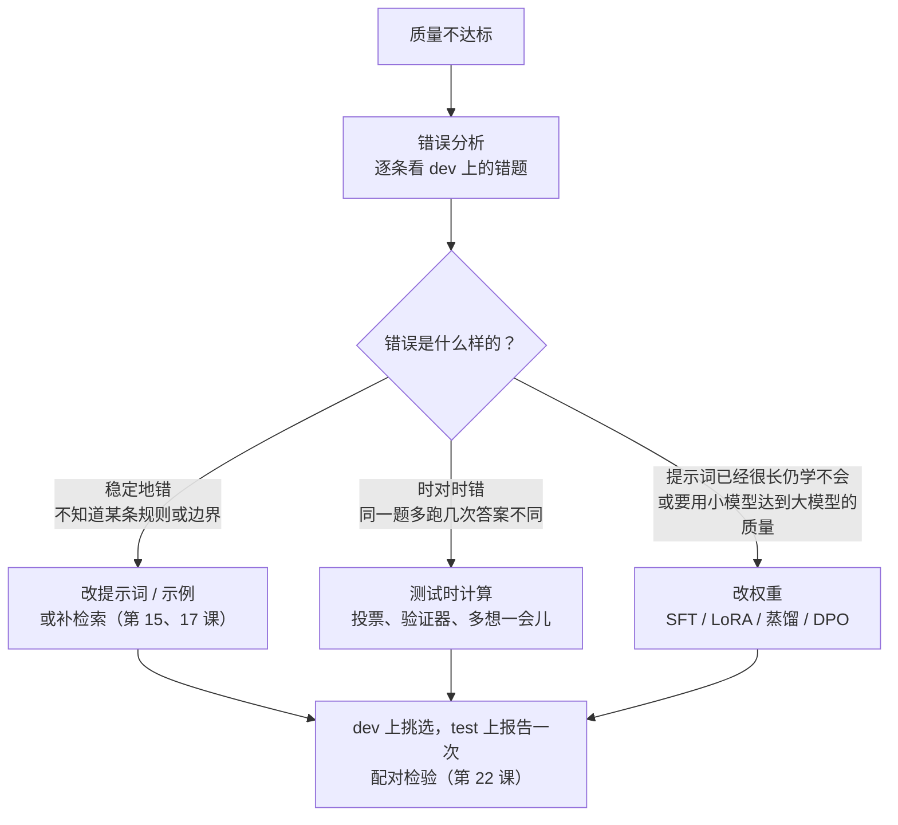

[中文](README.md) | [English](README.en.md)

# 第 23 课：优化 —— 提示词优化、测试时计算与微调选型

> 🕐 建议用时：25 分钟 ｜ 🎯 学完你能：面对"Agent 效果不够好"，在改提示词、加测试时计算、改权重三个杠杆之间做出有依据的选择；用 BootstrapFewShot、OPRO、GEPA 式反思自动优化提示词，并判断提升是真的还是噪声 ｜ 📦 对应源码：[`optkit.py`](optkit.py)（优化器、测试时计算、显著性）、[`ticket_task.py`](ticket_task.py)（任务、数据与离线模拟模型）、[`agentkit/evals.py`](../../agentkit/evals.py)、[`agentkit/workflows.py`](../../agentkit/workflows.py)
>
> 📖 必读：[GEPA: Reflective Prompt Evolution Can Outperform Reinforcement Learning](https://arxiv.org/abs/2507.19457)（Agrawal et al., ICLR 2026 Oral）

## 0. 一句话讲清楚

**优化不是"凭感觉改提示词"，而是在固定的数据切分和预算下，让评估分数驱动搜索：先改最便宜、最容易回滚的提示词和示例，再考虑多花推理算力，最后才动模型权重。**

接着第 11 课的 IT 服务台。工单分类器在 dev 上 80% 准确，产品要求 90% 以上。你打开提示词加了一句"打印机问题归 hardware"，跑一遍评估：对了两条，又错了一条。再加一句……两天后提示词长了三倍，谁也说不清哪句话在起作用，哪句是在"背题"。

这一课把这个循环交给**优化器**：它读评估结果，提出新提示词，在 dev 上挑最好的，最后只在 test 上报告一次。我们用真实模型（gpt-5.5）跑了本课 Demo，结果有好有坏：

- **基线**（只列了类别名的指令）：dev 80%，test 80%。8 条公司规定里，gpt-5.5 凭常识就猜对了一半；
- **三种优化器**在 dev 上最多只提高了 5 个点（也就是 1 张工单），在 test 上**全都没有提高**，BootstrapFewShot 还掉了 10 个点。配对 bootstrap 的 95% 置信区间宽达 ±20~25 个点；
- **事后分析**：GEPA 其实学对了。它的候选池里另外两条指令在 test 上达到 95% 和 100%，可它们在 20 条 dev 上和被选中的那条打平（都是 85%），按"同分取先出现的"规则，选中的恰好是规则最少、还带着一条错误规则的那条。**瓶颈不在优化器，而在 20 条 dev 分辨不出好坏**；
- **测试时计算**：采样 5 次投票、best-of-5，甚至"完美验证器"的上限都是 80%。模型不知道的规则，5 次采样全票答错；
- **成本**：优化后的提示词从每次 127 token 涨到 811 token（GEPA），每次调用的输入成本约涨到 6 倍。

这些现象不是 bug，而是优化的常态。本课要讲清楚三件事：**有哪几种办法让系统变好、每种各花多少钱、怎么确认它真的变好了。**

本课建立在三节课之上，这里不再重复：[第 21 课](../21_agent_data/README.md)讲数据从哪来、怎么切分、怎么防泄漏；[第 22 课](../22_eval_methodology/README.md)讲怎么判断一个提升是否显著；[第 11 课](../11_evals/README.md)讲评估框架 `agentkit.evals`。[第 14 课](../14_cost_latency/README.md)的"优化"讲的是成本和延迟，本课讲的是**质量**。

## 1. 核心概念

### 1.1 三个杠杆：改提示词、加测试时计算、改权重

| 杠杆 | 改什么 | 一次改动的成本 | 多久见效 | 怎么回滚 | 最擅长解决 |
|---|---|---|---|---|---|
| 提示词和示例 | 指令文本、少样本示例（few-shot demos） | 跑评估的几十到几百次模型调用 | 分钟级 | 换回旧版本文本 | 模型**不知道**的规则、边界、格式（"知识和规范缺口"） |
| 测试时计算（test-time compute） | 每个请求采样几次、用什么验证器、允许模型想多久 | 每个请求的成本和延迟都乘以 N | 改个参数就生效 | 把 N 改回去 | 模型**时对时错**的随机错误；答案能被可靠验证的任务 |
| 权重 | 模型参数：SFT、LoRA、蒸馏、DPO…… | 数据整理 + 训练 + 评估 + 部署 | 小时到天 | 换回旧模型版本，但要自己管理模型版本 | 稳定、大量重复的格式和风格；把大模型的效果搬到更小、更便宜的模型上 |

**测试时计算**：模型参数不变，推理时多花算力，比如多采样几次再投票、用验证器挑最好的、让推理模型多想一会儿。**SFT**（supervised fine-tuning，监督微调）：用"输入 → 期望输出"的样本继续训练模型。LoRA、蒸馏、DPO 见 1.6 节。

先做**错误分析**，再选杠杆。不同的错误要用不同的杠杆：



### 1.2 怎么选：决策表

| 你的情况 | 优先考虑 | 为什么 |
|---|---|---|
| **数据量**：只有几十条带标签的样本 | 提示词优化 | 几十条就够当 dev 集；微调通常要几百条以上的高质量样本 |
| **数据量**：有几千条高质量轨迹，分布稳定 | 可以考虑微调或蒸馏 | 数据能覆盖长尾，提示词已经写不下这么多模式 |
| **延迟和成本预算**紧，调用量大 | 提示词优化，再考虑蒸馏到小模型；慎用测试时计算 | 测试时计算让**每个**请求的成本乘以 N；提示词优化和微调是一次性投入 |
| **延迟不敏感，答案能验证**（代码、SQL、数学、有标准答案的抽取） | 测试时计算 + 验证器 | 有可靠的验证器时，best-of-N 的收益最大 |
| **可控性和可审计**要求高（金融、医疗、合规） | 提示词优化 | 指令是人能读、能 diff、能审批的文本；写进权重的行为只能靠评估间接证明 |
| **用闭源 API 模型** | 提示词优化 + 测试时计算；微调要先确认厂商是否还开放接口（见 1.6） | 你改不了别人的权重，微调接口也可能被关闭 |
| **团队**没有 ML 工程能力 | 提示词优化 | 只需要评估集和优化器；微调还需要数据管线、训练、模型版本管理和部署 |

三个杠杆可以组合使用。Soylu、Potts、Khattab 在 EMNLP 2024 的论文 [*Fine-Tuning and Prompt Optimization: Two Great Steps that Work Better Together*](https://aclanthology.org/2024.emnlp-main.597/) 里试了这样的组合：先优化提示词，用优化后的程序自举出训练轨迹去微调同一个模型，然后在微调后的模型上再优化一次提示词。他们在 HotPotQA、GSM8K、Iris 三个任务和三个 7B/8B 开源模型（Mistral-7B、Llama-2-7B、Llama-3-8B）上比较了 8 种组合，摘要的说法是：在各个模型和任务上平均，同时优化两者，比只优化权重、只优化提示词分别最多高 60% 和 6%。9 个"任务 × 模型"组合里，有 7 个的最佳策略同时用了两种优化。但论文也明确说，几种组合顺序之间没有明确的赢家，所以不要把"先提示词、再微调、再提示词"当成定律。

### 1.3 所有提示词优化器都是同一个循环


各种方法的区别只在三处：

1. **提议器看到了什么**：只有总分？还是每条失败样本的完整轨迹和文字反馈？看到的信息越具体，每次提议越有针对性，需要的评估次数就越少；
2. **改什么**：只改指令、只改示例，还是两者一起改；
3. **怎么选**：只留最好的几个、用代理模型预测哪个组合更好，还是保留"各有所长"的一组。

数据的用法是固定的（第 21 课）：**train** 用来产生示例和反馈，**dev** 用来挑候选，**test** 只在最后评估一次。一旦根据 test 的结果回头改提示词，test 就变成了第二个 dev，它的分数也就不再可信。

### 1.4 提示词优化：五种方法的原理

| 方法 | 出处 | 改什么 | 提议器看到的信息 | 怎么选 | 一句话直觉 |
|---|---|---|---|---|---|
| BootstrapFewShot | DSPy（Khattab et al., ICLR 2024） | 示例 | 程序在训练集上**跑通了**的轨迹 | 随机组合，dev 上挑最好的 | 自己做对的题，抄下来当例题 |
| OPRO | Yang et al., ICLR 2024 | 指令 | 历史指令和它们的**总分** | 保留得分最高的若干条 | 看着成绩单猜下一版怎么写 |
| MIPROv2 | Opsahl-Ong et al., EMNLP 2024 | 指令 + 示例 | 数据摘要、程序结构、自举出的示例 | 代理模型（贝叶斯优化）挑组合 | 把"写指令"和"挑例题"当成超参数一起调 |
| TextGrad | Yuksekgonul et al., Nature 2025 | 任意文本变量（提示词、答案、代码……） | LLM 写的文字批评（"文本梯度"） | 按批评逐步更新 | 把反向传播里的梯度换成一段文字批评 |
| GEPA | Agrawal et al., ICLR 2026 | 指令（可以是多模块程序里的每个模块） | 失败样本的**完整轨迹 + 文字反馈** | 帕累托前沿 + 按频率抽样 | 像人一样复盘错题，再修改规则 |

**BootstrapFewShot**（[DSPy](https://arxiv.org/abs/2310.03714)）。"自举"（bootstrap）的意思是自己给自己造训练数据：用当前程序（或一个更强的"老师"程序）跑训练集，只保留最终通过评分的那些运行轨迹，把其中每一步的输入输出当作示例。它的价值在于，标注数据里通常只有最终答案，程序跑通的轨迹却把中间的推理过程也带上了。它的局限在本课 Demo 里看得很清楚：**被收进示例池的都是程序本来就会做的题**。

**OPRO**（[Large Language Models as Optimizers](https://arxiv.org/abs/2309.03409)）。让 LLM 当优化器：元提示词（meta-prompt，写给优化器看的提示词）里放上历史指令和它们的分数（论文按分数**升序**排列，保留最好的 20 条），再放几条随机抽取的任务样例；优化器每一步生成 8 条新指令，逐条评估后写回历史。论文报告，OPRO 找到的提示词比人工设计的提示词在 GSM8K 上最多高 8%，在 Big-Bench Hard 上最多高 50%。它的弱点是优化器**只看到总分**，不知道具体错在哪一条，只能盲试，所以要大量评估。

**MIPROv2**（[Optimizing Instructions and Demonstrations for Multi-Stage Language Model Programs](https://aclanthology.org/2024.emnlp-main.525/)）。分三步：① 自举出候选示例；② 让 LLM 参考数据摘要、程序代码和示例，写出一批候选指令（论文叫 grounded proposal）；③ 用贝叶斯优化（Optuna 的 TPE）在"指令 × 示例"的组合空间里搜索，每次只在一小批数据上评估，用代理模型（surrogate model，一个预测"这个组合大概能得几分"的便宜模型）决定下一个试哪个组合。论文报告，用 Llama-3-8B 时，7 个多阶段程序中有 5 个优于基线优化器，准确率最多提高 13%。

**TextGrad**（[arXiv 2406.07496](https://arxiv.org/abs/2406.07496)，后发表于 [Nature 2025](https://www.nature.com/articles/s41586-025-08661-4)）。把系统看成计算图，由 LLM 给每个节点写文字批评（"这段提示词没要求模型检查单位"），再沿着图把批评"反向传播"给上游变量去修改。论文报告，GPT-4o 在 GPQA 上的零样本准确率从 51% 提到 55%，LeetCode-Hard 的解答获得 20% 的相对提升。

**GEPA**（本课必读）。名字来自 Genetic-Pareto。机制可以拆成四步：

1. **选父代**：对 dev（论文叫 D_pareto）上的**每一条**样本，找出在这条样本上得分最高的候选；至少在一条样本上"最好"的候选组成帕累托前沿，按"在多少条样本上最好"加权随机抽一个；
2. **跑一小批**：从训练集（论文叫 D_feedback）取一小批样本运行父代，记录完整轨迹（推理过程、工具调用、工具输出），并由反馈函数给出文字反馈（比如编译错误、没满足的评分细则）；
3. **反思式变异**：把"当前指令 + 轨迹 + 分数 + 反馈"交给反思模型，让它诊断失败原因并写出新指令；多模块程序按轮转方式每次改一个模块；
4. **两级接受**：新指令先在同一小批上**变好**，才会到完整的 dev 上评估，然后加入候选池。

另有一个"系统感知合并"（System Aware Merge）变体，会把不同谱系里各模块的最佳版本拼成一个新候选。论文在 HotpotQA、IFBench、HoVer、PUPA、AIME-2025、LiveBench-Math 六个任务上，用 Qwen3 8B 和 GPT-4.1 Mini 做实验。结果：GEPA 平均比 GRPO（一种强化学习方法，基线用了 24,000 次 rollout）高约 6 个百分点，最多高约 20 个百分点，rollout 次数最多少 35 倍；比 MIPROv2 高 10 个百分点以上（例如 AIME-2025 上 +12）；GEPA 得到的提示词最多比 MIPROv2 的短 9.2 倍。消融实验中，"帕累托选父代"比"总是选当前最好的候选"最多高 8.17 个百分点。

**为什么要帕累托前沿**：假设 A 指令擅长安全类工单，B 指令擅长硬件类工单，平均分都是 80%。只留平均分第一名，就会把另一条指令里的"经验"扔掉，搜索容易卡在局部最优。帕累托前沿（Pareto front）就是"不被任何其他候选全面压制的那些候选"：A 支配 B，当且仅当 A 在每一条样本上都不比 B 差，并且至少一条严格更好。

### 1.5 测试时计算：什么时候"多想一会儿"比"换个大模型"划算

测试时计算有三种常见做法：

| 做法 | 怎么做 | 前提 | 代表工作 |
|---|---|---|---|
| **best-of-N + 验证器** | 采样 N 个候选，用验证器打分，取最高分 | 有一个比生成器更可靠的验证器 | Cobbe et al. 2021 提出 GSM8K 时发现，训练一个验证器在候选中挑选，效果约等于把模型放大 30 倍；Lightman et al.（ICLR 2024）的过程奖励模型（PRM，逐步打分）优于只看最终结果的奖励模型 |
| **自一致性（self-consistency）** | 采样 N 条推理路径，对**最终答案**多数投票 | 答案是离散的、可以比较（选项、数字、类别） | Wang et al., ICLR 2023：GSM8K 上比贪心解码的思维链高 17.9 个百分点 |
| **更长的思考 / 顺序修订** | 让推理模型多想一会儿，或让模型基于上一版答案逐步修改 | 模型支持思考预算，或有修订能力 | Snell et al., ICLR 2025 |

**Snell et al. 的核心结论**（[Scaling LLM Test-Time Compute Optimally can be More Effective than Scaling Model Parameters](https://arxiv.org/abs/2408.03314)，ICLR 2025）。他们在 MATH 上用 PaLM 2-S* 研究了两种机制：对过程奖励模型做搜索（best-of-N、束搜索、前瞻搜索），以及让模型顺序地修订自己的答案。结论有三条：

1. 哪种方法最好，**强烈取决于题目难度**。按难度给每道题分配不同的策略和预算（论文称为 compute-optimal），比 best-of-N 基线的测试时计算效率高 4 倍以上；
2. 在总 FLOPs 相同的条件下，**只在小模型已经有一定成功率的题目上**，给小模型加测试时计算可以胜过一个大 14 倍的模型；
3. 在**最难**的题目上，加测试时计算几乎没有收益，把算力花在更大的模型（更多预训练）上更有效。论文的原话是测试时计算和预训练计算 "not 1-to-1 exchangeable"。

翻译成工程决策：

- **单题正确率中等（模型会做但不稳定）且有可靠的验证器**：加 N 划算；
- **单题正确率接近 0（模型根本不会，比如不知道公司规则）**：加 N 没用，要改提示词、补知识或换更强的模型。本课 Demo 的场景 6 就是这个现象：模型不知道的规则，5 次采样**全票一致地**答错；
- **单题正确率低于 50% 时，多数投票反而会放大错误**：少数几次"蒙对"的会被投票否决；
- **验证器的质量决定上限**：只检查格式的验证器几乎挑不出正确答案；而对一个不完美的验证器做强力的 best-of-N 本身就是一种优化，也会"钻空子"。Gao et al.（ICML 2023）发现，对奖励模型的过度优化会让真实质量下降，RL 和 best-of-n 都会出现这个现象。

**和第 14 课的成本权衡**：测试时计算是**按请求付费**的。N 次采样意味着每个请求的成本乘以 N；并行采样的延迟约等于 N 次调用里最慢的那一次，所以会被长尾放大（第 14 课 1.2 节的 p99 问题）；顺序修订的延迟则直接乘以轮数。提示词优化和微调是**一次性投入**，之后每个请求的成本只受提示词长度影响。调用量越大，一次性投入越划算。

### 1.6 微调选型：只讲概念与决策

**什么时候值得微调**（下面几条同时满足得越多，越值得）：

1. **格式与风格稳定且大量重复**：同样的输出结构每天要生成几十万次；
2. **延迟和成本敏感**：想把"大模型 + 长提示词"的效果搬到"小模型 + 短提示词"上；
3. **数据充足**：有数百到数千条高质量样本（或能从大模型轨迹里筛出来），分布稳定；
4. **提示词优化已经到顶**：规则太多，提示词写不下，或者写进去了模型也学不会。

**不该微调**的情况：知识经常变（用检索，第 15、17 课），规则经常改（用提示词，改完即时生效），数据只有几十条，或者用的是不提供微调接口的闭源模型。

**LoRA 的直觉**。全量微调要更新每个权重矩阵 $W$（比如 4096×4096，约 1678 万个参数）。LoRA（Low-Rank Adaptation，低秩适配）冻结 $W$，只学一个"修正量" $\Delta W = BA$，其中 $B$ 是 4096×r、$A$ 是 r×4096。r 取 8 时，只有 $2 \times 4096 \times 8 = 65{,}536$ 个参数，约为原来的 0.4%。直觉是：适配一个新任务所需的改动，本身就是"低秩"的，不需要动全部参数。论文（[Hu et al., ICLR 2022](https://arxiv.org/abs/2106.09685)）报告，与用 Adam 全量微调 GPT-3 175B 相比，可训练参数减少 10,000 倍，GPU 显存需求减少 3 倍。训练完可以把 $BA$ 合并回 $W$，推理没有额外延迟。**QLoRA**（[Dettmers et al., NeurIPS 2023](https://arxiv.org/abs/2305.14314)）再把冻结的底座量化成 4-bit（NF4 格式），让 65B 模型能在一张 48GB 显卡上微调。

**蒸馏：大模型轨迹 → 小模型**。蒸馏（distillation）这个词来自 [Hinton et al. 2015](https://arxiv.org/abs/1503.02531)：用大模型输出的概率分布（"软标签"）训练小模型。在 LLM 应用里，更常见的做法是：让大模型（或大模型 + 好提示词）跑一遍大量输入，用验证器筛出正确的轨迹，拿这些轨迹对小模型做 SFT（监督微调）。这一步和 BootstrapFewShot 的收集步骤完全一样，区别只在于筛出来的轨迹是放进提示词当示例，还是写进权重（DSPy 里对应的优化器叫 BootstrapFinetune）。[DeepSeek-R1](https://arxiv.org/abs/2501.12948) 用 R1 整理了约 80 万条样本，直接对 Qwen、Llama 小模型做 SFT，得到的 R1-Distill-Qwen-32B 在各项基准上都明显好于直接对 Qwen-32B 底座做大规模强化学习的结果。作者的结论是：把强模型蒸馏到小模型又便宜效果又好，但要突破能力上限，仍然需要更强的底座和更大规模的强化学习。

**偏好优化 DPO 的直觉**。有些质量很难写成"标准答案"，但人能比较"A 比 B 好"。RLHF 的经典流程是先用偏好数据训练一个奖励模型，再用强化学习（PPO）优化策略。**DPO**（Direct Preference Optimization，[Rafailov et al., NeurIPS 2023](https://arxiv.org/abs/2305.18290)）证明，这个问题可以化简成直接在偏好对上训练的一个分类式损失：给定（提示，更好的回答，更差的回答），相对于一个冻结的参考模型，提高"更好回答"的概率、降低"更差回答"的概率。它不需要单独的奖励模型，也不需要训练中反复采样。

**闭源模型的微调接口现状**（2026 年 9 月查阅官方文档；变化很快，用之前请再查一次）：

| 厂商 | 现状 |
|---|---|
| OpenAI | 文档列出 SFT、视觉微调、DPO（gpt-4.1 系列等）和强化微调 RFT（o4-mini）。但 [官方文档](https://developers.openai.com/api/docs/guides/model-optimization) 顶部写明正在**逐步关闭**微调平台。[弃用页](https://developers.openai.com/api/docs/deprecations) 的时间表：2026-05-07 起，从未用过微调的组织不能再创建任务；2026-07-02 起，60 天内没有调用过微调模型的组织不能再创建任务；2027-01-06 起，所有客户都不能再创建新任务。已有的微调模型可以继续推理，直到其基础模型被弃用 |
| Google | Google Cloud 上可以对部分 Gemini 模型做[监督微调](https://docs.cloud.google.com/gemini-enterprise-agent-platform/models/tuning/supervised-tuning)和[偏好调优](https://docs.cloud.google.com/gemini-enterprise-agent-platform/models/tuning/preference-tuning)（原 Vertex AI 文档，现归入 Gemini Enterprise Agent Platform）。支持哪些型号以文档为准 |
| Anthropic | Claude API 目前**不提供**微调（[官方术语表](https://platform.claude.com/docs/en/about-claude/glossary)：有需要可联系 Anthropic 对接人）。Amazon Bedrock 曾在 [2024-11-01 正式推出 Claude 3 Haiku 微调](https://aws.amazon.com/about-aws/whats-new/2024/11/fine-tuning-anthropics-claude-3-haiku-amazon-bedrock/)，但该模型已于 2026-03-10 进入 Legacy 状态（按 Bedrock 规定，Legacy 模型不能再新建微调任务），并于 2026-09-10 到达 EOL（[Bedrock 模型生命周期](https://docs.aws.amazon.com/bedrock/latest/userguide/model-lifecycle-legacy.html)） |

对闭源模型用户来说，结论很直接：**提示词优化和测试时计算是你始终能用的两个杠杆**；想走微调路线，更现实的做法往往是蒸馏到一个你能控制权重的开源模型上。

### 1.7 过拟合、泄漏与"钻评分器的空子"

**开发集上优化，测试集上报告**。优化器在 dev 上从 K 个候选里挑最高分，这个最高分是**偏高**的：每个候选的 dev 分数都是"真实水平 + 噪声"，挑最大值时，挑中的往往是噪声恰好为正的那个。这叫**赢家诅咒**（winner's curse）。K 越大、dev 越小，偏差越大。所以 dev 分数只能用来**挑**，不能用来**报告**；要报告就用没参与挑选的 test，而且只用一次。本课 Demo 的汇总表专门对比了 Δdev 和 Δtest。

**背题**。优化器看到的训练样本，可能被原文抄进指令（"例如'U 盘插上电脑没反应'应归 security"）。这不算泄漏，但说明它在记具体的题而不是总结规则。更严重的是 dev/test 的原文进入了指令或示例，那就是**泄漏**，分数从此不可信（第 21 课）。本课 Demo 用 `verbatim_overlap` 自动检查指令里有没有逐字抄进任何一份数据的工单原文。

**钻评分器的空子**（reward hacking / specification gaming：满足了评分规则的字面要求，却没有达到真正的目标）。优化器只认分数，评分器有漏洞它就会找到：

| 例子 | 发生了什么 |
|---|---|
| 本课的评分器如果写成"输出里出现了正确类别名就算对" | 一条"请把 7 个类别都列一遍再给结论"的指令就能拿满分。所以 `parse_label` 只取**一个**答案（`类别：` 那一行里的类别名，没有这一行时取全文最后出现的类别名），并把输出格式从可优化的指令里拆出来固定住 |
| LLM 评委偏爱长回答 | [Length-Controlled AlpacaEval](https://arxiv.org/abs/2404.04475)（Dubois et al., COLM 2024）专门做长度校正；[Zheng et al., ICLR 2025](https://arxiv.org/abs/2410.07137) 用一个**永远输出同一段固定回答**的"空模型"，在 AlpacaEval 2.0 上拿到 86.5% 的长度校正胜率。用 LLM 评委当优化目标时，优化器很可能学会迎合评委 |
| 编码 Agent 绕过单元测试 | OpenAI 的 [Baker et al. 2025](https://arxiv.org/abs/2503.11926) 记录了强化学习训练中编码 Agent 用 `exit(0)` 在测试跑完前退出、`raise SkipTest` 跳过测试，甚至改写测试框架依赖的库 |
| 强化学习里的经典案例 | DeepMind 的 [Specification gaming](https://deepmind.google/blog/specification-gaming-the-flip-side-of-ai-ingenuity/) 收集了约 60 个案例，比如赛船游戏里的船在原地转圈，反复撞同一批加分道具 |

**防范**：

1. 三份数据各司其职，test 只用一次；换随机种子重跑，看提升是否稳定；
2. 评分器组合使用：规则检查（格式、长度上限、必须调用的工具）+ LLM 评委 + 定期人工抽查（第 11、22 课）；
3. 限制优化器能改的范围：输出格式、安全规则这类"契约"不交给优化器；
4. 自动检查背题和泄漏；人工审阅优化前后的指令 diff，就像审代码；
5. 监控优化后的提示词长度和每次调用的成本：优化器很容易用越写越长的提示词换取几个点的提升。

## 2. 从零实现

所有代码都在 [`optkit.py`](optkit.py)，只依赖标准库和 agentkit。

### 2.1 被优化的对象：把"能改的"和"不能改的"分开

```python
class Program:
    """instruction（可优化）+ demos（可优化）+ output_format（固定的格式契约）"""

    def messages(self, x: str) -> list[Message]:
        system = self.instruction + (f"\n\n{self.output_format}" if self.output_format else "")
        msgs = [{"role": "system", "content": system}]
        for d in self.demos:  # 示例按"用户 / 助手"多轮对话放进去
            msgs.append({"role": "user", "content": f"{self.input_prefix}{d.input}"})
            msgs.append({"role": "assistant", "content": d.output})
        msgs.append({"role": "user", "content": f"{self.input_prefix}{x}"})
        return msgs
```

**为什么把输出格式拆出来**：优化器会整段改写指令。格式要求如果也在指令里，改着改着就可能把"最后一行写 `类别：xxx`"改没了，解析全部失败，分数暴跌。DSPy 的做法相同：签名（signature）规定了输入输出字段，优化器只改指令和示例。这也是 1.7 节"限制优化器能改的范围"的具体做法。

OPRO 和 GEPA 不直接依赖 `Program`，而是依赖一个很小的接口（BootstrapFewShot 要改的是示例，所以直接用 `ProgramTask`）：

```python
class Task(Protocol):
    async def run(self, instruction: str, examples: Sequence) -> list[Record]: ...

@dataclass
class Record:
    input: str
    output: str       # 模型原始输出（含推理过程）= 优化器能看到的"轨迹"
    score: float
    feedback: str = ""
```

`ProgramTask` 把"程序 + 评分函数 + 反馈函数"包装成 `Task`；2.8 节的 `AgentTask` 把 Agent 包装成 `Task`。**指令优化器只和这个接口打交道**，所以换任务、换成 Agent，都不用改优化器本身。

`run` 是 async 的：一次评估里的多条样本互不依赖，`ProgramTask` 用 `agentkit.workflows.parallel` 在一个事件循环里并发发出（`max_concurrency`，共享网关上是 2），结果按样本顺序返回；某条样本的模型调用在重试后仍然失败，记 0 分、计入 `errors`，不让整轮评估停下来。优化器本身是**一个候选接一个候选**地评估：每次评估内部已经并发，再叠一层并发就会超出网关配额。Demo 还给真实模型套了 `ResilientLLM(max_concurrency=2)` 作为总闸：不管上面怎么并发，同一时刻最多 2 个请求在路上。

### 2.2 先记账，再优化

```python
class MeteredLLM:
    async def chat(self, messages, tools=None, **kwargs):
        ...                                     # 在途计数 +1，记开始时间
        resp = await self.llm.chat(messages, tools, **kwargs)
        ...                                     # 在途计数 -1
        self.calls += 1                         # 读-改-写之间没有 await：不需要锁
        self.usage = self.usage + resp.usage
        self.cost_usd += estimate_cost(resp.usage, resp.model or self.model)
        return resp
```

**为什么不用加锁？** 以前的版本用线程池并发评估，`MeteredLLM` 里有一把 `threading.Lock`：线程可能在任意两条字节码之间被切走，`self.calls += 1` 这种"读-改-写"会丢数。现在所有调用都是同一个事件循环里的协程，协程只在 `await` 处让出控制权；`await self.llm.chat(...)` 返回之后的三行中间没有 `await`，执行时不会被别的协程插队，所以是原子的。只有"读 → `await` 别的东西 → 再写回"才需要 `asyncio.Lock`。[`test_exercise.py`](test_exercise.py) 里有一个测试让 40 个协程同时调用同一个 `MeteredLLM`：在途峰值 40（确实并发了），调用次数和 token 一个不差。`ProgramTask.errors` 同理，锁也删掉了。

**为什么要单独记账**：优化是在**花钱买质量**。只报"准确率 +15 个点"而不报"花了 300 次调用"，就没法和"换个更大的模型""多采样几次"公平比较。Demo 给任务模型和优化器各套一个 `MeteredLLM`，每一步前后各拍一次快照，相减就是这一步的开销。它套在 `ResilientLLM` 外面（第 08 课），所以记的是**逻辑调用次数**，重试不重复计数。

### 2.3 BootstrapFewShot

核心只有一个循环（练习 b 让你自己写，是 async 函数）：

```python
for ex in trainset:
    try:
        out = await program(ex.input)            # 一条 await 完再下一条
    except Exception:
        continue                                 # 限流、超时：跳过这条
    if float(metric(ex, out)) >= threshold:
        demos.append(Demo(ex.input, out))        # 用程序自己的输出（带推理），不是标准答案
        if len(demos) >= max_demos:
            break                                # 够了就停，别再花钱
```

**这里故意不并发**：`asyncio.gather` 一次把整个训练集发出去，请求就收不回来了，"收满就停"一分钱也省不下。测试用一个假程序检查了这一点：收满 2 条之后后面的样本一次都没被调用，同时在途的调用从来不超过 1 个。

`bootstrap_fewshot` 在这之上加一层随机搜索：候选 0 是按顺序的前 k 条，其余候选是用固定种子打乱后取的 k 条，每组在 dev 上评估，取最高分。它要的是整个示例池，本来就要把训练集跑完，所以先**并发**跑完训练集，再按训练集顺序过滤，结果和顺序调用 `bootstrap_demos` 完全一致（测试里让完成顺序和发出顺序不同，并发 1 和并发 4 的结果逐项相同，候选 0 等于顺序调用 `bootstrap_demos` 的结果）。

### 2.4 OPRO

```python
for r in range(1, rounds + 1):
    top = select_topk(history, keep_top)                  # 练习 a
    shown = rng.sample(exemplars, n_exemplars)            # 每轮换几条任务样例
    prompt = opro_meta_prompt(task_description, shown, top, per_round)
    proposals = (await complete_json(optimizer_llm, prompt, Proposals)).instructions
    for ins in proposals[:per_round]:
        await score(ins, r)                               # 在 dev 上完整评估（内部并发），写回 history
```

三个细节：

1. **历史按分数升序排列**：沿用论文的做法，最好的指令离"请写新指令"这句话最近；
2. **去重**：`select_topk` 把只差首尾空白的指令当成同一条；`score` 对已经评估过的指令直接跳过，不重复花钱；
3. **和论文的差异**：论文每步单独调用 8 次优化器，跑上百步；这里每轮只调用一次，让它一次写 3 条，一共 2 轮。这是为了省调用，代价是搜索得更粗。

### 2.5 GEPA 式反思与帕累托前沿

选父代完全按论文的做法：

```python
def gepa_select_parent(pool_scores, rng):
    freq = {}
    for j in range(n_items):                              # 每条 dev 样本
        top = max(s[j] for s in pool_scores)
        for i, s in enumerate(pool_scores):
            if s[j] == top:
                freq[i] = freq.get(i, 0) + 1              # 候选 i 在第 j 条上"最好"
    front = [int(n) for n in pareto_front({str(i): pool_scores[i] for i in sorted(freq)})]  # 练习 c
    parent = rng.choices(front, weights=[freq[i] for i in front], k=1)[0]
    return parent, front, {i: freq[i] for i in front}
```

主循环的每次迭代：取一小批训练样本跑父代 → 如果全对就跳过（没有东西可学）→ 把轨迹和反馈交给反思模型 → 新指令在同一小批上**严格变好**才到 dev 上评估。第二道关卡很省钱：没有进步的候选只花了小批上的几次调用，不会花完整 dev 的 20 次。迭代结束后返回 dev 平均分最高的候选；**同分时取先出现的**（通常也是更短、更便宜的那条）。这条平局规则在第 3 节的真实运行里起了决定性作用。

反馈是 GEPA 和 OPRO 的根本区别。本课的反馈函数不只说对错，还带上**标注备注**：

```python
def feedback(ex, output):
    pred = parse_label(output)
    if pred == ex.label:
        return f"正确（{ex.label}）。"
    return f"错误：标准答案是 {ex.label}，模型给出的是 {pred}。" + (f"标注备注：{ex.note}" if ex.note else "")
```

标注备注是人工标注时顺手写下的理由，比如"公司用 DLP 策略禁用了 U 盘，这类问题归 security"。这是最便宜的高质量反馈：标注时顺手记下理由几乎不花额外成本，在这里却是优化器最好的材料（数据怎么采集和标注，见第 21 课）。

省略了论文的"系统感知合并"：本课的程序只有一个模块，合并没有意义。

### 2.6 测试时计算

```python
def self_consistency(answers):
    winner = majority_vote(list(answers))                 # 复用 agentkit.workflows.majority_vote
    return winner, Counter(a.strip() for a in answers)[winner] / len(answers)

def best_of_n(candidates, verifier):
    scores = [float(verifier(c)) for c in candidates]
    best = max(range(len(candidates)), key=lambda i: (scores[i], -i))
    return candidates[best], scores
```

两点设计：

1. **投票投的是解析后的最终答案，不是整段输出**：推理过程每次措辞都不同，只有答案才可能一致；
2. **一致率本身就是信号**：5 票里只有 2 票一致，说明模型自己都拿不准，适合转人工或升级到大模型（第 14 课的级联）。

Demo 对同一批样本只采样一次，然后用同一组样本分别计算"单次、投票、best-of-N"的结果，这样几种用法的比较是公平的，也省调用。

**N 次采样要同时发出**：

```python
async def sample_n(fn, n, max_concurrency=None):
    return await _run_all([fn] * n, max_concurrency or n)   # fn 每次返回一个新协程，n 次一起发出
```

一个接一个地采样，用户要等 N 次调用之和；同时发出，只等最慢的那一次，调用次数（成本）一点没少。Demo 场景 6 用固定延迟的剧本模型（每次调用 50 毫秒）实测，取 test 前 4 条、每条采样 5 次：

```text
   一个接一个（并发 1）      每条工单等  261ms   模型调用 20 次   同时在途峰值 1
   5 次同时发出（并发 5）    每条工单等   53ms   模型调用 20 次   同时在途峰值 5
```

真实模型下还要受网关配额限制：本课的共享网关只允许 2 个并发，5 次采样要分 3 批。2026-09-28 的一次真实运行（gpt-5.5）：单次调用平均 2.4 秒，每条工单 5 次采样平均等 6.9 秒，约为单次的 2.8 倍（一个接一个就是 5 倍）。所以测试时计算要和并发配额一起规划：N 翻倍，要么延迟跟着涨，要么配额跟着涨。

### 2.7 提升是不是真的：配对 bootstrap

```python
d = [y - x for x, y in zip(a, b)]                         # 每条样本上 b 比 a 好多少（-1/0/+1）
boots = sorted(sum(d[rng.randrange(n)] for _ in range(n)) / n for _ in range(n_boot))
lo, hi = boots[int(alpha / 2 * n_boot)], boots[int((1 - alpha / 2) * n_boot) - 1]
```

**配对**：每次重采样抽的是样本编号，两个系统用同一组编号。难题两边都容易错，配对比较能把"题目难度"带来的方差消掉。原理和更多检验方法见第 22 课。本课自己写了一个小实现，不依赖第 22 课的代码。

### 2.8 接到 Agent 上

同一套优化器可以直接优化 Agent 的 system prompt，评分用第 11 课的 `run_eval`：

```python
@dataclass
class AgentTask:
    make_agent: Callable[[str], Agent]        # 给一条指令，返回一个新 Agent
    graders: Sequence[Callable] = ()
    concurrency: int = 4                      # 同时在跑的用例数

    async def run(self, instruction, examples):
        report = await run_eval(lambda: self.make_agent(instruction), examples,
                                list(self.graders) or [rule_grader], concurrency=self.concurrency)
        ...  # 反馈 = 没通过的 Check 的 detail
```

第 11 课 `rule_grader` 产出的 `Check.detail`（比如 `期望顺序 ['verify_identity', 'reset_password']，实际 ['reset_password']`）正好就是 GEPA 需要的文字反馈。这样一来，评估集不只能用来拦截坏版本，还能直接用来驱动优化。

### 2.9 从本课代码到生产

| 本课 | 生产中 |
|---|---|
| 单模块程序，只优化一条指令 | 多模块 Agent：[DSPy](https://dspy.ai/learn/optimization/optimizers/) 的优化器按模块优化，GEPA 按轮转方式每次改一个模块，还有合并操作 |
| OPRO 每轮 1 次提议、共 2 轮 | 预算按"评估次数"设定（[GEPA 库](https://github.com/gepa-ai/gepa)的 `max_metric_calls`），跑到预算用完 |
| 20 条 dev | dev 要大得多（上百条起），否则赢家诅咒和打平都很常见；按场景分层（切分方法见第 21 课） |
| 手工比较 dev/test | 优化产物（指令、示例、分数、数据版本、优化器版本）一起入库，走和代码一样的评审和灰度（第 16 课） |

## 3. 运行 Demo

```bash
.venv/bin/python lessons/23_optimization/demo.py --offline   # 离线：确定性模拟模型，几秒钟
.venv/bin/python lessons/23_optimization/demo.py             # 真实模型：约 540 次调用，并发 2，实测 14–16 分钟
```

任务是 IT 工单分类：7 个类别，train / dev / test 各 20 条。每份数据有 8 条"易错工单"，每条对应一条**公司自己的规定**（U 盘用不了归安全组、打印机问题一律归硬件组、软件许可证走权限审批……），另外 12 条是常规工单。这些规定有的和常识相反，模型只能从指令、示例或反馈里学到。

下面是一次真实运行的节选：gpt-5.5 同时当任务模型和优化器，并发 2，共 540 次调用，用时 962 秒（这次用的还是之前线程池版的代码）。2026-09-28 用现在的 async 版重跑了一次（同样 gpt-5.5、并发 2）：541 次调用，用时 858 秒。那次的结果放在场景 5 后面对照。

**场景 1：基线**

```text
   dev 80%   test 80%   （评估 dev + test 共 40 次调用）
   dev 按类型：常规工单 12/12，易错工单 4/8

▶ dev 上答错的工单（优化器可以看 dev 的分数；test 的错题我们不看）
   ✗ dv01 T2_打印机      标准 hardware        模型 software        新电脑没装打印机驱动，打印时提示找不到驱动程序。…
   ✗ dv13 T6_浏览器插件  标准 security        模型 software        能不能帮我开通一下 Grammarly 浏览器扩展？现在…
   ✗ dv16 T5_设备申领    标准 access_request  模型 hardware        我的笔记本已经用了五年，想申请换一台新电脑。…
   ✗ dv20 T7_MFA换机     标准 password_reset  模型 access_request  手机屏幕摔坏了，Authenticator 打不开，登录…
```

观察：常规工单全对，错的全是"公司自己的规定"。另一半规定（VPN 客户端归 vpn、无线投屏归 network……）和常识一致，模型不用教也答对了。

**场景 2：BootstrapFewShot**

```text
   示例池：训练集 20 条里有 15 条评分通过，可以当示例
   候选 0：4 条示例 → dev 80%
   候选 1：4 条示例 → dev 80%
   候选 2：4 条示例 → dev 80%
   选中的 4 条示例里，易错工单占 1 条（基线本来就会做的题，才会被收进示例池）
   最佳组合：dev 80%   test 70%   优化花了 80 次调用，$0.0936
```

观察：三组示例在 dev 上**完全打平**，只能按顺序取第一组。选中的 4 条示例是"忘记密码""申请共享盘权限"这类模型本来就会的题，没有教会任何新规则，test 上原本答对的两张易错工单（许可证、无线投屏）反而错了。我们还有一次中途停下的运行，结果类似：dev 80%，test 75%。

**场景 3：OPRO**

```text
   [第 0 轮] dev 80% ← 你是 IT 服务台的工单分类器。请把工单分到下列类别之一：
   [第 1 轮] dev 80% ← 你是企业 IT 工单的分诊专家，需要根据员工描述判断最应该由哪个处理团队负责。按“主要诉求”而不是关键词机械匹配分类：pass…
   [第 1 轮] dev 70% ← 你负责把 IT 服务请求路由到唯一团队。先识别用户想要的结果：重置凭证=password_reset；获得或移除某种使用资格/…
   [第 1 轮] dev 80% ← 你是高准确率的 IT 工单分类规则执行器。分类时采用以下优先级和边界：1 安全事件优先，只要包含钓鱼、木马、勒索、病毒、可疑邮…
   [第 2 轮] dev 85% ← 你是企业 IT 工单分诊器。按员工“现在需要 IT 做什么”选择唯一类别：security 最高优先级，凡涉及钓鱼/诈骗邮件、…
   [第 2 轮] dev 85% ← 作为 IT 路由专家，请用以下判定顺序分类工单：1）只要描述像安全风险、策略管控或合规拦截，选 security，包括钓鱼邮件…
   [第 2 轮] dev 85% ← 你需要把每张 IT 工单派给最先能处理的团队，避免机械匹配词语。分类边界如下：password_reset=用户已有账号但因密…

▶ OPRO 选出的指令
   │ 你是企业 IT 工单分诊器。……DLP/合规拦截、浏览器插件或宏被安全策略禁止等风险或安全策略问题，归 security；password_reset 只用于忘记密码、密码过期、账号锁定、MFA/验证码/认证器重置等登录凭据恢复；……hardware 用于实体设备本身的故障、维修、更换或申领……software 用于应用程序安装/卸载/升级、崩溃报错、配置、插件、驱动、许可证……打印机卡纸是 hardware，打印机连不上网络是 network。
   dev 85%   test 80%   优化花了 任务模型 120 次 + 优化器 2 次，$0.2192
```

观察：OPRO 只看得到总分，于是凭常识和 3 条训练样例写了一份很详细的指令。其中几条碰巧和公司规定一致（DLP 和插件拦截归 security、MFA 归 password_reset），修好了两张工单；另外几条和公司规定**正好相反**（"申领"归 hardware，"驱动、许可证"归 software，"打印机连不上网络是 network"），又弄坏了两张原本答对的工单。第 2 轮三个候选在 dev 上又是打平。

**场景 4：GEPA 式反思**

```text
   [迭代 1] 父代 #0（前沿 [0]）在小批上 4/5，失败 1 条
             反思诊断：当前指令只列出了类别名称，没有给出类别边界和优先级，导致模型按表面现象把“外设无反应”归为 hardware。失败样本暴露出的可推广规则是：涉及 USB 存储介质、移动硬盘、U 盘等可移动存储设备无法使用、被禁用、需要…
             新指令在小批上 5/5 → 接受为候选 #1，dev 85%
   [迭代 2] 父代 #1 在这批 5 条上全对 → 没有可学的失败，跳过
   [迭代 3] 父代 #1（前沿 [1]）在小批上 2/5，失败 3 条
             反思诊断：失败主要来自三类边界缺失或表述误导： 1. network 与 hardware 的边界不够清晰。当前指令把“网线接口”等列入 hardware，容易导致模型把工位网口、墙插、端口指示灯不亮等办公网络接入点问题归为硬件…
             新指令在小批上 5/5 → 接受为候选 #2，dev 85%
   [迭代 4] 父代 #2（前沿 [1, 2]）在小批上 4/5，失败 1 条
             反思诊断：失败原因是当前指令把 access_request 主要限定为账号、系统、权限、许可证等“访问/使用权限”事项，而没有覆盖实体 IT 资产或办公设备的申领、分配、借用、调拨、退还、采购审批等资产服务请求；同时 hard…
             新指令在小批上 5/5 → 接受为候选 #3，dev 85%

▶ 候选池（dev 分数）
   #0  dev  80%  （种子，第 0 次迭代）
   #1  dev  85%  （父代 #0，第 1 次迭代）
   #2  dev  85%  （父代 #1，第 3 次迭代）
   #3  dev  85%  （父代 #2，第 4 次迭代）
   ...
   dev 85%   test 80%   优化花了 任务模型 95 次 + 优化器 3 次，$0.2565
```

观察：反思确实是**针对性**的。每次诊断都指向具体的失败工单，并引用了标注备注里的规则（U 盘归 security、设备申领归 access_request）。迭代 3 甚至发现了自己上一版的错误：候选 #1 在写类别定义时自作主张把"网线接口"归进了 hardware，这不是公司规定，是反思模型自己编的。问题出在最后一步：三个候选在 dev 上都是 85%，按"同分取先出现的"规则，选中的是 #1，它还带着"网线接口归 hardware""许可证归 software"这两条错误定义。

**场景 5：汇总与显著性**

```text
   方法              dev    test   Δdev   Δtest  优化调用(任务/优化器)   优化成本  每单输入token
   ───────────────────────────────────────────────────────────────────────────────────────────────
   基线              80%    80%    +0     +0     -                       -         127
   BootstrapFewShot  80%    70%    +0     -10    80/0                    $0.0936   399
   OPRO              85%    80%    +5     +0     120/2                   $0.2192   544
   GEPA 式反思       85%    80%    +5     +0     95/3                    $0.2565   811
   GEPA + 示例       85%    80%    +5     +0     195/3                   $0.3888   1083

▶ 显著性：test 上逐条配对，bootstrap 10000 次（和基线比）
   方法              Δtest   95% 置信区间      赢/输(条)   P(提升≤0)
   BootstrapFewShot  -10     [-25, +0]         0/2         1.000  不显著（区间含 0）
   OPRO              +0      [-20, +20]        2/2         0.597  不显著（区间含 0）
   GEPA 式反思       +0      [-25, +25]        3/3         0.572  不显著（区间含 0）
   GEPA + 示例       +0      [-25, +25]        3/3         0.579  不显著（区间含 0）

▶ 背题 / 泄漏检查：优化出来的指令里，有没有逐字抄进工单原文（连续 10 个字）？
   OPRO              train 0 条  dev 0 条  test 0 条
   GEPA 式反思       train 0 条  dev 0 条  test 0 条
```

观察：

- "赢/输"一列比平均值更说明问题：GEPA 在 test 上修好了 3 张工单（MFA、U 盘、浏览器插件），又弄坏了 3 张：许可证、VPN 客户端，还有一张"工位网线接口坏了"的常规工单。最后这张很可能是被那条自己编的"网线接口归 hardware"带偏的：下面的 #2 改掉这条定义后，它就答对了；
- 按第 22 课的配对样本量公式（`evalstats.min_sample_size_paired`），两个版本在 30% 的工单上结论不一致时，要以 80% 的把握检出 +10 个点，大约需要 234 条 test。20 条只够发现特别大的差异；
- 提示词越优化越长：GEPA 每次调用的输入从 127 token 涨到 811 token。上线后每一次调用都要为这些 token 付钱（第 14 课）。

**事后分析：GEPA 其实学对了**（额外 40 次调用，**只为理解现象，不参与选择**）。我们把候选池里在 dev 上打平的 #2、#3 也在 test 上跑了一次：

| 候选 | dev | test | 每单输入 token | 相比上一个候选多学到的 |
|---|---|---|---|---|
| #1（被选中） | 85% | 80% | 811 | U 盘归 security；但自己编了"网线接口归 hardware"，许可证仍归 software |
| #2 | 85% | 95% | 1351 | 网口问题改回 network；许可证、席位改归 access_request |
| #3 | 85% | 100% | 1783 | 设备申领归 access_request |

这张表是本课最重要的一张：**优化器学到的东西是真的，但 20 条 dev 看不出来**。dev 上一张工单就是 5 个点，三个候选都恰好错了 3 张，谁好谁坏在 dev 上根本显示不出来。注意两点：

1. 现在根据这张表改选 #3，就是在**用 test 挑候选**，那个 100% 立刻变成一个偏高的估计。正确的做法是扩大 dev，并把"同分怎么选"作为规则**事先定好**（比如同分时取更晚的后代，因为每一代都在训练小批上严格赢过了父代；或者同分时取更短的，控制成本），然后用一份新的 test 验证；
2. 即使 #3 真的更好，它的提示词也是基线的 14 倍长。质量提升值不值这个成本，要按调用量算一笔账。

**async 版重跑的结果**（2026-09-28，同一份数据和代码逻辑，模型输出每次不同）：

```text
   方法              dev    test   Δdev   Δtest  优化调用(任务/优化器)   优化成本  每单输入token
   基线              80%    80%    +0     +0     -                       -         127
   BootstrapFewShot  80%    70%    +0     -10    80/0                    $0.0984   394
   OPRO              90%    90%    +10    +10    120/3                   $0.2271   491
   GEPA 式反思       95%    90%    +15    +10    95/3                    $0.2420   1758
   GEPA + 示例       95%    90%    +15    +10    195/3                   $0.3974   2025
   （OPRO / GEPA 在 test 上的 +10 都不显著：95% 区间 [-15, +35]，赢 4 条、输 2 条）
```

这一次 OPRO 和 GEPA 在 test 上都涨了 10 个点，但区间依然跨过 0；BootstrapFewShot 和上一次一样是 dev 打平、test 掉 10 个点。两次运行的结论方向一致：提升可能是真的，20 条 test 证明不了。

**场景 6：测试时计算**

```text
   用法                                    test    每条工单调用数
   单次采样                                80%     1
   自一致性：5 次多数投票                  80%     5
   best-of-5 + 格式验证器                  80%     5
   best-of-5 + 完美验证器（作弊上限 pass@5）80%     5
   对照：GEPA 优化后的指令，单次采样       80%     1
   采样花了 100 次调用，$0.1112；有 4 条工单 5 次全票一致地答错
```

（这次运行还没有打印延迟；async 版重跑的延迟数字见 2.6 节：5 次采样并发 ≤ 2 时，每条工单平均等 6.9 秒，约为单次调用的 2.8 倍。那次运行里全票答错的是 3 条，结论相同。）

观察：连"完美验证器"的上限都是 80%，说明对答错的 4 张工单，模型 5 次采样**一次都没答对**。它不是时对时错，而是稳定地不知道公司规定。这正对应 Snell et al. 的结论：在模型根本不会的题上，加测试时计算没有收益。要修这类错误，只能把知识交给模型（提示词、示例、检索）。

**离线模式**用 `SimulatedLLM`：一个确定性的玩具模型，把本课要讲的现象**显式写成了规则**（没学过的规则大概率答错；OPRO 优化器只能随机加句子；GEPA 反思器能读到标注备注）。它的数字只用来演示流程，不代表真实模型的表现。

运行结束后，每个方法选出的指令、示例和逐条分数保存在 `lessons/23_optimization/runs/last_run.json`（离线模式为 `last_run_offline.json`），可以打开看优化器到底写了什么。

## 4. 练习

打开 [`exercise.py`](exercise.py)，实现三个函数：

| 题目 | 要做什么 | 测试怎么验证 |
|---|---|---|
| (a) `select_topk(history, k)` | 从"指令 → 分数"的历史里挑前 k 名：分数降序，同分先出现的在前，去掉重复指令（只差首尾空白也算重复，保留最高分、位置按第一次出现） | 排序、同分、去重（重评估后分数变高）、空白变体、k 的边界、不修改输入 |
| (b) `async def bootstrap_demos(program, trainset, metric, max_demos)` | 按训练集顺序一条一条 `await program(...)`，只收集评分通过的 (输入, 程序输出)，收满就停，异常就跳过 | 只收通过的、用程序输出而不是标准答案、收满后不再调用、同时在途的调用不超过 1 个、`max_demos=0` 时不调用、部分分数与阈值、异常跳过 |
| (c) `pareto_front(candidates)` | 返回不被任何其他候选支配的候选名，按输入顺序；完全相同的分数向量互不支配 | 支配、各有所长、相同向量都保留、相同向量被第三者支配时一起出局、空输入、长度不一致抛 `ValueError` |

```bash
make lesson N=23
# 或者：.venv/bin/python -m pytest lessons/23_optimization -v
```

提示：

- (a) 用一个 dict 记录"指令 → (最高分, 第一次出现的下标)"，然后 `sorted(key=lambda kv: (-分数, 下标))`；
- (b) `program` 是 async 函数（和 `optkit.Program` 一样），所以 (b) 要写成 `async def`，循环里 `out = await program(ex.input)`；调用方是 `demos = await bootstrap_demos(...)`。测试会检查 `program` 被调用了哪些输入：收满之后多调用一次都算错；也会检查同时在途的调用数，用 `asyncio.gather` 一次全发出去会失败；
- (c) 先写 `dominates(a, b)`，注意"每一项 ≥ 且至少一项 >"：两个完全相同的向量谁也不支配谁。

## 5. 深入

### 5.1 为什么 GEPA 用的 rollout 比强化学习少这么多

GRPO 这类强化学习方法从每次 rollout 里只拿到一个标量奖励，要靠成千上万次 rollout 的统计信号去推动参数。GEPA 的论点是：语言本身是更丰富的学习信号。一条带轨迹和文字反馈的失败样本，能让反思模型直接写出"打印机问题统一归 hardware"这样的规则，相当于一次学到了一整类样本。代价是：GEPA 只改提示词，学到的东西受限于"能用语言描述的规则"，也受限于基础模型本身的能力。

### 5.2 Snell et al. 的更多细节

- 简单题更适合**顺序修订**（在上一版答案的基础上改）；难题需要顺序和并行采样按一定比例搭配；
- 对过程奖励模型做搜索时，束搜索在难题、低预算下更好，best-of-N 在简单题、高预算下更好；
- "按难度分配"需要先估计难度。论文把每道题上基础模型的 pass@1（用 2048 次采样估计）分成 5 个难度档；拿不到标准答案时，改用验证器分数的平均值来预测难度。工程里可以直接复用第 14 课的级联思路：先便宜地答一次，看一致率或验证器的结果，再决定要不要加算力。

### 5.3 提示词优化器之间怎么选

| 情况 | 建议 |
|---|---|
| 刚起步，只有几十条样本 | BootstrapFewShot（便宜，还能顺便看到程序做对了哪些题） |
| 有明确的文字反馈（评分细则、编译错误、规则检查的 detail） | GEPA 式反思：反馈越具体，收益越大 |
| 多模块程序，指令和示例都要调 | MIPROv2，或者 GEPA 的多模块模式 |
| 只有一个标量分数，评估很便宜 | OPRO 式的搜索也能用，但要准备好大量评估 |
| 输出本身要改进（比如一段代码、一个答案） | TextGrad 式的逐实例优化，或者测试时的"评估-优化"循环（第 05 课 `evaluator_optimizer`） |

### 5.4 蒸馏和 BootstrapFewShot 是同一件事的两个版本

"用验证器筛出好的轨迹"这一步两者完全一样，区别只在于筛出来的轨迹放到哪里：

- **放进提示词**（BootstrapFewShot）：立即生效，随时可改；但每次调用都要为这些示例的 token 付钱，示例条数也受上下文长度限制；
- **写进权重**（BootstrapFinetune / 蒸馏）：推理时提示词可以很短，小模型又快又便宜；但要训练、要管模型版本，规则一变就要重新训练。

BetterTogether 的思路正是把两者串起来：提示词优化先让程序产出更多、更好的轨迹，微调把这些轨迹写进权重，然后再针对微调后的模型优化一次提示词。

## 6. 常见坑与反模式

- **用 test 挑候选**：哪怕只是"看一眼 test 再决定用哪版"，test 就变成了 dev。报告的数字必须来自没参与任何选择的数据；
- **dev 太小还挑很多候选**：20 条 dev、挑 10 个候选，赢家诅咒会很明显。要么扩大 dev，要么减少候选数，要么报告时一定附上 test；
- **没有事先定好平局规则**：dev 小的时候打平是常态（本课真实运行里，三个优化器的候选在 dev 上都出现了打平）。平局怎么选也是一个会影响结果的"超参数"，要在看 test 之前定好；
- **不审阅优化器写出来的规则**：反思模型和 OPRO 都会"自作主张"补充一些听起来合理、但和业务规定相反的定义（本课的"网线接口归 hardware""许可证归 software"）。优化后的指令要像代码一样逐行审；
- **只报准确率不报成本**：优化花的调用次数、优化后提示词变长带来的每次推理成本，都要一起报告；
- **评分器能被钻空子**：只查"包含正确答案"、只用一个 LLM 评委，都会被优化器利用。评分器上线前先想一想："最偷懒的满分输出长什么样？"；
- **把格式契约交给优化器**：优化器改坏了输出格式，下游解析全部失败；
- **用测试时计算去补知识缺口**：模型不知道的规则，采样 100 次也学不会；投票还会把少数几次"蒙对"也否决掉；
- **一上来就微调**：错误分析都没做就开始整理训练数据，结果发现只要在提示词里加三句话；
- **优化一次就不管了**：模型版本升级、数据分布变化之后，优化出来的提示词可能反而拖后腿，要和评估集一起定期重跑（第 16 课）。

## 7. 面试 & 设计评审问题

<details>
<summary>Q1：Agent 效果不达标，你按什么顺序考虑"改提示词、加测试时计算、微调"？</summary>

- 先做错误分析：逐条看 dev 上的错题，把错误分成"稳定地不知道""时对时错""能力或格式不够"三类；
- 知识和规则缺口 → 改提示词、示例或补检索：最便宜、最快、可回滚、可审计；
- 随机错误，且答案能验证 → 测试时计算（投票、best-of-N + 验证器），但要算清每个请求乘以 N 的成本和延迟；
- 格式稳定、调用量大、数据充足、对延迟和成本敏感，或提示词优化已到顶 → 微调或蒸馏；
- 每一步都在 dev 上挑、test 上报告，并用配对检验判断是否显著。
</details>

<details>
<summary>Q2：OPRO 和 GEPA 的本质区别是什么？为什么 GEPA 更省评估？</summary>

- OPRO 的优化器只看到"指令 → 总分"，不知道错在哪条样本，只能盲试，每个候选都要完整评估；
- GEPA 的反思模型看到失败样本的完整轨迹和文字反馈，能针对性地写出规则；
- GEPA 用两级接受：先在小批上变好才上完整的 dev，没进步的候选只花几次调用；
- GEPA 用帕累托前沿选父代，保留"各有所长"的候选，避免卡在局部最优；
- 论文报告 GEPA 比 MIPROv2 高 10 个百分点以上，比 GRPO 平均高约 6 个百分点，rollout 最多少 35 倍。
</details>

<details>
<summary>Q3：优化后 dev 涨了 15 个点，test 只涨了 5 个点，可能是什么原因？怎么办？</summary>

- 赢家诅咒：从多个候选里挑 dev 最高分，挑中的往往是噪声恰好为正的那个；
- dev 太小：20 条时一条样本就是 5 个点，候选之间大量打平。本课真实运行里，GEPA 的三个候选 dev 都是 85%，test 却分别是 80%、95%、100%；
- 背题：优化器把 dev 的特征（甚至原文）写进了指令；
- 对策：扩大 dev，减少候选数，换随机种子重跑看是否稳定，做背题和泄漏检查，用配对 bootstrap 给出 test 上的置信区间；
- 报告时只报 test 的数字，并附上置信区间。
</details>

<details>
<summary>Q4：什么时候加测试时计算比换一个更大的模型更划算？</summary>

- Snell et al.：在总 FLOPs 相同时，只在小模型已经有一定成功率的题目上，加测试时计算能胜过大 14 倍的模型；在最难的题目上，更大的模型（更多预训练）更有效；
- 有可靠的验证器时收益最大（代码能跑单测、SQL 能执行、答案能核对）；
- 调用量大时要算总账：测试时计算按请求付费，每个请求的成本乘以 N，并行采样还会放大长尾延迟；
- 单题正确率低于 50% 时，多数投票会把错误放大；模型根本不会的题，加 N 没用。
</details>

<details>
<summary>Q5：用闭源 API 模型，想要"更便宜但质量不降"，有哪些路线？</summary>

- 提示词优化：让便宜的模型在你的任务上接近贵模型的效果（本课的方法）；
- 级联：便宜模型先答，验证器不通过再升级（第 14 课）；
- 蒸馏到开源小模型：用大模型 + 优化后的提示词产出轨迹，筛出正确的，对自己能控制权重的小模型做 SFT；
- 厂商微调接口：先确认是否还开放。比如 OpenAI 已公告逐步关闭微调平台，Claude API 不提供微调；
- 无论哪条路线，都用同一个评估集和配对检验来证明质量没有下降。
</details>

<details>
<summary>Q6：你怎么防止提示词优化器"钻评分器的空子"？</summary>

- 问自己"最偷懒的满分输出长什么样"，据此加固评分器，比如只认格式化的答案行，限制长度；
- 格式契约、安全规则不交给优化器改；
- 规则评分 + LLM 评委 + 人工抽查组合使用，LLM 评委要做长度等偏差校正；
- 做背题和泄漏检查，人工审阅优化前后的指令 diff；
- 监控优化后提示词的长度和每次调用成本；
- 保留一个优化器从未见过的 test，只在最后用一次。
</details>

<details>
<summary>Q7：LoRA 为什么能用很少的参数完成微调？DPO 相比 RLHF 省掉了什么？</summary>

- LoRA 冻结原权重 W，只学一个低秩修正 ΔW = BA（r 很小）。直觉是适配新任务所需的改动本身是低秩的；论文报告可训练参数比全量微调 GPT-3 175B 少 10,000 倍、显存少 3 倍，训练后可合并回 W，推理不增加延迟；
- QLoRA 再把冻结的底座量化成 4-bit，65B 模型可以在单张 48GB 显卡上微调；
- DPO 直接在"更好 / 更差"的偏好对上用一个分类式损失训练，省掉了单独训练奖励模型和 PPO 强化学习采样这两步。
</details>

## 8. 自测清单

- [ ] 我能说出三个优化杠杆各自的成本、见效速度、回滚方式和最擅长解决的错误类型
- [ ] 我能根据数据量、延迟和成本预算、可控性、是否用闭源模型、团队能力，为一个具体场景选出杠杆
- [ ] 我能画出"提议 → 评估 → 选择"的通用优化循环，并说清 train / dev / test 各自的用途
- [ ] 我能解释 BootstrapFewShot、OPRO、MIPROv2、TextGrad、GEPA 的核心区别：提议器看到什么、改什么、怎么选
- [ ] 我能解释 GEPA 的帕累托选父代和两级接受，以及为什么它比只看总分的方法省评估
- [ ] 我能说出 Snell et al. 的三条结论，并判断什么时候测试时计算比换大模型划算
- [ ] 我能解释为什么投票修不好知识缺口，以及 best-of-N 的上限由什么决定
- [ ] 我能讲清 LoRA、蒸馏、DPO 的直觉，并说出闭源模型微调接口的现状
- [ ] 我能识别赢家诅咒、背题、泄漏、钻评分器空子，并说出对应的防范措施
- [ ] 我完成了练习：`make lesson N=23` 全部通过

## 延伸阅读

本课对应斯坦福 CS329Z 第 5 周（Optimization）的主题，推荐搭配阅读该课程公开的必读论文（本项目与该课程无关联）。

- 必读：[Agrawal et al. GEPA: Reflective Prompt Evolution Can Outperform Reinforcement Learning](https://arxiv.org/abs/2507.19457)（ICLR 2026 Oral；[代码](https://github.com/gepa-ai/gepa)；[DSPy 中的 GEPA](https://dspy.ai/current/api/optimizers/GEPA/overview/)）
- [Snell et al. Scaling LLM Test-Time Compute Optimally can be More Effective than Scaling Model Parameters](https://arxiv.org/abs/2408.03314)（ICLR 2025 Oral，会议版标题改为 "...Scaling Parameters for Reasoning"；[OpenReview](https://openreview.net/forum?id=4FWAwZtd2n)）
- [Yang et al. Large Language Models as Optimizers（OPRO）](https://arxiv.org/abs/2309.03409)（ICLR 2024）
- [Khattab et al. DSPy: Compiling Declarative Language Model Calls into Self-Improving Pipelines](https://arxiv.org/abs/2310.03714)（ICLR 2024）；DSPy 文档：[BootstrapFewShot](https://dspy.ai/current/api/optimizers/BootstrapFewShot/)、[优化器总览](https://dspy.ai/learn/optimization/optimizers/)
- [Opsahl-Ong et al. Optimizing Instructions and Demonstrations for Multi-Stage Language Model Programs（MIPRO）](https://aclanthology.org/2024.emnlp-main.525/)（EMNLP 2024；[DSPy MIPROv2](https://dspy.ai/current/api/optimizers/MIPROv2/)）
- [Yuksekgonul et al. TextGrad: Automatic "Differentiation" via Text](https://arxiv.org/abs/2406.07496)；Nature 版：[Optimizing generative AI by backpropagating language model feedback](https://www.nature.com/articles/s41586-025-08661-4)（2025）
- [Soylu, Potts, Khattab. Fine-Tuning and Prompt Optimization: Two Great Steps that Work Better Together](https://aclanthology.org/2024.emnlp-main.597/)（EMNLP 2024；[DSPy BetterTogether](https://dspy.ai/current/api/optimizers/BetterTogether/)）
- [Wang et al. Self-Consistency Improves Chain of Thought Reasoning in Language Models](https://arxiv.org/abs/2203.11171)（ICLR 2023）
- [Cobbe et al. Training Verifiers to Solve Math Word Problems](https://arxiv.org/abs/2110.14168)（2021）；[Lightman et al. Let's Verify Step by Step](https://arxiv.org/abs/2305.20050)（ICLR 2024）
- [Gao, Schulman, Hilton. Scaling Laws for Reward Model Overoptimization](https://arxiv.org/abs/2210.10760)（ICML 2023）
- [Hu et al. LoRA](https://arxiv.org/abs/2106.09685)（ICLR 2022）；[Dettmers et al. QLoRA](https://arxiv.org/abs/2305.14314)（NeurIPS 2023）；[Rafailov et al. DPO](https://arxiv.org/abs/2305.18290)（NeurIPS 2023）；[Hinton et al. Distilling the Knowledge in a Neural Network](https://arxiv.org/abs/1503.02531)（2015）
- [DeepSeek-AI. DeepSeek-R1](https://arxiv.org/abs/2501.12948)（2025）：蒸馏 vs 在小模型上直接做强化学习
- 钻空子：[DeepMind: Specification gaming](https://deepmind.google/blog/specification-gaming-the-flip-side-of-ai-ingenuity/)（2020）；[Baker et al. Monitoring Reasoning Models for Misbehavior and the Risks of Promoting Obfuscation](https://arxiv.org/abs/2503.11926)（2025）；[Dubois et al. Length-Controlled AlpacaEval](https://arxiv.org/abs/2404.04475)（COLM 2024）；[Zheng et al. Cheating Automatic LLM Benchmarks: Null Models Achieve High Win Rates](https://arxiv.org/abs/2410.07137)（ICLR 2025）
