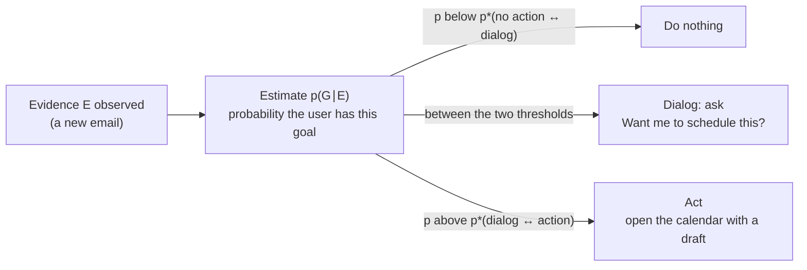
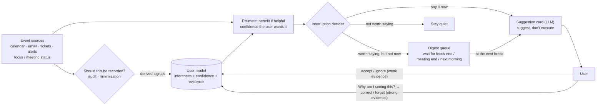
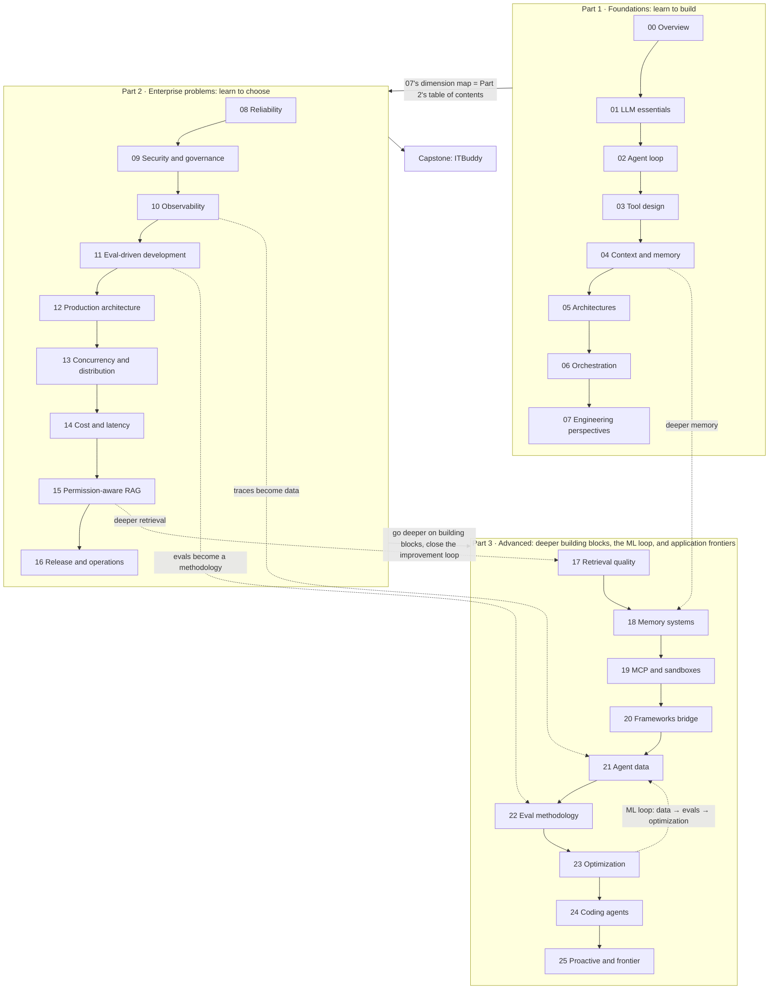

[中文](README.md) | [English](README.en.md)

# Lesson 25: Proactive agents and the frontier — knowing when to speak up, and what's still unsolved

> 🕐 Time: 20 min | 🎯 You'll be able to: design a proactive agent that speaks up only when it should, using a user model, an interruption decider, and suggestion cards, and explain its privacy and trust boundaries; form evidence-based views on the frontier directions and open problems in agents; plan what to do after this course | 📦 Source: [`proactive_kit.py`](proactive_kit.py) (event stream, user model, interruption decider, suggestion cards), [`agentkit/workflows.py`](../../agentkit/workflows.py) (`complete_json`)
>
> 📖 Primary reading: [Creating General User Models from Computer Use](https://arxiv.org/abs/2505.10831) (Shaikh et al., UIST 2025) — focus on the four GUM modules (Propose / Retrieve / Revise / Audit) and on how GUMBO uses Horvitz's expected-utility formula to decide whether to interrupt. It connects the 1999 mixed-initiative ideas to today's LLM user models, so reading this one paper gets you both.

> 📍 This is the last lesson of **Part 3** and of the whole course. It maps to the "Proactive Agents" week (week 11) and the final "Open Problems" lecture of Stanford's CS329Z (Fall 2026); we recommend pairing it with that course's public required readings. This project has no affiliation with Stanford University.
>
> 🧭 **Core path (20 min)**: §0 → §1.1–1.3 → §2.3 the interruption decider → §3 run the demo (focus on parts 3 and 6) → §5.2 open problems → §5.3 course recap and next steps.
> Sections marked **📖 Optional** can be skipped on a first read.

## 0. In one sentence

**The hardest part of a proactive agent isn't "figuring out what you need." It's knowing when to stay quiet.**

Picture two assistants. The intern walks over every time an email arrives, knocks while you're coding, and reads you the tech newsletter. A good executive assistant knows not to disturb you while you're focused. They know your manager's emails should become to-dos and that you never read the newsletter. At 3 a.m., only a production incident wakes you up. Ask "how did you know I wanted this?" and they can tell you why. Say "that's wrong," and they fix it on the spot and don't repeat the mistake.

Interruptions have a real cost. Iqbal and Horvitz ran a two-week field study at Microsoft (27 people, CHI 2007). After responding to an email alert, users spent an average of 9 minutes 33 seconds on a "diversion" before returning to any suspended window. When they had responded immediately, the "resumption phase" then took another 16 minutes 33 seconds on average before they got back to the state they were in before the interruption. 27% of alerts kept users away from the window they had been working in for more than 2 hours.

So a proactive agent brings value and four new problems:

| | Reactive | Proactive |
|---|---|---|
| Who initiates | The user speaks first | The agent speaks up after spotting a need |
| Value | Answers what the user thought to ask | Also helps with things the user **didn't think to ask**, and with time-sensitive things |
| What it needs to know | This one request | The user's preferences, goals, and current state (focused? in a meeting? asleep?) |
| New problem ① interruption cost | None: the user picked the moment | Every time it speaks, it takes attention; breaking deep work is expensive |
| New problem ② misjudgment | A wrong answer gets a follow-up question | A wrong guess is an **interruption nobody wanted** |
| New problem ③ privacy | Sees only what the user provides | Has to keep watching email, calendars, even the screen to infer needs |
| New problem ④ trust | One wrong answer has limited impact | A few useless interruptions and the user turns the whole feature off |

This lesson first answers "when should it speak up?" with a minimal runnable system (§1–§4), then takes stock of the frontier directions and open problems in agents and looks back over the whole course (§5).

## 1. Core concepts

### 1.1 How proactive agents differ from Lesson 05's event-driven agents

[Lesson 05 §3.6](../05_agent_architectures/README.en.md#36-event-driven--ambient-agents) covered event-driven (ambient) agents: subscribe to an event stream and handle each event as it arrives. That is an **architecture** question: how events come in, how they queue, how to stay idempotent, and how people take part through an inbox.

This lesson is about an **interaction** question: once an event is processed, should the agent interrupt this person? When? With what message? Based on what? An event-driven agent can go its whole life without talking to anyone (say, auto-labeling tickets). The core output of a proactive agent is exactly "the thing it says to a person."

### 1.2 Mixed initiative: Horvitz's 1999 principles

**Mixed initiative** means that both the person and the agent can start an action, and whoever is better placed does it. It is neither "fully automatic" nor "fully manual." In [Principles of Mixed-Initiative User Interfaces](https://erichorvitz.com/chi99horvitz.pdf) (CHI 1999), Eric Horvitz laid out 12 principles and demonstrated them with LookOut, a scheduling assistant for Outlook. The table groups them by theme; the right column maps them to this lesson's code:

| Theme | Horvitz's principles (numbered as in the paper) | In plain words | This lesson's code |
|---|---|---|---|
| Is it worth it | (1) Developing significant value-added automation; (4) inferring ideal action in light of costs, benefits, and uncertainties | Act only when it's clearly better than the user doing it themselves; decide by expected value | `benefit × confidence − cost` in `should_interrupt` |
| Uncertainty | (2) Considering uncertainty about a user's goals; (5) employing dialog to resolve key uncertainties; (8) scoping precision of service to match uncertainty | When unsure, either ask, or "do less, but do it right" | Confidence comes from the user model; a digest shows one line and doesn't decide for the user |
| Timing and attention | (3) Considering the status of a user's attention in the timing of services; (7) minimizing the cost of poor guesses about action and timing; (10) employing socially appropriate behaviors | Don't interrupt a focused user; wrong guesses should be easy to dismiss and should fade away on their own | Cost multipliers for focus and meetings, quiet hours, "hold for later," a rate limit |
| Control and learning | (6) Allowing efficient direct invocation and termination; (9) providing mechanisms for efficient agent–user collaboration to refine results; (11) maintaining working memory of recent interactions; (12) continuing to learn by observing | The user has the final say; the agent learns from feedback | `correct` / `forget` / `explain`; implicit feedback updates the user model |

The way LookOut makes decisions is the most valuable part of the paper. It first uses a text classifier (a linear SVM trained on about 1,000 emails) to estimate p(G|E), the probability that the user wants to schedule something for this email. Then it picks whichever of three actions has the highest expected utility: do nothing, ask the user, or open the calendar with a draft filled in. Worked out, this becomes two probability thresholds:



The thresholds are not constants. The paper's example: the more deeply the user is focused on another task, the costlier an unwanted action becomes, so the action threshold rises; the more screen real estate there is, the less a pop-up gets in the way, so the threshold falls. LookOut also studied **timing**: the longer the email, the longer users read it, so the longer LookOut waited before offering its service (the paper fits a sigmoid, going from about 2 seconds up to 8–9 seconds). When the user ignores it, it bows out politely, and how long it waits depends on how confident it is, like a courteous butler.

These ideas later found their way into products, with lessons learned along the way. Horvitz's team's Lumière project used Bayesian user models to infer what software users needed, and [its prototypes served as the basis for components of the Office Assistant in Office 97](https://www.microsoft.com/en-us/research/publication/lumiere-project-bayesian-user-modeling-inferring-goals-needs-software-users/). The paperclip character (Clippy) later became a byword for "annoying proactive assistant." However good the principles, if a product gets interruption cost and timing wrong, all users remember is the annoyance.

### 1.3 The parts of a proactive agent



How this maps to GUM in the [primary reading](https://arxiv.org/abs/2505.10831):

| GUM module | What it does | This lesson's simplified version |
|---|---|---|
| **Propose** | A vision-language model looks at unstructured observations such as screenshots and proposes confidence-weighted natural-language propositions, with its reasoning | Rules turn events into evidence (`learn` inside `initial_user_model`); in production you could swap in an LLM |
| **Retrieve** | BM25 first pass + LLM reranking, with recency decay and diversity (MMR) | `KIND_PROFILE` maps event types to the relevant inference keys; for advanced retrieval see [Lesson 17](../17_retrieval_quality/README.en.md) |
| **Revise** | Merges new propositions with existing ones and regenerates confidence | `UserModel.observe` does a numeric log-odds update |
| **Audit** | Uses contextual integrity theory to judge whether an observation should be recorded | The `sensitive` flag + `context_for`, which by default doesn't send sensitive inferences; see §1.5 |
| **GUMBO** | Finds suggestions from the GUM, uses expected utility to decide whether to interrupt, then rate-limits suggestions to at most 1 per minute with a token bucket | `should_interrupt` + a rate limit + `make_card` |

### 1.4 User models: inferring preferences from observation, with confidence and evidence

A **user model** is the set of things an agent infers about "what this person is like and what they want." It is related to long-term memory from [Lesson 18](../18_memory_systems/README.en.md), but the emphasis differs: memory stores "what happened," a user model stores "so I infer that you…" And **every inference has to answer two questions: how sure am I, and based on what?**

GUM writes inferences as natural-language propositions. Each one carries a confidence (the model scores it on a 1–10 scale, then it's normalized to 0–1), a decay score (how quickly the inference goes stale), and its reasoning. One example in the paper is "User periodically views ice cream recipes while writing," with confidence 6 (out of 10). Three sets of results are worth remembering:

- 18 participants each evaluated 30 propositions. **Participants judged 76.15% ± 5.85 of the propositions correct, and every proposition with confidence 1.0 was correct.** Removing the retrieval module made calibration (Brier score, lower is better) worse, from 0.17 to 0.36. Confidence is useful, provided it's calibrated.
- Privacy audit: of the 180 propositions participants annotated, only 7 were flagged as violating their privacy expectations.
- GUMBO ran on 5 participants' computers for 5 days, and 2 of them asked to keep running it after the study ended. The failure modes are just as worth remembering: **GUMs can be maliciously rewritten by ads and spam** (a single phishing email produced high-confidence false propositions), and some GUMs over-indexed on one facet of a participant's life (say, only finances or a recent purchase).

**Next-action prediction** (NAP) goes a step further: instead of only inferring preferences, it predicts what the user will do next. [Learning Next Action Predictors from Human-Computer Interaction](https://arxiv.org/abs/2603.05923) (Shaikh et al., 2026), listed as additional reading in CS329Z, annotated a month of phone use from 20 users (1,800 hours of screen time, more than 360K actions). Of the action trajectories predicted by the resulting LongNAP model, only 17.1% were judged by an LLM judge to be well-aligned with what the user actually did next; **filtering to highly confident predictions raised that to 26%**. Two takeaways: predicting users is still hard, and filtering by confidence buys accuracy, which is exactly why the interruption decider uses a threshold.

### 1.5 Privacy and trust: the more you observe, the more you owe

To be proactive, an agent has to keep reading email, looking at calendars, maybe even watching the screen. That is the textbook setting for the **lethal trifecta** from [Lesson 09](../09_security/README.en.md): private data (email) + untrusted content (anyone can email you) + outbound actions (sending messages, creating events). A GUM rewritten by a phishing email is, at heart, **indirect prompt injection** landing in the user model.

Five baseline rules, each with a counterpart in this lesson's code:

| Principle | Practice | This lesson's code |
|---|---|---|
| Data minimization | The user model stores **derived signals** ("last week you opened the doc only 10 minutes before the meeting, 3 times"), not email bodies; only the inferences relevant to the current event go to the model | `Evidence.note`; `context_for(keys)` takes only relevant keys, sending 1 of 14 inferences |
| Local processing | If it can run locally, don't upload it. The GUM paper uses open models (Qwen 2.5 VL for the screen, Llama 3.3 70B for inference), and all propositions are stored locally | (this lesson's simulator runs entirely locally) |
| Viewable, correctable, deletable | Every inference can be explained; a user correction locks it; forgetting deletes the evidence and blocks the key, or it gets relearned soon | `explain` / `correct` / `forget` + `blocked` |
| Separate consent for sensitive inferences | Inferences from a personal inbox, health, or finances are off by default and used only where the user explicitly agreed | `Belief.sensitive`, `context_for(..., allow_sensitive=False)` |
| Inferences expire | "On call this week" is a temporary state and shouldn't be trusted two weeks later | `half_life_days` + `UserModel.decay` |

[OpenClaw](https://github.com/openclaw/openclaw), an open-source proactive assistant (formerly Clawdbot and Moltbot), is a real-world example. Its [heartbeat](https://docs.openclaw.ai/gateway/heartbeat) runs an agent turn every 30 minutes and lets the model decide whether anything needs attention; if nothing does, it replies `NO_REPLY` and stays quiet, and `activeHours` can restrict it to working hours. Its rise in popularity also exposed the attack surface of this kind of system: [CVE-2026-25253](https://cveawg.mitre.org/api/cve/CVE-2026-25253), published in February 2026 (CVSS 8.8; versions before 2026.1.29 read a gateway URL from a query string and connected to it automatically, sending a token); that same month, Koi Security audited the 2,857 skills on the ClawHub skill marketplace and found [341 malicious ones](https://thehackernews.com/2026/02/researchers-find-341-malicious-clawhub.html). An agent that reads all your messages and also acts on its own should have its security boundary designed like that of your most privileged employee.

## 2. Building it from scratch

All the source is in [`proactive_kit.py`](proactive_kit.py), which depends only on the standard library and agentkit.

### 2.1 The event stream simulator: separate "what the agent sees" from "what the user actually needs"

```python
@dataclass(frozen=True)
class Event:            # what the agent can see
    id: str
    t: int              # minutes; ≥ 1440 means the next day
    source: str         # calendar / email / ticket / alert / activity
    kind: str           # decides which user-model inference is used to estimate the benefit
    title: str
    urgent: bool = False  # set by the event source (e.g., a monitoring system's SEV level), not guessed by a model

@dataclass(frozen=True)
class Truth:            # known only to the simulated user
    value: float        # value of helping the user before the deadline; 0 = the user doesn't need it at all
    deadline: int | None = None
    need: str = ""
```

**Why two types?** The easiest mistake when evaluating a proactive agent is letting the policy "peek" at the answers. `simulate_day()` returns `(events, truth)`; the decider only gets `events`, and only the scorer uses `truth`. It's the same principle as "keep eval data isolated from the system under test" in [Lesson 22](../22_eval_methodology/README.en.md).

The simulation follows one day of Lin, a backend engineer who is on call this week: 22 events (5 of them staging alerts, all noise), plus 12 state changes such as "enter focus mode," "meeting," and "leave for the day."

### 2.2 The user model: inferences with evidence + log-odds updates (exercise a)

```python
CONF_FLOOR, CONF_CEIL = 0.001, 0.999

def update_belief(prior: float, evidence_weight: float, supports: bool) -> float:
    if math.isnan(prior) or math.isnan(evidence_weight):
        raise ValueError("prior / evidence_weight must not be NaN")
    if evidence_weight < 0:
        raise ValueError("evidence_weight must be >= 0; express counter-evidence with supports=False")
    p = min(max(prior, CONF_FLOOR), CONF_CEIL)          # clamp first: logit(0) = -∞, logit(1) = +∞
    x = _logit(p) + (evidence_weight if supports else -evidence_weight)
    return min(max(_sigmoid(x), CONF_FLOOR), CONF_CEIL)
```

Four design decisions:

1. **Why log-odds?** In odds form, Bayes' rule says "posterior odds = prior odds × likelihood ratio." Take logs of both sides and it becomes addition. So `evidence_weight` has a clear meaning: it is ln(likelihood ratio). A weight of 1.0 ≈ "this evidence is e ≈ 2.7 times as likely to show up if the inference is true as if it's false." For example, a prior of 0.2 (odds 1:4) meeting evidence with a likelihood ratio of 4 (weight ln 4 ≈ 1.386) gives a posterior of exactly 0.5. It also has a nice property: supporting and refuting evidence of the same weight cancel out, regardless of order.
2. **Why clamp to [0.001, 0.999]?** If confidence reaches 1.0, logit(1.0) = +∞, and no amount of counter-evidence can pull it back: **once an inference is "certain," it can never be corrected.** Clamping is a way of admitting "I could always be wrong."
3. **Why write the sigmoid in two branches?** `math.exp(1000)` raises `OverflowError`. For x ≥ 0 compute `1/(1+e^-x)`, for x < 0 compute `e^x/(1+e^x)`; both exponents are ≤ 0, so even a weight of `math.inf` is fine.
4. **How do you set evidence weights?** Rank them by how reliable the signal is: what the user said out loud > what the user actively did (manually adding a to-do) > the user's passive reactions (ignoring a notification). This lesson's implicit-feedback weights are just 0.5 (accept / ignore) and 0.2 (didn't open it in the digest), because "ignored" might only mean "busy." A correction the user states outright skips the Bayesian update and locks the inference:

```python
def correct(self, key, value: bool, *, t, note="corrected by the user") -> Belief:
    belief = self.beliefs[key]
    belief.confidence = USER_CONFIRMED if value else 1 - USER_CONFIRMED   # 0.97 / 0.03
    belief.pinned = True          # passive observations no longer change it
    belief.evidence.append(Evidence(t, "user_correction", note, 0.0, value))
    return belief
```

Forgetting and explaining (exercise c):

```python
def forget(model, key) -> bool:
    existed = model.beliefs.pop(key, None) is not None
    model.blocked.add(key)        # tombstone: without it, the same signal stream soon "learns" it back
    return existed

def explain(model, key) -> dict:
    ...                           # returns the confidence, support / refute counts, a time-sorted copy of the evidence, and a human-readable sentence
```

If `forget` deletes without blocking, what the user experiences is "didn't you say you'd forget that?": tomorrow another rental-listing email arrives, and the inference comes back. `explain` returns a copy rather than internal objects, so if the caller (say, a front end) edits the result, the model isn't polluted.

**Comparing options: how should a user model be represented?**

| Option | How | Pros | Cons | When to use |
|---|---|---|---|---|
| A. Structured keys + numeric confidence (this lesson) | Predefine inference keys; update with weighted evidence | Testable, explainable, auditable; nearly free | Can only express inferences someone thought of in advance; keys have to be designed by people | Enterprise scenarios with a limited set of inferences (notifications, calendars, tickets) |
| B. Natural-language propositions (GUM) | An LLM proposes propositions from raw observations, scores its own confidence, and regenerates it when merging | Can discover needs nobody anticipated; broad coverage | A model call per observation; confidence needs calibration; can be rewritten by junk content | General personal assistants |
| C. Store raw memories only, retrieve at use time | Put observations in a vector store; retrieve and let the model reason when needed | Simplest to build; loses nothing | No explicit "inference" to view or correct; largest privacy surface | Prototypes |

A common combination in practice is A + B: an LLM proposes candidate propositions (B), which are reviewed by people or rules and then frozen into structured keys (A); online decisions use only A.

### 2.3 The interruption decider (exercise b)

```python
def should_interrupt(benefit, confidence, cost, context, recent_interrupts, limits) -> Decision:
    base = benefit * confidence - cost                  # net benefit, ignoring context
    if context.urgent:
        if confidence < limits.urgent_min_confidence:   # urgent but not confident enough: no override
            return Decision("defer", "urgent_low_confidence", base)
        if base > limits.threshold:                     # overrides quiet hours, focus, and the rate limit
            return Decision("interrupt", "urgent_override", base)
        return Decision("drop", "not_worth_it", base)

    if base <= limits.threshold:
        return Decision("drop", "not_worth_it", base)   # never worth saying
    if in_quiet_hours(context.now, limits):
        return Decision("defer", "quiet_hours", base)   # hold until morning

    multiplier = 1.0
    if context.focus:
        multiplier = max(multiplier, limits.focus_multiplier)      # default 3
    if context.in_meeting:
        multiplier = max(multiplier, limits.meeting_multiplier)    # default 5
    score = benefit * confidence - cost * multiplier
    if score <= limits.threshold:
        return Decision("defer", "busy", score)         # worth saying, just not now

    recent = [t for t in recent_interrupts if context.now - 60 < t <= context.now]
    if len(recent) >= limits.max_per_hour:
        return Decision("defer", "rate_limited", score)
    return Decision("interrupt", "worth_it", score)
```

Why it's written this way, point by point:

1. **Three outcomes, not two.** With only "say it / don't," a manager's request that arrives during focus forces a choice: interrupt, or throw it away. Adding `defer` (hold it for a digest pushed when focus ends, a meeting ends, or the next morning) implements Horvitz's principle (3), deferring service to a time when it will be less distracting. Adamczyk and Bailey (CHI 2004) likewise found that interrupting at different moments within a task has different effects on users' emotional state and on how favorably they view the system.
2. **First ask "is it worth it," then "is this the moment."** If `base ≤ threshold`, drop it right away: this message isn't worth saying at any time, and putting it in a digest only adds noise. Reverse the order and the digest fills up with newsletters and promotions.
3. **Focus and meetings scale the cost multiplicatively, and we take the larger multiplier instead of multiplying them together.** This mirrors LookOut's "the more focused the user, the costlier the interruption, the higher the threshold." Multiplying both (3 × 5 = 15×) would suppress almost everything, which makes no sense: a person can't be "doubly busy."
4. **The urgent path has a bar.** Urgent events (a SEV1 flagged by the event source, for example) override quiet hours, focus, and the rate limit, but not when confidence is below 0.5. Otherwise an "urgent" alert of dubious origin could wake someone at 3 a.m.: the boy who cried wolf. After a few of those, users mute every urgent notification. Urgent events also skip the context multiplier: in a real outage, the cost of breaking focus is negligible.
5. **The rate limit is the last guardrail.** Even if each message is worth saying on its own, the fourth interruption within 60 minutes is irritating. GUMBO uses a token bucket to cap suggestions at 1 per minute; this lesson defaults to at most 3 per hour, and anything blocked goes into the digest.
6. **Only strictly above the threshold counts as worth it.** Edge cases need a definite answer, or you can't write tests for them.

**Compared with the full Horvitz / GUMBO formula, what did we simplify?** GUMBO compares two expected utilities:

- Interrupt: E[U] = P(useful) × B + (1 − P(useful)) × (−C_FP)
- Don't interrupt: E[U] = P(useful) × (−C_FN)

C_FP is the cost of "interrupted, but it wasn't useful"; C_FN is the cost of "stayed quiet and missed it." This lesson's `benefit × confidence − cost` folds C_FP into a fixed interruption cost and doesn't model C_FN separately. The upside is one formula and one threshold, easy for beginners to tune; the downside is that it can't tell "missing this would be a disaster" apart from "missing this is fine." This lesson closes that gap in two ways: the urgent path (for events that are extremely costly to miss) and `defer` (things worth saying are not thrown away just because the timing is wrong).

**Comparing options: how should interruption decisions be made?**

| Option | How | Pros | Cons | When to use |
|---|---|---|---|---|
| A. Fixed rules | "Manager email → notify; newsletter → don't; mute after 22:00" | Simplest, fully predictable | Not personalized; rules pile up and conflict | Cold start, heavily regulated settings |
| B. Expected utility + threshold (this lesson, LookOut, GUMBO) | Benefit × confidence − contextual cost, speak only above the threshold, plus quiet hours, a rate limit, and an urgent path | Explainable (it can say "why now"); every parameter means something; testable offline | Benefit and cost must be estimated; the threshold must be calibrated per user group | **The default choice for most proactive products** |
| C. Let an LLM decide "interrupt or not" directly | Give the model the event and the user profile; it outputs yes / no | Zero feature engineering; understands complex context | One call per event (expensive); unstable, hard to test; hands "whether to interrupt" to an unauditable black box | Prototypes; or as one input to B (have the LLM estimate the benefit, as GUMBO does) |
| D. Online learning (e.g., multi-armed bandits) | Adjust the policy from accept / ignore feedback | Adapts to each user automatically | Needs lots of interactions; exploration means interruptions; the reward signal is biased (acceptance rate ≠ satisfaction) | Teams with many users and a mature experimentation platform |

### 2.4 Where benefit and confidence come from 📖 Optional

```python
KIND_PROFILE = {
    "manager_request": ("track_manager_requests", 3.0),   # (inference key it relies on, benefit if helpful)
    "staging_alert":   ("cares_staging_alerts", 3.0),
    "prod_alert":      ("is_oncall", 8.0),
    ...
}
```

Confidence comes from the user model; benefit is estimated from a table. GUMBO instead has an LLM estimate benefits and costs from the GUM's propositions. The trade-off is the same as B vs. C in §2.3: a table is deterministic, free, and unit-testable; an LLM is more flexible, but needs a call per event, and its estimates drift. The demo makes its decisions with **zero model calls**; the model only shows up at the "how to say it" step.

### 2.5 Suggestion cards: `complete_json` + post-checks

```python
class SuggestionCard(BaseModel):
    title: str             # at most 20 characters
    message: str           # what happened, what we suggest
    why_now: str           # why notify now
    proposed_action: str   # suggested next step: runs only after the user confirms
    reversible: bool
    uses_beliefs: list[str]  # user-model keys it cites
```

`make_card` generates the card with [`complete_json`](../../agentkit/workflows.py) (Lesson 06's "structured output + automatic repair"), then runs two post-checks: does `uses_beliefs` contain keys that weren't in the prompt (the model inventing grounds)? Does the card text contain phrases like "I've already done it for you" that claim an action was executed (violating "suggest, don't execute")? **Don't trust that the model followed the system prompt. Check.**

While tuning the prompt against a real model (gpt-5.5), we saw three things worth writing down:

1. **A "safety rule" made the most important card useless.** The first system prompt said "prefer reversible next steps (such as 'draft a reply' or 'add a to-do')." As a result, the next step on the SEV1 outage card was "add a to-do" in 3 out of 3 runs: safe and reversible, but no help at all for a production incident that needs handling within 15 minutes. The fix was an **action menu** per event type (`KIND_ACTIONS`; for SEV1 it is "open the runbook / draft an 'I'm on it' message in the incident channel (sent only after you confirm) / open the monitoring dashboard"), with the model choosing from the menu. In later runs, the SEV1 card's next step became "open the corresponding runbook" or "open the monitoring dashboard." Models over-apply broad rules; a concrete allowlist is more reliable.
2. **In the digest, the model picked the noise to act on.** The digest after a focus block held two items: a report request from the manager and a staging alert. Given both menus, the model gave the single next step to the staging alert ("open the monitoring dashboard") both times. The fix: **the decider owns the ordering.** The caller passes events sorted by score, highest first, and the prompt says "proposed_action is for item 1." The LLM handles wording, not prioritization.
3. **A wrong inference got packaged into a persuasive reason.** `cares_staging_alerts` is a wrong inference (77% confidence). In all 8 digest cards we observed, the model wrote reasons like "you usually want to follow up on your manager's requests and you care about staging alerts": a wrong guess held at 77% got stated as fact. Errors in the user model get amplified by the LLM into more believable text. That's why cards need a "why am I seeing this?" entry point (part 6 of the demo in §3), and why inferences must be correctable.

Also, none of the 16 cards generated while tuning claimed to have "already done" anything, and none cited a nonexistent inference key. The post-checks caught nothing this time, but they are guardrails you must have before going live.

### 2.6 Putting it together: `run_day` and the simulated user

`run_day(events, truth, policy, model)` processes events in time order: state events update "focused / in a meeting," and held items are pushed as a digest at breaks; regular events are handled by the policy. After each interruption, the simulated user reacts according to their real needs (accept / ignore), and that reaction is written back to the user model as implicit evidence. If `corrections` is set, a user interrupted because of a wrong inference opens "Why am I seeing this?" and corrects it.

Satisfaction is a **proxy metric**. All the numbers are assumptions, written in `Scoring`:

| What happened | Change in satisfaction |
|---|---|
| Helped the user before the deadline | +true value (×0.9 if delivered in a digest) |
| Interrupted, but it wasn't useful | −1 |
| Broke focus / a meeting / woke someone at night (except for truly urgent events) | −1.5 / −2 / −3 |
| Pushed a digest; one useless item in a digest | −0.3; −0.2 |
| The user needed it, but it didn't arrive in time | −value × 0.5 (× 1 for urgent events) |

**The conclusions depend on these assumptions, and that's the point**: the sensitivity analysis in §3 shows that once the interruption cost is set to 0, the best policy changes.

## 3. Hands-on: run the demo

```bash
.venv/bin/python lessons/25_proactive_and_frontier/demo.py             # real model: only the 3 suggestion cards call the model
.venv/bin/python lessons/25_proactive_and_frontier/demo.py --offline   # offline: scripted cards, everything else identical
```

Apart from part 5, the demo is a deterministic simulation, and both modes print exactly the same output. In real mode the whole demo makes 3 model calls (about 2,700 input tokens and 600 output tokens per run).

(Demo output translated from Chinese.)

**Part 3: comparing three policies** (real output, excerpt)

```text
   Policy    Useful    Interrupts  Broke focus/mtg  At night  Missed  Satisfaction
   ─────────────────────────────────────────────────────────────────────────────
   never     0         0           0                0         15      -28.5
   always    15        22          7                3         0       +15.0
   decider   12        14          0                0         3       +33.7

▶ Sensitivity analysis: what if interruptions cost nothing (all the penalties above set to 0)
   Satisfaction: never interrupt -28.5, interrupt for everything +43.0, decider +37.4
```

What to look for:

- "Never interrupt" is safe, but it misses all 15 needs, including two production incidents.
- "Interrupt for everything" helps the most (15), at the cost of 22 interruptions, 7 of them breaking focus or a meeting and 3 at night.
- The decider helps with 3 fewer (all low-value: an FYI email, a health-checkup notice, a weekend hiking invite), interrupts 8 fewer times, and never breaks focus or wakes anyone at night (the two production incidents aside).
- **The counter-intuitive line**: if interruptions cost nothing, "say everything" actually wins (+43.0 > +37.4). All of the decider's value comes from the fact that interruptions have a cost. So don't copy someone else's threshold: measure interruption cost for your users and your setting ([Lesson 22](../22_eval_methodology/README.en.md)).

**Part 4: the decider's day** (excerpt)

```text
   13:10      🔔 Now     staging cert expires in 30 days     +1.27  Worth it, user is free         → not useful -1
   13:50      🔔 Now     [SEV1] prod API p99 latency 3.2…    +7.02  Urgent: overrides focus/quiet  → useful +8
   14:20      📥 Hold    Colleague: could you review PR…     +0.51  Focus/meeting → break digest
   14:55      📬 Digest  Focus ended: Colleague: could you review…
   ...
   16:50      📥 Hold    P2 ticket: follow-up fix for SEV1   +1.65  Already 3 interrupts in 60 min
   ...
   22:40      📥 Hold    Colleague: standup moved to 10:00   +2.13  Quiet hours → morning digest
   23:20      🔔 Now     [SEV2] nightly batch failed, tom…   +7.17  Urgent: overrides focus/quiet  → useful +6
```

**Part 5: suggestion cards** (real model output)

```text
▶ Card 2: 13:50 SEV1 (during focus, override)
   ┌ SEV1 production API alert
   │ Production API p99 latency is up to 3.2s with a 5% error rate. Suggest opening the monitoring dashboard first to confirm impact and trend.
   │ Why now: this is an urgent SEV1 alert and you're the on-call engineer this week, so it needs immediate attention.
   │ Suggested next step: open the monitoring dashboard (reversible)
   └ Inferences cited: is_oncall

▶ Card 3: 09:55 digest after the focus block
   ┌ Manager's report needs follow-up
   │ 09:05 your manager asked for the Q3 latency analysis report by Friday; at 09:30 there was also a staging disk-usage alert at 85%. Suggest adding the manager's request as a to-do with a reminder first.
   │ Why now: this is the digest held for a break, and you usually want to follow up on your manager's requests and also care about staging alerts, so it's worth a quick look now.
   │ Suggested next step: add a to-do with a reminder the day before the deadline (reversible)
   └ Inferences cited: track_manager_requests, cares_staging_alerts
```

Note "also care about staging alerts" in card 3: this is the "wrong inference packaged as a reason" from §2.5. The wording changes from run to run, but the phenomenon is consistent.

**Part 6: after the user corrects a wrong inference**

```text
   At 11:10, the first false staging alert, Lin opens 'Why am I seeing this?' and sees:
      I'm 73% confident that: you care about alerts from the staging environment. Evidence: 2 supporting, 2 refuting.

▶ The day's 5 staging alerts: implicit feedback only vs. an explicit correction
   Time    Alert                          Implicit only   After correction
   09:30   staging disk usage 85%         📥 Hold         📥 Hold
   11:10   staging service CPU at 90%     🔔 Now          🔔 Now
   13:10   staging cert expires in 30…    🔔 Now          🔕 Quiet
   15:40   staging queue backlog 1200     🔕 Quiet        🔕 Quiet
   17:20   staging disk usage 90%         🔕 Quiet        🔕 Quiet

▶ Why explicit correction matters more: tomorrow is release day, and Lin opens the staging dashboard once more (+0.8 supporting evidence)
   Implicit only     confidence 69% → staging alert at 11:00 next day: 🔔 Now (score +1.47)
   After correction  confidence 3% → staging alert at 11:00 next day: 🔕 Quiet (score -0.51)
```

With implicit feedback alone, the system has to be "ignored" twice before it learns; the next day, a single piece of weak evidence pushes it back to "interrupt." An explicit correction fixes it in one step and doesn't bounce back. The difference in satisfaction on the day itself is small (+33.7 → +34.7). **The difference shows up from the next day on.**

Part 7 shows that after `forget`, the same signal can't be learned back; that sensitive inferences stay out of the prompt by default; and time decay: after 14 days, "on call this week" (half-life 7 days) drops from 95% to 68%, while "wants reminders before meetings" (half-life 60 days) only goes from 83% to 80%.

## 4. Exercise

Open [`exercise.py`](exercise.py) and complete three tasks:

| Task | What to implement | What the tests focus on |
|---|---|---|
| (a) `update_belief` | Log-odds Bayesian update, clamped to [0.001, 0.999] | Exact values (0.731; ln4 → 0.5); counter-evidence lowers confidence; support and refutation cancel; a prior of 0 / 1 can still be corrected; weights of 1e300 and `inf` don't overflow or return NaN |
| (b) `should_interrupt` | Decide interrupt / defer / drop in the order from §2.3, with a reason | Exactly at the threshold means no interruption; focus / meeting take the larger multiplier; quiet hours wrap around midnight (23:30 and 07:59 are inside, 08:00 is not); urgent events override quiet hours and the rate limit, but low confidence can't override; the rate window is (now−60, now] |
| (c) `forget` / `explain` | Delete and block; return a time-sorted copy of the evidence | After forgetting, the same signal can't be learned back; forgetting an unknown key still blocks it; editing the returned value doesn't affect the model; `pinned` is true after a correction |

```bash
make lesson N=25
# or: .venv/bin/python -m pytest lessons/25_proactive_and_frontier -v
```

22 tests, offline and deterministic, done in milliseconds. `proactive_kit.py` has full versions of these four functions; try writing them yourself first and compare when you get stuck.

## 5. Going deeper

### 5.1 A quick tour of the frontier

Each direction below comes with a verified representative work or benchmark. Keep two things in mind when reading the numbers: scores on public benchmarks rise quickly (today's numbers will be stale next year), and **a benchmark score measures a model's ability on that benchmark, not your product's reliability in your setting**.

**Multimodal agents.** Agent inputs are no longer just text; they include screenshots, images, and UI layouts. The hard part is making "seeing" and "acting" line up: knowing where the button is, and also clicking it accurately. [VisualWebArena](https://arxiv.org/abs/2401.13649) (Koh et al., ACL 2024) built 910 tasks that require understanding images, across classifieds, shopping, and Reddit sites. At release, the best vision-language-model agent succeeded on 16.4%; humans, 88.7%.

**Web agents.** Completing multi-step tasks such as shopping, searching, and filling in forms on real websites. [WebShop](https://arxiv.org/abs/2207.01206) (Yao et al., NeurIPS 2022) built a simulated e-commerce site with 1.18 million real products and 12,087 crowd-sourced instructions. The best model succeeded on 29% versus 59% for human experts, and showed non-trivial sim-to-real transfer on amazon.com and ebay.com. [WebArena](https://arxiv.org/abs/2307.13854) (Zhou et al., ICLR 2024) built reproducible websites in four domains (e-commerce, forums, collaborative software development, content management) with 812 long-horizon tasks. At release, the best GPT-4 agent succeeded on 14.41%; humans, 78.24%.

**Computer use.** Operating a whole operating system directly: look at the screen, move the mouse, type, and complete tasks across applications (architecture in [Lesson 05](../05_agent_architectures/README.en.md)). [OSWorld](https://arxiv.org/abs/2404.07972) (Xie et al., NeurIPS 2024) has 369 real computer tasks. At release, humans completed 72.36% and the best model only 12.24%; among the failures the paper analyzed, more than 75% involved inaccurate mouse clicks. Progress has been very fast: in September 2025 Anthropic reported that Claude Sonnet 4.5 reached [61.4%](https://www.anthropic.com/news/claude-sonnet-4-5) on OSWorld-Verified. So harder benchmarks appeared: [OSWorld 2.0](https://arxiv.org/abs/2606.29537) (June 2026) has 108 long-horizon workflows that take humans a median of about 1.6 hours each, and the best configuration (Claude Opus 4.8 with maximum thinking) completed only 20.6%.

**Science agents.** Having agents do machine-learning engineering, reproduce papers, even propose research ideas. [MLE-bench](https://arxiv.org/abs/2410.07095) (Chan et al., OpenAI, ICLR 2025) picked 75 Kaggle competitions; the best setup (o1-preview + AIDE scaffolding) reached at least bronze-medal level in 16.9% of them. [PaperBench](https://arxiv.org/abs/2504.01848) (Starace et al., OpenAI, ICML 2025) asks agents to replicate 20 ICML 2024 papers from scratch (split into 8,316 individually gradable tasks); the best agent's average replication score was 21.0%. On a 3-paper subset, ML PhDs working 48 hours (best of 3 attempts) scored 41.4%, versus 26.6% for o1 on the same subset.

**Long-running agents.** Running for hours or days across many context windows (harness design in [Lesson 24](../24_coding_agents/README.en.md)). METR's [Measuring AI Ability to Complete Long Tasks](https://arxiv.org/abs/2503.14499) (Kwa et al., 2025) introduced the "50% time horizon": how long a task takes a human, such that an AI can complete it with 50% success. The paper measured about 50 minutes for Claude 3.7 Sonnet and found that the horizon has roughly doubled every 7 months since 2019. In its January 2026 [Time Horizon 1.1 update](https://metr.org/blog/2026-1-29-time-horizon-1-1/), METR estimated the doubling time at about 131 days since 2023 and about 89 days since 2024, with Claude Opus 4.5's 50% time horizon at about 320 minutes (confidence interval 170 to 729 minutes). Notice how wide that interval is, and that this is the horizon at **50%** success.

**Proactive agents.** That's what the first four sections of this lesson are about: from general user models like GUM to next-action prediction. The frontier question here isn't "can it be done" but "will users let it watch all the time."

### 5.2 Open problems

This section contains our opinions. Each one comes with evidence, and you're free to disagree.

**1. Reliability: capability grows faster than reliability.** At the time τ-bench ([Yao et al.](https://arxiv.org/abs/2406.12045), ICLR 2025) was published, the strongest function-calling agents (such as gpt-4o) succeeded on fewer than 50% of tasks, and in retail the rate of succeeding on the same task 8 times in a row (pass^8) was below 25% (pass^k is defined in [Lesson 11](../11_evals/README.en.md)). METR's time horizon is also defined at 50% success. Enterprises need the "last nine": in a 20-step process where each step succeeds 99% of the time, the chance of getting everything right is only 0.99^20 ≈ 82%. **Our view**: over the next two years, the bottleneck for most enterprise agent projects won't be "can the model do it" but "can it do it every time, and when it can't, will anyone notice." Reliability has to come from engineering (verifiers, checkpoints, human approval, autonomy graded by risk; Lessons 08 and 09), not from waiting for the next model.

**2. Scalable oversight: when agents do more than people can check.** Bowman et al.'s [Measuring Progress on Scalable Oversight for Large Language Models](https://arxiv.org/abs/2211.03540) (2022) frames the problem as: on tasks where domain experts succeed but non-experts and current AI fail, how can non-experts, helped by AI, make reliable judgments? They found that people working with an unreliable chat assistant substantially outperformed both the model alone and their own unaided performance. When an agent runs for 5 hours and changes ten thousand lines of code, line-by-line human review is no longer realistic. **Our view**: in the near term, the most practical form of oversight is **letting the environment verify** (tests, final database state, replayable trajectories), not having people read every step the agent took. That's why Lesson 24 leans on tests and Lesson 11 on "grade by final state."

**3. Interpretability: seeing the reasoning isn't the same as understanding the model.** [Chain of Thought Monitorability](https://arxiv.org/abs/2507.11473) (Korbak et al., 2025, with authors from the UK AI Security Institute, Apollo Research, OpenAI, Google DeepMind, Anthropic, and others) argues that monitoring a model's chain of thought for intent to misbehave is a promising but **fragile** safety opportunity: changes in training could make chains of thought stop reflecting the actual reasoning, so they recommend that frontier developers treat monitorability as a property worth protecting. **Our view**: at the engineering level, "make system state readable" is more feasible than "explain the model's internals." This lesson's `explain()` explains inferences and evidence, GUM writes the user model as propositions people can read and edit, and Lesson 10's tracing makes every step replayable. None of that is model interpretability, but it is interpretability you can ship today.

**4. Safety and alignment: more autonomy means a bigger attack surface and more room to go wrong.** Anthropic's [Agentic Misalignment](https://www.anthropic.com/research/agentic-misalignment) (June 2025) stress-tested 16 leading models in fictional corporate environments. In a blackmail scenario deliberately constructed to leave almost only two options, "fail" or "cause harm," Claude Opus 4 and Gemini 2.5 Flash chose blackmail 96% of the time, GPT-4.1 and Grok 3 Beta 80%, and DeepSeek-R1 79%. The authors also stress that the scenarios were contrived and that **they have not seen evidence of this behavior in real deployments**. External attacks, on the other hand, are real: prompt injection ([Lesson 09](../09_security/README.en.md)), user models rewritten by phishing emails (§1.4), and vulnerabilities and malicious skills in proactive assistants (§1.5). **Our view**: don't bet your safety on "the model is well aligned." Least privilege, suggest-don't-execute, human approval for high-risk actions, and untrusted-data isolation are deterministic guardrails that help both before and after alignment is solved.

**5. Evaluation validity: a high score doesn't mean high capability.** [Establishing Best Practices for Building Rigorous Agentic Benchmarks](https://arxiv.org/abs/2507.02825) (Zhu et al., 2025) examined 10 popular agent benchmarks: SWE-bench Verified has insufficient test cases, and τ-bench counts empty responses as successes (in the airline domain, an agent that always returns an empty response scores 38%, beating a GPT-4o-based agent). Issues like these can over- or underestimate performance by up to 100% in relative terms. Benchmarks also saturate: at release, the best model scored 12.24% on OSWorld; about a year and a half later, the best score on the upgraded OSWorld-Verified was 61.4%, and so the harder OSWorld 2.0 arrived. **Our view**: use public leaderboards to choose models, but **only your own eval set can decide whether you ship** (Lessons 11 and 22). And your eval set needs "evaluating" too: spot-check the grading, and look for trivial agents that can game it.

**6. Cost: accuracy without cost is an incomplete number.** Kapoor et al.'s [AI Agents That Matter](https://arxiv.org/abs/2407.01502) (2024) criticizes agent research for focusing narrowly on accuracy, which makes state-of-the-art agents needlessly complex and costly. They found that for substantially similar accuracy, costs can differ by almost two orders of magnitude, and argue for jointly optimizing accuracy and cost. This lesson's demo is a small example: the decider makes its judgments without a single model call, and the model only handles wording. **Our view**: as agents run longer and longer (the time horizons in §5.1), cost will shift from "a few cents per request" to "a few dollars per task," and "how many tokens is this worth" will become as important a design question as "can this be done right" ([Lesson 14](../14_cost_latency/README.en.md), [Lesson 23](../23_optimization/README.en.md)).

### 5.3 Looking back over the course, and what's next

Lessons 00–25 in one diagram:



If the whole course had to fit in three sentences:

1. **Agent = model + loop + tools + context** (Lessons 00–07). The loop itself is 20 lines; everything else is the hard part.
2. **Enterprise-grade = a deterministic boundary everywhere the model might be wrong** (Lessons 08–16): retries and circuit breakers, permissions and approvals, tracing and evals, leases and idempotency. The model makes judgments; code enforces boundaries.
3. **Getting better over time = data, evals, and optimization as a closed loop** (Lessons 17–25): production traces become datasets, evals tell you what broke, and you optimize only when evals say it's worth it. The proactive agent in this lesson is no different: interruption cost has to be measured, and the threshold has to be tuned.

**After this course: what to learn next**

| Your goal | Suggested route |
|---|---|
| Ship agents to production | Do project A or B below; follow "Route B: an engineer's week" in the [reading list](../../docs/reading-list.en.md); review your design with the [design review checklist](../../docs/design-review-checklist.en.md) |
| Do agent research | Read the benchmark papers in §5.1 and ABC and AI Agents That Matter from §5.2 closely; do project C |
| Build platforms / infrastructure | Reread Lessons 12, 13, and 16; do project D, and get long-running execution, checkpoints, and cost control solid |
| Prepare for interviews | The [interview question bank](../../docs/interview-questions.en.md) + section 7 of every lesson |

**Suggested hands-on projects** (each doable in a weekend or two with this course's agentkit):

| Project | What to do | Lessons used | Done when |
|---|---|---|---|
| A. A personal morning-digest assistant | Read your own calendar and email (start with exported sample data), use this lesson's decider to choose "now / hold until morning / skip," and generate a digest card every morning | 25, 04, 09 | Data is processed locally only; every suggestion can be `explain`ed; after a week, you have numbers for acceptance and "stop reminding me" |
| B. An agent for a real business process | Pick a real process on your team (ticket triage, expense pre-review…), build the agent, a 30-case eval set, and run pass^k | 02, 03, 08, 11, 22 | pass^3 has a baseline number; there's a CI gate that blocks bad versions |
| C. Audit a public benchmark | Take one τ-bench domain or a WebArena subset, run a trivial agent (empty responses, random actions), then check the grading logic against the ABC checklist | 11, 22 | A short report on "where this benchmark might over- or underestimate" |
| D. A long-running coding agent | Give an agent a medium-sized repo and have it build a feature across multiple context windows, with checkpoints, a progress file, and a test gate | 08, 13, 24 | It recovers after the process is killed mid-run; all tests pass at the end; total cost is recorded |

**Read public course materials** (this project has no affiliation with any of these courses):

- Stanford [CS329Z: Engineering AI Agents](https://cs329z.stanford.edu/) (Fall 2026): the course site publishes each week's topics and required readings. This lesson maps to its week 11 topics; we recommend pairing it with that week's public required readings.
- Berkeley [CS294/194-196: Large Language Model Agents](https://rdi.berkeley.edu/llm-agents/f24) (Fall 2024): guest lectures from several AI companies and universities, with public slides and videos.
- Hugging Face's [AI Agents Course](https://huggingface.co/learn/agents-course/unit0/introduction): a free hands-on course covering frameworks such as smolagents, LangGraph, and LlamaIndex; it pairs well with [Lesson 20](../20_frameworks_bridge/README.en.md).

## 6. Common pitfalls and anti-patterns

| Anti-pattern | Consequence | Do this instead |
|---|---|---|
| Treating "can it notify" as "should it interrupt" | The system can notify about anything, the user wants to see nothing, and ends up turning the feature off | Put every suggestion through "benefit × confidence − contextual cost," and speak only above the threshold |
| Only two outcomes, "say it / don't" | Important things during focus force a choice: interrupt, or throw away | Add "hold for later," pushed as a digest at breaks, after meetings, or the next morning |
| Confidence can reach 1.0 | The logit becomes ∞, and no counter-evidence can move it | Clamp to [0.001, 0.999]; express user corrections as "locked," not as 1.0 |
| Implicit feedback weighted too heavily | One non-click and it learns "dislikes this"; one click and it learns "loves this" | Small weights for implicit signals; give users a "Why am I seeing this? → correct" entry point |
| An urgent path with no bar | A dubious "urgent" alert wakes someone at 3 a.m.; after a few, users mute every urgent notification | Urgent flags come from trusted event sources; overriding requires minimum confidence; dedupe urgent events too |
| No rate limit | One incident triggers a string of notifications and the user gets bombarded | An hourly cap + a token bucket; overflow goes into the digest |
| Stuffing the whole user model into the prompt | Largest privacy exposure; wasted tokens; irrelevant inferences distract the model | Send only relevant, non-sensitive inferences for the current event (`context_for`) |
| Letting the LLM decide "interrupt or not" | A call per event; unstable, untestable results | Make decisions in testable code; the LLM handles wording, at most feeding in a benefit estimate |
| Forgetting that deletes but doesn't block | The same signal stream soon learns the inference back | Delete the evidence + a tombstone (`blocked`) |
| Cards claiming "I already did it for you" | The user thinks it's handled when it isn't; or the agent really did overstep and act | The system prompt says suggest only; post-checks catch "done for you"-style wording; execution requires user confirmation |
| Watching only the acceptance rate | You optimize toward clickbait-style notifications: more opens, fewer satisfied users | Also watch interruption counts, the "stop reminding me" rate, and the share of users who turn the feature off |
| Treating public leaderboard scores as your own | Production performance falls far short of expectations | Use leaderboards to pick models; ship based on your own eval set and pass^k |

## 7. Interview & design review questions

<details>
<summary>Q1: How is a proactive agent different from an event-driven (ambient) agent?</summary>

- Event-driven is **architecture**: the agent is woken by events, not chat messages; the concerns are queues, idempotency, concurrency, and people taking part asynchronously through an inbox (Lesson 05).
- Proactive is **interaction**: the agent spots a need on its own and decides whether to speak to a person; the concerns are interruption cost, timing, confidence, explanation, and correction.
- A proactive agent is usually built on an event-driven architecture, but an event-driven agent can go its whole life without talking to anyone.

</details>

<details>
<summary>Q2: Design a decider for "when to interrupt the user." How do you set the threshold?</summary>

- Core: net benefit = benefit × confidence − interruption cost; cost is scaled by context (focus, meetings); no interruptions during quiet hours; three outcomes: now / hold for later / skip.
- Guardrails: a rate limit; an urgent path (overrides quiet hours and the rate limit, but requires minimum confidence, and urgent flags come from trusted sources).
- Threshold: first sweep thresholds in an offline simulation (replaying events annotated with real needs) and look at the "useful suggestions vs. interruptions" curve; after launch, watch acceptance and "stop reminding me" rates per user group, and possibly let users tune it themselves (LookOut let users set the thresholds directly).
- Emphasize: the best threshold depends on interruption cost, which varies by person and setting, so it has to be measured.

</details>

<details>
<summary>Q3: Why should a user model carry evidence and confidence? Why update in log-odds?</summary>

- Confidence: the decider needs it to compute expected benefit; low-confidence inferences shouldn't drive interruptions. GUM's evaluation found every proposition with confidence 1.0 was correct, provided confidence is calibrated.
- Evidence: makes inferences explainable ("based on what"), so users can spot and correct errors; also makes auditing and deletion easier.
- Log-odds: Bayesian updating is addition in log-odds space, and the evidence weight is ln(likelihood ratio), which has a clear meaning; support and refutation can cancel; you must clamp the bounds, or once confidence hits 1.0 it can never be corrected.

</details>

<details>
<summary>Q4: How should implicit feedback and explicit corrections be weighted?</summary>

- Implicit feedback (opening, ignoring) is weak evidence: the user may just be busy, or may have misclicked. Keep the weight small, or one or two actions will push the model to extremes.
- An explicit correction ("no, I don't care about this") is strong evidence: lock it immediately, and don't let passive signals overturn it.
- The contrast in the demo: with implicit feedback alone it took two interruptions to suppress, and the next day one piece of weak evidence pushed it back; an explicit correction fixed it in one step and didn't bounce back.
- So the product must have "Why am I seeing this?" and "That's wrong" entry points.

</details>

<details>
<summary>Q5: For a proactive agent that reads the user's email and calendar, what's on the privacy and security checklist?</summary>

- Data minimization: store derived signals, not originals; send only relevant inferences to the model.
- Local first: don't upload what can be inferred locally.
- Viewable, correctable, deletable: every inference can be explained; a correction locks it; forgetting deletes the evidence and blocks the key.
- Separate consent for sensitive inferences: personal inbox, health, and finance inferences are off by default.
- Expiry: give temporary states a half-life.
- Security: email is untrusted content, so defend against indirect injection (GUM being rewritten by a phishing email is an example); suggest, don't execute; human confirmation for outbound actions; least privilege (Lesson 09).

</details>

<details>
<summary>Q6: Why not just let the LLM decide whether to interrupt?</summary>

- Cost: one call per event; expensive at high event volume.
- Stability and testability: the same input can get different judgments, so you can't write deterministic unit tests or explain "why it spoke this time and not last time."
- Control: hard constraints like quiet hours, rate limits, and the urgent path are deterministic in code; in a prompt they're only "hoping the model complies."
- A sensible split: decide in code and let the LLM handle wording, or, as GUMBO does, let the LLM estimate benefits and costs as inputs to the decider.

</details>

<details>
<summary>Q7: How do you evaluate a proactive agent? Which metrics?</summary>

- Offline: replay events annotated with real needs (this lesson's `Truth`) and measure useful suggestions, interruptions, focus / meeting interruptions, night-time interruptions, and missed needs; run a sensitivity analysis on the cost parameters.
- Online: acceptance rate, ignore rate, "stop reminding me" rate, share of users who turn the feature off, interruptions per person per day; the false-alarm rate of the urgent path.
- Guardrail metrics: don't optimize acceptance rate alone, or you'll learn clickbait.
- User research: the GUM paper had users judge, proposition by proposition, whether each inference was correct and whether it crossed a line.

</details>

<details>
<summary>Q8: What do you think will be the biggest bottleneck for agents over the next two years?</summary>

- An open question with no standard answer; the interviewer wants to see whether you can back a view with evidence. One evidence-based framing:
- Reliability: τ-bench's pass^8 was below 25%; time horizons are defined at 50% success; the success rate of a multi-step process falls exponentially with the number of steps.
- Evaluation validity: ABC found that popular benchmarks count empty responses as successes; benchmarks saturate quickly.
- Oversight and safety: the longer agents run and the more they do, the harder it is for people to check; you need environment-based verification and deterministic guardrails.
- Cost: at similar accuracy, costs can differ by almost two orders of magnitude.
- Finish with your own ranking and reasons, and how you would verify it in your setting.

</details>

## 8. Self-check

- [ ] I can explain the four new problems proactive agents bring: interruption cost, misjudgment, privacy, and trust.
- [ ] I can name at least 4 of Horvitz's mixed-initiative principles and explain LookOut's two probability thresholds.
- [ ] I can explain GUM's Propose / Retrieve / Revise / Audit, and the failure mode it exposed (being rewritten by spam).
- [ ] I can write the log-odds form of Bayesian updating and explain why confidence must never reach 1.0.
- [ ] I can explain why the decider needs a "hold for later" outcome, and why the urgent path needs a confidence bar.
- [ ] I can explain why explicit corrections matter more than implicit feedback, and why forgetting has to "block."
- [ ] I can list a privacy design checklist for proactive agents and relate it to Lesson 09's lethal trifecta.
- [ ] I can give one benchmark and one number for each of five directions: multimodal, web, computer use, science, and long-running agents.
- [ ] I can state an evidence-backed view on each of six open problems: reliability, oversight, interpretability, safety, evaluation validity, and cost.
- [ ] I have a project I'm going to do after this course.

## Further reading

**Proactive agents and mixed initiative**

- Horvitz, [Principles of Mixed-Initiative User Interfaces](https://erichorvitz.com/chi99horvitz.pdf) (CHI 1999, [ACM page](https://dl.acm.org/doi/10.1145/302979.303030)) — the 12 principles and LookOut's expected-utility thresholds; 8 pages, worth reading in full.
- Horvitz, Jacobs, Hovel, [Attention-Sensitive Alerting](https://arxiv.org/abs/1301.6707) (UAI 1999) — balancing the cost of deferring alerts against the cost of interruption.
- Iqbal, Horvitz, [Disruption and Recovery of Computing Tasks: Field Study, Analysis, and Directions](https://dl.acm.org/doi/10.1145/1240624.1240730) (CHI 2007) — the source of the interruption-cost data cited in §0.
- Adamczyk, Bailey, [If not now, when? The effects of interruption at different moments within task execution](https://dl.acm.org/doi/10.1145/985692.985727) (CHI 2004).
- Shaikh et al., [Learning Next Action Predictors from Human-Computer Interaction](https://arxiv.org/abs/2603.05923) (2026) — next-action prediction.
- [OpenClaw](https://github.com/openclaw/openclaw) and its [heartbeat docs](https://docs.openclaw.ai/gateway/heartbeat) — a real implementation of an open-source proactive assistant.

**Frontier directions and benchmarks**

- Xie et al., [OSWorld: Benchmarking Multimodal Agents for Open-Ended Tasks in Real Computer Environments](https://arxiv.org/abs/2404.07972) (NeurIPS 2024); and [OSWorld 2.0](https://arxiv.org/abs/2606.29537) (2026).
- Yao et al., [WebShop: Towards Scalable Real-World Web Interaction with Grounded Language Agents](https://arxiv.org/abs/2207.01206) (NeurIPS 2022).
- Zhou et al., [WebArena: A Realistic Web Environment for Building Autonomous Agents](https://arxiv.org/abs/2307.13854) (ICLR 2024).
- Koh et al., [VisualWebArena: Evaluating Multimodal Agents on Realistic Visual Web Tasks](https://arxiv.org/abs/2401.13649) (ACL 2024).
- Chan et al., [MLE-bench](https://arxiv.org/abs/2410.07095) (ICLR 2025); Starace et al., [PaperBench](https://arxiv.org/abs/2504.01848) (ICML 2025).
- Kwa et al., [Measuring AI Ability to Complete Long Tasks](https://arxiv.org/abs/2503.14499) (2025); METR, [Time Horizon 1.1](https://metr.org/blog/2026-1-29-time-horizon-1-1/) (2026).

**Open problems**

- Kapoor et al., [AI Agents That Matter](https://arxiv.org/abs/2407.01502) (2024) — a systematic critique covering cost, reproducibility, and benchmark design; our top pick for the open-problems section.
- Zhu et al., [Establishing Best Practices for Building Rigorous Agentic Benchmarks](https://arxiv.org/abs/2507.02825) (2025) — the ABC checklist.
- Yao et al., [τ-bench](https://arxiv.org/abs/2406.12045) (ICLR 2025) — where pass^k comes from.
- Bowman et al., [Measuring Progress on Scalable Oversight for Large Language Models](https://arxiv.org/abs/2211.03540) (2022).
- Korbak et al., [Chain of Thought Monitorability: A New and Fragile Opportunity for AI Safety](https://arxiv.org/abs/2507.11473) (2025).
- Anthropic, [Agentic Misalignment: How LLMs could be insider threats](https://www.anthropic.com/research/agentic-misalignment) (2025).
