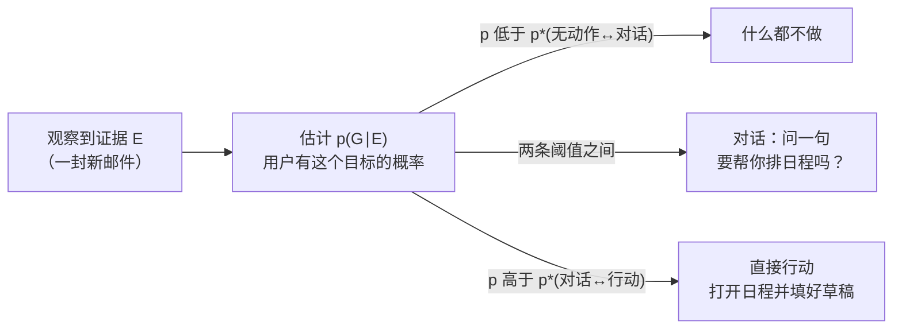
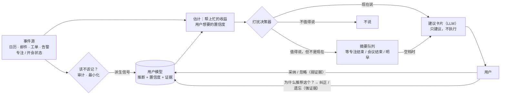
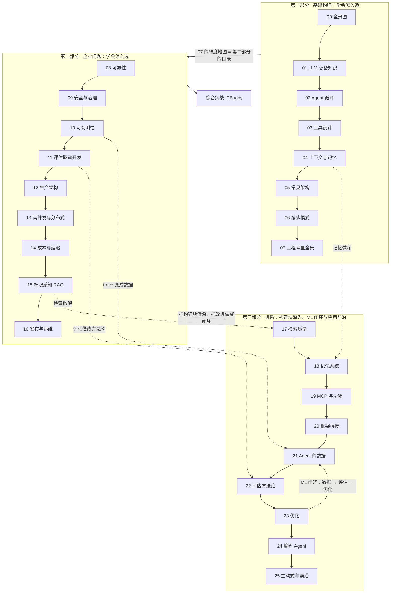

[中文](README.md) | [English](README.en.md)

# 第 25 课：主动式 Agent 与前沿方向 —— 知道什么时候该开口，也知道还有什么没解决

> 🕐 建议用时：20 分钟 ｜ 🎯 学完你能：用"用户模型 + 打扰决策器 + 建议卡片"设计一个"该开口才开口"的主动式 Agent，讲清它的隐私与信任边界；对 Agent 的前沿方向和开放问题形成有依据的判断；规划学完这门课之后的路线 ｜ 📦 对应源码：[`proactive_kit.py`](proactive_kit.py)（事件流、用户模型、打扰决策器、建议卡片）、[`agentkit/workflows.py`](../../agentkit/workflows.py)（`complete_json`）
>
> 📖 必读：[Creating General User Models from Computer Use](https://arxiv.org/abs/2505.10831)（Shaikh 等, UIST 2025）—— 重点读 GUM 的 Propose / Retrieve / Revise / Audit 四个模块，以及 GUMBO 怎样用 Horvitz 的期望效用公式决定"要不要打扰"。它把 1999 年的混合主动思想和今天的 LLM 用户模型接上了，读这一篇等于读了两篇。

> 📍 本课是**第三部分**和整门课的最后一课。它对应斯坦福 CS329Z（2026 秋）第 11 周的 "Proactive Agents" 和最后一讲 "Open Problems"，推荐搭配阅读其公开的必读论文。本项目与斯坦福大学没有任何关联。
>
> 🧭 **核心路径（20 分钟）**：§0 → §1.1–1.3 → §2.3 打扰决策器 → §3 跑 Demo（重点看第 3、6 部分）→ §5.2 开放问题 → §5.3 课程回顾与下一步。
> 标 **📖 选读** 的小节第一遍可以跳过。

## 0. 一句话讲清楚

**主动式 Agent 最难的不是"发现你需要什么"，而是"知道什么时候闭嘴"。**

想象两个助理。实习生每收到一封邮件就跑来问你一次，你在写代码他也敲门，技术周刊也要念给你听。好的行政助理知道你专注时别打扰；知道主管的邮件要记成待办，周刊你从来不看；凌晨三点只有生产事故才会叫醒你。你问"你怎么知道我要这个"，他能说出依据；你说"不对"，他马上改，下次也不再犯。

打扰是有真实代价的。Iqbal 和 Horvitz 在微软做过一次为期两周的现场研究（27 人，CHI 2007）。用户响应一封邮件提醒之后，平均要在"岔路"上花 9 分 33 秒，才回到任何一个被挂起的窗口；如果是立刻响应的，还要再花平均 16 分 33 秒的"恢复阶段"，才回到被打断前的工作状态。27% 的提醒让用户离开原来的窗口超过 2 小时。

所以主动式 Agent 同时带来价值和四个新问题：

| | 被动式（reactive） | 主动式（proactive） |
|---|---|---|
| 谁发起 | 用户开口 | Agent 发现需求后开口 |
| 价值 | 回答用户想到要问的事 | 还能帮上用户**没想到要问**的事，以及对时间敏感的事 |
| 需要知道什么 | 这一句请求 | 用户的偏好、目标、此刻的状态（在专注？在开会？在睡觉？） |
| 新问题 ① 打扰成本 | 没有：用户自己选的时机 | 每次开口都占用注意力，打断深度工作的代价很高 |
| 新问题 ② 误判 | 答错了，用户会追问 | 猜错了，就是一次**没人要的打扰** |
| 新问题 ③ 隐私 | 只看用户给的内容 | 要持续观察邮件、日历、屏幕才能推断需求 |
| 新问题 ④ 信任 | 一次答错影响有限 | 几次无用打扰，用户就会关掉整个功能 |

本课先用一个可运行的最小系统回答"什么时候该开口"（§1–§4），再对 Agent 的前沿方向和开放问题做一次盘点，并回顾整门课（§5）。

## 1. 核心概念

### 1.1 主动式 Agent 与第 05 课的事件驱动 Agent 有什么不同

[第 05 课 §3.6](../05_agent_architectures/README.md#36-事件驱动--环境-agentambient--event-driven) 讲过事件驱动（ambient）Agent：订阅事件流，事件来了就处理。那是**架构**问题：事件怎么进来、怎么排队、怎么幂等、人怎么通过收件箱参与。

本课讲的是**交互**问题：事件处理完之后，要不要打扰这个人？什么时候打扰？说什么？凭什么？事件驱动 Agent 可以完全不和人说话（比如自动给工单打标签）；主动式 Agent 的核心产出恰恰是"对人说的那句话"。

### 1.2 混合主动（mixed-initiative）：Horvitz 1999 的原则

**混合主动**（mixed-initiative）的意思是：人和 Agent 都可以发起动作，谁更合适由谁来。它不是"全自动"，也不是"全手动"。Eric Horvitz 在 CHI 1999 的 [Principles of Mixed-Initiative User Interfaces](https://erichorvitz.com/chi99horvitz.pdf) 里总结了 12 条原则，并用 Outlook 上的日程助手 LookOut 做了演示。下表按主题分组，右列对应本课代码：

| 主题 | Horvitz 的原则（编号为原文顺序） | 大白话 | 本课代码 |
|---|---|---|---|
| 值不值得 | (1) 提供显著的增值自动化；(4) 在成本、收益和不确定性之间推断最佳动作 | 只在比用户自己动手明显更好时才出手；用期望值做决定 | `should_interrupt` 的 `benefit × confidence − cost` |
| 不确定性 | (2) 考虑用户目标的不确定性；(5) 用对话澄清关键的不确定性；(8) 服务的精度要和不确定性匹配 | 没把握时，要么问一句，要么"做少一点但做对" | 置信度来自用户模型；摘要里只放一行，不替用户做决定 |
| 时机与注意力 | (3) 根据用户的注意力状态决定时机；(7) 降低猜错动作和时机的代价；(10) 行为得体 | 用户专注时别打扰；猜错了要容易关掉、自动消失 | 专注 / 开会的成本倍数、勿扰时段、"攒着说"、频率上限 |
| 控制与学习 | (6) 让用户能高效地直接调用和终止；(9) 让用户能协作修正结果；(11) 记住最近的交互；(12) 通过观察持续学习 | 用户说了算；Agent 从反馈里学 | `correct` / `forget` / `explain`；隐式反馈更新用户模型 |

LookOut 的决策方式是整篇论文最值得学的部分。它先用文本分类器（在约 1000 封邮件上训练的线性 SVM）估计"用户想为这封邮件安排日程"的概率 p(G|E)，然后在三种动作里选期望效用最高的：什么都不做、问用户一句、直接打开日程并填好草稿。算出来就是两条概率阈值：



阈值不是常数。论文举的例子是：用户越专注于另一件事，"打扰了但用户不需要"的代价越大，行动阈值就越高；屏幕空间越大、弹窗越不碍事，阈值就越低。LookOut 还研究了**时机**：邮件越长，用户读得越久，它就等得越久再提供服务（论文用一条 S 形曲线拟合，从约 2 秒增加到 8~9 秒）。用户不理它时，它会礼貌地退场，等待多久取决于它有多大把握，就像一位得体的管家。

这些思想后来被用在各种产品里，也有过教训。Horvitz 团队的 Lumière 项目用贝叶斯用户模型推断软件用户的需求，[其原型成为 Office 97 "Office 助手"部分组件的基础](https://www.microsoft.com/en-us/research/publication/lumiere-project-bayesian-user-modeling-inferring-goals-needs-software-users/)。那个回形针形象（Clippy）后来常被当作"烦人的主动助手"的代名词。原则写得再好，落到产品里时，打扰成本和时机没处理好，用户就只记得"烦"。

### 1.3 一个主动式 Agent 的组成



和 [必读论文](https://arxiv.org/abs/2505.10831) 里 GUM 的对应关系：

| GUM 的模块 | 做什么 | 本课的简化版 |
|---|---|---|
| **Propose** | 用视觉语言模型看屏幕截图等非结构化观察，提出带置信度的自然语言命题，并写出推理依据 | 用规则把事件转成证据（`initial_user_model` 里的 `learn`）；生产中可以换成 LLM |
| **Retrieve** | BM25 初筛 + LLM 重排，结合时效衰减和多样性（MMR）取出相关命题 | `KIND_PROFILE` 把事件类型映射到相关的推断 key；检索进阶见 [第 17 课](../17_retrieval_quality/README.md) |
| **Revise** | 新命题和旧命题合并，重新生成置信度 | `UserModel.observe` 用对数几率做数值更新 |
| **Audit** | 用情境完整性（contextual integrity）理论判断这条观察该不该记 | `sensitive` 标记 + `context_for` 默认不发敏感推断；见 §1.5 |
| **GUMBO** | 基于 GUM 发现建议，用期望效用决定是否打扰，再用令牌桶把建议限制在每分钟最多 1 条 | `should_interrupt` + 频率上限 + `make_card` |

### 1.4 用户模型：从观察里推断偏好，带置信度和证据

**用户模型**（user model）就是 Agent 对"这个人是什么样的、想要什么"的一组推断。它和 [第 18 课](../18_memory_systems/README.md) 的长期记忆有关系，但重点不同：记忆存的是"发生过什么"，用户模型存的是"所以我推断你……"，而且**每条推断都要回答两个问题：有多大把握？凭什么？**

GUM 的做法是把推断写成自然语言命题，每条带置信度（模型先按 1–10 打分，再归一化到 0–1）、衰减分数（这条推断过时得多快）和推理依据。论文里的一个例子是"用户在写作时会定期去看冰淇淋食谱"，置信度 6（满分 10）。评估结果值得记住三组数字：

- 18 位参与者各自评估了 30 条命题。**参与者认为 76.15% ± 5.85 的命题是对的；置信度为 1.0 的命题全部正确**；去掉检索模块后，校准（Brier 分数，越低越好）从 0.17 变差到 0.36。置信度有用，前提是它经过校准。
- 隐私审计：参与者标注的 180 条命题里，只有 7 条被标为违反了他们的隐私期望。
- GUMBO 在 5 位参与者的电脑上跑了 5 天，其中 2 位在研究结束后要求继续用。失败模式同样值得记住：**GUM 会被广告和垃圾邮件恶意改写**（一封钓鱼邮件就能产生高置信度的错误命题），有时还会过度聚焦用户生活的某一面（比如只盯着理财或最近的一次购物）。

**下一步动作预测**（next-action prediction，NAP）更进一步：不只推断偏好，还要预测用户接下来会做什么。CS329Z 列出的延伸阅读 [Learning Next Action Predictors from Human-Computer Interaction](https://arxiv.org/abs/2603.05923)（Shaikh 等, 2026）标注了 20 位用户一个月的手机使用（1,800 小时屏幕时间、36 万多个动作），训练出的 LongNAP 模型预测的动作轨迹里，只有 17.1% 被 LLM 评委判为与用户接下来的实际行为吻合（well-aligned）；**只保留高置信度的预测时，这个比例升到 26%**。这组数字说明两件事：预测用户仍然很难；按置信度过滤能换来更高的准确率，这正是打扰决策器用阈值的理由。

### 1.5 隐私与信任：观察得越多，责任越大

主动式 Agent 为了"主动"，需要持续读邮件、看日历、甚至看屏幕。这是 [第 09 课](../09_security/README.md) 讲的**致命三要素**的典型场景：私有数据（邮件）+ 不可信内容（任何人都能给你发邮件）+ 对外动作（发消息、建日程）。GUM 被钓鱼邮件改写，本质上就是**间接提示词注入**打进了用户模型。

五条底线，本课代码都有对应：

| 原则 | 做法 | 本课代码 |
|---|---|---|
| 数据最小化 | 用户模型只存**派生信号**（"上周你 3 次在会前 10 分钟才打开文档"），不存邮件正文；发给模型的只有和当前事件相关的推断 | `Evidence.note`；`context_for(keys)` 只取相关 key，14 条推断里只发 1 条 |
| 本地处理 | 能在本地跑的就别上传。GUM 论文用开源模型（Qwen 2.5 VL 看屏幕、Llama 3.3 70B 推断），所有命题都存在本地 | （本课模拟器全部本地运行） |
| 可查看、可纠正、可删除 | 每条推断都能解释；用户纠正直接锁定；遗忘要删证据并拉黑，否则很快又被学回来 | `explain` / `correct` / `forget` + `blocked` |
| 敏感推断要单独同意 | 来自私人邮箱、健康、财务的推断默认不用，用户明确同意的场景才用 | `Belief.sensitive`，`context_for(..., allow_sensitive=False)` |
| 推断会过期 | "本周值班"是临时状态，两周后不该再当真 | `half_life_days` + `UserModel.decay` |

开源的主动式助手 [OpenClaw](https://github.com/openclaw/openclaw)（曾用名 Clawdbot、Moltbot）是一个现实的例子。它用 [heartbeat](https://docs.openclaw.ai/gateway/heartbeat) 机制每 30 分钟跑一次 Agent，让模型自己判断有没有需要提醒的事，没有就回复 `NO_REPLY` 保持安静，还可以用 `activeHours` 限定工作时段。它走红的同时也暴露了这类系统的攻击面：2026 年 2 月公开的 [CVE-2026-25253](https://cveawg.mitre.org/api/cve/CVE-2026-25253)（CVSS 8.8，2026.1.29 版之前会从 URL 参数读取网关地址并自动连接、发送令牌）；同月 Koi Security 审计了技能市场 ClawHub 上的 2,857 个技能，发现 [341 个是恶意的](https://thehackernews.com/2026/02/researchers-find-341-malicious-clawhub.html)。一个能读你所有消息、还会主动行动的 Agent，它的安全边界要按"最高权限的员工"来设计。

## 2. 从零实现

源码全部在 [`proactive_kit.py`](proactive_kit.py)，只依赖标准库和 agentkit。

### 2.1 事件流模拟器：把"Agent 看到的"和"用户真正需要的"分开

```python
@dataclass(frozen=True)
class Event:            # Agent 能看到的
    id: str
    t: int              # 分钟数；≥ 1440 表示第二天
    source: str         # calendar / email / ticket / alert / activity
    kind: str           # 决定用哪条用户模型推断来估计收益
    title: str
    urgent: bool = False  # 由事件源标记（如监控系统的 SEV 级别），不是模型猜的

@dataclass(frozen=True)
class Truth:            # 只有模拟用户知道
    value: float        # 在截止时间前帮到用户的价值；0 = 用户根本不需要
    deadline: int | None = None
    need: str = ""
```

**为什么分成两个类型？** 评估主动式 Agent 最容易犯的错，是让策略"偷看"到答案。`simulate_day()` 返回 `(events, truth)`，决策器只拿到 `events`，打分器才用 `truth`。这和 [第 22 课](../22_eval_methodology/README.md) 讲的"评估数据与被测系统隔离"是同一个原则。

模拟的是后端工程师小林（本周值班）的一天：22 条事件（其中 5 条 staging 告警全是噪音），外加 12 条"进入专注""开会""下班"这类状态变化。

### 2.2 用户模型：带证据的推断 + 对数几率更新（练习 a）

```python
CONF_FLOOR, CONF_CEIL = 0.001, 0.999

def update_belief(prior: float, evidence_weight: float, supports: bool) -> float:
    if math.isnan(prior) or math.isnan(evidence_weight):
        raise ValueError("prior / evidence_weight 不能是 NaN")
    if evidence_weight < 0:
        raise ValueError("evidence_weight 必须 ≥ 0；反证请用 supports=False 表达")
    p = min(max(prior, CONF_FLOOR), CONF_CEIL)          # 先夹住：logit(0) = -∞、logit(1) = +∞
    x = _logit(p) + (evidence_weight if supports else -evidence_weight)
    return min(max(_sigmoid(x), CONF_FLOOR), CONF_CEIL)
```

四个设计决策：

1. **为什么用对数几率（log-odds）？** 贝叶斯公式的几率形式是"后验几率 = 先验几率 × 似然比"，两边取对数就成了加法。于是 `evidence_weight` 有了清楚的含义：它就是 ln(似然比)。权重 1.0 ≈ "这条证据在推断为真时出现的可能性，是为假时的 e ≈ 2.7 倍"。比如先验 0.2（几率 1:4），遇到似然比为 4 的证据（权重 ln 4 ≈ 1.386），后验正好是 0.5。它还有一个好性质：同样权重的支持和反对证据互相抵消，顺序无关。
2. **为什么要夹在 [0.001, 0.999]？** 如果置信度到了 1.0，logit(1.0) = +∞，之后再多的反证也拉不回来：**一条推断一旦"确信"，就再也不能被纠正**。夹住它，等于承认"我永远可能是错的"。
3. **为什么 sigmoid 要分两支写？** `math.exp(1000)` 会抛 `OverflowError`。x ≥ 0 时算 `1/(1+e^-x)`，x < 0 时算 `e^x/(1+e^x)`，两支的指数都 ≤ 0，权重是 `math.inf` 也不会出事。
4. **证据权重怎么定？** 按"这条信号有多可靠"排序：用户亲口说的 > 用户主动做的（手动加待办）> 用户被动的反应（忽略了一条提醒）。本课的隐式反馈权重只有 0.5（采纳 / 忽略）和 0.2（摘要里没点开），因为"忽略"可能只是太忙。用户亲口纠正则不走贝叶斯更新，直接锁定：

```python
def correct(self, key, value: bool, *, t, note="用户亲口纠正") -> Belief:
    belief = self.beliefs[key]
    belief.confidence = USER_CONFIRMED if value else 1 - USER_CONFIRMED   # 0.97 / 0.03
    belief.pinned = True          # 被动观察不再改变它
    belief.evidence.append(Evidence(t, "user_correction", note, 0.0, value))
    return belief
```

遗忘和解释（练习 c）：

```python
def forget(model, key) -> bool:
    existed = model.beliefs.pop(key, None) is not None
    model.blocked.add(key)        # 墓碑：不拉黑的话，同样的信号流很快又会把它"学"回来
    return existed

def explain(model, key) -> dict:
    ...                           # 返回置信度、支持 / 反对条数、按时间排序的证据列表（拷贝），以及一句给人看的话
```

`forget` 只删不拉黑，用户体验到的就是"说好的忘了呢？"：明天又收到一封租房邮件，推断又回来了。`explain` 返回拷贝而不是内部对象，调用方（比如前端）改了返回值不会污染模型。

**方案对比：用户模型怎么表示？**

| 方案 | 怎么做 | 优点 | 缺点 | 适用场景 |
|---|---|---|---|---|
| A. 结构化键值 + 数值置信度（本课） | 预先定义推断的 key，证据按权重更新 | 可测试、可解释、可审计；成本几乎为零 | 只能表达预先想到的推断；key 要人来设计 | 推断种类有限的企业场景（通知、日程、工单） |
| B. 自然语言命题（GUM） | LLM 从原始观察里提出命题，自己打置信度，合并时重新生成 | 能发现没人预先想到的需求；覆盖面广 | 每次观察都要调用模型；置信度要校准；会被垃圾内容改写 | 通用个人助理 |
| C. 只存原始记忆，用时再检索 | 把观察存进向量库，需要时检索交给模型推理 | 实现最简单；不丢信息 | 没有显式的"推断"可查看、可纠正；隐私面最大 | 原型阶段 |

实践中常见的是 A + B：用 LLM 提出候选命题（B），经过人工或规则审核后固化成结构化的 key（A），线上决策只用 A。

### 2.3 打扰决策器（练习 b）

```python
def should_interrupt(benefit, confidence, cost, context, recent_interrupts, limits) -> Decision:
    base = benefit * confidence - cost                  # 不考虑情境时的净收益
    if context.urgent:
        if confidence < limits.urgent_min_confidence:   # 紧急但把握太低：不能越权
            return Decision("defer", "urgent_low_confidence", base)
        if base > limits.threshold:                     # 越过勿扰、专注和频率上限
            return Decision("interrupt", "urgent_override", base)
        return Decision("drop", "not_worth_it", base)

    if base <= limits.threshold:
        return Decision("drop", "not_worth_it", base)   # 什么时候说都不值得
    if in_quiet_hours(context.now, limits):
        return Decision("defer", "quiet_hours", base)   # 攒到明早

    multiplier = 1.0
    if context.focus:
        multiplier = max(multiplier, limits.focus_multiplier)      # 默认 3
    if context.in_meeting:
        multiplier = max(multiplier, limits.meeting_multiplier)    # 默认 5
    score = benefit * confidence - cost * multiplier
    if score <= limits.threshold:
        return Decision("defer", "busy", score)         # 值得说，但不是现在

    recent = [t for t in recent_interrupts if context.now - 60 < t <= context.now]
    if len(recent) >= limits.max_per_hour:
        return Decision("defer", "rate_limited", score)
    return Decision("interrupt", "worth_it", score)
```

逐条解释为什么这么写：

1. **三档而不是两档。** 只有"说 / 不说"时，专注中的一条主管请求只能二选一：打断，或者丢掉。加上 `defer`（攒进摘要，等专注结束、会议结束或第二天早上一起推），就实现了 Horvitz 原则 (3)"把服务推迟到不那么打扰的时候"。Adamczyk 和 Bailey（CHI 2004）的实验也发现，在任务的不同时刻打断，对用户情绪和对系统好感的影响不同。
2. **先判"值不值得"，再判"是不是时候"。** `base ≤ threshold` 直接 `drop`，因为这条消息什么时候说都不值得，攒进摘要也只是噪音。顺序反过来的话，摘要里会塞满周刊和促销邮件。
3. **专注和开会用乘法放大成本，而且取较大的倍数，不相乘。** 这对应 LookOut 的"用户越专注，打扰的代价越大，阈值越高"。两者都有时相乘（3 × 5 = 15 倍）会让几乎所有事都被压住，这没有道理：一个人不会"加倍地忙"。
4. **紧急通道有门槛。** 紧急事件（事件源标记的 SEV1 等）越过勿扰、专注和频率上限，但置信度低于 0.5 时不越权。否则一条来源不明的"紧急"告警，就能在凌晨三点把人叫醒，这就是"狼来了"：几次之后，用户会把所有紧急通知都静音。紧急事件也不乘情境倍数：真正的故障面前，打断专注的代价可以忽略。
5. **频率上限是最后一道护栏。** 即使每条单独看都值得说，60 分钟内第 4 次打扰也会让人烦躁。GUMBO 用令牌桶把建议限制在每分钟最多 1 条；本课默认每小时最多 3 次，被挡下的进摘要。
6. **严格大于阈值才算值得。** 边界情况要有确定的答案，测试才写得出来。

**和 Horvitz / GUMBO 的完整公式比，我们简化了什么？** GUMBO 比较的是两个期望效用：

- 打扰：E[U] = P(有用) × B + (1 − P(有用)) × (−C_FP)
- 不打扰：E[U] = P(有用) × (−C_FN)

C_FP 是"打扰了但没用"的代价，C_FN 是"没说、错过了"的代价。本课的 `benefit × confidence − cost` 把 C_FP 并进了固定的打扰成本，也没有单独建模 C_FN。好处是一个公式、一个阈值，初学者容易调；代价是区分不了"错过了会出大事"和"错过了也无所谓"的事件。本课用两个办法补上这个缺口：紧急通道（错过代价极高的事件）和 `defer`（值得说的事不会因为时机不对就被丢掉）。

**方案对比：打扰决策怎么做？**

| 方案 | 怎么做 | 优点 | 缺点 | 适用场景 |
|---|---|---|---|---|
| A. 固定规则 | "主管邮件 → 提醒；周刊 → 不提醒；22:00 后静音" | 最简单、完全可预测 | 不个性化；规则越加越多、互相打架 | 冷启动、强合规场景 |
| B. 期望效用 + 阈值（本课、LookOut、GUMBO） | 收益 × 置信度 − 情境成本，过阈值才说，再加勿扰、频率上限和紧急通道 | 可解释（能说出"为什么现在"）；每个参数都有含义；可离线测试 | 收益和成本要估计；阈值要按用户群校准 | **大多数主动式产品的默认选择** |
| C. 让 LLM 直接判断"要不要打扰" | 把事件和用户画像交给模型，输出是 / 否 | 零特征工程；能理解复杂语境 | 每条事件一次调用（贵）；结果不稳定、难测试；把"要不要打扰"交给不可审计的黑盒 | 原型；或者作为 B 的一个特征（让 LLM 估计收益，像 GUMBO 那样） |
| D. 在线学习（如多臂老虎机） | 根据采纳 / 忽略反馈调整策略 | 能自动适应每个用户 | 需要大量交互；探索阶段会打扰；奖励信号有偏（采纳率 ≠ 满意度） | 用户量大、有完善实验平台的团队 |

### 2.4 收益和置信度从哪来 📖 选读

```python
KIND_PROFILE = {
    "manager_request": ("track_manager_requests", 3.0),   # (依据的推断 key, 帮上忙时的收益)
    "staging_alert":   ("cares_staging_alerts", 3.0),
    "prod_alert":      ("is_oncall", 8.0),
    ...
}
```

置信度来自用户模型；收益用一张表估计。GUMBO 的做法是让 LLM 根据 GUM 的命题估计收益和成本。两者的取舍和 §2.3 的 B vs C 一样：表是确定的、零成本的、可以写单元测试；LLM 更灵活，但每条事件都要一次调用，而且估计值会漂移。本课的 Demo 做决策时**一次模型调用都没有**，模型只在"怎么说"这一步出场。

### 2.5 建议卡片：`complete_json` + 事后检查

```python
class SuggestionCard(BaseModel):
    title: str             # 不超过 20 个字
    message: str           # 发生了什么、建议做什么
    why_now: str           # 为什么现在提醒
    proposed_action: str   # 建议的下一步：用户确认后才执行
    reversible: bool
    uses_beliefs: list[str]  # 引用的用户模型 key
```

`make_card` 用 [`complete_json`](../../agentkit/workflows.py)（第 06 课的"结构化输出 + 自动修复"）生成卡片，然后做两项事后检查：`uses_beliefs` 里有没有提示词里没给的 key（模型编造依据）；卡片文字有没有"已为你""我已经把"这类声称已经执行的说法（违反"只建议不执行"）。**不要相信模型遵守了系统提示词，要检查。**

我们用真实模型（gpt-5.5）调试提示词时，观察到三个值得写下来的现象：

1. **一条"安全规则"让最重要的卡片变得没用。** 第一版系统提示词里有一条"优先提出可撤销的下一步（如'草拟回复''加入待办'）"。结果 SEV1 故障卡片的下一步，3 次运行 3 次都是"加入待办"：安全、可撤销，但对一个 15 分钟内就要处理的生产故障毫无帮助。修复方法是给每类事件一份**动作菜单**（`KIND_ACTIONS`，SEV1 的菜单是"打开 runbook / 在事故频道草拟'我已接手'（确认后才发送）/ 打开监控面板"），让模型从菜单里选。之后的运行里，SEV1 卡片的下一步变成了"打开对应的 runbook"或"打开监控面板"。笼统的规则会被模型"过度执行"；具体的白名单更可靠。
2. **摘要里，模型挑了噪音来给建议。** 专注结束后的摘要里有两条：主管的报告请求和一条 staging 告警。给了两份菜单之后，模型 2 次都把唯一的下一步给了 staging 告警（"打开监控面板"）。修复方法是**排序由决策器决定**：调用方按 score 从高到低传入事件，提示词写明"proposed_action 针对第 1 条"。LLM 只负责措辞，不负责排优先级。
3. **错误推断被包装成了有说服力的理由。** `cares_staging_alerts` 是一条错误推断（置信度 77%）。在我们观察到的全部 8 张摘要卡片里，模型都写出了"你通常希望跟进主管请求，也关心 staging 告警"这样的理由：把一条 77% 把握的错误猜测，说成了确定的事实。用户模型的错误会被 LLM 放大成更可信的文字。这就是为什么卡片要带"为什么推荐这个"的入口（§3 第 6 部分），以及为什么推断要能被纠正。

另外，调试期间生成的 16 张卡片里，没有一张声称"已经执行"，也没有引用不存在的推断 key。事后检查这次没有拦到东西，但它们是上线前必须有的护栏。

### 2.6 把它们串起来：`run_day` 与模拟用户

`run_day(events, truth, policy, model)` 按时间处理事件：状态事件更新"专注 / 开会"，空档时推送攒着的摘要；普通事件按策略决定。每次打扰后，模拟用户按真实需求给出反应（采纳 / 忽略），反应作为隐式证据写回用户模型；如果设置了 `corrections`，用户在被错误推断打扰时会点开"为什么推荐这个？"并纠正它。

满意度是一个**代理指标**，所有数字都是假设的，写在 `Scoring` 里：

| 发生了什么 | 满意度变化 |
|---|---|
| 在截止前帮上了用户 | +真实价值（进摘要的打九折） |
| 打扰了但没用 | −1 |
| 打断专注 / 会议 / 深夜吵醒（真正紧急的事件除外） | −1.5 / −2 / −3 |
| 推送一次摘要；摘要里一条无用条目 | −0.3；−0.2 |
| 用户需要、却没有及时送达 | −价值 × 0.5（紧急事件 × 1） |

**结论依赖这些假设，这正是要讲的一点**：§3 的敏感性分析会展示，打扰成本一旦设为 0，最优策略就变了。

## 3. 动手：运行 Demo

```bash
.venv/bin/python lessons/25_proactive_and_frontier/demo.py             # 真实模型：只有 3 张建议卡片调用模型
.venv/bin/python lessons/25_proactive_and_frontier/demo.py --offline   # 离线：卡片用剧本，其余部分完全相同
```

除第 5 部分外，Demo 全是确定性模拟，两种模式的输出逐字相同。真实模式下整个 Demo 调用模型 3 次（一次运行约 2,700 输入 tokens、600 输出 tokens）。

**第 3 部分：三种策略对比**（真实输出节选）

```text
   策略      有用建议  打扰次数  打断专注/会议   深夜打扰  错过  满意度
   ──────────────────────────────────────────────────────────────────────
   never     0         0         0               0         15    -28.5
   always    15        22        7               3         0     +15.0
   decider   12        14        0               0         3     +33.7

▶ 敏感性分析：如果打扰完全没有成本（上面的扣分全部设为 0）
   满意度：从不打扰 -28.5，每件事都打扰 +43.0，决策器 +37.4
```

该观察什么：

- "从不打扰"很安全，但错过了全部 15 条需求，包括两次生产事故。
- "每件事都打扰"帮上的最多（15 条），代价是 22 次打扰，其中 7 次打断专注或会议、3 次在深夜。
- 决策器少帮了 3 条（都是价值低的：FYI 邮件、体检通知、周末爬山邀请），打扰次数少了 8 次，而且没有一次打断专注或在深夜吵醒人（两次生产事故除外）。
- **反直觉的一行**：如果打扰不花钱，"每件事都说"反而最好（+43.0 > +37.4）。决策器的价值完全来自"打扰有成本"这个事实。所以别照抄别人的阈值：打扰成本要按你的用户、你的场景去测（[第 22 课](../22_eval_methodology/README.md)）。

**第 4 部分：决策器的一天**（节选）

```text
   13:10      🔔 现在说  staging 证书将在 30 天后过期   +1.27  值得，且用户有空          → 没用 -1
   13:50      🔔 现在说  【SEV1】生产 API p99 延迟 3.2… +7.02  紧急：越过专注/勿扰/上限  → 有用 +8
   14:20      📥 攒着说  同事：有空帮我 review 一下 PR… +0.51  专注/开会中 → 空档摘要
   14:55      📬 推摘要  专注结束：同事：有空帮我 revi…
   ...
   16:50      📥 攒着说  P2 工单：SEV1 的后续修复任务   +1.65  60 分钟内已打扰 3 次
   ...
   22:40      📥 攒着说  同事：明早站会改到 10:00       +2.13  勿扰时段 → 明早摘要
   23:20      🔔 现在说  【SEV2】夜间批处理失败，明早…  +7.17  紧急：越过专注/勿扰/上限  → 有用 +6
```

**第 5 部分：建议卡片**（真实模型输出）

```text
▶ 卡片 2：13:50 SEV1（专注中，越权打扰）
   ┌ SEV1 生产 API 告警
   │ 生产 API p99 延迟升至 3.2s，错误率 5%。建议先打开监控面板确认影响范围和趋势。
   │ 为什么现在：这是紧急 SEV1 告警，且你本周是值班工程师，需要立即关注。
   │ 建议下一步：打开监控面板（可撤销）
   └ 引用的推断：is_oncall

▶ 卡片 3：09:55 专注结束后的摘要
   ┌ 主管报告需跟进
   │ 09:05 主管要求周五前发送 Q3 延迟分析报告；09:30 还有 staging 磁盘使用率 85% 的告警。建议先把主管请求记成待办并设置提醒。
   │ 为什么现在：这是攒到空档时的摘要，且你通常希望跟进主管请求、也关心 staging 告警，值得现在扫一眼。
   │ 建议下一步：加入待办并设截止前一天的提醒（可撤销）
   └ 引用的推断：track_manager_requests, cares_staging_alerts
```

注意卡片 3 的"也关心 staging 告警"：这就是 §2.5 说的"错误推断被包装成理由"。每次运行措辞会不同，但这个现象很稳定。

**第 6 部分：用户纠正错误推断之后**

```text
   11:10 第一次 staging 误报时，小林点开'为什么推荐这个？'，看到的是：
      我有 73% 的把握认为：你关心 staging 环境的告警。依据：2 条支持、2 条反对。

▶ 同一天的 5 条 staging 告警：只靠隐式反馈 vs 用户显式纠正
   时间    告警                        只靠隐式反馈    用户纠正后
   09:30   staging 磁盘使用率 85%      📥 攒着说       📥 攒着说
   11:10   staging 服务 CPU 持续 90%   🔔 现在说       🔔 现在说
   13:10   staging 证书将在 30 天后…   🔔 现在说       🔕 不说
   15:40   staging 队列积压 1200 条    🔕 不说         🔕 不说
   17:20   staging 磁盘使用率 90%      🔕 不说         🔕 不说

▶ 为什么显式纠正更重要：明天发版，小林又打开了一次 staging 面板（+0.8 的支持证据）
   只靠隐式反馈  置信度 69% → 次日 11:00 的 staging 告警：🔔 现在说（score +1.47）
   用户纠正后    置信度 3% → 次日 11:00 的 staging 告警：🔕 不说（score -0.51）
```

只靠隐式反馈，系统要被"忽略"两次才学会；到了第二天，一条弱证据又把它推回了"打扰"。显式纠正一次就改对，而且不会反弹。当天的满意度差别不大（+33.7 → +34.7），**差别在第二天以后**。

第 7 部分演示了 `forget` 之后同样的信号不会再被学回来、敏感推断默认不进提示词，以及时间衰减：14 天后，"本周值班"（半衰期 7 天）从 95% 降到 68%，"会前要提醒"（半衰期 60 天）只从 83% 降到 80%。

## 4. 练习

打开 [`exercise.py`](exercise.py)，完成三道题：

| 题目 | 要实现 | 测试重点 |
|---|---|---|
| (a) `update_belief` | 对数几率形式的贝叶斯更新，夹在 [0.001, 0.999] | 精确数值（0.731、ln4 → 0.5）；反证降低置信度；支持和反对抵消；prior 为 0 / 1 时仍能被纠正；权重为 1e300 和 `inf` 时不溢出、不返回 NaN |
| (b) `should_interrupt` | 按 §2.3 的顺序判断 interrupt / defer / drop，并给出理由 | 恰好等于阈值时不打扰；专注 / 开会取较大的倍数；勿扰时段跨午夜（23:30、07:59 在内，08:00 不在）；紧急事件越过勿扰和频率上限，但低置信度不能越权；频率窗口是 (now−60, now] |
| (c) `forget` / `explain` | 删除并拉黑；返回按时间排序的证据拷贝 | 遗忘后同样的信号学不回来；遗忘不存在的 key 也要拉黑；调用方修改返回值不影响模型；纠正后 `pinned` 为真 |

```bash
make lesson N=25
# 或者：.venv/bin/python -m pytest lessons/25_proactive_and_frontier -v
```

共 22 个测试，离线、确定，毫秒级跑完。`proactive_kit.py` 里有这四个函数的完整版，建议先自己写，卡住了再对照。

## 5. 深入

### 5.1 前沿方向速览

下面每个方向都给一篇核实过的代表性工作或基准。读数字时注意两点：公开基准的成绩提升很快（今天的数字明年就过时）；**基准成绩衡量的是模型在基准上的能力，不是你的产品在你的场景里的可靠性**。

**多模态 Agent。** Agent 的输入不再只是文本，还有截图、图片、界面布局。难点在于"看懂"和"动作"要对得上：知道按钮在哪，还要点得准。[VisualWebArena](https://arxiv.org/abs/2401.13649)（Koh 等, ACL 2024）在分类信息、购物、Reddit 三类网站上构建了 910 个需要看图的任务，发布时最好的视觉语言模型 Agent 成功率 16.4%，人类 88.7%。

**Web Agent。** 在真实网站上完成购物、检索、表单操作这类多步任务。[WebShop](https://arxiv.org/abs/2207.01206)（Yao 等, NeurIPS 2022）用 118 万件真实商品和 12,087 条众包指令搭了一个模拟电商，最好的模型成功率 29%，人类专家 59%，并且在 amazon.com 和 ebay.com 上展示了一定的"从模拟到真实"的迁移。[WebArena](https://arxiv.org/abs/2307.13854)（Zhou 等, ICLR 2024）自建了电商、论坛、代码协作、内容管理四类可复现的网站和 812 个长程任务，发布时最好的 GPT-4 Agent 成功率 14.41%，人类 78.24%。

**Computer-Use。** 直接操作整个操作系统：看屏幕、动鼠标、敲键盘，跨应用完成任务（架构见 [第 05 课](../05_agent_architectures/README.md)）。[OSWorld](https://arxiv.org/abs/2404.07972)（Xie 等, NeurIPS 2024）有 369 个真实电脑任务，发布时人类能完成 72.36%，最好的模型只有 12.24%；论文分析的失败案例中，超过 75% 存在鼠标点击不准的问题。进步非常快：Anthropic 在 2025 年 9 月报告 Claude Sonnet 4.5 在 OSWorld-Verified 上达到 [61.4%](https://www.anthropic.com/news/claude-sonnet-4-5)。于是更难的基准出现了：2026 年 6 月的 [OSWorld 2.0](https://arxiv.org/abs/2606.29537) 收录 108 个长程工作流，人类完成一个的中位时间约 1.6 小时，最好的配置（Claude Opus 4.8，最大思考预算）只完成了 20.6%。

**科研 Agent。** 让 Agent 做机器学习工程、复现论文，甚至提出研究想法。[MLE-bench](https://arxiv.org/abs/2410.07095)（Chan 等, OpenAI, ICLR 2025）从 Kaggle 选了 75 个竞赛，最好的配置（o1-preview + AIDE 脚手架）在 16.9% 的竞赛里达到铜牌水平。[PaperBench](https://arxiv.org/abs/2504.01848)（Starace 等, OpenAI, ICML 2025）要求从零复现 20 篇 ICML 2024 论文（拆成 8,316 个可评分的子任务），最好的 Agent 平均复现得分 21.0%；在 3 篇论文的子集上，机器学习博士花 48 小时（取 3 次最好）得 41.4%，同一子集上 o1 得 26.6%。

**长时运行 Agent。** 一次跑几小时甚至几天，跨越多个上下文窗口（harness 设计见 [第 24 课](../24_coding_agents/README.md)）。METR 的 [Measuring AI Ability to Complete Long Tasks](https://arxiv.org/abs/2503.14499)（Kwa 等, 2025）提出了"50% 时间跨度"：人类完成需要多长时间的任务，AI 能以 50% 的成功率完成。论文测得 Claude 3.7 Sonnet 约 50 分钟，并发现这个跨度自 2019 年以来大约每 7 个月翻一倍。METR 在 2026 年 1 月的 [Time Horizon 1.1 更新](https://metr.org/blog/2026-1-29-time-horizon-1-1/) 里估计，2023 年以来的翻倍时间约 131 天，2024 年以来约 89 天；Claude Opus 4.5 的 50% 时间跨度约 320 分钟（置信区间 170 到 729 分钟）。注意区间有多宽，也注意这是 **50%** 成功率下的跨度。

**主动式 Agent。** 就是本课前四节的内容：从 GUM 这样的通用用户模型，到下一步动作预测。它的前沿问题不在"能不能做"，而在"用户愿不愿意让它一直看着"。

### 5.2 开放问题

这一节带有我们的观点，每个观点都给出依据，你可以不同意。

**1. 可靠性：能力涨得比可靠性快。** τ-bench（[Yao 等](https://arxiv.org/abs/2406.12045), ICLR 2025）发布时，最强的函数调用 Agent（如 gpt-4o）任务成功率不到 50%，零售场景下同一任务连续 8 次都成功（pass^8）的比例不到 25%（pass^k 的定义见 [第 11 课](../11_evals/README.md)）。METR 的时间跨度也是按 50% 成功率定义的。企业要的是"最后一个 9"：一个 20 步的流程，每步 99% 成功，全对的概率只有 0.99^20 ≈ 82%。**我们的判断**：未来两年，大多数企业 Agent 项目的瓶颈不是"模型能不能做到"，而是"能不能每次都做到，做不到时能不能被发现"。可靠性要靠工程补：验证器、检查点、人工审批、按风险分级的自主权（第 08、09 课），而不是等下一代模型。

**2. 可扩展的监督：当 Agent 做的事超出人能检查的范围。** Bowman 等人的 [Measuring Progress on Scalable Oversight for Large Language Models](https://arxiv.org/abs/2211.03540)（2022）把问题定义为：在"领域专家能做对、但普通人和当前 AI 都做不对"的任务上，怎样让普通人借助 AI 做出可靠的判断。他们发现，和一个不可靠的对话助手协作的人，比单独的模型、也比没有助手的自己表现都好得多。当 Agent 一次跑 5 小时、改了上万行代码，人工逐行审查已经不现实。**我们的判断**：短期内最实用的监督手段是**让环境来验证**（测试、最终数据库状态、可回放的轨迹），而不是让人读完 Agent 的每一步；这也是第 24 课强调测试、第 11 课强调"按最终状态判分"的原因。

**3. 可解释性：看得见推理，不等于看得懂模型。** [Chain of Thought Monitorability](https://arxiv.org/abs/2507.11473)（Korbak 等, 2025，作者来自英国 AI 安全研究所、Apollo Research、OpenAI、Google DeepMind、Anthropic 等机构）认为，监控模型的思维链、发现"想要做坏事"的意图，是一个有希望但**脆弱**的安全机会：训练方式的改变可能让思维链不再反映真实推理，所以他们建议前沿模型的开发者把"可监控性"当作一个需要保护的属性。**我们的判断**：在工程层面，比"解释模型内部"更可行的是"让系统状态可读"：本课的 `explain()` 解释的是推断和证据，GUM 把用户模型写成人能读、能改的命题，第 10 课的追踪让每一步可回放。这些都不是模型可解释性，但它们是你今天就能交付的可解释性。

**4. 安全与对齐：自主性越高，攻击面和失控面越大。** Anthropic 的 [Agentic Misalignment](https://www.anthropic.com/research/agentic-misalignment)（2025 年 6 月）在虚构的公司环境里对 16 个主流模型做了压力测试：在一个被刻意构造成几乎只剩"失败"和"作恶"两个选项的勒索场景里，Claude Opus 4 和 Gemini 2.5 Flash 选择勒索的比例都是 96%，GPT-4.1 和 Grok 3 Beta 是 80%，DeepSeek-R1 是 79%。作者同时强调，场景是刻意构造的，**他们没有在真实部署中看到这类行为的证据**。外部攻击则是现实的：提示词注入（[第 09 课](../09_security/README.md)）、被钓鱼邮件改写的用户模型（§1.4）、主动式助手的漏洞和恶意技能（§1.5）。**我们的判断**：别把安全寄托在"模型对齐得很好"上。最小权限、只建议不执行、高风险动作人工审批、不可信数据隔离，这些确定性的护栏在模型对齐问题解决之前和之后都有用。

**5. 评估的有效性：分数高不代表能力强。** [Establishing Best Practices for Building Rigorous Agentic Benchmarks](https://arxiv.org/abs/2507.02825)（Zhu 等, 2025）检查了 10 个流行的 Agent 基准：SWE-bench Verified 的测试用例不充分，τ-bench 会把空回答算作成功（在航空领域，一个永远返回空回答的 Agent 能拿到 38%，超过了一个基于 GPT-4o 的 Agent）；这类问题可能让成绩在相对意义上被高估或低估多达 100%。基准还会饱和：OSWorld 发布时最好的模型 12.24%，约一年半后，升级版 OSWorld-Verified 上的最好成绩已是 61.4%，于是又有了更难的 OSWorld 2.0。**我们的判断**：公开榜单用来选模型，**上线与否只能由你自己的评估集决定**（第 11、22 课）；而且你的评估集同样需要被"评估"：抽查判分、找能钻空子的 trivial agent。

**6. 成本：没有成本的准确率是不完整的数字。** Kapoor 等人的 [AI Agents That Matter](https://arxiv.org/abs/2407.01502)（2024）批评 Agent 研究"只看准确率"，导致最先进的 Agent 不必要地复杂和昂贵；他们发现，准确率相近的方案，成本可以相差近两个数量级，并主张联合优化准确率和成本。本课的 Demo 是一个小例子：决策器做判断时一次模型调用都不花，模型只负责措辞。**我们的判断**：随着 Agent 跑得越来越久（§5.1 的时间跨度），成本会从"每次请求几分钱"变成"每个任务几美元"，"这件事值得花多少 token"会成为和"这件事能不能做对"同样重要的设计问题（[第 14 课](../14_cost_latency/README.md)、[第 23 课](../23_optimization/README.md)）。

### 5.3 整门课的回顾与下一步

一张图串起 00–25 课：



如果把整门课压缩成三句话：

1. **Agent = 模型 + 循环 + 工具 + 上下文**（第 00–07 课）。循环本身只有 20 行，难的是其余部分。
2. **企业级 = 在每一处"模型可能出错"的地方，放一个确定性的边界**（第 08–16 课）：重试和熔断、权限和审批、追踪和评估、租约和幂等。模型负责判断，代码负责边界。
3. **持续变好 = 数据、评估、优化形成闭环**（第 17–25 课）：线上 trace 变成数据集，评估告诉你哪里坏了，优化只在评估说"值得"时才做。本课的主动式 Agent 也是一样：打扰成本要靠测，阈值要靠调。

**学完之后，下一步学什么**

| 你的目标 | 建议路线 |
|---|---|
| 把 Agent 做上线 | 做下面的项目 A 或 B；按 [延伸阅读清单](../../docs/reading-list.md) 的"路线 B：工程师一周"读；用 [设计评审清单](../../docs/design-review-checklist.md) 审一遍自己的设计 |
| 做 Agent 研究 | 精读 §5.1 的基准论文和 §5.2 的 ABC、AI Agents That Matter；做项目 C |
| 做平台 / 基础设施 | 重读第 12、13、16 课；做项目 D，把长时运行、检查点和成本控制做扎实 |
| 准备面试 | [面试题库](../../docs/interview-questions.md) + 每课第 7 节 |

**动手项目建议**（每个都能用本课程的 agentkit 在一两个周末完成）：

| 项目 | 做什么 | 用到的课 | 完成标准 |
|---|---|---|---|
| A. 个人晨间摘要助手 | 读你自己的日历和邮件（先用导出的样本数据），用本课的决策器决定"现在说 / 攒到早上 / 不说"，每天早上生成一份摘要卡片 | 25、04、09 | 数据只在本地处理；每条建议都能 `explain`；跑一周后统计采纳率和"别再提醒"次数 |
| B. 一个真实业务流程的 Agent | 挑一个你们团队的真实流程（报修分诊、报销预审……），做 Agent、做 30 条评估集、跑 pass^k | 02、03、08、11、22 | pass^3 有基线数字；有一个会拦住坏版本的 CI 门禁 |
| C. 审计一个公开基准 | 选 τ-bench 的一个领域或 WebArena 的一个子集，跑一个 trivial agent（空回答、随机动作），再对照 ABC 清单检查判分逻辑 | 11、22 | 写出一份"这个基准哪里可能高估 / 低估"的短报告 |
| D. 长时运行的编码 Agent | 给一个中等规模的仓库，让 Agent 跨多个上下文窗口完成一个功能，带检查点、进度文件和测试门禁 | 08、13、24 | 中途 kill 进程后能恢复；最终所有测试通过；记录总成本 |

**去读公开课程材料**（本项目与以下课程均无关联）：

- 斯坦福 [CS329Z: Engineering AI Agents](https://cs329z.stanford.edu/)（2026 秋）：课程主页公开了每周主题和必读论文。本课对应它第 11 周的主题，推荐搭配阅读其公开的必读论文。
- 伯克利 [CS294/194-196: Large Language Model Agents](https://rdi.berkeley.edu/llm-agents/f24)（2024 秋）：来自多家 AI 公司和高校的客座讲座，公开了幻灯片和视频。
- Hugging Face [AI Agents Course](https://huggingface.co/learn/agents-course/unit0/introduction)：免费的动手课程，覆盖 smolagents、LangGraph、LlamaIndex 等框架，可以和 [第 20 课](../20_frameworks_bridge/README.md) 对照着学。

## 6. 常见坑与反模式

| 反模式 | 后果 | 正确做法 |
|---|---|---|
| 用"能不能做"代替"该不该打扰" | 系统什么都能提醒，用户什么都不想看，最后关掉整个功能 | 每条建议都过一遍"收益 × 置信度 − 情境成本"，过阈值才说 |
| 只有"说 / 不说"两档 | 专注时的重要事被迫二选一：打断，或者丢掉 | 加一档"攒着说"，在空档、会议结束、第二天早上推送摘要 |
| 置信度可以到 1.0 | logit 变成 ∞，之后再多的反证也改不动 | 夹在 [0.001, 0.999]；用户纠正用"锁定"表达，而不是 1.0 |
| 隐式反馈权重过大 | 用户一次没点，就学成"不喜欢"；或者一次点开，就学成"很喜欢" | 隐式信号用小权重；给用户"为什么推荐这个 → 纠正"的入口 |
| 紧急通道没有门槛 | 一条来源可疑的"紧急"告警凌晨三点把人叫醒，几次之后用户把所有紧急通知静音 | 紧急标记来自可信的事件源；越权要求最低置信度；紧急事件也要去重 |
| 没有频率上限 | 一次故障触发一连串提醒，用户被轰炸 | 每小时上限 + 令牌桶；超限的进摘要 |
| 把整个用户模型塞进提示词 | 隐私泄露面最大；token 浪费；无关推断干扰模型 | 只发和当前事件相关、非敏感的推断（`context_for`） |
| 让 LLM 决定"要不要打扰" | 每条事件一次调用；结果不稳定、不可测试 | 决策用可测试的代码；LLM 只负责措辞，最多作为一个估计收益的特征 |
| 遗忘只删不拉黑 | 同样的信号流很快又把推断学回来 | 删证据 + 墓碑（`blocked`） |
| 卡片声称"已经帮你做了" | 用户以为事情办完了，其实没有；或者 Agent 真的越权执行了 | 系统提示词写明只建议；事后检查拦截"已为你"类措辞；执行必须经用户确认 |
| 只看采纳率 | 优化成"标题党"式的提醒：点开的人多，满意的人少 | 同时看打扰次数、"别再提醒"率、关闭功能的比例 |
| 拿公开榜单成绩当自己场景的成绩 | 上线后的表现远低于预期 | 榜单用来选模型；上线看自己的评估集和 pass^k |

## 7. 面试 & 设计评审问题

<details>
<summary>Q1：主动式 Agent 和事件驱动（ambient）Agent 有什么区别？</summary>

- 事件驱动是**架构**：Agent 被事件唤醒，不是被聊天消息唤醒；关心队列、幂等、并发、人通过收件箱异步参与（第 05 课）。
- 主动式是**交互**：Agent 自己发现需求并决定要不要对人开口；关心打扰成本、时机、置信度、解释和纠正。
- 一个主动式 Agent 通常建立在事件驱动架构之上，但事件驱动 Agent 可以完全不和人说话。

</details>

<details>
<summary>Q2：请设计一个"什么时候打扰用户"的决策器。阈值怎么定？</summary>

- 核心：净收益 = 收益 × 置信度 − 打扰成本；成本随情境放大（专注、开会），勿扰时段不打扰；三档输出：现在说 / 攒着说 / 不说。
- 护栏：频率上限；紧急通道（越过勿扰和上限，但要求最低置信度，紧急标记来自可信来源）。
- 阈值：先用离线模拟（带真实需求标注的事件回放）扫一遍阈值，看"有用建议数 vs 打扰次数"的曲线；上线后按用户群看采纳率、"别再提醒"率，也可以让用户自己调（LookOut 就允许用户直接设定阈值）。
- 强调：最优阈值依赖打扰成本，而打扰成本因人、因场景而异，必须测。

</details>

<details>
<summary>Q3：用户模型为什么要带证据和置信度？为什么用对数几率更新？</summary>

- 置信度：决策器要用它算期望收益；低置信度的推断不该驱动打扰。GUM 的评估显示置信度为 1.0 的命题全部正确，前提是置信度经过校准。
- 证据：让推断可解释（"凭什么"），用户才能发现错误并纠正；也便于审计和删除。
- 对数几率：贝叶斯更新在对数几率空间是加法，证据权重就是 ln(似然比)，含义清楚；支持和反对可以抵消；要夹住边界，否则置信度到 1.0 后再也改不回来。

</details>

<details>
<summary>Q4：隐式反馈和显式纠正，权重应该怎么设计？</summary>

- 隐式反馈（点开、忽略）是弱证据：用户可能只是忙，或者误点。权重要小，否则一两次操作就会让模型走极端。
- 显式纠正（"不对，我不关心这个"）是强证据：直接锁定，被动信号不能再推翻。
- Demo 里的对比：只靠隐式反馈要被打扰两次才压下去，第二天又被一条弱证据推回来；显式纠正一次就改对，而且不反弹。
- 所以产品上一定要有"为什么推荐这个？"和"不对"的入口。

</details>

<details>
<summary>Q5：一个能读用户邮件和日历的主动式 Agent，隐私和安全设计清单是什么？</summary>

- 数据最小化：只存派生信号，不存原文；只把相关推断发给模型。
- 本地优先：能本地推断的不上传。
- 可见、可改、可删：每条推断能解释；纠正即锁定；遗忘要删证据并拉黑。
- 敏感推断单独同意：私人邮箱、健康、财务相关的默认不用。
- 过期：临时状态设半衰期。
- 安全：邮件是不可信内容，要防间接注入（GUM 被钓鱼邮件改写就是例子）；只建议不执行；对外动作人工确认；最小权限（第 09 课）。

</details>

<details>
<summary>Q6：为什么不直接让 LLM 判断"要不要打扰"？</summary>

- 成本：每条事件一次调用；事件流量大时很贵。
- 稳定性和可测试性：同样的输入可能得到不同的判断，没法写确定的单元测试，也没法解释"为什么这次说了、上次没说"。
- 可控性：勿扰时段、频率上限、紧急通道这类硬约束，用代码写是确定的，写在提示词里只是"希望模型遵守"。
- 合理的分工：决策用代码，LLM 负责措辞，或者像 GUMBO 那样让 LLM 估计收益和成本，作为决策器的输入。

</details>

<details>
<summary>Q7：怎么评估一个主动式 Agent？看哪些指标？</summary>

- 离线：用带真实需求标注的事件回放（本课的 `Truth`），看有用建议数、打扰次数、打断专注 / 会议次数、深夜打扰次数、错过的需求；做成本参数的敏感性分析。
- 在线：采纳率、忽略率、"别再提醒"率、关闭功能的比例、每人每天打扰次数；紧急通道的误报率。
- 护栏指标：不能只优化采纳率，否则会学出"标题党"。
- 用户研究：GUM 论文的做法是让用户逐条评判推断是否正确、是否越界。

</details>

<details>
<summary>Q8：你认为未来两年 Agent 最大的瓶颈是什么？</summary>

- 开放题，没有标准答案，面试官看的是你能否用证据支撑判断。一个有依据的回答框架：
- 可靠性：τ-bench 的 pass^8 不到 25%；时间跨度是按 50% 成功率定义的；多步流程的成功率随步数指数下降。
- 评估有效性：ABC 发现流行基准会把空回答算作成功；基准饱和很快。
- 监督与安全：Agent 跑得越久、做得越多，人越难检查；需要环境验证和确定性护栏。
- 成本：同样准确率下成本可以差近两个数量级。
- 最后给出你自己的排序和理由，并说明在你的场景里怎么验证。

</details>

## 8. 自测清单

- [ ] 我能说清主动式 Agent 带来的四个新问题：打扰成本、误判、隐私、信任。
- [ ] 我能说出 Horvitz 混合主动原则里至少 4 条，并解释 LookOut 的两条概率阈值。
- [ ] 我能解释 GUM 的 Propose / Retrieve / Revise / Audit，以及它暴露出的失败模式（被垃圾邮件改写）。
- [ ] 我能写出对数几率形式的贝叶斯更新，并解释为什么置信度不能到 1.0。
- [ ] 我能解释决策器为什么需要"攒着说"这一档，以及紧急通道为什么要有置信度门槛。
- [ ] 我能说明为什么显式纠正比隐式反馈更重要，以及遗忘为什么要"拉黑"。
- [ ] 我能列出主动式 Agent 的隐私设计清单，并把它和第 09 课的致命三要素联系起来。
- [ ] 我能为多模态、Web、Computer-Use、科研、长时运行这五个方向各举一个基准和一个数字。
- [ ] 我能就可靠性、监督、可解释性、安全、评估有效性、成本这六个开放问题，各说出一个有依据的观点。
- [ ] 我有一个学完这门课之后要做的项目。

## 延伸阅读

**主动式 Agent 与混合主动**

- Horvitz, [Principles of Mixed-Initiative User Interfaces](https://erichorvitz.com/chi99horvitz.pdf)（CHI 1999，[ACM 页面](https://dl.acm.org/doi/10.1145/302979.303030)）—— 12 条原则和 LookOut 的期望效用阈值，8 页，值得全文读。
- Horvitz, Jacobs, Hovel, [Attention-Sensitive Alerting](https://arxiv.org/abs/1301.6707)（UAI 1999）—— 在"推迟提醒的代价"和"打断的代价"之间做权衡。
- Iqbal, Horvitz, [Disruption and Recovery of Computing Tasks: Field Study, Analysis, and Directions](https://dl.acm.org/doi/10.1145/1240624.1240730)（CHI 2007）—— §0 引用的打断代价数据的出处。
- Adamczyk, Bailey, [If not now, when? The effects of interruption at different moments within task execution](https://dl.acm.org/doi/10.1145/985692.985727)（CHI 2004）。
- Shaikh 等, [Learning Next Action Predictors from Human-Computer Interaction](https://arxiv.org/abs/2603.05923)（2026）—— 下一步动作预测。
- [OpenClaw](https://github.com/openclaw/openclaw) 与它的 [heartbeat 文档](https://docs.openclaw.ai/gateway/heartbeat) —— 一个开源主动式助手的真实实现。

**前沿方向与基准**

- Xie 等, [OSWorld: Benchmarking Multimodal Agents for Open-Ended Tasks in Real Computer Environments](https://arxiv.org/abs/2404.07972)（NeurIPS 2024）；以及 [OSWorld 2.0](https://arxiv.org/abs/2606.29537)（2026）。
- Yao 等, [WebShop: Towards Scalable Real-World Web Interaction with Grounded Language Agents](https://arxiv.org/abs/2207.01206)（NeurIPS 2022）。
- Zhou 等, [WebArena: A Realistic Web Environment for Building Autonomous Agents](https://arxiv.org/abs/2307.13854)（ICLR 2024）。
- Koh 等, [VisualWebArena: Evaluating Multimodal Agents on Realistic Visual Web Tasks](https://arxiv.org/abs/2401.13649)（ACL 2024）。
- Chan 等, [MLE-bench](https://arxiv.org/abs/2410.07095)（ICLR 2025）；Starace 等, [PaperBench](https://arxiv.org/abs/2504.01848)（ICML 2025）。
- Kwa 等, [Measuring AI Ability to Complete Long Tasks](https://arxiv.org/abs/2503.14499)（2025）；METR, [Time Horizon 1.1](https://metr.org/blog/2026-1-29-time-horizon-1-1/)（2026）。

**开放问题**

- Kapoor 等, [AI Agents That Matter](https://arxiv.org/abs/2407.01502)（2024）—— 成本、可复现性与基准设计的系统批评，开放问题一节最推荐的一篇。
- Zhu 等, [Establishing Best Practices for Building Rigorous Agentic Benchmarks](https://arxiv.org/abs/2507.02825)（2025）—— ABC 清单。
- Yao 等, [τ-bench](https://arxiv.org/abs/2406.12045)（ICLR 2025）—— pass^k 的出处。
- Bowman 等, [Measuring Progress on Scalable Oversight for Large Language Models](https://arxiv.org/abs/2211.03540)（2022）。
- Korbak 等, [Chain of Thought Monitorability: A New and Fragile Opportunity for AI Safety](https://arxiv.org/abs/2507.11473)（2025）。
- Anthropic, [Agentic Misalignment: How LLMs could be insider threats](https://www.anthropic.com/research/agentic-misalignment)（2025）。
