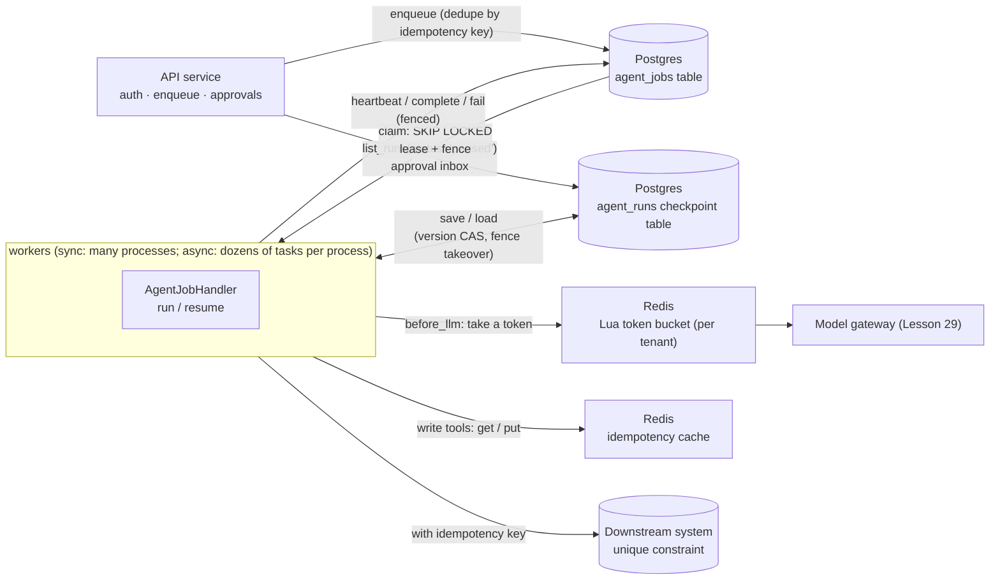
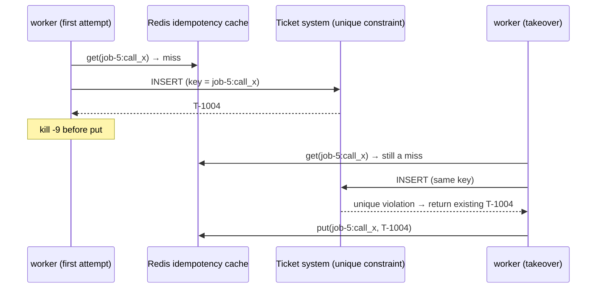
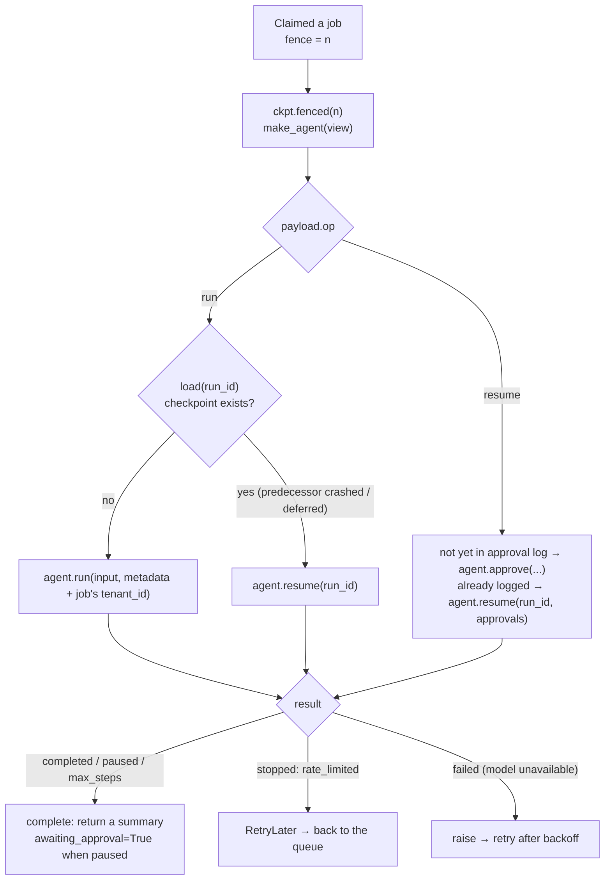

[中文](README.md) | [English](README.en.md)

# Lesson 26: State, queues, and distributed coordination — Postgres and Redis

> 🕐 Time: 30 min | 🎯 You'll be able to: put an agent's checkpoints, job queue, idempotency, rate limits, and locks on Postgres and Redis, and explain why each piece lives where it does and who picks up the pieces when something fails; choose between self-built, open-source, and managed options with a reason; replace sync workers with an async worker that runs dozens of tasks in one process, and size its connection pool | 📦 Source: [`agentkit/contrib/postgres.py`](../../agentkit/contrib/postgres.py), [`agentkit/contrib/redis_store.py`](../../agentkit/contrib/redis_store.py), [`demo.py`](demo.py)
>
> 📖 Primary reading: [Devious SQL: Message Queuing Using Native PostgreSQL](https://www.crunchydata.com/blog/message-queuing-using-native-postgresql) (David Christensen, 2021) — builds a `FOR UPDATE SKIP LOCKED` queue from scratch in about a dozen lines of SQL, and covers two things you will see all over this lesson's code: a rolled-back transaction puts the job back in the queue automatically, and a queue table updates so often that it bloats and needs autovacuum tuning. Read it, then look at `PostgresJobQueue.claim`: every line will look familiar.

## 0. In one sentence

**Where the teaching version of agentkit falls short**: `FileCheckpointer` only works on one machine, and it knows nothing about fencing, so an old worker that wakes up can overwrite the checkpoint a new worker wrote. `IdempotencyStore` lives in process memory: it disappears when the process dies, and other workers can't see it. Lesson 12's token bucket counts inside one process. Lesson 13's lease queue runs on a single-machine SQLite file. They explain the principles, but none of them holds up for "many machines, dozens of workers, hundreds of tenants."

**This lesson invents no new concepts. Lesson 13's leases, fencing tokens, CAS, and idempotency keys all stay; Postgres and Redis now carry them, and they plug straight into agentkit's interfaces. A one-line change, `Agent(checkpointer=PostgresCheckpointer(dsn))`, shares checkpoints across machines and keeps zombie workers out.**

An analogy: Lesson 13's kitchen kept orders on a sheet taped to the wall (a SQLite file). Once the business grows into a chain of dozens of restaurants, orders move into a central order system (Postgres: the books, which must never be lost), and the front desk gets a ticket machine (Redis: counting, queue numbers, rate limiting; if it loses power, you just start calling numbers again).

| Capability | Teaching version (lesson) | Why it isn't enough | This lesson's production version |
|---|---|---|---|
| Checkpoints | `FileCheckpointer` (Lesson 08) | Single machine; no fencing | `PostgresCheckpointer`: jsonb + version CAS + fence takeover |
| Job queue | SQLite `JobQueue` (Lesson 13) | Single machine; one writer at a time | `PostgresJobQueue`: SKIP LOCKED, server clock, partial index |
| Worker | Hand-written loop in the demo (Lesson 13) | Heartbeats, shutdown, and error handling all hand-rolled | `run_worker` / `run_async_worker` + `AgentJobHandler` |
| Idempotency | In-memory `IdempotencyStore` (Lesson 08) | Lost when the process dies; invisible to other workers | `RedisIdempotencyStore` (cache) + downstream unique constraint (the backstop) |
| Rate limiting | `TokenBucket` (Lesson 12) | Counts inside one process; N instances allow N times the quota | `RedisTokenBucket` (atomic Lua + Redis clock) + `RateLimitHook` |
| Locks | Lesson 13's timeline (concept only) | — | `RedisLock` (with a fencing token); and when to use an advisory lock or etcd instead |
| Concurrency model | One task at a time per worker process | The whole process sits idle while it waits for the model | Async version: one process drives dozens of tasks, with backpressure |

## 1. Why the teaching implementation isn't enough

### 1.1 The big picture: who stores what



### 1.2 One rule: Postgres holds the truth; Redis holds what you can rebuild

| Data | Where | If it's lost | Why |
|---|---|---|---|
| Checkpoints (conversation, step, pending approval) | Postgres | Users' sessions and approval state are gone | Must be durable; needs conditional writes (CAS); needs queries by tenant and status |
| Jobs (the queue) | Postgres (or a dedicated queue) | Jobs vanish | Must be durable; claiming must be atomic; can share a transaction with business data |
| Idempotency records for downstream side effects | The downstream system's own database | Duplicate tickets, duplicate charges | Must live in the **same transaction** as the side effect |
| Idempotency **cache** (write-tool results) | Redis | A replay calls downstream once more, and the downstream unique constraint dedupes it | Only saves one call; losing it is fine |
| Rate-limit counters | Redis | A short burst of extra requests gets through | Read and written on every model call, so it has to be fast; a loss only affects a short window |
| Short locks | Redis (efficiency locks) / Postgres, etcd (correctness locks) | See Problem 5 | A lock only buys efficiency; correctness comes from fencing |

This table doubles as the lesson's table of contents: checkpoints and queues are Problems 1 and 2, idempotency is Problem 3, rate limiting is Problem 4, locks are Problem 5, operations is Problem 6, and the concurrency model is Problem 7.

### 1.3 Terms

| Term | Plain English | Code in this lesson |
|---|---|---|
| `FOR UPDATE SKIP LOCKED` | Lock the selected row; skip rows someone else has locked instead of waiting | `PostgresJobQueue.claim` |
| Version CAS | "Write only if it's still the version I saw": `UPDATE ... WHERE version = what_i_saw` | `PostgresCheckpointer.save` |
| Fence takeover | When a new holder reads the checkpoint, it bumps the version, so the old holder's version number is void on the spot | `PostgresCheckpointer.fenced(fence).load` |
| Reaping | Put jobs with expired leases back in the queue; jobs out of attempts go straight to the dead-letter state | `PostgresJobQueue.reap_expired` |
| Lua script | A small program that runs atomically inside the Redis server; no other command runs in between | `TOKEN_BUCKET_LUA` |
| Backpressure | Stop claiming new jobs when you're full, and leave them in the queue for others | The semaphore in `run_async_worker` |
| Connection pool | A set of pre-opened database connections that get borrowed and returned; its size caps how many database operations can run at once | `psycopg_pool.AsyncConnectionPool` |

## 2. Enterprise problem cards

Seven cards. Each ends with "switching from embedded to managed." This lesson's demo and tests use an embedded Postgres (a real Postgres 16 process started by the pip package pgserver, single machine) and fakeredis (a Python implementation of the Redis protocol that doesn't simulate persistence, failover, or cluster sharding). In most cases, moving to a managed service means changing a connection string.

### Problem 1: Where do checkpoints live? When two workers fight over the same run, who wins?

**Scenario**: an IT help-desk agent runs on 8 worker pods. During a rolling deploy, worker-3 gets stuck in a 40-second GC pause while calling the model for step 4. Its lease expires; worker-5 takes over, recovers from the checkpoint, and finishes steps 5 and 6. Then worker-3 wakes up. It has no idea it has been "laid off," and writes its step-4 state back to the checkpoint. Both steps worker-5 wrote are overwritten; the user sees an agent with amnesia, and nothing raises an error.

**Why it's hard**: `FileCheckpointer` uses a temp file plus `os.replace` so each write is atomic, but it never asks "should this write happen at all?" Having the old worker check "do I still hold the lease?" before writing doesn't help either: it can pause again between the check and the write (Lesson 13, section 6.2). The decision has to be made **by the store, at the moment of the write**.

| Option | How | Pros | Cons | Scale / ops cost |
|---|---|---|---|---|
| A. Postgres row + version CAS (this lesson) | One row per run, state in `jsonb`; `UPDATE ... WHERE version = expected`, and 0 rows updated means a conflict; `status`, `tenant_id`, `updated_at` are separate indexed columns | Conditional writes are what databases do best; the approval inbox and per-tenant stats are one SQL query; can share a database with business data | Rewrites the whole jsonb every step (noticeable write amplification for large state); the table bloats, so watch VACUUM | The default for most teams; low ops cost on managed Postgres |
| B. Redis (JSON string + Lua / WATCH for CAS) | `SET run:{id}` holds the state; the version comparison goes into a Lua script | Fast; expiry for free | Persistence and replication both have data-loss windows (Problem 6); queries by status or tenant need hand-maintained secondary indexes | Short-lived sessions that can simply restart |
| C. DynamoDB conditional writes | Each item carries a version attribute; writes compare it with a `ConditionExpression` and fail with `ConditionalCheckFailedException` on mismatch ([AWS docs](https://docs.aws.amazon.com/amazondynamodb/latest/developerguide/BestPractices_OptimisticLocking.html)) | Fully managed, scales without limit; native TTL | Access patterns must be designed up front; TTL deletion is lazy (the docs say expired items are deleted "within a few days") | Large systems on AWS |
| D. A framework's own checkpointer | For example LangGraph's `PostgresSaver` / `AsyncPostgresSaver` (package `langgraph-checkpoint-postgres`; call `.setup()` on first use, [docs](https://docs.langchain.com/oss/python/langgraph/add-memory)); the Redis version, `RedisSaver`, is maintained by Redis Inc. ([langgraph-redis](https://github.com/redis-developer/langgraph-redis)) | Matches the framework's threads / time travel / interrupt semantics out of the box | Ties you to the framework's data model; you have to read the implementation to learn its concurrent-write semantics | You already use that framework |
| E. A durable execution engine (Temporal) | Stores an event history rather than "state," and replays it after a crash | The engine detects crashes, drives recovery, and runs approval timers | Adds new infrastructure; determinism constraints | Processes that run for hours or days; see [Lesson 27](../27_durable_workflows/README.en.md) |

**Plain CAS is one step short: "first writer wins" is not "newest holder wins."** If the zombie and the new worker read the same version, whoever writes first wins, and the loser may well be the new worker. CAS guarantees no lost updates, but it may let the zombie win and make the new worker's effort a waste. This lesson's `fenced(fence)` view closes the gap: a fenced `load` sets the row's fence to its own and bumps the version, in a single `UPDATE ... RETURNING`. From that moment every write by the old holder conflicts, and a `load` with a smaller fence is rejected outright.

```mermaid
sequenceDiagram
    participant A as worker-3 (fence=1)
    participant DB as agent_runs
    participant B as worker-5 (fence=2)
    A->>DB: load → version=2
    Note over A: 40 s GC pause; lease expires
    B->>DB: load (fence=2)<br/>UPDATE SET fence=2, version=version+1 WHERE fence <= 2
    DB-->>B: version=3, latest state
    B->>DB: save: UPDATE ... WHERE version=3
    DB-->>B: OK, version=4
    Note over A: wakes up, continues step 4
    A->>DB: save: UPDATE ... WHERE version=2
    DB-->>A: 0 rows → CheckpointConflict, stop
```

The fence=1 and fence=2 in the diagram only show which came first. Real fences come from one sequence shared by the whole queue table and only ever go up: when a later job for the same run (say, the resume job enqueued after an approval) is claimed for the first time, its fence is still larger than every previous holder's. Section 3.3 explains why it has to be this way.

**How to choose**: default to A, and **let the queue's fence drive checkpoint takeover** (`AgentJobHandler` already does). If the state is very large (hundreds of KB or more), or you need "time travel" and branching, look at how LangGraph splits checkpoints across tables and writes increments per version. If the process spans days and needs reliable timers, go straight to Lesson 27.

**This lesson's implementation**: [`PostgresCheckpointer`](../../agentkit/contrib/postgres.py), plus the async `AsyncPostgresCheckpointer` (for `agentkit.aio.AsyncAgent`, identical semantics). The test `test_plain_cas_is_first_writer_wins_but_fenced_takeover_makes_newest_holder_win` checks "first writer wins" and "newest holder wins" side by side. In one real-model run of part 1 of the demo, the frozen worker-3 wakes up, tries to write the checkpoint, and gets `Checkpoint conflict: run job-6 expected version 2, actual version 7 (last writer worker-1)`.

**Switching from embedded to managed**: `PostgresCheckpointer(os.environ["DATABASE_URL"])`, pointing at RDS, Cloud SQL, Aurora, or your own cluster. Create tables once, with a migration tool at deploy time (Problem 6).

### Problem 2: The job queue — is Postgres enough? When do you actually need Kafka?

**Scenario**: a customer-service agent platform runs 200,000 jobs a day, about 30 per second at peak, each taking 10 seconds to 3 minutes. In the architecture review, one person proposes "let's use Kafka," another says "Postgres is enough."

**Why it's hard**: people compare queues on throughput first, but for agents throughput is almost never the bottleneck: 30 jobs per second is small for every option here, and the real bottleneck is the model quota. What matters more are four things: **delivery semantics** (at least once, or can it lose jobs?); **how long jobs renew their lease**; **whether enqueueing can share a transaction with business data**; and **whether your team can operate it**.

| Option | Delivery semantics | Ordering | Throughput | Long jobs / lease renewal | Ops cost | Fits |
|---|---|---|---|---|---|---|
| A. Postgres `FOR UPDATE SKIP LOCKED` (this lesson) | At least once (lease + fence) | Whatever your `ORDER BY` says; not strict under concurrent claims | Hundreds to thousands of jobs per second, depending on indexes and cleanup | Write your own heartbeat (done for you here) | Near zero if you already run Postgres | **The starting point for most agent platforms**; whenever enqueueing must share a transaction with business writes |
| B. Redis Streams + consumer groups | At least once: delivered-but-unacknowledged messages sit in the Pending Entries List; `XACK` acknowledges, and `XAUTOCLAIM` (Redis 6.2+) claims ones that have been idle too long ([docs](https://redis.io/docs/latest/develop/data-types/streams/)) | Ordered within one stream | High | Judge by PEL idle time, then claim | Needs reliable Redis persistence and replication (Problem 6) | You already lean on Redis and can live with its persistence window |
| C. RabbitMQ (quorum queues) | At least once with manual acks; automatic acks are fire-and-forget, which the docs call unsafe ([docs](https://www.rabbitmq.com/docs/confirms)) | Ordered per queue; redeliveries can reorder | High | Ack timeouts; prefetch caps in-flight messages | Medium: you operate a cluster; quorum queues use Raft, and since 4.0 they default to at most 20 deliveries (delivery-limit), after which a message is dropped or dead-lettered ([docs](https://www.rabbitmq.com/docs/quorum-queues)) | Complex routing, multiple consumers |
| D. Kafka | At least once by default; transactions and the idempotent producer give "exactly once" only for read-process-write inside Kafka, and writes to external systems need your own coordination ([design docs](https://kafka.apache.org/43/design/design/)) | **Strictly ordered within a partition** | Very high | The offset model is a poor fit for "one message takes 3 minutes"; share groups (KIP-932, "queues for Kafka") are production-ready since 4.2 ([release notes](https://kafka.apache.org/blog/2026/02/17/apache-kafka-4.2.0-release-announcement/)) | High | Event streams, replay, several downstreams subscribing to the same data |
| E. Amazon SQS | Standard queues are at least once and **may deliver duplicates** ([docs](https://docs.aws.amazon.com/AWSSimpleQueueService/latest/SQSDeveloperGuide/standard-queues-at-least-once-delivery.html)); FIFO queues support deduplication | Not guaranteed on standard queues; FIFO orders per message group | Standard queues are nearly unlimited; FIFO without high-throughput mode does 300 TPS per API action, 3,000 messages/s with batching ([quotas](https://docs.aws.amazon.com/AWSSimpleQueueService/latest/SQSDeveloperGuide/quotas-messages.html)) | Visibility timeout defaults to 30 s, max 12 h; renew with `ChangeMessageVisibility` | Fully managed | The default on AWS |

Task frameworks such as Celery and Dramatiq sit at a different layer: they aren't storage themselves and need a broker underneath (Redis, RabbitMQ, SQS). Watch the broker defaults. With Celery on a Redis broker, for example, `visibility_timeout` defaults to 1 hour, and a task not acknowledged within that time **is redelivered to another worker and runs twice** ([docs](https://docs.celeryq.dev/en/stable/getting-started/backends-and-brokers/redis.html)). Agent jobs that run for tens of minutes hit this easily. Postgres also has mature off-the-shelf queue libraries: River (Go), Oban (Elixir), pg-boss and Graphile Worker (Node), Procrastinate (Python), and PGMQ, an extension with SQS-style visibility-timeout semantics. They all claim with SKIP LOCKED, and most use `LISTEN/NOTIFY` to cut polling latency.

**When you don't need Kafka**: a few thousand jobs per second or fewer; each job is handled by exactly one worker, with no need for several downstreams to subscribe independently; no need to replay history; jobs run for minutes and need their leases renewed. Agent job queues almost always land here. The signals that justify Kafka are the opposite: the same data must be consumed by several systems (audit, analytics, search indexing); you need strict per-key ordering plus replay; or the volume is so large that Postgres writes and cleanup become the bottleneck.

**How to choose**: start with A. With the queue in the same database as business data, "create the ticket + enqueue the follow-up agent job" fits in one transaction — exactly what the outbox pattern is after (Lesson 13, Problem 6) — without running another system. On AWS, if you don't want to operate anything, choose E (note that SQS's old receipt handles can't fence; Lesson 13, section 3.9). Add D when you need an event stream; the two don't conflict.

**This lesson's implementation**: [`PostgresJobQueue`](../../agentkit/contrib/postgres.py), with the async `AsyncPostgresJobQueue`; the SQL is in section 3.3. **Switching from embedded to managed**: again, just the connection string. KEDA's `postgresql` scaler can scale workers on the result of a SQL query, such as the number of runnable jobs ([docs](https://keda.sh/docs/2.21/scalers/postgresql/); deployment details in [Lesson 31](../31_deployment_and_scaling/README.en.md)).

### Problem 3: Where do idempotency records live? Is one Redis key enough?

**Scenario**: a worker calls the "create ticket" tool. The ticket system has already created the ticket, but the response is still in flight when the worker is `kill -9`ed. The worker that takes over recovers from the checkpoint and replays the same tool call. The system's `IdempotencyStore` was the in-memory kind, and it died with the process.

**Why it's hard**: idempotency answers "has this been done already?" As long as "doing it" and "recording that it was done" aren't one atomic operation, there's a gap between them.

| Option | How | Stops | Doesn't stop | Fits |
|---|---|---|---|---|
| A. Redis `get` / `put` (the agentkit interface; this lesson's `RedisIdempotencyStore`) | After a write tool succeeds, cache the result under `run_id:call_id` with a TTL | **Sequential** replays: retries that arrive after a success get the cached result | Done, but the process died before `put`; two workers executing **at the same time** | A cache that saves one downstream call |
| A'. Redis `claim` (SET NX an "in progress" marker) | Atomically "take the slot" **before** executing; also returns False if a result already exists | **Concurrent** execution: when a zombie and the new worker reach the same call at once, only one gets in | After the marker expires, a side effect that happened without a `put` will run again | Slow, expensive downstreams where concurrent duplicates are costly |
| B. Postgres unique constraint (same transaction as the side effect) | `INSERT ... ON CONFLICT (idempotency_key) DO NOTHING`: doing the side effect and recording the key are one statement | **Everything**: there's no gap | — (as long as the side effect lives in this database) | Side effects that land in your own database |
| C. The downstream's Idempotency-Key | Pass the key to the downstream API and let it guarantee idempotency. Stripe stores the first request's result (**including 500 errors**), keeps keys for at least 24 hours, and errors if the parameters differ ([docs](https://docs.stripe.com/api/idempotent_requests)); the IETF `Idempotency-Key` header draft has expired without becoming an RFC ([datatracker](https://datatracker.ietf.org/doc/draft-ietf-httpapi-idempotency-key-header/)) | Everything (the downstream's job) | Nothing you can do if the downstream doesn't support it | Third-party APIs |



**Why idempotency has to sink into the downstream**: A and A' both keep the books **next to** the side effect. As long as the side effect and the bookkeeping aren't in one transaction, a crash can always land in the gap between them. The only way to close the gap is for the system that performs the side effect to check the key in the same transaction — that's B and C. Lesson 08 defined the idempotency key `run_id:call_id`, Lesson 13's `TicketSystem` used a unique index as the backstop, and this lesson's demo does the same with a unique constraint on a Postgres table.

**How to choose**: B or C is the floor; you must have one. A is an optional optimization that saves a downstream call. Use A' only when concurrent duplicates are expensive and the downstream doesn't support idempotency, and know that it doesn't stop every case.

**This lesson's implementation**: pass `RedisIdempotencyStore(client, namespace="idem", ttl_seconds=86400)` straight to `Agent(idempotency_store=...)`; the async version is `AsyncRedisIdempotencyStore`. In part 1 of the demo, the call that was `kill -9`ed never reached Redis, so the worker that took over missed the cache, and the downstream unique constraint stopped the duplicate: `♻️ Downstream unique constraint hit: returned existing ticket T-1004, no duplicate created`.

**Switching from embedded to managed**: `RedisIdempotencyStore(os.environ["REDIS_URL"])` (ElastiCache, Memorystore, or your own Redis / Valkey). Keys are wrapped in a hash tag, `idem:{run_id:call_id}`, so on Redis Cluster the result and the "in progress" marker land in the same slot.

### Problem 4: Why does per-process rate limiting break with multiple instances?

**Scenario**: the model gateway gives the IT help desk a quota of 20 calls per second. The service runs 10 pods, each with Lesson 12's token bucket set to 20 calls per second. The result: 200 calls per second go out, the quota is gone within seconds, and everything after that is a 429. The HPA sees rising latency and adds 5 more pods, which makes it worse.

**Why it's hard**: the quota is **global**, but the counter is **one per process**. Splitting it evenly across pods (2 per second each) brings new problems: every change in pod count means recomputing, and with uneven load some buckets sit idle while others run dry.

| Option | How | Pros | Cons | Fits |
|---|---|---|---|---|
| A. Per-process token bucket (Lesson 12) | One bucket per process, with quota = total / number of processes | Zero dependencies, zero latency | Drifts whenever the process count changes; only approximates the total | A fixed number of processes, or a coarse filter in front of a global limit |
| B. Redis Lua token bucket (this lesson) | Every worker takes a token from Redis before calling; read, refill, decide, and write back all happen in one atomic Lua script | Exact control of the total; independent of process count; per tenant and per plan | One extra Redis round trip per call; you must decide "allow or deny" when Redis fails | Many instances sharing one hard quota — most setups |
| C. Rate limiting at the gateway | Envoy's global rate-limit service (the reference implementation, envoyproxy/ratelimit, is written in Go and backed by Redis, [docs](https://www.envoyproxy.io/docs/envoy/latest/intro/arch_overview/other_features/global_rate_limiting)), or per-key budgets in a model gateway such as LiteLLM ([Lesson 29](../29_gateway_and_guardrails/README.en.md)) | Application code stays out of it; enforced uniformly for every caller | Usually request-level, without the agent's tenant context; Envoy's `failure_mode_deny` defaults to false, so traffic flows when the rate-limit service is down | Many teams and apps sharing one model egress |
| D. The model provider's quota | Providers limit RPM, TPM, and more per organization / project, with response headers such as `x-ratelimit-remaining-requests` and `x-ratelimit-remaining-tokens` ([OpenAI docs](https://developers.openai.com/api/docs/guides/rate-limits)) | The final hard cap; you can't get around it | By the time it tells you with a 429 it's too late; all you can do is back off and retry | Always there: it's the last wall, not your rate-limiting strategy |

**Why must it be Lua?** One token-bucket decision is "read the remaining tokens → refill based on elapsed time → check if there are enough → write back." Do that on the client, and two workers can both read "1 left" and both proceed — the same "lost update" problem as Lesson 13. Redis guarantees that a script runs atomically, blocking all other server activity while it runs ([docs](https://redis.io/docs/latest/develop/programmability/eval-intro/)), so keep scripts short and never do heavy computation inside them.

**Why use Redis's `TIME` as the clock?** Tokens refilled = elapsed time × rate. With each worker's local time, a machine whose clock runs fast conjures tokens out of thin air, and one whose clock runs slow drags the timestamp backwards. With the Redis server as the single clock, the problem disappears. Calling a nondeterministic command such as `TIME` inside a script is safe: since Redis 5.0 scripts are replicated by effects by default, and since 7.0 that is the only mode ([docs](https://redis.io/docs/latest/develop/programmability/eval-intro/)). By contrast, Redis's official rate-limiting tutorial has the application pass the current time into the script ([tutorial](https://redis.io/tutorials/howtos/ratelimiting/)): easier to test, at the cost of trusting every machine's clock.

Two more Lua traps, both tested here: ① **a Lua number returned to Redis is truncated to an integer**, so 1.5 becomes 1; the docs recommend returning floats as strings ([Lua API](https://redis.io/docs/latest/develop/programmability/lua-api/)); ② on Redis Cluster, every key a script touches must be passed in `KEYS` and hash to the same slot ([docs](https://redis.io/docs/latest/develop/using-commands/multi-key-operations/)). This lesson's bucket touches one key per call.

**What if no token comes?** `RateLimitHook` waits at most `wait_timeout` seconds, then raises `StopRun("rate_limited")`. A worker that waits here holds a worker slot, and other tenants with quota to spare queue behind it (head-of-line blocking). `AgentJobHandler` turns `rate_limited` into `RetryLater`: the job goes back to the queue, comes back a little later, and **doesn't consume a retry attempt** — it's not the job's fault. In the demo, the free-plan tenant (1 call per second) was deferred 16 times and needed 19.6 s for all its jobs; the two standard-plan tenants were never deferred and finished everything in about 10.7 s.

**How to choose**: B caps your own total (per tenant, per plan), C caps the company's total egress, and D is the last wall: on a 429, back off according to `Retry-After` (Lesson 08). Decide **in advance** what happens when Redis is down: interactive traffic usually fails open and alerts; batch jobs pause.

**This lesson's implementation**: [`RedisTokenBucket`](../../agentkit/contrib/redis_store.py) (`try_acquire` / `acquire`; `overrides` sets rate and capacity per tenant) and `RateLimitHook` (takes tokens in `before_llm`; `tokens_fn` can charge by token count for TPM limits). The async versions are `AsyncRedisTokenBucket` and `AsyncRateLimitHook`, which yield the event loop with `asyncio.sleep` while waiting. **Switching from embedded to managed**: change `REDIS_URL`.

### Problem 5: Distributed locks — Redis, Postgres advisory locks, etcd, or ZooKeeper?

**Scenario**: every night, one of 8 workers must generate a weekly agent report for each tenant. Someone guards it with a Redis `SET NX PX` lock. One day the Redis primary dies and a replica is promoted before the freshly written lock has been replicated. Two workers both get the lock, and the customer receives two reports.

**Why it's hard**: locks serve two purposes (Kleppmann's distinction, Lesson 13's primary reading): **efficiency** (avoid duplicate work; an occasional duplicate is harmless) and **correctness** (a single duplicate is an incident). The first is fine with a single Redis node. The second requires the protected resource to check a fencing token, and the token itself must come from a system that never "goes backwards."

| Option | How | Pros | Cons | Fits |
|---|---|---|---|---|
| A. Redis `SET NX PX` + INCR fencing token (this lesson's `RedisLock`) | Acquire the lock and `INCR` a counter in the same Lua script; release with a compare-and-delete Lua script ([Redis docs](https://redis.io/docs/latest/develop/clients/patterns/distributed-locks/); since Redis 8.4 you can also use `DELEX key IFEQ value`) | Fast and simple; the token enables fencing | Replication is asynchronous, so a failover can lose the lock **and the latest INCRs**, which means tokens get reissued; Redis expiry doesn't use a monotonic clock | Efficiency locks, or cases where correctness doesn't depend on the token being absolutely reliable |
| A'. Redlock (5 independent Redis primaries; success needs a majority) | See the Redis docs | No dependence on a single node | Kleppmann's critique: it relies on the timing assumption that network delay, process pauses, and clock error are all much smaller than the TTL, and it produces no fencing token ([article](https://martin.kleppmann.com/2016/02/08/how-to-do-distributed-locking.html)); antirez's rebuttal is [here](https://antirez.com/news/101) | Not recommended in this lesson |
| B. Postgres advisory locks | `pg_advisory_xact_lock(key)`: transaction-scoped and released automatically when the transaction ends. Session-level locks are held until the session ends and **don't follow transaction semantics**: roll back and the lock is still held ([docs](https://www.postgresql.org/docs/current/explicit-locking.html#ADVISORY-LOCKS)) | The protected write lives in the **same transaction** as the lock: if the holder dies, the transaction rolls back and the write goes with it — safe by construction; no new component | Session-level locks don't work behind PgBouncer's transaction pooling; locks don't expire, so if the holder hangs, others wait until the connection times out | **The protected resource lives in this Postgres** — the most common case |
| C. etcd | Leases + transactions conditioned on revisions; the etcd docs explicitly map Kleppmann's fencing token to etcd's revision number ([docs](https://etcd.io/docs/v3.5/learning/why/)) | Raft-based and linearizable; revisions increase monotonically and never go backwards | You run an etcd cluster (Kubernetes has one, but sharing it with application workloads isn't advisable) | Cross-system coordination and leader election with strict correctness needs |
| D. ZooKeeper | The ephemeral-sequential-node recipe, where each client watches only its predecessor to avoid the herd effect ([recipe](https://zookeeper.apache.org/doc/current/recipes.html)); zxid or znode version can serve as the fencing token | Mature | Highest ops cost | Big-data stacks that already run ZooKeeper |

**Design so you don't need a lock, whenever you can.** The scenario above needs no lock: make "generate the weekly report" a **job** with idempotency key `weekly-report:{tenant}:{week}`, deduplicated on enqueue; the queue's lease and fence ensure only one worker works on it at a time; send the email with the same idempotency key and let the downstream dedupe it. Most of the "coordination" in this lesson is done this way — **queue + CAS + idempotency** — without a single lock. A lock only earns its place when several workers must change the same shared state **at the same time** and that state can't be partitioned.

```python
# Locks + fencing, done right: the store checks the token; the holder doesn't decide "do I still hold the lock?"
with RedisLock(r, "weekly-report:acme", ttl_seconds=30) as fence:
    report = build_report()                                   # this may pause for a long time
    cur = pg.execute("UPDATE reports SET body = %s, fence = %s WHERE tenant = 'acme' AND fence < %s",
                     (report, fence, fence))
    if cur.rowcount == 0:
        raise RuntimeError("I'm no longer the holder: write rejected")   # the store decides at write time
```

**How to choose**: if the resource lives in Postgres, use B. For cross-system coordination with strict correctness, use C. For efficiency only, use A, but let the store check the fence for correctness: **never use a lock without fencing for correctness**, and **never let a Redis INCR token be your only line of defense**.

**This lesson's implementation**: `RedisLock(client, name, ttl_seconds)`: `acquire()` returns a fencing token, and `release()` and `extend()` both compare before acting. The test `test_storage_rejects_a_paused_holders_stale_token` reproduces Lesson 13's timeline. This lesson's `setup()` uses `pg_advisory_xact_lock` to serialize table creation across processes, a small example of B (section 6 explains why it's needed). **Switching from embedded to managed**: A changes `REDIS_URL`; B changes nothing, since it's your Postgres; C and D need their own deployment (or a cloud provider's managed version).

### Problem 6: Operations — connection pools, migrations, backup and HA, table bloat, monitoring

**Scenario**: in the first week in production, four things happen in a row: ① after scaling to 40 pods, Postgres reports `too many connections`; ② two worker versions start at the same time, both try to create tables, and one fails to start; ③ a month later, the queue table takes 30 GB while holding 2,000 rows; ④ customers complain that "it never responds after I submit," while the CPU and memory dashboards are all green.

**Why it's hard**: none of these is hard on its own, but they only show up **at scale and over time**; local tests hit none of them.

**① Connection pools: processes × connections per process ≤ the database limit**

| Option | How | Watch out for |
|---|---|---|
| In-app pool (`psycopg_pool`) | `ConnectionPool` / `AsyncConnectionPool`; `with pool.connection()` commits on normal exit, rolls back on an exception, then returns the connection ([docs](https://www.psycopg.org/psycopg3/docs/advanced/pool.html)) | Size the pool by "threads / coroutines that need a connection at the same time" (Problem 7); **never borrow a second connection from the same pool while holding one**: tested with a pool of 2 and two coroutines doing exactly that — both failed with `PoolTimeout` |
| External pooler (PgBouncer) | Transaction pooling: a server connection is held only for the duration of a transaction, so thousands of client connections can share a few dozen server connections ([docs](https://www.pgbouncer.org/features.html)) | In transaction pooling mode, `SET`, `LISTEN`, session-level advisory locks, and more **don't work**. Protocol-level prepared statements are supported since 1.21 and on by default since 1.24 (`max_prepared_statements=200`). psycopg auto-prepares a query after 5 executions (`prepare_threshold=5`); set it to `None` when the middleware doesn't support it ([psycopg docs](https://www.psycopg.org/psycopg3/docs/advanced/prepare.html#using-prepared-statements-with-pgbouncer)). This lesson's adapters accept it via `connect_kwargs={"prepare_threshold": None}` |
| Managed proxy (RDS Proxy, etc.) | Same idea, operated by the cloud provider | Same caveats about prepared statements and session state |

**② Migrations: use Alembic (SQLAlchemy ecosystem, [docs](https://alembic.sqlalchemy.org/)) or Flyway (versioned plain-SQL scripts, [docs](https://documentation.red-gate.com/fd)) and run them once in the release pipeline**, instead of having every worker create tables on startup. This lesson's `setup()` exists for teaching and tests, and uses an advisory lock so concurrent table creation doesn't collide: tested with 8 connections running `CREATE TABLE IF NOT EXISTS` at once, 7 failed with `UniqueViolation`.

**③ Backup and high availability**

| Component | Options | Numbers to know |
|---|---|---|
| Postgres | RDS Multi-AZ instance / Multi-AZ cluster / Aurora / self-managed (Patroni, etc.) | RDS Multi-AZ instance failover typically takes 60–120 s ([docs](https://docs.aws.amazon.com/AmazonRDS/latest/UserGuide/Concepts.MultiAZ.Failover.html)); Multi-AZ clusters typically under 35 s ([docs](https://docs.aws.amazon.com/AmazonRDS/latest/UserGuide/multi-az-db-clusters-concepts-failover.html)); Aurora with a replica typically under 60 s ([docs](https://docs.aws.amazon.com/AmazonRDS/latest/AuroraUserGuide/Concepts.AuroraHighAvailability.html)). Workers must survive that window: `run_worker` backs off and retries when a claim fails instead of crashing |
| Redis | RDB snapshots / AOF / replication + Sentinel or Cluster / MemoryDB | RDB typically snapshots every few minutes, so a crash can lose minutes of data; AOF (enabled with `appendonly yes`) defaults to `appendfsync everysec`, which can lose about 1 second ([docs](https://redis.io/docs/latest/operate/oss_and_stack/management/persistence/)); replication is asynchronous, and even `WAIT` doesn't make Redis strongly consistent ([docs](https://redis.io/docs/latest/commands/wait/)), so a failover can lose acknowledged writes. If you need durable Redis semantics, consider MemoryDB, which persists writes to a Multi-AZ transaction log before acknowledging them ([docs](https://docs.aws.amazon.com/memorydb/latest/devguide/what-is-memorydb.html)) |

This table is also the reason behind the rule in section 1.2: a Redis failover can lose roughly the last second of writes, so **only put things there that you can rebuild**.

**④ Table bloat and VACUUM**: a Postgres `UPDATE` doesn't modify a row in place; it writes a new version, and VACUUM reclaims the old one ([docs](https://www.postgresql.org/docs/current/routine-vacuuming.html)). A queue table updates each job at least 3 times (claim, some heartbeats, complete), a textbook "hot update" table. Some practices:

- The default autovacuum trigger is 50 rows + 20% of the table. For a small, hot queue table that ratio is too lazy; lower `autovacuum_vacuum_scale_factor` for that table ([settings docs](https://www.postgresql.org/docs/current/runtime-config-vacuum.html));
- HOT updates (no indexed column changes, free space on the page) don't touch indexes. A heartbeat only changes `lease_until` and `updated_at`, but `lease_until` is in a partial index, so heartbeats can't be HOT. Whether dropping that index to enable HOT is worth giving up fast reaping depends on your load ([HOT docs](https://www.postgresql.org/docs/current/storage-hot.html));
- Delete or archive finished jobs regularly: `purge_finished(older_than_seconds=7*86400)`. Idempotency keys go with their rows, so **the dedup window = the retention period**; set it by business need;
- The checkpoint table rewrites the whole jsonb row every step, so large states amplify writes noticeably. Keep state small (Lesson 04's context compaction) and archive finished runs to cold storage.

**⑤ Monitoring**: green CPU doesn't mean users aren't waiting. Better than "how many jobs are queued" is **how long the oldest runnable job has been waiting**: `stats()["oldest_queued_age_s"]`. Other metrics worth alerting on: `expired_leases` (leases that expired but haven't been reaped yet: workers died or are all stuck), growth in `dead`, fence rejections (`on_event("fence_rejected")`), and checkpoint conflicts. Lesson 28 wires `run_worker`'s `on_event` into Prometheus.

**Switching from embedded to managed**: when the connection string points at PgBouncer or RDS Proxy, add `connect_kwargs={"prepare_threshold": None}` (unless you've confirmed the middleware supports prepared statements); hand migrations to the release pipeline; choose a managed Redis with replication and automatic failover, and accept that a failover may lose about 1 second.

### Problem 7: Sync workers vs async workers — how many agents can one process run at once?

**Scenario**: at peak, a customer-service agent has 300 sessions running at once, each spending 90% of its time waiting for the model. Lesson 13's sync worker handles one task per process at a time, so the team runs 60 pods with 5 processes each. The bill shows memory for 300 Python processes plus 900 Postgres connections, while CPU utilization sits at 3%.

**Why it's hard**: agents are a textbook **IO-bound** workload: a model call takes 3–10 seconds, and the CPU does nothing during that time. The fix is "do something else while waiting," and there are three ways to do something else, each with its own traps.

| Option | How | Pros | Cons | Fits |
|---|---|---|---|---|
| A. One thread per task | N threads per process, each running a sync agent | No code changes (agentkit's sync version) | Thread stacks cost memory; CPU-bound parts serialize under the GIL; each thread usually needs its own database connection; **cancellation isn't possible** (threads can't be killed) | A few dozen concurrent tasks |
| B. Multiple processes (Lesson 13; this lesson's `run_worker`) | Each process runs one task at a time; add processes to go faster | Best isolation: one crashing process doesn't affect the others; CPU-bound tools run in parallel | Memory and connections grow linearly with process count; the whole process idles while it waits for the model | Lots of CPU-bound tools, or as the outer layer around async workers (one async process per core) |
| C. asyncio (this lesson's `run_async_worker` + `AsyncAgent`) | One event loop per process driving dozens to hundreds of tasks, yielding control while waiting on the model, database, or Redis | Almost no extra memory; the connection pool can be far smaller than the concurrency; cancellation can travel all the way to the HTTP request ([Lesson 30](../30_async_runtime/README.en.md)) | **Any single blocking call stalls the whole process**; the whole chain (model client, database driver, Redis client, tools) must be async or pushed into a thread pool | IO-bound agents — the default for production services |

**Backpressure**: `run_async_worker(queue, handler, concurrency=16)` takes an `asyncio.Semaphore` slot before it claims. When all slots are taken it waits there and **stops claiming**, so jobs stay in the queue for other workers. Without this, one process grabs hundreds of jobs it can't keep up with, their leases expire one after another, and other workers run them again.

**Matching the pool to the concurrency**: what matters isn't "how many tasks run at once" but "how many tasks are **using** a database connection at once." In one agent step, a connection is borrowed only for the few milliseconds it takes to write the checkpoint, not for the seconds spent waiting on the model. That's why 16-way concurrency runs fine on a 4-connection pool (see the measurements below). But if a task holds a connection while it waits for the model (calling the model inside a transaction, or calling `pool.connection()` and then running the agent), concurrency collapses to the number of connections. A rule of thumb: `pool size ≈ concurrency × fraction of time each task holds a connection + headroom (heartbeats, claims)`; summed across all processes it must stay under the database's `max_connections` (beyond that you need PgBouncer).

**Why a blocking call in async code drags down the whole event loop**: the event loop is single-threaded, and coroutines only yield at `await`. Call `time.sleep(0.05)`, `requests.get`, or the sync psycopg / redis-py inside a coroutine, and for those 50 ms no other coroutine can move — including **every task's lease heartbeat**. Once heartbeats stop, leases expire and other workers take the tasks over. The test `test_blocking_call_inside_an_async_handler_stalls_every_other_task` counts "how many tasks are inside sleep at the same time": always 1 for the blocking version, at least 2 for the sync version handed to the thread pool. When `run_async_worker` sees that the handler is a sync function, it runs it with `asyncio.to_thread` automatically. Likewise, the sync `RateLimitHook` waiting for tokens inside an async agent stalls the whole process; use `AsyncRateLimitHook`.

**How to choose**: default to C for agent workers. Run one async process per CPU core (B wrapped around C), start `concurrency` at 16–64, and tune it against the model quota and memory. Start the pool at a quarter of the concurrency, then watch whether `requests_queued` in `psycopg_pool`'s `get_stats()` (requests queued because the pool was full) keeps growing. Runtime details (cancellation, timeouts, bulkheads, streaming) are in [Lesson 30](../30_async_runtime/README.en.md).

**This lesson's implementation**: `AsyncPostgresCheckpointer` and `AsyncPostgresJobQueue` (which can share one `AsyncConnectionPool`), `run_async_worker`, `AsyncRedisIdempotencyStore`, `AsyncRedisTokenBucket`, `AsyncRateLimitHook`; when `AgentJobHandler` sees an async checkpointer, it `await`s `agent.run / resume / approve`, and the whole process uses **one** `AsyncAgent` (and therefore one tool thread pool), passing each job's fenced checkpoint view per call via the `checkpointer=` argument. Part 3 of the demo gives measured numbers, and part 4 shows an async worker's graceful shutdown (section 4).

## 3. How this lesson's adapter plugs in

### 3.1 Public API at a glance

| Module | Class / function | Main methods |
|---|---|---|
| `agentkit.contrib.postgres` | `PostgresCheckpointer(conninfo, table="agent_runs", *, fence=None, writer=None, connect_kwargs=None)` | `setup()`, `save(state)`, `load(run_id)`, `fenced(fence, writer=None)`, `get_run(run_id)`, `list_runs(status=None, tenant_id=None, limit=50)`, `version_of(run_id)`, `close()` |
| | `AsyncPostgresCheckpointer(pool_or_dsn, table="agent_runs", *, fence=None, writer=None, pool_kwargs=None)` | Same as above, all `async`; supports `async with` |
| | `PostgresJobQueue(conninfo, table="agent_jobs", *, max_attempts=5, base_backoff=1.0, max_backoff=300.0, connect_kwargs=None)` | `setup()`, `enqueue(kind, payload, *, tenant_id, idempotency_key=None, priority=0, run_at=None, delay_seconds=0, max_attempts=None) -> int`, `claim(worker_id, lease_seconds=30, kinds=None) -> Job \| None`, `heartbeat(job, lease_seconds)`, `complete(job, result)`, `fail(job, error, retryable=True) -> str`, `release(job, *, delay_seconds=0, reason=None, count_attempt=False)`, `reap_expired()`, `redrive(job_id)`, `stats()`, `purge_finished(older_than_seconds)`, `get(job_id)`, `find(tenant_id, key)` |
| | `AsyncPostgresJobQueue(pool_or_dsn, ...)` | Same as above, all `async` |
| | `run_worker(queue, handler, *, worker_id, stop_event, lease_seconds=30, poll_interval=0.5, heartbeat_interval=None, kinds=None, on_event=None, max_jobs=None) -> dict` | Sync worker main loop |
| | `run_async_worker(queue, handler, *, worker_id, stop_event, concurrency=16, lease_seconds=30, poll_interval=0.5, heartbeat_interval=None, grace_period=25.0, kinds=None, on_event=None, max_jobs=None) -> dict` | Async worker main loop |
| | `AgentJobHandler(make_agent or an AsyncAgent instance, checkpointer, *, defer_stop_reasons=("rate_limited",), defer_seconds=2.0)` | `handler(job) -> dict` (returns a coroutine with an async checkpointer; `is_async=True`); `agents_created`: how many times the factory was called |
| | `stop_on_signals(stop_event, signals=(SIGTERM, SIGINT))`; exceptions `CheckpointConflict`, `LeaseLost`, `RetryLater`, `PermanentJobError`; dataclass `Job` | |
| `agentkit.contrib.redis_store` | `RedisIdempotencyStore(client_or_url, namespace="idem", ttl_seconds=86400)` / `AsyncRedisIdempotencyStore` | `get(key)`, `put(key, result)`, `claim(key, ttl_seconds=60) -> bool`, `release(key)`, `in_flight(key)` |
| | `RedisTokenBucket(client, rate_per_sec, capacity, prefix="tb", *, overrides=None)` / `AsyncRedisTokenBucket` | `take(key, tokens=1) -> (ok, wait_s, left)`, `try_acquire(key, tokens=1)`, `acquire(key, tokens=1, timeout=None)`, `limits(key)` |
| | `RateLimitHook(bucket, key_fn=tenant, tokens_fn=lambda s, m: 1, wait_timeout=5.0)` / `AsyncRateLimitHook` | agentkit hook: `before_llm` |
| | `RedisLock(client, name, ttl_seconds, *, prefix="lock")` | `acquire(blocking=True, timeout=None) -> fence \| None`, `release()`, `extend(ttl_seconds=None)`, `owned()`; supports `with lock as fence:` |

A multi-worker agent service in five lines:

```python
from agentkit import Agent, PermissionPolicy, default_llm
from agentkit.contrib.postgres import AgentJobHandler, PostgresCheckpointer, PostgresJobQueue, run_worker, stop_on_signals
from agentkit.contrib.redis_store import RateLimitHook, RedisIdempotencyStore, RedisTokenBucket

queue, ckpt = PostgresJobQueue(DSN), PostgresCheckpointer(DSN)
limiter = RateLimitHook(RedisTokenBucket(REDIS_URL, rate_per_sec=5, capacity=10), wait_timeout=2)

def make_agent(checkpointer):                       # must use the checkpointer passed in: it carries this claim's fence
    return Agent(default_llm(), TOOLS, checkpointer=checkpointer, hooks=[PermissionPolicy(), limiter],
                 idempotency_store=RedisIdempotencyStore(REDIS_URL))

stop = threading.Event(); stop_on_signals(stop)     # SIGTERM → finish the current job, then exit
run_worker(queue, AgentJobHandler(make_agent, ckpt), worker_id=os.environ["HOSTNAME"], stop_event=stop)
```

The async version: one `AsyncAgent` per process, shared by every job; the handler passes each job's fenced view in via `checkpointer=`.

```python
from agentkit.aio import AsyncAgent, default_async_llm
from agentkit.contrib.postgres import AsyncPostgresCheckpointer, AsyncPostgresJobQueue, run_async_worker

pool = AsyncConnectionPool(DSN, max_size=8, kwargs={"autocommit": True})   # the queue and checkpoints share one pool (Problem 7)
aqueue, ackpt = AsyncPostgresJobQueue(pool), AsyncPostgresCheckpointer(pool)
agent = AsyncAgent(default_async_llm(max_connections=20), TOOLS, checkpointer=ackpt, hooks=[PermissionPolicy()])
stop = asyncio.Event(); stop_on_signals(stop)       # call inside the event loop
await run_async_worker(aqueue, AgentJobHandler(agent, ackpt), worker_id=os.environ["HOSTNAME"],
                       stop_event=stop, concurrency=32, grace_period=25)
```

On the API side: `queue.enqueue("agent", {"op": "run", "input": text, "metadata": {...}}, tenant_id=..., idempotency_key=request_id)`; the approval inbox is `ckpt.list_runs(status="paused", tenant_id=...)`; after approval, enqueue `{"op": "resume", "run_id", "approvals": {call_id: True}, "by": approver}` with idempotency key `approve:{run_id}:{call_id}`, so an approver who double-clicks still enqueues only once.

### 3.2 Checkpoints: CAS and fence takeover are one SQL statement each

```sql
-- save (CAS): the write lands only if the version is still the one I last saw
UPDATE agent_runs SET state = $state, status = $status, tenant_id = $tenant, writer = $me,
                      version = version + 1, updated_at = now()
 WHERE run_id = $run_id AND version = $expected
RETURNING version;                 -- 0 rows → CheckpointConflict

-- load (with a fence): take over. Allowed only if my fence isn't smaller; version + 1 voids the old holder's version on the spot
UPDATE agent_runs SET fence = $my_fence, version = version + 1, writer = $me, updated_at = now()
 WHERE run_id = $run_id AND fence <= $my_fence
RETURNING version, state;          -- 0 rows but the row exists → you've been superseded → CheckpointConflict
```

Design decisions:

1. **A new run uses `INSERT ... ON CONFLICT DO NOTHING`**, and 0 rows inserted is also a conflict. If the run_id already has a checkpoint, someone created it before you; you should `resume`, not `run` (`AgentJobHandler` checks with `load` first).
2. **Conflicts raise; they don't return False.** `Agent` saves on every step, so the exception propagates out of `agent.run`, and the worker classifies it as "ownership moved" and commits nothing. A return value is easy to ignore, and this signal means "stop now."
3. **NUL characters.** Postgres `jsonb` can't store `\u0000` ([docs](https://www.postgresql.org/docs/current/datatype-json.html)), so a single tool returning binary content would fail the whole checkpoint write. The adapter replaces NUL with U+FFFD: getting the data stored matters more than byte-for-byte fidelity.
4. **`get_run` / `list_runs` are read-only**: they don't take over or record versions; they're for the API and operators.
5. **Versions are remembered only for runs that are still running.** The instance keeps each run's version in memory (`version_of`) for the next CAS. As soon as it saves a status other than running (completed, paused, cancelled, …), it drops that run's version: resuming and approving both `load` first, which records the latest version again. The first version only ever added entries, and a shared checkpointer serves thousands of runs, so the dict grew without bound: a memory leak (found in the Lesson 31 load test, now fixed; regression test `test_shared_checkpointer_forgets_versions_of_finished_runs`).

### 3.3 The queue: reap + claim

```sql
-- Reap (done before every claim): expired lease → requeue after backoff if attempts remain, else dead-letter
UPDATE agent_jobs SET status = CASE WHEN attempts >= max_attempts THEN 'dead' ELSE 'queued' END,
       lease_until = NULL, run_at = now() + backoff, last_error = 'lease expired: worker ... missed its renewal'
 WHERE id IN (SELECT id FROM agent_jobs WHERE status = 'leased' AND lease_until < now()
              ORDER BY lease_until LIMIT 100 FOR UPDATE SKIP LOCKED);

-- At table creation (setup()): one fence sequence shared by the whole queue table
CREATE SEQUENCE IF NOT EXISTS agent_jobs_fence_seq;

-- Claim: the fence is the sequence's next value, so it only ever goes up across the whole table
UPDATE agent_jobs SET status = 'leased', worker_id = $me, lease_until = now() + $lease,
                      attempts = attempts + 1, fence = nextval('agent_jobs_fence_seq'::regclass)
 WHERE id = (SELECT id FROM agent_jobs
              WHERE status = 'queued' AND run_at <= now()
              ORDER BY priority DESC, id LIMIT 1
              FOR UPDATE SKIP LOCKED)
RETURNING *;
```

- **SKIP LOCKED**: the PostgreSQL docs say plainly that skipping locked rows gives an inconsistent view of the data, unsuitable for general use, but useful for avoiding lock contention when multiple consumers access a queue-like table ([docs](https://www.postgresql.org/docs/current/sql-select.html#SQL-FOR-UPDATE-SHARE)). The test for exercise (b) holds a row lock and doesn't let go: without `SKIP LOCKED`, your implementation queues up behind it.
- **Why reap back to `queued` instead of letting claim take expired rows directly?** Claim then scans only one partial index, `(priority DESC, id) WHERE status = 'queued'`, which stays a single index scan however large the backlog gets. The price: once a job is reaped, the old holder's late commit is rejected (its ownership ended at the moment of reaping). Before reaping, a late commit still counts, as in Lesson 13.
- **Order by `id`, not `run_at`.** The first version used `ORDER BY run_at, id`. In the demo, a worker was killed at 1.7 s and nobody took over until 10.6 s, with a lease of only 2 s: reaping set `run_at` to "now + backoff," which sent the job to the **back of the queue** behind the whole backlog. Its user had already waited once and shouldn't have to queue again. After switching to enqueue order (`id`), a job whose backoff has elapsed goes back to its original place: in the same scenario it is now killed at 0.9 s and taken over at 3.2 s, little more than the 2 s lease; in real-model mode, a worker killed at 11.6 s had its job taken over at 14.4 s (3 s lease).
- **All times come from the database's `now()`**: every worker judges leases by the same clock.
- **`attempts` is incremented on claim**, so poison messages still reach the dead-letter state (Lesson 13, Problem 3); `release()` (graceful shutdown, rate-limit deferral) gives that attempt back.
- **`redrive` doesn't reset the fence**: fences must only go up, or an old holder's fence could come back to life.
- **Fences must go up globally, not per job.** Checkpoint fence takeover protects a run, not a job, and one run maps to several jobs over time: the run job, then the resume job enqueued after an approval. The fence a later job gets on its first claim has to be larger than that of every earlier holder of the run, or its `fenced(fence).load` can't take over. That's why the fence comes from a sequence shared by the whole table instead of counting from 1 for each job.
- **Found in testing → fixed: the first version counted fences per job.** The original claim said `fence = fence + 1`, so every job counted from 1. The Lesson 31 load test found the problem: once a run job had been taken over (fence=2), the resume job enqueued later got fence=1 on its first claim and was rejected by the checkpoint as an older holder (`CheckpointConflict` → `ownership_lost`), stuck until its lease expired. The more often the run job was claimed again (taken over, or reclaimed after a rate-limit deferral), the larger its fence; once that exceeded `max_attempts`, every claim of the resume job was rejected until it was dead-lettered. The fix: the queue table gets a sequence, `agent_jobs_fence_seq`, and claim uses `nextval`; `setup()` creates the sequence, and when upgrading an existing table it uses `setval` so the sequence continues after the table's current `max(fence)`, since otherwise new fences could be smaller than old ones. If a migration tool manages your schema, put the sequence and this `setval` step in the migration. Regression tests: `test_fence_is_global_so_a_later_job_for_the_same_run_can_take_over` and `test_upgrading_from_per_job_fences_continues_after_the_largest_existing_fence` ([`tests/contrib/test_postgres.py`](../../tests/contrib/test_postgres.py)).

### 3.4 Workers and graceful shutdown

How `run_worker` classifies outcomes:

| Handler result | Queue operation | Why |
|---|---|---|
| Normal return | `complete(job, result)` | The store's fence is the final judge: even if the heartbeat thread already knows the lease is lost, commit once and let the fence decide |
| `RetryLater(delay)` | `release`, not counted as an attempt | Rate limiting, a downstream temporarily down: not the job's fault |
| `PermanentJobError` | `fail(retryable=False)` → `failed` | Invalid arguments, tenant mismatch: retrying won't help |
| Any other exception | `fail(retryable=True)` → retry after backoff; `dead` when attempts run out | |
| `CheckpointConflict` / `LeaseLost` | Nothing | Ownership has moved; any commit would be rejected |

Heartbeats come from one background thread per worker, every third of the lease by default, reusing one database connection for the worker's lifetime. (The first version started a heartbeat thread per job, and thread-local connections don't close when their thread ends, so 1,000 jobs left 1,000 connections behind; the test `test_sync_worker_uses_a_fixed_number_of_connections_however_many_jobs` guards against this.)

**How this relates to Kubernetes**: when a pod is deleted, Kubernetes runs the preStop hook, sends SIGTERM to PID 1 in the container, and sends SIGKILL after `terminationGracePeriodSeconds` (default 30 s, and preStop time counts against it) ([docs](https://kubernetes.io/docs/concepts/workloads/pods/pod-lifecycle/#pod-termination)). `stop_on_signals(stop)` wires SIGTERM to `stop_event`: the sync worker finishes its current job and exits; the async worker waits up to `grace_period` seconds (default 25 s, leaving time for cancellation and cleanup) for in-flight jobs and **cancels the rest without committing or releasing them**. `AsyncAgent` saves the checkpoint as `cancelled` on cancellation: interrupted read-only tool calls get a "not executed" result, while write / dangerous tool calls **stay unanswered**. Once the lease expires on its own, another worker `resume`s from there and replays each unanswered write call with the **same call_id**, so the idempotency key is unchanged and the downstream dedupes it (tests `test_cancelled_run_is_left_to_expire_and_resumed_by_another_worker` and `test_write_cancelled_at_shutdown_is_replayed_with_the_same_key_and_not_duplicated`, demo part 4). The grace period doesn't need to cover your longest job: whatever doesn't finish is covered by the lease and the checkpoint.

### 3.5 AgentJobHandler



- **Identity comes from the job**: `metadata["tenant_id"]` is always overwritten with `job.tenant_id`, since the payload is filled in by the caller and can't be trusted (Lesson 09); resuming another tenant's run raises `PermanentJobError`.
- **The async version shares one agent**: the recommended first argument is an `AsyncAgent` instance, shared by the whole process (and with it the tool thread pool and model client); the handler passes each job's fenced view through the `checkpointer=` argument of `run / resume / approve`. A factory `make_agent(checkpointer)` works too, and in async mode it's called only once: in the test `test_one_shared_async_agent_serves_many_concurrent_jobs`, 20 jobs at concurrency 8 built just 1 agent, and every job's checkpoint still carries its own fence. The first implementation built a new `AsyncAgent` — and therefore a new thread pool — for every job; once `AsyncAgent` accepted a per-call checkpointer, that was no longer necessary. A sync `Agent` has its checkpointer bound to the instance, so the sync version still calls the factory once per job; `make_agent(checkpointer, job)` always builds one per job, for per-job customization (to share a thread pool, give every `AsyncAgent` the same `executor=`). If an agent that doesn't accept `checkpointer=` also ignores the checkpointer passed in, the handler errors out, since otherwise fencing would protect nothing.
- The handler adds a small hook to the agent: once the heartbeat learns the lease is lost, it raises `StopRun("lease_lost")` before the next model or tool call, to cut wasted work. Each agent gets exactly one, and it reads the current job from a `ContextVar`: concurrent jobs on a shared agent each see their own job, and only the one that lost its lease stops (test `test_lease_guard_stops_only_the_job_whose_lease_was_lost`). Safety still rests on the fence and CAS.

### 3.6 Redis's three Lua scripts

```lua
-- Token bucket (excerpt): TIME reads Redis's clock; floats are returned via tostring
local t = redis.call('TIME'); local now = tonumber(t[1]) + tonumber(t[2]) / 1000000
local s = redis.call('HMGET', KEYS[1], 'tokens', 'ts')
...
if now > ts then tokens = math.min(capacity, tokens + (now - ts) * rate); ts = now end   -- clock went back: no refill, no rewind
...
redis.call('PEXPIRE', KEYS[1], math.ceil(capacity / rate * 1000) + 1000)   -- deleting a bucket idle long enough to refill = a full bucket, same semantics
return {allowed, tostring(wait), tostring(tokens)}

-- Acquire: getting the lock and getting the fencing token are one atomic step; the counter never expires (if it did, tokens would restart at 1)
if redis.call('SET', KEYS[1], ARGV[1], 'NX', 'PX', ARGV[2]) then return redis.call('INCR', KEYS[2]) end
return false

-- Release / extend: compare first; once the lock has expired and someone else holds it, you can't delete their lock
if redis.call('GET', KEYS[1]) == ARGV[1] then return redis.call('DEL', KEYS[1]) end
return 0
```

## 4. Hands-on: run the demo

```bash
.venv/bin/python lessons/26_state_and_queues/demo.py --offline         # offline: ScriptedLLM, about 50 s
.venv/bin/python lessons/26_state_and_queues/demo.py                   # real model (7 jobs, model concurrency ≤ 2)
.venv/bin/python lessons/26_state_and_queues/demo.py --offline --only 3   # only the sync vs async comparison
.venv/bin/python lessons/26_state_and_queues/demo.py --offline --only 4   # only the async worker's graceful shutdown
```

Without the optional dependencies, the demo prints `pip install -e ".[prod,prod-local]"` and exits with code 0.

**Part 1: 3 worker processes × 3 tenants × 31 jobs** (actual offline output, excerpt; demo output translated from Chinese.)

```text
   [+  0.8s] worker-2 │ 🧾 Created ticket T-1004 (idempotency key job-5:call_18115252a824)
   [+  0.8s] worker-2 │ Ticket created, but the result isn't in the checkpoint yet…
   [+  0.8s] worker-3 │ 🧾 Created ticket T-1005 (idempotency key job-6:call_3a21d26b8f73)
   [+  0.8s] worker-3 │ Ticket created, but the result isn't in the checkpoint yet…
   [+  0.9s] scheduler │ 💥 kill -9 worker-2 (pid 17903): no lease release, no checkpoint, no last words
   [+  0.9s] scheduler │ 🔁 Started replacement worker-4 (like Kubernetes restarting a dead pod)
   [+  1.0s] scheduler │ 🧊 SIGSTOP worker-3: the whole process is frozen (heartbeat thread too); lease expires in 2 s
   [+  2.7s] worker-1 │ 😵 Agent finished; process frozen before committing the result (simulated GC pause)
   [+  2.8s] scheduler │ 🧊 SIGSTOP worker-1: the whole process is frozen (heartbeat thread too); lease expires in 2 s
   [+  3.2s] worker-4 │ Taking over job #5 (claim #2, fence=13): found predecessor worker-2's checkpoint (status=running, step 1) → resuming
   [+  3.2s] worker-4 │ ♻️  Downstream unique constraint hit: returned existing ticket T-1004, no duplicate created
   [+  3.4s] worker-4 │ Taking over job #6 (claim #2, fence=14): found predecessor worker-3's checkpoint (status=running, step 1) → resuming
   [+  3.4s] worker-4 │ ♻️  Downstream unique constraint hit: returned existing ticket T-1005, no duplicate created
   [+  3.6s] scheduler │ ▶️  SIGCONT worker-3: job #6 was finished by someone else long ago; the zombie wakes up
   [+  3.6s] worker-3 │ Awake! The tool returns, and the agent goes on writing to the checkpoint…
   [+  3.6s] worker-3 │ 💔 Heartbeat rejected: job #6's fence is stale; the lease stopped being mine a while ago
   [+  3.6s] worker-3 │ ❌ Checkpoint conflict (CheckpointConflict): run job-6 expected version 2, actual version 7 (last writer worker-4) — another work…
   [+  5.5s] worker-3 │ Taking over job #7 (claim #2, fence=20): found predecessor worker-1's checkpoint (status=completed, step 2) → resuming
   [+  5.6s] scheduler │ ▶️  SIGCONT worker-1: job #7 was finished by someone else long ago; the zombie wakes up
   [+  5.6s] worker-1 │ Awake! Still thinks it holds the lease, so it goes on committing the result…
   [+  5.6s] worker-1 │ 💔 Heartbeat rejected: job #7's fence is stale; the lease stopped being mine a while ago
   [+  5.6s] worker-1 │ ❌ Commit rejected (LeaseLost): job #7 was reclaimed: current fence=20 (holder worker-3), your fence=7 is stale, commit rejected…

▶ All jobs done → SIGTERM every worker (graceful shutdown: stop claiming, finish the current job, exit)
   Exit codes: worker-1=0, worker-2=-9, worker-3=0, worker-4=0 (-9 = killed with kill -9; 0 = exited normally after SIGTERM)

▶ 📊 Results (19.3 s)
   Jobs: 31/31 succeeded, failed 0, dead 0; reclaimed after a crash / freeze: #5 (finished on attempt 2, fence=13), #6 (finished on attempt 2, fence=14), #7 (finished on attempt 2, fence=20); deferred by rate limiting 21 times (not counted as attempts)
   Tickets: 18, idempotency keys 18 → 0 duplicates ✅; the downstream unique constraint stopped 2 replays
   Fence: rejected 1 commit and 2 heartbeats from zombie workers ✅
   Checkpoints: 1 conflict detected (a zombie trying to write after being taken over) ✅

   Tenant    Plan               Model calls  Deferred  Token wait total  Time to finish all
   acme      standard (4/s)     21           0         0.0s              10.9s
   globex    standard (4/s)     20           0         0.0s              10.9s
   initech   free (1/s)         20           21        27.4s             19.2s
```

One real-model run (gpt-5.5): 7 jobs, 13 model calls, 19.3 s to finish everything; kill -9 at 11.6 s, taken over at 14.4 s (3 s lease); likewise 0 duplicate tickets, 1 commit rejected by the fence, 1 checkpoint conflict. Each real model call takes several seconds, so the free plan's 1 call per second never caused a deferral.

What to look for:

1. **kill -9 (job #5)**: the ticket was created, but the result never reached the checkpoint. The worker that takes over replays the **same** tool call from the checkpoint (same `call_id`, therefore the same idempotency key). The Redis cache misses (the predecessor never got to `put`), and it's the downstream unique constraint that stops the duplicate. Killed at 0.9 s, taken over at 3.2 s: mostly waiting for the 2 s lease to expire, after which the replacement worker-4, the only worker still running at that point (the other two were frozen), picked it up.
2. **A zombie in mid-run (job #6)**: when it wakes up and writes to the checkpoint, it gets `CheckpointConflict`: expected version 2, actual already 7. The +1 from the takeover plus the new worker's saves all happened while it was "asleep." Its heartbeat is rejected too.
3. **A zombie at commit time (job #7)**: the new worker finds the checkpoint already `completed`, makes no model call at all, and commits directly; the zombie's commit after waking up is rejected by the fence. The worker that took it over is worker-3, itself just woken up: a zombie that wakes up can still claim new jobs; only the writes under its old lease are void.
4. **The fence values**: the three jobs that were taken over got fence=13, 14, and 20, not "claim #2, so 2"; job #7's zombie holds fence=7. Fences come from a sequence shared by the whole queue table (section 3.3), which only guarantees that a later fence is larger than an earlier one.
5. **Rate limiting**: the free tenant's jobs were deferred 21 times (16 to 20 in other runs), yet **none of that consumed a retry attempt**, and no worker sat idle waiting (at most 1 s each time); the other two tenants barely waited for tokens at all.
6. **SIGTERM**: the replacement worker and both zombies exit normally (exit code 0); the killed one shows -9.

**Part 2: approval → enqueue resume → a brand-new worker process resumes the run**

```text
▶ Approval inbox: ckpt.list_runs(status='paused') (served by the (status, updated_at) index)
   run job-2 (tenant acme, user acme-zhang) awaiting approval: reset_password({"user": "zhang.san"}), last writer worker-1
▶ Approver alice clicked "approve" — twice, by accident; the API enqueues the resume job with idempotency key approve:<run_id>:<call_id>
   job_ids returned by the two enqueues: #33, #33 → same job ✅
▶ Start worker-9, a process that has never existed before (all state is in Postgres, so any process can continue)
   [+  0.3s] worker-9 │ Claimed job #33 (op=resume, attempt 1, fence=56)
   [+  0.5s] worker-9 │ ✅ Finished #33 (acme): Password reset; the new password was sent to your corporate email.
   resume job #33: succeeded; run job-2 is now completed, last writer worker-9
   Checkpoint fence: 2 → 56 (resume is a new job; on its very first claim it got a larger fence from the global sequence, so the fenced load took over)
   Approval log: alice approved reset_password at 04:45:04 (verified by phone)
```

The resume job #33 got fence=56 on its first claim, not 1. The checkpoint's recorded fence was 2 (what run job #2 got when it was claimed); 56 is larger, so worker-9's fenced load can take over. With the old per-job counting, a resume job's first claim always got fence=1: in this run the run job was never taken over, so it happened to work; had the run job been claimed even once more, the resume job would have been rejected as an older holder (section 3.3).

**Part 3: the same batch of jobs, sync workers vs one async worker process** (24 jobs, 2 model calls each, 0.15 s simulated latency; in real-model mode this part still uses the simulated model, because it measures the worker architecture, not the model's speed)

```text
   Setup                                   Procs×conc  Pool          Peak conns  Time     Jobs/s  Peak in-flight model calls
   sync · 1 process                        1 × 1       -             5           7.91s    3.0     1
   sync · 3 processes                      3 × 1       -             11          2.82s    8.5     3
   async · 1 process · concurrency 16      1 × 16      16            10          0.65s    36.8    16
   async · concurrency 16 · pool 4         1 × 16      4             6           0.65s    37.1    16
   async · concurrency 16 · holds a conn   1 × 16      4 (biz DB)    11          1.93s    12.4    4
```

(Peak conns counts the connections open on this database at the same time, including the parent process's connections for enqueueing and stats; for the two sync rows, peak in-flight model calls equals the number of processes, since each sync process can only have one model call in flight.)

1. A sync worker sits idle while it waits for the model, so the only way to go faster is more processes: 3 processes give about 2.8×, and the connection count climbs with them.
2. One async process drives 16 jobs at once, for more than 4× the throughput of 3 sync processes.
3. **The pool's cap is 16, but it only grew to 10 connections on demand** (5 in another run): an agent spends nearly all its time waiting for the model, and checkpoint writes borrow a connection for a few milliseconds. With a 4-connection pool, throughput is the same.
4. The last row is the anti-pattern: every job holds a connection (to another database) while it waits for the model, so concurrency collapses to the 4 connections and throughput drops to a third.

**Part 4: graceful shutdown of an async worker — a cancelled write doesn't run twice after resume** (actual offline output; in real-model mode this part still uses the simulated model, so that it stops deterministically at the moment "the downstream has executed, the response hasn't come back")

```text
▶ pod-1 starts: concurrency 8, 2 s lease, 0.5 s grace period
   Kubernetes sends SIGTERM: pod-1 stops claiming and waits at most 0.5 s for in-flight jobs
   pod-1 exits: 5 finished, 1 cancelled after the grace period (not committed, not released)
   run job-5's checkpoint: status=cancelled; the last message is the assistant's write-tool call ['call_55243a0fba26'], with no "not executed" filled in (left unanswered)
▶ Waiting for the lease to expire on its own (2 s); pod-2 takes over
   pod-2 finished 1
▶ 📊 Results
   pod-1 ran create_ticket, idempotency key job-5:call_55243a0fba26 → created
   pod-2 ran create_ticket, idempotency key job-5:call_55243a0fba26 → unique constraint hit, returned the existing ticket
   Both executions used the same idempotency key ✅
   6 tickets for 6 runs → no duplicates ✅
```

Each pod has a single shared `AsyncAgent`, with 6 jobs running on it concurrently. For the cancelled one, the downstream had in fact already created the ticket; pod-2, taking over, replays the **same** tool call from the checkpoint, the idempotency key stays the same, and the downstream unique constraint turns the second execution into "return the existing result." Why it has to work this way: item 1 in section 6.

## 5. Exercises

Open [`exercise.py`](exercise.py) and redo Lesson 13's three core moves the "production way":

| Exercise | What to do | How the tests check it |
|---|---|---|
| (a) `cas_save(conn, run_id, expected_version, state_json) -> bool` | Write the CAS SQL: `INSERT ... ON CONFLICT DO NOTHING` when `expected_version == 0`, otherwise `UPDATE ... WHERE version = ?` | A stale version is rejected and the data is unchanged; 8 threads doing 80 concurrent increments lose none |
| (b) `claim_one(conn, worker_id, lease_seconds) -> dict \| None` | Reap expired leases first (out of attempts → `dead`), then claim with `FOR UPDATE SKIP LOCKED` | Holds a row lock and checks whether you skip it or queue behind it; the fence grows after a lease expires; 8 threads racing for 40 jobs never claim one twice |
| (c) `refill(...)` + `TOKEN_BUCKET_LUA` | Write the refill logic as a pure function first, then move it into Lua, using `TIME` for the clock and `tostring` for floats | Denies after the burst; rewinds `ts` by 2 s to check the refill; floats aren't truncated; 10 threads racing for 25 tokens get exactly 25 |

```bash
make lesson N=26
# or: .venv/bin/python -m pytest lessons/26_state_and_queues -v
```

This exercise counts fences per job (`fence = fence + 1`), which holds only within a single job: the exercise has no fenced checkpoint takeover and no run that maps to several jobs. The adapter uses a global sequence; section 3.3 explains why.

The tests use the `pg_uri` (a fresh database per test) and `redis_client` (flushed per test) fixtures from the root `conftest.py`, and skip automatically without the optional dependencies. More complete tests for the contrib modules are in [`tests/contrib/test_postgres.py`](../../tests/contrib/test_postgres.py) and [`tests/contrib/test_redis_store.py`](../../tests/contrib/test_redis_store.py), covering conflicts, expiry, duplicates, multi-thread and multi-coroutine concurrency, connection pools, and resuming after cancellation.

## 6. Common pitfalls and findings from real runs

| Pitfall | Consequence | Do this instead |
|---|---|---|
| Checkpoints with CAS but no takeover | If the zombie writes first, the zombie wins and the new worker's effort is wasted | Let the queue's fence drive takeover: `ckpt.fenced(job.fence)` |
| Every worker runs `CREATE TABLE IF NOT EXISTS` on startup | **Tested: 8 connections at once, 7 failed with `UniqueViolation` (pg_class_relname_nsp_index)** | Run migrations once at deploy time; if you must create tables on startup, serialize with `pg_advisory_xact_lock` |
| A NUL character in tool output | **Tested: `jsonb` raises `UntranslatableCharacter` and the whole checkpoint write fails** | Replace it before writing (the adapter does) |
| The queue orders by `run_at`, and reaping sets `run_at` to "now + backoff" | **Tested: the killed worker's job went to the back of the queue; with a 2 s lease it took 9 s to be taken over** | Order by enqueue order (`id`) and filter backoff with `run_at <= now()` |
| One heartbeat thread per job, each with a thread-local connection | Connections grow linearly with jobs, ending in `too many connections` | One heartbeat thread per worker; close a thread's connection before it ends |
| Borrowing from a pool while holding a connection from the same pool | **Tested: pool of 2, two coroutines doing this — both waited until `PoolTimeout`** | Borrow once per operation, or use two pools for two things |
| `time.sleep` / sync drivers inside a coroutine | The whole event loop stalls, and every task's heartbeat stops with it | Use async drivers; push sync code into `asyncio.to_thread` (`run_async_worker` does this for sync handlers automatically) |
| An async worker keeps claiming when it's full | The process hoards jobs it can't handle, leases expire, jobs run twice | Take a semaphore slot before claiming (backpressure) |
| A worker waits in place when rate limited | Head-of-line blocking: other tenants with quota queue behind it | Wait briefly, then `RetryLater` so the job goes back to the queue |
| Rate-limit deferrals and shutdown releases count as attempts | Jobs throttled at peak end up dead-lettered | `release()` doesn't count an attempt |
| `return 1.5` straight from Lua | The client receives 1 (truncated) | Return `tostring()` |
| Refilling a token bucket with client time | Machines' clocks drift, and the refills don't add up | Use `redis.call('TIME')` in the script |
| A lock without fencing, or trusting a Redis INCR token alone | After a failover, two holders write at once | Check the fence in the store; take correctness-critical tokens from Postgres or etcd |
| Resetting the fence on `redrive` | An old holder's fence can come back to life | Fences only ever go up |
| Counting fences per job (`fence = fence + 1`) | **Tested (Lesson 31 load test): after a run job had been taken over, the same run's resume job got fence=1 on its first claim, was rejected by the checkpoint as an older holder, and stayed stuck until its lease expired** | Take the fence from a sequence shared by the whole queue table (`nextval`), so it goes up globally (section 3.3; fixed) |
| Session-level advisory locks, `LISTEN`, or `SET` behind PgBouncer transaction pooling | Locks, subscriptions, and settings leak onto other clients | Use transaction-level advisory locks; run `LISTEN` on a direct connection |
| Long jobs on Celery + a Redis broker | Tasks running past `visibility_timeout` (default 1 hour) are delivered twice | Raise `visibility_timeout`, or use a queue where you can renew leases yourself |
| Filling in "not executed" for a write that was already sent when the run is cancelled | **Tested: after resume the model retried with a new call_id, the idempotency key changed, and the side effect happened twice** (fixed in `agentkit.aio`; see item 1 below) | On cancellation or timeout, leave write calls unanswered and replay them with the same call_id on resume |
| A new `AsyncAgent` per job | A tool thread pool per job; the worker's resources grow with the number of jobs | One `AsyncAgent` per process, with the fenced checkpoint view passed per call via `checkpointer=` |

**More findings from real runs**:

1. **Found in testing → fixed: cancellation used to leave a different checkpoint than a crash, and made writes run twice** (`agentkit.aio.AsyncAgent`). When a process is `kill -9`ed, a write-tool call that was executing is "still without a result" in the checkpoint, so recovery replays the **same** `call_id` with the same idempotency key, and the downstream can dedupe. But the original `AsyncAgent`, when a run was **cancelled**, filled that call in with "not executed: run cancelled." If the downstream had actually processed the request, the model saw "not executed" after recovery and issued a **new** `call_id`, so the idempotency key changed and downstream dedup stopped working: this lesson reproduced "a write tool causes its side effect, is cancelled while waiting for the response, and the side effect happens again after recovery." **The fix** (merged into agentkit by the maintainer; regression test `tests/test_aio.py::test_cancel_keeps_in_flight_write_unanswered_and_resume_replays_same_call_id`): on cancellation or timeout, write / dangerous tool calls **stay unanswered**, while read-only calls still get "not executed." There are two layers to why: ① an interrupted write is in an "unknown whether it ran" state, and filling in "not executed" hands the model a wrong conclusion; ② left unanswered, `_run_pending_tools` completes it first on resume, replaying the tool call stored in the checkpoint; the `call_id` hasn't changed, so neither has the idempotency key `run_id:call_id`, and the downstream unique constraint or Idempotency-Key turns the second execution into "return the existing result" — exactly the premise the idempotency-key design rests on (Lessons 08 and 13). `RunResult.history` fills such unanswered calls with a placeholder result, so starting a new conversation from it still yields a valid message protocol; to continue this run, use `resume`. This lesson's `test_write_cancelled_at_shutdown_is_replayed_with_the_same_key_and_not_duplicated` and demo part 4 verify it again from the angle of a worker's graceful shutdown: both executions use the same idempotency key, and there's only one ticket.
2. **Two fakeredis limitations** (test infrastructure only; real Redis doesn't have them): its TCP server is built on Python's `socketserver`, with a default listen backlog of only 5, so a dozen threads connecting at once get reset (the maintainer has raised it to 128 in `agentkit/testing.py`); and many threads taking the "EVALSHA miss → SCRIPT LOAD" path at once get disconnected. The adapters warm the script cache with `SCRIPT LOAD` at construction, and the tests open connections one at a time first. fakeredis also doesn't simulate persistence, failover, or cluster sharding, so the "can lose data" scenarios in Problem 6 come from the docs and weren't tested in this lesson.
3. **`redis.asyncio`'s default connection pool (redis-py 8.1: cap 100) raises `MaxConnectionsError` immediately when full instead of waiting**; use `BlockingConnectionPool` (default 50 connections, 20 s wait) when you want "queue up when full."
4. **The embedded Postgres is real Postgres, but only one of it.** SKIP LOCKED, advisory locks, MVCC, and `now()` behave exactly as in production; failover, replication lag, and PgBouncer weren't tested in this lesson. This machine has no Docker, and no containers were started.
5. When you pass a `multiprocessing` `Semaphore` to a spawned child process, **the parent must keep a reference to it**; otherwise the child fails at startup with `FileNotFoundError` (the demo hit this on its first run).

## 7. Switching to a managed service

No code changes, only configuration:

| Component | This lesson (embedded) | Managed / production | What to change |
|---|---|---|---|
| Postgres | `pgserver`, unix socket | RDS / Aurora / Cloud SQL / self-managed + Patroni | `DATABASE_URL`; through PgBouncer / RDS Proxy, add `connect_kwargs={"prepare_threshold": None}` (unless you've confirmed support); hand table creation to Alembic / Flyway |
| Connection pool | Built into the adapters (sync: thread-local connections; async: an `AsyncConnectionPool` built from the DSN) | In-app `psycopg_pool` + external PgBouncer | Pass one `AsyncConnectionPool` to both the queue and the checkpointer; size `max_size` per Problem 7 |
| Redis | fakeredis TCP server | ElastiCache / Memorystore / self-managed (Redis or Valkey); MemoryDB when you need durable semantics | `REDIS_URL`; for Cluster mode, this lesson's keys already use hash tags to pin slots |
| Workers | `multiprocessing` children | A Kubernetes Deployment, scaled on `stats()` or KEDA's `postgresql` scaler | Call `stop_on_signals` in the container entrypoint; `terminationGracePeriodSeconds` must exceed `grace_period` ([Lesson 31](../31_deployment_and_scaling/README.en.md)) |
| Monitoring | Demo printouts | Prometheus / OpenTelemetry | Export `on_event` and `stats()` ([Lesson 28](../28_production_observability/README.en.md)) |

One question you must **decide deliberately**: when Redis is unavailable, does rate limiting allow or deny? `RedisTokenBucket` raises connection errors as is: the exception propagates out of `agent.run`, and `run_worker` records the attempt as failed and retries it after a backoff. For interactive traffic, a more common choice is to wrap the hook with "on a Redis error, allow and alert." That's a business decision, not a technical default.

## 8. Interview & design review questions

<details>
<summary>1. The checkpoint already uses version CAS. Why do you still need fence takeover?</summary>

- CAS only guarantees that "writes based on a stale version don't land," i.e. no lost updates;
- when a zombie and the new worker read the same version, whoever writes first wins, which may well be the zombie; the new worker hits a conflict, exits, and its work is wasted;
- a fenced load sets the row's fence to its own and bumps the version in a single `UPDATE ... RETURNING`: from then on every write by the old holder conflicts, and a load with a smaller fence is rejected;
- every claim takes a larger fence from a sequence shared by the whole table (including later resume jobs for the same run), so letting the queue's fence drive checkpoint takeover means the newest lease holder always wins;
- follow-up, "can each job count its fence from 1?": no. Takeover protects a run, and one run maps to several jobs over time; with per-job counting, the resume job enqueued after an approval gets fence=1 on its first claim and is rejected as an older holder than the run job.
</details>

<details>
<summary>2. Using Postgres as a queue: what does SKIP LOCKED solve, and what doesn't it solve?</summary>

- It solves: concurrent consumers skip each other's locked rows, so there are no duplicate claims and nobody queues behind anyone else's lock;
- It doesn't solve: leases, heartbeats, retries, dead-lettering, and fencing are all yours to design; the table bloats and needs VACUUM and archiving; concurrent claims aren't strictly ordered;
- When to move to a dedicated queue: several downstreams must each subscribe to the same data, you need replay, or write volume makes Postgres the bottleneck.
</details>

<details>
<summary>3. Redis already has the idempotency record. Why do you still need the downstream unique constraint?</summary>

- The Redis put happens **after** the side effect; if the process dies in between, the record is never written;
- the SET NX "in progress" marker has a TTL, and once it expires the same gap reopens;
- only when the system performing the side effect checks the key in the **same transaction** (a unique constraint, a downstream Idempotency-Key) does the gap close;
- the Redis layer is a cache that saves one call, not a correctness guarantee.
</details>

<details>
<summary>4. Why must the token bucket use Lua? Why use Redis's TIME?</summary>

- Reading tokens, refilling, deciding, and writing back form a read-modify-write sequence; on the client, two workers can both read "1 left" and both proceed; a Lua script runs atomically inside Redis;
- the refill depends on time, and machines' clocks drift; with the Redis server as the single clock the result is deterministic; since Redis 5 scripts replicate by effects by default, so calling TIME in a script is safe;
- two traps worth mentioning: a Lua float returned to Redis is truncated to an integer; on Cluster, keys must come in via KEYS and hash to the same slot.
</details>

<details>
<summary>5. Someone says "we use a Redis lock so only one worker sends the weekly report at a time." How do you review it?</summary>

- First ask: is the lock for efficiency or for correctness?
- For correctness you need fencing: the store checks a monotonically increasing token at write time; the holder checking "do I still have the lock?" isn't reliable;
- Redis replication is asynchronous: a failover can lose the lock and also the latest INCRs, so tokens can be reissued; Redlock produces no token at all;
- better to have no lock: make "send the weekly report" a job with an idempotency key; the queue's lease + fence ensure one worker at a time, and sending with the idempotency key lets the downstream dedupe;
- if the resource lives in Postgres, use `pg_advisory_xact_lock` (lock and write in the same transaction); for cross-system coordination with strict correctness, use etcd (its revision can serve as the fencing token).
</details>

<details>
<summary>6. How big should the connection pool be for an async worker with concurrency 16?</summary>

- What matters is "coroutines **using** a connection at the same time," not the concurrency itself: pool size ≈ concurrency × fraction of time each task holds a connection + headroom for heartbeats and claims;
- agents spend nearly all their time waiting for the model, and checkpoint writes borrow a connection for milliseconds: measured, 16-way concurrency only grew the pool to 5–10 connections, and a 4-connection pool gave the same throughput;
- anti-patterns: holding a connection while waiting for the model (calling the model inside a transaction) → concurrency collapses to the connection count; borrowing a second connection while holding one → when the pool runs dry, everyone waits on everyone until PoolTimeout;
- the pools of all processes combined must stay under `max_connections`; beyond that, put PgBouncer in front (mind the transaction-pooling limits and prepared statements).
</details>

<details>
<summary>7. During a Kubernetes rolling deploy, what happens to a worker that's 3 minutes into an agent job?</summary>

- Kubernetes runs preStop, then sends SIGTERM, then SIGKILL after terminationGracePeriodSeconds (default 30 s);
- on SIGTERM the worker stops claiming: a sync worker finishes its current job and exits; an async worker waits up to grace_period for in-flight jobs and cancels the rest (AsyncAgent saves the checkpoint as cancelled, leaving write / dangerous tool calls unanswered) without committing or releasing them;
- once those leases expire, other workers claim the jobs and continue from the checkpoints; unanswered write calls are replayed with the same call_id, so the idempotency key is unchanged and the downstream dedupes them — no duplicates;
- so the grace period doesn't have to cover your longest job; since attempts are counted on claim, set max_attempts high enough, or make shutdown releases not count as attempts.
</details>

<details>
<summary>8. When would you argue against "let's use Kafka"?</summary>

- A few thousand jobs per second or fewer, each handled by one worker, no replay needed, jobs that run for minutes and need lease renewal: that's the typical agent job queue, and a Postgres queue (or SQS) is simpler;
- Kafka's offset model is bad at "one message takes 3 minutes": one slow message holds up its whole partition (share groups, since 4.2, improve this);
- Kafka's "exactly once" holds only for read-process-write inside Kafka; writes to external systems still rely on idempotency;
- signals that call for Kafka: the same data must be subscribed to by several systems, strict per-key ordering with replay, or write volume Postgres can't handle.
</details>

## 9. Self-check

- [ ] I can explain whether checkpoints, jobs, idempotency records, rate-limit counters, and locks belong in Postgres or Redis, and what happens if each is lost
- [ ] I can write the version-CAS SQL and explain why fence takeover is still needed
- [ ] I can write the `FOR UPDATE SKIP LOCKED` claim, explain the design of reaping and the ordering key, and explain why the fence must go up globally
- [ ] I can compare the delivery semantics and ops cost of Postgres, Redis Streams, RabbitMQ, Kafka, and SQS, and say when you don't need Kafka
- [ ] I can explain what a Redis idempotency cache, a SET NX marker, and a downstream unique constraint each stop and don't stop
- [ ] I can explain why the token bucket must be Lua, why it uses Redis's TIME, and the Lua float trap
- [ ] I can review a distributed-lock design: efficiency or correctness, where the fencing token comes from, whether a lock is needed at all
- [ ] I can size an async worker's connection pool, and explain backpressure and the cost of blocking inside async code
- [ ] I can explain what sync and async workers do when SIGTERM arrives, and who picks up unfinished jobs
- [ ] I finished the exercises: `make lesson N=26` passes

## Further reading

- [PostgreSQL docs: The locking clause of SELECT (FOR UPDATE / SKIP LOCKED)](https://www.postgresql.org/docs/current/sql-select.html#SQL-FOR-UPDATE-SHARE): the source of "useful for queue-like tables"
- [Craig Ringer: What is SKIP LOCKED for in PostgreSQL 9.5?](http://web.archive.org/web/20240905164143/https://www.2ndquadrant.com/en/blog/what-is-select-skip-locked-for-in-postgresql-9-5/) (2ndQuadrant, 2016; the original link is dead, this is the Internet Archive copy): three classes of bugs in common SQL queue implementations, and why SKIP LOCKED fixes them
- [Redis docs: Distributed Locks with Redis](https://redis.io/docs/latest/develop/clients/patterns/distributed-locks/): `SET NX PX`, compare-and-delete, Redlock, and the disclaimer about consistency and fencing
- [Martin Kleppmann: How to do distributed locking](https://martin.kleppmann.com/2016/02/08/how-to-do-distributed-locking.html) (Lesson 13's primary reading) and [antirez: Is Redlock safe?](https://antirez.com/news/101)
- [etcd: Notes on the usage of lock and lease](https://etcd.io/docs/v3.5/learning/why/): revisions as fencing tokens
- [PostgreSQL docs: Advisory Locks](https://www.postgresql.org/docs/current/explicit-locking.html#ADVISORY-LOCKS), [Routine Vacuuming](https://www.postgresql.org/docs/current/routine-vacuuming.html), [HOT](https://www.postgresql.org/docs/current/storage-hot.html), [JSON types](https://www.postgresql.org/docs/current/datatype-json.html)
- [psycopg 3: Connection pools](https://www.psycopg.org/psycopg3/docs/advanced/pool.html), [prepared statements and PgBouncer](https://www.psycopg.org/psycopg3/docs/advanced/prepare.html#using-prepared-statements-with-pgbouncer), [concurrency and thread safety](https://www.psycopg.org/psycopg3/docs/advanced/async.html#concurrent-operations)
- [PgBouncer: features and pool modes](https://www.pgbouncer.org/features.html), [configuration](https://www.pgbouncer.org/config.html)
- [Redis docs: Lua API (type conversion)](https://redis.io/docs/latest/develop/programmability/lua-api/), [scripting and replication](https://redis.io/docs/latest/develop/programmability/eval-intro/), [persistence](https://redis.io/docs/latest/operate/oss_and_stack/management/persistence/), [replication](https://redis.io/docs/latest/operate/oss_and_stack/management/replication/), [Streams](https://redis.io/docs/latest/develop/data-types/streams/), [rate-limiting tutorial](https://redis.io/tutorials/howtos/ratelimiting/)
- [Stripe: Idempotent requests](https://docs.stripe.com/api/idempotent_requests)
- [Amazon SQS: visibility timeout](https://docs.aws.amazon.com/AWSSimpleQueueService/latest/SQSDeveloperGuide/sqs-visibility-timeout.html), [quotas](https://docs.aws.amazon.com/AWSSimpleQueueService/latest/SQSDeveloperGuide/quotas-messages.html); [RabbitMQ: Quorum Queues](https://www.rabbitmq.com/docs/quorum-queues); [Kafka design docs](https://kafka.apache.org/43/design/design/); [Celery: Redis broker caveats](https://docs.celeryq.dev/en/stable/getting-started/backends-and-brokers/redis.html)
- Off-the-shelf queues on Postgres: [River](https://riverqueue.com/), [Oban](https://oban.hexdocs.pm/), [pg-boss](https://github.com/timgit/pg-boss), [Graphile Worker](https://worker.graphile.org/docs), [Procrastinate](https://procrastinate.readthedocs.io/), [PGMQ](https://github.com/pgmq/pgmq)
- [Kubernetes: Pod termination](https://kubernetes.io/docs/concepts/workloads/pods/pod-lifecycle/#pod-termination); [KEDA: PostgreSQL scaler](https://keda.sh/docs/2.21/scalers/postgresql/)
- [pgserver](https://github.com/orm011/pgserver) (this lesson's embedded Postgres), [fakeredis](https://fakeredis.readthedocs.io/en/latest/) (this lesson's Redis stand-in)
