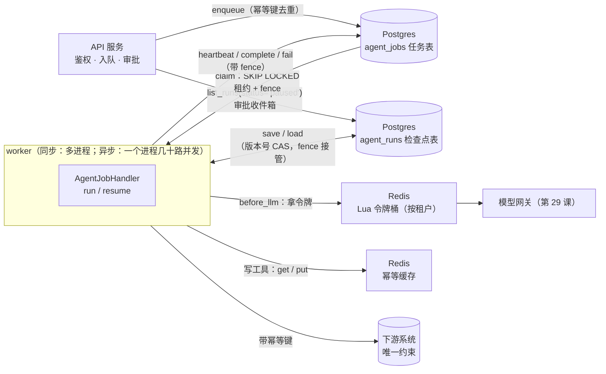
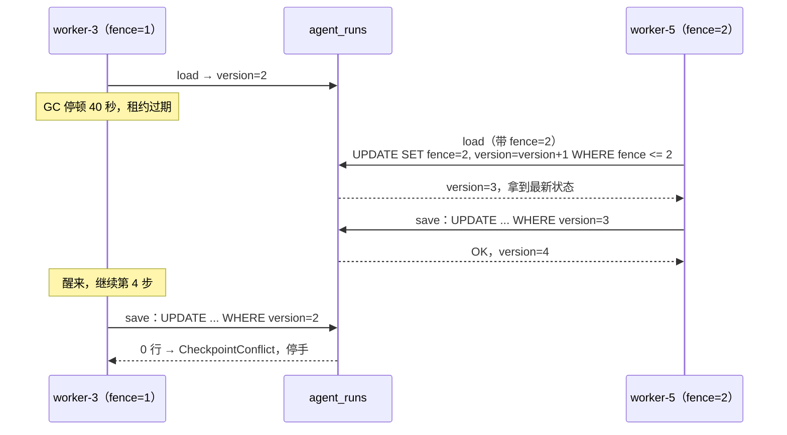
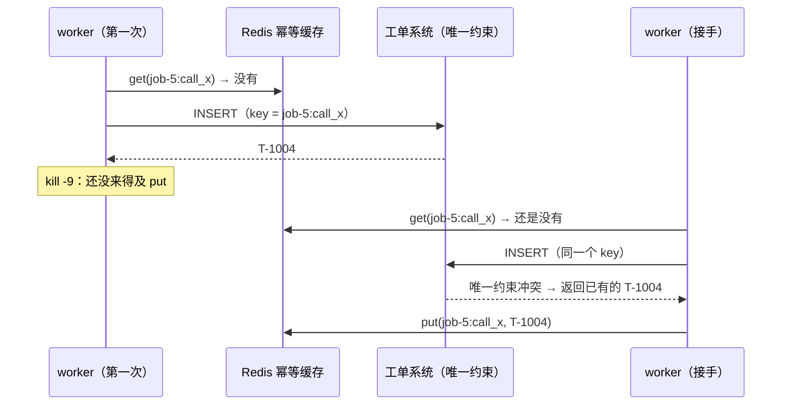
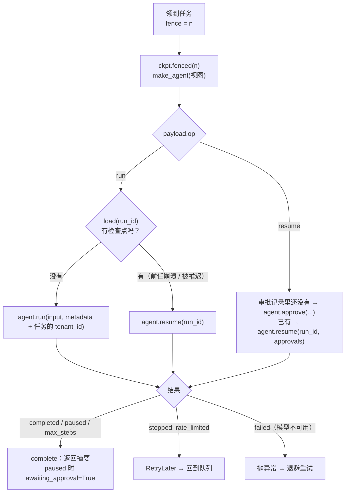

[中文](README.md) | [English](README.en.md)

# 第 26 课：状态、队列与分布式协调 —— Postgres 与 Redis

> 🕐 建议用时：30 分钟 ｜ 🎯 学完你能：把 Agent 的检查点、任务队列、幂等、限流、锁落到 Postgres 和 Redis 上，说清每一样为什么放在那里、出故障时由谁兜底；在自建、开源、托管方案之间做出有依据的选择；把同步 worker 换成单进程几十路并发的异步 worker，并配好连接池 ｜ 📦 对应源码：[`agentkit/contrib/postgres.py`](../../agentkit/contrib/postgres.py)、[`agentkit/contrib/redis_store.py`](../../agentkit/contrib/redis_store.py)、[`demo.py`](demo.py)
>
> 📖 必读：[Devious SQL: Message Queuing Using Native PostgreSQL](https://www.crunchydata.com/blog/message-queuing-using-native-postgresql)（David Christensen, 2021）—— 用十几行 SQL 从零搭出一个 `FOR UPDATE SKIP LOCKED` 队列，顺带讲了两件本课代码处处都有影子的事：事务回滚时任务自动回到队列；队列表更新频繁，会膨胀，需要调 autovacuum。读完再看 `PostgresJobQueue.claim`，每一行都能对上号。

## 0. 一句话讲清楚

**教学版 agentkit 的局限**：`FileCheckpointer` 只在一台机器上有效，而且不认 fencing，旧 worker 醒来后能覆盖新 worker 写的检查点；`IdempotencyStore` 存在进程内存里，进程一死就没了，别的 worker 也看不见；第 12 课的令牌桶只在一个进程里计数；第 13 课的租约队列用的是单机 SQLite。这些实现把原理讲清楚了，但撑不起"多台机器、几十个 worker、上百个租户"。

**这一课不发明新概念。第 13 课的租约、fencing token、CAS、幂等键全部保留，只是改由 Postgres 和 Redis 来承载，并且直接接到 agentkit 的接口上。比如 `Agent(checkpointer=PostgresCheckpointer(dsn))` 这一行改动，就能让检查点在机器之间共享，并且挡住僵尸 worker。**

打个比方：第 13 课的后厨把订单写在墙上的一张单子上（SQLite 文件）。连锁店开到几十家以后，订单改由中央订单系统管理（Postgres：记账、不能丢），前台再配一台叫号机（Redis：计数、排号、限流，停电重启后重新叫号也没关系）。

| 能力 | 教学版（出处） | 为什么不够 | 本课的生产版 |
|---|---|---|---|
| 检查点 | `FileCheckpointer`（第 08 课） | 只能单机；没有 fencing | `PostgresCheckpointer`：jsonb + 版本号 CAS + fence 接管 |
| 任务队列 | SQLite `JobQueue`（第 13 课） | 单机，同一时刻只有一个写者 | `PostgresJobQueue`：SKIP LOCKED、服务器时钟、部分索引 |
| worker | demo 里手写的循环（第 13 课） | 心跳、停机、错误分类都要自己拼 | `run_worker` / `run_async_worker` + `AgentJobHandler` |
| 幂等 | 内存 `IdempotencyStore`（第 08 课） | 进程一死就丢；别的 worker 看不见 | `RedisIdempotencyStore`（缓存）+ 下游唯一约束（兜底） |
| 限流 | `TokenBucket`（第 12 课） | 在进程内计数，N 个实例就放出 N 倍配额 | `RedisTokenBucket`（Lua 原子执行 + Redis 时钟）+ `RateLimitHook` |
| 锁 | 第 13 课的时间线（只讲了概念） | — | `RedisLock`（带 fencing token）；以及什么时候该改用 advisory lock / etcd |
| 并发模型 | 一个 worker 进程一次跑一个任务 | 等模型的时候整个进程都闲着 | 异步版：一个进程同时推进几十个任务，带背压 |

## 1. 教学实现为什么不够

### 1.1 全景：谁存什么



### 1.2 一条原则：Postgres 存真相，Redis 存丢了能重建的东西

| 数据 | 放在哪 | 丢了会怎样 | 为什么 |
|---|---|---|---|
| 检查点（对话、步数、待审批） | Postgres | 用户的会话和审批状态全部丢失 | 必须持久；要做条件写（CAS）；要按租户、状态查询 |
| 任务（队列） | Postgres（或专业队列） | 任务凭空消失 | 必须持久；领取要原子；可以和业务数据写在同一个事务里 |
| 下游副作用的幂等记录 | 下游系统自己的数据库 | 重复建单、重复扣款 | 必须和副作用在**同一个事务**里 |
| 幂等**缓存**（写工具的结果） | Redis | 重放时多调一次下游，由下游唯一约束去重 | 只是省一次调用；允许丢 |
| 限流计数 | Redis | 短时间内多放行一些请求 | 每次模型调用都要读写，要求快；丢了只影响一小段时间 |
| 短锁 | Redis（效率锁）/ Postgres、etcd（正确性锁） | 见问题 5 | 锁只能提高效率，正确性要靠 fencing |

这张表可以当成本课的目录：检查点和队列看问题 1、2，幂等看问题 3，限流看问题 4，锁看问题 5，运维看问题 6，并发模型看问题 7。

### 1.3 术语

| 术语 | 大白话 | 本课代码 |
|---|---|---|
| `FOR UPDATE SKIP LOCKED` | 锁住选中的行；别人锁着的行直接跳过，不排队等 | `PostgresJobQueue.claim` |
| 版本号 CAS | "只有它还是我看到的那个版本，我才写"：`UPDATE ... WHERE version = 我看到的` | `PostgresCheckpointer.save` |
| fence 接管 | 新持有者读检查点时顺手把版本号加一，旧持有者手里的版本号当场作废 | `PostgresCheckpointer.fenced(fence).load` |
| 回收（reap） | 租约过期的任务改回"排队中"，次数用尽的直接进死信 | `PostgresJobQueue.reap_expired` |
| Lua 脚本 | 在 Redis 服务器里原子执行的一小段程序，执行期间不会插入别的命令 | `TOKEN_BUCKET_LUA` |
| 背压（backpressure） | 满载时停止领取新任务，让任务留在队列里给别人 | `run_async_worker` 的信号量 |
| 连接池 | 一组预先建好、反复借还的数据库连接；池的大小决定同时能有多少个数据库操作 | `psycopg_pool.AsyncConnectionPool` |

## 2. 企业问题卡片

七张卡片。每张最后都有"从嵌入式换成托管服务"：本课 demo 和测试用的是嵌入式 Postgres（pip 包 pgserver 启动的真实 Postgres 16 进程，单机）和 fakeredis（Redis 协议的 Python 实现，不模拟持久化、主从切换和集群分片）。换成托管服务时，大多数情况下只需要换连接串。

### 问题 1：检查点放在哪？两个 worker 抢同一个 run 时，谁说了算？

**场景**：IT 服务台 Agent 部署了 8 个 worker Pod。一次滚动发布中，worker-3 在第 4 步调用模型时被 GC 卡住了 40 秒。它的租约过期了，worker-5 接手，从检查点恢复，接着跑完了第 5、6 步。随后 worker-3 醒来，它并不知道自己已经"失业"，继续把手里第 4 步的状态写回检查点。worker-5 写的两步就这样被覆盖了，用户看到 Agent"失忆"，而且系统没有报任何错。

**为什么难**：`FileCheckpointer` 用临时文件加 `os.replace` 保证单次写入的原子性，但不管"该不该写"。旧 worker 在写入前检查一下"我还持有租约吗"也没用：检查和写入之间还可能再停顿一次（第 13 课 6.2 节）。判断必须由**存储在写入的那一刻**完成。

| 方案 | 怎么做 | 优点 | 缺点 | 适用规模 / 运维成本 |
|---|---|---|---|---|
| A. Postgres 行 + 版本号 CAS（本课） | 一个 run 一行，状态放 `jsonb`；`UPDATE ... WHERE version = 期望值`，更新了 0 行就报冲突；`status`、`tenant_id`、`updated_at` 单独成列并建索引 | 条件写是数据库的强项；审批收件箱、按租户统计就是一条 SQL；可以和业务数据共用一个库 | 每步都整行重写 jsonb（状态大时写放大明显）；表会膨胀，要关注 VACUUM | 绝大多数团队的默认选择；托管 Postgres 的运维成本低 |
| B. Redis（JSON 字符串 + Lua / WATCH 做 CAS） | `SET run:{id}` 存状态，版本号比较放进 Lua 脚本 | 快；可以顺便设过期时间 | 持久化和复制都有丢数据的窗口（问题 6）；按状态、租户查询要自己维护二级索引 | 短命会话、丢了可以重来的场景 |
| C. DynamoDB 条件写 | 每个 item 带 version 属性，写入时用 `ConditionExpression` 比较，不相等返回 `ConditionalCheckFailedException`（[AWS 文档](https://docs.aws.amazon.com/amazondynamodb/latest/developerguide/BestPractices_OptimisticLocking.html)） | 全托管、无限扩展；原生支持 TTL | 查询模式要提前设计；TTL 删除不及时（文档写的是过期后"几天内"删除） | AWS 上的大规模系统 |
| D. 框架自带的 checkpointer | 例如 LangGraph 的 `PostgresSaver` / `AsyncPostgresSaver`（包 `langgraph-checkpoint-postgres`，首次使用要调用 `.setup()`，[文档](https://docs.langchain.com/oss/python/langgraph/add-memory)）；Redis 版 `RedisSaver` 由 Redis 公司维护（[langgraph-redis](https://github.com/redis-developer/langgraph-redis)） | 和框架的"线程 / 时间旅行 / 中断"语义配套，开箱即用 | 绑定框架的数据模型；并发写的语义要读实现才知道 | 已经在用该框架 |
| E. 持久化执行引擎（Temporal） | 不存"状态"，而是存"事件历史"，崩溃后重放 | 谁来发现崩溃、谁来恢复、审批定时器都由引擎负责 | 引入一套新基础设施；有确定性约束 | 跨小时甚至跨天的流程，见[第 27 课](../27_durable_workflows/README.md) |

**纯 CAS 还差一步：先写者赢，不等于新持有者赢。** 僵尸 worker 和新 worker 如果读到同一个版本，谁先写谁赢，输的可能恰恰是新 worker。CAS 保证了不丢更新，但可能让僵尸赢、让新 worker 白跑一趟。本课的 `fenced(fence)` 视图补上了这一步：带 fence 的 `load` 在同一条 `UPDATE ... RETURNING` 里把表里的 fence 改成自己的，并让 version 加一。从这一刻起，旧持有者的任何写入都会冲突；fence 比表里小的 `load` 直接被拒绝。



图里的 fence=1、fence=2 只表示谁先谁后。实际的 fence 取自整张队列表共用的一个序列，全局单调递增：同一个 run 后来的任务（比如审批之后入队的 resume 任务）第一次领取，拿到的 fence 也比之前所有持有者的都大。为什么必须这样，见 3.3。

**怎么选**：默认选 A，并且**让队列的 fence 驱动检查点接管**（`AgentJobHandler` 已经这样做了）。状态特别大（几百 KB 以上），或者需要"时间旅行"、分支，参考 LangGraph 把检查点拆成多张表、按版本增量写的做法。流程跨天、需要可靠定时器的，直接上第 27 课。

**本课实现**：[`PostgresCheckpointer`](../../agentkit/contrib/postgres.py)，以及异步版 `AsyncPostgresCheckpointer`（给 `agentkit.aio.AsyncAgent` 用，语义完全一致）。测试 `test_plain_cas_is_first_writer_wins_but_fenced_takeover_makes_newest_holder_win` 把"先写者赢"和"新持有者赢"并排验证了一遍。Demo 第 1 部分（真实模型模式的一次运行）里，被冻结的 worker-3 醒来后写检查点，收到了 `检查点冲突：run job-6 期望版本 2，实际版本 7（最后写入者 worker-1）`。

**从嵌入式换成托管**：`PostgresCheckpointer(os.environ["DATABASE_URL"])`，连接串换成 RDS、Cloud SQL、Aurora 或者自建集群的地址即可。建表用迁移工具在发布时做一次（问题 6）。

### 问题 2：任务队列 —— Postgres 够用吗？什么时候才需要 Kafka？

**场景**：客服 Agent 平台每天 20 万个任务，高峰每秒约 30 个，每个任务 10 秒到 3 分钟。架构评审会上有人提议"上 Kafka"，也有人说"Postgres 就够了"。

**为什么难**：选队列时，大家习惯先比吞吐，可对 Agent 来说，吞吐几乎从来不是瓶颈：每秒 30 个任务，对哪个方案都是小数目，真正的瓶颈是模型配额。更要紧的是四件事：**投递语义**（至少一次，还是可能丢）；**任务很长时怎么续租**；**入队能不能和业务数据写在同一个事务里**；**团队能不能运维**。

| 方案 | 投递语义 | 顺序 | 吞吐量级 | 长任务 / 续租 | 运维成本 | 适用 |
|---|---|---|---|---|---|---|
| A. Postgres `FOR UPDATE SKIP LOCKED`（本课） | 至少一次（租约 + fence） | 按你写的 `ORDER BY`；并发领取时不严格有序 | 每秒几百到几千个任务，取决于索引和清理 | 自己写心跳（本课已写好） | 你已经有 Postgres 了，几乎为零 | **绝大多数 Agent 平台的起点**；需要"入队和业务写入同一个事务"时 |
| B. Redis Streams + 消费组 | 至少一次：已投递未确认的消息记在 Pending Entries List 里，`XACK` 确认，`XAUTOCLAIM`（Redis 6.2 起）认领超时的消息（[文档](https://redis.io/docs/latest/develop/data-types/streams/)） | 单个 stream 内有序 | 高 | 通过 PEL 的空闲时间判断，再认领 | 需要可靠的 Redis 持久化和复制（问题 6） | 已经重度使用 Redis、能接受持久化窗口 |
| C. RabbitMQ（quorum queue） | 手动 ack 时至少一次；自动 ack 相当于发出去就不管了，官方认为不安全（[文档](https://www.rabbitmq.com/docs/confirms)） | 单队列有序，重投时可能乱序 | 高 | 靠 ack 超时；prefetch 控制在途数量 | 中：要运维集群；quorum queue 基于 Raft，4.0 起默认最多投递 20 次（delivery-limit），超过后丢弃或进死信（[文档](https://www.rabbitmq.com/docs/quorum-queues)） | 复杂路由、多个消费方 |
| D. Kafka | 默认至少一次；事务和幂等生产者只能在 Kafka 内部做到"恰好一次"的读-处理-写，写外部系统时要自己协调（[设计文档](https://kafka.apache.org/43/design/design/)） | **分区内严格有序** | 非常高 | 消费位点模型，天生不适合"一条消息处理 3 分钟"；4.2 起 share group（KIP-932，"Kafka 里的队列"）可以用于生产（[发布说明](https://kafka.apache.org/blog/2026/02/17/apache-kafka-4.2.0-release-announcement/)） | 高 | 事件流、需要回放、多个下游订阅同一份数据 |
| E. Amazon SQS | 标准队列至少一次，**可能重复投递**（[文档](https://docs.aws.amazon.com/AWSSimpleQueueService/latest/SQSDeveloperGuide/standard-queues-at-least-once-delivery.html)）；FIFO 队列支持去重 | 标准队列不保证；FIFO 按 message group 有序 | 标准队列几乎无限；FIFO 非高吞吐模式下每个 API 动作 300 TPS，批量时 3000 条/秒（[配额](https://docs.aws.amazon.com/AWSSimpleQueueService/latest/SQSDeveloperGuide/quotas-messages.html)） | 可见性超时默认 30 秒、最长 12 小时，用 `ChangeMessageVisibility` 续租 | 全托管 | AWS 上的默认选择 |

Celery、Dramatiq 这类**任务框架**不在同一个层次：它们本身不是存储，下面还要接一个 broker（Redis、RabbitMQ、SQS）。要注意 broker 的默认值。比如 Celery 用 Redis 做 broker 时，`visibility_timeout` 默认 1 小时，超过这个时间还没确认的任务会**被再投递给别的 worker，于是执行两次**（[文档](https://docs.celeryq.dev/en/stable/getting-started/backends-and-brokers/redis.html)）。跑几十分钟的 Agent 任务很容易撞上这一条。Postgres 上也有成熟的现成队列库：River（Go）、Oban（Elixir）、pg-boss 和 Graphile Worker（Node）、Procrastinate（Python），以及以扩展形式提供、采用 SQS 式可见性超时语义的 PGMQ。它们都用 SKIP LOCKED 领取，多数还用 `LISTEN/NOTIFY` 减少轮询延迟。

**什么时候不需要 Kafka**：任务量在每秒几千以下；每个任务只被一个 worker 处理，不需要多个下游各自订阅；不需要回放历史事件；任务一跑就是几分钟，需要续租。Agent 任务队列几乎全部落在这个区间里。反过来，下面这几种情况才值得上 Kafka：同一份数据要被多个系统消费（审计、分析、搜索索引）；要按 key 严格有序并且能回放；数据量已经大到 Postgres 的写入和清理成了瓶颈。

**怎么选**：先用 A。队列和业务数据在同一个库里时，"创建工单 + 入队后续 Agent 任务"可以放进一个事务，这正是 outbox 模式（第 13 课问题 6）想要的效果，而且不用多维护一个系统。在 AWS 上、不想运维，就选 E（注意 SQS 旧的 receipt handle 做不到 fencing，第 13 课 3.9 节）。需要事件流时再加 D，两者不冲突。

**本课实现**：[`PostgresJobQueue`](../../agentkit/contrib/postgres.py)，异步版是 `AsyncPostgresJobQueue`，SQL 在 3.3 节。**从嵌入式换成托管**：同样只换连接串。可以用 KEDA 的 `postgresql` scaler，按一条 SQL 的结果（比如可执行任务数）自动扩缩 worker（[文档](https://keda.sh/docs/2.21/scalers/postgresql/)，部署细节见[第 31 课](../31_deployment_and_scaling/README.md)）。

### 问题 3：幂等记录放在哪？Redis 一个 key 就够了吗？

**场景**：worker 调用"建工单"工具，工单系统已经建好了，但响应还在路上时 worker 被 `kill -9`。接手的 worker 从检查点恢复，重放同一个工具调用。系统里的 `IdempotencyStore` 是进程内存版，已经随进程一起没了。

**为什么难**：幂等要回答的是"这件事做过没有"。只要"做"和"记下做过了"不在同一个原子操作里，中间就有缝。

| 方案 | 怎么做 | 挡得住什么 | 挡不住什么 | 适用 |
|---|---|---|---|---|
| A. Redis `get` / `put`（agentkit 接口，本课 `RedisIdempotencyStore`） | 写工具成功后，以 `run_id:call_id` 为 key 缓存结果，并设置 TTL | **先后**重放：成功之后再来的重试，直接返回缓存 | 做完了、`put` 之前进程死了；两个 worker **同时**执行 | 省一次下游调用的缓存 |
| A'. Redis `claim`（SET NX 占一个"执行中"标记） | 执行**之前**原子地"占坑"，结果已经存在也返回 False | **同时**执行：僵尸和新 worker 同时跑到同一个调用时，只有一个进得去 | 标记过期之后，副作用做了、`put` 没做的那一次仍然会被重做 | 下游又慢又贵，并发重复代价很高 |
| B. Postgres 唯一约束（和副作用同一个事务） | `INSERT ... ON CONFLICT (idempotency_key) DO NOTHING`：执行副作用和记下 key 是同一条语句 | **全部**：中间没有缝 | —（前提是副作用就在这个库里） | 副作用落在你自己的数据库时 |
| C. 下游的 Idempotency-Key | 把 key 传给下游 API，由下游保证。Stripe 会保存第一次请求的结果（**包括 500 错误**），key 至少保留 24 小时，参数不同会报错（[文档](https://docs.stripe.com/api/idempotent_requests)）；IETF 的 `Idempotency-Key` 头部草案已过期，没有成为 RFC（[datatracker](https://datatracker.ietf.org/doc/draft-ietf-httpapi-idempotency-key-header/)） | 全部（由下游负责） | 下游不支持时无能为力 | 调用第三方 API |



**为什么幂等最终必须下沉到下游**：A 和 A' 都是"在副作用**旁边**记账"，只要副作用和记账不在同一个事务里，崩溃总能落进它们之间的缝。唯一能消除这道缝的，是让执行副作用的那个系统在同一个事务里检查 key，也就是 B 和 C。第 08 课定义了幂等键 `run_id:call_id`，第 13 课的 `TicketSystem` 用唯一索引兜底，本课 demo 用 Postgres 表的唯一约束做了同样的事。

**怎么选**：B 或 C 是底线，必须有；A 是可选的优化，可以少打一次下游；A' 只在"并发重复的代价很高、并且下游不支持幂等"时才用，而且要清楚它挡不住所有情况。

**本课实现**：`RedisIdempotencyStore(client, namespace="idem", ttl_seconds=86400)` 直接传给 `Agent(idempotency_store=...)`，异步版是 `AsyncRedisIdempotencyStore`。Demo 第 1 部分里，被 `kill -9` 的那次调用没来得及写 Redis，接手的 worker 查 Redis 没有命中，最后是下游唯一约束拦住了重复：`♻️ 下游唯一约束命中：返回已有工单 T-1004`。

**从嵌入式换成托管**：`RedisIdempotencyStore(os.environ["REDIS_URL"])`（ElastiCache、Memorystore 或自建 Redis / Valkey）。key 用 hash tag 包裹，`idem:{run_id:call_id}`，Redis Cluster 下结果和"执行中"标记会落在同一个 slot。

### 问题 4：多实例下为什么单机限流会失效？

**场景**：模型网关给 IT 服务台分配了每秒 20 次调用的配额。服务部署了 10 个 Pod，每个 Pod 里都有第 12 课的令牌桶，每个桶每秒 20 次。结果实际打出去每秒 200 次，前几秒就把配额用光了，之后全是 429。HPA 看到延迟升高，又加了 5 个 Pod，情况更糟。

**为什么难**：配额是**全局**的，计数器却是**每个进程各一份**。按 Pod 数平分（每个 2 次/秒）又会遇到新问题：Pod 数一变就要重算；负载不均时，有的桶闲着，有的桶不够用。

| 方案 | 怎么做 | 优点 | 缺点 | 适用 |
|---|---|---|---|---|
| A. 单机令牌桶（第 12 课） | 每个进程一个桶，额度 = 总额度 / 进程数 | 零依赖、零延迟 | 进程数一变就失准；只能近似控制总量 | 进程数固定，或者作为全局限流前的粗筛 |
| B. Redis Lua 令牌桶（本课） | 所有 worker 调用前到 Redis 拿令牌；读、补充、判断、写回全部放在一个 Lua 脚本里原子执行 | 精确控制总量；与进程数无关；可以按租户、按套餐 | 每次调用多一次 Redis 往返；Redis 故障时要决定"放行还是拒绝" | 多实例共享同一个硬配额 —— 大多数场景 |
| C. 网关层限流 | Envoy 的全局限流服务（参考实现 envoyproxy/ratelimit 用 Go 写，后端是 Redis，[文档](https://www.envoyproxy.io/docs/envoy/latest/intro/arch_overview/other_features/global_rate_limiting)），或者 LiteLLM 这类模型网关的按 key 预算（[第 29 课](../29_gateway_and_guardrails/README.md)） | 应用代码不用管；所有调用方统一执行 | 粒度通常在"请求"层面，拿不到 Agent 的租户上下文；Envoy 的 `failure_mode_deny` 默认 false，限流服务故障时会放行 | 多个团队、多个应用共用一个模型出口 |
| D. 模型厂商的配额 | 厂商按组织 / 项目限 RPM、TPM 等，响应头里带 `x-ratelimit-remaining-requests`、`x-ratelimit-remaining-tokens`（[OpenAI 文档](https://developers.openai.com/api/docs/guides/rate-limits)） | 最终的硬上限，你绕不过去 | 用 429 通知你时已经晚了；只能退避重试 | 永远存在：它是最后一道墙，不是你的限流方案 |

**为什么必须用 Lua？** 令牌桶的一次判断是"读剩余令牌 → 按流逝时间补充 → 判断够不够 → 写回"。放在客户端做，两个 worker 可能同时读到"还剩 1 个"，于是都放行，这和第 13 课的"丢失更新"是同一个问题。Redis 保证脚本原子执行，执行期间服务器上的其他操作全部阻塞（[文档](https://redis.io/docs/latest/develop/programmability/eval-intro/)）。所以脚本要短，不能在里面做耗时计算。

**为什么时钟取 Redis 的 `TIME`？** 补充的令牌数 = 流逝时间 × 速率。如果用各个 worker 本机的时间，时钟快的机器会凭空补出令牌，时钟慢的机器会把时间戳往回拨。以 Redis 服务器为唯一时钟，这个问题就没有了。在脚本里调用 `TIME` 这类非确定性命令是安全的：Redis 5.0 起脚本默认按"效果"复制，7.0 起只剩这一种复制方式（[文档](https://redis.io/docs/latest/develop/programmability/eval-intro/)）。对比一下，Redis 官方的限流教程选择由应用把当前时间传进脚本（[教程](https://redis.io/tutorials/howtos/ratelimiting/)），好处是好测试，代价是要相信各台机器的时钟。

还有两个 Lua 的坑，都实测过：① **Lua 的小数返回给 Redis 时会被截断成整数**，1.5 会变成 1，文档建议把小数当字符串返回（[Lua API](https://redis.io/docs/latest/develop/programmability/lua-api/)）；② Redis Cluster 下，脚本访问的 key 必须全部通过 `KEYS` 传入，并且落在同一个 slot 里（[文档](https://redis.io/docs/latest/develop/using-commands/multi-key-operations/)）。本课的桶一次只访问一个 key。

**等不到令牌时怎么办？** `RateLimitHook` 最多等 `wait_timeout` 秒，还拿不到就 `StopRun("rate_limited")`。worker 在这里干等，会占着一个 worker 槽位，别的租户明明有配额也只能排在后面（队头阻塞）。`AgentJobHandler` 会把 `rate_limited` 变成 `RetryLater`：任务回到队列、过一会儿再来，并且**不消耗重试次数**，这不是任务本身的错。Demo 里免费套餐租户（每秒 1 次）的任务被推迟了 16 次，它的全部任务用时 19.6 秒；另外两个标准套餐租户一次都没被推迟，约 10.7 秒就全部完成了。

**怎么选**：B 管住自己的总量（按租户、按套餐），C 管住公司的总出口，D 当作最后一道墙：收到 429 时按 `Retry-After` 退避（第 08 课）。Redis 挂了怎么办要**提前决定**：交互流量通常选择放行（fail open）并告警，批量任务选择暂停。

**本课实现**：[`RedisTokenBucket`](../../agentkit/contrib/redis_store.py)（`try_acquire` / `acquire`，`overrides` 按租户覆盖速率和容量）和 `RateLimitHook`（`before_llm` 里拿令牌；`tokens_fn` 可以按 token 数计费，实现 TPM 限流）。异步版是 `AsyncRedisTokenBucket` 和 `AsyncRateLimitHook`：等令牌时用 `asyncio.sleep` 让出事件循环。**从嵌入式换成托管**：换 `REDIS_URL`。

### 问题 5：分布式锁 —— Redis、Postgres advisory lock、etcd、ZooKeeper，怎么选？

**场景**：每天凌晨要为每个租户生成一份"Agent 周报"，由 8 个 worker 中的一个来生成。有人用 Redis 的 `SET NX PX` 加了一把锁。某天 Redis 主节点挂了，从节点被提升为主节点，而刚写下的那把锁还没来得及复制过去。结果两个 worker 同时拿到了锁，给客户发了两份周报。

**为什么难**：锁有两种用途（Kleppmann 的区分，第 13 课必读）：**为了效率**（避免重复劳动，偶尔重复一次也无所谓）和**为了正确性**（重复一次就出事故）。前者用单节点 Redis 就够了；后者必须由被保护的资源校验 fencing token，而且 token 本身要来自一个不会"倒退"的系统。

| 方案 | 怎么做 | 优点 | 缺点 | 适用 |
|---|---|---|---|---|
| A. Redis `SET NX PX` + INCR fencing token（本课 `RedisLock`） | 加锁和 `INCR` 计数器放在同一个 Lua 脚本里；释放时用 Lua "比较后删除"（[Redis 文档](https://redis.io/docs/latest/develop/clients/patterns/distributed-locks/)，Redis 8.4 起还可以用 `DELEX key IFEQ value`） | 快、简单；有 token 可以做 fencing | 复制是异步的，主从切换可能丢掉锁，**也可能丢掉最近的 INCR**，于是 token 被重复发放；Redis 的过期时间用的不是单调时钟 | 效率锁；或者正确性不依赖 token 绝对可靠的场景 |
| A'. Redlock（5 个独立 Redis 主节点，拿到多数才算成功） | 见 Redis 文档 | 不依赖单个节点 | Kleppmann 的批评：依赖"网络延迟、进程暂停、时钟误差都远小于 TTL"这一时序假设，而且不产生 fencing token（[原文](https://martin.kleppmann.com/2016/02/08/how-to-do-distributed-locking.html)）；antirez 的反驳见[这里](https://antirez.com/news/101) | 本课不推荐 |
| B. Postgres advisory lock | `pg_advisory_xact_lock(key)`：事务级，事务结束时自动释放；会话级锁持有到会话结束，而且**不遵守事务语义**，回滚了锁还在（[文档](https://www.postgresql.org/docs/current/explicit-locking.html#ADVISORY-LOCKS)） | 被保护的写入和锁在**同一个事务**里：持有者一死，事务回滚，写入也一起作废，天然安全；不需要新组件 | 会话级锁和 PgBouncer 的事务池模式不兼容；锁没有过期时间，持有者卡住时，别人要等到连接超时 | **被保护的资源就在这个 Postgres 里** —— 最常见 |
| C. etcd | lease + 带 revision 条件的事务；etcd 文档明确把 Kleppmann 说的 fencing token 对应为 etcd 的 revision（[文档](https://etcd.io/docs/v3.5/learning/why/)） | 基于 Raft，线性一致；revision 单调递增、不会倒退 | 要运维一个 etcd 集群（K8s 本身带一个，但不建议业务共用） | 跨系统协调、选主，正确性要求高 |
| D. ZooKeeper | 临时顺序节点 recipe：只 watch 前一个节点，避免羊群效应（[recipe](https://zookeeper.apache.org/doc/current/recipes.html)）；zxid 或 znode version 可以作为 fencing token | 成熟 | 运维成本最高 | 已经有 ZooKeeper 的大数据体系 |

**尽量设计成不需要锁**。上面的场景其实可以不用锁：让"生成周报"成为一个**任务**，幂等键是 `weekly-report:{tenant}:{week}`，入队去重；队列的租约和 fence 保证同一时刻只有一个 worker 在做；发邮件时带上同一个幂等键，由下游去重。本课的大部分"协调"都是这样用 **队列 + CAS + 幂等** 解决的，没有一把锁。只有当多个 worker 必须**同时**改同一份共享状态、而这份状态又无法分区时，才轮得到锁。

```python
# 锁 + fencing 的正确用法：token 由存储校验，而不是由持有者自己判断"我还持有锁吗"
with RedisLock(r, "weekly-report:acme", ttl_seconds=30) as fence:
    report = build_report()                                   # 这里可能停顿很久
    cur = pg.execute("UPDATE reports SET body = %s, fence = %s WHERE tenant = 'acme' AND fence < %s",
                     (report, fence, fence))
    if cur.rowcount == 0:
        raise RuntimeError("我已经不是持有者了：写入被拒绝")      # 存储在写入的那一刻做判断
```

**怎么选**：资源就在 Postgres 里，用 B。需要跨系统、并且对正确性要求高的，用 C。只是为了效率，用 A；但正确性一定要靠存储端校验 fence，**不要用不带 fencing 的锁保证正确性**，也**不要让 Redis INCR 的 token 成为唯一防线**。

**本课实现**：`RedisLock(client, name, ttl_seconds)`：`acquire()` 返回 fencing token，`release()` 和 `extend()` 都是"比较后再操作"。测试 `test_storage_rejects_a_paused_holders_stale_token` 复现了第 13 课的时间线。本课的 `setup()` 用 `pg_advisory_xact_lock` 让多个进程串行建表，这是 B 的一个小例子（为什么需要它，见第 6 节）。**从嵌入式换成托管**：A 换 `REDIS_URL`；B 不用换，就在你的 Postgres 里；C、D 需要单独部署（或使用云厂商的托管版）。

### 问题 6：运维 —— 连接池、迁移、备份与高可用、表膨胀、监控

**场景**：上线第一周，四件事接连发生：① 扩容到 40 个 Pod 后，Postgres 报 `too many connections`；② 两个版本的 worker 同时启动，都去建表，其中一个启动失败；③ 一个月后，队列表占了 30 GB，而里面只有 2000 行数据；④ 客户投诉"提交了一直没反应"，而 CPU 和内存监控全是绿的。

**为什么难**：这些问题单独看都不难，但它们只在**规模和时间**上出现，本地测试一个都遇不到。

**① 连接池：进程数 × 每进程连接数 ≤ 数据库上限**

| 方案 | 做法 | 注意 |
|---|---|---|
| 应用内连接池（`psycopg_pool`） | `ConnectionPool` / `AsyncConnectionPool`；`with pool.connection()` 正常退出时提交、异常时回滚，然后归还（[文档](https://www.psycopg.org/psycopg3/docs/advanced/pool.html)） | 池的大小按"同时需要连接的线程 / 协程数"来定（问题 7）；**不要在持有一个连接的同时，再向同一个池借连接**：实测池大小为 2、两个协程都这么做，结果都在 `PoolTimeout` 超时后失败 |
| 外部连接池（PgBouncer） | 事务池模式：只在事务期间占用一个服务端连接，几千个客户端连接可以复用几十个服务端连接（[文档](https://www.pgbouncer.org/features.html)） | 事务池模式下，`SET`、`LISTEN`、会话级 advisory lock 等**不能用**。协议级 prepared statement 从 1.21 开始支持，1.24 起默认开启（`max_prepared_statements=200`）。psycopg 默认执行 5 次后自动 prepare（`prepare_threshold=5`），中间件不支持时要设成 `None`（[psycopg 文档](https://www.psycopg.org/psycopg3/docs/advanced/prepare.html#using-prepared-statements-with-pgbouncer)）。本课的适配器可以通过 `connect_kwargs={"prepare_threshold": None}` 传进去 |
| 托管代理（RDS Proxy 等） | 同上，由云厂商运维 | 同样要关注 prepared statement 和会话状态 |

**② 迁移：用 Alembic（SQLAlchemy 生态，[文档](https://alembic.sqlalchemy.org/)）或 Flyway（版本化的纯 SQL 脚本，[文档](https://documentation.red-gate.com/fd)），在发布流水线里执行一次**，不要让每个 worker 启动时都去建表。本课的 `setup()` 是为了教学和测试方便才写的，并且用 advisory lock 防止并发建表撞车：实测 8 个连接同时执行 `CREATE TABLE IF NOT EXISTS`，7 个报 `UniqueViolation`。

**③ 备份与高可用**

| 组件 | 选项 | 要知道的数字 |
|---|---|---|
| Postgres | RDS Multi-AZ 实例 / Multi-AZ 集群 / Aurora / 自建（Patroni 等） | RDS Multi-AZ 实例切换通常 60–120 秒（[文档](https://docs.aws.amazon.com/AmazonRDS/latest/UserGuide/Concepts.MultiAZ.Failover.html)）；Multi-AZ 集群通常 35 秒以内（[文档](https://docs.aws.amazon.com/AmazonRDS/latest/UserGuide/multi-az-db-clusters-concepts-failover.html)）；Aurora 有副本时通常 60 秒以内（[文档](https://docs.aws.amazon.com/AmazonRDS/latest/AuroraUserGuide/Concepts.AuroraHighAvailability.html)）。worker 要能扛住这段时间：`run_worker` 在 claim 失败时退避重试，而不是直接崩溃 |
| Redis | RDB 快照 / AOF / 复制 + 哨兵或集群 / MemoryDB | RDB 通常几分钟做一次快照，崩溃可能丢几分钟的数据；AOF（要用 `appendonly yes` 开启）默认 `appendfsync everysec`，可能丢约 1 秒（[文档](https://redis.io/docs/latest/operate/oss_and_stack/management/persistence/)）；复制是异步的，`WAIT` 也不能让 Redis 变成强一致（[文档](https://redis.io/docs/latest/commands/wait/)），主从切换可能丢掉已确认的写入。需要持久的 Redis 语义，可以考虑 MemoryDB：写入先落到多可用区事务日志，再返回（[文档](https://docs.aws.amazon.com/memorydb/latest/devguide/what-is-memorydb.html)） |

这张表也解释了 1.2 节那条原则：Redis 在切换时可能丢掉最近约 1 秒的写入，所以**只能放丢了能重建的东西**。

**④ 表膨胀与 VACUUM**：Postgres 的 `UPDATE` 不会原地修改一行，而是写一个新版本，旧版本等 VACUUM 回收（[文档](https://www.postgresql.org/docs/current/routine-vacuuming.html)）。队列表每个任务至少要更新 3 次（领取、若干次心跳、完成），是典型的"高频更新表"。几条实践：

- 默认的 autovacuum 触发阈值是 50 行 + 20% 的表行数。对一张小而热的队列表来说，这个比例太"懒"，可以对这张表单独调低 `autovacuum_vacuum_scale_factor`（[参数文档](https://www.postgresql.org/docs/current/runtime-config-vacuum.html)）；
- HOT 更新（不改被索引的列、页内有空位）不需要改索引。心跳只改 `lease_until` 和 `updated_at`，但 `lease_until` 在部分索引里，所以心跳做不成 HOT。为了少一个索引而放弃"快速回收"是否值得，要按实际负载来权衡（[HOT 文档](https://www.postgresql.org/docs/current/storage-hot.html)）；
- 已完成的任务定期删除或归档：`purge_finished(older_than_seconds=7*86400)`。幂等键跟着行一起删除，所以**去重窗口 = 保留时长**，要按业务来定；
- 检查点表每一步都整行重写 jsonb，状态大时写放大明显。控制状态大小（第 04 课的上下文压缩），完成的 run 归档到冷存储。

**⑤ 监控**：CPU 是绿的不等于用户没在等。比"队列里有多少个"更能说明问题的是**最老的可执行任务已经等了多久**：`stats()["oldest_queued_age_s"]`。另外几个值得告警的指标：`expired_leases`（过期了还没被回收的租约，说明 worker 死了或者全都卡住了）、`dead` 的增量、fence 拒绝次数（`on_event("fence_rejected")`）、检查点冲突次数。第 28 课会把 `run_worker` 的 `on_event` 接到 Prometheus。

**从嵌入式换成托管**：连接串指向 PgBouncer / RDS Proxy 时，加上 `connect_kwargs={"prepare_threshold": None}`（除非确认中间件支持 prepared statement）；迁移交给发布流水线；Redis 选带复制和自动切换的托管版，并且接受"切换时可能丢约 1 秒"这个前提。

### 问题 7：同步 worker vs 异步 worker —— 一个进程到底能同时跑几个 Agent？

**场景**：客服 Agent 高峰期同时有 300 个会话在跑，每个会话 90% 的时间都在等模型。第 13 课的同步 worker 一个进程一次只能跑一个任务，于是团队开了 60 个 Pod，每个 Pod 5 个进程。账单上是 300 个 Python 进程的内存，外加 900 个 Postgres 连接，而 CPU 利用率只有 3%。

**为什么难**：Agent 是典型的 **IO 密集型**负载：一次模型调用 3–10 秒，这段时间里 CPU 什么都不做。解决办法是"等待的时候去干别的"，但具体怎么"去干别的"，有三种做法，各有各的坑。

| 方案 | 怎么做 | 优点 | 缺点 | 适用 |
|---|---|---|---|---|
| A. 每个任务一个线程 | 进程内开 N 个线程，每个线程跑一个同步 Agent | 代码不用改（agentkit 同步版） | 线程栈占内存；GIL 下 CPU 部分串行；每个线程通常要自己的数据库连接；**取消做不到**（线程杀不掉） | 并发几十以内 |
| B. 多进程（第 13 课、本课 `run_worker`） | 每个进程一次跑一个任务，靠加进程提速 | 隔离最好：一个进程崩了不影响别人；CPU 密集的工具也能并行 | 内存和连接数都随进程数线性增长；等模型时整个进程闲着 | CPU 密集的工具多；或作为异步 worker 外面的一层（每个核一个异步进程） |
| C. asyncio（本课 `run_async_worker` + `AsyncAgent`） | 一个进程一个事件循环，同时推进几十上百个任务；等待模型、数据库、Redis 时让出控制权 | 几乎没有额外内存开销；连接池可以远小于并发数；取消可以一路传到 HTTP 请求（[第 30 课](../30_async_runtime/README.md)） | **任何一个同步阻塞调用都会卡住整个进程**；整条链路（模型客户端、数据库驱动、Redis 客户端、工具）都要是 async 的，或者被放进线程池 | IO 密集的 Agent —— 生产服务的默认选择 |

**背压**：`run_async_worker(queue, handler, concurrency=16)` 在领取之前，先拿一个 `asyncio.Semaphore` 的名额。满载时停在那里，**不再 claim**，任务留在队列里，别的 worker 可以领走。如果不这样做，一个进程会一口气领走几百个任务，自己又处理不过来，租约一个接一个过期，这些任务被别人重复执行。

**连接池怎么和并发度匹配**：关键不是"同时有多少个任务"，而是"同时有多少个任务**正在用**数据库连接"。Agent 的一步里，连接只在写检查点的那几毫秒被借用，调模型的几秒钟里不占连接。所以 16 路并发、连接池 4 个连接也跑得动（见下面的实测）。但如果在等模型时一直占着连接（比如在事务里调模型、先 `pool.connection()` 再调 Agent），并发就被卡成了连接数。估算公式：`池大小 ≈ 并发度 × 每个任务持有连接的时间占比 + 余量（心跳、领取）`；所有进程加起来，不能超过数据库的 `max_connections`（再往上就需要 PgBouncer）。

**为什么在 async 代码里调用同步阻塞 IO 会拖垮整个事件循环**：事件循环是单线程的，协程只能在 `await` 的时候让出控制权。在协程里调用 `time.sleep(0.05)`、`requests.get`、同步的 psycopg 或 redis-py，这 50 毫秒里其他所有协程都动不了，包括**所有任务的续租心跳**。心跳一停，租约就会过期，任务被别的 worker 接手。测试 `test_blocking_call_inside_an_async_handler_stalls_every_other_task` 数了"同时处在 sleep 里的任务数"：阻塞版永远是 1，交给线程池的同步版至少是 2。`run_async_worker` 发现 handler 是同步函数时，会自动用 `asyncio.to_thread` 执行它。同理，`RateLimitHook`（同步版）在异步 Agent 里等令牌会卡住整个进程，要用 `AsyncRateLimitHook`。

**怎么选**：Agent worker 默认用 C。每个 CPU 核跑一个异步进程（B 套 C），`concurrency` 从 16–64 开始，按模型配额和内存来调。连接池先按"并发度的 1/4"起步，然后看 `psycopg_pool` 的 `get_stats()` 里 `requests_queued`（因为池满而排队的请求数）是否持续增长。运行时的细节（取消、超时、舱壁、流式）见[第 30 课](../30_async_runtime/README.md)。

**本课实现**：`AsyncPostgresCheckpointer`、`AsyncPostgresJobQueue`（两者可以共用一个 `AsyncConnectionPool`）、`run_async_worker`、`AsyncRedisIdempotencyStore`、`AsyncRedisTokenBucket`、`AsyncRateLimitHook`；`AgentJobHandler` 发现 checkpointer 是异步版时，会 `await agent.run / resume / approve`，并且整个进程只用**一个** `AsyncAgent`（也就只有一个工具线程池），每个任务带 fence 的检查点视图通过 `checkpointer=` 参数按次传入。Demo 第 3 部分给出了实测数字，第 4 部分演示了异步 worker 的优雅停机（第 4 节）。

## 3. 本课适配器怎么接

### 3.1 公开 API 一览

| 模块 | 类 / 函数 | 主要方法 |
|---|---|---|
| `agentkit.contrib.postgres` | `PostgresCheckpointer(conninfo, table="agent_runs", *, fence=None, writer=None, connect_kwargs=None)` | `setup()`、`save(state)`、`load(run_id)`、`fenced(fence, writer=None)`、`get_run(run_id)`、`list_runs(status=None, tenant_id=None, limit=50)`、`version_of(run_id)`、`close()` |
| | `AsyncPostgresCheckpointer(pool_or_dsn, table="agent_runs", *, fence=None, writer=None, pool_kwargs=None)` | 同上，全部 `async`；支持 `async with` |
| | `PostgresJobQueue(conninfo, table="agent_jobs", *, max_attempts=5, base_backoff=1.0, max_backoff=300.0, connect_kwargs=None)` | `setup()`、`enqueue(kind, payload, *, tenant_id, idempotency_key=None, priority=0, run_at=None, delay_seconds=0, max_attempts=None) -> int`、`claim(worker_id, lease_seconds=30, kinds=None) -> Job \| None`、`heartbeat(job, lease_seconds)`、`complete(job, result)`、`fail(job, error, retryable=True) -> str`、`release(job, *, delay_seconds=0, reason=None, count_attempt=False)`、`reap_expired()`、`redrive(job_id)`、`stats()`、`purge_finished(older_than_seconds)`、`get(job_id)`、`find(tenant_id, key)` |
| | `AsyncPostgresJobQueue(pool_or_dsn, ...)` | 同上，全部 `async` |
| | `run_worker(queue, handler, *, worker_id, stop_event, lease_seconds=30, poll_interval=0.5, heartbeat_interval=None, kinds=None, on_event=None, max_jobs=None) -> dict` | 同步 worker 主循环 |
| | `run_async_worker(queue, handler, *, worker_id, stop_event, concurrency=16, lease_seconds=30, poll_interval=0.5, heartbeat_interval=None, grace_period=25.0, kinds=None, on_event=None, max_jobs=None) -> dict` | 异步 worker 主循环 |
| | `AgentJobHandler(make_agent 或 AsyncAgent 实例, checkpointer, *, defer_stop_reasons=("rate_limited",), defer_seconds=2.0)` | `handler(job) -> dict`（异步 checkpointer 时返回协程，`is_async=True`）；`agents_created`：工厂被调用的次数 |
| | `stop_on_signals(stop_event, signals=(SIGTERM, SIGINT))`；异常 `CheckpointConflict`、`LeaseLost`、`RetryLater`、`PermanentJobError`；数据类 `Job` | |
| `agentkit.contrib.redis_store` | `RedisIdempotencyStore(client_or_url, namespace="idem", ttl_seconds=86400)` / `AsyncRedisIdempotencyStore` | `get(key)`、`put(key, result)`、`claim(key, ttl_seconds=60) -> bool`、`release(key)`、`in_flight(key)` |
| | `RedisTokenBucket(client, rate_per_sec, capacity, prefix="tb", *, overrides=None)` / `AsyncRedisTokenBucket` | `take(key, tokens=1) -> (ok, wait_s, left)`、`try_acquire(key, tokens=1)`、`acquire(key, tokens=1, timeout=None)`、`limits(key)` |
| | `RateLimitHook(bucket, key_fn=租户, tokens_fn=lambda s, m: 1, wait_timeout=5.0)` / `AsyncRateLimitHook` | agentkit Hook：`before_llm` |
| | `RedisLock(client, name, ttl_seconds, *, prefix="lock")` | `acquire(blocking=True, timeout=None) -> fence \| None`、`release()`、`extend(ttl_seconds=None)`、`owned()`；支持 `with lock as fence:` |

五行接上一个多 worker 的 Agent 服务：

```python
from agentkit import Agent, PermissionPolicy, default_llm
from agentkit.contrib.postgres import AgentJobHandler, PostgresCheckpointer, PostgresJobQueue, run_worker, stop_on_signals
from agentkit.contrib.redis_store import RateLimitHook, RedisIdempotencyStore, RedisTokenBucket

queue, ckpt = PostgresJobQueue(DSN), PostgresCheckpointer(DSN)
limiter = RateLimitHook(RedisTokenBucket(REDIS_URL, rate_per_sec=5, capacity=10), wait_timeout=2)

def make_agent(checkpointer):                       # 必须用传进来的 checkpointer：它带着这次领取的 fence
    return Agent(default_llm(), TOOLS, checkpointer=checkpointer, hooks=[PermissionPolicy(), limiter],
                 idempotency_store=RedisIdempotencyStore(REDIS_URL))

stop = threading.Event(); stop_on_signals(stop)     # SIGTERM → 做完手头的任务再退出
run_worker(queue, AgentJobHandler(make_agent, ckpt), worker_id=os.environ["HOSTNAME"], stop_event=stop)
```

异步版：一个进程一个 `AsyncAgent`，所有任务共用；每个任务带 fence 的视图由 handler 通过 `checkpointer=` 传进去。

```python
from agentkit.aio import AsyncAgent, default_async_llm
from agentkit.contrib.postgres import AsyncPostgresCheckpointer, AsyncPostgresJobQueue, run_async_worker

pool = AsyncConnectionPool(DSN, max_size=8, kwargs={"autocommit": True})   # 队列和检查点共用一个池（问题 7）
aqueue, ackpt = AsyncPostgresJobQueue(pool), AsyncPostgresCheckpointer(pool)
agent = AsyncAgent(default_async_llm(max_connections=20), TOOLS, checkpointer=ackpt, hooks=[PermissionPolicy()])
stop = asyncio.Event(); stop_on_signals(stop)       # 在事件循环里调用
await run_async_worker(aqueue, AgentJobHandler(agent, ackpt), worker_id=os.environ["HOSTNAME"],
                       stop_event=stop, concurrency=32, grace_period=25)
```

API 服务这一侧：`queue.enqueue("agent", {"op": "run", "input": text, "metadata": {...}}, tenant_id=..., idempotency_key=request_id)`；审批收件箱是 `ckpt.list_runs(status="paused", tenant_id=...)`；审批通过后入队 `{"op": "resume", "run_id", "approvals": {call_id: True}, "by": 审批人}`，幂等键用 `approve:{run_id}:{call_id}`，审批人连点两次也只会入队一次。

### 3.2 检查点：CAS 和 fence 接管各是一条 SQL

```sql
-- save（CAS）：只有版本号还是"我上次看到的"才写得进去
UPDATE agent_runs SET state = $state, status = $status, tenant_id = $tenant, writer = $me,
                      version = version + 1, updated_at = now()
 WHERE run_id = $run_id AND version = $expected
RETURNING version;                 -- 0 行 → CheckpointConflict

-- load（带 fence 时）：接管。fence 不比表里小才允许；version + 1 让旧持有者手里的版本号当场作废
UPDATE agent_runs SET fence = $my_fence, version = version + 1, writer = $me, updated_at = now()
 WHERE run_id = $run_id AND fence <= $my_fence
RETURNING version, state;          -- 0 行但行存在 → 你是被取代的旧持有者 → CheckpointConflict
```

几个设计决策：

1. **新 run 用 `INSERT ... ON CONFLICT DO NOTHING`**，插入了 0 行同样算冲突。如果 run_id 已经有检查点，别人就是在你之前创建了它；这时应该 `resume`，而不是 `run`（`AgentJobHandler` 会先 `load` 判断）。
2. **冲突时抛异常，不返回 False。** `Agent` 在每一步都会保存，异常会一路穿出 `agent.run`，worker 把它归类为"所有权已经转移"，什么都不提交。返回值很容易被忽略，而这个信号的意思是"立刻停手"。
3. **NUL 字符。** Postgres 的 `jsonb` 不能存 `\u0000`（[文档](https://www.postgresql.org/docs/current/datatype-json.html)），一个工具返回了二进制内容，就会让整个检查点写入失败。适配器会把 NUL 替换成 U+FFFD：能存进去比逐字节保真更重要。
4. **`get_run` / `list_runs` 是只读的**：不接管、不记版本号，给 API 和运维用。
5. **版本号只为还在跑的 run 记着。** 实例在内存里记着每个 run 的版本号（`version_of`），给下一次 CAS 用。一旦保存的状态不是 running（完成、暂停、取消……），这个 run 的版本号就被丢掉：恢复和审批都会先 `load`，重新记住最新版本。第一版只记不删，一个共享的检查点实例要服务成千上万个运行，这个字典只增不减，就是内存泄漏（第 31 课压测中发现，已修复；回归测试 `test_shared_checkpointer_forgets_versions_of_finished_runs`）。

### 3.3 队列：回收 + 领取

```sql
-- 回收（claim 前先做一次）：租约过期 → 还有次数就退避后重新排队，次数用尽就进死信
UPDATE agent_jobs SET status = CASE WHEN attempts >= max_attempts THEN 'dead' ELSE 'queued' END,
       lease_until = NULL, run_at = now() + 退避, last_error = 'lease expired: worker ... 没有按时续约'
 WHERE id IN (SELECT id FROM agent_jobs WHERE status = 'leased' AND lease_until < now()
              ORDER BY lease_until LIMIT 100 FOR UPDATE SKIP LOCKED);

-- 建表时（setup()）：整张队列表共用一个 fence 序列
CREATE SEQUENCE IF NOT EXISTS agent_jobs_fence_seq;

-- 领取：fence 取序列的下一个值，全局单调递增
UPDATE agent_jobs SET status = 'leased', worker_id = $me, lease_until = now() + $lease,
                      attempts = attempts + 1, fence = nextval('agent_jobs_fence_seq'::regclass)
 WHERE id = (SELECT id FROM agent_jobs
              WHERE status = 'queued' AND run_at <= now()
              ORDER BY priority DESC, id LIMIT 1
              FOR UPDATE SKIP LOCKED)
RETURNING *;
```

- **SKIP LOCKED**：PostgreSQL 文档明确说，跳过被锁住的行会得到一个不一致的数据视图，不适合一般用途，但适合"多个消费者访问一张类似队列的表"来避免锁争用（[文档](https://www.postgresql.org/docs/current/sql-select.html#SQL-FOR-UPDATE-SHARE)）。练习 (b) 的测试会拿着一行的锁不放：少了 `SKIP LOCKED`，你的实现就会排队等锁。
- **为什么先回收成 `queued`，而不是让 claim 直接领取过期的行？** claim 只扫描 `status = 'queued'` 这一个部分索引 `(priority DESC, id) WHERE status = 'queued'`，积压再大也是一次索引扫描。代价是：一旦被回收，旧持有者的迟到提交就会被拒绝（它的所有权在回收那一刻就结束了）。在回收之前，迟到的提交仍然有效，这和第 13 课一致。
- **排序键用 `id`，不用 `run_at`。** 最初写的是 `ORDER BY run_at, id`。结果 demo 里 worker 在第 1.7 秒被 kill，到第 10.6 秒才有人接手，而租约只有 2 秒：回收时 `run_at` 被设成"现在 + 退避"，任务排到了**队尾**，要等前面的积压全部消化完。它的用户已经等过一轮了，不该再排一次队。改成按入队顺序（`id`）排序之后，退避结束的任务会回到原来的位置：同样的场景，现在第 0.9 秒被 kill，第 3.2 秒就被接手了，差不多只等了 2 秒的租约；真实模式下第 11.6 秒被 kill，第 14.4 秒（租约 3 秒）被接手。
- **所有时间都用数据库的 `now()`**：所有 worker 以同一个时钟判断租约。
- **`attempts` 在领取时加一**，毒消息照样能进死信（第 13 课问题 3）；`release()`（优雅停机、被限流推迟）会把这一次还回去。
- **`redrive` 不重置 fence**：fence 必须单调递增，否则旧持有者的 fence 可能"复活"。
- **fence 必须全局单调，不能按任务计数。** 检查点的 fence 接管保护的是 run，不是任务，而同一个 run 会先后对应好几个任务：run 任务，以及审批之后入队的 resume 任务。后来的任务第一次领取拿到的 fence，必须比这个 run 之前所有持有者的都大，它的 `fenced(fence).load` 才能接管。所以 fence 取自整张表共用的序列，不从每个任务自己的 1 数起。
- **实测发现 → 已修复：第一版的 fence 是按任务计数的。** 最初的领取语句写的是 `fence = fence + 1`，每个任务都从 1 数起。第 31 课压测时发现：run 任务被接手过一次（fence=2），之后入队的 resume 任务第一次领取拿到 fence=1，被检查点当成更旧的持有者拒绝（`CheckpointConflict` → `ownership_lost`），一直卡到租约过期。run 任务被重新领取的次数多了（被接手，或者被限流推迟后再领取），它的 fence 一旦超过 `max_attempts`，resume 任务每次领取都会被拒绝，最后进死信。修复：队列表配一个序列 `agent_jobs_fence_seq`，claim 改成 `nextval`；`setup()` 负责建序列，从旧表升级时用 `setval` 让序列从表里已有的 `max(fence)` 往后发，否则新发出的 fence 可能比旧的小。用迁移工具管理表结构的，要把序列和这一步 `setval` 一起写进迁移脚本。回归测试：`test_fence_is_global_so_a_later_job_for_the_same_run_can_take_over`、`test_upgrading_from_per_job_fences_continues_after_the_largest_existing_fence`（[`tests/contrib/test_postgres.py`](../../tests/contrib/test_postgres.py)）。

### 3.4 worker 与优雅停机

`run_worker` 的错误分类：

| handler 的结果 | 队列操作 | 为什么 |
|---|---|---|
| 正常返回 | `complete(job, result)` | 由存储端的 fence 做最终裁判：就算心跳线程已经发现租约丢了，也照样提交一次，让 fence 来判 |
| `RetryLater(delay)` | `release`，不计入尝试次数 | 限流、下游暂时不可用：不是任务的错 |
| `PermanentJobError` | `fail(retryable=False)` → `failed` | 参数非法、租户不匹配：重试也没用 |
| 其他异常 | `fail(retryable=True)` → 退避后重试，次数用尽进 `dead` | |
| `CheckpointConflict` / `LeaseLost` | 什么都不做 | 所有权已经转移，任何提交都会被拒绝 |

心跳由每个 worker 一个的后台线程负责，默认间隔是租约的 1/3，整个生命周期复用同一个数据库连接（最初每个任务开一个心跳线程，而线程局部连接不会随线程结束而关闭，跑 1000 个任务就会攒下 1000 个连接；测试 `test_sync_worker_uses_a_fixed_number_of_connections_however_many_jobs` 专门盯着这个问题）。

**和 Kubernetes 的关系**：删除 Pod 时，K8s 先执行 preStop，然后向容器的 1 号进程发 SIGTERM，等 `terminationGracePeriodSeconds`（默认 30 秒，preStop 的耗时也算在内）之后发 SIGKILL（[文档](https://kubernetes.io/docs/concepts/workloads/pods/pod-lifecycle/#pod-termination)）。`stop_on_signals(stop)` 把 SIGTERM 接到 `stop_event` 上：同步 worker 做完手头的任务再退出；异步 worker 等在途任务最多 `grace_period` 秒（默认 25 秒，给取消和清理留出时间），超时的任务被**取消，不提交、不归还**。`AsyncAgent` 在被取消时会把检查点落盘为 `cancelled`：被打断的只读工具调用补上"未执行"，写 / 高危工具的调用**保持未回答**。等租约自然过期后，别的 worker 从这里 `resume`，未回答的写调用用**同一个 call_id** 重放，幂等键不变，由下游去重（测试 `test_cancelled_run_is_left_to_expire_and_resumed_by_another_worker`、`test_write_cancelled_at_shutdown_is_replayed_with_the_same_key_and_not_duplicated`，demo 第 4 部分）。宽限期不必覆盖最长的任务：做不完的任务由租约和检查点兜底。

### 3.5 AgentJobHandler



- **身份以任务为准**：`metadata["tenant_id"]` 一律覆盖成 `job.tenant_id`，payload 是调用方填的，不可信（第 09 课）；resume 别的租户的 run，会得到 `PermanentJobError`。
- **异步版共用一个 Agent**：第一个参数推荐直接传一个 `AsyncAgent` 实例，整个进程共用它（也就共用它的工具线程池和模型客户端），handler 通过 `run / resume / approve` 的 `checkpointer=` 参数传入每个任务带 fence 的视图。传工厂 `make_agent(checkpointer)` 也行，异步版只调用一次：测试 `test_one_shared_async_agent_serves_many_concurrent_jobs` 里 20 个任务、8 路并发，只建了 1 个 Agent，每个任务写下的检查点仍然带着自己的 fence。最初的实现是每个任务新建一个 `AsyncAgent`，也就每个任务新建一个线程池；`AsyncAgent` 支持按次传入检查点之后，这就不需要了。同步 `Agent` 的检查点绑在实例上，所以同步版仍然每个任务调用一次工厂；`make_agent(checkpointer, job)` 总是每个任务一个，用来按任务定制（想共用线程池就给每个 `AsyncAgent` 传同一个 `executor=`）。不支持 `checkpointer=` 的 Agent 如果没用传进来的 checkpointer，handler 会直接报错，否则 fence 保护就形同虚设。
- handler 会给 Agent 加一个小钩子：心跳发现租约丢了，就在下一次调模型或工具之前 `StopRun("lease_lost")`，少做无用功。一个 Agent 只装一个，当前是哪个任务从 `ContextVar` 里取：共享 Agent 上并发的任务各自看到自己的 job，只有丢了租约的那个会停（测试 `test_lease_guard_stops_only_the_job_whose_lease_was_lost`）。最终的安全仍然靠 fence 和 CAS。

### 3.6 Redis 的三个 Lua 脚本

```lua
-- 令牌桶（节选）：TIME 取 Redis 的时钟；小数 tostring 后再返回
local t = redis.call('TIME'); local now = tonumber(t[1]) + tonumber(t[2]) / 1000000
local s = redis.call('HMGET', KEYS[1], 'tokens', 'ts')
...
if now > ts then tokens = math.min(capacity, tokens + (now - ts) * rate); ts = now end   -- 时钟倒退不补、不回拨
...
redis.call('PEXPIRE', KEYS[1], math.ceil(capacity / rate * 1000) + 1000)   -- 空闲到补满后删掉 = 满桶，语义不变
return {allowed, tostring(wait), tostring(tokens)}

-- 加锁：拿到锁和拿到 fencing token 在同一个原子操作里；计数器永不过期（过期了 token 就会从 1 重新开始）
if redis.call('SET', KEYS[1], ARGV[1], 'NX', 'PX', ARGV[2]) then return redis.call('INCR', KEYS[2]) end
return false

-- 释放 / 续期：比较后再操作，锁过期后被别人拿走时，你删不掉别人的锁
if redis.call('GET', KEYS[1]) == ARGV[1] then return redis.call('DEL', KEYS[1]) end
return 0
```

## 4. 动手：运行 Demo

```bash
.venv/bin/python lessons/26_state_and_queues/demo.py --offline         # 离线：ScriptedLLM，约 50 秒
.venv/bin/python lessons/26_state_and_queues/demo.py                   # 真实模型（7 个任务，模型并发 ≤ 2）
.venv/bin/python lessons/26_state_and_queues/demo.py --offline --only 3   # 只跑同步 vs 异步对比
.venv/bin/python lessons/26_state_and_queues/demo.py --offline --only 4   # 只跑异步 worker 优雅停机
```

没装可选依赖时，demo 打印 `pip install -e ".[prod,prod-local]"` 后以退出码 0 结束。

**第 1 部分：3 个 worker 进程 × 3 个租户 × 31 个任务**（离线模式实际输出，节选）

```text
   [+  0.8s] worker-2 │ 🧾 建工单 T-1004（幂等键 job-5:call_18115252a824）
   [+  0.8s] worker-2 │ 工单建好了，但结果还没写进检查点……
   [+  0.8s] worker-3 │ 🧾 建工单 T-1005（幂等键 job-6:call_3a21d26b8f73）
   [+  0.8s] worker-3 │ 工单建好了，但结果还没写进检查点……
   [+  0.9s] 调度器   │ 💥 kill -9 worker-2（pid 17903）：不释放租约、不写检查点、不留遗言
   [+  0.9s] 调度器   │ 🔁 启动替补 worker-4（相当于 K8s 发现 Pod 挂了，拉起一个新的）
   [+  1.0s] 调度器   │ 🧊 SIGSTOP worker-3：整个进程被冻结（心跳线程也停了），租约 2 秒后过期
   [+  2.7s] worker-1 │ 😵 Agent 跑完了，提交结果之前进程被冻结（模拟 GC 停顿）
   [+  2.8s] 调度器   │ 🧊 SIGSTOP worker-1：整个进程被冻结（心跳线程也停了），租约 2 秒后过期
   [+  3.2s] worker-4 │ 接手任务 #5（第 2 次领取，fence=13）：发现前任 worker-2 的检查点（status=running，第 1 步）→ 从断点继续
   [+  3.2s] worker-4 │ ♻️  下游唯一约束命中：返回已有工单 T-1004，没有重复创建
   [+  3.4s] worker-4 │ 接手任务 #6（第 2 次领取，fence=14）：发现前任 worker-3 的检查点（status=running，第 1 步）→ 从断点继续
   [+  3.4s] worker-4 │ ♻️  下游唯一约束命中：返回已有工单 T-1005，没有重复创建
   [+  3.6s] 调度器   │ ▶️  SIGCONT worker-3：任务 #6 早已被别人完成，僵尸醒来
   [+  3.6s] worker-3 │ 醒了！工具返回，Agent 继续往检查点里写……
   [+  3.6s] worker-3 │ 💔 心跳被拒绝：任务 #6 的 fence 已经过期，租约早就不是我的了
   [+  3.6s] worker-3 │ ❌ 检查点冲突（CheckpointConflict）：检查点冲突：run job-6 期望版本 2，实际版本 7（最后写入者 worker-4） —— 另一个 work…
   [+  5.5s] worker-3 │ 接手任务 #7（第 2 次领取，fence=20）：发现前任 worker-1 的检查点（status=completed，第 2 步）→ 从断点继续
   [+  5.6s] 调度器   │ ▶️  SIGCONT worker-1：任务 #7 早已被别人完成，僵尸醒来
   [+  5.6s] worker-1 │ 醒了！以为自己还持有租约，继续提交结果……
   [+  5.6s] worker-1 │ 💔 心跳被拒绝：任务 #7 的 fence 已经过期，租约早就不是我的了
   [+  5.6s] worker-1 │ ❌ 提交被拒绝（LeaseLost）：任务 #7 已被重新领取：当前 fence=20（持有者 worker-3），你的 fence=7 已过期，提交被拒绝…

▶ 所有任务结束 → 给每个 worker 发 SIGTERM（优雅停机：不再领取，手头的做完再退出）
   退出码：worker-1=0，worker-2=-9，worker-3=0，worker-4=0（-9 = 被 kill -9；0 = 收到 SIGTERM 后正常退出）

▶ 📊 结果（19.3 秒）
   任务：31/31 成功，failed 0，dead 0；因崩溃 / 卡死被重新领取的：#5（第 2 次尝试完成，fence=13）、#6（第 2 次尝试完成，fence=14）、#7（第 2 次尝试完成，fence=20）；因限流被推迟 21 次（不计入尝试次数）
   工单：18 张，幂等键 18 个 → 重复 0 张 ✅；下游唯一约束挡下了 2 次重放
   fence：拒绝了僵尸 worker 的 1 次提交、2 次心跳 ✅
   检查点：检测到 1 次冲突（僵尸在被接管之后还想写检查点）✅

   租户      套餐            模型调用  等不到→推迟   等令牌总时长  全部完成用时
   acme      标准（4/s）     21        0             0.0s          10.9s
   globex    标准（4/s）     20        0             0.0s          10.9s
   initech   免费（1/s）     20        21            27.4s         19.2s
```

真实模型模式（gpt-5.5）的一次运行：7 个任务、13 次模型调用，全部完成用时 19.3 秒；kill -9 在第 11.6 秒，第 14.4 秒（租约 3 秒）被接手；同样是 0 张重复工单、1 次提交被 fence 拒绝、1 次检查点冲突。真实模型每次调用要好几秒，免费套餐每秒 1 次的限额没有触发任何推迟。

该观察什么：

1. **kill -9（任务 #5）**：工单已经建好，但结果没来得及进检查点。接手的 worker 从检查点重放**同一个**工具调用（同一个 `call_id`，因此同一个幂等键）。Redis 缓存没有命中（前任没来得及 `put`），拦住重复的是下游的唯一约束。第 0.9 秒被 kill，第 3.2 秒被接手：主要是在等 2 秒的租约过期，然后由当时唯一还在干活的替补 worker-4 领走（另外两个 worker 都被冻结了）。
2. **跑到一半的僵尸（任务 #6）**：它醒来后要往检查点里写，得到的是 `CheckpointConflict`，期望版本 2，实际已经是 7；接管时的 +1 加上新 worker 的几次保存，都在它"睡着"的时候发生。它的心跳也被拒绝了。
3. **提交阶段的僵尸（任务 #7）**：新 worker 读到的检查点已经是 `completed`，一次模型都没调，直接提交；僵尸醒来后的提交被 fence 拒绝。接手它的正是刚醒过来的 worker-3：僵尸醒来以后照样能领新任务，只是旧租约上的写入全部作废。
4. **fence 的数值**：三个被接手的任务分别拿到 fence=13、14、20，不是"第 2 次领取所以是 2"；任务 #7 的僵尸手里是 fence=7。fence 取自整张队列表共用的序列（3.3），只保证后发的比先发的大。
5. **限流**：免费租户的任务被推迟了 21 次（另外几次运行是 16 到 20 次），但**没有一次消耗重试次数**，也没有占着 worker 干等（每次最多等 1 秒）；另外两个租户几乎没有等过令牌。
6. **SIGTERM**：替补 worker 和两个僵尸都正常退出（退出码 0），被 kill 的那个是 -9。

**第 2 部分：审批 → 入队 resume → 一个全新的 worker 进程恢复执行**

```text
▶ 审批收件箱：ckpt.list_runs(status='paused')（按 (status, updated_at) 索引查询）
   run job-2（租户 acme，用户 acme-zhang）等待审批：reset_password({"user": "zhang.san"})，最后写入者 worker-1
▶ 审批人 alice 点了“批准”——手抖点了两次；API 用 approve:<run_id>:<call_id> 作为幂等键入队 resume 任务
   两次入队返回的 job_id：#33、#33 → 同一个任务 ✅
▶ 启动一个之前从没出现过的 worker-9 进程来处理它（状态全在 Postgres 里，任何进程都能接着跑）
   [+  0.3s] worker-9 │ 领取任务 #33（op=resume，第 1 次尝试，fence=56）
   [+  0.5s] worker-9 │ ✅ 完成 #33（acme）：密码已重置，新密码已发到你的企业邮箱。
   resume 任务 #33：succeeded；run job-2 现在是 completed，最后写入者 worker-9
   检查点的 fence：2 → 56（resume 是一个新任务，第一次领取就从全局序列拿到了更大的 fence，fenced load 接管成功）
   审批记录：alice 于 04:45:04 批准 reset_password（已电话核实本人）
```

resume 任务 #33 第一次领取拿到的是 fence=56，不是 1。检查点上记着的 fence 是 2（run 任务 #2 领取时拿到的），56 比它大，所以 worker-9 的 fenced load 能接管。按任务计数的旧写法下，resume 任务第一次领取一定是 fence=1：这次 run 任务没被接手过，碰巧不出事；只要 run 任务被重新领取过一次，resume 任务就会被当成旧持有者拒绝（3.3）。

**第 3 部分：同一批任务，同步 worker vs 单进程异步 worker**（24 个任务，每个调 2 次模型，模拟延迟 0.15 秒；真实模式下这一部分也用模拟模型，因为它测的是 worker 架构，不是模型速度）

```text
   方案                            进程×并发  连接池      连接峰值  耗时     任务/秒  在途模型调用峰值
   同步 · 1 进程                   1 × 1      -           5         7.91s    3.0      1
   同步 · 3 进程                   3 × 1      -           11        2.82s    8.5      3
   异步 · 1 进程 · 并发 16         1 × 16     16          10        0.65s    36.8     16
   异步 · 并发 16 · 连接池 4       1 × 16     4           6         0.65s    37.1     16
   异步 · 并发 16 · 全程占着连接   1 × 16     4（业务库） 11        1.93s    12.4     4
```

（连接峰值是这个库上同时打开的连接数，包括父进程用来入队和统计的连接；同步那两行的"在途模型调用峰值"按进程数算，每个同步进程同一时刻只能有一个模型调用。）

1. 同步 worker 等模型的时候整个进程闲着，只能靠加进程来提速：3 个进程约 2.8 倍，连接数也跟着涨。
2. 一个异步进程同时推进 16 个任务，吞吐是 3 个同步进程的 4 倍多。
3. **池的上限是 16，但它只按需长到了 10 个连接**（另一次运行只长到 5 个）：Agent 的时间几乎都花在等模型上，检查点写入只借用连接几毫秒。池只给 4 个连接，吞吐也一样。
4. 最后一行是反模式：每个任务在等模型的时候都占着一个（另一个库的）连接，并发就被卡成了连接数 4，吞吐掉到三分之一。

**第 4 部分：异步 worker 优雅停机 —— 被取消的写操作，resume 后不重复**（离线模式实际输出；真实模式下这一部分也用模拟模型，要确定地卡在"下游已执行、响应未返回"这一刻）

```text
▶ pod-1 启动：并发 8，租约 2 秒，宽限期 0.5 秒
   K8s 发来 SIGTERM：pod-1 不再领取新任务，等在途任务最多 0.5 秒
   pod-1 退出：完成 5 个，宽限期后取消 1 个（不提交、不归还）
   run job-5 的检查点：status=cancelled，最后一条是 assistant 的写工具调用 ['call_55243a0fba26']，没有补“未执行”（保持未回答）
▶ 等租约自然过期（2 秒），pod-2 接手
   pod-2 完成 1 个
▶ 📊 结果
   pod-1 执行 create_ticket，幂等键 job-5:call_55243a0fba26 → 新建
   pod-2 执行 create_ticket，幂等键 job-5:call_55243a0fba26 → 唯一约束命中，返回已有工单
   两次执行用的是同一个幂等键 ✅
   工单 6 张，对应 6 个 run → 没有重复 ✅
```

每个 Pod 只有一个共享的 `AsyncAgent`，6 个任务在上面并发。被取消的那一个，下游其实已经建好了工单；接手的 pod-2 重放的是检查点里**同一个** tool call，幂等键不变，下游唯一约束把第二次执行变成"返回已有结果"。为什么必须这样，见第 6 节第 1 条。

## 5. 练习

打开 [`exercise.py`](exercise.py)，把第 13 课的三个核心动作用"生产写法"再写一遍：

| 题目 | 要做什么 | 测试怎么验证 |
|---|---|---|
| (a) `cas_save(conn, run_id, expected_version, state_json) -> bool` | 写出 CAS 的 SQL：`expected_version == 0` 用 `INSERT ... ON CONFLICT DO NOTHING`，否则 `UPDATE ... WHERE version = ?` | 旧版本号被拒绝且数据不变；8 个线程并发自增 80 次，一次不丢 |
| (b) `claim_one(conn, worker_id, lease_seconds) -> dict \| None` | 先回收过期租约（次数用尽进 `dead`），再用 `FOR UPDATE SKIP LOCKED` 领取 | 拿着一行的锁不放，检查你是跳过它还是排队等锁；租约过期后 fence 变大；8 个线程抢 40 个任务，没有一个被领两次 |
| (c) `refill(...)` + `TOKEN_BUCKET_LUA` | 先写补充逻辑的纯函数，再把它搬进 Lua，时钟用 `TIME`，小数用 `tostring` | 突发之后拒绝；把 `ts` 改成 2 秒前，检查补充；小数不被截断；10 个线程抢 25 个令牌，恰好 25 个 |

```bash
make lesson N=26
# 或者：.venv/bin/python -m pytest lessons/26_state_and_queues -v
```

本练习的 fence 按任务计数（`fence = fence + 1`），只在单个任务的范围内成立：练习里没有带 fence 的检查点接管，也没有一个 run 对应多个任务的情况。适配器用的是全局序列，原因见 3.3。

测试用根目录 `conftest.py` 提供的 `pg_uri`（每个测试一个全新的数据库）和 `redis_client`（每个测试清空）。没装可选依赖时自动跳过。contrib 模块更完整的测试在 [`tests/contrib/test_postgres.py`](../../tests/contrib/test_postgres.py) 和 [`tests/contrib/test_redis_store.py`](../../tests/contrib/test_redis_store.py)，覆盖冲突、过期、重复、多线程和多协程并发、连接池、取消后恢复。

## 6. 常见坑与真实运行中的发现

| 坑 | 后果 | 正确做法 |
|---|---|---|
| 检查点只做 CAS，不接管 | 僵尸先写就是僵尸赢，新 worker 白跑一趟 | 用队列的 fence 驱动接管：`ckpt.fenced(job.fence)` |
| 每个 worker 启动时都 `CREATE TABLE IF NOT EXISTS` | **实测：8 个连接同时执行，7 个报 `UniqueViolation`（pg_class_relname_nsp_index）** | 迁移工具在发布时执行一次；实在要在启动时建表，就用 `pg_advisory_xact_lock` 串行化 |
| 工具输出里有 NUL 字符 | **实测：`jsonb` 报 `UntranslatableCharacter`，整个检查点写入失败** | 写入前替换掉（适配器已经做了） |
| 队列按 `run_at` 排序，回收时又把 `run_at` 设成"现在 + 退避" | **实测：被 kill 的任务排到队尾，租约 2 秒，却过了 9 秒才被接手** | 按入队顺序（`id`）排序，退避用 `run_at <= now()` 过滤 |
| 每个任务开一个心跳线程，线程里用线程局部连接 | 连接随任务数线性增长，最终 `too many connections` | 每个 worker 一个心跳线程；线程结束前关闭它的连接 |
| 持有一个池连接的同时，再向同一个池借连接 | **实测：池大小为 2、两个协程都这么做，结果都等到 `PoolTimeout` 才失败** | 同一个操作只借一次；或者两件事用两个池 |
| 在协程里调用 `time.sleep` / 同步驱动 | 整个事件循环停住，所有任务的心跳一起停 | 用 async 驱动；同步代码放进 `asyncio.to_thread`（`run_async_worker` 对同步 handler 会自动这么做） |
| 异步 worker 满载时还在 claim | 进程囤了一堆任务处理不过来，租约过期，任务被重复执行 | 先拿信号量名额，再 claim（背压） |
| 被限流时 worker 原地干等 | 队头阻塞：别的租户有配额也得排队 | 等一小会儿，然后 `RetryLater`，任务回到队列 |
| 限流推迟、优雅停机归还也计入尝试次数 | 高峰期被限流的任务进了死信 | `release()` 不计入尝试次数 |
| Lua 里直接 `return 1.5` | 客户端收到 1（小数被截断） | `tostring()` 后返回 |
| 用客户端时间做令牌桶的补充 | 各机器的时钟快慢不一，补出来的令牌对不上 | 脚本里用 `redis.call('TIME')` |
| 锁不带 fencing，或者只信 Redis INCR 的 token | 主从切换后两个持有者同时写 | 存储端校验 fence；正确性关键的 token 来自 Postgres、etcd |
| `redrive` 时把 fence 清零 | 旧持有者的 fence 可能"复活" | fence 永远只增不减 |
| fence 按任务计数（`fence = fence + 1`） | **实测（第 31 课压测）：run 任务被接手过以后，同一个 run 的 resume 任务第一次领取拿到 fence=1，被检查点当成旧持有者拒绝，卡到租约过期** | fence 取自整张队列表共用的序列（`nextval`），全局单调（3.3，已修复） |
| 在 PgBouncer 事务池后面用会话级 advisory lock、`LISTEN`、`SET` | 锁、订阅、设置"串"到别的客户端上 | 用事务级 advisory lock；`LISTEN` 走直连 |
| Celery + Redis broker 跑长任务 | 超过 `visibility_timeout`（默认 1 小时）的任务被投递两次 | 调大 `visibility_timeout`，或者换成自己可以续租的队列 |
| 取消时给已经发出的写操作补上"未执行" | **实测：resume 后模型换了一个 call_id 重做，幂等键变了，副作用发生两次**（已在 `agentkit.aio` 修复，见下文第 1 条） | 取消 / 超时时写操作保持未回答，resume 用同一个 call_id 重放 |
| 每个任务新建一个 `AsyncAgent` | 每个任务一个工具线程池；worker 的资源随任务数增长 | 一个进程共用一个 `AsyncAgent`，带 fence 的检查点视图通过 `checkpointer=` 按次传入 |

**其他真实运行中的发现**：

1. **实测发现 → 已修复：取消和崩溃留下的检查点曾经不一样，取消会让写操作重复执行**（`agentkit.aio.AsyncAgent`）。进程被 `kill -9` 时，正在执行的写工具调用在检查点里是"还没有结果"，恢复时会重放**同一个** `call_id`，幂等键不变，下游能去重。可最初的 `AsyncAgent` 在运行被**取消**时，会给这个调用补上"未执行：运行已取消"。如果下游其实已经处理了请求，恢复后模型看到"未执行"，就会发起一个**新的** `call_id`，于是幂等键变了，下游去重失效：本课复现过"写工具先产生副作用、在等待响应时被取消、恢复后副作用又发生一次"。**修复**（主维护者已合入 agentkit，回归测试 `tests/test_aio.py::test_cancel_keeps_in_flight_write_unanswered_and_resume_replays_same_call_id`）：取消或超时时，写 / 高危工具的调用**保持未回答**，只读工具照旧补"未执行"。原理有两层：① 被打断的写操作处于"不知道执行没执行"的状态，补上"未执行"等于替模型下了一个错误的结论；② 保持未回答，resume 时 `_run_pending_tools` 会先把它补完，重放的是检查点里那个 tool call，`call_id` 没变，幂等键 `run_id:call_id` 也就没变，下游的唯一约束或 Idempotency-Key 把第二次执行变成"返回已有结果"，这正是幂等键设计的前提（第 08、13 课）。`RunResult.history` 会给这种未回答的调用补一个占位结果，拿它开新对话时消息协议依然合法；要继续这次运行，就用 `resume`。本课的 `test_write_cancelled_at_shutdown_is_replayed_with_the_same_key_and_not_duplicated` 和 demo 第 4 部分从 worker 优雅停机的角度又验证了一遍：两次执行用的是同一个幂等键，工单只有一张。
2. **fakeredis 的两个局限**（只在测试基础设施里出现，真实 Redis 没有）：它的 TCP 服务基于 Python `socketserver`，默认监听 backlog 只有 5，十几个线程同时建连接会被 reset（主维护者已在 `agentkit/testing.py` 调到 128）；很多线程同时走"EVALSHA 未命中 → SCRIPT LOAD"这条路径时，连接会被断开。适配器在构造时就 `SCRIPT LOAD` 预热脚本缓存，测试则先把连接逐个建好。另外，fakeredis 不模拟持久化、主从切换和集群分片，问题 6 里那些"会丢数据"的场景只能靠读文档来理解，本课没有实测。
3. **`redis.asyncio` 的默认连接池（redis-py 8.1：上限 100）满了会直接抛 `MaxConnectionsError`，不会等**；需要"满了就排队"时用 `BlockingConnectionPool`（默认 50 个连接，等 20 秒）。
4. **嵌入式 Postgres 是真的 Postgres，但只有一台**。SKIP LOCKED、advisory lock、MVCC、`now()` 的行为和生产完全一致；主从切换、复制延迟、PgBouncer 这些，本课没有实测。本机没有 Docker，也没有启动任何容器。
5. `multiprocessing` 的 `Semaphore` 传给 spawn 出来的子进程时，**父进程必须一直持有它的引用**，否则子进程启动时会报 `FileNotFoundError`（demo 第一次运行时就踩到了）。

## 7. 如何切换到托管服务

代码不用改，只换配置：

| 组件 | 本课（嵌入式） | 托管 / 生产 | 要改什么 |
|---|---|---|---|
| Postgres | `pgserver`，unix socket | RDS / Aurora / Cloud SQL / 自建 + Patroni | `DATABASE_URL`；经过 PgBouncer / RDS Proxy 时加 `connect_kwargs={"prepare_threshold": None}`（除非确认支持）；建表交给 Alembic / Flyway |
| 连接池 | 适配器自带（同步：线程局部连接；异步：从 DSN 建 `AsyncConnectionPool`） | 应用内 `psycopg_pool` + 外部 PgBouncer | 把一个 `AsyncConnectionPool` 同时传给队列和检查点；`max_size` 按问题 7 估算 |
| Redis | fakeredis TCP 服务 | ElastiCache / Memorystore / 自建（Redis 或 Valkey），需要持久语义时用 MemoryDB | `REDIS_URL`；Cluster 模式下本课的 key 已经用 hash tag 分好了 slot |
| worker | `multiprocessing` 子进程 | K8s Deployment，按 `stats()` 或 KEDA `postgresql` scaler 扩缩容 | 容器入口里调用 `stop_on_signals`；`terminationGracePeriodSeconds` 要大于 `grace_period`（[第 31 课](../31_deployment_and_scaling/README.md)） |
| 监控 | demo 打印 | Prometheus / OpenTelemetry | 把 `on_event` 和 `stats()` 接出去（[第 28 课](../28_production_observability/README.md)） |

一个要**主动决定**的问题：Redis 不可用时，限流是放行还是拒绝？`RedisTokenBucket` 会把连接错误原样抛出：异常一路穿出 `agent.run`，`run_worker` 把这次尝试记为失败，退避后重试。交互流量更常见的做法是在 Hook 外面包一层"Redis 出错时放行并告警"，这是业务决定，不是技术默认值。

## 8. 面试 & 设计评审问题

<details>
<summary>1. 检查点用了版本号 CAS，为什么还要 fence 接管？</summary>

- CAS 只保证"基于过时版本的写入写不进去"，也就是不丢更新；
- 僵尸和新 worker 读到同一个版本时，先写的赢，可能恰好是僵尸赢，新 worker 冲突退出、白跑一趟；
- 带 fence 的 load 在同一条 `UPDATE ... RETURNING` 里把表里的 fence 改成自己的，并让 version 加一：从这一刻起旧持有者的任何写入都冲突，fence 更小的 load 直接被拒绝；
- 队列每次领取都从整张表共用的序列拿一个更大的 fence（同一个 run 后来的 resume 任务也一样），所以用队列的 fence 驱动检查点接管，最新的租约持有者总是赢家；
- 追问"fence 能不能每个任务从 1 数起"：不能。接管保护的是 run，一个 run 会先后对应多个任务；按任务计数时，审批后的 resume 任务第一次领取拿到 fence=1，会被当成比 run 任务更旧的持有者拒绝。
</details>

<details>
<summary>2. 用 Postgres 当队列，SKIP LOCKED 解决了什么？没解决什么？</summary>

- 解决了：多个消费者并发领取时互相跳过被锁的行，既不会重复领取，也不会互相排队等锁；
- 没解决：租约、心跳、重试、死信、fence 都要自己设计；表会膨胀，要 VACUUM 和归档；并发领取时不保证严格顺序；
- 什么时候换专业队列：多个下游要各自订阅同一份数据、需要回放、写入量大到 Postgres 成了瓶颈。
</details>

<details>
<summary>3. Redis 里已经有幂等记录了，为什么还要下游的唯一约束？</summary>

- Redis 的 put 发生在副作用**之后**，中间进程死了，记录就没写上；
- SET NX 的"执行中"标记有 TTL，标记过期后，同样的缝又出现了；
- 只有让执行副作用的那个系统在**同一个事务**里检查 key（唯一约束、下游 Idempotency-Key），才能消除这道缝；
- Redis 这一层是省一次调用的缓存，不是正确性的保证。
</details>

<details>
<summary>4. 令牌桶为什么要用 Lua？为什么用 Redis 的 TIME？</summary>

- 读令牌、补充、判断、写回是一个读-改-写序列，放在客户端做，两个 worker 可能同时读到"还剩 1 个"，都放行；Lua 脚本在 Redis 里原子执行；
- 补充量依赖时间，各机器时钟有快有慢；以 Redis 服务器为唯一时钟，结果就是确定的；Redis 5 起脚本默认按效果复制，在脚本里调用 TIME 是安全的；
- 顺带提两个坑：Lua 的小数返回给 Redis 会被截断成整数；Cluster 下 key 必须通过 KEYS 传入，并且落在同一个 slot。
</details>

<details>
<summary>5. 有人说"我们用 Redis 锁保证同一时刻只有一个 worker 在发周报"，你怎么评审？</summary>

- 先问：这把锁是为了效率，还是为了正确性？
- 为了正确性就必须有 fencing：存储在写入时校验单调递增的 token；持有者自己检查"锁还在吗"不可靠；
- Redis 复制是异步的，主从切换可能丢掉锁，也可能丢掉最近的 INCR，token 可能被重复发放；Redlock 也不产生 token；
- 更好的做法是不用锁：把"发周报"做成一个带幂等键的任务，队列租约 + fence 保证同一时刻只有一个 worker 在做，发送时带幂等键，由下游去重；
- 资源在 Postgres 里就用 `pg_advisory_xact_lock`（锁和写入在同一个事务里）；跨系统、对正确性要求高的用 etcd（revision 可以作为 fencing token）。
</details>

<details>
<summary>6. 16 路并发的异步 worker，连接池应该设多大？</summary>

- 看的是"同时**正在用**连接的协程数"，不是并发度本身：池大小 ≈ 并发度 × 每个任务持有连接的时间占比 + 心跳和领取的余量；
- Agent 的时间几乎都花在等模型上，检查点写入只借几毫秒：实测 16 路并发时池只长到 5–10 个连接，池只给 4 个吞吐也一样；
- 反模式：在等模型时占着连接（在事务里调模型）→ 并发被卡成连接数；持有一个连接的同时再借一个 → 池耗尽时互相等待，最后 PoolTimeout；
- 所有进程的池加起来不能超过 `max_connections`，超过了就在前面加 PgBouncer（注意事务池模式的限制和 prepared statement）。
</details>

<details>
<summary>7. K8s 滚动发布时，正在跑 3 分钟 Agent 任务的 worker 会怎样？</summary>

- K8s 先执行 preStop，再发 SIGTERM，等 terminationGracePeriodSeconds（默认 30 秒）后发 SIGKILL；
- worker 收到 SIGTERM 就停止领取新任务：同步 worker 做完手头的任务再退出；异步 worker 等在途任务最多 grace_period 秒，超时的任务被取消（AsyncAgent 把检查点落盘为 cancelled，写 / 高危工具的调用保持未回答），不提交、不归还；
- 这些任务的租约自然过期后，被别的 worker 领取，从检查点接着跑；未回答的写调用用同一个 call_id 重放，幂等键不变，下游去重，所以不会重复；
- 所以宽限期不必覆盖最长的任务；attempts 在领取时计数，要把 max_attempts 设得够用，或者让停机时的归还不计入次数。
</details>

<details>
<summary>8. 什么时候你会反对"上 Kafka"？</summary>

- 任务量每秒几千以下、每个任务只被一个 worker 处理、不需要回放、任务一跑几分钟需要续租：这是 Agent 任务队列的典型画像，Postgres 队列（或 SQS）更简单；
- Kafka 的消费位点模型不擅长"一条消息处理 3 分钟"：一个慢消息会挡住整个分区（4.2 起的 share group 改善了这一点）；
- Kafka 的"恰好一次"只在 Kafka 内部的读-处理-写中成立，写外部系统仍然要靠幂等；
- 该上 Kafka 的信号：同一份数据要被多个系统订阅、需要按 key 严格有序并且能回放、写入量大到 Postgres 扛不住。
</details>

## 9. 自测清单

- [ ] 我能说清检查点、任务、幂等记录、限流计数、锁各自该放在 Postgres 还是 Redis，以及丢了会怎样
- [ ] 我能写出版本号 CAS 的 SQL，并解释为什么还需要 fence 接管
- [ ] 我能写出 `FOR UPDATE SKIP LOCKED` 的领取语句，并解释回收、排序键的设计，以及 fence 为什么必须全局单调
- [ ] 我能比较 Postgres、Redis Streams、RabbitMQ、Kafka、SQS 的投递语义和运维成本，并说出什么时候不需要 Kafka
- [ ] 我能解释 Redis 幂等缓存、SET NX 标记、下游唯一约束各挡住什么、挡不住什么
- [ ] 我能解释令牌桶为什么必须用 Lua、为什么用 Redis 的 TIME，以及 Lua 返回小数的坑
- [ ] 我能评审一个分布式锁方案：效率还是正确性、fencing token 从哪来、能不能不用锁
- [ ] 我能估算异步 worker 的连接池大小，并解释背压和"async 里阻塞"的后果
- [ ] 我能说清 SIGTERM 到来时同步 / 异步 worker 各做什么，做不完的任务由谁接手
- [ ] 我完成了练习：`make lesson N=26` 全部通过

## 延伸阅读

- [PostgreSQL 文档：SELECT 的锁定子句（FOR UPDATE / SKIP LOCKED）](https://www.postgresql.org/docs/current/sql-select.html#SQL-FOR-UPDATE-SHARE)：SKIP LOCKED 适合"类似队列的表"的原话出处
- [Craig Ringer：What is SKIP LOCKED for in PostgreSQL 9.5?](http://web.archive.org/web/20240905164143/https://www.2ndquadrant.com/en/blog/what-is-select-skip-locked-for-in-postgresql-9-5/)（2ndQuadrant, 2016；原链接已失效，这是 Internet Archive 的存档）：常见 SQL 队列写法的三类错误，以及 SKIP LOCKED 为什么能解决它们
- [Redis 文档：Distributed Locks with Redis](https://redis.io/docs/latest/develop/clients/patterns/distributed-locks/)：`SET NX PX`、比较后删除、Redlock，以及关于一致性和 fencing 的免责声明
- [Martin Kleppmann：How to do distributed locking](https://martin.kleppmann.com/2016/02/08/how-to-do-distributed-locking.html)（第 13 课必读）与 [antirez：Is Redlock safe?](https://antirez.com/news/101)
- [etcd：Notes on the usage of lock and lease](https://etcd.io/docs/v3.5/learning/why/)：revision 作为 fencing token
- [PostgreSQL 文档：Advisory Locks](https://www.postgresql.org/docs/current/explicit-locking.html#ADVISORY-LOCKS)、[Routine Vacuuming](https://www.postgresql.org/docs/current/routine-vacuuming.html)、[HOT](https://www.postgresql.org/docs/current/storage-hot.html)、[JSON 类型](https://www.postgresql.org/docs/current/datatype-json.html)
- [psycopg 3：连接池](https://www.psycopg.org/psycopg3/docs/advanced/pool.html)、[prepared statements 与 PgBouncer](https://www.psycopg.org/psycopg3/docs/advanced/prepare.html#using-prepared-statements-with-pgbouncer)、[并发与线程安全](https://www.psycopg.org/psycopg3/docs/advanced/async.html#concurrent-operations)
- [PgBouncer：功能与池模式](https://www.pgbouncer.org/features.html)、[配置](https://www.pgbouncer.org/config.html)
- [Redis 文档：Lua API（类型转换）](https://redis.io/docs/latest/develop/programmability/lua-api/)、[脚本与复制](https://redis.io/docs/latest/develop/programmability/eval-intro/)、[持久化](https://redis.io/docs/latest/operate/oss_and_stack/management/persistence/)、[复制](https://redis.io/docs/latest/operate/oss_and_stack/management/replication/)、[Streams](https://redis.io/docs/latest/develop/data-types/streams/)、[限流教程](https://redis.io/tutorials/howtos/ratelimiting/)
- [Stripe：Idempotent requests](https://docs.stripe.com/api/idempotent_requests)
- [Amazon SQS：可见性超时](https://docs.aws.amazon.com/AWSSimpleQueueService/latest/SQSDeveloperGuide/sqs-visibility-timeout.html)、[配额](https://docs.aws.amazon.com/AWSSimpleQueueService/latest/SQSDeveloperGuide/quotas-messages.html)；[RabbitMQ：Quorum Queues](https://www.rabbitmq.com/docs/quorum-queues)；[Kafka 设计文档](https://kafka.apache.org/43/design/design/)；[Celery：Redis broker 的注意事项](https://docs.celeryq.dev/en/stable/getting-started/backends-and-brokers/redis.html)
- Postgres 上的现成队列：[River](https://riverqueue.com/)、[Oban](https://oban.hexdocs.pm/)、[pg-boss](https://github.com/timgit/pg-boss)、[Graphile Worker](https://worker.graphile.org/docs)、[Procrastinate](https://procrastinate.readthedocs.io/)、[PGMQ](https://github.com/pgmq/pgmq)
- [Kubernetes：Pod 的终止流程](https://kubernetes.io/docs/concepts/workloads/pods/pod-lifecycle/#pod-termination)；[KEDA：PostgreSQL scaler](https://keda.sh/docs/2.21/scalers/postgresql/)
- [pgserver](https://github.com/orm011/pgserver)（本课的嵌入式 Postgres）、[fakeredis](https://fakeredis.readthedocs.io/en/latest/)（本课的 Redis 替身）
