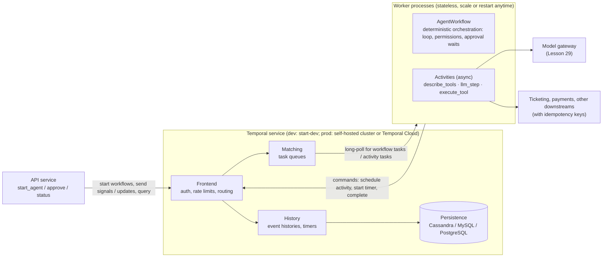
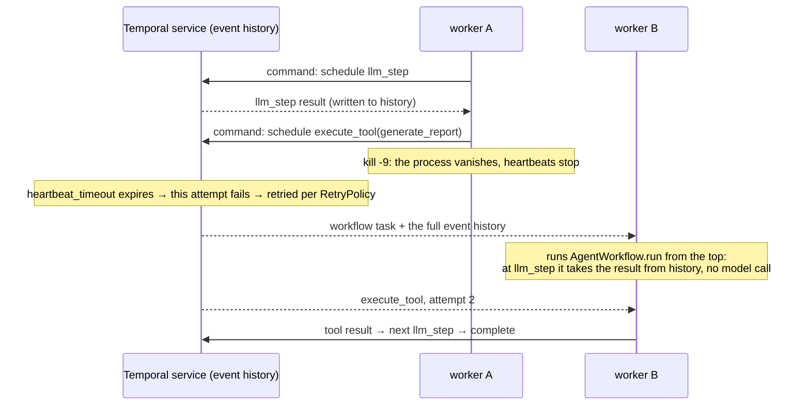
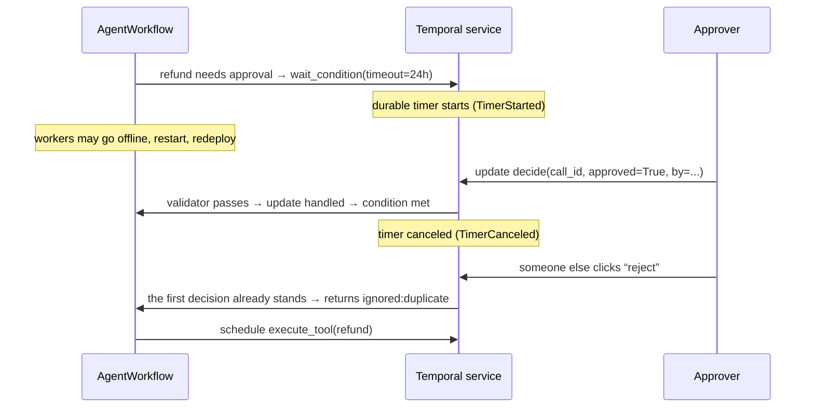
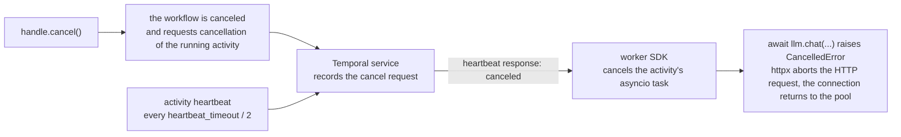

[中文](README.md) | [English](README.en.md)

# Lesson 27: Durable workflows — running agents on Temporal

> 🕐 Time: 30 min | 🎯 You'll be able to: decide when you need a durable execution engine and when your own checkpoints are enough; split an agent loop into a Workflow plus Activities; set timeouts, retries, heartbeats, and approval timers correctly; and avoid the real traps hidden in the determinism constraint | 📦 Source: [`agentkit/contrib/temporal.py`](../../agentkit/contrib/temporal.py), [`scenario.py`](scenario.py), [`demo.py`](demo.py)
>
> 📖 Primary reading: [Of course you can build dynamic AI agents with Temporal](https://temporal.io/blog/of-course-you-can-build-dynamic-ai-agents-with-temporal) (Mason Egger, Steve Androulakis, 2025) — it tackles the most common misconception head-on: "Workflows must be deterministic, so how can a nondeterministic LLM live inside one?" Determinism only constrains the orchestration code; model calls and tool calls run in Activities, and the model stays in the driver's seat. Read it, then look at this lesson's `AgentWorkflow`: the structure maps almost one to one.

## 0. In one sentence

**Where the teaching version of agentkit falls short**: a `Checkpointer` only *saves* state. Who notices that a process died, who calls `resume`, what happens when two processes `resume` the same run, who keeps time on an approval that has been pending for three days, what happens to in-flight runs during a deploy — all of that is your code. Lesson 13 filled some of it in with a lease queue and Lesson 26 moved checkpoints into Postgres, but "who drives recovery" is still up to you.

**Durable execution takes a different approach: hand the bookkeeping of "how far did we get" to a dedicated service. Your code can crash at any moment; another machine replays the ledger from the start and ends up exactly where the crash happened.**

An analogy. The project manager (the Workflow) only makes decisions and never does the work; the actual work goes to contractors (Activities), who may fail or disappear and can be reassigned. Every assignment and every result goes into a ledger (the Event History). If the project manager is replaced midway, the new one reads the ledger from the top and knows exactly where things stand — and while reading, they may not "go with their gut" and decide differently than last time. That is the **determinism constraint**.

| agentkit (Lessons 02, 08) | Temporal (this lesson) |
|---|---|
| `Agent._loop` main loop | `AgentWorkflow.run`: deterministic code that only orchestrates |
| `llm.chat(...)` | `llm_step` Activity: retryable, with timeouts and heartbeats |
| `registry.execute(...)` | `execute_tool` Activity: retries set by tool risk |
| `checkpointer.save` after every step | Event History: the server records every Activity's input and result |
| `PauseRun` → persist → `agent.approve()` → `resume` | `workflow.wait_condition(..., timeout=...)` + signal / update |
| `ResilientLLM` retries | the Activity's `RetryPolicy` |
| Idempotency key `run_id:call_id` | `workflow_id:call_id` (stable across continue-as-new) |

## 1. Why the teaching implementation isn't enough

### 1.1 "Saved" and "keeps running" are two different things

| Capability | agentkit checkpoints (Lesson 08) | + Postgres / queue (Lessons 13, 26) | Temporal |
|---|---|---|---|
| Where state lives | Local file / memory | Postgres, shared across machines | The Temporal service's persistence layer (Cassandra / MySQL / PostgreSQL) |
| Who notices a dead process | Nobody | Lease expiry + heartbeats (you write it) | Activity start-to-close / heartbeat timeouts, judged by the server |
| Who triggers recovery | A human calls `resume` | Another worker claims the expired task | The server hands the workflow task to any live worker |
| Two processes recovering at once | They overwrite each other | Fencing token / CAS (you write it) | Only one workflow task runs for a given workflow at a time |
| Timing an approval | Nothing | A periodic scanner (you write it) | Durable timer (the `timeout` of `wait_condition`) |
| Retries | `ResilientLLM` (in-process, lost when the process dies) | Queue attempts | `RetryPolicy`, scheduled by the server; still retried if the worker dies |
| Seeing where a run is stuck | Read a JSON file | Query a table | Web UI / `temporal workflow describe` / visibility queries |
| Code changed while runs are in flight | Keep checkpoint formats compatible yourself | Same | Replay + `workflow.patched` versioning (Problem 4) |

The right-hand column isn't free: you operate one more service (or buy Temporal Cloud), and you accept a set of programming constraints. This lesson is about that trade.

### 1.2 Architecture



Workers pull tasks from a task queue (long polling); the server never connects to a worker. So workers can run anywhere that can reach the Temporal service, and scaling is just adding or removing processes.

### 1.3 Replay: how a crash gets you "back to that line"



The key is the fourth note: **during replay, completed Activities don't run again; their results come straight from history**. That is why workflow code must be deterministic. If replay took a different branch (because it read the current time or drew a random number), the commands it issues would no longer match the history.

### 1.4 Terms

| Term | Plain English | Code in this lesson |
|---|---|---|
| Workflow | Orchestration logic that resumes from where it crashed; must be deterministic | `AgentWorkflow` |
| Activity | The function that does the real work (call the model, call a tool); may fail and be retried | `llm_step`, `execute_tool`, `describe_tools` |
| Event History | The server-side ledger: every command, every result, every signal | `summarize_history()` |
| Replay | Re-running workflow code against the event history to rebuild in-memory state | Scenarios 4 and 7 |
| Task Queue | The named queue workers poll for tasks | `make_worker(client, task_queue, ...)` |
| Signal / Update / Query | Messages to a running workflow: a signal is one-way; an update returns a result; a query is read-only | `approve` / `decide` / `status` |
| Durable timer | A timer stored on the server; fires on time even if every worker is down | Approval timeout |
| Heartbeat | An Activity's periodic "still alive"; cancellation can only be delivered through it | `_heartbeating()` |
| Continue-As-New | When history gets long, "restart" as a fresh run carrying the state along | `_continue_as_new()` |
| Patching | When changing workflow code, keep a path for both old and new executions | `workflow.patched(...)` |

## 2. Enterprise problem cards

### Problem 1: The agent runs for tens of minutes or days. When the process crashes, how does it continue?

**Scenario**: A "supplier reconciliation agent" makes 30+ model calls and touches 5 internal systems per run, averaging 40 minutes. Refunds above 5,000 yuan need finance approval, which takes 6 hours on average. The service deploys twice a day, and each deploy catches a dozen runs midway.

**Why it's hard**: Lesson 08's checkpoints guarantee that state isn't lost, but triggering recovery, mutual exclusion during recovery, timing approvals, and code-version compatibility across deploys all have to be bolted on one by one. By the end you notice you are writing a crude workflow engine.

| Option | How it works | Learning cost | Ops cost | Expressiveness | Vendor lock-in | When to use |
|---|---|---|---|---|---|---|
| A. Home-grown checkpoints (Lessons 02 / 08 / 26) | Save `RunState` to Postgres after every step; a lease queue + heartbeats trigger recovery; a periodic scan handles approval timeouts | Low: code you already know | Low: just Postgres | Medium: anything is possible, but timers, cancellation, and version compatibility are all on you | None | Minute-scale tasks, small teams, simple recovery logic |
| B. Temporal (this lesson) | Orchestration as a Workflow, IO as Activities; the server records event history and replays after crashes | High: determinism, replay, and versioning are new concepts | High (self-hosted: database + several services) / Medium (Temporal Cloud) | High: arbitrary code, durable timers, signals/updates/queries, child workflows | Low: open source (MIT), self-host or managed | Hours to days, many steps, approvals and compensation, costly failures |
| C. AWS Step Functions | Describe a state machine in Amazon States Language (JSON) or the visual designer; the Standard type runs up to 1 year with exactly-once execution; approvals use the `.waitForTaskToken` callback | Medium: a DSL to learn, but few concepts | Low: fully managed | Medium: branches, parallel, and Map exist, but complex logic in JSON is painful | High: AWS only | Already on AWS, fairly fixed flows, heavy integration with AWS services |
| D. LangGraph checkpointer | A checkpoint at every super-step of the graph; `interrupt()` pauses, `Command(resume=...)` resumes; three durability modes: `exit` / `async` / `sync` | Medium: a graph model to learn | Low to medium: checkpoints go into your Postgres, but triggering recovery is still your job | Medium: good at agent graphs; `interrupt` has no built-in timeout parameter, and on resume the interrupted node **re-runs from the start** | Low: open source | Already writing agents in LangGraph, need human-in-the-loop and resumable runs |
| E. Cloud durable functions | Azure Durable Functions (an Azure Functions extension; C#/JS/TS/Python/PowerShell/Java); AWS Lambda durable functions (launched December 2025, up to 1 year, `step` / `wait` / callbacks); Cloudflare Workflows (`step.do` / `step.sleep` / `step.waitForEvent`) | Medium: the same "checkpoint + replay" model, the same determinism requirement | Low: fully managed, pay per use | Medium to high: flows written as ordinary code | High: tied to each vendor's function platform | Already all-in on one serverless platform |

**How to choose**: first ask "how long does my longest task run, does it wait for people, and how expensive is one failure?" Minute-scale with no approvals: A is enough (also see Problem 5). Hours to days, approvals and timeouts, money involved: B or E. Already deeply tied to one cloud with fairly fixed flows: C or the matching E is the least ops work. Already on LangGraph: D solves pause-and-resume, but "who notices that the process died" is still yours to build. **B and E share the same programming model (checkpoint + replay + determinism); learn one, and switching is mostly an API change.**

**What this lesson implements**: option B. [`agentkit/contrib/temporal.py`](../../agentkit/contrib/temporal.py) moves agentkit's agent loop into `AgentWorkflow` as is: the Hook interface doesn't change, the model and tools are the same `LLM` / `ToolRegistry`, only the execution "shell" becomes Temporal. Demo scenario 4 really does `kill -9` a worker process: a new worker takes over, none of the completed activities (4 of them in offline mode) re-run, and the model is called only once more (for the final summary).

### Problem 2: Approvals take hours to days

**Scenario**: The refund agent's dangerous operations need a manager's approval. Managers respond after 3 hours on average, sometimes the next day; if nobody approves within 24 hours, the request must be auto-rejected and the user notified. At peak, 900 runs are waiting for approval at once.

**Why it's hard**: the wait is unpredictable; deploys and autoscaling happen during the wait; "auto-reject on timeout" needs a timer that still fires on time after every process has restarted; approvers may click twice, two approvers may click at the same time, and an approval may arrive before the workflow even reaches its waiting point.

| Option | How it works | Pros | Cons | When to use |
|---|---|---|---|---|
| A. Blocking wait | A thread polls for the decision or waits for a callback | Simplest | 900 runs hold 900 threads; one deploy loses them all | CLI tools, confirmations within seconds |
| B. Persist and poll (Lesson 08) | `PauseRun` → state saved as paused → `agent.approve()` resumes from the checkpoint; a separate scanner periodically rejects timed-out runs | Zero resources while waiting; no new infrastructure | The timeout scanner, duplicate approvals, and races between approval and resume are all yours | Most minute-to-hour scenarios |
| C. Workflow signal + durable timer (this lesson) | `wait_condition(lambda: decided, timeout=24h)`; the decision arrives as a signal (one-way) or an update (returns a result); the server fires the timeout | No worker is held while waiting; the timer lives on the server and fires even if all workers are down; decisions are recorded in the event history | Needs Temporal; out-of-order and duplicate signals still have to be handled in code | Day-long waits, multi-level approvals, reliable timeouts |

Signal or update? **A signal is fire-and-forget**: the sender doesn't learn whether the workflow accepted it. **An update waits until the workflow has handled it and returns a result**, and it can carry a validator that rejects bad requests before they are written to history (this lesson's validator rejects unknown `call_id`s). An approval UI that must tell the approver "did your vote count?" is a better fit for an update; approval events forwarded from a message queue are simpler as signals.



**How to choose**: approvals that must survive deploys, time out reliably, and be auditable → C; minute-scale with infrequent deploys → B is enough. Either way, handle four things: **① treat a timeout as a rejection (fail closed); ② the first decision wins, later ones are recorded but ignored; ③ an approval that arrives after a timeout must not "revive" an operation that has already been rejected; ④ a decision may arrive before the wait starts, so store it first**. Point ④ is the easiest to miss: signals are delivered at the start of a workflow task, which can easily be before the workflow code reaches `wait_condition`.

**What this lesson implements**: `AgentWorkflow._decide` is that state machine (exercise (b) is its pure-function version). agentkit's `PermissionPolicy` runs inside the workflow unchanged: it raises `PauseRun`, and `AgentWorkflow` catches it and waits with `wait_condition` instead of persisting and exiting. Demo scenario 3 shows an approval plus a duplicate click; scenario 5 shows no approval within 3 seconds → auto-reject, and a late approval after the workflow has finished being refused by the server.

### Problem 3: Which layer should retry?

**Scenario**: The model gateway sometimes returns 429, the inventory service sometimes drops connections, the payment API sometimes times out. Three teams each added retries: the openai SDK retries twice by default, `ResilientLLM` retries 3 times, and Temporal Activities retry **forever** by default (`maximum_attempts` defaults to 0 = unlimited). During one incident a single model call was sent more than ten times, and one refund was executed twice.

**Why it's hard**: every layer thinks "one more retry makes it more reliable", and stacked together they multiply (3 × 5 = 15 attempts). Worse, Activities are **at-least-once**: if a worker crashes between "the tool finished" and "the result was reported to the server", the server can only dispatch it again after a timeout. This is **exactly the same problem** as Lesson 13's "the lease expired and someone else claimed the task". Temporal's docs say it plainly: with a retry policy, an Activity is guaranteed to be *observed* as completed exactly once, but it **may be executed multiple times**, so Activities should be idempotent.

| Option | How it works | Pros | Cons | When to use |
|---|---|---|---|---|
| A. Client-side retries | SDK `max_retries`, `ResilientLLM` / `AsyncResilientLLM` | Lowest latency, no extra infrastructure | Retries die with the process; invisible from outside (count and reason aren't in the history) | Default when there's no orchestration engine |
| B. Activity RetryPolicy | The server reschedules failed Activities with exponential backoff; non-retryable errors are marked `non_retryable` or listed in `non_retryable_error_types` | Retries survive worker death; every attempt and its failure reason are in the event history | The smallest unit is a whole Activity; retries are unlimited by default, so you must set a cap | Default once you use Temporal |
| C. Idempotency keys | The downstream "executes + records the key" in one transaction; a repeated key returns the previous result | Actually makes repeated execution harmless | The downstream must support it | Every write with side effects, **no matter which layer retries** |

**How to choose**: **retry in exactly one layer**. With Temporal, turn client retries off (`OpenAICompatLLM` / `AsyncOpenAICompatLLM` already use `max_retries=0`) and let the RetryPolicy own it; then **every write also needs C**, because B only guarantees "at least once". For tools:

| Tool | `maximum_attempts` | Why |
|---|---|---|
| read | 5 | Naturally idempotent, retry freely |
| write / dangerous, downstream supports idempotency keys | 3 | Duplicates are deduplicated downstream |
| write / dangerous, not idempotent | 1 | No automatic retry: better to tell the model and a human "outcome unknown" than to charge twice |

For model calls: 429, 408, 409, 5xx, and connection errors can be retried; 400, 401, 403, and "quota exhausted" should not. Interestingly, Temporal's own OpenAI Agents SDK integration (`temporalio.contrib.openai_agents`) uses **exactly the same** classification (408/409/429/5xx are retryable) and likewise disables the SDK's own retries — consistent with `LLMError.retryable` from Lesson 08. A server-sent `Retry-After` reaches Temporal through `ApplicationError(next_retry_delay=...)` and takes precedence over the backoff calculation.

Three details measured in this lesson:

- **Don't wrap `AsyncResilientLLM` directly inside Temporal**: after all attempts fail it raises a single `LLMError` with `retryable=False`, so `llm_step` marks a perfectly retryable 429 as `non_retryable` and the RetryPolicy gives up. If you want its concurrency cap, set its `max_attempts` to 1 and keep this behavior in mind, or cap concurrency with `AsyncOpenAICompatLLM(max_connections=...)` instead (what this lesson does).
- **Failed attempts cost money but don't show up in usage**: `AgentWorkflow` only accumulates tokens from the **successful** `llm_step`. A call that timed out and then succeeded on retry was paid for twice. Reconcile costs against the gateway's bill (Lesson 29).
- **On the local dev server, retry intervals below 1 second were effectively raised to about 1 second**: with `initial_interval` at 0.1 s or 0.5 s, two retries took about 2 seconds either way; at 1.5 s they took about 4.5 s (1.5 + 3.0), matching the backoff formula. Don't count on sub-second retries for "fast recovery".

**What this lesson implements**: `retry_policy_for(risk, idempotent)` (exercise (a)); `execute_tool` turns `exception` / `timeout` results from the executor into an `ApplicationError` for the RetryPolicy, while bad-argument and business errors go straight back to the model; once retries are exhausted, the workflow turns the failure into an "outcome unknown, please verify manually" observation. Pass a cross-worker idempotency store to `make_worker(idempotency_store=...)` and only then are write tools treated as idempotent; inside async activities use Lesson 26's `AsyncRedisIdempotencyStore` (every get / put of the sync version is a blocking network round trip that stalls the event loop), and test `test_write_tool_retry_with_async_redis_idempotency_store` verifies that the idempotency key is `workflow_id:call_id`. Demo scenario 2: the inventory service drops the first connection, attempt 2 succeeds, and the model only ever sees the successful result.

### Problem 4: The traps in the determinism constraint

**Scenario**: In the first week after moving the agent to Temporal, the team hit three strange things: ① the worker failed on startup with `Failed validating workflow`; ② a run that was waiting for approval during a deploy got stuck in `WorkflowTaskFailed` afterwards, with `Nondeterminism error` in the UI; ③ a research agent that had run 80 steps suddenly failed because its event history exceeded the limit.

**Why it's hard**: replay requires "same history → same sequence of commands". Anything that makes the code take a different branch between two executions is a hazard, and many of those don't look "random" at all.

**(a) No direct model calls, clock reads, or random numbers in a workflow**

| What you want | What to write in a workflow |
|---|---|
| Call the model or a tool, query a database, send HTTP | `workflow.execute_activity(...)` |
| `time.time()` / `datetime.now()` | `workflow.time()` / `workflow.now()` (replay returns the time of the first execution) |
| `random.random()` / `uuid.uuid4()` | `workflow.random()` / `workflow.uuid4()` (the seed is recorded in history) |
| `time.sleep()` / `asyncio.sleep()` | `workflow.sleep()` / `asyncio.sleep()` (inside a workflow they become durable timers) |
| `print` / `logging` | `workflow.logger` (muted automatically during replay) |

The Python SDK backs you up with a **sandbox**: every workflow run re-imports the module that defines it inside the sandbox and replaces calls such as `time.time`, `random`, `datetime.now`, `uuid4`, and sockets with proxies that raise when called. Wiring agentkit in, we hit three **counter-intuitive** traps (all verified on this machine):

1. **agentkit fails to import inside the sandbox**: `agentkit/config.py` calls `Path(__file__).resolve()` at module top level, the sandbox lists `Path.resolve` as restricted, and the worker fails at startup with `__call__ on pathlib.Path.resolve restricted`. Fix: make the agentkit core modules passthrough (the sandbox reuses the modules already imported outside). That's what `sandbox_runner()` does — and you can't take the shortcut `with_passthrough_modules("agentkit")`: passthrough matches by prefix, so `agentkit.contrib.temporal` itself would be let through, and nothing would catch a `time.time()` in the workflow code.
2. **Passthrough modules are not protected by the sandbox**: calling `RunState()` inside a workflow runs its default factories, which call `uuid4()` and `time.time()`, and the sandbox **does not** complain, because `agentkit.state` came in as passthrough. Every replay gets a different `run_id`. That's why `AgentWorkflow` passes `run_id=workflow.info().workflow_id` and `started_at=workflow.time()` explicitly. For the same reason, `BudgetHook(max_seconds=...)` (uses `time.time()`) and `ToolOutputGuard` (uses `uuid4()`) must not go into a workflow.
3. **Replay compares commands, not arguments**: change the system prompt, change `llm_timeout_s`, replay an old history with `Replayer` — **it passes**. Temporal checks the kind and order of commands (which activities were scheduled, how many timers were started), not the arguments you passed to activities. So "the in-memory state differs from the first execution" can go completely unnoticed until some later branch depends on it.

Beyond the sandbox, there's nondeterminism it can't see at all: iterating over a `set` (string hashes differ across processes, `PYTHONHASHSEED`), global mutable state, reading environment variables. Exercise (c) has you write an `ast`-based static checker; it catches the common calls, and it can't catch these either. **The last line of defense is replay testing**: run `Replayer` on event histories sampled from production, in CI.

**(b) Change the workflow code and old executions fail on replay**

A run waiting for approval has "scheduled describe_tools → llm_step → execute_tool → started a timer" in its history. You ship a new version that adds `await workflow.sleep(1)` at the start (throttling). When the old run replays on a new worker, the code's first command is "start a timer" while the history's first command is "schedule an activity" — `NondeterminismError`. Demo scenario 7 reproduces this error for real.

| Option | How it works | Pros | Cons |
|---|---|---|---|
| A. Wait for old runs to finish before deploying | Stop taking new work, drain, then deploy | No code changes | Day-long workflows can't wait that long |
| B. Patching | `if workflow.patched("id"): new logic else: old logic`; after all old runs finish, switch to `workflow.deprecate_patch("id")`, later delete it | Fine-grained; the officially recommended basic tool | Branches pile up in the code; cleanup must be remembered |
| C. Worker Versioning | Tag workers with deployment versions; Pinned workflows finish on workers of the same version, Auto-Upgrade workflows move to the new version (still need patching) | No branches in code (Pinned) | Several worker versions must stay online; a more complex deploy process |

**(c) The event history gets too large and needs continue-as-new**

Temporal hard-limits the event history of a single workflow execution to **51,200 events or 50 MB**, with warnings from 10,240 events or 10 MB; a single payload is capped at **2 MB** by default. By default the server "suggests" continue-as-new at **4,096 events or 4 MB** (Temporal Server v1.32 dynamic config `limit.historyCount.suggestContinueAsNew` / `limit.historySize.suggestContinueAsNew`).

For agents, size hits the limit before event count, and it grows **quadratically**: every `llm_step` input carries the full conversation, so the history stores N ever-longer copies of it. Measured on this machine (each tool returns about 6 KB of text):

| Steps | Events | Event history size | Size of the final conversation itself |
|---|---|---|---|
| 6 | 77 | 254 KiB | 31 KiB |
| 11 | 137 | 803 KiB | 61 KiB |
| 21 | 257 | 2,797 KiB | 122 KiB |
| 31 | — | server suggestion → 1 continue-as-new | 183 KiB |
| 81 | — | 10 continue-as-news | 488 KiB |

Look at the last row: the longer the conversation, the larger each new run's first `llm_step`, so continue-as-new happens more and more often; once the conversation itself approaches 2 MB, a single payload exceeds the limit and continue-as-new can't help. Do three things together: **① continue-as-new to bound history length (`AgentWorkflow` does it automatically when the server suggests it, and `continue_as_new_after_events` sets a lower threshold); ② context compaction to bound the conversation (Lesson 04, with the compaction model call in an activity); ③ large objects in external storage with only references in history (the claim-check pattern; the Python SDK added built-in External Storage as a Public Preview in May 2026)**. Also, on the local dev server each continue-as-new added about 1 second of latency; we traced it to the dynamic config `history.workflowIdReuseMinimalInterval`, which defaults to 1 second (setting it to 0 made the delay disappear).

**How to choose**: (a) rely on a code structure that separates orchestration from IO, plus the sandbox, plus replay tests; (b) default to patching, and consider Worker Versioning with Pinned when you deploy often and workflows are short; (c) agents must be designed with continue-as-new, and context compaction is a requirement, not an optimization.

**What this lesson implements**: `AgentWorkflow` has no direct time, randomness, or IO (the last test of exercise (c) runs your checker over it); `summarize_history()` helps you read event histories; `tests/contrib/test_temporal.py` contains replay tests (the original passes, the direct code change fails, the patched version passes).

### Problem 5: When do you **not** need Temporal?

**Scenario**: A 5-person team builds an internal knowledge-base Q&A agent: P99 20 seconds, read-only tools, no approvals, one deploy a week. Someone proposes "adopt Temporal and be done with it".

**Why it's hard**: the benefits of durable execution show up when tasks are long, wait for people, and are expensive to fail; its costs (one more service to operate, the determinism constraint, a few extra network round trips per step) start on day one. Measured on this machine: 20 workflows with a zero-latency model still spend about 1 second on Temporal's own overhead (about 50 ms per workflow).

| Option | How it works | When to use |
|---|---|---|
| A. Synchronous agent + checkpoints (Lesson 08) | One process, one request; on failure the user retries | Second-scale tasks, internal tools, prototypes |
| B. AsyncAgent + Postgres checkpoints ([Lesson 26](../26_state_and_queues/README.en.md), [Lesson 30](../30_async_runtime/README.en.md)) | One process drives hundreds of sessions concurrently with asyncio; every step checkpoints to Postgres; a lease queue handles crash takeover | Minute-scale tasks, high-concurrency chat, teams that don't want another service to run |
| C. Queue + stateless workers (Lessons 13, 26) | Tasks go into a queue; workers claim, heartbeat, and commit; failures go to a dead-letter queue | Batch and async jobs without complex mid-run waits |
| D. Temporal (this lesson) | Workflow + Activities, the server keeps the ledger | Hours to days, approvals / timers / compensation, many systems, costly failures |

**Temporal durable workflows vs AsyncAgent + Postgres checkpoints**: both can "drive many runs concurrently in one process and pick up after a crash". The difference is **who guarantees it**:

| | AsyncAgent + Postgres checkpoints | Temporal |
|---|---|---|
| Granularity of recovery | Checkpoint: saved after every tool result | Event history: every activity result |
| Who detects a crash and takes over | Your leases + heartbeats + scanner | The server's timeouts + task dispatch |
| Timers (approval timeout) | Your scanner | Durable timers |
| Code constraints | Almost none | Determinism, versioning |
| Tool execution semantics | `AsyncToolExecutor` | **The same** `AsyncToolExecutor` (this lesson's `execute_tool` uses it directly) |
| Extra infrastructure | Just Postgres | The Temporal service (+ its own database) |

**How to choose**: consider Temporal only if at least two of these hold: single tasks often run longer than 30 minutes; runs wait for people (approvals, extra documents); there are timed actions (timeouts, reminders, periodic retries); one failure needs manual cleanup (money or external commitments); someone (or a platform team) operates it, or there's budget for Temporal Cloud. If none apply, use B or C — they are first-class citizens of Part 4 of this course, too.

**What this lesson implements**: `execute_tool` runs tools through `agentkit.aio.AsyncToolExecutor` — **the same execution semantics** as `AsyncAgent` (async tools are truly cancellable, sync tools go to a bounded thread pool, `isolated(tool)` runs in a subprocess and is killed on timeout). Moving from B to D doesn't change a single line of tool code.

### Problem 6: Operations — who runs Temporal itself?

**Scenario**: The platform team has decided to adopt Temporal. Next questions: self-host or buy the cloud service? How many machines, which database? How do workers scale? Where do we look when something goes wrong?

| Option | How it works | Pros | Cons | When to use |
|---|---|---|---|---|
| A. Temporal Cloud | Managed Temporal service; workers still run on your machines | No database or services to operate; billed by usage (Actions + storage) | Event histories live with a third party (encrypt end to end with a Payload Codec); usage-based billing needs cost estimates | The starting point for most teams |
| B. Self-hosted cluster | Deploy Temporal Server (Frontend / History / Matching / Worker services) + a persistence database (Cassandra, MySQL, or PostgreSQL) + a visibility store (since v1.20, MySQL 8.0.17+ / PostgreSQL 12+ directly, or Elasticsearch / OpenSearch) | Data fully under your control; no per-use fees | Several services and databases to operate; **the number of History shards is fixed when the cluster is created and can't be changed later**, so plan ahead | Data may not leave your environment, scale where managed fees don't pay off, a platform team exists |
| C. Local dev server | `temporal server start-dev` (Web UI at http://localhost:8233 by default, data in memory by default, `--db-filename` to persist) or the SDK's `WorkflowEnvironment.start_local()` | One command, no Docker; every demo and test in this lesson runs on it | Single process, SQLite, no high availability — **not a production cluster** | Development, tests, CI |

Operational notes:

- **Scaling workers horizontally**: workers are stateless; adding processes on the same task queue is scaling out. Each worker has two concurrency knobs (the SDK defaults to 100 slots each): `max_concurrent_activities` (how many activities run at once — agents spend nearly all their time waiting on the model, so this usually has to match the model gateway's concurrency quota) and `max_concurrent_workflow_tasks` (how many workflow tasks are processed at once — each is short, but it becomes the bottleneck right after a worker starts and must replay histories for many workflows). Demo scenario 6 measured it: for the same 20 workflows, `max_concurrent_activities=4` kept peak model-call concurrency at exactly 4, and the time went from 1.15 s to 2.18 s.
- **Visibility queries and the Web UI**: the Web UI filters by workflow type, status, and time; click through to the full event history (every activity's input, output, attempts, and failure reasons). Finding workflows by business fields (tenant, order number) requires custom Search Attributes.
- **The event history is data**: prompts, tool arguments, and tool results (including internal error text in `ToolResult.detail`) are stored verbatim, and anyone who can see the Web UI can see them. Encrypt sensitive data with a Payload Codec in workers and clients (the server only sees ciphertext), deploy a Codec Server for the Web UI to decrypt, and set the Namespace retention period to meet compliance (1–90 days on Temporal Cloud).
- **A bug in workflow code doesn't fail the workflow**: an ordinary exception raised in a workflow, by default, only fails that workflow task, which keeps being retried (the UI shows `WorkflowTaskFailed`) while the workflow itself stays suspended. Fix the code and redeploy, and it continues on its own — a feature, but alert on `WorkflowTaskFailed` or runs will sit stuck silently. Also, if a single workflow activation doesn't yield within 2 seconds, the Python SDK treats it as a deadlock.

**What this lesson implements**: every demo and test uses `WorkflowEnvironment.start_local()` (the real Temporal CLI dev server; CLI 1.9.1 / Server 1.32.0 on this machine). **There is no Docker on this machine; self-hosted cluster and Temporal Cloud configurations were not actually run.**

## 3. How this lesson's adapter plugs in

### 3.1 Four functions

```python
from agentkit.aio import default_async_llm
from agentkit.contrib.temporal import agent_status, approve, make_worker, start_agent

# Worker process: hosts AgentWorkflow and three activities. llm_factory is called once when the worker starts.
worker = make_worker(client, "support-agents", lambda: default_async_llm(max_connections=20), tools)
await worker.run()

# API process: start a run (use a business key as workflow_id: resubmitting the same ticket runs only one agent)
handle = await start_agent(client, "Refund order A1001", {"tenant_id": "acme", "user_id": "u1", "roles": ["support"]},
                           workflow_id="refund-A1001", task_queue="support-agents", approval_timeout_s=24 * 3600)
st = await agent_status(client, "refund-A1001")          # query: steps, pending approvals, tools called, usage
await approve(client, "refund-A1001", st.pending_approvals[0]["call_id"], True, by="zhang.manager")  # signal
result = await handle.result()                            # AgentResult
```

### 3.2 The workflow: orchestrate only, no IO

`AgentWorkflow.run` maps almost line by line onto `Agent._loop` (trimmed):

```python
while state.step < inp.max_steps:
    if self._should_continue_as_new():            # suggested by the server, or past continue_as_new_after_events
        await self._continue_as_new()             # start a new run carrying RunState
    state.step += 1
    response = await workflow.execute_activity_method(AgentActivities.llm_step, LLMStepInput(state.messages, schemas),
                                                      start_to_close_timeout=..., heartbeat_timeout=..., retry_policy=...)
    state.messages.append(response.to_message())
    if not response.tool_calls:
        ...; return                               # final answer (the on_final hook runs here)
    for call in unanswered_calls(state):
        # before_tool hooks: PermissionPolicy raises PauseRun → here it becomes a wait_condition for approval
        result = await self._run_one_tool(call)   # → execute_tool activity, RetryPolicy set by risk
        state.messages.append(tool_message(call.id, result.content))
```

The workflow needs to know which tools exist and how risky each is, but the `ToolRegistry` belongs to the worker process (different workers may run different versions). So the first activity is `describe_tools`: its result goes into history, and every later replay sees the same copy.

### 3.3 Activities: all async



- **Why async**: agents spend nearly all their time waiting on the model. An async activity doesn't hold a thread while it waits, so one worker process can drive many workflows at once. Demo scenario 6: 20 workflows on one worker (2 model calls each, 0.15 s model latency) took 7.9 s serially and 1.15 s concurrently in one run on this machine, with a peak of 20 concurrent model calls (across runs it varied with machine load: 7.9–9.5 s serial, 1.15–1.6 s concurrent).
- **Cancellation can only arrive through heartbeats**: the server doesn't push cancellations; it tells the worker in the response to a heartbeat. So `llm_step` and `execute_tool` heartbeat every `heartbeat_timeout / 2` while running. `heartbeat_timeout` (10 s by default) also decides how quickly a dead worker is noticed — otherwise you wait for the full `start_to_close_timeout` (120 s for model calls). Cancellation latency is roughly the heartbeat interval: measured on this machine, a 30-second model call was aborted 0.19 / 0.7 / 4.7 s after `handle.cancel()` with `heartbeat_timeout` at 1 / 2 / 10 s (test `test_cancel_reaches_the_inflight_llm_call`). For cancellation to reach the HTTP request, **the model client itself must be async**; a sync client running in a thread can only be "no longer awaited", and the request finishes in the background and is still billed.
- **Never block inside an async activity**: async activities run on the worker's event loop, and one `requests.get` / `time.sleep` / synchronous database driver stalls **every** activity, heartbeat, and workflow-task exchange on that worker. The last row of demo scenario 6: a model client that blocks with `time.sleep` inside async code makes 20 workflows take 7.05 s with a peak concurrency of 1 — as slow as running them serially. We also hit a subtle version of this in real mode: at first the model client was created lazily inside the first `llm_step`; creating it imports openai / httpx (about 0.6 s here, over 2 s when the machine is busy), that synchronous code blocked the event loop, and an `llm_step` with `heartbeat_timeout=2` s was judged to have missed its heartbeat and retried — possibly paying for the model call twice. Fix: `make_worker` creates the client at startup.
- **What about sync tools**: `execute_tool` hands them to `AsyncToolExecutor`: sync tools go to a bounded thread pool (the event loop isn't blocked), async tools are awaited directly. Temporal itself also supports sync activities, but the worker then needs an `activity_executor` (the docs recommend a `ThreadPoolExecutor`); in fact the Temporal docs' default advice is "make activities synchronous unless you're sure they don't block the event loop". This lesson chooses async because both the model client and the tool executor are truly asynchronous, which makes concurrency and cancellation real.

### 3.4 Which agentkit hooks can go straight into the workflow

| Hook | In the workflow? | Why / what to do |
|---|---|---|
| `PermissionPolicy` (`approver=None`) | ✅ included by default | Pure logic; its `PauseRun` becomes a `wait_condition` |
| `InputGuard` / `OutputGuard` | ✅ | Regex matching and redaction |
| `LoopGuard` (Lesson 08) | ✅ | Counters live in `state.metadata` and are carried across continue-as-new |
| `BudgetHook(max_tokens / max_cost_usd / max_tool_calls)` | ✅ | Pure counting |
| `BudgetHook(max_seconds)` | ❌ | Uses `time.time()`, and the sandbox can't catch it (passthrough); use workflow timeouts instead |
| `ToolOutputGuard` | ❌ → activity | Generates boundaries with `uuid4()`; run it inside `execute_tool` via `make_worker(tool_hooks=[ToolOutputGuard()])` |
| `AuditLog` | ❌ → activity | Writes files; put it in `tool_hooks` as well |
| `Tracer` | ❌ | Reads the clock; use Temporal's OpenTelemetry interceptor instead (Lesson 28) |
| `SummarizingCompactor`, memory retrieval | ❌ → activity | Calls the model / queries storage |

To add more pure-logic hooks to the workflow, write a subclass that overrides `extra_hooks()`. Temporal places three requirements on subclasses (we tripped over all of them): give it a new name with `@workflow.defn(name=...)`; redeclare `@workflow.run` and call `super().run(inp)`; and the `run` parameter annotation must be **textually identical** to the parent's `@workflow.init` (write `inp: AgentInput`; `kt.AgentInput` is rejected as "parameters do not match").

## 4. Hands-on: run the demo

```bash
python lessons/27_durable_workflows/demo.py --offline          # offline, about 50 seconds
python lessons/27_durable_workflows/demo.py                    # real model (gpt-5.5)
python lessons/27_durable_workflows/demo.py --offline --hold 300   # keep the server for 5 minutes to browse event histories in the Web UI
```

On startup it prints the Web UI address (`start_local(ui=True)`). Without the optional dependencies it prints `pip install -e ".[prod,prod-local]"` and exits normally. An excerpt of the offline output (Demo output translated from Chinese.):

```text
Scenario 4: kill -9 a worker process — a new worker continues from the breakpoint; completed activities don't re-run
  generate_report is running on worker-A (step 2, tools called ['lookup_order', 'generate_report']) → kill -9 30819
  worker-B called the model only 1 time: the earlier model replies were replayed from the event history, no money spent again
    6  ActivityTaskStarted                describe_tools attempt=1 worker=worker-A
   12  ActivityTaskStarted                llm_step attempt=1 worker=worker-A
   18  ActivityTaskStarted                execute_tool attempt=1 worker=worker-A
   24  ActivityTaskStarted                llm_step attempt=1 worker=worker-A
   30  ActivityTaskStarted                execute_tool attempt=2 worker=worker-B | last failure: activity Heartbeat timeout
   38  ActivityTaskStarted                llm_step attempt=1 worker=worker-B

Scenario 6: async concurrency — one worker drives 20 workflows at once (model latency 0.15 s, offline model)
  Mode                                                   Total   Peak concurrent model calls
  Serial: one after another                              7.90s             1
  Concurrent: max_concurrent_activities=100 (default)    1.15s            20
  Concurrent: max_concurrent_activities=4                2.18s             4
  Concurrent, but the model client blocks in async (time.sleep)   7.05s     1
```

What to look for:

1. **Scenario 1**: a 2-step agent produces 29 events and about 11 KB of history. Count the activity order: `describe_tools → llm_step → execute_tool → llm_step`.
2. **Scenario 2**: `execute_tool attempt=2`, and "last failure" shows the first error. The model's input only contains the successful result.
3. **Scenario 3**: `TimerStarted 86400s` (the 24-hour approval timer) → `WorkflowExecutionUpdateAccepted` → `TimerCanceled`. The second click is also written to history (the validator only rejects unknown `call_id`s), but it returns `ignored:duplicate` and has no effect.
4. **Scenario 4**: worker-A is a real subprocess that gets `kill -9`. The server doesn't know it died; it only knows there's been no heartbeat for 2 seconds. worker-B's model-call count is 1. In real mode the model may skip `lookup_order` and go straight to the report, so there's one step fewer; the conclusion is the same.
5. **Scenario 5**: after `TimerFired` the refund never runs; an approval sent after the workflow ends is refused by the server.
6. **Scenario 6**: see the table above. Row three shows `max_concurrent_activities` is a real cap; row four is the price of blocking inside async code.
7. **Scenario 7**: change the code directly → `NondeterminismError`; wrap it in `workflow.patched` → passes.

## 5. Exercises

Open [`exercise.py`](exercise.py). All three are pure functions and need no Temporal server:

- **(a) `retry_policy_for(tool_risk, idempotent) -> dict`**: return RetryPolicy parameters per the table in Problem 3.
- **(b) `on_event(state, event) -> ApprovalState`**: the approval state machine. Handle decisions that arrive before the wait, duplicate decisions, timeouts, approval after rejection, and events for other call_ids.
- **(c) `is_deterministic_safe(source_code) -> list[str]`**: use `ast` to find calls such as `time.time`, `random.*`, `datetime.now`, `uuid4`, and HTTP requests in workflow code, resolving import aliases and checking only `@workflow.defn` classes. The last test runs your checker over `agentkit/contrib/temporal.py`.

```bash
make lesson N=27
# or: .venv/bin/python -m pytest lessons/27_durable_workflows -v
```

`test_integration.py` runs the full "look up order → refund → approval → execute" flow for real with `start_local()` (skipped automatically when temporalio isn't installed). The more complete tests for the contrib module are in [`tests/contrib/test_temporal.py`](../../tests/contrib/test_temporal.py) (23 tests, including worker replacement, cancellation propagation, concurrency, replay, and the Redis idempotency store).

## 6. Operational notes and common pitfalls

1. **Activities retry forever by default.** Model calls and write tools must set `maximum_attempts`, and non-retryable errors must be marked `non_retryable`.
2. **Two layers of retries stacked.** With a RetryPolicy, turn off client retries; `AsyncResilientLLM` turns the final error into a non-retryable one.
3. **Writes without idempotency keys.** Activities are at-least-once; the idempotency store must be shared across workers, and an in-process `IdempotencyStore` is as good as nothing here.
4. **Setting only start-to-close, no heartbeats.** A dead worker is only retried after the full start-to-close, and cancellations can't be delivered. Long activities must heartbeat.
5. **Blocking inside async activities**, including the subtle "create the client on the first call" kind.
6. **Reading the clock, random numbers, or environment variables, or iterating over sets, in a workflow.** The sandbox only guards the modules it re-imports; passthrough libraries and nondeterminism rooted in Python semantics are beyond its reach.
7. **Changing workflow code without replay tests.** Replay only compares commands, so changed arguments go unreported; changed commands, on the other hand, get in-flight runs stuck.
8. **Putting the whole conversation into every activity input without designing continue-as-new and context compaction.** An agent's event history grows quadratically.
9. **Assuming queries are cheap.** A worker answers each query and must replay the history first if the workflow isn't in its cache; on Temporal Cloud every query is also an Action. An approval dashboard polling `status()` on thousands of workflows causes a lot of replay on workers; visibility queries (Search Attributes) suit dashboards better.
10. **Forgetting what's in the event history.** Prompts, tool arguments and results, and raw internal errors are all in there; encrypt them (Payload Codec), set a retention period, and control access to the Web UI.
11. **Treating the dev server as production.** `start-dev` keeps data in memory by default; a restart loses everything.

## 7. Switching to a managed service

The workflow and activity code **doesn't change at all**; only the connection does. Connect to Temporal Cloud with an API key (mTLS works the same way):

```python
from temporalio.client import Client

client = await Client.connect(
    "<namespace>.<account>.tmprl.cloud:7233",
    namespace="<namespace>.<account>",
    api_key=os.environ["TEMPORAL_API_KEY"],
    tls=True,
)
```

Or use the SDK's environment configuration, putting the address, namespace, and key into environment variables (`TEMPORAL_ADDRESS`, `TEMPORAL_NAMESPACE`, `TEMPORAL_API_KEY`) and writing only:

```python
from temporalio.envconfig import ClientConfig

client = await Client.connect(**ClientConfig.load_client_connect_config())
```

Switch-over checklist: ① workers and the API service use the same namespace and the same task queue names; ② if you need encryption, configure the **same** Payload Codec in clients and workers, and deploy a Codec Server for the Web UI; ③ estimate costs in [Actions](https://docs.temporal.io/cloud/actions): starting a workflow (including continue-as-new), each activity scheduled or retried, heartbeats that reach the server, each timer, each signal, and every query and update all count — agents produce plenty of activities, heartbeats, and approval timers, and a dashboard polling queries costs money too; ④ set the namespace retention period; ⑤ wire `WorkflowTaskFailed`, activity failure rates, and task-queue backlog (schedule-to-start latency) into alerting (Lesson 28).

## 8. Interview & design review questions

<details>
<summary>1. Workflows must be deterministic, but LLM output isn't. How does an agent fit into Temporal?</summary>

Determinism only constrains orchestration code: given the same event history, the workflow must issue the same sequence of commands. The LLM call runs in an Activity; its result is written to history on the first execution and read back from history on replay, without calling the model again. So the model can freely decide which tool to call, and the workflow only "translates the model's decision into the next activity".
</details>

<details>
<summary>2. Temporal says an Activity is "observed as completed exactly once". Why does it still need to be idempotent?</summary>

"Observed as completed" means the workflow only receives one result; the activity itself may run several times: the worker finishes and crashes before reporting, and the server can only redispatch after a timeout. It's the same problem as the at-least-once delivery of Lesson 13's queue. Writes either use `maximum_attempts=1` (hand "outcome unknown" to a human) or pass `workflow_id:call_id` as an idempotency key to a downstream that deduplicates within the same transaction.
</details>

<details>
<summary>3. Your agent uses openai SDK retries, ResilientLLM, and an Activity RetryPolicy at the same time. What's wrong, and how do you fix it?</summary>

The counts multiply (2 × 3 × 5), amplifying load on the gateway during an incident; inner retries are invisible in the event history; and inner retries die with the process. Keep only the RetryPolicy: client `max_retries=0`, no ResilientLLM (or only its concurrency limit with `max_attempts=1`, keeping in mind that it marks the final error as non-retryable); translate the retryable / non-retryable classification into `ApplicationError(non_retryable=...)` inside the activity, and `Retry-After` into `next_retry_delay`.
</details>

<details>
<summary>4. Approval signals may be duplicated, arrive late, or arrive before the waiting point. How does your workflow handle it?</summary>

Keep a decision table keyed by call_id: the first decision wins, duplicates are recorded but ignored; an early decision is stored, so `wait_condition` is satisfied immediately when the workflow reaches the waiting point; timeouts are fired by a durable timer and recorded as a rejection by `system:timeout`, and a later approval can't revive it; signals that arrive after the workflow ends are refused by the server. When approvers need immediate feedback, use an update with a validator that rejects unknown call_ids.
</details>

<details>
<summary>5. A research agent that ran 80 steps failed because its event history exceeded the limit. Root cause and fix?</summary>

Every `llm_step` input carries the full conversation, so history size grows quadratically with steps and hits the 50 MB limit (or the 2 MB single-payload limit) first. The fix has three parts: continue-as-new (the server suggests it at 4 MB / 4,096 events, and you can set a lower threshold); context compaction (the compaction itself is an activity); large objects in external storage with references in history. Continue-as-new alone isn't enough: the conversation keeps growing, new runs hit the limit ever sooner, and eventually a single payload exceeds 2 MB.
</details>

<details>
<summary>6. On Friday you're shipping a change: add a "risk check" activity before the agent starts. Some running workflows have been waiting for approval for two days. How do you ship it?</summary>

Shipping it as is makes old runs' command sequences mismatch on replay (one extra activity scheduled), and they get stuck on `NondeterminismError`. Wrap the new logic in `if workflow.patched("risk-check"):`: old runs have no patch marker in their history and take the old path; new runs take the new path. Before shipping, validate with `Replayer` against histories sampled from production. After all old runs finish, switch to `deprecate_patch`, and later delete it. Alternatively, use Worker Versioning with Pinned so old runs finish on old-version workers.
</details>

<details>
<summary>7. When would you argue against adopting Temporal?</summary>

When tasks take seconds to minutes, nobody waits for a human, there are no timed actions, a failure can simply be retried by the user, and nobody on the team can operate it and there's no budget for the cloud service. Then AsyncAgent + Postgres checkpoints + a lease queue is simpler, the tool execution semantics are identical, and you can migrate smoothly later if needed.
</details>

<details>
<summary>8. How do you get one worker to drive thousands of agent runs without changing the workflow code? Where are the bottlenecks?</summary>

Make activities async and use an async HTTP model client, so waiting on the model doesn't hold a thread; align `max_concurrent_activities` with the model gateway's concurrency quota; `max_concurrent_workflow_tasks` and `max_cached_workflows` determine replay and caching capacity. The bottlenecks, usually in this order: the gateway quota → blocking calls on the event loop (a single one knocks concurrency back to 1) → worker CPU (workflow tasks, the sandbox re-importing modules, serializing large payloads) → the throughput of the Temporal service itself.
</details>

## 9. Self-check

- [ ] I can explain how checkpointing and durable execution differ in "who detects the crash, who triggers recovery, who keeps time"
- [ ] I can explain why Activities are at-least-once and how that relates to Lesson 13's delivery semantics
- [ ] I can set a RetryPolicy for a read tool, a write tool with idempotency keys, and a non-idempotent write tool, and justify each
- [ ] I can name the four abnormal cases for approval signals and how each is handled
- [ ] I know which calls in a workflow must become `workflow.now()` / `workflow.random()` / an activity, and what the sandbox can't catch
- [ ] I can safely change a running workflow with `workflow.patched`
- [ ] I can explain why an agent's event history grows quadratically, and the three ways to deal with it
- [ ] I know what blocking inside an async activity does, and how cancellation travels all the way to the model call
- [ ] I can decide whether a scenario calls for Temporal, AsyncAgent + Postgres checkpoints, or a queue + workers

## Further reading

- Temporal docs: [Understanding Temporal](https://docs.temporal.io/evaluate/understanding-temporal) (what durable execution means) and [Temporal Workflow](https://docs.temporal.io/workflows) (determinism, replay)
- Temporal blog: [Durable Execution meets AI: Why Temporal is the perfect foundation for AI agent and generative AI applications](https://temporal.io/blog/durable-execution-meets-ai-why-temporal-is-the-perfect-foundation-for-ai) (Cornelia Davis, 2025)
- Temporal blog: [Production-ready agents with the OpenAI Agents SDK + Temporal](https://temporal.io/blog/announcing-openai-agents-sdk-integration) (Cornelia Davis, 2025; the integration became generally available in March 2026) and the [integration docs](https://docs.temporal.io/develop/python/integrations/openai-agents)
- Temporal docs (Python SDK): [Message passing: Signals / Queries / Updates](https://docs.temporal.io/develop/python/message-passing), [Versioning](https://docs.temporal.io/develop/python/versioning), [Sandbox](https://docs.temporal.io/develop/python/python-sdk-sandbox), [Continue-As-New](https://docs.temporal.io/develop/python/continue-as-new), [Testing](https://docs.temporal.io/develop/python/testing-suite), [Sync vs async Activities](https://docs.temporal.io/develop/python/python-sdk-sync-vs-async), [Cancellation](https://docs.temporal.io/develop/python/cancellation), [External Storage](https://docs.temporal.io/develop/python/data-handling/external-storage), [Connecting to Temporal Cloud](https://docs.temporal.io/develop/python/temporal-client)
- Temporal docs: [Retry policies](https://docs.temporal.io/encyclopedia/retry-policies), [Activity timeouts](https://docs.temporal.io/encyclopedia/detecting-activity-failures), [Activities and idempotency](https://docs.temporal.io/activity-definition), [Event history limits](https://docs.temporal.io/workflow-execution/limits), [Self-hosted defaults](https://docs.temporal.io/self-hosted-guide/defaults), [Temporal Cloud limits](https://docs.temporal.io/cloud/limits), [pricing](https://docs.temporal.io/cloud/pricing), and [Actions](https://docs.temporal.io/cloud/actions)
- Temporal docs: [Persistence](https://docs.temporal.io/temporal-service/persistence), [Visibility](https://docs.temporal.io/visibility), [Server services](https://docs.temporal.io/temporal-service/temporal-server), [Payload Codec](https://docs.temporal.io/payload-codec), [Worker Versioning](https://docs.temporal.io/production-deployment/worker-deployments/worker-versioning)
- Temporal Server v1.32.0 dynamic config source: [constants.go](https://github.com/temporalio/temporal/blob/v1.32.0/common/dynamicconfig/constants.go) (defaults for `suggestContinueAsNew`, `workflowIdReuseMinimalInterval`, and more)
- AWS: [Step Functions: Standard vs Express](https://docs.aws.amazon.com/step-functions/latest/dg/choosing-workflow-type.html), [Lambda durable functions](https://docs.aws.amazon.com/lambda/latest/dg/durable-functions.html) and the [launch post](https://aws.amazon.com/blogs/aws/build-multi-step-applications-and-ai-workflows-with-aws-lambda-durable-functions/) (2025)
- Microsoft: [Durable Functions overview](https://learn.microsoft.com/en-us/azure/azure-functions/durable/durable-functions-overview); Cloudflare: [Workflows](https://developers.cloudflare.com/workflows/)
- LangGraph docs: [Checkpointers](https://docs.langchain.com/oss/python/langgraph/checkpointers) (super-steps, pending writes, durability modes) and [Interrupts](https://docs.langchain.com/oss/python/langgraph/interrupts) (the node re-runs from the start on resume)
- This course: [Lesson 08 Reliability](../08_reliability/README.en.md), [Lesson 13 High concurrency and distributed execution](../13_distributed_concurrency/README.en.md), [Lesson 26 State and queues](../26_state_and_queues/README.en.md), [Lesson 30 Async runtime](../30_async_runtime/README.en.md)
