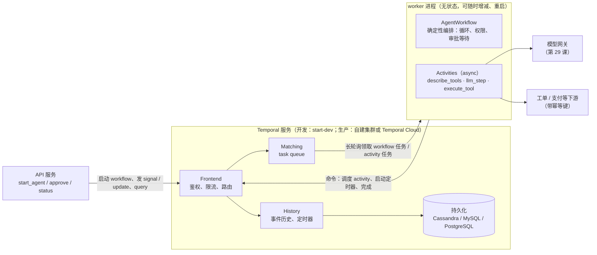
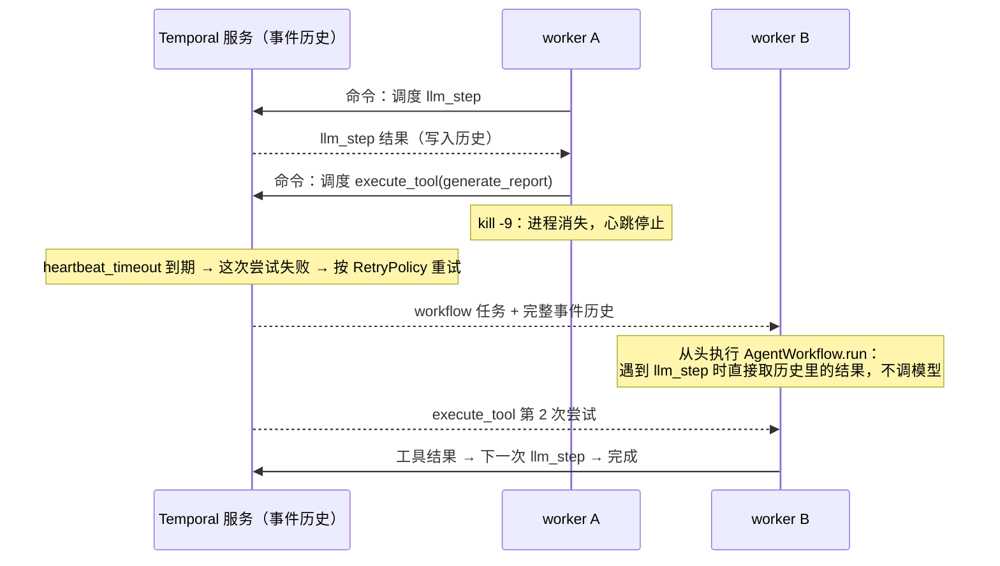
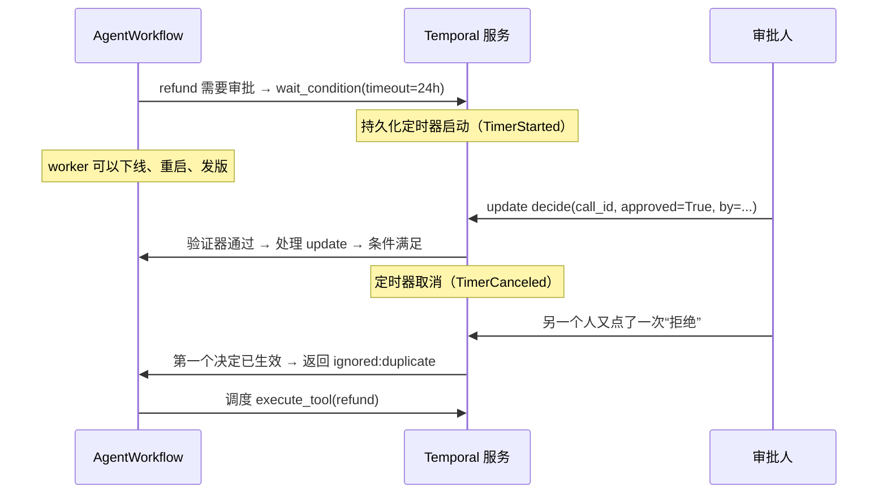
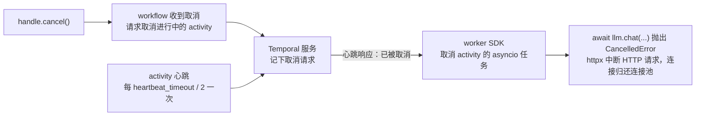

[中文](README.md) | [English](README.en.md)

# 第 27 课：持久化工作流 —— 用 Temporal 运行 Agent

> 🕐 建议用时：30 分钟 ｜ 🎯 学完你能：判断什么时候该用持久化执行引擎、什么时候自己写检查点就够了；把 Agent 循环拆成 Workflow + Activity，正确设置超时、重试、心跳和审批定时器，并避开确定性约束的几个真实大坑 ｜ 📦 对应源码：[`agentkit/contrib/temporal.py`](../../agentkit/contrib/temporal.py)、[`scenario.py`](scenario.py)、[`demo.py`](demo.py)
>
> 📖 必读：[Of course you can build dynamic AI agents with Temporal](https://temporal.io/blog/of-course-you-can-build-dynamic-ai-agents-with-temporal)（Mason Egger、Steve Androulakis, 2025）—— 专门回答"Workflow 要求确定性，那 LLM 这种不确定的东西怎么放进去"这个最常见的误解：确定性只约束编排代码，模型调用和工具调用都放在 Activity 里，模型依然"握着方向盘"。读完再看本课的 `AgentWorkflow`，结构几乎一一对应。

## 0. 一句话讲清楚

**教学版 agentkit 的局限**：`Checkpointer` 只负责"把状态存下来"。进程死了谁来发现、谁来调用 `resume`、两个进程同时 `resume` 同一个运行怎么办、审批等了三天谁来计时、发版时正在跑的运行怎么办 —— 这些都要你自己写。第 13 课用租约队列补了一部分，第 26 课把检查点换成了 Postgres，但"谁来驱动恢复"始终是你的代码。

**持久化执行（durable execution）换了一个思路：把"执行到哪一步"交给一个专门的服务记账。你的代码随时可以崩，换一台机器把账本从头"重放"一遍，就回到了崩溃前的那一行。**

打个比方。项目经理（Workflow）只做决定、不干活；具体的活儿派给外包（Activity），外包会失败、会失联，可以重派；每派一次活、每收到一次结果，都记进流水账（事件历史，Event History）。项目经理中途换人了，新经理把流水账从头读一遍就知道进行到哪一步 —— 读账的时候不能"凭感觉"做和上次不同的决定，这就是**确定性约束**。

| agentkit（第 02、08 课） | Temporal（本课） |
|---|---|
| `Agent._loop` 主循环 | `AgentWorkflow.run`：确定性代码，只负责编排 |
| `llm.chat(...)` | `llm_step` Activity：可重试、有超时、有心跳 |
| `registry.execute(...)` | `execute_tool` Activity：按工具风险设置重试 |
| 每一步 `checkpointer.save` | 事件历史：服务端自动记录每个 Activity 的输入和结果 |
| `PauseRun` → 落盘 → `agent.approve()` → `resume` | `workflow.wait_condition(..., timeout=...)` + signal / update |
| `ResilientLLM` 的重试 | Activity 的 `RetryPolicy` |
| 幂等键 `run_id:call_id` | `workflow_id:call_id`（跨 continue-as-new 不变） |

## 1. 教学实现为什么不够

### 1.1 "存下来"和"跑下去"是两件事

| 能力 | agentkit 检查点（第 08 课） | + Postgres / 队列（第 13、26 课） | Temporal |
|---|---|---|---|
| 状态存哪儿 | 本机文件 / 内存 | Postgres，多机共享 | Temporal 服务的持久化层（Cassandra / MySQL / PostgreSQL） |
| 进程死了谁发现 | 没人 | 租约过期 + 心跳（自己写） | Activity 的 start-to-close / heartbeat 超时，服务端判定 |
| 谁触发恢复 | 人工调用 `resume` | 另一个 worker 领到过期任务 | 服务端把 workflow 任务派给任何一个活着的 worker |
| 两个进程同时恢复 | 会互相覆盖 | fencing token / CAS（自己写） | 同一个 workflow 同一时刻只有一个 workflow 任务在执行 |
| 审批超时计时 | 没有 | 定时扫描器（自己写） | 持久化定时器（`wait_condition` 的 `timeout`） |
| 重试 | `ResilientLLM`（进程内，进程一死就丢） | 队列的 attempts | `RetryPolicy`，由服务端调度，worker 死了也照样重试 |
| 看某个运行卡在哪 | 读 JSON 文件 | 查表 | Web UI / `temporal workflow describe` / 可见性查询 |
| 改了代码，正在跑的运行怎么办 | 自己兼容检查点格式 | 同左 | 重放 + `workflow.patched` 版本化（问题 4） |

表格右边那一列不是免费的：你要多运维一套服务（或者买 Temporal Cloud），还要接受一套编程约束。本课就是讲清楚这笔交易。

### 1.2 架构



worker 主动去 task queue 领任务（长轮询），服务端从不主动连 worker —— 所以 worker 可以部署在任何能访问 Temporal 服务的地方，扩缩容就是加减进程。

### 1.3 重放：崩溃之后怎么"回到那一行"



关键在第四个注释：**重放时，已经完成的 Activity 不会再执行，它的结果直接从历史里取**。这就是为什么 workflow 代码必须是确定性的 —— 如果重放时代码走了另一条分支（比如读了当前时间、生成了随机数），它发出的命令就和历史对不上。

### 1.4 术语

| 术语 | 大白话 | 本课代码 |
|---|---|---|
| Workflow | 编排逻辑，崩了能从断点接着跑；必须确定性 | `AgentWorkflow` |
| Activity | 真正干活（调模型、调工具）的函数，可以失败、会被重试 | `llm_step`、`execute_tool`、`describe_tools` |
| 事件历史 Event History | 服务端记录的流水账：每个命令、每个结果、每个 signal | `summarize_history()` |
| 重放 Replay | 用事件历史重新执行 workflow 代码，恢复内存状态 | 场景 4、场景 7 |
| Task Queue | worker 领任务的队列，按名字区分 | `make_worker(client, task_queue, ...)` |
| Signal / Update / Query | 发消息给正在跑的 workflow：signal 单向；update 会返回结果；query 只读 | `approve` / `decide` / `status` |
| 持久化定时器 Timer | 写在服务端的定时器，worker 全挂了也照样到点触发 | 审批超时 |
| 心跳 Heartbeat | Activity 定期报平安；取消请求也只能通过心跳送达 | `_heartbeating()` |
| Continue-As-New | 历史太长时，带着状态"重开"一个新的 run | `_continue_as_new()` |
| Patching | 改 workflow 代码时给新旧执行各留一条路 | `workflow.patched(...)` |

## 2. 企业问题卡片

### 问题 1：Agent 要跑几十分钟甚至几天，进程崩了怎么接着跑？

**场景**：一个"供应商对账 Agent"每次要调用 30 多次模型、访问 5 个内部系统，平均 40 分钟；其中退款超过 5000 元的要财务审批，审批平均 6 小时。服务每天发布 2 次，每次发布时有十几个运行在半路上。

**为什么难**：第 08 课的检查点能保证"状态不丢"，但恢复的触发、恢复时的互斥、审批的计时、发布时代码版本的兼容，都得自己一块一块补。补到最后，你会发现自己在写一个简陋的工作流引擎。

| 方案 | 怎么做 | 学习成本 | 运维成本 | 表达能力 | 厂商锁定 | 适用场景 |
|---|---|---|---|---|---|---|
| A. 自研检查点（第 02 / 08 / 26 课） | 每一步把 `RunState` 存进 Postgres；租约队列 + 心跳触发恢复；定时扫描处理审批超时 | 低：就是你已经会的代码 | 低：只有 Postgres | 中：什么都能写，但定时器、取消、版本兼容都得自己做 | 无 | 分钟级任务、团队小、恢复逻辑简单 |
| B. Temporal（本课） | 编排写成 Workflow，IO 写成 Activity；服务端记录事件历史，崩溃后重放 | 高：确定性约束、重放、版本化都是新概念 | 高（自建：数据库 + 多个服务）/ 中（Temporal Cloud） | 高：任意代码逻辑、持久化定时器、signal/update/query、子 workflow | 低：开源（MIT），可自建也可托管 | 小时到天级、多步骤、有审批和补偿、失败代价高 |
| C. AWS Step Functions | 用 Amazon States Language（JSON）或可视化设计器描述状态机；Standard 类型最长 1 年、"恰好一次"执行，审批用 `.waitForTaskToken` 回调 | 中：DSL 要学，但概念少 | 低：全托管 | 中：分支、并行、Map 都有，复杂逻辑写成 JSON 很痛苦 | 高：只在 AWS | 已经在 AWS、流程相对固定、要跟大量 AWS 服务集成 |
| D. LangGraph checkpointer | 图的每个超步（super-step）存一次检查点；`interrupt()` 暂停、`Command(resume=...)` 恢复；有 `exit` / `async` / `sync` 三种持久化模式 | 中：要学图模型 | 低到中：检查点存进你的 Postgres，但恢复的触发仍然是你的事 | 中：擅长 Agent 图；`interrupt` 没有内置超时参数，恢复时被中断的节点**从头重跑** | 低：开源 | 已经用 LangGraph 写 Agent，需要人工介入和断点续跑 |
| E. 云厂商 durable functions | Azure Durable Functions（Azure Functions 扩展，C#/JS/TS/Python/PowerShell/Java）；AWS Lambda durable functions（2025 年 12 月发布，最长 1 年，`step` / `wait` / 回调）；Cloudflare Workflows（`step.do` / `step.sleep` / `step.waitForEvent`） | 中：同样是"检查点 + 重放"模型，同样要求确定性 | 低：全托管、按用量计费 | 中到高：普通代码写流程 | 高：绑定各自的函数平台 | 已经全面使用某家 serverless 平台 |

**怎么选**：先问"我的任务最长跑多久、要不要等人、失败一次的代价多大"。分钟级、没有审批的，A 足够（再往下看问题 5）；小时到天级、有审批和超时、涉及钱的，选 B 或 E；已经深度绑定某朵云并且流程相对固定，C 或对应的 E 运维最省事；已经用 LangGraph 写 Agent，D 能解决"暂停—恢复"，但"谁来发现进程死了"还得自己补。**B 和 E 的编程模型是一样的（检查点 + 重放 + 确定性），学会一个，换另一个主要是换 API。**

**本课实现**：方案 B。[`agentkit/contrib/temporal.py`](../../agentkit/contrib/temporal.py) 把 agentkit 的 Agent 循环原样搬进 `AgentWorkflow`：Hook 接口不变，模型和工具还是同一个 `LLM` / `ToolRegistry`，只是执行的"外壳"换成了 Temporal。Demo 场景 4 真的 `kill -9` 了一个 worker 进程：新 worker 接手，已完成的 activity（离线模式下是 4 个）一个都没有重跑，模型只多调了 1 次（最后的总结）。

### 问题 2：审批要等几小时到几天

**场景**：退款 Agent 发起的 dangerous 操作要主管审批。主管平均 3 小时后才处理，有时要等到第二天；24 小时没人批就要自动拒绝并通知用户。高峰期同时挂着 900 个待审批的运行。

**为什么难**：等待时间不可预测；等待期间服务会发布、会扩缩容；"超时自动拒绝"需要一个在所有进程都重启过之后仍然准时触发的定时器；审批人可能点两次、两个审批人可能同时点、审批请求可能比 workflow 走到等待点还早到达。

| 方案 | 怎么做 | 优点 | 缺点 | 适用场景 |
|---|---|---|---|---|
| A. 阻塞等待 | 线程里轮询审批结果或等回调 | 最简单 | 900 个运行占 900 个线程；发布一次全部丢失 | 命令行工具、秒级确认 |
| B. 落盘后轮询（第 08 课） | `PauseRun` → 状态存为 paused → 审批后 `agent.approve()` 从检查点恢复；另写一个扫描器，定期把超时的运行按拒绝处理 | 等待期间零资源；不需要新基础设施 | 超时扫描器、重复审批、审批和恢复之间的并发都要自己处理 | 大多数分钟到小时级的场景 |
| C. Workflow signal + 持久化定时器（本课） | `wait_condition(lambda: 有决定, timeout=24h)`；审批用 signal（单向）或 update（带返回值）送进来；超时由服务端定时器触发 | 等待期间不占 worker；定时器在服务端，worker 全挂了也会准时触发；审批记录在事件历史里 | 需要 Temporal；signal 的乱序和重复仍然要在代码里处理 | 天级等待、多级审批、需要可靠超时 |

signal 还是 update？**signal 是"发出去就算"**：发送方不知道 workflow 有没有接受；**update 会等 workflow 处理完并返回结果**，还可以挂一个验证器，在写进历史之前就拒绝非法请求（本课的验证器拒绝不存在的 `call_id`）。审批界面需要告诉审批人"你这一票算不算数"，用 update 更合适；从消息队列转发过来的审批事件，用 signal 更简单。



**怎么选**：审批要跨发布、要可靠超时、要可审计 → C；分钟级、服务不怎么发布 → B 足够。无论哪种，都要处理这四件事：**① 超时按拒绝处理（fail closed）；② 第一个决定生效，重复的只记录不生效；③ 超时之后才到的批准不能"复活"一个已经拒绝的操作；④ 决定可能先于等待到达，要先存起来**。第 ④ 点最容易漏：signal 在 workflow 任务开始时统一投递，比 workflow 代码走到 `wait_condition` 还早，完全可能。

**本课实现**：`AgentWorkflow._decide` 就是这台状态机（练习 (b) 是它的纯函数版本）。agentkit 的 `PermissionPolicy` 原封不动地在 workflow 里运行：它抛出 `PauseRun`，`AgentWorkflow` 接住后改成 `wait_condition` 等待，而不是落盘退出。Demo 场景 3 演示批准 + 重复点击，场景 5 演示 3 秒无人审批 → 自动拒绝，以及 workflow 结束后迟到的审批被服务端直接拒收。

### 问题 3：重试放在哪一层？

**场景**：模型网关偶尔返回 429，库存服务偶尔断连接，支付接口偶尔超时。三个团队各自加了重试：openai SDK 默认重试 2 次、`ResilientLLM` 重试 3 次、Temporal Activity 默认**无限次**重试（`maximum_attempts` 默认 0 = 不限）。一次故障期间，一个模型调用被重复发了十几次，还有一笔退款被执行了两次。

**为什么难**：每一层都觉得"多重试一下更可靠"，叠起来就是乘法（3 × 5 = 15 次）。更要命的是 Activity 是"**至少执行一次**"的：worker 在"工具已经执行完"和"结果报告给服务端"之间崩溃，服务端只能等超时之后再派一次 —— 这和第 13 课"租约过期后任务被别人重新领取"**是同一个问题**。Temporal 文档说得很直白：带重试策略的 Activity 保证"被观察到完成"恰好一次，但**可能被执行多次**，所以 Activity 应该幂等。

| 方案 | 怎么做 | 优点 | 缺点 | 适用场景 |
|---|---|---|---|---|
| A. 客户端重试 | SDK 的 `max_retries`、`ResilientLLM` / `AsyncResilientLLM` | 延迟最低，不需要额外基础设施 | 进程一死重试就没了；外层看不见（次数、原因都不在历史里） | 没有编排引擎时的默认做法 |
| B. Activity RetryPolicy | 失败的 Activity 由服务端按指数退避重新调度；不可重试的错误标 `non_retryable` 或列进 `non_retryable_error_types` | worker 死了也会重试；每次尝试和失败原因都在事件历史里 | 最小粒度是整个 Activity；默认无限重试，必须自己设上限 | 用了 Temporal 之后的默认做法 |
| C. 幂等键 | 下游在同一个事务里"执行 + 记录 key"，同一个 key 第二次来直接返回上次的结果 | 真正让重复执行变得无害 | 需要下游支持 | 所有有副作用的写操作，**不管重试放在哪一层都需要** |

**怎么选**：**重试只放一层**。用了 Temporal，就把客户端重试关掉（`OpenAICompatLLM` / `AsyncOpenAICompatLLM` 本来就是 `max_retries=0`），由 RetryPolicy 统一负责；然后**所有写操作都要配 C**，因为 B 只保证"至少一次"。具体到工具：

| 工具 | `maximum_attempts` | 理由 |
|---|---|---|
| read | 5 | 天然幂等，放心重试 |
| write / dangerous，下游支持幂等键 | 3 | 重复执行被下游去重 |
| write / dangerous，不支持幂等 | 1 | 不自动重试：宁可把"结果未知"告诉模型和人，也不重复扣款 |

模型调用：429、408、409、5xx、连接错误可以重试，400、401、403、额度用完不要重试。有意思的是，Temporal 官方的 OpenAI Agents SDK 集成（`temporalio.contrib.openai_agents`）用的是**完全相同**的分类（408/409/429/5xx 可重试），也同样关掉了 SDK 自带的重试 —— 和 agentkit 第 08 课的 `LLMError.retryable` 一致。服务端返回的 `Retry-After` 通过 `ApplicationError(next_retry_delay=...)` 传给 Temporal，优先于退避计算。

本课实测的三个细节：

- **`AsyncResilientLLM` 不要直接套在 Temporal 里**：它在所有尝试都失败后统一抛出 `retryable=False` 的 `LLMError`，会让 `llm_step` 把一个本可重试的 429 标成 `non_retryable`，RetryPolicy 直接放弃。要用它的并发上限，就把它的 `max_attempts` 设成 1 并注意这个行为，或者直接用 `AsyncOpenAICompatLLM(max_connections=...)` 限制并发（本课的做法）。
- **失败的尝试也花钱，但不在用量里**：`AgentWorkflow` 只累计**成功**那次 `llm_step` 返回的 token。一次超时后重试成功的调用，实际花了两次钱。成本对账以网关账单为准（第 29 课）。
- **本机开发服务器上，小于 1 秒的重试间隔被抬到了约 1 秒**：`initial_interval` 设 0.1 秒和 0.5 秒，两次重试都耗时约 2 秒；设 1.5 秒时约 4.5 秒（1.5 + 3.0），符合退避公式。所以别指望靠亚秒级重试"快速恢复"。

**本课实现**：`retry_policy_for(risk, idempotent)`（练习 (a)）；`execute_tool` 把 registry 返回的 `exception` / `timeout` 类错误转成 `ApplicationError` 交给 RetryPolicy，参数错、业务错误原样返回给模型；重试用尽后，workflow 把失败变成一条"结果未知，请人工核实"的观察。`make_worker(idempotency_store=...)` 传入跨 worker 共享的幂等存储后，写工具才按"幂等"对待；在 async activity 里要用第 26 课的 `AsyncRedisIdempotencyStore`（同步版每次 get / put 都是一次阻塞的网络往返，会卡住事件循环），测试 `test_write_tool_retry_with_async_redis_idempotency_store` 验证了幂等键就是 `workflow_id:call_id`。Demo 场景 2：库存服务第一次断连接，第 2 次尝试成功，模型只看到成功的结果。

### 问题 4：确定性约束的坑

**场景**：团队把 Agent 迁到 Temporal 的第一周，遇到了三件怪事：① worker 一启动就报 `Failed validating workflow`；② 一个运行在审批期间遇到发版，恢复后卡死在 `WorkflowTaskFailed`，UI 里写着 `Nondeterminism error`；③ 一个跑了 80 步的研究型 Agent 突然失败，原因是事件历史超过了上限。

**为什么难**：重放要求"同样的历史 → 同样的命令序列"。任何让代码在两次执行之间走不同分支的东西都是隐患，而其中很多根本不像"随机"。

**(a) workflow 里不能直接调模型、读时钟、生成随机数**

| 你想做的 | 在 workflow 里要写成 |
|---|---|
| 调模型、调工具、查数据库、发 HTTP | `workflow.execute_activity(...)` |
| `time.time()` / `datetime.now()` | `workflow.time()` / `workflow.now()`（重放时返回第一次执行时的时间） |
| `random.random()` / `uuid.uuid4()` | `workflow.random()` / `workflow.uuid4()`（种子记录在历史里） |
| `time.sleep()` / `asyncio.sleep()` | `workflow.sleep()` / `asyncio.sleep()`（在 workflow 里会变成持久化定时器） |
| `print` / `logging` | `workflow.logger`（重放时自动静音） |

Python SDK 用**沙箱**帮你兜底：每次运行 workflow 都在沙箱里重新导入定义它的模块，并把 `time.time`、`random`、`datetime.now`、`uuid4`、套接字等调用替换成"一调用就报错"的代理。本课接入时踩到了三个**反直觉**的坑（都已实测）：

1. **agentkit 在沙箱里导入就失败**：`agentkit/config.py` 在模块顶层调用了 `Path(__file__).resolve()`，沙箱把 `Path.resolve` 列为受限调用，worker 启动时直接报 `__call__ on pathlib.Path.resolve restricted`。解决：把 agentkit 核心模块设成 passthrough（沙箱直接复用外面已经导入的模块）。`sandbox_runner()` 做的就是这件事 —— 而且不能偷懒写 `with_passthrough_modules("agentkit")`：passthrough 按前缀匹配，那样 `agentkit.contrib.temporal` 本身也被放行，workflow 代码里的 `time.time()` 就没人拦了。
2. **passthrough 的模块不受沙箱保护**：在 workflow 里写 `RunState()`，它的默认值工厂调用了 `uuid4()` 和 `time.time()`，沙箱**不会**报错 —— 因为 `agentkit.state` 是 passthrough 进来的。每次重放都会得到不同的 `run_id`。`AgentWorkflow` 因此显式传入 `run_id=workflow.info().workflow_id`、`started_at=workflow.time()`。同理，`BudgetHook(max_seconds=...)`（用了 `time.time()`）和 `ToolOutputGuard`（用了 `uuid4()`）都不能放进 workflow。
3. **重放只比对命令，不比对参数**：把 system prompt 改掉、把 `llm_timeout_s` 改掉，再用 `Replayer` 重放旧历史 —— **通过了**。Temporal 检查的是命令的种类和顺序（调度了哪个 activity、启动了几个定时器），不检查你传给 activity 的参数。所以"内存里的状态和第一次执行时不一样"这种错误可能悄无声息，只在之后某个分支判断上才暴露。

沙箱之外，还有一类它根本管不着的非确定性：对 `set` 做迭代（字符串的哈希在不同进程里不同，`PYTHONHASHSEED`）、依赖字典以外的全局可变状态、读环境变量。练习 (c) 让你写一个 `ast` 静态检查器，它能发现常见的调用，但同样发现不了这些 —— **最后一道防线是重放测试**：把生产里抽样的事件历史拿来跑 `Replayer`，放进 CI。

**(b) 改了 workflow 代码，旧的执行在重放时会失败**

正在等审批的运行，历史里记着"调度了 describe_tools → llm_step → execute_tool → 启动定时器"。你发了一版新代码，在开头加了一句 `await workflow.sleep(1)`（限流）。旧运行在新 worker 上重放时，代码第一个命令是"启动定时器"，历史里第一个命令却是"调度 activity"—— `NondeterminismError`。Demo 场景 7 真实复现了这个错误。

| 方案 | 怎么做 | 优点 | 缺点 |
|---|---|---|---|
| A. 等旧运行都结束再发版 | 停止接新任务，排空后部署 | 不用改代码 | 天级 workflow 根本等不起 |
| B. Patching | `if workflow.patched("id"): 新逻辑 else: 旧逻辑`；所有旧运行结束后改成 `workflow.deprecate_patch("id")`，再之后删掉 | 细粒度，官方推荐的基本手段 | 代码里会积累分支；需要记得清理 |
| C. Worker Versioning | 给 worker 打部署版本；Pinned 的 workflow 一直在同一个版本的 worker 上跑完，Auto-Upgrade 的会迁移到新版本（仍需 patching） | 不用在代码里写分支（Pinned） | 要同时保留多版本 worker 在线；部署流程更复杂 |

**(c) 事件历史太大，要 continue-as-new**

Temporal 对单个 workflow 执行的事件历史有硬上限：**51,200 个事件或 50 MB**，超过 10,240 个事件或 10 MB 时开始告警；单个 payload 默认上限 **2 MB**。服务端默认在 **4,096 个事件或 4 MB** 时"建议" continue-as-new（Temporal Server v1.32 的动态配置 `limit.historyCount.suggestContinueAsNew` / `limit.historySize.suggestContinueAsNew`）。

对 Agent 来说，大小比事件数先撞线，而且增长是**平方级**的：每一次 `llm_step` 的输入都带着完整的对话历史，历史里就存了 N 份越来越长的对话。本机实测（每个工具返回约 6 KB 文本）：

| 步数 | 事件数 | 事件历史大小 | 最终对话本身的大小 |
|---|---|---|---|
| 6 | 77 | 254 KiB | 31 KiB |
| 11 | 137 | 803 KiB | 61 KiB |
| 21 | 257 | 2,797 KiB | 122 KiB |
| 31 | — | 服务端建议 → continue-as-new 1 次 | 183 KiB |
| 81 | — | continue-as-new 10 次 | 488 KiB |

注意最后一行：对话越长，每个新 run 的第一次 `llm_step` 就越大，continue-as-new 越来越频繁；对话本身逼近 2 MB 时，单个 payload 就会超限，continue-as-new 也救不了。三件事要一起做：**① continue-as-new 控制历史长度（`AgentWorkflow` 在服务端建议时自动做，也可以用 `continue_as_new_after_events` 设更小的阈值）；② 上下文压缩控制对话长度（第 04 课，压缩的模型调用放在 activity 里）；③ 大对象走外部存储，历史里只放引用（claim check 模式；Python SDK 在 2026 年 5 月以 Public Preview 提供了内置的 External Storage）**。另外，本机开发服务器上每次 continue-as-new 会多出约 1 秒延迟，实测来自动态配置 `history.workflowIdReuseMinimalInterval` 的默认值 1 秒（设为 0 后消失）。

**怎么选**：(a) 靠"编排和 IO 分离"的代码结构 + 沙箱 + 重放测试；(b) 默认用 patching，发布频繁且 workflow 很短时考虑 Worker Versioning 的 Pinned；(c) 对 Agent 必须设计 continue-as-new，并把上下文压缩当成必需品而不是优化。

**本课实现**：`AgentWorkflow` 里没有任何直接的时间、随机数和 IO（练习 (c) 的最后一个测试用你的检查器审它）；`summarize_history()` 帮你读事件历史；`tests/contrib/test_temporal.py` 里有重放测试（原版通过、直接改代码失败、patching 后通过）。

### 问题 5：什么时候**不需要** Temporal？

**场景**：一个 5 人小团队做内部知识库问答 Agent：P99 20 秒，只读工具，没有审批，每周发布一次。有人提议"上 Temporal，一劳永逸"。

**为什么难**：持久化执行的好处在任务长、要等人、失败代价高时才显现；它的成本（一套要运维的服务、确定性约束、每一步都多几次网络往返）却是从第一天就开始付的。本机实测：20 个 workflow、模型零延迟，光 Temporal 本身的开销就约 1 秒（每个 workflow 约 50 毫秒）。

| 方案 | 怎么做 | 适用场景 |
|---|---|---|
| A. 同步 Agent + 检查点（第 08 课） | 一个进程、一个请求，失败了用户重试 | 秒级任务、内部工具、原型 |
| B. AsyncAgent + Postgres 检查点（[第 26 课](../26_state_and_queues/README.md)、[第 30 课](../30_async_runtime/README.md)） | 一个进程用 asyncio 并发推进几百个会话；每步检查点写 Postgres；租约队列负责崩溃接管 | 分钟级任务、高并发对话、团队不想多运维一套服务 |
| C. 队列 + 无状态 worker（第 13、26 课） | 任务进队列，worker 领取、心跳、提交，失败进死信 | 批处理、异步任务，不需要复杂的中途等待 |
| D. Temporal（本课） | Workflow + Activity，服务端记账 | 小时到天级、有审批 / 定时 / 补偿、跨多个系统、失败代价高 |

**Temporal 持久化工作流 vs AsyncAgent + Postgres 检查点**，两者都能"一个进程并发推进很多运行、崩了能接着跑"，区别在于**谁来保证**：

| | AsyncAgent + Postgres 检查点 | Temporal |
|---|---|---|
| 恢复的粒度 | 检查点：每个工具结果之后存一次 | 事件历史：每个 activity 的结果 |
| 谁发现崩溃、谁接管 | 你写的租约 + 心跳 + 扫描 | 服务端的超时 + 任务派发 |
| 定时器（审批超时） | 你写的扫描器 | 持久化定时器 |
| 代码约束 | 几乎没有 | 确定性、版本化 |
| 工具执行语义 | `AsyncToolExecutor` | **同一个** `AsyncToolExecutor`（本课的 `execute_tool` 直接用它） |
| 额外基础设施 | 只有 Postgres | Temporal 服务（+ 它自己的数据库） |

**怎么选**：满足下面任意两条再考虑 Temporal：单次任务经常超过 30 分钟；要等人（审批、补充材料）；有定时动作（超时、提醒、定期重试）；一次失败要人工善后（涉及钱或对外承诺）；有专人或平台团队运维它（或者预算买 Temporal Cloud）。都不满足，就用 B 或 C —— 它们也是本课程第四部分的一等公民。

**本课实现**：`execute_tool` 用 `agentkit.aio.AsyncToolExecutor` 执行工具 —— 和 `AsyncAgent` 是**同一套执行语义**（async 工具真正可取消、同步工具进有上限的线程池、`isolated(tool)` 在子进程里执行并在超时时 kill）。从 B 迁移到 D，工具代码一行不用改。

### 问题 6：运维 —— Temporal 本身谁来管？

**场景**：平台团队决定引入 Temporal，接下来要回答：自建还是买云服务？要几台机器、用什么数据库？worker 怎么扩？出了问题去哪儿看？

| 方案 | 怎么做 | 优点 | 缺点 | 适用场景 |
|---|---|---|---|---|
| A. Temporal Cloud | 托管的 Temporal 服务；worker 仍然跑在你自己的机器上 | 不用运维数据库和服务；按用量（Actions + 存储）计费 | 事件历史存在第三方（可以用 Payload Codec 端到端加密）；按量计费要做成本预估 | 大多数团队的起点 |
| B. 自建集群 | 部署 Temporal Server（Frontend / History / Matching / Worker 四个服务）+ 持久化数据库（Cassandra、MySQL 或 PostgreSQL）+ 可见性存储（v1.20 起可以直接用 MySQL 8.0.17+ / PostgreSQL 12+，也可以用 Elasticsearch / OpenSearch） | 数据完全在自己手里；没有按量费用 | 要运维多个服务和数据库；**History 分片数在建库时确定、之后不能改**，要提前规划 | 数据不能出域、规模大到托管费用不划算、有平台团队 |
| C. 本机开发服务器 | `temporal server start-dev`（Web UI 默认在 http://localhost:8233，默认数据只在内存里，`--db-filename` 可以落盘）或 SDK 的 `WorkflowEnvironment.start_local()` | 一条命令、不需要 Docker；本课所有 demo 和测试都跑在它上面 | 单进程、SQLite、无高可用，**不是生产集群** | 开发、测试、CI |

几个运维要点：

- **worker 水平扩展**：worker 无状态，同一个 task queue 上加进程就是扩容。每个 worker 有两个并发旋钮（SDK 默认各 100 个槽位）：`max_concurrent_activities`（同时执行多少个 activity —— Agent 的时间几乎都花在等模型上，所以它通常要对齐模型网关的并发配额）和 `max_concurrent_workflow_tasks`（同时推进多少个 workflow 任务 —— 每个都很短，但 worker 刚启动、要为大量 workflow 重放历史时会成为瓶颈）。Demo 场景 6 实测：同一批 20 个 workflow，`max_concurrent_activities=4` 时模型调用的峰值并发正好是 4，耗时从 1.15 秒变成 2.18 秒。
- **可见性查询与 Web UI**：Web UI 能按 workflow 类型、状态、时间筛选，点进去就是完整的事件历史（每次 activity 的输入、输出、尝试次数、失败原因）。按业务字段（租户、订单号）查找需要自定义 Search Attributes。
- **事件历史就是数据**：prompt、工具参数、工具结果（包括 `ToolResult.detail` 里的内部错误原文）都原样存在历史里，能看 Web UI 的人都能看到。敏感数据要用 Payload Codec 在 worker 和客户端加密（服务端只看到密文），再配一个 Codec Server 给 Web UI 解密；另外按合规要求设置 Namespace 的保留期（Temporal Cloud 可设 1–90 天）。
- **workflow 代码的 bug 不会让 workflow 失败**：workflow 里抛出普通异常，默认只是让这个 workflow 任务失败并不断重试（UI 里显示 `WorkflowTaskFailed`），workflow 本身挂起。修好代码重新部署，它会自动继续 —— 这是特性，但要给 `WorkflowTaskFailed` 配告警，否则会有运行无声无息地卡着。另外，一次 workflow 激活超过 2 秒没有让出，Python SDK 会判定为死锁。

**本课实现**：所有 demo 和测试都用 `WorkflowEnvironment.start_local()`（真实的 Temporal CLI 开发服务器，本机版本 CLI 1.9.1 / Server 1.32.0）。**本机没有 Docker，自建集群和 Temporal Cloud 的配置没有实际运行验证**。

## 3. 本课适配器怎么接

### 3.1 四个函数

```python
from agentkit.aio import default_async_llm
from agentkit.contrib.temporal import agent_status, approve, make_worker, start_agent

# worker 进程：承载 AgentWorkflow 和三个 activity。llm_factory 在 worker 启动时调用一次。
worker = make_worker(client, "support-agents", lambda: default_async_llm(max_connections=20), tools)
await worker.run()

# API 进程：启动一次运行（业务键做 workflow_id：同一张工单重复提交只会有一个 Agent 在跑）
handle = await start_agent(client, "订单 A1001 申请退款", {"tenant_id": "acme", "user_id": "u1", "roles": ["support"]},
                           workflow_id="refund-A1001", task_queue="support-agents", approval_timeout_s=24 * 3600)
st = await agent_status(client, "refund-A1001")          # query：步数、等待中的审批、调用过的工具、用量
await approve(client, "refund-A1001", st.pending_approvals[0]["call_id"], True, by="zhang.manager")  # signal
result = await handle.result()                            # AgentResult
```

### 3.2 Workflow：只编排，不做 IO

`AgentWorkflow.run` 和 `Agent._loop` 几乎逐行对应（精简后）：

```python
while state.step < inp.max_steps:
    if self._should_continue_as_new():            # 服务端建议，或超过 continue_as_new_after_events
        await self._continue_as_new()             # 带着 RunState 开一个新 run
    state.step += 1
    response = await workflow.execute_activity_method(AgentActivities.llm_step, LLMStepInput(state.messages, schemas),
                                                      start_to_close_timeout=..., heartbeat_timeout=..., retry_policy=...)
    state.messages.append(response.to_message())
    if not response.tool_calls:
        ...; return                               # 最终答案（on_final 钩子在这里）
    for call in unanswered_calls(state):
        # before_tool 钩子：PermissionPolicy 抛 PauseRun → 这里改成 wait_condition 等审批
        result = await self._run_one_tool(call)   # → execute_tool activity，按风险设置 RetryPolicy
        state.messages.append(tool_message(call.id, result.content))
```

workflow 需要知道有哪些工具、各自什么风险，但 `ToolRegistry` 属于 worker 进程（不同 worker 可能部署了不同版本）。所以第一个 activity 是 `describe_tools`：结果写进历史，之后每次重放看到的都是同一份。

### 3.3 Activities：全部是 async



- **为什么是 async**：Agent 的时间几乎都花在等模型上。async activity 等待时不占线程，一个 worker 进程就能同时推进很多 workflow。Demo 场景 6：同一个 worker 上 20 个 workflow（每个 2 次模型调用，模型延迟 0.15 秒），本机一次运行串行 7.9 秒、并发 1.15 秒，模型调用峰值并发 20（几次运行之间随机器负载波动：串行 7.9–9.5 秒，并发 1.15–1.6 秒）。
- **取消只能通过心跳送达**：服务端不会主动推送取消，它在心跳的响应里告诉 worker。所以 `llm_step` 和 `execute_tool` 在运行期间每 `heartbeat_timeout / 2` 发一次心跳；`heartbeat_timeout`（默认 10 秒）同时决定了"worker 死了多久能被发现"—— 否则要等满 `start_to_close_timeout`（模型调用是 120 秒）。取消送达的延迟约等于心跳间隔：本机实测一个要 30 秒的模型调用，`heartbeat_timeout` 为 1 / 2 / 10 秒时，`handle.cancel()` 之后分别 0.19 / 0.7 / 4.7 秒被中断（测试 `test_cancel_reaches_the_inflight_llm_call`）。取消要一路传到 HTTP 请求，前提是**模型客户端本身是异步的**；同步客户端放在线程里，取消只能"不再等它"，请求会在后台跑完、照样计费。
- **async activity 里绝不能阻塞**：async activity 运行在 worker 的事件循环上，一个 `requests.get` / `time.sleep` / 同步数据库驱动会卡住这个 worker 上**所有** activity、心跳和 workflow 任务的收发。Demo 场景 6 的最后一行：模型客户端在 async 里用 `time.sleep` 模拟阻塞 IO，20 个 workflow 耗时 7.05 秒，峰值并发 1 —— 和串行一样。本课还在真实模式下踩到了一个隐蔽的版本：最初模型客户端是在第一个 `llm_step` 里懒加载的，创建客户端要导入 openai / httpx（本机约 0.6 秒，机器忙时超过 2 秒），这段同步代码卡住了事件循环，`heartbeat_timeout=2` 秒的 `llm_step` 被判心跳超时并重试 —— 模型调用可能因此多付一次钱。修复：`make_worker` 在启动时就创建客户端。
- **同步工具怎么办**：`execute_tool` 交给 `AsyncToolExecutor`：同步工具进有上限的线程池（不阻塞事件循环），async 工具直接 `await`。Temporal 自己也支持同步 activity，但要求 worker 配置 `activity_executor`（官方推荐 `ThreadPoolExecutor`）；Temporal 文档的默认建议甚至是"除非确定不会阻塞事件循环，否则 activity 写成同步的"。本课选择 async，是因为模型客户端和工具执行器都是真正异步的，并发和取消都能做实。

### 3.4 哪些 agentkit Hook 能直接放进 workflow

| Hook | 能放进 workflow 吗 | 原因 / 怎么办 |
|---|---|---|
| `PermissionPolicy`（`approver=None`） | ✅ 默认就在 | 纯逻辑；它抛的 `PauseRun` 被改成 `wait_condition` |
| `InputGuard` / `OutputGuard` | ✅ | 正则匹配与脱敏 |
| `LoopGuard`（第 08 课） | ✅ | 计数存在 `state.metadata`，随 continue-as-new 一起携带 |
| `BudgetHook(max_tokens / max_cost_usd / max_tool_calls)` | ✅ | 纯计数 |
| `BudgetHook(max_seconds)` | ❌ | 用了 `time.time()`，而且沙箱拦不住（passthrough）；改用 workflow 的超时 |
| `ToolOutputGuard` | ❌ → activity | `uuid4()` 生成边界；用 `make_worker(tool_hooks=[ToolOutputGuard()])` 在 `execute_tool` 里执行 |
| `AuditLog` | ❌ → activity | 写文件；同上放进 `tool_hooks` |
| `Tracer` | ❌ | 读时钟；改用 Temporal 的 OpenTelemetry 拦截器（第 28 课） |
| `SummarizingCompactor`、记忆检索 | ❌ → activity | 要调模型 / 查存储 |

在 workflow 里加更多纯逻辑 Hook：写一个子类覆盖 `extra_hooks()`。Temporal 对子类有三个要求（都踩过）：用 `@workflow.defn(name=...)` 起新名字；重新声明 `@workflow.run` 并调用 `super().run(inp)`；`run` 的参数注解要和父类 `@workflow.init` **字面上完全相同**（写 `inp: AgentInput`，写成 `kt.AgentInput` 会被判为"参数不匹配"）。

## 4. 动手：运行 Demo

```bash
python lessons/27_durable_workflows/demo.py --offline          # 离线，约 50 秒
python lessons/27_durable_workflows/demo.py                    # 真实模型（gpt-5.5）
python lessons/27_durable_workflows/demo.py --offline --hold 300   # 跑完保留服务器 5 分钟，去 Web UI 看事件历史
```

启动时会打印 Web UI 地址（`start_local(ui=True)`）。没装可选依赖时打印 `pip install -e ".[prod,prod-local]"` 并正常退出。离线模式输出节选：

```text
场景 4：kill -9 worker 进程 —— 新 worker 从断点继续，已完成的 activity 不重跑
  generate_report 正在 worker-A 上执行（第 2 步，已调用 ['lookup_order', 'generate_report']）→ kill -9 30819
  worker-B 一共只调了 1 次模型：前面几步的模型回复都从事件历史里重放得到，没有重新花钱
    6  ActivityTaskStarted                describe_tools attempt=1 worker=worker-A
   12  ActivityTaskStarted                llm_step attempt=1 worker=worker-A
   18  ActivityTaskStarted                execute_tool attempt=1 worker=worker-A
   24  ActivityTaskStarted                llm_step attempt=1 worker=worker-A
   30  ActivityTaskStarted                execute_tool attempt=2 worker=worker-B | 上次失败：activity Heartbeat timeout
   38  ActivityTaskStarted                llm_step attempt=1 worker=worker-B

场景 6：异步并发 —— 一个 worker 同时推进 20 个 workflow（模型延迟 0.15 秒，离线模型）
  方式                                               总耗时          模型调用峰值并发
  串行：一个接一个                                       7.90s             1
  并发：max_concurrent_activities=100（默认）           1.15s            20
  并发：max_concurrent_activities=4                 2.18s             4
  并发，但模型客户端在 async 里阻塞（time.sleep）               7.05s             1
```

该观察什么：

1. **场景 1**：一个 2 步的 Agent 产生 29 个事件、约 11 KB 历史。数一数 activity 顺序：`describe_tools → llm_step → execute_tool → llm_step`。
2. **场景 2**：`execute_tool attempt=2`，"上次失败"写着第一次的错误。模型的输入里只有成功的结果。
3. **场景 3**：`TimerStarted 86400s`（24 小时审批定时器）→ `WorkflowExecutionUpdateAccepted` → `TimerCanceled`。第二次点击也写进了历史（验证器只拦截不存在的 `call_id`），但返回 `ignored:duplicate`，不生效。
4. **场景 4**：worker-A 是一个真正的子进程，被 `kill -9`。服务端不知道它死了，只知道 2 秒没收到心跳。worker-B 的 LLM 计数是 1。真实模式下模型可能跳过 `lookup_order` 直接生成报表，步骤会少一步，结论相同。
5. **场景 5**：`TimerFired` 之后 refund 没有执行；workflow 结束后再发审批，服务端直接拒收。
6. **场景 6**：见上表。第三行说明 `max_concurrent_activities` 是真实的上限；第四行就是"async 里阻塞"的代价。
7. **场景 7**：直接改代码 → `NondeterminismError`；`workflow.patched` 包起来 → 通过。

## 5. 练习

打开 [`exercise.py`](exercise.py)，三道题都是纯函数，不需要 Temporal 服务器：

- **(a) `retry_policy_for(tool_risk, idempotent) -> dict`**：按问题 3 的表格返回 RetryPolicy 参数。
- **(b) `on_event(state, event) -> ApprovalState`**：审批状态机。要处理决定先于等待到达、重复决定、超时、已拒绝后再批准、别的 call_id 的事件。
- **(c) `is_deterministic_safe(source_code) -> list[str]`**：用 `ast` 找出 workflow 代码里的 `time.time`、`random.*`、`datetime.now`、`uuid4`、HTTP 请求等调用，要展开导入别名，并且只检查 `@workflow.defn` 类。最后一个测试用你的检查器审一遍 `agentkit/contrib/temporal.py`。

```bash
make lesson N=27
# 或：.venv/bin/python -m pytest lessons/27_durable_workflows -v
```

`test_integration.py` 会用 `start_local()` 真实跑一遍"查订单 → 退款 → 审批 → 执行"的完整流程（没装 temporalio 时自动跳过）。contrib 模块更完整的测试在 [`tests/contrib/test_temporal.py`](../../tests/contrib/test_temporal.py)（23 个，包括 worker 更换、取消传播、并发、重放、Redis 幂等存储）。

## 6. 运维要点与常见坑

1. **Activity 默认无限重试**。模型调用和写工具都必须设 `maximum_attempts`，不可重试的错误标 `non_retryable`。
2. **两层重试叠加**。用了 RetryPolicy 就关掉客户端重试；`AsyncResilientLLM` 会把最终错误变成不可重试。
3. **写操作没有幂等键**。Activity 至少执行一次；幂等存储必须跨 worker 共享，进程内的 `IdempotencyStore` 在这里等于没有。
4. **只设 start-to-close，不设心跳**。worker 死了要等满 start-to-close 才重试，取消也送不到。长 activity 一定要心跳。
5. **在 async activity 里阻塞**，包括"第一次调用时才创建客户端"这种隐蔽的阻塞。
6. **在 workflow 里读时钟、随机数、环境变量、迭代 set**。沙箱只管它重新导入的模块；passthrough 的库、以及和 Python 语义相关的非确定性，它都管不着。
7. **不做重放测试就改 workflow 代码**。重放只比对命令，参数变了不报错；命令变了则直接卡住正在跑的运行。
8. **把整个对话塞进每个 activity 的输入却不设计 continue-as-new 和上下文压缩**。Agent 的事件历史是平方级增长的。
9. **以为 query 很便宜**。query 由 worker 回答，workflow 不在 worker 缓存里时要先重放历史；在 Temporal Cloud 上每次 query 还算一个 Action。审批看板轮询几千个 workflow 的 `status()` 会给 worker 带来大量重放；看板用可见性查询（Search Attributes）更合适。
10. **忘了事件历史里有什么**。prompt、工具参数和结果、内部错误原文都在里面；要加密（Payload Codec）、要设保留期、要控制 Web UI 的访问权限。
11. **把开发服务器当生产**。`start-dev` 默认数据只在内存里，重启就没了。

## 7. 如何切换到托管服务

workflow 和 activity 代码**一行不用改**，只换连接方式。Temporal Cloud 用 API key 连接（mTLS 同理）：

```python
from temporalio.client import Client

client = await Client.connect(
    "<namespace>.<account>.tmprl.cloud:7233",
    namespace="<namespace>.<account>",
    api_key=os.environ["TEMPORAL_API_KEY"],
    tls=True,
)
```

或者用 SDK 的环境配置，把地址、namespace、密钥都放进环境变量（`TEMPORAL_ADDRESS`、`TEMPORAL_NAMESPACE`、`TEMPORAL_API_KEY`），代码里只写：

```python
from temporalio.envconfig import ClientConfig

client = await Client.connect(**ClientConfig.load_client_connect_config())
```

切换清单：① worker 和 API 服务用同一个 namespace、同一个 task queue 名；② 如果需要加密，客户端和 worker 配置**同一个** Payload Codec，并部署 Codec Server 给 Web UI 用；③ 按 [Actions](https://docs.temporal.io/cloud/actions) 估算成本：启动 workflow（含 continue-as-new）、每次 activity 调度或重试、到达服务端的心跳、每个定时器、每个 signal、每次 query 和 update 都算 —— Agent 的 activity、心跳和审批定时器都不少，看板轮询 query 也要花钱；④ 设置 namespace 的保留期；⑤ 把 `WorkflowTaskFailed`、activity 失败率、task queue 积压（schedule-to-start 延迟）接进告警（第 28 课）。

## 8. 面试 & 设计评审问题

<details>
<summary>1. Workflow 要求确定性，LLM 输出却是不确定的。Agent 怎么放进 Temporal？</summary>

确定性只约束编排代码：给定同样的事件历史，workflow 必须发出同样的命令序列。LLM 调用放在 Activity 里，它的结果第一次执行时写进历史，重放时直接读历史，不会再调用模型。所以模型可以自由地决定调用哪个工具，workflow 只负责"把模型的决定翻译成下一个 activity"。
</details>

<details>
<summary>2. Temporal 说 Activity "被观察到完成恰好一次"，为什么还要幂等？</summary>

"被观察到完成"指 workflow 只会拿到一个结果；但 activity 可能被执行多次：worker 执行完了、在报告结果前崩溃，服务端只能等超时后重派。这和第 13 课队列的 at-least-once 投递是同一个问题。写操作要么 `maximum_attempts=1`（结果未知时交给人），要么把 `workflow_id:call_id` 作为幂等键传给下游，由下游在同一个事务里去重。
</details>

<details>
<summary>3. 你的 Agent 同时用了 openai SDK 重试、ResilientLLM 和 Activity RetryPolicy，有什么问题？怎么改？</summary>

次数相乘（2 × 3 × 5），故障期间放大对网关的压力；内层重试在事件历史里看不见；进程死了内层重试就丢了。只保留 RetryPolicy：客户端 `max_retries=0`，不套 ResilientLLM（或者只用它的并发限制、`max_attempts=1`，并注意它会把最终错误标成不可重试）；可重试 / 不可重试的分类在 activity 里转换成 `ApplicationError(non_retryable=...)`，`Retry-After` 转成 `next_retry_delay`。
</details>

<details>
<summary>4. 审批 signal 可能重复、可能迟到、可能比等待点更早到。你的 workflow 怎么处理？</summary>

用一张以 call_id 为键的决定表：第一个决定生效，重复的只记录不生效；决定先到就先存着，走到等待点时 `wait_condition` 立即满足；超时由持久化定时器触发，记为 `system:timeout` 的拒绝，之后到的批准不能复活它；workflow 结束后到的 signal 服务端直接拒收。需要给审批人即时反馈时用 update，并用验证器拒绝不存在的 call_id。
</details>

<details>
<summary>5. 一个跑了 80 步的研究型 Agent 因为事件历史超限失败了。根因和修复？</summary>

每次 `llm_step` 的输入都带着完整对话，历史大小随步数平方增长，先撞到 50 MB（或单个 payload 2 MB）的上限。修复要三管齐下：continue-as-new（服务端在 4 MB / 4096 个事件时建议，可设更小阈值）；上下文压缩（压缩本身是一个 activity）；大对象走外部存储，历史里只放引用。只做 continue-as-new 不够：对话本身越来越大，新 run 越来越快撞线，最终单个 payload 超过 2 MB。
</details>

<details>
<summary>6. 周五要发布一个改动：在 Agent 开始前加一次"风控检查" activity。正在跑的 workflow 有的已经等审批两天了。怎么发？</summary>

直接发布会让旧运行重放时命令序列对不上（多了一个 activity 调度），卡在 `NondeterminismError`。用 `if workflow.patched("risk-check"):` 包住新逻辑：旧运行历史里没有这个补丁标记，走旧路径；新运行走新路径。发布前用生产抽样的历史跑 `Replayer` 验证。所有旧运行结束后改成 `deprecate_patch`，再之后删除。或者用 Worker Versioning 的 Pinned 让旧运行留在旧版本 worker 上跑完。
</details>

<details>
<summary>7. 你会在什么情况下反对引入 Temporal？</summary>

任务是秒级到分钟级、没有人工等待、没有定时动作、失败了让用户重试就行、团队没有人能运维它也没有预算买云服务。这时 AsyncAgent + Postgres 检查点 + 租约队列更简单，工具执行语义完全一样，将来需要时可以平滑迁移。
</details>

<details>
<summary>8. 如何在不改 workflow 代码的前提下，让一个 worker 同时推进上千个 Agent 运行？瓶颈在哪？</summary>

activity 写成 async、模型客户端用异步 HTTP，等待模型时不占线程；`max_concurrent_activities` 对齐模型网关的并发配额；`max_concurrent_workflow_tasks` 和 `max_cached_workflows` 决定重放和缓存的能力。瓶颈通常依次是：模型网关配额 → 事件循环里的阻塞调用（一个就能把并发打回 1）→ worker 的 CPU（workflow 任务、沙箱重新导入模块、序列化大 payload）→ Temporal 服务本身的吞吐。
</details>

## 9. 自测清单

- [ ] 我能说出检查点方案和持久化执行在"谁发现崩溃、谁触发恢复、谁计时"上的区别
- [ ] 我能解释为什么 Activity 是"至少执行一次"，以及它和第 13 课投递语义的关系
- [ ] 我能给读工具、带幂等键的写工具、不幂等的写工具分别设置 RetryPolicy，并说明理由
- [ ] 我能说出审批 signal 的四种异常情况以及各自的处理
- [ ] 我知道 workflow 里哪些调用要换成 `workflow.now()` / `workflow.random()` / activity，也知道沙箱拦不住什么
- [ ] 我能用 `workflow.patched` 安全地修改一个正在运行的 workflow
- [ ] 我能解释 Agent 的事件历史为什么是平方级增长，以及三种应对手段
- [ ] 我知道 async activity 里阻塞的后果，以及取消是怎么一路传到模型调用的
- [ ] 我能判断一个场景该用 Temporal、AsyncAgent + Postgres 检查点，还是队列 + worker

## 延伸阅读

- Temporal 文档：[Understanding Temporal](https://docs.temporal.io/evaluate/understanding-temporal)（持久化执行的定义）与 [Temporal Workflow](https://docs.temporal.io/workflows)（确定性、重放）
- Temporal 博客：[Durable Execution meets AI: Why Temporal is the perfect foundation for AI agent and generative AI applications](https://temporal.io/blog/durable-execution-meets-ai-why-temporal-is-the-perfect-foundation-for-ai)（Cornelia Davis, 2025）
- Temporal 博客：[Production-ready agents with the OpenAI Agents SDK + Temporal](https://temporal.io/blog/announcing-openai-agents-sdk-integration)（Cornelia Davis, 2025；该集成已于 2026 年 3 月正式发布）与 [集成文档](https://docs.temporal.io/develop/python/integrations/openai-agents)
- Temporal 文档（Python SDK）：[消息传递：Signal / Query / Update](https://docs.temporal.io/develop/python/message-passing)、[版本化](https://docs.temporal.io/develop/python/versioning)、[沙箱](https://docs.temporal.io/develop/python/python-sdk-sandbox)、[Continue-As-New](https://docs.temporal.io/develop/python/continue-as-new)、[测试](https://docs.temporal.io/develop/python/testing-suite)、[同步与异步 Activity](https://docs.temporal.io/develop/python/python-sdk-sync-vs-async)、[取消](https://docs.temporal.io/develop/python/cancellation)、[External Storage](https://docs.temporal.io/develop/python/data-handling/external-storage)、[连接 Temporal Cloud](https://docs.temporal.io/develop/python/temporal-client)
- Temporal 文档：[重试策略](https://docs.temporal.io/encyclopedia/retry-policies)、[Activity 超时](https://docs.temporal.io/encyclopedia/detecting-activity-failures)、[Activity 与幂等](https://docs.temporal.io/activity-definition)、[事件历史上限](https://docs.temporal.io/workflow-execution/limits)、[自建默认限制](https://docs.temporal.io/self-hosted-guide/defaults)、[Temporal Cloud 限制](https://docs.temporal.io/cloud/limits)、[计费](https://docs.temporal.io/cloud/pricing) 与 [Actions](https://docs.temporal.io/cloud/actions)
- Temporal 文档：[持久化数据库](https://docs.temporal.io/temporal-service/persistence)、[可见性](https://docs.temporal.io/visibility)、[服务组成](https://docs.temporal.io/temporal-service/temporal-server)、[Payload Codec](https://docs.temporal.io/payload-codec)、[Worker Versioning](https://docs.temporal.io/production-deployment/worker-deployments/worker-versioning)
- Temporal Server v1.32.0 动态配置源码：[constants.go](https://github.com/temporalio/temporal/blob/v1.32.0/common/dynamicconfig/constants.go)（`suggestContinueAsNew`、`workflowIdReuseMinimalInterval` 等默认值）
- AWS：[Step Functions：Standard 与 Express](https://docs.aws.amazon.com/step-functions/latest/dg/choosing-workflow-type.html)、[Lambda durable functions](https://docs.aws.amazon.com/lambda/latest/dg/durable-functions.html) 与 [发布博客](https://aws.amazon.com/blogs/aws/build-multi-step-applications-and-ai-workflows-with-aws-lambda-durable-functions/)（2025）
- Microsoft：[Durable Functions 概览](https://learn.microsoft.com/en-us/azure/azure-functions/durable/durable-functions-overview)；Cloudflare：[Workflows](https://developers.cloudflare.com/workflows/)
- LangGraph 文档：[Checkpointers](https://docs.langchain.com/oss/python/langgraph/checkpointers)（超步、pending writes、durability modes）与 [Interrupts](https://docs.langchain.com/oss/python/langgraph/interrupts)（恢复时节点从头重跑）
- 本课程：[第 08 课 可靠性](../08_reliability/README.md)、[第 13 课 高并发与分布式执行](../13_distributed_concurrency/README.md)、[第 26 课 状态与队列](../26_state_and_queues/README.md)、[第 30 课 异步运行时](../30_async_runtime/README.md)
