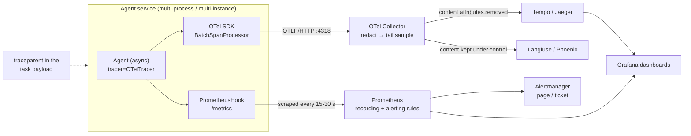
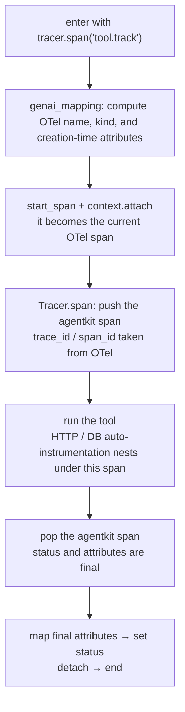
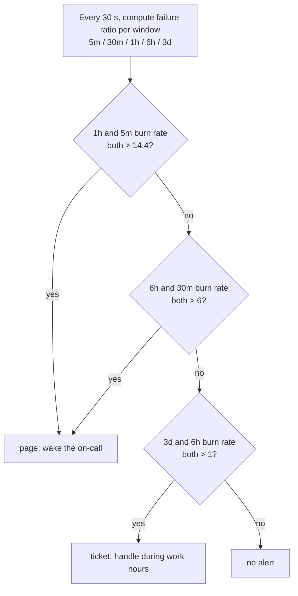
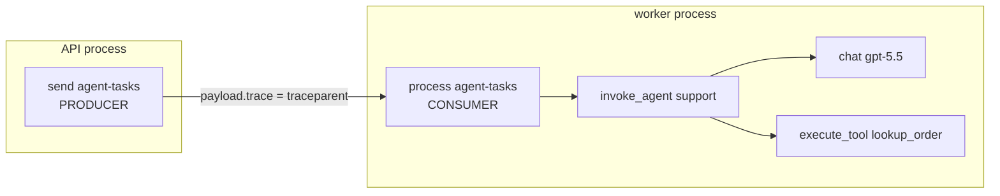

[中文](README.md) | [English](README.en.md)

# Lesson 28: Production observability — OpenTelemetry, Prometheus, and LLM observability platforms

> 🕐 Time: 25 min | 🎯 You'll be able to: wire agentkit's tracing into OpenTelemetry and any OTLP backend, expose run metrics to Prometheus, and make well-reasoned trade-offs on backend choice, sampling, privacy, label cardinality, SLO alerting, and propagation across queues | 📦 Source: [`agentkit/contrib/otel.py`](../../agentkit/contrib/otel.py), [`configs/`](configs/) (Collector config, alert rules, Grafana dashboard), [`demo.py`](demo.py) + [`worker_app.py`](worker_app.py) (worker processes) + [`otlp_receiver.py`](otlp_receiver.py) (OTLP receiver process)
>
> 📖 Primary reading: [Alerting on SLOs](https://sre.google/workbook/alerting-on-slos/) (Steven Thurgood et al., 2018) — a chapter of Google's *Site Reliability Workbook* and the source of this lesson's burn-rate alerts. Focus on how it evolves from "Approach 1: alert when the error rate crosses the SLO threshold" to "Approach 6: multiwindow, multi-burn-rate alerts", and which weakness each step fixes (precision, recall, detection time, reset time). Then read the section on low-traffic services: agent traffic has sharp peaks and troughs, which is exactly where this bites.

## 0. In one sentence

**First, the limitation: the teaching version of agentkit is only observable within a single process.** `Tracer` exports only when the root span ends, writes local JSONL, has no sampling, and cannot carry a trace into another process. Metrics have to be computed from the JSONL afterwards. Lesson 10 used it to explain the principles, but it cannot plug into your company's monitoring stack.

Lesson 10 was a dashcam for one car. In production you run a fleet: dozens of worker processes, a task queue, several model gateways. The problems change:

| What the fleet needs | What observability calls it | This lesson's approach |
|---|---|---|
| Every car streams its recording back in real time, in a format any dispatch center can read | OTLP + semantic conventions | `OTelTracer`: attributes named per the OTel GenAI conventions, exported over OTLP |
| Too much footage to keep; keep only incidents and anomalies | Tail sampling | Collector `tail_sampling`: keep all errors and slow runs, 5% of the rest |
| Footage shows passengers' faces and phone numbers; blur them, and not everyone gets to watch | Redaction and access control | No content captured by default in the SDK; HMAC redaction in the Collector; ops backends never see content |
| The dispatch wall shows a few numbers, not one gauge per passenger | Metrics and label cardinality | `PrometheusHook`: user_id can never be a label; tenant count is capped |
| Wake someone when things break, but not ten times a night | SLOs and burn-rate alerts | `configs/prometheus-rules.yaml`: multiwindow, multi-burn-rate |
| A passenger transfers to another car and the journey still connects | Propagation across processes and queues | `inject_context` / `continue_trace`: traceparent travels in the task payload |

## 1. From the teaching implementation to production: what's missing

### 1.1 What the teaching version gets right, and what it lacks

Lesson 10's `Tracer` already gets three things right: the span tree lives in `contextvars` (isolated across threads and asyncio), pauses and aborts are not errors, and it redacts before truncating at the instrumentation point. This lesson keeps those decisions and adds only what production needs:

| Capability | Lesson 10's `agentkit.Tracer` | What production needs | What this lesson uses |
|---|---|---|---|
| When it exports | The whole tree when the root span ends | Each span queued as it ends and sent asynchronously in batches; a run waiting 3 hours for approval should show its first half early | OTel SDK `BatchSpanProcessor` |
| Format and protocol | Custom JSONL | A standard protocol with swappable backends | OTLP/HTTP (protobuf) |
| Attribute names | A simplified version of the GenAI conventions | Match the conventions so backends recognize model, tokens, and tools | `genai_mapping` (verified against the 2026-09 conventions) |
| Sampling | Everything | Head sampling to cap SDK overhead; tail sampling to keep errors and slow runs | `ParentBased(TraceIdRatioBased)` + Collector `tail_sampling` |
| Across processes | Not possible | W3C `traceparent` through HTTP, queues, and processes | `inject_context` / `continue_trace` |
| Metrics | Computed from JSONL afterwards | Real-time, unsampled (before sampling), alertable | `PrometheusHook` + recording rules |
| Privacy | Regex redaction at the instrumentation point | Layered: SDK doesn't capture → Collector redacts → backend access control | All three layers; see Problem 3 |

### 1.2 The production pipeline



Keep the two paths separate in your head. **Metrics go to Prometheus and are unsampled**: every run is counted, and alerts and SLOs are based on them. **Traces go through the Collector and are sampled**: they answer "what exactly happened this time". As Lesson 10 Problem 1 showed, a success rate computed from sampled traces is always biased.

### 1.3 GenAI semantic conventions cheat sheet (verified against the 2026-09 version)

The GenAI conventions are still at **Development** status and now live in a separate repository, [open-telemetry/semantic-conventions-genai](https://github.com/open-telemetry/semantic-conventions-genai). This lesson was verified against its main branch (2026-09-24, commit `e57c543`):

| Operation | Span name | Span kind | Key attributes (set them at span creation so samplers can see them) |
|---|---|---|---|
| Model call | `chat {gen_ai.request.model}` | `CLIENT` (may be `INTERNAL` if the model runs in-process) | `gen_ai.operation.name=chat`, `gen_ai.provider.name` (Required), `gen_ai.request.model` |
| In-process agent invocation | `invoke_agent {gen_ai.agent.name}` | `INTERNAL` | `gen_ai.operation.name=invoke_agent`, `gen_ai.agent.name` |
| Remote agent service (e.g., OpenAI Assistants, Bedrock Agents) | Same as above | `CLIENT` | Plus `gen_ai.provider.name` and `gen_ai.agent.id` |
| Tool execution | `execute_tool {gen_ai.tool.name}` | `INTERNAL` | `gen_ai.tool.name` (Required), `gen_ai.tool.call.id`, `gen_ai.tool.type` |

Usage attributes are `gen_ai.usage.input_tokens` / `output_tokens`, plus `gen_ai.usage.cache_read.input_tokens`, `gen_ai.usage.reasoning.output_tokens`, and others. The conversation ID is `gen_ai.conversation.id`, and the conventions are explicit: **if no real conversation ID is available, leave it unset. Don't fill it with a freshly generated UUID, a trace ID, or a content hash.**

Content attributes (`gen_ai.input.messages`, `gen_ai.output.messages`, `gen_ai.system_instructions`, `gen_ai.tool.call.arguments`, `gen_ai.tool.call.result`) are all **Opt-In**: the conventions say not to capture them by default, but to offer a switch. They describe three patterns: don't record content (the default); record it on span attributes (fine for pre-production); or store content externally and record only references on spans (recommended for production). The OTel Python GenAI utilities control this with the environment variable `OTEL_INSTRUMENTATION_GENAI_CAPTURE_MESSAGE_CONTENT`, whose values are `NO_CONTENT` (default), `SPAN_ONLY`, `EVENT_ONLY`, and `SPAN_AND_EVENT`; it also requires `OTEL_SEMCONV_STABILITY_OPT_IN=gen_ai_latest_experimental`. This lesson's `OTelTracer` honors the first two values of the same switch.

> ⚠️ **"Still changing" is something we measured, not a disclaimer.** The locally installed `opentelemetry-semantic-conventions 0.66b0` names the cache-write token constant `gen_ai.usage.cache_creation.input_tokens`, while the conventions' main branch has renamed it `gen_ai.usage.cache_write.input_tokens`. On 2026-08-27 the conventions also removed cache token attributes from in-process agent spans (#469). So: pin your SDK version, and re-check the mapping against [`GENAI_SEMCONV_REF`](../../agentkit/contrib/otel.py) when you upgrade.

## 2. How this lesson's adapter plugs in (`agentkit/contrib/otel.py`)

### 2.1 Five lines

```python
from agentkit import Agent
from agentkit.contrib.otel import OTelTracer, PrometheusHook, setup_tracing, start_metrics_server

provider = setup_tracing("support-agent", sample_ratio=1.0)   # endpoint read from OTEL_EXPORTER_OTLP_ENDPOINT
tracer = OTelTracer(provider)                                  # prompts / replies not captured by default
metrics = PrometheusHook(tenant_label=True, allowed_tenants={"acme", "globex"})
start_metrics_server(9464, addr="0.0.0.0")                     # in a container, for Prometheus to scrape
agent = Agent(llm, tools, tracer=tracer, hooks=[tracer, metrics, *other_hooks])
```

Not a single line of agent code changes: `tracer=` was already agentkit's extension point, and `PrometheusHook` is an ordinary Hook. The agent is async (`await agent.run(...)`), and one instance can drive many runs concurrently in a process ([Lesson 30](../30_async_runtime/README.en.md)); the parent-child relationships and metrics below hold under that concurrency.

### 2.2 `OTelTracer`: dual-write, with the same IDs on both sides

`OTelTracer` subclasses `agentkit.Tracer` and overrides only the `span()` context manager. Inside a single `with` block it first creates the OTel span and makes it current, then calls the parent class to create the agentkit span; on exit both are finished together:



The key design decisions:

1. **Create OTel spans live instead of replaying the whole tree after the root span ends.** While a tool runs, the current OTel span is `execute_tool`. Any `httpx` or database client call inside the tool, if it has OTel auto-instrumentation, nests under it automatically, and calling `inject_context()` inside the tool picks up the right parent.
2. **Aligned IDs**: agentkit spans take their `trace_id` / `span_id` from OTel (32 / 16 hex digits). So `RunResult.trace.trace_id` is the ID you can search for directly in Jaeger, Tempo, or Langfuse, and `render_tree`, the viewer, and JSONL keep working.
3. **What counts as an error.** OTel's [recording-errors conventions](https://github.com/open-telemetry/semantic-conventions/blob/main/docs/general/recording-errors.md) say: when there's no error, the status MUST stay UNSET; on error, set Error and write `error.type`; errors that were handled and let the operation complete gracefully are not recorded on that operation's span. Mapped onto agentkit:

| Situation | Which span is ERROR | `error.type` | Why |
|---|---|---|---|
| Tool timeout / exception / business error | `execute_tool` | `timeout` / `exception` / `tool_error` | The tool operation failed; the model absorbed the error and the run completed, so the root span is not marked |
| Denied by permission policy (`denied`) | None | — | The system is working as designed |
| Model completely unavailable | `chat` (exception) and `invoke_agent` (`failed`) | `LLMError` / `failed` | The exception message is redacted before it goes into the status description |
| Out of steps / run timeout | `invoke_agent` | `max_steps` / `timeout` | The user got no answer |
| Waiting for approval (PauseRun), budget abort (StopRun) | None; records `agentkit.interrupted` | — | Lesson 10 Problem 4: not a failure |
| Cancelled (client disconnected, `CancelledError`) | None; records `agentkit.interrupted=CancelledError` | — | Normal behavior; must not fire alerts |
| Rate limited (`rate_limited`) | None | — | Counts as a bad event in the SLO (see Problem 5). But under overload it arrives in bursts; marking it ERROR would make tail sampling keep all of them and amplify tracing traffic exactly when the system is busiest |

4. **Content is off by default.** With `capture_content=True` or the environment variable set, content still goes through `redact_pii` before truncation (Lesson 10: truncating first can cut a phone number in half so the regex no longer matches).
5. **Optional Hook role**: put `tracer` in `hooks` as well (first is best) and it adds what agentkit's core spans don't record: `gen_ai.tool.call.id`, `gen_ai.conversation.id` (from `metadata["conversation_id"]`), and a normalized stop reason (`llm_error: 503 …` becomes `llm_error`).

**Threads and asyncio.** Both agentkit's span stack and the current OTel span live in `contextvars`, and they are set and restored together in the same `with` block. Every thread and every asyncio task has its own copy of the context (a task copies its parent's context at creation), so interleaved concurrent runs and parallel tool tasks within one round never mix up parent-child relationships. The one requirement is that a span is exited in the same task that entered it; ordinary `with` blocks and async functions satisfy that naturally. This isn't just reasoning: [`tests/contrib/test_otel.py`](../../tests/contrib/test_otel.py) verifies three scenarios with a real `Agent`:

- 50 concurrent runs share one `Agent`, and each calls 3 tools in parallel in one round (two async tools and one sync tool running in the thread pool). The result: 50 distinct traces; every tool span's parent is that run's `invoke_agent`; the three tool spans' time ranges really overlap (they ran in parallel); and inside every tool, agentkit's stack top and the current OTel span are always the same span.
- Of 21 runs, 10 are cancelled and 1 times out: cancelled runs have status UNSET and carry `agentkit.interrupted=CancelledError`; the timed-out run is ERROR with `error.type=timeout`; the in-flight gauge returns to zero.
- 10 concurrent runs all stop for approval: `agent_approvals_pending` reads 10, and returns to zero after concurrent approvals.

### 2.3 `setup_tracing`: a production provider in one line

```python
setup_tracing(service_name, otlp_endpoint=None, sample_ratio=1.0, console=False,
              *, exporter=None, resource_attributes=None, set_global=True) -> TracerProvider
```

- **The sampler is `ParentBased(TraceIdRatioBased(sample_ratio))`**: when there is an upstream parent, it follows the upstream decision. So even if a worker sets 0% sampling, it still records when the producer sampled, and you never get a half trace where the producer is there but the worker isn't (verified in the tests).
- **Endpoint**: `otlp_endpoint="http://collector:4318"` gets `/v1/traces` appended automatically. The SDK's `OTLPSpanExporter(endpoint=...)` expects the full URL, while the `OTEL_EXPORTER_OTLP_ENDPOINT` environment variable is a base address (the SDK appends the path); the two are easy to mix up. With no argument, the endpoint and auth headers come from the `OTEL_EXPORTER_OTLP_*` environment variables.
- **Export failures never affect the agent**: `BatchSpanProcessor` exports asynchronously on a background thread, and a failure only drops spans. We pointed the endpoint at a closed port: the agent completed normally with no added latency.

### 2.4 Propagation across queues: `inject_context` / `continue_trace`

```python
# Producer (API process)
with tracer.span("send agent-tasks", **{"otel.kind": "producer", "messaging.destination.name": "agent-tasks"}):
    await queue.enqueue("agent", {"input": text, "trace": inject_context({})}, tenant_id=tenant)
    # payload["trace"] == {"traceparent": "00-<trace_id>-<span_id>-03"}

# Worker process (the handler loaded by python -m agentkit.distributed.worker): run_worker gives every job its own
# asyncio task, each enters continue_trace on its own, and concurrent jobs never cross-talk
async def handle(job):
    async with continue_trace(job.payload["trace"]):
        with tracer.span("process agent-tasks", **{"otel.kind": "consumer", "messaging.destination.name": "agent-tasks"}):
            await agent.run(job.payload["input"])
```

`continue_trace` works with both `with` and `async with`. On entry it attaches the extracted context to the **current** thread's or task's context, and detaches it on exit. The worker processes in this lesson's demo part 2 ([`worker_app.py`](worker_app.py)), Lesson 26's Postgres queue, and Lesson 30's async workers use it directly.

### 2.5 `PrometheusHook`: unsampled, low-cardinality, safe under asyncio

| Metric | Type | Labels | Used for |
|---|---|---|---|
| `agent_runs_total` | Counter | `status`, `reason` (normalized stop_reason)[, `tenant`] | Availability SLI, breakdown by cause |
| `agent_run_duration_seconds` | Histogram | `status` | Latency SLO; bucket boundaries include the 30 s and 60 s SLO thresholds |
| `agent_llm_tokens_total` | Counter | `direction` (input / output)[, `tenant`] | Usage |
| `agent_llm_cost_usd_total` | Counter | [`tenant`] | Cost alerts, per-tenant attribution |
| `agent_tool_calls_total` | Counter | `tool`, `error_type` (`none` on success) | Per-tool error rates; tool names invented by the model are all recorded as `__unknown__` |
| `agent_approvals_pending` | Gauge | — | Approval backlog |
| `agent_runs_in_flight` | Gauge | — | Runs currently executing (concurrency) |
| `agent_queue_depth`, `agent_queue_oldest_job_age_seconds` | Gauge | `queue` | Backlog; written via `set_queue_stats()` |

Every callback is a plain method (not `async def`) that only updates in-memory counters (prometheus_client uses its own locks), and the agent calls them directly. **But never do blocking IO in this hook (or in any hook written with plain methods)**: those methods run on the event-loop thread, so one 50 ms blocking call stalls every concurrent run in the process for 50 ms. Metrics that need a database query (approval backlog, queue depth) belong in a separate periodic job that writes them with `set_pending_approvals()` / `set_queue_stats()`.

## 3. Enterprise problem cards

### Problem 1: Which tracing backend? Can LLM platforms ingest OTLP directly?

**Scenario**: The company already runs Grafana and Prometheus. The AI team has 15 people; the business wants to "read conversations" and run online evals; legal requires user data to stay in-country. 200,000 runs a day.

**Why it's hard**: General-purpose tracing backends don't understand LLM semantics. Most LLM platforms are SaaS, and the space moves very fast (Langfuse was acquired by ClickHouse in January 2026; Helicone joined Mintlify and went into maintenance mode in March 2026). If your instrumentation is tied to one platform's SDK, a change at that platform means rewriting your instrumentation.

| Option | How it ingests (verified) | Pros | Cons | Best for |
|---|---|---|---|---|
| A. [Jaeger](https://www.jaegertracing.io/docs/latest/getting-started/) (v2, Apache-2.0, CNCF) | Native OTLP (4317 gRPC / 4318 HTTP); the all-in-one image is great locally | Open source, fastest to start, clear UI | No LLM semantics; large-scale storage needs extra setup | Local development, small-to-mid self-hosting |
| B. [Grafana Tempo](https://grafana.com/docs/tempo/latest/configuration/) (AGPL-3.0) | Distributor ingests OTLP natively; stores data in object storage; TraceQL queries | Cheap storage; integrates with Grafana and Prometheus (jump from metrics to traces) | Also no LLM semantics; you run it yourself | Teams already on Grafana; the main ops-facing backend |
| C. Commercial APM (e.g., [Datadog](https://www.datadoghq.com/blog/llm-otel-semantic-convention/)) | Since 2025-12, Datadog natively supports GenAI conventions v1.37+, ingested via its OTLP intake endpoint, the Datadog Agent, or the Collector | Managed, full-stack correlation, LLM views | Usage-based pricing gets expensive at scale; data leaves the company | Already using that APM, and compliance allows it |
| D. LLM-specific platforms | [Langfuse](https://langfuse.com/integrations/native/opentelemetry): `/api/public/otel`, **OTLP/HTTP only** (no gRPC), Basic auth, self-hosted needs v3.22.0+, maps `gen_ai.*` attributes. [Arize Phoenix](https://arize.com/docs/phoenix/tracing/concepts-tracing/translating-conventions) (Elastic License 2.0): ingests OTLP, native conventions are OpenInference; raw `gen_ai.*` spans are viewable, but UI features that rely on OpenInference attributes are reduced. [LangSmith](https://docs.langchain.com/langsmith/trace-with-opentelemetry): `/otel` endpoint, `x-api-key` auth, maps `gen_ai.*` (including the older `gen_ai.prompt.{n}.content` style). Helicone: proxy-first; async logging uses its own SDK; we found no standard OTLP endpoint in its docs, and it is now in maintenance mode | Conversation views, evals, prompt management | Each platform recognizes a different version of `gen_ai.*`; SaaS raises data-residency issues | Need to read conversations and run evals; pick a self-hostable one if data is sensitive |

**How to choose**: **Standardize the instrumentation first (OTel + GenAI conventions + OTLP), then choose backends.** For the ops view (latency, errors, dependencies), use B or A; for the LLM view (conversations, evals), use a self-hostable option from D. Let the Collector send to both, with different data for each: ops backends never get content attributes. If you already use a commercial APM and compliance allows it, C can replace B. Whatever you pick, business code never depends on a platform SDK, so switching platforms only means changing the Collector config.

**This lesson's implementation**: [`configs/otel-collector.yaml`](configs/otel-collector.yaml) uses the `forward` connector to split the redacted, sampled data into two paths: `traces/ops` strips content and sends to Tempo; `traces/llm` sends to Langfuse. Demo part 4 runs a tiny local OTLP receiver to show what actually goes over the wire (`POST /v1/traces`, `application/x-protobuf`).

**Migration steps from agentkit's Tracer to OTel**:
1. Change `Agent(tracer=Tracer(...))` to `Agent(tracer=OTelTracer(setup_tracing("svc")), hooks=[tracer, ...])`. Keep your existing `jsonl_exporter` as `OTelTracer(exporter=...)` during the migration to compare both sides.
2. Try it locally with Jaeger all-in-one first: `OTEL_EXPORTER_OTLP_ENDPOINT=http://localhost:4318`.
3. In production, the app sends only to the in-cluster Collector, and the Collector decides which backends get what.
4. Search the backend for the `RunResult.trace.trace_id` the demo prints, and confirm it's the same ID.

### Problem 2: Sampling — head or tail? How much storage per day? How much Collector memory?

**Scenario**: 200,000 runs a day. Using Lesson 10's estimate, each trace has about 25 spans and about 25 KB of metadata, so keeping everything is about 5 GB a day. About 3% of runs fail and about 2% take longer than 30 s. p99 run duration is 3 minutes, and peak traffic is 5× the average.

**Why it's hard**: Head sampling decides at the very start of a request, before anyone knows whether the run will fail, so it drops failed traces in proportion. Tail sampling waits for the whole trace before deciding, and agent traces are two or three orders of magnitude longer than ordinary HTTP requests (minutes versus milliseconds). The memory needed to hold traces scales with "new traces per second × wait time".

| Option | How | Pros | Cons | Best for |
|---|---|---|---|---|
| A. Keep everything | No sampling | Simple; every trace is findable | Large and expensive | Under ~10,000 runs a day; pre-production |
| B. Head sampling | `sample_ratio=0.1` in the SDK | Cuts SDK and network overhead by 90% | Failures and slow runs are dropped in proportion | Trends only, or when SDK overhead really is the bottleneck |
| C. Tail sampling | Collector `tail_sampling`: keep all `status_code=ERROR`, all `latency ≥ 30s`, all runs waiting for approval, and 5% `probabilistic` of the rest | All the valuable traces are kept; storage drops by an order of magnitude | All spans of a trace must reach the same Collector instance; costs memory | The default once you scale |
| D. Head + tail | 50% head sampling in the SDK to save overhead, then tail sampling in the Collector | Saves on both ends | Error traces dropped at the head are gone for good | Very large scale, if keeping only half of the errors is acceptable |

**Cost estimate** (numbers from the scenario above; the formulas carry over directly):

- Storage: kept fraction ≈ 3% + 2% + 5% × 95% ≈ 10%, so about 5 GB a day becomes about 0.5 GB.
- Collector memory ≈ peak new traces per second × `decision_wait` × trace size. 200,000 ÷ 86,400 ≈ 2.3 traces/s, about 12/s at peak. `decision_wait` must cover at least the p99 run duration (180 s), otherwise slow traces get cut in two and decided separately. 12 × 180 × 25 KB ≈ 54 MB, which is fine at this scale.
- At 100× the scale it's 1,200 traces/s × 180 s × 25 KB ≈ 5.4 GB, too much for one Collector. Split into two tiers as the README recommends: the first uses the `loadbalancing` exporter to route by trace ID, the second does tail sampling. Set `num_traces` (default 50,000) to at least "traces per second × decision_wait".

**How to choose**: Under ~10,000 runs a day, use A; once you scale, use C. Consider B and D only when SDK overhead is a real problem. **Metrics are always computed before sampling, over all runs**: this lesson's `PrometheusHook` counts every run in-process, unaffected by sampling.

**This lesson's implementation**: The app uses `setup_tracing(sample_ratio=1.0)` and sends everything to the Collector. The Collector has 4 keep policies plus `decision_cache`, so late spans follow the decision already made (see Problem 6). The test `test_sampling_ratio_zero_still_follows_a_sampled_upstream` verifies `ParentBased` behavior: with 0% local sampling nothing is exported, but an upstream trace that was sampled is followed.

**Migration steps**:
1. Start with everything (`sample_ratio=1.0`) and spend a week looking at real span counts, trace sizes, and run duration distributions.
2. Set `decision_wait` and `num_traces` with the formula above, and monitor the Collector's `otelcol_processor_tail_sampling_sampling_trace_dropped_too_early` (traces evicted from memory before a decision).
3. Once errors and slow runs are confirmed at 100% retention, lower the `probabilistic` percentage gradually.

### Problem 3: PII in traces — which layer stops it?

**Scenario**: A customer-service agent's traces go to both Tempo (200 engineers can view) and Langfuse (10 AI engineers can view). Someone turned on content capture on one service to debug an issue.

**Why it's hard**: Regexes only catch data with a fixed format. This lesson's demo shows it: the phone number was replaced, but "收货人张伟" (a recipient's name) came through untouched. Regexes also misfire: an 18-digit numeric order number gets masked as a resident ID number (China's 18-character national ID). Any single layer will leak sooner or later.

| Option | Layer | How | Pros | Cons |
|---|---|---|---|---|
| A. Don't capture in the SDK | Application process | Content attributes are off by default (Opt-In); when on, `redact_pii` runs before truncation; `user.id` is never exported raw, only an HMAC'd `user.hash` | The data never leaves the process | No content to look at while debugging |
| B. Redact in the Collector | Egress | The `redaction` processor matches values and replaces them with `hmac-sha256`; `attributes` deletes content keys; `transform` truncates oversized attributes | Centralized, not dependent on every developer; catches content that another service turned on by mistake | Regexes miss things and misfire; the `attributes` processor's `hash` action uses SHA1, which can be brute-forced for low-entropy data like phone numbers |
| C. Backend access control | Storage | Ops backends store no content; the LLM platform grants access per project, sets retention, and stays in-region; stricter still is storing content externally in encrypted storage with only references on spans (the conventions' recommended production pattern) | Meets strict compliance | Complex architecture; one more step when debugging |

**How to choose**: You need all three, ordered for "secure by default". A is the default; B catches what A misses and human mistakes; C decides who can see whatever remains. To correlate requests from the same user, use HMAC, not a plain hash (Lesson 10 Problem 2). The Collector's `hmac_key` comes from an environment variable, never the config file.

**This lesson's implementation**: `OTelTracer` doesn't capture content by default and still redacts when capture is on (the end of Demo part 1). `genai_mapping` never outputs a raw `user.id`. In the Collector config, `redaction` masks mobile numbers, ID numbers, emails, and card numbers with HMAC, and `attributes/strip-content` removes all content attributes from the ops pipeline.

> ⚠️ A pitfall we hit: if `redaction`'s `blocked_key_patterns` includes `".*token.*"` (meant to hide API tokens), it also masks `gen_ai.usage.input_tokens`, which breaks every cost dashboard. This lesson's config matches only `api_key|secret|password|authorization`, and a test asserts exactly that.

**Migration steps**:
1. Before migrating, `grep` your Lesson 10 JSONL to see which attributes you actually record today.
2. Switch to `OTelTracer` with `capture_content=False`, and confirm backends see no content attributes.
3. When rolling out `redaction` in the Collector, run a day with `summary: debug` to see which keys it masks (to catch false positives), then switch to `info`.
4. If you really need content, allow it only on the LLM-platform pipeline, with access granted per project.

### Problem 4: Metrics and label cardinality — which dimensions can be labels?

**Scenario**: A product manager wants "success rate per user", so someone adds a `user_id` label to `runs_total`. A week later Prometheus is alerting on memory and queries keep getting slower.

**Why it's hard**: Every distinct label combination is a separate time series. Prometheus's official naming guide says it plainly: don't use labels for high-cardinality dimensions such as user IDs, email addresses, or other unbounded sets of values. Some dimensions look bounded but aren't under your control: the tenant count grows with sales, and tool names come from the model, which can invent any name.

Do the math: `runs_total` with `status` (6 values) × `reason` (~10) × `tenant` (50) ≈ 3,000 series, which is fine. Swap in `user_id` (100,000 users) and that one metric becomes about 6 million series, multiplied again per process and per instance.

| Option | How | Pros | Cons | Best for |
|---|---|---|---|---|
| A. In-app Prometheus client | `PrometheusHook`: counts in-process, exposes `/metrics` | Unsampled, real-time, no backend dependency | Multi-process needs multiprocess mode; you manage labels yourself | This lesson's default |
| B. Derive metrics from spans | The Collector's `spanmetrics` connector | No code changes | Must sit before sampling; dimensions limited to span attributes | You already have traces and don't want to change code |
| C. OTel Metrics SDK | Send metrics over OTLP; the Collector converts to Prometheus format or remote-writes | Same protocol and resource attributes as traces | A longer pipeline on the Python side, harder to debug | Organizations standardizing fully on OTel |
| D. High-cardinality dimensions in traces / logs | `user.hash`, `run_id`, `trace_id` on span attributes and in logs, queried on demand | Unbounded dimensions | Can't alert on them directly | Always needed: look up by ID when a user complains |

**How to choose**: A (or C) for unsampled metrics, D for high-cardinality dimensions. Every label must answer "how many values can it take, and what enforces the cap": `status`, `reason`, and `direction` are enums; `tool` is bounded by the tool registry, with unknown names recorded as `__unknown__`; `tenant` is enabled only when the tenant count is capped, ideally with an allow-list (`allowed_tenants`); **`user_id`, `run_id`, and `trace_id` are never labels.** "Success rate per user" should be computed from traces or the data warehouse.

**This lesson's implementation**: `PrometheusHook(tenant_label=True, max_tenants=50, allowed_tenants=...)`. Tenants over the cap or outside the allow-list go into `__other__` (`rnd-8f2c91` in Demo part 3). Tool × error type × tenant multiplies, so `tool_calls_total` has no tenant label. Exercise (c) has you implement the same guard.

**Multi-process**: For gunicorn or multi-worker deployments, follow [prometheus_client's official approach](https://prometheus.github.io/client_python/multiprocess/):

1. Set `PROMETHEUS_MULTIPROC_DIR` before the processes start, and wipe that directory first;
2. When `start_metrics_server()` sees that variable, it automatically aggregates with a fresh `CollectorRegistry` plus `MultiProcessCollector`;
3. Call `mark_process_dead(worker.pid)` in gunicorn's `child_exit` hook;
4. Multiprocess mode has limits: no custom collectors, no `Info` / `Enum`, and gauges need an aggregation mode (this lesson uses `livesum` for in-flight and approvals, `livemostrecent` for queue metrics).

The test `test_multiprocess_mode_aggregates_counters_from_concurrent_workers` starts two worker processes that each run 25 agent runs concurrently, and the aggregate is exactly 50.

> ⚠️ A pitfall we hit: a common pattern is "new Agent and new Hook per request". If metrics are registered in the Hook's constructor, the second request raises `Duplicated timeseries`. This lesson keeps the metric objects and the tenant cap in a process-level cache. At first only the metrics were cached and the tenant cap lived on the Hook instance, so every request got a fresh cap and the guard did nothing. A test caught it.

**Migration steps**:
1. Replace the "compute metrics from JSONL" step from Lesson 10's exercise with `PrometheusHook`, and make sure it counts before sampling.
2. List the value cap for every label and put it in your code-review checklist.
3. After launch, check series counts per metric with `count by (__name__)({__name__=~"agent_.*"})`, and alert when they exceed expectations.

### Problem 5: SLOs and alerting — how do you wake people only for real incidents?

**Scenario**: A continuation of Lesson 10 Problem 4: 150 alerts a week, 90% of them noise from low-traffic hours. The team sets SLOs: over 30 days, 99% of valid runs complete successfully, and 99% of successful runs finish within 60 seconds.

**Why it's hard**: First you have to define "bad" precisely. For an agent: model unavailable, out of steps, timed out, or rejected by your own rate limiter are all bad; waiting for approval, client disconnects, budget aborts, and blocked inputs don't count (the policies are working as designed). Then you pick an alerting method: too sensitive means false alarms, too sluggish means missed incidents, and duration clauses like `for: 10m` keep resetting their timer when the error rate fluctuates. The SRE Workbook explicitly recommends against using them for SLO alerting.

| Option | How | Pros | Cons | Best for |
|---|---|---|---|---|
| A. Fixed threshold | Alert when error rate > 5% | Simple | False alarms at low traffic; not sensitive enough at high traffic | Prototypes |
| B. Threshold + minimum traffic + duration | Option B from Lesson 10 | Removes most noise | Insensitive to slow degradation; `for` resets on fluctuation | Early days, before you have SLOs |
| C. Single-window burn rate | 1-hour burn rate > 14.4 | Tied to user impact | After recovery, the 1-hour average takes a long time to drop, so the alert keeps firing (long reset time) | A transition step |
| D. Multiwindow, multi-burn-rate | Both 1h and 5m > 14.4, or both 6h and 30m > 6 → page; both 3d and 6h > 1 → ticket | Good precision, recall, detection time, and reset time | Needs a well-defined SLO; many recording rules | Core services with explicit SLOs |
| E. Distribution drift detection | Compare step counts, tool mix, output length, and refusal rate with last week | Catches degradation that raises no errors | Prone to false alarms | Daily reports, not paging |

The **burn rate** is "actual error rate ÷ error rate allowed by the SLO". A burn rate of 1 means the budget runs out exactly at the end of the 30 days. The SRE Workbook's Table 5-8 parameters: a burn rate of 14.4 over 1 hour consumes 2% of the 30-day budget (14.4 × 1 ÷ 720 = 2%); 6 over 6 hours consumes 5%; 1 over 3 days consumes 10%. The short window is 1/12 of the long window.



**How to choose**: For a core agent with an SLO, page with D; use B and E as supplements that only open tickets or feed daily reports. Two agent-specific reminders:

- **Set the SLO too loose and burn-rate alerts stop working.** The maximum possible burn rate is 1 ÷ (1 − SLO). With a 95% SLO that's 20, so a 14.4 threshold means the error rate must exceed 72% before anyone is paged. Exercise (b) has a test that computes exactly this.
- **Low-traffic protection**: with only 5 runs in an early-morning hour, a single failure is 20%. This lesson adds "at least 20 valid runs in the last hour" to the page rule. The SRE Workbook's low-traffic section suggests other approaches too: generate synthetic traffic, monitor small services together, widen the windows.

**This lesson's implementation**: [`configs/prometheus-rules.yaml`](configs/prometheus-rules.yaml) contains recording rules for the availability and latency SLOs (5m / 30m / 1h / 6h / 3d) and these alerts: multiwindow burn rate (page / ticket), p95 latency, cost per run (versus the same hour last week), an hourly spend cap, per-tool error rate, calls to tools that don't exist, queue backlog (by how long the oldest job has waited, not queue length), approval backlog, and metrics scrape failures. [`configs/grafana-dashboard.json`](configs/grafana-dashboard.json) is the matching dashboard; pick your Prometheus data source when importing.

> ⚠️ A pitfall we hit: Prometheus 3 normalizes histogram `le` label values to float form, so SLO queries must use `le="60.0"`; `le="60"` returns no data. Also, the SLO threshold must be exactly one of the bucket boundaries: the OTel conventions suggest buckets of 0.1 × 2ⁿ (0.1 … 409.6) for `gen_ai.invoke_agent.duration`, which include neither 30 nor 60, so `PrometheusHook` doesn't copy them.

**Migration steps**:
1. Lesson 10's `compute_metrics` only computed "success rate". When migrating, first write down explicit lists of bad and excluded events (see the comments at the top of the rules file) and agree on them with the business.
2. Deploy the recording rules first, watch real burn-rate curves for two weeks, then enable paging alerts.
3. Give every alert a `runbook_url`, and make the description say which metric to check first and where to look for traces.

### Problem 6: How do traces connect across services and queues?

**Scenario**: The API process receives a request and writes it into Lesson 26's Postgres queue; a worker process picks it up and calls `Agent`; the agent calls another team's retrieval service over HTTP. While investigating a complaint, the backend shows three unrelated traces.

**Why it's hard**: For HTTP, auto-instrumentation forwards the headers for you; for queue payloads, nobody does. A task may sit in the queue for seconds, or for hours (during a backlog or an approval). If a task that waited hours stays under the original trace, that trace spans hours, and the Collector made its decision on the first half long ago, after `decision_wait`. The worker's part becomes "late spans".

| Option | How | Pros | Cons | Best for |
|---|---|---|---|---|
| A. HTTP auto-propagation | OTel auto-instrumentation injects the `traceparent` header on service calls | Zero code | Only synchronous calls | Between services (required) |
| B. traceparent in the payload, consumer uses it as parent | `inject_context` into the payload, `continue_trace` in the worker | One tree, the most intuitive | Queue wait time counts toward trace duration; tail sampling may have decided the first half already | Single messages with short (seconds) waits |
| C. traceparent in the payload, consumer starts a new trace with a span link | The default in the messaging semantic conventions | Traces don't stretch; batch consumers can link to many producers | Backends vary in how well they display links | Batch consumption, long waits |
| D. Business-ID correlation | Spans carry `agentkit.run_id` and `gen_ai.conversation.id` | Simple and reliable; people can search for it | No parent-child structure | Always needed |

**How to choose**: A + D is the floor. For queues, use B (this lesson's default) when waits are usually seconds; use C when waits may exceed `decision_wait` or you consume in batches, and always configure `decision_cache` so late spans follow a "keep" decision already made (the Late-Arriving Spans section of the Collector docs). Resuming after approval (`agent.resume`) already starts a new trace and is correlated by `run_id`, which is D.



**This lesson's implementation**: `inject_context` / `extract_context` / `continue_trace`. Demo part 2 is a real multi-process pipeline: this process (the API) enqueues 6 jobs inside `send agent-tasks` spans (a SQLite queue, traceparent in the payload); `WorkerPool` starts 2 worker processes (`python -m agentkit.distributed.worker`, the same command as in Lessons 13 and 26), which pick up the jobs and `continue_trace`; all 3 processes send their spans over OTLP/HTTP to a 4th process, the mini receiver [`otlp_receiver.py`](otlp_receiver.py). Result: for all 6 jobs, the producer's trace_id equals the trace_id of the agent run in the worker, the jobs were split across 2 different worker processes, and the tree the receiver assembles is one trace from `send` (API process) → `process` → `invoke_agent` (worker process). It then runs one `Agent` in this process on 20 concurrent jobs, cancels 3 of them midway, and finds zero cross-talk. The tests cover process and asyncio workers, plus malformed carriers (a new trace starts; nothing is raised). Option C can use the OTel API directly: `tracer.start_as_current_span("process", links=[Link(get_current_span(extract_context(carrier)).get_span_context())])`.

> ⚠️ A pitfall we hit: the traceparent generated by OTel Python 1.45 ends in `03`, not the `01` many tutorials show. It also sets the "random" flag bit (0x02) added in W3C Trace Context Level 2. If your own code checks `flags == "01"` to decide "sampled", it will be wrong; test the bit with `int(flags, 16) & 0x01` instead. Also, `baggage` is passed verbatim to every downstream service, including third parties, so never put user IDs in it.

**Migration steps**:
1. Find every place that writes to a queue or starts a background job, and add a `trace` field to the payload (`inject_context({})`).
2. When a worker picks up a job, wrap the handling in `with` / `async with continue_trace(job["trace"])`.
3. Send one end-to-end request and confirm only one trace_id shows up in the backend (the verification method from Lesson 10 Problem 6).
4. Measure the queue wait-time distribution: when p99 exceeds `decision_wait`, switch to option C or enlarge `decision_cache`.

## 4. Hands-on: run the demo

```bash
python lessons/28_production_observability/demo.py --offline   # offline script, about 2 s (including starting 3 subprocesses)
python lessons/28_production_observability/demo.py             # real model, about 37 s (about 20 model calls; sequential in this process, at most 1 in flight per worker process)
```

If optional dependencies are missing, the demo prints `pip install -e ".[prod,prod-local]"` and exits normally. Offline output excerpt (Demo output translated from Chinese.):

```
▶ [tool failure] User: Where is order A1002?
  trace e06c4040a0058d360b1a0dec010c7a63
  invoke_agent support  internal  usage.input_tokens=60  usage.output_tokens=30  conversation.id=conv-7f3a
  ├─ chat scripted  client  request.model=scripted  provider.name=openai  usage.input_tokens=20  usage.output_tokens=10
  ├─ execute_tool lookup_order  internal  tool.call.id=call_255158244b1a
  ├─ chat scripted  client  ...
  ├─ execute_tool track_shipment  internal  ERROR  tool.call.id=call_8db4f8be5d8e  error.type=tool_error
  └─ chat scripted  client  ...
  RunResult.trace.trace_id = e06c4040a0058d360b1a0dec010c7a63  ← same as the OTel trace_id above

  API process pid 57098; worker process pids [57100, 57101] (python -m agentkit.distributed.worker --queue sqlite:///…)
  Job   Producer (API process) trace_id       Handled by              trace_id of the agent run in the worker
  #1    cda8b63c4a99fd97c37f89d7304bf880    worker-1 (pid 57101)   cda8b63c4a99fd97c37f89d7304bf880  ✅
  #2    56a1cebc0776a0b89bef2ad864e00cb6    worker-1 (pid 57101)   56a1cebc0776a0b89bef2ad864e00cb6  ✅
  #3    1715dfca6b2a521259a7ae6c24539157    worker-0 (pid 57100)   1715dfca6b2a521259a7ae6c24539157  ✅
  … (#4–#6 also ✅)
  6 jobs handled by 2 different worker processes; worker exit codes [0, 0] (0 = exited normally after SIGTERM)

  Receiver process (pid 57099) got 48 spans in total from 3 processes: hello-agent-api[pid 57098], hello-agent-worker[pid 57100], hello-agent-worker[pid 57101]
  trace cda8b63c4a99fd97c37f89d7304bf880
  send agent-tasks  producer  messaging.destination.name=agent-tasks  [pid 57098]
  └─ process agent-tasks  consumer  messaging.destination.name=agent-tasks  [pid 57101]
     └─ invoke_agent support  internal  usage.input_tokens=60  usage.output_tokens=30  [pid 57101]
        ├─ chat scripted  client  ...  [pid 57101]
        …
  Multi-process metrics: 4 metric files (each process writes its own, e.g. counter_57100.db); after MultiProcessCollector aggregates them, agent_runs_total{status=completed} = 6 (6 jobs)

  17 completed, 3 cancelled; peak concurrent model calls 10, in-flight gauge sampled mid-run 10
  Cancelled runs: OTel status ['UNSET'], agentkit.interrupted=CancelledError (cancellation is not an error, no alert)
  Afterwards: agent_runs_in_flight = 0, agent_runs_total{status=cancelled} = 3

    agent_runs_total{reason="final_answer",status="completed",tenant="acme"} 3.0
    agent_runs_total{reason="final_answer",status="completed",tenant="__other__"} 1.0
    agent_tool_calls_total{error_type="tool_error",tool="track_shipment"} 1.0

    POST /v1/traces  Content-Type: application/x-protobuf  3008 bytes
      resource: service.name=hello-agent-demo  deployment.environment.name=demo  telemetry.sdk.version=1.45.0
```

**What to notice:**

1. **A tool failure turns only `execute_tool` red, not the root span**: the model absorbed the error and the run completed (as OTel's recording-errors conventions prescribe).
2. **Before and after approval are two traces**, correlated by `agentkit.run_id`; the resumed root span has no `usage.*_tokens`. agentkit records the whole run's cumulative totals on the resume root span, and copying them would be double-counted by backends that sum per span, so they are renamed `agentkit.run.cumulative_*_tokens`.
3. **The trace_id is identical across processes**: the traceparent the API process wrote into the payload is picked up by a worker in another process, and the worker's root span sits under `process agent-tasks`. Each process sent its own spans to the receiver process over OTLP; the only thing stitching them into one tree is the trace_id and parent span_id. On SIGTERM, once `run_worker` returns, the handler's `aclose()` explicitly calls `provider.shutdown()` to send whatever is still in its `BatchSpanProcessor` (the SDK also flushes on a normal interpreter exit by default; a kill -9'd process gets neither, and its last batch of spans dies with it).
4. **With the real model, one trace reached the receiver in two batches** (part 4): 2 spans (`chat`, `execute_tool lookup_order`) first, then the remaining 4, including the root. `BatchSpanProcessor` sends when a batch fills up or a timer fires, not per trace, and real model calls take seconds, so a trace gets split and the root span arrives last. That's exactly why the Collector's tail sampling needs `decision_wait`.
5. **With content capture on, the phone number is replaced but the name "张伟" is kept**: Problem 3, live.

To see it in a UI: this machine has no Docker, so the commands below were not actually run here. Try them on a machine with Docker:

```bash
docker run --rm -p 16686:16686 -p 4317:4317 -p 4318:4318 cr.jaegertracing.io/jaegertracing/jaeger:2.21.0
OTEL_EXPORTER_OTLP_ENDPOINT=http://localhost:4318 python lessons/28_production_observability/demo.py --offline
# open http://localhost:16686 and search for the trace_id the demo prints
```

## 5. Exercise

Open [exercise.py](exercise.py) and implement 4 functions. They're plain Python and need neither OTel nor prometheus_client:

| Function | What it does | What it tests |
|---|---|---|
| `to_genai_attributes(name, attrs)` | agentkit span → GenAI-convention span name and attributes | Opt-In content, never exporting user IDs, what counts as an error, cumulative tokens on resume |
| `burn_rate(errors, total, slo_target)` | Burn rate | Definition, zero traffic, input validation |
| `should_page(short_window, long_window, thresholds)` | Multiwindow, multi-burn-rate decision | Both windows must exceed, strictly greater, no data means no alert |
| `guard_label_cardinality(labels, allowed, max_values, seen)` | Label cardinality guard | Forbidden fields, allow-list, overflow bucket, no half-updated state on error |

```bash
make lesson N=28
# equivalent to .venv/bin/python -m pytest lessons/28_production_observability
```

One test runs a real agent that produces 13 spans and compares your `to_genai_attributes` with `agentkit.contrib.otel`'s implementation span by span.

## 6. Operations notes and common pitfalls

1. **Using sampled traces as a metrics source.** Count metrics over all runs with `PrometheusHook`; use traces only for debugging.
2. **Setting `decision_wait` to a few seconds out of HTTP habit.** Agent runs take minutes, so slow traces get cut in two and decided separately. Size it from the p99 run duration and monitor `sampling_trace_dropped_too_early`.
3. **Running one tail-sampling Collector and scaling by adding replicas.** All spans of a trace must reach the same instance; deploy two tiers with the `loadbalancing` exporter.
4. **Assuming `force_flush()` returning True means the export succeeded.** Measured: with the endpoint unreachable, `force_flush(2000)` blocked for about 7 seconds (the exporter has its own timeout, 10 s by default, with backoff retries) and still returned True; the failure showed up only as a log warning. Short-lived processes (cron, Lambda) should set `OTEL_EXPORTER_OTLP_TRACES_TIMEOUT` (with 1 second in the test it returned in about 1 second) and flush before exiting.
5. **Using the old exporter names.** Since v0.144.0 the Collector renamed the `otlp` exporter to `otlp_grpc` and `otlphttp` to `otlp_http`; the old names are deprecated aliases (the receiver is still called `otlp`). Most examples online still use the old names.
6. **Configuring Langfuse with gRPC.** It supports OTLP/HTTP only.
7. **`user_id` or `run_id` as metric labels; a new Hook per request.** See Problem 4.
8. **Blocking IO in a hook written with plain methods**, which slows every asyncio run in the process. See section 2.5.
9. **Treating cancellation as an error.** A client disconnect is normal; marking it ERROR fires error-rate alerts, and tail sampling keeps all those traces.
10. **Redaction key patterns like `.*token.*`**, which also hit `gen_ai.usage.*_tokens`. See Problem 3.
11. **`le="60"`**: in Prometheus 3, write `le="60.0"`.
12. **In-process approval-backlog counts drift with multiple workers**: the pause happens in process A and the resume in process B, so A's count never goes down. In multi-worker deployments pass `track_approvals=False` and have one periodic job count from the database and call `set_pending_approvals()`.
13. **`OTEL_SERVICE_NAME` has no effect.** Measured: a `service.name` passed in code to `Resource.create()` overrides that environment variable. If ops should control it through the environment, don't hard-code `service_name`.
14. **Honest disclosure**: the Collector config, Prometheus rules, and Grafana dashboard were only syntax-checked with pyyaml / json, plus tests that check consistency with the code (every referenced metric exists; every component a pipeline references is defined). This machine has no Docker, so we did not actually start the Collector, Prometheus, or Grafana, and did not run `promtool check rules`. Run them in your own environment before going live.

## 7. Switching to managed services

No code changes; only environment variables or the Collector's exporters:

| Target | App side (direct) | Collector side (recommended) | Notes |
|---|---|---|---|
| Self-hosted Jaeger / Tempo | `OTEL_EXPORTER_OTLP_ENDPOINT=http://collector:4318` | `otlp_grpc/tempo`, `endpoint: tempo:4317` | This lesson's default |
| Langfuse Cloud / self-hosted | `OTEL_EXPORTER_OTLP_ENDPOINT=https://cloud.langfuse.com/api/public/otel`, `OTEL_EXPORTER_OTLP_HEADERS=Authorization=Basic%20<base64(pk:sk)>` | `otlp_http/langfuse`, same `endpoint`, `headers` from `${env:LANGFUSE_AUTH}` | HTTP only; spaces in the environment variable must be written as `%20`; self-hosted needs v3.22.0+ |
| LangSmith | `OTEL_EXPORTER_OTLP_ENDPOINT=https://api.smith.langchain.com/otel`, headers `x-api-key`, `Langsmith-Project` | `otlp_http/langsmith` | EU and APAC regions use different domains |
| Datadog | Send to a Datadog Agent with OTLP ingest enabled, or the official OTLP intake endpoint | The Collector's Datadog exporter, or Datadog's distribution of the Collector | Requires GenAI conventions v1.37+ |
| Managed Prometheus | — | Prometheus `remote_write` to the managed service | Rules file and dashboard unchanged |

Switching steps:
1. **Add** an exporter in the Collector first, and run old and new backends side by side for a week, comparing trace counts and attributes;
2. Confirm the new backend's retention, access control, and data region meet compliance requirements (option C in Problem 3);
3. Then remove the old exporter. The app only ever knows about the Collector.

## 8. Interview & design review questions

<details>
<summary>Q1: Why "standardize instrumentation first, then choose backends"? How do you do it in practice?</summary>

- LLM observability platforms change fast (acquisitions, maintenance mode), and each recognizes a different version of `gen_ai.*`;
- Instrument with the OTel SDK and GenAI conventions, over OTLP; business code depends on no platform SDK;
- The app sends only to the Collector, which decides which backends get which attributes;
- Switching platforms only changes the Collector config; pin the conventions version and re-check the attribute mapping on upgrades.
</details>

<details>
<summary>Q2: How is tail sampling for agents different from ordinary web services? How do you estimate Collector memory?</summary>

- Agent traces take minutes (ordinary requests take milliseconds), so `decision_wait` must cover the p99 run duration;
- Memory ≈ peak new traces per second × decision_wait × trace size; set `num_traces` to at least "traces per second × decision_wait";
- A trace must reach a single instance: the first tier routes by trace ID with `loadbalancing`, the second samples;
- Queue waits and approvals make traces longer still: handle late spans with `decision_cache`, or start new traces with span links.
</details>

<details>
<summary>Q3: After swapping the Tracer for OTel, why are parent-child relationships still right under heavy asyncio concurrency? How do you prove it?</summary>

- agentkit's span stack and the current OTel span both live in contextvars and are set and restored together in the same with block;
- An asyncio task copies the context at creation, so parallel tool tasks each get a copy of the parent span;
- The precondition is that a span exits in the same task it entered;
- Proof: 50 concurrent Agent runs with parallel tools, asserting 50 traces, a correct parent for every tool span, and matching contexts inside each tool; plus cancellation and timeout scenarios.
</details>

<details>
<summary>Q4: In an agent's availability SLO, which events are bad? Why is rate limiting bad but not marked ERROR in traces?</summary>

- Bad: model unavailable, out of steps, timed out, rejected by your own rate limiter (the user got no answer in each case);
- Excluded: waiting for approval, client cancellation, budget aborts, blocked inputs (the policies are working as designed);
- Rate limiting arrives in bursts under overload; marking it ERROR would make tail sampling keep everything and amplify tracing traffic when you're busiest. Its impact shows up in metrics and the SLO instead.
</details>

<details>
<summary>Q5: Explain multiwindow, multi-burn-rate alerting. Why two windows? What happens with a 95% SLO?</summary>

- Burn rate = error rate ÷ error budget; 14.4 for 1 hour consumes 2% of a 30-day budget;
- The long window ensures a meaningful amount of budget was actually burned (precision); the short window ensures it's still burning (shorter reset time);
- page: both 1h and 5m > 14.4, or both 6h and 30m > 6; ticket: both 3d and 6h > 1;
- The maximum burn rate is 1 ÷ (1 − SLO); at 95% that's only 20, so a 14.4 threshold corresponds to a 72% error rate and the alert is almost meaningless.
</details>

<details>
<summary>Q6: How do you design metric labels? How do you satisfy "success rate per user"?</summary>

- Every label must state its value cap and what enforces it: enums are fine, tenants need a cap or an allow-list, tool names need protection against invented names;
- user_id, run_id, and trace_id are never labels; they go in traces and logs;
- Compute "success rate per user" from traces or the data warehouse, correlating by the HMAC'd user.hash.
</details>

<details>
<summary>Q7: How many layers protect against PII in traces? What does each one miss?</summary>

- SDK: content is Opt-In, and when on, it's redacted before truncation; misses free text that regexes can't catch;
- Collector: redaction replaces with HMAC, attributes deletes content keys; misses include regex false positives (18-digit order numbers) and config mistakes (`.*token.*`);
- Backend: access control, retention, data region; the strictest is external content storage with only references on spans.
</details>

<details>
<summary>Q8: A task waited in the queue for 2 hours. How should its trace connect?</summary>

- Using the payload's traceparent as the parent makes the trace span 2 hours, and tail sampling decided on the first half long ago;
- Better: start a new trace with a span link to the producer (the default in the messaging conventions), and correlate by run_id;
- Either way, configure `decision_cache` and monitor the queue wait-time distribution.
</details>

## 9. Self-check

- [ ] I can say what Lesson 10's `Tracer` lacks in production and what this lesson uses to fill each gap
- [ ] I know the names, kinds, and required attributes of `chat`, `invoke_agent`, and `execute_tool` spans, and that the conventions are still changing
- [ ] I can explain why `OTelTracer` dual-writes live, why it aligns IDs, and why it's correct under asyncio
- [ ] I can list which situations are marked ERROR and which aren't, and explain why cancellation and rate limiting aren't
- [ ] I can estimate tail-sampling storage and Collector memory with the formulas
- [ ] I can design three layers of PII protection and name each layer's blind spot
- [ ] I can judge whether a dimension can be a Prometheus label, and I know what multiprocess mode requires
- [ ] I can write multiwindow, multi-burn-rate alert rules and explain where 14.4 and 6 come from
- [ ] I can carry a trace across a queue into another worker process (with concurrent asyncio jobs never cross-talking) and know when to switch to span links
- [ ] I finished the exercise: `make lesson N=28` passes

## Further reading

- [OpenTelemetry GenAI semantic conventions (separate repository)](https://github.com/open-telemetry/semantic-conventions-genai): spans, agent spans, metrics, and events under `docs/gen-ai/`
- [OTel recording-errors conventions](https://github.com/open-telemetry/semantic-conventions/blob/main/docs/general/recording-errors.md): when to set Error and when to leave UNSET
- [W3C Trace Context](https://www.w3.org/TR/trace-context/) (Recommendation, 2021) and [Level 2](https://www.w3.org/TR/trace-context-2/) (the random flag)
- [Collector tail sampling processor](https://github.com/open-telemetry/opentelemetry-collector-contrib/tree/main/processor/tailsamplingprocessor): policies, scaling, late spans
- [Collector redaction processor](https://github.com/open-telemetry/opentelemetry-collector-contrib/tree/main/processor/redactionprocessor): value-based redaction and HMAC
- [prometheus_client multiprocess mode](https://prometheus.github.io/client_python/multiprocess/) and [Prometheus naming practices](https://prometheus.io/docs/practices/naming/)
- [Google SRE Workbook · Alerting on SLOs](https://sre.google/workbook/alerting-on-slos/)
- In this repo: [Lesson 10 Observability](../10_observability/README.en.md) (principles), [Lesson 09 Security](../09_security/README.en.md) (PII), [Lesson 13 Distributed](../13_distributed_concurrency/README.en.md), [Lesson 26 Queues](../26_state_and_queues/README.en.md), [Lesson 30 Async runtime](../30_async_runtime/README.en.md)
