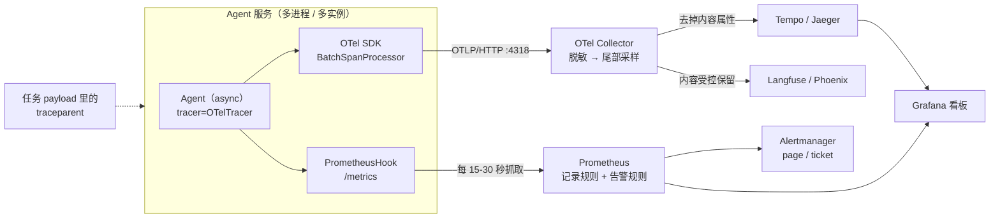
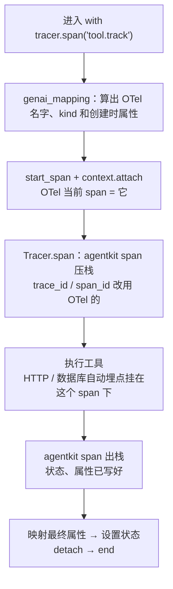
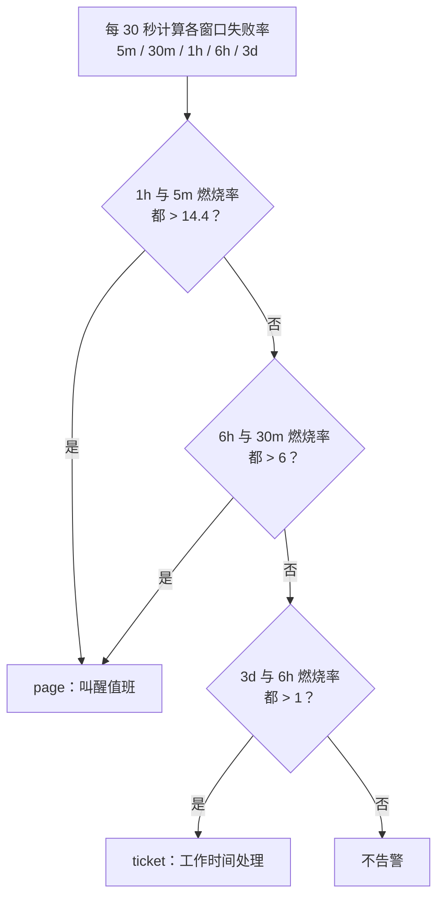
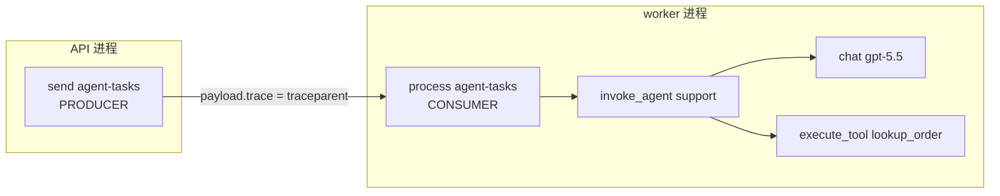

[中文](README.md) | [English](README.en.md)

# 第 28 课：生产可观测性 —— OpenTelemetry、Prometheus 与 LLM 观测平台

> 🕐 建议用时：25 分钟 ｜ 🎯 学完你能：把 agentkit 的追踪接到 OpenTelemetry 和任意 OTLP 后端、把运行指标接到 Prometheus，并在后端选型、采样、隐私、标签基数、SLO 告警和跨队列传播上做出有依据的取舍 ｜ 📦 对应源码：[`agentkit/contrib/otel.py`](../../agentkit/contrib/otel.py)、[`configs/`](configs/)（Collector 配置、告警规则、Grafana 看板）、[`demo.py`](demo.py) + [`worker_app.py`](worker_app.py)（worker 进程）+ [`otlp_receiver.py`](otlp_receiver.py)（OTLP 接收端进程）
>
> 📖 必读：[Alerting on SLOs](https://sre.google/workbook/alerting-on-slos/)（Steven Thurgood 等, 2018）—— Google《SRE Workbook》中的一章，本课燃烧率告警的出处。重点读它怎样从"方案 1：错误率超过 SLO 阈值就告警"一步步演进到"方案 6：多窗口多燃烧率"，每一步修掉上一步在精确率、召回率、检测时间、重置时间上的哪个缺点；再读"低流量服务"一节，Agent 流量的波峰波谷很明显，最容易在这里踩坑。

## 0. 一句话讲清楚

**先说清局限：教学版 agentkit 的可观测性只在一个进程里成立。** `Tracer` 要等根 span 结束才导出，写的是本地 JSONL，没有采样，trace 也传不到别的进程；指标得事后从 JSONL 里算。第 10 课用它讲清了原理，但它接不上公司现有的监控体系。

第 10 课相当于给一辆车装了行车记录仪。上了生产，你管的是一个车队：几十个 worker 进程、一条任务队列、几个模型网关。这时要解决的是另一类问题：

| 车队的需求 | 可观测性里叫什么 | 本课的做法 |
|---|---|---|
| 每辆车的记录实时回传，格式统一，换一家调度中心也能读 | OTLP 协议 + 语义约定 | `OTelTracer`：属性按 OTel GenAI 约定命名，用 OTLP 导出 |
| 录像太多存不下，只留出事和异常的片段 | 尾部采样 | Collector 的 `tail_sampling`：错误、慢请求全留，其余抽 5% |
| 录像里有乘客的脸和电话，要打码，而且不是谁都能看 | 脱敏与访问控制 | SDK 端默认不采集内容；Collector 用 HMAC 脱敏；运维后端拿不到内容 |
| 调度大屏只看几个数，不能为每位乘客单独开一个表盘 | 指标与标签基数 | `PrometheusHook`：禁止 user_id 当标签，租户数量有上限 |
| 出了问题要叫醒人，但不能一晚上叫十次 | SLO 与燃烧率告警 | `configs/prometheus-rules.yaml`：多窗口多燃烧率 |
| 乘客换乘到另一辆车，行程要能接上 | 跨进程、跨队列传播 | `inject_context` / `continue_trace`：traceparent 随任务 payload 走 |

## 1. 从教学实现到生产：差在哪

### 1.1 教学版做对了什么，缺什么

第 10 课的 `Tracer` 在三件事上已经做对了：span 树放在 `contextvars` 里（线程和 asyncio 都能隔离），暂停和中止不算错误，埋点处先脱敏再截断。本课保留这些设计，只补上生产环境缺的部分：

| 能力 | 第 10 课的 `agentkit.Tracer` | 生产环境需要 | 本课用什么 |
|---|---|---|---|
| 导出时机 | 根 span 结束时整棵树一起导出 | 每个 span 结束就进队列、分批异步发送；等 3 小时审批的运行也要能提前看到前半段 | OTel SDK 的 `BatchSpanProcessor` |
| 格式与协议 | 自定义 JSONL | 标准协议，后端可替换 | OTLP/HTTP（protobuf） |
| 属性命名 | 参考 GenAI 约定的简化版 | 与约定一致，后端才认得出模型、token、工具 | `genai_mapping`（按 2026-09 的约定核实） |
| 采样 | 全量 | 头部采样控制 SDK 开销，尾部采样保留错误和慢请求 | `ParentBased(TraceIdRatioBased)` + Collector `tail_sampling` |
| 跨进程 | 做不到 | W3C `traceparent` 穿过 HTTP、队列和进程 | `inject_context` / `continue_trace` |
| 指标 | 事后从 JSONL 算 | 实时、全量（采样之前）、可告警 | `PrometheusHook` + 记录规则 |
| 隐私 | 埋点处正则脱敏 | 多层：SDK 不采集 → Collector 脱敏 → 后端访问控制 | 三层都有，见问题 3 |

### 1.2 生产链路全景



两条路径要分开理解。**指标走 Prometheus，是全量的**：每次运行都计数，告警和 SLO 以它为准。**追踪走 Collector，是采样过的**：只用来排查"这一次到底发生了什么"。第 10 课问题 1 讲过，拿采样后的 trace 算成功率，结果一定是偏的。

### 1.3 GenAI 语义约定速查（按 2026-09 的版本核实）

GenAI 约定目前仍是 **Development** 状态，已迁到独立仓库 [open-telemetry/semantic-conventions-genai](https://github.com/open-telemetry/semantic-conventions-genai)。本课按其 main 分支（2026-09-24，commit `e57c543`）核实：

| 操作 | span 名 | span kind | 关键属性（创建 span 时就要给，采样器才看得到） |
|---|---|---|---|
| 模型调用 | `chat {gen_ai.request.model}` | `CLIENT`（模型跑在本进程时可以是 `INTERNAL`） | `gen_ai.operation.name=chat`、`gen_ai.provider.name`（Required）、`gen_ai.request.model` |
| 进程内的 Agent 调用 | `invoke_agent {gen_ai.agent.name}` | `INTERNAL` | `gen_ai.operation.name=invoke_agent`、`gen_ai.agent.name` |
| 远程 Agent 服务（如 OpenAI Assistants、Bedrock Agents） | 同上 | `CLIENT` | 另加 `gen_ai.provider.name`、`gen_ai.agent.id` |
| 工具执行 | `execute_tool {gen_ai.tool.name}` | `INTERNAL` | `gen_ai.tool.name`（Required）、`gen_ai.tool.call.id`、`gen_ai.tool.type` |

用量属性是 `gen_ai.usage.input_tokens` / `output_tokens`，另有 `gen_ai.usage.cache_read.input_tokens`、`gen_ai.usage.reasoning.output_tokens` 等。会话 ID 用 `gen_ai.conversation.id`，约定明确要求：**拿不到真实的会话 ID 就不填，不能用新生成的 UUID、trace_id 或内容哈希凑数。**

内容类属性（`gen_ai.input.messages`、`gen_ai.output.messages`、`gen_ai.system_instructions`、`gen_ai.tool.call.arguments`、`gen_ai.tool.call.result`）都是 **Opt-In**：约定要求默认不采集，但要提供开关。约定给了三种用法：默认不记录；记录在 span 属性上（适合预发环境）；把内容存到外部存储，span 上只记引用（推荐用于生产）。OTel Python 的 GenAI 工具包用环境变量 `OTEL_INSTRUMENTATION_GENAI_CAPTURE_MESSAGE_CONTENT` 控制这个开关，取值为 `NO_CONTENT`（默认）、`SPAN_ONLY`、`EVENT_ONLY`、`SPAN_AND_EVENT`，还需要同时设置 `OTEL_SEMCONV_STABILITY_OPT_IN=gen_ai_latest_experimental`。本课的 `OTelTracer` 也认这个开关的前两种取值。

> ⚠️ **"还在变"是实测出来的，不是客套话。** 本机安装的 `opentelemetry-semantic-conventions 0.66b0` 里，缓存写入 token 的常量是 `gen_ai.usage.cache_creation.input_tokens`，而约定 main 分支已经改叫 `gen_ai.usage.cache_write.input_tokens`；2026-08-27 约定还把缓存 token 属性从进程内 Agent span 上移除了（#469）。所以：锁定 SDK 版本，升级时对照 [`GENAI_SEMCONV_REF`](../../agentkit/contrib/otel.py) 复查映射。

## 2. 本课适配器怎么接（`agentkit/contrib/otel.py`）

### 2.1 五行接入

```python
from agentkit import Agent
from agentkit.contrib.otel import OTelTracer, PrometheusHook, setup_tracing, start_metrics_server

provider = setup_tracing("support-agent", sample_ratio=1.0)   # 端点从 OTEL_EXPORTER_OTLP_ENDPOINT 读
tracer = OTelTracer(provider)                                  # 默认不采集 prompt / 回复
metrics = PrometheusHook(tenant_label=True, allowed_tenants={"acme", "globex"})
start_metrics_server(9464, addr="0.0.0.0")                     # 容器里给 Prometheus 抓取
agent = Agent(llm, tools, tracer=tracer, hooks=[tracer, metrics, *other_hooks])
```

Agent 的代码一行没改：`tracer=` 本来就是 agentkit 的扩展点，`PrometheusHook` 是一个普通的 Hook。Agent 是 async 的（`await agent.run(...)`），同一个实例可以在一个进程里并发跑很多运行（[第 30 课](../30_async_runtime/README.md)），下面的父子关系、指标在这种并发下都成立。

### 2.2 `OTelTracer`：双写，而且两边的 ID 一致

`OTelTracer` 继承 `agentkit.Tracer`，只重写了 `span()` 这一个上下文管理器。在同一个 `with` 块里，它先创建 OTel span 并设为当前 span，再调用父类生成 agentkit span，退出时两边一起收尾：



几个设计决策：

1. **实时创建 OTel span，而不是在根 span 结束后"回放"整棵树。** 这样工具执行期间，OTel 的当前 span 就是 `execute_tool`。工具里的 `httpx`、数据库客户端只要装了 OTel 自动埋点，就会自动挂在它下面；在工具里调用 `inject_context()`，拿到的父 span 也是对的。
2. **ID 对齐**：agentkit span 的 `trace_id` / `span_id` 改用 OTel 的 32 位 / 16 位十六进制。于是 `RunResult.trace.trace_id` 就是能在 Jaeger、Tempo、Langfuse 里直接搜到的那个 ID，`render_tree`、viewer 和 JSONL 也照常可用。
3. **什么算错误**。OTel 的[记录错误约定](https://github.com/open-telemetry/semantic-conventions/blob/main/docs/general/recording-errors.md)规定：没出错时状态必须保持 UNSET；出错时设 Error 并写 `error.type`；已经被处理、让操作顺利完成的错误，不记在这个操作的 span 上。映射到 agentkit：

| 情况 | 哪个 span 标 ERROR | `error.type` | 为什么 |
|---|---|---|---|
| 工具超时 / 抛异常 / 业务错误 | `execute_tool` | `timeout` / `exception` / `tool_error` | 工具这个操作失败了；模型"消化"了错误、运行照常完成，所以根 span 不标 |
| 权限策略拒绝（`denied`） | 不标 | — | 系统按设计工作 |
| 模型彻底不可用 | `chat`（异常）和 `invoke_agent`（`failed`） | `LLMError` / `failed` | 异常信息先脱敏再写进 status description |
| 步数耗尽 / 运行超时 | `invoke_agent` | `max_steps` / `timeout` | 用户没有得到答案 |
| 等审批（PauseRun）、预算中止（StopRun） | 不标，记 `agentkit.interrupted` | — | 第 10 课问题 4：不是故障 |
| 取消（客户端断开，`CancelledError`） | 不标，记 `agentkit.interrupted=CancelledError` | — | 正常行为，不能触发告警 |
| 限流（`rate_limited`） | 不标 | — | SLO 里算坏事件（见问题 5）。但过载时它会成批出现，标成 ERROR 会让尾部采样把它们全部留下，在系统最忙的时候反而放大追踪流量 |

4. **内容默认关闭。** `capture_content=True` 或环境变量打开后，也会先经过 `redact_pii` 再截断（第 10 课：先截断会把手机号切成半截，正则就匹配不到了）。
5. **可选的 Hook 身份**：把 `tracer` 也放进 `hooks`（建议放第一个），它会补上 agentkit 核心 span 里没有的 `gen_ai.tool.call.id`、`gen_ai.conversation.id`（取自 `metadata["conversation_id"]`）和归一化的停止原因（`llm_error: 503 …` 变成 `llm_error`）。

**线程与 asyncio。** agentkit 的 span 栈和 OTel 的当前 span 都存在 `contextvars` 里，而且在同一个 `with` 块里一起设置、一起还原。每个线程、每个 asyncio task 都有自己的 context 副本（task 在创建时复制父 context），所以并发交错的运行、同一轮里并行的工具 task，父子关系都互不干扰。唯一的要求是：span 在哪个 task 里进入，就在哪个 task 里退出。普通的 `with` 块和 async 函数写法天然满足这一点。这不是推理出来的结论，[`tests/contrib/test_otel.py`](../../tests/contrib/test_otel.py) 用真实的 `Agent` 验证了三种情况：

- 50 个并发运行共用一个 `Agent`，每个运行在一轮里并行调用 3 个工具（两个 async 工具、一个跑在线程池里的同步工具）。结果是 50 条互不相同的 trace；每个工具 span 的父 span 都是本运行的 `invoke_agent`；三个工具 span 的时间区间确实重叠（真的并行了）；在每个工具内部检查，agentkit 的栈顶和 OTel 的当前 span 始终是同一个。
- 21 个运行里取消 10 个、1 个超时：被取消的运行状态为 UNSET，并带 `agentkit.interrupted=CancelledError`；超时的运行标 ERROR，`error.type=timeout`；在途运行数最后归零。
- 10 个并发运行同时停在审批上：`agent_approvals_pending` 等于 10，并发批准后归零。

### 2.3 `setup_tracing`：一行配好 provider

```python
setup_tracing(service_name, otlp_endpoint=None, sample_ratio=1.0, console=False,
              *, exporter=None, resource_attributes=None, set_global=True) -> TracerProvider
```

- **采样器是 `ParentBased(TraceIdRatioBased(sample_ratio))`**：有上游父 span 时跟随上游的决定。所以即使 worker 自己设了 0% 采样，只要生产者那边采样了，worker 也会记录，不会出现"生产者有、worker 没有"的半截 trace（测试里验证过）。
- **端点**：`otlp_endpoint="http://collector:4318"` 会自动补上 `/v1/traces`。SDK 的 `OTLPSpanExporter(endpoint=...)` 要的是完整 URL，而环境变量 `OTEL_EXPORTER_OTLP_ENDPOINT` 是基础地址（SDK 自己补路径），两种写法很容易混。不传参数时，端点和认证头都从 `OTEL_EXPORTER_OTLP_*` 环境变量读取。
- **导出失败不影响 Agent**：`BatchSpanProcessor` 在后台线程里异步导出，失败只会丢 span。实测把端点指向一个关着的端口，Agent 照常完成，耗时没有增加。

### 2.4 跨队列传播：`inject_context` / `continue_trace`

```python
# 生产者（API 进程）
with tracer.span("send agent-tasks", **{"otel.kind": "producer", "messaging.destination.name": "agent-tasks"}):
    await queue.enqueue("agent", {"input": text, "trace": inject_context({})}, tenant_id=tenant)
    # payload["trace"] == {"traceparent": "00-<trace_id>-<span_id>-03"}

# worker 进程（python -m agentkit.distributed.worker 加载的 handler）：run_worker 给每个任务一个 asyncio task，
# 各自进入 continue_trace，并发的任务互不串线
async def handle(job):
    async with continue_trace(job.payload["trace"]):
        with tracer.span("process agent-tasks", **{"otel.kind": "consumer", "messaging.destination.name": "agent-tasks"}):
            await agent.run(job.payload["input"])
```

`continue_trace` 同时支持 `with` 和 `async with`。进入时把提取出的上下文 attach 到**当前**线程或 task 的 context，退出时 detach。本课 Demo 第 2 节的 worker 进程（[`worker_app.py`](worker_app.py)）、第 26 课的 Postgres 队列、第 30 课的 async worker 都直接用它。

### 2.5 `PrometheusHook`：全量、低基数、可在 asyncio 下用

| 指标 | 类型 | 标签 | 用途 |
|---|---|---|---|
| `agent_runs_total` | Counter | `status`、`reason`（归一化的 stop_reason）[、`tenant`] | 可用性 SLI、按原因拆分 |
| `agent_run_duration_seconds` | Histogram | `status` | 延迟 SLO；桶边界包含 SLO 阈值 30、60 秒 |
| `agent_llm_tokens_total` | Counter | `direction`（input / output）[、`tenant`] | 用量 |
| `agent_llm_cost_usd_total` | Counter | [`tenant`] | 成本告警、按租户归因 |
| `agent_tool_calls_total` | Counter | `tool`、`error_type`（成功为 `none`） | 单个工具的错误率；模型编造的工具名一律记为 `__unknown__` |
| `agent_approvals_pending` | Gauge | — | 等待审批的积压 |
| `agent_runs_in_flight` | Gauge | — | 正在执行的运行数（并发度） |
| `agent_queue_depth`、`agent_queue_oldest_job_age_seconds` | Gauge | `queue` | 积压；由 `set_queue_stats()` 写入 |

所有回调都是普通方法（不是 `async def`），只做内存计数（prometheus_client 自带锁），Agent 直接调用。**但不要在这个 Hook（或任何写成普通方法的 Hook）里做阻塞 IO**：这些方法在事件循环线程里执行，一次 50ms 的阻塞会让同一进程里所有并发运行一起卡 50ms。需要查数据库的指标（审批积压、队列深度）请放到独立的定时任务里，用 `set_pending_approvals()` / `set_queue_stats()` 写入。

## 3. 企业问题卡片

### 问题 1：追踪后端选哪个？LLM 平台能不能直接接 OTLP？

**场景**：公司已有 Grafana + Prometheus；AI 团队 15 人，业务方想"看对话"、做在线评估；法务要求用户数据不出境；日均 20 万次运行。

**为什么难**：通用追踪后端不懂 LLM 语义；LLM 平台大多是 SaaS，而且这个赛道变化极快（2026 年 1 月 Langfuse 被 ClickHouse 收购；2026 年 3 月 Helicone 并入 Mintlify 并进入维护模式）。如果把埋点绑死在某个平台的 SDK 上，平台一变就得重写埋点。

| 方案 | 接入方式（已核实） | 优点 | 缺点 | 适用场景 |
|---|---|---|---|---|
| A. [Jaeger](https://www.jaegertracing.io/docs/latest/getting-started/)（v2，Apache-2.0，CNCF） | 原生接收 OTLP（4317 gRPC / 4318 HTTP）；all-in-one 镜像适合本地 | 开源、上手最快、UI 直观 | 不懂 LLM 语义；大规模存储要另配 | 本地开发、中小规模自建 |
| B. [Grafana Tempo](https://grafana.com/docs/tempo/latest/configuration/)（AGPL-3.0） | 分发器原生接收 OTLP；数据存对象存储；TraceQL 查询 | 存储便宜；和 Grafana、Prometheus 联动（从指标跳到 trace） | 同样不懂 LLM 语义；要自己运维 | 已有 Grafana 体系的团队，运维视角的主后端 |
| C. 商业 APM（如 [Datadog](https://www.datadoghq.com/blog/llm-otel-semantic-convention/)） | Datadog 自 2025-12 起原生支持 GenAI 约定 v1.37+，可经 OTLP 接入端点、Datadog Agent 或 Collector 发送 | 托管、全栈关联、支持 LLM 视图 | 按量计费，规模大了很贵；数据出公司 | 已经在用这家 APM，且合规允许 |
| D. LLM 专用平台 | [Langfuse](https://langfuse.com/integrations/native/opentelemetry)：`/api/public/otel`，**只支持 OTLP/HTTP**（不支持 gRPC），Basic 认证，自托管需 v3.22.0+，会映射 `gen_ai.*` 属性。[Arize Phoenix](https://arize.com/docs/phoenix/tracing/concepts-tracing/translating-conventions)（ELv2 许可证）：接收 OTLP，原生约定是 OpenInference；直接收 `gen_ai.*` span 也能看，但依赖 OpenInference 属性的界面功能会打折扣。[LangSmith](https://docs.langchain.com/langsmith/trace-with-opentelemetry)：`/otel` 端点，`x-api-key` 认证，映射 `gen_ai.*`（包括旧式的 `gen_ai.prompt.{n}.content`）。Helicone：以代理为主，异步日志走它自己的 SDK，文档里没有找到标准 OTLP 接入点，而且已进入维护模式 | 对话视图、评估、prompt 管理 | 各平台认的 `gen_ai.*` 版本不一样；SaaS 有数据出境问题 | 需要"看对话"和评估；数据敏感时选可自托管的 |

**怎么选**：**先定埋点标准（OTel + GenAI 约定 + OTLP），再选后端。** 运维视角（延迟、错误、依赖关系）用 B 或 A；LLM 视角（对话、评估）用 D 里能自托管的一个；由 Collector 同时发给两边，给两边不同的数据：运维后端拿不到内容属性。已经在用商业 APM、合规也允许的，C 可以替代 B。不管用哪家，业务代码都不直接依赖平台 SDK，这样换平台只需要改 Collector 配置。

**本课实现**：[`configs/otel-collector.yaml`](configs/otel-collector.yaml) 用 `forward` 连接器把"已脱敏、已采样"的数据分成两路：`traces/ops` 删掉内容后发给 Tempo，`traces/llm` 发给 Langfuse。Demo 第 4 节用一个本地迷你 OTLP 接收端，展示线上实际传输的内容（`POST /v1/traces`，`application/x-protobuf`）。

**从 agentkit Tracer 迁移到 OTel 的步骤**：
1. `Agent(tracer=Tracer(...))` 改成 `Agent(tracer=OTelTracer(setup_tracing("svc")), hooks=[tracer, ...])`。原来的 `jsonl_exporter` 可以作为 `OTelTracer(exporter=...)` 继续保留，迁移期两边对照。
2. 本地先用 Jaeger all-in-one 看效果：`OTEL_EXPORTER_OTLP_ENDPOINT=http://localhost:4318`。
3. 上线时应用只发给集群内的 Collector，由 Collector 决定发往哪些后端。
4. 用 Demo 打印的 `RunResult.trace.trace_id` 去后端搜索，确认两边是同一个 ID。

### 问题 2：采样 —— 头部还是尾部？一天存多少？Collector 要多少内存？

**场景**：日均 20 万次运行，按第 10 课的估算，每条 trace 约 25 个 span、只记元数据约 25 KB，全量每天约 5 GB。失败率约 3%，慢于 30 秒的约 2%。p99 运行时长 3 分钟，高峰流量是平均值的 5 倍。

**为什么难**：头部采样在请求一开始就做决定，这时还不知道这次运行会不会失败，所以会按比例丢掉失败的 trace。尾部采样要把整条 trace 攒齐再决定，而 Agent 的 trace 比普通 HTTP 请求长两三个数量级（分钟级对毫秒级），攒 trace 的内存是按"每秒新 trace 数 × 等待时长"算的。

| 方案 | 怎么做 | 优点 | 缺点 | 适用场景 |
|---|---|---|---|---|
| A. 全量 | 不采样 | 简单，任何一条都查得到 | 量大、贵 | 日均万次以内；预发环境 |
| B. 头部采样 | SDK 里 `sample_ratio=0.1` | SDK 和网络开销都降 90% | 失败和慢请求被等比例丢掉 | 只看趋势；或者 SDK 开销确实是瓶颈 |
| C. 尾部采样 | Collector `tail_sampling`：`status_code=ERROR` 全留、`latency ≥ 30s` 全留、等审批的全留，其余 `probabilistic` 5% | 最有价值的 trace 全在，存储降一个数量级 | 同一条 trace 的所有 span 必须到同一个 Collector 实例；要占内存 | 规模上来后的默认选择 |
| D. 头部 + 尾部 | SDK 先按 50% 采样降开销，Collector 再做尾部采样 | 两头都省 | 头部丢掉的错误 trace 就找不回来了 | 超大规模，且接受"错误只留一半" |

**成本估算**（数字来自上面的场景，公式可以直接套）：

- 存储：保留比例 ≈ 3% + 2% + 5% × 95% ≈ 10%，每天从约 5 GB 降到约 0.5 GB。
- Collector 内存 ≈ 高峰每秒新 trace 数 × `decision_wait` × 每条 trace 大小。20 万 ÷ 86400 ≈ 2.3 条/秒，高峰约 12 条/秒。`decision_wait` 至少要覆盖 p99 运行时长（180 秒），否则慢 trace 会被切成两半分别决策。12 × 180 × 25 KB ≈ 54 MB，这个规模没问题。
- 规模扩大 100 倍后是 1200 条/秒 × 180 秒 × 25 KB ≈ 5.4 GB，单个 Collector 扛不住。这时要按 README 的建议分两层：第一层用 `loadbalancing` 导出器按 trace ID 路由，第二层做尾部采样。`num_traces`（默认 50000）至少要设到"每秒 trace 数 × decision_wait"。

**怎么选**：日均万次以内选 A；规模上来之后选 C。B 和 D 只在 SDK 开销确实成问题时考虑。**指标永远在采样之前、按全量计算**：本课的 `PrometheusHook` 在进程里对每次运行计数，不受采样影响。

**本课实现**：应用里 `setup_tracing(sample_ratio=1.0)` 全量发给 Collector；Collector 里配 4 条保留策略，再加 `decision_cache`，让迟到的 span 沿用已经做过的决定（见问题 6）。测试 `test_sampling_ratio_zero_still_follows_a_sampled_upstream` 验证了 `ParentBased` 的行为：本地 0% 采样时一条都不导出，但上游已采样的 trace 会被跟随。

**迁移步骤**：
1. 先全量接入（`sample_ratio=1.0`），用一周时间看真实的 span 数、trace 大小和运行时长分布。
2. 按上面的公式定 `decision_wait` 和 `num_traces`，同时监控 Collector 的 `otelcol_processor_tail_sampling_sampling_trace_dropped_too_early`（trace 在做出决定前就被挤出内存）。
3. 确认错误和慢请求 100% 保留之后，再逐步调低 `probabilistic` 的比例。

### 问题 3：trace 里的 PII —— 在哪一层拦？

**场景**：客服 Agent 的 trace 同时发往 Tempo（200 名工程师可看）和 Langfuse（10 名 AI 工程师可看）。有人为了排查问题，在一个服务上打开了内容采集。

**为什么难**：正则只能抓格式固定的数据。本课 Demo 实测：手机号被替换了，"收货人张伟"原样保留。正则还会误伤，例如 18 位纯数字的订单号会被当成身份证号屏蔽。只靠某一层防护迟早会漏。

| 方案 | 在哪一层 | 怎么做 | 优点 | 缺点 |
|---|---|---|---|---|
| A. SDK 端不采集 | 应用进程 | 内容属性默认不写（Opt-In）；打开后也先 `redact_pii` 再截断；`user.id` 不原样导出，只写 HMAC 后的 `user.hash` | 数据根本不离开进程 | 看不到内容，排查不便 |
| B. Collector 脱敏 | 出口 | `redaction` 处理器按值匹配并替换为 `hmac-sha256`；`attributes` 删除内容键；`transform` 截断超长属性 | 集中处理，不依赖每个开发者自觉；能兜住别的服务误开的采集 | 正则有漏也有误伤；`attributes` 的 `hash` 动作用的是 SHA1，对手机号这类低熵数据可以穷举反查 |
| C. 后端访问控制 | 存储 | 运维后端不存内容；LLM 平台按项目授权、设保留期、放在境内；更严的做法是把内容外置到加密存储，span 上只记引用（约定推荐的生产做法） | 满足强合规要求 | 架构复杂；排查多一步 |

**怎么选**：三层都要，按"默认安全"的原则排序。A 是默认；B 兜住 A 的漏网之鱼和误操作；C 决定"谁能看到剩下的东西"。关联同一个用户的多次请求时用 HMAC，不用普通哈希（第 10 课问题 2）。Collector 的 `hmac_key` 从环境变量读取，不写进配置文件。

**本课实现**：`OTelTracer` 默认不采集内容，打开后仍先脱敏（Demo 1 的最后一段）。`genai_mapping` 永远不输出原始 `user.id`。Collector 配置里：`redaction` 屏蔽手机号、身份证号、邮箱、卡号，用 HMAC 替换；`attributes/strip-content` 在运维管道删掉全部内容属性。

> ⚠️ 实测踩到的坑：`redaction` 的 `blocked_key_patterns` 如果写成 `".*token.*"`（本意是屏蔽 API token），会连 `gen_ai.usage.input_tokens` 一起屏蔽掉，成本看板就全坏了。本课的配置只匹配 `api_key|secret|password|authorization`，测试里专门断言了这一点。

**迁移步骤**：
1. 迁移前，先 `grep` 一遍第 10 课的 JSONL，看看现在到底记了哪些属性。
2. 换成 `OTelTracer` 时保持 `capture_content=False`，确认后端看不到内容属性。
3. Collector 上线 `redaction` 时先设 `summary: debug` 跑一天，看它屏蔽了哪些键（排查误伤），再改成 `info`。
4. 真要看内容时，只在 LLM 平台那条管道放行，并给这个项目单独授权。

### 问题 4：指标与标签基数 —— 哪些维度能当标签？

**场景**：产品经理想要"每个用户的成功率"，于是有人给 `runs_total` 加了 `user_id` 标签。一周后 Prometheus 内存告警，查询越来越慢。

**为什么难**：每个不同的标签组合都是一条独立的时间序列。Prometheus 官方命名规范明确写着：不要用标签存高基数维度，例如用户 ID、邮箱这类取值无上限的字段。有些维度看着有限，实际上不受控：租户数随销售增长；工具名由模型生成，模型可以编出任意名字。

算一下：`runs_total` 的 `status`（6 种）×`reason`（约 10 种）×`tenant`（50 个）≈ 3000 条序列，没问题。换成 `user_id`（10 万个用户），同一个指标就是约 600 万条序列，而且每个进程、每个实例还要再乘一遍。

| 方案 | 怎么做 | 优点 | 缺点 | 适用场景 |
|---|---|---|---|---|
| A. 应用内 Prometheus 客户端 | `PrometheusHook`：进程内计数，暴露 `/metrics` | 全量、实时、零依赖后端 | 多进程要用多进程模式；标签要自己管 | 本课默认 |
| B. 从 span 派生指标 | Collector 的 `spanmetrics` 连接器 | 不改代码 | 必须放在采样之前；维度受 span 属性约束 | 已有 trace、不想改代码 |
| C. OTel Metrics SDK | 用 OTLP 发指标，由 Collector 转成 Prometheus 格式或 remote write | 与 trace 同一套协议和资源属性 | Python 这一侧的链路更长，排障更难 | 统一全用 OTel 的组织 |
| D. 高基数维度放 trace / 日志 | `user.hash`、`run_id`、`trace_id` 放在 span 属性和日志里，按需检索 | 维度没有上限 | 不能直接做告警 | 永远需要：用户投诉时按 ID 查 |

**怎么选**：A（或 C）做全量指标，D 负责高基数维度。每个标签都要回答"它有多少个取值，上限由谁保证"：`status`、`reason`、`direction` 是枚举；`tool` 由工具注册表限定，未知名字记为 `__unknown__`；`tenant` 只有在租户数有上限时才开，而且最好给一个白名单（`allowed_tenants`）；**`user_id`、`run_id`、`trace_id` 永远不当标签。** "每个用户的成功率"应该从 trace 或数仓里算。

**本课实现**：`PrometheusHook(tenant_label=True, max_tenants=50, allowed_tenants=...)`。超出上限或不在白名单里的租户归入 `__other__`（Demo 3 里的 `rnd-8f2c91`）。工具 × 错误类型 × 租户是乘法关系，所以 `tool_calls_total` 不加租户标签。练习 (c) 让你实现同样的防护。

**多进程**：gunicorn 或多 worker 部署时，按 [prometheus_client 官方做法](https://prometheus.github.io/client_python/multiprocess/)：

1. 进程启动前设置 `PROMETHEUS_MULTIPROC_DIR`，并清空这个目录；
2. `start_metrics_server()` 检测到这个环境变量后，会自动用一个新的 `CollectorRegistry` 加 `MultiProcessCollector` 汇总；
3. 在 gunicorn 的 `child_exit` 钩子里调用 `mark_process_dead(worker.pid)`；
4. 多进程模式有限制：不支持自定义 collector，不支持 `Info` / `Enum`，Gauge 要指定聚合方式（本课：在途数、审批数用 `livesum`，队列指标用 `livemostrecent`）。

测试 `test_multiprocess_mode_aggregates_counters_from_concurrent_workers` 起了两个 worker 进程，并发各跑 25 次运行，汇总结果正好是 50。

> ⚠️ 实测踩到的坑：常见的写法是"每个请求 new 一个 Agent 和一个 Hook"。如果指标在 Hook 的构造函数里注册，第二个请求就会抛 `Duplicated timeseries`。本课把指标对象和租户上限都放在进程级缓存里。最初只缓存了指标，租户上限跟着 Hook 实例走，结果每个请求都拿到一个全新的上限，防护形同虚设。这个问题是被测试抓出来的。

**迁移步骤**：
1. 第 10 课练习里"从 JSONL 算指标"那一步，换成 `PrometheusHook`，一定要算在采样之前。
2. 列出每个标签的取值上限，写进代码评审清单。
3. 上线后用 `count by (__name__)({__name__=~"agent_.*"})` 看每个指标有多少条序列，超出预期就报警。

### 问题 5：SLO 与告警 —— 怎么只在真出事时叫醒人？

**场景**：第 10 课问题 4 的延续：每周 150 条告警，九成是低流量时段的噪声。团队决定定 SLO：30 天内 99% 的有效运行成功结束，99% 的成功运行在 60 秒内结束。

**为什么难**：要先定义清楚什么是"坏"。对 Agent 来说：模型不可用、步数耗尽、超时、被自己的限流拒绝，都算坏；等审批、客户端主动断开、预算中止、输入被拦截，都不算（策略在按设计工作）。然后要选告警方式：阈值太敏感会误报，太迟钝会漏报；`for: 10m` 这类持续时间条件在错误率上下波动时会不停重置计时器，SRE Workbook 明确不推荐把它用在 SLO 告警上。

| 方案 | 怎么做 | 优点 | 缺点 | 适用场景 |
|---|---|---|---|---|
| A. 固定阈值 | 错误率 > 5% 就告警 | 简单 | 低流量误报；高流量时又不够灵敏 | 原型 |
| B. 阈值 + 最小流量 + 持续时间 | 第 10 课的方案 B | 能消掉大部分噪声 | 对慢速恶化不敏感；`for` 会被波动重置 | 还没定 SLO 的起步阶段 |
| C. 单窗口燃烧率 | 1 小时燃烧率 > 14.4 | 与用户影响挂钩 | 故障恢复后，1 小时平均值还要很久才降下来，告警迟迟不恢复（重置时间长） | 过渡 |
| D. 多窗口多燃烧率 | 1h 与 5m 都 > 14.4，或 6h 与 30m 都 > 6 → page；3d 与 6h 都 > 1 → ticket | 精确率、召回率、检测时间、重置时间都好 | 要先定好 SLO；记录规则多 | 有明确 SLO 的核心服务 |
| E. 分布漂移检测 | 步数、工具分布、输出长度、拒答率和上周对比 | 能抓到"没有报错的退化" | 容易误报 | 出日报，不用来叫人 |

**燃烧率**是"实际错误率 ÷ SLO 允许的错误率"。燃烧率 1 表示刚好在 30 天末用完预算。SRE Workbook 表 5-8 给出的参数：1 小时内燃烧率 14.4，烧掉 30 天预算的 2%（14.4 × 1 ÷ 720 = 2%）；6 小时内燃烧率 6，烧掉 5%；3 天内燃烧率 1，烧掉 10%。短窗口取长窗口的 1/12。



**怎么选**：有 SLO 的核心 Agent 用 D 做 page；B 和 E 作为补充，只发工单或日报。两个 Agent 特有的提醒：

- **SLO 定得太松，燃烧率告警就失效。** 燃烧率最大只能到 1 ÷ (1 − SLO)。SLO 为 95% 时最多是 20，14.4 的阈值意味着错误率要超过 72% 才会叫人。练习 (b) 里有一条测试专门算这个。
- **低流量保护**：凌晨 1 小时只有 5 次运行时，一次失败就是 20%。本课在 page 规则上加了"1 小时内有效运行 ≥ 20 次"的条件。SRE Workbook 的"低流量服务"一节还给了几种思路：生成人工流量、把小服务合并监控、放宽窗口。

**本课实现**：[`configs/prometheus-rules.yaml`](configs/prometheus-rules.yaml) 包含可用性和延迟两个 SLO 的记录规则（5m / 30m / 1h / 6h / 3d），以及以下告警：多窗口燃烧率（page / ticket）、p95 延迟、每次运行的成本（与上周同期比）、每小时花费上限、单个工具错误率、模型调用不存在的工具、队列积压（看最老任务等了多久，而不是队列长度）、审批积压、指标抓取失败。[`configs/grafana-dashboard.json`](configs/grafana-dashboard.json) 是对应的看板，导入时选择 Prometheus 数据源即可。

> ⚠️ 实测踩到的坑：Prometheus 3 会把直方图的 `le` 标签统一规范化成浮点写法，SLO 查询要写 `le="60.0"`，写 `le="60"` 会查不到数据。另外，SLO 阈值必须恰好是某个桶的边界：OTel 约定给 `gen_ai.invoke_agent.duration` 建议的桶是 0.1 × 2ⁿ（0.1 … 409.6），不包含 30 和 60，所以 `PrometheusHook` 没有照搬这组桶。

**迁移步骤**：
1. 第 10 课的 `compute_metrics` 只算了"成功率"。迁移时先把坏事件和不计入的事件写成明确的列表（见规则文件开头的注释），和业务方对齐。
2. 先部署记录规则，跑两周看真实的燃烧率曲线，再启用 page 告警。
3. 每条告警都配 `runbook_url`，告警描述里写清"先看哪个指标，再去哪里查 trace"。

### 问题 6：跨服务、跨队列的 trace 怎么串起来？

**场景**：API 进程收到请求，写入第 26 课的 Postgres 队列；worker 进程取出任务，调用 `Agent`；Agent 通过 HTTP 调用另一个团队的检索服务。排查一次投诉时，后端里是三条互不相关的 trace。

**为什么难**：HTTP 有自动埋点帮忙透传 header；队列 payload 没人帮你。任务在队列里可能等几秒，也可能等几个小时（遇上积压或审批）。等了几小时的任务如果还挂在原 trace 下，trace 就会跨越几个小时，而 Collector 早在 `decision_wait` 之后就对前半段做了决定，worker 这一段成了"迟到的 span"。

| 方案 | 怎么做 | 优点 | 缺点 | 适用场景 |
|---|---|---|---|---|
| A. HTTP 自动透传 | 服务间调用由 OTel 自动埋点注入 `traceparent` 头 | 零代码 | 只管同步调用 | 服务之间（必须做） |
| B. payload 带 traceparent，消费端作为父 span | `inject_context` 写进 payload，worker 里 `continue_trace` | 一整棵树，最直观 | 队列等待时间会算进 trace 时长；尾部采样可能先决定了前半段 | 单条消息、等待时间短（秒级） |
| C. payload 带 traceparent，消费端新开 trace 并加 span link | 消息约定（messaging semconv）的默认做法 | trace 不会被拉得很长；批量消费时也能关联多个生产者 | 后端对 link 的展示支持参差不齐 | 批量消费、等待时间长 |
| D. 业务 ID 关联 | span 上带 `agentkit.run_id`、`gen_ai.conversation.id` | 简单可靠，人能直接搜 | 看不到父子层级 | 永远都要有 |

**怎么选**：A + D 是底线。队列场景下，等待时间通常只有秒级时用 B（本课默认）；等待可能超过 `decision_wait` 或者是批量消费时用 C，同时一定要配置 `decision_cache`，让迟到的 span 沿用已经做出的"保留"决定（Collector 文档的 Late-Arriving Spans 一节）。审批恢复（`agent.resume`）本来就开新 trace，用 `run_id` 关联，也就是 D。



**本课实现**：`inject_context` / `extract_context` / `continue_trace`。Demo 第 2 节是真实的多进程链路：本进程（API）在 `send agent-tasks` span 里入队 6 个任务（SQLite 队列，payload 带 traceparent）；`WorkerPool` 拉起 2 个 worker 进程（`python -m agentkit.distributed.worker`，和第 13、26 课同一条命令），它们取出任务后 `continue_trace` 接着执行；3 个进程都用 OTLP/HTTP 把 span 发给第 4 个进程 —— 迷你接收端 [`otlp_receiver.py`](otlp_receiver.py)。结果：6 个任务里，生产者的 trace_id 和 worker 里 Agent 的 trace_id 全部相同，任务分给了 2 个不同的 worker 进程，接收端拼出的树里 `send`（API 进程）→ `process` → `invoke_agent`（worker 进程）是一条 trace。随后在本进程里用一个 `Agent` 并发处理 20 个任务，其中 3 个中途取消，结果 0 条串线。测试覆盖了进程、asyncio 两种 worker，以及格式错误的 carrier（开新 trace，不抛异常）。方案 C 可以直接用 OTel API：`tracer.start_as_current_span("process", links=[Link(get_current_span(extract_context(carrier)).get_span_context())])`。

> ⚠️ 实测踩到的坑：OTel Python 1.45 生成的 traceparent 最后两位是 `03`，而不是很多教程里写的 `01`。它同时置上了 W3C Trace Context Level 2 新增的 "random" 标志位（0x02）。如果你自己写代码判断 `flags == "01"` 来认定"已采样"，就会出错。应该按位判断 `int(flags, 16) & 0x01`。另外，`baggage` 会原样传给所有下游，包括第三方服务，不要往里放用户 ID。

**迁移步骤**：
1. 找出所有"写队列"和"起后台任务"的地方，在 payload 里加一个 `trace` 字段（`inject_context({})`）。
2. worker 取出任务后，用 `with` / `async with continue_trace(job["trace"])` 包住处理逻辑。
3. 发一个端到端请求，确认后端里只出现一个 trace_id（第 10 课问题 6 的验证方法）。
4. 统计队列等待时间的分布：p99 超过 `decision_wait` 时，改用方案 C 或调大 `decision_cache`。

## 4. 动手：运行 Demo

```bash
python lessons/28_production_observability/demo.py --offline   # 离线剧本，约 2 秒（含拉起 3 个子进程）
python lessons/28_production_observability/demo.py             # 真实模型，约 37 秒（约 20 次模型调用；本进程依次调用，两个 worker 进程各自最多 1 个在途请求）
```

缺少可选依赖时，Demo 会打印 `pip install -e ".[prod,prod-local]"` 并正常退出。离线模式输出节选：

```
▶ [工具失败] 用户：订单 A1002 到哪了？
  trace e06c4040a0058d360b1a0dec010c7a63
  invoke_agent support  internal  usage.input_tokens=60  usage.output_tokens=30  conversation.id=conv-7f3a
  ├─ chat scripted  client  request.model=scripted  provider.name=openai  usage.input_tokens=20  usage.output_tokens=10
  ├─ execute_tool lookup_order  internal  tool.call.id=call_255158244b1a
  ├─ chat scripted  client  ...
  ├─ execute_tool track_shipment  internal  ERROR  tool.call.id=call_8db4f8be5d8e  error.type=tool_error
  └─ chat scripted  client  ...
  RunResult.trace.trace_id = e06c4040a0058d360b1a0dec010c7a63  ← 与上面 OTel 的 trace_id 相同

  API 进程 pid 57098；worker 进程 pid [57100, 57101]（python -m agentkit.distributed.worker --queue sqlite:///…）
  任务    生产者（API 进程）的 trace_id               处理它的 worker           worker 里 Agent 的 trace_id
  #1    cda8b63c4a99fd97c37f89d7304bf880    worker-1（pid 57101）   cda8b63c4a99fd97c37f89d7304bf880  ✅
  #2    56a1cebc0776a0b89bef2ad864e00cb6    worker-1（pid 57101）   56a1cebc0776a0b89bef2ad864e00cb6  ✅
  #3    1715dfca6b2a521259a7ae6c24539157    worker-0（pid 57100）   1715dfca6b2a521259a7ae6c24539157  ✅
  ……（#4–#6 同样 ✅）
  6 个任务由 2 个不同的 worker 进程处理；worker 退出码 [0, 0]（0 = 收到 SIGTERM 后正常退出）

  接收端进程（pid 57099）一共收到 48 个 span，来自 3 个进程：hello-agent-api[pid 57098]、hello-agent-worker[pid 57100]、hello-agent-worker[pid 57101]
  trace cda8b63c4a99fd97c37f89d7304bf880
  send agent-tasks  producer  messaging.destination.name=agent-tasks  [pid 57098]
  └─ process agent-tasks  consumer  messaging.destination.name=agent-tasks  [pid 57101]
     └─ invoke_agent support  internal  usage.input_tokens=60  usage.output_tokens=30  [pid 57101]
        ├─ chat scripted  client  ...  [pid 57101]
        ……
  多进程指标：4 个指标文件（每个进程各写各的，例如 counter_57100.db），MultiProcessCollector 汇总后 agent_runs_total{status=completed} = 6（6 个任务）

  完成 17 个、取消 3 个；模型调用最高并发 10，运行中途采样的在途数 10
  被取消的运行：OTel 状态 ['UNSET']，agentkit.interrupted=CancelledError（取消不是错误，不触发告警）
  结束后：agent_runs_in_flight = 0，agent_runs_total{status=cancelled} = 3

    agent_runs_total{reason="final_answer",status="completed",tenant="acme"} 3.0
    agent_runs_total{reason="final_answer",status="completed",tenant="__other__"} 1.0
    agent_tool_calls_total{error_type="tool_error",tool="track_shipment"} 1.0

    POST /v1/traces  Content-Type: application/x-protobuf  3008 字节
      resource: service.name=hello-agent-demo  deployment.environment.name=demo  telemetry.sdk.version=1.45.0
```

**重点观察：**

1. **工具失败只让 `execute_tool` 变红，根 span 不红**：模型"消化"了错误，运行照常完成（对应 OTel 的记录错误约定）。
2. **审批前后是两条 trace**，靠 `agentkit.run_id` 关联；恢复后的根 span 上没有 `usage.*_tokens`。因为 agentkit 在 resume 的根 span 上记的是整个 run 的累计值，照搬过来会被按 span 求和的后端重复计数，所以改名成了 `agentkit.run.cumulative_*_tokens`。
3. **跨进程的 trace_id 完全一致**：API 进程写进 payload 的 traceparent 被另一个进程里的 worker 接上，worker 的根 span 挂在 `process agent-tasks` 下面；两边的 span 是各自的进程分别用 OTLP 发到接收端进程的，拼成一棵树靠的只是 trace_id 和 parent span_id。worker 收到 SIGTERM、`run_worker` 退出后，handler 的 `aclose()` 显式调用 `provider.shutdown()`，把 `BatchSpanProcessor` 里还没发出去的 span 发完（SDK 默认也会在解释器正常退出时 flush；被 kill -9 的进程两样都来不及，最后一批 span 就跟着丢了）。
4. **真实模型模式下，同一条 trace 分两批到达接收端**（第 4 节）：2 个 span（`chat`、`execute_tool lookup_order`）先到，剩下 4 个（含根 span）后到。`BatchSpanProcessor` 按"攒够一批或到时间"发送，而不是按 trace 发送，真实模型调用又要好几秒，所以一条 trace 会被拆开，根 span 最后才到。这正是 Collector 尾部采样需要 `decision_wait` 的原因。
5. **内容采集打开后，手机号被替换了，"张伟"原样保留**：问题 3 的现场演示。

想在界面里看：本机没有 Docker，下面的命令没有实际运行过，请在有 Docker 的机器上试：

```bash
docker run --rm -p 16686:16686 -p 4317:4317 -p 4318:4318 cr.jaegertracing.io/jaegertracing/jaeger:2.21.0
OTEL_EXPORTER_OTLP_ENDPOINT=http://localhost:4318 python lessons/28_production_observability/demo.py --offline
# 打开 http://localhost:16686，搜索 Demo 打印的 trace_id
```

## 5. 练习

打开 [exercise.py](exercise.py)，实现 4 个函数。它们都是纯 Python，不需要安装 OTel 或 prometheus_client：

| 函数 | 做什么 | 考察点 |
|---|---|---|
| `to_genai_attributes(name, attrs)` | agentkit span → GenAI 约定的 span 名和属性 | 内容 Opt-In、用户 ID 不导出、什么算错误、resume 的累计 token |
| `burn_rate(errors, total, slo_target)` | 燃烧率 | 定义、零流量、参数校验 |
| `should_page(short_window, long_window, thresholds)` | 多窗口多燃烧率判断 | 两个窗口都要超过、严格大于、没有数据不告警 |
| `guard_label_cardinality(labels, allowed, max_values, seen)` | 标签基数防护 | 禁用字段、白名单、溢出桶、出错时不留半截状态 |

```bash
make lesson N=28
# 等价于 .venv/bin/python -m pytest lessons/28_production_observability
```

其中一条测试会用真实 Agent 跑出 13 个 span，逐个拿你的 `to_genai_attributes` 和 `agentkit.contrib.otel` 的实现对比。

## 6. 运维要点与常见坑

1. **把"采样后的 trace"当指标源。** 指标用 `PrometheusHook` 全量计数，trace 只用来排查。
2. **`decision_wait` 按 HTTP 请求的经验设成几秒。** Agent 的运行是分钟级的，慢 trace 会被切成两半分别决策。按 p99 运行时长设置，并监控 `sampling_trace_dropped_too_early`。
3. **只部署一个 Collector 做尾部采样，扩容时直接加副本。** 同一条 trace 的 span 必须到同一个实例，要用 `loadbalancing` 导出器分两层部署。
4. **`force_flush()` 返回 True 就以为导出成功了。** 实测：端点不可达时，`force_flush(2000)` 阻塞了约 7 秒（导出器自己的超时默认 10 秒，带退避重试），返回值仍然是 True，失败只在日志里告警。短命进程（cron、Lambda）要设置 `OTEL_EXPORTER_OTLP_TRACES_TIMEOUT`（测试里设为 1 秒后约 1 秒返回），并在退出前 flush。
5. **导出器名字写旧的。** Collector 自 v0.144.0 起把 `otlp` 导出器改名为 `otlp_grpc`，`otlphttp` 改名为 `otlp_http`，旧名是已弃用的别名（接收器仍叫 `otlp`）。网上大量示例还是旧名。
6. **Langfuse 配成 gRPC。** 它只支持 OTLP/HTTP。
7. **`user_id`、`run_id` 当指标标签；每个请求 new 一个 Hook。** 见问题 4。
8. **在写成普通方法的 Hook 里做阻塞 IO**，拖慢同一进程里所有 asyncio 运行。见 2.5 节。
9. **把取消当错误。** 客户端断开是正常行为，标成 ERROR 会触发错误率告警，尾部采样还会把这些 trace 全部留下。
10. **`.*token.*` 这类脱敏键模式**会误伤 `gen_ai.usage.*_tokens`，见问题 3。
11. **`le="60"`**：Prometheus 3 里要写 `le="60.0"`。
12. **进程内的审批积压计数在多 worker 下会漂移**：暂停发生在 A 进程，恢复在 B 进程，A 的计数就永远减不下来。多 worker 部署时传 `track_approvals=False`，由一个定时任务从数据库统计后调用 `set_pending_approvals()`。
13. **`OTEL_SERVICE_NAME` 不生效。** 实测 `Resource.create()` 里代码传入的 `service.name` 会覆盖这个环境变量。要让运维通过环境变量控制，就别在代码里写死 `service_name`。
14. **诚实声明**：Collector 配置、Prometheus 规则和 Grafana 看板只用 pyyaml / json 校验了语法，并用测试检查了它们与代码的一致性（引用的指标确实存在、管道引用的组件都有定义）。本机没有 Docker，没有实际启动 Collector、Prometheus、Grafana，也没有运行 `promtool check rules`。上线前请在你的环境里跑一遍。

## 7. 如何切换到托管服务

代码不用改，只改环境变量或 Collector 的导出器：

| 目标 | 应用侧（直连） | Collector 侧（推荐） | 备注 |
|---|---|---|---|
| 自建 Jaeger / Tempo | `OTEL_EXPORTER_OTLP_ENDPOINT=http://collector:4318` | `otlp_grpc/tempo`，`endpoint: tempo:4317` | 本课默认 |
| Langfuse Cloud / 自托管 | `OTEL_EXPORTER_OTLP_ENDPOINT=https://cloud.langfuse.com/api/public/otel`，`OTEL_EXPORTER_OTLP_HEADERS=Authorization=Basic%20<base64(pk:sk)>` | `otlp_http/langfuse`，`endpoint` 同左，`headers` 从 `${env:LANGFUSE_AUTH}` 读 | 只支持 HTTP；环境变量里的空格要写成 `%20`；自托管需 v3.22.0+ |
| LangSmith | `OTEL_EXPORTER_OTLP_ENDPOINT=https://api.smith.langchain.com/otel`，头 `x-api-key`、`Langsmith-Project` | `otlp_http/langsmith` | 欧盟、亚太区域的域名不同 |
| Datadog | 发给开启 OTLP 接收的 Datadog Agent，或官方 OTLP 接入端点 | Collector 的 Datadog 导出器，或 Datadog 发行版的 Collector | 需要 GenAI 约定 v1.37+ |
| 托管 Prometheus | — | Prometheus `remote_write` 到托管服务 | 规则文件和看板不用改 |

切换步骤：
1. 先在 Collector 里**加**一个导出器，新旧后端并行一周，对比 trace 数量和属性；
2. 确认新后端的数据保留期、访问控制和数据所在地区符合合规要求（问题 3 的方案 C）；
3. 再删掉旧导出器。应用始终只认识 Collector。

## 8. 面试 & 设计评审问题

<details>
<summary>Q1：为什么说"先定埋点标准，再选后端"？具体怎么做？</summary>

- LLM 观测平台变化很快（收购、维护模式），各平台认的 `gen_ai.*` 版本也不同；
- 埋点统一用 OTel SDK 加 GenAI 约定，协议用 OTLP；业务代码不依赖任何平台 SDK；
- 应用只发给 Collector，由 Collector 决定发往哪些后端、每个后端拿到哪些属性；
- 换平台只改 Collector 配置；锁定约定版本，升级时复查属性映射。
</details>

<details>
<summary>Q2：Agent 的尾部采样和普通 Web 服务有什么不同？怎么估算 Collector 的内存？</summary>

- Agent 的 trace 是分钟级的（普通请求是毫秒级），`decision_wait` 要覆盖 p99 运行时长；
- 内存 ≈ 高峰每秒新 trace 数 × decision_wait × 每条 trace 大小；`num_traces` 至少要设到"每秒 trace 数 × decision_wait"；
- 同一条 trace 必须到同一个实例：第一层 `loadbalancing` 按 trace ID 路由，第二层做采样；
- 队列等待和审批会让 trace 更长：用 `decision_cache` 处理迟到的 span，或改用 span link 新开 trace。
</details>

<details>
<summary>Q3：Tracer 换成 OTel 以后，在 asyncio 高并发下父子关系为什么还是对的？怎么证明？</summary>

- agentkit 的 span 栈和 OTel 的当前 span 都存在 contextvars 里，并且在同一个 with 块里一起设置、一起还原；
- asyncio task 在创建时复制 context，并行工具 task 各自拿到父 span 的副本；
- 前提是 span 在哪个 task 里进入就在哪个 task 里退出；
- 证明：50 个并发 Agent 运行加并行工具，断言 50 条 trace、每个工具 span 的父 span 正确、工具内部两套上下文一致；再加上取消和超时的场景。
</details>

<details>
<summary>Q4：Agent 的可用性 SLO 里，哪些算坏事件？为什么限流算坏、但 trace 不标 ERROR？</summary>

- 坏：模型不可用、步数耗尽、超时、被自己的限流拒绝（用户都没拿到答案）；
- 不计入：等审批、客户端取消、预算中止、输入拦截（策略在按设计工作）；
- 限流在过载时成批出现，标 ERROR 会让尾部采样全部保留，在最忙的时候放大追踪流量；它的影响由指标和 SLO 来反映。
</details>

<details>
<summary>Q5：解释多窗口多燃烧率告警。为什么要两个窗口？SLO 设成 95% 会怎样？</summary>

- 燃烧率 = 错误率 ÷ 错误预算；14.4 持续 1 小时会烧掉 30 天预算的 2%；
- 长窗口保证"确实烧掉了可观的预算"（精确率），短窗口保证"现在还在烧"（缩短重置时间）；
- page：1h 与 5m 都 > 14.4，或 6h 与 30m 都 > 6；ticket：3d 与 6h 都 > 1；
- 燃烧率最大只能到 1 ÷ (1 − SLO)，95% 时只有 20，14.4 的阈值对应 72% 的错误率，基本失去意义。
</details>

<details>
<summary>Q6：指标的标签怎么设计？"每个用户的成功率"这个需求怎么满足？</summary>

- 每个标签都要说清取值上限、由谁保证：枚举类可以用，租户要有上限或白名单，工具名要防止模型编造；
- user_id、run_id、trace_id 永远不当标签，放进 trace 和日志；
- "每个用户的成功率"从 trace 或数仓里算，用 HMAC 后的 user.hash 关联。
</details>

<details>
<summary>Q7：trace 里的 PII 分几层防护？各层的盲区是什么？</summary>

- SDK 端：内容 Opt-In，打开后先脱敏再截断；盲区是正则抓不住自由文本；
- Collector：redaction 用 HMAC 替换，attributes 删掉内容键；盲区是正则误伤（18 位订单号）和配置失误（`.*token.*`）；
- 后端：访问控制、保留期、数据所在地；最严格的是内容外置，span 上只记引用。
</details>

<details>
<summary>Q8：任务在队列里等了 2 小时，trace 应该怎么接？</summary>

- 用 payload 里的 traceparent 当父 span，会让 trace 跨越 2 小时，尾部采样早就对前半段做了决定；
- 更好的做法是新开 trace，加一个指向生产者的 span link（消息约定的默认做法），再用 run_id 关联；
- 不管哪种做法，都要配置 `decision_cache`，并监控队列等待时间的分布。
</details>

## 9. 自测清单

- [ ] 我能说出第 10 课的 `Tracer` 在生产环境缺哪几样，以及本课分别用什么补上
- [ ] 我知道 `chat`、`invoke_agent`、`execute_tool` 三种 span 的命名、kind 和必填属性，也知道这套约定仍在变化
- [ ] 我能说明 `OTelTracer` 为什么要实时双写、为什么要对齐 ID，以及在 asyncio 下为什么正确
- [ ] 我能列出哪些情况标 ERROR、哪些不标，并解释取消和限流为什么不标
- [ ] 我能用公式估算尾部采样的存储量和 Collector 内存
- [ ] 我能设计三层 PII 防护，并说出每一层的盲区
- [ ] 我能判断一个维度能不能当 Prometheus 标签，并知道多进程模式要做哪几件事
- [ ] 我能写出多窗口多燃烧率的告警规则，并解释 14.4 和 6 这两个数是怎么来的
- [ ] 我能让 trace 穿过队列、进入另一个 worker 进程（并发的 asyncio 任务之间互不串线），并知道什么时候该改用 span link
- [ ] 我完成了练习：`make lesson N=28` 全部通过

## 延伸阅读

- [OpenTelemetry GenAI 语义约定（独立仓库）](https://github.com/open-telemetry/semantic-conventions-genai)：`docs/gen-ai/` 下的 spans、agent spans、metrics、events
- [OTel 记录错误的约定](https://github.com/open-telemetry/semantic-conventions/blob/main/docs/general/recording-errors.md)：什么时候设 Error，什么时候保持 UNSET
- [W3C Trace Context](https://www.w3.org/TR/trace-context/)（Recommendation, 2021）与 [Level 2](https://www.w3.org/TR/trace-context-2/)（random 标志位）
- [Collector tail sampling processor](https://github.com/open-telemetry/opentelemetry-collector-contrib/tree/main/processor/tailsamplingprocessor)：策略、扩容、迟到 span
- [Collector redaction processor](https://github.com/open-telemetry/opentelemetry-collector-contrib/tree/main/processor/redactionprocessor)：按值脱敏与 HMAC
- [prometheus_client 多进程模式](https://prometheus.github.io/client_python/multiprocess/)与 [Prometheus 命名规范](https://prometheus.io/docs/practices/naming/)
- [Google SRE Workbook · Alerting on SLOs](https://sre.google/workbook/alerting-on-slos/)
- 本仓库：[第 10 课 可观测性](../10_observability/README.md)（原理）、[第 09 课 安全](../09_security/README.md)（PII）、[第 13 课 分布式](../13_distributed_concurrency/README.md)、[第 26 课 队列](../26_state_and_queues/README.md)、[第 30 课 异步运行时](../30_async_runtime/README.md)
