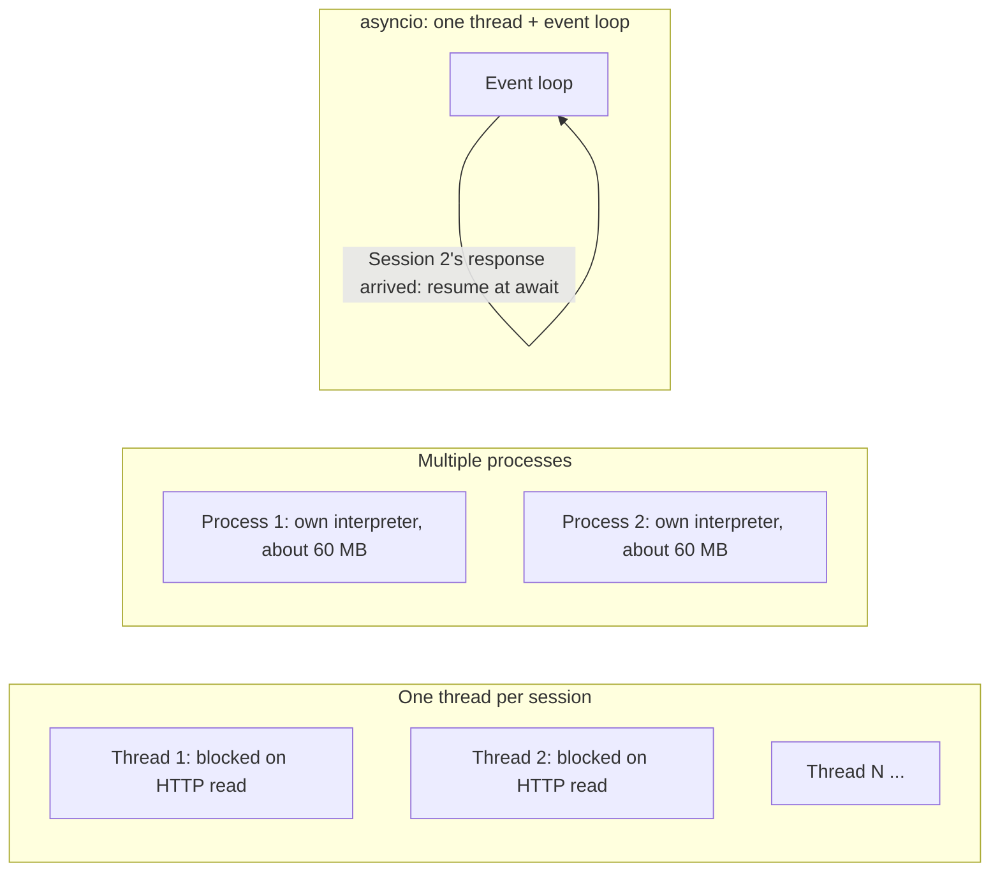
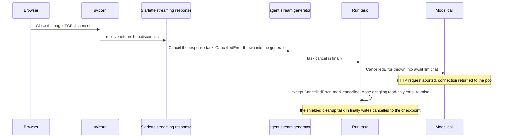
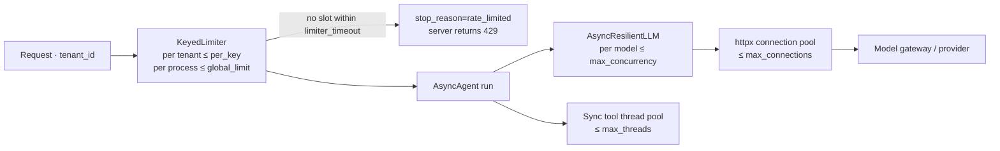

[中文](README.md) | [English](README.en.md)

# Lesson 30: Async runtime and high-concurrency serving — hundreds of sessions in one process

> 🕐 Time: 30 min | 🎯 You'll be able to: use Little's Law to size the concurrency an agent service needs; explain the reasoning behind every design decision in `AsyncAgent` (state isolation, parallel read-only tools, three timeout semantics, cancellation propagation, deadlines, bulkheads and backpressure, retrying only before the first token, a ContextVar event sink); use measured numbers to decide between threads, processes, and asyncio; and spot and fix 8 common classes of async bugs | 📦 Source: [`agentkit/aio/`](../../agentkit/aio/__init__.py) ([`agent.py`](../../agentkit/aio/agent.py), [`llm.py`](../../agentkit/aio/llm.py), [`tools.py`](../../agentkit/aio/tools.py), [`limits.py`](../../agentkit/aio/limits.py), [`reliability.py`](../../agentkit/aio/reliability.py)), tests in [`tests/test_aio.py`](../../tests/test_aio.py)
>
> 📖 Primary reading: [Notes on structured concurrency, or: Go statement considered harmful](https://vorpus.org/blog/notes-on-structured-concurrency-or-go-statement-considered-harmful/) (Nathaniel J. Smith, 2018) — why casually spawning a background task breaks abstraction the way goto did. Focus on "Nurseries: a structured replacement for go statements": once a child task can't outlive the scope that created it, error propagation and cancellation become something you can reason about again. The defect found in Section 2.5, Problem card 5, and Exercise (a) all apply this idea directly.

## 0. In one sentence

**An agent service spends well over 95% of its time waiting (on models, on tools). An async runtime lets one thread advance other sessions during those waits, so one process can serve hundreds of sessions at once. The price: you have to get cancellation, timeouts, rate limits, and "never block" right.**

First, an honest note on the teaching version's limits. `agentkit.Agent` is synchronous. One thread advances one session at a time; tools within a turn run one after another; tool timeouts are implemented with a thread pool, so a timed-out thread can't be killed and keeps running in the background; there's no streaming output; and the caller has no way to cancel a run midway. [Lesson 13](../13_distributed_concurrency/README.en.md) scaled it out with "multiple processes + a queue", but each process still runs one session at a time.

An analogy. The sync agent is a bank teller who finishes one customer before calling the next number, even though customers spend most of their time filling out forms (waiting on the model). asyncio is one teller serving hundreds of customers at once: whoever is filling out a form gets set aside, and whoever is done gets served. There's one rule: the teller must never stop to do something slow personally, like walking down to the basement to fetch a file (blocking IO). If they do, everyone in the lobby waits.

| Sync agent limitation | What `agentkit.aio` does | Evidence from this lesson (Section 3) |
|---|---|---|
| One session per process at a time | The event loop advances sessions concurrently; one `AsyncAgent` instance is shared by all sessions | 200 sessions: sync serial 81.63 s, `AsyncAgent` 0.44 s |
| Tools in a turn run serially | Read-only tools in parallel, write tools serially | Three 0.3-second read-only tools: 0.91 s → 0.30 s |
| A timed-out thread can't be killed | Async tools are truly cancelled; sync tools go to a bounded thread pool; process-isolated tools get a hard timeout | The 3 timeout tests in `tests/test_aio.py` |
| No cancellation | `CancelledError` propagates all the way; the checkpoint is marked `cancelled` | 6–10 ms after the client disconnects, a model call that would have taken 30 s is cancelled |
| No streaming | `stream()` yields events step by step; retries only before the first token | Real model: first chunk arrives after 2.9 to 6.4 s |
| One tenant can eat all the capacity | `KeyedLimiter` per-tenant bulkheads plus a per-model concurrency cap | The quiet tenant's completion time: 1.40 s → 0.20 s |

## 1. Why agent services must be async

### 1.1 Where the time goes: almost all waiting

Measured in this lesson's demo (Section 3): a real model call has a median of about 2 seconds, while `AsyncAgent` itself spends only about **0.35 ms** of CPU to advance one session (two model calls plus one tool call); before the two hotspots found in this lesson were fixed it was about 1 ms (see Section 3.1). Over its lifetime, a session keeps the CPU busy less than a thousandth of the time.

That tells you where the bottleneck is: **not how fast you compute, but how many things you can wait on at once.**

### 1.2 Little's Law: size the concurrency first

Little's Law: **L = λ × W**. The number of requests in the system at once, L, equals the arrival rate λ times the average time each request spends in the system, W. The AWS Lambda docs estimate function concurrency with the same formula: `Concurrency = (average requests per second) * (average request duration in seconds)`.

| Scenario | λ (requests/s) | W (s/request) | L = sessions that must be "waiting" at once |
|---|---|---|---|
| Corporate IT help desk, morning peak | 50 | 8 | **400** |
| E-commerce support, big sale | 200 | 5 | **1000** |
| Offline batch evaluation, 20 submitted per second | 20 | 30 | **600** |

Run it backwards: with only 16 threads (L = 16) and W = 8 s, the maximum throughput is λ = 16 / 8 = **2 requests per second**. Scenario 1 in Section 3 verifies this formula with measured numbers.

Every "waiting" session needs a carrier: a thread, a process, or a coroutine. So the question becomes: **which carrier is cheapest, and can be cancelled safely?**

### 1.3 Comparing the three carriers



| Dimension | One thread per session | Multiple processes | asyncio coroutines |
|---|---|---|---|
| Memory per "waiting" session | Measured about 25–35 KB resident per blocked thread, plus virtual memory reserved for the stack | About 60 MB per process (measured here: interpreter after importing agentkit and openai) | Idle coroutine measured at about 1 KB; an in-flight session with full agent state about 17–19 KB |
| Time to create 2000 | Measured 253–926 ms | Each process starts an interpreter and imports dependencies (hundreds of ms each with spawn) | Measured 6 ms |
| How switching happens | Preemptive, by the OS: a switch can happen between any two lines, so shared data needs locks | OS scheduling, no shared memory | Cooperative, only at `await`; code between two `await`s is naturally "atomic" |
| GIL | Released while waiting on IO, but all Python code still takes turns | One GIL per process, so you can use every core | Single thread, no GIL contention, but only one core |
| Connections to the model gateway | All threads share one thread-safe connection pool | One pool per process; total connections = processes × pool size | One pool per event loop |
| Can you cancel midway? | **No**, you can't kill a thread; it keeps running after a timeout | Yes, kill the whole process | Yes, at any `await` |
| Typical concurrency | Tens to hundreds | Equal to the CPU core count (more doesn't help) | Hundreds to tens of thousands |

The conclusion up front (Problem card 1 expands on it): **production usually combines them**. One process per CPU core (sidesteps the GIL, isolates failures), one event loop per process (holds hundreds to thousands of concurrent sessions), unavoidable legacy sync code in a bounded thread pool, and untrusted or CPU-heavy code in a subprocess or sandbox.

One piece of context that is shifting: Python's free-threaded (no-GIL) build reaches "officially supported" status in 3.14 ([PEP 779](https://peps.python.org/pep-0779/)), but it's still an optional build, not the default. It also only solves "running Python code on many cores"; it doesn't solve "threads can't be killed" or "per-thread memory cost". So it doesn't change this lesson's conclusions.

## 2. The design of AsyncAgent: a reason behind every decision

`AsyncAgent` matches the sync `Agent` point for point: hooks, context strategies, checkpoints, approval pause and resume, budgets, tracing, and redaction all behave the same. This section covers only what the sync version can't do, or what has to be done differently under concurrency.

### 2.1 One instance is shared concurrently, so all state lives in `RunState`

```python
agent = AsyncAgent(llm, tools=[...])          # created once at process start
results = await asyncio.gather(*(agent.run(q) for q in questions))  # hundreds of sessions share it
```

The top of [`agent.py`](../../agentkit/aio/agent.py) states the constraint: one `AsyncAgent` instance can be reused concurrently; all data for a run lives in `RunState`, and the instance itself holds nothing that belongs to "this run".

**Why**: creating a new agent per request would recreate the thread pool and connection pool every time, which defeats the point of a pool. But once the instance is shared, anything about "this run" stored on `self` is read and written by hundreds of sessions at once. The `LoopGuard` exercise in [Lesson 08](../08_reliability/README.en.md) taught the same lesson: counts belong in `state.metadata`, not on the hook instance. In asyncio this is even sneakier because no extra threads are involved: the moment session A suspends at an `await`, session B may change the data on `self`.

**Your hooks too**: hook instances are also shared by every session. Anything that belongs to "this run" goes into `state`.

**Evidence**: `test_one_process_runs_many_sessions_concurrently` has 100 sessions share one instance; model calls peak at ≥ 90 in flight, and every session sees only its own question. The 1000 sessions in demo Scenario 1 were also checked one by one: zero crossed wires.

### 2.2 Read-only tools in parallel, write tools serially

```python
# agentkit/aio/agent.py: _run_pending_tools
parallel = self.parallel_tools and len(calls) > 1 and all(t is not None and t.risk == "read" for t in tools)
if not parallel:
    for call in calls:  # there's a write: run in the model's order, checkpoint after each one
        ...
results = await asyncio.gather(*(one(c) for c in calls), return_exceptions=True)
```

**Why split it this way**: read-only tools don't depend on each other, so order doesn't matter, and running them in parallel turns a turn's latency from "sum" into "max". Write tools are different. The model may "create a ticket" and then "add a note to the ticket"; get the order wrong and the result is wrong. Each write tool also checkpoints right after it runs, keeping the "executed but not recorded" window as small as possible ([Lesson 08](../08_reliability/README.en.md)).

**Why `return_exceptions=True`**: `PauseRun` (waiting for approval) and `StopRun` (budget exhausted) are control flow implemented as exceptions. After all results are in, completed tool results are written back in the original order and checkpointed first, and only then is the first control-flow exception re-raised. That way a resume doesn't rerun tools that already finished. It has a lesser-known benefit too, covered in Problem card 5: under external cancellation, `gather` with `return_exceptions=True` waits for every child to finish cleaning up, and the default doesn't.

**Cap**: `max_parallel_tools=8`, a semaphore limiting how many tools run in parallel within one turn. Now and then a model asks for 30 tools at once; that mustn't turn into 30 instant downstream requests.

**A pitfall found while testing this lesson, now fixed: parallel tools bypassed the budget.**
- Symptom: with `BudgetHook(max_tool_calls=1)`, the model called 4 read-only tools in one turn; all 4 ran and the run completed normally.
- Root cause: `BudgetHook.before_tool` checks `state.tool_calls_count`, and that count used to go up only **after** a tool finished. In parallel mode, each of the 4 calls runs `before_tool` in its own task first; at that moment none has finished, so all of them see "still under budget". The same code is correct serially and wrong the moment it runs in parallel.
- Fix: the count now goes up **before** execution (`state.tool_calls_count += 1` moved ahead of `await self.executor.execute(...)`), and the sync `Agent` was changed too, so both behave the same.
- Regression test: `test_parallel_read_tools_respect_tool_call_budget`, which asserts that only the first tool ran and `stop_reason == "budget_exceeded"`.

The general lesson: "check first, update later" is fine in serial code; once anything runs concurrently in between (even single-threaded asyncio), you must **claim the slot at the moment you check**.

### 2.3 Three ways to execute a tool, three timeout semantics

| Tool type | How it runs | What a timeout does |
|---|---|---|
| `async def` tool (HTTP APIs, databases) | Awaited directly in the event loop, wrapped in `asyncio.wait_for` | **Real cancellation**: `CancelledError` is raised inside the tool and the connection is released |
| Plain sync function | Runs in a bounded thread pool (`max_threads=32`), without blocking the event loop | The caller gets a timeout on time, **but the thread can't be killed**; it runs to completion in the background |
| Tool marked with `isolated(tool)` | Runs in a spawned subprocess | **Hard timeout**: the subprocess is killed |

**Why threads can't be killed**: Python has no API to kill a thread safely. When `wait_for(loop.run_in_executor(...))` times out, the caller simply stops waiting; the thread keeps going. The consequence is worse than it looks: the stuck thread keeps holding a slot in the pool. Once all 32 slots are taken, new sync tools can only wait in the queue. And `wait_for` starts its timer while they're still queued, so they all "time out" without running a single line.

**Why process isolation too**: a pure-computation infinite loop has no `await` point, so coroutine cancellation can't stop it; and because of the GIL it slows every thread in the process. The only reliable fix is to kill the process. The cost: arguments must be picklable, and every call starts a subprocess. Measured here, a run using an isolated tool that does nothing takes about 140 ms end to end. Stronger isolation in production means containers, gVisor, or microVMs ([Lesson 19](../19_mcp_and_sandbox/README.en.md)).

**A small issue found while testing this lesson, now fixed: starting a subprocess stalled the event loop.**
- Symptom: with a 5 ms heartbeat, each isolated tool call stalled the event loop by up to about 11 ms.
- Root cause: `run_in_subprocess` called `proc.start()` (spawn does fork/exec and then ships the arguments) and `proc.join(timeout=2)` **synchronously** on the event loop thread. It's a hidden instance of Section 5.1's "blocking call inside async code", buried in the framework rather than in business code.
- Fix: `proc.start` now runs in the thread pool; `proc.join` runs in a thread too, protected by `asyncio.shield`, so the child is reaped even if the caller is cancelled and no zombie is left behind. A later code review found that if the wait for `join` was cancelled, the following `parent.close()` was skipped and the pipe stayed open until garbage collection; the second round moved it into `finally`.
- Regression test: `test_subprocess_start_does_not_run_on_event_loop_thread`, which asserts that `start` doesn't run on the main thread (where the event loop lives). The same heartbeat measurement after the fix gave 4–12 ms, but the machine was heavily loaded at the time (load average 20–33), and jitter at that level can't be told apart from other processes competing for CPU. The real evidence is the deterministic regression test, not the timing.

### 2.4 Cancellation propagation: `CancelledError` must be re-raised

```python
# agentkit/aio/agent.py: _drive
except asyncio.CancelledError:
    # Cancellation isn't failure: record it, clean up, and then **must** re-raise, or the caller's cancel is lost
    state.status, state.stop_reason, state.output = "cancelled", "cancelled", "(run cancelled)"
    self._close_dangling_calls(state, "Not executed: run cancelled", keep_side_effects=True)
    raise
finally:
    # Cleanup (on_run_end hooks + the final save, then release the bulkhead slot) runs in its own task under shield; see Section 2.5
    finish = asyncio.ensure_future(self._finish(state, slot if entered else None))
    await asyncio.shield(finish)
```

**Why it must be re-raised**: cancellation is an order from the caller, not "an error happened". Swallow it and the caller believes the run ended normally. More subtly, structured concurrency components such as `asyncio.TaskGroup` and `asyncio.timeout()` are themselves built on cancellation. The official Python docs explicitly warn that a coroutine swallowing `CancelledError` can make them misbehave.

**Why only read-only tools get a "not executed" result**: the OpenAI message protocol requires a `tool` message for every `tool_call`; without one, the next model call that carries this history fails with a 400. But write and dangerous tools are **deliberately left unanswered** (`keep_side_effects=True`): at the moment of cancellation the call may already be half done downstream, say the ticket was created and only the response hadn't come back. Fill in "not executed" and, after a resume, the model issues a **new** `call_id`; the idempotency key (`run_id:call_id`) changes with it, and the ticket gets created twice. Left unanswered, `resume` replays it with the **same** `call_id`, and the idempotency store or the downstream Idempotency-Key deduplicates it (Lessons 08, 13, 26). If you won't resume and want to start a new conversation instead, `RunResult.history` fills these calls with placeholder results so the message protocol stays valid. Regression test: `test_cancel_keeps_in_flight_write_unanswered_and_resume_replays_same_call_id`. This one came out of Lesson 26's testing.

**How a disconnect travels all the way to the model call** (measured in demo Scenario 4):



The `finally` in `AsyncAgent._stream` turns "the consumer stopped reading" into "cancel the run". Its comment says it plainly: the consumer stopped reading (disconnected, exited early), so cancel the run and stop spending money. After cancelling, it waits for the run task to clean up with `await asyncio.wait({task})` rather than `await task`; the next section explains why.

### 2.5 A complete case study: find the defect → root cause → fix → re-test → fix again → re-test again

While writing this lesson, the demo ran into a real defect in `agentkit/aio`. It was fixed twice: the first fix was incomplete, and re-testing is what showed it. Walking through the whole process demonstrates two things better than any lecture: cancellation is hard to get right, and regression tests must cover **every position** in the failure window, not just one moment.

**① Symptom.** Demo Scenario 4c swaps in the `AsyncPostgresCheckpointer` from [Lesson 26](../26_state_and_queues/README.en.md), connected to a real embedded Postgres 16, and repeats "disconnect as soon as `tool_finished` arrives". Every run really did stop and in-flight calls dropped to zero, **but checkpoints were often left at `running`**: on the original code, 3 to 7 of 10 on real Postgres, and all 10 with a simulated store that always waits 20 ms per write. Reconciliation jobs would think those runs were still going.

**② Root cause.** Three things combine:

1. Starlette (FastAPI's foundation) is built on AnyIO. AnyIO cancellation is "level-triggered": as long as a task is inside a cancelled scope, it's cancelled again at every `await` it hits. The AnyIO docs say that to `await` during cleanup you must "enclose it in a shielded cancel scope".
2. Back then, the `finally` in `_stream` waited for the run task to clean up with `suppress(CancelledError)` plus `await task`. AnyIO cancelled that `await` again, and when asyncio cancels a task that is awaiting another task, it **forwards** the cancellation to the awaited task.
3. At that moment the run task was inside `_drive`'s `finally`, running `await self._save(state)` to persist the `cancelled` state. The second cancellation interrupted that save.

A sync checkpointer (`InMemoryCheckpointer`) doesn't have this problem, because saving has no `await` point at all. That's also why the original `tests/test_aio.py` didn't catch it: the tests all used sync checkpointers and never went through Starlette. **Passing sync tests don't mean the async code is correct.** Step ① of demo 4c reproduces the root cause in 10 lines (`level_triggered_cleanup`, no agentkit involved): inside a cancelled AnyIO scope, awaiting the save directly in `finally` gives `'running'`; wrapping it in `anyio.CancelScope(shield=True)` gives `'cancelled'`.

**③ The first fix** (three changes): `_drive`'s cleanup (the `on_run_end` hooks plus the final save) runs in its own task under `asyncio.shield`; `_stream` switched to `await asyncio.wait({task})`, which waits without forwarding the cancel; and reads and writes for the same run queue on `KeyedLocks`, so `resume` waits for the background cleanup write before reading. Regression tests: `test_repeated_cancellation_still_records_cancelled_state` (cancel twice in a row) and `test_stream_disconnect_with_slow_async_checkpointer_always_records_cancel` (cancel again during a stream disconnect, 10/10).

**④ Re-test: something still slipped through.** Re-running demo 4c on the first-fix code, the simulated store got 120/120, but real Postgres got **115/120**, and each of the 5 misses came with a server-side `CheckpointConflict`. This time the root cause wasn't in the cleanup but **before** it: the first cancellation interrupted the **previous** save (the one after the tool ran). That `UPDATE` had already committed in the database and bumped the version, but the client never got the reply, so its remembered version went stale; the final save then did its CAS against the old version and was correctly rejected as a conflict. The first fix protected only the "last" save, and the problem was in the "second-to-last".

Why didn't the first round of regression tests catch it? They all cancelled at one fixed moment, which happened not to land in the few milliseconds of "committed, reply not yet received". Only hundreds of repetitions against a real database hit it now and then.

**⑤ The second fix** (the current `_save` in `agentkit/aio/agent.py`):

```python
async def _save(self, state: RunState) -> None:
    cp = self._checkpointer()
    if not inspect.iscoroutinefunction(getattr(cp, "save", None)):
        cp.save(state)          # sync checkpointer: no await inside, can't be interrupted by a cancel; write directly
        return
    snapshot = _snapshot(state)  # shallow snapshot: copies the containers, not every message
    await asyncio.shield(asyncio.ensure_future(self._save_now(cp, snapshot)))  # runs inside _io_locks
```

**Every** save to an async checkpointer now runs in its own protected task: a write either doesn't start or runs to completion, so there's never a "did it land or not?" state. The snapshot is needed because the run keeps modifying `state` while the save proceeds in the background. In addition, `_stream` checks `task.exception()` after `wait`; when the run task ends with an ordinary exception, it logs a warning on the `agentkit.aio` logger instead of leaving an unattended "Task exception was never retrieved".

The new regression test, `test_cancel_between_db_commit_and_response_never_strands_the_run`, applies the lesson from the previous round: it uses a CAS store that replies some time after committing and cancels one run at **20 different moments**, sweeping the "committed, not yet replied" window. The maintainers used it to compare the two versions:

| Version | cancelled | stuck at running | completed |
|---|---|---|---|
| First fix (only the final save protected) | 10 | 6 | 4 |
| Second fix (every async save protected) | 20 | 0 | 0 |

**⑥ Re-test again.** Demo 4c now includes this sweep too (step ②, with `FirstFixAgent` restoring the first fix's `_save` for comparison), and re-runs the end-to-end experiment. Totals over 6 rounds:

| Experiment | First fix | Second fix (now) |
|---|---|---|
| Cancel-time sweep (20 moments per round, 120 in total) | cancelled 82, **running 37**, completed 1 | **cancelled 120** |
| SSE disconnects, simulated async store (120) | 120 | **120** |
| SSE disconnects, `AsyncPostgresCheckpointer` (120) | 115 | **120** |

**⑦ And re-testing found something new: those completed runs are a different bug.** A completed run in the table means the cancellation was **lost**: the run didn't stop, it ran to the end, and the second model call still cost money. That's worse than being stuck at `running`. But it has nothing to do with checkpoints. We put a probe on every `asyncio.wait_for` in the sweep: across 80 cancellations at random moments there were 12 completed runs, and all 12 had the same signature: `wait_for` returned a result while the current task still had an undelivered cancel request (`task.cancelling() > 0`).

This is a known CPython race ([gh-86296](https://github.com/python/cpython/issues/86296), "AsyncIO's wait_for can hide cancellation in a rare race condition"): in Python 3.11 and earlier, if the inner result and an outer cancellation arrive in the same event loop iteration, `wait_for` returns the result and swallows the cancellation. Python 3.12 rewrote `wait_for` on top of `asyncio.timeout()`; this lesson's minimal repro no longer triggers on 3.12.3 or 3.13.1 and triggers reliably on 3.11.7. `AsyncToolExecutor` uses `wait_for` to put timeouts on tools, so on 3.10 and 3.11, if the user disconnects **at the moment a sync tool finishes**, the cancellation can be lost. Step ④ of demo 4c manufactures exactly that moment: over 6 rounds, **89 of 240** cancellations were lost and the run went on to completion. The 4 completed runs in the maintainers' first-fix row went through the same sync-tool path, so they are most likely the same cause. Conversely, the second fix scoring 20/20 in the sweep only means those 20 moments didn't land on the instant a tool finished; it doesn't mean the race is gone: cancelling the second-fix version densely within ±1.5 ms of tool completion, 120 times, still produced 10 completed runs. It also makes the regression test added in the second round, `test_cancel_between_db_commit_and_response_never_strands_the_run`, flaky on Python 3.11: 6 of 25 consecutive runs failed here, every failure was a completed run, and every one came with `wait_for` swallowing the cancellation (this can't happen on 3.12+, but the 3.10 and 3.11 CI jobs are affected). This one (R3 in Section 7.2) was reported to the maintainers and fixed in a third round.

**⑧ Third fix: replace `wait_for`.** The new [`agentkit/aio/timeouts.py`](../../agentkit/aio/timeouts.py) provides a cancellation-safe `wait_for`. On 3.11+ it uses `asyncio.timeout()`, which waits inline in the current task and uses cancel/uncancel counts to tell "our own timeout" apart from "an outer cancellation" (3.12's `wait_for` is itself built this way). 3.10 has no `asyncio.timeout()`, so there it's hand-rolled on `asyncio.wait`, the same idea as Exercise (b): an outer cancellation always wins. Letting cancellation win has one cost: if the inner operation had in fact already finished, its result is thrown away. For resources you must give back once acquired (such as a `KeyedLimiter` semaphore slot), the `on_discard` parameter returns them; otherwise the slot leaks for good. `AsyncToolExecutor`, `run_timeout`, `KeyedLimiter`, and Lesson 26's worker all switched to it. Re-test results: in step ④ of demo 4c, lost cancellations dropped from 89 of 240 to **0**; the flaky regression test passed 15 runs in a row; and 7 new regression tests (each race scenario tested against both the 3.10 and the 3.11+ implementation) pass on 3.11.7 and 3.12.3.

Replacing `wait_for` also exposed a hidden dependency: a Lesson 28 test asserting that "the three parallel tools' time intervals overlap" started failing reliably on 3.11 after the fix. One of the tools was waiting on an event that was already set, so `wait()` returned immediately and the tool ran to completion synchronously without ever suspending. The test used to pass only because 3.11's `wait_for` wraps the tool in a new task, which costs one extra event loop iteration. 3.12's `wait_for` already runs inline, so this test would have failed on the 3.12 CI job all along. The fix was to make the test's tool genuinely suspend once, not to change the runtime back.

Rules worth keeping from this case:
- **`await`s during cleanup need protection**, especially in frameworks with repeated cancellation (AnyIO, Trio).
- **Writes to the same key must be serialized**: concurrent writes to one row either overwrite each other or get rejected by CAS.
- **A cancelled write has an unknown outcome, not a failed one**: it may already have taken effect. Either don't cancel a write halfway, or be able to reconcile afterwards (idempotency keys, re-reading the version).
- **Testing for concurrency bugs means sweeping the time window**: cancelling at one moment only proves that moment is fine. Cancel once at each position in the failure window and classify the outcomes (stopped? stuck? never stopped at all?); the third kind often points to a different bug.
- **Even the standard library can swallow cancellation**: `asyncio.wait_for` had a race before 3.12. Exercise (b)'s `with_deadline`, built on `asyncio.wait`, isn't affected, and the 15th test checks exactly that. `agentkit.aio` now uses its own `wait_for` throughout (step ⑧).

### 2.6 `run_timeout`: a deadline for the whole run

```python
if self.run_timeout is not None:
    await asyncio.wait_for(body, self.run_timeout)
```

**Why another timeout when every tool and every model call already has one**: 10 steps, each within its own limit, can still add up to more than the user's patience or the timeout of the HTTP path ([Lesson 13](../13_distributed_concurrency/README.en.md), Problem 2). After a timeout the status is `stopped` / `timeout`. As with cancellation, read-only calls are closed with "Not executed: run timed out", and write calls stay unanswered so a resume replays them with the same `call_id`.

Two details:
- Time spent waiting for a bulkhead slot **doesn't count** toward `run_timeout`; `limiter_timeout` controls it separately. So the worst-case latency is `limiter_timeout + run_timeout`; add both when you set the gateway timeout.
- Since Python 3.12, `asyncio.wait_for` is implemented with `asyncio.timeout()` and no longer wraps the coroutine in a new Task (official docs, "Changed in version 3.12"). `AsyncAgent`'s code behaves the same under both implementations.

### 2.7 Bulkheads and backpressure: queue at your own door, don't hammer the gateway into 429s



Each layer's cap is a form of backpressure: when downstream can't keep up, upstream waits inside this process, or gets rejected fast, instead of pushing the pressure further down.

| Layer | Parameter | What it protects against |
|---|---|---|
| `KeyedLimiter` | `per_key`, `global_limit`, `overrides` | One tenant eating every slot (the noisy neighbor) |
| `limiter_timeout` | seconds | Unbounded queueing. Saying "try again later" is better than hanging 60 seconds and then timing out |
| `AsyncResilientLLM(max_concurrency=…)` | one semaphore per model | More simultaneous requests than the gateway quota, which triggers 429s and retry storms |
| `AsyncOpenAICompatLLM(max_connections=…)` | httpx connection pool | Runaway connection counts. httpx defaults to 100 connections, 20 keep-alive |
| `AsyncAgent(max_threads=…)` | sync tool thread pool | Sync tools spawning unlimited threads |

**Why no lock is needed here**: `KeyedLimiter`'s counting and `AsyncTokenBucket`'s "refill then deduct" contain no `await`. The event loop is single-threaded, so this code is naturally atomic. With multiple threads, you'd need a lock here.

**A defect found while testing this lesson, now fixed: the bulkhead leaked when global slots ran short.**
- Symptom: with `KeyedLimiter(per_key=2, global_limit=3)` and the global slots taken by other tenants, the same tenant had **3** requests executing at once.
- Root cause: to keep the dictionary from growing without bound when there are many tenants, idle tenants' semaphores get discarded. "Idle" used to be judged by `_in_use`, which only counts requests that got through both gates. One phase was missed: a request holding the **tenant** slot while still queued for a **global** slot. If another request finished then, `_in_use` dropped to 0 and the tenant's semaphore was deleted while the queued request still held the old one. The next request created a **brand-new** semaphore, and the count restarted at 2.
- Fix: discard by **reference count** instead (`_refs` goes up on entering `slot()` and down only on leaving, covering the queued phase), deleting only at zero. In addition, the bulkhead slot is now released by the cleanup task (`_finish`) **after** the final save completes, even if the outer task is cancelled again and stops waiting for cleanup. It used to release first and clean up afterwards, so the next run could grab the slot before the previous one had really finished, briefly putting the tenant over its limit too; the first fix moved the release after waiting for cleanup, but a second cancellation of the outer task could still release it early, and the second round got it fully right.
- Regression test: `test_keyed_limiter_per_key_limit_holds_when_global_is_saturated`, which asserts both tenants peak at ≤ 2 and that `_sems` and `_refs` are empty afterwards (no leak).

Lesson: **the condition for reclaiming an "idle" resource must cover every phase in which it's held**, including "half acquired".

### 2.8 Streaming output, and why retries happen only before the first token

```python
# agentkit/aio/reliability.py: AsyncResilientLLM.stream
except LLMError as e:
    if started:
        raise  # part of the answer is already on the user's screen: a silent retry would repeat text
```

**Why**: half a sentence already on the user's screen can't be taken back. Retry silently at that point and the user sees "Your VPN certificate Your VPN certificate has expired"; switching to a fallback model midway is worse, since the two halves come from different models. So before the first token you can retry and fall back freely; after it, an error has to be reported as is, and the front end offers "regenerate" or the server resumes from a checkpoint (Section 2.4, Problem card 3).

**Streaming also brings a metric**: time to first token (TTFT). Reasoning models "think it through" before emitting anything, so TTFT can be most of the total time. Measured in demo Scenario 6: 6.53 s total, the first text chunk arrived at 6.37 s, and all 22 chunks arrived within the next 0.16 s. Streaming doesn't shorten total time; it shortens how long the user stares at a blank screen. Streaming through the gateway is covered in [Lesson 29](../29_gateway_and_guardrails/README.en.md).

`AsyncOpenAICompatLLM.stream` also does two easily missed things: it sends `stream_options={"include_usage": True}`, without which a streamed response has no token usage and you can't compute cost; and it closes the upstream stream in `finally`, so an early exit returns the connection to the pool immediately.

### 2.9 A ContextVar event sink keeps concurrent streams from crossing wires

```python
# agentkit/aio/agent.py: _stream
queue: asyncio.Queue = asyncio.Queue()
token = _emitter.set(queue.put_nowait)
try:
    task = asyncio.ensure_future(start())  # the new Task copies the current context: it sees this stream's own sink
finally:
    _emitter.reset(token)
```

**Why not an instance attribute like `self.emit = ...`**: with 20 streams running on one shared agent instance, each new stream overwrites the previous one, and every event flows to the last client. Each value of a `ContextVar` belongs to a context, and an asyncio Task **copies** the current context when it's created. So set it, create the Task, and reset right away: that run task (and the child tasks of its parallel tools) always sees its own queue.

**Why reset right away**: the consumer's own context shouldn't keep carrying this sink; otherwise, another run the consumer starts later would push its events into this queue too.

**Evidence**: `test_concurrent_streams_do_not_mix_events` runs 20 streams at once, and each stream receives only text for its own question. The tracing span stack uses the same mechanism ([Lesson 28](../28_production_observability/README.en.md) explains why it's correct under concurrency).

## 3. Hands-on: run the demo (all numbers are measured)

```bash
python lessons/30_async_runtime/demo.py --offline                   # Scenarios 1–5, no model calls, about 45 s
python lessons/30_async_runtime/demo.py --offline --full --repeat 3 # serial runs all 200 too; median of 3 per mode, about 2 min
python lessons/30_async_runtime/demo.py                             # adds Scenario 6: real model, about 8 calls
```

**Test environment**: Apple M1 (8 cores), 8 GB RAM, macOS 14.4.1, CPython 3.11.7; fastapi 0.141.1, uvicorn 0.54.0, starlette 1.7.0, httpx 0.28.1; the database in Scenario 4c is the Postgres 16.2 bundled with pgserver 0.1.4 (embedded, single machine, over a unix socket). **To be upfront**: several other jobs were running on this machine during the measurements (load average fluctuating between 7 and 65), so the numbers fluctuate. Below are the results of the `--full --repeat 3` run after the second round of `agentkit/aio` fixes, with pre-fix numbers and ranges from other runs noted. Scenarios 1–5 use a scripted model with `sleep` to simulate latency; Scenario 6 goes through a local OpenAI-compatible gateway to gpt-5.5.

(Demo output translated from Chinese.)

### 3.1 Scenario 1: throughput (the same batch of 200 sessions)

Each session = 2 model calls × 0.2 s + 1 tool call, so the per-session service time is W ≈ 0.4 s. Each mode runs in a fresh subprocess so memory numbers don't interfere.

| Mode | Sessions | Time | Throughput (sessions/s) | Peak in flight | Little's Law prediction L/W | CPU time | Peak RSS increase |
|---|---|---|---|---|---|---|---|
| A. Sync agent, serial | 200 | 81.63 s | 2.5 | 1 | 2.5 | 0.28 s | 0.2 MB |
| B. Sync agent + 16 threads | 200 | 5.34 s | 37.5 | 16 | 40.0 | 0.21 s | 2.1 MB |
| C. Sync agent + 200 threads | 200 | 0.47 s | 424.4 | 200 | 500.0 | 0.13 s | 8.7 MB |
| D. `AsyncAgent`, one process, one thread | 200 | **0.44 s** | **452.2** | 200 | 500.0 | 0.06 s | 3.9 MB |
| E. `AsyncAgent`, 1000 sessions | 1000 | 0.59 s | 1705.1 | 1000 | 2500.0 | 0.31 s | 18.9 MB |

"Peak in flight" is counted by the scripted model itself: the number of calls actually waiting on the model at the same moment. This table was measured after the second round of `agentkit/aio` fixes; each subprocess spins for 0.2 s to warm up before timing, because on this busy machine the same code's CPU time was measured to vary by up to 2× without a warm-up.

**Three versions, interleaved** (run alternately at the same time to cancel out machine load; E: 1000 sessions, 3 runs each):

| agentkit version | CPU time | Time |
|---|---|---|
| Original (commit `f6dda16`) | 0.79–1.04 s | 0.88–1.09 s |
| After the first round of fixes (`871507e`: schema cache, `to_json`) | 0.33–0.38 s | 0.59–0.61 s |
| After the second round (now: every async save shielded) | 0.31–0.37 s | 0.58 s |

The second round only adds a snapshot and a task to saves on **async** checkpointers; the demo uses the sync `InMemoryCheckpointer`, so throughput and CPU didn't change (the sync path even skips a lock now).

**How to read this table**:
- **Little's Law holds exactly**: A and B match the prediction (L / W) almost perfectly. Throughput depends only on how many sessions are in flight at once, L. Sixteen threads are 16 concurrency slots, capping you at 40 sessions per second.
- **D is 12.1× faster than B**, on a single thread.
- **C shows threads aren't unusable**: 200 threads come close in throughput. The differences are memory (8.7 MB vs 3.9 MB), cancellation semantics, and the cost once concurrency reaches the thousands (see the waiter test below).
- **A single core is asyncio's second ceiling**: the event loop is single-threaded, so per-session CPU cost directly sets one process's throughput limit. In this lesson's first measurement, 1000 sessions in E took 0.98 s of CPU and throughput was only 941 per second, far below the predicted 2500. cProfile showed where that roughly 1 ms went: about 43% was `InMemoryCheckpointer` deep-copying every message with `dataclasses.asdict` on each save (one save per step, so the more messages, the more expensive), and about 33% was regenerating the tools' JSON Schema before every model call (pydantic's `model_json_schema` isn't cached). The maintainers fixed both: `Tool.schema()` now caches its result (regression test `test_tool_schema_is_cached`), and checkpoints use the new `RunState.to_json()`, which serializes directly without a deep copy first. After the fix, the same 1000 sessions take about **0.31–0.37 s of CPU** (about 0.35 ms per session), and throughput rises to around 1700 per second (see the interleaved comparison above). A second cProfile run: tool schemas dropped from about 33% to about 1%; checkpoint serialization is still about 28%, the inherent cost of persisting every step; and about 26% is the scripted model deep-copying every call's messages for later assertions, which is test-harness overhead that doesn't exist in production.

**The minimum memory cost of one "session waiting on IO"** (threads and coroutines each measured in a separate subprocess):

| Waiter | Count | Creation time | RSS increase | Per waiter |
|---|---|---|---|---|
| Thread (blocked in `Event.wait`) | 2000 | 252 ms (up to 926 ms in other runs) | 68.0 MB | 34.8 KB (25.6 KB in other runs) |
| Coroutine (`await Event.wait`) | 2000 | 6 ms | 1.8 MB | 0.9 KB |
| Coroutine | 50000 | 233 ms | 46.7 MB | 1.0 KB |

For the same 2000 waiters, coroutines use roughly 1/30 to 1/40 of the memory of threads and are created about 40× faster.

### 3.2 Scenario 2: parallel tools

```
parallel_tools=False  3 read-only tools (0.3s each) total 0.91s | start times: search_kb @4ms, get_user_profile @306ms, get_ticket_history @608ms
parallel_tools=True   3 read-only tools (0.3s each) total 0.30s | start times: search_kb @0ms, get_user_profile @0ms, get_ticket_history @1ms
parallel_tools=True   2 write tools: update_ticket(step 1) start → end → update_ticket(step 2) start → end (0.20s)
parallel_tools=True   2 reads + 1 write in one turn: 0.70s — a single write tool makes the whole turn sequential
```

The last line is worth noting: the current rule is conservative, and one write tool makes the whole turn sequential. A finer approach would be "run the reads in parallel first, then the writes in order", but that requires the model's calls to be truly independent, and the framework has no way to know that.

### 3.3 Scenario 3: blocking IO inside an async hook

22 sessions run at once: 20 regular tenants (each 2 model calls × 0.1 s, ideally 0.2 s total) plus 2 legacy tenants. After every model call, a legacy tenant writes an audit record through a sync driver, which takes 0.3 s. A heartbeat coroutine wakes up every 10 ms.

| How the audit hook is written | Max heartbeat delay | Stalls > 50 ms | Regular tenants' completion time |
|---|---|---|---|
| ❌ `time.sleep(0.3)` (simulating a sync driver) | **608 ms** | 2 | p50 0.82 s, max 1.43 s (max 0.82 s in two other runs) |
| ✅ `await asyncio.to_thread(time.sleep, 0.3)` | 1 ms | 0 | p50 0.21 s, max 0.21 s |

Only 2 tenants used the blocking call, yet 20 innocent tenants saw their latency nearly quadruple. With asyncio debug mode on (`asyncio.run(..., debug=True)`), the event loop itself logged 4 warnings of the form `Executing <Task pending name='Task-193' ...> took 0.303 seconds`. By default, debug mode logs callbacks over 100 ms as "slow".

### 3.4 Scenario 4: the user closes the page, and the server really stops

The demo starts a FastAPI + uvicorn service in a background thread: `/chat/stream` pushes events as SSE, `/chat/resume` resumes from a checkpoint, and `/runs/{id}` reports server-side state. The client connects with httpx.

| Step | What the client did | What happened on the server |
|---|---|---|
| 4a | Disconnected right after `tool_started` (the tool takes 0.5 s) | 3–28 ms after the disconnect: checkpoint `cancelled`; the tool started once and finished 0 times (cancelled midway); this read-only call recorded in history as "Not executed: run cancelled" |
| 4b | Disconnected after `tool_finished`, while the 2nd model call was in progress (scripted to take 30 s) | 6–10 ms after the disconnect: checkpoint `cancelled`, 2 model calls total, **0 in flight**; the 30-second call was cancelled on the spot |
| 4c | ① reproduce the root cause in 10 lines; ② cancel at 20 moments, comparing the first fix with now; ③ 20 SSE disconnects (simulated async store / real Postgres); ④ manufacture "disconnect right as a sync tool finishes" (the 3.11 `wait_for` race) | ① unprotected gives `'running'`, shielded gives `'cancelled'`. Over 6 rounds: ② first fix cancelled 82 / running 37 / completed 1, now 120/120; ③ simulated store 120/120, Postgres 120/120; ④ 89 of 240 cancellations lost after the second fix, 0 after the third (steps ⑦ and ⑧ of Section 2.5) |
| 4d | Called `/chat/resume` with 4b's `run_id` | Events `run_started → delta → done`, status `completed`; the tool finished only **once** in total (its result was already in the checkpoint), 3 model calls in total |

### 3.5 Scenario 5: bulkheads

The noisy tenant fires 50 requests at once; 10 ms later the quiet tenant sends 2. Each request makes 1 model call × 0.2 s, with a model concurrency cap of 8. Times are measured from each request's arrival.

| Configuration | Quiet tenant (2) | Noisy tenant (50) | Peak model calls in flight |
|---|---|---|---|
| Global cap only | **1.40 s** | p50 0.81 s, p95 1.21 s, max 1.41 s | 8 |
| `KeyedLimiter(per_key=4, global_limit=8)` | **0.20 s** | p50 1.42 s, p95 2.43 s, max 2.63 s | 6 |
| Same + `limiter_timeout=0.5` | 0.20 s | 12 completed (max 0.61 s), **38 rejected fast** (`rate_limited`) | 6 |

The cost of a bulkhead is in the second row: the noisy tenant is held to 4 concurrent requests even though the model still has 2 idle slots. Bulkheads aren't work-conserving. To get both isolation and utilization, use weighted fair queuing ([Lesson 13](../13_distributed_concurrency/README.en.md), Section 6.3), or give big customers higher limits through `overrides`. The third row is a different trade-off: instead of queueing a request for 2.6 s, reject it clearly at 0.5 s and let the client back off and retry.

### 3.6 Scenario 6: real model (gpt-5.5 through a local gateway, about 8 calls)

| Measurement | First run | Second run |
|---|---|---|
| Streamed session: tool starts | 1.52 s | 3.07 s |
| Streamed session: first text chunk (TTFT, from the start of the request) | 2.90 s | 6.37 s (3.24 s from sending the second model call to its first chunk) |
| Streamed session: done | 4.32 s | 6.53 s (text arrived in 22 chunks) |
| 6 concurrent sessions: wall clock / sum of per-call times | 5.61 s / 14.77 s, 2.6× speedup | 6.11 s / 15.66 s, 2.6× speedup |
| Per-call latency | p50 1.98 s, max 3.67 s | p50 2.37 s, max 3.73 s |
| In flight at the same time (cap 3) | 3 | 3 |

The ideal speedup is min(6, 3) = 3×. The measured 2.6× falls short because the 6 requests take uneven amounts of time, and the last "wave" waits for the slowest one. Other jobs were using the same gateway at the same time, so latency doubled between the two runs. That's normal in real environments: **latency isn't a constant; size W from p95, not the average**.

## 4. Enterprise problem cards

### Problem 1: Which concurrency model?

**Scenario**: an IT help-desk agent gets 50 requests per second at the morning peak, averaging 8 seconds each; Little's Law says it needs 400 concurrent sessions. It runs on a 4-core, 8 GB VM. All of the team's existing code is synchronous.

**Why it's hard**: the easiest move is "leave the sync code alone and run 400 threads". It works, but 400 threads can't be killed, each costs memory, and any CPU-heavy operation slows all the others through the GIL. Going fully async means replacing every sync SDK.

| Option | How | Pros | Cons | Scale | Ops cost |
|---|---|---|---|---|---|
| A. Thread pool | Sync agent + `ThreadPoolExecutor`, one thread per request | No code changes; sync SDKs work as is | Measured 25–35 KB per thread, about 40× slower to create; timed-out threads can't be killed; concurrency equals thread count, and raising it wastes resources | Internal tools with tens of concurrent users; migration period | Low |
| B. Single-process asyncio | `AsyncAgent` + async SDKs, one event loop per process | Hundreds to thousands concurrent; real cancellation; memory-efficient | One core only (measured about 0.35 ms of CPU per session, so roughly two to three thousand sessions per second per core); one blocking call stalls everything | Single-core containers scaled out by replica count | Low |
| C. Multiple processes + asyncio in each | uvicorn / gunicorn with N worker processes (usually one per core), one event loop each | Uses every core; one crashed process doesn't take down the others; hundreds concurrent per process | About 60 MB baseline per process; in-process limits only cover that process, so global quotas go to Redis or the gateway; connections = processes × pool size | **The default for online interactive services** | Medium |
| D. Separate worker service | The API layer only enqueues ([Lesson 13](../13_distributed_concurrency/README.en.md), [Lesson 26](../26_state_and_queues/README.en.md)); worker processes execute with `AsyncAgent`; long flows go to Temporal ([Lesson 27](../27_durable_workflows/README.en.md)) | API decoupled from execution; tasks are resumable and retryable; scale on queue backlog | An extra queue and state store; one more hop of interactive latency | Tasks of minutes or more, batch jobs, flows that need durability | High |

**How to choose**: default to C for online chat, and write code the C way (fully async, sync code in a thread pool). Once tasks run longer than a minute or two, or can't afford to be wasted, move to D, whose workers are themselves C. Use A only for low-concurrency internal tools or during a migration. B, in a container setup with "one process per pod, scale by replicas", is effectively C ([Lesson 31](../31_deployment_and_scaling/README.en.md)).

**This lesson's implementation**: `AsyncAgent` is the "one event loop per process" part of C and D; multi-process deployment and scaling are in Lesson 31.

### Problem 2: A timeout fired. How do you make it actually stop?

**Scenario**: one tool calls a legacy ERP system that occasionally hangs for 5 minutes; a "code execution" tool runs Python written by the model, which occasionally loops forever.

**Why it's hard**: "adding a timeout" is easy. The hard part is whether resources are actually released after it fires: is the connection still open? Is the thread still running? Is the CPU still busy?

| Option | How | What happens on timeout | Overhead | Use for |
|---|---|---|---|---|
| A. Thread + `future.result(timeout)` | What the teaching `ToolRegistry.execute` does | The caller gets a timeout; **the thread keeps running** and keeps its pool slot | Low | Fast, trusted sync calls |
| B. Coroutine `wait_for` / `asyncio.timeout` | What `AsyncToolExecutor` does for async tools | **Real cancellation**: `CancelledError` is raised at the next `await`, the connection is released | Nearly zero | IO tools (HTTP, databases); the first choice |
| C. Subprocess + kill | `isolated(tool)` → `run_in_subprocess` | **Hard timeout**: the process is killed; CPU and memory are freed immediately | About 140 ms per call here (spawn); arguments must be picklable | Trusted CPU-heavy code that may hang |
| D. Container / gVisor / microVM | Sandbox service ([Lesson 19](../19_mcp_and_sandbox/README.en.md)) | The sandbox is destroyed; CPU, memory, and network can also be capped | Slower to start, usually needs a warm pool | **Untrusted code** |

**How to choose**: make every IO tool async and use B. For sync SDKs you can't avoid, use A, but bound the thread pool, monitor its occupancy and queue, and move to an async SDK as soon as you can. Trusted CPU-heavy code uses C; untrusted code must use D. Time limits must grow from the inside out: tool timeout < `run_timeout` < gateway and proxy timeouts. Otherwise the outer layer disconnects while the inner layer keeps working for nothing.

**This lesson's implementation**: the three execution modes in `AsyncToolExecutor`, plus `run_timeout`.

### Problem 3: Which streaming protocol? What happens after a disconnect?

**Scenario**: a chat UI shows the answer as it's generated; users on the subway have flaky mobile connections; some habitually refresh the page.

**Why it's hard**: streaming turns a request into a long-lived connection, and connections drop. When one does, you need clear answers to two questions: should the run keep going, and where does the stream pick up after reconnecting?

| Option | How | Pros | Cons | Use for |
|---|---|---|---|---|
| A. SSE (Server-Sent Events) | A plain HTTP response, `text/event-stream`, server pushes one way | It's just HTTP, so gateways, auth, and logging work as usual; the browser's `EventSource` reconnects automatically and sends `Last-Event-ID` in a request header; the server can set the reconnect delay with a `retry:` field | One-way; the browser's native `EventSource` only sends GET and can't add custom headers (read the stream with fetch when you need them); proxy buffering must be off; HTTP/1.1 limits connections per domain | **The default for agent chat streams** |
| B. WebSocket (RFC 6455) | Upgrade to a full-duplex long-lived connection | Two-way: users can say "stop" mid-answer, voice can be interrupted anytime | You design reconnection and resumption yourself; stateful long-lived connections complicate load balancing and rolling deploys | Real-time voice, collaborative editing, barge-in |
| C. Long polling / polling job status | Submit a task, get a `job_id`, the client keeps calling `GET /jobs/{id}` | Most compatible and simplest; a natural fit for async jobs | Latency and many requests; no token-by-token display | Minute-scale tasks, system-to-system integration |

**Reconnecting ≠ resuming from a checkpoint**: SSE auto-reconnect only restores the **transport**. For the run on the server, there are two strategies:

1. **Cancel on disconnect + resume by `run_id`** (`AsyncAgent`'s default, demo 4b/4d): saves money, since the model call stops the moment the client disconnects. After reconnecting, call `stream_resume(run_id)`; tools that already finished don't rerun. The cost is that the model call in progress at disconnect is wasted and has to be regenerated. Good for interactive chat.
2. **Keep running on disconnect + buffer and replay events**: the run finishes in a background worker, and events are written with sequence numbers into an ID-addressable buffer (Redis Streams, for example; [Lesson 26](../26_state_and_queues/README.en.md)). On reconnect, missing events are replayed from `Last-Event-ID`. The user misses nothing, but disconnected sessions keep spending money. Good for long tasks that can't afford to be wasted.

Every SSE event in the demo carries `id: {run_id}:{sequence}`, so either strategy can pick up from that ID. The SSE spec also recommends sending a comment line (starting with a colon) every 15 seconds or so, to keep legacy proxies from dropping idle connections. Since 0.135.0, FastAPI ships `EventSourceResponse`, which sends these keep-alive comments automatically and sets `Cache-Control: no-cache` and `X-Accel-Buffering: no`.

**How to choose**: chat uses A with strategy 1; voice that needs interruption uses B; long tasks use C, or A with strategy 2.

**This lesson's implementation**: demo Scenario 4 uses SSE with strategy 1. How the disconnect gets noticed: uvicorn 0.54 declares ASGI spec version 2.3, so Starlette listens for `http.disconnect` in parallel, and a disconnect is noticed within milliseconds even when the server has sent nothing for 30 seconds. In Starlette 1.7's source, when the server declares 2.4 or later, Starlette stops listening and only notices the disconnect "when the next `send` fails". In that case, how quickly you notice depends on how often you push data (the keep-alive interval).

### Problem 4: Which layer should rate limiting live in?

**Scenario**: 3 API pods × 4 worker processes each = 12 event loops. The gateway grants a model quota of 60 concurrent requests; the contract allows each tenant at most 10 concurrent.

**Why it's hard**: an in-process semaphore only governs its own process. Set 60 in each of 12 processes and real concurrency is 720; set 5 each and you have to redo the math every time you scale.

| Option | How | Pros | Cons | Use for |
|---|---|---|---|---|
| A. In-process bulkheads | `KeyedLimiter`, `AsyncResilientLLM(max_concurrency)`, connection pool caps | Zero latency, no external dependency; protects **this process's** memory and connections | Covers only this process; the effective global cap shifts whenever the instance count changes | Self-protection for every process; required |
| B. Global quota in Redis | `AsyncRedisTokenBucket` / `AsyncRateLimitHook` ([Lesson 26](../26_state_and_queues/README.en.md)) | Consistent across instances, precise per tenant | An extra network round trip per acquire; Redis becomes a dependency, so you must decide "allow" or "deny" when it's down; concurrency semaphores in Redis need leases, or crashed processes leak slots | Cross-instance tenant quotas |
| C. Gateway | A model gateway such as LiteLLM sets limits and budgets per key and team ([Lesson 29](../29_gateway_and_guardrails/README.en.md)) | One egress for every service; contracts and budgets managed in one place | The last line of defense: a request is rejected only after it has taken a slot in your process; the app still needs backpressure, or you get retry storms | Contract limits, budgets, sharing across teams |

**How to choose**: you need all three, each doing one job. The gateway owns "contracts and money" (hard caps), Redis owns "tenant quotas across instances", and in-process bulkheads own "don't let this process get crushed". Set in-process caps to roughly "global quota / instance count", plus some headroom.

**This lesson's implementation**: A (demo Scenario 5). B and C for multiple instances are in Lessons 26 and 29.

### Problem 5: Concurrent child tasks: who cleans up on errors and cancellation?

**Scenario**: an agent queries 3 data sources in parallel and one fails; or a batch evaluation runs 500 samples and the user cancels halfway.

**Why it's hard**: `asyncio.create_task` is the "go statement" from the NJS article: once a task is created, it's out of the caller's control. Nobody notices when it fails, nobody waits for it to clean up after a cancel, and when the function returns there may still be tasks running in the background, still spending money.

| Option | On error | When the caller is cancelled | Concurrency cap | Version |
|---|---|---|---|---|
| A. `asyncio.gather` (defaults) | The first exception reaches the caller immediately; **the other tasks keep running** (the docs say they "won't be cancelled") | Cancels every child, but returns **without waiting for them to clean up** (measured below) | None; add a semaphore yourself | All |
| A'. `gather(return_exceptions=True)` | Exceptions are collected alongside results; nothing is cancelled | Cancels every child and waits for all of them to finish | None | All |
| B. `asyncio.TaskGroup` | Cancels the rest, waits for all, raises an `ExceptionGroup` | Cancels and waits for all | None | 3.11+ |
| C. AnyIO task groups | Same as B | Same as B; cancellation is level-triggered, so cleanup needs shielding | None (pair with `CapacityLimiter`) | Needs anyio; runs on asyncio and Trio |
| D. Hand-written `bounded_gather` (Exercise a) | Cancels the rest, waits for all, raises the first exception itself | Cancels and waits for all | Yes | 3.10+ |

**Measured in this lesson** (`gather` vs `TaskGroup`: 3 children whose cleanup takes 0, 50, and 100 ms; the caller is cancelled at 20 ms):

```
gather   : cleaned when caller saw CancelledError = 1/3 (later 3/3)     # defaults
gather_re: cleaned when caller saw CancelledError = 3/3 (later 3/3)     # return_exceptions=True
taskgroup: cleaned when caller saw CancelledError = 3/3 (later 3/3)
```

Python 3.11.7 and 3.12.3 give the same result. With default `gather`, when the caller receives `CancelledError`, only 1 child has finished cleaning up; the other 2 are still running in the background. If their cleanup is "roll back the transaction" or "return the connection", and the caller closes the connection pool at that moment, you have a race. The tests for Exercise (a) check exactly this.

**How to choose**: new code on 3.11+ uses `TaskGroup` (remember `except*` for the `ExceptionGroup`). Libraries in the AnyIO world, such as FastAPI and Starlette, use AnyIO. For "collect every result, and no failure affects the others", use `gather(return_exceptions=True)`, which is what `AsyncAgent`'s parallel tools do. When you need a concurrency cap, add a semaphore or a worker pool yourself, because `TaskGroup` doesn't limit concurrency.

**This lesson's implementation**: `AsyncAgent._run_pending_tools` (`gather(return_exceptions=True)` + semaphore); Exercise (a).

## 5. 8 common async pitfalls

### 5.1 Calling blocking IO inside an async function

```python
async def after_llm(self, state, response):
    requests.post(AUDIT_URL, json=...)     # ❌ sync HTTP: the whole event loop stops
    time.sleep(0.3)                        # ❌ same thing
    await asyncio.to_thread(requests.post, AUDIT_URL, json=...)   # ✅ into the thread pool
    await audit_client.post(AUDIT_URL, json=...)                  # ✅✅ use an async client
```

**Consequence** (measured in Scenario 3): 0.3-second sync writes from 2 tenants pushed heartbeat delay to 608 ms, and completion time for the other 20 tenants rose from 0.21 s to 0.82 s. **Detection**: in staging, set `PYTHONASYNCIODEBUG=1` or use `asyncio.run(..., debug=True)` so callbacks over 100 ms get logged; in production, export an "event loop lag" metric (Scenario 3's heartbeat shows how); in CI, lint for it (Exercise c).

### 5.2 Swallowing `CancelledError`

```python
# ❌ Mistake 1: swallows CancelledError too (a bare except: does the same)
try:
    return await llm.chat(messages)
except BaseException:
    return fallback

# ❌ Mistake 2: catches it but doesn't re-raise
try:
    return await llm.chat(messages)
except asyncio.CancelledError:
    log.info("cancelled")
    return None

# ✅ Clean up, then re-raise
try:
    return await llm.chat(messages)
except asyncio.CancelledError:
    await rollback()
    raise
```

**Consequence**: the caller's cancellation silently stops working; after "the user closed the page", the model still generates the full answer and you still pay for it. `asyncio.timeout()` and `TaskGroup` misbehave too, since they're built on cancellation. Since Python 3.8, `CancelledError` inherits from `BaseException`, so `except Exception` won't swallow it by accident. `AsyncToolExecutor` relies on exactly that to let cancellation pass through tool error handling. If you truly need to suppress a cancellation, the official docs say to call `uncancel()` as well. `contextlib.suppress(asyncio.CancelledError)` plus `await task` is often used to wait for a task **you just cancelled yourself** to finish, but it has two side effects: it also swallows a cancellation aimed at **you**; and when you are cancelled, `await task` **forwards** the cancellation to that task, interrupting its cleanup. `AsyncAgent._stream` used to be written exactly this way, and it was one link in the defect from Section 2.5. It now uses `await asyncio.wait({task})`: it only waits, forwards nothing, and doesn't swallow your own cancellation.

**Even the standard library can swallow cancellation.** `asyncio.wait_for` in Python 3.11 and earlier has a race (CPython [gh-86296](https://github.com/python/cpython/issues/86296)): when the inner result and an outer cancellation arrive in the same event loop iteration, it returns the result and swallows the cancellation. Measured here: the same 5 lines return the result on 3.11.7 and raise `CancelledError` on 3.12.3 and 3.13.1. Projects still on 3.10 or 3.11 should put timeouts on cancellable operations with a hand-rolled `asyncio.wait` (Exercise b), or on 3.11 with `async with asyncio.timeout(...)` (measured here: it doesn't swallow the cancellation on 3.11.7). `agentkit.aio.wait_for` does exactly this, and also handles "give back a resource already acquired when cancellation wins" (step ⑧ of Section 2.5).

### 5.3 Forgetting `await`

```python
async def before_tool(self, state, call, tool):
    audit.write(call)                       # ❌ if write is async def: only creates a coroutine, nothing runs
    if policy.allowed(call):                # ❌ if allowed is async def: a coroutine object is always truthy, so the check is meaningless
        ...
    await audit.write(call)                 # ✅
    if await policy.allowed(call): ...      # ✅
```

**Consequence**: no audit record, a permission check that always "passes", and no error, just a `RuntimeWarning: coroutine '...' was never awaited`. agentkit specifically guards against the second case: passing an async `approver` to `PermissionPolicy` raises `TypeError` right away (test `test_async_approver_is_rejected_instead_of_silently_approving`). In CI, add `-W error::RuntimeWarning` to turn the warning into a failure.

### 5.4 Unbounded `create_task` (no backpressure)

```python
@app.post("/batch")
async def batch(items: list[str]):
    for item in items:
        asyncio.create_task(agent.run(item))   # ❌ 100k items → 100k tasks in memory at once; tasks may also be garbage-collected
    return {"ok": True}
```

**Consequence**: memory grows linearly with request volume. Measured, an in-flight session with full state is about 17–19 KB (Scenario 1 E: 1000 sessions, RSS up 17.2–19.4 MB, varying by run), so 100,000 of them is about 2 GB, before counting the downstream services you just flattened. One more trap: the event loop keeps only **weak references** to tasks, and the official docs say to save the return value of `create_task`, or a task may be collected mid-execution. **Fix**: use Exercise (a)'s `bounded_gather`, an `asyncio.Queue(maxsize=…)` with a fixed number of workers, or hand the work to a task queue (Lessons 13 and 26).

### 5.5 Shared mutable state

```python
class QuotaHook:
    def __init__(self):
        self.used = {}                                     # shared by every session
    async def before_llm(self, state, messages):
        used = self.used.get(state.metadata["tenant_id"], 0)   # read
        await self.store.log_usage(...)                         # ❌ yields: another session changes self.used here
        self.used[state.metadata["tenant_id"]] = used + 1       # write: overwrites someone else's update
```

**Consequence**: even with a single thread, "read, `await`, write" loses updates. **Rules**: finish "read, modify, write" between two `await`s (that's why `AsyncTokenBucket._take` needs no lock); use `asyncio.Lock` for critical sections that span an `await`; put per-run data in `state` (Section 2.1); put data shared across processes in Redis or a database, with atomic operations.

### 5.6 Mixing sync SDKs into async code

```python
client = OpenAI()                           # ❌ sync client
async def chat(messages):
    return client.chat.completions.create(...)   # waits 3 s, and the whole event loop waits 3 s with it

client = AsyncOpenAI()                      # ✅ or AsyncOpenAICompatLLM
```

Redis (use `redis.asyncio`), Postgres (use psycopg's async connections or asyncpg), and HTTP (use httpx.AsyncClient) all have the same trap. **When only a sync version exists**, wrap it with `asyncio.to_thread`. But know that the default thread pool size is `min(32, os.cpu_count() + 4)` (`os.process_cpu_count()` since 3.13), and it becomes your new concurrency cap. Sync hooks also run on the event loop thread, so don't do IO in them ([Lesson 28](../28_production_observability/README.en.md) gives the same warning about `PrometheusHook`).

### 5.7 Connection pool size mismatched with concurrency

```python
llm = AsyncResilientLLM(AsyncOpenAICompatLLM(max_connections=20), max_concurrency=100)  # ❌ 80 requests queue in the pool
db_pool = AsyncConnectionPool(max_size=10)   # ❌ 400 sessions each writing a checkpoint every step
```

**Consequence**: the extra requests queue in the connection pool, and the queueing time counts toward the timeout (httpx's pool timeout raises `PoolTimeout`). Your logs fill with "model timeout" while the model is perfectly healthy; it's your own pool that's too small. **Rules**: `max_concurrency` ≤ `max_connections`; the database pool must fit the number of sessions writing checkpoints at the same time (or write less often); with multiple processes, total connections = processes × pool size, and that must stay under the database's `max_connections` (pool configuration is covered in [Lesson 26](../26_state_and_queues/README.en.md)).

### 5.8 Nested `asyncio.run`

```python
def summarize(text):                          # a tool function that "looks synchronous"
    return asyncio.run(llm.chat(...))         # ❌ called from async code: RuntimeError

async def handler():
    return summarize(doc)
# RuntimeError: asyncio.run() cannot be called from a running event loop (exact message, measured here)
```

**Fix**: in async code, `await` directly and make the function itself `async def`. If sync code in **another thread** really needs to run a coroutine on the event loop, use `asyncio.run_coroutine_threadsafe(coro, loop)`. Don't work around it by patching the event loop to allow reentrancy; reentrancy breaks the premise that code between two `await`s is atomic (Section 5.5).

## 6. Exercises

Files: [`exercise.py`](exercise.py) (yours to write), [`solution.py`](solution.py) (reference solution), [`test_exercise.py`](test_exercise.py) (15 tests, about 1.5 s). Must work on Python 3.10, so no `TaskGroup` or `asyncio.timeout`.

**(a) `bounded_gather(coro_factories, limit) -> list`**
- Results in input order; at most `limit` running at once; a factory is called only when a slot is free (backpressure).
- If any fails: cancel the rest, **wait for them to finish cleaning up**, then raise the first exception itself (not an `ExceptionGroup`).
- If the caller is cancelled: every child is cancelled and finishes cleaning up, and `CancelledError` keeps propagating.
- The tests really count how many are running at once, check that cancelled tasks received `CancelledError` and finished cleanup, and take a state snapshot **at the moment** `bounded_gather` returns. `asyncio.run` cleans up leftover tasks on exit, so the snapshot has to come first, or a wrong implementation would slip through. A "semaphore + `gather`" version fails two tests (Problem card 5 explains why).

**(b) `with_deadline(coro, seconds, on_timeout)`**
- On timeout, cancel the inner coroutine, wait for it to clean up, and return the value of `on_timeout`.
- **Never swallow an outer cancellation**: when the caller is cancelled, `CancelledError` must keep propagating.
- A `TimeoutError` raised by the inner coroutine **itself** (a downstream timeout) must propagate as is, not be mistaken for "my deadline passed". The common `except (TimeoutError, CancelledError): return default` makes both mistakes, and two tests target it.
- When the inner result and an outer cancellation arrive at the same time, the cancellation wins. An implementation built on `asyncio.wait_for` fails this test on Python 3.10 and 3.11 (step ⑦ of Section 2.5, Section 5.2).

**(c) `detect_blocking(source) -> list[str]`**
- Use `ast` to find blocking calls in async functions (`time.sleep`, `requests.*`, `open`, `subprocess.run`, and so on), reported as `"function:line:call"`.
- Resolve import aliases (`import time as t`, `from time import sleep`), ignore awaited calls and functions merely passed as arguments, and skip nested sync functions.

```bash
make lesson N=30                                           # or:
.venv/bin/python -m pytest lessons/30_async_runtime -v
AGENTKIT_SOLUTION=1 .venv/bin/python -m pytest lessons/30_async_runtime   # check against the reference solution
```

## 7. Operations, issues found in testing, and migration path

### 7.1 Operational essentials

- **Processes and concurrency**: one worker process per CPU core. Bulkheads set each process's concurrency cap; uvicorn's `--limit-concurrency` is the last gate outside them, returning 503 once exceeded (the uvicorn docs: "before issuing HTTP 503 responses").
- **Rolling deploys**: `--timeout-graceful-shutdown` gives in-flight requests time to finish. When it runs out, streaming connections are closed, runs are cancelled, checkpoints are marked `cancelled`, and clients reconnect and resume by `run_id` (demo 4d). Full deployment and scaling are in [Lesson 31](../31_deployment_and_scaling/README.en.md).
- **Metrics you need**: event loop lag (Scenario 3's heartbeat), in-flight runs (`agent_runs_in_flight` from [Lesson 28](../28_production_observability/README.en.md)), thread pool queue length, connection pool wait time, `rate_limited` counts per tenant, and a TTFT histogram.
- **CPU is the second ceiling**: Scenario 1 measured about 0.35 ms of CPU per session (about 1 ms before the fix). Beyond the framework, your own hooks, context strategies, and JSON handling add to it; look at the hotspots with a profiler before launch (that's how Section 3.1 found two of them).
- **Debug mode in staging only**: it records where every coroutine was created, which has its own overhead.

### 7.2 Issues found while testing this lesson, and fixed

While writing this lesson, the demo and experiment scripts turned up 7 issues in `agentkit/aio`. The maintainers fixed all of them and added a regression test for each (`tests/test_aio.py` grew from 23 to 33 tests). Re-testing then found R1, R2, and two small issues, bringing it to 34 after the second round; R3, found when re-testing the second round, was fixed in a third round that added 7 more, for 41 in total. Each one is recorded as "symptom → root cause → fix → regression test"; that process is part of the lesson.

| # | Symptom (how it was found) | Root cause | Fix | Regression test |
|---|---|---|---|---|
| 1 | With an async checkpointer, checkpoints were often left at `running` after a disconnect (demo 4c: 3–7 of 10 on real Postgres) | AnyIO's level-triggered cancellation; `_stream` waited for cleanup with `await task`, forwarding the second cancellation into the run task and interrupting the final save (Section 2.5) | Cleanup in its own task under `shield`; `_stream` uses `asyncio.wait`; reads and writes for the same run queue on `KeyedLocks` | `test_repeated_cancellation_still_records_cancelled_state`, `test_stream_disconnect_with_slow_async_checkpointer_always_records_cancel` |
| 2 | `KeyedLimiter(per_key=2, global_limit=3)`: 3 requests from one tenant executing at once | Semaphores were discarded based on requests past both gates, missing the "holding the tenant slot, queued for a global slot" phase (Section 2.7) | Discard by reference count; hold the bulkhead slot until cleanup completes | `test_keyed_limiter_per_key_limit_holds_when_global_is_saturated` |
| 3 | `max_tool_calls=1`, yet all 4 parallel read-only tools in a turn ran | The count went up **after** execution, so every parallel `before_tool` saw "under budget" (Section 2.2) | Count **before** execution, in the sync version too | `test_parallel_read_tools_respect_tool_call_budget` |
| 4 | Two approvers approve at the same time and the dangerous tool runs twice | `approve` read the checkpoint and then resumed; both reads saw "awaiting approval" | Lock `approve` / `resume` per run (async `KeyedLocks`, sync `threading.Lock`) and re-read inside the lock; the second approver gets `ValueError` (nothing awaiting approval) | `test_concurrent_approvals_execute_dangerous_tool_once` |
| 5 | Each isolated tool call stalled the event loop by about 11 ms | `run_in_subprocess` called `proc.start()` / `proc.join()` synchronously on the event loop thread (Section 2.3) | `start` and `join` run in the thread pool, with `join` under `shield` | `test_subprocess_start_does_not_run_on_event_loop_thread` |
| 6 | 1000 sessions took 0.98 s of CPU, far below the predicted throughput | cProfile: about 43% in checkpoint `asdict` deep copies, about 33% regenerating tool schemas before every model call (Section 3.1) | Cache `Tool.schema()`; new `RunState.to_json()` serializes checkpoints directly | `test_tool_schema_is_cached`; re-measured CPU 0.98 → 0.35 s |
| 7 | With the breaker half-open, hundreds of concurrent requests all "probe" at once | `AsyncCircuitBreaker` didn't limit probe requests in the half-open state (found by reading the code) | Let only one probe through while half-open; the rest fail fast (the sync version is intentionally unchanged: it's Lesson 08's Exercise c) | `test_half_open_breaker_lets_only_one_probe_through` |

The fixes also changed two related semantics (from Lesson 26's findings): on cancellation or timeout, write and dangerous tool calls stay unanswered and a resume replays them with the same `call_id`, keeping the idempotency key unchanged (Section 2.4, `test_cancel_keeps_in_flight_write_unanswered_and_resume_replays_same_call_id`); and `run` / `resume` / `approve` accept a per-run `checkpointer=`, while the constructor accepts a shared `executor=` (`test_per_run_checkpointer_and_shared_executor`).

**Found when re-testing after the first round, fixed in the second round:**

| # | Symptom | Root cause | Fix | Regression test |
|---|---|---|---|---|
| R1 | After the first fix, 5 of 120 disconnects on real Postgres still left the checkpoint at `running` | The first cancellation interrupted the **previous** save: the `UPDATE` committed, the client never got the reply, its version went stale, and CAS rejected the final save (Section 2.5) | **Every** save to an async checkpointer takes a shallow snapshot (`_snapshot`), then runs in its own task under `shield`, inside `_io_locks`; sync checkpointers write directly | `test_cancel_between_db_commit_and_response_never_strands_the_run`: cancel at 20 moments; before cancelled 10 / running 6 / completed 4, after 20 / 0 / 0 |
| R2 | For each of those 5, the server log had a "Task exception was never retrieved" (`CheckpointConflict`) | After `_stream` switched to `asyncio.wait`, nobody retrieved the exception when a run task ended with an ordinary exception | Check `task.exception()` after `wait` and log a warning on the `agentkit.aio` logger | Demo 4c counts server-side "never retrieved" logs: 0 after the fix |
| — | If `run_in_subprocess` was cancelled while waiting for `join`, `parent.close()` was skipped (found by reading the code) | The pipe was closed after an `await`, not in a `finally` | `parent.close()` moved into `finally` | — |
| — | When the outer task was cancelled again, the bulkhead slot was released before the cleanup write finished (found by reading the code) | The release came after "waiting for the cleanup task", so it ran early once the outer task stopped waiting | The cleanup task `_finish` releases the slot after the final save (Section 2.7) | — |

**Found when re-testing after the second round, fixed in the third round:**

| # | Symptom | Root cause | Fix | Regression test |
|---|---|---|---|---|
| R3 | If the user disconnects right as a sync tool finishes, the run doesn't stop and goes on to completion (on Python 3.11.7, step ④ of demo 4c: 89 of 240) | CPython's `asyncio.wait_for` race (gh-86296): before 3.12, when the inner result and an outer cancellation arrive together, it returns the result and swallows the cancellation. `AsyncToolExecutor` uses `wait_for` for tool timeouts (step ⑦ of Section 2.5) | New `agentkit.aio.wait_for` (`timeouts.py`): `asyncio.timeout()` on 3.11+, a hand-rolled `asyncio.wait` on 3.10; an outer cancellation always wins, and `on_discard` gives back resources already acquired. Tool execution, `run_timeout`, `KeyedLimiter`, and Lesson 26's worker all switched to it (step ⑧ of Section 2.5). Re-test: step ④ of demo 4c went from 89/240 to 0/240 | 7 tests, including `test_wait_for_never_swallows_cancel_when_result_arrives_in_same_tick`, `test_wait_for_cancel_racing_semaphore_grant_does_not_leak_permit`, and `test_tool_executor_cancel_at_tool_completion_is_not_lost`; the formerly flaky `test_cancel_between_db_commit_and_response_never_strands_the_run` passed 15 runs in a row |

### 7.3 From this lesson's code to mature components

| This lesson | In production, replace with / connect to |
|---|---|
| Hand-written SSE encoding (`StreamingResponse`) | FastAPI 0.135+ `EventSourceResponse` and `ServerSentEvent` (built-in keep-alive and anti-buffering headers) |
| `AsyncOpenAICompatLLM` straight to the gateway | `AsyncLiteLLMRouterLLM` ([Lesson 29](../29_gateway_and_guardrails/README.en.md)), which also supports `chat()` and `stream()` |
| `InMemoryCheckpointer` | Postgres checkpoints ([Lesson 26](../26_state_and_queues/README.en.md)): every save to an async checkpointer is protected (R1 in Section 7.2) |
| A new `AsyncAgent` per request | In a worker, share one `AsyncToolExecutor` (`executor=`) and give each job a fenced checkpoint view (`run(..., checkpointer=...)`); see Lesson 26 |
| In-process `KeyedLimiter` | Keep it for self-protection, and add a Redis global quota (Lesson 26) and gateway limits (Lesson 29) |
| Running long tasks inside the request | A queue plus workers (Lesson 26), or Temporal workflows ([Lesson 27](../27_durable_workflows/README.en.md)), whose activities can be async functions |
| Counting in-flight work and measuring heartbeats by hand | OpenTelemetry and Prometheus (Lesson 28) |
| Single-process uvicorn | Multiple worker processes, containers, scaling on queue backlog and in-flight counts (Lesson 31) |

On a managed platform, first learn its concurrency model. AWS Lambda, for example, says an execution environment handling a request "cannot process other requests". There, in-process asyncio concurrency can't raise how many requests one instance serves at once; it only helps with parallelism inside a single request (such as parallel tools).

## 8. Interview & design review questions

<details>
<summary>1. 50 requests per second, 8 seconds each, one 4-core machine. How would you deploy it?</summary>

- Little's Law: L = 50 × 8 = 400 concurrent. Take W from p95, not the average.
- 4 worker processes (one per core), one event loop each, with a concurrency cap of a bit over 100 per process to leave headroom.
- Check CPU: under 1 ms of framework CPU per session, and 50 requests per second is far below one core's ceiling. The bottleneck is the model quota, not CPU.
- Three layers of limits: the gateway owns the quota, Redis owns tenants, in-process bulkheads handle self-protection (Problem card 4).
- Tasks longer than a minute or two move to a queue plus workers.
</details>

<details>
<summary>2. Why can AsyncAgent run read-only tools in parallel but not write tools? Who decides what counts as "read-only"?</summary>

- Read-only tools don't depend on each other, so order doesn't affect results; write tools have side effects, must keep the model's order, and each must be checkpointed as it finishes.
- The tool author declares "read-only" with `risk="read"`; the framework can't infer it. Get it wrong and writes run in parallel, so code review and the permission system (Lesson 09) have to catch it.
- A mixed turn runs entirely in sequence: conservative, but safe.
</details>

<details>
<summary>3. A sync tool timed out. What happens in the thread pool, and how do you keep it from taking the service down?</summary>

- The caller gets the timeout on time, but the thread keeps running and keeps its pool slot.
- Once the slots are full, new tasks queue; `wait_for` starts timing while they queue, so they "time out" without running a line.
- Countermeasures: bound the pool and monitor its occupancy and queue; make IO work async; move code that might hang into a subprocess or sandbox (Problem card 2).
</details>

<details>
<summary>4. After the user closes the page, how do you prove the server-side run really stopped?</summary>

- Check three things: the checkpoint status is `cancelled`, in-flight model calls drop to zero, and how long after the disconnect it happened (demo 4b: 6 ms, for a model call that would have taken 30 s).
- The chain: TCP disconnect → `http.disconnect` → Starlette cancels the response task → `aclosing` closes the generator → the run task is cancelled → the model call stops.
- Follow-up: does this still hold with an async checkpointer? Not originally: level-triggered cancellation interrupted the save during cleanup, and on real Postgres 3–7 of 10 runs stayed at `running`. After the first fix (shielded cleanup, `asyncio.wait`, per-run queued reads and writes) it was 115/120; the rest came from interrupted intermediate saves, and the second fix protects every async save: 120/120 (Section 2.5).
- Another follow-up: is there anywhere else a cancellation can get "lost"? Yes. In Python 3.11 and earlier, `asyncio.wait_for` swallows the cancellation when the inner result arrives at the same time, and the run goes on to completion. So verification can't just check "did it get stuck at running"; it also has to check "did it stop at all".
</details>

<details>
<summary>5. The model fails midway through a streamed answer. Can you retry automatically?</summary>

- Before the first token, yes: retry or fall back. After it, no: what the user already saw can't be taken back; a retry repeats text, and switching models stitches together a "Frankenstein" answer.
- A mid-stream failure must surface as an error event. The front end offers "regenerate", or the server resumes from a checkpoint.
</details>

<details>
<summary>6. How do asyncio.gather and TaskGroup differ, and when do you use which?</summary>

- With default arguments, `gather` lets the other tasks keep running after an error, and when cancelled it doesn't wait for children to clean up (measured here: only 1 of 3 had finished).
- `TaskGroup` cancels the rest on error, waits for all, and raises an `ExceptionGroup`; when cancelled, it also waits for all.
- For "collect every result" use `gather(return_exceptions=True)`; for "stop everything if one fails" use `TaskGroup`; either way, add your own concurrency cap.
</details>

<details>
<summary>7. Why use a ContextVar for the event sink instead of self.emitter?</summary>

- Many streams share one instance concurrently; an instance attribute gets overwritten and events leak into someone else's stream.
- An asyncio Task copies the context when it's created. Set the ContextVar, create the Task, reset immediately: each run task, and its child tasks, always sees its own queue.
</details>

## 9. Self-check

- [ ] I can use Little's Law to estimate the concurrency an agent service needs, and explain why W should come from p95.
- [ ] I can explain how threads, processes, and coroutines differ in memory, cancellation, the GIL, and connection counts, citing this lesson's measurements.
- [ ] I can explain why an `AsyncAgent` instance can be shared concurrently, and what must never go in a hook.
- [ ] I know the timeout semantics of the three tool execution modes, and why threads can't be killed.
- [ ] I can draw the full chain from "client disconnects" to "model call cancelled", and explain why `CancelledError` must be re-raised.
- [ ] I can walk through the Section 2.5 defect from symptom to root cause, both fixes, and both rounds of re-testing, and explain why "a cancelled write has an unknown outcome" and why regression tests should sweep the time window.
- [ ] I can design three layers of rate limiting for a multi-instance service and say how to set each layer's cap.
- [ ] I can recognize the 8 classes of async pitfalls and state the consequence and fix for each.
- [ ] I finished Exercises (a), (b), and (c), and all 15 tests pass.

## Further reading

- [Developing with asyncio](https://docs.python.org/3/library/asyncio-dev.html) (official Python docs): debug mode, slow callbacks, scheduling from other threads, never-awaited coroutines.
- [Coroutines and Tasks](https://docs.python.org/3/library/asyncio-task.html) (official Python docs): `TaskGroup`, cancellation semantics (why you must not swallow `CancelledError`), `shield`, and why `create_task` results must be kept.
- [AnyIO: Cancellation and timeouts](https://anyio.readthedocs.io/en/stable/cancellation.html): level-triggered cancellation, and why cleanup needs shielding. It's the root of the defect in Section 2.5.
- [HTML Standard: Server-sent events](https://html.spec.whatwg.org/multipage/server-sent-events.html): `Last-Event-ID`, `retry:`, and sending a comment line every 15 seconds or so to keep proxies from dropping the connection.
- [FastAPI: Server-Sent Events](https://fastapi.tiangolo.com/tutorial/server-sent-events/): the built-in `EventSourceResponse` since 0.135.0.
- [ASGI HTTP spec](https://asgi.readthedocs.io/en/latest/specs/www.html): the `http.disconnect` event, and version 2.4's "calling `send()` on a closed connection should raise an error".
- [HTTPX: Resource limits](https://www.python-httpx.org/advanced/resource-limits/) and [Timeouts](https://www.python-httpx.org/advanced/timeouts/): connection pool caps and the pool timeout.
- [Uvicorn settings](https://uvicorn.dev/settings/): `--limit-concurrency`, `--timeout-graceful-shutdown`, `--workers`.
- [Understanding Lambda function scaling](https://docs.aws.amazon.com/lambda/latest/dg/lambda-concurrency.html) (AWS docs): estimating concurrency as "requests per second × average duration", the engineering form of Little's Law.
- [PEP 779: Criteria for supported status for free-threaded Python](https://peps.python.org/pep-0779/): where the no-GIL build stands.
