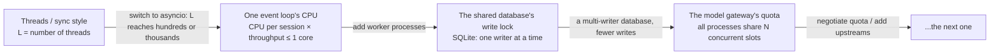
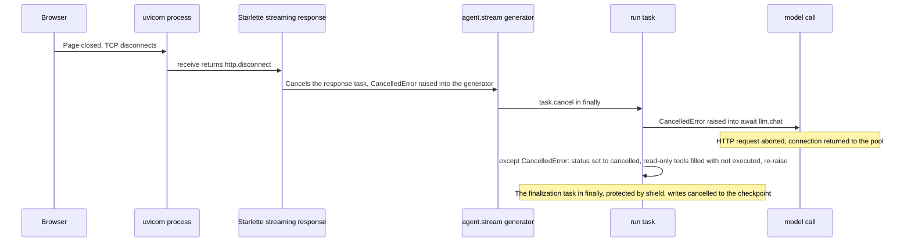
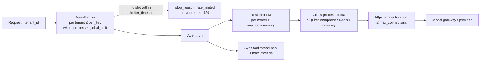

[中文](README.md) | [English](README.en.md)

# Lesson 30: A High-Concurrency Async Runtime in Production — What Breaks at Scale and How the Runtime Handles It

> 🕐 Time: 40 min | 🎯 You'll be able to: use Little's Law to size the concurrency an agent service needs, and measure where the "ceiling" is right now (model quota, event-loop CPU, the shared database's write lock, the thread pool); explain every design decision the runtime makes at scale (a shared instance, parallel read-only tools, three ways to execute a tool and sizing the thread pool, process isolation, cancellation propagation, protecting every async save, re-raising swallowed cancellations, deadlines, in-process bulkheads vs cross-process quotas, retrying only before the first token); read the 7 + 3 runtime bugs found by measurement and fixed; and spot 8 common classes of async bugs | 📦 Source: [`agentkit/agent.py`](../../agentkit/agent.py) (main loop, cancellation, finalization, streaming), [`agentkit/limits.py`](../../agentkit/limits.py) (bulkheads, token bucket), [`agentkit/timeouts.py`](../../agentkit/timeouts.py) (cancellation-safe `wait_for`), [`agentkit/tools.py`](../../agentkit/tools.py) (thread pool, process isolation), [`agentkit/reliability.py`](../../agentkit/reliability.py), [`agentkit/distributed/`](../../agentkit/distributed/__init__.py) (`SQLiteSemaphore`, `WorkerPool`), tests in [`tests/test_runtime.py`](../../tests/test_runtime.py); this lesson's [`sse_app.py`](sse_app.py) (started by the demo as a uvicorn subprocess) and [`worker_app.py`](worker_app.py) (loaded by `WorkerPool`)
>
> 📖 Primary reading: [Notes on structured concurrency, or: Go statement considered harmful](https://vorpus.org/blog/notes-on-structured-concurrency-or-go-statement-considered-harmful/) (Nathaniel J. Smith, 2018) — why casually spawning a background task breaks abstraction the way goto did. Focus on "Nurseries: a structured replacement for go statements": once a child task can't outlive the scope that created it, error propagation and cancellation become something you can reason about again. The defect in Section 2.5, Problem card 5, and Exercise (a) all apply this idea directly.

## 0. In one sentence

**asyncio lets one process wait on thousands of sessions at once; Lesson 02 already covered that. At scale, what actually breaks is something else: runs that won't stop after the user leaves, final saves that never get written, one blocking call that slows everyone down, one tenant eating all the capacity, and a single event loop's CPU or the shared database's write lock hitting the ceiling first. This lesson lays out those "only shows up at scale" problems one by one and how the runtime handles each, every one of them measured.**

Where this lesson sits in the course: [Lesson 02](../02_agent_loop/README.en.md) covers the async basics (why, `await`, `gather` + `Semaphore`, blocking calls, cancellation); [Lesson 12](../12_production_architecture/README.en.md) and [Lesson 13](../13_distributed_concurrency/README.en.md) cover multiple processes (queues, leases, fences, `WorkerPool` starting real worker processes). This lesson brings them together from the "after launch" point of view: how much one process can really take, what happens when you add processes, and what the runtime does on disconnects, hangs, and overload.

An analogy. The event loop is one agent in a call center with hundreds of calls on hold (sessions), spending most of the time waiting for the other side to look something up (waiting on the model). Once the call volume grows, the trouble usually isn't "can't pick up fast enough". It's this: the customer already hung up and the agent is still looking things up for them (cancellation didn't propagate); the ticket that should be written on hang-up never gets written (the final save was interrupted); one agent walks to the warehouse to dig through paper files, and a whole row of phones goes unanswered (a blocking call); one big customer ties up every line (no bulkhead); every agent in the building needs the same supervisor's signature (the shared database has a single writer).

| What breaks at scale | How the runtime handles it | Evidence from this lesson (Section 3, all measured) |
|---|---|---|
| Throughput won't go up | One `Agent` instance shared by all sessions, advanced together with `gather`; add worker processes as needed | 200 sessions: one by one 80.73 s, `gather` 0.43 s; adding processes: 1 → 4 processes, 348 → 846 jobs/s |
| Nobody knows where the ceiling is | Measure it: model quota, event-loop CPU, and the shared database's write lock take turns being the bottleneck | 1 process at 93% CPU; with SQLite checkpoints, 4 processes drop to 384 jobs/s with workers at 33% CPU |
| The user left, but the run keeps going and keeps costing money | `CancelledError` propagates all the way into the model call; an SSE disconnect cancels the run | Real uvicorn subprocess: 2–6 ms after the disconnect the checkpoint says `cancelled`, and the 30 s model call has zero in flight |
| The final save isn't written; the checkpoint is stuck at `running` | Every async save runs in its own task under `shield` (R1) | Cancelling at each write point on real SQLite: the first fix got stuck at `running` 4/5 times, today 0/5 |
| The standard library or a dependency swallows the cancellation | Cancellation-safe `agentkit.wait_for` (R3); a swallowed cancellation is re-raised at step boundaries | A minimal repro shows 3.11's `asyncio.wait_for` swallowing it; 0/40 lost inside the Agent; a cancellation swallowed by a dependency is re-raised before the write tool runs |
| One blocking call slows every session | Sync tools go to a thread pool; event-loop lag becomes a metric | Sync writes from 2 tenants delay the heartbeat by 615 ms; the other 20 tenants get 6× slower |
| Stuck threads fill up the thread pool | Bound the pool and monitor it; switch IO tools to async | Once a 4-thread pool is stuck, 8 normal requests "time out" without a single one starting |
| Infinite loops, untrusted code | `@tool(isolation="process")`: kill the process when time is up | In a thread, the process still burns 2.00 s of CPU after the timeout; isolated, 0.03 s |
| One tenant eats all the capacity | `KeyedLimiter` bulkheads + `limiter_timeout` for fast rejection | Quiet tenant: 1.42 s → 0.21 s |
| In-process limits can't see other processes | Cross-process quota: `SQLiteSemaphore` (one machine), Redis / the gateway (many machines) | 3 processes with a limit of 4 each: the gateway actually sees 12 concurrent calls; with a shared quota: 4 |

## 1. Capacity planning: compute first, then find the ceiling

### 1.1 Little's Law

Little's Law: **L = λ × W**. The number of requests in the system at once, L, equals the arrival rate λ times the average time each request spends in the system, W. The AWS Lambda docs estimate function concurrency with the same formula: `Concurrency = (average requests per second) * (average request duration in seconds)`.

| Scenario | λ (requests/s) | W (s/request) | L = sessions that must be "waiting" at once |
|---|---|---|---|
| Corporate IT help desk, morning peak | 50 | 8 | **400** |
| E-commerce support, big sale | 200 | 5 | **1000** |
| Offline batch evaluation, 20 submitted per second | 20 | 30 | **600** |

Run it backwards: with only 16 threads (L = 16) and W = 8 s, the maximum throughput is λ = 16 / 8 = **2 requests per second**. Scenario 1a in Section 3 verifies this formula with measured numbers.

An agent service's W is almost all waiting: a real model call has a median of about 2 seconds (Section 3.6), while the runtime itself spends only about 0.18 ms of CPU to advance one session (two model calls plus one tool call; measured in scenario 1a). So the first question is "how many can we wait on at once", and only the second is "can we compute fast enough".

### 1.2 Three carriers: threads, processes, coroutines

Every "waiting" session needs a carrier. Lesson 02 compared how you write each one; here we compare what they cost at scale (measured in scenario 1b):

| Dimension | One thread per session | Multiple processes | asyncio coroutines |
|---|---|---|---|
| Memory per "waiting" session | Measured about 35 KB of resident memory per blocked thread, plus virtual memory reserved for its stack | Each worker process needs a full interpreter (tens of MB after importing agentkit and its dependencies) | An idle coroutine measured about 1 KB; an in-flight session with full agent state about 16 KB (row E of scenario 1a) |
| Time to create 2000 | Measured 164–176 ms | Each process starts an interpreter and imports dependencies (hundreds of ms per spawn) | Measured 4 ms |
| How switching works | Preemptive by the OS: a switch can happen between any two lines, so shared data needs locks | Scheduled by the OS; no shared memory | Cooperative, only at `await`; code between two `await`s is naturally "atomic" |
| GIL | Released while waiting on IO, but all Python code still runs one at a time | One GIL per process, so all cores can be used | Single-threaded: no GIL contention, but only one core |
| Can it be cancelled midway | A thread **can't** be forcibly killed; it keeps running after a timeout (scenario 3b) | The whole process can be killed (scenario 3c) | Can be cancelled at any `await` (scenario 4) |
| Suitable concurrency | Tens to hundreds | Equal to the number of CPU cores (more is pointless) | Hundreds to thousands per process |

The conclusion: **production uses a combination**. One process per CPU core (to get around the GIL and isolate failures), one event loop per process (to hold hundreds or thousands of concurrent sessions), unavoidable legacy sync code in a bounded thread pool, and untrusted or CPU-heavy code in a subprocess or sandbox.

One piece of background that's changing: Python's free-threaded (no-GIL) build reached "officially supported" status in 3.14 ([PEP 779](https://peps.python.org/pep-0779/)), but it's still an optional build, not the default. And it only solves "running Python code on multiple cores"; it doesn't solve "threads can't be killed" or "per-thread memory overhead", so it doesn't change this lesson's conclusions.

### 1.3 The ceiling moves

The measurements in scenario 1 make it very clear what's worth adding:



- Sync-style throughput is pinned by the thread count (L = 16 means 16/W per second); asyncio raises L to hundreds or thousands, and waiting stops being the problem.
- One event loop uses only one core: with enough sessions, **CPU** hits the ceiling first. You see throughput far below the "wait bound" and the process at close to 100% CPU; when work arrives in a burst, event-loop lag jumps too (row E of scenario 1a: heartbeat p99 96 ms late), and a late heartbeat means leases that don't get renewed and health checks that time out. Adding processes multiplies this ceiling.
- With more processes, whatever they all share becomes the bottleneck: local SQLite allows only one writer at a time; if every job writes several checkpoints, throughput stops growing as you add processes, and the workers' CPU actually goes idle.
- The model gateway's concurrency quota is a hard limit: when all processes share 8 slots, it doesn't matter how many processes you add.

**Find where the ceiling is first, then decide what to add**: CPU at the ceiling means add processes; the write lock at the ceiling means change the database or write less; the quota at the ceiling means go negotiate quota. Lesson 13's [Section 3.12](../13_distributed_concurrency/README.en.md#312-measured-how-much-faster-do-more-processes-get-you-and-wheres-the-bottleneck) measured the same thing from the queue's point of view; scenario 1c here fills in the event-loop-CPU side.

## 2. The runtime's design at scale: what breaks → how it's handled → how it's proven

### 2.1 One instance is shared by all sessions, so all state lives in `RunState`

```python
agent = Agent(llm, tools=[...])          # created once at process startup
results = await asyncio.gather(*(agent.run(q) for q in questions))  # hundreds of sessions share it
```

The top of [`agent.py`](../../agentkit/agent.py) states this constraint: the same `Agent` instance can be reused concurrently; all the data for each run lives in `RunState`, and the instance itself stores nothing about "this run".

**Why**: creating an agent per request would recreate the thread pool and the connection pool each time, which defeats the point of a pool. But once the instance is reused, any "this run" data stored on `self` gets read and written by hundreds of sessions at once. The `LoopGuard` exercise in [Lesson 08](../08_reliability/README.en.md) taught the same lesson: the counter belongs on `state.metadata`, not on the hook instance. In asyncio this is even sneakier because you don't need threads: the moment session A suspends at an `await`, session B can change the data on `self`.

**Your hooks too**: hook instances are also shared by all sessions. Anything about "this run" goes into `state`.

**Evidence**: `test_one_process_runs_many_sessions_concurrently` has 100 sessions share one instance; peak in-flight model calls are ≥ 90, and every session sees only its own question. The 2000 sessions in scenario 1a (and the 16 threads sharing one instance in row B) were also checked one by one: zero crossed wires.

### 2.2 Read-only tools in parallel, write tools serially

```python
# agentkit/agent.py: _run_pending_tools
parallel = self.parallel_tools and len(calls) > 1 and all(t is not None and t.risk == "read" for t in tools)
if not parallel:
    for call in calls:  # there's a write: run them one by one in the model's order, saving after each
        ...
results = await asyncio.gather(*(one(c) for c in calls), return_exceptions=True)
```

**Why split it this way**: read-only tools don't depend on each other, so order doesn't change the result, and running them in parallel turns a turn's latency from "the sum" into "the max". Write tools are different. The model might "create a ticket" and then "add a note to the ticket"; get the order wrong and it breaks. And every write tool must save a checkpoint right after it runs, to shrink the "executed but not recorded" window as much as possible ([Lesson 08](../08_reliability/README.en.md)).

**Why `return_exceptions=True`**: `PauseRun` (waiting for approval) and `StopRun` (budget exhausted) are control flow implemented as exceptions. After collecting all results, the completed tool results are written back in the original order and saved first, and only then is the first control-flow exception raised. That way a resume doesn't rerun tools that already finished. It has a lesser-known benefit too, covered in Problem card 5: on external cancellation, `gather` with `return_exceptions=True` waits for all child tasks to finish cleaning up, while the default doesn't.

**Cap**: `max_parallel_tools=8`, a semaphore on how many tools run in parallel in one turn. The model occasionally asks for 30 tools at once, and you can't let it fire 30 downstream requests instantly.

**A pitfall found by measurement and fixed: parallel tools bypassed the budget** (Section 7.2, #3).
- Symptom: with `BudgetHook(max_tool_calls=1)`, the model called 4 read-only tools in one turn, all 4 ran, and the run completed normally.
- Root cause: `BudgetHook.before_tool` checks `state.tool_calls_count`, and that counter used to be incremented only **after** a tool finished. In parallel, the 4 calls each ran `before_tool` in their own task first; at that moment none had finished, so all of them saw "still within budget". The same code is correct serially and wrong as soon as it runs in parallel.
- Fix: the increment moved to **before** execution (in [`agent.py`](../../agentkit/agent.py), `state.tool_calls_count += 1` comes before `await self.executor.execute(...)`).
- Regression test: `test_parallel_read_tools_respect_tool_call_budget`, which asserts that only the first tool ran and `stop_reason == "budget_exceeded"`.

The general pattern is worth remembering: "check first, update later" is fine in serial code; as soon as concurrency sneaks in between the two (even single-threaded asyncio), you have to **claim the slot at the same moment you check**.

### 2.3 Three ways to execute a tool: bound the thread pool, isolate CPU-heavy code in a process

| Tool type | How it runs (`ToolExecutor` in [`tools.py`](../../agentkit/tools.py)) | What happens on timeout |
|---|---|---|
| `async def` tools (HTTP APIs, databases) | Awaited directly on the event loop, wrapped in the cancellation-safe `wait_for` | **Truly cancelled**: `CancelledError` is raised inside the tool and the connection is released |
| Plain sync functions | Run in a thread pool (`Agent(max_threads=N)` gives a bounded pool of its own; without it, the event loop's default pool), without blocking the event loop | The caller gets the timeout on time, **but the thread can't be killed** and finishes in the background |
| `@tool(isolation="process")` / `isolated(tool)` | Run in a spawned subprocess | **Hard timeout**: the subprocess is killed |

**Why a thread pool gets "stuck"**: Python has no API to safely kill a thread. When `wait_for(loop.run_in_executor(...))` times out, the caller just "stops waiting"; the thread keeps running and keeps holding a slot in the pool. Once all slots are taken, new sync tools queue up, and the timeout clock starts in the queue. Scenario 3b measured it: 4 requests get the old ERP stuck for 2 seconds, then 8 requests that should take 0.05 s each arrive; with a 4-thread pool, **not one of them starts** and all 8 "time out". With 16 threads, all 8 succeed. The 4 stuck threads kept running in the background for about another 1.5 s after their callers got the timeout.

So: bound the thread pool (`max_threads`, which is itself a form of backpressure) and monitor its usage and queue; agents that share a pool get it injected via `executor=ToolExecutor(..., max_threads=N)`; and replace IO-bound sync SDKs with async ones as soon as you can.

**Why process isolation too**: a pure-computation infinite loop has no `await` point, so a coroutine can't cancel it; in a thread, it keeps burning CPU after the timeout and competes with the event loop for time slices through the GIL. Scenario 3c measured it: the same 2 seconds of pure computation with a 0.5 s timeout. In the thread pool, the process used 2.00 s of CPU over those 2.3 s in total (the timeout didn't save a single second of computation); with `isolation="process"`, the subprocess is killed on time, the process used only 0.03 s, and no child process was left alive when the result came back. The price: arguments must be picklable, and every call starts a subprocess: an isolated call that does nothing measured about 170 ms. Stronger isolation in production means containers, gVisor, or microVMs ([Lesson 19](../19_mcp_and_sandbox/README.en.md)).

**A small issue found by measurement and fixed: starting the subprocess blocked the event loop** (Section 7.2, #5).
- Symptom: measured with a 5 ms heartbeat, each isolated tool call stalled the event loop by up to about 11 ms.
- Root cause: `run_in_subprocess` called `proc.start()` (spawn does fork/exec and then passes arguments) and `proc.join(timeout=2)` **synchronously** on the event loop thread. It's a hidden version of Section 5.1's "calling blocking operations inside an async function": hidden in the framework rather than in business code.
- Fix: `proc.start` runs in the thread pool; `proc.join` also runs in a thread, protected by `asyncio.shield`, so even if the caller is cancelled the subprocess still gets reaped and no zombie is left; `parent.close()` sits in `finally`, so the pipe is closed right away even if the wait for `join` is cancelled.
- Regression test: `test_subprocess_start_does_not_run_on_event_loop_thread`, which asserts that `start` doesn't run on the event loop's thread. On a heavily loaded machine, a few milliseconds of stall can't be told apart from other processes competing for CPU, so the real evidence is this deterministic regression test, not the timing.

### 2.4 Cancellation propagation: `CancelledError` must be re-raised

```python
# agentkit/agent.py: _drive
except asyncio.CancelledError:
    # Cancellation isn't a failure: record it, finish cleanup, and then it MUST keep propagating, or the caller's cancel is lost
    state.status, state.stop_reason, state.output = "cancelled", "cancelled", "(run cancelled)"
    self._close_dangling_calls(state, "Not executed: run cancelled", keep_side_effects=True)
    raise
finally:
    # Finalization (on_run_end hooks + the last save, and only then releasing the bulkhead slot) runs as its own task under shield; see Section 2.5
    finish = asyncio.ensure_future(self._finish(state, slot if entered else None))
    await asyncio.shield(finish)
```

**Why it must be re-raised**: cancellation is an order from the caller, not "an error happened". Swallow it and the caller thinks the run ended normally. More subtly, structured-concurrency building blocks such as `asyncio.TaskGroup` and `asyncio.timeout()` are themselves built on cancellation. The Python docs warn explicitly that a coroutine swallowing `CancelledError` makes them misbehave.

**Why only read-only tools get a "not executed" result**: OpenAI's message protocol requires a matching `tool` message for every `tool_call`; without one, the next model call with that history gets a 400. But write and dangerous tools are **deliberately left unanswered** (`keep_side_effects=True`): at the moment of cancellation, one might be halfway done downstream, for example the ticket was already created and only the response hadn't come back. If we filled in "not executed", after resume the model would issue a **new** `call_id`, the idempotency key (`run_id:call_id`) would change, and the ticket would be created twice. Left unanswered, `resume` replays it with the **same** `call_id`, and the idempotency store or the downstream Idempotency-Key deduplicates it (Lessons 08, 13, 26). If you don't intend to resume and are starting a new conversation, `RunResult.history` fills placeholder results for these calls so the message protocol stays valid. Regression test: `test_cancel_keeps_in_flight_write_unanswered_and_resume_replays_same_call_id`.

**How one disconnect travels all the way to the model call** (measured in scenario 4 on a real uvicorn subprocess):



The `finally` in `Agent._stream` translates "the consumer stopped reading" into "cancel the run". After cancelling, it waits for the run task to clean up with `await asyncio.wait({task})` rather than `await task`; the next section explains why.

### 2.5 A complete case study: find the defect → root cause → fix → re-test → fix again (R1)

While writing this lesson, the demo ran into a real defect in the runtime. It was fixed twice: the first fix was incomplete, and re-testing found that. Walking through the whole process makes two points better than any lecture: cancellation is hard to get right, and a regression test has to cover **every position** inside the failure window, not just one moment. (The numbers in ① and ④ below were measured at the time, when the async runtime was still a separate package; the code now lives in [`agent.py`](../../agentkit/agent.py), and the reproduction under ⑤ runs today on real SQLite.)

**① Symptom.** The demo at the time switched the checkpointer to [Lesson 26](../26_state_and_queues/README.en.md)'s Postgres checkpointer against an embedded real Postgres 16, then repeated "disconnect as soon as `tool_finished` arrives". Every run did stop, and in-flight calls went to zero, **but the checkpoint was often left at `running`**: 3 to 7 times out of 10 on real Postgres. A reconciliation job would think those runs were still going.

**② Root cause.** Three things have to be put together:

1. Starlette (what FastAPI is built on) runs on AnyIO. AnyIO's cancellation is "level-triggered": as long as a task is still inside a cancelled scope, it gets cancelled again at every `await`. In the AnyIO docs' words, to `await` during cleanup you must "enclose it in a shielded cancel scope".
2. At the time, the `finally` in `_stream` waited for the run task to clean up with `suppress(CancelledError)` plus `await task`. AnyIO cancelled that `await` again, and when asyncio cancels a task that is awaiting another task, it **forwards** the cancellation to the awaited task.
3. The run task was, at that moment, inside `_drive`'s `finally` running `await self._save(state)` to persist the `cancelled` status. The second cancellation interrupted that save.

Sync checkpointers (`InMemoryCheckpointer`) don't have this problem because the save has no `await` at all; the tests at the time all used sync checkpointers and never went through Starlette. **All sync tests passing doesn't mean the async code is correct.** Step ① of demo 4c reproduces the root cause in 10 lines (`level_triggered_cleanup`, no agentkit): inside a cancelled AnyIO scope, an `await` save directly in `finally` leaves `'running'`; inside `anyio.CancelScope(shield=True)` it gives `'cancelled'`.

**③ The first fix** (three changes): `_drive`'s finalization (`on_run_end` hooks plus the last save) moved into its own task protected by `asyncio.shield`; `_stream` switched to `await asyncio.wait({task})`, which only waits and doesn't forward cancellation; and checkpoint reads and writes for the same run are queued through `KeyedLocks`, so `resume` waits for the background finalization to finish writing before it reads. Regression tests: `test_repeated_cancellation_still_records_cancelled_state` (cancel twice in a row) and `test_stream_disconnect_with_slow_async_checkpointer_always_records_cancel` (cancel again during a streaming disconnect, 10/10).

**④ Re-test: something still slipped through.** Repeating the disconnect 120 times on real Postgres with the first fix gave **115/120**, and each of the 5 misses came with a `CheckpointConflict` on the server. This time the root cause wasn't the finalization but **before** it: the first cancellation interrupted the **previous** save (the one after the tool ran). That `UPDATE` had already committed in the database and bumped the version, but the client never got the reply, so its locally remembered version went stale; the final save did its CAS against the old version and was correctly rejected as a conflict. The first fix protected only the "last" save; the problem was in the "second to last".

Why didn't the first round of regression tests catch it? They all cancelled at one fixed moment, which happened not to land in the few milliseconds of "committed, but no reply yet". Only hundreds of repetitions on a real database occasionally hit it.

**⑤ The second fix** (today's `_save` in [`agent.py`](../../agentkit/agent.py)):

```python
async def _save(self, state: RunState) -> None:
    cp = self._checkpointer()
    if not inspect.iscoroutinefunction(getattr(cp, "save", None)):
        cp.save(state)          # sync checkpointer: no await inside, can't be interrupted by cancellation; just write it
        return
    snapshot = _snapshot(state)  # shallow snapshot: copies each container, doesn't deep-copy every message
    await asyncio.shield(asyncio.ensure_future(self._save_now(cp, snapshot)))  # runs inside _io_locks
```

**Every** save to an async checkpointer runs in its own protected task: a write either doesn't start or finishes completely, and there's no "don't know whether it got written" state. The snapshot is needed because the run keeps modifying `state` while the save proceeds in the background. `_stream` also checks `task.exception()` after `wait`, so when the run task ends with an ordinary exception it logs an `agentkit` warning instead of leaving an unheeded "Task exception was never retrieved" (R2). The re-test at the time: disconnecting 120 times on real Postgres, **120/120** recorded as `cancelled`.

The regression test `test_cancel_between_db_commit_and_response_never_strands_the_run` learned from the previous round: it uses a CAS store that "replies a while after committing" and cancels one run at **20 different moments**, sweeping the "committed, not yet replied" window (before the fix: cancelled 10 / running 6 / completed 4; after: 20 / 0 / 0).

**Today's demo hits that window precisely on real SQLite** (scenario 4c ②): with a real `SQLiteCheckpointer`, it cancels the run **after the k-th write transaction commits** and before the reply gets back to the event loop (once the database thread finishes the commit, `call_soon_threadsafe` queues `task.cancel` on the event loop, and it runs before the "reply arrived" callback), once per write point, against the first fix's `_save` (`FirstFixAgent`) as the comparison:

| Write point | First fix (only the final save protected) | Today's `Agent` (every async save under shield) |
|---|---|---|
| 1. User message saved | The caller gets `CheckpointConflict`, checkpoint `running` | `CancelledError`, checkpoint `cancelled` |
| 2. Model reply (tool call) saved | `CheckpointConflict`, `running` | `CancelledError`, `cancelled` |
| 3. Tool result saved | `CheckpointConflict`, `running` | `CancelledError`, `cancelled` |
| 4. Final answer saved | `CheckpointConflict`, `running` | `CancelledError`, `cancelled` |
| 5. Final save | `CancelledError`, `completed` | `CancelledError`, `completed` |

The first-fix version not only gets stuck at `running`; the caller also sees `CheckpointConflict` instead of `CancelledError`: the conflict during finalization "replaced" the cancellation. Row 5 is the same on both sides: when the cancel arrived, the last save had already committed, the run really did complete, and the checkpoint honestly says `completed`. The reproduction is deterministic (same result every run), uses a real database file and real write transactions, and only "the moment the cancel arrives" is injected.

The lessons worth keeping from this case:
- **An `await` during cleanup needs protection**, especially in frameworks that "cancel repeatedly" (AnyIO, Trio).
- **Writes to the same key must be serialized**: concurrent writes to the same row either overwrite each other or get rejected by CAS.
- **A cancelled write has an "unknown" outcome, not a "failed" one**: it may already have taken effect. So either don't cancel a write halfway, or be able to reconcile afterward (idempotency keys, re-reading the version).
- **To test concurrency bugs, sweep the time window**: cancelling at one moment only proves "this moment is fine". Cancel once at each position in the failure window, and classify the outcomes (did it stop? get stuck? or never stop at all?). The third kind often points to another bug (next section).

### 2.6 Even the standard library and your dependencies swallow cancellations (R3, and re-raising at step boundaries)

**The standard library.** The re-test at the time still saw a few `completed` in the sweep after the second fix: the cancellation was **lost**, the run didn't stop, ran to the end, and the second model call cost money anyway. That's worse than getting stuck at `running`. With a probe on every `asyncio.wait_for`, 80 cancellations at random moments produced 12 completed, and all 12 shared one trait: `wait_for` returned a result while the current task still had an undelivered cancellation request on it (`task.cancelling() > 0`).

This is a known CPython race ([gh-86296](https://github.com/python/cpython/issues/86296), "AsyncIO's wait_for can hide cancellation in a rare race condition"): in Python 3.11 and earlier, if the inner result and an outer cancellation arrive in the same event-loop iteration, `wait_for` returns the result and swallows the cancellation. Python 3.12 rewrote `wait_for` on top of `asyncio.timeout()`. The tool executor at the time used exactly `wait_for` to time out sync tools, so a user disconnecting **the instant a sync tool finished** could lose the cancellation: deliberately creating that moment, 89 of 240 cancellations were lost.

**Fix: replace `wait_for`** (R3). [`agentkit/timeouts.py`](../../agentkit/timeouts.py) provides a cancellation-safe `wait_for` (also exported from `agentkit`): on 3.11+ it uses `asyncio.timeout()` (waiting inline in the current task and using cancel/uncancel counts to tell "my own timeout" from "an external cancellation"; 3.12's `wait_for` is itself implemented this way); 3.10 has no `asyncio.timeout()`, so it's implemented with `asyncio.wait`, the same idea as Exercise (b): external cancellation always wins. Letting cancellation win has a cost: if the inner operation actually finished, its result is discarded. For resources that must be returned once acquired (for example a `KeyedLimiter` semaphore slot), the `on_discard` parameter returns them, or the slot leaks forever. Tool execution, `run_timeout`, `KeyedLimiter`, and the worker loop all use it. The re-test at the time: lost cancellations dropped from 89 to **0** of 240. Today's demo (scenario 4c ④) on Python 3.11.7: in a 5-line minimal repro the standard-library `wait_for` still swallows the cancellation; in the Agent, disconnecting at the same moment 40 times loses **0**. Regression tests: `test_wait_for_never_swallows_cancel_when_result_arrives_in_same_tick`, `test_wait_for_cancel_racing_semaphore_grant_does_not_leak_permit`, `test_tool_executor_cancel_at_tool_completion_is_not_lost`, and others (each race scenario is tested on both the 3.10 and the 3.11+ implementation).

**Dependencies.** agentkit's own `wait_for` can't reach inside dependencies: before 3.12, redis-py, psycopg_pool, and others use `asyncio.wait_for` internally and swallow cancellations the same way. [Lesson 31](../31_deployment_and_scaling/README.en.md)'s load test measured it: with a rate-limit hook calling Redis, about 1 in 4 of these cancellations was swallowed, and the disconnected runs ran to the end and created tickets anyway. The fix is `_raise_if_cancel_swallowed` in [`agent.py`](../../agentkit/agent.py): a swallowed cancellation still leaves its count in `Task.cancelling()` (by asyncio's convention, properly suppressing a cancellation requires calling `uncancel()`), so if the count is higher than when the run started, somebody swallowed a cancellation, and it is re-raised **before calling the model and before running a tool**. It uses the count at entry as the baseline (like `asyncio.timeout()`), so it never trips over the caller's own state; a swallowed cancellation from an expiring `run_timeout` is re-raised too and then turned into a timeout. On re-raise it logs a warning with a stable `extra` field `agentkit_event="swallowed_cancellation"`, so operators count by field rather than by matching the wording.

Scenario 4c ⑤ measured it: an `after_llm` hook waits for a reply with the standard library's `asyncio.wait_for`, the way redis-py does, and the reply and the cancellation arrive in the same event-loop iteration. On 3.11.7 the hook's `wait_for` **returns normally** (the cancellation is swallowed); the Agent re-raises the cancellation before running the write tool: checkpoint `cancelled`, the write tool ran **0** times, the model was called only once, and the log carries `agentkit_event=swallowed_cancellation`. Regression tests: `test_cancel_swallowed_by_a_dependency_is_re_raised_before_side_effects`, `test_run_timeout_swallowed_by_a_dependency_still_times_out`, `test_swallowed_cancellation_is_logged_with_a_stable_event_field`.

Replacing `wait_for` also exposed a hidden dependency: a Lesson 28 test asserting that "the time intervals of three parallel tools overlap" started failing consistently on 3.11 after the fix. One of the tools waited on an event that was already set, so `wait()` returned immediately and the tool ran to completion synchronously without ever suspending; it used to pass only because 3.11's `wait_for` wrapped the tool in a new task, adding an extra event-loop iteration. The fix was to make the tool in the test actually suspend once, not to change the runtime back.

### 2.7 `run_timeout`: a deadline for the whole run

```python
# agentkit/agent.py: _drive
if self.run_timeout is not None:
    await wait_for(body, self.run_timeout)  # the cancellation-safe version, see timeouts.py
```

**Why add another timeout when every tool and every model call already has one**: 10 steps, each within its own limit, can still add up to more than the user's patience and the timeout of the whole HTTP chain (Problem 2 in [Lesson 13](../13_distributed_concurrency/README.en.md)). After a timeout the status is `stopped` / `timeout`. As with cancellation, read-only tools get "not executed: run timed out", and write tools stay unanswered to be replayed with the same `call_id` on resume.

One detail: time spent waiting for a bulkhead slot **doesn't** count toward `run_timeout`; `limiter_timeout` controls it separately. So the worst-case latency is `limiter_timeout + run_timeout`, and you have to add the two when setting the gateway timeout.

### 2.8 Bulkheads and backpressure: per-tenant isolation in-process, a shared quota across processes



Every layer's cap is a form of backpressure: when the downstream can't keep up, make the upstream wait inside this process, or reject it fast, instead of pushing the pressure further down.

| Layer | Parameters | What it prevents | What it can see |
|---|---|---|---|
| `KeyedLimiter` | `per_key`, `global_limit`, `overrides` | One tenant eating every slot (the noisy neighbor) | This process |
| `limiter_timeout` | seconds | Unbounded queueing. If there's no slot, say "try again later" clearly; that beats hanging for 60 s and then timing out | This process |
| `ResilientLLM(max_concurrency=…)` | One semaphore per model | More requests hitting the gateway than the quota allows, triggering 429s and retry storms | This process |
| `OpenAICompatLLM(max_connections=…)` | httpx connection pool | Runaway connection counts. httpx defaults to 100 connections and 20 keep-alive | This process |
| `Agent(max_threads=…)` | Sync tool thread pool | Sync tools spawning threads without bound | This process |
| `run_worker(concurrency=…)` | Jobs one worker process handles at once | When full, stop claiming and leave jobs in the queue for other processes (Lesson 13) | This process |
| `SQLiteSemaphore` / `SQLiteTokenBucket` | Slots stored in a shared database, with leases | N processes each with their own cap = N times the real concurrency | All processes on the machine |
| Redis token bucket / gateway limits | Lessons 26, 29 | Same as above, across machines | All instances |

**Why no locks are needed in-process**: `KeyedLimiter`'s counts and `TokenBucket`'s "refill plus deduct" have no `await` in between. The event loop is single-threaded, so this code is naturally atomic. With multiple threads you'd need locks here; with multiple processes it has to move into a database or Redis, made atomic with a transaction or a Lua script. Scenario 5b measured it: with 3 real processes each using `asyncio.Semaphore(4)`, the gateway actually saw **12** requests at once; with a shared `SQLiteSemaphore(4)`, the global peak was **4**. `SQLiteSemaphore` slots carry leases, so when a holder gets `kill -9`, its lease expires and the slot comes back automatically (measured in Lesson 13).

**A defect found by measurement and fixed: the bulkhead leaked when global slots were scarce** (Section 7.2, #2).
- Symptom: with `KeyedLimiter(per_key=2, global_limit=3)`, while other tenants held all the global slots, **3** requests from the same tenant entered execution at once.
- Root cause: to keep the dictionary from growing forever with many tenants, idle tenants' semaphores are reclaimed. "Idle" used to be judged by `_in_use`, which counted only requests that had "passed both gates". One phase was missed: a request that holds a **tenant** slot and is still queued for a **global** slot. If another request finished at that point, `_in_use` dropped to 0 and the tenant's semaphore was deleted, while the queued request still held the old one. The next request then created a **brand new** semaphore, and the count started from 2 again.
- Fix: reclaim by **reference count** (`_refs` in [`limits.py`](../../agentkit/limits.py): +1 on entering `slot()`, −1 only on leaving, covering the queued phase), deleting only when it reaches zero. In addition, the bulkhead slot is released by the finalization task (`_finish`) only **after** the last save completes, so even if the outer caller is cancelled again and stops waiting for finalization, the slot isn't returned until finalization has written.
- Regression test: `test_keyed_limiter_per_key_limit_holds_when_global_is_saturated`, which asserts that neither tenant ever exceeds its limit and that `_sems` and `_refs` are both empty afterward (no leak). A related fix came from Lesson 12: a new run rejected while acquiring a bulkhead slot means nothing happened, so no checkpoint is saved and no finalization hooks run (`test_run_rejected_by_bulkhead_leaves_no_half_checkpoint`).

The lesson: **the condition for "reclaim an idle resource" must cover every phase in which the resource is held**, including the "half-acquired" phase.

### 2.9 Streaming output, and why retries happen only before the first token

```python
# agentkit/reliability.py: ResilientLLM.stream
except LLMError as e:
    if started:
        raise  # part of the answer has already reached the user: a silent retry would show them repeated text
```

**Why**: half a sentence already on the user's screen can't be taken back. Retry silently at that point and the user sees "Your VPN certificate Your VPN certificate has expired"; switching to the fallback model mid-stream is worse, with the first and second halves of the sentence from two different models. So before the first token you can retry and fall back freely; after it, an error can only be reported honestly, with the frontend offering "regenerate" or the server resuming from the checkpoint (Section 2.4, Problem card 3).

**Streaming also brings a metric**: time to first token (TTFT). A reasoning model has to "finish thinking" before it emits text, so TTFT can be most of the total time. The measurements from scenario 6 are in Section 3.6. Streaming doesn't shorten total time; it shortens the time the user spends "staring at a blank screen". Streaming through a gateway is covered in [Lesson 29](../29_gateway_and_guardrails/README.en.md).

`OpenAICompatLLM.stream` also does two easy-to-miss things: it adds `stream_options={"include_usage": True}` to the request, without which a streaming response carries no token usage and cost can't be computed; and it closes the upstream stream in `finally`, returning the connection to the pool immediately on early exit.

### 2.10 A ContextVar event sink keeps concurrent streams from crossing wires

```python
# agentkit/agent.py: _stream
queue: asyncio.Queue = asyncio.Queue()
token = _emitter.set(queue.put_nowait)
try:
    task = asyncio.ensure_future(start())  # a new Task copies the current context: it sees this stream's own event sink
finally:
    _emitter.reset(token)
```

**Why not an instance attribute `self.emit = ...`**: with 20 streams running at once on one shared agent instance, the last one set would overwrite the others, and every event would flow to the last client. Each `ContextVar` value belongs to a context, and an asyncio Task **copies** the current context when it's created. So set it, create the Task, and reset immediately: that run task (and the child tasks of its parallel tools) always sees its own queue. The per-run checkpointer view a worker passes in (`run(..., checkpointer=...)`) uses the same mechanism.

**Why reset immediately**: the consumer's own context shouldn't keep carrying this sink, or another run the consumer starts later would push its events into this queue too.

**Evidence**: `test_concurrent_streams_do_not_mix_events` runs 20 streams at once, and the text each one receives belongs only to its own question. The tracing span stack uses the same mechanism ([Lesson 28](../28_production_observability/README.en.md) explains why it's correct under concurrency).

## 3. Hands-on: run the demo (all numbers are measured)

```bash
python lessons/30_async_runtime/demo.py --offline                    # Scenarios 1–5, no model calls, about 1–2 min
python lessons/30_async_runtime/demo.py --offline --full --repeat 3  # 1a's "one by one" runs all 200; median of 3 per mode, about 4 min
python lessons/30_async_runtime/demo.py --offline --only 4           # run just one scenario
python lessons/30_async_runtime/demo.py                              # plus scenario 6: real model, about 8 calls
```

**What really happens**: the threads are real threads; 1c and 5b use real OS processes (`WorkerPool` starts `python -m agentkit.distributed.worker`, and 5b starts 3 `python` subprocesses) that cooperate only through the same SQLite file; the server in scenario 4 is a **subprocess** started with `python -m uvicorn`, which the demo talks to over a real TCP connection with httpx, and a disconnect means closing that TCP connection; the checkpoints are real databases (a SQLite file, plus an embedded Postgres process when pgserver is installed). **Only the model is simulated**: scenarios 1–5 use scripted models where `await asyncio.sleep(...)` plays "waiting on the model", so the numbers are reproducible and the disconnect moment is controllable; in 1c a hook also does about 1 ms of pure Python computation before each model call, standing in for the CPU your own hooks, context strategies, and JSON handling add (calibrated per process into a fixed amount of computation, not a wall-clock spin).

**Measurement environment**: Apple M1 (8 cores), 8 GB RAM, macOS 14.4.1, CPython 3.11.7, SQLite 3.41.2; fastapi 0.141.1, uvicorn 0.54.0, starlette 1.7.0, httpx 0.28.1, anyio 4.15.1; the Postgres in scenario 4 is the Postgres 16 bundled with pgserver 0.1.4 (embedded, over a unix socket). **To be upfront**: other jobs were running on this machine during measurement (load average about 5; during 1c the 1-minute load average briefly reached 57), and the multi-process numbers are the most affected. Below are the results from the `--offline --full --repeat 3` run, with ranges seen in other runs noted. (Demo output translated from Chinese.)

### 3.1 Scenario 1: throughput and the ceiling

**1a: the same batch of 200 sessions, several ways to run them in one process.** Each session = 2 model calls × 0.2 s + 1 async tool, so W ≈ 0.4 s. Each mode runs in a fresh subprocess (so the memory numbers don't interfere), and the median of 3 runs by elapsed time is used.

| Mode | Sessions | Elapsed | Throughput (sessions/s) | Peak in flight | Little's prediction L/W | CPU time | Peak RSS increase | Event-loop lag p99 / max |
|---|---|---|---|---|---|---|---|---|
| A. One by one with `await` (`--full`, all 200) | 200 | 80.73 s | 2.5 | 1 | 2.5 | 0.88 s | 0.8 MB | 2 / 3 ms |
| B. 16 threads × their own event loops (sharing one `Agent`) | 200 | 5.27 s | 37.9 | 16 | 40.0 | 0.09 s | 3.2 MB | — |
| C. `asyncio.gather` all | 200 | **0.43 s** | **467.2** | 200 | 500.0 | 0.05 s | 3.5 MB | 16 / 16 ms |
| D. `gather` + bulkhead `KeyedLimiter(per_key=50)` | 200 | 1.63 s | 122.7 | 50 | 125.0 | 0.07 s | 2.9 MB | 2 / 4 ms |
| E. `gather` all, 2000 sessions | 2000 | 0.60 s | 3355.7 | 2000 | 5000.0 | 0.37 s | 31.1 MB | 96 / 96 ms |

- **Little's Law holds exactly**: measured throughput for A, B, and D matches the prediction (L / W) almost perfectly. Throughput depends only on the number of sessions "in flight at once", L.
- **B is the typical way to call async code from a sync framework**: 16 threads, one event loop each, running one session at a time. Like the old "sync agent + 16 threads", it's pinned by the thread count, at 1/12 of C's throughput. One `Agent` instance is shared by the 16 threads without crossed wires, but each thread's event loop only ever holds one session.
- **D shows that a bulkhead is an L you choose yourself**: `KeyedLimiter(per_key=50)` pins concurrently running sessions at 50, so throughput caps at 50 / 0.4 = 125. In production that L is set by the downstream quota (Problem card 4); bigger isn't better.
- **E is a single event loop's CPU ceiling**: 2000 sessions used 0.37 s of CPU, about 0.18 ms per session (validation, checkpoint serialization, tracing). It took 0.60 s rather than 0.4 s: the extra is 2000 sessions' CPU work queueing on the same core, with heartbeat p99 96 ms late. At this cost, one core's steady-state limit is somewhat over 5000 sessions per second; every extra millisecond your hooks, context strategies, and JSON handling spend knocks that limit down sharply (that's what 1c shows).
- This row used to cost about 1 ms of CPU per session: cProfile found about 43% in deep-copying all messages with `dataclasses.asdict` when saving checkpoints, and about 33% in regenerating tools' JSON Schema before every model call. The maintainers fixed both (Section 7.2, #6): `Tool.schema()` caches its result, and checkpoints serialize directly with `RunState.to_json()`. The scripted model of that time also deep-copied every call's messages for later assertions; this lesson's `BenchLLM` doesn't, so today's number is lower.

**1b: the minimum memory for a "session waiting on IO"** (threads and coroutines each measured in their own subprocess):

| Waiter | Count | Creation time | RSS increase | Each |
|---|---|---|---|---|
| Thread (blocked in `Event.wait`) | 2000 | 176 ms (164 ms in another run) | 69.1 MB | 35.4 KB |
| Coroutine (`await Event.wait`) | 2000 | 4 ms | 1.8 MB | 0.9 KB |
| Coroutine | 50000 | 158 ms | 46.5 MB | 1.0 KB |

For the same 2000 waiters, coroutines use about 1/40 of the memory of threads and are created about 40 times faster.

**1c: adding processes — how the ceiling moves.** `WorkerPool` starts K real worker processes (`python -m agentkit.distributed.worker --app lessons/30_async_runtime/worker_app.py:make_handler`) that share one SQLite file as the job queue. Each job = one agent run: 2 model calls (0.1 s wait each) + 1 async tool, with a hook doing about 1 ms of CPU work before each model call. Timing starts at "opening the gate": jobs are enqueued with a long delay first, and once every worker process has started, one `UPDATE` makes them all claimable at the same moment (the same approach as Lesson 13's `demo_scale.py`).

| Configuration | Jobs | Elapsed | Jobs/s | Wait bound | Worker CPU utilization | Event-loop lag p99 (worst process) |
|---|---|---|---|---|---|---|
| 1 process × concurrency 256, checkpoints in memory | 1200 | 3.44 s | 348 | 1280 | 93% | 4 ms |
| 2 processes × concurrency 256, checkpoints in memory | 1200 | 1.93 s | 621 | 2560 | 85% | 3 ms |
| 4 processes × concurrency 256, checkpoints in memory | 1200 | 1.42 s | 846 | 5120 | 58% | 10 ms |
| 4 processes × concurrency 256, SQLite checkpoints (`AgentJobHandler` + `SQLiteCheckpointer`) | 1200 | 3.12 s | 384 | 5120 | 33% | 2 ms |
| 4 processes × concurrency 16, 8 shared model slots (`SQLiteSemaphore`) | 160 | 4.25 s | 38 | 40 | 13% | 2 ms |

Two other runs (load average about 5) gave 373, 657, 891, 377, 38 and 359, 658, 914, 388, 38 jobs/s in the same order, with the same trend.

"Wait bound" = jobs running at once ÷ the 0.2 s each job waits on the model, i.e. the throughput if waiting were the only limit; "worker CPU utilization" = CPU seconds used by all processes ÷ (busy time × number of processes).

- **1 process: CPU hits the ceiling first.** Concurrency 256 could sustain 1280 jobs per second; measured, only 348, with the process at 93% CPU: each job needs about 2.7 ms of CPU (2 ms of hook plus framework and queue overhead), and 348 × 2.7 ms ≈ 0.94 s per second, so one core is full and newly claimed jobs just queue for CPU.
- **Adding processes: the ceiling multiplies.** 2 processes 621, 4 processes 846, and each process's CPU utilization drops back to 58%. 4 processes don't reach 4×: utilization below 100% means they spend time waiting (for the shared queue's write lock, for the OS to schedule them: during this run other jobs on the machine pushed the load average as high as 57), and adding still more processes gives diminishing returns.
- **Checkpoints moved to the shared SQLite: the write lock becomes the bottleneck.** With the same 4 processes, each job adds 6 write transactions (1 to take over the checkpoint on claim, 5 saves during the run), throughput drops to 384, and worker CPU utilization falls to 33%: the processes are all queueing for the same write lock. Lesson 13 measured the same thing at 4 × 64 (10 write transactions per job, about 710 jobs/s). To go higher, switch to a multi-writer database (Postgres row-level locks, Lesson 26), or reduce the writes per job.
- **A shared model quota: adding processes doesn't matter.** 4 processes share 8 model slots (`SQLiteSemaphore`); the limit is 8 ÷ 0.2 = 40 per second, measured 38, with CPU utilization at only 13%.

### 3.2 Scenario 2: parallel tools

```
parallel_tools=False  3 read-only tools (0.3s each), 0.91s total | start times: search_kb @2ms, get_user_profile @305ms, get_ticket_history @608ms
parallel_tools=True   3 read-only tools (0.3s each), 0.30s total | start times: search_kb @1ms, get_user_profile @1ms, get_ticket_history @1ms
parallel_tools=True   2 write tools: update_ticket(step 1) start → update_ticket(step 1) end → update_ticket(step 2) start → update_ticket(step 2) end (0.21s)
parallel_tools=True   2 reads + 1 write in one turn: 0.71s — a single write tool makes the whole turn run in order
```

The last line is worth noting: the current rule is conservative, and one write tool makes the whole turn serial. A finer approach is "run the reads in parallel first, then the writes in order", but that requires the model's calls to truly have no dependencies on each other, which the framework has no way to know.

### 3.3 Scenario 3: the event loop and three ways to execute a tool

**3a: blocking IO inside an async hook.** 22 sessions run at once: 20 regular tenants (2 model calls × 0.1 s each, ideal time 0.2 s) plus 2 legacy tenants. After each model call, the legacy tenants write an audit record through a sync driver, taking 0.3 s. A heartbeat coroutine also wakes every 10 ms.

| How the audit hook is written | Max heartbeat lag | Stalls > 50 ms | Regular tenants' completion time |
|---|---|---|---|
| ❌ `time.sleep(0.3)` directly in the hook (standing in for a sync driver write: it also blocks the event-loop thread for 0.3 s) | **615 ms** | 3 | p50 1.34 s, max 1.34 s (1.35 s in another run) |
| ✅ `await asyncio.to_thread(time.sleep, 0.3)` | 4 ms | 0 | p50 0.21 s, max 0.21 s |

Only 2 tenants used the blocking style, yet the 20 innocent tenants' latency went up several times over. With asyncio debug mode on (`asyncio.run(..., debug=True)`), the event loop itself reported 4 warnings like `Executing <Task pending name='Task-144' ...> took 0.312 seconds`. Debug mode flags callbacks over 100 ms as "slow callbacks" by default.

**3b: the sync tool thread pool.** 4 requests get the old ERP stuck (sync SDK, each truly blocking for 2 s), 10 ms later 8 normal requests arrive (0.05 s each), and the tool timeout is 0.5 s:

```
max_threads=4   normal requests: 0/8 succeeded, 8 timed out (of which actually started: 0); all 4 stuck ones timed out on time (4/4)
               every run returned at 0.52s, when 0 of the 4 stuck threads had finished; they kept running in the background until 2.02s — threads can't be killed
max_threads=16  normal requests: 8/8 succeeded, 0 timed out (of which actually started: 8); all 4 stuck ones timed out on time (4/4)
               every run returned at 0.51s, when 0 of the 4 stuck threads had finished; they kept running in the background until 2.02s — threads can't be killed
```

**3c: CPU-heavy / untrusted tools.** The same 2 seconds of pure computation (`agentkit.testing.busy_loop`, with no `await` point at all), with a 0.5 s tool timeout:

```
plain sync tool (thread pool)  result after 0.52s (timeout); over the 2.3 s from the call this process used 2.00s of CPU in total; max heartbeat lag 17ms; child processes alive when the result came back: 0
@tool(isolation="process")   result after 0.54s (timeout); over the 2.3 s from the call this process used 0.03s of CPU in total; max heartbeat lag 11ms; child processes alive when the result came back: 0
one isolated call that does nothing (whoami_pid): 167ms, child pid 62654 ≠ this process 61585 — that's the fixed cost of spawn
```

Both ways got the timeout on time at about 0.5 s; the difference is what comes "after": in a thread, the computation burns its full 2 s of CPU after the timeout anyway, and the GIL slows the event loop's heartbeat by a few milliseconds; with process isolation, the subprocess is killed on time and this process spends almost no CPU.

### 3.4 Scenario 4: the user closes the page, and the server really stops

The demo starts a **subprocess** with `python -m uvicorn --app-dir lessons/30_async_runtime sse_app:app --fd N`: the demo binds the listening socket first (the OS picks the port) and hands the file descriptor to the child, so there's no guessing at ports. The server ([`sse_app.py`](sse_app.py)) exposes `/chat/stream` (events pushed as SSE), `/chat/resume` (resume from the checkpoint), and `/runs/{id}` (the server's view: checkpoint, in-flight model calls, tool executions); checkpoints are a `SQLiteCheckpointer` (a real SQLite file), plus a `PostgresCheckpointer` (embedded Postgres) when pgserver is installed. The client is httpx in the demo process (the server is a separate process); on reading a given event it exits `async with`, closing the TCP connection.

| Step | What the client does | Result on the server |
|---|---|---|
| 4a | Disconnects as soon as it reads `tool_started` (the tool takes 0.5 s) | 2 ms after the disconnect: checkpoint `cancelled`; the tool started once and finished 0 times (cancelled midway); in the history this read-only call was filled in as "not executed: run cancelled" |
| 4b | Disconnects after reading `tool_finished`, while the 2nd model call is running (scripted to take 30 s) | 2–6 ms after the disconnect: checkpoint `cancelled`, 2 model calls in total, **0 in flight**; the 30 s call was cancelled on the spot |
| 4c ① | Reproduces the root cause in 10 lines (AnyIO level-triggered cancellation) | Unprotected: `'running'`; with shield: `'cancelled'` |
| 4c ② | On real SQLite, cancels after the k-th write transaction commits and before the reply comes back (the table in Section 2.5) | First fix: write points 1–4 all stuck at `running` (the caller gets `CheckpointConflict`); today: all `cancelled` |
| 4c ③ | End-to-end SSE, disconnecting on `tool_finished`, 20 times per real checkpointer | SQLite 20/20 `cancelled`, Postgres 20/20 `cancelled`, at most 0 model calls in flight; 0 "Task exception was never retrieved" in the server log |
| 4c ④ | The standard-library `wait_for` race; in the Agent, "disconnect right as a sync tool finishes" 40 times | On 3.11.7 the standard library swallowed the cancellation; the Agent lost 0/40 (Section 2.6) |
| 4c ⑤ | A dependency swallows the cancellation inside a hook | The hook's `wait_for` returned normally; the Agent re-raised before the write tool: `cancelled`, write tool 0 times, model 1 time, log carries `agentkit_event=swallowed_cancellation` |
| 4d | Calls `/chat/resume` with 4b's `run_id` | Events `run_started → delta → done`, status `completed`; the tool finished only **once** in total (its result was already in the checkpoint), 3 model calls in total |

4c ③'s end-to-end result after "every save under shield" is 20/20, consistent with the 120/120 after the second fix at the time; what actually hits the failure window precisely is 4c ②.

### 3.5 Scenario 5: bulkheads and backpressure

**5a: in-process.** The noisy tenant fires 50 requests at once, and 10 ms later the quiet tenant sends 2. Each request is 1 model call × 0.2 s, with a model concurrency cap of 8 (`ResilientLLM(max_concurrency=8)`). Times are measured from each request's arrival.

| Configuration | Quiet tenant (2) | Noisy tenant (50) | Peak model calls in flight |
|---|---|---|---|
| Global cap only | **1.42 s** | p50 0.82 s, p95 1.22 s, max 1.43 s | 8 |
| `KeyedLimiter(per_key=4, global_limit=8)` | **0.21 s** | p50 1.43 s, p95 2.44 s, max 2.65 s | 6 |
| Same + `limiter_timeout=0.5` | 0.20 s | 12 completed (max 0.61 s), **38 rejected fast** (`rate_limited`) | 6 |

The cost of a bulkhead is in the second row: the noisy tenant is held to 4 concurrent requests, and even though the model has 2 slots free, it can't use them. A bulkhead isn't work-conserving. To get both isolation and utilization, use weighted fair queueing (Section 6.3 of [Lesson 13](../13_distributed_concurrency/README.en.md)), or use `overrides` to give big customers a higher quota. The third row is a different trade-off: rather than letting requests queue for 2.6 s, reject clearly after 0.5 s and let the client back off and retry.

**5b: across processes.** 3 real `python` processes start at the same moment; each sends 12 "model calls" at once (each holding a slot for 0.2 s), and the gateway allows only 4 concurrent. Each process records the time span during which each call held a slot (same machine, same clock), and the demo merges them to compute the global peak:

| Where the limit lives | Global peak in flight | Per-process peaks | Time for 36 calls |
|---|---|---|---|
| Each process has its own `asyncio.Semaphore(4)` | **12** | 4 / 4 / 4 | 0.61 s |
| Shared `SQLiteSemaphore(4)` | **4** | 4 / 4 / 4 (3 / 4 / 3 in another run) | 1.85 s (theoretical minimum 36 × 0.2 ÷ 4 = 1.8 s) |

### 3.6 Scenario 6: real model (gpt-5.5 through a local gateway, about 8 calls)

| Measurement | This run, after the async migration | Two runs before the migration (the same async implementation, then still a separate async package) |
|---|---|---|
| Streaming session: tool starts | 1.89 s | 1.52 s / 3.07 s |
| Streaming session: first text chunk (TTFT, from the start of the request) | 2.94 s (0.99 s from sending the second model call to its first chunk) | 2.90 s / 6.37 s |
| Streaming session: done | 3.49 s (text arrived in 23 chunks) | 4.32 s / 6.53 s |
| 6 concurrent sessions: wall clock / sum of per-call times | 5.08 s / 12.26 s, 2.4× speedup | 2.6× / 2.6× speedup |
| Per-call latency | p50 1.85 s, p95 3.28 s | p50 1.98 s / 2.37 s |
| In flight at the same moment (cap 3) | 3 | 3 / 3 |

The ideal speedup is min(6, 3) = 3×. The measured speedup falls short because the 6 requests take uneven amounts of time, and the last "wave" waits on the slowest one. The same gateway was being used by other jobs at the same time, so latency varied a lot between runs. That's normal in real environments too: **latency isn't a constant; size capacity with W at p95, not the average**.

## 4. Enterprise problem cards

### Problem 1: Which concurrency model?

**Scenario**: an IT help-desk agent, 50 requests per second at the morning peak, 8 seconds each on average, so Little's Law says 400 concurrent. It's deployed on a 4-core, 8 GB VM. The team has to integrate a batch of legacy systems that only have sync SDKs.

**Why it's hard**: 400 concurrent, 4 cores, plus sync SDKs. Lots of threads can't be killed and use memory; one process uses only one core; with many processes, the in-process limits and connection pools all have to be recalculated.

| Option | How | Pros | Cons | Scale | Ops cost |
|---|---|---|---|---|---|
| A. Thread pool | A sync framework + one thread per request (or one event loop per thread, row B of scenario 1a) | Sync SDKs work directly | The concurrency cap equals the thread count (scenario 1a: 16 threads = 40 sessions per second); measured about 35 KB per thread; timed-out threads can't be killed | Internal tools with tens of concurrent requests; a migration period | Low |
| B. Single-process asyncio | `Agent` + async SDKs, one event loop per process | Hundreds to thousands concurrent; real cancellation; little memory | Uses one core (scenario 1c: at about 2 ms of CPU per job, one process handles about 348 per second); one blocking call stalls everything | Single-core containers, scaling out by replica count | Low |
| C. Multiple processes + asyncio in each | uvicorn / gunicorn with N worker processes (usually = cores), one event loop per process | Uses all cores; one process crashing doesn't affect the others | Each process carries its own interpreter and dependencies; in-process rate limits only cover that process, so global quotas go in Redis or the gateway (scenario 5b); connections = processes × pool size | **The default for online interactive services** | Medium |
| D. A separate worker service | The API layer only enqueues ([Lesson 12](../12_production_architecture/README.en.md), [Lesson 13](../13_distributed_concurrency/README.en.md)); worker processes execute with `run_worker` + a shared `Agent`; long flows go to Temporal ([Lesson 27](../27_durable_workflows/README.en.md)) | API and execution are decoupled; jobs are resumable and retryable; scale on queue backlog | One more queue and state store (the shared database's write lock becomes a new ceiling, scenario 1c); one more hop of latency for interactive use | Tasks of minutes or longer, batch processing, flows that must be durable | High |

**How to choose**: default to C for online conversation, and write code the C way (all async, sync code in a bounded thread pool). Once tasks run longer than a minute or two, or can't afford to be wasted, move to D, where the workers themselves are still "one event loop per process". Use A only for low-concurrency internal tools or during migration. In a container environment with "one process per pod, scale by replica count", B is effectively C ([Lesson 31](../31_deployment_and_scaling/README.en.md)).

**This lesson's implementation**: `Agent` is the "one event loop per process" part of C and D; scenario 1c measured D's way of scaling with `WorkerPool`; deployment and autoscaling are in Lesson 31.

### Problem 2: A timeout fired. How do you make it actually stop?

**Scenario**: one tool calls a legacy ERP system that occasionally hangs for 5 minutes; another "code execution" tool runs Python the model wrote, which occasionally contains an infinite loop.

**Why it's hard**: "add a timeout" is easy. The hard part is whether resources are actually released after it: is the connection still open? Is the thread still running? Is the CPU still busy?

| Option | How | What happens after the timeout | Overhead | When |
|---|---|---|---|---|
| A. Thread + timeout | Sync tools in the thread pool (`ToolExecutor`), wrapped in `wait_for` | The caller gets a timeout, **the thread keeps running** and holds its pool slot; once the pool is full, other sync tools time out without running a line (scenario 3b) | Low | Fast, trusted sync calls |
| B. Coroutine + cancellation-safe `wait_for` | `async def` tools | **Real cancellation**: `CancelledError` is raised at the next `await`, and the connection is released | Nearly zero | IO-bound tools (HTTP, databases), the first choice |
| C. Subprocess + kill | `@tool(isolation="process")` → `run_in_subprocess` | **Hard timeout**: the process is killed, and CPU and memory are freed immediately (scenario 3c) | About 170 ms per call on this machine (spawn); arguments must be picklable | Trusted CPU-heavy code that might hang |
| D. Containers / gVisor / microVMs | A sandbox service ([Lesson 19](../19_mcp_and_sandbox/README.en.md)) | The sandbox is destroyed, and CPU, memory, and network can be limited too | Slower to start; usually needs a warm pool | **Untrusted code** |

**How to choose**: make every IO tool async and use B. Sync SDKs you can't avoid go through A, but the thread pool must be bounded, its usage and queue monitored, and the SDK replaced with an async one as soon as possible. Trusted CPU-heavy code goes through C; untrusted code must go through D. The three layers of time limits must increase from the inside out: tool timeout < `run_timeout` < gateway and proxy timeouts. Otherwise the outer layer disconnects first while the inner layer keeps working for nothing.

**This lesson's implementation**: `ToolExecutor`'s three execution modes, plus `run_timeout`.

### Problem 3: Which streaming protocol? What happens after a disconnect?

**Scenario**: the chat UI shows the answer word by word; the user is on the subway with a flaky phone connection; someone habitually refreshes the page.

**Why it's hard**: streaming turns one request into a long-lived connection. Connections drop. After a drop, both "should the run keep going" and "where do we resume pushing after reconnecting" need clear answers.

| Option | How | Pros | Cons | When |
|---|---|---|---|---|
| A. SSE (Server-Sent Events) | A plain HTTP response, `text/event-stream`, one-way server push | It's just HTTP, so gateways, auth, and logging work as usual; the browser's `EventSource` reconnects automatically and sends `Last-Event-ID` in a request header; the server can set the reconnect interval with the `retry:` field | One-way; the browser's native `EventSource` can only send GET and can't add custom headers (read the stream with fetch when you need that); proxy buffering must be turned off; HTTP/1.1 caps connections per domain | **The default for agent conversation streams** |
| B. WebSocket (RFC 6455) | Upgrade to a full-duplex long-lived connection | Two-way: the user can send "stop" mid-answer, voice can interrupt at any time | You design the reconnect and resume protocol yourself; stateful long connections make load balancing and rolling deploys harder | Real-time voice, collaborative editing, interrupting mid-answer |
| C. Long polling / polling job status | Submit a job to get a `job_id`, then the client repeatedly `GET /jobs/{id}` | Best compatibility, simplest; pairs naturally with async jobs | Latency, lots of requests; no word-by-word effect | Minute-scale tasks, system-to-system integration |

**Reconnecting ≠ resuming from a checkpoint**: SSE's automatic reconnect only restores the **transport**. For the run on the server, there are two strategies:

1. **Cancel on disconnect + resume by `run_id`** (`Agent.stream`'s default, scenarios 4b/4d): saves money, since the model call stops the moment the client disconnects. After reconnecting, call `stream_resume(run_id)`, and tools that already finished aren't rerun. The price is that the model call in progress at the disconnect is wasted and has to be regenerated. Suits interactive conversation.
2. **Don't cancel on disconnect + buffer and replay events**: the run finishes in a background worker, and events are written in order into a buffer with IDs (for example Redis Streams, [Lesson 26](../26_state_and_queues/README.en.md)). On reconnect, missing events are replayed from `Last-Event-ID`. The user misses nothing, but disconnected sessions keep spending money. Suits long tasks and work you can't afford to waste.

The demo's SSE events all carry `id: {run_id}:{seq}`, so either strategy can pick up from that ID. Also, the SSE spec recommends sending a comment line (starting with a colon) roughly every 15 seconds so old proxies don't drop idle connections. Since 0.135.0, FastAPI has a built-in `EventSourceResponse`: it sends these keep-alive comments automatically and sets `Cache-Control: no-cache` and `X-Accel-Buffering: no`.

**How to choose**: conversation uses A with strategy 1; voice that needs interruption uses B; long tasks use C, or A with strategy 2.

**This lesson's implementation**: scenario 4 uses SSE with strategy 1. How the cancellation gets detected: uvicorn 0.54 declares ASGI spec version 2.3, so Starlette listens for `http.disconnect` in parallel, and even if the server sends nothing for 30 seconds, the disconnect is noticed within milliseconds (scenario 4b). In Starlette 1.7's source, when the server declares 2.4 or later it stops listening and instead notices the disconnect "on the next failed `send`". In that case, how fast a disconnect is noticed depends on how often you push data (the keep-alive comment interval).

### Problem 4: Which layer should rate limiting live in?

**Scenario**: 3 API pods × 4 worker processes each = 12 event loops. The gateway's model quota is 60 concurrent; the contract allows each tenant at most 10 concurrent.

**Why it's hard**: an in-process semaphore only covers its own process. If all 12 processes set 60, real concurrency is 720; if each sets 5, you have to recalculate every time you scale up or down (scenario 5b: 3 processes with a limit of 4 each, and the gateway saw 12).

| Option | How | Pros | Cons | When |
|---|---|---|---|---|
| A. In-process bulkheads | `KeyedLimiter`, `ResilientLLM(max_concurrency)`, connection pool caps, `run_worker(concurrency)` | Zero latency, no external dependency; protects **this process**'s memory and connections | Covers only this process; when the instance count changes, the effective global limit changes with it | Self-protection for every process, required |
| B. A quota in shared storage | One machine: `SQLiteSemaphore` / `SQLiteTokenBucket` (scenario 5b here, Lesson 13); many machines: a Redis token bucket / `RateLimitHook` ([Lesson 26](../26_state_and_queues/README.en.md)) | Consistent across processes and instances, precise per-tenant control | One more round trip per acquire; the store becomes a dependency, and when it's down you must decide "allow" or "deny"; concurrency slots need leases, or a crashed process leaks them | Per-tenant quotas across instances, a shared model quota |
| C. The gateway | Model gateways such as LiteLLM set limits and budgets per key and team ([Lesson 29](../29_gateway_and_guardrails/README.en.md)) | One exit for every service; contracts and budgets managed in one place | It's the last line of defense: the request has already taken a slot in your process by the time it's rejected; the application still needs backpressure, or you get retry storms | Contract quotas, budgets, sharing across teams |

**How to choose**: use all three, each for its own job. The gateway owns "contracts and money" (hard caps), shared storage owns "per-tenant quotas across instances", and in-process bulkheads own "don't let this process get crushed". Set the in-process cap to roughly "global quota / number of instances", with some headroom.

**This lesson's implementation**: A (scenario 5a) and the single-machine version of B (scenario 5b). The multi-machine B and C are in Lessons 26 and 29.

### Problem 5: Concurrent child tasks: who cleans up on errors and cancellation?

**Scenario**: the agent queries 3 data sources in parallel and one of them fails; or a batch evaluation runs 500 samples and the user cancels midway.

**Why it's hard**: `asyncio.create_task` is the "go statement" from NJS's post: once a task is created, it escapes the caller's control. If it fails, nobody knows; if it's cancelled, nobody waits for its cleanup; when the function returns, tasks may still be running and spending money in the background.

| Option | On error | When the caller is cancelled | Concurrency cap | Version |
|---|---|---|---|---|
| A. `asyncio.gather` (default arguments) | The first exception goes straight to the caller, **the other tasks keep running** (the docs' words: "won't be cancelled") | Cancels all child tasks but returns **without waiting for their cleanup** (measured below) | None; add your own semaphore | All versions |
| A'. `gather(return_exceptions=True)` | Exceptions and results are collected together; nothing is cancelled | Cancels all child tasks and waits for all of them to finish | None | All versions |
| B. `asyncio.TaskGroup` | Cancels the other tasks, waits for all of them, raises `ExceptionGroup` | Cancels and waits for all to finish | None | 3.11+ |
| C. AnyIO task groups | Same as B | Same as B, and the cancellation is level-triggered, so cleanup needs shield | None (can pair with `CapacityLimiter`) | Needs anyio; runs on asyncio and Trio |
| D. Hand-written `bounded_gather` (Exercise a) | Cancels the rest, waits for all to finish, raises the first exception itself | Cancels and waits for all to finish | Yes | 3.10+ |

**Measured in this lesson** (`gather` vs `TaskGroup`: 3 child tasks whose cleanup takes 0, 50, and 100 ms; the caller cancels at 20 ms):

```
gather   : cleaned when caller saw CancelledError = 1/3 (later 3/3)     # default arguments
gather_re: cleaned when caller saw CancelledError = 3/3 (later 3/3)     # return_exceptions=True
taskgroup: cleaned when caller saw CancelledError = 3/3 (later 3/3)
```

Python 3.11.7 and 3.12.3 give the same result. With default-argument `gather`, at the moment the caller receives `CancelledError`, only 1 child task has finished cleaning up, and the other 2 are still in the background. If their cleanup is "roll back the transaction" or "return the connection" and the caller closes the connection pool at that point, you get a race. Exercise (a)'s tests check exactly this.

**How to choose**: in new code on 3.11+, use `TaskGroup` (remember to handle `ExceptionGroup` with `except*`). When writing libraries in the AnyIO world of FastAPI and Starlette, use AnyIO. For "collect every result, no one's failure affects the others", use `gather(return_exceptions=True)`; that's what `Agent`'s parallel tools do. When you need a concurrency cap, add your own semaphore or worker pool, since `TaskGroup` doesn't limit concurrency. A ready-made "one fails and the rest are cancelled at once, with a concurrency cap" is `agentkit.workflows.parallel(fns, max_concurrency=8)` (Lesson 06).

**This lesson's implementation**: `Agent._run_pending_tools` (`gather(return_exceptions=True)` + a semaphore); Exercise (a).

## 5. 8 common async pitfalls

### 5.1 Calling blocking IO inside an async function

```python
async def after_llm(self, state, response):
    requests.post(AUDIT_URL, json=...)     # ❌ sync HTTP: the whole event loop stops
    time.sleep(0.3)                        # ❌ same thing
    await asyncio.to_thread(requests.post, AUDIT_URL, json=...)   # ✅ into the thread pool
    await audit_client.post(AUDIT_URL, json=...)                  # ✅✅ use an async client
```

**Consequence** (measured in scenario 3a): 0.3 s sync writes from 2 tenants delayed the heartbeat by 615 ms and pushed the other 20 tenants' completion time from 0.21 s to 1.34 s. **Detection**: in staging, turn on `PYTHONASYNCIODEBUG=1` or `asyncio.run(..., debug=True)`, and callbacks over 100 ms get logged; in production, export an "event-loop lag" metric (the heartbeat in scenario 3a is how; every worker in scenario 1c reports it too); in CI, lint for it (Exercise c).

### 5.2 Swallowing `CancelledError`

```python
# ❌ Mistake 1: swallows CancelledError too (a bare except: does the same)
try:
    return await llm.chat(messages)
except BaseException:
    return fallback

# ❌ Mistake 2: catches it but doesn't re-raise
try:
    return await llm.chat(messages)
except asyncio.CancelledError:
    log.info("cancelled")
    return None

# ✅ Clean up, then re-raise
try:
    return await llm.chat(messages)
except asyncio.CancelledError:
    await rollback()
    raise
```

**Consequence**: the caller's cancellation silently stops working, and after "the user closed the page" the model still generates the full answer and still bills for it. `asyncio.timeout()` and `TaskGroup` also misbehave, since they're built on cancellation. Since Python 3.8, `CancelledError` inherits from `BaseException`, so `except Exception` won't swallow it by accident. `ToolExecutor` relies on exactly this to let cancellation pass through tool exception handling. If you really must suppress a cancellation, the docs require calling `uncancel()` as well (the Agent's re-raise at step boundaries relies on this convention to notice "somebody swallowed a cancellation without following the rules", Section 2.6). `contextlib.suppress(asyncio.CancelledError)` plus `await task` is often used to wait for a task **you just cancelled yourself** to finish, but it has two side effects: it swallows cancellations **you yourself** receive, and when you're cancelled, `await task` **forwards** the cancellation to that task and interrupts its cleanup. `Agent._stream` was originally written this way, which was one link in the defect in Section 2.5; it now uses `await asyncio.wait({task})`: it only waits, doesn't forward, and doesn't swallow your own cancellation.

**Even the standard library and dependencies swallow cancellations** (Section 2.6): Python 3.11 and earlier's `asyncio.wait_for` has a race (CPython [gh-86296](https://github.com/python/cpython/issues/86296)), measured on this machine: the same 5 lines returned the result on 3.11.7 and raised `CancelledError` on 3.12.3 and 3.13.1. Projects still on 3.10 or 3.11 that add a timeout around something that might be cancelled should use `agentkit.wait_for`, or implement it with `asyncio.wait` themselves (Exercise b), or use `async with asyncio.timeout(...)` on 3.11. For a `wait_for` inside a dependency you can't touch, the runtime re-raises at step boundaries.

### 5.3 Forgetting `await`

```python
async def before_tool(self, state, call, tool):
    audit.write(call)                       # ❌ if write is async def: only creates a coroutine, nothing runs
    if policy.allowed(call):                # ❌ if allowed is async def: a coroutine object is always truthy, so the check does nothing
        ...
    await audit.write(call)                 # ✅
    if await policy.allowed(call): ...      # ✅
```

**Consequence**: the audit isn't written and the permission check always "passes", with no error, only a `RuntimeWarning: coroutine '...' was never awaited`. agentkit guards against the second case on the framework side: the `approver` for `PermissionPolicy` and `CedarPolicy` may be an async function, and the framework awaits it instead of treating the coroutine object as "approved" (test `test_async_approver_is_awaited_not_silently_approved`; Lesson 29's demo 2d' shows that `bool(coroutine)` is always true). Methods on hooks, checkpointers, and idempotency stores work the same way: written as async, they get awaited (`maybe_await`). In CI you can add `-W error::RuntimeWarning` to turn the "forgot await" warning into a failure.

### 5.4 Unbounded `create_task` (no backpressure)

```python
@app.post("/batch")
async def batch(items: list[str]):
    for item in items:
        asyncio.create_task(agent.run(item))   # ❌ 100k items → 100k tasks in memory at once; tasks may also be garbage-collected
    return {"ok": True}
```

**Consequence**: memory grows linearly with request volume. Measured in row E of scenario 1a: 2000 in-flight sessions with full state grew RSS by 31.1 MB (about 16 KB each), so 100k would be several GB, before counting the downstream getting flattened instantly. One more pitfall: the event loop keeps only **weak references** to tasks, and the docs require keeping `create_task`'s return value, or a task can be collected halfway through. **Fix**: use Exercise (a)'s `bounded_gather`, `asyncio.Queue(maxsize=…)` with a fixed number of workers, or just hand it to a job queue (the `run_worker` from Lessons 12 and 13: stop claiming when full).

### 5.5 Shared mutable state

```python
class QuotaHook:
    def __init__(self):
        self.used = {}                                     # shared by all sessions
    async def before_llm(self, state, messages):
        used = self.used.get(state.metadata["tenant_id"], 0)   # read
        await self.store.log_usage(...)                         # ❌ yields: another session changes self.used here
        self.used[state.metadata["tenant_id"]] = used + 1       # write: overwrites the other update
```

**Consequence**: even with a single thread, "read, `await`, write" loses updates. **Principle**: do the whole "read, modify, write" between two `await`s (that's why `TokenBucket._take` needs no lock); use `asyncio.Lock` for critical sections that span an `await`; put this run's data in `state` (Section 2.1); put data shared across processes in a database or Redis, with transactions or atomic operations (`SQLiteTokenBucket` does "refill + deduct" in one write transaction).

### 5.6 Mixing sync SDKs into async code

```python
client = OpenAI()                           # ❌ sync client
async def chat(messages):
    return client.chat.completions.create(...)   # waits 3 s, and the whole event loop waits 3 s with it

client = AsyncOpenAI()                      # ✅ or agentkit's OpenAICompatLLM (async)
```

Redis (use `redis.asyncio`), Postgres (use psycopg's async connection or asyncpg), and HTTP (use httpx.AsyncClient) have the same problem. **When only a sync version exists**, wrap it with `asyncio.to_thread` (`SQLiteDB` does exactly this: sqlite3 is a blocking API, so every operation runs on one dedicated thread and the event loop only awaits the result). But know that the default thread pool size is `min(32, os.cpu_count() + 4)` (from 3.13, `os.process_cpu_count()`), which becomes a new concurrency cap (scenario 3b). Sync hooks also run on the event loop thread, so don't do IO in them ([Lesson 28](../28_production_observability/README.en.md) gives the same warning about `PrometheusHook`).

### 5.7 Connection pool size mismatched with concurrency

```python
llm = ResilientLLM(OpenAICompatLLM(max_connections=20), max_concurrency=100)  # ❌ 80 requests queue in the connection pool
db = PostgresCheckpointer(dsn, pool_kwargs={"max_size": 10})   # ❌ 400 sessions each writing a checkpoint every step
```

**Consequence**: the extra requests queue in the connection pool, and queue time counts toward the timeout (httpx's pool timeout raises `PoolTimeout`; psycopg_pool also times out when it can't lend a connection). So the logs fill with "model timeouts" while the model is perfectly healthy and your own pool is too small. **Principle**: `max_concurrency` ≤ `max_connections`; the database pool must hold at least as many sessions as write checkpoints at the same time (or write less often); with multiple processes, total connections = processes × pool size, and that must not exceed the database's `max_connections` (pool configuration is in [Lesson 26](../26_state_and_queues/README.en.md)).

### 5.8 Nested `asyncio.run`

```python
def summarize(text):                          # a tool function that "looks sync"
    return asyncio.run(llm.chat(...))         # ❌ calling it from async code: RuntimeError

async def handler():
    return summarize(doc)
# RuntimeError: asyncio.run() cannot be called from a running event loop (verbatim, measured on this machine)
```

**Fix**: `await` directly in async code and make the function itself `async def` (agentkit tools can be `async def` anyway). If you genuinely need to call a coroutine on the event loop from sync code on **another thread**, use `asyncio.run_coroutine_threadsafe(coro, loop)`. Don't work around it by "patching the event loop to allow re-entry": re-entry breaks the "atomic between two `await`s" guarantee (Section 5.5).

## 6. Exercises

Files: [`exercise.py`](exercise.py) (you write it), [`solution.py`](solution.py) (reference answer), [`test_exercise.py`](test_exercise.py) (15 tests, about 1 second). All three functions use only the standard library's asyncio and are "minimal versions" of mechanisms in the runtime: (a) and (b) must be written as `async def` (the tests `await` them and take a state snapshot before `asyncio.run` exits), and (c) is a plain function. They must support Python 3.10, so `TaskGroup` and `asyncio.timeout` are off-limits.

**(a) `async def bounded_gather(coro_factories, limit) -> list`**
- Results in input order; at most `limit` running at once; each factory is called only when it gets a slot (backpressure).
- If any one fails: cancel the rest, **wait for them to finish cleaning up**, then raise the first exception itself (not an `ExceptionGroup`).
- If the caller is cancelled: every child task is cancelled and finishes cleaning up, and `CancelledError` keeps propagating.
- The tests really count how many run at once, check that cancelled tasks received `CancelledError` and finished cleanup, and snapshot the state **at the moment** `bounded_gather` returns. `asyncio.run` cleans up leftover tasks automatically on exit, so the snapshot has to be taken before that, or a wrong implementation would sneak through. A version written as "semaphore + `gather`" fails two of the tests (Problem card 5 explains why).

**(b) `async def with_deadline(coro, seconds, on_timeout)`**
- After the timeout, cancel the inner coroutine, wait for its cleanup, and return `on_timeout`'s value.
- **Must not swallow an external cancellation**: when the caller is cancelled, `CancelledError` must keep propagating.
- A `TimeoutError` raised by the inner coroutine **itself** (a downstream timeout) must be re-raised as is, not treated as "my deadline passed". The common pattern `except (TimeoutError, CancelledError): return default` makes both mistakes at once, and two tests target it.
- When the inner result and an external cancellation arrive together, the cancellation wins. An implementation based on `asyncio.wait_for` fails this test on Python 3.10 and 3.11 (Section 2.6). When you're done, compare with the 3.10 branch of [`agentkit/timeouts.py`](../../agentkit/timeouts.py); it's the same idea.

**(c) `detect_blocking(source) -> list[str]`** (a plain function)
- Use `ast` to find blocking calls inside async functions (`time.sleep`, `requests.*`, `open`, `subprocess.run`, etc.), output as `"function_name:line:call_name"`.
- Resolve import aliases (`import time as t`, `from time import sleep`), ignore awaited calls and function references passed only as arguments, and don't check nested sync functions.

```bash
make lesson N=30                                           # or:
.venv/bin/python -m pytest lessons/30_async_runtime -v
AGENTKIT_SOLUTION=1 .venv/bin/python -m pytest lessons/30_async_runtime   # verify against the reference answer
```

## 7. Operations, issues found in testing, and migration path

### 7.1 Operational essentials

- **Processes and concurrency**: one worker process per CPU core. Each process's concurrency cap is controlled by the bulkhead (online services) or `run_worker(concurrency=…)` (queue workers); uvicorn's `--limit-concurrency` is the last gate outside it, returning 503 straight away once exceeded (the uvicorn docs' words: "before issuing HTTP 503 responses").
- **Find the ceiling before scaling**: look at three numbers. High event-loop lag and CPU utilization near 100%: add processes (scenario 1c, 1 → 4 processes). Low CPU utilization and throughput still not rising: you're probably waiting on something shared (the database write lock, the model quota), and adding processes won't help (the last two rows of scenario 1c).
- **Rolling deploys**: `--timeout-graceful-shutdown` gives in-flight requests time to finish. When it expires, streaming connections are cut, runs are cancelled, checkpoints are marked `cancelled`, and clients resume by `run_id` after reconnecting (scenario 4d). A queue worker that receives SIGTERM stops claiming and waits up to `grace` seconds for in-flight jobs (Lesson 13). Full deployment and autoscaling are in [Lesson 31](../31_deployment_and_scaling/README.en.md).
- **Metrics you must have**: event-loop lag (the heartbeat in scenario 3a, and the p99 each worker in scenario 1c reports), in-flight runs (`agent_runs_in_flight` from [Lesson 28](../28_production_observability/README.en.md)), thread pool queue length, connection pool wait time, `rate_limited` counts per tenant, a TTFT histogram, and the number of swallowed-then-re-raised cancellations (counted by the log field `agentkit_event="swallowed_cancellation"`).
- **CPU is the second ceiling**: scenario 1a measured about 0.18 ms of framework CPU per session; your own hooks, context strategies, and JSON handling all add to it (scenario 1c added 2 ms, and one process's limit dropped to three or four hundred per second). Look at the hotspots with a profiler before launch (that's how #6 in Section 7.2 found two hotspots).
- **Debug mode only in staging**: it records where every coroutine was created, which has its own overhead.

### 7.2 Issues found while testing this lesson, and fixed

While writing this lesson, the demo and experiment scripts found 7 issues in the async runtime (#1–#7), all fixed by the maintainers with a regression test for each; re-testing found R1, R2, and two smaller issues, fixed in a second round; R3, found in the second round of re-testing, was fixed in a third. Later the async implementation became agentkit's only core, and these fixes now live in [`agent.py`](../../agentkit/agent.py), [`limits.py`](../../agentkit/limits.py), [`timeouts.py`](../../agentkit/timeouts.py), [`tools.py`](../../agentkit/tools.py), and [`reliability.py`](../../agentkit/reliability.py), with the regression tests in [`tests/test_runtime.py`](../../tests/test_runtime.py) (43 tests today). Each one is recorded as "symptom → root cause → fix → regression test", and that process is itself part of this lesson.

| # | Symptom (how it was found) | Root cause | Fix (where) | Regression test |
|---|---|---|---|---|
| 1 | With an async checkpointer, the checkpoint was often left at `running` after a disconnect (real Postgres: 3–7 out of 10) | AnyIO's level-triggered cancellation; `_stream` waited for cleanup with `await task`, forwarding a second cancellation into the run task and interrupting the final save (Section 2.5) | Finalization runs in its own task under `shield`; `_stream` uses `asyncio.wait`; reads and writes for the same run are queued with `KeyedLocks` (`agent.py`) | `test_repeated_cancellation_still_records_cancelled_state`, `test_stream_disconnect_with_slow_async_checkpointer_always_records_cancel` |
| 2 | `KeyedLimiter(per_key=2, global_limit=3)`: 3 requests from the same tenant running at once | Semaphores were reclaimed based on the count "past both gates", missing the phase "holding a tenant slot, waiting for a global slot" (Section 2.8) | Reclaim by reference count (`limits.py`); hold the bulkhead slot until finalization completes (`_finish` in `agent.py`) | `test_keyed_limiter_per_key_limit_holds_when_global_is_saturated` |
| 3 | `max_tool_calls=1`, yet all 4 parallel read-only tools in a turn ran | The count was incremented only **after** execution, so the parallel `before_tool` calls all saw "within budget" (Section 2.2) | Count **before** execution (`_execute_tool` in `agent.py`) | `test_parallel_read_tools_respect_tool_call_budget` |
| 4 | Two approvers approved at the same time, and a dangerous tool ran twice | `approve` read the checkpoint and then resumed, and both reads saw "pending approval" | `approve` / `resume` for the same run are serialized with `KeyedLocks` and re-read under the lock; the second approval gets `ValueError` (nothing pending approval) (`agent.py`); across processes, the checkpoint's fence covers it | `test_concurrent_approvals_execute_dangerous_tool_once` |
| 5 | Each isolated tool call stalled the event loop by about 11 ms | `run_in_subprocess` called `proc.start()` / `proc.join()` synchronously on the event loop thread (Section 2.3) | `start` and `join` run in the thread pool, with `join` protected by `shield` (`tools.py`) | `test_subprocess_start_does_not_run_on_event_loop_thread` |
| 6 | 1000 sessions used 0.98 s of CPU, and throughput was far from the prediction | cProfile: about 43% in deep-copying checkpoints with `asdict`, about 33% regenerating tool schemas before every model call (Section 3.1) | `Tool.schema()` caching (`tools.py`); `RunState.to_json()`, so checkpoints serialize directly | `test_tool_schema_is_cached`; re-measured CPU 0.98 → 0.35 s (about 0.18 ms per session with today's `BenchLLM`) |
| 7 | With the circuit breaker half-open, hundreds of concurrent requests all went to "probe" | The half-open state didn't limit the number of probe requests (found by reading the code) | Half-open lets exactly one probe through and fails the rest fast (`CircuitBreaker` in `reliability.py`) | `test_half_open_breaker_lets_only_one_probe_through` |
| R1 | After the first fix, 5 of 120 disconnects on real Postgres still stopped at `running` | The first cancellation interrupted the **previous** save: committed, no reply, the local version went stale, and the final save was rejected by CAS (Section 2.5) | **Every** save to an async checkpointer takes a shallow snapshot first and then runs in its own task under `shield`, inside `_io_locks` (`_save` in `agent.py`) | `test_cancel_between_db_commit_and_response_never_strands_the_run`; scenario 4c ② reproduces it at each write point on real SQLite: first fix 4/5 stuck, today 0/5 |
| R2 | In those 5 cases, the server log had a "Task exception was never retrieved" each (`CheckpointConflict`) | After `_stream` switched to `asyncio.wait`, nobody retrieved the exception when the run task ended with an ordinary exception | Check `task.exception()` after `wait` and log an `agentkit` warning (`agent.py`) | Scenario 4c ③ counts "never retrieved" in the server log: 0 |
| — | When `run_in_subprocess` was cancelled while waiting for `join`, `parent.close()` was skipped (found by reading the code) | Closing the pipe came after an `await`, not in `finally` | Moved `parent.close()` into `finally` (`tools.py`) | — |
| — | When the outer caller was cancelled again, the bulkhead slot was released before finalization finished writing (found by reading the code) | The release came after "waiting for the finalization task", so it ran early once the outer caller stopped waiting | The slot is now released by the finalization task `_finish` after the last save (`agent.py`) | — |
| R3 | A user disconnecting the instant a sync tool finished didn't stop the run, which ran to the end (Python 3.11.7: 89 of 240) | CPython's `asyncio.wait_for` race (gh-86296): before 3.12, when the inner result and an outer cancellation arrive together, it returns the result and swallows the cancellation (Section 2.6) | A cancellation-safe `wait_for` (`timeouts.py`, also exported from `agentkit`): `asyncio.timeout()` on 3.11+, an `asyncio.wait`-based implementation on 3.10, external cancellation always wins, `on_discard` returns resources already acquired; tool execution, `run_timeout`, `KeyedLimiter`, and the worker loop all switched to it | `test_wait_for_never_swallows_cancel_when_result_arrives_in_same_tick`, `test_wait_for_cancel_racing_semaphore_grant_does_not_leak_permit`, `test_tool_executor_cancel_at_tool_completion_is_not_lost`, and others; scenario 4c ④: 0/40 |

The fixes also changed two related semantics along the way: on cancellation or timeout, calls to write and dangerous tools stay unanswered and are replayed with the same `call_id` on resume, keeping the idempotency key unchanged (Section 2.4, `test_cancel_keeps_in_flight_write_unanswered_and_resume_replays_same_call_id`); and `run` / `resume` / `approve` accept a `checkpointer=` used only for that run, while the constructor accepts a shared `executor=` (`test_per_run_checkpointer_and_shared_executor`), which is exactly how a worker does "one shared Agent, one fenced checkpointer view per job". Later lessons found a few more issues in the same runtime (cancellations swallowed by dependencies re-raised at step boundaries, rate-limit-deferred steps not counting toward `max_steps`, new runs rejected by the bulkhead leaving no half-written checkpoint); see Section 2.6 and Lessons 12 and 31.

### 7.3 From this lesson's code to mature components

| This lesson | Replace with / plug into in production |
|---|---|
| Hand-written SSE encoding (`StreamingResponse`) | FastAPI 0.135+'s `EventSourceResponse` and `ServerSentEvent` (keep-alive and anti-buffering headers built in) |
| `OpenAICompatLLM` connecting straight to the gateway | `LiteLLMRouterLLM` ([Lesson 29](../29_gateway_and_guardrails/README.en.md)), which supports `chat()` and `stream()` too |
| `SQLiteCheckpointer` (one machine) | `PostgresCheckpointer` ([Lesson 26](../26_state_and_queues/README.en.md)), same interface: every save to an async checkpointer is protected (Section 7.2, R1) |
| A new `Agent` per request | One shared `Agent` per process (sharing its thread pool and connection pool); in workers, a fenced checkpointer view per job (`AgentJobHandler`, Lesson 13) |
| In-process `KeyedLimiter` | Keep it for self-protection, and add a shared quota (`SQLiteSemaphore` on one machine, Redis across machines, Lesson 26) and gateway limits (Lesson 29) |
| Running long tasks inside the request | A queue plus workers (`run_worker` / `WorkerPool`, Lessons 12 and 13; a multi-machine Postgres queue, Lesson 26), or Temporal workflows ([Lesson 27](../27_durable_workflows/README.en.md)), whose activities can be async functions |
| Counting in-flight work and measuring heartbeats by hand | OpenTelemetry and Prometheus (Lesson 28) |
| Single-process uvicorn | Multiple worker processes, containers, and autoscaling on queue backlog and in-flight count (Lesson 31) |

On a managed platform, find out its concurrency model first. Take AWS Lambda: while an execution environment is handling a request, it "cannot process other requests". There, in-process asyncio concurrency doesn't help "how many requests each instance serves at once"; it only helps parallelism inside a single request (such as parallel tools).

## 8. Interview & design review questions

<details>
<summary>1. 50 requests per second, 8 seconds each, one 4-core machine. How would you deploy it?</summary>

- Little's Law: L = 50 × 8 = 400 concurrent. Use p95 for W, not the average.
- 4 worker processes (one per core), one event loop each, with a concurrency cap of a bit over 100 per process, leaving headroom.
- Do the CPU math: 50 requests per second × the CPU per request (under 1 ms of framework, plus your own hooks) is far below what 4 cores can do; the bottleneck is the model quota, not CPU. Measure once before launch to confirm where the ceiling is (the approach in scenario 1c).
- Rate limiting in three layers: the gateway owns the quota, shared storage (Redis) owns tenants, and in-process bulkheads own self-protection (Problem card 4). The in-process model concurrency cap ≈ global quota / 4.
- Tasks over a minute or two go through a queue plus workers.
</details>

<details>
<summary>2. Why can the Agent run read-only tools in parallel but not write tools? Who decides what's "read-only"?</summary>

- Read-only tools don't depend on each other, so order doesn't affect the result; write tools have side effects, so the model's order must be kept, and each must be saved right after it runs.
- The tool's author declares "read-only" with `risk="read"`; the framework can't tell on its own. Declare it wrong and write operations run in parallel. So code review and the permission system (Lesson 09) have to catch it.
- A mixed turn runs entirely in order, a conservative but safe choice.
</details>

<details>
<summary>3. A sync tool timed out. What happens in the thread pool? How do you keep it from taking down the service?</summary>

- The caller gets the timeout on time, but the thread keeps executing and keeps holding its pool slot.
- Once the slots are full, new tasks queue; the timeout clock starts in the queue, so they "time out" without running a single line (scenario 3b: with a 4-thread pool, 0 of 8 normal requests started).
- Countermeasures: bound the thread pool and monitor usage and queueing; make IO-bound code async; put code that might hang into a subprocess or sandbox (Problem card 2).
</details>

<details>
<summary>4. After the user closes the page, how do you prove the server-side run really stopped?</summary>

- Look at three things: the checkpoint status is `cancelled`, in-flight model calls drop to zero, and the time since the disconnect (scenario 4b: a few milliseconds, for a model call that would have taken 30 s). Look at a real server process (scenario 4 uses a uvicorn subprocess); a thread in the same process can't show you the real disconnect-detection path.
- The chain: TCP disconnect → `http.disconnect` → Starlette cancels the response task → `aclosing` closes the generator → the run task is cancelled → the model call stops.
- Follow-up: does it still hold with an async checkpointer? At first it didn't: level-triggered cancellation interrupted the final save, and on real Postgres 3–7 out of 10 stopped at `running`. After the first fix (shielded finalization, `asyncio.wait`, queued reads and writes per run) it was 115/120; the rest came from an interrupted intermediate save (committed, no reply), and the second fix protects every async save, giving 120/120. Scenario 4c ② reproduces that window at each write point on real SQLite.
- Another follow-up: is there anywhere else a cancellation can get "lost"? Yes. Python 3.11 and earlier's `asyncio.wait_for` swallows the cancellation when the inner result and the cancel arrive together, and dependencies you use may do the same internally. So when verifying, don't just check "did it stop at running"; also check "did it not stop at all". The runtime has to check `Task.cancelling()` before producing side effects and re-raise the swallowed cancellation.
</details>

<details>
<summary>5. The model fails midway through a streamed answer. Can you retry automatically?</summary>

- Before the first token, you can retry or fall back; after it, no, because content already shown to the user can't be taken back: a retry repeats text, and switching models stitches together a "patchwork" answer.
- A mid-stream error must come back honestly as an error event. The frontend offers "regenerate", or the server resumes from the checkpoint.
</details>

<details>
<summary>6. What's the difference between asyncio.gather and TaskGroup, and when do you use each?</summary>

- With default arguments, `gather` keeps the other tasks running on error, and on cancellation doesn't wait for child tasks to clean up (measured here: only 1 of 3 finished cleanup).
- `TaskGroup` cancels the other tasks on error, waits for all of them, and raises `ExceptionGroup`; on cancellation it also waits for all of them.
- For "collect every result", use `gather(return_exceptions=True)`; for "one fails, stop everything", use `TaskGroup`; both need your own concurrency cap.
</details>

<details>
<summary>7. 4 worker processes, each capping model concurrency with `asyncio.Semaphore(20)`, and the gateway quota is 20. What's wrong?</summary>

- An in-process semaphore covers only its own process: the 4 processes together allow up to 80 concurrent calls, the gateway answers with a wall of 429s, and retries amplify the traffic further (scenario 5b: 3 processes with a limit of 4 each, and the gateway saw 12).
- What to do: set the in-process cap to "quota / number of processes" with headroom (simple, but you recalculate on every scale change); or put the slots somewhere every process can see (`SQLiteSemaphore` on one machine, Redis across machines, with leased slots that come back automatically when a holder crashes); and keep the gateway's own limit as the last gate.
- The cost: each shared-slot acquire adds a round trip; the shared store becomes a dependency, and you have to decide whether to "allow" or "deny" when it's down.
</details>

<details>
<summary>8. Why use a ContextVar for the event sink instead of self.emitter?</summary>

- The same instance is used by many streams concurrently; an instance attribute gets overwritten and events leak into someone else's stream.
- An asyncio Task copies the context when it's created. Set the ContextVar, create the Task, and reset immediately, and each run task always sees its own queue, as do its child tasks.
</details>

## 9. Self-check

- [ ] I can use Little's Law to estimate the concurrency an agent service needs, and explain why W should be taken at p95.
- [ ] I can state the differences between threads, processes, and coroutines in memory, cancellation, and the GIL, citing this lesson's measured numbers.
- [ ] I can name the places the "ceiling" moves between (thread count, event-loop CPU, the shared database's write lock, the model quota), how to recognize each, and what to add for each.
- [ ] I can explain why an `Agent` instance can be reused concurrently, and what must not go on a hook.
- [ ] I know the timeout semantics of the three ways to execute a tool, why a thread pool gets stuck, and when process isolation is required.
- [ ] I can draw the full chain from "client disconnects" to "model call cancelled", and explain why `CancelledError` must be re-raised.
- [ ] I can walk through the defect in Section 2.5 from symptom to root cause, both fixes, and both rounds of re-testing, and explain why "a cancelled write has an unknown outcome" and why regression tests must sweep the time window.
- [ ] I can explain why the standard library and dependencies swallow cancellations, and how the runtime notices and re-raises them.
- [ ] I can design three layers of rate limiting for a multi-instance service, say how to set each layer's limit, and explain why an in-process limit can't see other processes.
- [ ] I can recognize the 8 classes of async pitfalls and state the consequence and fix for each.
- [ ] I've completed Exercises (a)(b)(c), and all 15 tests pass.

## Further reading

- [Developing with asyncio](https://docs.python.org/3/library/asyncio-dev.html) (Python docs): debug mode, slow callbacks, scheduling from other threads, never-awaited coroutines.
- [Coroutines and Tasks](https://docs.python.org/3/library/asyncio-task.html) (Python docs): `TaskGroup`, cancellation semantics (why you mustn't swallow `CancelledError`, `uncancel()`), `shield`, why `create_task` results must be kept.
- [CPython gh-86296](https://github.com/python/cpython/issues/86296): "AsyncIO's wait_for can hide cancellation in a rare race condition", R3 in Section 2.6.
- [AnyIO: Cancellation and timeouts](https://anyio.readthedocs.io/en/stable/cancellation.html): level-triggered cancellation, and why cleanup needs shield. It's the root of the defect in Section 2.5.
- [HTML Standard: Server-sent events](https://html.spec.whatwg.org/multipage/server-sent-events.html): `Last-Event-ID`, `retry:`, and sending a comment line roughly every 15 seconds so proxies don't disconnect.
- [FastAPI: Server-Sent Events](https://fastapi.tiangolo.com/tutorial/server-sent-events/): the `EventSourceResponse` built in since 0.135.0.
- [ASGI HTTP spec](https://asgi.readthedocs.io/en/latest/specs/www.html): the `http.disconnect` event, and version 2.4's "sending to a closed connection should raise".
- [HTTPX: Resource limits](https://www.python-httpx.org/advanced/resource-limits/) and [Timeouts](https://www.python-httpx.org/advanced/timeouts/): connection pool limits and the pool timeout.
- [Uvicorn settings](https://uvicorn.dev/settings/): `--limit-concurrency`, `--timeout-graceful-shutdown`, `--workers`, `--fd`.
- [Understanding Lambda function scaling](https://docs.aws.amazon.com/lambda/latest/dg/lambda-concurrency.html) (AWS docs): estimating concurrency as "requests per second × average duration", the engineering version of Little's Law.
- [PEP 779: Criteria for supported status for free-threaded Python](https://peps.python.org/pep-0779/): where the no-GIL build stands.
- In this repo: [Lesson 02](../02_agent_loop/README.en.md) (async basics), [Lesson 12](../12_production_architecture/README.en.md) and [Lesson 13](../13_distributed_concurrency/README.en.md) (multiple processes and queues), [Lesson 26](../26_state_and_queues/README.en.md) (Postgres / Redis), [Lesson 31](../31_deployment_and_scaling/README.en.md) (deployment and scaling).
