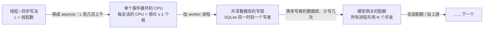
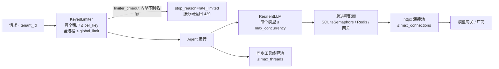

[中文](README.md) | [English](README.en.md)

# 第 30 课：生产环境的高并发异步运行时 —— 规模上来之后什么会坏，运行时怎么扛住

> 🕐 建议用时：40 分钟 ｜ 🎯 学完你能：用利特尔法则算出 Agent 服务需要多少并发，并用实测找出"天花板"此刻在哪（模型配额、事件循环 CPU、共享数据库的写锁、线程池）；讲清运行时在规模下的每个设计决定（实例共享、只读工具并行、三种执行方式与线程池大小、进程隔离、取消传播、每次异步保存都受保护、被吞掉的取消要补抛、截止时间、进程内舱壁与跨进程配额、首 token 之前才重试）；读懂 7 + 3 个实测发现并修掉的运行时 bug；认出 async 代码里 8 类常见的坑 ｜ 📦 对应源码：[`agentkit/agent.py`](../../agentkit/agent.py)（主循环、取消、收尾、流式）、[`agentkit/limits.py`](../../agentkit/limits.py)（舱壁、令牌桶）、[`agentkit/timeouts.py`](../../agentkit/timeouts.py)（取消安全的 `wait_for`）、[`agentkit/tools.py`](../../agentkit/tools.py)（线程池、进程隔离）、[`agentkit/reliability.py`](../../agentkit/reliability.py)、[`agentkit/distributed/`](../../agentkit/distributed/__init__.py)（`SQLiteSemaphore`、`WorkerPool`），测试 [`tests/test_runtime.py`](../../tests/test_runtime.py)；本课的 [`sse_app.py`](sse_app.py)（被 demo 作为 uvicorn 子进程启动）、[`worker_app.py`](worker_app.py)（被 `WorkerPool` 加载）
>
> 📖 必读：[Notes on structured concurrency, or: Go statement considered harmful](https://vorpus.org/blog/notes-on-structured-concurrency-or-go-statement-considered-harmful/)（Nathaniel J. Smith, 2018）—— 为什么"随手开一个后台任务"会像 goto 一样破坏抽象。重点读 "Nurseries: a structured replacement for go statements" 一节：子任务不能比创建它的作用域活得更久，错误传播和取消才重新变得可以推理。本课 2.5 节的缺陷、问题卡片 5 和练习 (a)，都是这个思想的直接应用。

## 0. 一句话讲清楚

**asyncio 让一个进程同时等几千个会话，这件事第 02 课已经讲过；规模上来之后，真正会坏的是另外几件事：用户走了运行还停不下来、收尾的保存写不进去、一处阻塞拖慢所有人、一个租户吃光资源，以及单个事件循环的 CPU 和共享数据库的写锁先到顶。这一课把这些"规模上来才暴露的问题"逐个摆出来，看运行时怎么扛住，每一条都有实测。**

本课在整门课里的位置：[第 02 课](../02_agent_loop/README.md)讲 async 的基础（为什么、`await`、`gather` + `Semaphore`、阻塞调用、取消）；[第 12 课](../12_production_architecture/README.md)、[第 13 课](../13_distributed_concurrency/README.md)讲多进程（队列、租约、fence、`WorkerPool` 拉起真实的 worker 进程）。这一课站在"上线之后"的角度把它们合起来：一个进程到底能扛多少，再加进程会怎样，断开、卡死、超限时运行时做了什么。

打个比方。事件循环像呼叫中心的一个坐席，同时挂着几百通电话（会话），大部分时间都在等对方查资料（等模型）。电话多了以后，出事的往往不是"接不过来"，而是：客户已经挂了，坐席还在替他查（取消没传到）；挂断时要写的工单记录没写进去（收尾保存被打断）；一个坐席亲自跑去仓库翻纸质档案，整排电话没人接（阻塞调用）；一个大客户占满了所有线路（没有舱壁）；楼里所有坐席要找同一个主管签字（共享数据库只有一个写者）。

| 规模上来之后坏在哪 | 运行时怎么扛 | 本课的证据（第 3 节，全部实测） |
|---|---|---|
| 吞吐上不去 | 一个 `Agent` 实例被所有会话共享，`gather` 同时推进；再按需加 worker 进程 | 200 个会话：一个接一个 80.73 秒，`gather` 0.43 秒；再加进程：1 → 4 个进程 348 → 846 任务/秒 |
| 天花板在哪不知道 | 测出来：模型配额、事件循环 CPU、共享数据库的写锁会轮流成为瓶颈 | 1 个进程 CPU 93%；换成 SQLite 检查点后 4 个进程只剩 384 任务/秒，worker CPU 33% |
| 用户走了，运行还在跑、还在花钱 | `CancelledError` 一路传到模型调用；SSE 断开即取消 | 真实 uvicorn 子进程：断开后 2–6 毫秒检查点记为 `cancelled`，30 秒的模型调用在途数归零 |
| 收尾保存写不进去，检查点卡在 `running` | 每一次异步保存都在独立任务里、受 `shield` 保护（R1） | 真实 SQLite 上逐个写入点取消：第一次修复 4/5 卡在 `running`，现在 0/5 |
| 标准库、依赖库吞掉取消 | 取消安全的 `agentkit.wait_for`（R3）；步骤边界补抛被吞掉的取消 | 3.11 的 `asyncio.wait_for` 最小复现吞掉取消；Agent 里 0/40 丢失；被依赖吞掉的取消在写工具执行前补抛 |
| 一处阻塞拖慢所有会话 | 同步工具进线程池；事件循环延迟做成指标 | 2 个租户的同步写入让心跳延迟到 615 毫秒，另外 20 个租户慢了 6 倍 |
| 卡住的线程占满线程池 | 线程池有上限、要监控；IO 工具换成 async | 4 线程的池子被卡住后，8 个正常请求 0 个开始执行就全部"超时" |
| 死循环、不可信代码 | `@tool(isolation="process")`：到点杀进程 | 线程里超时后本进程照样烧掉 2.00 秒 CPU；隔离后 0.03 秒 |
| 一个租户吃光资源 | `KeyedLimiter` 舱壁 + `limiter_timeout` 快速拒绝 | 安静租户 1.42 秒 → 0.21 秒 |
| 进程内的限额管不到别的进程 | 跨进程配额：`SQLiteSemaphore`（单机）、Redis / 网关（多机） | 3 个进程各设 4：网关实际收到 12 个并发；共享名额：4 个 |

## 1. 容量规划：先算，再找天花板

### 1.1 利特尔法则

利特尔法则（Little's Law）：**L = λ × W**。系统里同时在处理的请求数 L，等于到达速率 λ 乘以每个请求的平均停留时间 W。AWS Lambda 文档用同一个公式估算函数并发：`Concurrency = (average requests per second) * (average request duration in seconds)`。

| 场景 | λ（请求/秒） | W（秒/请求） | L = 需要同时"在等"的会话数 |
|---|---|---|---|
| 公司 IT 服务台，早高峰 | 50 | 8 | **400** |
| 电商客服，大促 | 200 | 5 | **1000** |
| 离线批量评估，每秒提交 20 条 | 20 | 30 | **600** |

反过来用：如果你只有 16 个线程（L = 16），W = 8 秒，那么最大吞吐 λ = 16 / 8 = **每秒 2 个请求**。第 3 节场景 1a 用实测验证这个公式。

Agent 服务的 W 几乎全是等待：一次真实模型调用的中位数在 2 秒左右（第 3.6 节），而运行时推进一个会话（两次模型调用加一次工具调用）自己只花约 0.18 毫秒 CPU（场景 1a 实测）。所以第一个问题是"能同时等多少个"，第二个问题才是"算不算得过来"。

### 1.2 三种载体：线程、进程、协程

每个"在等"的会话都需要一个载体。第 02 课比较过写法，这里比较规模上来之后的成本（场景 1b 实测）：

| 维度 | 每会话一个线程 | 多进程 | asyncio 协程 |
|---|---|---|---|
| 每个"在等"的会话占多少内存 | 实测每个阻塞线程约 35 KB 常驻内存，另有栈的虚拟内存预留 | 每个 worker 进程要一个完整的解释器（导入 agentkit 等依赖之后几十 MB） | 空闲协程实测约 1 KB；一个带完整 Agent 状态的在途会话约 16 KB（场景 1a 的 E） |
| 创建 2000 个的耗时 | 实测 164–176 毫秒 | 每个进程要启动解释器、导入依赖（spawn 方式每次上百毫秒） | 实测 4 毫秒 |
| 切换方式 | 操作系统抢占式，任何一行代码之间都可能切走，共享数据要加锁 | 操作系统调度，内存不共享 | 协作式，只在 `await` 处切换；两个 `await` 之间的代码天然"原子" |
| GIL | 等 IO 时会释放，但所有 Python 代码仍然排队执行 | 每个进程一个 GIL，能用满多核 | 单线程，不存在 GIL 争用，但也只用一个核 |
| 能否中途取消 | **不能**强杀线程，超时后它还在跑（场景 3b） | 可以 kill 整个进程（场景 3c） | 可以在任何 `await` 点取消（场景 4） |
| 适合的并发量级 | 几十到几百 | 等于 CPU 核数（再多没意义） | 每个进程几百到几千 |

结论：**生产里是组合**。每个 CPU 核一个进程（绕开 GIL、隔离故障），每个进程一个事件循环（撑起几百上千并发），绕不开的同步老代码放进有上限的线程池，不可信或 CPU 密集的代码放进子进程或沙箱。

补充一个正在变化的背景：Python 的无 GIL（free-threaded）构建在 3.14 进入"官方支持"阶段（[PEP 779](https://peps.python.org/pep-0779/)），但它仍是可选构建，不是默认的。而且它只解决"多核跑 Python 代码"，解决不了"线程杀不掉"和"每个线程的内存开销"，所以不改变本课的结论。

### 1.3 天花板会移动

场景 1 的实测把"加什么才有用"讲得很清楚：



- 同步写法的吞吐被线程数钉死（L = 16 就是每秒 16/W）；asyncio 把 L 提到几百上千，这时等待不再是问题。
- 一个事件循环只用一个核：会话多到一定程度，**CPU** 先到顶。表现是吞吐远低于"等待上限"、进程的 CPU 利用率接近 100%；工作集中到达时事件循环延迟也会跳起来（场景 1a 的 E：心跳 p99 迟到 96 毫秒），心跳迟到意味着租约续不上、健康检查超时。加进程能把这个天花板乘上去。
- 进程一多，所有进程共用的东西变成瓶颈：本机的 SQLite 同一时刻只允许一个写者，每个任务写几次检查点，进程数再加吞吐也不涨，worker 的 CPU 反而闲下来。
- 模型网关给的并发配额是硬上限：所有进程共用 8 个名额，加多少进程都一样。

**先测出天花板在哪，再决定加什么**：CPU 到顶就加进程，写锁到顶就换数据库或少写，配额到顶就去谈配额。第 13 课的 [3.12 节](../13_distributed_concurrency/README.md#312-实测加进程能快多少瓶颈在哪)从队列的角度测过同一件事，本课场景 1c 从事件循环 CPU 的角度补上这一段。

## 2. 运行时在规模下的设计：坏在哪 → 怎么扛 → 怎么证明

### 2.1 一个实例被所有会话共享，所以状态全在 `RunState` 里

```python
agent = Agent(llm, tools=[...])          # 进程启动时创建一次
results = await asyncio.gather(*(agent.run(q) for q in questions))  # 几百个会话共用它
```

[`agent.py`](../../agentkit/agent.py) 开头写明了这条约束：同一个 `Agent` 实例可以被并发复用，每次运行的全部数据都在 `RunState` 里，实例本身不保存任何"本次运行"的东西。

**为什么**：每个请求都新建一个 Agent，会重复创建线程池和连接池，连接池就失去了意义。但只要实例被复用，任何放在 `self` 上的"本次运行"的数据都会被几百个会话同时读写。[第 08 课](../08_reliability/README.md)的 `LoopGuard` 练习讲过同一个教训：计数必须放在 `state.metadata` 上，而不是 Hook 实例上。在 asyncio 里这件事更隐蔽，因为不需要多线程：会话 A 在 `await` 处挂起的那一刻，会话 B 就可能改掉 `self` 上的数据。

**你的 Hook 也一样**：Hook 实例同样被所有会话共享。要记住"本次运行"的东西，放进 `state`。

**证据**：`test_one_process_runs_many_sessions_concurrently` 让 100 个会话共用一个实例，模型调用的在途峰值 ≥ 90，每个会话看到的都是自己的问题。场景 1a 的 2000 个会话（以及 B 里 16 个线程共用一个实例）也逐个核对过，串台数为 0。

### 2.2 只读工具并行，写工具串行

```python
# agentkit/agent.py: _run_pending_tools
parallel = self.parallel_tools and len(calls) > 1 and all(t is not None and t.risk == "read" for t in tools)
if not parallel:
    for call in calls:  # 有写操作：按模型给出的顺序逐个执行，每个执行完都落盘
        ...
results = await asyncio.gather(*(one(c) for c in calls), return_exceptions=True)
```

**为什么这样分**：只读工具之间没有依赖，谁先谁后结果都一样，并行后一轮的耗时从"求和"变成"取最大"。写工具不行。模型可能先"创建工单"再"给工单加备注"，顺序一乱就错了；而且每个写工具执行完都要立刻存检查点，把"执行了但没记下来"的窗口缩到最小（[第 08 课](../08_reliability/README.md)）。

**为什么用 `return_exceptions=True`**：`PauseRun`（等审批）和 `StopRun`（预算用完）是用异常实现的控制流。收集到所有结果之后，先把已经完成的工具结果按原始顺序写回并落盘，再抛出第一个控制流异常。这样恢复时不会重跑已经完成的工具。它还有一个不太为人所知的好处，见问题卡片 5：外部取消时，`return_exceptions=True` 的 `gather` 会等所有子任务收尾，而默认参数下不会。

**上限**：`max_parallel_tools=8`，用一个信号量限制同一轮里最多并行多少个工具。模型偶尔一次要调 30 个工具，不能让它瞬间打出 30 个下游请求。

**实测发现、已修复的一个坑：并行工具绕过了预算**（7.2 节 #3）。
- 现象：`BudgetHook(max_tool_calls=1)`，模型一轮调用 4 个只读工具，4 个全部执行，运行正常完成。
- 根因：`BudgetHook.before_tool` 检查 `state.tool_calls_count`，而这个计数原来在工具**执行完之后**才加一。并行时，4 个调用各自在自己的 task 里先跑 `before_tool`，那一刻谁都还没执行完，都看到"还没超预算"。串行时同样的代码是对的，一并行就错。
- 修复：计数改到执行**之前**（[`agent.py`](../../agentkit/agent.py) 里 `state.tool_calls_count += 1` 在 `await self.executor.execute(...)` 前面）。
- 回归测试：`test_parallel_read_tools_respect_tool_call_budget`，断言只执行了第一个工具，`stop_reason == "budget_exceeded"`。

这类 bug 的共性值得记住："先检查、后更新"在串行代码里没问题；一旦中间出现并发（哪怕是单线程的 asyncio），就必须**在检查的同一刻占用名额**。

### 2.3 三种执行方式：线程池要有上限，CPU 密集的要进程隔离

| 工具类型 | 怎么执行（[`tools.py`](../../agentkit/tools.py) 的 `ToolExecutor`） | 超时时发生什么 |
|---|---|---|
| `async def` 工具（调 HTTP API、数据库） | 直接在事件循环里 `await`，外面套取消安全的 `wait_for` | **真正取消**：`CancelledError` 传进工具，连接被释放 |
| 普通同步函数 | 放进线程池（`Agent(max_threads=N)` 给一个有上限的独立池；不传就用事件循环的默认池），不阻塞事件循环 | 调用方按时拿到超时结果，**但线程杀不掉**，会在后台跑完 |
| `@tool(isolation="process")` / `isolated(tool)` | 在 spawn 出来的子进程里执行 | **硬超时**：直接 kill 子进程 |

**线程池为什么会被"卡死"**：Python 没有安全强杀线程的 API。`wait_for(loop.run_in_executor(...))` 超时，只是调用方"不再等了"，线程本身照跑，一直占着池子的名额。名额被占满之后，新来的同步工具只能在队列里排队，而超时从排队就开始算。场景 3b 实测：4 个请求把老 ERP 卡住 2 秒，紧接着 8 个本来只要 0.05 秒的请求，在 4 线程的池子里**一个都没开始执行**就全部"超时"了；池子开到 16 个线程，8 个全部成功。卡住的 4 个线程在调用方拿到超时之后，又在后台跑了约 1.5 秒才结束。

所以：线程池要有上限（`max_threads`，这本身就是一种背压），要监控占用和排队；共享一个池的 Agent 用 `executor=ToolExecutor(..., max_threads=N)` 注入；IO 型的同步 SDK 尽快换成 async 版本。

**为什么还要进程隔离**：一个纯计算的死循环没有任何 `await` 点，协程取消不了它；放进线程，超时后它照样把 CPU 烧完，而且通过 GIL 和事件循环抢时间片。场景 3c 实测：同一段 2 秒的纯计算、超时 0.5 秒，放在线程池里时本进程在这 2.3 秒里一共用了 2.00 秒 CPU（超时没有让它少算一秒）；`isolation="process"` 时到点杀掉子进程，本进程只用了 0.03 秒，拿到结果时已经没有活着的子进程。代价是参数必须能 pickle，而且每次都要启动子进程：一个什么都不做的隔离调用实测约 170 毫秒。生产中更强的隔离是容器、gVisor、microVM（[第 19 课](../19_mcp_and_sandbox/README.md)）。

**实测发现、已修复的一个小问题：启动子进程时卡住了事件循环**（7.2 节 #5）。
- 现象：用 5 毫秒心跳测量，每次隔离工具调用会让事件循环卡顿最多约 11 毫秒。
- 根因：`run_in_subprocess` 在事件循环线程里**同步**调用了 `proc.start()`（spawn 要 fork/exec 再传参）和 `proc.join(timeout=2)`。这正是第 5.1 节"async 函数里调用阻塞操作"的一个隐蔽版本：它藏在框架里，而不是业务代码里。
- 修复：`proc.start` 放进线程池执行；`proc.join` 也放进线程，并用 `asyncio.shield` 保护，即使调用方被取消，也要把子进程回收掉，不留僵尸进程；`parent.close()` 放进 `finally`，等待 `join` 时被取消也会立即关闭管道。
- 回归测试：`test_subprocess_start_does_not_run_on_event_loop_thread`，断言 `start` 不在事件循环所在的线程上执行。在一台负载很高的机器上，几毫秒的卡顿分不清来自子进程还是别的进程抢 CPU，所以真正的证据是这个确定性的回归测试，而不是计时。

### 2.4 取消传播：`CancelledError` 必须重新抛出

```python
# agentkit/agent.py: _drive
except asyncio.CancelledError:
    # 取消不是失败：记录下来、收好尾，然后**必须**继续向外抛，否则调用方的取消就失效了
    state.status, state.stop_reason, state.output = "cancelled", "cancelled", "（运行已取消）"
    self._close_dangling_calls(state, "未执行：运行已取消", keep_side_effects=True)
    raise
finally:
    # 收尾（on_run_end 钩子 + 最后一次保存，完成后才释放舱壁名额）放进独立任务并用 shield 保护，见 2.5 节
    finish = asyncio.ensure_future(self._finish(state, slot if entered else None))
    await asyncio.shield(finish)
```

**为什么必须重新抛出**：取消是调用方下的命令，不是"出了一个错"。吞掉它，调用方就以为运行正常结束了。更隐蔽的是，`asyncio.TaskGroup` 和 `asyncio.timeout()` 这些结构化并发组件本身就靠取消实现。Python 官方文档明确警告，协程吞掉 `CancelledError` 会让它们行为异常。

**为什么只给只读工具补"未执行"结果**：OpenAI 的消息协议要求每个 `tool_call` 都有对应的 `tool` 消息，不补上，下次带着这段历史调用模型会直接得到 400 错误。但写工具和高危工具**故意保持未回答**（`keep_side_effects=True`）：取消的那一刻，它可能已经在下游执行了一半，比如工单已经建好、只是响应还没回来。如果补上"未执行"，恢复后模型会重新发起一个**新的** `call_id`，幂等键（`run_id:call_id`）随之改变，工单就会建两次。保持未回答，`resume` 时就会用**同一个** `call_id` 重放，幂等存储或下游的 Idempotency-Key 负责去重（第 08、13、26 课）。不打算恢复、要开新对话时，`RunResult.history` 会给这些调用补上占位结果，保证消息协议仍然合法。回归测试：`test_cancel_keeps_in_flight_write_unanswered_and_resume_replays_same_call_id`。

**一次断开连接是怎么一路传到模型调用的**（场景 4 在真实的 uvicorn 子进程上实测）：


`Agent._stream` 的 `finally` 负责把"消费方不再读取"翻译成"取消运行"。取消之后它用 `await asyncio.wait({task})` 等运行任务收尾，而不是 `await task`，原因见下一节。

### 2.5 一个完整的案例：发现缺陷 → 定位根因 → 修复 → 复测 → 再修（R1）

写这节课时，我们在 Demo 里撞上了运行时的一个真实缺陷。它被修了两次：第一次修复不彻底，是复测时发现的。完整走一遍这个过程，比任何说教都更能说明两件事：取消很难做对；回归测试必须覆盖故障窗口里的**每一个位置**，而不是只测一个时刻。（下面①④的数字是当时的实测，那时异步运行时还是一个单独的包；代码现在都在 [`agent.py`](../../agentkit/agent.py) 里，⑤ 的复现是现在的 Demo 在真实 SQLite 上跑的。）

**① 现象。** 当时的 Demo 把检查点换成[第 26 课](../26_state_and_queues/README.md)的 Postgres 检查点，连一个嵌入式的真实 Postgres 16，然后重复"读到 `tool_finished` 就断开"。每一次运行都确实停了，在途调用归零，**但检查点经常停在 `running`**：真实 Postgres 10 次里有 3 到 7 次。对账程序会以为这些运行还在跑。

**② 根因。** 要把三件事连起来看：

1. Starlette（FastAPI 的底层）基于 AnyIO。AnyIO 的取消是"电平触发"的：只要任务还在一个已取消的作用域里，它每碰到一个 `await` 就会再被取消一次。AnyIO 文档的原话是，要在收尾时 `await`，就必须 "enclose it in a shielded cancel scope"。
2. 当时 `_stream` 的 `finally` 用 `suppress(CancelledError)` 加 `await task` 等待运行任务收尾。这个 `await` 被 AnyIO 再次取消，而 asyncio 取消一个正在 `await` 另一个任务的任务时，会把取消**转发**给被等的任务。
3. 运行任务此时正在 `_drive` 的 `finally` 里执行 `await self._save(state)`，想把 `cancelled` 状态存下来。第二次取消打断了这次保存。

同步检查点（`InMemoryCheckpointer`）没有这个问题，因为保存时根本没有 `await` 点；当时的测试用的都是同步检查点，也没有经过 Starlette。**同步的测试全部通过，不代表异步的代码是对的。** Demo 4c 的第 ① 步用 10 行代码复现了根因（`level_triggered_cleanup`，不依赖 agentkit）：在已取消的 AnyIO 作用域里，`finally` 中直接 `await` 保存，结果是 `'running'`；放进 `anyio.CancelScope(shield=True)`，结果是 `'cancelled'`。

**③ 第一次修复**（三处改动）：`_drive` 的收尾（`on_run_end` 钩子加最后一次保存）放进独立任务，用 `asyncio.shield` 保护；`_stream` 改用 `await asyncio.wait({task})`，只等待、不转发取消；同一个 run 的检查点读写用 `KeyedLocks` 排队，这样 `resume` 会等后台的收尾写完再读。回归测试：`test_repeated_cancellation_still_records_cancelled_state`（连续取消两次）、`test_stream_disconnect_with_slow_async_checkpointer_always_records_cancel`（流式断开时再取消一次，10/10）。

**④ 复测：还有漏网的。** 用第一次修复后的代码在真实 Postgres 上重复断开 120 次，结果是 **115/120**，漏掉的 5 次每次都伴随服务端一个 `CheckpointConflict`。这次的根因不在收尾，而在**收尾之前**：第一次取消打断的是**上一次**保存（工具执行完后那次）。那条 `UPDATE` 已经在数据库里提交、版本号加了一，客户端却没收到回复，本地记住的版本号于是过期了；收尾时的保存按旧版本号做 CAS，被正确地当成冲突拒绝。第一次修复只保护了"最后一次"保存，问题出在"倒数第二次"。

为什么第一次的回归测试没抓到？它们都在一个固定时刻取消，恰好没落在"已提交、未回复"的那几毫秒里。只有在真实数据库上重复上百次，才会偶尔撞上。

**⑤ 第二次修复**（[`agent.py`](../../agentkit/agent.py) 现在的 `_save`）：

```python
async def _save(self, state: RunState) -> None:
    cp = self._checkpointer()
    if not inspect.iscoroutinefunction(getattr(cp, "save", None)):
        cp.save(state)          # 同步检查点：中间没有 await，不可能被取消打断，直接写
        return
    snapshot = _snapshot(state)  # 浅快照：复制各个容器，不深拷贝每条消息
    await asyncio.shield(asyncio.ensure_future(self._save_now(cp, snapshot)))  # 在 _io_locks 内执行
```

异步检查点的**每一次**保存都放进受保护的独立任务：一次写入要么不开始，要么完整结束，不存在"不知道写没写进去"的状态。快照是因为保存在后台进行时，运行本身还会继续修改 `state`。同时 `_stream` 在 `wait` 之后会检查 `task.exception()`，运行任务以普通异常结束时记一条 `agentkit` 的 warning，不再留下一句无人理会的 "Task exception was never retrieved"（R2）。当时的复测：真实 Postgres 上断开 120 次，**120/120** 记为 `cancelled`。

回归测试 `test_cancel_between_db_commit_and_response_never_strands_the_run` 吸取了上一轮的教训：用一个"提交后过一会儿才回复"的 CAS 存储，在一次运行的 **20 个不同时刻**取消，把"已提交、未回复"的窗口扫一遍（修复前 cancelled 10 / running 6 / completed 4，修复后 20 / 0 / 0）。

**现在的 Demo 在真实 SQLite 上把这个窗口精确地打出来**（场景 4c ②）：用真实的 `SQLiteCheckpointer`，在第 k 次写事务**提交之后**、回复回到事件循环之前取消运行（数据库线程提交完成后用 `call_soon_threadsafe` 把 `task.cancel` 排进事件循环，它比"回复到达"先执行），每个写入点各一次，对照第一次修复时的 `_save`（`FirstFixAgent`）：

| 写入点 | 第一次修复（只保护收尾保存） | 现在的 `Agent`（每次异步保存都 shield） |
|---|---|---|
| 1. 用户消息落盘 | 调用方收到 `CheckpointConflict`，检查点 `running` | `CancelledError`，检查点 `cancelled` |
| 2. 模型回复（工具调用）落盘 | `CheckpointConflict`，`running` | `CancelledError`，`cancelled` |
| 3. 工具结果落盘 | `CheckpointConflict`，`running` | `CancelledError`，`cancelled` |
| 4. 最终回答落盘 | `CheckpointConflict`，`running` | `CancelledError`，`cancelled` |
| 5. 收尾保存 | `CancelledError`，`completed` | `CancelledError`，`completed` |

第一次修复的版本不但卡在 `running`，调用方看到的还是 `CheckpointConflict` 而不是 `CancelledError`：收尾里的冲突把取消"替换"掉了。第 5 行两边一样：取消到达时最后一次保存已经提交，运行确实完成了，检查点如实记为 `completed`。这个复现是确定性的（每次运行结果相同），用的是真实的数据库文件和真实的写事务，只有"取消在哪一刻到达"是注入的。

这个案例值得记住的规律：
- **收尾里的 `await` 需要保护**：在"反复取消"的框架（AnyIO、Trio）里尤其如此。
- **同一个 key 的写入必须串行**：并发写同一行，要么互相覆盖，要么被 CAS 拒绝。
- **被取消的写操作，结果是"未知"，不是"失败"**：它可能已经生效了。所以要么别在写到一半时取消它，要么事后能对账（幂等键、重新读取版本号）。
- **测并发 bug，要扫描时间窗口**：在一个时刻取消只能证明"这个时刻没问题"。要在故障窗口的各个位置各取消一次，还要给结果分类（停住了？卡住了？还是根本没停？），第三类往往指向另一个 bug（下一节）。

### 2.6 连标准库和依赖库都会吞掉取消（R3，以及步骤边界的补抛）

**标准库。** 当时的复测在第二次修复后的扫描里仍然看到了几次 `completed`：取消信号**丢失了**，运行没有停，跑到了结束，第二次模型调用照样花了钱。这比停在 `running` 更糟。给每次 `asyncio.wait_for` 加探针后，80 次随机时刻的取消里出现了 12 次 completed，12 次全都有同一个特征：`wait_for` 返回了结果，而当前任务身上还挂着一个没送达的取消请求（`task.cancelling() > 0`）。

这是 CPython 的一个已知竞态（[gh-86296](https://github.com/python/cpython/issues/86296)，"AsyncIO's wait_for can hide cancellation in a rare race condition"）：在 Python 3.11 及更早版本里，如果内部结果和外部取消在同一轮事件循环里到达，`wait_for` 会返回结果、吞掉取消。Python 3.12 用 `asyncio.timeout()` 重写了 `wait_for`。当时的工具执行器正是用 `wait_for` 给同步工具加超时的，所以**同步工具执行完的那一刻**用户断开，取消就可能丢失：专门制造这个时刻，240 次里有 89 次取消丢失。

**修复：换掉 `wait_for`**（R3）。[`agentkit/timeouts.py`](../../agentkit/timeouts.py) 提供取消安全的 `wait_for`（也从 `agentkit` 导出）：3.11+ 用 `asyncio.timeout()`（在当前任务里内联等待，靠 cancel/uncancel 计数区分"自己的超时"和"外部取消"，3.12 的 `wait_for` 本身就是这样实现的）；3.10 没有 `asyncio.timeout()`，就用 `asyncio.wait` 自己实现，和练习 (b) 同一个思路：外部取消一律优先。取消优先有一个代价：如果内部操作其实已经完成，它的结果会被丢弃。对"拿到就要归还"的资源（例如 `KeyedLimiter` 的信号量名额），用 `on_discard` 参数归还，否则名额会永久泄漏。工具执行、`run_timeout`、`KeyedLimiter`、worker 循环全部用它。当时的复测：240 次里取消丢失从 89 次降到 **0 次**。现在的 Demo（场景 4c ④）在 Python 3.11.7 上：5 行代码的最小复现里标准库 `wait_for` 仍然吞掉了取消；Agent 里同一个时刻断开 40 次，丢失 **0** 次。回归测试：`test_wait_for_never_swallows_cancel_when_result_arrives_in_same_tick`、`test_wait_for_cancel_racing_semaphore_grant_does_not_leak_permit`、`test_tool_executor_cancel_at_tool_completion_is_not_lost` 等（每个竞态场景在 3.10 和 3.11+ 两种实现上各测一遍）。

**依赖库。** agentkit 自己的 `wait_for` 管不到依赖库：3.12 之前，redis-py、psycopg_pool 等在内部用 `asyncio.wait_for`，同样会吞掉取消。[第 31 课](../31_deployment_and_scaling/README.md)压测时实测到：限流 Hook 调 Redis 时约 1/4 的这类取消被吞，断开的运行照样跑完、照样建单。修法在 [`agent.py`](../../agentkit/agent.py) 的 `_raise_if_cancel_swallowed`：被吞掉的取消在 `Task.cancelling()` 里还留着计数（按 asyncio 的约定，正规地压制取消必须调用 `uncancel()`），所以只要计数比进入运行时大，就说明有人吞了取消，在**调用模型、执行工具之前**补抛。它以进入时的计数为基线（和 `asyncio.timeout()` 一样），不会误伤调用方自己的状态；`run_timeout` 到期时的取消被吞了也会补抛，再转成超时。补抛时打一条 warning，带稳定的 `extra` 字段 `agentkit_event="swallowed_cancellation"`，运维按字段计数，而不是按措辞匹配。

场景 4c ⑤ 实测：一个 `after_llm` 钩子像 redis-py 那样用标准库 `asyncio.wait_for` 等回复，让回复和取消在同一轮事件循环里到达。在 3.11.7 上钩子里的 `wait_for` **正常返回**（取消被吞掉）；Agent 在执行写工具之前补抛了取消：检查点 `cancelled`，写工具执行 **0** 次，模型只调用了 1 次，日志带着 `agentkit_event=swallowed_cancellation`。回归测试：`test_cancel_swallowed_by_a_dependency_is_re_raised_before_side_effects`、`test_run_timeout_swallowed_by_a_dependency_still_times_out`、`test_swallowed_cancellation_is_logged_with_a_stable_event_field`。

换掉 `wait_for` 还暴露了一个隐藏依赖：第 28 课的一个测试断言"三个并行工具的时间区间互相重叠"，修复后在 3.11 上稳定失败。原因是其中一个工具等待的事件已经 set 了，`wait()` 立即返回，工具从头到尾没有挂起、同步就跑完了；以前能通过，只是因为 3.11 的 `wait_for` 会把工具包成一个新任务，多走一轮事件循环。修法是让测试里的工具真的挂起一次，而不是把运行时改回去。

### 2.7 `run_timeout`：整次运行的截止时间

```python
# agentkit/agent.py: _drive
if self.run_timeout is not None:
    await wait_for(body, self.run_timeout)  # 取消安全版，见 timeouts.py
```

**为什么每个工具和每次模型调用已经有超时了，还要再加一个**：10 个步骤，每步都在自己的时限内，加起来仍然可能超过用户的耐心和整条 HTTP 链路的超时（[第 13 课](../13_distributed_concurrency/README.md)的问题 2）。超时后的状态是 `stopped` / `timeout`。和取消一样，只读工具补上"未执行：运行超时"，写工具保持未回答，等恢复时用同一个 `call_id` 重放。

一个细节：等舱壁名额的时间**不算**在 `run_timeout` 里，它由 `limiter_timeout` 单独控制。所以最坏延迟是 `limiter_timeout + run_timeout`，设置网关超时时要把两者加起来。

### 2.8 舱壁与背压：进程内按租户隔离，跨进程共享配额



每一层的上限都是一种背压（backpressure）：下游忙不过来时，让上游在本进程里等，或者被快速拒绝，而不是把压力继续往下传。

| 层 | 参数 | 防的是什么 | 管得到哪里 |
|---|---|---|---|
| `KeyedLimiter` | `per_key`、`global_limit`、`overrides` | 一个租户吃光所有名额（吵闹的邻居） | 本进程 |
| `limiter_timeout` | 秒数 | 无限排队。排不上就明确告诉用户"稍后再试"，比挂 60 秒再超时好 | 本进程 |
| `ResilientLLM(max_concurrency=…)` | 每个模型一个信号量 | 同时打到网关的请求超过配额，引发 429 和重试风暴 | 本进程 |
| `OpenAICompatLLM(max_connections=…)` | httpx 连接池 | 连接数失控。httpx 的默认值是 100 个连接、20 个 keep-alive | 本进程 |
| `Agent(max_threads=…)` | 同步工具线程池 | 同步工具无限开线程 | 本进程 |
| `run_worker(concurrency=…)` | 每个 worker 进程同时处理的任务数 | 满载时不再领取，任务留在队列里给别的进程（第 13 课） | 本进程 |
| `SQLiteSemaphore` / `SQLiteTokenBucket` | 名额存在共享数据库里，带租约 | N 个进程各设上限 = N 倍的实际并发 | 本机所有进程 |
| Redis 令牌桶 / 网关限额 | 第 26、29 课 | 同上，跨机器 | 所有实例 |

**为什么进程内不需要锁**：`KeyedLimiter` 的计数、`TokenBucket` 的"补充令牌加扣减"，中间都没有 `await`。事件循环是单线程的，所以这些代码天然原子。换成多线程，这里就必须加锁；换成多进程，就必须放进数据库或 Redis，用事务或 Lua 脚本保证原子。场景 5b 实测：3 个真实进程各自用 `asyncio.Semaphore(4)`，网关同一时刻实际收到 **12** 个请求；换成共享的 `SQLiteSemaphore(4)`，全局峰值 **4**。`SQLiteSemaphore` 的名额带租约，持有者被 `kill -9` 之后租约到期自动归还（第 13 课实测过）。

**实测发现、已修复的一个缺陷：舱壁在全局名额紧张时会漏**（7.2 节 #2）。
- 现象：`KeyedLimiter(per_key=2, global_limit=3)`，全局名额被其他租户占满时，同一个租户同时进入执行的请求达到 **3** 个。
- 根因：为了防止租户很多时字典无限增长，空闲租户的信号量会被回收。原来判断"空闲"用的是 `_in_use`，它只统计"两道门都进了"的请求。可是有一个阶段被漏掉了：请求已经拿到**租户**名额，还在排队等**全局**名额。这时另一个请求结束，`_in_use` 减到 0，这个租户的信号量就被删掉了，而排队的那个请求手里还握着旧信号量。下一个请求来时创建了一个**全新的**信号量，名额又从 2 开始算。
- 修复：改成按**引用计数**回收（[`limits.py`](../../agentkit/limits.py) 的 `_refs`：进入 `slot()` 就加一，离开才减一，覆盖排队阶段），归零才删除。另外，舱壁名额由收尾任务（`_finish`）在最后一次保存完成**之后**才释放，即使外层被再次取消、不再等待收尾，名额也要等收尾写完才还回去。
- 回归测试：`test_keyed_limiter_per_key_limit_holds_when_global_is_saturated`，断言两个租户的峰值都不超过上限，并且结束后 `_sems` 和 `_refs` 都清空（没有泄漏）。另一个相关修复来自第 12 课：新运行在拿舱壁名额时就被拒绝，什么都没发生，不存检查点、不跑收尾钩子（`test_run_rejected_by_bulkhead_leaves_no_half_checkpoint`）。

教训：**"回收空闲资源"的判断条件，必须覆盖资源被持有的每一个阶段**，包括"拿到一半"的阶段。

### 2.9 流式输出，以及为什么只能在首 token 之前重试

```python
# agentkit/reliability.py: ResilientLLM.stream
except LLMError as e:
    if started:
        raise  # 已经把部分内容推给了用户：不能静默重试，否则用户会看到重复的文字
```

**为什么**：已经推到用户屏幕上的半句话收不回来。这时候静默重试，用户会看到"您的 VPN 证书您的 VPN 证书已过期"；中途切换到备用模型更糟，前半句和后半句出自两个模型。所以第一个 token 之前可以放心重试、降级；之后出错只能如实报错，由前端提供"重新生成"，或者由服务端从检查点恢复（2.4 节、问题卡片 3）。

**流式还带来一个度量**：首 token 延迟（TTFT）。推理模型要"想完"才开始吐字，TTFT 可能占总耗时的大部分。场景 6 实测见 3.6 节。流式并不会缩短总耗时，它缩短的是用户"盯着空白屏幕"的时间。经过网关的流式细节见[第 29 课](../29_gateway_and_guardrails/README.md)。

`OpenAICompatLLM.stream` 还做了两件容易漏掉的事：请求时加 `stream_options={"include_usage": True}`，否则流式响应里没有 token 用量，成本就没法算；另外在 `finally` 里关闭上游流，提前退出时立刻把连接还给连接池。

### 2.10 用 ContextVar 做事件出口，多个流不会串线

```python
# agentkit/agent.py: _stream
queue: asyncio.Queue = asyncio.Queue()
token = _emitter.set(queue.put_nowait)
try:
    task = asyncio.ensure_future(start())  # 新 Task 复制当前上下文：它看到的是这个流自己的事件出口
finally:
    _emitter.reset(token)
```

**为什么不用实例属性 `self.emit = ...`**：20 个流同时在跑，它们共用一个 Agent 实例，后设置的会覆盖先设置的，所有事件都会流进最后一个客户端。`ContextVar` 的每个值属于一个上下文，而 asyncio 的 Task 在创建时会**复制**当前上下文。所以先设置、再创建 Task、立刻还原，这个运行任务（以及它内部并行工具的子任务）看到的就永远是自己的队列。worker 按任务传入的检查点视图（`run(..., checkpointer=...)`）用的是同一个机制。

**为什么要立刻 `reset`**：消费方自己的上下文不应该继续带着这个出口，否则消费方随后启动的另一个运行也会把事件塞进这个队列。

**证据**：`test_concurrent_streams_do_not_mix_events` 同时跑 20 个流，每个流收到的文本都只属于自己的问题。追踪的 span 栈用的是同一个机制（[第 28 课](../28_production_observability/README.md)讲了它在并发下为什么是对的）。

## 3. 动手：运行 Demo（全部是实测数字）

```bash
python lessons/30_async_runtime/demo.py --offline                    # 场景 1–5，不调用模型，约 1–2 分钟
python lessons/30_async_runtime/demo.py --offline --full --repeat 3  # 1a 的"一个接一个"跑满 200 个；每种方式 3 次取中位数，约 4 分钟
python lessons/30_async_runtime/demo.py --offline --only 4           # 只跑某个场景
python lessons/30_async_runtime/demo.py                              # 再加场景 6：真实模型，约 8 次调用
```

**真实发生了什么**：线程是真的线程；1c 和 5b 是真的操作系统进程（`WorkerPool` 拉起 `python -m agentkit.distributed.worker`，5b 拉起 3 个 `python` 子进程），它们只通过同一个 SQLite 文件协作；场景 4 的服务端是用 `python -m uvicorn` 启动的**子进程**，demo 用 httpx 通过真实的 TCP 连接和它交流，断开就是关闭 TCP 连接；检查点是真实的数据库（SQLite 文件，装了 pgserver 时再加一个嵌入式 Postgres 进程）。**模拟的只有模型**：场景 1–5 用剧本模型，`await asyncio.sleep(...)` 扮演"等模型"，这样数字可复现、断开的时刻可控；1c 里每次调用模型前还有一个 Hook 做约 1 毫秒的纯 Python 计算，代表你自己的 Hook、上下文策略、JSON 处理加进来的 CPU（按进程实测校准成固定计算量，不是按墙钟空转）。

**测量环境**：Apple M1（8 核）、8 GB 内存、macOS 14.4.1、CPython 3.11.7、SQLite 3.41.2；fastapi 0.141.1、uvicorn 0.54.0、starlette 1.7.0、httpx 0.28.1、anyio 4.15.1；场景 4 的 Postgres 是 pgserver 0.1.4 自带的 Postgres 16（嵌入式，走 unix socket）。**如实说明**：测量时这台机器上还有其他任务在跑（load average 约 5；1c 测量期间 1 分钟 load average 一度升到 57），多进程的数字受它影响最大。下面是 `--offline --full --repeat 3` 那次运行的结果，另外注明了其他运行里观察到的范围。

### 3.1 场景 1：吞吐与天花板

**1a：同一批 200 个会话，一个进程里的几种跑法。** 每个会话 = 2 次模型调用 × 0.2 秒 + 1 次 async 工具，所以 W ≈ 0.4 秒。每种方式在一个全新的子进程里跑（内存数字互不干扰），3 次取耗时中位数。

| 方式 | 会话 | 耗时 | 吞吐（会话/秒） | 峰值在途 | 利特尔预测 L/W | CPU 时间 | 峰值 RSS 增量 | 事件循环延迟 p99 / max |
|---|---|---|---|---|---|---|---|---|
| A. 一个接一个 `await`（`--full`，跑满 200 个） | 200 | 80.73 s | 2.5 | 1 | 2.5 | 0.88 s | 0.8 MB | 2 / 3 ms |
| B. 16 个线程 × 各自的事件循环（共用一个 `Agent`） | 200 | 5.27 s | 37.9 | 16 | 40.0 | 0.09 s | 3.2 MB | — |
| C. `asyncio.gather` 全部 | 200 | **0.43 s** | **467.2** | 200 | 500.0 | 0.05 s | 3.5 MB | 16 / 16 ms |
| D. `gather` + 舱壁 `KeyedLimiter(per_key=50)` | 200 | 1.63 s | 122.7 | 50 | 125.0 | 0.07 s | 2.9 MB | 2 / 4 ms |
| E. `gather` 全部，2000 个会话 | 2000 | 0.60 s | 3355.7 | 2000 | 5000.0 | 0.37 s | 31.1 MB | 96 / 96 ms |

- **利特尔法则完全吻合**：A、B、D 的实测吞吐和预测（L / W）几乎一样。吞吐只取决于"同时在飞"的会话数 L。
- **B 是"同步框架里调用 async 代码"的典型写法**：16 个线程，每个线程一个事件循环，一次跑一个会话。它和以前"同步 Agent + 16 线程"一样被线程数钉死，吞吐是 C 的 1/12。一个 `Agent` 实例被 16 个线程共用，没有串台，但每个线程的事件循环里永远只有一个会话。
- **D 说明舱壁就是你亲手选的 L**：`KeyedLimiter(per_key=50)` 把同时在跑的会话钉在 50，吞吐就按 50 / 0.4 = 125 封顶。在生产里这个 L 由下游配额决定（问题卡片 4），不是越大越好。
- **E 是单个事件循环的 CPU 天花板**：2000 个会话花了 0.37 秒 CPU，约 0.18 毫秒/会话（校验、序列化检查点、追踪）。耗时 0.60 秒而不是 0.4 秒：多出来的部分是 2000 个会话的 CPU 工作挤在同一个核上排队，心跳 p99 迟到 96 毫秒。按这个开销估算，单核的稳态上限约每秒 5000 多 个会话；你的 Hook、上下文策略、JSON 处理每多花 1 毫秒，这个上限就掉一大截（1c 就是这样）。
- 以前这一行的 CPU 开销约 1 毫秒/会话：cProfile 发现约 43% 在检查点保存时用 `dataclasses.asdict` 深拷贝全部消息，约 33% 在每次调用模型前重新生成工具的 JSON Schema。维护者据此做了两处修复（7.2 节 #6）：`Tool.schema()` 缓存结果，检查点改用 `RunState.to_json()` 直接序列化。当时的剧本模型还会为了事后断言深拷贝每次调用的消息，本课的 `BenchLLM` 不做这件事，所以现在的数字更低。

**1b：一个"在等 IO 的会话"最少要花多少内存**（线程和协程各自在独立子进程里测）：

| 等待者 | 数量 | 创建耗时 | RSS 增量 | 每个 |
|---|---|---|---|---|
| 线程（阻塞在 `Event.wait`） | 2000 | 176 ms（另一次运行 164 ms） | 69.1 MB | 35.4 KB |
| 协程（`await Event.wait`） | 2000 | 4 ms | 1.8 MB | 0.9 KB |
| 协程 | 50000 | 158 ms | 46.5 MB | 1.0 KB |

同样 2000 个等待者，协程的内存约为线程的 1/40，创建速度快约 40 倍。

**1c：加进程 —— 天花板怎么移动。** `WorkerPool` 拉起 K 个真实的 worker 进程（`python -m agentkit.distributed.worker --app lessons/30_async_runtime/worker_app.py:make_handler`），共享一个 SQLite 文件做任务队列。每个任务 = 一次 Agent 运行：2 次模型调用（各等 0.1 秒）+ 1 次 async 工具，每次调用模型前 Hook 做约 1 毫秒的 CPU 计算。计时从"开闸"算起：任务先带着很长的延迟入队，等所有 worker 进程都启动完毕，再用一条 `UPDATE` 让它们同时变成可领取（和第 13 课 `demo_scale.py` 同一个做法）。

| 配置 | 任务数 | 耗时 | 任务/秒 | 等待上限 | worker CPU 利用率 | 事件循环延迟 p99（最差的进程） |
|---|---|---|---|---|---|---|
| 1 进程 × 并发 256，检查点在内存 | 1200 | 3.44 s | 348 | 1280 | 93% | 4 ms |
| 2 进程 × 并发 256，检查点在内存 | 1200 | 1.93 s | 621 | 2560 | 85% | 3 ms |
| 4 进程 × 并发 256，检查点在内存 | 1200 | 1.42 s | 846 | 5120 | 58% | 10 ms |
| 4 进程 × 并发 256，SQLite 检查点（`AgentJobHandler` + `SQLiteCheckpointer`） | 1200 | 3.12 s | 384 | 5120 | 33% | 2 ms |
| 4 进程 × 并发 16，共享 8 个模型名额（`SQLiteSemaphore`） | 160 | 4.25 s | 38 | 40 | 13% | 2 ms |

另外两次运行（load average 约 5）的任务/秒依次是 373、657、891、377、38 和 359、658、914、388、38，趋势相同。

"等待上限" = 同时在跑的任务数 ÷ 每个任务等模型的 0.2 秒，也就是"只受等待限制"时的吞吐；"worker CPU 利用率" = 各进程用掉的 CPU 秒 ÷（忙碌时长 × 进程数）。

- **1 个进程：CPU 先到顶。** 并发 256 本来能撑每秒 1280 个任务，实测只有 348，这个进程的 CPU 利用率是 93%：每个任务要约 2.7 毫秒 CPU（Hook 2 毫秒，加上框架和队列的开销），348 × 2.7 毫秒 ≈ 0.94 秒/秒，一个核已经用满，新领到的任务只能排队等 CPU。
- **加进程：天花板跟着乘上去。** 2 个进程 621、4 个进程 846，每个进程的 CPU 利用率回落到 58%。4 个进程没有到 4 倍：利用率低于 100% 说明它们有时间在等（等共享队列的写锁、等被系统调度：这次测量期间机器上别的任务把 load average 一度推到 57），这时候再往上加进程，收益会越来越小。
- **检查点换成共享的 SQLite：写锁成了瓶颈。** 同样 4 个进程，每个任务多了 6 次写事务（领取时接管检查点 1 次，运行中每一步保存共 5 次），吞吐掉到 384，worker 的 CPU 利用率反而降到 33%：进程都在排队等同一把写锁。第 13 课在 4 × 64 的配置下测过同一件事（每个任务 10 次写事务，约 710 任务/秒）。要再往上，换多写者的数据库（Postgres 行级锁，第 26 课），或者减少每个任务的写入次数。
- **共享模型配额：加多少进程都一样。** 4 个进程共用 8 个模型名额（`SQLiteSemaphore`），上限是 8 ÷ 0.2 = 每秒 40 个，实测 38，CPU 利用率只有 13%。

### 3.2 场景 2：并行工具

```
parallel_tools=False  3 个只读工具（各 0.3s）总耗时 0.91s ｜ 开始时刻：search_kb @2ms，get_user_profile @305ms，get_ticket_history @608ms
parallel_tools=True   3 个只读工具（各 0.3s）总耗时 0.30s ｜ 开始时刻：search_kb @1ms，get_user_profile @1ms，get_ticket_history @1ms
parallel_tools=True   2 个写工具：update_ticket(第1步) 开始 → update_ticket(第1步) 结束 → update_ticket(第2步) 开始 → update_ticket(第2步) 结束（0.21s）
parallel_tools=True   2 读 + 1 写混在一轮：0.71s —— 只要有一个写工具，整轮都按顺序执行
```

最后一行值得注意：当前的规则很保守，只要有一个写工具，整轮都串行。更细的做法是"只读的先并行，写的再按顺序"，但那要求模型给出的调用之间真的没有依赖，而这一点框架无从判断。

### 3.3 场景 3：事件循环与三种执行方式

**3a：在 async 钩子里调用阻塞 IO。** 22 个会话同时跑：20 个普通租户（每个 2 次模型调用 × 0.1 秒，理想耗时 0.2 秒），加 2 个 legacy 租户。legacy 租户每次模型调用后要用同步驱动写一次审计，耗时 0.3 秒。另有一个心跳协程每 10 毫秒醒一次。

| 审计钩子的写法 | 心跳最大延迟 | 卡顿 > 50 ms 的次数 | 普通租户完成时间 |
|---|---|---|---|
| ❌ 钩子里直接 `time.sleep(0.3)`（代表一次同步驱动的写入：同样把事件循环线程阻塞 0.3 秒） | **615 ms** | 3 | p50 1.34 s，max 1.34 s（另一次运行 1.35 s） |
| ✅ `await asyncio.to_thread(time.sleep, 0.3)` | 4 ms | 0 | p50 0.21 s，max 0.21 s |

只有 2 个租户用了阻塞写法，20 个无辜租户的延迟却翻了好几倍。打开 asyncio 调试模式（`asyncio.run(..., debug=True)`）后，事件循环自己报出 4 条警告，形如 `Executing <Task pending name='Task-144' ...> took 0.312 seconds`。调试模式默认把超过 100 毫秒的回调记为"慢回调"。

**3b：同步工具的线程池。** 4 个请求把老 ERP 卡住（同步 SDK，每个真实阻塞 2 秒），10 毫秒后来了 8 个正常请求（每个 0.05 秒），工具超时 0.5 秒：

```
max_threads=4   正常请求：0/8 成功，8 个超时（其中真正开始执行过的 0 个）；卡住的 4 个全部按时超时（4/4）
               所有运行 0.52s 就返回了，那时卡住的 4 个线程结束了 0 个；它们在后台一直跑到 2.02s 才结束 —— 线程杀不掉
max_threads=16  正常请求：8/8 成功，0 个超时（其中真正开始执行过的 8 个）；卡住的 4 个全部按时超时（4/4）
               所有运行 0.51s 就返回了，那时卡住的 4 个线程结束了 0 个；它们在后台一直跑到 2.02s 才结束 —— 线程杀不掉
```

**3c：CPU 密集 / 不可信的工具。** 同一段 2 秒的纯计算（`agentkit.testing.busy_loop`，没有任何 `await` 点），工具超时 0.5 秒：

```
普通同步工具（线程池）          0.52s 拿到结果（timeout）；从调用开始的 2.3 秒里本进程一共用了 2.00s CPU；心跳最大延迟 17ms；拿到结果时还活着的子进程 0 个
@tool(isolation="process")   0.54s 拿到结果（timeout）；从调用开始的 2.3 秒里本进程一共用了 0.03s CPU；心跳最大延迟 11ms；拿到结果时还活着的子进程 0 个
一次什么都不做的隔离调用（whoami_pid）：167ms，子进程 pid 62654 ≠ 本进程 61585 —— 这是 spawn 的固定开销
```

两种方式都在 0.5 秒左右按时拿到了超时结果，区别在"之后"：线程里的那段计算在超时之后照样把 2 秒 CPU 烧完，事件循环的心跳还被 GIL 拖慢了几毫秒；进程隔离时子进程到点就被 kill，本进程几乎没花 CPU。

### 3.4 场景 4：用户关掉页面，服务端真的停下来

Demo 用 `python -m uvicorn --app-dir lessons/30_async_runtime sse_app:app --fd N` 启动一个**子进程**：监听 socket 由 demo 先绑好端口（系统分配），再把文件描述符交给子进程，不用猜端口。服务端（[`sse_app.py`](sse_app.py)）提供 `/chat/stream`（SSE 推送事件）、`/chat/resume`（从检查点恢复）、`/runs/{id}`（服务端视角的状态：检查点、模型在途数、工具执行次数）；检查点是 `SQLiteCheckpointer`（真实 SQLite 文件），装了 pgserver 时再加一个 `PostgresCheckpointer`（嵌入式 Postgres）。客户端是 demo 进程里的 httpx（和服务端是两个进程），读到某个事件就退出 `async with`，关闭 TCP 连接。

| 步骤 | 客户端做了什么 | 服务端的结果 |
|---|---|---|
| 4a | 读到 `tool_started`（工具要跑 0.5 秒）就断开 | 断开后 2 ms：检查点 `cancelled`；工具开始 1 次、执行完 0 次（被取消在半路）；这次只读调用在历史里被补成"未执行：运行已取消" |
| 4b | 读到 `tool_finished` 再断开，此时第 2 次模型调用正在进行（剧本设定要 30 秒） | 断开后 2–6 ms：检查点 `cancelled`，模型累计被调用 2 次，**在途 0 个**，30 秒的调用被当场取消 |
| 4c ① | 10 行代码复现根因（AnyIO 电平触发取消） | 不保护 `'running'`，shield 后 `'cancelled'` |
| 4c ② | 真实 SQLite 上，第 k 次写事务提交后、回复回来之前取消（2.5 节的表） | 第一次修复：写入点 1–4 全部卡在 `running`（调用方收到 `CheckpointConflict`）；现在：全部 `cancelled` |
| 4c ③ | SSE 端到端，读到 `tool_finished` 就断开，每种真实检查点 20 次 | SQLite 20/20 `cancelled`，Postgres 20/20 `cancelled`，在途模型调用最多 0 个；服务端日志里 "Task exception was never retrieved" 0 条 |
| 4c ④ | 标准库 `wait_for` 竞态；Agent 里"同步工具刚执行完就断开"40 次 | 3.11.7 上标准库吞掉了取消；Agent 0/40 丢失（2.6 节） |
| 4c ⑤ | 依赖库在钩子里吞掉取消 | 钩子里的 `wait_for` 正常返回；Agent 在写工具之前补抛：`cancelled`，写工具 0 次，模型 1 次，日志带 `agentkit_event=swallowed_cancellation` |
| 4d | 用 4b 的 `run_id` 调 `/chat/resume` | 事件 `run_started → delta → done`，状态 `completed`；工具累计只执行完 **1** 次（结果已在检查点里），模型累计 3 次 |

4c ③ 的端到端结果在"每次保存都 shield"之后是 20/20，这和当时第二次修复后的 120/120 一致；真正把故障窗口精确打出来的是 4c ②。

### 3.5 场景 5：舱壁与背压

**5a：进程内。** 吵闹租户一口气发 50 个请求，10 毫秒后安静租户发 2 个。每个请求 1 次模型调用 × 0.2 秒，模型并发上限 8（`ResilientLLM(max_concurrency=8)`）。时间从请求到达算起。

| 配置 | 安静租户（2 个） | 吵闹租户（50 个） | 模型在途峰值 |
|---|---|---|---|
| 只有全局上限 | **1.42 s** | p50 0.82 s，p95 1.22 s，max 1.43 s | 8 |
| `KeyedLimiter(per_key=4, global_limit=8)` | **0.21 s** | p50 1.43 s，p95 2.44 s，max 2.65 s | 6 |
| 同上 + `limiter_timeout=0.5` | 0.20 s | 12 个完成（max 0.61 s），**38 个被快速拒绝**（`rate_limited`） | 6 |

舱壁的代价写在第二行：吵闹租户被限在 4 个并发，模型明明还空着 2 个名额，它也用不上。舱壁不是"按需分配"（work-conserving）的。想兼顾隔离和利用率，要用加权公平排队（[第 13 课](../13_distributed_concurrency/README.md)的 6.3 节），或者用 `overrides` 给大客户更高的配额。第三行是另一种取舍：与其让请求排 2.6 秒，不如 0.5 秒就明确拒绝，让客户端退避重试。

**5b：跨进程。** 3 个真实的 `python` 进程同时开始，每个进程同时发 12 个"模型调用"（每个占名额 0.2 秒），网关只给了 4 个并发。每个进程记下每次调用占用名额的时间段（同一台机器的时钟），demo 合起来算全局峰值：

| 限额放在哪 | 全局同时在途峰值 | 各进程峰值 | 36 个调用用时 |
|---|---|---|---|
| 每个进程各自 `asyncio.Semaphore(4)` | **12** | 4 / 4 / 4 | 0.61 s |
| 共享 `SQLiteSemaphore(4)` | **4** | 4 / 4 / 4（另一次运行 3 / 4 / 3） | 1.85 s（理论下限 36 × 0.2 ÷ 4 = 1.8 s） |

### 3.6 场景 6：真实模型（gpt-5.5，本地网关，约 8 次调用）

| 测量 | async 迁移后这次运行 | 迁移前的两次运行（同一套 async 实现，当时还是一个单独的异步包） |
|---|---|---|
| 流式会话：工具开始 | 1.89 s | 1.52 s / 3.07 s |
| 流式会话：首个文本片段（TTFT，从请求开始算） | 2.94 s（第二轮模型调用从发出到首个片段 0.99 s） | 2.90 s / 6.37 s |
| 流式会话：完成 | 3.49 s（文本分 23 个片段到达） | 4.32 s / 6.53 s |
| 6 个并发会话：墙钟 / 逐个调用耗时之和 | 5.08 s / 12.26 s，加速 2.4× | 加速 2.6× / 2.6× |
| 单次调用耗时 | p50 1.85 s，p95 3.28 s | p50 1.98 s / 2.37 s |
| 同一时刻在途（上限 3） | 3 | 3 / 3 |

理想加速是 min(6, 3) = 3 倍。实测达不到，因为 6 个请求耗时参差不齐，最后一"波"要等最慢的那个。同一个网关同时被其他任务使用，几次运行的延迟差别很大。这也是真实环境的常态：**延迟不是常数，容量规划要按 p95 算 W，而不是按平均值**。

## 4. 企业问题卡片

### 问题 1：并发模型怎么选？

**场景**：IT 服务台 Agent，早高峰每秒 50 个请求，每个平均 8 秒，按利特尔法则需要 400 个并发。部署在 4 核 8 GB 的虚拟机上。团队有一批只有同步 SDK 的老系统要接。

**为什么难**：400 个并发、4 个核，还要接同步 SDK。线程多了杀不掉、占内存；一个进程只用一个核；进程多了，进程内的限额和连接池都要重新算。

| 方案 | 怎么做 | 优点 | 缺点 | 适用规模 | 运维成本 |
|---|---|---|---|---|---|
| A. 线程池 | 同步框架 + 每个请求一个线程（或者每个线程一个事件循环，场景 1a 的 B） | 同步 SDK 直接用 | 并发上限等于线程数（场景 1a：16 线程 = 每秒 40 个会话）；实测每线程约 35 KB；超时杀不掉线程 | 几十个并发的内部工具；迁移过渡期 | 低 |
| B. 单进程 asyncio | `Agent` + async SDK，一个进程一个事件循环 | 并发几百到几千；真取消；内存省 | 只用一个核（场景 1c：每任务约 2 毫秒 CPU 时，一个进程每秒约 348 个）；一处阻塞卡住全部 | 单核容器，靠副本数横向扩展 | 低 |
| C. 多进程 + 每进程 asyncio | uvicorn / gunicorn 起 N 个 worker 进程（通常等于核数），每个进程一个事件循环 | 用满多核；一个进程崩了不影响其他 | 每进程一份解释器和依赖；进程内的限流只管本进程，全局配额要放 Redis 或网关（场景 5b）；连接数 = 进程数 × 池大小 | **在线交互服务的默认选择** | 中 |
| D. 独立 worker 服务 | API 层只负责入队（[第 12 课](../12_production_architecture/README.md)、[第 13 课](../13_distributed_concurrency/README.md)），worker 进程用 `run_worker` + 共享的 `Agent` 执行；长流程交给 Temporal（[第 27 课](../27_durable_workflows/README.md)） | API 和执行解耦；任务可恢复、可重试；按队列积压扩缩容 | 多一套队列和状态存储（共享数据库的写锁会成为新的天花板，场景 1c）；交互延迟多一跳 | 分钟级以上的任务、批处理、需要持久化的流程 | 高 |

**怎么选**：在线对话默认用 C，并且按 C 的写法写代码（全 async、同步代码进有上限的线程池）。任务超过一两分钟、或者不能白跑，就上 D，而 D 里的 worker 本身仍然是"一个进程一个事件循环"。A 只用于并发很低的内部工具或迁移过渡期。B 在"每个 Pod 一个进程、靠副本数扩展"的容器环境里其实就是 C（[第 31 课](../31_deployment_and_scaling/README.md)）。

**本课实现**：`Agent` 就是 C 和 D 里"每个进程一个事件循环"那一部分；场景 1c 用 `WorkerPool` 实测了 D 的扩展方式；部署与扩缩容在第 31 课。

### 问题 2：超时了，怎么让它真的停下来？

**场景**：一个工具调用老 ERP 系统，偶尔卡 5 分钟；另一个"代码执行"工具运行模型写的 Python，偶尔写出死循环。

**为什么难**："加个超时"很容易，难的是超时之后资源有没有真正释放：连接还开着吗？线程还在跑吗？CPU 还在被占用吗？

| 方案 | 怎么做 | 超时后发生什么 | 开销 | 适用 |
|---|---|---|---|---|
| A. 线程 + 超时 | 同步工具进线程池（`ToolExecutor`），外面套 `wait_for` | 调用方拿到超时，**线程还在跑**，占着池子名额；池满后别的同步工具一行没执行就超时（场景 3b） | 低 | 快速、可信的同步调用 |
| B. 协程 + 取消安全的 `wait_for` | `async def` 工具 | **真取消**：`CancelledError` 在下一个 `await` 点抛出，连接释放 | 几乎为零 | IO 型工具（HTTP、数据库），首选 |
| C. 子进程 + kill | `@tool(isolation="process")` → `run_in_subprocess` | **硬超时**：进程被 kill，CPU 和内存立刻释放（场景 3c） | 本机每次约 170 ms（spawn）；参数要能 pickle | 可信但可能卡死的 CPU 密集代码 |
| D. 容器 / gVisor / microVM | 沙箱服务（[第 19 课](../19_mcp_and_sandbox/README.md)） | 沙箱被销毁，还能限制 CPU、内存和网络 | 启动更慢，通常要维护一个预热池 | **不可信代码** |

**怎么选**：IO 工具一律 async 化并走 B。绕不开的同步 SDK 走 A，但线程池要有上限，还要监控池子的占用和排队，并尽快换成 async SDK。可信的 CPU 密集代码走 C，不可信代码必须走 D。三层时限要从内到外递增：工具超时 < `run_timeout` < 网关和代理的超时。否则外层先断开，内层还在白干。

**本课实现**：`ToolExecutor` 的三种执行方式，加上 `run_timeout`。

### 问题 3：流式协议选哪个？断线之后怎么办？

**场景**：聊天界面要逐字显示回答；用户在地铁里，手机网络时断时续；有人习惯性地刷新页面。

**为什么难**：流式把一次请求变成了一条长连接。连接会断。断了之后，"运行还要不要继续""重连后从哪里接着推"，这两个问题都得有明确答案。

| 方案 | 怎么做 | 优点 | 缺点 | 适用 |
|---|---|---|---|---|
| A. SSE（Server-Sent Events） | 普通 HTTP 响应，`text/event-stream`，服务端单向推送 | 就是 HTTP，网关、鉴权、日志照常工作；浏览器 `EventSource` 断线自动重连，并在请求头里带上 `Last-Event-ID`；服务端可以用 `retry:` 字段设置重连间隔 | 单向；浏览器原生 `EventSource` 只能发 GET、不能加自定义请求头（需要时改用 fetch 读流）；要关掉代理缓冲；HTTP/1.1 下每个域名的连接数有上限 | **Agent 对话流的默认选择** |
| B. WebSocket（RFC 6455） | 升级成全双工长连接 | 双向：用户可以在回答中途发"停下"、语音可以随时打断 | 重连和续传协议要自己设计；有状态的长连接让负载均衡和滚动发布更麻烦 | 实时语音、协同编辑、需要中途插话 |
| C. 长轮询 / 轮询任务状态 | 提交任务拿到 `job_id`，客户端反复 `GET /jobs/{id}` | 兼容性最好，最简单；天然配合异步任务 | 有延迟，请求量大；没有逐字效果 | 分钟级任务、系统间集成 |

**断线重连 ≠ 从检查点恢复**：SSE 的自动重连只恢复**传输**。服务端的运行怎么办，有两种策略：

1. **断开即取消 + 按 `run_id` 恢复**（`Agent.stream` 的默认行为，场景 4b/4d）：省钱，断开的那一刻模型调用就停了。重连后调用 `stream_resume(run_id)`，已经完成的工具不会重跑。代价是断开时正在进行的那次模型调用白花了，要重新生成。适合交互式对话。
2. **断开不取消 + 事件缓冲重放**：运行在后台 worker 里跑完，事件按序号写进一个带 ID 的缓冲区（例如 Redis Streams，[第 26 课](../26_state_and_queues/README.md)）。重连时按 `Last-Event-ID` 重放缺失的事件。用户什么都不会错过，但断开的会话也会继续花钱。适合长任务、不能白跑的场景。

Demo 的 SSE 事件都带 `id: {run_id}:{序号}`，两种策略都能从这个 ID 接上。另外，SSE 规范建议每 15 秒左右发一行注释（以冒号开头），防止旧代理把空闲连接断掉。FastAPI 从 0.135.0 起内置了 `EventSourceResponse`：它会自动发送这种 keep-alive 注释，并设置 `Cache-Control: no-cache` 和 `X-Accel-Buffering: no`。

**怎么选**：对话用 A 加策略 1；需要中途打断的语音用 B；长任务用 C，或者 A 加策略 2。

**本课实现**：场景 4 用 SSE 加策略 1。取消是怎么检测到的：uvicorn 0.54 声明的 ASGI 规范版本是 2.3，Starlette 因此会并行监听 `http.disconnect`，所以即使服务端 30 秒没有输出，断开也能在几毫秒内被发现（场景 4b）。Starlette 1.7 的源码里，服务器声明 2.4 及以上时就不再监听，改为"下一次 `send` 失败时才发现断开"。那种情况下，发现断开的速度取决于你多久推一次数据（keep-alive 注释的间隔）。

### 问题 4：限流放在哪一层？

**场景**：3 个 API Pod × 每个 4 个 worker 进程 = 12 个事件循环。网关给的模型配额是 60 个并发；合同约定每个租户最多 10 个并发。

**为什么难**：进程内的信号量只管得了自己。12 个进程各设 60，实际并发就是 720；各设 5，扩容或缩容之后又要重新算（场景 5b：3 个进程各设 4，网关收到 12）。

| 方案 | 怎么做 | 优点 | 缺点 | 适用 |
|---|---|---|---|---|
| A. 进程内舱壁 | `KeyedLimiter`、`ResilientLLM(max_concurrency)`、连接池上限、`run_worker(concurrency)` | 零延迟，无外部依赖；保护**本进程**的内存和连接 | 只管本进程；实例数一变，有效的全局上限就跟着变 | 每个进程的自我保护，必备 |
| B. 共享存储里的配额 | 单机：`SQLiteSemaphore` / `SQLiteTokenBucket`（本课场景 5b、第 13 课）；多机：Redis 令牌桶 / `RateLimitHook`（[第 26 课](../26_state_and_queues/README.md)） | 跨进程、跨实例一致，按租户精确控制 | 每次获取多一次往返；存储成为依赖，挂了要决定"放行"还是"拒绝"；并发名额要带租约，否则进程崩溃会泄漏 | 跨实例的租户配额、共享的模型配额 |
| C. 网关 | LiteLLM 等模型网关按 key、团队设置限额和预算（[第 29 课](../29_gateway_and_guardrails/README.md)） | 所有服务统一出口；合同和预算在一处管理 | 是最后一道防线：请求已经占用了你进程里的名额才被拒绝；应用仍需背压，否则会出现重试风暴 | 合同额度、预算、多团队共享 |

**怎么选**：三层都要，各管一件事。网关管"合同和钱"（硬上限），共享存储管"跨实例的租户配额"，进程内舱壁管"本进程别被压垮"。进程内的上限大致设为"全局配额 / 实例数"，再留一些余量。

**本课实现**：A（场景 5a）和单机版的 B（场景 5b）。多机的 B 和 C 分别见第 26 课和第 29 课。

### 问题 5：并发的子任务，出错和取消时谁来收尾？

**场景**：Agent 一次要并行查 3 个数据源，其中一个失败了；或者一次批量评估要跑 500 条样本，用户中途取消。

**为什么难**：`asyncio.create_task` 就是 NJS 文章里说的 "go 语句"：任务一旦创建就脱离了调用者的控制。失败了没人知道，取消了没人等它收尾，函数返回时后台可能还有任务在跑、还在花钱。

| 方案 | 出错时 | 调用方被取消时 | 并发上限 | 版本要求 |
|---|---|---|---|---|
| A. `asyncio.gather`（默认参数） | 第一个异常立刻抛给调用方，**其余任务继续跑**（官方文档原话："won't be cancelled"） | 取消所有子任务，但**不等它们收尾**就返回（见下方实测） | 没有，要自己加信号量 | 全版本 |
| A'. `gather(return_exceptions=True)` | 异常和结果一起收集，谁也不取消 | 取消所有子任务，并等全部结束 | 没有 | 全版本 |
| B. `asyncio.TaskGroup` | 取消其余任务，等全部结束，抛出 `ExceptionGroup` | 取消并等待全部结束 | 没有 | 3.11+ |
| C. AnyIO 任务组 | 同 B | 同 B，而且是电平触发的取消，收尾时要用 shield | 没有（可以配合 `CapacityLimiter`） | 需要 anyio；可跑在 asyncio 和 Trio 上 |
| D. 手写 `bounded_gather`（练习 a） | 取消其余，等全部结束，抛出第一个异常本身 | 取消并等待全部结束 | 有 | 3.10+ |

**本课实测**（`gather` 与 `TaskGroup` 对比：3 个子任务，收尾分别需要 0、50、100 毫秒，调用方在 20 毫秒时取消）：

```
gather   : cleaned when caller saw CancelledError = 1/3 (later 3/3)     # 默认参数
gather_re: cleaned when caller saw CancelledError = 3/3 (later 3/3)     # return_exceptions=True
taskgroup: cleaned when caller saw CancelledError = 3/3 (later 3/3)
```

Python 3.11.7 和 3.12.3 结果相同。用默认参数的 `gather` 时，调用方收到 `CancelledError` 的那一刻，只有 1 个子任务收完了尾，另外 2 个还在后台。如果它们的收尾是"回滚事务""归还连接"，调用方此时关闭连接池，就会出现竞态。练习 (a) 的测试专门检查这一点。

**怎么选**：新代码在 3.11+ 上用 `TaskGroup`（记得用 `except*` 处理 `ExceptionGroup`）。在 FastAPI、Starlette 这类 AnyIO 体系里写库用 AnyIO。"收集所有结果、谁失败都不影响别人"的语义，用 `gather(return_exceptions=True)`，`Agent` 的并行工具就是这么做的。需要并发上限时，自己加信号量或 worker 池，因为 `TaskGroup` 本身不限并发。"一个失败其余立即取消、带并发上限"的现成实现是 `agentkit.workflows.parallel(fns, max_concurrency=8)`（第 06 课）。

**本课实现**：`Agent._run_pending_tools`（`gather(return_exceptions=True)` + 信号量）；练习 (a)。

## 5. async 代码的 8 个常见坑

### 5.1 在 async 函数里调用阻塞 IO

```python
async def after_llm(self, state, response):
    requests.post(AUDIT_URL, json=...)     # ❌ 同步 HTTP：整个事件循环停住
    time.sleep(0.3)                        # ❌ 同理
    await asyncio.to_thread(requests.post, AUDIT_URL, json=...)   # ✅ 进线程池
    await audit_client.post(AUDIT_URL, json=...)                  # ✅✅ 用 async 客户端
```

**后果**（场景 3a 实测）：2 个租户的 0.3 秒同步写入，让心跳延迟到 615 毫秒，另外 20 个租户的完成时间从 0.21 秒涨到 1.34 秒。**发现**：staging 环境打开 `PYTHONASYNCIODEBUG=1` 或 `asyncio.run(..., debug=True)`，超过 100 毫秒的回调会被记进日志；线上导出"事件循环延迟"指标（做法就是场景 3a 的心跳，场景 1c 的每个 worker 也在报告它）；CI 里用 lint 检查（练习 c）。

### 5.2 吞掉 `CancelledError`

```python
# ❌ 错误 1：连 CancelledError 一起吞了（裸 except: 也一样）
try:
    return await llm.chat(messages)
except BaseException:
    return fallback

# ❌ 错误 2：捕获了却不重新抛出
try:
    return await llm.chat(messages)
except asyncio.CancelledError:
    log.info("cancelled")
    return None

# ✅ 收尾，然后重新抛出
try:
    return await llm.chat(messages)
except asyncio.CancelledError:
    await rollback()
    raise
```

**后果**：调用方的取消悄无声息地失效，"用户关了页面"之后模型照样生成完整的回答、照样计费。`asyncio.timeout()` 和 `TaskGroup` 也会行为异常，因为它们靠取消实现。从 Python 3.8 起 `CancelledError` 继承 `BaseException`，所以 `except Exception` 不会误吞它。`ToolExecutor` 正是依赖这一点，让取消穿透工具异常处理。真要压制取消时，官方文档要求同时调用 `uncancel()`（`Agent` 的步骤边界补抛就是靠这个约定发现"有人没按规矩吞了取消"，2.6 节）。`contextlib.suppress(asyncio.CancelledError)` 加 `await task` 常被用来等待一个**你自己刚刚取消**的任务结束，但它有两个副作用：它会吞掉**你自己**收到的取消；而且你自己被取消时，`await task` 会把取消**转发**给那个任务，打断它的收尾。`Agent._stream` 原来就是这么写的，这正是 2.5 节那个缺陷的一环，现在改成了 `await asyncio.wait({task})`：只等待，不转发，也不吞掉你自己的取消。

**连标准库和依赖库也会吞掉取消**（2.6 节）：Python 3.11 及更早的 `asyncio.wait_for` 有竞态（CPython [gh-86296](https://github.com/python/cpython/issues/86296)），本机实测：同样 5 行代码，3.11.7 返回了结果，3.12.3 和 3.13.1 抛出 `CancelledError`。还在 3.10、3.11 上的项目，给可能被取消的操作加超时时，用 `agentkit.wait_for`，或者用 `asyncio.wait` 自己实现（练习 b），或者在 3.11 上用 `async with asyncio.timeout(...)`。你管不到的依赖库里的 `wait_for`，由运行时在步骤边界补抛。

### 5.3 忘记 `await`

```python
async def before_tool(self, state, call, tool):
    audit.write(call)                       # ❌ 如果 write 是 async def：只创建了协程，什么都没执行
    if policy.allowed(call):                # ❌ 如果 allowed 是 async def：协程对象永远为真，权限检查形同虚设
        ...
    await audit.write(call)                 # ✅
    if await policy.allowed(call): ...      # ✅
```

**后果**：审计没写，权限检查永远"通过"，而且不会报错，只有一条 `RuntimeWarning: coroutine '...' was never awaited`。agentkit 在框架这一侧防了后一种：`PermissionPolicy` 和 `CedarPolicy` 的 `approver` 可以是 async 函数，框架会 await 它，而不是把协程对象当成"批准"（测试 `test_async_approver_is_awaited_not_silently_approved`；第 29 课 Demo 2d' 演示了 `bool(协程)` 恒为真）。钩子、检查点、幂等存储的方法也是一样：写成 async 的会被 await（`maybe_await`）。CI 可以加 `-W error::RuntimeWarning`，把"忘了 await"的警告变成失败。

### 5.4 无上限地 `create_task`（没有背压）

```python
@app.post("/batch")
async def batch(items: list[str]):
    for item in items:
        asyncio.create_task(agent.run(item))   # ❌ 10 万条 → 10 万个任务同时在内存里；任务还可能被垃圾回收
    return {"ok": True}
```

**后果**：内存随请求量线性上涨。场景 1a 的 E 实测：2000 个带完整状态的在途会话，RSS 增加 31.1 MB（约 16 KB/个），10 万个就是好几 GB，这还没算下游被瞬间打爆。还有一个坑：事件循环对任务只保留**弱引用**，官方文档要求保存 `create_task` 的返回值，否则任务可能执行到一半就被回收。**修复**：用练习 (a) 的 `bounded_gather`、`asyncio.Queue(maxsize=…)` 加固定数量的 worker，或者干脆交给任务队列（第 12、13 课的 `run_worker`：满载时不再领取）。

### 5.5 共享可变状态

```python
class QuotaHook:
    def __init__(self):
        self.used = {}                                     # 所有会话共享
    async def before_llm(self, state, messages):
        used = self.used.get(state.metadata["tenant_id"], 0)   # 读
        await self.store.log_usage(...)                         # ❌ 让出：别的会话在这里改了 self.used
        self.used[state.metadata["tenant_id"]] = used + 1       # 写：覆盖掉别人的更新
```

**后果**：即使只有一个线程，"读、`await`、写"也会丢失更新。**原则**：在两个 `await` 之间完成"读、改、写"（这就是 `TokenBucket._take` 不需要锁的原因）；跨 `await` 的临界区用 `asyncio.Lock`；本次运行的数据放进 `state`（2.1 节）；跨进程的共享数据放进数据库或 Redis，用事务或原子操作（`SQLiteTokenBucket` 在一个写事务里"补充 + 扣减"）。

### 5.6 在 async 代码里混用同步 SDK

```python
client = OpenAI()                           # ❌ 同步客户端
async def chat(messages):
    return client.chat.completions.create(...)   # 等 3 秒，整个事件循环也跟着停 3 秒

client = AsyncOpenAI()                      # ✅ 或者 agentkit 的 OpenAICompatLLM（async）
```

Redis（用 `redis.asyncio`）、Postgres（用 psycopg 的 async 连接或 asyncpg）、HTTP（用 httpx.AsyncClient）都有同样的问题。**只有同步版本时**，用 `asyncio.to_thread` 包起来（`SQLiteDB` 就是这样做的：sqlite3 是阻塞 API，所有操作放在一个专用线程里执行，事件循环只 await 结果）。但要知道默认线程池的大小是 `min(32, os.cpu_count() + 4)`（3.13 起改用 `os.process_cpu_count()`），它会成为新的并发上限（场景 3b）。同步 Hook 也在事件循环线程里执行，不要在里面做 IO（[第 28 课](../28_production_observability/README.md)对 `PrometheusHook` 有同样的提醒）。

### 5.7 连接池大小与并发不匹配

```python
llm = ResilientLLM(OpenAICompatLLM(max_connections=20), max_concurrency=100)  # ❌ 80 个请求在连接池里排队
db = PostgresCheckpointer(dsn, pool_kwargs={"max_size": 10})   # ❌ 400 个会话每一步都要写检查点
```

**后果**：多出来的请求在连接池里排队，排队时间也计入超时（httpx 的 pool timeout，超时抛 `PoolTimeout`；psycopg_pool 借不到连接也会超时）。于是日志里全是"模型超时"，其实模型很健康，是你自己的池子太小。**原则**：`max_concurrency` ≤ `max_connections`；数据库连接池至少要能容纳同时写检查点的会话数（或者降低写入频率）；多进程部署时，总连接数 = 进程数 × 池大小，这个数不能超过数据库的 `max_connections`（连接池的配置见[第 26 课](../26_state_and_queues/README.md)）。

### 5.8 嵌套调用 `asyncio.run`

```python
def summarize(text):                          # 一个"看起来是同步"的工具函数
    return asyncio.run(llm.chat(...))         # ❌ 在 async 代码里调用它：RuntimeError

async def handler():
    return summarize(doc)
# RuntimeError: asyncio.run() cannot be called from a running event loop（本机实测原文）
```

**修复**：在 async 代码里直接 `await`，把函数本身改成 `async def`（agentkit 的工具本来就可以是 `async def`）。如果真的要从**另一个线程**里的同步代码调用事件循环上的协程，用 `asyncio.run_coroutine_threadsafe(coro, loop)`。不要用"给事件循环打补丁、允许重入"的办法绕过去，重入会破坏"两个 `await` 之间原子"这个前提（5.5 节）。

## 6. 练习

文件：[`exercise.py`](exercise.py)（你来写）、[`solution.py`](solution.py)（参考答案）、[`test_exercise.py`](test_exercise.py)（15 个测试，约 1 秒）。三个函数都只用标准库 asyncio，是运行时里对应机制的"最小版"：(a)(b) 要写成 `async def`（测试会 `await` 它们，在 `asyncio.run` 退出之前拍状态快照），(c) 是普通函数。要求兼容 Python 3.10，所以不能用 `TaskGroup` 和 `asyncio.timeout`。

**(a) `async def bounded_gather(coro_factories, limit) -> list`**
- 结果按输入顺序排列；同时在跑的数量不超过 `limit`；工厂函数只在拿到名额时才调用（背压）。
- 任何一个失败：取消其余任务，**等它们收尾结束**，然后抛出第一个异常本身（不是 `ExceptionGroup`）。
- 调用方被取消：所有子任务都被取消并收尾完毕，`CancelledError` 继续向外传播。
- 测试会真的统计同时在跑的数量，检查被取消的任务收到了 `CancelledError` 并完成了收尾，并且在 `bounded_gather` 返回的**那一刻**拍状态快照。`asyncio.run` 退出时会自动清理残留任务，快照要在它之前拍，否则错误实现也会蒙混过关。用"信号量 + `gather`"写的版本会在两个测试上失败（问题卡片 5 解释了原因）。

**(b) `async def with_deadline(coro, seconds, on_timeout)`**
- 超时后取消内部协程、等它收尾，返回 `on_timeout` 的值。
- **不能吞掉外部取消**：调用方被取消时，`CancelledError` 必须继续向外抛。
- 内部协程**自己**抛出的 `TimeoutError`（下游超时）要原样抛出，不能当成"我的截止时间到了"。常见的写法 `except (TimeoutError, CancelledError): return default` 同时犯了这两个错，有两个测试专门抓它。
- 内部结果和外部取消同时到达时以取消为准。基于 `asyncio.wait_for` 的实现在 Python 3.10、3.11 上过不了这个测试（2.6 节）。写完对照 [`agentkit/timeouts.py`](../../agentkit/timeouts.py) 的 3.10 分支，思路是一样的。

**(c) `detect_blocking(source) -> list[str]`**（普通函数）
- 用 `ast` 找出 async 函数里的阻塞调用（`time.sleep`、`requests.*`、`open`、`subprocess.run` 等），输出 `"函数名:行号:调用名"`。
- 要解析 import 别名（`import time as t`、`from time import sleep`），忽略被 `await` 的调用和只作为参数传递的函数引用，不检查嵌套的同步函数。

```bash
make lesson N=30                                           # 或者：
.venv/bin/python -m pytest lessons/30_async_runtime -v
AGENTKIT_SOLUTION=1 .venv/bin/python -m pytest lessons/30_async_runtime   # 用参考答案验证
```

## 7. 运维要点、实测发现的问题与切换路径

### 7.1 运维要点

- **进程数和并发数**：每个 CPU 核一个 worker 进程。每个进程的并发上限由舱壁（在线服务）或 `run_worker(concurrency=…)`（队列 worker）控制，uvicorn 的 `--limit-concurrency` 是它外面的最后一道闸，超过就直接返回 503（uvicorn 文档原话："before issuing HTTP 503 responses"）。
- **先找天花板再扩容**：看三个数。事件循环延迟高、CPU 利用率接近 100%：加进程（场景 1c 的 1 → 4 个进程）。CPU 利用率低、吞吐也上不去：多半在等共享的东西（数据库写锁、模型配额），加进程没用（场景 1c 后两行）。
- **滚动发布**：`--timeout-graceful-shutdown` 给在途请求留出收尾时间。时间到了，流式连接会被断开，运行会被取消，检查点记为 `cancelled`，客户端重连后按 `run_id` 恢复（场景 4d）。队列 worker 收到 SIGTERM 停止领取、等在途任务最多 `grace` 秒（第 13 课）。完整的部署与扩缩容见[第 31 课](../31_deployment_and_scaling/README.md)。
- **必须有的指标**：事件循环延迟（场景 3a 的心跳，场景 1c 每个 worker 报告的 p99）、在途运行数（[第 28 课](../28_production_observability/README.md)的 `agent_runs_in_flight`）、线程池排队长度、连接池等待时间、按租户统计的 `rate_limited` 次数、TTFT 直方图，以及被吞掉又补抛的取消次数（按日志字段 `agentkit_event="swallowed_cancellation"` 计数）。
- **CPU 是第二个天花板**：场景 1a 的实测是每会话约 0.18 毫秒框架 CPU；你自己的 Hook、上下文策略、JSON 处理都会加进来（场景 1c 加了 2 毫秒，一个进程的上限就掉到每秒三四百个）。上线前用 profiler 看一眼热点（7.2 节 #6 就是这么找到两处热点的）。
- **调试模式只在 staging 开**：它会记录每个协程的创建位置，本身有开销。

### 7.2 本课实测发现、已经修复的问题

写这节课时，Demo 和实验脚本在异步运行时里找出了 7 个问题（#1–#7），维护者全部修复，并为每一个加了回归测试；复测又发现了 R1、R2 和两个小问题，第二轮修复；第二轮复测发现的 R3 在第三轮修复。后来 async 实现成了 agentkit 唯一的核心，这些修复都在 [`agent.py`](../../agentkit/agent.py)、[`limits.py`](../../agentkit/limits.py)、[`timeouts.py`](../../agentkit/timeouts.py)、[`tools.py`](../../agentkit/tools.py)、[`reliability.py`](../../agentkit/reliability.py) 里，回归测试都在 [`tests/test_runtime.py`](../../tests/test_runtime.py)（现在共 43 个测试）。每一条都按"现象 → 根因 → 修复 → 回归测试"记录下来，这个过程本身就是本课的一部分。

| # | 现象（怎么发现的） | 根因 | 修复（在哪） | 回归测试 |
|---|---|---|---|---|
| 1 | 异步检查点下，断开连接后检查点经常停在 `running`（真实 Postgres 10 次里 3–7 次） | AnyIO 电平触发取消；`_stream` 用 `await task` 等收尾，把第二次取消转发进运行任务，打断了收尾时的保存（2.5 节） | 收尾放进独立任务并 `shield`；`_stream` 改用 `asyncio.wait`；同一个 run 的读写用 `KeyedLocks` 排队（`agent.py`） | `test_repeated_cancellation_still_records_cancelled_state`、`test_stream_disconnect_with_slow_async_checkpointer_always_records_cancel` |
| 2 | `KeyedLimiter(per_key=2, global_limit=3)`：同一租户 3 个请求同时执行 | 按"两道门都进了"的数量回收信号量，漏掉了"拿到租户名额、在等全局名额"的阶段（2.8 节） | 按引用计数回收（`limits.py`）；舱壁名额持有到收尾完成（`agent.py` 的 `_finish`） | `test_keyed_limiter_per_key_limit_holds_when_global_is_saturated` |
| 3 | `max_tool_calls=1`，一轮 4 个并行只读工具全部执行 | 计数在执行**后**才加一，并行的 `before_tool` 都看到"没超预算"（2.2 节） | 改为执行**前**计数（`agent.py` 的 `_execute_tool`） | `test_parallel_read_tools_respect_tool_call_budget` |
| 4 | 两个审批人同时批准，高危工具执行两次 | `approve` 先读检查点、再恢复，两次读到的都是"待审批" | 同一个 run 的 `approve` / `resume` 用 `KeyedLocks` 串行，锁内重新读取；第二个审批得到 `ValueError`（没有等待审批的操作）（`agent.py`）；跨进程靠检查点的 fence | `test_concurrent_approvals_execute_dangerous_tool_once` |
| 5 | 每次隔离工具调用，事件循环卡顿约 11 ms | `run_in_subprocess` 在事件循环线程里同步调用 `proc.start()` / `proc.join()`（2.3 节） | `start` 和 `join` 放进线程池，`join` 用 `shield` 保护（`tools.py`） | `test_subprocess_start_does_not_run_on_event_loop_thread` |
| 6 | 1000 个会话花 0.98 秒 CPU，吞吐离预测很远 | cProfile：约 43% 在检查点 `asdict` 深拷贝，约 33% 在每次调用模型前重新生成工具 Schema（3.1 节） | `Tool.schema()` 缓存（`tools.py`）；`RunState.to_json()`，检查点直接序列化 | `test_tool_schema_is_cached`；复测 CPU 0.98 → 0.35 秒（现在的 `BenchLLM` 下约 0.18 毫秒/会话） |
| 7 | 熔断器半开时，几百个并发请求一起去"试探" | 半开状态没有限制试探请求数（读代码发现） | 半开时只放行一个试探请求，其余快速失败（`reliability.py` 的 `CircuitBreaker`） | `test_half_open_breaker_lets_only_one_probe_through` |
| R1 | 第一次修复后，真实 Postgres 上断开 120 次仍有 5 次停在 `running` | 第一次取消打断的是**上一次**保存：已提交、未回复，本地版本号过期，收尾保存被 CAS 拒绝（2.5 节） | 异步检查点的**每一次**保存都先取浅快照，再放进独立任务、用 `shield` 保护，在 `_io_locks` 内执行（`agent.py` 的 `_save`） | `test_cancel_between_db_commit_and_response_never_strands_the_run`；场景 4c ② 在真实 SQLite 上逐个写入点复现：第一次修复 4/5 卡住，现在 0/5 |
| R2 | 那 5 次，服务端日志各有一条 "Task exception was never retrieved"（`CheckpointConflict`） | `_stream` 改用 `asyncio.wait` 后，运行任务以普通异常结束时没人取走这个异常 | `wait` 之后检查 `task.exception()`，记一条 `agentkit` warning（`agent.py`） | 场景 4c ③ 统计服务端的 "never retrieved" 日志：0 条 |
| — | `run_in_subprocess` 等待 `join` 时被取消，`parent.close()` 被跳过（读代码发现） | 关闭管道写在 `await` 之后，没有放进 `finally` | `parent.close()` 挪进 `finally`（`tools.py`） | — |
| — | 外层被再次取消时，舱壁名额在收尾写完之前就被释放（读代码发现） | 释放写在"等待收尾任务"之后，外层不再等待时就提前执行了 | 名额改由收尾任务 `_finish` 在最后一次保存之后释放（`agent.py`） | — |
| R3 | 同步工具执行完的那一刻用户断开，运行没有停，跑到了结束（Python 3.11.7 上 240 次里 89 次） | CPython 的 `asyncio.wait_for` 竞态（gh-86296）：3.12 之前，内部结果和外部取消同时到达时，它返回结果、吞掉取消（2.6 节） | 取消安全的 `wait_for`（`timeouts.py`，也从 `agentkit` 导出）：3.11+ 用 `asyncio.timeout()`，3.10 用 `asyncio.wait` 自己实现，外部取消一律优先，`on_discard` 归还已拿到的资源；工具执行、`run_timeout`、`KeyedLimiter`、worker 循环全部换用 | `test_wait_for_never_swallows_cancel_when_result_arrives_in_same_tick`、`test_wait_for_cancel_racing_semaphore_grant_does_not_leak_permit`、`test_tool_executor_cancel_at_tool_completion_is_not_lost` 等；场景 4c ④：0/40 |

修复时顺带改了两处相关语义：取消或超时时，写工具和高危工具的调用保持未回答，恢复时用同一个 `call_id` 重放，幂等键不变（2.4 节，`test_cancel_keeps_in_flight_write_unanswered_and_resume_replays_same_call_id`）；`run` / `resume` / `approve` 可以传入只用于本次运行的 `checkpointer=`，构造时可以注入共享的 `executor=`（`test_per_run_checkpointer_and_shared_executor`），这正是 worker 里"一个共享的 Agent、每个任务一个带 fence 的检查点视图"的写法。后来的课程在同一个运行时里又找出几个问题（被依赖库吞掉的取消在步骤边界补抛、被限流推迟的步数不计入 `max_steps`、被舱壁拒绝的新运行不留半截检查点），见 2.6 节和第 12、31 课。

### 7.3 从本课代码到成熟组件

| 本课 | 生产中换成 / 接上 |
|---|---|
| 手写的 SSE 编码（`StreamingResponse`） | FastAPI 0.135+ 的 `EventSourceResponse` 和 `ServerSentEvent`（自带 keep-alive 和防缓冲响应头） |
| `OpenAICompatLLM` 直连网关 | `LiteLLMRouterLLM`（[第 29 课](../29_gateway_and_guardrails/README.md)），同样支持 `chat()` 和 `stream()` |
| `SQLiteCheckpointer`（单机） | `PostgresCheckpointer`（[第 26 课](../26_state_and_queues/README.md)），接口相同：异步检查点的每次保存都受保护（7.2 节 R1） |
| 每个请求 new 一个 `Agent` | 进程里共享一个 `Agent`（共享它的线程池和连接池）；worker 里每个任务用带 fence 的检查点视图（`AgentJobHandler`，第 13 课） |
| 进程内 `KeyedLimiter` | 保留它做自我保护，再加共享配额（单机 `SQLiteSemaphore`，多机 Redis，第 26 课）和网关限额（第 29 课） |
| 在请求里直接跑长任务 | 队列加 worker（`run_worker` / `WorkerPool`，第 12、13 课；多机 Postgres 队列，第 26 课），或者 Temporal 工作流（[第 27 课](../27_durable_workflows/README.md)），activity 可以是 async 函数 |
| 自己数在途、测心跳 | OpenTelemetry 和 Prometheus（第 28 课） |
| 单进程 uvicorn | 多 worker 进程、容器、按队列积压和在途数扩缩容（第 31 课） |

托管平台要先弄清它的并发模型。以 AWS Lambda 为例，一个执行环境在处理请求期间 "cannot process other requests"。在那里，进程内的 asyncio 并发帮不了"每个实例同时服务多少请求"，只能帮一次请求内部的并行（例如并行工具）。

## 8. 面试 & 设计评审问题

<details>
<summary>1. 每秒 50 个请求，每个 8 秒，一个 4 核机器，你会怎么部署？</summary>

- 利特尔法则：L = 50 × 8 = 400 个并发。W 要按 p95 算，不能按平均值。
- 4 个 worker 进程（每核一个），每个进程一个事件循环，并发上限约 100 多，留出余量。
- 算 CPU：每秒 50 个请求 × 每个请求的 CPU（框架不到 1 毫秒，加上你自己的 Hook）远低于 4 个核的上限；瓶颈在模型配额，不在 CPU。上线前实测一次，确认天花板在哪（场景 1c 的做法）。
- 限流分三层：网关管配额，共享存储（Redis）管租户，进程内舱壁管自我保护（问题卡片 4）。进程内的模型并发上限 ≈ 全局配额 / 4。
- 超过一两分钟的任务改走队列加 worker。
</details>

<details>
<summary>2. 为什么 Agent 的只读工具可以并行，写工具不行？"只读"由谁来判断？</summary>

- 只读工具之间没有依赖，顺序不影响结果；写工具有副作用，要保持模型给出的顺序，而且每个执行完都要落盘。
- "只读"由工具作者通过 `risk="read"` 声明，框架没法自动判断。声明错了，后果是并行执行写操作。所以代码评审和权限系统（第 09 课）要把关。
- 混合的一轮整体串行，这是保守但安全的选择。
</details>

<details>
<summary>3. 一个同步工具超时了，线程池里发生了什么？怎么避免拖垮服务？</summary>

- 调用方按时拿到超时结果，但线程继续执行，一直占着池子名额。
- 名额被占满后，新任务在队列里排队；超时的计时从排队开始，于是它们一行代码都没执行就"超时"了（场景 3b：4 线程的池子，8 个正常请求 0 个开始执行）。
- 对策：线程池设上限，监控占用和排队；IO 型改成 async；可能卡死的放进子进程或沙箱（问题卡片 2）。
</details>

<details>
<summary>4. 用户关掉页面后，怎么证明服务端的运行真的停了？</summary>

- 看三样东西：检查点状态是 `cancelled`、模型调用的在途数归零、断开后的耗时（场景 4b：几毫秒，而那次模型调用原本要 30 秒）。要在真实的服务进程上看（场景 4 是 uvicorn 子进程），同一个进程里的线程测不出断开检测的真实路径。
- 链路：TCP 断开 → `http.disconnect` → Starlette 取消响应任务 → `aclosing` 关闭生成器 → 运行任务被取消 → 模型调用停止。
- 追问：换成异步检查点还成立吗？最初不成立：电平触发的取消会打断收尾时的保存，真实 Postgres 上 10 次里有 3–7 次停在 `running`。第一次修复（收尾 shield、`asyncio.wait`、同一个 run 的读写排队）后是 115/120；剩下的来自被打断的中间保存（已提交、未回复），第二次修复让每次异步保存都受保护，120/120。场景 4c ② 在真实 SQLite 上逐个写入点复现了这个窗口。
- 再追问：还有别的地方会让取消"丢"掉吗？有。Python 3.11 及更早的 `asyncio.wait_for` 在内部结果和取消同时到达时会吞掉取消；你用的依赖库内部也可能这样做。所以验证时不能只看"停没停在 running"，还要看"有没有根本没停"；运行时要在产生副作用之前检查 `Task.cancelling()`，把被吞掉的取消补抛出来。
</details>

<details>
<summary>5. 流式输出中途模型断了，能自动重试吗？</summary>

- 首 token 之前可以重试或降级；之后不行，因为已经展示给用户的内容收不回来，重试会重复，换模型会拼出"缝合"的回答。
- 中途出错要如实返回错误事件。前端提供"重新生成"，或者服务端从检查点恢复。
</details>

<details>
<summary>6. asyncio.gather 和 TaskGroup 的区别，什么时候用哪个？</summary>

- `gather` 默认参数下，出错时其余任务继续跑；被取消时不等子任务收尾（本课实测 3 个里只有 1 个收完尾）。
- `TaskGroup` 出错时取消其余任务，等全部结束，抛出 `ExceptionGroup`；被取消时也等全部结束。
- "收集全部结果"用 `gather(return_exceptions=True)`；"一个失败就全部停"用 `TaskGroup`；都需要自己加并发上限。
</details>

<details>
<summary>7. 4 个 worker 进程，每个进程里 `asyncio.Semaphore(20)` 限制模型并发，网关配额是 20。有什么问题？</summary>

- 进程内的信号量只管本进程：4 个进程加起来最多 80 个并发，网关回一片 429，重试再把流量放大（场景 5b：3 个进程各设 4，网关收到 12）。
- 做法：进程内上限设成"配额 / 进程数"再留余量（简单，但扩缩容要重算）；或者把名额放进所有进程都看得见的地方（单机 `SQLiteSemaphore`，多机 Redis，名额要带租约，持有者崩溃后自动归还）；网关自己的限额作为最后一道闸。
- 代价：共享名额每次获取多一次往返；共享存储本身成为依赖，要决定它挂了时"放行"还是"拒绝"。
</details>

<details>
<summary>8. 为什么事件出口用 ContextVar，而不是 self.emitter？</summary>

- 同一个实例被很多流并发使用，实例属性会被覆盖，事件串到别人的流里。
- asyncio 的 Task 在创建时复制上下文。设置 ContextVar、创建 Task、立刻还原，每个运行任务就永远看到自己的队列，它的子任务也一样。
</details>

## 9. 自测清单

- [ ] 我能用利特尔法则估算一个 Agent 服务需要的并发，并说明为什么 W 要按 p95 取值。
- [ ] 我能说出线程、进程、协程在内存、取消、GIL 上的差别，并引用本课的实测数字。
- [ ] 我能说出"天花板"会在哪几处之间移动（线程数、事件循环 CPU、共享数据库写锁、模型配额），以及每一种该怎么判断、加什么。
- [ ] 我能解释为什么 `Agent` 的实例可以被并发复用，以及 Hook 里不能放什么。
- [ ] 我知道三种工具执行方式各自的超时语义，知道线程池为什么会被卡死、什么时候必须用进程隔离。
- [ ] 我能画出"客户端断开 → 模型调用被取消"的完整链路，并解释为什么 `CancelledError` 必须重新抛出。
- [ ] 我能讲清 2.5 节那个缺陷从现象到根因、两次修复、两轮复测的全过程，以及为什么"被取消的写操作，结果是未知"、为什么回归测试要扫描时间窗口。
- [ ] 我能解释标准库和依赖库为什么会吞掉取消，运行时怎么发现并补抛。
- [ ] 我能为一个多实例服务设计三层限流，并说出每层的上限怎么定、进程内的限额为什么管不到别的进程。
- [ ] 我能认出 8 类 async 坑，并说出每一类的后果和修复方法。
- [ ] 我完成了练习 (a)(b)(c)，15 个测试全部通过。

## 延伸阅读

- [Developing with asyncio](https://docs.python.org/3/library/asyncio-dev.html)（Python 官方文档）：调试模式、慢回调、从其他线程调度、从未 await 的协程。
- [Coroutines and Tasks](https://docs.python.org/3/library/asyncio-task.html)（Python 官方文档）：`TaskGroup`、取消语义（为什么不能吞掉 `CancelledError`、`uncancel()`）、`shield`、`create_task` 需要保存引用。
- [CPython gh-86296](https://github.com/python/cpython/issues/86296)："AsyncIO's wait_for can hide cancellation in a rare race condition"，2.6 节的 R3。
- [AnyIO: Cancellation and timeouts](https://anyio.readthedocs.io/en/stable/cancellation.html)：电平触发的取消，以及收尾时为什么要用 shield。它是 2.5 节那个缺陷的根源。
- [HTML Standard: Server-sent events](https://html.spec.whatwg.org/multipage/server-sent-events.html)：`Last-Event-ID`、`retry:`，以及每 15 秒左右发一行注释防止代理断开。
- [FastAPI: Server-Sent Events](https://fastapi.tiangolo.com/tutorial/server-sent-events/)：0.135.0 起内置的 `EventSourceResponse`。
- [ASGI HTTP spec](https://asgi.readthedocs.io/en/latest/specs/www.html)：`http.disconnect` 事件，以及 2.4 版"向已关闭的连接 send 应该报错"。
- [HTTPX: Resource limits](https://www.python-httpx.org/advanced/resource-limits/) 和 [Timeouts](https://www.python-httpx.org/advanced/timeouts/)：连接池上限和 pool timeout。
- [Uvicorn settings](https://uvicorn.dev/settings/)：`--limit-concurrency`、`--timeout-graceful-shutdown`、`--workers`、`--fd`。
- [Understanding Lambda function scaling](https://docs.aws.amazon.com/lambda/latest/dg/lambda-concurrency.html)（AWS 文档）：用"并发 = 每秒请求数 × 平均耗时"估算并发，也就是利特尔法则的工程版。
- [PEP 779: Criteria for supported status for free-threaded Python](https://peps.python.org/pep-0779/)：无 GIL 构建的现状。
- 本仓库：[第 02 课](../02_agent_loop/README.md)（async 基础）、[第 12 课](../12_production_architecture/README.md)、[第 13 课](../13_distributed_concurrency/README.md)（多进程与队列）、[第 26 课](../26_state_and_queues/README.md)（Postgres / Redis）、[第 31 课](../31_deployment_and_scaling/README.md)（部署与扩缩容）。
