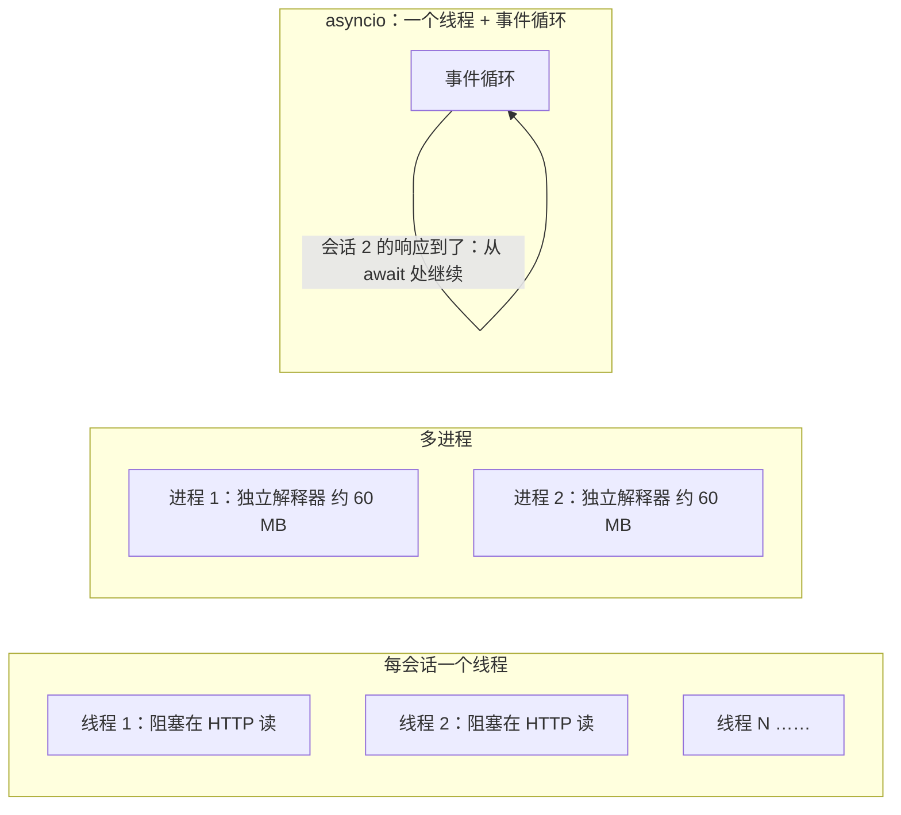
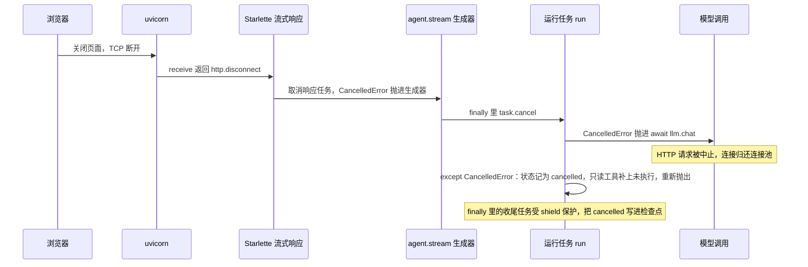
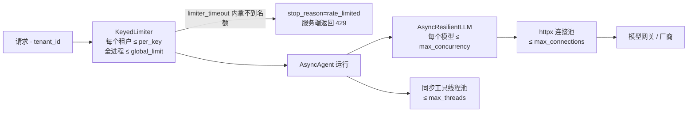

[中文](README.md) | [English](README.en.md)

# 第 30 课：异步运行时与高并发服务 —— 一个进程同时跑几百个会话

> 🕐 建议用时：30 分钟 ｜ 🎯 学完你能：用利特尔法则算出 Agent 服务需要多少并发；讲清 `AsyncAgent` 每个设计决策背后的理由（状态隔离、只读工具并行、三种超时语义、取消传播、截止时间、舱壁与背压、首 token 之前才重试、ContextVar 事件出口）；用实测数字判断什么时候该用线程、进程或 asyncio；认出并修掉 async 代码里 8 类常见的坑 ｜ 📦 对应源码：[`agentkit/aio/`](../../agentkit/aio/__init__.py)（[`agent.py`](../../agentkit/aio/agent.py)、[`llm.py`](../../agentkit/aio/llm.py)、[`tools.py`](../../agentkit/aio/tools.py)、[`limits.py`](../../agentkit/aio/limits.py)、[`reliability.py`](../../agentkit/aio/reliability.py)），测试 [`tests/test_aio.py`](../../tests/test_aio.py)
>
> 📖 必读：[Notes on structured concurrency, or: Go statement considered harmful](https://vorpus.org/blog/notes-on-structured-concurrency-or-go-statement-considered-harmful/)（Nathaniel J. Smith, 2018）—— 为什么"随手开一个后台任务"会像 goto 一样破坏抽象。重点读 "Nurseries: a structured replacement for go statements" 一节：子任务不能比创建它的作用域活得更久，错误传播和取消才重新变得可以推理。本课 2.5 节发现的缺陷、问题卡片 5 和练习 (a)，都是这个思想的直接应用。

## 0. 一句话讲清楚

**Agent 服务 95% 以上的时间在等（等模型、等工具）。异步运行时让一个线程在等待的间隙去推进别的会话，于是一个进程能同时服务几百个会话；代价是你必须把取消、超时、限流和"不能阻塞"这几件事做对。**

先诚实说明教学版的局限：`agentkit.Agent` 是同步的。一个线程同时只能推进一个会话；同一轮里的多个工具串行执行；工具超时靠线程池实现，超时后线程杀不掉，还在后台继续跑；没有流式输出；调用方也没法中途取消一次运行。[第 13 课](../13_distributed_concurrency/README.md)用"多进程 + 队列"把它横向扩展了，可每个进程内部仍然一次只跑一个会话。

打个比方。同步 Agent 像银行里一个柜员办完一个客户再叫下一个号，而客户大部分时间在填表（等模型）。asyncio 像一个柜员同时接待几百个客户：谁在填表就先放一边，谁填完了就接着办。它只有一个要求：柜员自己不能停下来做一件耗时的事，比如亲自跑去地下室取档案（阻塞 IO）。那样的话，大厅里所有人都得等他。

| 同步 Agent 的局限 | `agentkit.aio` 的做法 | 本课的证据（第 3 节） |
|---|---|---|
| 一个进程一次一个会话 | 事件循环并发推进；一个 `AsyncAgent` 实例被所有会话复用 | 200 个会话：同步串行 81.63 秒，`AsyncAgent` 0.44 秒 |
| 同一轮的工具串行 | 只读工具并行，写工具串行 | 3 个 0.3 秒的只读工具：0.91 秒 → 0.30 秒 |
| 超时杀不掉线程 | async 工具真取消；同步工具进有上限的线程池；进程隔离的工具硬超时 | `tests/test_aio.py` 的 3 个超时测试 |
| 不能取消 | `CancelledError` 一路传播，检查点记为 `cancelled` | 客户端断开后 6–10 毫秒，原本要跑 30 秒的模型调用被取消 |
| 没有流式 | `stream()` 逐步产出事件；只在首 token 之前重试 | 真实模型：首个片段在 2.9 到 6.4 秒到达 |
| 一个租户能吃光所有资源 | `KeyedLimiter` 按租户舱壁，加上每个模型的并发上限 | 安静租户的完成时间：1.40 秒 → 0.20 秒 |

## 1. 为什么 Agent 服务必须异步

### 1.1 时间花在哪：几乎全在等

本课 Demo 的实测（第 3 节）：一次真实模型调用的中位数是 2 秒左右，而 `AsyncAgent` 推进一个会话（两次模型调用加一次工具调用）自身只花约 **0.35 毫秒** CPU（本课发现的两处热点修复之前约 1 毫秒，见 3.1 节）。也就是说，一个会话在它的生命周期里，CPU 忙碌的时间不到千分之一。

这决定了瓶颈在哪：**不是算得多快，而是能同时等多少个。**

### 1.2 利特尔法则：先算需要多少并发

利特尔法则（Little's Law）：**L = λ × W**。系统里同时在处理的请求数 L，等于到达速率 λ 乘以每个请求的平均停留时间 W。AWS Lambda 文档用同一个公式估算函数并发：`Concurrency = (average requests per second) * (average request duration in seconds)`。

| 场景 | λ（请求/秒） | W（秒/请求） | L = 需要同时"在等"的会话数 |
|---|---|---|---|
| 公司 IT 服务台，早高峰 | 50 | 8 | **400** |
| 电商客服，大促 | 200 | 5 | **1000** |
| 离线批量评估，每秒提交 20 条 | 20 | 30 | **600** |

反过来用：如果你只有 16 个线程（L = 16），W = 8 秒，那么最大吞吐 λ = 16 / 8 = **每秒 2 个请求**。第 3 节的场景 1 会用实测数字验证这个公式。

每个"在等"的会话都需要一个载体：一个线程、一个进程，或者一个协程。于是问题变成：**哪种载体最便宜，而且能被安全地取消？**

### 1.3 三种载体对比



| 维度 | 每会话一个线程 | 多进程 | asyncio 协程 |
|---|---|---|---|
| 每个"在等"的会话占多少内存 | 实测每个阻塞线程约 25–35 KB 常驻内存，另有栈的虚拟内存预留 | 每个进程约 60 MB（本机实测：导入 agentkit、openai 之后的解释器） | 空闲协程实测约 1 KB；一个带完整 Agent 状态的在途会话约 17–19 KB |
| 创建 2000 个的耗时 | 实测 253–926 毫秒 | 每个进程要启动解释器、导入依赖（spawn 方式每次上百毫秒） | 实测 6 毫秒 |
| 切换方式 | 操作系统抢占式，任何一行代码之间都可能切走，共享数据要加锁 | 操作系统调度，内存不共享 | 协作式，只在 `await` 处切换；两个 `await` 之间的代码天然"原子" |
| GIL | 等 IO 时会释放，但所有 Python 代码仍然排队执行 | 每个进程一个 GIL，能用满多核 | 单线程，不存在 GIL 争用，但也只用一个核 |
| 到模型网关的连接 | 所有线程共享一个线程安全的连接池 | 每个进程一个连接池，总连接数 = 进程数 × 池大小 | 每个事件循环一个连接池 |
| 能否中途取消 | **不能**强杀线程，超时后它还在跑 | 可以 kill 整个进程 | 可以在任何 `await` 点取消 |
| 适合的并发量级 | 几十到几百 | 等于 CPU 核数（再多没意义） | 几百到几万 |

结论先放在这里（问题卡片 1 会展开）：**生产里通常是组合**。每个 CPU 核一个进程（绕开 GIL、隔离故障），每个进程一个事件循环（撑起几百上千并发），绕不开的同步老代码放进有上限的线程池，不可信或 CPU 密集的代码放进子进程或沙箱。

补充一个正在变化的背景：Python 的无 GIL（free-threaded）构建在 3.14 进入"官方支持"阶段（[PEP 779](https://peps.python.org/pep-0779/)），但它仍是可选构建，不是默认的。而且它只解决"多核跑 Python 代码"，解决不了"线程杀不掉"和"每个线程的内存开销"，所以不改变本课的结论。

## 2. AsyncAgent 的设计：每个决定都有理由

`AsyncAgent` 与同步 `Agent` 的语义逐项一致：钩子、上下文策略、检查点、审批暂停和恢复、预算、追踪、脱敏都一样。本节只讲同步版做不到、或者在并发下必须换一种做法的部分。

### 2.1 同一个实例被并发复用，所以状态全在 `RunState` 里

```python
agent = AsyncAgent(llm, tools=[...])          # 进程启动时创建一次
results = await asyncio.gather(*(agent.run(q) for q in questions))  # 几百个会话共用它
```

[`agent.py`](../../agentkit/aio/agent.py) 开头写明了这条约束：同一个 `AsyncAgent` 实例可以被并发复用，每次运行的全部数据都在 `RunState` 里，实例本身不保存任何"本次运行"的东西。

**为什么**：每个请求都新建一个 Agent，会重复创建线程池和连接池，连接池就失去了意义。但只要实例被复用，任何放在 `self` 上的"本次运行"的数据都会被几百个会话同时读写。[第 08 课](../08_reliability/README.md)的 `LoopGuard` 练习讲过同一个教训：计数必须放在 `state.metadata` 上，而不是 Hook 实例上。在 asyncio 里这件事更隐蔽，因为不需要多线程：会话 A 在 `await` 处挂起的那一刻，会话 B 就可能改掉 `self` 上的数据。

**你的 Hook 也一样**：Hook 实例同样被所有会话共享。要记住"本次运行"的东西，放进 `state`。

**证据**：`test_one_process_runs_many_sessions_concurrently` 让 100 个会话共用一个实例，模型调用的在途峰值 ≥ 90，每个会话看到的都是自己的问题。Demo 场景 1 的 1000 个会话也逐个核对过，串台数为 0。

### 2.2 只读工具并行，写工具串行

```python
# agentkit/aio/agent.py: _run_pending_tools
parallel = self.parallel_tools and len(calls) > 1 and all(t is not None and t.risk == "read" for t in tools)
if not parallel:
    for call in calls:  # 有写操作：按模型给出的顺序逐个执行，每个执行完都落盘
        ...
results = await asyncio.gather(*(one(c) for c in calls), return_exceptions=True)
```

**为什么这样分**：只读工具之间没有依赖，谁先谁后结果都一样，并行后一轮的耗时从"求和"变成"取最大"。写工具不行。模型可能先"创建工单"再"给工单加备注"，顺序一乱就错了；而且每个写工具执行完都要立刻存检查点，把"执行了但没记下来"的窗口缩到最小（[第 08 课](../08_reliability/README.md)）。

**为什么用 `return_exceptions=True`**：`PauseRun`（等审批）和 `StopRun`（预算用完）是用异常实现的控制流。收集到所有结果之后，先把已经完成的工具结果按原始顺序写回并落盘，再抛出第一个控制流异常。这样恢复时不会重跑已经完成的工具。它还有一个不太为人所知的好处，见问题卡片 5：外部取消时，`return_exceptions=True` 的 `gather` 会等所有子任务收尾，而默认参数下不会。

**上限**：`max_parallel_tools=8`，用一个信号量限制同一轮里最多并行多少个工具。模型偶尔一次要调 30 个工具，不能让它瞬间打出 30 个下游请求。

**本课实测发现、已修复的一个坑：并行工具绕过了预算。**
- 现象：`BudgetHook(max_tool_calls=1)`，模型一轮调用 4 个只读工具，4 个全部执行，运行正常完成。
- 根因：`BudgetHook.before_tool` 检查 `state.tool_calls_count`，而这个计数原来在工具**执行完之后**才加一。并行时，4 个调用各自在自己的 task 里先跑 `before_tool`，那一刻谁都还没执行完，都看到"还没超预算"。串行时同样的代码是对的，一并行就错。
- 修复：计数改到执行**之前**（`state.tool_calls_count += 1` 挪到 `await self.executor.execute(...)` 前面），同步版 `Agent` 也一起改了，两边语义一致。
- 回归测试：`test_parallel_read_tools_respect_tool_call_budget`，断言只执行了第一个工具，`stop_reason == "budget_exceeded"`。

这类 bug 的共性值得记住："先检查、后更新"在串行代码里没问题；一旦中间出现并发（哪怕是单线程的 asyncio），就必须**在检查的同一刻占用名额**。

### 2.3 三种执行方式，对应三种超时语义

| 工具类型 | 怎么执行 | 超时时发生什么 |
|---|---|---|
| `async def` 工具（调 HTTP API、数据库） | 直接在事件循环里 `await`，外面套 `asyncio.wait_for` | **真正取消**：`CancelledError` 传进工具，连接被释放 |
| 普通同步函数 | 放进有上限的线程池（`max_threads=32`），不阻塞事件循环 | 调用方按时拿到超时结果，**但线程杀不掉**，会在后台跑完 |
| `isolated(tool)` 标记的工具 | 在 spawn 出来的子进程里执行 | **硬超时**：直接 kill 子进程 |

**为什么线程杀不掉**：Python 没有安全强杀线程的 API。`wait_for(loop.run_in_executor(...))` 超时，只是调用方"不再等了"，线程本身照跑。后果比看上去严重：卡住的线程一直占着线程池的名额；32 个名额被占满之后，新来的同步工具只能在队列里排队。而 `wait_for` 的计时从排队就开始了，所以它们全部"超时"，其实一行代码都没执行。

**为什么还要进程隔离**：一个纯计算的死循环没有任何 `await` 点，协程取消不了它；又因为 GIL，它会拖慢同进程里的所有线程。唯一可靠的办法是杀进程。代价是参数必须能 pickle，而且每次都要启动子进程：本机实测，一个什么都不做的隔离工具，整次运行约 140 毫秒。生产中更强的隔离是容器、gVisor、microVM（[第 19 课](../19_mcp_and_sandbox/README.md)）。

**本课实测发现、已修复的一个小问题：启动子进程时卡住了事件循环。**
- 现象：用 5 毫秒心跳测量，每次隔离工具调用会让事件循环卡顿最多约 11 毫秒。
- 根因：`run_in_subprocess` 在事件循环线程里**同步**调用了 `proc.start()`（spawn 要 fork/exec 再传参）和 `proc.join(timeout=2)`。这正是第 5.1 节"async 函数里调用阻塞操作"的一个隐蔽版本：它藏在框架里，而不是业务代码里。
- 修复：`proc.start` 放进线程池执行；`proc.join` 也放进线程，并用 `asyncio.shield` 保护，即使调用方被取消，也要把子进程回收掉，不留僵尸进程。复查代码时又发现，等待 `join` 时如果被取消，后面的 `parent.close()` 会被跳过，管道要等垃圾回收才关闭；第二轮把它挪进了 `finally`。
- 回归测试：`test_subprocess_start_does_not_run_on_event_loop_thread`，断言 `start` 不在主线程（事件循环所在的线程）上执行。修复后同样的心跳测量得到 4–12 毫秒，但那时机器负载很高（load average 20–33），这个量级的抖动已经分不清来自子进程还是其他进程抢 CPU。所以真正的证据是这个确定性的回归测试，而不是计时。

### 2.4 取消传播：`CancelledError` 必须重新抛出

```python
# agentkit/aio/agent.py: _drive
except asyncio.CancelledError:
    # 取消不是失败：记录下来、收好尾，然后**必须**继续向外抛，否则调用方的取消就失效了
    state.status, state.stop_reason, state.output = "cancelled", "cancelled", "（运行已取消）"
    self._close_dangling_calls(state, "未执行：运行已取消", keep_side_effects=True)
    raise
finally:
    # 收尾（on_run_end 钩子 + 最后一次保存，完成后才释放舱壁名额）放进独立任务并用 shield 保护，见 2.5 节
    finish = asyncio.ensure_future(self._finish(state, slot if entered else None))
    await asyncio.shield(finish)
```

**为什么必须重新抛出**：取消是调用方下的命令，不是"出了一个错"。吞掉它，调用方就以为运行正常结束了。更隐蔽的是，`asyncio.TaskGroup` 和 `asyncio.timeout()` 这些结构化并发组件本身就靠取消实现。Python 官方文档明确警告，协程吞掉 `CancelledError` 会让它们行为异常。

**为什么只给只读工具补"未执行"结果**：OpenAI 的消息协议要求每个 `tool_call` 都有对应的 `tool` 消息，不补上，下次带着这段历史调用模型会直接得到 400 错误。但写工具和高危工具**故意保持未回答**（`keep_side_effects=True`）：取消的那一刻，它可能已经在下游执行了一半，比如工单已经建好、只是响应还没回来。如果补上"未执行"，恢复后模型会重新发起一个**新的** `call_id`，幂等键（`run_id:call_id`）随之改变，工单就会建两次。保持未回答，`resume` 时就会用**同一个** `call_id` 重放，幂等存储或下游的 Idempotency-Key 负责去重（第 08、13、26 课）。不打算恢复、要开新对话时，`RunResult.history` 会给这些调用补上占位结果，保证消息协议仍然合法。回归测试：`test_cancel_keeps_in_flight_write_unanswered_and_resume_replays_same_call_id`。这一条来自第 26 课的实测发现。

**一次断开连接是怎么一路传到模型调用的**（Demo 场景 4 实测）：



`AsyncAgent._stream` 的 `finally` 负责把"消费方不再读取"翻译成"取消运行"。它的注释是：消费方不再读取（断开连接、提前退出）→ 取消运行，别再花钱。取消之后它用 `await asyncio.wait({task})` 等运行任务收尾，而不是 `await task`，原因见下一节。

### 2.5 一个完整的案例：发现缺陷 → 定位根因 → 修复 → 复测 → 再修 → 再复测

写这节课时，我们在 Demo 里撞上了 `agentkit/aio` 的一个真实缺陷。它被修了两次：第一次修复不彻底，是复测时发现的。完整走一遍这个过程，比任何说教都更能说明两件事：取消很难做对；回归测试必须覆盖故障窗口里的**每一个位置**，而不是只测一个时刻。

**① 现象。** Demo 场景 4c 把检查点换成[第 26 课](../26_state_and_queues/README.md)的 `AsyncPostgresCheckpointer`，连一个嵌入式的真实 Postgres 16，然后重复"读到 `tool_finished` 就断开"。每一次运行都确实停了，在途调用归零，**但检查点经常停在 `running`**：在最初的代码上，真实 Postgres 10 次里有 3 到 7 次；换成每次写入固定等 20 毫秒的模拟存储，10 次全部如此。对账程序会以为这些运行还在跑。

**② 根因。** 要把三件事连起来看：

1. Starlette（FastAPI 的底层）基于 AnyIO。AnyIO 的取消是"电平触发"的：只要任务还在一个已取消的作用域里，它每碰到一个 `await` 就会再被取消一次。AnyIO 文档的原话是，要在收尾时 `await`，就必须 "enclose it in a shielded cancel scope"。
2. 当时 `_stream` 的 `finally` 用 `suppress(CancelledError)` 加 `await task` 等待运行任务收尾。这个 `await` 被 AnyIO 再次取消，而 asyncio 取消一个正在 `await` 另一个任务的任务时，会把取消**转发**给被等的任务。
3. 运行任务此时正在 `_drive` 的 `finally` 里执行 `await self._save(state)`，想把 `cancelled` 状态存下来。第二次取消打断了这次保存。

同步检查点（`InMemoryCheckpointer`）没有这个问题，因为保存时根本没有 `await` 点。这也是最初的 `tests/test_aio.py` 没能发现它的原因：测试用的都是同步检查点，也没有经过 Starlette。**同步的测试全部通过，不代表异步的代码是对的。** Demo 4c 的第 ① 步用 10 行代码复现了根因（`level_triggered_cleanup`，不依赖 agentkit）：在已取消的 AnyIO 作用域里，`finally` 中直接 `await` 保存，结果是 `'running'`；放进 `anyio.CancelScope(shield=True)`，结果是 `'cancelled'`。

**③ 第一次修复**（三处改动）：`_drive` 的收尾（`on_run_end` 钩子加最后一次保存）放进独立任务，用 `asyncio.shield` 保护；`_stream` 改用 `await asyncio.wait({task})`，只等待、不转发取消；同一个 run 的检查点读写用 `KeyedLocks` 排队，这样 `resume` 会等后台的收尾写完再读。回归测试：`test_repeated_cancellation_still_records_cancelled_state`（连续取消两次）、`test_stream_disconnect_with_slow_async_checkpointer_always_records_cancel`（流式断开时再取消一次，10/10）。

**④ 复测：还有漏网的。** 用第一次修复后的代码重跑 Demo 4c，模拟存储 120/120 都对了，真实 Postgres 却是 **115/120**，漏掉的 5 次每次都伴随服务端一个 `CheckpointConflict`。这次的根因不在收尾，而在**收尾之前**：第一次取消打断的是**上一次**保存（工具执行完后那次）。那条 `UPDATE` 已经在数据库里提交、版本号加了一，客户端却没收到回复，本地记住的版本号于是过期了；收尾时的保存按旧版本号做 CAS，被正确地当成冲突拒绝。第一次修复只保护了"最后一次"保存，问题出在"倒数第二次"。

为什么第一次的回归测试没抓到？它们都在一个固定时刻取消，恰好没落在"已提交、未回复"的那几毫秒里。只有在真实数据库上重复上百次，才会偶尔撞上。

**⑤ 第二次修复**（`agentkit/aio/agent.py` 现在的 `_save`）：

```python
async def _save(self, state: RunState) -> None:
    cp = self._checkpointer()
    if not inspect.iscoroutinefunction(getattr(cp, "save", None)):
        cp.save(state)          # 同步检查点：中间没有 await，不可能被取消打断，直接写
        return
    snapshot = _snapshot(state)  # 浅快照：复制各个容器，不深拷贝每条消息
    await asyncio.shield(asyncio.ensure_future(self._save_now(cp, snapshot)))  # 在 _io_locks 内执行
```

异步检查点的**每一次**保存都放进受保护的独立任务：一次写入要么不开始，要么完整结束，不存在"不知道写没写进去"的状态。快照是因为保存在后台进行时，运行本身还会继续修改 `state`。同时 `_stream` 在 `wait` 之后会检查 `task.exception()`，运行任务以普通异常结束时记一条 `agentkit.aio` 的 warning，不再留下一句无人理会的 "Task exception was never retrieved"。

新的回归测试 `test_cancel_between_db_commit_and_response_never_strands_the_run` 吸取了上一轮的教训：用一个"提交后过一会儿才回复"的 CAS 存储，在一次运行的 **20 个不同时刻**取消，把"已提交、未回复"的窗口扫一遍。维护者用它对比两个版本：

| 版本 | cancelled | 卡在 running | completed |
|---|---|---|---|
| 第一次修复（只保护收尾那次保存） | 10 | 6 | 4 |
| 第二次修复（每次异步保存都保护） | 20 | 0 | 0 |

**⑥ 再复测。** Demo 4c 现在把这个扫描也放了进来（第 ② 步，用 `FirstFixAgent` 还原第一次修复时的 `_save` 做对照），并重跑端到端实验。6 轮合计：

| 实验 | 第一次修复 | 第二次修复（现在） |
|---|---|---|
| 取消时刻扫描（每轮 20 个时刻，共 120 次） | cancelled 82，**running 37**，completed 1 | **cancelled 120** |
| SSE 断开，模拟异步存储（120 次） | 120 | **120** |
| SSE 断开，`AsyncPostgresCheckpointer`（120 次） | 115 | **120** |

**⑦ 再复测又有新发现：那几次 completed 是另一个 bug。** 表里的 completed 意味着取消信号**丢失了**：运行没有停，跑到了结束，第二次模型调用照样花了钱。这比停在 `running` 更糟。但它和检查点无关。我们在扫描里给每次 `asyncio.wait_for` 加了探针，80 次随机时刻的取消里出现了 12 次 completed，12 次全都有同一个特征：`wait_for` 返回了结果，而当前任务身上还挂着一个没送达的取消请求（`task.cancelling() > 0`）。

这是 CPython 的一个已知竞态（[gh-86296](https://github.com/python/cpython/issues/86296)，"AsyncIO's wait_for can hide cancellation in a rare race condition"）：在 Python 3.11 及更早版本里，如果内部结果和外部取消在同一轮事件循环里到达，`wait_for` 会返回结果、吞掉取消。Python 3.12 用 `asyncio.timeout()` 重写了 `wait_for`，本课的最小复现在 3.12.3 和 3.13.1 上不再出现，在 3.11.7 上稳定复现。`AsyncToolExecutor` 正是用 `wait_for` 给工具加超时的，所以在 3.10、3.11 上，**同步工具执行完的那一刻**用户断开，取消就可能丢失。Demo 4c 第 ④ 步专门制造这个时刻：6 轮里 240 次有 **89 次**取消丢失，运行照样跑完。维护者对比表里第一次修复那 4 次 completed，走的是同一条同步工具路径，应该也是这个原因。反过来，第二次修复的版本在扫描里 20/20，只是因为那 20 个时刻没有落在工具完成的那一瞬间，不代表这个竞态已经消失：我们对第二次修复后的版本在工具完成前后 ±1.5 毫秒密集取消 120 次，仍有 10 次 completed。它还让第二轮新增的回归测试 `test_cancel_between_db_commit_and_response_never_strands_the_run` 在 Python 3.11 上时好时坏：本机连跑 25 次失败 6 次，失败的全是 completed，而且全都伴随 `wait_for` 吞掉取消（在 3.12+ 上不会发生，CI 的 3.10、3.11 两个版本会受影响）。这一条（7.2 节 R3）报告给维护者后，在第三轮修复。

**⑧ 第三次修复：换掉 `wait_for`。** 新增 [`agentkit/aio/timeouts.py`](../../agentkit/aio/timeouts.py)，提供一个取消安全的 `wait_for`：3.11+ 用 `asyncio.timeout()`（在当前任务里内联等待，靠 cancel/uncancel 计数区分"自己的超时"和"外部取消"，3.12 的 `wait_for` 本身就是这样实现的）；3.10 没有 `asyncio.timeout()`，就用 `asyncio.wait` 自己实现，和练习 (b) 同一个思路：外部取消一律优先。取消优先有一个代价：如果内部操作其实已经完成，它的结果会被丢弃。对"拿到就要归还"的资源（例如 `KeyedLimiter` 的信号量名额），用 `on_discard` 参数归还，否则名额会永久泄漏。`AsyncToolExecutor`、`run_timeout`、`KeyedLimiter` 和第 26 课的 worker 全部换用它。复测结果：Demo 4c 第 ④ 步 240 次里取消丢失从 89 次降到 **0 次**；那个时好时坏的回归测试连跑 15 次全部通过；新增 7 个回归测试（每个竞态场景在 3.10 和 3.11+ 两种实现上各测一遍），在 3.11.7 和 3.12.3 上都通过。

换掉 `wait_for` 还暴露了一个隐藏依赖：第 28 课的一个测试断言"三个并行工具的时间区间互相重叠"，修复后在 3.11 上稳定失败。原因是其中一个工具等待的事件已经 set 了，`wait()` 立即返回，工具从头到尾没有挂起、同步就跑完了；以前能通过，只是因为 3.11 的 `wait_for` 会把工具包成一个新任务，多走一轮事件循环。3.12 的 `wait_for` 本来就是内联执行，所以这个测试在 CI 的 3.12 上原本也会失败。修法是让测试里的工具真的挂起一次，而不是把运行时改回去。

这个案例值得记住的规律：
- **收尾里的 `await` 需要保护**：在"反复取消"的框架（AnyIO、Trio）里尤其如此。
- **同一个 key 的写入必须串行**：并发写同一行，要么互相覆盖，要么被 CAS 拒绝。
- **被取消的写操作，结果是"未知"，不是"失败"**：它可能已经生效了。所以要么别在写到一半时取消它，要么事后能对账（幂等键、重新读取版本号）。
- **测并发 bug，要扫描时间窗口**：在一个时刻取消只能证明"这个时刻没问题"。要在故障窗口的各个位置各取消一次，还要给结果分类（停住了？卡住了？还是根本没停？），第三类往往指向另一个 bug。
- **连标准库也会吞掉取消**：`asyncio.wait_for` 在 3.12 之前有竞态。练习 (b) 的 `with_deadline` 用 `asyncio.wait` 实现，就不受它影响，第 15 个测试专门验证这一点。`agentkit.aio` 现在统一用自己的 `wait_for`（第 ⑧ 步）。

### 2.6 `run_timeout`：整次运行的截止时间

```python
if self.run_timeout is not None:
    await asyncio.wait_for(body, self.run_timeout)
```

**为什么每个工具和每次模型调用已经有超时了，还要再加一个**：10 个步骤，每步都在自己的时限内，加起来仍然可能超过用户的耐心和整条 HTTP 链路的超时（[第 13 课](../13_distributed_concurrency/README.md)的问题 2）。超时后的状态是 `stopped` / `timeout`。和取消一样，只读工具补上"未执行：运行超时"，写工具保持未回答，等恢复时用同一个 `call_id` 重放。

两个细节：
- 等舱壁名额的时间**不算**在 `run_timeout` 里，它由 `limiter_timeout` 单独控制。所以最坏延迟是 `limiter_timeout + run_timeout`，设置网关超时时要把两者加起来。
- Python 3.12 起，`asyncio.wait_for` 改用 `asyncio.timeout()` 实现，传入的协程不再被包进一个新的 Task（官方文档 "Changed in version 3.12"）。`AsyncAgent` 的写法在两种实现下行为一致。

### 2.7 舱壁与背压：在自己家门口排队，别把网关打出 429



每一层的上限都是一种背压（backpressure）：下游忙不过来时，让上游在本进程里等，或者被快速拒绝，而不是把压力继续往下传。

| 层 | 参数 | 防的是什么 |
|---|---|---|
| `KeyedLimiter` | `per_key`、`global_limit`、`overrides` | 一个租户吃光所有名额（吵闹的邻居） |
| `limiter_timeout` | 秒数 | 无限排队。排不上就明确告诉用户"稍后再试"，比挂 60 秒再超时好 |
| `AsyncResilientLLM(max_concurrency=…)` | 每个模型一个信号量 | 同时打到网关的请求超过配额，引发 429 和重试风暴 |
| `AsyncOpenAICompatLLM(max_connections=…)` | httpx 连接池 | 连接数失控。httpx 的默认值是 100 个连接、20 个 keep-alive |
| `AsyncAgent(max_threads=…)` | 同步工具线程池 | 同步工具无限开线程 |

**为什么这里不需要锁**：`KeyedLimiter` 的计数、`AsyncTokenBucket` 的"补充令牌加扣减"，中间都没有 `await`。事件循环是单线程的，所以这些代码天然原子。换成多线程，这里就必须加锁。

**本课实测发现、已修复的一个缺陷：舱壁在全局名额紧张时会漏。**
- 现象：`KeyedLimiter(per_key=2, global_limit=3)`，全局名额被其他租户占满时，同一个租户同时进入执行的请求达到 **3** 个。
- 根因：为了防止租户很多时字典无限增长，空闲租户的信号量会被回收。原来判断"空闲"用的是 `_in_use`，它只统计"两道门都进了"的请求。可是有一个阶段被漏掉了：请求已经拿到**租户**名额，还在排队等**全局**名额。这时另一个请求结束，`_in_use` 减到 0，这个租户的信号量就被删掉了，而排队的那个请求手里还握着旧信号量。下一个请求来时创建了一个**全新的**信号量，名额又从 2 开始算。
- 修复：改成按**引用计数**回收（`_refs`：进入 `slot()` 就加一，离开才减一，覆盖排队阶段），归零才删除。另外，舱壁名额现在由收尾任务（`_finish`）在最后一次保存完成**之后**才释放，即使外层被再次取消、不再等待收尾，名额也要等收尾写完才还回去。原来是先释放、再收尾，下一个运行会在上一个真正结束之前拿到名额，同一租户也会短暂超限；第一次修复把释放挪到了等待收尾之后，但外层被再次取消时仍会提前释放，第二轮才彻底改对。
- 回归测试：`test_keyed_limiter_per_key_limit_holds_when_global_is_saturated`，断言两个租户的峰值都 ≤ 2，并且结束后 `_sems` 和 `_refs` 都清空（没有泄漏）。

教训：**"回收空闲资源"的判断条件，必须覆盖资源被持有的每一个阶段**，包括"拿到一半"的阶段。

### 2.8 流式输出，以及为什么只能在首 token 之前重试

```python
# agentkit/aio/reliability.py: AsyncResilientLLM.stream
except LLMError as e:
    if started:
        raise  # 已经把部分内容推给了用户：不能静默重试，否则用户会看到重复的文字
```

**为什么**：已经推到用户屏幕上的半句话收不回来。这时候静默重试，用户会看到"您的 VPN 证书您的 VPN 证书已过期"；中途切换到备用模型更糟，前半句和后半句出自两个模型。所以第一个 token 之前可以放心重试、降级；之后出错只能如实报错，由前端提供"重新生成"，或者由服务端从检查点恢复（2.4 节、问题卡片 3）。

**流式还带来一个度量**：首 token 延迟（TTFT）。推理模型要"想完"才开始吐字，TTFT 可能占总耗时的大部分。Demo 场景 6 实测：总耗时 6.53 秒，首个文本片段在 6.37 秒到达，其后 0.16 秒内 22 个片段全部到齐。流式并不会缩短总耗时，它缩短的是用户"盯着空白屏幕"的时间。经过网关的流式细节见[第 29 课](../29_gateway_and_guardrails/README.md)。

`AsyncOpenAICompatLLM.stream` 还做了两件容易漏掉的事：请求时加 `stream_options={"include_usage": True}`，否则流式响应里没有 token 用量，成本就没法算；另外在 `finally` 里关闭上游流，提前退出时立刻把连接还给连接池。

### 2.9 用 ContextVar 做事件出口，多个流不会串线

```python
# agentkit/aio/agent.py: _stream
queue: asyncio.Queue = asyncio.Queue()
token = _emitter.set(queue.put_nowait)
try:
    task = asyncio.ensure_future(start())  # 新 Task 复制当前上下文：它看到的是这个流自己的事件出口
finally:
    _emitter.reset(token)
```

**为什么不用实例属性 `self.emit = ...`**：20 个流同时在跑，它们共用一个 Agent 实例，后设置的会覆盖先设置的，所有事件都会流进最后一个客户端。`ContextVar` 的每个值属于一个上下文，而 asyncio 的 Task 在创建时会**复制**当前上下文。所以先设置、再创建 Task、立刻还原，这个运行任务（以及它内部并行工具的子任务）看到的就永远是自己的队列。

**为什么要立刻 `reset`**：消费方自己的上下文不应该继续带着这个出口，否则消费方随后启动的另一个运行也会把事件塞进这个队列。

**证据**：`test_concurrent_streams_do_not_mix_events` 同时跑 20 个流，每个流收到的文本都只属于自己的问题。追踪的 span 栈用的是同一个机制（[第 28 课](../28_production_observability/README.md)讲了它在并发下为什么是对的）。

## 3. 动手：运行 Demo（全部是实测数字）

```bash
python lessons/30_async_runtime/demo.py --offline                   # 场景 1–5，不调用模型，约 45 秒
python lessons/30_async_runtime/demo.py --offline --full --repeat 3 # 串行也跑满 200 个；每种方式 3 次取中位数，约 2 分钟
python lessons/30_async_runtime/demo.py                             # 再加场景 6：真实模型，约 8 次调用
```

**测量环境**：Apple M1（8 核）、8 GB 内存、macOS 14.4.1、CPython 3.11.7；fastapi 0.141.1、uvicorn 0.54.0、starlette 1.7.0、httpx 0.28.1；场景 4c 的数据库是 pgserver 0.1.4 自带的 Postgres 16.2（嵌入式，单机，走 unix socket）。**如实说明**：测量时这台机器上还有其他几个任务在并行运行（load average 在 7 到 65 之间波动），所以数字有波动。下面给出的是 `agentkit/aio` 第二轮修复之后 `--full --repeat 3` 那次运行的结果，另外注明了修复前的数字和多次运行中观察到的范围。场景 1–5 用剧本模型加 `sleep` 模拟延迟；场景 6 走本地的 OpenAI 兼容网关，模型为 gpt-5.5。

### 3.1 场景 1：吞吐（同一批 200 个会话）

每个会话 = 2 次模型调用 × 0.2 秒 + 1 次工具调用，所以单个会话的服务时间 W ≈ 0.4 秒。每种方式都在一个全新的子进程里跑，内存数字互不干扰。

| 方式 | 会话 | 耗时 | 吞吐（会话/秒） | 峰值在途 | 利特尔预测 L/W | CPU 时间 | 峰值 RSS 增量 |
|---|---|---|---|---|---|---|---|
| A. 同步 Agent 串行 | 200 | 81.63 s | 2.5 | 1 | 2.5 | 0.28 s | 0.2 MB |
| B. 同步 Agent + 16 线程 | 200 | 5.34 s | 37.5 | 16 | 40.0 | 0.21 s | 2.1 MB |
| C. 同步 Agent + 200 线程 | 200 | 0.47 s | 424.4 | 200 | 500.0 | 0.13 s | 8.7 MB |
| D. `AsyncAgent` 单进程单线程 | 200 | **0.44 s** | **452.2** | 200 | 500.0 | 0.06 s | 3.9 MB |
| E. `AsyncAgent`，1000 个会话 | 1000 | 0.59 s | 1705.1 | 1000 | 2500.0 | 0.31 s | 18.9 MB |

"峰值在途"由剧本模型自己计数，表示同一时刻真实在等模型的调用数。这张表是 `agentkit/aio` 第二轮修复之后测的；每个子进程计时前先空转 0.2 秒预热，因为在这台繁忙的机器上，不预热时同一段代码的 CPU 时间实测能差到 2 倍。

**三个版本的交错对比**（同一时刻、交替运行，排除机器负载的影响；E：1000 个会话，各 3 次）：

| agentkit 版本 | CPU 时间 | 耗时 |
|---|---|---|
| 最初版本（提交 `f6dda16`） | 0.79–1.04 s | 0.88–1.09 s |
| 第一轮修复后（`871507e`：Schema 缓存、`to_json`） | 0.33–0.38 s | 0.59–0.61 s |
| 第二轮修复后（现在：每次异步保存都 shield） | 0.31–0.37 s | 0.58 s |

第二轮修复只给**异步**检查点的保存加了快照和任务，Demo 用的是同步的 `InMemoryCheckpointer`，所以吞吐和 CPU 没有变化（同步路径还省掉了一把锁）。

**怎么读这张表**：
- **利特尔法则完全吻合**：A、B 的实测吞吐和预测（L / W）几乎一样。吞吐只取决于"同时在飞"的会话数 L。16 个线程就是 16 个并发名额，最多每秒 40 个会话。
- **D 比 B 快 12.1 倍**，而且只用一个线程。
- **C 说明线程不是不能用**：200 个线程也能跑出接近的吞吐。差别在内存（8.7 MB 对 3.9 MB），在取消语义，以及并发涨到几千时的成本（见下面的等待者测试）。
- **单核 CPU 是 asyncio 的第二个天花板**：事件循环是单线程的，每个会话的 CPU 开销直接决定一个进程的吞吐上限。本课第一次测量时，E 里 1000 个会话花了 0.98 秒 CPU，吞吐只有每秒 941 个，离预测的 2500 很远。用 cProfile 看这约 1 毫秒花在哪：约 43% 在 `InMemoryCheckpointer` 保存时用 `dataclasses.asdict` 深拷贝全部消息（每一步存一次，消息越多越贵），约 33% 在每次调用模型前重新生成工具的 JSON Schema（pydantic 的 `model_json_schema` 没有缓存）。维护者据此做了两处修复：`Tool.schema()` 缓存结果（回归测试 `test_tool_schema_is_cached`），检查点改用新增的 `RunState.to_json()`，直接序列化，不再先深拷贝一遍。修复后同样的 1000 个会话只花约 **0.31–0.37 秒 CPU**（约 0.35 毫秒/会话），吞吐升到每秒 1700 个左右（见上面的交错对比）。再跑一次 cProfile：工具 Schema 从约 33% 降到约 1%；检查点序列化仍占约 28%，这是每一步都要落盘的固有成本；还有约 26% 是剧本模型为了事后断言而深拷贝每次调用的消息，这是测试工具自己的开销，生产里没有。

**一个"在等 IO 的会话"最少要花多少内存**（线程和协程各自在独立子进程里测）：

| 等待者 | 数量 | 创建耗时 | RSS 增量 | 每个 |
|---|---|---|---|---|
| 线程（阻塞在 `Event.wait`） | 2000 | 252 ms（其他运行最高 926 ms） | 68.0 MB | 34.8 KB（其他运行 25.6 KB） |
| 协程（`await Event.wait`） | 2000 | 6 ms | 1.8 MB | 0.9 KB |
| 协程 | 50000 | 233 ms | 46.7 MB | 1.0 KB |

同样 2000 个等待者，协程的内存约为线程的 1/30 到 1/40，创建速度快约 40 倍。

### 3.2 场景 2：并行工具

```
parallel_tools=False  3 个只读工具（各 0.3s）总耗时 0.91s ｜ 开始时刻：search_kb @4ms，get_user_profile @306ms，get_ticket_history @608ms
parallel_tools=True   3 个只读工具（各 0.3s）总耗时 0.30s ｜ 开始时刻：search_kb @0ms，get_user_profile @0ms，get_ticket_history @1ms
parallel_tools=True   2 个写工具：update_ticket(第1步) 开始 → 结束 → update_ticket(第2步) 开始 → 结束（0.20s）
parallel_tools=True   2 读 + 1 写混在一轮：0.70s —— 只要有一个写工具，整轮都按顺序执行
```

最后一行值得注意：当前的规则很保守，只要有一个写工具，整轮都串行。更细的做法是"只读的先并行，写的再按顺序"，但那要求模型给出的调用之间真的没有依赖，而这一点框架无从判断。

### 3.3 场景 3：在 async 钩子里调用阻塞 IO

22 个会话同时跑：20 个普通租户（每个 2 次模型调用 × 0.1 秒，理想耗时 0.2 秒），加 2 个 legacy 租户。legacy 租户每次模型调用后要用同步驱动写一次审计，耗时 0.3 秒。另有一个心跳协程每 10 毫秒醒一次。

| 审计钩子的写法 | 心跳最大延迟 | 卡顿 > 50 ms 的次数 | 普通租户完成时间 |
|---|---|---|---|
| ❌ `time.sleep(0.3)`（模拟同步驱动） | **608 ms** | 2 | p50 0.82 s，max 1.43 s（另两次运行 max 0.82 s） |
| ✅ `await asyncio.to_thread(time.sleep, 0.3)` | 1 ms | 0 | p50 0.21 s，max 0.21 s |

只有 2 个租户用了阻塞写法，20 个无辜租户的延迟却翻了近 4 倍。打开 asyncio 调试模式（`asyncio.run(..., debug=True)`）后，事件循环自己报出 4 条警告，形如 `Executing <Task pending name='Task-193' ...> took 0.303 seconds`。调试模式默认把超过 100 毫秒的回调记为"慢回调"。

### 3.4 场景 4：用户关掉页面，服务端真的停下来

Demo 在后台线程里启动一个 FastAPI + uvicorn 服务：`/chat/stream` 以 SSE 格式推送事件，`/chat/resume` 从检查点恢复，`/runs/{id}` 查询服务端状态。客户端用 httpx 连接。

| 步骤 | 客户端做了什么 | 服务端的结果 |
|---|---|---|
| 4a | 读到 `tool_started`（工具要跑 0.5 秒）就断开 | 断开后 3–28 ms：检查点 `cancelled`；工具开始 1 次、执行完 0 次（被取消在半路）；这次只读调用在历史里被补成"未执行：运行已取消" |
| 4b | 读到 `tool_finished` 再断开，此时第 2 次模型调用正在进行（剧本设定要 30 秒） | 断开后 6–10 ms：检查点 `cancelled`，模型累计被调用 2 次，**在途 0 个**，30 秒的调用被当场取消 |
| 4c | ① 10 行代码复现根因；② 在 20 个时刻取消，对比第一次修复和现在；③ SSE 断开 20 次（模拟异步存储 / 真实 Postgres）；④ 制造"同步工具刚执行完就断开"（3.11 的 `wait_for` 竞态） | ① 不保护 `'running'`，shield 后 `'cancelled'`。6 轮合计：② 第一次修复 cancelled 82 / running 37 / completed 1，现在 120/120；③ 模拟存储 120/120、Postgres 120/120；④ 第二轮修复时 240 次里 89 次取消丢失，第三轮修复后 0 次（2.5 节第 ⑦⑧ 步） |
| 4d | 用 4b 的 `run_id` 调 `/chat/resume` | 事件 `run_started → delta → done`，状态 `completed`；工具累计只执行完 **1** 次（结果已在检查点里），模型累计 3 次 |

### 3.5 场景 5：舱壁

吵闹租户一口气发 50 个请求，10 毫秒后安静租户发 2 个。每个请求 1 次模型调用 × 0.2 秒，模型并发上限 8。时间从请求到达算起。

| 配置 | 安静租户（2 个） | 吵闹租户（50 个） | 模型在途峰值 |
|---|---|---|---|
| 只有全局上限 | **1.40 s** | p50 0.81 s，p95 1.21 s，max 1.41 s | 8 |
| `KeyedLimiter(per_key=4, global_limit=8)` | **0.20 s** | p50 1.42 s，p95 2.43 s，max 2.63 s | 6 |
| 同上 + `limiter_timeout=0.5` | 0.20 s | 12 个完成（max 0.61 s），**38 个被快速拒绝**（`rate_limited`） | 6 |

舱壁的代价写在第二行：吵闹租户被限在 4 个并发，模型明明还空着 2 个名额，它也用不上。舱壁不是"按需分配"（work-conserving）的。想兼顾隔离和利用率，要用加权公平排队（[第 13 课](../13_distributed_concurrency/README.md)的 6.3 节），或者用 `overrides` 给大客户更高的配额。第三行是另一种取舍：与其让请求排 2.6 秒，不如 0.5 秒就明确拒绝，让客户端退避重试。

### 3.6 场景 6：真实模型（gpt-5.5，本地网关，约 8 次调用）

| 测量 | 第一次运行 | 第二次运行 |
|---|---|---|
| 流式会话：工具开始 | 1.52 s | 3.07 s |
| 流式会话：首个文本片段（TTFT，从请求开始算） | 2.90 s | 6.37 s（第二轮模型调用从发出到首个片段 3.24 s） |
| 流式会话：完成 | 4.32 s | 6.53 s（文本分 22 个片段到达） |
| 6 个并发会话：墙钟 / 逐个调用耗时之和 | 5.61 s / 14.77 s，加速 2.6× | 6.11 s / 15.66 s，加速 2.6× |
| 单次调用耗时 | p50 1.98 s，max 3.67 s | p50 2.37 s，max 3.73 s |
| 同一时刻在途（上限 3） | 3 | 3 |

理想加速是 min(6, 3) = 3 倍。实测 2.6 倍，因为 6 个请求耗时参差不齐，最后一"波"要等最慢的那个。同一个网关同时被其他任务使用，所以两次运行的延迟差了一倍。这也是真实环境的常态：**延迟不是常数，容量规划要按 p95 算 W，而不是按平均值**。

## 4. 企业问题卡片

### 问题 1：并发模型怎么选？

**场景**：IT 服务台 Agent，早高峰每秒 50 个请求，每个平均 8 秒，按利特尔法则需要 400 个并发。部署在 4 核 8 GB 的虚拟机上。团队现有代码全是同步的。

**为什么难**：最省事的是"同步代码不动，开 400 个线程"。它能跑，但 400 个线程杀不掉、每个都占内存，而且任何一个 CPU 密集的操作都会通过 GIL 拖慢其他所有线程。全部改成 async，又要换掉所有同步 SDK。

| 方案 | 怎么做 | 优点 | 缺点 | 适用规模 | 运维成本 |
|---|---|---|---|---|---|
| A. 线程池 | 同步 Agent + `ThreadPoolExecutor`，每个请求一个线程 | 代码不用改；同步 SDK 直接用 | 实测每线程 25–35 KB，创建慢约 40 倍；超时杀不掉线程；并发上限等于线程数，调大又浪费 | 几十个并发的内部工具；迁移过渡期 | 低 |
| B. 单进程 asyncio | `AsyncAgent` + async SDK，一个进程一个事件循环 | 并发几百到几千；真取消；内存省 | 只用一个核（实测每会话约 0.35 ms CPU，单核上限约每秒两三千个会话）；一处阻塞卡住全部 | 单核容器，靠副本数横向扩展 | 低 |
| C. 多进程 + 每进程 asyncio | uvicorn / gunicorn 起 N 个 worker 进程（通常等于核数），每个进程一个事件循环 | 用满多核；一个进程崩了不影响其他；每进程几百并发 | 每进程约 60 MB 基线；进程内的限流只管本进程，全局配额要放 Redis 或网关；连接数 = 进程数 × 池大小 | **在线交互服务的默认选择** | 中 |
| D. 独立 worker 服务 | API 层只负责入队（[第 13 课](../13_distributed_concurrency/README.md)、[第 26 课](../26_state_and_queues/README.md)），worker 进程用 `AsyncAgent` 执行；长流程交给 Temporal（[第 27 课](../27_durable_workflows/README.md)） | API 和执行解耦；任务可恢复、可重试；按队列积压扩缩容 | 多一套队列和状态存储；交互延迟多一跳 | 分钟级以上的任务、批处理、需要持久化的流程 | 高 |

**怎么选**：在线对话默认用 C，并且按 C 的写法写代码（全 async、同步代码进线程池）。任务超过一两分钟、或者不能白跑，就上 D，而 D 里的 worker 本身仍然是 C。A 只用于并发很低的内部工具或迁移过渡期。B 在"每个 Pod 一个进程、靠副本数扩展"的容器环境里其实就是 C（[第 31 课](../31_deployment_and_scaling/README.md)）。

**本课实现**：`AsyncAgent` 就是 C 和 D 里"每个进程一个事件循环"那一部分；多进程部署与扩缩容在第 31 课。

### 问题 2：超时了，怎么让它真的停下来？

**场景**：一个工具调用老 ERP 系统，偶尔卡 5 分钟；另一个"代码执行"工具运行模型写的 Python，偶尔写出死循环。

**为什么难**："加个超时"很容易，难的是超时之后资源有没有真正释放：连接还开着吗？线程还在跑吗？CPU 还在被占用吗？

| 方案 | 怎么做 | 超时后发生什么 | 开销 | 适用 |
|---|---|---|---|---|
| A. 线程 + `future.result(timeout)` | 教学版 `ToolRegistry.execute` 的做法 | 调用方拿到超时，**线程还在跑**，占着池子名额 | 低 | 快速、可信的同步调用 |
| B. 协程 `wait_for` / `asyncio.timeout` | `AsyncToolExecutor` 对 async 工具的做法 | **真取消**：`CancelledError` 在下一个 `await` 点抛出，连接释放 | 几乎为零 | IO 型工具（HTTP、数据库），首选 |
| C. 子进程 + kill | `isolated(tool)` → `run_in_subprocess` | **硬超时**：进程被 kill，CPU 和内存立刻释放 | 本机每次约 140 ms（spawn）；参数要能 pickle | 可信但可能卡死的 CPU 密集代码 |
| D. 容器 / gVisor / microVM | 沙箱服务（[第 19 课](../19_mcp_and_sandbox/README.md)） | 沙箱被销毁，还能限制 CPU、内存和网络 | 启动更慢，通常要维护一个预热池 | **不可信代码** |

**怎么选**：IO 工具一律 async 化并走 B。绕不开的同步 SDK 走 A，但线程池要有上限，还要监控池子的占用和排队，并尽快换成 async SDK。可信的 CPU 密集代码走 C，不可信代码必须走 D。三层时限要从内到外递增：工具超时 < `run_timeout` < 网关和代理的超时。否则外层先断开，内层还在白干。

**本课实现**：`AsyncToolExecutor` 的三种执行方式，加上 `run_timeout`。

### 问题 3：流式协议选哪个？断线之后怎么办？

**场景**：聊天界面要逐字显示回答；用户在地铁里，手机网络时断时续；有人习惯性地刷新页面。

**为什么难**：流式把一次请求变成了一条长连接。连接会断。断了之后，"运行还要不要继续""重连后从哪里接着推"，这两个问题都得有明确答案。

| 方案 | 怎么做 | 优点 | 缺点 | 适用 |
|---|---|---|---|---|
| A. SSE（Server-Sent Events） | 普通 HTTP 响应，`text/event-stream`，服务端单向推送 | 就是 HTTP，网关、鉴权、日志照常工作；浏览器 `EventSource` 断线自动重连，并在请求头里带上 `Last-Event-ID`；服务端可以用 `retry:` 字段设置重连间隔 | 单向；浏览器原生 `EventSource` 只能发 GET、不能加自定义请求头（需要时改用 fetch 读流）；要关掉代理缓冲；HTTP/1.1 下每个域名的连接数有上限 | **Agent 对话流的默认选择** |
| B. WebSocket（RFC 6455） | 升级成全双工长连接 | 双向：用户可以在回答中途发"停下"、语音可以随时打断 | 重连和续传协议要自己设计；有状态的长连接让负载均衡和滚动发布更麻烦 | 实时语音、协同编辑、需要中途插话 |
| C. 长轮询 / 轮询任务状态 | 提交任务拿到 `job_id`，客户端反复 `GET /jobs/{id}` | 兼容性最好，最简单；天然配合异步任务 | 有延迟，请求量大；没有逐字效果 | 分钟级任务、系统间集成 |

**断线重连 ≠ 从检查点恢复**：SSE 的自动重连只恢复**传输**。服务端的运行怎么办，有两种策略：

1. **断开即取消 + 按 `run_id` 恢复**（`AsyncAgent` 的默认行为，Demo 4b/4d）：省钱，断开的那一刻模型调用就停了。重连后调用 `stream_resume(run_id)`，已经完成的工具不会重跑。代价是断开时正在进行的那次模型调用白花了，要重新生成。适合交互式对话。
2. **断开不取消 + 事件缓冲重放**：运行在后台 worker 里跑完，事件按序号写进一个带 ID 的缓冲区（例如 Redis Streams，[第 26 课](../26_state_and_queues/README.md)）。重连时按 `Last-Event-ID` 重放缺失的事件。用户什么都不会错过，但断开的会话也会继续花钱。适合长任务、不能白跑的场景。

Demo 的 SSE 事件都带 `id: {run_id}:{序号}`，两种策略都能从这个 ID 接上。另外，SSE 规范建议每 15 秒左右发一行注释（以冒号开头），防止旧代理把空闲连接断掉。FastAPI 从 0.135.0 起内置了 `EventSourceResponse`：它会自动发送这种 keep-alive 注释，并设置 `Cache-Control: no-cache` 和 `X-Accel-Buffering: no`。

**怎么选**：对话用 A 加策略 1；需要中途打断的语音用 B；长任务用 C，或者 A 加策略 2。

**本课实现**：Demo 场景 4 用 SSE 加策略 1。取消是怎么检测到的：uvicorn 0.54 声明的 ASGI 规范版本是 2.3，Starlette 因此会并行监听 `http.disconnect`，所以即使服务端 30 秒没有输出，断开也能在几毫秒内被发现。Starlette 1.7 的源码里，服务器声明 2.4 及以上时就不再监听，改为"下一次 `send` 失败时才发现断开"。那种情况下，发现断开的速度取决于你多久推一次数据（keep-alive 注释的间隔）。

### 问题 4：限流放在哪一层？

**场景**：3 个 API Pod × 每个 4 个 worker 进程 = 12 个事件循环。网关给的模型配额是 60 个并发；合同约定每个租户最多 10 个并发。

**为什么难**：进程内的信号量只管得了自己。12 个进程各设 60，实际并发就是 720；各设 5，扩容或缩容之后又要重新算。

| 方案 | 怎么做 | 优点 | 缺点 | 适用 |
|---|---|---|---|---|
| A. 进程内舱壁 | `KeyedLimiter`、`AsyncResilientLLM(max_concurrency)`、连接池上限 | 零延迟，无外部依赖；保护**本进程**的内存和连接 | 只管本进程；实例数一变，有效的全局上限就跟着变 | 每个进程的自我保护，必备 |
| B. Redis 全局配额 | `AsyncRedisTokenBucket` / `AsyncRateLimitHook`（[第 26 课](../26_state_and_queues/README.md)） | 跨实例一致，按租户精确控制 | 每次获取多一次网络往返；Redis 成为依赖，挂了要决定"放行"还是"拒绝"；用 Redis 做并发信号量需要租约，否则进程崩溃会泄漏名额 | 跨实例的租户配额 |
| C. 网关 | LiteLLM 等模型网关按 key、团队设置限额和预算（[第 29 课](../29_gateway_and_guardrails/README.md)） | 所有服务统一出口；合同和预算在一处管理 | 是最后一道防线：请求已经占用了你进程里的名额才被拒绝；应用仍需背压，否则会出现重试风暴 | 合同额度、预算、多团队共享 |

**怎么选**：三层都要，各管一件事。网关管"合同和钱"（硬上限），Redis 管"跨实例的租户配额"，进程内舱壁管"本进程别被压垮"。进程内的上限大致设为"全局配额 / 实例数"，再留一些余量。

**本课实现**：A（Demo 场景 5）。多实例下的 B 和 C 分别见第 26 课和第 29 课。

### 问题 5：并发的子任务，出错和取消时谁来收尾？

**场景**：Agent 一次要并行查 3 个数据源，其中一个失败了；或者一次批量评估要跑 500 条样本，用户中途取消。

**为什么难**：`asyncio.create_task` 就是 NJS 文章里说的 "go 语句"：任务一旦创建就脱离了调用者的控制。失败了没人知道，取消了没人等它收尾，函数返回时后台可能还有任务在跑、还在花钱。

| 方案 | 出错时 | 调用方被取消时 | 并发上限 | 版本要求 |
|---|---|---|---|---|
| A. `asyncio.gather`（默认参数） | 第一个异常立刻抛给调用方，**其余任务继续跑**（官方文档原话："won't be cancelled"） | 取消所有子任务，但**不等它们收尾**就返回（见下方实测） | 没有，要自己加信号量 | 全版本 |
| A'. `gather(return_exceptions=True)` | 异常和结果一起收集，谁也不取消 | 取消所有子任务，并等全部结束 | 没有 | 全版本 |
| B. `asyncio.TaskGroup` | 取消其余任务，等全部结束，抛出 `ExceptionGroup` | 取消并等待全部结束 | 没有 | 3.11+ |
| C. AnyIO 任务组 | 同 B | 同 B，而且是电平触发的取消，收尾时要用 shield | 没有（可以配合 `CapacityLimiter`） | 需要 anyio；可跑在 asyncio 和 Trio 上 |
| D. 手写 `bounded_gather`（练习 a） | 取消其余，等全部结束，抛出第一个异常本身 | 取消并等待全部结束 | 有 | 3.10+ |

**本课实测**（`gather` 与 `TaskGroup` 对比：3 个子任务，收尾分别需要 0、50、100 毫秒，调用方在 20 毫秒时取消）：

```
gather   : cleaned when caller saw CancelledError = 1/3 (later 3/3)     # 默认参数
gather_re: cleaned when caller saw CancelledError = 3/3 (later 3/3)     # return_exceptions=True
taskgroup: cleaned when caller saw CancelledError = 3/3 (later 3/3)
```

Python 3.11.7 和 3.12.3 结果相同。用默认参数的 `gather` 时，调用方收到 `CancelledError` 的那一刻，只有 1 个子任务收完了尾，另外 2 个还在后台。如果它们的收尾是"回滚事务""归还连接"，调用方此时关闭连接池，就会出现竞态。练习 (a) 的测试专门检查这一点。

**怎么选**：新代码在 3.11+ 上用 `TaskGroup`（记得用 `except*` 处理 `ExceptionGroup`）。在 FastAPI、Starlette 这类 AnyIO 体系里写库用 AnyIO。"收集所有结果、谁失败都不影响别人"的语义，用 `gather(return_exceptions=True)`，`AsyncAgent` 的并行工具就是这么做的。需要并发上限时，自己加信号量或 worker 池，因为 `TaskGroup` 本身不限并发。

**本课实现**：`AsyncAgent._run_pending_tools`（`gather(return_exceptions=True)` + 信号量）；练习 (a)。

## 5. async 代码的 8 个常见坑

### 5.1 在 async 函数里调用阻塞 IO

```python
async def after_llm(self, state, response):
    requests.post(AUDIT_URL, json=...)     # ❌ 同步 HTTP：整个事件循环停住
    time.sleep(0.3)                        # ❌ 同理
    await asyncio.to_thread(requests.post, AUDIT_URL, json=...)   # ✅ 进线程池
    await audit_client.post(AUDIT_URL, json=...)                  # ✅✅ 用 async 客户端
```

**后果**（场景 3 实测）：2 个租户的 0.3 秒同步写入，让心跳延迟到 608 毫秒，另外 20 个租户的完成时间从 0.21 秒涨到 0.82 秒。**发现**：staging 环境打开 `PYTHONASYNCIODEBUG=1` 或 `asyncio.run(..., debug=True)`，超过 100 毫秒的回调会被记进日志；线上导出"事件循环延迟"指标（做法就是场景 3 的心跳）；CI 里用 lint 检查（练习 c）。

### 5.2 吞掉 `CancelledError`

```python
# ❌ 错误 1：连 CancelledError 一起吞了（裸 except: 也一样）
try:
    return await llm.chat(messages)
except BaseException:
    return fallback

# ❌ 错误 2：捕获了却不重新抛出
try:
    return await llm.chat(messages)
except asyncio.CancelledError:
    log.info("cancelled")
    return None

# ✅ 收尾，然后重新抛出
try:
    return await llm.chat(messages)
except asyncio.CancelledError:
    await rollback()
    raise
```

**后果**：调用方的取消悄无声息地失效，"用户关了页面"之后模型照样生成完整的回答、照样计费。`asyncio.timeout()` 和 `TaskGroup` 也会行为异常，因为它们靠取消实现。从 Python 3.8 起 `CancelledError` 继承 `BaseException`，所以 `except Exception` 不会误吞它。`AsyncToolExecutor` 正是依赖这一点，让取消穿透工具异常处理。真要压制取消时，官方文档要求同时调用 `uncancel()`。`contextlib.suppress(asyncio.CancelledError)` 加 `await task` 常被用来等待一个**你自己刚刚取消**的任务结束，但它有两个副作用：它会吞掉**你自己**收到的取消；而且你自己被取消时，`await task` 会把取消**转发**给那个任务，打断它的收尾。`AsyncAgent._stream` 原来就是这么写的，这正是 2.5 节那个缺陷的一环，现在改成了 `await asyncio.wait({task})`：只等待，不转发，也不吞掉你自己的取消。

**连标准库也会吞掉取消。** Python 3.11 及更早的 `asyncio.wait_for` 有一个竞态（CPython [gh-86296](https://github.com/python/cpython/issues/86296)）：内部结果和外部取消在同一轮事件循环里到达时，它返回结果、吞掉取消。本机实测：同样 5 行代码，3.11.7 返回了结果，3.12.3 和 3.13.1 抛出 `CancelledError`。还在 3.10、3.11 上的项目，给可能被取消的操作加超时时，用 `asyncio.wait` 自己实现（练习 b），或者在 3.11 上用 `async with asyncio.timeout(...)`（本机实测 3.11.7 上它不吞取消）。`agentkit.aio.wait_for` 就是这样做的，还处理了"取消优先时归还已经拿到的资源"（2.5 节第 ⑧ 步）。

### 5.3 忘记 `await`

```python
async def before_tool(self, state, call, tool):
    audit.write(call)                       # ❌ 如果 write 是 async def：只创建了协程，什么都没执行
    if policy.allowed(call):                # ❌ 如果 allowed 是 async def：协程对象永远为真，权限检查形同虚设
        ...
    await audit.write(call)                 # ✅
    if await policy.allowed(call): ...      # ✅
```

**后果**：审计没写，权限检查永远"通过"，而且不会报错，只有一条 `RuntimeWarning: coroutine '...' was never awaited`。agentkit 专门防了后一种：给 `PermissionPolicy` 传一个 async 的 `approver` 会直接报 `TypeError`（测试 `test_async_approver_is_rejected_instead_of_silently_approving`）。CI 可以加 `-W error::RuntimeWarning`，把这条警告变成失败。

### 5.4 无上限地 `create_task`（没有背压）

```python
@app.post("/batch")
async def batch(items: list[str]):
    for item in items:
        asyncio.create_task(agent.run(item))   # ❌ 10 万条 → 10 万个任务同时在内存里；任务还可能被垃圾回收
    return {"ok": True}
```

**后果**：内存随请求量线性上涨。实测一个带完整状态的在途会话约 17–19 KB（场景 1 E：1000 个会话，RSS 增加 17.2–19.4 MB，各次运行不同），10 万个就是约 2 GB，这还没算下游被瞬间打爆。还有一个坑：事件循环对任务只保留**弱引用**，官方文档要求保存 `create_task` 的返回值，否则任务可能执行到一半就被回收。**修复**：用练习 (a) 的 `bounded_gather`、`asyncio.Queue(maxsize=…)` 加固定数量的 worker，或者干脆交给任务队列（第 13 课、第 26 课）。

### 5.5 共享可变状态

```python
class QuotaHook:
    def __init__(self):
        self.used = {}                                     # 所有会话共享
    async def before_llm(self, state, messages):
        used = self.used.get(state.metadata["tenant_id"], 0)   # 读
        await self.store.log_usage(...)                         # ❌ 让出：别的会话在这里改了 self.used
        self.used[state.metadata["tenant_id"]] = used + 1       # 写：覆盖掉别人的更新
```

**后果**：即使只有一个线程，"读、`await`、写"也会丢失更新。**原则**：在两个 `await` 之间完成"读、改、写"（这就是 `AsyncTokenBucket._take` 不需要锁的原因）；跨 `await` 的临界区用 `asyncio.Lock`；本次运行的数据放进 `state`（2.1 节）；跨进程的共享数据放进 Redis 或数据库，用原子操作。

### 5.6 在 async 代码里混用同步 SDK

```python
client = OpenAI()                           # ❌ 同步客户端
async def chat(messages):
    return client.chat.completions.create(...)   # 等 3 秒，整个事件循环也跟着停 3 秒

client = AsyncOpenAI()                      # ✅ 或者 AsyncOpenAICompatLLM
```

Redis（用 `redis.asyncio`）、Postgres（用 psycopg 的 async 连接或 asyncpg）、HTTP（用 httpx.AsyncClient）都有同样的问题。**只有同步版本时**，用 `asyncio.to_thread` 包起来。但要知道默认线程池的大小是 `min(32, os.cpu_count() + 4)`（3.13 起改用 `os.process_cpu_count()`），它会成为新的并发上限。同步 Hook 也在事件循环线程里执行，不要在里面做 IO（[第 28 课](../28_production_observability/README.md)对 `PrometheusHook` 有同样的提醒）。

### 5.7 连接池大小与并发不匹配

```python
llm = AsyncResilientLLM(AsyncOpenAICompatLLM(max_connections=20), max_concurrency=100)  # ❌ 80 个请求在连接池里排队
db_pool = AsyncConnectionPool(max_size=10)   # ❌ 400 个会话每一步都要写检查点
```

**后果**：多出来的请求在连接池里排队，排队时间也计入超时（httpx 的 pool timeout，超时抛 `PoolTimeout`）。于是日志里全是"模型超时"，其实模型很健康，是你自己的池子太小。**原则**：`max_concurrency` ≤ `max_connections`；数据库连接池至少要能容纳同时写检查点的会话数（或者降低写入频率）；多进程部署时，总连接数 = 进程数 × 池大小，这个数不能超过数据库的 `max_connections`（连接池的配置见[第 26 课](../26_state_and_queues/README.md)）。

### 5.8 嵌套调用 `asyncio.run`

```python
def summarize(text):                          # 一个"看起来是同步"的工具函数
    return asyncio.run(llm.chat(...))         # ❌ 在 async 代码里调用它：RuntimeError

async def handler():
    return summarize(doc)
# RuntimeError: asyncio.run() cannot be called from a running event loop（本机实测原文）
```

**修复**：在 async 代码里直接 `await`，把函数本身改成 `async def`。如果真的要从**另一个线程**里的同步代码调用事件循环上的协程，用 `asyncio.run_coroutine_threadsafe(coro, loop)`。不要用"给事件循环打补丁、允许重入"的办法绕过去，重入会破坏"两个 `await` 之间原子"这个前提（5.5 节）。

## 6. 练习

文件：[`exercise.py`](exercise.py)（你来写）、[`solution.py`](solution.py)（参考答案）、[`test_exercise.py`](test_exercise.py)（15 个测试，约 1.5 秒）。要求兼容 Python 3.10，所以不能用 `TaskGroup` 和 `asyncio.timeout`。

**(a) `bounded_gather(coro_factories, limit) -> list`**
- 结果按输入顺序排列；同时在跑的数量不超过 `limit`；工厂函数只在拿到名额时才调用（背压）。
- 任何一个失败：取消其余任务，**等它们收尾结束**，然后抛出第一个异常本身（不是 `ExceptionGroup`）。
- 调用方被取消：所有子任务都被取消并收尾完毕，`CancelledError` 继续向外传播。
- 测试会真的统计同时在跑的数量，检查被取消的任务收到了 `CancelledError` 并完成了收尾，并且在 `bounded_gather` 返回的**那一刻**拍状态快照。`asyncio.run` 退出时会自动清理残留任务，快照要在它之前拍，否则错误实现也会蒙混过关。用"信号量 + `gather`"写的版本会在两个测试上失败（问题卡片 5 解释了原因）。

**(b) `with_deadline(coro, seconds, on_timeout)`**
- 超时后取消内部协程、等它收尾，返回 `on_timeout` 的值。
- **不能吞掉外部取消**：调用方被取消时，`CancelledError` 必须继续向外抛。
- 内部协程**自己**抛出的 `TimeoutError`（下游超时）要原样抛出，不能当成"我的截止时间到了"。常见的写法 `except (TimeoutError, CancelledError): return default` 同时犯了这两个错，有两个测试专门抓它。
- 内部结果和外部取消同时到达时以取消为准。基于 `asyncio.wait_for` 的实现在 Python 3.10、3.11 上过不了这个测试（2.5 节第 ⑦ 步、5.2 节）。

**(c) `detect_blocking(source) -> list[str]`**
- 用 `ast` 找出 async 函数里的阻塞调用（`time.sleep`、`requests.*`、`open`、`subprocess.run` 等），输出 `"函数名:行号:调用名"`。
- 要解析 import 别名（`import time as t`、`from time import sleep`），忽略被 `await` 的调用和只作为参数传递的函数引用，不检查嵌套的同步函数。

```bash
make lesson N=30                                           # 或者：
.venv/bin/python -m pytest lessons/30_async_runtime -v
AGENTKIT_SOLUTION=1 .venv/bin/python -m pytest lessons/30_async_runtime   # 用参考答案验证
```

## 7. 运维要点、实测发现的问题与切换路径

### 7.1 运维要点

- **进程数和并发数**：每个 CPU 核一个 worker 进程。每个进程的并发上限由舱壁控制，uvicorn 的 `--limit-concurrency` 是它外面的最后一道闸，超过就直接返回 503（uvicorn 文档原话："before issuing HTTP 503 responses"）。
- **滚动发布**：`--timeout-graceful-shutdown` 给在途请求留出收尾时间。时间到了，流式连接会被断开，运行会被取消，检查点记为 `cancelled`，客户端重连后按 `run_id` 恢复（Demo 4d）。完整的部署与扩缩容见[第 31 课](../31_deployment_and_scaling/README.md)。
- **必须有的指标**：事件循环延迟（场景 3 的心跳）、在途运行数（[第 28 课](../28_production_observability/README.md)的 `agent_runs_in_flight`）、线程池排队长度、连接池等待时间、按租户统计的 `rate_limited` 次数、TTFT 直方图。
- **CPU 是第二个天花板**：场景 1 的实测是每会话约 0.35 毫秒 CPU（修复前约 1 毫秒）。框架之外，你自己的 Hook、上下文策略、JSON 处理都会加进来，上线前用 profiler 看一眼热点（3.1 节就是这么找到两处热点的）。
- **调试模式只在 staging 开**：它会记录每个协程的创建位置，本身有开销。

### 7.2 本课实测发现、已经修复的问题

写这节课时，Demo 和实验脚本在 `agentkit/aio` 里找出了 7 个问题。维护者全部修复，并为每一个加了回归测试（`tests/test_aio.py` 从 23 个增加到 33 个）。复测又发现了 R1、R2 和两个小问题，第二轮修复后增加到 34 个；第二轮复测发现的 R3 在第三轮修复，再加 7 个，共 41 个。每一条都按"现象 → 根因 → 修复 → 回归测试"记录下来，这个过程本身就是本课的一部分。

| # | 现象（怎么发现的） | 根因 | 修复 | 回归测试 |
|---|---|---|---|---|
| 1 | 异步检查点下，断开连接后检查点经常停在 `running`（Demo 4c：真实 Postgres 10 次里 3–7 次） | AnyIO 电平触发取消；`_stream` 用 `await task` 等收尾，把第二次取消转发进运行任务，打断了收尾时的保存（2.5 节） | 收尾放进独立任务并 `shield`；`_stream` 改用 `asyncio.wait`；同一个 run 的读写用 `KeyedLocks` 排队 | `test_repeated_cancellation_still_records_cancelled_state`、`test_stream_disconnect_with_slow_async_checkpointer_always_records_cancel` |
| 2 | `KeyedLimiter(per_key=2, global_limit=3)`：同一租户 3 个请求同时执行 | 按"两道门都进了"的数量回收信号量，漏掉了"拿到租户名额、在等全局名额"的阶段（2.7 节） | 按引用计数回收；舱壁名额持有到收尾完成 | `test_keyed_limiter_per_key_limit_holds_when_global_is_saturated` |
| 3 | `max_tool_calls=1`，一轮 4 个并行只读工具全部执行 | 计数在执行**后**才加一，并行的 `before_tool` 都看到"没超预算"（2.2 节） | 改为执行**前**计数，同步版一起改 | `test_parallel_read_tools_respect_tool_call_budget` |
| 4 | 两个审批人同时批准，高危工具执行两次 | `approve` 先读检查点、再恢复，两次读到的都是"待审批" | 同一个 run 的 `approve` / `resume` 加锁（异步 `KeyedLocks`，同步 `threading.Lock`），锁内重新读取；第二个审批得到 `ValueError`（没有等待审批的操作） | `test_concurrent_approvals_execute_dangerous_tool_once` |
| 5 | 每次隔离工具调用，事件循环卡顿约 11 ms | `run_in_subprocess` 在事件循环线程里同步调用 `proc.start()` / `proc.join()`（2.3 节） | `start` 和 `join` 放进线程池，`join` 用 `shield` 保护 | `test_subprocess_start_does_not_run_on_event_loop_thread` |
| 6 | 1000 个会话花 0.98 秒 CPU，吞吐离预测很远 | cProfile：约 43% 在检查点 `asdict` 深拷贝，约 33% 在每次调用模型前重新生成工具 Schema（3.1 节） | `Tool.schema()` 缓存；新增 `RunState.to_json()`，检查点直接序列化 | `test_tool_schema_is_cached`；复测 CPU 0.98 → 0.35 秒 |
| 7 | 熔断器半开时，几百个并发请求一起去"试探" | `AsyncCircuitBreaker` 的半开状态没有限制试探请求数（读代码发现） | 半开时只放行一个试探请求，其余快速失败（同步版故意不改，那是第 08 课练习 c） | `test_half_open_breaker_lets_only_one_probe_through` |

修复时顺带改了两处相关语义（来自第 26 课的发现）：取消或超时时，写工具和高危工具的调用保持未回答，恢复时用同一个 `call_id` 重放，幂等键不变（2.4 节，`test_cancel_keeps_in_flight_write_unanswered_and_resume_replays_same_call_id`）；`run` / `resume` / `approve` 可以传入只用于本次运行的 `checkpointer=`，构造时可以注入共享的 `executor=`（`test_per_run_checkpointer_and_shared_executor`）。

**第一次修复后复测发现、第二轮已修复的问题：**

| # | 现象 | 根因 | 修复 | 回归测试 |
|---|---|---|---|---|
| R1 | 第一次修复后，真实 Postgres 上断开 120 次仍有 5 次停在 `running` | 第一次取消打断的是**上一次**保存：`UPDATE` 已提交，客户端没收到回复，本地版本号过期，收尾保存被 CAS 拒绝（2.5 节） | 异步检查点的**每一次**保存都先取浅快照（`_snapshot`），再放进独立任务、用 `shield` 保护，在 `_io_locks` 内执行；同步检查点直接写 | `test_cancel_between_db_commit_and_response_never_strands_the_run`：在 20 个时刻取消，修复前 cancelled 10 / running 6 / completed 4，修复后 20 / 0 / 0 |
| R2 | 那 5 次，服务端日志各有一条 "Task exception was never retrieved"（`CheckpointConflict`） | `_stream` 改用 `asyncio.wait` 后，运行任务以普通异常结束时没人取走这个异常 | `wait` 之后检查 `task.exception()`，用 `agentkit.aio` logger 记一条 warning | Demo 4c 统计服务端的 "never retrieved" 日志：修复后 0 条 |
| — | `run_in_subprocess` 等待 `join` 时被取消，`parent.close()` 被跳过（读代码发现） | 关闭管道写在 `await` 之后，没有放进 `finally` | `parent.close()` 挪进 `finally` | — |
| — | 外层被再次取消时，舱壁名额在收尾写完之前就被释放（读代码发现） | 释放写在"等待收尾任务"之后，外层不再等待时就提前执行了 | 名额改由收尾任务 `_finish` 在最后一次保存之后释放（2.7 节） | — |

**第二轮修复后复测又发现、第三轮已修复的问题：**

| # | 现象 | 根因 | 修复 | 回归测试 |
|---|---|---|---|---|
| R3 | 同步工具执行完的那一刻用户断开，运行没有停，跑到了结束（Python 3.11.7 上，Demo 4c 第 ④ 步 240 次里 89 次） | CPython 的 `asyncio.wait_for` 竞态（gh-86296）：3.12 之前，内部结果和外部取消同时到达时，它返回结果、吞掉取消。`AsyncToolExecutor` 用 `wait_for` 给工具加超时（2.5 节第 ⑦ 步） | 新增 `agentkit.aio.wait_for`（`timeouts.py`）：3.11+ 用 `asyncio.timeout()`，3.10 用 `asyncio.wait` 自己实现，外部取消一律优先，`on_discard` 归还已拿到的资源；工具执行、`run_timeout`、`KeyedLimiter`、第 26 课 worker 全部换用（2.5 节第 ⑧ 步）。复测：Demo 4c 第 ④ 步 89/240 → 0/240 | `test_wait_for_never_swallows_cancel_when_result_arrives_in_same_tick`、`test_wait_for_cancel_racing_semaphore_grant_does_not_leak_permit`、`test_tool_executor_cancel_at_tool_completion_is_not_lost` 等 7 个；原来偶发失败的 `test_cancel_between_db_commit_and_response_never_strands_the_run` 连跑 15 次全过 |

### 7.3 从本课代码到成熟组件

| 本课 | 生产中换成 / 接上 |
|---|---|
| 手写的 SSE 编码（`StreamingResponse`） | FastAPI 0.135+ 的 `EventSourceResponse` 和 `ServerSentEvent`（自带 keep-alive 和防缓冲响应头） |
| `AsyncOpenAICompatLLM` 直连网关 | `AsyncLiteLLMRouterLLM`（[第 29 课](../29_gateway_and_guardrails/README.md)），同样支持 `chat()` 和 `stream()` |
| `InMemoryCheckpointer` | Postgres 检查点（[第 26 课](../26_state_and_queues/README.md)）：异步检查点的每次保存都受保护（7.2 节 R1） |
| 每个请求 new 一个 `AsyncAgent` | worker 里共享一个 `AsyncToolExecutor`（`executor=`），每个任务用带 fence 的检查点视图（`run(..., checkpointer=...)`），见第 26 课 |
| 进程内 `KeyedLimiter` | 保留它做自我保护，再加 Redis 全局配额（第 26 课）和网关限额（第 29 课） |
| 在请求里直接跑长任务 | 队列加 worker（第 26 课），或者 Temporal 工作流（[第 27 课](../27_durable_workflows/README.md)），activity 可以是 async 函数 |
| 自己数在途、测心跳 | OpenTelemetry 和 Prometheus（第 28 课） |
| 单进程 uvicorn | 多 worker 进程、容器、按队列积压和在途数扩缩容（第 31 课） |

托管平台要先弄清它的并发模型。以 AWS Lambda 为例，一个执行环境在处理请求期间 "cannot process other requests"。在那里，进程内的 asyncio 并发帮不了"每个实例同时服务多少请求"，只能帮一次请求内部的并行（例如并行工具）。

## 8. 面试 & 设计评审问题

<details>
<summary>1. 每秒 50 个请求，每个 8 秒，一个 4 核机器，你会怎么部署？</summary>

- 利特尔法则：L = 50 × 8 = 400 个并发。W 要按 p95 算，不能按平均值。
- 4 个 worker 进程（每核一个），每个进程一个事件循环，并发上限约 100 多，留出余量。
- 算 CPU：每会话不到 1 毫秒框架 CPU，每秒 50 个请求远低于单核上限。瓶颈在模型配额，不在 CPU。
- 限流分三层：网关管配额，Redis 管租户，进程内舱壁管自我保护（问题卡片 4）。
- 超过一两分钟的任务改走队列加 worker。
</details>

<details>
<summary>2. 为什么 AsyncAgent 的只读工具可以并行，写工具不行？"只读"由谁来判断？</summary>

- 只读工具之间没有依赖，顺序不影响结果；写工具有副作用，要保持模型给出的顺序，而且每个执行完都要落盘。
- "只读"由工具作者通过 `risk="read"` 声明，框架没法自动判断。声明错了，后果是并行执行写操作。所以代码评审和权限系统（第 09 课）要把关。
- 混合的一轮整体串行，这是保守但安全的选择。
</details>

<details>
<summary>3. 一个同步工具超时了，线程池里发生了什么？怎么避免拖垮服务？</summary>

- 调用方按时拿到超时结果，但线程继续执行，一直占着池子名额。
- 名额被占满后，新任务在队列里排队；`wait_for` 的计时从排队开始，于是它们一行代码都没执行就"超时"了。
- 对策：线程池设上限，监控占用和排队；IO 型改成 async；可能卡死的放进子进程或沙箱（问题卡片 2）。
</details>

<details>
<summary>4. 用户关掉页面后，怎么证明服务端的运行真的停了？</summary>

- 看三样东西：检查点状态是 `cancelled`、模型调用的在途数归零、断开后的耗时（Demo 4b：6 毫秒，而那次模型调用原本要 30 秒）。
- 链路：TCP 断开 → `http.disconnect` → Starlette 取消响应任务 → `aclosing` 关闭生成器 → 运行任务被取消 → 模型调用停止。
- 追问：换成异步检查点还成立吗？最初不成立：电平触发的取消会打断收尾时的保存，真实 Postgres 上 10 次里有 3–7 次停在 `running`。第一次修复（收尾 shield、`asyncio.wait`、同一个 run 的读写排队）后是 115/120；剩下的来自被打断的中间保存，第二次修复让每次异步保存都受保护，120/120（2.5 节）。
- 再追问：还有别的地方会让取消"丢"掉吗？有。Python 3.11 及更早的 `asyncio.wait_for` 在内部结果和取消同时到达时会吞掉取消，运行照样跑完。所以验证时不能只看"停没停在 running"，还要看"有没有根本没停"。
</details>

<details>
<summary>5. 流式输出中途模型断了，能自动重试吗？</summary>

- 首 token 之前可以重试或降级；之后不行，因为已经展示给用户的内容收不回来，重试会重复，换模型会拼出"缝合"的回答。
- 中途出错要如实返回错误事件。前端提供"重新生成"，或者服务端从检查点恢复。
</details>

<details>
<summary>6. asyncio.gather 和 TaskGroup 的区别，什么时候用哪个？</summary>

- `gather` 默认参数下，出错时其余任务继续跑；被取消时不等子任务收尾（本课实测 3 个里只有 1 个收完尾）。
- `TaskGroup` 出错时取消其余任务，等全部结束，抛出 `ExceptionGroup`；被取消时也等全部结束。
- "收集全部结果"用 `gather(return_exceptions=True)`；"一个失败就全部停"用 `TaskGroup`；都需要自己加并发上限。
</details>

<details>
<summary>7. 为什么事件出口用 ContextVar，而不是 self.emitter？</summary>

- 同一个实例被很多流并发使用，实例属性会被覆盖，事件串到别人的流里。
- asyncio 的 Task 在创建时复制上下文。设置 ContextVar、创建 Task、立刻还原，每个运行任务就永远看到自己的队列，它的子任务也一样。
</details>

## 9. 自测清单

- [ ] 我能用利特尔法则估算一个 Agent 服务需要的并发，并说明为什么 W 要按 p95 取值。
- [ ] 我能说出线程、进程、协程在内存、取消、GIL、连接数上的差别，并引用本课的实测数字。
- [ ] 我能解释为什么 `AsyncAgent` 的实例可以被并发复用，以及 Hook 里不能放什么。
- [ ] 我知道三种工具执行方式各自的超时语义，知道线程为什么杀不掉。
- [ ] 我能画出"客户端断开 → 模型调用被取消"的完整链路，并解释为什么 `CancelledError` 必须重新抛出。
- [ ] 我能讲清 2.5 节那个缺陷从现象到根因、两次修复、两轮复测的全过程，以及为什么"被取消的写操作，结果是未知"、为什么回归测试要扫描时间窗口。
- [ ] 我能为一个多实例服务设计三层限流，并说出每层的上限怎么定。
- [ ] 我能认出 8 类 async 坑，并说出每一类的后果和修复方法。
- [ ] 我完成了练习 (a)(b)(c)，15 个测试全部通过。

## 延伸阅读

- [Developing with asyncio](https://docs.python.org/3/library/asyncio-dev.html)（Python 官方文档）：调试模式、慢回调、从其他线程调度、从未 await 的协程。
- [Coroutines and Tasks](https://docs.python.org/3/library/asyncio-task.html)（Python 官方文档）：`TaskGroup`、取消语义（为什么不能吞掉 `CancelledError`）、`shield`、`create_task` 需要保存引用。
- [AnyIO: Cancellation and timeouts](https://anyio.readthedocs.io/en/stable/cancellation.html)：电平触发的取消，以及收尾时为什么要用 shield。它是 2.5 节那个缺陷的根源。
- [HTML Standard: Server-sent events](https://html.spec.whatwg.org/multipage/server-sent-events.html)：`Last-Event-ID`、`retry:`，以及每 15 秒左右发一行注释防止代理断开。
- [FastAPI: Server-Sent Events](https://fastapi.tiangolo.com/tutorial/server-sent-events/)：0.135.0 起内置的 `EventSourceResponse`。
- [ASGI HTTP spec](https://asgi.readthedocs.io/en/latest/specs/www.html)：`http.disconnect` 事件，以及 2.4 版"向已关闭的连接 send 应该报错"。
- [HTTPX: Resource limits](https://www.python-httpx.org/advanced/resource-limits/) 和 [Timeouts](https://www.python-httpx.org/advanced/timeouts/)：连接池上限和 pool timeout。
- [Uvicorn settings](https://uvicorn.dev/settings/)：`--limit-concurrency`、`--timeout-graceful-shutdown`、`--workers`。
- [Understanding Lambda function scaling](https://docs.aws.amazon.com/lambda/latest/dg/lambda-concurrency.html)（AWS 文档）：用"并发 = 每秒请求数 × 平均耗时"估算并发，也就是利特尔法则的工程版。
- [PEP 779: Criteria for supported status for free-threaded Python](https://peps.python.org/pep-0779/)：无 GIL 构建的现状。
