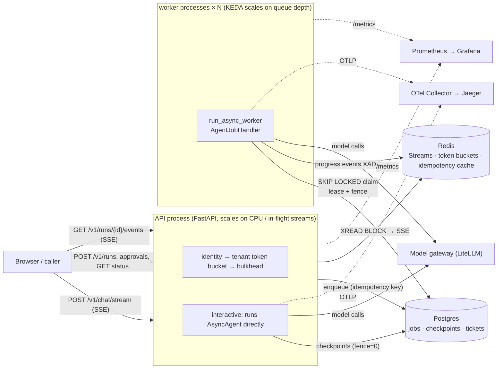
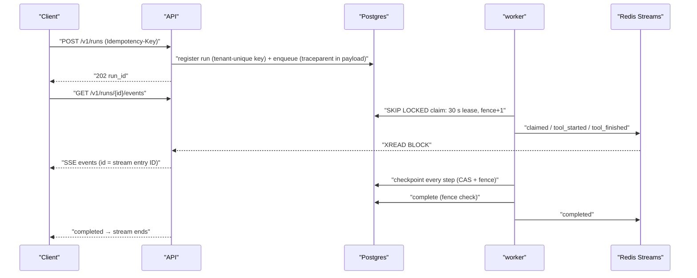

[中文](README.md) | [English](README.en.md)

# Lesson 31: Deployment and scaling — from one machine to a cluster

> 🕐 Time: 30 min | 🎯 You'll be able to: assemble the components from Lessons 26–30 into an agent service that stays correct across multiple processes and instances (interactive SSE + background queue + approvals); size replicas with Little's Law and queue depth; align `terminationGracePeriodSeconds`, preStop, the worker grace period, and the lease; design load tests and fault injection, and prove item by item that "no side effect is duplicated, cancellation really stops the run, and the metrics match the database" | 📦 Source: [`production/`](../../production/__init__.py) ([`service/api.py`](../../production/service/api.py), [`service/worker.py`](../../production/service/worker.py), [`service/runtime.py`](../../production/service/runtime.py), [`run_local.py`](../../production/run_local.py), [`loadtest.py`](../../production/loadtest.py), [`deploy/`](../../production/deploy/Dockerfile)), tests in [`production/tests/`](../../production/tests/test_e2e.py)
>
> 📖 Primary reading: [Kubernetes best practices: terminating with grace](https://cloud.google.com/blog/products/containers-kubernetes/kubernetes-best-practices-terminating-with-grace) (Sandeep Dinesh, 2018) — one page that walks through the full timeline of a Pod being deleted: preStop, SIGTERM, the grace period, SIGKILL, and why "removing traffic" and "stopping the process" happen in parallel. After reading it, every number in the timeline in Problem card 3 will make sense.

## 0. In one sentence

**Scaling isn't hard because you have to start more processes. It's hard because processes get killed, replaced, and cancelled at any moment, and the system still must not lose work, duplicate side effects, or waste money. So this lesson's deliverable isn't lecture notes: it's a reference service plus a load test and fault-injection harness that tries to break it.**

First, an honest note on the teaching version's limits: `agentkit` is single-process. [Lesson 12](../12_production_architecture/README.en.md) drew the reference architecture, [Lesson 13](../13_distributed_concurrency/README.en.md) explained leases and fencing with SQLite, [Lesson 16](../16_release_ops/README.en.md) covered canaries and rollbacks, and Lessons 26–30 swapped each component for a mature implementation. But no lesson **put them together, ran them across several processes, and then deliberately killed some of them**. That step is where things break: every component passed its own tests, yet the assembled system showed four problems that no individual test could find (Section 3.6).

An analogy: the earlier lessons built the engine, the gearbox, and the brakes, and tested each on a bench. This lesson assembles the car, takes it on the highway, and blows a tire on purpose.

| Capability | Where the component comes from | How this lesson wires it into the service | Evidence (Section 3) |
|---|---|---|---|
| Checkpoints and queue shared across processes | Lesson 26, Postgres | The API and 3 worker processes share one database; fences are converted to run scope | After kill -9 the job is taken over: finished in 3.4–3.8 s in e2e (lease 3 s) |
| Async runtime, streaming, cancellation | Lesson 30, `AsyncAgent` | Interactive SSE runs inside the API process; disconnect means cancel | All 68 disconnects recorded as `cancelled`; about 30 ms from disconnect to checkpoint |
| Idempotency | Lessons 08, 26 | Redis idempotency cache + `UNIQUE (tenant_id, idempotency_key)` on the ticket table | 368 tickets match their calls one to one; 3 replays stopped by the unique constraint |
| Rate limits, bulkheads | Lessons 26, 30 | Per-tenant Redis token bucket (429 + `Retry-After`) + `KeyedLimiter` | 510 of the noisy tenant's 571 submissions got 429; other tenants got 0 |
| Tracing, metrics | Lesson 28 | traceparent travels with the job through the queue; Prometheus multiprocess aggregation | API and worker spans share one trace; 5 metrics match the database exactly |
| Policy, guardrails, gateway | Lesson 29 | Cedar decides approvals, a regex classifier blocks inputs, the LiteLLM Router calls the model | 148 double-clicked approvals, each enqueued once |

## 1. Why the teaching implementation isn't enough: from "it runs" to "it holds up"

### 1.1 The reference service at a glance



There's only one rule: **a process holds nothing that can't be recovered if it disappears**. Conversation state lives in Postgres checkpoints, jobs live in the Postgres queue, and progress events live in Redis Streams (losing them only affects the progress bar, not the result). So any process can be killed or replaced at any time.

### 1.2 Two interaction modes: when to use which

| | Interactive `POST /v1/chat/stream` | Background `POST /v1/runs` |
|---|---|---|
| Who runs it | The API process that received the request runs `AsyncAgent` directly | Enqueued; a worker claims and runs it |
| Response | SSE streams tokens; ends at `done` | Returns `run_id` immediately; progress via `/events`, result via `GET /v1/runs/{id}` |
| Client disconnects | **The run is cancelled**, checkpoint `cancelled` (saves money); `POST /resume` hands it to a worker | The run continues; reconnect with `Last-Event-ID` to keep receiving events |
| Process is killed | This conversation is interrupted; the client retries or resumes | Another worker takes over from the checkpoint after the lease expires |
| Time to first token | Lowest (no queue) | One extra queue hop (measured p50 about 20 ms when idle) |
| Use for | Chat, answers in seconds to tens of seconds | Minute-long jobs, operations that need approval, batch work, runs that must not be wasted |

Both modes share the same checkpoints and tools: when an interactive run pauses for approval, a worker continues it after approval. **Interactive mode just runs the first segment inside the API process; it isn't a separate system.**

### 1.3 The life of a background run



## 2. How the reference service is built (`production/`)

### 2.1 Layout and startup

| File | Role |
|---|---|
| [`service/config.py`](../../production/service/config.py) | 12-factor: all configuration comes from environment variables and is validated at startup (for example, the heartbeat must be ≤ half the lease); fail fast on errors |
| [`service/runtime.py`](../../production/service/runtime.py) | Wiring shared by the API and the worker: connection pool, Redis, model, tools, hooks, checkpointer, queue, events |
| [`service/api.py`](../../production/service/api.py) | FastAPI: interactive SSE, background jobs, approvals, `/healthz`, `/readyz`, `/metrics` |
| [`service/worker.py`](../../production/service/worker.py) | `run_async_worker` + `AgentJobHandler`, release on shutdown, fence conversion, health probes |
| [`service/backend.py`](../../production/service/backend.py), [`tools.py`](../../production/service/tools.py) | The IT help desk's business tables and tools (all in Postgres, shared across processes) |
| [`run_local.py`](../../production/run_local.py) | One-command local start without Docker: embedded Postgres + fakeredis + 1 API + N workers |
| [`loadtest.py`](../../production/loadtest.py) | Load test, fault injection, item-by-item verification |
| [`deploy/`](../../production/deploy/docker-compose.yml) | Dockerfile, docker-compose, Kubernetes manifests (not started with Docker on this machine; see 2.7) |

```bash
python production/run_local.py                          # offline scripted model, 3 workers; prints URLs, demo keys, curl examples
python production/loadtest.py --users 20 --duration 60  # load test + kill -9 + rolling restart + verification
.venv/bin/python -m pytest production/tests             # 22 tests, about 20 s
```

### 2.2 Identity, rate limits, bulkheads

- **Identity**: API key → (tenant, user, roles, plan). The config stores only each key's SHA-256. A code comment states that **in production the gateway should validate a JWT and inject the identity into request headers**; this service doesn't parse tokens itself. The identity goes into `RunState.metadata`, tools read it through `ToolContext`, and the model can't fill it in. On the worker side, `AgentJobHandler` also overwrites the payload with the job's `tenant_id`.
- **Tenant isolation**: another tenant's run always returns 404 (not 403), so even its existence isn't revealed. The e2e tests also forge a job that says "globex resumes acme's run" and push it straight into the queue; the worker rejects it with `PermanentJobError`.
- **Rate limits**: a per-tenant `AsyncRedisTokenBucket`, one bucket shared by all API replicas; over the limit returns 429 with `Retry-After`. If Redis is down the limiter **fails open** (lets the request through and counts it): the limiter is a protection, and the API must not go down with Redis. Limits that must fail closed, such as contractual quotas, live in the gateway ([Lesson 29](../29_gateway_and_guardrails/README.en.md)).
- **Bulkhead**: `KeyedLimiter` caps how many interactive streams each tenant can have open in this process. The slot is acquired and released in a yield dependency with `scope="request"`, so it's held until the SSE ends (including disconnects). If no slot is available the request gets 429 immediately instead of queueing.

### 2.3 Progress events: why Redis Streams

| Candidate | Late client / reconnect | Cost | Verdict |
|---|---|---|---|
| Redis Pub/Sub | If nobody is subscribed when the event is published, it's gone (official docs: at-most-once) | Simplest | Doesn't fit "submit first, open the progress page later" |
| Postgres `LISTEN/NOTIFY` | Delivered only to sessions currently listening; each listener holds a dedicated connection; PgBouncer's transaction pooling mode doesn't support LISTEN; payload must be under 8000 bytes by default | No extra component | Good for "wake a worker, there's a new job"; not an event history |
| **Redis Streams** | Events are stored by ID (`MAXLEN ~` approximate trimming + expiry); the SSE `Last-Event-ID` is used directly as the `XREAD` starting point, so **reconnecting loses nothing** | Needs a cap and a TTL | **Chosen here**; fakeredis's TCP server supports `XADD` / `XREAD BLOCK` (measured on this machine; a blocking read doesn't stall other connections) |

Two details: a blocking read (`XREAD BLOCK`) holds a Redis connection, so it uses a separate client and doesn't starve the connections used for rate limiting and idempotency; events are **best-effort**, a failed publish is only logged, and the source of truth for a run is always Postgres.

### 2.4 The worker: what happens to each job

1. `continue_trace(payload["trace"])` joins the trace started by the API and wraps the job in a CONSUMER span (option B of Problem 6 in [Lesson 28](../28_production_observability/README.en.md)).
2. `AgentJobHandler` pairs the **single** `AsyncAgent` in the process with a checkpoint view carrying this claim's fence (the usage recommended by the latest Lesson 26 version: share the agent, the executor, and the model client, and pass `checkpointer=` on each call).
3. Hooks, in order: cancellation fence → `OTelTracer` → input guardrail → `PrometheusHook` → `AsyncRateLimitHook` (Redis token bucket; if no token arrives in time it's `rate_limited` → `RetryLater`) → `CedarPolicy` (dangerous tools pause for approval) → event publisher.
4. Write tools are idempotent in two layers: the Redis idempotency cache (saves a call) plus the unique constraint on the ticket table (the backstop). Every side-effect attempt writes a row to `side_effect_attempts`, so after a load test we can prove that "replays happened, and they were stopped".
5. **Release on shutdown**: jobs still running when the grace period ends are cancelled, `AsyncAgent` records the checkpoint as `cancelled` (write tools stay unanswered), and the worker immediately calls `release`, so another worker takes over at once and replays with the same call_id. `run_async_worker` by default "neither commits nor releases, and waits for the lease to expire", which is more conservative but slower; release checks the fence, so it's safe. Releasing doesn't consume a retry attempt (the e2e test asserts `attempts` is still 1).
6. **Fence conversion**: see Finding 2 in 3.6.

### 2.5 Health checks and metrics

- API: `/healthz` only says the process and its event loop are alive and **doesn't check the database**. If the database hiccups, every Pod's liveness probe fails at once and they all restart together, turning a small incident into a full outage. `/readyz` checks Postgres and Redis; when it fails the Pod is taken out of the Service but not restarted. The Kubernetes docs draw the same line: liveness looks only at whether the app itself is healthy, while readiness also checks that the back-end services it depends on are available.
- Worker: `/healthz` and `/readyz` are answered **by the event loop itself** (a 30-line asyncio TCP server). If synchronous code blocks the event loop, the probe times out, liveness fails, and the Pod restarts. `/metrics` is served by prometheus_client on a separate thread and keeps returning 200 even when the event loop is stuck, so **it can't be used for liveness**. While draining, `/readyz` returns 503.
- Metrics: `PrometheusHook` covers agent-level metrics; the service adds HTTP requests, 429s (by layer), SSE connections, worker job events, and cancellation-fence firings. Locally, multiple processes are aggregated with prometheus_client's multiprocess mode: counters live in mmap files in a shared directory, so **counts survive kill -9** (measured in this lesson); when a process exits, `run_local` calls `mark_process_dead` to drop its live gauges. In Kubernetes each Pod runs one process, Prometheus scrapes each one, and `rate()` handles the reset after a restart.

### 2.6 12-factor configuration

Everything that varies is an environment variable; see [`production/.env.example`](../../production/.env.example) (placeholders only). The same image moves between dev, staging, and prod by swapping the ConfigMap and Secret. A few rules are checked at startup: the heartbeat must be ≤ half the lease; `LLM_BACKEND` must be `litellm`, `openai`, or `scripted`. Offline mode injects an `AsyncScriptedLLM` with latency and jitter (300 ms ± 30% per call). Its responder looks only at "the last user message" and "how many tool rounds have happened since", so when the same run is resumed on another worker, it picks up exactly where it left off.

### 2.7 Deployment config (`deploy/`): no Docker on this machine, stated plainly

| File | Contents | How it was checked |
|---|---|---|
| [`Dockerfile`](../../production/deploy/Dockerfile) | Two-stage build; non-root (UID 10001); exec-form CMD (the process receives SIGTERM directly); **Python 3.12 base image** (see Finding 3 in 3.6); a sibling `Dockerfile.dockerignore` excludes `.env` | Static checks (multi-stage, USER, ignore file) |
| [`docker-compose.yml`](../../production/deploy/docker-compose.yml) | postgres (`pgvector/pgvector:pg16`), redis, otel-collector (**mounts Lesson 28's config directly**, plus an override file), jaeger (network alias `tempo`, so Lesson 28's exporter address works unchanged), prometheus (mounts Lesson 28's SLO rules), grafana (auto-loads Lesson 28's dashboard), litellm (**mounts Lesson 29's config**), migrate, api, worker (3 replicas) | pyyaml parse + all referenced local files exist |
| [`k8s/`](../../production/deploy/k8s/kustomization.yaml) | api Deployment, Service, HPA, PDB; worker Deployment, PDB; KEDA `TriggerAuthentication` + `ScaledObject` (postgresql scaler); ConfigMap; a Secret with placeholders only; a migration Job | pyyaml parse + cross-checks (the three timings are aligned, probes, resources, non-root, KEDA target matches concurrency, no real secrets) |

**None of these files has been started on real Docker or Kubernetes.** Field names were verified against the official docs as of 2026-09 (Kubernetes 1.37, KEDA 2.21, the Compose specification), and [`test_deploy_configs.py`](../../production/tests/test_deploy_configs.py) runs every static check it can. Before going live, run `kubectl apply --dry-run=server -k production/deploy/k8s` in your own cluster. Everything measured on this machine went through `run_local.py`: the same code, with the infrastructure swapped for embedded Postgres (pgserver: a real Postgres 16, but single-node with no replication) and fakeredis (a Python implementation of the Redis protocol that doesn't simulate persistence, failover, or cluster sharding, and is much slower than real Redis).

## 3. Hands-on: demo and load tests (all numbers measured)

```bash
python lessons/31_deployment_and_scaling/demo.py --offline   # offline: 12 users × 20 s + fault injection, about 30 s
python lessons/31_deployment_and_scaling/demo.py             # real model: 2 workers × concurrency 1, a dozen or so model calls
python production/loadtest.py --users 20 --duration 60 --json report.json
```

### 3.1 Test environment

Apple M1 (8 cores), 8 GB RAM, macOS 14.4.1, CPython 3.11.7; fastapi 0.141.1, uvicorn 0.54.0, starlette 1.7.0, psycopg 3.3.6, psycopg_pool 3.3.3, redis-py 8.1.0, fakeredis 2.38.0, pgserver 0.1.4 (Postgres 16.2). **To be upfront**: every process (Postgres, fakeredis, the API, 3–5 workers, the load-test client) runs on the same machine, alongside other jobs; the load average at the start was between 4.4 and 6.4. The offline model takes 300 ms ± 30% per call, the diagnostics tool 1.5 s, and the ticket system's response 400 ms. Locally the lease is 6 s and the grace period 1 s (much shorter than production, so fault injection shows its effect within a minute). The load test is **closed-loop**: each user waits for the previous request to finish before sending the next one (see Problem card 6 for the limitation).

### 3.2 End-to-end tests: 22 tests, about 20 s

[`production/tests/`](../../production/tests/test_e2e.py) starts **real processes**: 1 uvicorn API, 3 workers, embedded Postgres, fakeredis. Every test proves its point with state rather than "it ran".

| Scenario | How it's proven | Measured |
|---|---|---|
| Background run end to end + approval | Nothing runs before approval; an employee can't approve their own request; an approver clicks twice at once, both requests return 202, and the job table contains exactly one resume | Pass |
| Approval after the run job was taken over | The test plays a worker that claims the job and crashes; a real worker takes over with fence=2; the later resume job must succeed on its first claim | Pass (refused before the fix; see 3.6) |
| SSE disconnect → cancel | Disconnect as soon as `run_diagnostics` starts; the checkpoint says `cancelled`, and 1.5 s later still no ticket; after `POST /resume` a worker finishes it with exactly one ticket | 26–29 ms from disconnect to checkpoint (several runs) |
| Worker killed with kill -9 | kill -9 while the ticket tool has inserted the ticket and is waiting on the downstream response; another worker takes over with fence=2 | Done in 3.4–3.8 s (lease 3 s); 1 ticket; `side_effect_attempts` shows inserted 1, deduplicated 1 |
| Rolling restart | 3 old workers get SIGTERM one by one "while creating a ticket" (grace 0.3 s < downstream 0.8 s) | All exit with code 0; cancelled jobs are released at once, taken over, replayed, and deduplicated by the unique constraint; exactly one ticket per run; `attempts` still 1 |
| Tenant isolation | Another tenant reading the run, reading its events, or approving it gets 404; the forged cross-tenant job is rejected by the worker | Pass |
| Rate limits | The noisy tenant fires 6 requests at once; at least 3 get 429 with `Retry-After`; the same tenant's third interactive stream gets 429 | Pass |
| Trace across the queue | The client sends a traceparent; the API's PRODUCER span and the worker's CONSUMER span are in the same trace with the right parent-child link, across processes | Pass |

Plus 8 deployment-config checks and 5 cancellation tests (Finding 3 in 3.6).

### 3.3 Load test + fault injection (main scenario)

20 users for 60 s, 3 workers × concurrency 8. At 35% of the run, the worker holding the most jobs gets kill -9 and a replacement is started; at 65%, one worker is rolled: start a new one first, then send SIGTERM to the old one once the new one is ready.

| Kind | n | OK | p50 | p95 | p99 | TTFT p50 | Queue p50 |
|---|---|---|---|---|---|---|---|
| Interactive Q&A (SSE until done) | 367 | 367 | 0.62 s | 0.74 s | 0.78 s | 0.61 s | — |
| Interactive, disconnect midway | 68 | 68 | 0.30 s | 0.40 s | 0.41 s | — | — |
| Background ticket | 214 | 214 | 1.08 s | 1.20 s | 1.25 s | — | 0.02 s |
| Background long job (diagnose + ticket) | 154 | 154 | 3.49 s | 3.82 s | **9.68 s** | — | 0.02 s |
| Background password reset (wait for approval → double-click approve → done) | 148 | 148 | 1.09 s | 1.26 s | 1.30 s | — | 0.02 s |
| Noisy tenant submissions (quota 1/s) | 571 | 61 | — | — | — | — | — |

1522 requests in total, 24.0 requests/s, 0% errors, 33.5% 429s (**all** from the noisy tenant). Fault-injection timeline:

| Time | Event | Result |
|---|---|---|
| 21.0 s | kill -9 worker-0, which held 7 jobs | Replacement ready 1.8 s later; the 7 jobs were taken over after the lease (6 s) expired. The long job's p99 went from a p50 of 3.5 s to 9.7 s, and the extra time is exactly "waiting for the lease" |
| 41.3 s | SIGTERM worker-3 (holding 8 jobs) | Exited in 1.72 s with code 0: 4 finished within the grace period, 4 were cancelled → released at once → taken over |

Verification (after the test, query Postgres directly + read `/metrics`):

| Check | Result |
|---|---|
| Every run reached a terminal or explainable state | ✅ 944 completed, 68 cancelled (all disconnected by the client) |
| No duplicated side effects: every `create_ticket` call maps to exactly one ticket | ✅ 368 tickets, 368 inserts; **3 replays stopped by the unique constraint** |
| Disconnected interactive runs are `cancelled` in the checkpoint | ✅ 68/68; 2 of them were caught by the cancellation fence (Finding 3 in 3.6) |
| Metrics match reality | ✅ completed 944=944, succeeded jobs 725=725, paused 148=148, cancelled segments 72=72 (68 disconnects + 4 shutdown cancels), 429s 510=510 |
| No job in the dead-letter state | ✅ |

148 double-clicked approvals, each enqueued exactly one resume.

### 3.4 Capacity: Little's Law, measured

Same load (24 users, 30 s, no faults), only the number of workers changes:

| Setup | Worker slots L | Mean service time W | Predicted saturation L/W | Measured | Slot utilization | Background queue p50 | Ticket end-to-end p50 |
|---|---|---|---|---|---|---|---|
| 1 worker × concurrency 4 | 4 | 1.14 s | 3.52 segments/s | **3.47 segments/s** | 99% | **7.30 s** | 8.21 s |
| 3 workers × concurrency 4 | 12 | 1.27 s | 9.49 segments/s | **8.86 segments/s** | 93% | 0.97 s | 1.98 s |

A "segment" is one claim-to-finish on a worker (the approval flow has two). W is measured from the event stream: the time from `claimed` to the event that ends that segment.

**How to read it**: with 1 worker, slot utilization is 99% and throughput is almost exactly L/W; all excess demand turns into queueing, with a p50 wait of 7.3 s before a job is claimed. This is what Little's Law looks like in front of a queue: **throughput is capped at L/W, and excess demand becomes waiting time**. Meanwhile the interactive p50 stays at 0.62 s, because it runs in the API process and never touches the queue. That's why scaling signals must be separate: the API watches in-flight streams and CPU, the workers watch queue depth and queue wait (Problem card 2).

### 3.5 When the bottleneck is the model quota

Cap each tenant's model calls at 4/s (`--env LLM_RATE_PER_SEC=4 --env LLM_BURST=4`), everything else unchanged (3 × 4):

| Kind | OK / total | p50 | p95 | Notes |
|---|---|---|---|---|
| Interactive Q&A | 26 / 58 | 2.25 s | 5.73 s | 32 waited about 2 s, got no token, and ended `rate_limited` (an error for the user) |
| Background ticket | 35 / 35 | 6.48 s | 15.53 s | All completed; background jobs were deferred 52 times in total (`RetryLater`: back to the queue, not holding a worker) |
| Background long job | 18 / 19 | 11.29 s | 21.41 s | 1 ended with `max_steps`: **deferral consumes steps** (Finding 4 in 3.6) |

Both runs are "slow", for completely different reasons: in 3.4 the bottleneck was worker slots (7 s of queueing; more workers fix it); here worker slot utilization is 89% but jobs spend most of their time waiting for tokens, so more workers won't help. You need more quota from the gateway, or a reserved share of the quota for interactive traffic. Exercise (c) turns this diagnosis into code.

### 3.6 Counterintuitive findings: correct in isolation, broken once assembled

**Finding 1: authorizing inside the SSE generator gives other tenants "200 + an empty stream".** A FastAPI SSE endpoint is a generator, and **its body starts running only after the response headers (200) have been sent**. `GET /v1/runs/{id}/events` originally checked ownership inside the generator; the e2e test found that another tenant got a 200 with an empty stream instead of a 404. Fix: move the ownership check into a dependency (`Depends(visible_run)`), which runs before the response starts.

**Finding 2: the fence's scope doesn't match the resource it protects, so the resume job after approval is rejected as a "stale holder".** The queue's fence counts from 1 **per job**, but the checkpoint's fence protects **the whole run**. From the load-test log: after the run job was killed with kill -9 and taken over with fence=2, the checkpoint's fence became 2; the resume job created by the approval then started at fence=1 and was rejected when it loaded the checkpoint (`CheckpointConflict`). `run_async_worker` treats that as "ownership moved", commits nothing, and leaves the job leased until the lease expires; only when the job is reclaimed and its fence counts up to 2 does it succeed. That cost an extra 6 s here; if the run job had been taken over more times than `max_attempts`, the resume job would go straight to the dead-letter state and the approval would be lost. Fix (in the service, without changing contrib): `RunScopedFences` converts the checkpoint fence to `job_id × 10^6 + job.fence`, so a job enqueued later for the same run always wins; and "holding the lease but hitting a checkpoint conflict" is explicitly treated as "superseded by a newer job" (`PermanentJobError`, no retry). The regression test `test_approval_resume_is_not_refused_after_the_run_job_was_taken_over` times out and fails without the fix.

**Finding 3: a third-party library swallowed the cancellation; the user closed the page and the ticket was created anyway.** Before the fix, across twenty-odd load tests (about 540 disconnects in total), "the client disconnected but the run finished" happened 5 times, about 1%. The logs showed that the server noticed the disconnect within 1 ms and cancelled the run, yet the run still finished. Instrumenting every hook boundary with `Task.cancelling()` located the loss inside `AsyncRateLimitHook` while it called Redis: redis-py 8.1.0 sends every command through `send_packed_command` → `asyncio.wait_for`. Before Python 3.12, `asyncio.wait_for` has a known race ([CPython gh-86296](https://github.com/python/cpython/issues/86296)): if the awaited operation finishes and an outside cancellation arrives in the same event-loop iteration, it returns the result and swallows the cancellation. 3.12 rewrote `wait_for` on top of `asyncio.timeout` ([gh-96764](https://github.com/python/cpython/issues/96764)), but the rewrite wasn't backported. Micro-benchmarks on 3.11.7: cancelling while a redis-py command is in flight is **swallowed about 20%–25% of the time**; in psycopg_pool 3.3.3, handing over a connection at the same moment the waiter is cancelled is **swallowed 20/20 times** (its `ACondition.wait_timeout` also uses `asyncio.wait_for`). `agentkit.aio` itself already switched to a cancellation-safe `wait_for`, but it can't fix its dependencies. The fix has two layers:
1. The real fix: use Python 3.12+ in the production image (the Dockerfile now does);
2. Defense in depth: a `CancellationFence` hook, first in the list. At every step boundary (before calling the model or a tool) it checks two things: `Task.cancelling() > 0` (a cancellation was requested but never delivered; 3.11+), or the API has marked the run as "client gone". If either holds, it raises `CancelledError` and `AsyncAgent` handles it as a cancellation. After the fix, 6 consecutive load tests (164 disconnects) all ended `cancelled`, and the fence caught 2 of them. It also exports a metric, `itdesk_cancellation_fence_total`: **if it's not 0, some dependency is swallowing cancellations**.

**Finding 4: being deferred by the rate limiter also consumes `max_steps`.** `AsyncAgent` does `state.step += 1` before calling the model, so when the rate-limit hook in `before_llm` raises `StopRun("rate_limited")`, the step counts even though the model was never called. Combined with `AgentJobHandler`'s `RetryLater`, every deferral burns a step. Reproduction: `max_steps=3`, the rate-limit hook refuses 3 times in a row, and the 4th resume ends immediately with `max_steps` without a single model call. One long job in the 3.5 load test failed this way. This is in the agentkit core and has been reported to the maintainers (Section 7).

### 3.7 Real model

`demo.py` (without `--offline`): 2 workers × concurrency 1, the model goes through the LiteLLM Router to the local gateway (gpt-5.5), at most 2 model calls in flight. 4 background runs; 1 s after the first run starts, kill -9 the worker running it (lease 15 s):

| Run | Result |
|---|---|
| "The printer on the third floor keeps jamming, please file a ticket" (the one that was killed) | Claimed by worker-0 → killed → after the lease expired, worker-2 took over (attempts=2) → completed after 19.7 s in total, 1 ticket |
| The other 3 | Completed: searched the knowledge base and cited [KB-003], recognized the known incident INC-2041, filed 1 repair ticket |
| Interactive stream | 8.37 s total, first text chunk at 5.78 s |
| Interactive, disconnect midway | Checkpoint `cancelled` |

All 5 checks passed: 2 tickets matched 2 `create_ticket` calls one to one, and the metrics matched the database. Real-model latencies are measured in seconds, so the local 30-second load-test numbers can't be extrapolated directly; see Problem cards 2 and 6 for how to extrapolate.

(Demo output translated from Chinese.)

## 4. Enterprise problem cards

### Problem 1: Deployment shape — monolith, API/worker split, serverless, managed agent platform

**Scenario**: An IT help desk agent is going live. At the daytime peak it gets 50 requests/s, mostly 5–10 s Q&A; a few are operations that run for minutes and wait for human approval (password resets, access grants). The team has 6 people and already runs Kubernetes.

**Why it's hard**: interactive Q&A needs low latency and "stop when the client leaves"; long jobs need "survive a dead process". They want opposite scaling signals, timeouts, and release strategies, so putting both in one process makes each drag the other down.

| Option | How | Pros | Cons | Scale | Ops cost |
|---|---|---|---|---|---|
| A. Monolith | One process takes requests and runs the agent; long jobs run inside the request | Simplest; easy to debug locally | Long jobs hold HTTP connections and get cut by proxy timeouts; a release interrupts every in-flight job; only one scaling signal | Prototypes, small internal tools | Low |
| B. API/worker split (this lesson) | The API runs interactive sessions and enqueues; workers claim jobs from the queue; each scales on its own | Low interactive latency; long jobs are recoverable and retryable; workers scale on queue depth; releases don't interfere | One more queue and state store; background mode adds one queue hop | The mainstream choice from tens to thousands of concurrent runs | Medium |
| C. Serverless functions | One function instance per request (Lambda, Cloud Run) | Pay per use, scale to zero; no machines to manage | A Lambda execution environment handles one request at a time, so in-process asyncio concurrency doesn't help ([Lesson 30](../30_async_runtime/README.en.md)); 15-minute maximum; no native response streaming for Python; the function keeps running (and billing) after the client disconnects. Cloud Run supports per-instance concurrency (default 80, max 1000) and streaming, but requests time out after at most 60 minutes and shutdown gives only 10 s | Bursty, infrequent, stateless light work | Low |
| D. Managed agent platform | Amazon Bedrock AgentCore Runtime, the Agent Runtime in Google's Gemini Enterprise Agent Platform, hosted agents in Microsoft Foundry Agent Service, Claude Managed Agents (beta) | Session isolation (AgentCore: one microVM per session, up to 8 hours; Foundry: one VM sandbox per session), managed memory and tracing; no CPU charge while waiting on I/O (AgentCore) | Platform lock-in; approvals, idempotency, and tenant isolation are still yours to build; observability and cost have to be wired back into your own systems | Small teams that don't want to run infrastructure, where compliance allows the data to leave | Low to medium |

**How to choose**: with Kubernetes, long jobs, and approvals, choose B. With little traffic and only short Q&A, A or C is enough; to run long jobs on C, add durable execution (AWS Lambda durable functions checkpoint and replay and can run for up to a year, or Temporal from [Lesson 27](../27_durable_workflows/README.en.md)). D is for "outsourcing the agent runtime", but the business semantics from Lessons 26–29 don't go away.

**This lesson's implementation**: B. Interactive and background share checkpoints, tools, and approvals; interactive mode just runs the first segment in the API process. When a flow has to wait days for approval or orchestrate several sub-flows, replace the worker with a Temporal worker ([Lesson 27](../27_durable_workflows/README.en.md)): the API stays the same, "enqueue" becomes "start a workflow", and "approve" becomes a Signal.

### Problem 2: Scaling signals — CPU, QPS, queue depth, in-flight concurrency, cost

**Scenario**: workers scale on 70% CPU. At the morning peak the queue backs up to 2000 jobs while CPU sits at 15%, so the HPA adds no replicas; users wait 10 minutes.

**Why it's hard**: an agent worker spends over 90% of its time waiting on the model, and CPU barely moves (Lesson 30 measured about 0.9 ms of CPU to advance one session). An idle CPU doesn't mean you have enough hands.

| Signal | How | Pros | Cons | For |
|---|---|---|---|---|
| A. CPU | HPA `Utilization` | Zero config | Almost no signal for I/O-bound agents | Only as a fallback for the API |
| B. QPS | Request rate / per-replica capacity | Intuitive | Ignores request duration: at the same 10 QPS, 5 s and 60 s jobs need 12× different replica counts | Services with stable request durations |
| C. Queue depth (this lesson) | KEDA postgresql scaler: `count(leased) + count(runnable queued)`, target = concurrency × target utilization | Maps directly to "how many slots are missing"; can scale to zero | Reacts only after a backlog forms; needs a stabilization window to avoid flapping | Workers |
| D. In-flight concurrency | API SSE connections, `agent_runs_in_flight` (Pods metric via prometheus-adapter) | The real load of a streaming service | Needs a custom-metrics pipeline | API |
| E. Cost / quota | Per-tenant token budget and remaining gateway quota decide whether to scale | Prevents "more replicas → more 429s → more money" | Not a native HPA signal; needs your own control logic | When the quota is the bottleneck (3.5) |

**Sizing with Little's Law**: L = λ × W. Using Lesson 30's numbers: at the morning peak λ = 50 requests/s, and W should be the **p95**, not the mean (a real model call has a p50 of about 2 s and a max of 3.7 s; a job makes 3–4 calls, so use 8 s). L = 50 × 8 = 400 runs in flight. With 16 concurrent runs per worker and 0.75 target utilization, each replica carries 12, so you need 400 / 12 ≈ 34 replicas. Then check three ceilings: the model gateway quota (400 in flight × 3–4 calls per 8 s ≈ 150–200 calls/s), database connections (34 × `PG_POOL_MAX` 10 = 340, above the default `max_connections` of 100, so you need PgBouncer), and cost. Section 3.4 verified the formula on this machine: with 1 worker × 4 slots, the predicted ceiling was 3.52 segments/s and the measured throughput 3.47.

**How to choose**: C (KEDA) for workers, D for the API, A as a fallback, E as a ceiling. The minimum replica count is what still holds up after one Pod dies; the maximum is what downstream (gateway quota, database connections) can bear, **not** what the cluster can give you.

**This lesson's implementation**: [`k8s/keda-scaledobject.yaml`](../../production/deploy/k8s/keda-scaledobject.yaml): `targetQueryValue: 12` (16 × 0.75), `minReplicaCount: 1` (KEDA's default is 0; keep one warm so the first job doesn't wait for a cold start), a 300 s scale-down stabilization window, and at most 1 replica removed per minute (every scale-down makes one worker drain and cancel in-flight jobs). The HPA in [`api.yaml`](../../production/deploy/k8s/api.yaml) scales on CPU, with the Pods-metric version for in-flight streams included. Exercise (a) implements the HPA replica calculation and stabilization window.

### Problem 3: Graceful shutdown and rolling releases — aligning SIGTERM, lease, grace period, preStop, PDB

**Scenario**: every release leaves dozens of jobs "stuck" for minutes before they finish, and occasionally a ticket gets created twice.

**Why it's hard**: several things happen at once when a Pod is deleted, each with its own timeout. If any of them is misaligned, you get "killed before finishing" or "done twice".

```mermaid
sequenceDiagram
    participant K as "kubelet"
    participant E as "EndpointSlice"
    participant P as "Pod (worker / API)"
    Note over K,P: "t=0: Pod marked Terminating; terminationGracePeriodSeconds starts counting"
    K->>E: "in parallel: remove the endpoint (ready=false)"
    K->>P: "run preStop (API: sleep 5, wait for forwarding rules to update)"
    K->>P: "t=5: SIGTERM"
    P->>P: "worker: stop claiming; /readyz returns 503; in-flight jobs keep running, heartbeats keep renewing"
    P->>P: "t=5+20: grace period over, cancel the rest → record cancelled → release at once"
    P->>P: "flush traces, close pools, exit code 0"
    K->>P: "t=35: SIGKILL if still running (plus a one-time 2 s extension if preStop hasn't finished)"
```

| Timing | Value here | Aligned with | If misaligned |
|---|---|---|---|
| `terminationGracePeriodSeconds` | 35 | ≥ preStop + worker grace period + cleanup (Kubernetes default 30, **counted from the start of preStop**) | SIGKILL before draining ends: jobs are neither recorded as cancelled nor released, and must wait for the lease to expire |
| preStop | API: `sleep 5` (the native sleep action, GA since Kubernetes 1.34); worker: none | Removing traffic and SIGTERM happen **in parallel**, so wait for every node to update its forwarding rules | The process no longer accepts connections while the load balancer still sends traffic; clients see connection errors |
| Worker grace period `WORKER_GRACE_SECONDS` | 20 | Covers most jobs (p95), not necessarily the longest | Too short: every release cancels many jobs and wastes a model call each; too long: slow releases |
| Lease `WORKER_LEASE_SECONDS` | 30 (heartbeat 10) | **Independent** of the grace period: heartbeats keep renewing during the drain; the lease decides how soon work is taken over after a **hard crash** | Too short: a GC pause or network blip is mistaken for death and the job runs in two places; too long: slow recovery after kill -9 (3.3: p99 pushed to 9.7 s) |
| uvicorn `--timeout-graceful-shutdown` | 20 | The API's "grace period": SSE connections get at most 20 more seconds | After that they're cancelled: the interactive run is recorded as cancelled, and the client can `POST /v1/runs/{id}/resume` |
| PDB `maxUnavailable: 1` | One each for api and worker | **Only voluntary disruptions** (node drains through the Eviction API), not the Deployment's own rolling update (governed by `maxSurge` / `maxUnavailable`) | A node drain evicts every worker at once |

"The lease must be longer than the grace period" is a common rule, but it only holds when **the lease isn't renewed during the drain**. `run_async_worker` keeps renewing throughout the drain, so the fact that this lesson's lease (30) is longer than its grace period (20) is a coincidence. Exercise (b) turns these relationships into a check function and distinguishes three renewal modes: renews throughout, stops renewing on SIGTERM, never renews (like a message queue whose visibility timeout isn't extended).

**How to choose**: work through the table from right to left: first decide the longest acceptable recovery time after a hard crash (that gives the lease), then how many jobs a release may cancel (that gives the grace period), and finally `terminationGracePeriodSeconds` = preStop + grace period + cleanup margin. For rolling releases use `maxUnavailable: 0` + `maxSurge`: start the new one, then stop the old one.

**This lesson's implementation**: comments in [`k8s/worker.yaml`](../../production/deploy/k8s/worker.yaml) spell out the three relationships, and [`test_deploy_configs.py`](../../production/tests/test_deploy_configs.py) checks the alignment automatically. The worker **releases** cancelled jobs right after the grace period (item 5 in 2.4); the e2e test proves that someone else takes over and replays, without duplicated side effects and without consuming retry attempts.

### Problem 4: Stateful vs stateless — session affinity or external state?

**Scenario**: the API has 3 replicas. A user refreshes the page, reconnects to another replica, and the conversation "forgets" everything. Another team used cookie-based session affinity; during a release one replica went down and all 800 sessions on it broke.

**Why it's hard**: agent sessions are inherently stateful (conversation history, pending approvals, which step we're on). Keeping that in process memory is fastest, but a process can be killed at any moment.

| Option | How | Pros | Cons | Use for |
|---|---|---|---|---|
| A. In-process state + session affinity | The load balancer pins a session to one replica by cookie or hash | Fastest; no external store | A dead replica loses its sessions; scaling reshuffles sessions; uneven load | Prototypes; cases where losing a session is acceptable |
| B. External state, stateless processes (this lesson) | Every step writes a Postgres checkpoint; any replica can `resume(run_id)` | Any replica is replaceable; releases and scaling don't lose state | One more database write per step; writes need CAS and fencing (Lesson 26) | **The production default** |
| C. External state + local cache | B plus an in-process cache of recent sessions, write-through | Saves a read when reads dominate | Cache consistency; concurrent writes to one session need version numbers | Long sessions with far more reads than writes |
| D. Stateful service (Actor / Durable Object style) | The platform guarantees a key lives on one instance and handles migration | Simple programming model without losing state | Platform lock-in; brief unavailability during migration | Collaborative editing, long-lived sessions |

**How to choose**: B. The only "sticky" thing is an SSE connection in progress. It naturally lives on one replica; if it breaks, the run is cancelled, and after reconnecting you resume by `run_id` or hand the run to a worker. **Don't** configure session affinity for an agent service: it makes scaling and releases dangerous, and every agent step has to be persisted anyway.

**This lesson's implementation**: the API and worker processes hold only rebuildable things like connection pools, thread pools, and hook instances. Each interactive run gets its own checkpoint view (`fenced(0)`), and its version bookkeeping is freed when the run ends. If the whole process shared one checkpointer object, the versions it remembers would grow without bound as runs accumulate (item 5 in Section 7).

### Problem 5: Streaming and load balancing — SSE vs proxy timeouts, buffering, and connection limits

**Scenario**: SSE works fine locally. Behind the Ingress, the front end either receives all the text at once after tens of seconds, gets disconnected at exactly 60 s, or hangs when the same browser opens a 7th tab.

**Why it's hard**: an SSE response is an HTTP response that stays "unfinished" for a long time, and every hop in between (CDN, load balancer, Ingress, service mesh) has its own buffering and timeouts, with defaults designed for short requests.

| Hop | Default behavior (verified) | Effect on SSE | What to do |
|---|---|---|---|
| nginx / Ingress | `proxy_buffering` on by default; `proxy_read_timeout` 60 s (between two successive reads) | Events are batched; the stream is cut after 60 s without data | Response header `X-Accel-Buffering: no` (FastAPI's `EventSourceResponse` adds it) or disable buffering; a comment heartbeat every 15 s (recommended by the spec; FastAPI sends it) |
| AWS ALB | Idle timeout 60 s by default, 1–4000 s; HTTP/2 PING doesn't reset it | Same as above | Heartbeats; the backend keep-alive must be longer than the ALB idle timeout (per the AWS docs, otherwise you can get 502s). This lesson uses uvicorn `--timeout-keep-alive 75` |
| GCP external Application LB | Backend service timeout 30 s by default, measured over **the whole response** (first byte of the request to last byte of the response) | A streaming response can live only 30 s | Raise the timeout; and cap each stream's duration on the server |
| Envoy | Route timeout 15 s by default; stream idle timeout 5 minutes (Istio sets no request timeout by default) | Stream cut at 15 s | Disable or raise the route timeout for streaming routes |
| Browser | Under HTTP/1.1, at most 6 SSE connections per browser + domain (MDN); under HTTP/2 the number of streams is negotiated | New connections hang once enough tabs are open | Use HTTP/2; one stream per page |

**How to choose**: don't assume a connection can stay open forever. This lesson: (1) caps each SSE at `SSE_MAX_SECONDS` (600 s by default, 300 s in the Kubernetes config), after which the server ends the stream and tells the browser to reconnect in 1 s; (2) gives every event an `id` (the Redis Streams entry ID), so the browser sends `Last-Event-ID` on reconnect and resumes from there; (3) relies on FastAPI's automatic 15 s heartbeat to get through idle timeouts.

**This lesson's implementation**: [`api.py`](../../production/service/api.py) uses the `EventSourceResponse` built into FastAPI 0.141. Two implementation details this lesson tripped over: authorization must happen in a dependency (Finding 1 in 3.6), and cancellation on disconnect happens in the teardown of a `scope="request"` dependency, independent of when the generator is garbage-collected.

### Problem 6: Load testing and capacity planning — how to design it, how to read p99, where the bottleneck is

**Scenario**: the pre-launch load-test report says "average response 1.2 s, 200 QPS, pass". On launch day, p99 is 40 s, with lots of 429s.

**Why it's hard**: averages hide the tail, and users feel the tail. A request passes through the API, the queue, a worker, the database, Redis, and the model gateway; any of them can be the bottleneck, and each bottleneck calls for a completely different fix.

| Approach | How | Pros | Cons |
|---|---|---|---|
| A. Closed-loop load (this lesson's loadtest) | K virtual users, each waits for its previous request before sending the next | Simple; mimics "real people using it"; won't crush the system | **Coordinated omission**: when the system slows down, users send less, so the tail looks better than it is |
| B. Open-loop load | Send at a fixed arrival rate regardless of responses (wrk2, k6's arrival-rate executors) | Measures the real tail latency at that arrival rate | Easy to overwhelm the system; needs a separate load generator |
| C. Replay production traffic | Record the timing and content of real requests and replay them scaled up | Closest to reality: the request mix and length distribution are right | Needs redaction; requests with side effects must hit an isolated environment |
| D. Load under fault injection | Kill processes and roll releases during the load (Problem 7) | Measures the tail on "release day" and "incident day" | Noisy results; run several times |

**How to read the results**:
- Look at **p99**, not just p50: the long job in 3.3 has a p50 of 3.5 s and a p99 of 9.7 s, and the difference is exactly the lease.
- Compute percentiles over **successful requests only**: failures are often fast and would make latency look "better".
- **Count 429s separately from errors**: a 429 is a deliberate rejection; check which tenant and which layer it came from.
- Break down the time to find the bottleneck: mostly queueing → not enough worker slots (3.4); waiting for tokens → gateway quota (3.5); waiting for a database connection → pool too small (Problem 7 in [Lesson 26](../26_state_and_queues/README.en.md)); high event-loop scheduling delay → CPU ([Lesson 30](../30_async_runtime/README.en.md): about a thousand sessions per second per core). Exercise (c) turns this diagnosis into code.
- **Capacity planning** = maximum throughput at the target p95 latency, times a safety factor (typically 30%–50% headroom for bursts and failures); back out the replica count with Little's Law (Problem 2).

**How to choose**: A (this lesson's loadtest) for routine regression, B before a release to measure the real tail, C for major versions, D for fault drills. A load-test report must describe the environment: hardware, load, model latency distribution, lease and grace period. Section 3.1 does exactly that.

**This lesson's implementation**: [`loadtest.py`](../../production/loadtest.py) reports p50/p95/p99, time to first token, queue wait, error rate, and 429 ratio, measures the service time W from the event stream, and prints the L/W prediction and slot utilization directly.

### Problem 7: Fault injection — what to drill, what to verify

**Scenario**: the team says "we have leases, fences, and idempotency", but has never killed a process in a production-like setup. At the first node failure, the job was indeed taken over, but two tickets were created because the idempotency key contained a random number.

**Why it's hard**: "we have the mechanism" and "the mechanism works once everything is combined" are different claims. All four problems in 3.6 were invisible to individual tests and appeared only after assembly.

| Drill | How | Must verify (not just "no errors") |
|---|---|---|
| Hard process crash | kill -9 the worker holding the most jobs | Jobs are taken over after about one lease; **side effects happen exactly once** (tickets ⇔ calls one to one); the fence rejects the stale holder |
| Rolling release | Start the new one, then SIGTERM the old one | Exit code 0 within the grace period; cancelled jobs are released and replayed; no retry attempts consumed |
| Client disconnect | Close the connection after the first tool result | Checkpoint `cancelled`; **no later tool runs at all**; the slot is released |
| Dependency failure | Stop Redis / restart Postgres / gateway returns 5xx | Rate limiter fails open and counts; workers back off instead of crashing; `/readyz` removes traffic but liveness doesn't restart |
| Zombie | SIGSTOP a worker until its lease expires, then SIGCONT (the [Lesson 26](../26_state_and_queues/README.en.md) demo) | The stale holder's writes are rejected by the fence |
| Quota exhausted | Lower the gateway or token-bucket quota (3.5) | Interactive fails fast with a clear message; background jobs are deferred rather than failed; no retry storm |

**How to verify**: after the test, **query the database directly** and trust no process's own account. This lesson's 5 checks: every terminal state is explainable, side effects map one to one, disconnects are cancelled, metrics equal database counts, no dead letters. Run them after every drill; failing any one of them fails the drill.

**How to choose**: run the first three (crash, rolling release, disconnect) on every change, in CI or as a pre-release check; run dependency failures and zombies every version; run quota exhaustion during capacity reviews. Production chaos engineering (Chaos Mesh, AWS FIS) needs a stop switch and should start off-peak and at small scale.

**This lesson's implementation**: `loadtest.inject_faults` does the first two; the e2e tests cover the first three plus the forged cross-tenant job; the [Lesson 26](../26_state_and_queues/README.en.md) demo covers zombies.

### Problem 8: Multi-region and disaster recovery (brief)

**Scenario**: the primary region is down for 2 hours. Checkpoints and jobs live in the primary region's Postgres. How much can the standby region serve, and how much data is lost?

First fix two numbers: **RTO** (the longest acceptable time from interruption to restored service) and **RPO** (the longest acceptable window of lost data), as defined in the AWS disaster-recovery whitepaper.

| Strategy (the four tiers in the AWS whitepaper) | How | RTO / RPO | Cost |
|---|---|---|---|
| Backup and restore | Back up Postgres regularly; restore in the standby region on failure | Hours / hours | Low |
| Pilot light | Read replica of the database in the standby region; the application isn't running | Tens of minutes / minutes | Medium |
| Warm standby | A scaled-down copy always running in the standby region | Minutes / seconds to minutes | Medium-high |
| Multi-site active/active | Both regions serve traffic | Near 0 | High; for agents you must solve the same run executing in both regions at once |

Agent services need a few extra considerations: (1) **the truth lives only in Postgres**: token buckets, idempotency caches, and progress events in Redis can be rebuilt and don't need cross-region replication; (2) failing over with asynchronous replication can lose the last few seconds of checkpoints, and write tools will be replayed after recovery, so **downstream idempotency keys must work across regions** (the ticket system itself deduplicates on the key); (3) fences and job ids must keep increasing after failover, otherwise the old region's workers could win when it comes back; (4) the model gateway must be able to switch providers or regions ([Lesson 29](../29_gateway_and_guardrails/README.en.md)). This lesson didn't drill multi-region; it verified only process-level failures on one machine.

## 5. Exercises

Files: [`exercise.py`](exercise.py) (you write it), [`solution.py`](solution.py) (reference solution), [`test_exercise.py`](test_exercise.py) (20 tests, milliseconds). All pure functions, no infrastructure needed.

**(a) `desired_replicas(queue_depth, in_flight, per_worker_concurrency, target_utilization, min_r, max_r, current, scale_down_stabilization)`**: compute worker replicas from "queued + in flight". Do nothing while the load is within 1 ± 10% of target (the HPA's default tolerance); scale up immediately, and scale down only to the highest recommendation in the stabilization window. This is the same approach as `stabilizeRecommendationWithBehaviors` in Kubernetes' `horizontal.go`: the scale-up recommendation is the window minimum, the scale-down recommendation is the window maximum, and the current replica count is clamped between them. Finally clamp to `[min_r, max_r]`; `min_r` can be 0 (KEDA scale to zero).

**(b) `validate_shutdown_timeline(termination_grace, pre_stop, worker_grace, lease_seconds, max_job_seconds)`**: return a list of problems. SIGKILL before the drain finishes (error); grace period shorter than the longest job (warning, not an error); twice the heartbeat interval exceeds the lease (error); no renewal and a lease shorter than the longest job (error, duplicate execution); renewal stops on SIGTERM and the lease is shorter than the drain window (error, duplicate execution). The tests deliberately check that "with continuous renewal, a lease shorter than the grace period is fine".

**(c) `evaluate_load_test(samples, slo)`**: nearest-rank p50/p95/p99 (successful requests only), error rate and 429 ratio kept separate, an SLO verdict, and a bottleneck hint by priority: `rate_limit` → `db_pool` → `event_loop` → `queue_wait` → `model` → `none`.

```bash
make lesson N=31                                                  # or:
.venv/bin/python -m pytest lessons/31_deployment_and_scaling -v
AGENTKIT_SOLUTION=1 .venv/bin/python -m pytest lessons/31_deployment_and_scaling   # verify with the reference solution
```

## 6. Operations and common pitfalls

- **Database connections are a global budget**: Pods × `PG_POOL_MAX` must not exceed `max_connections` (typically 100 by default). At KEDA's cap of 20 workers with 10 connections each, you already need PgBouncer. Note that PgBouncer's transaction pooling mode doesn't support LISTEN (this lesson doesn't use it).
- **Run migrations once**: migrations belong in a pipeline Job ([`migrate-job.yaml`](../../production/deploy/k8s/migrate-job.yaml)) and must be **backward compatible** (add columns first, drop later), because old and new versions read and write the same tables during a rolling release.
- **Don't put `replicas` in the Deployment**: leave it to the HPA or KEDA, otherwise every `kubectl apply` resets the replica count.
- **CPU limits raise tail latency**: throttling happens inside the event loop, so every session slows down together. This lesson sets only a loose CPU limit; a memory limit is mandatory.
- **Liveness doesn't check dependencies**; a worker's liveness is answered by its event loop, not the `/metrics` thread.
- **Clean up the queue table**: `purge_finished` periodically deletes finished jobs (Lesson 26), otherwise the table and its indexes keep growing. Redis Streams use `MAXLEN ~` + TTL.
- **When several API replicas all sample queue depth**, aggregate with `max()` in queries, not `sum()`.
- **Use Python 3.12+ in production images**, and watch `itdesk_cancellation_fence_total` (Finding 3 in 3.6).
- **Common anti-patterns**: scaling workers on CPU; session affinity for an agent service; `/metrics` as liveness; authorizing inside an SSE generator; a grace period longer than `terminationGracePeriodSeconds`; a hard-coded replica count in the Deployment; a load-test report with only averages.

## 7. Problems found while measuring (with the `agentkit` and dependency versions at the time of writing; reported to the maintainers)

| # | Problem | Where | How to reproduce | What this lesson does |
|---|---|---|---|---|
| 1 | Fences count per job while checkpoints protect per run: after a run job has been taken over, a new job from an approval or resume is rejected and must wait for its lease to expire; if the run job was taken over more than `max_attempts` times, the new job goes straight to dead letter | `agentkit/contrib/postgres.py` (`fence = fence + 1` in `claim` + `AgentJobHandler` building the view from `job.fence`) | Same run: job 1 is claimed twice (fence=2) and completes; enqueue job 2 (op=resume); its first claim has fence=1 → `CheckpointConflict` → `ownership_lost`, and the job stays leased until the lease expires | The service uses `RunScopedFences` (`job_id × 10^6 + fence`) and treats the conflict as "superseded". Suggest contrib switch to a globally monotonic fence (for example a `nextval` sequence) |
| 2 | Deferral by the rate limiter consumes `max_steps` | `_prepare_and_loop` in `agentkit/aio/agent.py`: `state.step += 1` happens before `_call_llm` | `max_steps=3`, `before_llm` raises `StopRun("rate_limited")` 3 times in a row, `resume` each time: the 4th ends with `max_steps` after 0 model calls | Not handled (it's in the core). Suggest rolling back the step when `before_llm` raises `StopRun`, or counting a step only after the model returns |
| 3 | Cancellation swallowed: redis-py 8.1.0 (`send_packed_command`) and psycopg_pool 3.3.3 (`ACondition.wait_timeout`) use `asyncio.wait_for` internally and hit the gh-86296 race on Python < 3.12 | Third-party libraries | The first two tests in [`test_cancellation.py`](../../production/tests/test_cancellation.py) (3.11.7: redis about 20%–25%, pool 20/20) | Python 3.12 image + `CancellationFence`. Suggest `AsyncAgent` check `Task.cancelling()` at step boundaries itself |
| 4 | Authorizing inside the SSE generator → 200 + empty stream | FastAPI's generator-endpoint semantics (a defect in this service, caught by e2e) | Another tenant calls `GET /v1/runs/{id}/events` | Authorization moved into a dependency |
| 5 | A long-lived shared `AsyncPostgresCheckpointer` keeps `_versions` per run_id and never shrinks it | `_CheckpointBase._remember` in `agentkit/contrib/postgres.py` | Run N runs through the same checkpointer object: `len(ckpt._versions) == N` | Each run uses its own `fenced()` view |
| 6 | `AsyncScriptedLLM` keeps a deep copy of every call, so memory only grows in a long-running process | `agentkit/aio/llm.py` | Run the offline service for an hour | Replace `calls` with `deque(maxlen=200)` |

## 8. Switching to managed services

| This lesson | Managed / production replacement | Watch out for |
|---|---|---|
| Embedded Postgres | RDS / Cloud SQL / AlloyDB, plus PgBouncer or RDS Proxy | Only `DATABASE_URL` changes; redo the connection budget; enable `sslmode=require` |
| fakeredis | ElastiCache / Memorystore / Redis Cloud / Valkey | Only `REDIS_URL` changes; Streams and Lua must be supported; in Cluster mode keys need hash tags (already added here) |
| Process management in `run_local.py` | Kubernetes (`deploy/k8s`) / ECS / Cloud Run | Redo the timing alignment from Problem card 3; Cloud Run gives only 10 s at shutdown |
| Self-hosted KEDA, Prometheus, Grafana, Jaeger | Your cloud's managed Prometheus, Grafana Cloud, a managed tracing backend | OTLP and Prometheus protocols stay the same; only endpoints and auth change |
| Workers running AsyncAgent themselves | A managed agent platform (option D in Problem card 1) | Approvals, idempotency, tenant isolation, and cost attribution are still yours |
| In-process LiteLLM Router | LiteLLM Proxy or your cloud's model gateway | `LLM_BACKEND=openai` + gateway URL + virtual key; business code unchanged (that's how the docker-compose file is set up) |

## 9. Interview & design review questions

<details>
<summary>1. Why doesn't scaling workers on CPU work? What signal would you use, and how do you pick the target?</summary>

- Agent workers mostly wait on the model and use little CPU (Lesson 30: about 0.9 ms of CPU per session), so CPU doesn't rise no matter how big the backlog gets.
- Use queue depth (queued + in flight): target = per-worker concurrency × target utilization (for example 16 × 0.75 = 12).
- Scale down slowly and with a stabilization window: every scale-down makes a worker drain and cancel jobs.
- The ceiling comes from downstream: gateway quota and database connections, not how many resources the cluster has.
</details>

<details>
<summary>2. How do terminationGracePeriodSeconds, preStop, the worker grace period, and the lease relate?</summary>

- grace ≥ preStop + grace period + cleanup; the grace countdown starts with preStop.
- The preStop sleep waits for traffic removal to finish, because removing traffic and stopping the process happen in parallel.
- The lease is renewed during the drain, so it's independent of the grace period; it sets the recovery time after a hard crash. Only when renewal stops on SIGTERM, or never happens, must the lease exceed the drain window / the longest job.
- A PDB governs voluntary disruptions such as node drains, not the Deployment's rolling update.
</details>

<details>
<summary>3. When do you use interactive mode vs background mode, and what happens in each when the client disconnects?</summary>

- Interactive: answers in seconds with the lowest time to first token; disconnect means cancel, which saves money; resume if you want to continue.
- Background: minute-long jobs, jobs needing approval, runs that must not be wasted; disconnects don't affect the run, and reconnecting with Last-Event-ID keeps receiving events.
- Both share checkpoints and tools. When an interactive run pauses for approval, a worker continues it.
</details>

<details>
<summary>4. How do you prove "no duplicated side effects after kill -9"?</summary>

- The side effect and the deduplication must be in the same transaction: `UNIQUE (tenant_id, idempotency_key)` on the ticket table, with idempotency key = run_id:call_id.
- The call id is persisted before the tool runs, so a resume replays with the same call_id.
- Verify by querying the database: every answered `create_ticket` call in every run maps to exactly one ticket, with no extras; then check the deduplicated count in `side_effect_attempts` to prove the replay really happened.
</details>

<details>
<summary>5. Why isn't "we already called task.cancel()" enough? How would you add a safety net?</summary>

- Before Python 3.12, `asyncio.wait_for` swallows the cancellation when the result and the cancellation arrive together, and dependencies use `wait_for` everywhere (this lesson measured redis-py and psycopg_pool).
- The real fix is upgrading to 3.12+; the safety net is checking `Task.cancelling()` or an application-level "abandoned" flag at step boundaries and raising `CancelledError` yourself.
- Also add a metric so that swallowed cancellations become visible.
</details>

<details>
<summary>6. After launch, the front end receives all of the SSE text at once, or gets disconnected at 60 s. How do you debug it?</summary>

- All at once: some hop is buffering, for example nginx with `proxy_buffering` on by default; send `X-Accel-Buffering: no` or disable buffering.
- Cut at 60 s: a proxy read timeout or an LB idle timeout; send a 15 s heartbeat, cap each stream's duration, and let the client reconnect with Last-Event-ID.
- GCP's LB timeout covers the whole response and Envoy's route timeout defaults to 15 s; check every hop.
</details>

<details>
<summary>7. A load-test report shows only average response time and QPS. What do you ask?</summary>

- What are p95 / p99? Open-loop or closed-loop (is there coordinated omission)?
- Are failed requests included in the latency? Are 429s separated from errors?
- The environment: hardware, co-located load, model latency distribution, replica counts, lease and grace period.
- Which layer is the bottleneck? Prove it with queue wait, connection wait, token wait, and event-loop delay.
- Did you load test under fault injection?
</details>

## 10. Self-check

- [ ] I can draw the reference service and explain what lives in each process and why any process can be killed at any time.
- [ ] I can explain when to use interactive vs background mode and how each handles a client disconnect.
- [ ] I can estimate worker replicas with Little's Law and Lesson 30's numbers, and name the three ceilings (gateway quota, database connections, cost).
- [ ] I can write the KEDA postgresql scaler's query and target, and explain why workers can't scale on CPU.
- [ ] I can draw the Pod termination timeline, align grace, preStop, grace period, and lease, and say what a PDB does and doesn't cover.
- [ ] I can name the SSE pitfalls and fixes for nginx, ALB, GCP LB, and Envoy.
- [ ] I can design a load test with fault injection and list at least 4 checks that can only be proven by querying the database.
- [ ] I can explain the four findings in 3.6 and why individual tests couldn't catch them.
- [ ] I finished exercises (a)(b)(c) and all 20 tests pass.

## Further reading

- [Kubernetes best practices: terminating with grace](https://cloud.google.com/blog/products/containers-kubernetes/kubernetes-best-practices-terminating-with-grace) (Sandeep Dinesh, 2018)
- Kubernetes: [Pod termination](https://kubernetes.io/docs/concepts/workloads/pods/pod-lifecycle/#pod-termination), [container lifecycle hooks](https://kubernetes.io/docs/concepts/containers/container-lifecycle-hooks/), [probes](https://kubernetes.io/docs/concepts/workloads/pods/probes/), [voluntary disruptions and PDBs](https://kubernetes.io/docs/concepts/workloads/pods/disruptions/)
- [Kubernetes HPA](https://kubernetes.io/docs/tasks/run-application/horizontal-pod-autoscale/) and the source [`horizontal.go`](https://github.com/kubernetes/kubernetes/blob/master/pkg/controller/podautoscaler/horizontal.go) (the stabilization window in Exercise (a))
- [KEDA PostgreSQL scaler](https://keda.sh/docs/2.21/scalers/postgresql/), [ScaledObject spec](https://keda.sh/docs/2.21/reference/scaledobject-spec/), [activating and scaling thresholds](https://keda.sh/docs/2.21/concepts/scaling-deployments/#activating-and-scaling-thresholds)
- [A Proof for the Queuing Formula: L = λW](https://pubsonline.informs.org/doi/10.1287/opre.9.3.383) (John D. C. Little, 1961)
- [The Tail at Scale](https://dl.acm.org/doi/10.1145/2408776.2408794) (Dean & Barroso, 2013); [How NOT to Measure Latency](https://www.infoq.com/presentations/latency-response-time) (Gil Tene) and [wrk2](https://github.com/giltene/wrk2) (coordinated omission)
- [Using load shedding to avoid overload](https://aws.amazon.com/builders-library/using-load-shedding-to-avoid-overload/) (David Yanacek, AWS Builders' Library); Google SRE Book: [Handling Overload](https://sre.google/sre-book/handling-overload/), [Addressing Cascading Failures](https://sre.google/sre-book/addressing-cascading-failures/)
- [nginx proxy module](https://nginx.org/en/docs/http/ngx_http_proxy_module.html#proxy_buffering), [HTML Standard: Server-sent events](https://html.spec.whatwg.org/multipage/server-sent-events.html), [MDN EventSource](https://developer.mozilla.org/en-US/docs/Web/API/EventSource), [ALB connection idle timeout](https://docs.aws.amazon.com/elasticloadbalancing/latest/application/edit-load-balancer-attributes.html)
- [Redis Streams](https://redis.io/docs/latest/develop/data-types/streams/), [Redis Pub/Sub delivery semantics](https://redis.io/docs/latest/develop/pubsub/), [PostgreSQL NOTIFY](https://www.postgresql.org/docs/current/sql-notify.html), [PgBouncer feature table](https://www.pgbouncer.org/features.html)
- [prometheus_client multiprocess mode](https://prometheus.github.io/client_python/multiprocess/), [uvicorn settings](https://uvicorn.dev/settings/)
- [CPython gh-86296](https://github.com/python/cpython/issues/86296) (`wait_for` swallows cancellation) and [gh-96764](https://github.com/python/cpython/issues/96764) (3.12 rewrites `wait_for` on `asyncio.timeout`)
- [Cloud Run concurrency](https://docs.cloud.google.com/run/docs/about-concurrency), [Lambda response streaming](https://docs.aws.amazon.com/lambda/latest/dg/configuration-response-streaming.html), [Lambda durable functions](https://docs.aws.amazon.com/lambda/latest/dg/durable-functions.html), [AgentCore Runtime sessions](https://docs.aws.amazon.com/bedrock-agentcore/latest/devguide/runtime-sessions.html), [Foundry hosted agents](https://learn.microsoft.com/en-us/azure/foundry/agents/concepts/hosted-agents), [Claude Managed Agents](https://platform.claude.com/docs/en/managed-agents/overview)
- [Disaster Recovery of Workloads on AWS](https://docs.aws.amazon.com/whitepapers/latest/disaster-recovery-workloads-on-aws/disaster-recovery-workloads-on-aws.html) (RTO / RPO and the four strategies)
- In this repo: [Lesson 12 Production architecture](../12_production_architecture/README.en.md), [Lesson 13 Distributed concurrency](../13_distributed_concurrency/README.en.md), [Lesson 16 Release ops](../16_release_ops/README.en.md), [Lesson 26 State and queues](../26_state_and_queues/README.en.md), [Lesson 27 Durable workflows](../27_durable_workflows/README.en.md), [Lesson 28 Production observability](../28_production_observability/README.en.md), [Lesson 29 Gateway and guardrails](../29_gateway_and_guardrails/README.en.md), [Lesson 30 Async runtime](../30_async_runtime/README.en.md)
