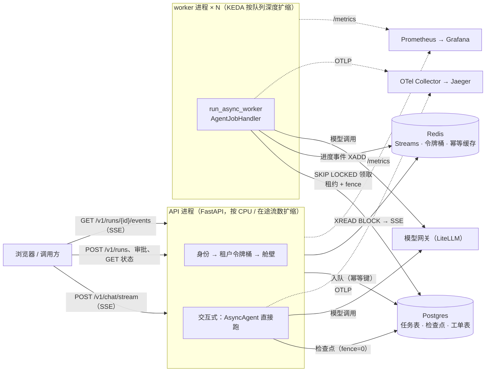
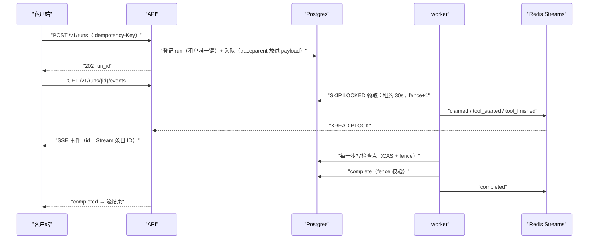
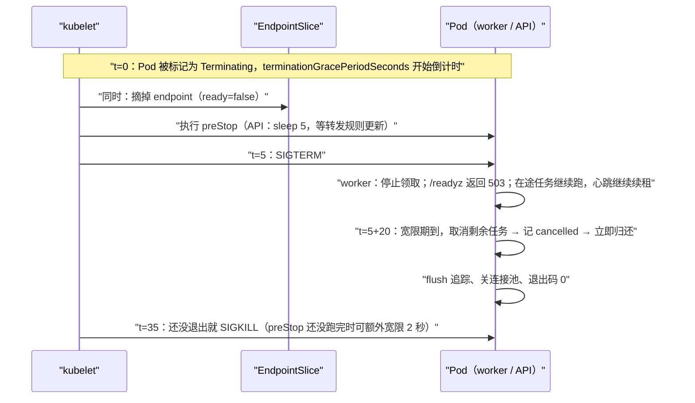

[中文](README.md) | [English](README.en.md)

# 第 31 课：部署与扩缩容 —— 从单机到集群

> 🕐 建议用时：30 分钟 ｜ 🎯 学完你能：把第 26–30 课的组件装成一个能在多进程、多实例下正确运行的 Agent 服务（交互式 SSE + 后台队列 + 审批）；用利特尔法则和队列深度算出副本数；把 `terminationGracePeriodSeconds`、preStop、worker 宽限期、租约这几个时间对齐；设计压测和故障注入，并逐项证明"没有重复副作用、取消真的停下、指标和数据库对得上" ｜ 📦 对应源码：[`production/`](../../production/__init__.py)（[`service/api.py`](../../production/service/api.py)、[`service/worker.py`](../../production/service/worker.py)、[`service/runtime.py`](../../production/service/runtime.py)、[`run_local.py`](../../production/run_local.py)、[`loadtest.py`](../../production/loadtest.py)、[`deploy/`](../../production/deploy/Dockerfile)），测试 [`production/tests/`](../../production/tests/test_e2e.py)
>
> 📖 必读：[Kubernetes best practices: terminating with grace](https://cloud.google.com/blog/products/containers-kubernetes/kubernetes-best-practices-terminating-with-grace)（Sandeep Dinesh, 2018）—— 用一页讲清 Pod 被删除时的完整时间线：preStop、SIGTERM、宽限期、SIGKILL，以及"摘流量"和"停进程"为什么是并行发生的。读完再看本课问题卡片 3 的时间线图，每个数字都能对上。

## 0. 一句话讲清楚

**扩缩容的难点不在"多起几个进程"，而在"进程随时会被杀、会被替换、会被取消"时，系统依然不丢任务、不重复副作用、不白花钱。所以本课的交付物不是讲义，而是一个参考服务，外加一套能把它打到出错的压测和故障注入。**

先诚实说明教学版的局限：`agentkit` 是单进程的。[第 12 课](../12_production_architecture/README.md)画了参考架构，[第 13 课](../13_distributed_concurrency/README.md)用 SQLite 讲清了租约和 fencing，[第 16 课](../16_release_ops/README.md)讲了灰度和回滚，第 26–30 课把每个组件换成了成熟实现。但没有任何一课把它们**装在一起、跑在多个进程里、再故意杀掉几个**。这一步最容易出问题：每个组件单独测试都对，组合起来却出现了四个单独测试发现不了的问题（第 3.6 节），其中三个在框架里，维护者已经修复并加了回归测试。

打个比方：前几课造好了发动机、变速箱、刹车，各自在台架上测过。这一课把车装起来上路，还要在高速上故意爆一次胎。

| 能力 | 组件出处 | 本课怎么装进服务 | 证据（第 3 节） |
|---|---|---|---|
| 多进程共享的检查点、队列 | 第 26 课 Postgres | API 和 3 个 worker 进程共用一个库；fence 来自全局序列 | kill -9 后任务被接手：e2e 里 3.2–3.8 秒完成（租约 3 秒） |
| 异步运行时、流式、取消 | 第 30 课 `AsyncAgent` | 交互式 SSE 在 API 进程里跑，断开即取消 | 70 次断开全部记为 `cancelled`；断开到落盘约 30 毫秒 |
| 幂等 | 第 08、26 课 | Redis 幂等缓存 + 工单表 `UNIQUE (tenant_id, idempotency_key)` | 372 张工单与调用一一对应，3 次重放被唯一约束挡住 |
| 限流、舱壁 | 第 26、30 课 | 按租户的 Redis 令牌桶（429 + `Retry-After`）+ `KeyedLimiter` | 吵闹租户 571 次提交中 510 次 429，其他租户 0 次 |
| 追踪、指标 | 第 28 课 | traceparent 跟着任务穿过队列；Prometheus 多进程汇总 | API 与 worker 的 span 在同一条 trace；5 项指标和数据库完全一致 |
| 策略、护栏、网关 | 第 29 课 | Cedar 判定审批、正则分类器拦输入、LiteLLM Router 接模型 | 审批双击 149 次全部只入队一次 |

## 1. 教学实现为什么不够：从"跑通"到"扛住"

### 1.1 参考服务全景



规则只有一条：**进程里不放任何"丢了就找不回来"的东西**。对话状态在 Postgres 检查点里，任务在 Postgres 队列里，进度事件在 Redis Streams 里（丢了只影响进度条，不影响结果）。所以任何一个进程都可以随时被杀掉、被替换。

### 1.2 两种交互模式：什么时候用哪个

| | 交互式 `POST /v1/chat/stream` | 后台任务 `POST /v1/runs` |
|---|---|---|
| 谁执行 | 接请求的 API 进程直接跑 `AsyncAgent` | 入队，由 worker 领取执行 |
| 返回 | SSE 逐字推送，读到 `done` 结束 | 立刻返回 `run_id`；进度走 `/events`，结果走 `GET /v1/runs/{id}` |
| 客户端断开 | **取消运行**，检查点记 `cancelled`（省钱）；可以 `POST /resume` 交给 worker 接着跑 | 运行照常进行，重连带 `Last-Event-ID` 接着收事件 |
| 进程被杀 | 这次对话中断，客户端重试或 resume | 租约过期后别的 worker 从检查点接手 |
| 首字延迟 | 最低（没有排队） | 多一次排队（实测空闲时 p50 约 20 毫秒） |
| 适用 | 聊天、秒级到几十秒的问答 | 分钟级任务、需要审批的操作、批处理、不能白跑的流程 |

两种模式共用同一套检查点和工具：交互式运行暂停等审批时，审批通过后由 worker 继续跑。**交互式只是"在 API 进程里跑第一段"，并不是另一套系统。**

### 1.3 一次后台运行的一生



## 2. 参考服务怎么搭（`production/`）

### 2.1 目录与启动

| 文件 | 作用 |
|---|---|
| [`service/config.py`](../../production/service/config.py) | 12-factor：全部配置来自环境变量，启动时校验（例如心跳必须 ≤ 租约的一半），出错就失败 |
| [`service/runtime.py`](../../production/service/runtime.py) | API 和 worker 共用的装配：连接池、Redis、模型、工具、Hook、检查点、队列、事件 |
| [`service/api.py`](../../production/service/api.py) | FastAPI：交互式 SSE、后台任务、审批、`/healthz`、`/readyz`、`/metrics` |
| [`service/worker.py`](../../production/service/worker.py) | `run_async_worker` + `AgentJobHandler`，停机归还、健康探针 |
| [`service/backend.py`](../../production/service/backend.py)、[`tools.py`](../../production/service/tools.py) | IT 服务台的业务表和工具（全部在 Postgres 里，多进程共享） |
| [`run_local.py`](../../production/run_local.py) | 本机无 Docker 一键启动：嵌入式 Postgres + fakeredis + 1 个 API + N 个 worker |
| [`loadtest.py`](../../production/loadtest.py) | 压测、故障注入、逐项验证 |
| [`deploy/`](../../production/deploy/docker-compose.yml) | Dockerfile、docker-compose、Kubernetes 清单（本机未用 Docker 启动，见 2.7） |

```bash
python production/run_local.py                          # 离线剧本模型，3 个 worker；打印地址、演示 key、curl 示例
python production/loadtest.py --users 20 --duration 60  # 压测 + kill -9 + 滚动重启 + 验证
.venv/bin/python -m pytest production/tests             # 21 个测试，约 19 秒
```

### 2.2 身份、限流、舱壁

- **身份**：API key → (租户, 用户, 角色, 套餐)。配置里只存 key 的 SHA-256。代码注释里写明：**生产应当由网关验证 JWT，再把身份注入请求头**，本服务不自己解析 token。身份进入 `RunState.metadata`，工具通过 `ToolContext` 拿到，模型填不了；worker 侧 `AgentJobHandler` 还会用任务上的 `tenant_id` 覆盖 payload。
- **租户隔离**：别的租户的 run 一律返回 404（不是 403），连"存在"都不透露。e2e 测试还伪造了一个"globex 恢复 acme 的 run"的任务直接塞进队列，worker 以 `PermanentJobError` 拒绝。
- **限流**：按租户的 `AsyncRedisTokenBucket`，所有 API 副本共享一个桶；超限返回 429 和 `Retry-After`。Redis 不可用时 **fail open**（放行并计数）：限流器是保护手段，不能让 API 跟着 Redis 一起挂。合同额度这类必须 fail closed 的限额放在网关（[第 29 课](../29_gateway_and_guardrails/README.md)）。
- **舱壁**：交互式流用 `KeyedLimiter` 限制每个租户在本进程里同时打开的流数。槽位在一个 `scope="request"` 的 yield 依赖里申请和释放，所以一直占到 SSE 结束（包括断开）。拿不到槽位立刻 429，不排队。

### 2.3 进度事件：为什么选 Redis Streams

| 候选 | 客户端晚到 / 断线重连 | 代价 | 结论 |
|---|---|---|---|
| Redis Pub/Sub | 发布时没人订阅，事件就丢了（官方文档：at-most-once） | 最简单 | 不适合"先提交、后打开进度页" |
| Postgres `LISTEN/NOTIFY` | 只投递给正在 LISTEN 的会话；每个监听者占一个专用连接；PgBouncer 事务池模式不支持 LISTEN；payload 默认小于 8000 字节 | 不用多一个组件 | 适合"通知 worker 有新任务"，不适合做事件历史 |
| **Redis Streams** | 事件按 ID 保存（`MAXLEN ~` 近似截断 + 过期），SSE 的 `Last-Event-ID` 直接当 `XREAD` 的起点，**重连不丢事件** | 要设上限和 TTL | **本课选用**；fakeredis 的 TCP 服务支持 `XADD` / `XREAD BLOCK`（本机实测，阻塞读不影响其他连接） |

两个细节：阻塞读（`XREAD BLOCK`）会占住一个 Redis 连接，所以用单独的客户端，别把限流、幂等的连接饿死；事件是**尽力而为**的，发布失败只记日志，运行的真实状态永远以 Postgres 为准。

### 2.4 worker：每个任务发生了什么

1. `continue_trace(payload["trace"])` 接上 API 那条 trace，外面包一个 CONSUMER span（[第 28 课](../28_production_observability/README.md)问题 6 的方案 B）。
2. `AgentJobHandler` 把**进程里唯一的** `AsyncAgent` 和带本次 fence 的检查点视图组合起来（第 26 课最新版的推荐用法：共用 Agent、执行器、模型客户端，每次调用传 `checkpointer=`）。
3. Hook 依次是：`OTelTracer` → 输入护栏 → `PrometheusHook` → `AsyncRateLimitHook`（Redis 令牌桶，等不到就 `rate_limited` → `RetryLater`）→ `CedarPolicy`（高危工具暂停等审批）→ 事件推送。
4. 写工具的幂等分两层：Redis 幂等缓存（省一次调用）+ 工单表的唯一约束（兜底）。每次副作用尝试都记一行 `side_effect_attempts`，压测后能证明"重放发生过，而且被挡住了"。
5. **停机时主动归还**：宽限期到了还没做完的任务被取消，`AsyncAgent` 把检查点记为 `cancelled`（写工具保持未回答），worker 立刻 `release`，别的 worker 马上接手，用同一个 call_id 重放。`run_async_worker` 默认"不提交、不归还、等租约过期"，那样更保守但更慢；归还带 fence 校验，所以是安全的。归还不消耗重试次数（e2e 断言 `attempts` 仍为 1）。
6. **fence**：每次领取都从整张队列表共用的序列里取一个新值（`nextval`，全局单调），所以同一个 run 后来的任务（审批后的 resume、用户点"继续"的 resume）一定能接管检查点。写这节课时 fence 还是按任务各自计数，服务里曾经用换算绕开，框架修复后绕行已删除（3.6 的发现 2）。

### 2.5 健康检查与指标

- API：`/healthz` 只说明进程和事件循环活着，**不查数据库**。数据库一抖，所有 Pod 的 liveness 一起失败、被一起重启，小故障就变成全站故障。`/readyz` 查 Postgres 和 Redis，失败时只摘流量不重启。K8s 文档对两者的区分是：liveness 只看应用本身是否健康，readiness 还要检查它依赖的后端服务是否可用。
- worker：`/healthz`、`/readyz` 由**事件循环自己**应答（一个 30 行的 asyncio TCP 服务）。同步代码把事件循环卡死时应答超时，liveness 失败就重启。`/metrics` 由 prometheus_client 在另一个线程里提供，事件循环卡死时它照样返回 200，所以**不能拿它当 liveness**。停机排空时 `/readyz` 返回 503。
- 指标：`PrometheusHook` 负责 Agent 级指标，服务自己再补 HTTP 请求数、429（按层）、SSE 连接数、worker 任务事件，以及"被依赖库吞掉、由框架补抛的取消"次数（`itdesk_swallowed_cancellations_total`，由一个日志 Handler 统计框架打出的 warning）。本机多进程用 prometheus_client 的多进程模式汇总：计数器写在共享目录的 mmap 文件里，**进程被 kill -9 之后计数也不丢**（本课实测）；进程退出后由 `run_local` 调 `mark_process_dead` 清掉它的 live gauge。K8s 里每个 Pod 一个进程，由 Prometheus 分别抓取，`rate()` 处理重启后的归零。

### 2.6 12-factor 配置

所有可变项都是环境变量，见 [`production/.env.example`](../../production/.env.example)（只有占位符）。同一个镜像在 dev、staging、prod 之间只换 ConfigMap 和 Secret。几条会在启动时校验：心跳 ≤ 租约的一半；`LLM_BACKEND` 只能是 `litellm`、`openai`、`scripted`。离线模式注入带延迟和抖动的 `AsyncScriptedLLM`（每次调用 300 ms ± 30%），它的 responder 只看"最后一条用户消息"和"之后走了几轮工具"，所以同一个 run 在另一个 worker 上 resume 时，会从断点接着给出下一步。

### 2.7 部署配置（`deploy/`）：本机没有 Docker，如实说明

| 文件 | 内容 | 验证方式 |
|---|---|---|
| [`Dockerfile`](../../production/deploy/Dockerfile) | 两阶段构建；非 root（UID 10001）；exec 形式的 CMD（进程直接收到 SIGTERM）；**基础镜像用 Python 3.12**（原因见 3.6 的发现 3）；同目录的 `Dockerfile.dockerignore` 排除 `.env` | 静态检查（多阶段、USER、ignore 文件） |
| [`docker-compose.yml`](../../production/deploy/docker-compose.yml) | postgres（`pgvector/pgvector:pg16`）、redis、otel-collector（**直接挂载第 28 课的配置**，再叠一个覆盖文件）、jaeger（网络别名 `tempo`，所以第 28 课的导出地址不用改）、prometheus（挂载第 28 课的 SLO 规则）、grafana（自动加载第 28 课的看板）、litellm（**挂载第 29 课的配置**）、migrate、api、worker（3 个副本） | pyyaml 解析 + 引用的本地文件都存在 |
| [`k8s/`](../../production/deploy/k8s/kustomization.yaml) | api 的 Deployment、Service、HPA、PDB；worker 的 Deployment、PDB；KEDA `TriggerAuthentication` + `ScaledObject`（postgresql scaler）；ConfigMap；只有占位符的 Secret；迁移 Job | pyyaml 解析 + 交叉检查（三个时间对齐、探针、资源、非 root、KEDA 目标值与并发匹配、没有真实密钥） |

**这些文件没有在真实的 Docker 或 Kubernetes 上启动过。** 字段名按 2026-09 的官方文档核实（Kubernetes 1.37、KEDA 2.21、Docker Compose 规范），[`test_deploy_configs.py`](../../production/tests/test_deploy_configs.py) 做了能做的静态检查。上线前请在自己的集群里跑一遍 `kubectl apply --dry-run=server -k production/deploy/k8s`。本机实测走的是 `run_local.py`：同一套代码，基础设施换成嵌入式 Postgres（pgserver，真正的 Postgres 16，但单机、没有复制）和 fakeredis（Python 实现的 Redis 协议服务，不模拟持久化、主从切换和集群分片，吞吐也远低于真 Redis）。

## 3. 动手：运行 Demo 与压测（全部是实测数字）

```bash
python lessons/31_deployment_and_scaling/demo.py --offline   # 离线：12 个用户 × 20 秒 + 故障注入，约 30 秒
python lessons/31_deployment_and_scaling/demo.py             # 真实模型：2 个 worker × 并发 1，十几次模型调用
python production/loadtest.py --users 20 --duration 60 --json report.json
```

### 3.1 测量环境

Apple M1（8 核）、8 GB 内存、macOS 14.4.1、CPython 3.11.7；fastapi 0.141.1、uvicorn 0.54.0、starlette 1.7.0、psycopg 3.3.6、psycopg_pool 3.3.3、redis-py 8.1.0、fakeredis 2.38.0、pgserver 0.1.4（Postgres 16.2）。**如实说明**：所有进程（Postgres、fakeredis、API、3–5 个 worker、压测客户端）挤在同一台机器上，同时还有别的任务在跑，开始时 load average 在 4.4 到 10.4 之间（每张表都注明了当时的负载）。离线模型每次调用 300 ms ± 30%，诊断工具 1.5 秒，建单的下游响应 400 ms；本机的租约 6 秒、宽限期 1 秒（比生产短得多，为了让故障注入的效果在一分钟内看得见）。压测是**闭环**的：每个用户等上一个请求结束才发下一个（局限见问题卡片 6）。

### 3.2 端到端测试：21 个，约 19 秒

[`production/tests/`](../../production/tests/test_e2e.py) 起的是**真实进程**：1 个 uvicorn API、3 个 worker、嵌入式 Postgres、fakeredis。每条测试都用状态来证明，而不是"跑通就算"。

| 场景 | 怎么证明 | 实测 |
|---|---|---|
| 后台任务全流程 + 审批 | 批准前不执行；员工自己不能审批；审批人同时点两次，两个请求都返回 202，任务表里只有一个 resume | 通过 |
| run 任务被接手后再审批 | 测试扮演一个"领了任务就崩溃"的 worker，真 worker 以更大的 fence 接手；之后的 resume 任务必须第一次领取就接手（fence 更大、`attempts=1`、没有 `ownership_lost`） | 审批到完成 0.91 s（框架修复前要多等一个租约，见 3.6） |
| SSE 断开 → 取消 | 读到 `run_diagnostics` 开始就断开；检查点记为 `cancelled`，再等 1.5 秒也没有建单；`POST /resume` 后由 worker 跑完，恰好一张单 | 断开到落盘 26–31 ms（多次运行） |
| worker 被 kill -9 | 建单工具已经插入工单、正在等下游时 kill -9；另一个 worker 以更大的 fence 接手 | 3.2–3.8 秒完成（租约 3 秒）；工单 1 张，`side_effect_attempts` 为 inserted 1、deduplicated 1 |
| 滚动重启 | 3 个旧 worker 在"正在建单"时依次收到 SIGTERM（宽限期 0.3 秒 < 下游耗时 0.8 秒） | 全部退出码 0；被取消的任务立即归还、被接手重放、被唯一约束去重；每个运行恰好一张单；`attempts` 仍为 1 |
| 租户隔离 | 别的租户读 run、读事件、审批都是 404；伪造的跨租户任务被 worker 拒绝 | 通过 |
| 限流 | 吵闹租户连发 6 个，至少 3 个 429 且带 `Retry-After`；同一租户第 3 条交互式流 429 | 通过 |
| 跨队列 trace | 客户端带 traceparent；API 的 PRODUCER span 和 worker 的 CONSUMER span 在同一条 trace 里，父子关系正确，而且跨了进程 | 通过 |

另有 8 个部署配置检查、4 个取消测试（3.6 的发现 3）。

### 3.3 压测 + 故障注入（主场景）

20 个用户压 60 秒，3 个 worker × 并发 8。35% 处对手上任务最多的 worker 发 kill -9，并补一个新的；65% 处滚动重启一个：先起新的，就绪后给旧的发 SIGTERM。下面是框架修复（第 7 节）之后的重测，开始时 load average 6.7。

| 类型 | n | 成功 | p50 | p95 | p99 | 首字 p50 | 排队 p50 |
|---|---|---|---|---|---|---|---|
| 交互式问答（SSE 读到 done） | 373 | 373 | 0.64 s | 0.76 s | 0.78 s | 0.63 s | — |
| 交互式中途断开 | 70 | 70 | 0.32 s | 0.40 s | 0.44 s | — | — |
| 后台建工单 | 216 | 216 | 1.05 s | 1.18 s | 1.22 s | — | 0.02 s |
| 后台长任务（诊断 + 建单） | 156 | 156 | 3.49 s | 3.73 s | **9.26 s** | — | 0.02 s |
| 后台重置密码（等审批 → 双击批准 → 完成） | 149 | 149 | 1.09 s | 1.24 s | 1.26 s | — | 0.02 s |
| 吵闹租户提交（配额 1 个/秒） | 571 | 61 | — | — | — | — | — |

总计 1535 个请求，吞吐 24.2 请求/秒，错误率 0%，429 占 33.2%（**全部**来自吵闹租户）。故障注入时间线：

| 时刻 | 事件 | 结果 |
|---|---|---|
| 21.0 s | kill -9 worker-1，它手上有 6 个任务 | 1.4 秒后替补就绪；这 6 个任务在租约（6 秒）过期后被接手。长任务的 p99 从 p50 的 3.5 秒拉到 9.3 秒，多出来的就是"等租约" |
| 40.6 s | SIGTERM worker-0（手上 6 个任务） | 1.09 秒内退出，退出码 0：2 个在宽限期内做完，4 个被取消 → 立即归还 → 被接手 |

验证（压测结束后直接查 Postgres + 读 `/metrics`）：

| 检查 | 结果 |
|---|---|
| 所有运行到达终态或可解释的状态 | ✅ 955 个 completed，70 个 cancelled（全部是客户端断开的） |
| 没有重复副作用：每个 `create_ticket` 调用恰好对应一张工单 | ✅ 372 张工单、372 次插入；**3 次重放被唯一约束挡住** |
| 断开的交互式运行在检查点里记为 `cancelled` | ✅ 70/70 |
| 指标与实际数量一致 | ✅ completed 955=955、成功任务 731=731、暂停 149=149、cancelled 段 74=74（70 断开 + 4 停机取消）、429 510=510 |
| 没有任务进入死信 | ✅；领取事件比任务数多 10 次（kill -9 后回收 6 个、停机归还 4 个，都被重新领取） |

审批双击 149 次，149 次都只入队一个 resume。框架修复前的同一场景（load average 4.4）数字几乎一样：1522 个请求、24.0 请求/秒、长任务 p99 9.68 秒，5 项验证全部通过。

### 3.4 容量：利特尔法则的实测

同一个负载（24 个用户，30 秒，不注入故障），只改 worker 数：

| 配置 | worker 名额 L | 平均服务时间 W | 预测饱和吞吐 L/W | 实测 | 名额利用率 | 后台排队 p50 | 建单端到端 p50 |
|---|---|---|---|---|---|---|---|
| 1 个 worker × 并发 4 | 4 | 1.14 s | 3.52 段/秒 | **3.47 段/秒** | 99% | **7.30 s** | 8.21 s |
| 3 个 worker × 并发 4 | 12 | 1.27 s | 9.49 段/秒 | **8.86 段/秒** | 93% | 0.97 s | 1.98 s |

"段"是 worker 的一次领取到结束（审批流程有两段）。W 是从事件流里量出来的：`claimed` 到这一段结束事件的时间差。

**怎么读**：只有 1 个 worker 时，名额利用率 99%，吞吐几乎正好等于 L/W，多出来的请求全部变成排队：p50 等 7.3 秒才被领取。这就是利特尔法则在队列前面的样子：**吞吐被 L/W 封顶，超出的需求变成排队时间**。同一时刻交互式问答的 p50 一直是 0.62 秒，因为它在 API 进程里跑，不经过队列。所以扩缩容信号要分开：API 看在途流数和 CPU，worker 看队列深度和排队时间（问题卡片 2）。

### 3.5 瓶颈在模型配额时

把每个租户的模型调用速率压到 4 次/秒（`--env LLM_RATE_PER_SEC=4 --env LLM_BURST=4`），其他不变（3 × 4）。框架修复后重测，开始时 load average 10.4（机器很忙，延迟偏高）：

| 类型 | 成功 / 总数 | p50 | p95 | 说明 |
|---|---|---|---|---|
| 交互式问答 | 35 / 57 | 1.70 s | 3.86 s | 22 个等了约 2 秒还拿不到令牌，以 `rate_limited` 结束（对用户是错误） |
| 后台建工单 | 35 / 35 | 5.52 s | 13.95 s | 全部完成；后台任务一共被推迟 73 次（`RetryLater`：回到队列，不占 worker） |
| 后台长任务 | 18 / 18 | 12.22 s | 25.48 s | 全部完成。修复前同样的负载下有 1 个以 `max_steps` 结束：**推迟会消耗步数**（3.6 的发现 4，已在框架修复） |

同样是"变慢"，原因完全不同：3.4 的瓶颈在 worker 名额（排队 7 秒，加 worker 就好）；这里 worker 名额利用率 88%，可是任务大部分时间在等令牌，加 worker 没用，要去网关要配额，或者给交互式流量留出保底配额。练习 (c) 就是把这种判断写成代码。

### 3.6 反直觉的发现：单独测都对，装到一起才出现的问题

**发现 1：在 SSE 生成器里做鉴权，别的租户拿到的是"200 + 空流"。** FastAPI 的 SSE 端点是一个生成器，**函数体在响应头（200）发出之后才开始执行**。`GET /v1/runs/{id}/events` 最初在生成器里检查所有权，e2e 测试发现别的租户拿到的是 200 加一条空流，而不是 404。修法：所有权检查放进依赖（`Depends(visible_run)`），依赖在响应开始之前执行。

发现 2、3、4 在框架里，已经报告给维护者并在框架层修复，服务里原来的绕行随之删除。下面每一条都按"现象 → 根因 → 修复 → 回归测试 → 复测"记录，汇总见第 7 节。

**发现 2：fence 的作用域和被保护的资源不一致，审批后的 resume 会被当成"旧持有者"拒绝（已在框架修复）。**
- 现象：压测日志里，run 任务被 kill -9 后以 fence=2 接手，检查点的 fence 变成 2；之后审批产生的 resume 任务从 fence=1 开始，加载检查点时被拒绝（`CheckpointConflict`）。`run_async_worker` 把它当成"所有权已转移"，什么都不提交，任务留在 leased，要等一个租约过期、重新领取把 fence 数到 2 才成功。这次多等了 6 秒；如果 run 任务被接手的次数超过 `max_attempts`，resume 任务会直接进死信，审批就丢了。
- 根因：队列的 fence 是**每个任务**各自从 1 数起的（`fence = fence + 1`），检查点的 fence 却保护**整个 run**，而同一个 run 会先后有好几个任务。
- 修复（`agentkit/contrib/postgres.py`）：领取时 `fence = nextval('<表名>_fence_seq')`，整张队列表共用一个序列，全局单调；`setup()` 建序列，从旧表升级时序列从已有的最大 fence 往后发。
- 回归测试：`test_fence_is_global_so_a_later_job_for_the_same_run_can_take_over`、`test_upgrading_from_per_job_fences_continues_after_the_largest_existing_fence`（`tests/contrib/test_postgres.py`）。
- 服务侧：删掉了原来的绕行（`RunScopedFences` 把 fence 换算成 `job_id × 10^6 + job.fence`，以及把这类冲突判为"被取代"的特殊处理），worker 直接用 `job.fence`。
- 复测：e2e 的 `test_approval_resume_is_not_refused_after_the_run_job_was_taken_over` 构造同样的场景，resume 任务第一次领取就接手（`attempts=1`，fence 比接手的 run 任务大），审批到完成 0.91 秒（租约 3 秒）；主场景压测没有出现 `ownership_lost`。

**发现 3：取消被依赖库吞掉了，用户关了页面，工单照样建了（已在框架修复）。**
- 现象：修复前的二十多次压测（合计约 540 次断开）里，出现了 5 次"客户端已断开，运行却跑完了"，约 1%。日志显示服务端 1 毫秒内就发现了断开、也取消了运行，可运行还是跑完了。
- 根因：用 `Task.cancelling()` 在每个 Hook 边界打点，定位到取消是在 `AsyncRateLimitHook` 调 Redis 时丢的：redis-py 8.1.0 每条命令都经过 `send_packed_command` → `asyncio.wait_for`。Python 3.12 之前的 `asyncio.wait_for` 有已知竞态（[CPython gh-86296](https://github.com/python/cpython/issues/86296)）：被等待的东西刚好完成、外部取消又在同一轮事件循环到达时，它返回结果，把取消吞掉。3.12 用 `asyncio.timeout` 重写了 `wait_for`（[gh-96764](https://github.com/python/cpython/issues/96764)），但没有回移到旧版本。本机 3.11.7 上的微基准：在 redis-py 命令进行中取消，**约 20%–25% 被吞掉**；psycopg_pool 3.3.3 在"等连接"时交接连接和取消同时发生，**20/20 被吞掉**（它的 `ACondition.wait_timeout` 也用 `asyncio.wait_for`）。`agentkit.aio` 自己已经换成取消安全的 `wait_for`，但管不了依赖库。
- 修复（`agentkit/aio/agent.py` 的 `_raise_if_cancel_swallowed`）：进入运行时以 `Task.cancelling()` 为基线，在"调用模型前（`before_llm` 之后）"和"执行工具前（`before_tool` 之后）"检查，计数比基线大就说明有人吞了取消，补抛 `CancelledError` 并打一条 warning；`run_timeout` 的取消被吞时也会补抛，最后仍记为 timeout。3.10 没有 `cancelling()`，检查自动关闭。
- 回归测试：`test_cancel_swallowed_by_a_dependency_is_re_raised_before_side_effects[llm/tool]`、`test_run_timeout_swallowed_by_a_dependency_still_times_out`（`tests/test_aio.py`）。
- 服务侧：删掉了原来的 `CancellationFence` Hook（它做的就是同一件事，外加一个进程内的"已放弃"登记，现在都由框架负责）。服务只保留两件事：生产镜像用 Python 3.12+（Dockerfile），从根上避开这个竞态；一个日志 Handler 把框架的 warning 记成指标 `itdesk_swallowed_cancellations_total`，**不为 0 就说明有依赖在吞取消**。[`test_cancellation.py`](../../production/tests/test_cancellation.py) 保留了两个依赖库的复现，另有一对对照测试：同一个"会吞取消"的 Hook 下，有框架检查时运行停在下一个步骤边界、工单没建、指标加一；把检查换成空函数时运行跑完、工单照样建了。
- 复测：修复后 7 次压测（主场景、demo、4 次短压测、配额压测）共 180 次断开，全部记为 `cancelled`，指标都是 0（约 1% 的竞态，这个样本量下没遇到并不意外）；专门的断开风暴 400 次（读到第一个工具结果就断开）全部 `cancelled`，框架补抛了 1 次。另外说明一处更正：本节旧版写过"服务侧闸门补上了 2 次"，那个计数把"登记为已放弃"也算进去了，其中可能包含"登记先于取消送达"的正常顺序，不能都算作被吞掉的取消；现在的指标只统计 `cancelling()` 真的变大的情况。

**发现 4：被限流推迟也会消耗 `max_steps`（已在框架修复）。**
- 现象：3.5 的压测里有 1 个长任务以 `max_steps` 结束。复现：`max_steps=3`，限流 Hook 连续拒绝 3 次，第 4 次恢复时直接以 `max_steps` 结束，模型一次都没调用过。
- 根因：`AsyncAgent` 在循环开头就 `state.step += 1`，`before_llm` 里的限流 Hook 抛 `StopRun("rate_limited")` 时，这一步没调模型也被算上了；配合 `AgentJobHandler` 的 `RetryLater`，每推迟一次就烧掉一步。
- 修复（`agentkit/agent.py` 与 `agentkit/aio/agent.py`）：`state.step += 1` 挪进 `_call_llm`，放在 `before_llm` 和 `visible_tools` 之后、真正调用模型之前。被 Hook 叫停的那一步不计数。
- 回归测试：`test_deferred_steps_do_not_consume_max_steps`（`tests/test_agentkit.py` 与 `tests/test_aio.py` 各一个）。
- 复测：同样的配额压测里，后台任务被推迟 73 次（比修复前的 52 次还多），长任务 18/18 全部完成，没有 `max_steps`（3.5）。

### 3.7 真实模型

`demo.py`（不加 `--offline`）：2 个 worker × 并发 1，模型经 LiteLLM Router 走本地网关（gpt-5.5），模型并发不超过 2。4 个后台任务，第一个任务开始 1 秒后 kill -9 它所在的 worker（租约 15 秒）：

| 运行 | 结果 |
|---|---|
| "三楼打印机一直卡纸，帮我提个工单"（被 kill 的那个） | worker-0 领取 → 被杀 → 租约过期后 worker-2 接手（attempts=2）→ completed，共等 19.7 秒，建单 1 张 |
| 另外 3 个 | completed：查知识库并引用 [KB-003]、识别出已知故障 INC-2041、报修建单 1 张 |
| 交互式流 | 总耗时 8.37 s，首个文本片段 5.78 s |
| 交互式中途断开 | 检查点 `cancelled` |

5 项验证全部通过：2 张工单与 2 次 `create_ticket` 调用一一对应，指标与数据库一致。真实模型的延迟以秒计，本机的 30 秒压测数字不能直接外推；外推方法见问题卡片 2 和 6。

## 4. 企业问题卡片

### 问题 1：部署形态 —— 单体、API 与 worker 分离、serverless、托管 Agent 平台

**场景**：IT 服务台 Agent 要上线。白天高峰每秒 50 个请求，大部分是 5–10 秒的问答；少数是要跑几分钟、还要等人审批的操作（重置密码、开通权限）。团队 6 个人，已经在用 Kubernetes。

**为什么难**：交互式问答要的是低延迟和"断开就停"，长任务要的是"进程死了也不丢"。两者对扩缩容信号、超时、发布方式的要求正好相反，塞进一个进程里，就会互相拖累。

| 方案 | 怎么做 | 优点 | 缺点 | 适用规模 | 运维成本 |
|---|---|---|---|---|---|
| A. 单体 | 一个进程既接请求又跑 Agent，长任务在请求里跑 | 最简单；本地调试方便 | 长任务占着 HTTP 连接，被代理超时切断；发布会中断所有在途任务；扩缩容只有一个信号 | 原型、内部小工具 | 低 |
| B. API 与 worker 分离（本课） | API 跑交互式和入队，worker 从队列领任务；各自扩缩 | 交互式延迟低；长任务可恢复、可重试；按队列深度扩 worker；发布互不影响 | 多一套队列和状态存储；后台模式多一次排队 | 从几十到几千并发的主流选择 | 中 |
| C. Serverless 函数 | 每个请求一个函数实例（Lambda、Cloud Run） | 按量付费，缩到 0；不管机器 | Lambda 一个执行环境同时只处理一个请求，进程内的 asyncio 并发帮不上忙（[第 30 课](../30_async_runtime/README.md)）；最长 15 分钟；Python 原生不支持响应流式；客户端断开后函数不停止、照样计费。Cloud Run 支持单实例并发（默认 80，最多 1000）和流式，但请求超时最长 60 分钟，停机只给 10 秒 | 突发、低频、无状态的轻任务 | 低 |
| D. 托管 Agent 平台 | Amazon Bedrock AgentCore Runtime、Google Gemini Enterprise Agent Platform 的 Agent Runtime、Microsoft Foundry Agent Service 的 hosted agents、Claude Managed Agents（beta） | 会话隔离（AgentCore：每个会话一个 microVM，最长 8 小时；Foundry：每个会话一个 VM 沙箱）、托管记忆和追踪；等待 I/O 时不按 CPU 计费（AgentCore） | 平台绑定；审批、幂等、租户隔离这些业务语义还得自己做；可观测性和成本要接回自己的体系 | 团队小、不想运维基础设施；合规允许数据出域 | 低到中 |

**怎么选**：有 Kubernetes、有长任务、有审批，选 B。流量小、全是短问答时，A 或 C 就够；在 C 上跑长任务，要配持久化执行（AWS 的 Lambda durable functions 用检查点和重放，最长可以跑一年；或者 [第 27 课](../27_durable_workflows/README.md)的 Temporal）。D 适合"把 Agent 运行时外包"，但第 26–29 课的业务语义不会因此消失。

**本课实现**：B。交互式和后台共用检查点、工具、审批，交互式只是"在 API 进程里跑第一段"。长流程要跨天审批、要编排多个子流程时，把 worker 换成 Temporal worker（[第 27 课](../27_durable_workflows/README.md)）：API 不变，只是"入队"变成"启动 workflow"，"审批"变成 Signal。

### 问题 2：扩缩容信号 —— CPU、QPS、队列深度、在途并发、成本

**场景**：worker 按 CPU 70% 扩缩。早高峰队列积压到 2000，CPU 却只有 15%，HPA 一个副本都没加；用户等了 10 分钟。

**为什么难**：Agent 的 worker 90% 以上的时间在等模型，CPU 几乎不动（第 30 课实测：推进一个会话自身只花约 0.9 毫秒 CPU）。CPU 不忙，不代表不缺人手。

| 信号 | 怎么用 | 优点 | 缺点 | 适合谁 |
|---|---|---|---|---|
| A. CPU | HPA `Utilization` | 零配置 | 对 IO 密集的 Agent 几乎没有信号 | 只作为 API 的兜底 |
| B. QPS | 请求速率 / 每副本能力 | 直观 | 忽略了每个请求的时长：同样 10 QPS，5 秒和 60 秒的任务要的副本差 12 倍 | 请求时长稳定的服务 |
| C. 队列深度（本课） | KEDA postgresql scaler：`count(leased) + count(可执行的 queued)`，目标 = 并发 × 目标利用率 | 直接对应"缺多少名额"；能缩到 0 | 积压出现之后才反应；要调稳定窗口防抖动 | worker |
| D. 在途并发 | API 的 SSE 连接数、`agent_runs_in_flight`（Pods 指标，经 prometheus-adapter） | 流式服务真正的负载 | 要装自定义指标链路 | API |
| E. 成本 / 配额 | 按租户 token 预算、网关剩余配额决定"扩不扩" | 防止"扩得越多、429 越多、花钱越多" | 不是 HPA 的原生信号，需要自己写控制逻辑 | 配额是瓶颈时（3.5） |

**用利特尔法则算副本数**：L = λ × W。以第 30 课的数字为例：早高峰 λ = 50 个请求/秒，W 取 **p95** 而不是平均值（真实模型单次调用 p50 约 2 秒、最长 3.7 秒，一个任务 3–4 次调用，按 8 秒算），L = 50 × 8 = 400 个同时在跑的运行。每个 worker 并发 16、目标利用率 0.75，也就是每个副本承担 12 个，需要 400 / 12 ≈ 34 个副本。再查三个上限：模型网关配额（400 个在途 × 每 8 秒 3–4 次调用 ≈ 每秒 150–200 次）、数据库连接（34 × `PG_POOL_MAX` 10 = 340，超过默认 `max_connections` 100，要上 PgBouncer）、成本。3.4 节在本机验证了这个公式：1 个 worker × 4 名额时，预测上限 3.52 段/秒，实测 3.47 段/秒。

**怎么选**：worker 用 C（KEDA），API 用 D，A 作兜底，E 作上限。副本数的下限 = 保证一个 Pod 挂掉后还扛得住的数量；上限 = 下游（网关配额、数据库连接）撑得住的数量，**而不是**集群能给多少。

**本课实现**：[`k8s/keda-scaledobject.yaml`](../../production/deploy/k8s/keda-scaledobject.yaml)：`targetQueryValue: 12`（16 × 0.75），`minReplicaCount: 1`（KEDA 默认是 0，保留一个热的，避免第一个任务等冷启动），缩容稳定窗口 300 秒，每分钟最多缩 1 个（每次缩容都会让一个 worker 排空、取消在途任务）。[`api.yaml`](../../production/deploy/k8s/api.yaml) 的 HPA 按 CPU，另附在途流数的 Pods 指标写法。练习 (a) 实现了 HPA 的副本计算和稳定窗口。

### 问题 3：优雅停机与滚动发布 —— SIGTERM、租约、宽限期、preStop、PDB 怎么对齐

**场景**：每次发布都有几十个任务"卡住"几分钟才完成，偶尔还会重复建单。

**为什么难**：Pod 被删除时同时发生好几件事，每件事都有自己的超时，任何一个没对齐，都会变成"没做完就被杀"或者"做了两遍"。



| 时间 | 本课取值 | 和谁对齐 | 没对齐会怎样 |
|---|---|---|---|
| `terminationGracePeriodSeconds` | 35 | ≥ preStop + worker 宽限期 + 收尾时间（K8s 默认 30，**从 preStop 开始计时**） | 排空没结束就被 SIGKILL：任务既没记 cancelled 也没归还，只能等租约过期 |
| preStop | API：`sleep 5`（K8s 1.34 起 GA 的原生 sleep 动作）；worker：无 | 摘流量和 SIGTERM 是**并行**的，要等各节点更新转发规则 | 进程已经不接新连接，负载均衡还在往这里转发，客户端收到连接错误 |
| worker 宽限期 `WORKER_GRACE_SECONDS` | 20 | 覆盖大多数任务（p95），不必覆盖最长的 | 太短：每次发布都取消很多任务，白花一次模型调用；太长：发布慢 |
| 租约 `WORKER_LEASE_SECONDS` | 30（心跳 10） | 与宽限期**无关**：排空期间心跳照常续租；它决定的是**硬崩溃**后多久被接手 | 太短：GC 停顿、网络抖动就被误判为死亡，任务两处同时执行；太长：kill -9 后恢复慢（3.3：p99 被拉到 9.3 秒） |
| uvicorn `--timeout-graceful-shutdown` | 20 | API 的"宽限期"：SSE 长连接最多再给 20 秒 | 到点后被取消：交互式运行记 cancelled，客户端 `POST /resume` |
| PDB `maxUnavailable: 1` | api、worker 各一个 | **只管自愿中断**（节点排空走 Eviction API），不管 Deployment 自己的滚动发布（由 `maxSurge` / `maxUnavailable` 管） | 节点排空时一次驱逐所有 worker |

"租约必须比宽限期长"是一个常见说法，但它只在**排空期间不续租**时成立。`run_async_worker` 在整个排空期间持续续租，所以本课的租约（30）比宽限期（20）长只是巧合。练习 (b) 把这些关系写成了检查函数，区分三种续租方式：持续续租、收到 SIGTERM 就停止续租、从不续租（类似不延长可见性超时的消息队列）。

**怎么选**：按上表从右往左定：先定最长可接受的"硬崩溃恢复时间"（得到租约），再定"发布时最多取消多少任务"（得到宽限期），最后 `terminationGracePeriodSeconds` = preStop + 宽限期 + 收尾余量。滚动发布用 `maxUnavailable: 0` + `maxSurge`，先起新的再停旧的。

**本课实现**：[`k8s/worker.yaml`](../../production/deploy/k8s/worker.yaml) 注释里写了三者的关系，[`test_deploy_configs.py`](../../production/tests/test_deploy_configs.py) 自动检查对齐。worker 在宽限期后**主动归还**被取消的任务（2.4 第 5 点）；e2e 测试证明归还后由别人接手重放，副作用不重复，也不消耗重试次数。

### 问题 4：有状态与无状态 —— 会话粘性还是外部状态？

**场景**：API 有 3 个副本。用户刷新页面，重连到另一个副本，对话"失忆"了；另一个团队的方案是用 cookie 做会话粘性，结果发布时一个副本下线，上面 800 个会话全部中断。

**为什么难**：Agent 的会话天然有状态（对话历史、待审批的操作、执行到第几步）。放在进程内存里最快，但进程随时会被杀。

| 方案 | 怎么做 | 优点 | 缺点 | 适用 |
|---|---|---|---|---|
| A. 进程内状态 + 会话粘性 | 负载均衡按 cookie 或 hash 把同一会话打到同一副本 | 最快；不依赖外部存储 | 副本一挂会话全丢；扩缩容时重新分配会话；负载不均 | 原型；可以接受丢会话的场景 |
| B. 外部状态，进程无状态（本课） | 每一步写 Postgres 检查点，任何副本都能 `resume(run_id)` | 任意副本可替换；发布、扩缩容不丢状态 | 每一步多一次数据库写；写入要做 CAS 和 fence（第 26 课） | **生产默认** |
| C. 外部状态 + 本地缓存 | B + 进程内缓存最近的会话，写穿透 | 读多时省一次查询 | 缓存一致性；多副本同时写同一会话要靠版本号 | 读远多于写的长会话 |
| D. 有状态服务（Actor / Durable Object 类） | 平台保证同一个 key 只在一个实例上，并负责迁移 | 编程模型简单，又不丢状态 | 平台绑定；迁移期间短暂不可用 | 协同编辑、长驻会话 |

**怎么选**：B。唯一"粘"的东西是一条正在进行的 SSE 连接，它天然只存在于一个副本上，断了就取消，重连后按 `run_id` 恢复，或者交给 worker。**不要**为 Agent 服务配置会话粘性：它会让扩缩容和发布都变得危险，而 Agent 的每一步本来就要落盘。

**本课实现**：API 和 worker 进程里只有连接池、线程池、Hook 实例这些"可重建"的东西。一次交互式运行用一个专用的检查点视图（`fenced(0)`，writer 标成 API 实例）；之后任何 worker 任务的 fence 都比 0 大，可以接管它。共享的检查点对象记住的版本号，框架在保存非 running 状态时就丢掉（第 7 节第 5 条，修复前会随 run 数量无限增长）。

### 问题 5：流式与负载均衡 —— SSE 碰上代理超时、缓冲和连接数上限

**场景**：本地 SSE 一切正常；上了 Ingress 之后，前端要么等几十秒一次性收到全部文字，要么 60 秒整被断开，要么同一个浏览器开到第 7 个标签页就卡住。

**为什么难**：SSE 是一条长时间"没写完"的 HTTP 响应，而中间每一跳（CDN、负载均衡、Ingress、服务网格）都有自己的缓冲和超时，默认值都是按"短请求"设计的。

| 一跳 | 默认行为（已核实） | 对 SSE 的影响 | 怎么处理 |
|---|---|---|---|
| nginx / Ingress | `proxy_buffering` 默认 on；`proxy_read_timeout` 默认 60 秒（两次读之间的间隔） | 事件被攒着一起发；60 秒没数据就断开 | 响应头 `X-Accel-Buffering: no`（FastAPI 的 `EventSourceResponse` 自动加）或关掉缓冲；每 15 秒发一行注释心跳（规范建议，FastAPI 自动发） |
| AWS ALB | 空闲超时默认 60 秒，可设 1–4000 秒；HTTP/2 PING 不重置 | 同上 | 心跳；后端 keep-alive 要比 ALB 空闲超时长（AWS 文档：否则可能出现 502）。本课 uvicorn `--timeout-keep-alive 75` |
| GCP 外部 Application LB | 后端服务超时默认 30 秒，计的是**整个响应**（从请求第一个字节到响应最后一个字节） | 流式响应最长只能活 30 秒 | 调大超时；并且服务端主动限制单条流的时长 |
| Envoy | 路由超时默认 15 秒；流空闲超时默认 5 分钟（Istio 默认不设请求超时） | 15 秒断流 | 对流式路由关掉或调大路由超时 |
| 浏览器 | HTTP/1.1 下每个"浏览器 + 域名"最多 6 条 SSE 连接（MDN）；HTTP/2 下并发流数由双方协商 | 多开标签页后新连接挂起 | 走 HTTP/2；一个页面只开一条流 |

**怎么选**：不要假设"连接能一直开着"。本课的做法：(1) 单条 SSE 最长 `SSE_MAX_SECONDS`（默认 600 秒，K8s 配置里 300 秒），到点服务端主动结束，并告诉浏览器 1 秒后重连；(2) 每个事件带 `id`（Redis Streams 的条目 ID），重连时浏览器自动带上 `Last-Event-ID`，从断点接着推；(3) 靠 FastAPI 自动发的 15 秒心跳过空闲超时。

**本课实现**：[`api.py`](../../production/service/api.py) 用 FastAPI 0.141 内置的 `EventSourceResponse`。两个本课踩到的实现细节：鉴权必须放在依赖里（3.6 发现 1）；断开时的取消放在 `scope="request"` 的依赖收尾里做，不依赖生成器何时被回收。

### 问题 6：压测与容量规划 —— 怎么设计、怎么读 p99、瓶颈在哪

**场景**：上线前压测报告写着"平均响应 1.2 秒，QPS 200，通过"。上线第一天，p99 是 40 秒，还伴随大量 429。

**为什么难**：平均值掩盖长尾，而用户感受到的是长尾。一次请求要经过 API、队列、worker、数据库、Redis、模型网关好几层，每一层都可能是瓶颈，瓶颈不同，对策完全不同。

| 做法 | 怎么做 | 优点 | 缺点 |
|---|---|---|---|
| A. 闭环压测（本课 loadtest） | K 个虚拟用户，每人等上一个请求结束再发下一个 | 简单，能模拟"真人在用"；不会压垮系统 | **协调遗漏**（coordinated omission）：系统变慢时用户发得也慢，尾延迟被美化 |
| B. 开环压测 | 按固定到达率发请求，不管上一个是否返回（wrk2、k6 的 arrival-rate 执行器） | 测出的是"这个到达率下的真实尾延迟" | 容易把系统压垮；需要单独的发压机 |
| C. 回放生产流量 | 录制真实请求的时间分布和内容，按比例放大回放 | 最接近真实：请求混合比例、长度分布都对 | 要脱敏；有副作用的请求要打到隔离环境 |
| D. 故障注入下压测 | 压测的同时杀进程、滚动发布（问题 7） | 测出"发布日"和"故障日"的尾延迟 | 结果波动大，要多跑几次 |

**怎么读结果**：
- 看 **p99**，而不只是 p50：3.3 的长任务 p50 3.5 秒、p99 9.3 秒，多出来的正好是租约时长。
- 百分位**只统计成功的请求**：失败的请求往往很快，混进来会让延迟"变好"。
- **429 和错误分开算**：429 是按设计拒绝，要看它落在哪个租户、哪一层。
- 拆耗时，找瓶颈：排队时间占大头 → worker 名额不够（3.4）；在等令牌 → 网关配额（3.5）；在等数据库连接 → 连接池太小（[第 26 课](../26_state_and_queues/README.md)问题 7）；事件循环调度延迟高 → CPU（[第 30 课](../30_async_runtime/README.md)：单核上限约每秒千个会话）。练习 (c) 把这套判断写成了代码。
- **容量规划** = 目标 p95 延迟下的最大吞吐，再乘以安全系数（通常留 30%–50% 余量给突发和故障）；用利特尔法则反推副本数（问题 2）。

**怎么选**：日常回归用 A（本课 loadtest），发布前用 B 测真实尾延迟，大版本用 C，故障演练用 D。压测报告必须写清环境：硬件、负载、模型延迟分布、租约和宽限期。本课 3.1 就是这样写的。

**本课实现**：[`loadtest.py`](../../production/loadtest.py) 统计 p50/p95/p99、首字延迟、排队时间、错误率、429 比例，并用事件流量出服务时间 W，直接给出 L/W 的预测和名额利用率。

### 问题 7：故障注入 —— 演练什么、验证什么

**场景**：团队说"我们有租约、有 fence、有幂等"，但从来没在生产形态下杀过进程。第一次节点故障时发现：任务确实被接手了，可工单建了两张，因为幂等键里带了随机数。

**为什么难**："有这个机制"和"机制在组合起来时有效"是两回事。3.6 的四个问题都是单独测试发现不了、组合起来才出现的。

| 演练 | 怎么做 | 必须验证（不能只看"没报错"） |
|---|---|---|
| 进程硬崩溃 | kill -9 手上任务最多的 worker | 任务在约一个租约后被接手；**副作用恰好一次**（工单 ⇔ 调用一一对应）；fence 拒绝了旧持有者 |
| 滚动发布 | 先起新的，再 SIGTERM 旧的 | 退出码 0、在宽限期内退出；被取消的任务被归还并重放；不消耗重试次数 |
| 客户端断开 | 读到第一个工具结果就关连接 | 检查点记为 cancelled；**后面的工具一次都没执行**；槽位释放 |
| 依赖故障 | Redis 停掉 / Postgres 重启 / 网关返回 5xx | 限流 fail open 并计数；worker 退避而不崩溃；`/readyz` 摘流量但 liveness 不重启 |
| 僵尸 | SIGSTOP 冻结 worker 直到租约过期，再 SIGCONT（[第 26 课](../26_state_and_queues/README.md) demo） | 旧持有者的写入被 fence 拒绝 |
| 配额耗尽 | 把网关或令牌桶配额压低（3.5） | 交互式快速失败并提示；后台任务推迟而不是失败；没有重试风暴 |

**验证方法**：压测结束后**直接查数据库**，不信任何进程的自述。本课的 5 项核对：终态可解释、副作用一一对应、断开即 cancelled、指标等于数据库计数、没有死信。每次演练都跑一遍，任何一项不过就算失败。

**怎么选**：前三项（硬崩溃、滚动发布、断开）每次改动都跑，放进 CI 或发布前检查；依赖故障和僵尸每个版本跑；配额耗尽在容量评审时跑。生产上的混沌工程（Chaos Mesh、AWS FIS）要有止损开关，并且从非高峰、小比例开始。

**本课实现**：`loadtest.inject_faults` 做前两项，e2e 测试覆盖前三项和伪造的跨租户任务；[第 26 课](../26_state_and_queues/README.md) 的 demo 覆盖了僵尸。

### 问题 8：多区域与灾备（简要）

**场景**：主区域故障 2 小时。检查点和任务在主区域的 Postgres 里，备区域能起多少服务、丢多少数据？

先定两个数：**RTO**（从中断到恢复服务，最多能接受多久）和 **RPO**（最多能接受丢失多长时间的数据），定义见 AWS 灾备白皮书。

| 策略（AWS 白皮书的四档） | 做法 | RTO / RPO | 成本 |
|---|---|---|---|
| 备份与恢复 | 定期备份 Postgres，故障时在备区域恢复 | 小时级 / 小时级 | 低 |
| 指示灯（pilot light） | 备区域数据库做只读副本，应用不运行 | 几十分钟 / 分钟级 | 中 |
| 温备（warm standby） | 备区域缩小规模地一直运行 | 分钟级 / 秒到分钟级 | 中高 |
| 多站点双活 | 两个区域同时服务 | 接近 0 | 高；Agent 场景要解决同一个 run 在两个区域被同时执行的问题 |

Agent 服务要额外考虑：(1) **真相只在 Postgres**：Redis 里的令牌桶、幂等缓存、进度事件丢了可以重建，不必跨区域复制；(2) 异步复制下切换，可能丢掉最后几秒的检查点，恢复后会重放写工具，所以**下游的幂等键必须跨区域有效**（工单系统本身按幂等键去重）；(3) fence 和任务 id 必须在切换后继续单调递增，否则旧区域恢复时，它的 worker 可能写赢；(4) 模型网关要能切换厂商或区域（[第 29 课](../29_gateway_and_guardrails/README.md)）。本课没有演练多区域，只在单机上验证了"进程级"的故障。

## 5. 练习

文件：[`exercise.py`](exercise.py)（你来写）、[`solution.py`](solution.py)（参考答案）、[`test_exercise.py`](test_exercise.py)（20 个测试，毫秒级）。全部是纯函数，不需要任何基础设施。

**(a) `desired_replicas(queue_depth, in_flight, per_worker_concurrency, target_utilization, min_r, max_r, current, scale_down_stabilization)`**：按"排队 + 在途"算 worker 副本数。负载在 1 ± 10% 以内不动（HPA 默认容忍度）；扩容立刻生效，缩容只缩到稳定窗口里最高的推荐值。做法与 Kubernetes `horizontal.go` 里 `stabilizeRecommendationWithBehaviors` 相同：扩容推荐取窗口最小值、缩容推荐取窗口最大值，把当前副本数夹在两者之间。最后裁剪到 `[min_r, max_r]`，`min_r` 可以是 0（KEDA 缩到零）。

**(b) `validate_shutdown_timeline(termination_grace, pre_stop, worker_grace, lease_seconds, max_job_seconds)`**：返回问题列表。排空没结束就会被 SIGKILL（error）；宽限期短于最长任务（warning，不是错误）；心跳间隔的两倍超过租约（error）；不续租且租约短于最长任务（error，重复执行）；收到 SIGTERM 就停止续租，且租约短于排空窗口（error，重复执行）。测试特意验证了"持续续租时，租约比宽限期短也没问题"。

**(c) `evaluate_load_test(samples, slo)`**：最近秩法算 p50/p95/p99（只统计成功请求），错误率和 429 比例分开，判断是否满足 SLO，并按优先级给出瓶颈提示：`rate_limit` → `db_pool` → `event_loop` → `queue_wait` → `model` → `none`。

```bash
make lesson N=31                                                  # 或者：
.venv/bin/python -m pytest lessons/31_deployment_and_scaling -v
AGENTKIT_SOLUTION=1 .venv/bin/python -m pytest lessons/31_deployment_and_scaling   # 用参考答案验证
```

## 6. 运维要点与常见坑

- **数据库连接数是全局预算**：Pod 数 × `PG_POOL_MAX` 不能超过 `max_connections`（默认通常是 100）。按 KEDA 上限 20 个 worker、每个 10 个连接，就已经需要 PgBouncer。注意 PgBouncer 的事务池模式不支持 LISTEN（本课不用它）。
- **迁移只跑一次**：迁移放在发布流水线的 Job 里（[`migrate-job.yaml`](../../production/deploy/k8s/migrate-job.yaml)），并且要**向后兼容**（先加列、后删列），因为滚动发布期间新旧版本同时读写同一张表。
- **`replicas` 不写进 Deployment**：交给 HPA 或 KEDA，否则每次 `kubectl apply` 都会把副本数改回去。
- **CPU limit 会拉高尾延迟**：CPU 节流发生在事件循环里，所有会话一起变慢。本课只给宽松的 CPU 上限，内存上限必须有。
- **liveness 不查依赖**；worker 的 liveness 由事件循环自己应答，`/metrics` 线程不算。
- **队列表要清理**：`purge_finished` 定期删掉已完成的任务（第 26 课），否则表和索引一直膨胀。Redis Streams 用 `MAXLEN ~` + TTL。
- **多个 API 副本都采样队列深度时**，查询要用 `max()` 聚合，不要用 `sum()`。
- **生产镜像用 Python 3.12+**，并盯住 `itdesk_swallowed_cancellations_total`（3.6 发现 3）：框架会补抛被吞掉的取消，但它不为 0 说明有依赖在吞取消。
- **常见反模式**：按 CPU 扩 worker；给 Agent 服务配会话粘性；用 `/metrics` 当 liveness；在 SSE 生成器里鉴权；把宽限期设得比 `terminationGracePeriodSeconds` 还长；在 Deployment 里写死副本数；压测报告只写平均值。

## 7. 实测发现的问题与修复

写这节课时，端到端测试和压测找出了 6 个问题。框架里的 4 个已由维护者修复（尚未发布），每个都有回归测试；服务里原来的绕行随之删除。按"现象 → 根因 → 修复 → 回归测试"记录（详细经过见 3.6）：

| # | 现象（怎么发现的） | 根因 | 修复 | 回归测试 / 复测 |
|---|---|---|---|---|
| 1 | run 任务被接手过之后，审批产生的 resume 任务被拒绝，要空等一个租约；接手次数超过 `max_attempts` 时直接进死信（压测日志） | fence 按任务从 1 计数，检查点的 fence 却保护整个 run | **框架**：`claim` 的 fence 改为 `nextval` 全局序列（`contrib/postgres.py`）。服务删除 `RunScopedFences` 绕行 | `test_fence_is_global_so_a_later_job_for_the_same_run_can_take_over`、`test_upgrading_from_per_job_fences_continues_after_the_largest_existing_fence`；e2e：审批到完成 0.91 s，resume 第一次领取即接手 |
| 2 | 配额压测里长任务以 `max_steps` 结束，模型一次都没调（3.5） | 循环开头就 `step += 1`，被 `before_llm` 叫停的步骤也计数 | **框架**：计步挪进 `_call_llm`，放在 `before_llm` 之后、调用模型之前（同步版、异步版都改） | `test_deferred_steps_do_not_consume_max_steps` × 2；复测：推迟 73 次，长任务 18/18 完成 |
| 3 | 约 1% 的断开没有停下，工单照样建了（压测） | redis-py 8.1.0、psycopg_pool 3.3.3 内部用 `asyncio.wait_for`，3.12 之前有 gh-86296 竞态，取消被吞 | **框架**：`_raise_if_cancel_swallowed` 以 `Task.cancelling()` 为基线，在调模型、执行工具之前补抛（3.11+）。服务：删除 `CancellationFence`；镜像用 3.12；指标 `itdesk_swallowed_cancellations_total` | `test_cancel_swallowed_by_a_dependency_is_re_raised_before_side_effects[llm/tool]`、`test_run_timeout_swallowed_by_a_dependency_still_times_out`；服务侧 [`test_cancellation.py`](../../production/tests/test_cancellation.py)（依赖库复现 + 有 / 无框架检查的对照）；复测：180 次断开 + 400 次断开风暴全部 `cancelled` |
| 4 | 别的租户读事件流得到"200 + 空流"，而不是 404（e2e） | FastAPI 的生成器端点在发出 200 之后才执行函数体，在里面鉴权为时已晚（服务自己的缺陷） | **服务**：所有权检查移到依赖 `Depends(visible_run)` | `test_tenant_isolation` |
| 5 | 长期共用一个 `AsyncPostgresCheckpointer`，`_versions` 按 run_id 只增不减（读代码 + 计数） | 版本号只记不删 | **框架**：保存非 running 状态后丢掉该 run 的版本号（恢复和审批都会先 load） | `test_shared_checkpointer_forgets_versions_of_finished_runs` |
| 6 | `AsyncScriptedLLM` 保存每次调用的深拷贝，长时间运行时内存只增不减 | 测试替身的设计（为了断言调用内容） | 框架不改（它是测试替身）。**服务**：离线模式把 `calls` 换成 `deque(maxlen=200)` | — |

## 8. 如何切换到托管服务

| 本课 | 托管 / 生产替代 | 切换时注意 |
|---|---|---|
| 嵌入式 Postgres | RDS / Cloud SQL / AlloyDB，加 PgBouncer 或 RDS Proxy | 只换 `DATABASE_URL`；连接数预算重新算；开 `sslmode=require` |
| fakeredis | ElastiCache / Memorystore / Redis Cloud / Valkey | 只换 `REDIS_URL`；Streams 和 Lua 都要支持；Cluster 模式下 key 带 hash tag（本课已带） |
| `run_local.py` 的进程管理 | Kubernetes（`deploy/k8s`）/ ECS / Cloud Run | 时间对齐按问题卡片 3 重算；Cloud Run 停机只给 10 秒 |
| 自己装的 KEDA、Prometheus、Grafana、Jaeger | 云厂商的托管 Prometheus、Grafana Cloud、托管追踪后端 | OTLP 和 Prometheus 协议不变，只换地址和认证 |
| worker 自己跑 AsyncAgent | 托管 Agent 平台（问题卡片 1 的方案 D） | 审批、幂等、租户隔离、成本归因仍要自己做 |
| 进程内 LiteLLM Router | LiteLLM Proxy 或云厂商的模型网关 | `LLM_BACKEND=openai` + 网关地址 + 虚拟 key，业务代码不变（docker-compose 就是这样配的） |

## 9. 面试 & 设计评审问题

<details>
<summary>1. worker 按 CPU 扩缩为什么不行？你会用什么信号，目标值怎么定？</summary>

- Agent worker 大部分时间在等模型，CPU 很低（第 30 课：每会话约 0.9 毫秒 CPU），积压再大 CPU 也不涨。
- 用队列深度（排队 + 在途）：目标 = 每个 worker 的并发 × 目标利用率（例如 16 × 0.75 = 12）。
- 缩容要有稳定窗口，而且要慢：每次缩容都会让一个 worker 排空、取消任务。
- 上限由下游定：网关配额、数据库连接，而不是集群有多少资源。
</details>

<details>
<summary>2. terminationGracePeriodSeconds、preStop、worker 宽限期、租约之间是什么关系？</summary>

- grace ≥ preStop + 宽限期 + 收尾时间；grace 从 preStop 开始计时。
- preStop sleep 是为了等"摘流量"完成，因为摘流量和停进程是并行发生的。
- 租约在排空期间照常续期，所以与宽限期无关，它决定的是硬崩溃后的恢复时间。只有"收到 SIGTERM 就停止续租"或"从不续租"时，才需要租约比排空窗口 / 最长任务更长。
- PDB 只管节点排空这类自愿中断，不管 Deployment 的滚动发布。
</details>

<details>
<summary>3. 交互式和后台两种模式分别在什么时候用？客户端断开时各自怎么处理？</summary>

- 交互式：秒级问答，要最低的首字延迟；断开即取消，省钱；想继续就 resume。
- 后台：分钟级、要审批、不能白跑的任务；断开不影响运行，重连带 Last-Event-ID 接着收事件。
- 两者共用检查点和工具。交互式暂停等审批后，也由 worker 继续跑。
</details>

<details>
<summary>4. 怎么证明"kill -9 之后没有重复副作用"？</summary>

- 副作用和去重要在同一个事务里：工单表 `UNIQUE (tenant_id, idempotency_key)`，幂等键 = run_id:call_id。
- 调用 id 在执行工具之前就已经落盘，所以 resume 时用同一个 call_id 重放。
- 验证时直接查库：每个运行里每个"已答复"的 `create_ticket` 调用恰好对应一张工单，没有多余的；再看 `side_effect_attempts` 里 deduplicated 的次数，证明重放真的发生过。
</details>

<details>
<summary>5. 为什么"已经调用了 task.cancel()"还不够？你会怎么兜底？</summary>

- Python 3.12 之前 `asyncio.wait_for` 会在"结果和取消同时到达"时吞掉取消，依赖库里到处都是 `wait_for`（本课实测 redis-py、psycopg_pool）。
- 根本办法是升级到 3.12+；兜底办法是在步骤边界检查 `Task.cancelling()`（比进入运行时的基线大，就说明有人吞了取消），主动抛 `CancelledError`。本课发现后，`agentkit.aio` 已经内置了这个检查（3.6 发现 3）。
- 同时要有指标，让"取消被吞掉"这件事可见：它不为 0，就该升级 Python 或换掉那个依赖。
</details>

<details>
<summary>6. SSE 上线后，前端一次性收到所有文字，或者 60 秒断开，怎么排查？</summary>

- 一次性收到：中间某一跳在缓冲，例如 nginx 的 `proxy_buffering` 默认 on；让响应带 `X-Accel-Buffering: no`，或者关掉缓冲。
- 60 秒断开：代理的读超时或 LB 的空闲超时；用 15 秒心跳，并限制单条流的时长，让客户端带 Last-Event-ID 重连。
- GCP 的 LB 超时计的是整个响应，Envoy 的路由超时默认 15 秒，这些都要逐跳检查。
</details>

<details>
<summary>7. 压测报告只写了平均响应时间和 QPS，你会追问什么？</summary>

- p95 / p99 是多少？是开环还是闭环（有没有协调遗漏）？
- 失败请求算进延迟了吗？429 和错误分开了吗？
- 环境：硬件、同机负载、模型延迟分布、副本数、租约和宽限期。
- 瓶颈在哪一层？用排队时间、等连接时间、等令牌时间、事件循环延迟来证明。
- 做过故障注入下的压测吗？
</details>

## 10. 自测清单

- [ ] 我能画出参考服务的全景图，说清每个进程里放了什么、为什么可以随时被杀掉。
- [ ] 我能说出交互式和后台两种模式各自的适用场景，以及客户端断开时的不同处理。
- [ ] 我能用利特尔法则和第 30 课的数字估算 worker 副本数，并说出三个上限（网关配额、数据库连接、成本）。
- [ ] 我能写出 KEDA postgresql scaler 的查询和目标值，并解释为什么 worker 不能按 CPU 扩。
- [ ] 我能画出 Pod 终止的时间线，把 grace、preStop、宽限期、租约对齐，并说出 PDB 管什么、不管什么。
- [ ] 我能说出 SSE 经过 nginx、ALB、GCP LB、Envoy 时各自的坑和对策。
- [ ] 我能设计一次压测加故障注入，并列出至少 4 项"必须查数据库才能证明"的验证。
- [ ] 我能解释本课 3.6 的四个发现，以及为什么单独测试发现不了它们。
- [ ] 我完成了练习 (a)(b)(c)，20 个测试全部通过。

## 延伸阅读

- [Kubernetes best practices: terminating with grace](https://cloud.google.com/blog/products/containers-kubernetes/kubernetes-best-practices-terminating-with-grace)（Sandeep Dinesh, 2018）
- [Kubernetes：Pod 的终止流程](https://kubernetes.io/docs/concepts/workloads/pods/pod-lifecycle/#pod-termination)、[容器生命周期钩子](https://kubernetes.io/docs/concepts/containers/container-lifecycle-hooks/)、[探针](https://kubernetes.io/docs/concepts/workloads/pods/probes/)、[自愿中断与 PDB](https://kubernetes.io/docs/concepts/workloads/pods/disruptions/)
- [Kubernetes HPA](https://kubernetes.io/docs/tasks/run-application/horizontal-pod-autoscale/) 与源码 [`horizontal.go`](https://github.com/kubernetes/kubernetes/blob/master/pkg/controller/podautoscaler/horizontal.go)（练习 (a) 的稳定窗口）
- [KEDA PostgreSQL scaler](https://keda.sh/docs/2.21/scalers/postgresql/)、[ScaledObject 规格](https://keda.sh/docs/2.21/reference/scaledobject-spec/)、[激活与扩缩阈值](https://keda.sh/docs/2.21/concepts/scaling-deployments/#activating-and-scaling-thresholds)
- [A Proof for the Queuing Formula: L = λW](https://pubsonline.informs.org/doi/10.1287/opre.9.3.383)（John D. C. Little, 1961）
- [The Tail at Scale](https://dl.acm.org/doi/10.1145/2408776.2408794)（Dean & Barroso, 2013）；[How NOT to Measure Latency](https://www.infoq.com/presentations/latency-response-time)（Gil Tene）与 [wrk2](https://github.com/giltene/wrk2)（协调遗漏）
- [Using load shedding to avoid overload](https://aws.amazon.com/builders-library/using-load-shedding-to-avoid-overload/)（David Yanacek, AWS Builders' Library）；Google SRE Book：[Handling Overload](https://sre.google/sre-book/handling-overload/)、[Addressing Cascading Failures](https://sre.google/sre-book/addressing-cascading-failures/)
- [nginx proxy 模块](https://nginx.org/en/docs/http/ngx_http_proxy_module.html#proxy_buffering)、[HTML 标准：Server-sent events](https://html.spec.whatwg.org/multipage/server-sent-events.html)、[MDN EventSource](https://developer.mozilla.org/en-US/docs/Web/API/EventSource)、[ALB 连接空闲超时](https://docs.aws.amazon.com/elasticloadbalancing/latest/application/edit-load-balancer-attributes.html)
- [Redis Streams](https://redis.io/docs/latest/develop/data-types/streams/)、[Redis Pub/Sub 的投递语义](https://redis.io/docs/latest/develop/pubsub/)、[PostgreSQL NOTIFY](https://www.postgresql.org/docs/current/sql-notify.html)、[PgBouncer 功能表](https://www.pgbouncer.org/features.html)
- [prometheus_client 多进程模式](https://prometheus.github.io/client_python/multiprocess/)、[uvicorn 设置](https://uvicorn.dev/settings/)
- [CPython gh-86296](https://github.com/python/cpython/issues/86296)（`wait_for` 吞掉取消）与 [gh-96764](https://github.com/python/cpython/issues/96764)（3.12 用 `asyncio.timeout` 重写 `wait_for`）
- [Cloud Run 并发](https://docs.cloud.google.com/run/docs/about-concurrency)、[Lambda 响应流式](https://docs.aws.amazon.com/lambda/latest/dg/configuration-response-streaming.html)、[Lambda durable functions](https://docs.aws.amazon.com/lambda/latest/dg/durable-functions.html)、[AgentCore Runtime 会话](https://docs.aws.amazon.com/bedrock-agentcore/latest/devguide/runtime-sessions.html)、[Foundry hosted agents](https://learn.microsoft.com/en-us/azure/foundry/agents/concepts/hosted-agents)、[Claude Managed Agents](https://platform.claude.com/docs/en/managed-agents/overview)
- [Disaster Recovery of Workloads on AWS](https://docs.aws.amazon.com/whitepapers/latest/disaster-recovery-workloads-on-aws/disaster-recovery-workloads-on-aws.html)（RTO / RPO 与四种策略）
- 本仓库：[第 12 课 生产架构](../12_production_architecture/README.md)、[第 13 课 分布式与并发](../13_distributed_concurrency/README.md)、[第 16 课 发布与运维](../16_release_ops/README.md)、[第 26 课 状态与队列](../26_state_and_queues/README.md)、[第 27 课 持久化工作流](../27_durable_workflows/README.md)、[第 28 课 生产可观测性](../28_production_observability/README.md)、[第 29 课 网关与护栏](../29_gateway_and_guardrails/README.md)、[第 30 课 异步运行时](../30_async_runtime/README.md)
